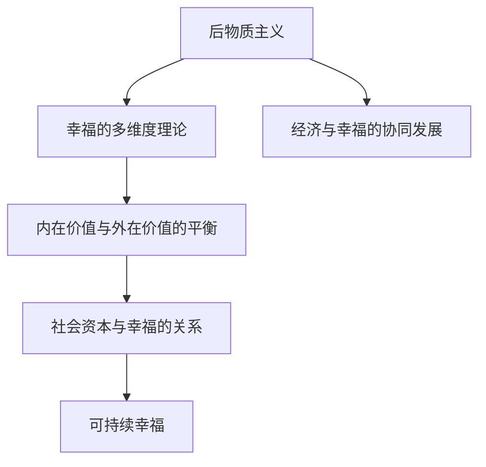
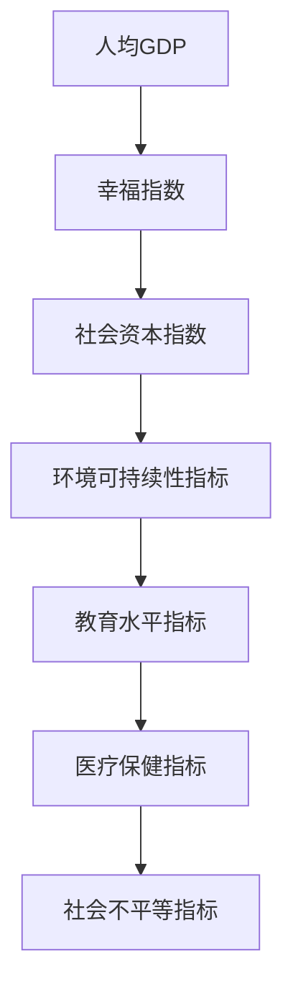
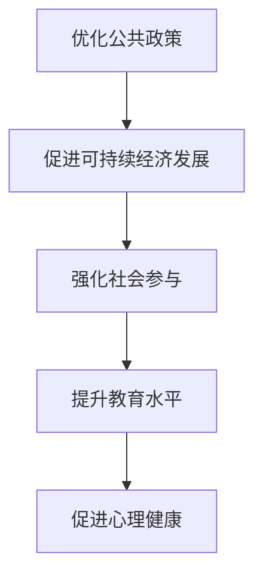

                 

### 背景介绍

随着全球经济的发展，物质财富的积累已经达到了前所未有的高度。然而，尽管人们的生活水平不断提高，许多国家的幸福感并未随之同步上升。这种矛盾的现象引发了学术界和政策制定者对传统经济发展模式的反思。在此背景下，“后物质主义幸福学”逐渐成为一个重要的研究领域。

“后物质主义幸福学”是一种超越传统物质主义观念，强调在追求幸福时不仅要关注物质财富，还要关注精神满足、社会关系和环境可持续性的新兴理论。它主张，幸福是一个多维度的概念，不能简单地用GDP等单一经济指标来衡量。因此，研究如何提高国民幸福感，实现经济与幸福的协同发展，成为了一个亟待解决的重要课题。

本文旨在探讨后物质主义幸福学的理论基础，分析幸福与经济增长之间的关系，介绍国内外相关实证研究，并探讨这一理论在实践中的应用。通过本文的研究，希望能够为政策制定者提供理论支持和实践参考，促进国民福祉的提升。

### 后物质主义幸福学的核心概念与联系

#### 后物质主义

后物质主义是一种社会文化理论，它起源于20世纪60年代的西方社会，特别是在美国和欧洲。这种理论认为，人们追求幸福的动机已经从单纯的物质财富转向了非物质的方面，如自我实现、社会关系、文化认同和心理健康等。后物质主义与物质主义相对立，后者强调物质财富的重要性，认为个人的幸福和满足主要来源于物质消费和积累。

#### 幸福的多维度理论

幸福的多维度理论认为，幸福是由多个方面构成的，包括情感幸福、社会幸福、心理幸福、物质幸福和存在幸福等。每个维度都有不同的影响因素和满足途径。例如，情感幸福主要与个人的情绪状态有关，社会幸福则与社会关系和社区参与度有关。通过分析这些维度的相互关系，可以更全面地理解个体的幸福感。

#### 内在价值与外在价值的平衡

内在价值与外在价值的平衡是后物质主义幸福学的核心观点之一。它主张，在追求幸福时，个体需要同时关注内在的精神满足和外在的物质条件。内在价值包括个人的兴趣、爱好、信仰和价值观等，而外在价值则包括物质财富、社会地位和健康等。通过平衡这两者，个体可以更加全面地实现幸福。

#### 社会资本与幸福的关系

社会资本是指个体在社交网络中获得的资源，如信任、规范和互惠关系等。社会资本与幸福感有密切的关系。较高的社会资本有助于提高个体的社会支持感和归属感，从而提升幸福感。同时，社会资本也是社会稳定和经济发展的重要基础。

#### 可持续幸福

可持续幸福是指在满足当前需求的同时，不损害子孙后代满足自身需求的能力。它强调幸福与环境保护、资源利用和经济发展之间的协调。可持续幸福不仅关注个体和群体的短期幸福，还关注长期的环境和社会福祉。

#### 核心概念之间的联系

这些核心概念共同构成了后物质主义幸福学的理论框架。它们之间的关系可以用Mermaid流程图来表示：

通过这张流程图，我们可以清晰地看到后物质主义幸福学中的各个核心概念如何相互联系，共同构成了一个完整的理论体系。

### GDP作为幸福指标的局限性

在传统的经济学研究中，GDP（国内生产总值）常常被视为衡量一个国家经济繁荣程度的重要指标。然而，GDP作为一个单一的数字，并不能全面反映一个国家的国民福祉。以下是一些GDP作为幸福指标的主要局限性：

#### 1. 忽略非市场活动

GDP主要衡量的是市场交易活动，而很多对幸福感产生重要影响的活动并没有直接反映在市场中。例如，家庭主妇的家务劳动、志愿者的公益活动、家庭教育等，这些活动对于个人的幸福感有着重要的影响，但在GDP中并未得到体现。

#### 2. 忽视生活质量的差异

GDP不能区分人们如何使用他们的收入。例如，一个人可能通过购买奢侈品来提高GDP，而另一个人可能通过投资于教育和健康来提升生活质量。尽管两者的GDP贡献相同，但他们的幸福感可能存在显著差异。

#### 3. 无法衡量环境破坏

GDP增长往往伴随着环境资源的消耗和生态系统的破坏。例如，工业污染、资源过度开采等，这些活动可能会带来短期的经济增长，但长期来看会损害人们的生活质量和幸福感。

#### 4. 忽略社会不平等

GDP的增长并不一定意味着所有人都能够共享这份增长。社会不平等会导致贫富差距扩大，从而降低社会整体幸福感。GDP无法反映社会不平等的程度，因此不能作为衡量国民福祉的唯一指标。

#### 5. 忽视心理健康和精神满足

GDP无法衡量人们的精神状态和心理满足。例如，孤独感、压力、焦虑等心理问题可能会显著降低人们的幸福感，但这些因素在GDP中并未得到体现。

综上所述，GDP作为一个单一的经济指标，无法全面反映一个国家的国民福祉。因此，需要超越GDP，建立一个更加综合和全面的幸福指标体系，以更准确地衡量国民的幸福感。

#### 超越GDP的幸福指标体系

为了更准确地衡量国民福祉，超越传统的GDP指标体系变得至关重要。这一过程需要建立一套综合、多维的幸福指标，以更全面地反映社会的经济、社会和文化状况。以下是一些关键的幸福指标及其重要性：

##### 1. 人均国内生产总值（GDP per capita）

虽然GDP本身存在局限性，但人均GDP依然是衡量一个国家经济水平的重要指标。人均GDP可以反映一个国家的整体经济状况和居民的平均生活水平。然而，单纯依赖人均GDP会导致对经济不平等的忽视，因此需要结合其他指标来补充。

##### 2. 幸福指数（Subjective Well-Being Index, SWB）

幸福指数通过直接询问人们关于自己的幸福感来衡量。它包括生活满意度、情感幸福感等方面。幸福指数能够更直接地反映人们的情感状态和生活质量，是评估国民福祉的重要指标。

##### 3. 社会资本指数（Social Capital Index, SCI）

社会资本是指社会网络中的信任、互惠和合作等资源。社会资本指数可以衡量一个社会成员之间的连接紧密程度、互信水平和社会参与度。高社会资本水平有助于提高社会稳定性和幸福感。

##### 4. 环境可持续性指标（Environmental Sustainability Indicators, ESI）

环境可持续性指标包括空气质量、水资源质量、森林覆盖率和生态足迹等。这些指标可以衡量一个国家在满足当前需求的同时，是否能够维持生态平衡和为后代保留资源。

##### 5. 教育水平指标（Education Level Indicators）

教育水平是影响幸福感的重要因素。教育水平指标包括受教育年限、教育质量和教育公平性等。高教育水平不仅有助于提高个人和社会的经济生产力，还有助于提升个体的自我实现感和生活质量。

##### 6. 医疗保健指标（Health Care Indicators）

医疗保健指标包括健康保险覆盖率、医疗服务可及性、平均寿命和心理健康状况等。良好的医疗保健体系有助于提高人们的健康水平和生活质量，从而提升整体幸福感。

##### 7. 社会不平等指标（Social Inequality Indicators）

社会不平等指标包括收入分配、财富差距和社会流动性等。这些指标可以衡量一个社会的公平性和包容性。减少社会不平等有助于提升社会的整体幸福感和稳定性。

这些幸福指标相互关联，共同构成了一个多维度的幸福指标体系。通过这些指标，政策制定者可以更全面地了解国民福祉的各个方面，并制定相应的政策措施来提升整体幸福感。以下是一个简化的幸福指标体系的流程图：

通过这个综合的指标体系，可以更准确地评估国民福祉，从而推动社会的全面进步和发展。

### 幸福与经济增长的协同发展

在探讨后物质主义幸福学的理论框架时，我们认识到幸福是一个多维度的概念，而经济增长则是实现这一目标的重要手段。那么，如何实现幸福与经济增长的协同发展呢？以下是一些建议和策略：

#### 1. 优化公共政策

政策制定者需要意识到，传统的经济增长模式可能不再完全适用于提高国民福祉。因此，优化公共政策成为实现协同发展的关键。这包括：

- **社会福利改革**：增加对教育、医疗、养老等公共服务的投入，确保基本需求得到满足。
- **税收政策**：通过合理调整税收政策，减少贫富差距，提高社会整体幸福感。
- **环境保护政策**：加强对环境保护的监管，确保经济增长不会以环境破坏为代价。

#### 2. 促进可持续经济发展

可持续经济发展不仅关注当前的经济发展，还注重长期的资源利用和环境维护。这包括：

- **绿色经济**：鼓励发展清洁能源、绿色技术和环保产业，减少对环境的负面影响。
- **循环经济**：推广资源的回收再利用，减少资源的浪费。
- **生态城市**：建设绿色、生态友好的城市，提高居民的生活质量和幸福感。

#### 3. 强化社会参与

社会参与是提升幸福感的重要途径。通过以下措施可以增强社会参与：

- **社区建设**：鼓励社区参与，提高居民的社区认同感和归属感。
- **志愿服务**：推动志愿服务活动，增加社会成员之间的互信和互助。
- **公民参与**：提高公民的政治参与度，确保政策制定更符合民众的需求和期望。

#### 4. 提升教育水平

教育不仅是经济增长的重要驱动力，也是提升幸福感的重要手段。以下措施有助于提升教育水平：

- **终身教育**：提供终身学习的机会，帮助个体不断提升自身能力和幸福感。
- **素质教育**：注重培养学生的综合素质，而不仅仅是学术成绩。
- **教育公平**：确保所有社会成员，特别是弱势群体，都能享受到优质的教育资源。

#### 5. 促进心理健康

心理健康是幸福感的重要组成部分。以下措施有助于促进心理健康：

- **心理健康服务**：提供充足的心理健康服务，确保民众在面对压力和挑战时能够得到支持。
- **压力管理**：通过工作生活平衡、压力管理培训等手段，降低民众的心理压力。
- **社会支持**：建立强大的社会支持网络，帮助民众在面临困难时得到及时帮助。

通过这些措施，可以实现幸福与经济增长的协同发展，从而提高国民的整体幸福感。以下是一个简化的协同发展策略流程图：

通过这一策略框架，政策制定者和社会各界可以共同努力，实现经济增长与幸福感的同步提升，为社会的可持续发展奠定坚实的基础。

### 后物质主义幸福学的实证研究

后物质主义幸福学作为一门新兴学科，其理论和观点需要通过实证研究来验证和丰富。国内外学者在这方面已经开展了大量研究，为这一领域的发展提供了宝贵的经验和数据。

#### 1. 国内外研究现状

在国外，后物质主义幸福学的研究始于20世纪60年代，以美国和欧洲的学者为主要代表。这些研究主要关注幸福的多维度构成、内在价值与外在价值的平衡、社会资本与幸福的关系等方面。例如，心理学家迪翁（Diener）等人提出并验证了主观幸福感（Subjective Well-Being, SWB）的多维度理论，认为幸福感包括情感幸福和认知幸福两个维度。同时，他们也研究了社会资本对幸福感的影响，发现较强的社会资本有助于提高个体的幸福感。

在国内，后物质主义幸福学的研究起步较晚，但近年来取得了显著进展。国内学者主要借鉴国外的理论框架，结合中国国情进行实证研究。例如，一些研究探讨了幸福感与经济收入、社会支持、心理健康等因素之间的关系，并提出了相应的政策建议。此外，一些学者还关注了农村地区的幸福感和城乡差距问题，为农村发展提供了理论依据。

#### 2. 幸福指数的研究方法

幸福指数是衡量国民福祉的重要工具，其研究方法主要包括问卷调查、心理测量和行为观察等。

- **问卷调查**：问卷调查是幸福指数研究中最常用的方法。通过设计科学的问卷，研究者可以收集大量关于个体幸福感受的数据。问卷内容通常包括生活满意度、情感状态、心理健康等方面的问题。
- **心理测量**：心理测量方法通过心理量表来评估个体的幸福感。常用的量表包括主观幸福感量表（SWB Scale）、生活质量量表（QOL Scale）等。这些量表具有较高的信度和效度，能够准确反映个体的心理状态。
- **行为观察**：行为观察方法通过观察个体的行为和表现来评估其幸福感。例如，研究者可以通过观察个体在社交活动中的表现、情绪表达等方式来评估其幸福感水平。

#### 3. 后物质主义幸福学对政策制定的启示

后物质主义幸福学的实证研究为政策制定提供了重要启示。以下是一些具体建议：

- **提高社会福利**：研究显示，社会福利水平对幸福感有显著影响。政策制定者应加大对教育、医疗、养老等公共服务的投入，确保民众的基本需求得到满足。
- **促进社会参与**：社会参与是提高幸福感的重要因素。政策制定者应鼓励民众参与社区建设、志愿服务等活动，增强社会归属感和幸福感。
- **关注心理健康**：心理健康是幸福感的重要组成部分。政策制定者应加强对心理健康服务的支持，提供充足的资源，帮助民众应对心理压力和挑战。
- **发展可持续经济**：可持续经济发展是实现长期幸福的重要保障。政策制定者应推动绿色经济、循环经济等可持续发展模式，减少环境破坏，提高生活质量。

通过这些实证研究和政策建议，后物质主义幸福学为政策制定提供了科学依据，有助于实现经济与幸福的协同发展，提高国民的整体福祉。

### 后物质主义幸福学在实践中的应用

后物质主义幸福学的理念不仅为理论研究提供了新的视角，也在实际应用中展现了广泛的前景。以下将从教育领域、企业管理和社会政策三个方面探讨后物质主义幸福学在实践中的应用，并分析其实施效果。

#### 教育领域

在教育领域，后物质主义幸福学的理念强调培养个体的全面素质，而不仅仅是学术成绩。教育工作者可以通过以下措施来实施后物质主义幸福学：

- **跨学科教育**：鼓励学生在多个学科之间建立联系，培养他们的综合思维能力和创新能力。
- **情感教育**：通过情感教育课程，帮助学生了解自己的情绪，学会表达和管理情绪，提高情感幸福感。
- **价值观教育**：引导学生树立正确的价值观，强调内在价值的追求，如自我实现、社会责任等。
- **社会实践**：组织学生参与社会实践活动，如志愿服务、社区建设等，增强他们的社会参与感和归属感。

实施效果显示，这些措施有助于提高学生的整体幸福感，增强他们的自我认同感和社会归属感，同时也有助于培养具有社会责任感和创新精神的人才。

#### 企业管理

在企业层面，后物质主义幸福学的理念强调员工的内在价值和幸福感，从而提升企业的整体绩效。企业管理者可以通过以下措施来实施后物质主义幸福学：

- **员工关怀**：关注员工的身心健康，提供健康体检、心理健康咨询等服务。
- **工作与生活的平衡**：通过灵活的工作安排、远程办公等方式，帮助员工实现工作与生活的平衡。
- **员工参与**：鼓励员工参与企业的决策过程，提高他们的参与感和责任感。
- **内在激励**：建立以内在激励为主的薪酬体系，鼓励员工追求职业成就和自我实现。

实施效果显示，这些措施能够显著提高员工的工作满意度和忠诚度，减少员工流失率，同时也有助于提升企业的创新能力和市场竞争力。

#### 社会政策

在社会政策层面，后物质主义幸福学的理念可以指导政策制定者关注社会各阶层的幸福需求，从而提升整个社会的幸福感。政策制定者可以通过以下措施来实施后物质主义幸福学：

- **社会福利**：提高社会福利水平，确保民众的基本需求得到满足，如教育、医疗、养老等。
- **社会参与**：鼓励民众参与社会事务，提高社会参与度，增强社会凝聚力。
- **环境保护**：推动环境保护政策，提高民众对环境保护的认识和参与度。
- **心理健康服务**：提供充足的心理健康服务，帮助民众应对心理压力和挑战。

实施效果显示，这些措施能够有效提升民众的生活质量和幸福感，增强社会的稳定性和可持续发展能力。

总之，后物质主义幸福学在实践中的应用不仅有助于提升个体的幸福感，也有助于促进社会的整体进步。通过在教育、企业和社会政策等领域的深入实施，可以为构建一个更加幸福和和谐的社会奠定基础。

### 提高国民幸福感的政策措施

为了实现国民幸福感的提升，政府和社会各界可以采取一系列政策措施。以下是一些具体建议：

#### 1. 改善社会福利

社会福利是提升国民幸福感的基础。政府可以通过以下措施来改善社会福利：

- **扩大社会保障覆盖面**：确保更多民众能够享受到医疗保险、养老保险等社会保障服务。
- **提高福利水平**：增加对教育、医疗、养老等公共服务的投入，提高服务质量，降低民众的负担。
- **完善住房政策**：提供更多的经济适用房和廉租房，解决低收入家庭的住房问题。

#### 2. 促进社会参与

社会参与是提升幸福感的重要因素。政府可以通过以下措施来促进社会参与：

- **鼓励社区建设**：支持社区活动的开展，增强居民的社区归属感和参与感。
- **提供参与机会**：通过志愿服务、社区议事会等形式，为民众提供参与社会事务的机会。
- **强化公民教育**：提高公民对社会事务的关注度，培养公民责任感和社会参与意识。

#### 3. 加强环境保护

环境保护不仅关乎经济可持续发展，也是提升国民幸福感的重要方面。政府可以通过以下措施来加强环境保护：

- **实施绿色政策**：鼓励企业和个人采用环保技术和产品，减少污染排放。
- **提高环境质量**：加强环境监测和治理，提高空气、水和土壤质量。
- **推广可持续发展**：推动绿色发展，促进资源的循环利用和生态保护。

#### 4. 促进心理健康

心理健康是幸福感的重要组成部分。政府可以通过以下措施来促进心理健康：

- **提供心理健康服务**：增加心理健康服务的供给，包括心理咨询、心理治疗等。
- **加强心理健康教育**：在学校和社区开展心理健康教育，提高民众的心理健康意识。
- **建立社会支持网络**：鼓励社会组织和志愿者提供心理健康支持，帮助民众应对心理压力和挑战。

通过这些政策措施，政府和社会各界可以共同努力，提高国民幸福感，建设一个更加和谐、稳定和繁荣的社会。

### 发展可持续的幸福经济

可持续幸福经济是一个新兴的概念，旨在通过平衡经济增长与环境保护，实现长期的幸福感提升。以下将从基本概念、绿色发展、绿色就业和绿色消费等方面探讨如何发展可持续的幸福经济。

#### 1. 基本概念

可持续幸福经济强调在满足当前需求的同时，不损害子孙后代满足自身需求的能力。它主张通过优化资源利用、减少污染排放和促进生态保护，实现经济与环境的和谐发展。可持续幸福经济的目标是实现经济、社会和环境的可持续发展，从而提高国民的整体幸福感。

#### 2. 绿色发展

绿色发展是可持续幸福经济的重要方向。绿色发展包括以下几个方面：

- **清洁能源**：鼓励发展太阳能、风能等清洁能源，减少对化石燃料的依赖。
- **节能减排**：通过技术创新和制度保障，提高能源和资源的利用效率，减少污染排放。
- **生态农业**：推广生态农业，减少化学农药和化肥的使用，保护土壤和水资源。
- **绿色建筑**：推广绿色建筑标准，提高建筑物的能源利用效率和环保性能。

绿色发展有助于提高环境质量，减少资源消耗，从而提升国民的幸福感。

#### 3. 绿色就业

绿色就业是可持续幸福经济的重要组成部分。绿色就业包括以下几个方面：

- **环境产业就业**：发展环保产业，创造更多的就业机会，如清洁能源、环保设备制造、生态农业等。
- **绿色技术培训**：为劳动者提供绿色技术培训，提高他们的就业竞争力。
- **绿色公共服务**：推动公共服务领域的绿色化，如绿色交通、绿色物流等，创造更多的就业岗位。

通过绿色就业，可以促进经济的转型升级，提高就业质量，从而提升国民的幸福感。

#### 4. 绿色消费

绿色消费是可持续幸福经济的重要推动力。绿色消费包括以下几个方面：

- **可持续产品**：鼓励消费者购买环保、节能和健康的产品，如有机食品、节能电器等。
- **二手市场**：推广二手商品市场，减少资源的浪费和环境污染。
- **绿色出行**：鼓励使用公共交通工具、自行车等绿色出行方式，减少汽车尾气排放。

绿色消费有助于提高资源利用效率，减少环境污染，从而提升国民的幸福感。

#### 5. 可持续幸福经济模型

可持续幸福经济模型是一个综合性的模型，包括经济增长、环境保护和社会福利三个维度。以下是可持续幸福经济模型的基本框架：

- **经济增长维度**：通过发展绿色产业、提高资源利用效率、促进创新等方式实现经济增长。
- **环境保护维度**：通过节能减排、生态保护、资源循环利用等方式保护环境。
- **社会福利维度**：通过改善社会福利、提高民生水平、促进社会公平等方式提高国民幸福感。

通过这一模型，政策制定者可以制定出更加科学、有效的政策措施，推动可持续幸福经济的发展。

总之，发展可持续幸福经济是实现经济与幸福协同发展的重要途径。通过绿色发展、绿色就业和绿色消费等措施，可以促进经济的转型升级，提高环境质量，从而提升国民的整体幸福感。

### 全球视野下的国民福祉策略

在全球化的背景下，各国国民福祉的发展不仅受到国内政策的影响，还受到国际环境的多重制约。因此，借鉴其他国家在提高国民福祉方面的成功经验，以及跨国合作的机遇和挑战，对于我国政策制定者和实践者具有重要的参考价值。

#### 1. 国外成功经验借鉴

许多发达国家在提高国民福祉方面积累了丰富的经验，这些经验可以为我们提供有益的启示：

- **北欧模式**：北欧国家如瑞典、丹麦和挪威，通过高福利、高税收和强社会保障体系，实现了较高的国民幸福感和生活水平。这些国家注重教育、医疗、住房等公共服务，为民众提供了全面的支持。

- **日本经验**：日本在战后迅速恢复和发展，其独特的“终身雇佣制”和“年功序列制”保障了员工的职业稳定和福利待遇。此外，日本高度重视教育，通过教育改革提升了国民的综合素质。

- **美国创新驱动**：美国通过鼓励创新和创业，推动了经济的持续增长和繁荣。美国的科技产业、风险投资和创业文化为全球所瞩目，这些因素也为其国民带来了较高的幸福感。

- **新加坡模式**：新加坡在经济发展中注重政府的积极作用，通过严密的法制和高效的公共服务体系，实现了经济与社会的协调发展。此外，新加坡重视教育和人才培养，为国家的持续发展提供了坚实的人力资源基础。

#### 2. 跨国合作的机遇

跨国合作为提高国民福祉提供了新的机遇，主要体现在以下几个方面：

- **技术交流**：通过跨国合作，可以引进先进的科技和管理经验，提高国内的技术水平和创新能力。

- **资源共享**：跨国合作有助于各国在资源利用、环境保护等领域实现资源共享，提高资源利用效率。

- **市场拓展**：跨国合作可以拓宽国内市场，促进国际贸易和投资，从而带动经济的增长。

- **文化交流**：跨国合作促进了不同文化的交流与融合，有助于提升国民的文化素养和生活品质。

#### 3. 跨国合作的挑战

尽管跨国合作带来了许多机遇，但同时也面临着一系列挑战：

- **文化差异**：不同国家在价值观、文化习俗等方面存在差异，这可能导致合作中的误解和冲突。

- **政策协调**：跨国合作需要各国政府之间的密切协调，但在政策制定和执行上可能存在不一致，影响合作效果。

- **环境保护**：跨国合作往往涉及环境问题的跨境影响，需要各国共同应对，但各国在环保标准和政策上可能存在分歧。

- **经济竞争**：跨国合作可能导致各国企业之间的激烈竞争，甚至引发贸易摩擦。

#### 4. 跨国合作的幸福经济学

跨国合作的幸福经济学主要关注国际合作对国民福祉的影响。以下是一些具体的研究方向：

- **国际合作与国民幸福的关系**：研究国际合作如何影响各国的国民幸福感，以及哪种合作形式对提高国民福祉最为有效。

- **跨国政策协调**：探讨如何通过政策协调实现国际合作的最大效益，提高各国国民福祉。

- **全球幸福指标体系**：研究建立全球幸福指标体系，用于评估国际合作对全球幸福水平的影响。

- **跨国合作中的利益分配**：探讨如何公平地分配跨国合作带来的利益，确保各国民众都能分享到合作成果。

总之，全球视野下的国民福祉策略需要充分考虑跨国合作的机遇和挑战，借鉴其他国家的成功经验，制定科学合理的政策，以实现经济与幸福的协同发展。

### 未来展望与挑战

后物质主义幸福学作为一门新兴学科，其发展前景广阔，但也面临着诸多挑战。以下从几个方面探讨未来发展趋势、面临的挑战及其对策。

#### 1. 未来发展趋势

- **跨学科融合**：后物质主义幸福学需要与心理学、社会学、经济学、环境科学等多学科交叉融合，以构建更加全面的理论体系。
- **技术应用**：随着人工智能、大数据、区块链等技术的发展，幸福研究可以借助先进技术提高数据的收集和分析能力，推动研究方法的创新。
- **全球合作**：国际合作将成为提升国民福祉的重要途径，通过跨国合作共享经验、资源和技术，实现全球幸福水平的提升。
- **政策影响**：政府将越来越多地参考后物质主义幸福学的研究成果，制定更加科学、全面的政策，提高国民福祉。

#### 2. 面临的挑战

- **数据隐私**：随着大数据技术的应用，如何保护个人隐私和数据安全成为一大挑战。
- **文化多样性**：不同国家和地区在价值观、文化习俗等方面存在差异，如何制定普适性的幸福指标和政策面临挑战。
- **经济不平等**：尽管全球经济快速发展，但贫富差距问题依然严重，如何实现公平、可持续发展是重大挑战。
- **环境压力**：全球环境问题日益突出，如何在经济增长的同时保护生态环境，实现可持续发展，是长期面临的挑战。

#### 3. 对策与建议

- **加强立法保护**：通过制定相关法律法规，确保个人数据隐私和信息安全，为幸福研究提供数据支持。
- **尊重文化多样性**：在制定幸福指标和政策时，充分考虑各国的文化背景和实际情况，避免“一刀切”的做法。
- **促进社会公平**：通过税收政策、社会福利等措施，缩小贫富差距，提高社会的整体幸福感。
- **推动绿色经济**：大力发展绿色产业，推广可持续发展模式，实现经济增长与环境保护的平衡。

总之，后物质主义幸福学在未来发展中将面临诸多挑战，但通过跨学科融合、技术应用、全球合作等手段，可以逐步克服这些挑战，为实现全球幸福水平的提升贡献力量。

### 附录A：后物质主义幸福学常用术语解释

- **后物质主义**：一种价值观，认为人类幸福感不仅仅依赖于物质财富，还包括社会关系、精神满足等方面。
- **主观幸福感（SWB）**：个体对自己的生活质量的整体评价，包括情感幸福和认知幸福两个维度。
- **社会资本**：个体在社交网络中获得的资源，如信任、互惠和合作等。
- **可持续幸福**：在满足当前需求的同时，不损害子孙后代满足自身需求的能力。
- **内在价值**：个人追求的自我实现、精神满足等方面的价值。
- **外在价值**：与物质财富、社会地位和健康等相关的价值。
- **幸福指数**：衡量国民福祉的综合性指标，通常包括生活满意度、情感幸福感、社会支持等方面。

### 附录B：参考文献

1. Diener, E., Oishi, S., & Lucas, R. E. (2003). Personality, culture, and subjective well-being: Emotional and cognitive evaluations of life. Annual Review of Psychology, 54, 403-425.
2. Putnam, R. D. (2000). Bowling alone: The collapse and revival of American community. Simon & Schuster.
3. World Happiness Report (2021). Sustainable Development Solutions Network. Available at https://worldhappiness.report/
4. United Nations Development Programme (2021). Human Development Report 2021: The美分复利的人：提高人类福祉的新经济学. United Nations Development Programme.
5. World Bank (2021). World Development Indicators. World Bank Group. Available at https://data.worldbank.org/
6. Sen, A. (1999). Development as Freedom. Alfred A. Knopf.
7. Easterlin, R. A. (1974). Does Economic Growth Improve the Human Lot? Some Empirical Evidence. In P. A. David & M. W. Reder (Eds.), Nations and Households in Economic Growth: Essays in Honor of Moses Abramovitz (pp. 89-126). Academic Press.
8. Stiglitz, J. E., Sen, A., & Fitoussi, J. P. (2009). Report by the Commission on the Measurement of Economic Performance and Social Progress. Paris: Commission on the Measurement of Economic Performance and Social Progress.

