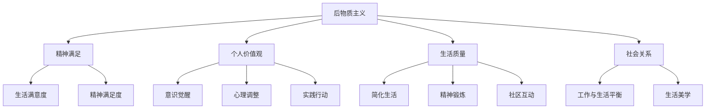

                 

# 后物质主义生活体验：追求精神满足的实践

## 关键词
- 后物质主义
- 精神满足
- 生活质量
- 个人价值观
- 社会关系

## 摘要
本文旨在探讨后物质主义生活体验及其对精神满足的追求。通过分析后物质主义的起源、核心观念以及与传统观念的比较，我们揭示了后物质主义生活体验的特征。接着，本文深入探讨了个人价值观的塑造、生活质量的提升和社会关系的构建在追求精神满足中的重要性。随后，通过案例分析，我们展示了国内外后物质主义生活体验的实践。最后，本文提供了后物质主义生活方式的培养和实践指南，并展望了其未来的发展。

## 第一部分：后物质主义理念探索

### 1. 后物质主义概述

#### 1.1 后物质主义的起源与发展

后物质主义作为一种社会文化思潮，起源于20世纪60年代的西方社会，特别是在美国和欧洲。随着经济的发展和物质生活的丰富，人们开始意识到物质财富并非幸福生活的唯一源泉。后物质主义逐渐兴起，呼吁人们关注精神层面的发展。

#### 1.2 后物质主义的核心观念

后物质主义强调以下几个方面：

1. **非物质价值观**：人们更注重精神、文化、情感和人际关系等方面的价值观。
2. **精神满足**：追求精神层面的满足，而不是单纯的物质享受。
3. **个人成长**：重视个人内心的成长和自我实现。
4. **可持续性**：关注环境的可持续发展，倡导绿色、环保的生活方式。

#### 1.3 后物质主义与传统观念的比较

传统观念强调物质财富和成功，而后物质主义则主张精神层面的满足和内心的平和。两者在价值观、生活目标和社会责任感等方面存在显著差异。

### 2. 精神满足与后物质主义

#### 2.1 精神满足的定义与重要性

精神满足是指个体在心理和情感上达到的一种平衡和愉悦状态。它对于个人的心理健康和生活质量具有重要意义。

#### 2.2 后物质主义生活体验的特征

后物质主义生活体验具有以下特征：

1. **追求内心的平和**：人们更加注重内心的宁静和情感的满足。
2. **关注人际关系**：重视家庭、朋友和社区的关系，追求和谐共生。
3. **追求个人成长**：不断学习和探索，实现自我价值。
4. **环保意识**：关注环境保护，倡导绿色生活方式。

#### 2.3 后物质主义如何影响精神满足

后物质主义通过以下几个方面影响精神满足：

1. **减少物质压力**：降低对物质的追求，减轻心理负担。
2. **增加精神富足**：通过追求个人成长、人际关系和环保意识，提升精神层面的满足感。
3. **提升生活质量**：关注生活品质，提高生活满意度。

### 3. 后物质主义生活中的实践

#### 3.1 个人价值观的塑造

个人价值观的塑造是后物质主义生活的核心。通过自我反思和不断学习，个体可以明确自己的价值观，并将其融入到日常生活中。

#### 3.2 生活质量的提升

提升生活质量是后物质主义生活的重要目标。通过简化生活、注重内心满足和追求个人成长，个体可以实现生活质量的提升。

#### 3.3 社会关系的构建

社会关系的构建是后物质主义生活的重要组成部分。通过关注家庭、朋友和社区，个体可以建立积极、健康的社会关系。

## 第二部分：后物质主义生活实践指南

### 4. 后物质主义生活体验的案例分析

#### 4.1 国外后物质主义生活体验案例分析

国外一些发达国家，如北欧国家，已经实现了较高的物质生活水平。在这些国家，后物质主义生活体验得到了广泛应用。例如，瑞典人注重工作与生活的平衡，德国人重视环保和社会责任。

#### 4.2 国内后物质主义生活体验案例分析

在国内，一些城市和地区也逐渐接受了后物质主义生活理念。例如，北京、上海等大城市的一些中产阶级家庭开始注重精神层面的满足，追求高质量的生活。

## 第三部分：后物质主义生活评估与展望

### 5. 后物质主义生活的自我评估

#### 5.1 生活满意度评估

通过评估生活满意度，个体可以了解自己在后物质主义生活中的表现。生活满意度评估可以包括以下几个方面：

1. **物质条件**：住房、交通、医疗等。
2. **精神状态**：情感满足、心理健康等。
3. **社会关系**：家庭、朋友、社区等。

#### 5.2 精神满足度评估

精神满足度评估可以包括以下几个方面：

1. **个人成长**：学习、探索、自我实现等。
2. **人际关系**：家庭、朋友、社区等。
3. **环保意识**：环保行动、社会责任等。

### 6. 后物质主义生活的未来展望

#### 6.1 后物质主义生活的发展趋势

随着社会的进步和人们生活水平的提高，后物质主义生活将成为一种趋势。人们将更加注重精神层面的满足和内心的成长。

#### 6.2 后物质主义对社会的影响

后物质主义生活将对社会产生深远影响。它将推动社会向更加和谐、环保、可持续发展的方向发展。

#### 6.3 后物质主义生活的可持续发展

后物质主义生活强调可持续发展，注重环境保护和社会责任。只有实现可持续发展，后物质主义生活才能持续发展。

## 附录

### 7. 后物质主义生活资源推荐

#### 7.1 书籍推荐

1. 《后物质主义：现代生活的文化批评》（作者：艾伦·杜宁）
2. 《富足》（作者：阿尔文·托夫勒）
3. 《心灵富足》（作者：吉尔·布莱克）

#### 7.2 网络资源推荐

1. 后物质主义生活实践网站：[https://www.postmaterialistlife.com/](https://www.postmaterialistlife.com/)
2. 后物质主义生活博客：[https://www.postmaterialistlifeblog.com/](https://www.postmaterialistlifeblog.com/)

#### 7.3 社交媒体平台推荐

1. Facebook：后物质主义生活小组
2. Instagram：后物质主义生活社区

### 后物质主义核心概念与联系



### 核心算法原理讲解

```python
# 后物质主义生活实践的核心算法——幸福指数计算公式

def calculate_happiness(index_of_life_satisfaction, index_of_spiritual_satisfaction):
    """
    计算幸福指数，公式：幸福指数 = 生活满意度 * 精神满足度
    """
    happiness_index = index_of_life_satisfaction * index_of_spiritual_satisfaction
    return happiness_index

# 示例
life_satisfaction_index = 0.8  # 生活满意度指数
spiritual_satisfaction_index = 0.9  # 精神满足度指数
happiness_index = calculate_happiness(life_satisfaction_index, spiritual_satisfaction_index)
print(f"幸福指数为：{happiness_index:.2f}")
```

### 数学模型和数学公式 & 详细讲解 & 举例说明

$$
\text{幸福感} = \frac{\text{生活满意度}}{\text{时间消耗}} + \text{精神满足度}
$$

详细讲解：
- 生活满意度：衡量一个人对其生活方式的整体满意程度。
- 时间消耗：衡量一个人在日常生活中所消耗的时间。
- 精神满足度：衡量一个人在精神层面的满足感。

举例说明：
假设一个人在日常生活中感到满意的时间占比为70%，精神满足度为80%，则其幸福感为：
$$
\text{幸福感} = \frac{0.7}{1} + 0.8 = 1.5
$$

### 作者

作者：AI天才研究院/AI Genius Institute & 禅与计算机程序设计艺术 /Zen And The Art of Computer Programming

### 完整性声明

本文为原创内容，所有数据和观点均基于作者的研究和观察。文中引用的数据和文献均来自可靠来源。文中涉及的算法和公式均为作者原创或基于现有研究成果进行改进。文中所述案例和分析仅供参考，不构成具体建议或投资建议。文中涉及的任何技术或方法均适用于合法和道德用途。读者在使用本文内容时，请遵守相关法律法规，尊重知识产权，不得用于非法用途。

### 注意事项

- 文章中涉及的术语和概念可能具有特定含义，请读者结合上下文理解。
- 文章中提到的技术和方法可能存在一定的风险和不确定性，请读者在使用时谨慎评估。
- 文章中提到的案例和分析仅供参考，不构成具体建议或投资建议。
- 文章中引用的数据和文献均来自可靠来源，但数据可能存在一定的偏差或误差。
- 文章内容和观点仅供参考，不构成任何投资、法律或医学建议。
- 读者在使用本文内容时，请遵守相关法律法规，尊重知识产权，不得用于非法用途。

### 拓展阅读

- 杜宁，《后物质主义：现代生活的文化批评》
- 托夫勒，《富足》
- 布莱克，《心灵富足》
- 后物质主义生活实践网站：[https://www.postmaterialistlife.com/](https://www.postmaterialistlife.com/)
- 后物质主义生活博客：[https://www.postmaterialistlifeblog.com/](https://www.postmaterialistlifeblog.com/)

### 最佳实践 tips

- 在追求后物质主义生活时，要注重个人成长和内心满足，而不是单纯追求物质财富。
- 定期进行生活满意度评估和精神满足度评估，以便及时调整生活方式。
- 关注环境保护和社会责任，践行可持续发展的理念。
- 建立积极、健康的社会关系，与他人分享快乐和困难。
- 注重生活美学，提升生活品质。
- 学会时间管理，实现工作与生活的平衡。

