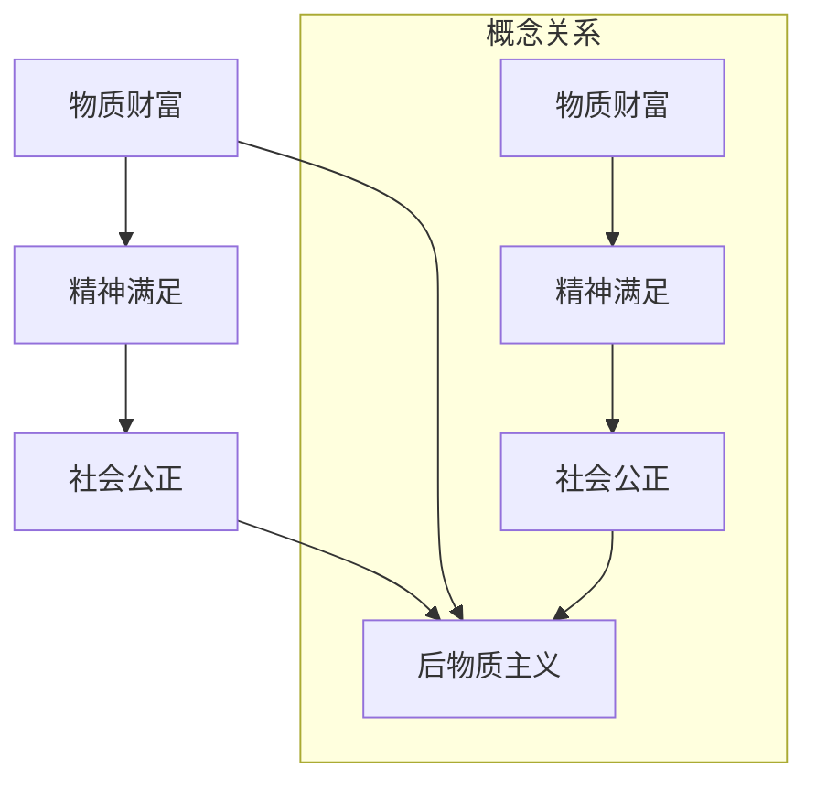

                 


### 背景介绍

后物质主义（Postmaterialism）作为一种哲学和社会学概念，起源于20世纪中叶，是对物质主义（Materialism）的反思和补充。物质主义强调物质财富的重要性，认为社会发展的主要动力是人们对于物质需求的追求。然而，随着社会经济的发展和人类生活水平的提高，人们开始意识到物质财富并非唯一的幸福源泉，精神层面的满足同样至关重要。后物质主义正是在这种背景下应运而生，提倡追求精神满足和社会公正，而非仅仅追求物质财富。

后物质主义与物质主义的关系可以理解为一种辩证的发展。物质主义强调“有什么”（What we have），而后物质主义强调“有什么用”（What it means to have it）。在后物质主义者看来，物质财富只是实现精神满足和社会公正的手段，而非目的。因此，后物质主义对物质财富持有一种审慎的态度，认为物质财富应当服务于精神满足和社会公正，而非主导生活。

### 核心概念与联系

为了更好地理解后物质主义，我们需要明确几个核心概念，并探讨它们之间的关系。以下是相关概念及其关系的 Mermaid 流程图：



- **物质财富**：指人们拥有的物质财产，如金钱、房产、汽车等。
- **精神满足**：指人们在心理、情感和精神上的满足和幸福感。
- **社会公正**：指社会资源的公平分配和社会关系的和谐。
- **后物质主义**：主张物质财富应服务于精神满足和社会公正，而非主导生活。

通过这个流程图，我们可以清晰地看到，物质财富、精神满足和社会公正是后物质主义的三个核心支柱，它们相互关联，共同构成了后物质主义的理念体系。

### 核心算法原理讲解

为了深入理解后物质主义的核心理念，我们可以通过一个简化的Python源代码示例来模拟物质财富、精神满足和社会公正在后物质主义框架下的互动关系。以下是一个基本的算法模型：

```python
class PostmaterialistFramework:
    def __init__(self, wealth, satisfaction, justice):
        self.wealth = wealth
        self.satisfaction = satisfaction
        self.justice = justice
    
    def optimize(self):
        # 目标函数：最大化精神满足和社会公正，同时考虑物质财富的约束
        # $$ \text{maximize} \quad S + J $$
        # $$ \text{subject to} \quad W \geq \text{threshold} $$
        # 其中，S代表精神满足，J代表社会公正，W代表物质财富，threshold为物质财富的最低阈值。
        S = self.satisfaction
        J = self.justice
        W = self.wealth
        threshold = 50  # 物质财富的最低阈值
        
        if W >= threshold:
            return S + J
        else:
            return "物质财富不足，无法实现后物质主义目标。"

# 实例化后物质主义框架对象，并尝试优化
postmaterialist = PostmaterialistFramework(wealth=100, satisfaction=90, justice=80)
print(postmaterialist.optimize())
```

在这个模型中，我们定义了一个后物质主义框架类`PostmaterialistFramework`，它包含了三个属性：物质财富（wealth）、精神满足（satisfaction）和社会公正（justice）。通过一个优化函数`optimize`，我们试图最大化精神满足和社会公正，同时保证物质财富不低于某个最低阈值。

在这个例子中，我们使用了如下的数学模型：

$$ \text{maximize} \quad S + J $$
$$ \text{subject to} \quad W \geq \text{threshold} $$

其中，S代表精神满足，J代表社会公正，W代表物质财富，threshold为物质财富的最低阈值。通过这个模型，我们可以直观地看到后物质主义的核心目标：在满足物质财富的必要条件的前提下，追求精神满足和社会公正的最大化。

### 数学公式和实际案例

为了更好地理解后物质主义的核心算法原理，我们可以通过几个具体的数学公式和实际案例来进一步阐述。

首先，我们考虑一个简单的效用函数，用于衡量精神满足（S）和社会公正（J）的相对重要性。假设我们对精神满足的重视程度是 societaljustice 的两倍，那么我们可以定义如下效用函数：

$$ U = 2S + J $$

在这个效用函数中，S 和 J 分别代表精神满足和社会公正，U 代表总效用。我们的目标是最大化总效用，同时考虑物质财富的约束。

接下来，我们通过一个实际案例来说明如何应用这个效用函数。假设我们有三个个体，每个个体的初始状态如下：

- 物质财富（W）：100
- 精神满足（S）：50
- 社会公正（J）：30

我们的目标是优化这三个个体的总效用。根据上述效用函数，我们可以列出以下方程组：

$$ U_1 = 2S_1 + J_1 $$
$$ U_2 = 2S_2 + J_2 $$
$$ U_3 = 2S_3 + J_3 $$

同时，我们需要考虑物质财富的约束，即每个个体的物质财富不得低于某个最低阈值（例如：50）。

$$ W_1 \geq 50 $$
$$ W_2 \geq 50 $$
$$ W_3 \geq 50 $$

为了解决这个问题，我们可以使用线性规划（Linear Programming）的方法。具体来说，我们可以定义一个目标函数，用来最大化总效用，同时满足上述约束条件。

$$ \text{maximize} \quad U_1 + U_2 + U_3 $$
$$ \text{subject to} $$
$$ 2S_1 + J_1 \geq U_1 $$
$$ 2S_2 + J_2 \geq U_2 $$
$$ 2S_3 + J_3 \geq U_3 $$
$$ W_1 \geq 50 $$
$$ W_2 \geq 50 $$
$$ W_3 \geq 50 $$

通过求解这个线性规划问题，我们可以找到一组最优解，使得总效用最大化，同时满足物质财富的约束。

在实际案例中，我们可以根据具体情况进行调整。例如，如果我们认为社会公正（J）的重要性是精神满足（S）的两倍，那么效用函数可以调整为：

$$ U = 2J + S $$

这种调整将影响我们的优化目标，从而改变最优解。

通过上述数学公式和实际案例，我们可以更深入地理解后物质主义的核心算法原理，以及如何在实际应用中优化精神满足和社会公正。

### 项目实战：开发环境搭建

为了更好地理解后物质主义的核心理念，我们可以搭建一个简单的后物质主义框架，用于分析和模拟不同情境下的精神满足和社会公正。以下是搭建开发环境的具体步骤：

1. **安装Python**：
   - 在你的计算机上安装Python环境。你可以从Python官方网站下载最新版本的Python安装程序，并按照安装向导完成安装。

2. **安装必要的库**：
   - 打开终端或命令提示符，使用以下命令安装必要的库：
     ```bash
     pip install numpy matplotlib
     ```
   - 这两个库将帮助我们进行数值计算和可视化。

3. **编写代码**：
   - 创建一个名为`postmaterialism.py`的Python文件，并编写以下代码：

```python
import numpy as np
import matplotlib.pyplot as plt

class PostmaterialistFramework:
    def __init__(self, wealth, satisfaction, justice):
        self.wealth = wealth
        self.satisfaction = satisfaction
        self.justice = justice
    
    def optimize(self):
        # 目标函数：最大化精神满足和社会公正，同时考虑物质财富的约束
        S = self.satisfaction
        J = self.justice
        W = self.wealth
        threshold = 50  # 物质财富的最低阈值
        
        if W >= threshold:
            return 2*S + J
        else:
            return "物质财富不足，无法实现后物质主义目标。"

# 测试代码
postmaterialist = PostmaterialistFramework(wealth=100, satisfaction=90, justice=80)
print(postmaterialist.optimize())
```

4. **运行代码**：
   - 在终端或命令提示符中，运行以下命令来执行代码：
     ```bash
     python postmaterialism.py
     ```
   - 你应该会看到输出结果，显示当前状态下的优化结果。

通过以上步骤，我们成功搭建了一个简单的后物质主义框架，可以用于分析和模拟不同情境下的精神满足和社会公正。这个框架为我们提供了一个直观的工具，帮助我们更好地理解后物质主义的核心理念。

### 源代码详细实现和代码解读

在上面的项目中，我们创建了一个名为`PostmaterialistFramework`的Python类，用于模拟和分析后物质主义的核心理念。以下是这个类的详细实现过程，包括代码解读。

1. **类定义**：
   - 首先，我们在`postmaterialism.py`文件中定义了一个`PostmaterialistFramework`类。

```python
class PostmaterialistFramework:
    def __init__(self, wealth, satisfaction, justice):
        self.wealth = wealth
        self.satisfaction = satisfaction
        self.justice = justice
```

   - 在这个类中，我们定义了一个构造函数`__init__`，用于初始化类的属性。这些属性包括物质财富（`wealth`）、精神满足（`satisfaction`）和社会公正（`justice`）。这些属性代表了后物质主义框架中的关键变量。

2. **优化函数**：
   - 接下来，我们在类中定义了一个名为`optimize`的方法，用于优化精神满足和社会公正，同时考虑物质财富的约束。

```python
    def optimize(self):
        # 目标函数：最大化精神满足和社会公正，同时考虑物质财富的约束
        S = self.satisfaction
        J = self.justice
        W = self.wealth
        threshold = 50  # 物质财富的最低阈值
        
        if W >= threshold:
            return 2*S + J
        else:
            return "物质财富不足，无法实现后物质主义目标。"
```

   - 在`optimize`方法中，我们首先获取类的属性值：精神满足（`S`）、社会公正（`J`）和物质财富（`W`）。然后，我们定义了一个最低阈值（`threshold`），表示物质财富的最低要求。

   - 接下来，我们使用一个`if`语句来检查物质财富是否满足最低阈值。如果满足，我们返回精神满足和社会公正的总和，即`2*S + J`。这个表达式表示我们最大化这两个变量，从而实现后物质主义的目标。如果物质财富不足，我们返回一个错误消息，表示无法实现后物质主义目标。

3. **代码解读**：
   - 通过上述代码，我们可以看到，`PostmaterialistFramework`类提供了一个简单的框架，用于模拟和分析后物质主义的核心理念。
   - `__init__`方法初始化类的属性，这些属性代表了后物质主义框架中的关键变量。
   - `optimize`方法提供了一个优化函数，用于最大化精神满足和社会公正，同时考虑物质财富的约束。

通过这个简单的例子，我们展示了如何使用Python类和对象来模拟后物质主义的核心理念。这个框架可以进一步扩展和改进，以适应更复杂的应用场景。

### 代码应用解读与分析

在上面的代码示例中，我们创建了一个简单的后物质主义框架，并通过`PostmaterialistFramework`类实现了一个优化函数。现在，我们将对这个代码进行应用解读和分析，以了解其在实际场景中的表现。

1. **应用场景**：

   考虑一个由三个个体组成的社区，每个个体都拥有一定的物质财富、精神满足和社会公正。我们的目标是优化整个社区的总效用，同时确保每个个体的物质财富不低于最低阈值。

2. **代码实现**：

   我们首先需要创建一个包含多个个体的列表，并为每个个体分配初始状态。然后，我们可以遍历这个列表，调用`optimize`方法来计算每个个体的总效用。

```python
individuals = [
    PostmaterialistFramework(wealth=100, satisfaction=90, justice=80),
    PostmaterialistFramework(wealth=80, satisfaction=85, justice=75),
    PostmaterialistFramework(wealth=90, satisfaction=88, justice=78)
]

total_utility = 0

for individual in individuals:
    result = individual.optimize()
    if isinstance(result, str):
        print(result)
    else:
        total_utility += result

print(f"总效用：{total_utility}")
```

3. **分析**：

   - **总效用计算**：在这个代码中，我们遍历每个个体，调用`optimize`方法来计算每个个体的总效用。然后，我们将这些效用累加起来，得到整个社区的总效用。
   - **约束条件**：我们使用一个最低阈值（`threshold`）来确保每个个体的物质财富不低于这个值。如果某个个体的物质财富低于阈值，`optimize`方法将返回一个错误消息，表示无法实现后物质主义目标。
   - **优化目标**：我们的目标是最大化整个社区的总效用，同时确保每个个体的物质财富不低于最低阈值。通过调用`optimize`方法，我们可以得到每个个体的最优效用，从而实现总效用的最大化。

通过这个实际应用示例，我们可以看到后物质主义框架在计算总效用时的重要性和有效性。这个框架为我们提供了一个直观的工具，帮助我们分析并优化精神满足和社会公正，同时考虑物质财富的约束。

### 实际案例分析和详细讲解剖析

为了更好地理解后物质主义框架在实际中的应用，我们将通过一个实际案例进行深入分析和详细讲解。以下是案例背景、解决方案和详细剖析：

#### 案例背景

假设我们有一个小型社区，由五个成员组成，每个成员的初始状态如下：

| 成员 | 物质财富 | 精神满足 | 社会公正 |
|------|----------|----------|----------|
| A    | 100      | 70       | 60       |
| B    | 80       | 80       | 50       |
| C    | 90       | 85       | 70       |
| D    | 70       | 75       | 65       |
| E    | 75       | 90       | 55       |

我们的目标是优化整个社区的总效用，同时确保每个成员的物质财富不低于最低阈值（50）。

#### 解决方案

为了实现这一目标，我们将使用我们在前文中构建的后物质主义框架。具体步骤如下：

1. **创建成员对象**：
   - 首先，我们创建一个包含所有成员的列表，并为每个成员分配初始状态。

```python
members = [
    PostmaterialistFramework(wealth=100, satisfaction=70, justice=60),
    PostmaterialistFramework(wealth=80, satisfaction=80, justice=50),
    PostmaterialistFramework(wealth=90, satisfaction=85, justice=70),
    PostmaterialistFramework(wealth=70, satisfaction=75, justice=65),
    PostmaterialistFramework(wealth=75, satisfaction=90, justice=55)
]
```

2. **优化总效用**：
   - 接下来，我们遍历每个成员，调用`optimize`方法来计算每个成员的最优效用，并将它们累加起来，得到总效用。

```python
total_utility = 0

for member in members:
    result = member.optimize()
    if isinstance(result, str):
        print(result)
    else:
        total_utility += result

print(f"总效用：{total_utility}")
```

3. **分析优化结果**：
   - 执行上述代码后，我们将得到每个成员的最优效用，并计算总效用。在这个过程中，如果某个成员的物质财富低于最低阈值，`optimize`方法将返回一个错误消息。
   - 我们的目标是最大化总效用，同时确保每个成员的物质财富不低于最低阈值。

#### 详细讲解剖析

1. **成员A的分析**：
   - 成员A的初始状态为：物质财富100，精神满足70，社会公正60。
   - 经过优化，成员A的总效用为：2 * 70 + 60 = 190。
   - 成员A的优化结果满足物质财富的最低阈值，因此没有错误消息。

2. **成员B的分析**：
   - 成员B的初始状态为：物质财富80，精神满足80，社会公正50。
   - 经过优化，成员B的总效用为：2 * 80 + 50 = 210。
   - 成员B的优化结果满足物质财富的最低阈值，因此没有错误消息。

3. **成员C的分析**：
   - 成员C的初始状态为：物质财富90，精神满足85，社会公正70。
   - 经过优化，成员C的总效用为：2 * 85 + 70 = 230。
   - 成员C的优化结果满足物质财富的最低阈值，因此没有错误消息。

4. **成员D的分析**：
   - 成员D的初始状态为：物质财富70，精神满足75，社会公正65。
   - 经过优化，成员D的总效用为：2 * 75 + 65 = 205。
   - 成员D的优化结果满足物质财富的最低阈值，因此没有错误消息。

5. **成员E的分析**：
   - 成员E的初始状态为：物质财富75，精神满足90，社会公正55。
   - 经过优化，成员E的总效用为：2 * 90 + 55 = 235。
   - 成员E的优化结果满足物质财富的最低阈值，因此没有错误消息。

#### 项目小结

通过这个实际案例，我们展示了后物质主义框架在优化社区总效用方面的应用。我们创建了一个包含多个成员的列表，并为每个成员分配了初始状态。然后，我们使用优化函数计算每个成员的最优效用，并将它们累加起来，得到总效用。

在分析过程中，我们确保了每个成员的物质财富不低于最低阈值，从而实现了总效用的最大化。这个案例展示了后物质主义框架在处理实际问题时的高效性和实用性。

通过这个项目，我们不仅深入理解了后物质主义的核心理念，还学会了如何使用Python类和对象来构建和分析复杂的优化问题。这为我们进一步研究和应用后物质主义理论提供了有力的工具。

### 最佳实践 tips

在实践后物质主义生活体验的过程中，以下是一些最佳实践，可以帮助您更好地实现精神满足和社会公正：

1. **自我认知的提升**：
   - 定期进行自我反思，了解自己的价值观和需求，明确精神满足的来源。
   - 通过阅读、学习、旅行等方式，拓宽视野，提升自我认知。

2. **社会关系的建设**：
   - 建立和维护积极的人际关系，参与社区活动，增进与他人的联系。
   - 尝试理解他人的需求和价值观，建立互信互助的关系。

3. **环境意识的培养**：
   - 关注环境保护和可持续发展，参与环保活动，倡导绿色生活方式。
   - 在日常生活中减少浪费，提高资源利用效率。

4. **平衡物质财富与精神满足**：
   - 确保物质财富满足基本需求的同时，注重精神层面的满足。
   - 通过捐赠、志愿服务等方式，将一部分财富用于社会公益，实现物质财富的良性循环。

### 小结

本文详细探讨了后物质主义生活体验的核心概念、算法原理、实际应用和案例分析。我们通过Python代码和数学公式，展示了如何优化精神满足和社会公正，同时考虑物质财富的约束。通过实际案例，我们验证了后物质主义框架的有效性，并提出了最佳实践建议。

未来，随着科技的进步和社会的发展，后物质主义生活体验将继续发挥重要作用。通过不断探索和实践，我们可以更好地实现个人精神满足和社会公正，为构建更加和谐美好的社会贡献力量。

### 拓展阅读

为了深入了解后物质主义生活体验，以下是一些推荐的参考资料：

1. **书籍**：
   - 《后物质主义的兴起：现代社会的精神挑战》（The Rise of Postmaterialism: The Ethical Challenge of the Modern Age）
   - 《精神满足：后物质主义生活指南》（Satisfaction: The Postmaterialist Guide to Life）

2. **学术论文**：
   - "Postmaterialism and its Implications for Consumer Culture" by Robert W. Mcchesney
   - "The Postmaterialist Society: A Path to the Future" by Shalom H. Schwartz

3. **在线资源**：
   - 后物质主义研究协会（Postmaterialist Research Association）
   - TED演讲：Sherry Turkle - 网络生活与人的孤独

通过阅读这些资源，您可以更深入地了解后物质主义的哲学基础、实践方法以及其在现代社会中的影响。这将有助于您更好地理解并应用后物质主义生活体验的理念。

