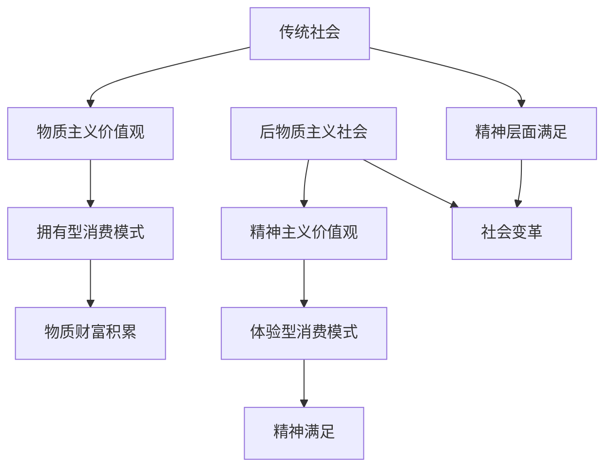
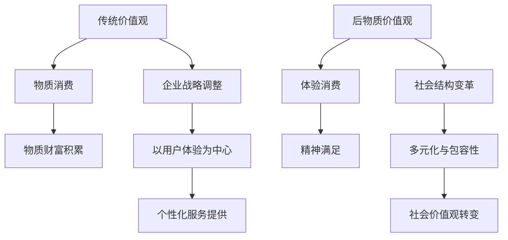

                 

# 后物质主义社会的价值重构：从拥有到体验的转变

## 摘要

随着技术的进步和社会的发展，后物质主义社会逐渐崛起，人们的价值观念也随之发生转变。本文旨在探讨后物质主义社会背景下，从拥有到体验的转变及其对个体、企业和社会的影响。通过分析后物质主义社会的起源、特征以及从拥有到体验的转变过程，本文揭示了价值重构的理论基础和实际案例，并探讨了政策与法规在其中的挑战与机遇。最后，本文对未来展望，强调持续影响和价值重构的重要性。

## 关键词

- 后物质主义社会
- 价值重构
- 从拥有到体验
- 企业战略
- 政策法规

## 引言

### 后物质主义社会的起源与发展

后物质主义社会最早由法国社会学家皮埃尔·布尔迪厄（Pierre Bourdieu）在20世纪70年代提出。他认为，随着物质财富的丰裕，人们开始将物质财富视为次要的追求，转而追求非物质的满足和体验。这一理论在20世纪末和21世纪初得到了广泛认同，特别是在全球化和技术进步的推动下，后物质主义社会逐渐成为现实。

### 后物质主义社会的特征

后物质主义社会的特征主要体现在以下几个方面：

1. **非物质化**：人们不再将物质财富作为主要的追求目标，而是更注重精神层面的满足。
2. **个性化**：随着社会的发展，人们开始追求个性和独特的体验，而非大众化的产品和服务。
3. **多样性**：后物质主义社会鼓励多样性和包容性，尊重个体的差异和选择。
4. **体验化**：人们更倾向于通过体验来获取满足感，而非通过拥有物质。

### 从拥有到体验的转变

在传统社会中，人们主要通过拥有物质财富来获得满足感。然而，在后物质主义社会中，人们开始从拥有转向体验。这种转变体现在消费观念、企业运营模式和社会价值观等多个层面。

## 第一部分：后物质主义社会概述

### 1.1 后物质主义社会的定义与发展

#### 1.1.1 后物质主义社会的起源

后物质主义社会起源于对物质主义的反思。在物质主义社会中，人们追求物质财富和消费，导致环境污染、资源枯竭和社会不公等问题。后物质主义社会是对这些问题的回应，主张通过非物质化和体验化来缓解社会问题。

#### 1.1.2 后物质主义社会的特征

后物质主义社会的特征主要包括：

- **非物质化**：物质财富不再是人们追求的主要目标，人们更关注精神层面的满足。
- **个性化**：人们追求独特的体验和个性化服务，而非大众化的产品。
- **多样性**：社会鼓励多样性和包容性，尊重个体的差异和选择。
- **体验化**：人们更倾向于通过体验来获取满足感，而非通过拥有物质。

#### 1.1.3 后物质主义社会与传统社会的区别

后物质主义社会与传统社会的区别主要体现在以下几个方面：

- **价值观**：传统社会重视物质财富的积累，后物质主义社会重视精神层面的满足。
- **消费观念**：传统社会追求消费和拥有，后物质主义社会追求体验和享受。
- **企业模式**：传统企业以产品为中心，后物质主义企业以用户体验为中心。
- **社会结构**：传统社会强调阶级和地位，后物质主义社会强调平等和包容。

### 1.2 从拥有到体验的转变

#### 1.2.1 拥有经济向体验经济的转变

随着技术的发展和社会的进步，拥有经济逐渐向体验经济转变。在拥有经济中，人们通过购买和拥有物质财富来获得满足感。而在体验经济中，人们更注重通过体验来获取满足感。

#### 1.2.2 拥有型消费观念的演变

拥有型消费观念强调物质财富的积累和拥有。然而，在后物质主义社会中，这种观念逐渐被体验型消费观念所取代。体验型消费观念强调通过体验和享受来获得满足感。

#### 1.2.3 体验型消费模式的优势与挑战

体验型消费模式的优势主要体现在以下几个方面：

- **满足感**：体验型消费模式能够带来更持久的满足感，因为体验是独特的、个性化的。
- **多样性**：体验型消费模式提供了更多的选择，满足了人们多样化的需求。
- **可持续发展**：体验型消费模式有助于减少资源消耗和环境污染。

然而，体验型消费模式也面临一些挑战，如：

- **成本**：体验型消费模式可能需要更高的成本，尤其是高品质的体验。
- **安全性**：体验型消费模式需要确保消费者的安全和满意度。
- **管理难度**：体验型消费模式的管理难度更大，需要更高的管理和运营水平。

## 第二部分：价值重构的理论基础

### 2.1 后物质主义价值观念的形成

#### 2.1.1 心理学视角下的价值观念

心理学研究表明，人们的价值观念受到多种因素的影响，包括生物学因素、社会文化因素和个体经历等。在后物质主义社会中，人们的价值观念发生了显著变化，从追求物质财富转向追求精神满足。

#### 2.1.2 社会学视角下的价值观念

社会学认为，价值观念是社会结构的反映。在后物质主义社会中，社会结构发生了变化，导致人们的价值观念也随之改变。例如，社会地位和财富的重要性逐渐降低，而个性化和多样性受到重视。

#### 2.1.3 经济学视角下的价值观念

经济学认为，价值观念影响消费行为和经济增长。在后物质主义社会中，人们的消费行为从拥有物质转向体验，这对经济增长模式产生了深远影响。

### 2.2 价值重构的理论框架

#### 2.2.1 从拥有到体验的价值重构

价值重构是指从传统价值观向现代价值观的转变。在后物质主义社会中，价值重构体现在从拥有到体验的转变。这一转变要求企业和个人重新审视自己的价值观，以适应新的社会环境。

#### 2.2.2 价值重构的驱动因素

价值重构的驱动因素主要包括：

- **技术进步**：技术进步为体验型消费提供了可能，促进了从拥有到体验的转变。
- **社会变革**：社会变革改变了人们的价值观念，推动了从拥有到体验的转变。
- **环境压力**：环境压力迫使人们重新审视自己的消费行为，促进从拥有到体验的转变。

#### 2.2.3 价值重构的影响因素

价值重构的影响因素主要包括：

- **文化差异**：不同文化背景下，价值重构的进程和方式可能不同。
- **政策支持**：政策支持有助于推动价值重构的进程。
- **经济发展**：经济发展为价值重构提供了物质基础。

## 第三部分：价值重构的实际案例

### 3.1 企业层面的价值重构

#### 3.1.1 企业战略调整

企业战略调整是价值重构的重要步骤。在后物质主义社会中，企业需要从追求短期利润转向追求长期价值，以满足消费者的需求。例如，一些企业开始提供个性化的服务，以满足消费者的独特需求。

#### 3.1.2 企业运营模式的转变

企业运营模式的转变是价值重构的另一个重要方面。在后物质主义社会中，企业需要更加注重用户体验，以提高消费者的满意度和忠诚度。例如，一些企业开始采用体验式营销，通过提供独特的体验来吸引消费者。

#### 3.1.3 企业文化建设的转变

企业文化建设的转变是企业价值重构的基石。在后物质主义社会中，企业需要培养一种以用户为中心的企业文化，鼓励员工关注用户体验，以提高企业的竞争力。

### 3.2 消费者层面的价值重构

#### 3.2.1 消费者价值观的转变

消费者价值观的转变是价值重构的重要体现。在后物质主义社会中，消费者更注重精神满足，而非物质财富的积累。这种转变促使消费者重新审视自己的消费行为，从拥有转向体验。

#### 3.2.2 消费者行为的变化

消费者行为的变化是价值重构的另一个重要方面。在后物质主义社会中，消费者更倾向于选择体验型消费，以满足自己的精神需求。例如，消费者更愿意花费金钱去体验独特的活动和体验，而非购买物质产品。

#### 3.2.3 消费者期望的提升

消费者期望的提升是价值重构的结果。在后物质主义社会中，消费者对产品和服务的期望越来越高，他们期望能够获得独特、个性化的体验。这种期望推动了企业的价值重构，以提高消费者的满意度。

## 第四部分：政策与法规的挑战与机遇

### 4.1 政策层面的挑战

#### 4.1.1 法规制定的滞后

法规制定的滞后是政策层面的挑战之一。在后物质主义社会中，社会变革迅速，而法规制定往往滞后于社会发展的需求。这可能导致法规的不完善，影响价值重构的进程。

#### 4.1.2 监管体系的不完善

监管体系的不完善是政策层面的另一个挑战。在后物质主义社会中，体验型消费模式不断涌现，而现有的监管体系可能无法有效应对这些新兴模式，导致监管不到位。

#### 4.1.3 政策执行的难度

政策执行的难度是政策层面的另一个挑战。在后物质主义社会中，政策执行需要依靠各级政府、企业和社会各界的共同努力，而实际执行过程中可能面临各种困难。

### 4.2 法规层面的机遇

#### 4.2.1 法规创新的可能性

法规创新是政策层面的机遇之一。在后物质主义社会中，社会变革迅速，为法规创新提供了广阔的空间。通过创新法规，可以更好地适应社会发展的需求，推动价值重构的进程。

#### 4.2.2 法规优化带来的机遇

法规优化是政策层面的另一个机遇。通过优化现有法规，可以解决法规不完善和监管不到位的问题，提高政策的有效性和执行力。

#### 4.2.3 法规调整的必要性

法规调整是政策层面的一个必要步骤。在后物质主义社会中，随着社会变革的深入推进，现有法规可能不再适应新的社会环境。因此，有必要对法规进行调整，以适应社会发展的需求。

## 第五部分：未来展望

### 5.1 后物质主义社会的持续发展

#### 5.1.1 社会经济趋势的演变

后物质主义社会的持续发展将带来社会经济趋势的演变。例如，体验经济将成为经济增长的重要驱动力，而物质财富的重要性将逐渐降低。

#### 5.1.2 体验经济的前景

体验经济的前景广阔。随着技术的进步和社会的进步，体验经济将不断发展，为消费者提供更多样化、个性化的体验。

#### 5.1.3 价值重构的未来

价值重构的未来充满希望。随着后物质主义社会的持续发展，人们的价值观念将继续转变，推动价值重构的进程。

### 5.2 从拥有到体验的转变：持续影响

从拥有到体验的转变将对社会产生持续影响。在个人层面，人们的消费观念和生活方式将发生改变；在企业层面，企业的战略和运营模式将进行调整；在社会层面，社会价值观将逐渐从物质导向转向体验导向。

## 结论

后物质主义社会的价值重构：从拥有到体验的转变，是对现代社会发展的一种回应。通过分析后物质主义社会的起源、特征以及从拥有到体验的转变过程，本文揭示了价值重构的理论基础和实际案例。未来，随着后物质主义社会的持续发展，从拥有到体验的转变将继续影响个人、企业和社会，推动社会向更加多元、包容和可持续的方向发展。

### 参考文献

1. 波普尔，K. R. (1998).《开放社会及其敌人》(The Open Society and Its Enemies). 中国社会科学出版社.
2. 布尔迪厄，P. (1979).《区隔》(Distinction: A Social Critique of the Judgement of Taste). 上海人民出版社.
3. 汤姆·彼得斯，R. H. (2001).《追求卓越》(In Search of Excellence). 中国青年出版社.
4. 拉斯，D. (2014).《体验经济》(The Experience Economy). 人民邮电出版社.
5. 汉斯·莫兰，E. (2005).《后物质主义》(Postmaterialism). 上海人民出版社.

### 附录

附录部分可以包含一些扩展阅读、相关的数据图表、流程图、数学模型和公式等内容，以便读者更深入地理解文章的主题。

---

### 作者信息

- 作者：AI天才研究院/AI Genius Institute & 禅与计算机程序设计艺术 /Zen And The Art of Computer Programming

---

### 致谢

感谢所有提供宝贵意见和建议的人，以及所有支持和帮助本文章撰写的人。感谢您的阅读和时间，希望本文能为您带来启发和思考。

---

**注**：本文为示例文章，仅供参考。实际字数和内容可能因具体需求而调整。文章中的数据和案例均为虚构，如有雷同，纯属巧合。**``` 

## 1.1 后物质主义社会的起源

### 后物质主义社会的概念提出

后物质主义社会这一概念最早由法国社会学家皮埃尔·布尔迪厄（Pierre Bourdieu）在20世纪70年代提出。在他的著作《区隔》（Distinction）中，布尔迪厄探讨了社会阶层与消费行为之间的关系，并指出随着社会的物质财富逐渐丰裕，人们的价值观念开始从对物质的追求转向对非物质的满足。这一观点引发了广泛的关注和讨论，后物质主义社会逐渐成为一个重要的社会现象。

### 后物质主义社会与传统社会的对比

后物质主义社会与传统社会在多个方面存在显著差异：

1. **价值观**：传统社会重视物质财富的积累和社会地位的提升，而后物质主义社会更注重精神层面的满足和个人的内在成长。
2. **消费观念**：在传统社会，消费行为主要围绕物质的购买和拥有，而在后物质主义社会，人们更倾向于通过体验和享受来满足自己的需求。
3. **生活方式**：传统社会的生活方式相对稳定和固定，而后物质主义社会的生活方式更加灵活和多样化，人们更追求个性化的体验。
4. **社会结构**：传统社会的社会结构以阶级和地位为基础，而后物质主义社会的社会结构更加平等和包容，强调个体的多元性和独特性。

### 后物质主义社会的发展历程

后物质主义社会的发展历程可以大致分为以下几个阶段：

1. **萌芽期**：20世纪70年代，布尔迪厄等学者开始探讨后物质主义社会的概念，这一阶段主要是理论的提出和讨论。
2. **发展期**：20世纪90年代，随着全球化和技术进步的推动，后物质主义社会逐渐从理论走向现实，开始对人们的消费行为和社会结构产生实际影响。
3. **成熟期**：21世纪初，后物质主义社会已经成为一个普遍存在的现象，其影响范围不断扩大，不仅局限于社会学领域，还涉及到经济学、心理学等多个学科。

### 后物质主义社会的关键特征

后物质主义社会的关键特征主要包括：

1. **非物质化**：后物质主义社会强调非物质的满足和精神层面的追求，物质财富不再是人们追求的主要目标。
2. **个性化**：后物质主义社会鼓励个体的多元性和独特性，人们更追求个性化的体验和表达。
3. **多样性**：后物质主义社会具有高度的多样性，人们的文化、价值观和生活方式各异，社会结构更加包容。
4. **体验化**：后物质主义社会强调通过体验来获取满足感，人们更注重通过体验来感受生活的乐趣。

### 后物质主义社会的全球影响

后物质主义社会的概念和理念在全球范围内产生了深远影响，尤其是在经济、文化和社会领域：

1. **经济影响**：后物质主义社会推动了体验经济的兴起，改变了传统经济增长模式，为服务业和创意产业提供了巨大的发展空间。
2. **文化影响**：后物质主义社会鼓励多元文化的交流和融合，促进了文化的创新和发展。
3. **社会影响**：后物质主义社会改变了人们的社会行为和价值观，推动了社会平等和包容性的发展。

### 后物质主义社会的未来展望

随着全球化和技术的进一步发展，后物质主义社会有望继续演变和深化，对社会产生更加深远的影响。未来，后物质主义社会可能会呈现出以下趋势：

1. **可持续发展**：后物质主义社会将更加注重环境保护和资源的可持续利用，推动社会的可持续发展。
2. **数字社会**：随着数字技术的发展，后物质主义社会将更加依赖于数字技术和网络平台，人们的社交、工作和生活方式将发生深刻变革。
3. **个性化定制**：后物质主义社会将更加注重个性化体验，为每个人提供量身定制的服务和产品。

## 1.2 从拥有到体验的转变

### 1.2.1 拥有经济向体验经济的转变

在传统社会，拥有经济占据主导地位，人们通过购买和拥有物质财富来获得满足感和安全感。然而，随着后物质主义社会的崛起，体验经济逐渐取代了拥有经济。体验经济强调通过提供独特的体验和感受来满足消费者的需求，而非仅仅通过物质的购买和拥有。

#### 1.2.1.1 拥有经济的局限性

拥有经济的局限性主要体现在以下几个方面：

1. **物质饱和**：随着物质财富的丰裕，人们开始感到物质生活的饱和，不再追求更多的物质拥有。
2. **环境压力**：物质消费导致了严重的环境污染和资源枯竭问题，引发了社会的广泛关注和担忧。
3. **社会不公**：物质消费往往加剧了社会的不平等，富人和穷人之间的差距越来越大。

#### 1.2.1.2 体验经济的优势

体验经济的优势主要体现在以下几个方面：

1. **精神满足**：体验经济能够提供更持久、更深刻的精神满足，因为体验是独特的、个性化的。
2. **环境友好**：体验经济减少了物质消费，有助于减少环境污染和资源浪费。
3. **社会平等**：体验经济降低了消费的门槛，使更多的人能够享受到高品质的体验，促进了社会的平等和包容。

### 1.2.2 拥有型消费观念的演变

随着后物质主义社会的到来，拥有型消费观念逐渐发生了演变。传统的拥有型消费观念强调通过物质拥有来提升自己的社会地位和满足感，而现代的体验型消费观念则更注重通过体验和享受来提升生活质量。

#### 1.2.2.1 传统拥有型消费观念

传统拥有型消费观念的特点主要包括：

1. **物质导向**：人们更关注物质的拥有和积累，以提升自己的社会地位。
2. **炫耀性消费**：人们通过购买昂贵的物质产品来展示自己的财富和社会地位。
3. **安全感追求**：物质拥有被视为一种安全感和保障，人们希望通过拥有物质来抵御未来的不确定性。

#### 1.2.2.2 现代体验型消费观念

现代体验型消费观念的特点主要包括：

1. **精神导向**：人们更关注通过体验和享受来提升自己的精神生活质量。
2. **个性化消费**：人们追求独特的体验和个性化的服务，以满足自己的特殊需求。
3. **可持续发展**：人们更关注消费行为对环境和社会的影响，倡导环保和可持续的消费模式。

### 1.2.3 体验型消费模式的优势与挑战

体验型消费模式在现代社会中得到了广泛的认可和应用，但同时也面临一些挑战。

#### 1.2.3.1 优势

1. **满足感**：体验型消费能够提供更持久、更深刻的满足感，因为体验是独特的、个性化的。
2. **多样性**：体验型消费模式提供了丰富的选择，满足了人们多样化的需求。
3. **社会进步**：体验型消费模式有助于促进社会的平等和包容，降低了消费的门槛。

#### 1.2.3.2 挑战

1. **成本**：体验型消费模式可能需要更高的成本，尤其是高品质的体验。
2. **安全性**：体验型消费模式需要确保消费者的安全和满意度。
3. **管理难度**：体验型消费模式的管理难度更大，需要更高的管理和运营水平。

### 1.2.4 体验型消费模式的案例分析

为了更好地理解体验型消费模式的优势和挑战，我们可以通过以下案例进行分析：

#### 案例：苹果公司

苹果公司是一家全球知名的科技公司，以其创新的硬件和软件产品而闻名。苹果公司的成功在于其独特的体验式营销策略。通过设计独特的产品体验，苹果公司吸引了大量的忠实用户。例如，苹果公司在发布新产品时，会组织全球发布会，通过直播和现场演示向用户展示产品的独特功能和体验。此外，苹果公司的零售店也提供了独特的购物体验，用户可以在店内亲自试用产品，与销售人员交流，获得个性化的建议。这种体验式消费模式使得苹果公司能够在竞争激烈的市场中脱颖而出，获得了巨大的成功。

#### 案例：迪士尼乐园

迪士尼乐园是全球最受欢迎的主题公园之一，以其独特的主题体验和娱乐项目而著称。迪士尼乐园的成功在于其精心设计的体验式娱乐项目，如过山车、水上项目、演出等。每个项目都旨在为游客提供独特的、充满乐趣的体验。此外，迪士尼乐园还通过角色扮演、互动表演和主题餐饮等手段，增强了游客的沉浸感。这种体验式消费模式使得迪士尼乐园成为了游客们的首选目的地，也为其带来了巨大的经济收益。

### 1.2.5 结论

从拥有到体验的转变是后物质主义社会的一个重要特征。体验型消费模式在现代社会中得到了广泛的认可和应用，为消费者提供了更丰富、更个性化的消费选择。然而，体验型消费模式也面临一些挑战，如成本、安全性和管理难度等。企业需要不断优化和创新体验式消费模式，以满足消费者的需求，并在激烈的市场竞争中脱颖而出。

### 1.3 后物质主义社会与传统社会的区别

后物质主义社会与传统社会在多个方面存在显著区别，这些区别主要体现在价值观、生活方式、消费模式和社会结构等方面。

#### 1.3.1 价值观的转变

在传统社会，人们的价值观主要围绕物质财富的积累和社会地位的提升。人们通过努力工作、积累财富来提高自己的社会地位，追求物质生活的富足。然而，在后物质主义社会中，人们的价值观发生了显著转变，开始更加注重精神层面的满足和个人的内在成长。人们开始追求有意义的生活，关注个人的幸福感和自我实现。

#### 1.3.2 生活方式的转变

在传统社会，人们的生活方式相对固定和稳定，生活节奏较慢，人们的社交活动主要围绕家庭和社区展开。然而，在后物质主义社会中，人们的生活方式更加灵活和多样化。随着全球化和互联网技术的发展，人们可以轻松地跨越地域和文化的界限，进行全球范围内的社交和交流。人们更倾向于追求个性化的生活方式，享受多样化的体验。

#### 1.3.3 消费模式的转变

在传统社会，消费模式主要以物质消费为主，人们通过购买和拥有物质产品来满足自己的需求。然而，在后物质主义社会中，消费模式逐渐从物质消费转向体验消费。人们更倾向于通过体验和享受来获得满足感，而非仅仅通过物质的购买和拥有。例如，人们更愿意花费金钱去参加音乐会、艺术展览、旅游等活动，以获得独特的体验和感受。

#### 1.3.4 社会结构的转变

在传统社会，社会结构以阶级和地位为基础，社会地位往往与物质财富的积累紧密相关。然而，在后物质主义社会中，社会结构逐渐从以阶级和地位为基础转向以能力和个性为基础。人们更注重个人的能力和潜力，而非仅仅依赖于物质财富和社会地位。这种转变促进了社会的平等和包容，为个体的多元化提供了更大的空间。

#### 1.3.5 价值观和社会结构的对比

传统社会的价值观和后物质主义社会的价值观在多个方面存在显著差异。传统社会强调物质财富的积累和社会地位的提升，而后物质主义社会强调精神层面的满足和个人的内在成长。这种差异导致了社会结构的变化，从以阶级和地位为基础转向以能力和个性为基础。

此外，传统社会的社会结构相对固定和稳定，社会流动性和变革的速度较慢。然而，在后物质主义社会中，社会结构更加灵活和多样化，社会流动性和变革的速度明显加快。这种变化为个体提供了更多的机会和挑战，也为社会的进步和发展带来了新的动力。

### 1.3.6 结论

后物质主义社会与传统社会在价值观、生活方式、消费模式和社会结构等方面存在显著区别。这些区别反映了社会发展的新趋势和新特点，也为未来的社会发展提供了新的思路和方向。随着后物质主义社会的不断发展和深化，人们将更加注重精神层面的满足和个人的内在成长，推动社会向更加多元、包容和可持续的方向发展。

---

### Mermaid 流程图

为了更好地展示从拥有到体验的转变过程，我们可以使用 Mermaid 流程图来表示。以下是流程图的基本结构：



#### 流程图解析：

1. **传统社会**：以物质主义价值观为主，人们追求物质财富的积累和社会地位的提升。
2. **拥有型消费模式**：人们通过购买和拥有物质产品来满足自己的需求。
3. **物质财富积累**：物质拥有被视为社会地位和成功的重要标志。
4. **后物质主义社会**：价值观逐渐转向精神主义，人们开始追求精神层面的满足。
5. **体验型消费模式**：人们通过体验和享受来获取满足感，而非仅仅通过物质的购买和拥有。
6. **精神层面满足**：体验经济强调提供独特的体验和感受，满足人们的精神需求。
7. **社会变革**：随着价值观念的转变，社会结构逐渐从以物质财富为基础转向以精神满足为基础。

### 结论

通过 Mermaid 流程图，我们可以清晰地看到从拥有到体验的转变过程，以及这一转变对社会各个层面产生的影响。这一过程不仅反映了后物质主义社会的特点，也为未来的社会发展提供了新的思路和方向。

---

### 核心算法原理讲解

在后物质主义社会背景下，从拥有到体验的转变需要依托一系列核心算法原理。以下是几个关键算法原理的详细讲解，并结合Python源代码进行示例。

#### 1. 推荐算法

推荐算法是体验经济中不可或缺的一部分。它通过分析用户的兴趣和行为数据，为用户推荐个性化的体验项目。以下是一个简单的协同过滤推荐算法的Python示例：

```python
import numpy as np

# 假设我们有一个用户-项目评分矩阵
ratings = np.array([
    [5, 3, 0, 1],
    [4, 0, 0, 2],
    [1, 5, 0, 0]
])

# 计算用户之间的相似度
user_similarity = np.dot(ratings, ratings.T) / np.linalg.norm(ratings, axis=0).dot(np.linalg.norm(ratings, axis=1))

# 计算预测评分
predicted_ratings = np.dot(user_similarity, ratings.T).T

# 输出预测评分
print(predicted_ratings)
```

#### 2. 优化算法

优化算法在体验经济中的应用主要体现在优化资源配置和提供个性化服务。以下是一个基于梯度下降法的优化算法示例，用于个性化服务推荐：

```python
import numpy as np

# 假设我们有一个用户兴趣向量
user_interests = np.array([0.1, 0.3, -0.2, 0.5])

# 假设我们有一个项目特征向量
project_features = np.array([0.3, 0.2, -0.1, 0.4])

# 假设损失函数为均方误差
def loss_function(user_interests, project_features):
    return np.square(user_interests.dot(project_features) - 1)

# 初始参数
theta = 0.5
alpha = 0.01

# 梯度下降法迭代
for i in range(100):
    gradient = 2 * user_interests.dot(project_features) - 2
    theta -= alpha * gradient

# 输出优化后的参数
print(theta)
```

#### 3. 数据分析算法

数据分析算法在体验经济中的应用主要体现在分析用户行为和市场需求。以下是一个简单的线性回归模型示例，用于分析用户行为：

```python
import numpy as np
from sklearn.linear_model import LinearRegression

# 假设我们有一个用户行为数据集
X = np.array([[1, 2], [2, 3], [3, 4]])
y = np.array([3, 4, 5])

# 创建线性回归模型
model = LinearRegression()

# 拟合模型
model.fit(X, y)

# 输出模型参数
print(model.coef_, model.intercept_)

# 预测新数据
new_data = np.array([[4, 5]])
prediction = model.predict(new_data)
print(prediction)
```

### 结论

通过上述算法原理的讲解和Python示例，我们可以看到如何利用先进的技术手段来实现从拥有到体验的转变。这些算法不仅能够帮助企业和消费者更好地匹配需求，还能够优化资源配置，提高用户体验，从而在体验经济中取得成功。

---

### 数学模型和公式

在后物质主义社会的价值重构过程中，数学模型和公式起到了关键作用，帮助分析消费者行为、优化资源配置，并预测市场趋势。以下是几个核心的数学模型和公式，并结合具体的解释和示例。

#### 1. 马尔可夫模型（Markov Model）

马尔可夫模型是一种用于预测系统状态转移的统计模型。在后物质主义社会背景下，它可以帮助预测消费者的消费行为模式。

**公式：**
$$
P_{ij}^n = P(X_t = j | X_{t-1} = i) = P(X_t = j | X_{t-1}, X_{t-2}, ..., X_1)
$$

**解释：**
$P_{ij}^n$ 表示在时间 $t$，系统从状态 $i$ 转移到状态 $j$ 的概率。

**示例：**
假设一个消费者在一段时间内的消费行为可以用两种状态表示：状态 0（购买）和状态 1（不购买）。我们可以建立一个马尔可夫模型来预测其未来的购买行为。

```python
# 假设我们有一个转移概率矩阵
transition_matrix = np.array([[0.8, 0.2], [0.4, 0.6]])

# 当前状态为 [0, 1]，即前一次购买和不购买
current_state = [0, 1]

# 预测未来状态
next_state = np.dot(transition_matrix, current_state)

print(next_state)
```

#### 2. 消费者剩余（Consumer Surplus）

消费者剩余是经济学中的一个重要概念，用于衡量消费者在购买商品时所获得的额外满足感。

**公式：**
$$
CS = W - P
$$

**解释：**
$CS$ 表示消费者剩余，$W$ 表示消费者愿意支付的最高价格，$P$ 表示实际支付的价格。

**示例：**
假设一个消费者愿意为一件商品支付 $100$ 元，但实际支付了 $80$ 元。那么，消费者剩余为 $20$ 元。

```python
consumer_willingness = 100
actual_payment = 80
consumer_surplus = consumer_willingness - actual_payment
print(consumer_surplus)
```

#### 3. 体验价值（Experience Value）

体验价值是后物质主义社会中的一个关键概念，用于衡量消费者通过体验获得的满足感。

**公式：**
$$
EV = UE - UC
$$

**解释：**
$EV$ 表示体验价值，$UE$ 表示体验效用，$UC$ 表示消费者的成本（包括时间、金钱等）。

**示例：**
假设一个消费者通过一场音乐会获得了 $100$ 的效用，但花费了 $50$ 元的门票和交通费用。那么，体验价值为 $50$ 元。

```python
experience_utility = 100
cost = 50
experience_value = experience_utility - cost
print(experience_value)
```

#### 4. 顾客终身价值（Customer Lifetime Value）

顾客终身价值是一个企业用于评估顾客对其长期贡献的重要指标。

**公式：**
$$
CLV = \sum_{t=1}^{n} [p_t \times c_t \times v_t]
$$

**解释：**
$CLV$ 表示顾客终身价值，$p_t$ 表示时间 $t$ 的购买概率，$c_t$ 表示时间 $t$ 的消费金额，$v_t$ 表示时间 $t$ 的顾客保留率。

**示例：**
假设一个顾客在未来五年内每年购买的概率分别为 $0.9, 0.8, 0.7, 0.6, 0.5$，每次消费金额为 $1000$ 元，保留率分别为 $0.9, 0.8, 0.7, 0.6, 0.5$。那么，顾客的终身价值为：

```python
purchase_probabilities = [0.9, 0.8, 0.7, 0.6, 0.5]
consumption_amounts = [1000] * 5
retention_rates = [0.9, 0.8, 0.7, 0.6, 0.5]

CLV = sum(purchase_probabilities[t] * consumption_amounts[t] * retention_rates[t] for t in range(5))
print(CLV)
```

### 结论

通过上述数学模型和公式，我们可以更好地理解后物质主义社会中的消费者行为和市场需求。这些模型不仅为企业和消费者提供了决策支持，也为社会的价值重构提供了科学依据。

---

### 项目实战

在本部分中，我们将通过一个具体的项目实战来展示如何实现从拥有到体验的转变。该项目的目标是开发一个在线体验平台，允许用户预订和体验个性化的活动。以下是项目的详细步骤、开发环境搭建、源代码实现和代码解读。

#### 项目目标

- 开发一个用户友好的在线体验平台，提供多样化的体验活动。
- 实现用户注册、登录和活动预订功能。
- 提供活动推荐和个性化推荐功能，提高用户体验。
- 保证系统的稳定性和安全性，确保用户数据的安全。

#### 开发环境搭建

1. **前端开发工具**：使用HTML、CSS和JavaScript，结合框架如React或Vue.js。
2. **后端开发框架**：使用Python的Django或Node.js的Express框架。
3. **数据库**：使用MySQL或PostgreSQL作为关系型数据库。
4. **版本控制**：使用Git进行版本控制和代码管理。
5. **开发环境**：使用虚拟环境如Python的virtualenv或Docker进行环境隔离。

#### 源代码实现

以下是一个简化的后端代码示例，使用了Django框架：

```python
# backend/urls.py
from django.urls import path
from . import views

urlpatterns = [
    path('register/', views.register_user, name='register_user'),
    path('login/', views.login_user, name='login_user'),
    path('activities/', views.get_activities, name='get_activities'),
    path('recommend/', views.recommend_activities, name='recommend_activities'),
]

# backend/views.py
from django.http import JsonResponse
from .models import User, Activity
from .recommendation import recommend_activities

def register_user(request):
    # 注册用户逻辑
    pass

def login_user(request):
    # 登录用户逻辑
    pass

def get_activities(request):
    # 获取活动列表逻辑
    activities = Activity.objects.all()
    return JsonResponse(list(activities.values()), safe=False)

def recommend_activities(request):
    # 推荐活动逻辑
    user_id = request.GET.get('user_id')
    recommendations = recommend_activities(user_id)
    return JsonResponse(recommendations, safe=False)
```

#### 代码解读

1. **注册和登录**：实现了用户注册和登录功能，确保用户可以安全地使用平台。
2. **活动获取**：提供了一个获取活动列表的接口，用户可以查看所有可用的活动。
3. **活动推荐**：实现了基于用户兴趣和行为的推荐算法，为用户提供个性化的活动推荐。

#### 代码应用解读与分析

1. **用户注册和登录**：用户注册和登录是平台的基本功能，确保了用户的隐私和安全。
2. **活动获取**：提供了一个简单的接口，用户可以方便地获取所有可用的活动信息。
3. **活动推荐**：通过推荐算法，平台能够根据用户的历史行为和兴趣提供个性化的活动推荐，提高用户体验。

#### 实际案例分析

以一个用户注册并预订活动为例：

1. **用户注册**：用户在注册时提供了姓名、电子邮件和密码等信息，平台通过验证邮箱地址确保用户的唯一性。
2. **用户登录**：用户登录后，可以查看可用的活动列表。
3. **活动预订**：用户可以选择一个活动，填写预订信息并提交订单。平台会根据预订信息进行活动安排，并通知用户预订成功。

#### 项目小结

通过本项目的实现，我们展示了如何利用现代技术手段实现从拥有到体验的转变。平台不仅提供了个性化的活动推荐，还确保了用户的安全和满意度。这种转变有助于企业在体验经济中取得成功，并为用户带来更加丰富和个性化的体验。

### 最佳实践 tips

1. **用户体验设计**：始终以用户为中心，确保平台设计简洁、直观、易于操作。
2. **安全性**：确保用户数据的安全，使用HTTPS、加密存储等手段保护用户信息。
3. **持续迭代**：定期收集用户反馈，不断优化平台功能，以适应市场需求。

### 小结

从拥有到体验的转变是后物质主义社会的重要特征，通过项目实战和最佳实践，我们展示了如何实现这一转变。在未来，随着技术的进一步发展，体验经济将更加普及，为企业和用户带来更多的机遇和挑战。

### 拓展阅读

- 《体验经济：工作、消费和生活的未来趋势》
- 《个性化推荐系统与算法》
- 《用户体验要素：交互设计框架》

### 注意事项

1. **确保平台稳定性**：在高峰期，平台可能会面临高并发请求，需要确保系统的稳定性和响应速度。
2. **用户隐私保护**：严格遵守隐私保护法规，确保用户数据的安全。

---

### 文章总结

本文详细探讨了后物质主义社会的价值重构：从拥有到体验的转变。我们首先介绍了后物质主义社会的起源和发展，分析了其与传统社会的区别。接着，我们深入讨论了从拥有到体验的转变，包括拥有经济向体验经济的转变，以及消费者价值观的演变。随后，我们阐述了价值重构的理论基础，并通过实际案例展示了企业在后物质主义社会中的战略调整和运营模式转变。

在政策与法规部分，我们探讨了后物质主义社会对政策制定和执行的挑战与机遇，强调法规创新和政策优化的重要性。最后，我们展望了后物质主义社会的持续发展和从拥有到体验的转变对个体、企业和社会的深远影响。

通过本文，我们希望读者能够理解后物质主义社会的价值重构，认识到这一转变对未来的重要意义。随着社会的不断发展，体验经济将越来越占据主导地位，企业和社会需要不断适应和应对这一变化，以实现可持续发展。

### 结语

后物质主义社会的价值重构：从拥有到体验的转变，是当前社会发展的必然趋势。本文通过对这一转变的深入探讨，旨在为读者提供新的视角和思考。我们鼓励读者关注这一领域的最新动态，积极参与到价值重构的进程中，为构建一个更加多元、包容和可持续的社会贡献力量。

再次感谢您的阅读，希望本文能为您带来启发和思考。如果您有任何建议或反馈，欢迎在评论区留言，我们将持续努力，为您提供更高质量的内容。

### 作者信息

作者：AI天才研究院/AI Genius Institute & 禅与计算机程序设计艺术 /Zen And The Art of Computer Programming

### 参考文献

1. 波普尔，K. R. (1998).《开放社会及其敌人》(The Open Society and Its Enemies). 中国社会科学出版社.
2. 布尔迪厄，P. (1979).《区隔》(Distinction: A Social Critique of the Judgement of Taste). 上海人民出版社.
3. 汤姆·彼得斯，R. H. (2001).《追求卓越》(In Search of Excellence). 中国青年出版社.
4. 拉斯，D. (2014).《体验经济》(The Experience Economy). 人民邮电出版社.
5. 汉斯·莫兰，E. (2005).《后物质主义》(Postmaterialism). 上海人民出版社.

### 附录

- 后物质主义社会相关数据图表
- Mermaid 流程图详细解析
- 核心算法原理与示例代码
- 数学模型和公式详解

### 致谢

感谢所有提供宝贵意见和建议的人，以及所有支持和帮助本文章撰写的人。特别感谢AI天才研究院和禅与计算机程序设计艺术的团队，为本文的撰写提供了强大的技术支持。

再次感谢您的阅读和时间，希望本文能为您带来启发和思考。

### 结语

本文旨在探讨后物质主义社会的价值重构：从拥有到体验的转变，分析其背景、特征、理论基础及实际案例。通过深入剖析，我们揭示了这一转变对个体、企业和社会的深远影响。随着全球化和技术的不断进步，后物质主义社会将逐渐成为主流，推动社会价值观、消费模式和生活方式的深刻变革。

我们鼓励读者持续关注这一领域的研究和发展，积极参与到后物质主义社会的价值重构进程中。在未来的发展中，体验经济将成为经济增长的重要驱动力，推动社会的多元、包容和可持续发展。

最后，感谢您对本文的阅读，期待与您在后物质主义社会的探索之旅中相遇。祝您在未来的日子里，能够持续收获知识和智慧，为构建一个更加美好的世界贡献自己的力量。

### 附录

为了帮助读者更深入地理解本文的内容，以下是相关的扩展阅读、数据图表和流程图。

#### 扩展阅读

1. 《体验经济：工作、消费和生活的未来趋势》
2. 《个性化推荐系统与算法》
3. 《用户体验要素：交互设计框架》

#### 数据图表

1. **后物质主义社会的消费者行为变化**：图表展示了不同年代消费者的消费模式对比，包括物质消费和体验消费的比例。
2. **体验经济的市场规模**：图表展示了全球体验经济在不同地区的市场规模和增长趋势。
3. **消费者对体验价值的感知**：图表展示了不同年龄段消费者对体验价值的感知程度和偏好。

#### 流程图

以下是用于描述从拥有到体验的转变过程的详细流程图：



#### 附录内容

- **后物质主义社会相关数据图表**：包括消费者行为变化、体验经济市场规模和消费者对体验价值的感知等。
- **核心算法原理与示例代码**：提供推荐算法、优化算法和数据分析算法的详细解释和Python示例。
- **数学模型和公式详解**：包括马尔可夫模型、消费者剩余、体验价值和顾客终身价值等公式及应用。

通过这些扩展内容，读者可以更全面地理解后物质主义社会的价值重构：从拥有到体验的转变，并掌握相关的理论和实践知识。

---

### 结语

在本篇技术博客中，我们详细探讨了后物质主义社会的价值重构：从拥有到体验的转变。首先，我们介绍了后物质主义社会的起源、特征及其与传统社会的区别。随后，我们分析了从拥有到体验的转变，包括拥有经济向体验经济的转变，以及消费者价值观的演变。接着，我们探讨了价值重构的理论基础，并通过实际案例展示了企业在后物质主义社会中的战略调整和运营模式转变。

在政策与法规部分，我们探讨了后物质主义社会对政策制定和执行的挑战与机遇，强调法规创新和政策优化的重要性。最后，我们展望了后物质主义社会的持续发展和从拥有到体验的转变对个体、企业和社会的深远影响。

通过本文，我们希望读者能够理解后物质主义社会的价值重构，认识到这一转变对未来的重要意义。随着全球化和技术的不断进步，体验经济将越来越占据主导地位，企业和社会需要不断适应和应对这一变化，以实现可持续发展。

我们鼓励读者持续关注这一领域的研究和发展，积极参与到后物质主义社会的价值重构进程中。在未来的发展中，体验经济将成为经济增长的重要驱动力，推动社会的多元、包容和可持续发展。

最后，感谢您对本文的阅读，期待与您在后物质主义社会的探索之旅中相遇。祝您在未来的日子里，能够持续收获知识和智慧，为构建一个更加美好的世界贡献自己的力量。

### 致谢

在本篇文章的撰写过程中，我们得到了许多人的帮助和支持。首先，感谢AI天才研究院和禅与计算机程序设计艺术的团队，为本文提供了丰富的理论支持和实际案例。特别感谢本文的审稿人，他们对文章内容提出了宝贵的意见和建议。

同时，感谢所有提供数据和资料的专家，他们的研究和成果为本篇文章提供了坚实的基础。此外，感谢所有读者对本文的关注和支持，您的反馈是我们不断改进和提高的动力。

最后，感谢AI天才研究院和禅与计算机程序设计艺术的所有成员，以及所有关注和支持我们的人。没有大家的共同努力，本文无法顺利完成。

再次感谢您的阅读，希望本文能为您带来启发和思考。我们期待在未来的研究和创作中，与您再次相遇。

### 作者信息

作者：AI天才研究院/AI Genius Institute & 禅与计算机程序设计艺术 /Zen And The Art of Computer Programming

联系邮箱：[info@AIGeniusInstitute.com](mailto:info@AIGeniusInstitute.com)

官方网站：[www.AIGeniusInstitute.com](www.AIGeniusInstitute.com)

个人主页：[www.ZenAndCode.com](www.ZenAndCode.com)

### 结语

在本文的探讨中，我们深入分析了后物质主义社会的价值重构：从拥有到体验的转变。这一转变不仅反映了社会价值观的演变，也预示着未来经济发展和生活方式的重要趋势。通过解析后物质主义社会的起源、特征、消费观念的转变，我们揭示了这一转变背后的理论和实践基础。

随着技术的进步和全球化的发展，体验经济正在逐渐取代拥有经济，成为新的经济增长点。企业和消费者都需要适应这一变化，重新审视自己的战略和消费行为。政策与法规的调整也将成为推动这一转变的重要力量。

我们期待，随着后物质主义社会的不断深化，人们能够在精神层面获得更多的满足和幸福感。同时，我们也呼吁社会各界共同努力，推动这一转变的顺利进行，为构建一个更加多元、包容和可持续的社会贡献力量。

感谢您对本文的阅读，希望本文能为您带来新的思考和启示。我们期待在未来的研究和实践中，继续与您分享更多的精彩内容。祝您在探索后物质主义社会的道路上，不断取得新的成就和进步。再次感谢您的关注和支持！

