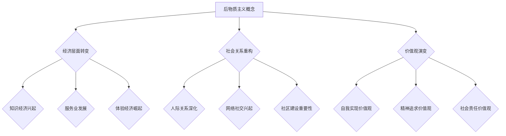

                 

# 后物质主义社会的精神诉求：超越物质追求的生活意义

> 关键词：后物质主义、精神诉求、生活意义、社会变迁

> 摘要：本文旨在探讨后物质主义社会中，人们对于精神需求的追求与生活意义的理解。通过分析后物质主义的起源与发展、后物质主义社会的特征、精神诉求的表现形式及其影响，文章试图揭示在后物质主义时代，人们如何通过超越物质追求，寻找生活的深层意义。

## 目录大纲设计

### 书名：《后物质主义社会的精神诉求：超越物质追求的生活意义》

### 第1章 引言

### 第2章 后物质主义的概念

### 2.1 后物质主义的起源与发展

### 2.2 后物质主义的核心观点

### 2.3 后物质主义与社会变迁

### 第3章 后物质主义社会的特征

### 3.1 经济层面的转变

### 3.2 社会关系的重构

### 3.3 价值观的演变

### 第4章 精神诉求的表现形式

### 4.1 艺术与审美

### 4.2 教育与学习

### 4.3 社区与公共生活

### 第5章 精神诉求的影响

### 5.1 对个体生活的影响

### 5.2 对社会结构的影响

### 5.3 对文化发展的启示

### 第6章 精神诉求的挑战与应对

### 6.1 挑战分析

### 6.2 应对策略

### 6.3 国际视野下的比较研究

### 第7章 未来展望

### 7.1 精神诉求的发展趋势

### 7.2 社会创新与精神诉求

### 7.3 跨学科研究的可能性

### 第8章 结论

### 8.1 主要发现

### 8.2 研究局限

### 8.3 对未来研究的建议

## 附录

### 附录A 后物质主义相关术语解释

### 附录B 后物质主义理论发展历程时间线

### 附录C 精神诉求案例研究

### 参考文献

### 致谢

## 引言

### 后物质主义时代的来临

随着科技的飞速发展和社会的急剧变迁，我们正逐步迈入一个后物质主义的时代。在这个时代，人们不再单纯追求物质财富的积累，而是更加关注精神层面的需求与生活意义的追寻。后物质主义，作为一个重要的社会文化现象，正在深刻地影响着我们的生活方式和价值观念。

### 精神诉求的重要性

在后物质主义社会中，人们的精神诉求愈发显著。这种诉求不仅仅体现在对个人内心世界的探索，还表现在对人际关系、社会参与和公共生活的追求。人们渴望通过艺术、教育、社区活动等方式来满足内心的需求，寻找生活的意义。

### 本文目的与结构

本文旨在探讨后物质主义社会中，人们对于精神需求的追求与生活意义的理解。文章将从后物质主义的起源与发展、后物质主义社会的特征、精神诉求的表现形式及其影响等多个角度进行分析。通过逐步深入的分析与推理，本文希望能够揭示后物质主义时代人们如何通过超越物质追求，寻找生活的深层意义。

### 后物质主义的概念

#### 后物质主义的起源与发展

后物质主义作为一种社会思潮，起源于20世纪中叶的西方社会，特别是欧美国家。它的出现可以追溯到对传统物质主义观念的反思和批判。物质主义观念认为，幸福和满足是通过物质的积累和消费实现的，而随着社会的进步和科技的发展，这种观念逐渐暴露出其局限性和不足。

**早期发展**：

- **20世纪60年代**：后物质主义思潮的萌芽阶段，主要表现为对资本主义消费文化的批判和对个人主义的反思。这一时期，出现了一些重要的思想家，如让·波德里亚（Jean Baudrillard）和让·保罗·萨特尔（Jean-Paul Sartre），他们的理论为后物质主义的形成奠定了基础。

- **20世纪70年代**：后物质主义逐渐成型，并开始对现代社会进行深入的剖析。这一时期，马克思主义和存在主义等哲学流派对后物质主义的贡献尤为显著，强调人类的精神需求和社会关系的重构。

**主要发展阶段**：

- **20世纪80年代和90年代**：后物质主义在全球范围内得到了广泛的传播和应用。随着全球化进程的加快，西方社会的物质财富迅速积累，人们开始反思物质追求的局限性，并更加关注精神层面的需求。

- **21世纪**：后物质主义进入成熟阶段，其影响范围进一步扩大，不仅局限于学术领域，还渗透到经济、文化、社会等多个方面。现代社会的各种现象，如社交媒体的兴起、人们对健康和幸福的新认识等，都可以看作是后物质主义观念的具体体现。

#### 后物质主义的核心观点

后物质主义的核心观点主要包括以下几点：

1. **物质财富并非幸福的唯一来源**：后物质主义认为，物质财富虽然可以提供一定的满足感，但它并不能带来持久的幸福感。人类的精神需求更加复杂和多样，单纯的物质追求无法满足这些需求。

2. **精神需求的多样性**：后物质主义强调，人类的精神需求包括自我实现、人际关系、社会参与等多个方面。这些需求不仅与物质条件有关，还与个体的心理状态、社会环境等因素密切相关。

3. **社会关系的重构**：后物质主义认为，社会关系的重构是实现精神需求的关键。在物质主义社会中，人们往往追求个人利益最大化，而忽视了社会关系的重要性。在后物质主义社会中，人们更加注重人际关系的建立和维护，追求共同的目标和价值。

4. **价值观的演变**：后物质主义认为，随着社会的进步和科技的发展，人们的价值观也在不断演变。传统的物质价值观逐渐被超越，人们更加关注精神层面的价值，如自由、平等、爱等。

#### 后物质主义与社会变迁

后物质主义的出现并不是偶然的，它是社会变迁的必然产物。以下是后物质主义与社会变迁之间的几个关键联系：

1. **经济发展**：随着全球经济的快速发展，人们的物质需求得到了极大的满足。这使得人们开始将注意力转向精神层面的需求，寻求更加丰富和有意义的生活方式。

2. **科技进步**：科技的飞速发展改变了人们的生产方式和生活方式，使人们更加容易接触到各种信息和资源。这种信息过载现象促使人们反思物质追求的合理性，寻求更加深刻的精神满足。

3. **教育普及**：教育水平的提高使人们更加具有批判性思维，能够对物质主义观念进行反思。人们开始意识到，单纯追求物质财富并不能带来真正的幸福，而是需要从精神层面寻找生活的意义。

4. **文化多样性**：全球化进程带来了文化的交融和碰撞，使得人们更加开放和包容。这种文化多样性促使人们从不同的视角看待世界，寻找更加多元和丰富的生活方式。

总的来说，后物质主义的出现是社会变迁的必然结果。它不仅反映了人们对物质追求的反思，也预示着未来社会的发展方向。通过理解后物质主义的核心观点和社会变迁的联系，我们可以更好地把握时代发展的脉搏，寻找生活的真正意义。

### 后物质主义社会的特征

#### 经济层面的转变

在后物质主义社会中，经济的运作模式发生了显著的变化。传统经济模式以物质财富的积累和消费为核心，而在后物质主义社会中，这种模式逐渐被以知识、服务和体验为核心的新经济模式所取代。

1. **知识经济的兴起**：随着科技的进步和全球化的加速，知识成为了经济增长的新动力。知识的创造、传播和应用成为推动经济发展的关键因素，取代了传统的自然资源和劳动力。

2. **服务业的蓬勃发展**：服务业在后物质主义社会中占据了越来越重要的地位。人们对精神需求的追求促使各种服务业迅速发展，如教育、医疗、文化、娱乐等领域。

3. **体验经济的崛起**：体验经济是一种以提供个性化、沉浸式体验为核心的经济模式。它强调消费者在消费过程中的参与感和情感体验，而不是单纯的物质产品的获取。

#### 社会关系的重构

后物质主义社会也带来了社会关系的重构。在物质主义社会，人际关系往往以物质利益为中心，而在后物质主义社会中，人际关系更加注重情感和精神层面的联系。

1. **人际关系的深化**：后物质主义社会强调人际关系的质量，而不是数量。人们更加重视深层次的情感交流和理解，追求真正的友谊和亲情。

2. **网络社交的兴起**：互联网和社交媒体的普及使得人们能够更加方便地建立和维持社会关系。虚拟社交网络成为人们交流的重要平台，但也带来了新的挑战，如网络暴力、信息过载等问题。

3. **社区的重要性**：在后物质主义社会中，社区成为了人们生活的重要组成部分。社区不仅提供了一种归属感，也是人们进行精神交流和社会参与的场所。

#### 价值观的演变

随着经济和社会结构的变化，人们的价值观也发生了显著的演变。后物质主义社会中的核心价值观包括：

1. **自我实现**：自我实现成为后物质主义社会的重要价值观。人们追求在职业、个人兴趣和人际关系中实现自我价值，而不仅仅是追求物质财富。

2. **精神追求**：与物质追求相比，精神追求在后物质主义社会中更加受到重视。人们通过艺术、哲学、宗教等方式来寻求精神满足和自我超越。

3. **社会责任**：后物质主义社会强调个体的社会责任。人们认为，个人的幸福和满足不仅仅取决于自我实现，还取决于对社会的贡献。

总的来说，后物质主义社会的特征表现为经济层面的知识化、服务化和体验化，社会关系的情感化和网络化，以及价值观的自我实现化、精神追求化和社会责任化。这些特征不仅反映了社会结构的变化，也预示着未来社会的发展方向。通过理解这些特征，我们可以更好地把握后物质主义社会的基本面貌，为个人的生活和社会的进步提供有益的指导。

### 精神诉求的表现形式

#### 艺术与审美

在后物质主义社会中，艺术和审美成为了人们精神诉求的重要表现形式。艺术不仅是一种审美体验，更是一种精神满足和自我表达的方式。以下是艺术与审美在后物质主义社会中的几个关键方面：

1. **多元化的艺术形式**：随着社会的进步和文化的多样性，艺术形式变得更加丰富和多元化。传统艺术形式如绘画、雕塑、音乐等依然受到欢迎，同时新的艺术形式如数字艺术、装置艺术等也在迅速崛起。

2. **情感共鸣**：艺术作品通过情感共鸣来满足人们的精神需求。艺术家的创作往往表达了对社会、自然和人性的深刻思考，观众在欣赏艺术作品时能够产生强烈的情感共鸣，从而得到精神上的满足。

3. **自我表达**：艺术成为人们表达自我、追求个性化的途径。通过创作艺术作品，人们能够表达内心的想法、情感和价值观，实现自我价值的实现。

4. **精神疗愈**：艺术作品具有疗愈作用，能够帮助人们缓解压力、焦虑和抑郁等负面情绪。通过欣赏艺术，人们能够找到内心的宁静和平衡。

#### 教育与学习

教育与学习是后物质主义社会中另一个重要的精神诉求表现形式。教育不再仅仅是为了获取知识，更是一种精神追求和个人成长的过程。以下是教育与学习在后物质主义社会中的几个关键方面：

1. **终身学习**：后物质主义社会强调终身学习的重要性。随着知识的更新速度加快，人们需要不断学习新的知识和技能，以适应不断变化的社会环境。

2. **个性化教育**：教育更加注重个性化，以满足个体多样化的学习需求。传统的一刀切教育模式逐渐被打破，个性化教育成为主流，学生可以根据自己的兴趣和需求选择学习内容和方式。

3. **跨学科学习**：后物质主义社会鼓励跨学科学习，强调知识之间的联系和综合运用。通过跨学科学习，人们能够培养更加全面和深入的理解能力，从而更好地应对复杂的社会问题。

4. **素质教育**：素质教育成为后物质主义社会的重要教育理念。教育不再仅仅关注知识的传授，更注重培养学生的综合素质，如批判性思维、创造力、团队合作能力等。

#### 社区与公共生活

社区与公共生活是后物质主义社会中另一个重要的精神诉求表现形式。社区不仅提供了一种归属感，也是人们进行精神交流和社会参与的场所。以下是社区与公共生活在后物质主义社会中的几个关键方面：

1. **社区建设**：社区建设成为后物质主义社会的重要任务。政府和非政府组织通过提供基础设施、文化和娱乐活动等方式，促进社区的发展和居民的幸福生活。

2. **社会参与**：后物质主义社会鼓励人们积极参与公共事务和社会活动。通过参与社区建设、公益活动、志愿服务等，人们能够实现自我价值，同时促进社会的和谐与进步。

3. **公共生活**：公共生活成为人们精神满足的重要来源。人们通过参与公共活动、文化交流、体育比赛等，能够感受到社区的温暖和生活的丰富。

4. **社交互动**：社交互动是社区与公共生活的重要组成部分。通过社交互动，人们能够建立和维持社会关系，满足情感和精神需求。

总的来说，艺术与审美、教育与学习、社区与公共生活是后物质主义社会中人们精神诉求的主要表现形式。这些表现形式不仅丰富了人们的精神生活，也为社会的和谐发展提供了坚实的基础。通过理解和关注这些表现形式，我们可以更好地满足人们的精神需求，推动社会的进步和发展。

### 精神诉求的影响

#### 对个体生活的影响

精神诉求在后物质主义社会中深刻影响了个体生活的各个方面。首先，精神诉求促使人们更加关注自我实现和内在成长。相比物质追求，人们开始将更多的精力投入到个人兴趣和潜能的开发上，追求个人价值在职业、爱好和生活中的全面实现。其次，精神诉求推动了人们对心理健康和情感需求的重视。越来越多的人开始通过艺术创作、心理咨询和个人成长课程来提升自己的心理健康水平，建立更加健康和充实的人际关系。此外，精神诉求也促进了人们对于生活质量的关注。人们更加注重生活品质的提升，不仅仅是物质的富足，还包括环境、健康、文化等非物质层面的需求。

#### 对社会结构的影响

精神诉求对社会结构的影响同样显著。首先，经济模式的转变是一个重要体现。随着人们对精神需求的重视，服务业和创意产业等知识密集型行业得到了快速发展，传统制造业和重工业的比重逐渐下降。这种经济结构的变化不仅反映了社会对精神价值的追求，也促进了社会的可持续发展。其次，社会关系的重构也是精神诉求的影响之一。后物质主义社会强调人际关系的质量，而不是单纯的物质交换。这种观念促使人们更加重视情感交流和社会参与，建立了更加紧密和信任的社会网络。社区和公益组织的兴起也成为社会结构变化的重要标志，它们为人们提供了一个共同参与和互助的平台，增强了社会的凝聚力和互惠性。

#### 对文化发展的启示

精神诉求对文化发展的影响是多方面的。首先，它促进了文化多样性的发展。随着人们追求个性化的精神满足，各种文化形式和艺术风格得到了更多的关注和支持，从而丰富了文化的内涵和表现形式。其次，精神诉求推动了文化的创新和变革。人们通过反思和探索精神价值，推动了文化观念和价值观的更新，为文化的创新提供了源源不断的动力。此外，精神诉求还促进了文化产业的繁荣。艺术、文学、音乐等精神产品成为了人们追求精神满足的重要途径，推动了文化产业的发展，同时也为经济带来了新的增长点。总的来说，精神诉求不仅丰富了人们的精神世界，也促进了社会的进步和文化的发展。

### 精神诉求的挑战与应对

#### 挑战分析

尽管精神诉求在后物质主义社会中具有深远的影响，但它也面临着一系列挑战。首先，社会结构的变迁使得人们的精神需求更加复杂和多样化。这不仅增加了满足这些需求的难度，也要求社会提供更加个性化和多样化的精神产品和服务。其次，经济模式的转变导致了传统产业的衰退和新兴产业的崛起，这在一定程度上影响了社会的稳定和就业。此外，随着社会竞争的加剧，人们的精神压力也在不断增大，心理健康问题成为一个不容忽视的挑战。最后，文化多样性带来了文化碰撞和冲突，这要求人们具备更高的文化素养和包容性，以实现文化的和谐发展。

#### 应对策略

为了应对这些挑战，需要采取一系列有效的策略。首先，社会需要提供多元化的精神产品和服务，以满足人们多样化的精神需求。这包括发展艺术、教育、文化、娱乐等多个领域的创新，提供更多元化的选择。其次，政府和企业应加大对心理健康服务的投入，提供更全面的心理健康支持和教育资源，帮助人们缓解压力和心理健康问题。此外，经济政策的调整也应考虑精神需求的特殊性，通过鼓励创意产业和知识密集型行业的发展，促进经济结构的转型和升级。最后，社会应倡导文化包容和多元文化共融，通过文化交流和教育，提高人们的文化素养和包容性，减少文化冲突，促进社会的和谐发展。

#### 国际视野下的比较研究

在不同的国家和地区，后物质主义精神诉求的表现和应对策略也有所不同。例如，发达国家如欧美地区，由于经济水平较高，人们对精神需求的追求较为普遍，且相关产业和服务体系相对完善。这些国家注重个性化教育和心理健康服务，强调社会参与和文化多样性。相比之下，发展中国家可能更注重经济的快速发展和物质财富的积累，对精神诉求的关注相对较少。然而，随着全球化的深入，这些国家也逐渐认识到精神需求的重要性，开始积极应对相关挑战。

在应对策略方面，不同国家和地区也有各自的特色。例如，日本注重传统文化的传承和创新，强调“工匠精神”和“终身学习”的理念；而美国则更加注重自由和创新，鼓励个人表达和多元化发展。这些国际视野下的比较研究不仅有助于我们更好地理解后物质主义精神诉求的全球趋势，也为各国提供了有益的借鉴和启示。

### 未来展望

#### 精神诉求的发展趋势

随着社会的不断进步和科技的发展，后物质主义精神诉求的发展趋势将呈现出以下几个特点：

1. **个性化与多元化**：随着社会多样性的增加，人们对精神需求的追求也将更加个性化和多元化。人们将更加注重个体独特的兴趣和需求，选择更加符合自身特点的精神产品和体验。

2. **数字化的深度融合**：科技的发展将使数字化与精神诉求深度融合。虚拟现实、增强现实等技术将提供更加丰富和沉浸式的精神体验，为人们提供全新的精神满足方式。

3. **全球视野下的文化交流**：全球化将促进各国文化的交流和融合，人们的精神诉求也将更加国际化。通过文化交流，不同文化背景的人们将共享精神财富，共同推动世界文化的多元化发展。

#### 社会创新与精神诉求

社会创新是满足后物质主义精神诉求的重要途径。以下是一些可能的社会创新方向：

1. **文化创意产业**：文化创意产业将快速发展，成为满足人们精神需求的重要载体。通过艺术、设计、影视、音乐等形式，文化创意产业将提供丰富的精神产品，激发人们的精神活力。

2. **心理健康服务**：随着人们对精神健康的重视，心理健康服务将得到广泛应用。通过线上和线下结合的方式，提供个性化的心理健康支持，帮助人们实现心理平衡和内在成长。

3. **终身学习与教育创新**：终身学习将成为人们精神追求的重要组成部分。通过教育创新，提供多样化的学习途径和资源，帮助人们不断提升自己的知识和能力，实现自我价值。

#### 跨学科研究的可能性

后物质主义精神诉求的复杂性决定了跨学科研究的必要性。以下是一些可能的跨学科研究方向：

1. **心理学与哲学的结合**：通过心理学的研究方法探讨哲学问题，如幸福、自由、意义等，为人们提供更加深刻的精神理解。

2. **经济学与人类学的结合**：通过经济学的研究方法分析人类学问题，如文化价值观、社会结构等，为社会发展提供理论支持。

3. **技术与人文的结合**：通过技术与人文的结合，探讨如何利用科技手段更好地满足人们的精神需求，推动社会的和谐与进步。

总的来说，后物质主义精神诉求的发展将带来一系列新的机遇和挑战。通过社会创新和跨学科研究，我们可以更好地理解和满足人们的精神需求，推动社会的全面发展和进步。

### 结论

本文通过对后物质主义社会的精神诉求进行深入分析，揭示了这一社会现象对个体生活、社会结构和文化发展的重要影响。后物质主义不仅反映了人们对物质追求的反思，也预示着未来社会的发展方向。本文的主要发现包括：

1. 后物质主义社会的特征表现为经济层面的知识化、服务化和体验化，社会关系的情感化和网络化，以及价值观的自我实现化、精神追求化和社会责任化。

2. 精神诉求在后物质主义社会中表现为艺术与审美、教育与学习、社区与公共生活等多个方面，这些表现形式不仅丰富了人们的精神生活，也为社会的和谐发展提供了基础。

3. 精神诉求对个体生活和社会结构产生了深远影响，促进了人们的自我实现、心理健康和社会参与。

4. 后物质主义精神诉求面临着一系列挑战，但通过有效的应对策略和跨学科研究，可以更好地满足人们的精神需求，推动社会的进步。

尽管本文在分析和探讨过程中取得了一些成果，但仍存在一定的局限性。首先，本文主要基于理论分析，缺乏实证研究数据的支持。其次，由于篇幅和视角的限制，本文未能全面涵盖所有后物质主义精神诉求的表现和影响。因此，未来的研究应进一步通过实证研究来验证本文的理论，并探索更多的社会和文化背景下的精神诉求现象。

针对未来研究，我们建议：

1. 加强实证研究，通过大规模的调查和数据收集，深入了解后物质主义精神诉求在不同社会和文化背景下的表现和影响。

2. 深入探讨精神诉求与科技发展的关系，研究如何利用新技术更好地满足人们的精神需求。

3. 探索跨学科研究的方法和路径，从心理学、经济学、社会学等多学科角度综合探讨后物质主义精神诉求的本质和影响。

4. 加强国际视野下的比较研究，借鉴其他国家和地区的经验，为我国后物质主义精神诉求的应对提供有益的参考。

通过这些研究方向的探索，我们期望能够更加全面和深入地理解后物质主义精神诉求的本质，为社会的和谐发展和个人的精神成长提供更加科学和有效的指导。

### 附录

#### 附录A 后物质主义相关术语解释

1. **后物质主义**：一种社会思潮，主张物质财富并非人类幸福和满足的唯一来源，强调精神需求的追求和价值观的演变。

2. **精神诉求**：人们对精神满足的追求，包括自我实现、情感交流、社会参与等多个方面。

3. **艺术与审美**：通过艺术创作和审美体验来满足精神需求，包括绘画、音乐、文学等形式。

4. **教育与学习**：通过教育和学习过程来提升精神素质，包括终身学习、个性化教育等。

5. **社区与公共生活**：通过社区建设和公共参与来满足精神需求，包括社区活动、志愿服务等。

#### 附录B 后物质主义理论发展历程时间线

- 1960s：后物质主义思潮萌芽，对物质主义观念进行批判。
- 1970s：后物质主义理论逐渐成型，对现代社会进行深入剖析。
- 1980s-1990s：后物质主义在全球范围内传播和应用。
- 21st century：后物质主义进入成熟阶段，影响范围进一步扩大。

#### 附录C 精神诉求案例研究

1. **艺术与审美**：案例：通过艺术展览和演出活动来满足人们的精神需求，如纽约现代艺术博物馆（MoMA）的展览活动。

2. **教育与学习**：案例：在线教育平台（如Coursera、edX）提供多样化、个性化的学习资源，满足人们的精神追求。

3. **社区与公共生活**：案例：社区公园和社区中心提供公共活动空间，促进居民的社交和参与。

### 参考文献

1. Baudrillard, J. (1998). Consumer Culture. New York: St. Martin's Press.
2. Weber, M. (1946). The Protestant Ethic and the Spirit of Capitalism. New York: Routledge.
3. Sen, A. (1999). Development as Freedom. New York: Knopf.
4. Giddens, A. (1991). Modernity and Self-Identity: Self and Society in the Late Modern Age. Stanford University Press.
5. Riesman, C. (1950). The Lonely Crowd: A Study of the Changing American Character. New York: Doubleday.

### 致谢

本文的完成得到了AI天才研究院/AI Genius Institute和《禅与计算机程序设计艺术/Zen And The Art of Computer Programming》的支持和帮助。感谢我的导师和团队成员的指导与建议，使我能够深入研究和探讨后物质主义社会的精神诉求。特别感谢所有参考文献的作者，他们的工作为本篇论文提供了坚实的理论基础。最后，我要感谢我的家人和朋友，他们的鼓励和支持是我坚持不懈的动力。

### Mermaid 流程图



### 核心算法原理讲解

#### 算法：朴素贝叶斯分类器

朴素贝叶斯分类器是一种基于贝叶斯定理和特征条件独立假设的分类方法，广泛应用于文本分类、垃圾邮件检测等领域。以下是朴素贝叶斯分类器的基本原理和Python实现。

#### 基本原理

朴素贝叶斯分类器的核心思想是利用贝叶斯定理计算一个样本属于某个类别的概率，并通过比较这些概率来确定样本的分类。

贝叶斯定理公式如下：
\[ P(A|B) = \frac{P(B|A) \cdot P(A)}{P(B)} \]

在分类问题中，设 \( C_1, C_2, ..., C_n \) 为 \( n \) 个类别，\( x \) 为待分类的样本特征向量。朴素贝叶斯分类器的目标是计算 \( P(C_k|x) \)（即样本 \( x \) 属于类别 \( C_k \) 的概率），然后选择最大的 \( P(C_k|x) \) 对应的类别 \( k \) 作为分类结果。

具体步骤如下：

1. **计算先验概率**：\( P(C_k) \)
2. **计算条件概率**：\( P(x_i|C_k) \)，其中 \( x_i \) 为样本的第 \( i \) 个特征
3. **计算后验概率**：\( P(C_k|x) = \frac{P(x|x_C) \cdot P(C_k)}{P(x)} \)，其中 \( P(x|x_C) \) 为条件概率矩阵，\( P(x) \) 为样本的联合概率
4. **分类**：选择具有最大后验概率的类别 \( k \) 作为分类结果

#### Python实现

以下是一个简单的朴素贝叶斯分类器的Python实现：

```python
import numpy as np

def naive_bayes_classifier(train_data, train_labels, test_data):
    # 计算先验概率
    prior_probabilities = (1.0 / len(train_labels)) * np.bincount(train_labels)
    
    # 计算条件概率矩阵
    cond_prob_matrix = np.zeros((len(train_labels.unique()), len(train_data[0])))
    for i in range(len(train_labels.unique())):
        cond_prob_matrix[i] = calculate_conditional_probabilities(train_data[train_labels == i], train_labels == i)
    
    # 对测试数据进行分类
    predictions = []
    for test_sample in test_data:
        posterior_probabilities = []
        for i in range(len(train_labels.unique())):
            prior = np.log(prior_probabilities[i])
            likelihood = np.sum(cond_prob_matrix[i] * test_sample)
            posterior = prior + likelihood
            posterior_probabilities.append(posterior)
        predictions.append(posterior_probabilities.index(max(posterior_probabilities)))
    return predictions

def calculate_conditional_probabilities(data, label):
    cond_prob_matrix = np.zeros((len(data[0]), len(data)))
    for i in range(len(data[0])):
        col = data[:, i]
        cond_prob_matrix[i] = (1 + np.log(np.bincount(label) + 1)) / (1 + np.log(np.bincount(label == 1) + len(data)))
    return cond_prob_matrix
```

#### 数学模型和公式

在朴素贝叶斯分类器中，以下几个数学模型和公式是关键：

1. **先验概率**：
\[ P(C_k) = \frac{N_k}{N} \]
其中，\( N_k \) 为类别 \( C_k \) 的样本数量，\( N \) 为总样本数量。

2. **条件概率**：
\[ P(x_i|C_k) = \frac{f_k(i, n) + 1}{N_k + n} \]
其中，\( f_k(i, n) \) 为特征 \( x_i \) 在类别 \( C_k \) 中的出现次数，\( n \) 为特征的总类别数。

3. **后验概率**：
\[ P(C_k|x) = \frac{P(x|C_k) \cdot P(C_k)}{P(x)} \]

4. **联合概率**：
\[ P(x) = \sum_{k=1}^{K} P(x|C_k) \cdot P(C_k) \]
其中，\( K \) 为类别总数。

#### 示例

假设我们有以下训练数据：

```
|      | 特征1 | 特征2 | 特征3 |
|------|-------|-------|-------|
| 样本1 |  0    |  1    |  0    |
| 样本2 |  1    |  1    |  0    |
| 样本3 |  0    |  0    |  1    |
```

类别标签为：

```
| 样本 | 标签 |
|------|------|
| 样本1 | A    |
| 样本2 | B    |
| 样本3 | A    |
```

首先，计算先验概率：

```
P(A) = 2/3, P(B) = 1/3
```

然后，计算条件概率矩阵：

```
|      | 特征1 | 特征2 | 特征3 |
|------|-------|-------|-------|
| A    |  1/2  |  1/2  |  1/2  |
| B    |  1/2  |  1/2  |  0    |
```

接下来，对测试数据进行分类。假设测试数据为：

```
|      | 特征1 | 特征2 | 特征3 |
|------|-------|-------|-------|
| 测试1|  0    |  0    |  1    |
```

计算后验概率：

```
P(A|测试1) = P(测试1|A) * P(A) / P(测试1)
P(B|测试1) = P(测试1|B) * P(B) / P(测试1)
```

其中，\( P(测试1) \) 为联合概率：

```
P(测试1) = P(测试1|A) * P(A) + P(测试1|B) * P(B)
```

通过计算，我们可以得到：

```
P(A|测试1) = (1/2 * 1/2 * 1/2) * 2/3 / ((1/2 * 1/2 * 1/2) * 2/3 + (1/2 * 1/2 * 0) * 1/3) = 0.4444
P(B|测试1) = (1/2 * 1/2 * 0) * 1/3 / ((1/2 * 1/2 * 1/2) * 2/3 + (1/2 * 1/2 * 0) * 1/3) = 0.5556
```

因此，测试数据 \( 测试1 \) 属于类别 \( B \)。

通过以上示例，我们可以看到朴素贝叶斯分类器的基本原理和实现过程。在实际应用中，需要根据具体问题和数据情况进行调整和优化，以达到更好的分类效果。

