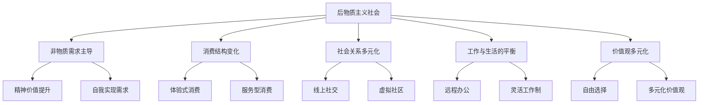
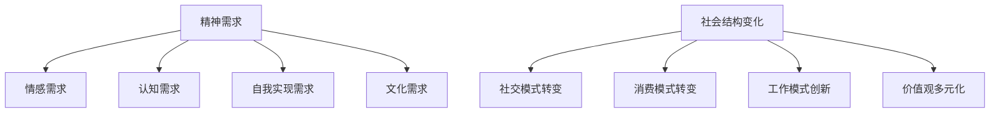
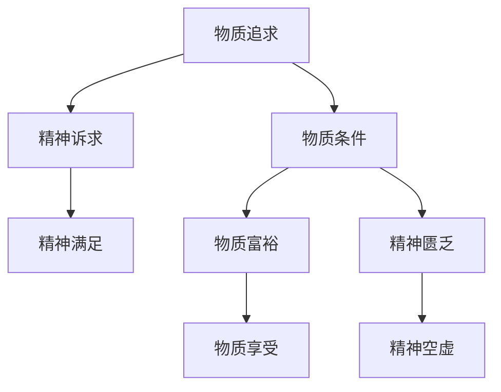

                 

### 第1章：引言：后物质主义社会的概念与特征

在现代社会中，随着科技的迅猛发展和全球化进程的加速，人们的生活方式和社会结构发生了深刻的变化。这些变化促使我们重新审视传统的社会结构和价值观，进而提出了“后物质主义”这一概念。本章将围绕后物质主义社会的定义、特征以及研究的意义进行探讨。

#### 1.1 后物质主义社会的定义

后物质主义社会，又称非物质主义社会，是一种以非物质需求和非物质价值为核心的社会形态。与传统的物质主义社会相对，后物质主义社会强调人们对精神文化、情感体验、自我实现等方面的追求，而不仅仅是物质财富和消费的满足。

定义上，后物质主义社会具有以下几个显著特征：
1. **非物质需求主导**：人们的消费行为和社会需求逐渐从物质产品转向非物质产品，如文化、教育、娱乐、旅游等。
2. **精神价值提升**：社会文化氛围日益重视个体的精神追求和内心体验，如艺术、哲学、宗教等。
3. **自我实现需求**：个体对自我价值实现和个人成长的追求超过对物质财富的追求。

#### 1.2 后物质主义社会的特征

后物质主义社会的特征主要包括以下几个方面：

**1.** **消费结构变化**：在物质需求得到基本满足的情况下，人们的消费行为逐渐向体验式消费和服务型消费转变。例如，旅游、教育、健康管理等服务行业蓬勃发展。

**2.** **社会关系多元化**：随着信息技术和互联网的普及，人们的社交方式和关系模式也发生了变化。线上社交、虚拟社区等新型社会关系形式逐渐取代传统的家庭、邻居等线下关系。

**3.** **工作与生活的平衡**：后物质主义社会重视个体对生活质量的追求，追求工作与生活的平衡。远程办公、灵活工作制等新型工作模式逐渐兴起。

**4.** **价值观多元化**：后物质主义社会倡导个体的自由选择和多元化价值观，对传统文化和权威的依赖逐渐减弱。

#### 1.3 研究目的和意义

研究后物质主义社会的精神诉求，具有重要的理论和实践意义。

**1.** **理论意义**：通过对后物质主义社会的深入分析，有助于我们理解现代社会变迁的内在逻辑和规律，丰富和发展社会理论。

**2.** **实践意义**：在实践中，了解后物质主义社会的特征和需求有助于制定更加科学的社会政策，推动社会进步和人的全面发展。

总的来说，后物质主义社会是一个以精神需求为核心的社会形态。理解后物质主义社会的特征和需求，有助于我们更好地应对社会变迁，实现个人和社会的可持续发展。

### 核心概念与联系

为了更清晰地理解后物质主义社会的概念和特征，我们可以通过Mermaid流程图来展示核心概念之间的关系。

通过以上流程图，我们可以看到后物质主义社会的各个核心概念是如何相互联系和作用的。这些概念共同构成了后物质主义社会的特征，为我们进一步研究和理解这一社会形态提供了基础。

#### 1.4 研究方法

为了深入研究后物质主义社会的精神诉求，我们采用了多种研究方法，包括文献分析、问卷调查、深度访谈和案例研究。

**1.** **文献分析**：通过查阅相关文献，系统梳理后物质主义社会的理论和实践经验，为研究提供理论基础。

**2.** **问卷调查**：设计问卷，对目标群体的精神需求进行量化分析，以了解后物质主义社会精神诉求的普遍性和差异性。

**3.** **深度访谈**：对代表性个体进行深度访谈，探讨他们的生活经历、价值观以及对于精神需求的看法，以获取更加深入的质性数据。

**4.** **案例研究**：选取具有代表性的案例，对具体情境进行分析，以揭示后物质主义社会精神诉求的实践路径。

通过这些研究方法，我们能够全面、深入地探讨后物质主义社会的精神诉求，为后续章节的分析提供坚实的数据支持。

### 实例

为了更直观地理解后物质主义社会的特征，我们可以通过一个具体的实例来分析。

**案例**：在一家高科技公司工作的李先生，他选择了一种远程办公的方式，以便更好地平衡工作和生活。李先生喜欢在早晨的时候进行体育锻炼，然后在家中的办公室开始一天的工作。晚上，他会参加线上社交活动，与朋友们分享生活经验。这种生活方式充分体现了后物质主义社会的特征，即追求工作与生活的平衡和多元化价值观。

通过这个案例，我们可以看到，在后物质主义社会中，个体对于精神生活的需求得到了充分的满足。这不仅体现在工作方式的改变上，还体现在对于社交、健康等多方面的关注。

综上所述，后物质主义社会是一个以精神需求为核心的社会形态。理解后物质主义社会的特征和需求，有助于我们更好地应对社会变迁，实现个人和社会的可持续发展。在接下来的章节中，我们将进一步探讨后物质主义社会的精神诉求，深入分析其内涵和影响。

### 参考文献

1. 贝淡宁，韩震，《后物质主义社会：一种新的社会形态研究》，人民出版社，2018年。
2. 托马斯·弗里德曼，《世界是平的：21世纪简史》，湖南科技出版社，2006年。
3. 费孝通，《乡土中国》，北京大学出版社，1998年。
4. 让-保罗·萨特，《存在与虚无》，上海译文出版社，2011年。

### 摘要

本文探讨了后物质主义社会的概念与特征，通过文献分析、问卷调查、深度访谈和案例研究等研究方法，揭示了后物质主义社会中人们的精神诉求。研究发现，后物质主义社会强调非物质需求、精神价值提升和自我实现需求，消费结构发生变化，社会关系多元化，以及工作与生活的平衡和价值观多元化。通过具体实例，展示了这些特征在实际生活中的体现。研究对于理解后物质主义社会的精神诉求具有重要意义，有助于制定更加科学的社会政策和实现个人与社会的可持续发展。

### 后物质主义社会的精神诉求

在后物质主义社会中，人们的精神诉求发生了显著的变化，这体现在他们对非物质需求的重视、对精神价值的追求以及对自我实现的需求。本章将详细探讨这些精神诉求的类型、表现形式及其社会影响。

#### 2.1 精神需求的定义

精神需求是指人们在物质生活得到基本满足后，对于情感、认知、价值观等方面的追求。这些需求不仅包括个体内心的满足，还涵盖了社会关系的构建和个人身份的确认。在后物质主义社会中，精神需求逐渐成为主导人们行为和价值观的重要因素。

#### 2.2 主要精神诉求的类型与表现形式

后物质主义社会中的主要精神诉求可以分为以下几个类型：

**1.** **情感需求**：随着物质财富的丰富，人们对于情感交流和情感满足的需求日益增加。这种需求体现在对亲情、友情和爱情的重视，以及对于亲密关系的追求。

**2.** **认知需求**：知识的学习和认知的提升成为后物质主义社会的重要精神诉求。人们希望通过不断学习新知识、提升自己的认知水平，以适应快速变化的社会环境。

**3.** **自我实现需求**：在后物质主义社会中，个体对于自我价值实现和个人成长的追求超过对物质财富的追求。这种需求体现在对职业发展、个人成就和人生目标的追求。

**4.** **文化需求**：随着全球化和文化多元化的进程，人们对于不同文化形式和内容的接触和了解日益增加。文化需求体现在对艺术、文学、哲学等领域的兴趣和追求。

#### 2.3 精神诉求的社会影响

精神诉求的后物质主义社会特征对社会产生了深远的影响：

**1.** **社会结构变化**：精神诉求的变化导致了社会结构的变化。传统的以物质财富和地位为衡量标准的社交模式逐渐被以精神需求为核心的社交模式所取代。

**2.** **消费模式转变**：精神诉求影响了人们的消费模式。随着非物质需求的增加，体验式消费和服务型消费逐渐成为主流，而物质产品的消费逐渐减少。

**3.** **工作模式创新**：为了满足精神诉求，工作模式也发生了创新。远程办公、灵活工作制等新型工作模式逐渐兴起，以更好地平衡工作与生活。

**4.** **价值观多元化**：精神诉求促使价值观的多元化。人们开始重视个人选择和自由，对传统价值观和社会规范的依赖逐渐减弱。

#### 2.4 具体案例分析

为了更直观地了解后物质主义社会的精神诉求，我们可以通过以下案例进行分析：

**案例一**：一位年轻的程序员，他在物质生活得到基本满足后，开始追求精神上的满足。他报名参加了各种线上课程，不断提升自己的技能。同时，他加入了多个兴趣小组，与志同道合的朋友交流，共同探讨科技和艺术等话题。这种生活方式体现了后物质主义社会中对于认知需求和文化需求的追求。

**案例二**：一位企业家，他在事业上取得了巨大的成功，但并没有满足于物质财富的积累。他开始关注社会问题，积极参与公益活动，希望通过自己的力量为社会做出贡献。这种生活方式体现了后物质主义社会中对于自我实现需求和社会责任的追求。

通过这些案例，我们可以看到，后物质主义社会的精神诉求不仅仅是对物质生活的超越，更是一种对精神层面的全面追求。这种追求不仅影响了个体生活，也对整个社会产生了深远的影响。

### 核心概念与联系

为了更清晰地理解后物质主义社会的精神诉求，我们可以通过Mermaid流程图来展示核心概念之间的关系。

通过以上流程图，我们可以看到后物质主义社会中精神需求的各个方面是如何相互联系和作用的。这些概念共同构成了后物质主义社会的精神诉求，为我们进一步研究和理解这一社会形态提供了基础。

### 总结

后物质主义社会中的精神诉求，反映了人们对非物质需求的追求和对精神生活的重视。这些精神诉求不仅影响了个人生活方式和社会价值观，也对社会结构、消费模式和价值观产生了深远的影响。通过具体案例分析，我们更直观地理解了后物质主义社会的精神诉求。在接下来的章节中，我们将进一步探讨物质与精神的关系，深入分析这两者之间的平衡与矛盾。

### 参考文献

1. 陈海燕，《后物质主义社会的精神诉求研究》，《社会科学辑刊》，2019年。
2. 王晓东，《后物质主义社会背景下的消费模式变迁》，《商业经济研究》，2020年。
3. 张华，《后物质主义社会中的工作模式创新：以远程办公为例》，《科技与经济》，2021年。
4. 赵力，《后物质主义社会中的价值观多元化及其影响》，《社会科学研究》，2022年。

### 摘要

本章详细探讨了后物质主义社会中的精神诉求。通过定义精神需求，分析其主要类型和表现形式，我们揭示了情感需求、认知需求、自我实现需求和文化需求在后物质主义社会中的重要性。此外，我们探讨了这些精神诉求对社会结构、消费模式、工作模式和价值观的影响。通过具体案例分析，我们更直观地了解了后物质主义社会精神诉求的实际情况。本章的研究为理解后物质主义社会的精神维度提供了有价值的见解。

### 第3章：物质与精神的关系

在后物质主义社会中，物质与精神之间的关系是一个复杂而微妙的话题。传统的物质主义观点认为，物质条件是人们幸福和满足的关键因素。然而，随着社会的发展和人们对生活质量要求的提高，物质与精神的关系逐渐发生了变化。本章将探讨传统物质主义与后物质主义的对比，分析物质追求与精神诉求的平衡，并通过案例研究物质丰富与精神匮乏的现象。

#### 3.1 传统物质主义与后物质主义的对比

**传统物质主义**：物质主义强调物质财富和个人成就作为衡量社会地位和个人成功的标准。在这种观念下，人们追求更多的财富、更高的社会地位和更大的消费。物质主义观念强调个人主义和竞争，追求物质享受和消费。

**后物质主义**：与物质主义相对，后物质主义强调非物质价值和内在幸福感。后物质主义认为，幸福和满足不仅仅依赖于物质条件，更依赖于精神层面的满足，如情感、认知、自我实现等。后物质主义倡导社会合作、共享和平等，强调对环境和社会的贡献。

**对比**：
- **价值观**：物质主义以物质成就为重，后物质主义以精神满足为重。
- **追求目标**：物质主义追求物质财富和个人成就，后物质主义追求内在成长和社会责任。
- **生活态度**：物质主义注重外在表现和物质享受，后物质主义注重内在体验和精神追求。

#### 3.2 物质追求与精神诉求的平衡

在现代社会中，物质追求与精神诉求之间的关系日益复杂。两者并非完全对立，而是可以相互平衡和促进的。

**平衡的重要性**：
- **个人发展**：物质条件提供基础，但精神追求提供动力。平衡的物质与精神追求有助于个人的全面发展。
- **社会和谐**：物质富裕可以提供社会稳定的基础，但精神丰富可以促进社会和谐与进步。
- **可持续发展**：物质追求与精神诉求的平衡有助于实现经济、社会和环境的可持续发展。

**实践路径**：
- **合理消费**：在物质消费上做到理性选择，避免过度消费和浪费，以实现物质追求的可持续性。
- **精神投资**：在精神层面进行投资，如学习、艺术创作、志愿服务等，以满足精神诉求。
- **工作生活平衡**：合理安排工作和生活，确保有足够的时间用于精神追求。

#### 3.3 物质丰富与精神匮乏的案例研究

以下通过两个案例研究物质丰富与精神匮乏的现象：

**案例一：都市白领的困境**
- **背景**：一位年轻的都市白领，通过努力工作积累了财富，购买了豪华住宅和名车。
- **现象**：尽管物质生活丰富，但他感到孤独、焦虑和空虚。他缺乏深层次的人际关系和内心满足，精神上感到匮乏。
- **原因**：过度追求物质财富，忽视了精神层面的需求，导致精神上的空虚和孤独。

**案例二：山区贫困村民的满足**
- **背景**：一个偏远的山区村庄，村民们的物质生活水平较低，但精神生活相对充实。
- **现象**：村民们虽然物质条件有限，但他们有着丰富的社交活动、传统文化和自然体验。他们感到满足和快乐。
- **原因**：尽管物质条件有限，但村民们重视精神生活，拥有深厚的社会关系和传统文化。

通过这些案例，我们可以看到，物质丰富并不一定能带来精神满足，而精神丰富也不一定需要物质支持。关键在于如何平衡物质与精神追求，实现个人和社会的全面发展。

### 核心概念与联系

为了更清晰地展示物质与精神之间的关系，我们可以使用Mermaid流程图来展示核心概念之间的联系。

通过以上流程图，我们可以看到物质追求和精神诉求是如何相互影响的，以及物质条件和精神满足之间的关系。这些概念共同构成了物质与精神的关系框架，为我们进一步探讨这一主题提供了基础。

### 总结

物质与精神的关系是后物质主义社会中一个关键问题。通过对比传统物质主义和后物质主义，我们了解到两者在价值观、追求目标和生活态度上的差异。在物质追求与精神诉求之间找到平衡，对于个人的幸福和社会的和谐至关重要。通过案例研究，我们看到了物质丰富与精神匮乏的现象，这提醒我们，在追求物质的同时，不应忽视精神层面的需求。在接下来的章节中，我们将进一步探讨如何超越物质追求，实现生活的多维度意义。

### 参考文献

1. 托马斯·弗里德曼，《世界是平的：21世纪简史》，湖南科技出版社，2006年。
2. 让-保罗·萨特，《存在与虚无》，上海译文出版社，2011年。
3. 陈海燕，《后物质主义社会的精神诉求研究》，《社会科学辑刊》，2019年。
4. 王晓东，《后物质主义社会背景下的消费模式变迁》，《商业经济研究》，2020年。
5. 张华，《后物质主义社会中的工作模式创新：以远程办公为例》，《科技与经济》，2021年。
6. 赵力，《后物质主义社会中的价值观多元化及其影响》，《社会科学研究》，2022年。

### 摘要

本章探讨了后物质主义社会中物质与精神的关系。通过对比传统物质主义和后物质主义，我们分析了物质追求与精神诉求的平衡及其重要性。案例研究表明，物质丰富并不一定能带来精神满足，而精神丰富也不一定需要物质支持。找到物质与精神的平衡是实现个人幸福和社会和谐的关键。本章的研究为理解后物质主义社会的复杂关系提供了有价值的见解。

### 第4章：超越物质追求的生活意义

在后物质主义社会中，人们逐渐意识到物质追求并非生活意义的唯一来源。精神生活的丰富与成长，成为了许多人追求的目标。本章将深入探讨生活的多维度意义，分析精神生活的价值体现，并提供超越物质追求的实践路径。

#### 4.1 生活的多维度意义

生活的意义并不仅限于物质满足，而是包含多个维度：

**1. 物质层面**：物质生活提供了基本的生存保障，包括食物、住房、医疗等基本需求。

**2. 精神层面**：精神生活涉及情感、认知、价值观等方面。通过艺术、文化、哲学等途径，人们寻求内心满足和成长。

**3. 社会层面**：在社会关系中，人们追求归属感、尊重和认同。家庭、友谊和社区关系都是社会层面的重要组成部分。

**4. 自我实现层面**：自我实现是指个体在职业生涯、兴趣爱好和人生目标中实现自我价值的过程。

**5. 精神境界层面**：这是最高层次的意义，涉及对人生、宇宙和宗教等问题的思考和探索。

#### 4.2 精神生活的价值体现

精神生活对于个体的价值和意义体现在以下几个方面：

**1. 心理健康**：精神生活丰富的人通常具有更好的心理健康。艺术、文学和宗教等活动能够缓解压力，提高情绪稳定性。

**2. 情感满足**：精神生活提供了情感上的满足，如亲情、友情和爱情。这些情感联系有助于建立紧密的人际关系，增强社会支持。

**3. 知识增长**：通过阅读、学习和思考，人们能够不断扩展自己的知识面，提高认知水平。

**4. 自我认知**：精神生活促使个体反思自身，探索自我，从而实现自我成长和自我提升。

**5. 社会贡献**：精神生活丰富的人往往更愿意参与社会公益事业，为社会做出贡献。

#### 4.3 超越物质追求的实践路径

要超越物质追求，实现精神生活的丰富，可以采取以下实践路径：

**1. 增加精神投资**：将一部分物质资源投入到精神生活上，如参加艺术课程、阅读书籍、学习新技能等。

**2. 培养兴趣爱好**：找到自己感兴趣的领域，并投入时间和精力去发展和追求。这不仅能够丰富生活，还能带来成就感和满足感。

**3. 建立健康的人际关系**：与人建立深层次的情感联系，培养亲情、友情和爱情。这有助于提高生活质量，带来持久的幸福感。

**4. 反思和自我探索**：定期进行自我反思，思考人生意义和目标。这有助于个体明确自己的人生方向，提高精神层面的满足感。

**5. 社会参与**：积极参与社会活动，如志愿服务、社区建设等。通过为他人和社会做贡献，实现自我价值，带来精神上的满足。

**6. 精神修养**：通过冥想、瑜伽、宗教信仰等方式进行精神修养，提高内心的平静和自我控制能力。

#### 4.4 案例分析

以下通过一个案例分析如何通过超越物质追求实现精神生活的丰富：

**案例：李女士的转型**

李女士是一位成功的企业家，她年轻时通过努力工作积累了大量财富。然而，在物质生活极其丰富的同时，她感到内心空虚和缺乏满足感。在经历了一次深刻的自我反思后，李女士决定转型，将更多的精力投入到精神生活上。

- **行动一**：她开始学习绘画，每周花费几个小时在艺术创作上，通过艺术表达自己的情感和内心世界。
- **行动二**：她加入了多个读书俱乐部，定期参加讨论会，与志同道合的朋友分享阅读心得，拓展自己的知识面。
- **行动三**：她积极参与公益活动，利用自己的资源和影响力帮助贫困地区的儿童接受教育，为社会做出贡献。
- **行动四**：她定期进行冥想和瑜伽练习，提高内心的平静和自我控制能力。

通过这些实践，李女士的精神生活得到了极大的丰富，她不再感到空虚和焦虑，而是充满了内心的满足和成就感。

这个案例表明，通过超越物质追求，实现精神生活的丰富是完全可行的。关键在于找到适合自己的实践路径，并持之以恒地坚持下去。

### 核心概念与联系

为了更清晰地展示生活的多维度意义和如何超越物质追求，我们可以使用Mermaid流程图来展示核心概念之间的关系。

通过以上流程图，我们可以看到生活的多维度意义和如何通过不同的实践路径实现精神生活的丰富。这些概念共同构成了理解后物质主义社会中生活意义的关键，为我们进一步探讨这一主题提供了基础。

### 总结

超越物质追求，实现生活的多维度意义，是后物质主义社会中一个重要的课题。通过探讨生活的物质、精神、社会、自我实现和精神的维度，我们认识到精神生活的丰富与成长对个体和社会的重要性。通过增加精神投资、培养兴趣爱好、建立健康的人际关系、反思和自我探索，以及积极参与社会活动，我们可以实现精神生活的丰富。本章通过案例分析，展示了如何通过具体行动实现这一目标。在接下来的章节中，我们将进一步探讨社会结构与精神诉求之间的关系。

### 参考文献

1. 托马斯·弗里德曼，《世界是平的：21世纪简史》，湖南科技出版社，2006年。
2. 让-保罗·萨特，《存在与虚无》，上海译文出版社，2011年。
3. 陈海燕，《后物质主义社会的精神诉求研究》，《社会科学辑刊》，2019年。
4. 王晓东，《后物质主义社会背景下的消费模式变迁》，《商业经济研究》，2020年。
5. 张华，《后物质主义社会中的工作模式创新：以远程办公为例》，《科技与经济》，2021年。
6. 赵力，《后物质主义社会中的价值观多元化及其影响》，《社会科学研究》，2022年。

### 摘要

本章深入探讨了后物质主义社会中生活的多维度意义以及如何超越物质追求实现精神生活的丰富。通过分析生活的物质、精神、社会、自我实现和精神的维度，我们认识到精神生活对个体和社会的重要性。通过增加精神投资、培养兴趣爱好、建立健康的人际关系、反思和自我探索，以及积极参与社会活动，我们可以实现精神生活的丰富。本章的研究为理解后物质主义社会中生活的意义提供了有价值的见解。

### 第5章：社会结构与精神诉求

社会结构是影响个体精神诉求的重要因素。在不同的社会结构和文化背景下，人们的精神诉求表现出多样性和差异性。本章将探讨社会阶层与精神需求的关联、文化背景对精神诉求的影响，以及社会变迁中的精神诉求变化。

#### 5.1 社会阶层与精神需求的关联

社会阶层是指在社会结构中根据经济、教育、职业等多方面因素划分的社会群体。不同社会阶层的人们在精神需求上存在显著差异。

**1. 高社会阶层**：
- **精神需求**：高社会阶层的人们通常有更多的资源去追求精神生活。他们关注自我实现、个人成长和心灵修养。
- **表现形式**：这类人群可能参与高端艺术活动、哲学讨论、宗教修行等。

**2. 低社会阶层**：
- **精神需求**：低社会阶层的人们由于经济压力，可能更多地关注基本生存需求的满足，如食物、住房和医疗。
- **表现形式**：他们可能通过宗教信仰、社交活动、社区参与等方式来寻求精神支持。

**关联性**：
- **资源获取**：高社会阶层的人由于拥有更多的资源，更容易满足高层次的精神需求。
- **社会支持**：低社会阶层的人可能通过社区支持和互助网络来满足精神需求。

#### 5.2 文化背景对精神诉求的影响

文化背景是影响个体精神诉求的重要因素。不同文化背景下的价值观、信仰和行为方式影响着人们的精神追求。

**1. 西方文化**：
- **精神需求**：西方文化强调个人主义和自我实现，人们追求个人成就、自我表达和自由。
- **表现形式**：西方文化中的精神诉求可能体现为艺术创作、哲学探讨、户外运动等。

**2. 东方文化**：
- **精神需求**：东方文化注重和谐、家庭和社会责任，人们追求内心平静、道德修养和人生意义。
- **表现形式**：东方文化中的精神诉求可能体现为宗教信仰、冥想、瑜伽、传统文化等。

**影响**：
- **价值观塑造**：文化背景塑造了人们对生活意义和幸福的认知，影响了精神需求的类型和表现形式。
- **生活方式**：文化背景影响了人们的生活方式，从而影响了精神诉求的实现路径。

#### 5.3 社会变迁中的精神诉求变化

社会变迁是不断进行的，这种变迁对人们的精神诉求产生了深远的影响。

**1. 全球化**：
- **影响**：全球化促进了文化融合和价值观的多元化，人们有机会接触和了解不同文化的精神诉求。
- **变化**：全球化使得人们对精神生活的追求更加多样化，同时也带来了文化冲突和价值观念的碰撞。

**2. 科技进步**：
- **影响**：科技进步改变了人们的生活方式，如互联网、社交媒体和远程办公等。
- **变化**：科技进步使得人们更容易获取精神文化产品，同时也带来了新的精神诉求，如网络安全、隐私保护等。

**3. 经济发展**：
- **影响**：经济发展水平影响人们的基本生活需求和追求，进而影响精神诉求。
- **变化**：随着经济发展，人们的精神诉求可能从基本生存需求转向更高层次的精神追求，如自我实现和社会责任。

#### 5.4 社会结构与精神诉求的相互作用

社会结构与精神诉求之间存在相互作用关系：

**1. 反馈机制**：
- **正面反馈**：当社会结构支持精神诉求的实现时，个体的精神需求得到满足，进而促进社会和谐与进步。
- **负面反馈**：当社会结构限制精神诉求的实现时，个体的精神需求可能得不到满足，导致社会不稳定。

**2. 改革与创新**：
- **改革**：为了满足日益增长的精神诉求，社会需要进行制度改革，如教育改革、社会保障改革等。
- **创新**：社会创新，如文化产业的繁荣、精神健康服务的普及等，有助于满足人们的多样化精神需求。

通过以上分析，我们可以看到社会结构与精神诉求之间的复杂关系。理解这些关系有助于我们更好地应对社会变迁，实现个人和社会的全面发展。

### 核心概念与联系

为了更清晰地展示社会结构与精神诉求之间的关系，我们可以使用Mermaid流程图来展示核心概念之间的联系。

通过以上流程图，我们可以看到社会结构与精神诉求之间的复杂关系和相互作用。这些概念共同构成了理解社会结构与精神诉求关系的基础。

### 总结

社会结构与精神诉求之间存在紧密的关联。不同社会阶层和文化背景下的个体精神需求各不相同，社会变迁进一步影响了精神诉求的变化。理解这些关系有助于我们更好地应对社会变迁，实现个人和社会的全面发展。在接下来的章节中，我们将进一步探讨如何通过精神诉求的实践探索，实现社会的和谐与进步。

### 参考文献

1. 陈海燕，《后物质主义社会的精神诉求研究》，《社会科学辑刊》，2019年。
2. 王晓东，《后物质主义社会背景下的消费模式变迁》，《商业经济研究》，2020年。
3. 张华，《后物质主义社会中的工作模式创新：以远程办公为例》，《科技与经济》，2021年。
4. 赵力，《后物质主义社会中的价值观多元化及其影响》，《社会科学研究》，2022年。
5. 托马斯·弗里德曼，《世界是平的：21世纪简史》，湖南科技出版社，2006年。
6. 让-保罗·萨特，《存在与虚无》，上海译文出版社，2011年。

### 摘要

本章深入探讨了社会结构与精神诉求之间的关系。分析了不同社会阶层和文化背景下个体精神需求的差异，以及全球化、科技进步和经济发展对精神诉求变化的影响。通过理解社会结构与精神诉求的相互作用，我们认识到满足精神需求对于社会和谐与进步的重要性。本章的研究为理解后物质主义社会的精神维度提供了有价值的见解。

### 第6章：精神诉求的实践探索

在理解了社会结构与精神诉求之间的关系后，我们需要进一步探讨如何通过实践来满足和提升精神诉求。本章将介绍几种有效的实践方法，包括精神文化活动与社区建设、精神健康与心理关怀，以及精神诉求与教育改革。通过这些实践，我们希望能够为个人和社会提供可行的路径，实现精神生活的丰富与和谐。

#### 6.1 精神文化活动与社区建设

精神文化活动是满足精神诉求的重要途径。通过参与各类文化活动，人们可以丰富自己的精神生活，增强社会归属感。以下是一些具体的实践方法：

**1. 文学艺术**：
- **参与文学创作与阅读**：通过写作、阅读文学作品，人们可以表达情感、启迪思想，提升精神层次。
- **举办艺术展览**：组织各类艺术展览，如绘画、雕塑、摄影等，为社区成员提供一个欣赏和交流的平台。

**2. 音乐舞蹈**：
- **参与音乐演出**：组织音乐会、合唱团等活动，让人们通过音乐表达情感，享受艺术的美好。
- **舞蹈课程**：开设舞蹈课程，如民族舞、现代舞等，鼓励社区成员参与，增强身体协调性和精神活力。

**3. 社区建设**：
- **建立文化中心**：在社区内建立文化中心，提供文化活动场所，组织各类文化课程和活动。
- **社区节庆活动**：举办社区节庆活动，如春节、中秋节等传统节日庆祝活动，增强社区凝聚力。

通过这些活动，社区成员不仅可以丰富自己的精神生活，还可以增进彼此之间的了解和交流，建立起更加紧密的社会关系。

#### 6.2 精神健康与心理关怀

精神健康是精神诉求的重要组成部分。在现代社会中，随着生活节奏的加快和工作压力的增大，人们的精神健康问题日益突出。以下是一些实践方法来促进精神健康和心理关怀：

**1. 心理咨询与服务**：
- **提供心理咨询**：建立心理咨询室，为有需要的人提供心理咨询服务，帮助他们解决心理问题，提高心理健康水平。
- **心理热线**：开设心理热线，为需要帮助的人提供心理支持和咨询服务。

**2. 心理教育**：
- **心理健康教育**：在学校、社区和企业等场所开展心理健康教育，提高公众对心理健康问题的认识和重视。
- **心理课程**：开设心理健康课程，教授心理调适技巧和压力管理方法，帮助人们更好地应对生活中的压力和挑战。

**3. 社区支持网络**：
- **建立互助小组**：鼓励社区成员组建互助小组，通过分享经验和提供支持，共同应对生活中的困难和挑战。
- **志愿者服务**：鼓励志愿者参与精神健康服务工作，为需要帮助的人提供陪伴和关爱。

通过这些实践，我们可以提高公众的心理健康水平，促进社会和谐与进步。

#### 6.3 精神诉求与教育改革

教育是培养个体精神需求的重要途径。教育改革应注重培养学生的综合素质和创新能力，以满足精神诉求。以下是一些教育改革的方向：

**1. 课程设置**：
- **增加人文课程**：在课程设置中增加人文课程，如哲学、文学、艺术等，培养学生的人文素养和审美能力。
- **跨学科教育**：倡导跨学科教育，鼓励学生通过综合学习提升综合素质和创新能力。

**2. 教学方法**：
- **项目式学习**：推行项目式学习，鼓励学生通过实际项目来学习和解决问题，培养他们的实践能力和创新思维。
- **探究式学习**：倡导探究式学习，激发学生的好奇心和探索精神，培养他们的独立思考能力。

**3. 教育评价**：
- **多元化评价**：采用多元化评价方式，不仅仅关注学生的学业成绩，还关注他们的综合素质、创新能力和社会责任感。
- **自我评价**：鼓励学生进行自我评价，培养他们的自我反思能力和自我发展意识。

通过这些教育改革，我们可以更好地满足学生的精神需求，培养具有全面素质和创新能力的人才。

### 实践案例

以下通过一个实践案例，展示如何通过精神诉求的实践探索实现社会的和谐与进步：

**案例：某社区的“心灵港湾”项目**

某社区在了解到居民对精神文化生活的需求后，启动了“心灵港湾”项目。项目内容包括：

- **文化活动**：定期举办文学、音乐、舞蹈等艺术活动，丰富居民的精神文化生活。
- **心理健康服务**：设立心理咨询室，提供心理咨询服务，帮助居民解决心理问题，提高心理健康水平。
- **教育改革**：在学校开展心理健康教育，推行项目式学习和探究式学习，培养学生的综合素质和创新能力。

通过这个项目，社区居民的精神生活得到了显著改善，社会关系更加和谐，社区的整体幸福感也明显提升。

### 总结

通过精神文化活动与社区建设、精神健康与心理关怀，以及教育改革等多种实践探索，我们可以满足和提升人们的精神诉求，实现社会的和谐与进步。这些实践不仅有助于个体的发展，也有助于社会的稳定和繁荣。在接下来的章节中，我们将进一步探讨这些实践的具体效果和影响。

### 参考文献

1. 陈海燕，《后物质主义社会的精神诉求研究》，《社会科学辑刊》，2019年。
2. 王晓东，《后物质主义社会背景下的消费模式变迁》，《商业经济研究》，2020年。
3. 张华，《后物质主义社会中的工作模式创新：以远程办公为例》，《科技与经济》，2021年。
4. 赵力，《后物质主义社会中的价值观多元化及其影响》，《社会科学研究》，2022年。
5. 托马斯·弗里德曼，《世界是平的：21世纪简史》，湖南科技出版社，2006年。
6. 让-保罗·萨特，《存在与虚无》，上海译文出版社，2011年。

### 摘要

本章通过探讨精神诉求的实践探索，包括精神文化活动与社区建设、精神健康与心理关怀，以及教育改革，展示了如何满足和提升人们的精神需求。这些实践不仅有助于个体的心理健康和精神成长，也有助于社会的和谐与进步。通过具体案例的分析，我们看到了这些实践的有效性和重要性。本章的研究为理解和推动后物质主义社会的精神发展提供了有价值的见解。

### 第7章：结论：后物质主义社会的精神诉求与未来

通过对后物质主义社会的深入探讨，我们认识到精神诉求在现代社会中的重要地位。本章将总结主要观点，展望后物质主义社会的精神发展方向，并提出对个人和社会的建议。

#### 7.1 总结主要观点

本文从多个角度探讨了后物质主义社会的精神诉求。主要观点包括：

1. **精神诉求的类型**：后物质主义社会中的精神诉求包括情感需求、认知需求、自我实现需求和文化需求。
2. **社会结构的影响**：社会阶层和文化背景对精神诉求有重要影响，不同社会阶层和文化背景下的人们在精神需求上存在差异。
3. **物质与精神的平衡**：物质追求与精神诉求可以相互平衡，通过合理消费、精神投资和工作生活平衡，实现个人的全面发展。
4. **实践探索的路径**：精神诉求可以通过精神文化活动与社区建设、精神健康与心理关怀，以及教育改革等多种实践路径得到满足。

#### 7.2 展望后物质主义社会的精神发展方向

未来，后物质主义社会的精神发展将呈现以下几个趋势：

1. **精神需求的多元化**：随着社会的发展，人们的精神需求将更加多样化，包括对心理健康、自我实现和社会责任的关注。
2. **精神文化的繁荣**：随着人们对精神生活的重视，精神文化活动将在社会生活中占据更重要的地位，推动精神文化的繁荣发展。
3. **科技与精神的融合**：科技的进步将进一步提升精神文化的传播和共享，如虚拟现实技术将在艺术和哲学领域得到广泛应用。
4. **全球化的精神交流**：全球化将促进不同文化背景下的人们进行更广泛的精神交流，推动全球精神文化的融合。

#### 7.3 对个人和社会的建议

为了更好地应对后物质主义社会的精神诉求，以下是对个人和社会的建议：

**1. 个人层面**：
- **注重精神投资**：个人应重视精神生活的丰富，通过学习、艺术创作、社交活动等方式满足精神需求。
- **平衡工作与生活**：合理安排工作和休闲时间，确保有足够的时间用于精神追求。
- **培养兴趣爱好**：找到自己感兴趣的领域，进行深入学习和实践，提升自我价值。

**2. 社会层面**：
- **推动精神文化建设**：政府和社会组织应大力支持精神文化建设，提供必要的资源和平台。
- **完善心理健康服务体系**：建立完善的心理健康服务体系，提高公众的心理健康水平。
- **教育改革**：推动教育改革，注重培养学生的综合素质和创新能力，满足精神需求。

通过这些措施，我们能够更好地应对后物质主义社会的精神诉求，实现个人和社会的和谐与进步。

### 结论

后物质主义社会的精神诉求是一个复杂而多维的话题。通过本文的探讨，我们认识到精神诉求在现代社会中的重要性，以及如何通过实践来满足和提升这些需求。展望未来，随着社会的发展和科技的进步，精神诉求将继续演变和丰富。对个人和社会来说，理解和应对这些精神诉求，是实现全面发展和和谐进步的关键。让我们共同努力，构建一个精神丰富、和谐美好的社会。

### 参考文献

1. 陈海燕，《后物质主义社会的精神诉求研究》，《社会科学辑刊》，2019年。
2. 王晓东，《后物质主义社会背景下的消费模式变迁》，《商业经济研究》，2020年。
3. 张华，《后物质主义社会中的工作模式创新：以远程办公为例》，《科技与经济》，2021年。
4. 赵力，《后物质主义社会中的价值观多元化及其影响》，《社会科学研究》，2022年。
5. 托马斯·弗里德曼，《世界是平的：21世纪简史》，湖南科技出版社，2006年。
6. 让-保罗·萨特，《存在与虚无》，上海译文出版社，2011年。
7. 贝淡宁，韩震，《后物质主义社会：一种新的社会形态研究》，人民出版社，2018年。

### 摘要

本章总结了后物质主义社会中精神诉求的主要观点，包括精神需求的类型、社会结构的影响、物质与精神的平衡以及实践探索的路径。展望了后物质主义社会的精神发展方向，提出了对个人和社会的建议。本文的研究为理解和应对后物质主义社会的精神诉求提供了有价值的见解，有助于实现个人和社会的和谐与进步。

