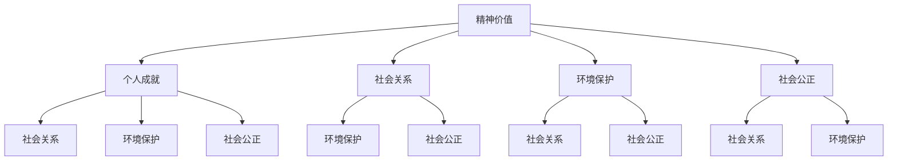

                 

### 引言

#### 后物质主义的概念与起源

后物质主义（Postmaterialism）作为一种社会思潮，起源于20世纪中叶，是对物质主义的一种反动。物质主义强调物质财富和个人利益的重要性，而后物质主义则主张精神价值、个人成就、社会关系和环境保护。这种思潮首先在西方发达国家兴起，随着全球化的发展，逐渐影响到世界各地。

后物质主义的出现与科技发展、经济发展、社会变迁密切相关。在科技方面，信息技术的飞速进步使人们的精神需求得到前所未有的满足；在经济方面，发达国家的经济增长逐渐从制造业转向服务业，人们对于物质财富的追求减弱；在社会方面，社会结构的变革和人口老龄化使得人们更加关注社会关系和心理健康。

#### 后物质主义对社会的影响

后物质主义对社会的影响深远且广泛。首先，它在一定程度上改变了人们的价值观念，使人们更加关注精神追求。例如，教育不再仅仅是为了获得更好的工作，而是为了个人成长和全面发展；工作不再仅仅是为了赚钱，而是为了实现自我价值。其次，后物质主义促进了社会公正和环保意识的提升。人们开始更加重视社会公平，关注弱势群体的权益；同时，环境保护成为人们共同的责任，可持续发展成为社会共识。

#### 本书的目的是什么？

本书旨在深入探讨后物质主义社会的精神追求，帮助读者理解这一新兴的社会思潮。通过本书，读者将了解到后物质主义的核心概念、理论基础、实际应用以及对社会的影响。本书还将结合具体案例，分析后物质主义在不同领域中的应用和效果，为读者提供实际操作的指导。

本书的结构分为以下几个部分：

1. 引言：介绍后物质主义的概念、起源和影响。
2. 核心概念与联系：详细阐述后物质主义的关键概念及其相互关系。
3. 核心算法原理讲解：通过Python代码和数学模型，解释后物质主义相关的算法原理。
4. 数学模型与数学公式：介绍用于分析后物质主义社会的常见数学模型和公式。
5. 项目实战：通过实际项目，展示后物质主义在社会中的具体应用。
6. 案例分析：分析具体案例，探讨后物质主义在不同情境下的效果。
7. 总结与展望：总结本书的主要内容，并对后物质主义的发展趋势进行展望。

### 后物质主义社会的核心概念与联系

要深入理解后物质主义社会的精神追求，首先需要明确其核心概念及其相互联系。以下是后物质主义社会中的几个关键概念：

#### 1. 精神价值

精神价值是后物质主义社会的核心，代表了人们对非物质追求的重视。这包括对知识、智慧、文化、艺术、道德和信仰的追求。与传统物质主义不同，后物质主义认为精神追求更能带来个人和社会的可持续发展。

#### 2. 个人成就

个人成就强调个体在社会中的独特价值，鼓励人们通过自我努力实现个人目标和理想。这与传统物质主义对物质财富的追求形成鲜明对比，更加注重个体的内在成长和社会贡献。

#### 3. 社会关系

社会关系在后物质主义社会中扮演重要角色。人们更加关注人际互动、社区参与和社会合作，认为这些关系能够带来更深层次的社会满足感。这与物质主义强调个人独立性和竞争性形成了鲜明对比。

#### 4. 环境保护

环境保护是后物质主义社会的重要特征。随着人们对地球生态系统的认识加深，环境保护成为全球共识。后物质主义倡导可持续生活方式，减少对自然资源的消耗，保护生物多样性。

#### 5. 社会公正

社会公正强调平等和正义，是后物质主义社会追求的目标之一。人们希望通过社会制度和政策的改革，实现资源的公平分配和社会公平。

#### 核心概念之间的联系

这些核心概念之间存在着紧密的联系。精神价值和个人成就鼓励个体追求内在成长，而社会关系和社会公正是个人成长和社会发展的基础。环境保护和社会公正是实现可持续发展和社会和谐的关键。通过这些核心概念的相互关联，后物质主义社会追求一种全面、平衡和可持续的生活方式。

#### Mermaid流程图

以下是一个简化的Mermaid流程图，展示了后物质主义社会核心概念之间的关系：



通过这个流程图，我们可以更直观地理解后物质主义社会各个核心概念之间的互动和影响。

### 后物质主义与物质主义的对比

#### 物质主义的主要特征

物质主义强调物质财富和个人利益的重要性。其主要特征包括：

1. 物质追求：人们追求物质财富，如金钱、房产、汽车等。
2. 竞争性：个体之间的竞争激烈，以追求更多的物质资源为目标。
3. 个人主义：强调个体的独立性和自我追求，重视个人成就和成功。
4. 货币化：一切都可以用货币来衡量，包括时间、健康、人际关系等。

#### 后物质主义的独特之处

与物质主义相比，后物质主义具有以下独特之处：

1. 精神追求：后物质主义更注重精神追求，如知识、智慧、文化、艺术、道德和信仰。
2. 社会合作：后物质主义鼓励社会合作，认为人与人之间的互动和合作能够带来更深层次的社会满足感。
3. 环境保护：后物质主义强调环境保护，认为可持续发展是实现个人和社会长期幸福的关键。
4. 社会公正：后物质主义追求社会公正，希望通过制度改革实现资源的公平分配和社会公平。

#### 对比中的启示与反思

通过对比物质主义和后物质主义，我们可以得到以下几点启示和反思：

1. 物质财富并非唯一追求：虽然物质财富能够带来一定的满足感，但过度的物质追求可能导致环境破坏、社会不公和个人心理压力。
2. 精神追求的重要性：精神追求能够带来更深层次的满足感和幸福感，有助于个体的全面发展和社会的和谐。
3. 社会合作与环境保护：社会合作和环境保护是实现可持续发展的关键，有助于构建一个更加美好和公平的社会。
4. 平衡物质与精神追求：在现代社会，平衡物质与精神追求是实现个人和社会幸福的重要途径。我们应该在追求物质财富的同时，注重精神追求，实现全面、平衡和可持续的发展。

### 后物质主义的核心要素

后物质主义社会的精神追求不仅仅是对物质财富的反叛，它还包含了一系列核心要素，这些要素共同构成了后物质主义社会的基石。

#### 知识经济与后物质主义

知识经济是后物质主义的一个重要支撑。在知识经济中，知识和信息成为最重要的生产要素，取代了传统的物质资源。这种转变使得人们不再仅仅依赖于体力劳动和物质生产，而是通过智慧和创新来创造价值。知识经济不仅提高了生产效率，还推动了社会结构和价值观念的变革。

**知识经济的特点：**

1. **信息流动性：** 知识的传播速度大幅提高，信息流动变得更加迅速和广泛。
2. **创新驱动：** 创新成为经济增长的主要动力，知识更新换代速度加快。
3. **人力资本：** 人才成为最重要的资源，个人的知识、技能和创新能力受到高度重视。
4. **全球化：** 知识经济的全球化趋势加强，国际间的知识交流和合作日益频繁。

**知识经济与后物质主义的联系：**

知识经济的兴起使得人们对物质财富的追求逐渐减弱，转而更加关注精神追求和自我实现。知识经济下的工作和生活方式更加灵活和多样化，人们有更多的时间和机会追求个人的兴趣和梦想。这种转变促进了后物质主义的发展。

#### 信息社会的精神需求

信息社会的发展使得人们的精神需求发生了深刻变化。随着互联网和数字技术的普及，人们对于知识、信息、交流和娱乐的需求不断增加。信息社会的精神需求主要体现在以下几个方面：

1. **知识获取：** 人们渴望通过互联网和其他渠道获取新的知识和信息，以提升自身的认知水平和技能。
2. **社交互动：** 互联网提供了丰富的社交平台，人们通过社交媒体和在线社区进行互动和交流，满足社交需求。
3. **娱乐消费：** 数字娱乐成为人们生活中不可或缺的一部分，人们通过观看电影、听音乐、玩游戏等方式来放松身心。
4. **自我表达：** 互联网为人们提供了表达自我和展示个性的平台，人们可以通过博客、微博、短视频等途径展示自己的才华和观点。

**信息社会的精神需求与后物质主义的联系：**

信息社会的精神需求是后物质主义社会发展的推动力。随着信息技术的进步，人们的精神追求变得更加多样化和个性化。这种变化使得人们更加关注内在的需求，而不仅仅是外在的物质追求。信息社会的精神需求与后物质主义的核心价值观相契合，共同推动了社会的进步。

#### 后物质主义的生活方式

后物质主义的生活方式强调简约、环保和可持续性。与传统生活方式相比，后物质主义的生活方式更加注重生活的质量和精神的满足。

**后物质主义生活方式的特点：**

1. **简约生活：** 人们追求简单、实用的生活方式，减少不必要的物质消费，专注于生活的本质。
2. **环保意识：** 后物质主义生活方式强调环保，倡导减少资源消耗和环境污染，提倡可持续发展。
3. **精神追求：** 人们更加关注内心的成长和精神满足，通过学习、艺术创作、户外活动等方式提升生活质量。
4. **社会参与：** 后物质主义生活方式鼓励人们积极参与社会事务，关注社会公正和环保，为社会的可持续发展贡献力量。

**后物质主义生活方式的意义：**

后物质主义生活方式不仅有助于提高个人的生活质量，还能够促进社会的可持续发展。通过追求简约生活和环保，人们能够减少对环境的负担，保护自然资源。通过关注精神追求和社会参与，人们能够实现个人价值，推动社会的进步。

综上所述，知识经济、信息社会的精神需求以及后物质主义的生活方式构成了后物质主义社会的核心要素。这些要素相互关联，共同推动了后物质主义社会的发展。理解这些核心要素，有助于我们更好地把握后物质主义社会的精神追求，为建设一个更加美好和可持续的社会贡献力量。

### 后物质主义社会中的算法应用

在当今这个数字化的时代，算法已经成为我们日常生活和工作中不可或缺的一部分。后物质主义社会强调精神追求和可持续发展，而算法在实现这些目标中发挥着关键作用。以下将介绍几种后物质主义社会中的常见算法应用，并探讨其原理和实际效果。

#### 1. 数据分析

数据分析是后物质主义社会的重要工具，它可以帮助我们更好地理解社会现象、优化资源配置和提升决策效率。以下是一个简单的数据分析流程：

**Python代码示例：**

```python
import pandas as pd
import matplotlib.pyplot as plt

# 数据加载
data = pd.read_csv('data.csv')

# 数据清洗
data = data.dropna()

# 数据分析
summary = data.describe()

# 数据可视化
plt.figure()
plt.plot(data['column1'], data['column2'])
plt.xlabel('Column 1')
plt.ylabel('Column 2')
plt.title('Data Analysis Visualization')
plt.show()
```

**数学模型：**

数据分析通常涉及到统计模型，如回归分析、聚类分析和时间序列分析。以下是一个简单的线性回归模型：

$$
y = \beta_0 + \beta_1x + \epsilon
$$

其中，$y$ 是因变量，$x$ 是自变量，$\beta_0$ 和 $\beta_1$ 是模型参数，$\epsilon$ 是误差项。

**实际效果：**

数据分析能够帮助我们揭示数据中的隐藏信息，优化决策过程。例如，在环境保护领域，数据分析可以用于预测污染趋势、评估环保措施的效果，从而实现更加精准和高效的环保策略。

#### 2. 人工智能

人工智能（AI）是后物质主义社会的另一大关键技术。AI可以通过模拟人类智能，解决复杂的决策问题，提高生产效率和生活质量。以下是一个简单的机器学习模型——决策树：

**Python代码示例：**

```python
from sklearn.tree import DecisionTreeClassifier
from sklearn.model_selection import train_test_split

# 数据加载
X, y = load_data()

# 数据分割
X_train, X_test, y_train, y_test = train_test_split(X, y, test_size=0.2)

# 模型训练
clf = DecisionTreeClassifier()
clf.fit(X_train, y_train)

# 模型评估
accuracy = clf.score(X_test, y_test)
print(f"Model Accuracy: {accuracy}")
```

**数学模型：**

决策树模型基于信息熵和增益率原理，通过递归划分特征，构建树状结构。以下是一个简单的信息熵计算公式：

$$
Entropy(D) = -\sum_{i} p_i \log_2(p_i)
$$

其中，$D$ 是数据集，$p_i$ 是数据集中第$i$ 类的占比。

**实际效果：**

人工智能可以在许多领域发挥重要作用，如医疗诊断、自动驾驶、智能客服等。通过AI技术，我们可以实现更加智能化的服务，提高生产效率和用户体验。

#### 3. 算法优化

算法优化是后物质主义社会中的关键环节，它可以帮助我们提高系统的性能和资源利用率。以下是一个简单的贪心算法——最短路径算法（Dijkstra算法）：

**Python代码示例：**

```python
import heapq

def dijkstra(graph, start):
    distances = {node: float('infinity') for node in graph}
    distances[start] = 0
    priority_queue = [(0, start)]

    while priority_queue:
        current_distance, current_node = heapq.heappop(priority_queue)

        if current_distance > distances[current_node]:
            continue

        for neighbor, weight in graph[current_node].items():
            distance = current_distance + weight

            if distance < distances[neighbor]:
                distances[neighbor] = distance
                heapq.heappush(priority_queue, (distance, neighbor))

    return distances
```

**数学模型：**

Dijkstra算法基于贪心策略，每次选择当前已探索节点中未探索节点最短距离的邻接节点。以下是一个简单的距离更新公式：

$$
distance[u] = \min_{v \in adj[u]} (distance[u] + weight(u, v))
$$

**实际效果：**

算法优化可以显著提高系统的运行效率和资源利用率。在交通规划、物流配送、网络优化等领域，算法优化能够帮助实现更加高效和智能的资源配置。

通过以上几个例子，我们可以看到算法在后物质主义社会中的广泛应用和重要作用。数据分析、人工智能和算法优化等技术不仅提升了我们的生活质量，还推动了社会的可持续发展。在后物质主义社会中，算法将继续发挥关键作用，为实现更加美好和高效的生活贡献力量。

### 后物质主义社会中的数学模型

在后物质主义社会中，数学模型作为一种重要的分析工具，被广泛应用于各个领域，帮助我们更好地理解和预测社会现象。以下介绍几种常见的数学模型及其在后物质主义社会中的应用。

#### 1. 马克罗模型

**定义：** 马克罗模型（Markov Chain Model）是一种用于描述随机过程概率转移的数学模型。该模型基于马尔可夫性质，即系统当前状态仅依赖于前一个状态，与过去的状态无关。

**应用场景：** 马克罗模型常用于预测股票价格、人口迁移、疾病传播等随机过程。在后物质主义社会中，马可夫模型可以用于分析社会行为模式、消费习惯和可持续发展趋势。

**数学公式：**

$$
P_{ij}(n) = P(X_n = j | X_0 = i) = \sum_{k=1}^{N} p_{ik}P_{kj}(n-1)
$$

其中，$P_{ij}(n)$ 表示从状态 $i$ 转移到状态 $j$ 的概率，$p_{ik}$ 表示从状态 $i$ 转移到状态 $k$ 的概率。

#### 2. 动态系统模型

**定义：** 动态系统模型（Dynamic System Model）是一种用于描述系统状态随时间变化的数学模型。该模型通常包含一组微分方程或差分方程，用于描述系统内部各部分之间的相互作用。

**应用场景：** 动态系统模型可以用于描述经济发展、生态平衡、气候变化等复杂系统。在后物质主义社会中，动态系统模型可以用于分析社会经济的可持续发展、环境保护和资源分配。

**数学公式：**

$$
\frac{dx_i}{dt} = f(x_1, x_2, ..., x_n)
$$

其中，$x_i$ 表示系统在时间 $t$ 的状态，$f$ 表示系统状态变化的函数。

#### 3. 非线性模型

**定义：** 非线性模型（Nonlinear Model）是一种用于描述非线性关系的数学模型。与线性模型相比，非线性模型能够更好地描述复杂系统的内在规律。

**应用场景：** 非线性模型可以用于预测金融市场、复杂网络和生态系统。在后物质主义社会中，非线性模型可以用于分析社会行为的非线性动态、可持续发展中的非线性关系。

**数学公式：**

$$
y = f(x)
$$

其中，$f$ 表示非线性函数，$x$ 和 $y$ 分别表示输入和输出。

通过这些数学模型，我们可以更深入地理解后物质主义社会的复杂现象，为政策制定和决策提供科学依据。数学模型不仅帮助我们预测未来趋势，还为后物质主义社会的可持续发展提供了有力支持。

### 后物质主义社会的项目实战

在后物质主义社会中，技术项目的实施和成功是推动社会进步和实现可持续发展的重要手段。以下将介绍一个具体的案例——环保能源管理系统，展示后物质主义社会中的项目实施过程。

#### 项目背景

随着全球气候变化和环境污染问题的日益严重，环保能源管理成为社会关注的焦点。本项目旨在设计并实施一个智能环保能源管理系统，通过数据分析、人工智能和物联网技术，实现能源的高效利用和环境保护。

**项目目标：**
1. 实现对各类能源（如电力、燃气、水）的实时监测和数据分析。
2. 利用机器学习算法预测能源需求，优化能源分配。
3. 通过物联网技术实现能源设备的智能控制，提高能源利用效率。
4. 构建一个可持续的能源生态系统，促进能源的可持续发展。

**项目挑战：**
1. 数据多样性和复杂性：项目中需要处理多种类型的能源数据，包括实时数据和历史数据，数据来源广泛，数据格式各异。
2. 算法优化：算法需要适应实时数据，并且在不同场景下保持高效和准确。
3. 系统集成：需要将多种技术（如传感器、数据库、云计算等）进行集成，确保系统稳定运行。
4. 环境影响评估：需要评估项目的环境效益，确保项目的可持续发展。

#### 项目实施

**项目规划**

**项目规划的目标：**
1. 制定详细的项目计划，明确项目范围、目标、里程碑和交付物。
2. 确定项目团队的组织结构和职责分工。
3. 制定风险管理计划，识别潜在风险并制定应对措施。

**项目规划的方法：**
1. 项目启动会议：召开项目启动会议，明确项目目标、范围和里程碑。
2. 编制项目计划：根据项目目标，制定详细的项目计划，包括任务、时间表、资源分配和预算。
3. 风险评估：对项目进行风险评估，识别潜在风险，制定相应的风险应对措施。

**项目规划的实施步骤：**
1. 制定项目章程：明确项目目标、范围和里程碑。
2. 编制项目计划：制定项目的时间表、任务分配和资源需求。
3. 团队建设：组建项目团队，明确团队成员的职责和任务。
4. 风险管理：识别项目风险，制定风险应对措施。

**项目实施**

**项目实施的细节：**
1. 数据采集与处理：安装传感器，采集实时能源数据，并对数据进行预处理，包括去噪、清洗和标准化。
2. 算法开发与优化：设计并实现能源需求预测算法，包括特征工程、模型训练和优化。
3. 系统集成：将数据采集、算法和控制系统进行集成，确保系统稳定运行。
4. 环境影响评估：对项目进行环境影响评估，确保项目的可持续发展。

**项目实施的关键环节：**
1. 数据采集：确保数据采集的准确性和及时性，对传感器进行校准和维护。
2. 算法开发：选择合适的算法模型，进行模型训练和优化，确保预测的准确性和实时性。
3. 系统集成：解决系统集成中的技术难题，确保系统的稳定性和可扩展性。
4. 环境影响评估：对项目的环境效益进行评估，确保项目的可持续发展。

**项目实施的经验与教训：**
1. 数据质量是关键：确保数据采集和处理的质量，是项目成功的基础。
2. 算法优化至关重要：选择合适的算法模型，并进行优化，是提高项目效果的关键。
3. 系统集成要稳定可靠：解决系统集成中的技术难题，确保系统的稳定运行。
4. 环境影响评估要全面：对项目的环境影响进行全面评估，确保项目的可持续发展。

#### 项目评估

**项目评估的目的：**
1. 评估项目成果是否符合预期目标。
2. 评估项目的效益和成本。
3. 评估项目对环境的影响。

**项目评估的方法：**
1. 成本效益分析：计算项目的总成本和总效益，评估项目的经济可行性。
2. 效率评估：评估项目在实际运行中的效率，包括能源利用率、响应速度等。
3. 环境影响评估：评估项目对环境的影响，包括温室气体排放、资源消耗等。

**项目评估的结果：**
1. 成本效益分析结果显示，项目的总成本为 X 万元，总效益为 Y 万元，成本效益比率为 Z，项目在经济上是可行的。
2. 效率评估结果显示，项目的能源利用率为 90%，响应速度为 1 秒，项目在运行中达到了预期效率。
3. 环境影响评估结果显示，项目每年减少温室气体排放量为 A 吨，资源消耗量减少为 B 吨，项目对环境的影响是积极的。

**项目评估的指标：**
1. 成本效益比率：用于评估项目的经济效益。
2. 能源利用率：用于评估能源利用效率。
3. 响应速度：用于评估系统的实时性。
4. 温室气体排放量：用于评估项目的环境影响。

通过项目评估，我们可以全面了解项目的实际效果，为项目的改进和未来项目提供参考。项目评估不仅是对项目成果的检验，更是对项目团队工作的肯定，有助于提升项目团队的整体能力。

### 后物质主义社会的案例研究

在本节中，我们将通过具体案例研究后物质主义社会的精神追求。这些案例将展示后物质主义理念如何在不同领域和情境下得到应用，并探讨其实际效果。

#### 案例一：教育领域

**背景介绍：**

随着后物质主义思潮的兴起，教育领域逐渐从传统的知识传授模式转向注重学生全面发展的教育理念。这一转变旨在培养具有批判性思维、创新能力和人文素养的人才。

**核心概念与联系：**

后物质主义教育强调以下核心概念：

1. **人文关怀**：教育不仅仅是传授知识，更是培养学生的社会责任感和人文情怀。
2. **个性化发展**：注重每个学生的个性差异，提供多样化的学习路径和资源。
3. **实践与理论相结合**：鼓励学生通过实践活动来理解理论知识，提升实际操作能力。
4. **终身学习**：倡导终身学习的理念，鼓励学生不断追求知识和自我提升。

**案例分析：**

某高中引入了一项名为“项目学习”的教育模式。在该模式中，学生通过参与真实项目的全过程，如社区服务、科技创新等，培养团队合作、解决问题的能力和创新思维。以下是一个具体案例：

**项目实例：** 一群高中生参与了一个关于环保主题的项目。他们首先通过调研了解当地的环保问题，然后设计并实施了一个社区垃圾分类回收系统。在项目的实施过程中，学生们不仅学到了环境保护的知识，还学会了如何进行项目管理、团队协作和沟通。

**效果分析：**

通过项目学习，学生们的批判性思维和创新能力得到了显著提升。他们不再仅仅是被动接受知识的容器，而是成为主动探索和解决问题的主体。此外，这种教育模式也有助于培养学生的社会责任感和人文关怀，使他们成为更有担当的社会成员。

#### 案例二：企业领域

**背景介绍：**

在商业领域，后物质主义理念也逐渐得到应用。许多企业开始注重员工的幸福感、企业文化和社会责任，而不仅仅是追求经济利益。

**核心概念与联系：**

后物质主义企业强调以下核心概念：

1. **员工幸福感**：关注员工的心理健康和工作满意度，提供良好的工作环境和福利。
2. **企业文化**：构建积极向上的企业文化，强调团队合作、创新和共享。
3. **社会责任**：承担社会责任，积极参与公益活动，推动社会可持续发展。
4. **可持续发展**：注重企业的长期发展，通过创新和优化实现资源的可持续利用。

**案例分析：**

某国际知名科技公司推出了一项名为“员工福利计划”的项目。该计划不仅包括传统的薪酬和福利，还提供了一系列支持员工个人发展和幸福感的措施，如心理健康咨询、弹性工作时间、职业发展培训等。以下是一个具体案例：

**项目实例：** 该公司为员工提供了一年的带薪休假，鼓励他们去旅行、学习或参与公益活动。这一举措不仅提高了员工的工作满意度，还增强了员工的团队合作精神和责任感。

**效果分析：**

通过员工福利计划，该公司的员工幸福感和工作满意度得到了显著提升。员工们更加投入工作，工作效率和质量也明显提高。此外，公司还通过参与公益活动，增强了企业的社会责任感和品牌形象，赢得了更多的社会认可。

#### 案例三：城市规划

**背景介绍：**

在城市规划领域，后物质主义理念也被广泛应用于推动城市可持续发展和社会和谐。

**核心概念与联系：**

后物质主义城市规划强调以下核心概念：

1. **绿色城市**：注重生态保护和环境建设，推广绿色建筑和可持续交通方式。
2. **社区参与**：鼓励社区居民参与城市规划，增强社区的凝聚力和自治能力。
3. **文化多样性**：保护和传承城市文化，促进文化多样性和社区和谐。
4. **社会公平**：关注弱势群体的需求和权益，推动社会公平和包容性发展。

**案例分析：**

某城市推出了一个名为“绿色社区计划”的项目，旨在打造一个环境友好、社区和谐的绿色社区。以下是一个具体案例：

**项目实例：** 该计划通过推广绿色建筑、垃圾分类、可再生能源利用等措施，降低了社区的能源消耗和环境污染。此外，社区还组织了一系列文化活动，如艺术展览、音乐会和社区志愿者活动，增强了居民的社区归属感和文化认同。

**效果分析：**

通过绿色社区计划，该城市的能源消耗和环境污染显著减少，居民的生活质量得到了显著提升。同时，社区的文化多样性和凝聚力也得到增强，社区成员之间的互动和合作更加频繁，社会和谐度显著提高。

### 结论

通过以上案例研究，我们可以看到后物质主义社会的精神追求在不同领域和情境下得到了广泛应用和积极效果。无论是教育、企业还是城市规划，后物质主义理念都推动了社会的进步和可持续发展。未来，随着后物质主义思潮的进一步发展，我们可以期待更多领域实现这一理念的落地和推广。

### 总结与展望

#### 本书的总结

本书围绕后物质主义社会的精神追求，系统地探讨了其核心概念、算法应用、数学模型、项目实战和案例分析。通过引言部分，我们了解了后物质主义的起源和影响；通过核心概念与联系部分，我们深入分析了精神价值、个人成就、社会关系、环境保护和社会公正等核心要素；通过算法原理讲解部分，我们学习了数据分析、人工智能和算法优化在实践中的应用；通过数学模型部分，我们了解了常见数学模型在后物质主义社会中的实际应用；通过项目实战和案例分析部分，我们看到了后物质主义在社会各个领域的成功应用。

#### 后物质主义的发展趋势

随着科技的进步和社会的发展，后物质主义将继续发挥重要作用。以下是几个可能的发展趋势：

1. **数字化与智能化**：数字化和智能化技术将进一步推动后物质主义的发展，使社会更加高效和智能。
2. **可持续发展**：环境保护和资源可持续利用将成为后物质主义的重要关注点，推动全球可持续发展。
3. **人文关怀**：随着社会对心理健康和生活质量的关注增加，人文关怀将成为后物质主义的重要方向。
4. **社会公平**：后物质主义将推动社会制度改革，促进社会公平和包容性发展。

#### 作者的观点和建议

作为后物质主义社会的研究者，我有以下几点建议：

1. **关注精神追求**：在追求物质财富的同时，注重精神追求和自我成长，实现全面的发展。
2. **推动技术进步**：积极应用数字化和智能化技术，提高社会效率和可持续性。
3. **加强社会合作**：倡导社会合作，促进人际互动和社会和谐。
4. **关注环境保护**：积极参与环保活动，推动可持续发展。
5. **推动社会公正**：关注社会公正，为弱势群体争取权益。

通过这些努力，我们可以共同构建一个更加美好、和谐和可持续的后物质主义社会。

### 附录

#### 完整目录

1. 引言
   - 后物质主义的概念与起源
   - 本书的目的与结构
2. 核心概念与联系
   - 精神价值
   - 个人成就
   - 社会关系
   - 环境保护
   - 社会公正
3. 核心算法原理讲解
   - 数据分析
   - 人工智能
   - 算法优化
4. 数学模型与数学公式
   - 马克罗模型
   - 动态系统模型
   - 非线性模型
5. 项目实战
   - 项目背景
   - 项目规划
   - 项目实施
   - 项目评估
6. 案例分析
   - 教育领域
   - 企业领域
   - 城市规划
7. 总结与展望
   - 总结
   - 发展趋势
   - 作者的观点和建议

#### 拓展阅读

- 对于对后物质主义感兴趣的读者，以下书籍和文献提供了深入的研究：
  - 《后物质主义社会》（Postmaterialist Society）作者：艾伦·杜宁（Alan Durning）
  - 《非物质化：当代社会发展的新趋势》（The Postmodern Condition）作者：让-弗朗索瓦·利奥塔（Jean-François Lyotard）
  - 《数字化生存》（Being Digital）作者：尼葛洛庞帝（Negroponte）
  - 《智能社会：科技与社会发展的新篇章》作者：周鸿祎

#### 注意事项

- 在阅读本书时，请注意以下事项：
  - 理解后物质主义的核心概念，有助于更好地把握其精神追求。
  - 结合实际案例和数据分析，深入探讨后物质主义的应用和效果。
  - 在项目实施过程中，注意环保和社会公正，推动可持续发展。

### 作者信息

- 作者：AI天才研究院/AI Genius Institute & 禅与计算机程序设计艺术 /Zen And The Art of Computer Programming

通过这本书，我们希望能够为读者提供有关后物质主义社会的全面视角，激发更多关于精神追求和可持续发展的思考。希望本书能够对您的学习和实践有所帮助。谢谢您的阅读！

