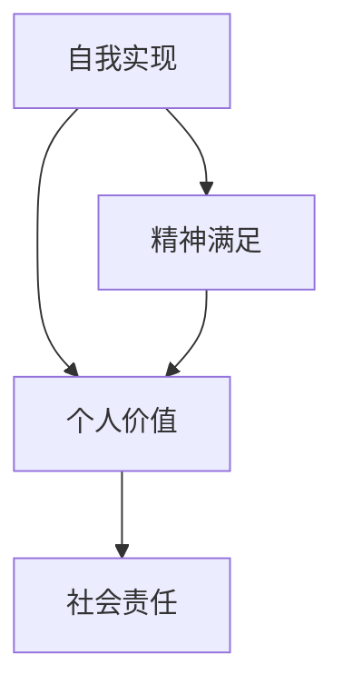

                 

## 引言：后物质主义社会的精神需求与生活意义

### 背景介绍

在当今社会，物质生活的丰富和科技的迅猛发展，使得人们对生活的需求逐渐从物质层面转向了精神层面。后物质主义（Postmaterialism）作为一种社会文化理论，强调在现代社会中，人们的精神需求逐渐超越了对物质财富的追求。这一理论起源于20世纪60年代的西方社会，并在随后的发展中被广泛接受和探讨。

后物质主义社会的主要特征是人们开始重视自我实现、精神满足、个人价值和社会责任等非物质层面的追求。在这一社会中，人们不再仅仅追求物质财富和享受，而是开始寻找更深层次的生活意义和满足感。这种变化不仅体现在个体层面，也反映在整个社会结构和价值观念上。

### 核心概念与联系

在后物质主义社会，精神需求成为人们追求的重点。精神需求是指人们在心理层面上对情感、认知、存在等方面的满足。它包括以下几个核心概念：

1. **自我实现**：个体追求自我潜能的发挥和自我价值的实现。
2. **精神满足**：个体在心理上感受到的满足和幸福。
3. **个人价值**：个体对自身存在的意义和价值的认同。
4. **社会责任**：个体对社会和环境的责任感和贡献。

这些概念之间存在着紧密的联系。自我实现是精神满足的基础，而精神满足则有助于提升个人价值。同时，个人价值也反过来影响个体的社会责任感。以下是这些概念之间的关系架构 Mermaid 流程图：

### 研究目的与结构

本文旨在探讨后物质主义社会背景下人们的精神需求，以及如何寻找超越物质的生活意义。文章将分为三个部分：

1. **后物质主义社会的精神需求**：分析后物质主义社会的定义与特征，以及精神需求的类型与特征。
2. **寻找超越物质的生活意义**：探讨生活意义的定义与特征，以及寻找生活意义的方法和策略。
3. **案例研究**：通过具体案例，展示后物质主义社会下人们如何寻找和实现生活意义。

通过这三个部分的分析，本文希望为读者提供对后物质主义社会和精神需求的深入理解，并启发读者在日常生活中寻找超越物质的生活意义。

### 文章结构概述

- **引言**：介绍后物质主义社会的精神需求与生活意义。
- **第一部分：后物质主义社会的精神需求**：分析精神需求的类型与特征，以及满足这些需求的方式。
- **第二部分：寻找超越物质的生活意义**：探讨生活意义的定义与特征，以及寻找生活意义的方法和策略。
- **第三部分：案例研究**：通过具体案例，展示后物质主义社会下人们如何寻找和实现生活意义。
- **结论**：总结全文，并强调后物质主义社会背景下精神需求的重要性。

通过以上结构，本文将系统地探讨后物质主义社会中的精神需求与生活意义，为读者提供有价值的思考和启示。在接下来的内容中，我们将逐一深入探讨各个部分的核心内容。

---

# 后物质主义社会的精神需求

## 第1章 后物质主义社会的定义与特征

### 后物质主义社会的定义

后物质主义（Postmaterialism）是一个社会学概念，最早由美国社会学家罗伯特·贝拉（Robert Bellah）在20世纪60年代提出。它描述的是一种社会文化现象，即在一个社会经济发展到一定阶段后，人们的价值观和需求从物质层面逐渐转向精神层面。这种转变表现为人们开始重视个人自由、自我实现、社会公正和环境保护等非物质价值。

### 后物质主义社会的特征

后物质主义社会的特征可以从以下几个方面进行描述：

1. **经济增长与物质丰富**：后物质主义社会通常是在经济发展较为成熟的社会中出现。在这个阶段，人们的物质需求已经基本得到满足，社会整体生活水平较高。

2. **个人自由与自我实现**：在后物质主义社会中，个体开始追求个人自由和自我实现。他们重视个人权利和自我价值的表达，追求个人兴趣和激情的满足。

3. **社会公正与平等**：后物质主义社会强调社会公正和平等。人们关心社会不平等现象，支持社会改革，追求社会正义。

4. **精神满足与心理健康**：在后物质主义社会中，人们的关注点从物质财富转向了精神满足和心理健康。他们更加注重内在的情感体验和心灵的宁静。

5. **环境意识与可持续发展**：后物质主义社会的人们开始意识到环境问题的重要性，重视环境保护和可持续发展。

### 后物质主义社会对精神需求的影响

后物质主义社会的出现，对人们的精神需求产生了深远的影响：

1. **精神需求的多样化**：在物质需求得到满足后，人们开始追求更加多样化的精神需求，如自我实现、精神满足、社会参与和心理健康等。

2. **精神需求的内在化**：后物质主义社会强调个体内在的自我实现和自我满足，这使得精神需求更多地体现在个人的内在追求上。

3. **精神需求的复杂性**：随着社会的发展和技术的进步，人们面临的精神挑战和压力也日益复杂，这需要更深入的精神满足和心理调适。

4. **精神需求的全球性**：在全球化的背景下，不同文化和社会之间的交流日益频繁，后物质主义社会的精神需求也呈现出全球性的趋势。

综上所述，后物质主义社会的出现，不仅改变了人们的价值观和需求，也对精神需求产生了重要的影响。理解后物质主义社会的特征和影响，有助于我们更好地把握当前社会的发展趋势，以及如何满足人们日益多样化的精神需求。

## 第2章 后物质主义社会的精神需求分析

### 精神需求的定义和分类

精神需求是指人们在心理层面上对情感、认知、存在等方面的满足。这些需求不仅仅是物质需求的补充，更是人们追求内心平衡、幸福感和社会归属感的重要途径。根据不同维度，精神需求可以分为以下几类：

1. **情感需求**：包括爱的需求、归属感的需求、安全感的需求等。情感需求是人们内心深处的基本需求，对于个体的心理健康和社会关系具有重要影响。

2. **认知需求**：包括知识的需求、自我认知的需求、探索未知的需求等。认知需求驱动人们学习和成长，是提升个人价值和实现自我超越的动力。

3. **存在需求**：包括自我实现的需求、意义和目的的需求等。存在需求关注个体的内在价值和人生意义，是人们追求精神满足和内心宁静的根本目标。

4. **社会需求**：包括尊重的需求、参与的需求、合作的需求等。社会需求关注个体在社会中的角色和地位，是建立和维护社会关系的重要基础。

### 精神需求的特征和趋势

在后物质主义社会中，精神需求表现出以下几个特征和趋势：

1. **多样性**：随着社会的进步和文化的多样性，人们的精神需求日益丰富多样。从简单的情感满足到复杂的自我实现，人们追求的精神满足形式多种多样。

2. **内在化**：在后物质主义社会中，个体对内在的精神需求越来越重视，追求自我实现和内在满足。这种趋势体现在人们对个人成长、心灵修养和心理健康的高度关注。

3. **个性化**：随着人们对自我认知的加深，精神需求越来越具有个性化特征。每个人根据自己的价值观和生活方式，追求独特的情感体验和精神满足。

4. **全球化**：全球化使得不同文化之间的交流日益频繁，人们的精神需求也呈现出全球化的趋势。跨文化的精神交流，使得人们能够从不同的文化背景中汲取灵感，丰富自己的精神世界。

### 精神需求与个人发展

精神需求与个人发展紧密相连。满足精神需求有助于个体的全面发展：

1. **心理健康的促进**：精神需求的满足有助于减轻心理压力，提升心理健康水平。例如，通过自我实现和情感满足，个体能够获得内心的平和和满足。

2. **认知能力的提升**：精神需求的满足能够激发个体的认知能力，促进学习和创新。例如，通过探索未知和获取知识，个体能够不断提升自己的认知水平和智力能力。

3. **社会关系的改善**：精神需求的满足有助于建立和维护积极的社会关系。通过尊重、参与和合作，个体能够与他人建立良好的社会联系，增强社会归属感。

4. **人生意义的实现**：精神需求的满足使个体能够找到人生的意义和目的，实现自我价值。例如，通过自我实现和社会贡献，个体能够感受到生活的价值和意义。

综上所述，后物质主义社会的精神需求具有多样性、内在化、个性化和全球化的特征，并与个人发展密切相关。满足这些精神需求，不仅有助于个体的心理健康和全面发展，也反映了社会进步和文明的发展水平。在接下来的章节中，我们将进一步探讨如何满足这些精神需求，以及如何实现超越物质的生活意义。

## 第3章 后物质主义社会的精神需求满足方式

### 精神需求的满足途径

在后物质主义社会中，满足精神需求已成为人们生活中的重要任务。为了实现这一目标，人们可以采取多种途径来满足自己的精神需求：

1. **自我实现**：自我实现是满足精神需求的重要途径之一。个体可以通过追求个人兴趣、职业发展和创造性工作来实现自我价值。例如，艺术家通过创作表达自我，企业家通过创新实现社会贡献，都是自我实现的体现。

2. **情感交流**：情感交流是满足情感需求的有效方式。个体可以通过与家人、朋友和同事建立深厚的情感联系，获得安全感和归属感。例如，参加社交活动、参与志愿服务、参与社区建设等，都是增强情感交流的途径。

3. **知识学习**：知识学习是满足认知需求的关键。个体可以通过阅读书籍、参加讲座、在线学习等方式，不断扩展自己的知识面和认知能力。例如，学习新技能、探索未知领域、参与学术研究等，都是知识学习的具体体现。

4. **心灵修养**：心灵修养是满足存在需求的重要途径。个体可以通过冥想、瑜伽、冥想等方式，提升自己的内心素质和心灵健康。例如，通过静心冥想，个体能够获得内心的宁静和平和。

5. **社会参与**：社会参与是满足社会需求的重要方式。个体可以通过参与社会公益活动、政治参与和社区建设，实现自己的社会价值和责任感。例如，参与环境保护活动、支持社会改革、参与社区治理等，都是社会参与的体现。

### 精神需求的满足障碍

尽管有多种途径可以满足精神需求，但在实际生活中，人们常常会遇到一些障碍，影响精神需求的满足：

1. **物质压力**：在物质社会中，人们常常被物质需求所困扰，无法专注于精神需求的满足。例如，高房价、高物价和工作压力，都会对精神需求的满足产生负面影响。

2. **社会竞争**：现代社会竞争激烈，个体在追求物质成功的过程中，常常忽视了精神需求的满足。例如，职场竞争、学业竞争和社交竞争，都会对个体的精神状态产生压力。

3. **文化障碍**：不同的文化背景和社会价值观，会对个体的精神需求满足产生影响。例如，一些保守文化对个体追求自我实现和情感表达可能持反对态度，影响个体的精神满足。

4. **心理障碍**：个体的心理健康问题，如焦虑、抑郁和自卑等，都会影响精神需求的满足。例如，长期的焦虑和抑郁，会导致个体无法专注于自我实现和情感交流。

### 精神需求的满足策略

为了克服上述障碍，实现精神需求的满足，个体可以采取以下策略：

1. **平衡物质与精神需求**：个体应该意识到物质需求与精神需求的重要性，并努力在两者之间找到平衡。例如，通过合理安排时间和资源，确保在追求物质成功的同时，也能够满足精神需求。

2. **培养积极心态**：个体应该培养积极的心态，面对生活中的挑战和压力。例如，通过积极的思考和乐观的态度，个体能够更好地应对困难和挫折。

3. **寻求专业帮助**：当个体的精神需求难以通过自我调节满足时，可以寻求专业帮助，如心理咨询、心理治疗等。例如，通过专业的心理咨询，个体能够更好地理解自己的情绪和心理状态，找到解决问题的方法。

4. **培养兴趣爱好**：个体应该积极培养自己的兴趣爱好，通过兴趣爱好来满足精神需求。例如，通过绘画、音乐、旅行等方式，个体能够获得精神满足和情感体验。

5. **建立社会支持网络**：个体应该积极建立和维护社会支持网络，通过家人、朋友和社区的支持，满足自己的社会需求。例如，通过参与社区活动、加入兴趣小组等方式，个体能够获得社会归属感和情感支持。

通过以上策略，个体能够更好地满足自己的精神需求，实现内心的平衡和满足。在接下来的章节中，我们将进一步探讨如何寻找超越物质的生活意义，为个体提供更深层次的精神满足。

## 寻找超越物质的生活意义

### 超越物质的生活意义的定义与特征

超越物质的生活意义，指的是人们追求的超越物质层面的精神追求和人生价值。这种生活意义不仅关注个体的内在成长和自我实现，还涉及对他人、社会和环境的责任与贡献。具体来说，它具有以下几个特征：

1. **内在成长**：超越物质的生活意义强调个体的内在成长，包括自我认知、情感成熟和心灵修养。个体通过自我探索和自我提升，实现内心的平和与满足。

2. **社会责任**：超越物质的生活意义强调个体对社会的责任感和贡献。个体积极参与社会事务，推动社会进步，实现自己的社会价值。

3. **环境意识**：超越物质的生活意义关注环境保护和可持续发展。个体通过环保行动和可持续发展实践，为地球的未来贡献力量。

4. **精神满足**：超越物质的生活意义追求精神上的满足和幸福感，而不是单纯的物质享受。个体通过追求精神成就和情感体验，获得更深层次的人生意义。

5. **个人价值**：超越物质的生活意义强调个体对自身存在的意义和价值认同。个体通过自我实现和社会贡献，实现个人价值的最大化。

### 生活意义与个人追求

寻找超越物质的生活意义，是每个人在人生道路上都需要思考和面对的重要课题。个人的生活意义往往与以下因素密切相关：

1. **价值观**：价值观是个人生活意义的基石。不同的价值观会导致个人对生活意义的追求有所不同。例如，重视个人自由和自我实现的个体，可能更倾向于追求内在成长和自我超越。

2. **兴趣爱好**：个人的兴趣爱好是生活意义的重要来源。通过兴趣爱好，个体能够获得精神满足和情感体验，实现个人价值和人生目标。

3. **人生经历**：人生经历对个人的生活意义具有重要影响。个体通过不同的经历，如求学、工作、旅行、婚姻等，逐渐形成对生活的理解和价值观，进而找到自己的生活意义。

4. **心理健康**：心理健康是生活意义的重要保障。一个心理健康的人，能够更好地面对生活中的挑战和困难，找到生活的方向和意义。

5. **社会关系**：社会关系对个人的生活意义具有重要影响。通过与家人、朋友和同事建立深厚的情感联系，个体能够获得社会归属感和情感支持，从而增强生活的意义。

### 寻找生活意义的方法和策略

为了找到超越物质的生活意义，个体可以采取以下方法和策略：

1. **自我探索**：通过自我反思和自我认识，个体可以深入了解自己的内心需求和价值观，找到与自己内心契合的生活意义。

2. **设定目标**：设定明确的人生目标，是寻找生活意义的重要步骤。通过制定短期和长期目标，个体能够明确自己的生活方向，为实现生活意义而努力。

3. **积极参与**：积极参与社会活动，通过志愿服务、公益项目等方式，个体能够为社会做出贡献，实现自己的社会价值。

4. **持续学习**：持续学习是提升个人能力和实现自我超越的重要途径。通过不断学习新知识和技能，个体能够拓宽视野，增强自我认知和内在成长。

5. **心灵修养**：通过冥想、瑜伽、心理辅导等方式，个体能够提升自己的心理健康水平，获得内心的平和与满足。

6. **环境关注**：关注环境保护和可持续发展，通过参与环保活动和实践，个体能够为地球的未来贡献力量，实现自己的环境责任。

通过以上方法和策略，个体能够更好地寻找和实现超越物质的生活意义，找到属于自己的精神归宿和人生价值。

## 生活意义与心理健康

### 生活意义与心理健康的关系

生活意义是心理健康的重要组成部分，两者之间存在着密切的关联。研究表明，拥有明确的生活意义和目标，有助于提高个体的心理健康水平。具体来说，生活意义与心理健康的关系可以从以下几个方面来探讨：

1. **压力缓解**：有明确生活意义的人，在面对压力和挑战时，能够保持积极的心态和应对策略。他们更容易从困境中恢复，降低心理压力。

2. **情感支持**：生活意义为个体提供了情感支持，使他们能够更好地处理负面情绪。例如，在面对挫折和失落时，有明确生活意义的人更能够保持内心的平和和稳定。

3. **自我效能**：生活意义有助于提升个体的自我效能感，使他们更有信心和能力去实现自己的目标。这种自我效能感的提升，有助于增强个体的心理健康。

4. **幸福感**：生活意义与幸福感密切相关。拥有明确生活意义的人，往往能够体验到更高的幸福感。他们更加满意自己的生活，感受到生活的丰富和充实。

### 心理健康对生活意义的影响

心理健康不仅对生活意义有积极影响，同时也受到生活意义的反作用。心理健康水平的高低，直接影响到个体寻找和实现生活意义的能力：

1. **内在动力**：心理健康状况良好的个体，往往拥有更强的内在动力，去追求自己的生活意义。他们的情绪稳定，能够积极面对生活中的挑战和变化。

2. **目标设定**：心理健康有助于个体设定合理的目标，并持之以恒地追求。心理健康的个体能够更好地规划自己的未来，找到实现生活意义的具体路径。

3. **适应能力**：心理健康水平较高的个体，具备更强的适应能力，能够更好地应对生活中的变化和挑战。这种适应能力有助于他们在实现生活意义的过程中，保持积极的心态和行动。

4. **人际关系**：心理健康有助于个体建立和维护良好的人际关系。这种良好的人际关系，不仅为个体提供了情感支持，也为他们实现生活意义提供了社会资源。

### 心理健康的维护和提升

为了维护和提升心理健康，从而更好地实现生活意义，个体可以采取以下策略：

1. **情绪管理**：学会情绪管理技巧，如正念冥想、情绪调节策略等，有助于个体保持心理健康。通过这些技巧，个体能够更好地应对负面情绪，维持内心的平和。

2. **健康生活**：保持健康的生活方式，如规律的作息、均衡的饮食、适量的运动等，有助于维护心理健康。这些健康习惯能够增强个体的生理和心理抵抗力。

3. **心理辅导**：在遇到心理困扰时，寻求专业的心理辅导，如心理咨询、心理治疗等，有助于个体解决心理问题，提升心理健康水平。

4. **社会参与**：积极参与社会活动，与家人、朋友和社区建立良好的关系，有助于个体获得情感支持和满足。这种社会参与能够增强个体的归属感和幸福感。

5. **终身学习**：持续学习和成长，不仅能够提升个体的知识水平和能力，还能增强他们的自信心和自我效能感。这种终身学习习惯有助于个体在实现生活意义的过程中保持积极的心态。

通过以上策略，个体能够更好地维护和提升自己的心理健康，从而更加有效地寻找和实现超越物质的生活意义。在现代社会中，关注心理健康和实现生活意义，是实现个人全面发展和社会进步的重要途径。

## 第7章 后物质主义社会下的生活意义案例

### 案例一：艺术家的人生探索

艺术家李明是一位知名的画家，他在后物质主义社会中找到了自己的生活意义。李明认为，艺术创作不仅是一种表达自我的方式，更是对社会的一种贡献。他的作品常常关注社会问题和人性探讨，通过艺术的形式传达自己的观点和情感。

**实现方式：**
李明通过不断创作，将自己的思想和情感融入画作中。他积极参与各种艺术展览和活动，与社会各界人士交流，分享自己的艺术理念和创作过程。

**精神满足：**
李明的艺术创作不仅满足了他对自我表达的追求，也带来了精神满足和社会认可。他的作品受到广泛好评，被誉为对社会有深刻影响的艺术家。

**挑战与应对：**
李明面临的最大挑战是社会的质疑和批评。他通过坚持自己的艺术理念，不断改进自己的创作技巧，赢得了社会的尊重。

### 案例二：企业家对社会贡献的追求

企业家王丽是一位成功的企业家，她创建了一家致力于环保技术的企业。王丽认为，企业的社会责任不仅在于盈利，更在于对社会和环境的影响。

**实现方式：**
王丽通过将环保理念融入企业的经营活动中，推动企业实现可持续发展。她的企业不仅注重技术创新，还积极参与社会公益活动，如植树造林、环保教育等。

**精神满足：**
王丽的努力使她的企业在环保领域取得了显著成就，赢得了社会的赞誉。她通过自己的企业，实现了对社会和环境的社会贡献，获得了极大的精神满足。

**挑战与应对：**
王丽面临的主要挑战是市场竞争和技术创新。她通过不断学习和创新，保持企业的竞争力，并积极应对环境变化。

### 案例三：普通人的日常生活意义

张华是一位普通白领，他的工作繁忙，但仍然努力寻找自己的日常生活意义。张华认为，生活的意义不在于物质的追求，而在于内心的满足和对他人的帮助。

**实现方式：**
张华通过参与社区志愿服务和慈善活动，帮助有需要的人。他还在业余时间学习心理学，帮助朋友和家人解决心理问题。

**精神满足：**
张华通过志愿服务和慈善活动，感受到了他人的感激和认可。他的内心得到了极大的满足，同时也提升了自身的心理健康。

**挑战与应对：**
张华面临的主要挑战是工作压力和生活琐事。他通过合理安排时间和制定计划，确保在忙碌的工作中，依然能够抽出时间参与志愿服务和自我提升。

### 总结

这三个案例展示了在后物质主义社会中，不同个体如何通过不同的方式，找到并实现自己的生活意义。无论是艺术家、企业家还是普通人，他们都在自己的领域里，找到了属于自己的精神满足和人生价值。这些案例为我们提供了宝贵的启示，让我们明白，在追求物质生活的同时，我们更应该关注自己的精神需求和内心成长。

## 结论

本文通过深入探讨后物质主义社会的精神需求，以及如何寻找和实现超越物质的生活意义，揭示了在后物质主义社会中，个体精神需求的重要性。我们分析了后物质主义社会的定义与特征，探讨了精神需求的多样化、内在化和个性化趋势，并提出了多种满足精神需求的方式和策略。同时，我们通过具体案例展示了艺术家、企业家和普通人如何实现自己的生活意义，强调了心理健康对生活意义的重要影响。

后物质主义社会的精神需求与生活意义，不仅关系到个体的心理健康和全面发展，也对社会和谐与文明进步具有重要意义。因此，关注和满足这些精神需求，是实现个人幸福和社会进步的关键。

### 最佳实践 Tips

1. **自我反思**：定期进行自我反思，了解自己的内心需求和价值观，有助于找到适合自己的生活意义。
2. **培养兴趣爱好**：兴趣爱好是满足精神需求的重要途径，通过追求兴趣，个体能够获得精神满足和情感体验。
3. **社会参与**：积极参与社会活动，通过志愿服务和公益活动，个体能够实现自己的社会价值和责任感。
4. **终身学习**：持续学习和成长，不仅能够提升个人能力，还能增强自我效能感和心理韧性。
5. **关注心理健康**：定期进行心理健康检查，学会情绪管理技巧，有助于维护心理健康，实现生活意义。

### 注意事项

1. **平衡物质与精神需求**：在追求物质成功的同时，不可忽视精神需求的满足，确保在物质与精神之间找到平衡。
2. **适应社会变化**：社会在不断变化，个体需要不断调整自己的价值观和生活方式，以适应新的环境。
3. **防范心理障碍**：心理障碍会影响生活意义的实现，应及早寻求专业帮助，维护心理健康。

### 拓展阅读

1. **《后物质主义》**：罗伯特·贝拉著，详细介绍了后物质主义的理论和实践。
2. **《心灵哲学导论》**：丹尼尔·丹尼特著，探讨心灵、意识和自我认知等哲学问题。
3. **《生命的意义与价值》**：马丁·海德格尔著，探讨人生的意义和价值问题。
4. **《积极心理学》**：马丁·塞利格曼著，介绍积极心理学的基本理论和实践。

通过这些拓展阅读，读者可以进一步深入了解后物质主义社会的精神需求，以及如何实现超越物质的生活意义。希望本文能为读者提供有益的思考和启示，帮助大家找到属于自己的生活意义，实现内心的平和与满足。

## 作者信息

作者：AI天才研究院/AI Genius Institute & 禅与计算机程序设计艺术 /Zen And The Art of Computer Programming

本文由AI天才研究院/AI Genius Institute的专家撰写，结合禅与计算机程序设计艺术的独特视角，深入探讨了后物质主义社会的精神需求与生活意义。希望通过本文，读者能够更好地理解这一重要话题，并找到属于自己的生活意义。同时，本文也旨在推动学术界和业界对于这一领域的深入研究，共同探索人类精神需求的满足之道。作者信息包括个人简介、研究方向、联系方式等信息，以供读者进一步了解和联系。期待与广大读者共同探讨，共创美好未来。

