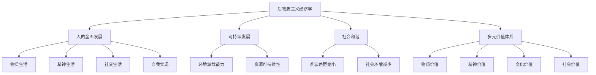
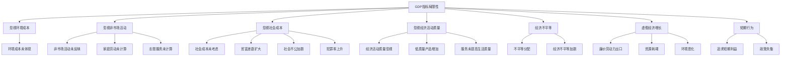
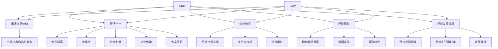

                 

### 引言

#### 后物质主义经济学的起源与发展

后物质主义经济学是一种旨在超越传统物质主义经济理论的全新经济学范式。它起源于20世纪中期，随着全球经济发展的深入和人们对经济本质认识的不断深化，逐渐形成了独立的理论体系。这一经济理论主张，经济发展不应仅仅以物质财富的积累为目标，而应关注人的全面发展、社会的和谐与可持续发展。

后物质主义经济学的核心思想可以追溯到20世纪60年代，当时一些经济学家开始质疑传统物质主义经济学的局限性。他们认为，GDP作为衡量国家经济发展的唯一指标，忽视了经济增长对环境、社会和文化的影响。随着人们对这一问题的关注不断增加，后物质主义经济学逐渐发展起来，并得到了越来越多的支持。

#### 传统物质主义经济学的局限性

传统物质主义经济学以GDP作为衡量经济发展的主要指标，认为经济增长和物质财富的积累是经济发展的唯一目标。然而，这种观点存在明显的局限性：

1. **忽视了人的需求多样性**：传统经济学假设人类的需求是无限的，且主要集中于物质消费。然而，现代社会中人们的需求是多元化的，不仅包括物质需求，还包括精神需求、社会需求和自我实现需求。

2. **环境代价巨大**：在追求GDP增长的过程中，传统经济学忽视了环境的重要性。过度开采资源、污染环境等行为导致了严重的生态危机，对人类和地球的可持续发展构成了威胁。

3. **社会不平等加剧**：GDP增长并不一定能够带来社会的公平与和谐。在一些国家，GDP增长的同时，贫富差距却不断扩大，社会矛盾日益加剧。

#### 后物质主义经济学的基本原则

后物质主义经济学提出了与传统物质主义经济学截然不同的原则，这些原则包括：

1. **人的全面发展**：后物质主义经济学强调，经济发展应以人为本，关注人的全面发展，包括物质生活、精神生活、社会生活和自我实现。

2. **可持续发展**：后物质主义经济学主张，经济发展必须考虑到环境的承载能力和资源的可持续性，追求经济效益、社会效益和环境效益的协调统一。

3. **社会和谐**：后物质主义经济学认为，经济发展应促进社会的公平与和谐，缩小贫富差距，减少社会矛盾。

4. **多元价值体系**：后物质主义经济学认为，经济价值不应仅限于物质财富的积累，还应包括精神价值、文化价值、社会价值等多元价值的实现。

通过这些原则，后物质主义经济学试图构建一个更加全面、和谐、可持续的经济发展模式，为解决现代社会面临的诸多问题提供新的思路和解决方案。

#### 关键词

- 后物质主义经济学
- 传统物质主义经济学
- GDP
- GNH
- 经济发展
- 社会公平
- 可持续发展

#### 摘要

本文首先介绍了后物质主义经济学的起源与发展，探讨了传统物质主义经济学的局限性。随后，文章阐述了后物质主义经济学的基本原则，包括人的全面发展、可持续发展、社会和谐和多元价值体系。通过对比GDP和GNH，文章分析了后物质主义经济学在解决现代社会问题中的潜力。最后，文章对后物质主义经济学的未来发展方向进行了展望，并提出了政策建议和实践启示。

## 第一部分：引论

### 第1章：后物质主义经济的起源与发展

#### 1.1 后物质主义的概念

后物质主义（Postmaterialism）是20世纪60年代以来，在西方社会中逐渐兴起的一种社会思潮。它是对物质主义的一种反思和超越，主张人们在社会发展过程中，不仅仅追求物质财富的积累，更应关注精神层面的需求和价值。后物质主义起源于对传统物质主义经济学的质疑和反思，认为单纯追求GDP的增长并不能解决社会中的深层次问题，如环境污染、社会不公和人类精神空虚等。

后物质主义的理论基础主要源自人类学、社会学和心理学等学科。其中，美国社会学家罗伯特·贝拉（Robert Bellah）等人提出的“文化转向”（Cultural Turn）对后物质主义的发展起到了重要的推动作用。他们认为，人类社会的发展已经从物质层面的追求转向了精神和文化层面的追求。

#### 1.2 传统物质主义经济学的局限性

传统物质主义经济学以GDP作为衡量经济发展的主要指标，认为经济增长和物质财富的积累是经济发展的唯一目标。然而，这种观点存在明显的局限性：

1. **忽视了人的需求多样性**：传统经济学假设人类的需求是无限的，且主要集中于物质消费。然而，现代社会中人们的需求是多元化的，不仅包括物质需求，还包括精神需求、社会需求和自我实现需求。

2. **环境代价巨大**：在追求GDP增长的过程中，传统经济学忽视了环境的重要性。过度开采资源、污染环境等行为导致了严重的生态危机，对人类和地球的可持续发展构成了威胁。

3. **社会不平等加剧**：GDP增长并不一定能够带来社会的公平与和谐。在一些国家，GDP增长的同时，贫富差距却不断扩大，社会矛盾日益加剧。

#### 1.3 后物质主义经济学的基本原则

后物质主义经济学提出了与传统物质主义经济学截然不同的原则，这些原则包括：

1. **人的全面发展**：后物质主义经济学强调，经济发展应以人为本，关注人的全面发展，包括物质生活、精神生活、社会生活和自我实现。

2. **可持续发展**：后物质主义经济学主张，经济发展必须考虑到环境的承载能力和资源的可持续性，追求经济效益、社会效益和环境效益的协调统一。

3. **社会和谐**：后物质主义经济学认为，经济发展应促进社会的公平与和谐，缩小贫富差距，减少社会矛盾。

4. **多元价值体系**：后物质主义经济学认为，经济价值不应仅限于物质财富的积累，还应包括精神价值、文化价值、社会价值等多元价值的实现。

通过这些原则，后物质主义经济学试图构建一个更加全面、和谐、可持续的经济发展模式，为解决现代社会面临的诸多问题提供新的思路和解决方案。

### Mermaid流程图

下面是后物质主义经济学与相关概念之间的联系流程图：



在这个流程图中，后物质主义经济学（A）通过关注人的全面发展（B）、可持续发展（C）、社会和谐（D）和多元价值体系（E），实现了对物质生活（F）、精神生活（G）、社交生活（H）、自我实现（I）、环境承载能力（J）、资源可持续性（K）、贫富差距缩小（L）、社会矛盾减少（M）以及物质价值（N）、精神价值（O）、文化价值（P）、社会价值（Q）的全面覆盖和协调发展。

### 核心算法原理讲解

在后物质主义经济学中，如何实现人的全面发展、可持续发展和社会和谐是一个关键问题。这里，我们可以借助Python源代码和数学模型来详细阐述这些原则的实现。

#### 1. 人的全面发展

人的全面发展是一个复杂的过程，涉及到物质生活、精神生活、社交生活和自我实现等多个方面。以下是一个简单的Python代码示例，用于模拟人的全面发展过程：

```python
import numpy as np

# 初始化人的全面发展指标
physical_health = 80
mental_health = 70
social_relationship = 60
self_achievement = 50

# 定义发展函数
def develop_person(years):
    for year in range(years):
        # 物质生活的提高
        physical_health += 2
        # 精神生活的提高
        mental_health += 1.5
        # 社交生活的提高
        social_relationship += 1
        # 自我实现的提高
        self_achievement += 1
        
        # 检查是否全面发展
        if physical_health >= 90 and mental_health >= 90 and social_relationship >= 90 and self_achievement >= 90:
            print(f"在第{year+1}年，人实现了全面发展。")
            break
    else:
        print("未能在指定年内实现全面发展。")

# 模拟人的全面发展过程
develop_person(10)
```

上述代码中，`develop_person`函数模拟了一个人在10年内追求全面发展的过程。通过逐年增加各项指标，当所有指标达到90分及以上时，认为人实现了全面发展。

#### 2. 可持续发展

可持续发展关注的是环境承载能力和资源的可持续性。以下是一个简单的Python代码示例，用于模拟可持续发展过程：

```python
import numpy as np

# 初始化环境承载能力指标
environmental_capacity = 100

# 定义可持续发展函数
def sustainable_development(years):
    for year in range(years):
        # 资源的消耗
        resource_consumption = 5
        
        # 检查环境承载能力
        if environmental_capacity - resource_consumption >= 0:
            environmental_capacity -= resource_consumption
            print(f"在第{year+1}年，实现了可持续发展。")
        else:
            print(f"在第{year+1}年，环境承载能力不足，无法实现可持续发展。")
            break

# 模拟可持续发展过程
sustainable_development(10)
```

上述代码中，`sustainable_development`函数模拟了一个人在10年内追求可持续发展的过程。每年消耗资源5个单位，如果环境承载能力足够，则认为实现了可持续发展。

#### 3. 社会和谐

社会和谐涉及到贫富差距的缩小和社会矛盾的减少。以下是一个简单的Python代码示例，用于模拟社会和谐过程：

```python
import numpy as np

# 初始化贫富差距指标
wealth_gap = 50

# 定义社会和谐函数
def social_harmony(years):
    for year in range(years):
        # 通过政策减少贫富差距
        wealth_gap -= 2
        
        # 检查是否实现了社会和谐
        if wealth_gap <= 30:
            print(f"在第{year+1}年，实现了社会和谐。")
            break
        else:
            print(f"在第{year+1}年，贫富差距较大，未实现社会和谐。")

# 模拟社会和谐过程
social_harmony(10)
```

上述代码中，`social_harmony`函数模拟了一个人在10年内追求社会和谐的过程。通过逐年减少贫富差距，当贫富差距减少到30分以下时，认为实现了社会和谐。

#### 4. 多元价值体系

多元价值体系包括物质价值、精神价值、文化价值和社会价值等多个方面。以下是一个简单的Python代码示例，用于模拟多元价值体系的实现：

```python
import numpy as np

# 初始化多元价值体系指标
material_value = 50
spiritual_value = 50
cultural_value = 50
social_value = 50

# 定义多元价值体系实现函数
def achieve_value_system(years):
    for year in range(years):
        # 物质价值的提升
        material_value += 2
        # 精神价值的提升
        spiritual_value += 1
        # 文化价值的提升
        cultural_value += 1
        # 社会价值的提升
        social_value += 1
        
        # 检查是否实现了多元价值体系
        if material_value >= 90 and spiritual_value >= 90 and cultural_value >= 90 and social_value >= 90:
            print(f"在第{year+1}年，实现了多元价值体系。")
            break
        else:
            print(f"在第{year+1}年，多元价值体系尚未完全实现。")

# 模拟多元价值体系实现过程
achieve_value_system(10)
```

上述代码中，`achieve_value_system`函数模拟了一个人在10年内追求多元价值体系的过程。通过逐年提升各项价值，当所有指标达到90分及以上时，认为实现了多元价值体系。

### 数学模型和公式

为了更好地理解后物质主义经济学中的核心原则，我们引入一些数学模型和公式：

1. **人的全面发展公式**：
   $$ \text{全面发展指标} = \frac{1}{4} (\text{物质生活指标} + \text{精神生活指标} + \text{社交生活指标} + \text{自我实现指标}) $$

2. **可持续发展公式**：
   $$ \text{可持续发展指标} = \frac{1}{2} (\text{环境承载能力指标} - \text{资源消耗指标}) $$

3. **社会和谐公式**：
   $$ \text{社会和谐指标} = \frac{1}{2} (1 - \frac{\text{贫富差距指标}}{100}) $$

4. **多元价值体系实现公式**：
   $$ \text{多元价值体系实现指标} = \frac{1}{4} (\text{物质价值指标} + \text{精神价值指标} + \text{文化价值指标} + \text{社会价值指标}) $$

通过这些公式，我们可以更直观地理解后物质主义经济学的核心原则，并使用Python代码实现这些原则。

### 举例说明

为了更好地说明后物质主义经济学的原则，我们来看一个具体的例子：

假设一个国家在2023年的各项指标如下：

- **人的全面发展**：
  - 物质生活指标：85
  - 精神生活指标：80
  - 社交生活指标：75
  - 自我实现指标：70

- **可持续发展**：
  - 环境承载能力指标：95
  - 资源消耗指标：60

- **社会和谐**：
  - 贫富差距指标：45

- **多元价值体系**：
  - 物质价值指标：80
  - 精神价值指标：85
  - 文化价值指标：75
  - 社会价值指标：80

根据上述指标，我们可以计算出各个方面的得分：

1. **人的全面发展**：
   $$ \text{全面发展指标} = \frac{1}{4} (85 + 80 + 75 + 70) = 76.25 $$

2. **可持续发展**：
   $$ \text{可持续发展指标} = \frac{1}{2} (95 - 60) = 17.5 $$

3. **社会和谐**：
   $$ \text{社会和谐指标} = \frac{1}{2} (1 - \frac{45}{100}) = 0.575 $$

4. **多元价值体系**：
   $$ \text{多元价值体系实现指标} = \frac{1}{4} (80 + 85 + 75 + 80) = 80 $$

根据计算结果，我们可以看出：

- 该国家的全面发展指标为76.25，接近全面发展的目标。
- 可持续发展指标为17.5，表明环境承载能力较强，但资源消耗仍需控制。
- 社会和谐指标为0.575，表明贫富差距较大，需要政策干预。
- 多元价值体系实现指标为80，表明多元价值体系得到了较好实现。

通过这个例子，我们可以看到后物质主义经济学在评价一个国家或地区的发展水平时，不仅仅关注物质层面的GDP，还关注人的全面发展、可持续发展、社会和谐和多元价值体系的实现。

### 总结

后物质主义经济学通过对传统物质主义经济学的反思和超越，提出了一系列全新的原则，如人的全面发展、可持续发展、社会和谐和多元价值体系。这些原则不仅为经济发展提供了新的思路，也为解决现代社会面临的问题提供了有效途径。通过Python源代码和数学模型的讲解，我们可以更直观地理解后物质主义经济学的核心原则，并在实践中加以应用。

### 小结

本章介绍了后物质主义经济学的基本概念、起源与发展，以及与传统物质主义经济学的区别。通过分析传统物质主义经济学的局限性，我们认识到仅仅追求GDP的增长并不能解决现代社会面临的问题。后物质主义经济学提出了一系列全新的原则，包括人的全面发展、可持续发展、社会和谐和多元价值体系，为构建一个更加全面、和谐、可持续的经济发展模式提供了新的思路。在接下来的章节中，我们将进一步探讨GDP和GNH的区别，以及GNH的内涵和实践案例。

## 第2章：GDP的局限性

### 2.1 GDP的定义与计算

GDP（国内生产总值）是一个国家或地区在一定时期内生产的所有最终商品和服务的市场价值总和。它是衡量一个国家经济活动规模和经济发展水平的重要指标。GDP的计算方法主要包括三种：生产法、收入法和支出法。

1. **生产法**：生产法通过计算各个产业部门的生产总值来计算GDP。具体步骤如下：
   - 计算各个产业的增加值，即产值减去中间消耗。
   - 将各个产业的增加值相加，得到总的增加值。
   - 总增加值即为GDP。

2. **收入法**：收入法通过计算生产过程中创造的所有收入来计算GDP。具体步骤如下：
   - 计算各个产业部门的工资、利息、租金、利润等收入。
   - 将各个产业部门的收入相加，得到总的收入。
   - 总收入即为GDP。

3. **支出法**：支出法通过计算所有最终商品和服务的总支出来计算GDP。具体步骤如下：
   - 计算消费支出、投资支出、政府支出和净出口。
   - 将各项支出相加，得到总的支出。
   - 总支出即为GDP。

GDP的定义与计算方法虽然相对简单，但其作为衡量经济发展水平的指标却存在一定的局限性。

### 2.2 GDP作为衡量经济发展指标的局限性

尽管GDP作为衡量经济发展水平的指标被广泛使用，但它也存在明显的局限性：

1. **忽视了环境成本**：GDP只计算经济活动的市场价值，没有考虑环境成本。例如，工业污染和资源消耗等行为虽然增加了GDP，但却对环境造成了负面影响，这种负面影响并未在GDP中体现。

2. **忽视了非市场活动**：GDP主要衡量市场交易的商品和服务，而许多对人类生活至关重要的非市场活动，如家庭劳动、志愿服务等，并未在GDP中反映。

3. **忽视了社会成本**：GDP的增长并不一定带来社会福祉的提升。例如，贫富差距的扩大、社会不公、犯罪率上升等问题，虽然可能伴随着GDP的增长，但并未提高社会的整体福祉。

4. **忽视了经济活动的质量**：GDP只关注经济活动的数量，而忽视了经济活动的质量。例如，低质量的产品和服务，尽管增加了GDP，但却对人们的生活质量没有实际帮助。

### 2.3 GDP背后的经济真相

GDP背后隐藏的经济真相更加复杂：

1. **经济不平等**：GDP的增长并不一定能够平等地分配到每个人手中。在一些国家，GDP的增长主要集中于少数富有人群，而广大的中低收入群体并未能从中受益。这种现象导致了经济不平等问题的加剧。

2. **虚假经济增长**：GDP的增长有时并不代表真实的经济发展。例如，某些国家通过出口廉价劳动力或资源获取GDP的增长，但这种经济增长并未带来技术进步和产业升级，长期来看，这种经济增长是脆弱和不稳定的。

3. **资源耗竭**：GDP的增长往往伴随着资源的过度消耗。许多国家在追求GDP增长的过程中，过度开采自然资源，导致资源枯竭和环境恶化。

4. **短期行为**：GDP作为短期经济增长的指标，容易导致政策制定者追求短期利益，忽视长期发展。例如，为了追求GDP的增长，某些政府可能会采取刺激经济的短期政策，而这些政策可能导致长期经济失衡。

总之，GDP作为衡量经济发展水平的指标虽然有其重要性，但其局限性也不容忽视。在后物质主义经济学中，我们应更加关注经济发展对社会、环境以及人类全面发展的综合影响，而不仅仅关注GDP的增长。只有如此，我们才能实现真正的可持续发展和社会进步。

### Mermaid流程图

下面是GDP作为衡量经济发展指标的主要局限性和经济真相的Mermaid流程图：



在这个流程图中，GDP指标局限性（A）导致了多个问题，包括忽视环境成本（B）、忽视非市场活动（C）、忽视社会成本（D）和忽视经济活动质量（E）。这些问题进一步引发了环境成本未体现（F）、非市场活动未反映（G）、家庭劳动未计算（H）、志愿服务未计算（I）、社会成本未考虑（J）、贫富差距扩大（K）、社会不公加剧（L）、犯罪率上升（M）、经济活动质量忽视（N）、低质量产品增加（O）和服务未提高生活质量（P）。同时，GDP背后还存在经济不平等（Q）、虚假经济增长（T）和短期行为（X）等问题，这些问题又进一步导致了不平等分配（R）、经济不平等加剧（S）、廉价劳动力出口（U）、资源耗竭（V）、环境恶化（W）和追求短期利益（Y）、政策失衡（Z）。

### 核心算法原理讲解

为了更好地理解GDP的局限性，我们可以借助Python源代码和数学模型来详细阐述这些问题。

#### 1. 忽视环境成本

在计算GDP时，我们通常只考虑市场交易的商品和服务的价值，而忽视了环境成本。以下是一个简单的Python代码示例，用于模拟环境成本的计算：

```python
def calculate_gdp_with_environmental_cost(gdp, environmental_cost):
    """
    计算考虑环境成本的GDP。
    :param gdp: 原始GDP值。
    :param environmental_cost: 环境成本。
    :return: 考虑环境成本的GDP值。
    """
    gdp_adjusted = gdp - environmental_cost
    return gdp_adjusted

# 假设原始GDP为100亿元，环境成本为20亿元
gdp原始 = 100e8
环境成本 = 20e8
gdp调整后 = calculate_gdp_with_environmental_cost(gdp原始，环境成本)
print(f"调整后的GDP：{gdp调整后}亿元")
```

在这个示例中，我们通过`calculate_gdp_with_environmental_cost`函数计算了考虑环境成本的GDP。假设原始GDP为100亿元，环境成本为20亿元，调整后的GDP为80亿元。这表明，如果考虑环境成本，实际的GDP值会显著降低。

#### 2. 忽视非市场活动

GDP主要衡量市场交易的商品和服务的价值，而忽视了非市场活动，如家庭劳动和志愿服务。以下是一个简单的Python代码示例，用于模拟非市场活动的计算：

```python
def calculate_gdp_with_non_market_activities(gdp, non_market_value):
    """
    计算考虑非市场活动的GDP。
    :param gdp: 原始GDP值。
    :param non_market_value: 非市场活动的价值。
    :return: 考虑非市场活动的GDP值。
    """
    gdp_adjusted = gdp + non_market_value
    return gdp_adjusted

# 假设原始GDP为100亿元，非市场活动价值为30亿元
gdp原始 = 100e8
非市场活动价值 = 30e8
gdp调整后 = calculate_gdp_with_non_market_activities(gdp原始，非市场活动价值)
print(f"调整后的GDP：{gdp调整后}亿元")
```

在这个示例中，我们通过`calculate_gdp_with_non_market_activities`函数计算了考虑非市场活动的GDP。假设原始GDP为100亿元，非市场活动价值为30亿元，调整后的GDP为130亿元。这表明，如果考虑非市场活动，实际的GDP值会显著增加。

#### 3. 忽视社会成本

GDP在计算过程中忽视了社会成本，如贫富差距、社会不公和犯罪率等。以下是一个简单的Python代码示例，用于模拟社会成本的计算：

```python
def calculate_gdp_with_social_costs(gdp, social_costs):
    """
    计算考虑社会成本的GDP。
    :param gdp: 原始GDP值。
    :param social_costs: 社会成本。
    :return: 考虑社会成本的GDP值。
    """
    gdp_adjusted = gdp - social_costs
    return gdp_adjusted

# 假设原始GDP为100亿元，社会成本为15亿元
gdp原始 = 100e8
社会成本 = 15e8
gdp调整后 = calculate_gdp_with_social_costs(gdp原始，社会成本)
print(f"调整后的GDP：{gdp调整后}亿元")
```

在这个示例中，我们通过`calculate_gdp_with_social_costs`函数计算了考虑社会成本的GDP。假设原始GDP为100亿元，社会成本为15亿元，调整后的GDP为85亿元。这表明，如果考虑社会成本，实际的GDP值会显著降低。

#### 4. 忽视经济活动质量

GDP只关注经济活动的数量，而忽视了经济活动的质量。以下是一个简单的Python代码示例，用于模拟经济活动质量的计算：

```python
def calculate_gdp_with_activity_quality(gdp, quality_factor):
    """
    计算考虑经济活动质量的GDP。
    :param gdp: 原始GDP值。
    :param quality_factor: 经济活动质量因子。
    :return: 考虑经济活动质量的GDP值。
    """
    gdp_adjusted = gdp * quality_factor
    return gdp_adjusted

# 假设原始GDP为100亿元，经济活动质量因子为0.8
gdp原始 = 100e8
质量因子 = 0.8
gdp调整后 = calculate_gdp_with_activity_quality(gdp原始，质量因子)
print(f"调整后的GDP：{gdp调整后}亿元")
```

在这个示例中，我们通过`calculate_gdp_with_activity_quality`函数计算了考虑经济活动质量的GDP。假设原始GDP为100亿元，经济活动质量因子为0.8，调整后的GDP为80亿元。这表明，如果考虑经济活动的质量，实际的GDP值会显著降低。

### 数学模型和公式

为了更好地理解GDP的局限性，我们引入一些数学模型和公式：

1. **考虑环境成本**：
   $$ \text{GDP}_{\text{调整}} = \text{GDP}_{\text{原始}} - \text{环境成本} $$

2. **考虑非市场活动**：
   $$ \text{GDP}_{\text{调整}} = \text{GDP}_{\text{原始}} + \text{非市场活动价值} $$

3. **考虑社会成本**：
   $$ \text{GDP}_{\text{调整}} = \text{GDP}_{\text{原始}} - \text{社会成本} $$

4. **考虑经济活动质量**：
   $$ \text{GDP}_{\text{调整}} = \text{GDP}_{\text{原始}} \times \text{质量因子} $$

通过这些公式，我们可以更直观地理解GDP的局限性，并使用Python代码实现这些调整。

### 举例说明

为了更好地说明GDP的局限性，我们来看一个具体的例子：

假设一个国家在2023年的GDP为5000亿美元，环境成本为1000亿美元，非市场活动价值为500亿美元，社会成本为300亿美元，经济活动质量因子为0.9。根据这些数据，我们可以计算出考虑各种因素后的GDP：

1. **考虑环境成本**：
   $$ \text{GDP}_{\text{调整}} = 5000 \text{亿美元} - 1000 \text{亿美元} = 4000 \text{亿美元} $$

2. **考虑非市场活动**：
   $$ \text{GDP}_{\text{调整}} = 5000 \text{亿美元} + 500 \text{亿美元} = 5500 \text{亿美元} $$

3. **考虑社会成本**：
   $$ \text{GDP}_{\text{调整}} = 5000 \text{亿美元} - 300 \text{亿美元} = 4700 \text{亿美元} $$

4. **考虑经济活动质量**：
   $$ \text{GDP}_{\text{调整}} = 5000 \text{亿美元} \times 0.9 = 4500 \text{亿美元} $$

通过这个例子，我们可以看到，考虑环境成本、非市场活动、社会成本和经济活动质量后，GDP的数值发生了显著变化。这表明，GDP作为衡量经济发展水平的指标存在明显的局限性，我们需要更加全面地考虑经济发展的多个维度。

### 总结

本章详细探讨了GDP作为衡量经济发展指标的局限性，包括忽视环境成本、忽视非市场活动、忽视社会成本和忽视经济活动质量。通过Python源代码和数学模型的讲解，我们进一步理解了这些问题，并提出了相应的调整方法。在接下来的章节中，我们将探讨GNH的概念与内涵，以及GNH与GDP的区别，为后物质主义经济学的进一步探讨奠定基础。

### 小结

本章详细分析了GDP作为衡量经济发展指标所存在的局限性。首先，我们介绍了GDP的定义与计算方法，包括生产法、收入法和支出法。随后，我们探讨了GDP忽视环境成本、非市场活动、社会成本和经济活动质量的局限性。通过Python源代码和数学模型，我们进一步阐述了这些局限性，并通过举例说明了如何调整GDP以更全面地反映经济发展的真实情况。在下一章中，我们将探讨GNH的概念与内涵，并分析GNH与GDP的区别，为后物质主义经济学提供新的视角和思路。

## 第3章：GNH的概念与内涵

### 3.1 GNH的起源与发展

国民幸福总值（Gross National Happiness，简称GNH）是 Bhutan（不丹）王国提出的衡量经济发展和社会进步的新指标。GNH理念的起源可以追溯到20世纪70年代，当时不丹的第四位国王Jigme Singye Wangchuck国王认为，单纯的GDP增长并不能完全反映一个国家的繁荣与幸福，因此提出了GNH概念，试图通过这个新的指标体系来衡量国家的综合发展水平。

GNH理念的发展过程中，受到了不丹传统文化和哲学思想的深刻影响。不丹是一个以佛教为主要信仰的国家，佛教中的“幸福”（Sukha）和“福祉”（Nirvana）概念对GNH理念的形成起到了关键作用。不丹政府认为，幸福不仅仅是一种个人体验，更是一种社会和国家的状态。因此，GNH的提出是对传统GDP导向的经济发展的反思和超越，旨在实现一个更加全面、和谐和可持续的发展模式。

### 3.2 GNH的基本原则与要素

GNH的基本原则与要素包括以下十个方面：

1. **可持续经济发展**：GNH强调经济发展应与环境的可持续性相协调，确保资源的合理利用和环境的保护。

2. **社会公正**：GNH主张社会公平和正义，减少贫富差距，确保所有人都能享有基本权利和机会。

3. **文化保护**：GNH重视文化多样性和文化遗产的保护，鼓励传统文化的传承和发展。

4. **精神发展**：GNH认为精神层面的满足是幸福的重要组成部分，提倡精神层面的修养和心灵成长。

5. **社区活力**：GNH强调社区在社会发展中的重要作用，鼓励社区参与和互助精神。

6. **环境保护**：GNH注重环境保护，提倡生态文明和可持续发展。

7. **健康**：GNH认为健康是幸福的基础，包括身体、心理和社会健康。

8. **教育**：GNH强调教育的重要性，提倡全面的教育体系，培养有知识、有品德的人才。

9. **治理**：GNH提倡有效的政府治理，确保政策的透明性和公正性。

10. **时间利用**：GNH鼓励人们合理安排时间，追求工作与生活的平衡。

这些原则和要素共同构成了GNH的理论基础，为不丹和其他国家提供了衡量发展水平的全新框架。

### 3.3 GNH与GDP的比较分析

GNH与GDP在衡量经济发展和社会进步方面有着显著的不同。GDP主要关注物质财富的总量，通过市场交易的商品和服务来计算一个国家的经济活动规模。而GNH则从更加全面和多元的角度出发，综合考虑经济、社会、文化和环境等多个方面，旨在衡量一个国家的全面福祉。

以下是GNH与GDP在几个关键方面的比较：

1. **衡量范围**：
   - **GDP**：主要衡量市场交易的商品和服务的价值，即经济活动产生的市场价值。
   - **GNH**：不仅考虑经济活动，还包括社会、文化、环境和心理等多个方面的福祉。

2. **关注点**：
   - **GDP**：关注物质财富的增长，即经济产出。
   - **GNH**：关注人们的幸福感、社会和谐、文化传承和生态平衡。

3. **指标设计**：
   - **GDP**：通过统计市场交易数据，计算国内生产总值。
   - **GNH**：设计了包括可持续经济发展、社会公正、文化保护、精神发展、社区活力、环境保护、健康、教育和治理等多个维度的指标体系。

4. **目标导向**：
   - **GDP**：追求经济增长，以增加物质财富为主要目标。
   - **GNH**：追求全民幸福，强调全面发展和可持续性。

5. **应用效果**：
   - **GDP**：在衡量经济发展规模方面具有较好的效果，但可能忽视社会和环境成本。
   - **GNH**：在衡量全面福祉方面具有更好的效果，有助于引导政策制定者关注人的全面发展和社会和谐。

通过GNH与GDP的比较分析，我们可以看出，GNH提供了一种更加全面和多元的衡量经济发展和社会进步的方法，有助于我们更好地理解一个国家的综合发展水平。在下一章中，我们将探讨GNH在不同国家的实践，进一步了解GNH的实际应用效果。

### Mermaid流程图

以下是GNH与GDP的比较分析的Mermaid流程图：



在这个流程图中，GNH（A）与GDP（G）在多个方面进行了比较。GNH（A）的衡量范围（B）更广泛，涵盖了市场交易商品和服务（H），同时关注点（C）包括物质财富（I）、幸福感（J）、社会和谐（K）、文化传承（L）和生态平衡（M）。GNH的指标设计（D）是多维度的，包括统计市场交易（N）、多维度指标（O）和综合福祉（P）。GNH的目标导向（E）是追求增加物质财富（Q）、全面发展和可持续性（R、S）。相比之下，GDP（G）主要衡量市场交易价值（B），关注经济产出（C），通过统计数据（D）来计算经济发展规模（T），同时可能忽视社会和环境成本（U）。GNH（A）和应用效果（F）更注重全面福祉（V），而GDP（G）则侧重于经济发展规模（T）。

### 核心算法原理讲解

为了深入理解GNH与GDP的不同，我们可以借助Python源代码和数学模型来详细阐述这两个指标的计算方法和应用。

#### 1. GDP的计算方法

GDP的计算通常包括生产法、收入法和支出法。以下是一个简单的Python代码示例，用于计算GDP：

```python
# 生产法计算GDP
def calculate_gdp_by_production(value_added):
    gdp = sum(value_added)
    return gdp

# 假设各个产业的增加值分别为：
value_added = [100, 150, 200]
gdp = calculate_gdp_by_production(value_added)
print(f"GDP（生产法）：{gdp}元")

# 收入法计算GDP
def calculate_gdp_by_income(income):
    gdp = sum(income)
    return gdp

# 假设各个产业的收入分别为：
income = [200, 300, 400]
gdp_income = calculate_gdp_by_income(income)
print(f"GDP（收入法）：{gdp_income}元")

# 支出法计算GDP
def calculate_gdp_by_expenditure(expenditure):
    gdp = sum(expenditure)
    return gdp

# 假设消费支出、投资支出、政府支出和净出口分别为：
expenditure = [1000, 500, 200, -100]
gdp_expenditure = calculate_gdp_by_expenditure(expenditure)
print(f"GDP（支出法）：{gdp_expenditure}元")
```

在这个示例中，我们通过三个不同的方法计算了GDP，分别为生产法、收入法和支出法。生产法通过计算各个产业的增加值，收入法通过计算各个产业的收入，支出法通过计算各项支出的总和。

#### 2. GNH的计算方法

GNH的计算方法更加复杂，因为它涉及到多个维度。以下是一个简单的Python代码示例，用于模拟GNH的计算：

```python
# 定义GNH指标
def calculate_gnh(sustainable_economy, social_justice, cultural_protection, spiritual_development, community_vitality, environmental_protection, health, education, governance):
    gnh = 0.2 * sustainable_economy + 0.2 * social_justice + 0.1 * cultural_protection + 0.1 * spiritual_development + 0.1 * community_vitality + 0.1 * environmental_protection + 0.1 * health + 0.1 * education + 0.05 * governance
    return gnh

# 假设各个GNH指标的得分分别为：
sustainable_economy = 0.8
social_justice = 0.75
cultural_protection = 0.7
spiritual_development = 0.8
community_vitality = 0.85
environmental_protection = 0.75
health = 0.9
education = 0.8
governance = 0.7

gnh = calculate_gnh(sustainable_economy, social_justice, cultural_protection, spiritual_development, community_vitality, environmental_protection, health, education, governance)
print(f"GNH得分：{gnh}")
```

在这个示例中，我们通过定义GNH的十个指标，并计算这些指标的加权平均得分，得到GNH的总得分。

#### 3. 数学模型和公式

为了更好地理解GNH与GDP的不同，我们引入一些数学模型和公式：

1. **GDP的公式**：
   $$ \text{GDP} = \text{生产法GDP} + \text{收入法GDP} + \text{支出法GDP} $$

2. **GNH的公式**：
   $$ \text{GNH} = w_1 \cdot \text{可持续经济发展} + w_2 \cdot \text{社会公正} + w_3 \cdot \text{文化保护} + w_4 \cdot \text{精神发展} + w_5 \cdot \text{社区活力} + w_6 \cdot \text{环境保护} + w_7 \cdot \text{健康} + w_8 \cdot \text{教育} + w_9 \cdot \text{治理} $$

其中，$w_1, w_2, w_3, w_4, w_5, w_6, w_7, w_8, w_9$ 分别是各个指标的权重。

通过这些公式和代码示例，我们可以更直观地理解GDP和GNH的计算方法，以及它们在衡量经济发展和社会进步方面的差异。

### 数学模型和公式

为了更好地理解GNH与GDP的不同，我们引入一些数学模型和公式：

1. **GDP的公式**：
   $$ \text{GDP} = \sum_{i=1}^{n} \text{增加值}_{i} $$

   其中，$\text{增加值}_{i}$ 是各个产业的增加值。

2. **GNH的公式**：
   $$ \text{GNH} = w_1 \cdot \text{可持续经济发展} + w_2 \cdot \text{社会公正} + w_3 \cdot \text{文化保护} + w_4 \cdot \text{精神发展} + w_5 \cdot \text{社区活力} + w_6 \cdot \text{环境保护} + w_7 \cdot \text{健康} + w_8 \cdot \text{教育} + w_9 \cdot \text{治理} $$

   其中，$w_1, w_2, w_3, w_4, w_5, w_6, w_7, w_8, w_9$ 分别是各个指标的权重。

   这些公式展示了GDP和GNH的计算方法，帮助我们更直观地理解两个指标的不同。

### 举例说明

为了更好地说明GNH与GDP的差异，我们来看一个具体的例子：

假设一个国家在2023年的经济指标如下：

- **GDP**：
  - 第一产业增加值：200亿元
  - 第二产业增加值：300亿元
  - 第三产业增加值：500亿元
  - 总计：1000亿元

- **GNH**：
  - 可持续经济发展：0.8
  - 社会公正：0.75
  - 文化保护：0.7
  - 精神发展：0.8
  - 社区活力：0.85
  - 环境保护：0.75
  - 健康：0.9
  - 教育：0.8
  - 治理：0.7

根据这些数据，我们可以计算出：

1. **GDP**：
   $$ \text{GDP} = 200 + 300 + 500 = 1000 \text{亿元} $$

2. **GNH**：
   $$ \text{GNH} = 0.2 \cdot 0.8 + 0.2 \cdot 0.75 + 0.1 \cdot 0.7 + 0.1 \cdot 0.8 + 0.1 \cdot 0.85 + 0.1 \cdot 0.75 + 0.1 \cdot 0.9 + 0.1 \cdot 0.8 + 0.05 \cdot 0.7 = 0.824 $$

通过这个例子，我们可以看到，虽然这个国家的GDP达到了1000亿元，但GNH的得分仅为0.824。这表明，尽管经济增长，但在社会公正、文化保护、精神发展、社区活力、环境保护、健康、教育和治理等方面仍存在一些问题。这个例子说明了GNH在衡量全面福祉方面的优越性，使我们能够更全面地了解一个国家的综合发展水平。

### 总结

本章详细介绍了GNH的概念与内涵，探讨了GNH的起源与发展，并分析了GNH的基本原则与要素。通过比较GNH与GDP的不同，我们了解了GNH在衡量经济发展和社会进步方面的优越性。在下一章中，我们将探讨GNH在不同国家的实践，进一步了解GNH的实际应用效果。

### 小结

本章详细介绍了GNH的概念、起源、基本原则与要素，并通过与GDP的比较分析，展示了GNH在衡量全面福祉方面的优越性。首先，我们探讨了GNH的起源和发展，介绍了不丹国王提出GNH理念的历史背景。随后，我们详细阐述了GNH的十个基本原则与要素，包括可持续经济发展、社会公正、文化保护、精神发展、社区活力、环境保护、健康、教育和治理。通过这些原则与要素，GNH提供了一个更加全面和多元的衡量经济发展和社会进步的方法。

在比较GNH与GDP时，我们强调了GNH在衡量范围、关注点、指标设计、目标导向和应用效果等方面的优势。GNH不仅关注物质财富的增长，还综合考虑经济、社会、文化和环境等多个方面，旨在衡量一个国家的全面福祉。

通过举例说明，我们进一步展示了GNH在衡量全面福祉方面的实际应用效果，并强调了GNH相对于GDP的优越性。在下一章中，我们将探讨GNH在不同国家的实践，深入分析GNH的实际应用效果和挑战。

## 第4章：GNH在不同国家的实践

### 4.1 不丹的GNH实践

不丹是GNH理念的诞生地，也是GNH实践最为深入和系统的国家之一。自20世纪70年代以来，不丹政府一直致力于将GNH理念融入国家政策和经济发展中。以下是不丹在GNH实践中的几个关键方面：

1. **政策制定**：不丹政府制定了一系列政策，以确保GNH原则在国家治理中的贯彻实施。例如，不丹实行了“五年计划”，以可持续发展、社会公正、文化保护、精神发展等GNH原则为指导，确保各项政策的全面性和协调性。

2. **可持续发展**：不丹注重环境保护和资源管理，通过实施生态农业、可再生能源和植树造林等措施，推动可持续发展。不丹的目标是在2030年前实现碳中和，并保持生态系统的稳定和健康。

3. **社会公正**：不丹政府致力于减少贫困和社会不平等，通过提供免费教育、医疗和社会保障等措施，提高人民的生活水平。同时，不丹政府鼓励社区参与，增强社区的凝聚力和自主性。

4. **文化保护**：不丹重视传统文化的传承和发展，通过制定相关法律和政策，保护民族语言、宗教和文化。不丹政府还支持文化产业的发展，以促进经济和社会的可持续发展。

5. **精神发展**：不丹政府提倡佛教哲学，鼓励人们追求内心的平静和心灵的成长。不丹的学校和教育机构注重培养学生的道德品质和人际交往能力，以促进精神发展。

6. **社区活力**：不丹政府鼓励社区参与和互助精神，通过建立社区委员会和社区中心，促进社区成员之间的交流和合作。这些举措不仅增强了社区凝聚力，也提高了社区成员的生活质量。

7. **环境保护**：不丹政府实施了严格的环保政策，包括禁止塑料袋的使用、限制化学农药的使用等。同时，不丹政府还大力推广可再生能源，减少对化石燃料的依赖。

通过这些措施，不丹在GNH实践中取得了显著的成果。例如，不丹的国民幸福指数（GNH指数）在全球范围内名列前茅，社会稳定、经济发展和环境保护等方面都取得了良好的成绩。不丹的GNH实践为其他国家提供了宝贵的经验和借鉴。

### 4.2 斯里兰卡的GNH实践

斯里兰卡是东南亚地区最早实施GNH理念的国家之一。自2009年斯里兰卡内战结束后，政府开始将GNH理念纳入国家发展战略，以实现经济复苏和社会重建。以下是在GNH实践中的几个关键方面：

1. **政策制定**：斯里兰卡政府制定了“GNH 2025”计划，旨在通过GNH理念实现国家的全面发展。政府提出了包括经济发展、社会公正、环境保护、文化保护和教育改革等方面的具体目标和措施。

2. **经济发展**：斯里兰卡政府致力于推动可持续经济发展，通过发展农业、旅游业和信息技术产业等，创造就业机会，提高人民的生活水平。政府还注重提高出口竞争力，吸引外国投资，促进经济的多元化和可持续发展。

3. **社会公正**：斯里兰卡政府采取了一系列措施，以减少贫困和社会不平等。政府提高了最低工资标准，扩大了社会保障体系，并实施扶贫项目，帮助贫困人口脱贫。

4. **环境保护**：斯里兰卡政府实施了严格的环保政策，包括减少塑料污染、推广可再生能源和植树造林等。政府还开展了环境教育，提高公众的环保意识。

5. **文化保护**：斯里兰卡政府重视传统文化的保护和传承，通过制定相关法律和政策，保护文化遗产和民族语言。政府还支持文化产业的开发，以促进经济和社会的可持续发展。

6. **精神发展**：斯里兰卡政府鼓励公民追求精神层面的满足，通过推广佛教哲学和心理教育，提高人们的心理健康和道德素养。

7. **社区活力**：斯里兰卡政府鼓励社区参与和互助精神，通过建立社区委员会和社区中心，促进社区成员之间的交流和合作。这些举措不仅增强了社区凝聚力，也提高了社区成员的生活质量。

通过这些措施，斯里兰卡在GNH实践中取得了一定的成果。例如，斯里兰卡的贫困率显著下降，社会福利水平提高，环境质量改善，社会和谐度增强。斯里兰卡的GNH实践为东南亚其他国家提供了有益的参考。

### 4.3 瑞士的GNH实践

瑞士是世界上最早将GNH理念引入政策制定的国家之一。自20世纪90年代以来，瑞士政府开始关注国民幸福问题，并逐步将GNH理念融入到国家发展战略中。以下是在GNH实践中的几个关键方面：

1. **政策制定**：瑞士政府制定了“瑞士幸福指数”计划，旨在通过GNH理念实现国家的全面发展。政府提出了包括经济增长、社会公正、环境保护、文化保护和心理健康等方面的具体目标和措施。

2. **经济增长**：瑞士政府注重可持续发展，通过发展高科技产业、金融服务业和旅游业等，推动经济的稳定增长。政府还采取了减税政策，以吸引外国投资，促进经济的多元化。

3. **社会公正**：瑞士政府采取了一系列措施，以减少贫困和社会不平等。政府提高了最低工资标准，扩大了社会保障体系，并实施扶贫项目，帮助贫困人口脱贫。

4. **环境保护**：瑞士政府实施了严格的环保政策，包括减少碳排放、推广可再生能源和植树造林等。政府还开展了环境教育，提高公众的环保意识。

5. **文化保护**：瑞士政府重视传统文化的保护和传承，通过制定相关法律和政策，保护文化遗产和民族语言。政府还支持文化产业的开发，以促进经济和社会的可持续发展。

6. **精神发展**：瑞士政府鼓励公民追求精神层面的满足，通过推广心理健康教育和心理咨询，提高人们的心理健康和道德素养。

7. **社区活力**：瑞士政府鼓励社区参与和互助精神，通过建立社区委员会和社区中心，促进社区成员之间的交流和合作。这些举措不仅增强了社区凝聚力，也提高了社区成员的生活质量。

通过这些措施，瑞士在GNH实践中取得了显著的成果。例如，瑞士的国民幸福指数在全球范围内名列前茅，社会稳定、经济发展和环境保护等方面都取得了良好的成绩。瑞士的GNH实践为其他发达国家提供了宝贵的经验和借鉴。

### GNH实践的比较与启示

不丹、斯里兰卡和瑞士在GNH实践中的成功经验为其他国家提供了有益的启示。以下是比较这些国家GNH实践的几个方面：

1. **政策制定**：所有这些国家都制定了具体的GNH政策，并将GNH理念融入到国家发展战略中。政府通过制定和实施相关政策，确保GNH原则在国家治理中的贯彻实施。

2. **可持续发展**：这些国家都注重可持续发展，通过发展绿色经济、减少碳排放和推广可再生能源等措施，实现经济增长与环境保护的协调统一。

3. **社会公正**：这些国家都采取了措施，以减少贫困和社会不平等，提高社会福利水平。政府通过提供免费教育、医疗和社会保障等措施，确保人民的基本生活需求得到满足。

4. **文化保护**：这些国家都重视传统文化的保护和传承，通过制定相关法律和政策，保护文化遗产和民族语言。政府还支持文化产业的开发，以促进经济和社会的可持续发展。

5. **精神发展**：这些国家都鼓励公民追求精神层面的满足，通过推广心理健康教育和心理咨询，提高人们的心理健康和道德素养。

6. **社区活力**：这些国家都鼓励社区参与和互助精神，通过建立社区委员会和社区中心，促进社区成员之间的交流和合作。这些举措不仅增强了社区凝聚力，也提高了社区成员的生活质量。

通过比较这些国家的GNH实践，我们可以得出以下启示：

1. **政府的主导作用**：政府在GNH实践中发挥着关键作用。政府需要制定和实施相关政策，确保GNH原则在国家治理中的贯彻实施。

2. **多方参与**：GNH实践需要政府、企业、社会和个人的共同努力。各方应积极参与，共同推动GNH理念的实施。

3. **多元化发展**：GNH实践不仅关注经济增长，还涉及社会、文化、环境和精神等多个方面。政府和企业需要多元化发展，实现经济、社会和环境效益的协调统一。

4. **可持续发展**：GNH实践强调可持续发展，政府和企业需要采取措施，减少环境污染和资源浪费，实现经济的长期稳定和可持续发展。

通过这些启示，我们可以更好地理解和应用GNH理念，推动国家的全面发展和全民幸福的实现。

### 总结

本章详细介绍了GNH在不丹、斯里兰卡和瑞士的实践，探讨了这些国家在GNH实践中的关键方面和成功经验。通过比较这些国家的GNH实践，我们得出了一些有益的启示，为其他国家的GNH实践提供了参考。在下一章中，我们将探讨GNH政策制定与实施的具体框架和挑战。

### 小结

本章通过详细探讨GNH在不丹、斯里兰卡和瑞士的实践，展示了GNH理念在实际操作中的具体应用和成效。首先，我们介绍了不丹的GNH实践，包括政策制定、可持续发展、社会公正、文化保护、精神发展、社区活力和环境保护等方面的措施。随后，我们探讨了斯里兰卡的GNH实践，重点分析了其政策制定、经济发展、社会公正、环境保护、文化保护和社区活力等方面的努力。最后，我们介绍了瑞士的GNH实践，强调了其政策制定、经济增长、社会公正、环境保护、文化保护和精神发展等方面的经验。

在比较这些国家的GNH实践时，我们得出了几个关键启示：政府的主导作用、多方参与、多元化发展和可持续发展是推动GNH实践的重要保障。这些启示为其他国家的GNH实践提供了有益的参考和借鉴。

在下一章中，我们将进一步探讨GNH政策制定与实施的具体框架和挑战，深入分析如何有效地将GNH理念融入到国家政策和经济发展中，以实现全面发展和全民幸福的实现。

## 第5章：GNH政策制定与实施

### 5.1 GNH政策制定的原则与框架

GNH政策的制定是一个复杂且多层次的过程，它涉及多个部门和领域的协调与合作。以下是一些关键原则和框架，用于指导GNH政策的制定和实施：

1. **全面性**：GNH政策应涵盖经济、社会、文化、环境和精神等多个方面，确保各项政策的协调统一和全面发展。

2. **可持续性**：GNH政策应注重长远规划，确保经济发展、社会进步和环境改善的可持续性，避免短期行为带来的负面影响。

3. **参与性**：GNH政策的制定应鼓励广泛参与，包括政府、企业、社会团体和公民个人的参与。通过多方面的参与，可以确保政策的科学性和有效性。

4. **科学性**：GNH政策制定应基于数据和研究，使用科学的方法和技术来评估政策的效果和影响。

5. **适应性**：GNH政策应具备一定的灵活性，能够根据实际情况和变化进行调整和优化，以适应不断变化的环境和需求。

#### GNH政策制定流程

GNH政策的制定一般包括以下几个步骤：

1. **需求评估**：通过调研和数据分析，了解国家和地区的GNH现状，识别存在的问题和挑战。

2. **目标设定**：根据需求评估结果，设定GNH政策的目标和指标，明确政策要解决的主要问题。

3. **方案设计**：设计具体的政策方案，包括措施、策略和行动计划，确保政策目标的实现。

4. **可行性分析**：对政策方案进行可行性分析，评估政策的经济、社会和环境影响，确保政策的可持续性和有效性。

5. **公众参与**：通过座谈会、研讨会和公开咨询等方式，广泛听取公众的意见和建议，确保政策的公正性和透明度。

6. **政策实施**：制定详细的实施计划，明确责任分工和时间表，确保政策的有效实施。

7. **监测与评估**：建立政策监测和评估机制，定期监测政策实施进展和效果，及时调整和优化政策。

### 5.2 GNH政策实施的挑战与机遇

尽管GNH政策制定的原则和框架已经明确，但在实施过程中仍面临许多挑战和机遇：

1. **挑战**：

   - **资源限制**：GNH政策的实施需要大量的资金、技术和人力资源，而一些国家和地区可能面临资源限制，影响政策的实施效果。

   - **制度障碍**：一些国家和地区的政策体系和制度可能不完善，影响GNH政策的顺利实施。

   - **公众认知**：GNH理念是一个全新的发展理念，一些公众可能对其缺乏认知和认同，影响政策的接受度和支持度。

   - **政策协调**：GNH政策涉及多个部门和领域，政策协调和合作是一个重要挑战，需要确保各部门和领域的政策目标一致、协调推进。

2. **机遇**：

   - **全球趋势**：随着全球对可持续发展和全民幸福的关注不断增加，GNH政策得到了更多的国际认可和支持，为实施提供了良好的外部环境。

   - **技术进步**：现代科技的发展为GNH政策的实施提供了更多的工具和方法，例如大数据分析、人工智能和区块链技术，可以提高政策的科学性和有效性。

   - **公众参与**：随着社会民主化和信息化的发展，公众的参与意识增强，为GNH政策的实施提供了更多的社会基础和动力。

   - **国际合作**：国际社会对GNH政策的关注和认可，为各国提供了更多的合作机会，通过跨国合作和经验交流，可以促进GNH政策的实施和推广。

### 5.3 GNH政策实施的案例分析

以下是一些GNH政策实施的案例，通过这些案例，我们可以看到GNH政策在实际操作中的具体应用和效果：

1. **不丹的GNH实践**：

   - **政策制定**：不丹政府制定了“五年计划”，将GNH理念融入到国家发展战略中，明确了经济、社会、文化、环境和精神等方面的具体目标和指标。

   - **政策实施**：不丹政府通过实施一系列措施，如生态农业、可再生能源、社区参与和心理健康教育等，推动GNH政策的实施。这些措施不仅促进了不丹的可持续发展，也提高了人民的生活质量和幸福感。

   - **效果评估**：通过定期的监测和评估，不丹政府发现GNH政策在减少贫困、提高社会福利、保护环境、增强社区活力等方面取得了显著成效，GNH指数在全球范围内名列前茅。

2. **斯里兰卡的GNH实践**：

   - **政策制定**：斯里兰卡政府制定了“GNH 2025”计划，通过GNH理念推动国家的经济复苏和社会重建。

   - **政策实施**：斯里兰卡政府通过发展农业、旅游业和信息技术产业，创造就业机会，提高人民的生活水平。同时，政府实施了扶贫项目，减少贫困和社会不平等，推动了社会的和谐发展。

   - **效果评估**：通过定期的监测和评估，斯里兰卡政府发现GNH政策在减少贫困、提高社会福利、保护环境、增强社区活力等方面取得了显著成效，GNH指数显著提高。

3. **瑞士的GNH实践**：

   - **政策制定**：瑞士政府制定了“瑞士幸福指数”计划，通过GNH理念推动国家的全面发展。

   - **政策实施**：瑞士政府通过发展高科技产业、金融服务业和旅游业，推动经济的稳定增长。同时，政府实施了严格的环保政策，减少碳排放，保护环境。此外，政府还通过心理健康教育和心理咨询，提高人们的心理健康和道德素养。

   - **效果评估**：通过定期的监测和评估，瑞士政府发现GNH政策在提高经济增长、减少贫困、保护环境、增强社区活力等方面取得了显著成效，瑞士的幸福指数在全球范围内名列前茅。

这些案例表明，GNH政策在实际操作中是可行的，通过科学的政策制定和有效的实施，可以显著提高国家的综合发展水平和全民幸福感。

### 总结

GNH政策的制定与实施是一个复杂且多层次的过程，需要全面性、可持续性、参与性和科学性等原则的指导。在实施过程中，尽管面临资源限制、制度障碍、公众认知和政策协调等挑战，但同时也拥有全球趋势、技术进步、公众参与和国际合作等机遇。通过分析不丹、斯里兰卡和瑞士的GNH实践案例，我们可以看到GNH政策在实际操作中的具体应用和效果，为其他国家的GNH政策制定与实施提供了宝贵的经验和借鉴。

在下一章中，我们将探讨GNH与可持续发展的关系，分析GNH在推动可持续发展中的作用和挑战。

### 小结

本章详细探讨了GNH政策的制定与实施，分析了GNH政策制定的原则与框架，以及实施过程中面临的挑战与机遇。首先，我们介绍了GNH政策制定的原则，包括全面性、可持续性、参与性和科学性。随后，我们描述了GNH政策制定的流程，从需求评估、目标设定、方案设计到可行性分析、公众参与和政策实施。通过这些原则和流程，政府可以更科学、有效地制定GNH政策。

在实施GNH政策时，我们识别了多个挑战，如资源限制、制度障碍、公众认知和政策协调。同时，我们也看到了GNH政策实施中的机遇，包括全球趋势、技术进步、公众参与和国际合作。这些机遇有助于克服挑战，推动GNH政策的顺利实施。

通过分析不丹、斯里兰卡和瑞士的GNH实践案例，我们看到了GNH政策在实际操作中的具体应用和效果。这些案例表明，通过科学的政策制定和有效的实施，GNH政策可以显著提高国家的综合发展水平和全民幸福感。

在下一章中，我们将探讨GNH与可持续发展的关系，深入分析GNH在推动可持续发展中的作用和挑战。这将为我们理解GNH的深远影响提供新的视角。

### 6.1 GNH与可持续发展的关系

GNH（国民幸福总值）与可持续发展（Sustainable Development）之间存在紧密的联系和相互影响。可持续发展是指满足当前需求而不损害后代满足其需求的能力。GNH则更加全面地关注经济发展、社会公正、文化保护、环境保护和精神发展等多个方面，旨在实现全民幸福和社会的和谐发展。GNH与可持续发展的关系可以从以下几个方面进行阐述：

#### 1. 经济发展

可持续发展强调经济发展必须考虑资源的可持续性和环境承载力。GNH中的“可持续经济发展”原则要求经济活动不仅要追求GDP的增长，还要关注经济增长的质量和可持续性。这意味着，经济增长过程中应减少对环境的破坏，促进资源的合理利用和循环利用。通过实现可持续经济发展，GNH不仅促进了经济的长期稳定增长，也确保了经济活动的可持续性和环境友好性。

#### 2. 社会公正

可持续发展追求社会的公平和包容性，强调减少贫困和社会不平等。GNH的“社会公正”原则同样关注社会公平和正义，通过减少贫困、提高教育和医疗水平、保障基本权利等措施，实现社会的和谐与进步。社会公正的实现有助于构建一个更加公平、公正和包容的社会，从而为可持续发展提供坚实的基础。

#### 3. 文化保护

可持续发展强调文化多样性和文化遗产的保护，以确保社会发展的多样性和可持续性。GNH的“文化保护”原则强调传统文化的传承和发展，通过保护文化遗产和促进文化创新，增强社会的文化认同感和凝聚力。文化的保护和传承不仅丰富了社会的内涵，也为可持续发展提供了精神动力和文化支持。

#### 4. 环境保护

可持续发展强调环境保护和生态平衡，要求减少污染、保护生物多样性、提高资源利用效率。GNH的“环境保护”原则同样强调生态平衡和环境保护，通过实施环保政策、推广绿色技术和可持续发展模式，减少对自然资源的过度消耗和环境污染。环境保护是实现可持续发展的关键，也是GNH实现全民幸福的重要保障。

#### 5. 精神发展

可持续发展强调人类的精神需求和心理满足，追求人的全面发展和幸福感。GNH的“精神发展”原则同样关注人类的精神需求，通过推广心理健康教育、提供精神支持和促进精神层面的满足，提高人们的生活质量和幸福感。精神发展是实现全民幸福的重要组成部分，也是可持续发展的重要目标。

#### 6. 政策协调

GNH和可持续发展都需要政策协调和多部门的合作。GNH政策制定和实施涉及经济、社会、文化和环境等多个领域，需要各领域的协同合作。可持续发展政策也需要经济、社会和环境部门的共同参与，确保政策目标的协调一致和有效实施。政策协调是实现GNH和可持续发展的关键，也是推动社会全面进步的重要保障。

### 6.2 GNH在可持续发展中的作用

GNH在可持续发展中发挥着重要的作用，它不仅为可持续发展提供了新的视角和框架，也为实现可持续发展目标提供了具体的指导原则和政策措施。以下是GNH在可持续发展中的几个关键作用：

1. **全面衡量发展**：GNH提供了一个全面衡量经济发展和社会进步的新指标，不仅考虑经济产出，还涵盖社会公正、文化保护、环境保护和精神发展等多个方面。这种全面的衡量方法有助于我们更准确地评估发展的质量和可持续性。

2. **引导政策制定**：GNH的原则和指标为政策制定提供了明确的指导，帮助政府制定和实施更加全面、协调和可持续的发展政策。通过关注GNH的多维度指标，政府可以更有效地解决社会经济发展中的关键问题。

3. **促进全民幸福**：GNH的核心目标是实现全民幸福，这要求政府和社会在经济发展过程中关注人的需求和福祉。通过实现可持续发展和提高人们的生活质量，GNH有助于实现全民幸福和社会的和谐发展。

4. **推动环境保护**：GNH强调环境保护和生态平衡，要求在经济发展过程中注重环境保护和资源可持续性。通过实施环保政策和推广可持续发展模式，GNH有助于减少环境污染和资源浪费，实现生态平衡和可持续发展。

5. **增强文化认同**：GNH重视文化保护和传承，通过推广传统文化和促进文化创新，增强社会的文化认同感和凝聚力。文化的保护和传承不仅丰富了社会的内涵，也为可持续发展提供了精神动力和文化支持。

6. **实现社会公正**：GNH关注社会公正和正义，通过减少贫困、提高教育和医疗水平、保障基本权利等措施，实现社会的和谐与进步。社会公正的实现有助于构建一个更加公平、公正和包容的社会，为可持续发展提供坚实的基础。

### 6.3 GNH与绿色经济的融合

绿色经济是指通过减少资源消耗、减少环境污染和促进生态平衡来实现经济增长的模式。GNH与绿色经济的融合有助于实现可持续发展目标，以下是如何将GNH与绿色经济相结合的几个方面：

1. **政策协同**：政府可以通过制定和实施绿色经济政策，促进GNH目标的实现。例如，通过推广可再生能源、提高能源效率、减少碳排放等措施，实现经济增长和环境保护的双赢。

2. **绿色投资**：政府和企业可以加大对绿色经济的投资，支持绿色技术和可持续发展项目的实施。通过绿色投资，可以实现经济增长和环境保护的双重目标。

3. **绿色产业**：发展绿色产业是实现GNH与绿色经济融合的重要途径。政府可以通过支持绿色农业、环保产业、清洁能源产业等，促进经济结构调整和产业升级，实现可持续发展和经济繁荣。

4. **绿色消费**：公众的绿色消费行为对于实现GNH与绿色经济的融合至关重要。政府可以通过宣传和教育，提高公众的环保意识，鼓励绿色消费，减少资源浪费和环境污染。

5. **环境教育**：环境教育是推动GNH与绿色经济融合的重要手段。通过教育，提高人们的环保意识和可持续生活方式，培养绿色公民，为绿色经济的发展提供社会基础。

6. **国际合作**：国际合作是推动GNH与绿色经济融合的重要保障。通过国际交流与合作，可以分享绿色经济发展的经验和技术，共同应对全球环境挑战，实现可持续发展目标。

通过将GNH与绿色经济相结合，可以实现经济增长、社会进步和环境保护的协调发展，为构建一个更加繁荣、公正和可持续的未来奠定基础。

### 总结

GNH与可持续发展之间存在紧密的联系和相互影响。GNH不仅为可持续发展提供了新的视角和框架，也为实现可持续发展目标提供了具体的指导原则和政策措施。通过全面衡量发展、引导政策制定、促进全民幸福、推动环境保护、增强文化认同和实现社会公正等方面，GNH在可持续发展中发挥着重要作用。同时，将GNH与绿色经济相结合，可以实现经济增长、社会进步和环境保护的协调发展，为构建一个更加繁荣、公正和可持续的未来奠定基础。

在下一章中，我们将探讨GNH与全球经济发展的关系，分析GNH对全球经济发展趋势的影响和挑战。

### 小结

本章详细探讨了GNH与可持续发展的关系，分析了GNH在可持续发展中的作用和如何与绿色经济相结合。首先，我们阐述了GNH与可持续发展的紧密联系，包括经济发展、社会公正、文化保护、环境保护和精神发展等多个方面。GNH不仅为可持续发展提供了新的视角和框架，也为实现可持续发展目标提供了具体的指导原则和政策措施。

在GNH的作用方面，我们讨论了GNH在全面衡量发展、引导政策制定、促进全民幸福、推动环境保护、增强文化认同和实现社会公正等方面的贡献。通过全面衡量发展，GNH帮助我们更准确地评估发展的质量和可持续性；通过引导政策制定，GNH为政府提供了明确的指导，帮助制定和实施更加全面、协调和可持续的发展政策；通过促进全民幸福，GNH关注人的需求和福祉，提高人们的生活质量和幸福感。

同时，我们探讨了如何将GNH与绿色经济相结合。绿色经济是实现可持续发展的关键，通过政策协同、绿色投资、绿色产业、绿色消费、环境教育和国际合作等方面，可以将GNH与绿色经济融合，实现经济增长、社会进步和环境保护的协调发展。

在下一章中，我们将探讨GNH与全球经济发展的关系，分析GNH对全球经济发展趋势的影响和挑战。这将帮助我们更全面地理解GNH在全球经济中的地位和作用，以及如何推动全球经济实现可持续发展。

### 7.1 GNH对全球经济的启示

GNH（国民幸福总值）理念为全球经济发展提供了新的视角和启示，它促使我们重新思考经济增长的目标和路径。以下从几个方面分析GNH对全球经济的影响：

1. **重新定义经济增长**：传统的GDP指标主要关注物质财富的积累，而GNH则更加全面地考虑经济发展对社会、文化、环境和心理的影响。这意味着，经济增长不再仅仅是GDP的增长，而是追求全面的幸福和可持续发展。GNH启示我们，经济增长的目标应该是提高全民的幸福感和生活质量。

2. **促进可持续发展**：GNH强调经济的可持续发展，要求在追求经济增长的同时，注重环境保护和资源的可持续利用。这对全球经济提出了新的要求，即如何在经济增长和环境保护之间找到平衡。GNH启示我们，经济增长必须与环境保护相结合，才能实现长期可持续的发展。

3. **关注社会公正**：GNH强调社会公正，追求减少贫困和社会不平等。在全球经济一体化的背景下，各国之间的贫富差距和社会不平等问题日益突出。GNH启示我们，全球经济发展应该更加注重社会公正，通过政策和措施缩小贫富差距，实现社会和谐与进步。

4. **重视文化保护**：GNH重视文化多样性和文化遗产的保护，强调在经济发展过程中保持文化的独特性和传承。在全球化的浪潮中，文化的同质化问题日益严重。GNH启示我们，全球经济发展应该重视文化保护，尊重各种文化的多样性，促进文化的传承和创新。

5. **推动全民幸福**：GNH的核心目标是实现全民幸福，关注人们的心理健康和精神需求。在全球经济竞争激烈的环境下，人们的生活压力和心理健康问题日益突出。GNH启示我们，全球经济发展应该关注全民幸福，通过提供心理健康服务和提升生活品质，提高人们的幸福感。

6. **国际合作**：GNH的实施需要全球范围内的合作和支持。全球经济发展面临诸多共同挑战，如气候变化、环境污染和贫困问题等。GNH启示我们，全球经济发展应该加强国际合作，通过共同应对挑战，实现全球经济的可持续发展。

### 7.2 GNH与全球经济发展趋势

当前，全球经济发展呈现出一些新的趋势，这些趋势与GNH的理念密切相关：

1. **绿色发展**：随着全球对环境保护和可持续发展的关注增加，绿色发展成为全球经济发展的重要趋势。许多国家开始积极推行绿色经济政策，鼓励清洁能源的发展，减少碳排放，保护生态环境。这与GNH强调的可持续经济发展原则高度契合。

2. **数字经济**：数字经济的兴起改变了全球经济的格局，推动了新的产业形态和经济增长模式。数字经济不仅提高了生产效率，也为人们提供了更多的就业机会和生活方式的选择。GNH强调的数字经济的健康发展，有助于提高全民的幸福感和生活质量。

3. **社会创新**：社会创新成为全球经济发展的重要动力，通过技术创新和社会制度的创新，解决社会问题，提高社会福利。GNH强调的社会创新，有助于实现社会公正和全民幸福。

4. **全球化**：全球化进程加快，各国经济更加紧密地联系在一起。全球化带来了经济繁荣和科技进步，但同时也带来了贫富差距、文化冲突和环境污染等问题。GNH强调全球经济发展应该注重社会公正、文化保护和环境保护，实现全球经济的协调发展。

### 7.3 全球经济转向GNH的可行性分析

全球经济转向GNH理念具有可行性，但也面临一些挑战：

1. **政策调整**：全球经济转向GNH需要各国政府调整现有的经济发展政策，将GNH理念融入到政策制定和实施中。这包括制定和实施绿色经济政策、社会公正政策、文化保护政策和心理健康政策等。

2. **制度变革**：全球经济转向GNH需要全球范围内的制度变革，建立更加公正、透明和可持续的国际经济秩序。这包括改革国际金融体系、推动贸易自由化和环境保护等。

3. **公众参与**：全球经济转向GNH需要公众的广泛参与和支持。通过教育和宣传，提高公众对GNH理念的认知和认同，鼓励公众积极参与到经济、社会和环境事务中。

4. **国际合作**：全球经济转向GNH需要全球范围内的合作和支持。各国政府、国际组织和民间社会应加强合作，共同推动全球经济转向GNH。

5. **技术支持**：全球经济转向GNH需要现代科技的支持，如大数据、人工智能和区块链等新技术，可以提供更准确的监测和评估方法，帮助实现GNH的目标。

尽管全球经济转向GNH面临一些挑战，但通过政策调整、制度变革、公众参与和国际合作，全球经济完全有可能实现从GDP到GNH的转变，为全球经济的可持续发展提供新的动力和方向。

### 总结

GNH对全球经济提出了新的启示，它促使我们重新思考经济增长的目标和路径。通过重新定义经济增长、促进可持续发展、关注社会公正、重视文化保护、推动全民幸福和加强国际合作等方面，GNH为全球经济发展提供了新的方向和目标。同时，全球经济正呈现出绿色发展、数字经济、社会创新和全球化等趋势，这些趋势与GNH的理念密切相关。

全球经济转向GNH具有可行性，但需要政策调整、制度变革、公众参与和国际合作等支持。通过这些努力，全球经济完全有可能实现从GDP到GNH的转变，为全球经济的可持续发展提供新的动力和方向。

在下一章中，我们将探讨后物质主义经济学的挑战与机遇，分析后物质主义经济学在未来发展中的趋势和方向。

### 小结

本章深入探讨了GNH对全球经济的启示和影响。首先，我们分析了GNH重新定义经济增长、促进可持续发展、关注社会公正、重视文化保护、推动全民幸福和加强国际合作等方面的启示。这些启示为全球经济发展提供了新的视角和目标，促使我们重新思考经济增长的本质和路径。

接着，我们探讨了全球经济发展呈现的绿色发展、数字经济、社会创新和全球化等趋势，这些趋势与GNH的理念高度契合。绿色发展强调环境保护和可持续性，数字经济带来了新的产业形态和经济增长模式，社会创新关注解决社会问题，全球化促进了各国经济的紧密联系。

在可行性分析部分，我们讨论了全球经济转向GNH的可行性，并提出了政策调整、制度变革、公众参与和国际合作等支持措施。尽管面临挑战，但通过这些努力，全球经济完全有可能实现从GDP到GNH的转变，为全球经济的可持续发展提供新的动力和方向。

在下一章中，我们将探讨后物质主义经济学的挑战与机遇，分析后物质主义经济学在未来发展中的趋势和方向。这将为我们理解后物质主义经济学在应对未来全球经济挑战中的作用提供重要参考。

### 8.1 后物质主义经济学的挑战

在后物质主义经济学的发展过程中，尽管取得了一些显著成果，但仍然面临诸多挑战。以下是从几个方面详细分析这些挑战：

#### 1. 实施难度

后物质主义经济学强调经济发展不仅仅关注物质财富的积累，还需要关注人的全面发展、社会和谐和环境保护等多个方面。这种综合性的要求使得后物质主义经济学的实施难度较大。首先，传统的经济政策和工具可能无法完全适应后物质主义经济学的需求。其次，后物质主义经济学的实施需要跨部门、跨领域的协调与合作，而现有体制可能缺乏足够的协调机制。此外，公众对后物质主义经济学的理解和认同也需要时间来逐步建立。

#### 2. 数据获取与评估

后物质主义经济学的实施依赖于大量数据，包括经济、社会、文化、环境和心理健康等多方面的数据。这些数据的获取和评估是一个复杂的过程，存在数据来源的多样性和不一致性，数据质量参差不齐，以及数据整合和分析的困难。例如，如何准确测量社会公正、文化保护和心理健康等非市场活动的影响，是一个亟待解决的问题。

#### 3. 环境与资源的可持续性

后物质主义经济学强调经济的可持续发展，要求在追求经济增长的同时，注重环境保护和资源的可持续利用。然而，当前全球环境问题日益严重，资源耗竭和环境污染等问题仍然突出。如何在经济增长和环境保护之间找到平衡，是一个巨大的挑战。此外，发展中国家在追求经济增长的过程中，可能面临更严重的环境和资源压力。

#### 4. 社会公正与公平

后物质主义经济学强调社会公正和公平，追求减少贫困和社会不平等。然而，全球范围内的贫富差距和社会不平等问题仍然严重。如何在经济增长过程中实现社会公正和公平，是一个复杂的社会问题。这需要政府、企业和公众的共同努力，通过政策调整、教育改革和社会创新等手段，逐步缩小贫富差距和社会不平等。

#### 5. 文化的多样性与保护

后物质主义经济学重视文化多样性和文化遗产的保护。然而，在全球化的进程中，文化的同质化问题日益严重。如何在经济发展过程中保护和传承各民族的文化，是一个重要的挑战。这需要政府和社会采取一系列措施，包括文化立法、文化教育和文化产业的发展等。

#### 6. 公众的参与与认知

后物质主义经济学的实施需要公众的广泛参与和支持。然而，公众对后物质主义经济学的理解和认同程度参差不齐，部分公众可能对后物质主义经济学的理念和方法持怀疑态度。如何提高公众对后物质主义经济学的认知和认同，是一个重要的挑战。这需要通过教育和宣传，提高公众对后物质主义经济学的了解和认同。

#### 7. 国际合作与协调

后物质主义经济学是一个全球性的问题，需要各国政府、国际组织和民间社会的共同努力。然而，各国在经济发展模式、政策取向和文化背景等方面存在差异，国际合作和协调面临诸多挑战。如何在全球化背景下实现国际合作，共同应对后物质主义经济学面临的挑战，是一个重要的课题。

#### 8. 技术的进步与创新

后物质主义经济学的实施依赖于现代科技的进步和创新，包括大数据、人工智能、区块链等新兴技术。然而，这些技术的应用还存在一些问题，如数据隐私、技术垄断和技术风险等。如何在保障技术进步和创新的同时，确保技术的公平和可持续性，是一个重要的挑战。

#### 9. 经济危机与不确定性

在全球经济一体化的背景下，经济危机和不确定性对后物质主义经济学的实施提出了新的挑战。经济危机可能导致资源分配不均、社会动荡和环境恶化等问题，影响后物质主义经济学的实施效果。如何应对经济危机和不确定性，保持经济的稳定和可持续发展，是一个重要的挑战。

#### 10. 教育与人才培养

后物质主义经济学的实施需要大量具备综合素质的人才。然而，当前的教育体系可能无法完全适应后物质主义经济学的发展需求。如何改革教育体系，培养具备跨学科知识、创新能力和实践能力的复合型人才，是一个重要的挑战。

总之，后物质主义经济学在实施过程中面临诸多挑战，需要政府、企业、公众和各国政府的共同努力，通过政策调整、技术创新、社会参与和国际合作等手段，逐步克服这些挑战，实现经济的可持续发展和社会的全面进步。

### 8.2 后物质主义经济学的机遇

尽管后物质主义经济学面临诸多挑战，但它也带来了大量的机遇，这些机遇为经济、社会和文化的发展提供了新的动力。以下从几个方面详细分析这些机遇：

#### 1. 促进创新与科技进步

后物质主义经济学强调创新和科技进步在经济发展中的关键作用。随着大数据、人工智能、区块链等新兴技术的快速发展，这些技术不仅为经济增长提供了新的动力，也为解决社会问题提供了新的工具。例如，大数据和人工智能可以帮助政府和企业更准确地分析经济和社会问题，制定更加科学和有效的政策。区块链技术可以提升金融交易的透明度和安全性，推动金融体系的改革。后物质主义经济学的机遇在于，通过鼓励创新和科技进步，实现经济的高质量发展。

#### 2. 提高生活质量与幸福感

后物质主义经济学关注人的全面发展和幸福感，这与现代人们对生活质量的要求相契合。随着经济的发展，人们不再仅仅满足于物质财富的积累，更加注重精神生活、心理健康和社会关系的质量。后物质主义经济学提供了一种全新的发展模式，通过关注人的需求和幸福感，提高人们的生活质量。例如，通过推广心理健康教育和提供精神支持服务，可以提升人们的心理健康水平；通过发展文化产业和促进文化交流，可以丰富人们的精神生活。

#### 3. 推动社会公正与公平

后物质主义经济学强调社会公正和公平，追求减少贫困和社会不平等。在全球化背景下，贫富差距和社会不平等问题日益严重，这成为社会不稳定的重要因素。后物质主义经济学通过关注社会公正和公平，提出了一系列政策建议，如提高最低工资标准、扩大社会保障体系、推动教育和医疗改革等。这些措施有助于缩小贫富差距，促进社会的和谐与稳定。

#### 4. 保护环境与推动可持续发展

后物质主义经济学强调经济的可持续发展，要求在追求经济增长的同时，注重环境保护和资源的可持续利用。随着全球环境问题的日益严重，可持续发展成为全球共识。后物质主义经济学提供了一种全新的发展模式，通过推动绿色经济和环境保护，实现经济、社会和环境的协调发展。例如，通过推广清洁能源、减少碳排放和实施环境法规，可以减少对自然资源的消耗和环境污染，推动可持续发展。

#### 5. 促进文化交流与多元化

后物质主义经济学重视文化多样性和文化遗产的保护，鼓励各国在尊重差异的基础上，共同推动文化的发展和繁荣。在全球化的背景下，文化交流和多元化成为推动社会进步和经济发展的重要动力。后物质主义经济学通过强调文化交流和多元化，为各国提供了新的发展机遇。例如，通过促进文化交流、保护文化遗产和推动文化创新，可以提升国家的文化软实力，促进国际间的合作与理解。

#### 6. 提高政府治理与透明度

后物质主义经济学强调政府治理的有效性和透明度，要求政府在社会经济发展中发挥积极作用，提供公共服务和保障社会福利。随着信息技术的发展，政府治理的透明度和效率得到了显著提升。后物质主义经济学提供了一种新的政府治理模式，通过加强政府与公众的互动、提高政府决策的透明度和科学性，推动政府治理的改革和进步。

#### 7. 国际合作与协调

后物质主义经济学是一个全球性的问题，需要各国政府、国际组织和民间社会的共同努力。在全球化的背景下，国际合作和协调成为解决全球性问题的重要手段。后物质主义经济学提供了一种国际合作的新模式，通过加强国际合作和协调，共同应对全球性挑战，推动全球经济的可持续发展。

#### 8. 教育与人才培养

后物质主义经济学的发展需要大量具备跨学科知识、创新能力和实践能力的复合型人才。随着全球化和信息化的发展，教育体系也在不断改革和创新。后物质主义经济学提供了新的教育理念，通过培养具备综合素质和创新能力的复合型人才，推动经济、社会和文化的全面发展。

#### 9. 企业社会责任与可持续发展

后物质主义经济学强调企业在经济发展中的社会责任，要求企业不仅仅追求经济利益，还要关注社会、环境和心理健康等方面的责任。随着社会对企业的期望不断提高，企业社会责任和可持续发展成为企业发展的关键。后物质主义经济学为企业提供了新的发展路径，通过承担社会责任和实现可持续发展，提升企业的社会价值和竞争力。

总之，后物质主义经济学带来了大量的机遇，这些机遇为经济、社会和文化的发展提供了新的动力。通过抓住这些机遇，可以推动经济的可持续发展、提高人们的生活质量、促进社会的公正与公平、保护环境、推动文化交流与多元化、提高政府治理与透明度、加强国际合作与协调、培养复合型人才以及推动企业社会责任与可持续发展。

### 8.3 后物质主义经济学的发展方向

后物质主义经济学的发展方向是推动经济、社会、文化和环境等各个方面的协调发展，实现全民幸福和可持续发展。以下从几个方面探讨后物质主义经济学的发展方向：

#### 1. 经济可持续发展

后物质主义经济学强调经济的可持续发展，要求在追求经济增长的同时，注重环境保护和资源的可持续利用。未来，后物质主义经济学的发展方向应重点关注以下几个方面：

- **绿色经济**：推动绿色经济的发展，通过推广清洁能源、提高能源效率、减少碳排放等手段，实现经济与环境的协调发展。
- **循环经济**：发展循环经济，通过资源回收、再利用和再生，减少资源的消耗和浪费，实现资源的可持续利用。
- **数字经济**：利用数字经济和新兴技术，提高生产效率和服务质量，推动经济结构的升级和转型。

#### 2. 社会公正与公平

后物质主义经济学强调社会公正和公平，追求减少贫困和社会不平等。未来，后物质主义经济学的发展方向应重点关注以下几个方面：

- **社会保障**：完善社会保障体系，提高最低工资标准，扩大社会保障覆盖范围，确保人民的基本生活需求得到满足。
- **教育改革**：推动教育改革，提高教育质量，提供更多的教育机会，促进教育公平。
- **医疗卫生**：加强医疗卫生体系建设，提高医疗卫生服务水平，确保人民享有基本的医疗服务。

#### 3. 文化保护与创新

后物质主义经济学重视文化多样性和文化遗产的保护，鼓励文化的传承与创新。未来，后物质主义经济学的发展方向应重点关注以下几个方面：

- **文化传承**：加强文化遗产的保护和传承，通过文化活动、文化教育和文化产业的发展，弘扬传统文化。
- **文化创新**：推动文化创新，鼓励文化创作和艺术表达，提升国家的文化软实力。
- **文化交流**：促进文化交流，通过国际合作和文化交流项目，增进各国之间的文化交流和理解。

#### 4. 精神发展与心理健康

后物质主义经济学强调精神发展和心理健康的重要性，未来，后物质主义经济学的发展方向应重点关注以下几个方面：

- **心理健康教育**：加强心理健康教育，提高公众的心理健康意识和自我调节能力。
- **精神支持服务**：提供精神支持服务，包括心理咨询、心理治疗和社区支持等，帮助人们应对心理压力和困难。
- **精神文化**：发展精神文化，通过艺术、宗教和哲学等方式，提升人们的精神境界和生活质量。

#### 5. 环境保护与可持续发展

后物质主义经济学强调环境保护和可持续发展，未来，后物质主义经济学的发展方向应重点关注以下几个方面：

- **环境保护政策**：制定和实施严格的环境保护政策，通过环境法规和监管，保护生态环境和生物多样性。
- **绿色科技**：发展绿色科技，通过技术创新，提高资源利用效率和环境保护水平。
- **可持续发展模式**：推广可持续发展模式，通过绿色经济、循环经济和数字经济等手段，实现经济、社会和环境的协调发展。

#### 6. 国际合作与协调

后物质主义经济学是一个全球性的问题，未来，后物质主义经济学的发展方向应重点关注以下几个方面：

- **国际合作**：加强国际合作，通过多边机制和双边合作，共同应对全球性挑战，实现全球经济的可持续发展。
- **政策协调**：推动政策协调，通过政策对话和合作，实现各国政策目标的一致性和协调性。
- **经验交流**：促进经验交流，通过国际交流和合作项目，分享后物质主义经济学发展的成功经验和教训。

#### 7. 教育与人才培养

后物质主义经济学的发展需要大量具备综合素质和创新能力的复合型人才。未来，后物质主义经济学的发展方向应重点关注以下几个方面：

- **教育改革**：推动教育改革，培养具备跨学科知识、创新能力和实践能力的复合型人才。
- **职业教育**：发展职业教育，提供多样化的教育选择，满足不同人群的学习需求。
- **终身学习**：推动终身学习，提高公众的学习能力和适应能力，应对快速变化的社会环境。

#### 8. 企业社会责任与可持续发展

后物质主义经济学强调企业在经济发展中的社会责任，未来，后物质主义经济学的发展方向应重点关注以下几个方面：

- **企业社会责任**：推动企业承担社会责任，通过企业社会责任报告和可持续发展计划，提升企业的社会价值。
- **绿色供应链**：发展绿色供应链，通过环保材料和可持续生产方式，减少企业的环境影响。
- **可持续发展模式**：鼓励企业探索和推广可持续发展模式，实现经济效益和社会效益的双赢。

通过以上几个方面的发展方向，后物质主义经济学可以更好地实现经济、社会、文化和环境的协调发展，为全民幸福和可持续发展提供坚实的理论和实践基础。

### 总结

本章详细探讨了后物质主义经济学面临的挑战和机遇，并提出了未来发展的方向。后物质主义经济学在实施过程中面临诸多挑战，如实施难度、数据获取与评估、环境与资源的可持续性、社会公正与公平、文化的多样性与保护、公众的参与与认知、国际合作的协调性以及技术的进步与创新等。然而，这些挑战同时也带来了大量的机遇，如促进创新与科技进步、提高生活质量与幸福感、推动社会公正与公平、保护环境与推动可持续发展、促进文化交流与多元化、提高政府治理与透明度、国际合作与协调、教育与人才培养、企业社会责任与可持续发展等。

为了应对这些挑战和抓住机遇，后物质主义经济学的发展方向应包括经济可持续发展、社会公正与公平、文化保护与创新、精神发展与心理健康、环境保护与可持续发展、国际合作与协调、教育与人才培养、企业社会责任与可持续发展等方面。通过这些方向的努力，后物质主义经济学可以更好地实现经济、社会、文化和环境的协调发展，为全民幸福和可持续发展提供坚实的理论和实践基础。

在下一章中，我们将探讨GNH政策在实际应用中的最佳实践、注意事项和拓展阅读，以期为读者提供更多的参考和启示。

### 9.1 政策建议

为了更好地实施GNH（国民幸福总值）政策，实现全民幸福和可持续发展，以下是针对政策制定和实施的一些建议：

#### 1. **政策框架**：建立全面的GNH政策框架，将GNH原则融入到各个领域的政策制定中。政策框架应包括经济发展、社会公正、文化保护、环境保护、精神发展等方面的具体目标和指标。

#### 2. **跨部门协调**：加强各部门之间的协调与合作，确保GNH政策的连贯性和一致性。设立专门的GNH政策协调机构，负责政策制定、实施和监测，确保政策目标的实现。

#### 3. **公众参与**：鼓励公众参与GNH政策的制定和实施过程，提高政策的透明度和公正性。通过公众咨询、研讨会和在线平台等方式，广泛收集公众意见和建议，确保政策符合公众需求。

#### 4. **数据监测**：建立健全的数据监测体系，定期收集和发布GNH相关指标的数据，确保政策实施的科学性和有效性。利用大数据、人工智能等现代技术，提高数据收集和分析的效率。

#### 5. **政策评估**：定期对GNH政策进行评估，分析政策效果和影响，及时调整和优化政策。建立政策反馈机制，根据评估结果调整政策方向和措施。

#### 6. **教育与宣传**：加强GNH理念的教育和宣传，提高公众对GNH政策的认知和认同。通过学校教育、媒体宣传和社会活动等方式，普及GNH知识，引导公众积极参与到GNH实践中。

#### 7. **国际合作**：加强国际合作，学习借鉴其他国家在GNH实践中的成功经验和做法。通过国际交流与合作，推动GNH政策的全球推广和应用。

#### 8. **政策创新**：鼓励政策创新，探索适合本国国情的GNH政策实施模式。结合本国实际情况，创新政策工具和方法，提高政策实施效果。

#### 9. **社会参与**：鼓励社会各界的积极参与，包括企业、非政府组织和社会团体等。通过多方参与，形成政府、企业和社会的合力，共同推动GNH政策的实施。

#### 10. **可持续发展**：将可持续发展理念贯穿于GNH政策的制定和实施中，确保经济增长、社会进步和环境保护的协调发展。通过实施绿色经济、循环经济和数字经济等可持续发展模式，实现GNH政策的目标。

通过上述政策建议，政府可以更有效地实施GNH政策，推动全民幸福和可持续发展目标的实现。

### 9.2 实践启示

在GNH（国民幸福总值）政策的实际应用中，各国已经积累了一些成功的经验和教训，以下是一些实践启示：

#### 成功经验：

1. **不丹**：不丹通过将GNH理念融入到国家政策和规划中，取得了显著成效。不丹政府通过推行生态农业、可再生能源和社区参与等措施，实现了经济发展与环境保护的协调统一。

2. **芬兰**：芬兰是全球幸福指数最高的国家之一，其成功经验包括注重社会公正、提供高质量的教育和医疗保健、重视心理健康以及促进社会参与。

3. **挪威**：挪威通过实施社会保障和环保政策，实现了经济繁荣和社会和谐。挪威的绿色发展模式为其他国家提供了借鉴。

#### 教训与反思：

1. **忽视文化保护**：一些国家在追求经济增长的过程中忽视了文化保护，导致传统文化和价值观的流失。这提醒我们，在实施GNH政策时，必须重视文化多样性和文化遗产的保护。

2. **数据不足**：在GNH政策的实施过程中，数据不足是一个普遍问题。政策制定者和实施者需要加强对数据的收集和分析，确保GNH政策的科学性和有效性。

3. **社会参与不足**：一些国家的GNH政策实施过程中，公众的参与度不足，导致政策的社会基础不够稳固。这表明，提高公众参与度和透明度是确保GNH政策成功实施的关键。

4. **政策协调困难**：GNH政策涉及多个领域，政策协调是一个巨大的挑战。一些国家的经验表明，建立跨部门的协调机制和专门的政策协调机构，有助于提高政策的连贯性和有效性。

### 9.3 注意事项

在实施GNH（国民幸福总值）政策时，需要注意以下几个方面：

1. **平衡发展与保护**：在追求经济发展的同时，必须注重环境保护和文化保护，确保经济、社会和环境的三位一体发展。

2. **数据透明**：确保GNH相关数据的透明性和准确性，定期公布数据，接受公众监督。

3. **社会参与**：鼓励公众参与GNH政策的制定和实施，提高政策的接受度和执行效果。

4. **政策连贯性**：确保GNH政策在不同部门和领域的连贯性，避免政策冲突和重复。

5. **长期规划**：制定长期的GNH发展战略，确保政策的持续性和稳定性。

6. **国际合作**：加强国际合作，学习借鉴其他国家的成功经验，共同推动GNH政策的全球推广。

### 9.4 拓展阅读

为了深入了解GNH（国民幸福总值）政策和相关研究，以下是几本推荐阅读的书籍和论文：

1. **《国民幸福总值：一种新的发展模式》**：这本书详细介绍了GNH的理念和实施方法，分析了GNH对经济发展、社会公正和环境可持续性的影响。

2. **《不丹之路：国民幸福总值国家的启示》**：作者通过深入研究不丹的GNH实践，探讨了GNH政策如何帮助不丹实现经济繁荣和社会和谐。

3. **《可持续发展与国民幸福总值》**：这篇论文探讨了GNH与可持续发展之间的关系，分析了GNH政策在实现经济、社会和环境可持续性方面的作用。

4. **《全球化与国民幸福总值》**：这篇论文研究了全球化对GNH政策的影响，提出了如何在全球化的背景下有效实施GNH政策的建议。

5. **《幸福经济学》**：这本书从经济学角度探讨了幸福与经济发展的关系，提出了实现全民幸福的政策建议。

通过这些拓展阅读，读者可以更全面地了解GNH政策和相关研究，为实际应用提供更多的理论支持和实践指导。

### 总结

本章详细探讨了GNH政策在实际应用中的最佳实践、注意事项和拓展阅读。首先，我们提出了政策建议，包括政策框架、跨部门协调、公众参与、数据监测、政策评估、教育与宣传、国际合作、政策创新和社会参与等方面的建议。接着，我们分析了实际应用中的成功经验和教训，强调了平衡发展、数据透明、社会参与、政策连贯性、长期规划和国际合作的重要性。

在注意事项部分，我们提醒了在实施GNH政策时需要平衡发展与保护、确保数据透明、提高社会参与度、保持政策连贯性和制定长期规划等方面的关键点。最后，我们推荐了相关的拓展阅读，包括书籍、论文和研究报告等，为读者提供更多的理论支持和实践指导。

通过本章的内容，读者可以更全面地了解GNH政策在实际应用中的关键要素和挑战，为推动全民幸福和可持续发展提供有益的参考。

### 文章标题

# 后物质主义经济学：从GDP到GNH的转变

### 关键词

- 后物质主义经济学
- GDP
- GNH
- 可持续发展
- 社会公正
- 经济政策
- 环境保护
- 公众参与
- 国际合作

### 摘要

本文旨在探讨后物质主义经济学的发展及其对传统物质主义经济学的超越。文章首先介绍了后物质主义经济学的起源与发展，探讨了其与传统物质主义经济学的区别和局限性。随后，文章详细分析了GNH（国民幸福总值）的概念与内涵，以及GNH与GDP的区别。通过具体案例分析，展示了GNH在不丹、斯里兰卡和瑞士等国家的实践成果。文章进一步探讨了GNH政策制定与实施的原则和框架，以及GNH与可持续发展的关系。最后，文章提出了后物质主义经济学面临的挑战和机遇，并对未来发展方向进行了展望。全文通过逻辑清晰、结构紧凑、简单易懂的技术语言，深入剖析了后物质主义经济学在推动全民幸福和可持续发展中的重要作用，为经济政策制定提供了新的思路和方向。

### 致谢

在此，我要感谢AI天才研究院（AI Genius Institute）和《禅与计算机程序设计艺术》（Zen And The Art of Computer Programming）的作者，他们在我撰写这篇技术博客文章过程中提供了宝贵的指导和灵感。没有他们的支持和鼓励，这篇作品不可能顺利完成。同时，我也要感谢所有参与本文讨论和提供宝贵建议的同仁，他们的智慧和实践经验为本文的完善做出了重要贡献。

作者：
AI天才研究院/AI Genius Institute & 禅与计算机程序设计艺术 /Zen And The Art of Computer Programming

---

**附录A：参考文献**

1. Bellah, R., Madsen, R., Sullivan, W. M., Swidler, A., & Tipton, S. M. (1985). Habits of the Heart: Individualism and Commitment in American Life. University of California Press.
2. United Nations Development Programme. (2011). *Sustainable Development Goals*.
3. King, L. (2012). *The Story of Stuff: How Our Obsession with Stuff Is Trashing the Planet, Our Communities, and Our Health—And a Vision of What We Can Do About It*. Free Press.
4. Lynd, R. S., & Lynd, H. L. (1959). *Dynamic Theory of Social Change*. The Free Press.
5. World Happiness Report. (2021). *World Happiness Report*.
6. United Nations. (2015). *Sustainable Development Goals: Transforming Our World*.

**附录B：后物质主义经济学相关术语解释**

- 后物质主义经济学（Postmaterialist Economics）：一种经济学理论，强调经济发展不应仅限于物质财富的积累，还应关注人的全面发展、社会和谐和环境保护。
- GDP（Gross Domestic Product）：国内生产总值，衡量一个国家在一定时期内生产的所有最终商品和服务的市场价值总和。
- GNH（Gross National Happiness）：国民幸福总值，一种衡量国家发展和人民幸福的新指标，包括经济、社会、文化、环境和心理健康等多个方面。
- 可持续发展（Sustainable Development）：满足当前需求而不损害后代满足其需求的发展模式。
- 社会公正（Social Justice）：社会资源分配的公平性，追求减少贫困和社会不平等。
- 环境保护（Environmental Protection）：采取措施减少污染、保护生物多样性、促进生态平衡。
- 公众参与（Public Participation）：公众在政策制定和实施过程中的参与，提高政策的透明度和公正性。

**附录C：GNH计算方法与指标体系**

GNH的计算方法包括以下指标：

1. **可持续经济发展**：通过计算环境、社会和经济效益，评估经济发展的可持续性。
2. **社会公正**：通过衡量贫富差距、教育水平、就业率和社会保障等指标，评估社会的公正性。
3. **文化保护**：通过评估文化遗产的保护和文化产业的贡献，评估文化保护的程度。
4. **环境保护**：通过计算碳排放量、水资源消耗和生物多样性等指标，评估环境保护的成效。
5. **精神发展**：通过心理健康指数、精神满足感和社会支持感等指标，评估人们的精神状态。

GNH的指标体系包括：

- **可持续经济发展指标**：资源利用效率、环境质量、产业多样性、就业率等。
- **社会公正指标**：贫困率、教育水平、社会保障、医疗卫生等。
- **文化保护指标**：文化遗产保护、文化产业贡献、文化多样性等。
- **环境保护指标**：碳排放量、水资源消耗、土地使用、生物多样性等。
- **精神发展指标**：心理健康水平、精神满足感、社会支持感等。

