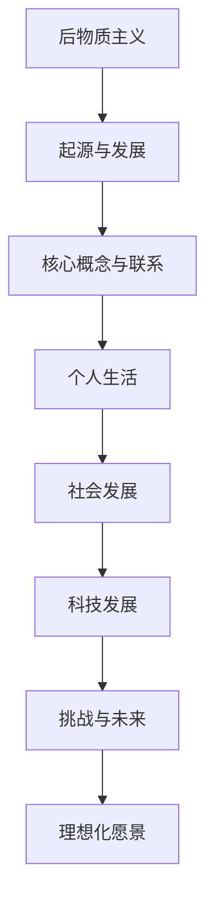

                 

# 后物质主义：超越物质追求的生活哲学

## 关键词
后物质主义，生活哲学，超越物质，社会责任，自我实现，生态可持续性，社会发展，科技进步

## 摘要
本文旨在探讨后物质主义作为一种超越物质追求的生活哲学，其起源、核心概念及其在现代社会中的应用。我们将逐步分析后物质主义与传统物质主义的区别，探讨其核心概念如自主性、自我实现、社会责任和生态可持续性，并分析其在个人生活、社会发展以及科技发展中的体现。同时，我们将面对后物质主义面临的挑战，并展望其未来的发展前景。

## 第一部分：后物质主义的起源与核心概念

### 第1章：后物质主义的起源与发展

#### 1.1 后物质主义的历史背景
后物质主义作为一种哲学思潮，起源于20世纪60年代。当时的背景是随着工业化进程的加快，人们对物质生活的追求逐渐饱和，开始关注更深层次的生活意义和精神追求。这个时期，西方社会经历了一系列的社会变革，如妇女解放运动、民权运动等，人们对传统价值观和社会结构的质疑和反思日益强烈。

#### 1.2 后物质主义的核心思想
后物质主义认为，物质财富并非人类幸福的唯一来源，人们更应该追求精神层面和道德层面的满足。它强调个体自主性、自我实现和社会责任，主张通过追求个人成长和社会进步来实现更高层次的人生价值。

#### 1.3 后物质主义与传统物质主义的区别
传统物质主义强调通过物质财富的积累来实现个人和社会的幸福。而后物质主义则认为，物质财富只是实现幸福的一种手段，而非最终目标。它主张超越物质追求，关注个体精神成长和社会进步。

### 第2章：后物质主义的核心概念与联系

#### 2.1 自主性
自主性是后物质主义的核心概念之一，它强调个体应该拥有独立思考和行动的能力，不受外界物质条件的限制。自主性不仅体现在个人生活中，也体现在社会生活中，如民主参与和社会变革。

#### 2.2 自我实现
自我实现是后物质主义追求的最高目标，它认为每个人都有潜力成为更好的自己，实现个人的价值和梦想。自我实现不仅有助于个人的幸福，也有助于社会的进步。

#### 2.3 社会责任
社会责任是后物质主义的重要组成部分，它强调个体应该承担起对社会和他人的责任，积极参与社会公益活动，推动社会公正和进步。

#### 2.4 生态可持续性
生态可持续性是后物质主义关注的重要问题，它强调人类活动应该与自然和谐共存，保护环境，实现可持续发展。

## 第二部分：后物质主义在现代社会中的应用

### 第3章：后物质主义与个人生活

#### 3.1 生活方式的改变
后物质主义影响下的个人生活方式发生了显著变化，人们更注重精神满足和生活质量，而不是单纯的物质追求。

#### 3.2 工作与职业选择
后物质主义倡导个体选择符合自己兴趣和价值观的工作，追求工作与生活的平衡，实现自我价值的最大化。

#### 3.3 消费观念的转变
后物质主义引导人们反思消费行为，追求环保、可持续的消费方式，减少对物质的过度依赖。

### 第4章：后物质主义与社会发展

#### 4.1 社会结构与变革
后物质主义推动社会结构从物质导向向精神导向转变，推动社会公正和进步。

#### 4.2 教育与文化的重塑
后物质主义影响下的教育和文化更加注重个体的自主性和自我实现，鼓励创新和多元价值观的包容。

#### 4.3 经济模式的转型
后物质主义推动经济模式从物质生产向精神生产和价值创造转变，促进经济结构的优化和可持续发展。

### 第5章：后物质主义与科技发展

#### 5.1 科技进步的影响
科技进步为后物质主义提供了实现自我实现和社会责任的新途径，如互联网、人工智能等技术的发展。

#### 5.2 数字化与后物质主义
数字化时代为后物质主义提供了新的机遇和挑战，如何在数字化世界中实现自我实现和社会责任成为新的课题。

#### 5.3 人工智能与后物质主义
人工智能技术的发展为后物质主义提供了新的可能性，如通过人工智能实现个性化教育和职业发展，提高社会效率。

## 第三部分：后物质主义的挑战与未来

### 第6章：后物质主义的挑战

#### 6.1 道德与伦理问题
后物质主义在追求个体自主性和自我实现的过程中，可能面临道德和伦理问题的挑战。

#### 6.2 资源分配与公平性
后物质主义要求实现社会公正和进步，但资源分配的公平性是一个亟待解决的问题。

#### 6.3 全球化与后物质主义
全球化背景下，如何在全球范围内实现后物质主义的理念是一个重要挑战。

### 第7章：后物质主义的未来

#### 7.1 理想化愿景
后物质主义追求的是一个理想化的人类社会，一个充满自主性、自我实现和社会责任的社会。

#### 7.2 面临的挑战与对策
后物质主义在未来发展中将面临诸多挑战，但通过创新和合作，我们可以找到解决问题的途径。

#### 7.3 后物质主义的世界展望
后物质主义将引领人类社会走向一个更加和谐、公正和可持续的未来。

## 附录

### 附录A：后物质主义相关术语与概念解释
在此附录中，我们将解释后物质主义相关的关键术语和概念，以便读者更好地理解本文的内容。

### 附录B：后物质主义研究的主要学者与著作
在这个附录中，我们将介绍一些在后物质主义研究领域具有影响力的学者和他们的主要著作。

### 附录C：后物质主义在现实生活中的案例分析
在此附录中，我们将探讨一些后物质主义在现实生活中的实际案例，以展示其应用和实践效果。

### 附录D：后物质主义未来发展的展望与预测
在这个附录中，我们将对未来后物质主义的发展趋势进行展望和预测，以期为读者提供启示和参考。

## Mermaid 流程图

# 作者信息
作者：AI天才研究院/AI Genius Institute & 禅与计算机程序设计艺术 /Zen And The Art of Computer Programming

