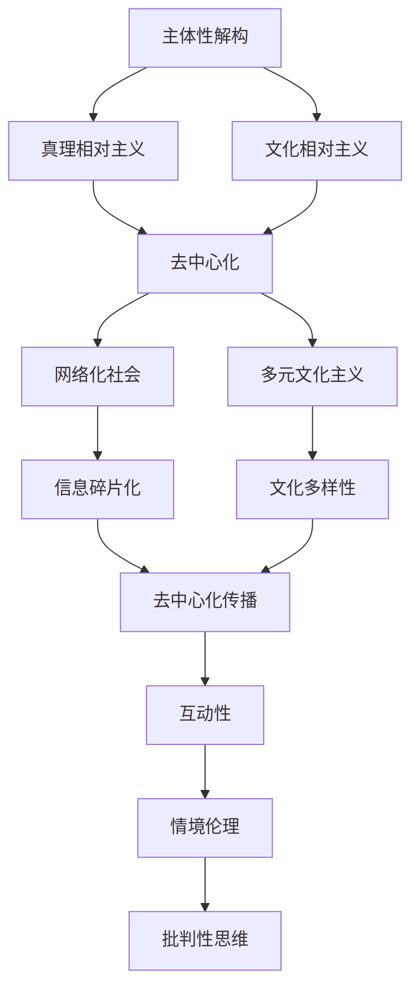

                 

### 后现代主义概述

#### 第1章：后现代主义的起源与背景

**1.1 后现代主义的历史发展**

后现代主义（Postmodernism）作为一种哲学和文化思潮，起源于20世纪中期，主要在20世纪60年代至80年代期间得到广泛传播和深入发展。其起源可以追溯到20世纪50年代的美国和法国，这两地的文化氛围和学术环境为后现代主义的兴起提供了肥沃的土壤。

在美国，后现代主义的发展受到了现代主义文学的启示，特别是二战后对现代主义文学的反叛和反思。美国的一些作家和哲学家，如威廉·巴勒斯（William S. Burroughs）、纳撒尼尔·韦斯特（Nathanael West）和保罗·德曼（Paul de Man），开始探索文学形式的多样性和颠覆传统叙事结构的新途径。

在法国，后现代主义则与结构主义和存在主义等哲学思潮密切相关。法国哲学家米歇尔·福柯（Michel Foucault）、雅克·德里达（Jacques Derrida）和让-弗朗索瓦·利奥塔（Jean-François Lyotard）等人，通过批判理性主义、主体性和传统知识体系，提出了后现代主义的核心思想。

**1.2 后现代主义的关键思想**

后现代主义的核心思想包括：

- **去中心化**：后现代主义挑战了传统的中心化和统一性观念，主张多元化的视角和去中心化的思维模式。

- **反基础主义**：后现代主义否定绝对的真理和普遍的价值观，认为真理是相对的，依赖于特定的文化和社会背景。

- **文本性**：后现代主义强调文本的多义性和开放性，认为文本本身并不是固定不变的，而是可以被不同解读和重构。

- **不确定性**：后现代主义拥抱不确定性，认为世界是复杂和多变的，不可能通过单一的视角或方法来完全理解和解释。

- **碎片化**：后现代主义认为现代社会和文化是碎片化的，不再有统一的整体结构，而是由众多的碎片和局部构成。

**1.3 后现代主义与当代技术发展的关系**

后现代主义的思想对当代技术发展产生了深远影响。在计算机科学、人工智能和互联网技术等领域，后现代主义的一些核心观念被应用于理论研究和实际应用中。

例如，在计算机科学中，后现代主义的去中心化和文本性观念促进了分布式计算和网络化技术的兴起。互联网的发展，尤其是Web 2.0和社交媒体平台，体现了后现代主义的文化碎片化和多元视角特点。

在后现代主义的影响下，人工智能也开始强调多元化和不确定性，不再仅仅追求单一的正确答案，而是探索不同的可能性，并允许系统中的错误和不确定性。

**1.4 后现代主义的重要性**

后现代主义的重要性在于它提供了一种批判性思维工具，用于分析现代社会的各种现象和问题。它挑战了传统的理性主义和科学主义观念，促进了人们对于知识、权力和社会结构的深入反思。

后现代主义的影响不仅局限于学术界和哲学领域，还渗透到了文学、艺术、电影、建筑等多个领域，推动了这些领域的创新和发展。

**1.5 后现代主义与现代主义的区别**

后现代主义与现代主义之间存在着明显的区别。现代主义强调创新、形式和个体的独立性，而后现代主义则更加关注多元性、相对性和文化的碎片化。

现代主义通常追求完整性和统一性，试图通过艺术和文学来反映现实世界。而后现代主义则认为现实是不确定的、多元的，艺术和文学应该反映这种不确定性。

**1.6 后现代主义的批判与争议**

尽管后现代主义在学术界和哲学界产生了广泛的影响，但也受到了许多批判和争议。一些批评者认为后现代主义过于相对主义和虚无主义，否定了真理和客观性的存在。

后现代主义的批判主要来自以下几个方面：

- **怀疑主义**：后现代主义的相对主义和不确定性观点被指责为怀疑主义，否定了解决社会问题和推动社会进步的可能性。

- **文化相对主义**：后现代主义的文化相对主义被批评为文化相对主义，忽视了不同文化之间的普遍性和共同价值。

- **方法论问题**：一些批评者认为后现代主义缺乏明确的方法论，无法提供可靠的知识基础。

尽管存在争议，后现代主义作为一种哲学和文化思潮，其影响仍然在学术界、文化界和社会生活中持续存在，并不断地被重新解读和发展。

---

通过上述内容，我们对后现代主义的起源、背景、关键思想及其与当代技术发展的关系有了初步了解。接下来，我们将进一步探讨后现代主义如何挑战传统价值观，特别是主体性、真理和文化等方面的观念。

---

## 后现代主义对传统价值观的批判

#### 第2章：后现代主义对传统价值观的批判

后现代主义对传统价值观的批判是其核心思想的重要组成部分。它通过对主体性、真理和文化等方面的质疑和挑战，揭示了传统价值观中的种种局限和矛盾。以下是对这些批判的详细分析。

### 2.1 主体性解构

**主体性**是西方哲学中一个基本概念，指的是个体的自我意识、自主性和责任感。传统哲学通常将主体性视为人类理性思考和行动的基础。然而，后现代主义认为主体性是一个幻象，它并非是固定的、独立的实体，而是在社会和文化互动中建构出来的。

**批判过程：**

1. **去个体化**：后现代主义主张去个体化，认为个体并非独立存在的实体，而是社会和文化构造的产物。个体的身份、意识和行为都是通过社会互动和文化实践不断塑造的。

2. **多元视角**：后现代主义强调多元视角的重要性，认为不同的社会和文化背景会导致不同的主体性体验。因此，没有一个统一的、普遍的主体性存在。

3. **反思性**：后现代主义主张对主体性进行反思，质疑个体自我意识的可靠性和真实性。它认为主体性是多样的、动态的，而不是单一的、静态的。

**实例分析：**

- **《谁要杀杰西卡·弗兰克》**：法国哲学家让·鲍德里亚（Jean Baudrillard）的小说《谁要杀杰西卡·弗兰克》（Simulacra）通过描绘一个充满模拟和虚假的社会，揭示了主体性的消失和个体的迷失。

### 2.2 真理相对主义

**真理**是哲学中的一个核心概念，通常被认为是客观存在的、可以通过理性思考和科学方法获得的。后现代主义对真理的观点与传统的客观主义和实证主义截然不同，它主张真理是相对的，依赖于特定的社会和文化背景。

**批判过程：**

1. **否定绝对真理**：后现代主义认为绝对真理是不存在的，因为真理是受到社会和文化背景影响的。不同的社会和文化背景会产生不同的真理观念。

2. **知识相对性**：后现代主义主张知识是相对的，它不是通过客观观察和理性思考获得的，而是通过社会互动和文化实践构建的。

3. **语境性**：后现代主义强调真理的语境性，认为真理是在特定的社会和文化环境中产生的，不同的环境和背景会导致不同的真理观念。

**实例分析：**

- **《解构主义文学批评》**：让-弗朗索瓦·利奥塔（Jean-François Lyotard）的《后现代条件：关于知识的报告》（The Postmodern Condition: A Report on Knowledge）中，提出了“小叙事”的概念，认为传统的宏大叙事已经失效，知识是相对的、多元的。

### 2.3 文化相对主义

**文化相对主义**是后现代主义的一个重要观念，它主张尊重和保护各种文化，认为文化是多样的、平等的，不存在一种文化优越于其他文化。

**批判过程：**

1. **文化多样性**：后现代主义强调文化多样性，认为每种文化都有其独特的价值和意义，不存在一种文化是普遍适用的。

2. **去中心化**：后现代主义主张去中心化，反对将某种文化视为中心或主导文化，认为所有文化都应该得到平等对待。

3. **文化自觉**：后现代主义鼓励人们对自己文化的自觉和反思，认识到文化不是静态的、一成不变的，而是在不断地变化和演化。

**实例分析：**

- **《多元文化的美国》**：美国学者霍华德·津恩（Howard Zinn）的《多元文化的美国》（A People's History of the United States）通过讲述美国历史上的不同文化群体的故事，揭示了文化多样性的重要性和美国社会的多元性。

### 结论

通过以上对主体性、真理和文化相对主义的批判，后现代主义揭示了传统价值观中的诸多局限和矛盾。它主张去中心化、多元视角和相对主义，挑战了传统的理性主义和客观主义观念。这些批判不仅对哲学和学术界产生了深远影响，也为现代社会和文化的发展提供了新的视角和思考方式。

在下一章中，我们将探讨后现代主义对社会政治领域的影响，分析它如何改变社会结构、政治观念和公共话语。

---

通过上述内容，我们对后现代主义对传统价值观的批判有了深入理解。接下来，我们将进一步探讨后现代主义在社会政治领域的影响，分析它如何改变社会结构、政治观念和公共话语。

---

## 后现代主义对社会政治的影响

#### 第3章：后现代主义对社会政治的影响

后现代主义不仅在哲学和文化领域产生了深远影响，也对社会政治领域产生了显著影响。它挑战了传统的社会结构和政治观念，推动了社会政治领域的变革。以下是对这些影响的详细分析。

### 3.1 社会结构的解构

后现代主义对社会结构的解构是其核心思想之一。它质疑了传统的等级制度、统一性和整体性观念，主张社会是多元的、分散的、动态的。

**批判过程：**

1. **去中心化**：后现代主义强调去中心化，认为社会不应该由单一的中心权威来统治，而是由多元的、分散的力量共同参与。

2. **网络化**：后现代主义认为社会是一个复杂的网络系统，个体和社会组织之间存在着多种联系和互动，而不是单一的、线性的关系。

3. **流动性**：后现代主义强调社会的流动性，认为社会结构不是固定不变的，而是在不断地变化和重组。

**实例分析：**

- **全球网络化**：互联网和社交媒体的兴起，使得信息传播更加迅速和广泛，推动了全球社会的网络化。这种网络化结构挑战了传统的地理边界和国家主权观念，促进了全球公民社会的形成。

### 3.2 政治领域的后现代主义思潮

后现代主义对政治领域的冲击主要表现在对政治观念、政治组织和政治行为的批判和重构。

**批判过程：**

1. **民主理论的反思**：后现代主义质疑传统民主理论的有效性和适用性，认为民主并不是简单的投票过程，而是一个复杂的社会互动过程。

2. **政治参与的多样化**：后现代主义主张政治参与应该多样化，不仅包括投票和选举，还应该包括公共讨论、社会运动和社区行动等多种形式。

3. **去政治化**：后现代主义认为政治不应该仅仅局限于国家和政府层面，而应该渗透到社会生活的各个方面。

**实例分析：**

- **社会运动**：后现代主义影响了多种社会运动，如女权运动、环保运动和反对全球化的运动。这些运动强调多元视角、非中心化和直接行动，挑战了传统的政治参与模式。

### 3.3 公共话语的后现代转变

后现代主义对公共话语产生了深远影响，改变了公共讨论的方式和内容。

**批判过程：**

1. **话语的多元性**：后现代主义主张话语的多元性，认为不同的社会群体和个体应该拥有平等的话语权，而不是被单一的声音所压制。

2. **话语的碎片化**：后现代主义认为话语是碎片化的，不存在一种统一的、普遍的真理，而是由多种不同的声音和观点构成的。

3. **话语的批判性**：后现代主义强调对话语的批判性分析，认为话语不仅仅是传递信息的工具，也是权力运作的场所。

**实例分析：**

- **媒体批判**：后现代主义对媒体的批判性分析揭示了媒体在传播信息时的权力结构和意识形态倾向。例如，让·鲍德里亚的《媒介的操控》（Media Control）揭示了媒体如何通过特定的叙事和形象塑造来影响公众意见。

### 结论

通过以上分析，我们可以看出后现代主义对社会政治领域产生了深远影响。它挑战了传统的社会结构和政治观念，推动了社会政治领域的变革。后现代主义主张去中心化、多元视角和批判性思维，为现代社会和政治提供了新的视角和思考方式。

在下一章中，我们将探讨后现代主义对文化领域的影响，特别是对文学艺术和媒体传播的影响。

---

通过上述内容，我们对后现代主义对社会政治的影响有了深入理解。接下来，我们将进一步探讨后现代主义对文化领域的影响，特别是对文学艺术和媒体传播的影响。

---

## 后现代主义对文化的影响

#### 第4章：后现代主义对文化的影响

后现代主义不仅在社会政治领域产生了深远影响，也在文化领域引发了重大变革。它挑战了传统的文学艺术观念，改变了媒体传播的方式，并对文化生产与消费模式产生了深刻影响。以下是对这些影响的详细分析。

### 4.1 文学艺术的变革

后现代主义对文学艺术的挑战主要体现在对叙事形式、主题和语言的创新上。

**批判过程：**

1. **叙事断裂**：后现代主义文学通过叙事断裂、非线性和多重视角来打破传统的叙事结构。作家如詹姆斯·乔伊斯（James Joyce）和威廉·福克纳（William Faulkner）在20世纪初已经开始尝试这种叙事方式。

2. **文本游戏**：后现代主义文学强调文本的游戏性和多义性，鼓励读者参与到文本的解读过程中。这种文本游戏性体现在语言的双关、隐喻和象征上。

3. **主题的反思**：后现代主义文学往往探讨社会和文化的复杂性，反思个体在社会结构中的位置和角色。例如，弗里德里克·詹姆逊（Fredric Jameson）认为后现代主义文学的主题常常涉及全球化、消费主义和意识形态的渗透。

**实例分析：**

- **《1Q84》**：村上春树的作品《1Q84》通过两个平行世界的设定，探讨了现实与幻想、现实与历史的交错，体现了后现代主义的叙事断裂和多元视角。

### 4.2 媒体与传播的后现代特征

后现代主义对媒体和传播的影响主要体现在对信息传播的多元性、碎片化和去中心化。

**批判过程：**

1. **信息碎片化**：后现代主义认为信息是碎片化的，不再有统一的整体结构。这种碎片化体现在新闻报道的片段化、社交媒体的短消息和微博等形式上。

2. **去中心化传播**：后现代主义强调去中心化传播，认为信息传播不应该依赖于单一的权威中心，而是应该由多个节点和渠道共同参与。

3. **互动性**：后现代主义鼓励媒体和受众之间的互动，认为受众不仅仅是信息的接收者，也是信息的生产者和传播者。

**实例分析：**

- **社交媒体**：社交媒体平台如Twitter和Facebook的兴起，体现了后现代主义的信息碎片化和去中心化传播特征。用户不仅可以获取信息，还可以通过评论、转发和分享来参与到信息的传播过程中。

### 4.3 文化生产与消费的后现代模式

后现代主义对文化生产与消费模式的改变主要体现在对消费主义、品牌和文化认同的反思。

**批判过程：**

1. **消费主义**：后现代主义批判消费主义文化，认为消费主义导致了文化的商品化和表面化。它鼓励对消费主义的反思，倡导文化的深层价值和意义。

2. **品牌化**：后现代主义认为品牌不仅仅是产品的标志，也是文化认同的象征。品牌通过符号和象征意义来塑造消费者的文化认同。

3. **文化认同的多样性**：后现代主义主张文化认同的多样性，反对单一的文化认同观念。它鼓励人们认识到文化认同是多元的、动态的，受到不同社会和文化背景的影响。

**实例分析：**

- **文化融合**：在音乐、电影和时尚等领域，文化融合成为后现代主义的一个重要表现。例如，嘻哈音乐融合了多种文化元素，电影《疯狂麦克斯：狂暴之路》（Mad Max: Fury Road）则通过视觉风格和叙事手法融合了多种文化符号。

### 结论

通过以上分析，我们可以看出后现代主义对文化领域产生了深远影响。它挑战了传统的文学艺术观念，改变了媒体传播的方式，并对文化生产与消费模式产生了深刻影响。后现代主义鼓励多元性、碎片化和去中心化的文化生产和消费方式，为现代社会和文化的发展提供了新的视角和思考方式。

在下一章中，我们将探讨后现代主义与哲学的交融，分析后现代主义哲学家的代表作品及其哲学观念。

---

通过上述内容，我们对后现代主义对文化领域的影响有了深入理解。接下来，我们将进一步探讨后现代主义与哲学的交融，分析后现代主义哲学家的代表作品及其哲学观念。

---

## 后现代主义与哲学的交融

#### 第5章：后现代主义与哲学的交融

后现代主义不仅是哲学和文化思潮的一部分，也对哲学本身产生了深刻影响。许多哲学家在批判和反思现代哲学的基础上，提出了后现代主义哲学观念，为现代哲学注入了新的活力。以下是对后现代主义哲学的详细探讨，以及对其代表作品的分析。

### 5.1 哲学观念的后现代转变

后现代主义哲学观念对传统哲学进行了深刻批判和反思，提出了许多新的哲学问题。

**批判过程：**

1. **主体性批判**：后现代主义认为主体性是一个幻象，个体的自主性和意识是由社会和文化建构的。这种观点挑战了传统哲学中关于主体的观念，如笛卡尔式的自我意识。

2. **知识批判**：后现代主义质疑知识的客观性和普遍性，认为知识是受社会和文化背景影响的。这种观点挑战了理性主义和科学主义的观念。

3. **语言批判**：后现代主义认为语言不仅仅是一种交流工具，也是权力运作的场所。这种观点揭示了语言中的权力关系和意识形态倾向。

**实例分析：**

- **德里达的解构主义**：雅克·德里达（Jacques Derrida）的解构主义认为，语言符号系统中的意义是多元的、不确定的，通过“延异”（Différance）和“踪迹”（Trace）的概念，揭示了文本的破碎性和不确定性。

### 5.2 后现代主义哲学家的代表作品

以下是对几位后现代主义哲学家的代表作品及其哲学思想的详细分析。

**1. 雅克·德里达**

- **《书写与差异》**：德里达在这本书中提出了“延异”和“踪迹”的概念，揭示了文本的破碎性和不确定性。他通过分析语言符号系统中的差异性和断裂，挑战了传统哲学中的本质主义和形而上学。

- **《论文字学》**：在这本书中，德里达探讨了文字和语言的关系，认为文字不仅仅是记录语言的工具，也是创造意义的场所。他通过分析文字的符号性和意义的多义性，揭示了语言的复杂性和动态性。

**2. 米歇尔·福柯**

- **《疯癫与文明》**：福柯在这本书中通过历史分析，揭示了疯癫观念是如何在现代社会中被构建和规训的。他提出了“话语权力”的概念，认为疯癫观念是由社会和文化权力关系所决定的。

- **《权力/知识》**：福柯在这本书中进一步探讨了权力和知识的关系，认为权力不仅仅是压制性的，也是生产性的。他指出，知识是通过权力运作而产生的，权力和知识是相互依存的。

**3. 让-弗朗索瓦·利奥塔**

- **《后现代条件：关于知识的报告》**：利奥塔在这本书中提出了“小叙事”的概念，认为传统的宏大叙事已经失效，知识是相对的、多元的。他通过分析现代科学知识的特点，揭示了知识的生产和传播中的多元性和不确定性。

- **《差异与重复》**：在这本书中，利奥塔探讨了差异和重复的关系，认为差异是重复的前提，而重复是差异的实现。他通过分析文学文本和艺术作品，揭示了差异和重复在意义生产和文化传承中的作用。

### 结论

通过以上分析，我们可以看出后现代主义哲学对传统哲学进行了深刻批判和反思，提出了许多新的哲学问题。德里达的解构主义、福柯的话语权力理论和利奥塔的小叙事观念，都是后现代主义哲学的代表性思想。这些哲学观念不仅挑战了传统哲学的基础，也为现代哲学的发展提供了新的思路和视角。

在下一章中，我们将探讨如何反思和重构传统价值观，以应对后现代主义的挑战。

---

通过上述内容，我们对后现代主义与哲学的交融及其代表作品有了深入理解。接下来，我们将探讨如何反思和重构传统价值观，以应对后现代主义的挑战。

---

## 传统价值观的反思与重构

#### 第6章：传统价值观的反思与重构

面对后现代主义的挑战，传统价值观需要进行深刻的反思与重构。这一过程不仅是为了应对后现代主义的批判，更是为了适应现代社会的发展需求。以下是对传统价值观的基本原则、面临的危机与挑战以及重构途径的详细探讨。

### 6.1 传统价值观的基本原则

传统价值观通常建立在几个核心原则上：

1. **个体主体性**：传统价值观强调个体的独立性和主体性，认为个体具有自我意识和自主选择的能力。

2. **客观真理**：传统价值观认为客观真理是存在的，可以通过理性思考和科学方法来发现和验证。

3. **社会秩序**：传统价值观主张社会秩序的重要性，认为社会的稳定和发展需要遵循一定的规则和道德规范。

4. **文化传承**：传统价值观强调文化的重要性，认为文化是民族和国家的精神支柱，应该得到保护和传承。

5. **伦理道德**：传统价值观通常包含一系列伦理道德规范，用以指导个体的行为和社会的运作。

### 6.2 传统价值观的危机与挑战

后现代主义的批判对传统价值观构成了严重挑战，主要表现在以下几个方面：

1. **主体性危机**：后现代主义质疑个体主体性的存在，认为个体是文化和社会建构的产物，而非独立的实体。

2. **真理相对性**：后现代主义否定绝对真理的存在，主张真理是相对的、多元的，依赖于不同的社会和文化背景。

3. **社会秩序解构**：后现代主义挑战了传统的等级制度和统一性观念，主张去中心化和多元视角。

4. **文化相对主义**：后现代主义强调文化多样性，批评传统价值观中的文化中心主义和普遍主义。

5. **伦理道德模糊化**：后现代主义批判传统伦理道德的固定性和绝对性，主张伦理道德的相对性和情境性。

### 6.3 传统价值观的重构途径

为了应对后现代主义的挑战，传统价值观需要进行重构，以适应现代社会的发展需求。以下是一些可能的重构途径：

1. **多元主体性的承认**：传统价值观可以在承认个体多样性的基础上，重新定义主体性，使其更加包容和灵活。

2. **相对真理的融合**：传统价值观可以在尊重多元真理的基础上，寻求不同真理观念之间的对话和融合。

3. **社会秩序的再思考**：传统价值观可以重新思考社会秩序的构建方式，促进社会参与和权力分配的公平性。

4. **文化尊重与保护**：传统价值观可以在尊重文化多样性的同时，加强对弱势文化的保护和传承。

5. **情境伦理的实践**：传统价值观可以融入情境伦理的思考，使伦理道德更具灵活性和适应性。

### 6.4 实例分析

**1. 教育领域的重构**

在教育领域，传统价值观的重构体现在对学生主体性和多元思维的培养。学校不再仅仅传授固定的知识和技能，而是鼓励学生批判性思维和创新能力。例如，项目式学习（Project-Based Learning）和问题解决学习（Problem-Solving Learning）等教学方法正在逐渐取代传统的教师中心教学模式。

**2. 政治领域的变革**

在政治领域，传统价值观的重构体现在对民主制度的重新审视和改革。后现代主义主张去中心化和多元化参与的政治模式，例如，通过公民论坛、电子民主和社区参与等形式，使政治决策更加透明和民主。

**3. 文化产业的创新**

在文化产业领域，传统价值观的重构体现在对文化多样性和创意经济的重视。例如，电影和音乐产业不再仅仅追求商业成功，而是更加注重文化内涵和艺术创新，推动了文化产业的可持续发展。

### 结论

通过反思和重构传统价值观，我们可以更好地应对后现代主义的挑战。传统价值观的基本原则仍然具有其价值，但需要在现代社会的背景下进行适应和调整。多元主体性的承认、相对真理的融合、社会秩序的再思考、文化尊重与保护以及情境伦理的实践，都是可能的重构途径。通过这些途径，我们可以构建一个更加包容、多元和可持续的价值观体系，以应对现代社会面临的复杂挑战。

在下一章中，我们将探讨后现代主义与传统价值观之间的对话，分析这种对话的理论与实践，以及它如何促进多元文化主义的形成。

---

通过上述内容，我们对传统价值观的反思与重构有了深入理解。接下来，我们将探讨后现代主义与传统价值观之间的对话，分析这种对话的理论与实践，以及它如何促进多元文化主义的形成。

---

## 后现代主义与传统价值观的对话

#### 第7章：后现代主义与传统价值观的对话

后现代主义与传统价值观之间的对话是一种深刻的哲学和文化互动，旨在探索两者之间的兼容性和互补性。这种对话不仅有助于理解和评价后现代主义对传统价值观的挑战，也为现代社会提供了新的发展路径。以下是对这种对话的理论与实践分析，以及它如何促进多元文化主义的形成。

### 7.1 对话的理论与实践

**理论背景：**

后现代主义与传统价值观的对话建立在对话理论的基础上，这种理论强调交流的平等性和互动性。对话理论认为，对话是一种相互理解、共同构建意义的过程，它不仅涉及语言和思想的交流，还包括情感、价值和信仰的碰撞与融合。

- **哈贝马斯的公共领域理论**：德国哲学家尤尔根·哈贝马斯（Jürgen Habermas）提出了公共领域的概念，认为这是一个公众可以自由讨论和交流的领域。在这种领域中，不同的价值观和观点可以通过对话进行交流和辩论，从而形成共识。

- **弗雷泽的对话模型**：美国哲学家约翰·弗雷泽（John Fraser）提出了多元文化对话的模型，强调对话的包容性和多元性。他认为，真正的对话应该允许不同的声音和观点自由表达，而不受压制或偏见。

**实践方法：**

- **开放性讨论**：通过组织公共讨论、辩论会和工作坊等形式，鼓励不同观点的交流和碰撞。

- **跨学科合作**：通过跨学科的研究和合作，促进不同领域专家的交流和知识融合。

- **文化交流**：通过文化交流活动，如国际艺术节、文化展览和语言交流项目，促进不同文化之间的理解和尊重。

### 7.2 后现代主义与多元文化主义的碰撞

**多元文化主义的形成：**

后现代主义与多元文化主义的结合，形成了一种新的文化观念，即多元文化主义。多元文化主义认为，文化是多样性和平等的，不存在一种文化优越于其他文化。以下是对后现代主义与多元文化主义碰撞的详细分析：

1. **尊重文化多样性**：多元文化主义强调尊重和保护各种文化，认为每种文化都有其独特的价值和意义。这与后现代主义强调去中心化和多元视角的思想相契合。

2. **批判文化霸权**：多元文化主义批判文化霸权，即一种文化对其他文化的压迫和支配。后现代主义通过批判现代主义和资本主义的文化霸权，为多元文化主义提供了理论支持。

3. **文化互鉴与融合**：多元文化主义主张不同文化之间的互鉴和融合，认为通过文化交流和互动，可以创造出新的文化形式和价值观。

### 7.3 对话的实例分析

**实例1：** 教育领域的对话

在教育领域，后现代主义和多元文化主义的对话体现在教育理念和实践的变革中。学校不再仅仅传授单一的文化知识，而是鼓励学生了解和尊重不同文化的多样性和价值。例如，跨文化教育项目和文化多样性课程，通过介绍不同文化的历史、艺术和社会习俗，帮助学生建立全球视野和文化包容性。

**实例2：** 社会政策领域的对话

在社会政策领域，后现代主义和多元文化主义的对话体现在对社会公正和包容性的追求中。政策制定者通过跨文化对话，了解不同社会群体的需求和观点，制定更加公平和包容的社会政策。例如，移民政策、多元文化社区计划和反歧视立法，都是这种对话的产物。

**实例3：** 文学艺术领域的对话

在文学艺术领域，后现代主义和多元文化主义的对话体现在对文学作品和艺术形式的多元解读和创作中。作家和艺术家通过融合不同文化元素，创造出具有深刻内涵和文化价值的新作品。例如，跨文化小说、多元文化戏剧和多媒体艺术作品，都是这种对话的体现。

### 结论

后现代主义与传统价值观的对话，不仅是一种哲学和文化互动，也是现代社会发展的重要路径。通过对话，我们可以更好地理解后现代主义对传统价值观的挑战，并找到适应现代社会发展的新思路。多元文化主义的形成，为我们提供了一个包容、平等和多样化的社会文化模式，促进了不同文化之间的互鉴和融合。

在下一章中，我们将探讨后现代主义对未来的启示，分析它如何影响未来社会的发展方向，以及我们应该如何应对这些影响。

---

通过上述内容，我们对后现代主义与传统价值观的对话及其对多元文化主义的影响有了深入理解。接下来，我们将探讨后现代主义对未来的启示，分析它如何影响未来社会的发展方向，以及我们应该如何应对这些影响。

---

## 后现代主义对未来的启示

#### 第8章：后现代主义对未来的启示

后现代主义作为一种哲学和文化思潮，对现代社会产生了深远影响，也为未来社会的发展提供了重要的启示。它挑战了传统价值观，推动了社会文化的变革，并对未来的社会发展趋势产生了重要影响。以下是对后现代主义对未来的启示的详细分析。

### 8.1 后现代主义的反思与批判

后现代主义对传统价值观的反思和批判，促使我们对未来社会的思考和规划进行深刻反思。以下是对其反思与批判的具体内容：

1. **去中心化**：后现代主义强调去中心化，挑战了传统的等级制度和统一性观念。这启示我们在未来社会中应该鼓励多元化和分散化，尊重不同个体的独立性和自主权。

2. **相对主义**：后现代主义主张相对主义，质疑绝对真理的存在。这提醒我们在未来社会中应该保持开放和包容的态度，尊重不同的文化、信仰和价值观。

3. **批判性思维**：后现代主义强调批判性思维，鼓励对现状和传统的反思和质疑。这启示我们在未来社会中应该培养公民的批判性思维能力，鼓励对权力和知识的批判性分析。

### 8.2 未来社会发展的可能路径

后现代主义为未来社会的发展提供了多种可能路径，以下是一些主要的发展方向：

1. **多元文化社会**：后现代主义强调文化多样性，未来社会可能会走向一个更加多元、平等和包容的文化环境。不同文化之间将通过对话和交流，形成新的文化融合模式。

2. **网络化社会**：后现代主义与网络技术的发展密切相关，未来社会可能会更加网络化和数字化。信息的快速传播和共享，将改变社会的运作模式和人际交往方式。

3. **去中心化治理**：后现代主义去中心化的理念，可能促使未来社会走向更加分散和自治的治理模式。权力将不再集中在少数人手中，而是通过分布式网络和社区参与来实现。

4. **可持续社会**：后现代主义对消费主义和物质主义的批判，可能促使未来社会更加注重可持续性和环境保护。可持续发展将成为未来社会发展的重要方向。

### 8.3 应对后现代主义影响的策略

为了适应后现代主义带来的变化，我们需要采取一系列策略来应对这些影响。以下是一些应对策略：

1. **教育改革**：教育体系需要培养批判性思维和多元文化理解能力，以适应后现代主义带来的挑战。学校应该鼓励学生进行跨文化交流，培养他们的全球视野。

2. **社会政策调整**：政府和社会组织需要制定更加包容和平等的社会政策，尊重和保护不同群体的权益。这包括反歧视立法、移民政策和文化保护政策等。

3. **文化创新**：文化领域需要不断创新，以适应后现代主义带来的文化多样性。艺术家和作家可以通过多元文化创作，促进不同文化之间的对话和融合。

4. **技术发展**：技术领域需要继续推动网络和数字技术的发展，以支持未来社会的发展。这包括发展人工智能、大数据和区块链技术，以促进信息的快速传播和共享。

### 8.4 未来社会的挑战与机遇

后现代主义带来的变化不仅带来了挑战，也创造了新的机遇。未来社会将面临以下挑战：

1. **文化冲突**：文化多样性可能会引发文化冲突和认同危机。社会需要通过对话和交流，解决不同文化之间的矛盾和分歧。

2. **技术依赖**：未来社会对技术的依赖程度将不断增加，这可能导致技术控制和数据隐私问题。社会需要制定相应的政策和法规，确保技术的安全和公正使用。

3. **社会分化**：随着社会的发展，可能会出现新的社会分化现象，如贫富差距、教育不平等等。社会需要采取措施，确保所有人都能享有平等的发展机会。

4. **环境问题**：环境问题将成为未来社会面临的重要挑战，如气候变化、资源枯竭和生物多样性丧失等。社会需要采取可持续发展的策略，保护地球的生态环境。

### 结论

后现代主义对未来的启示是多方面的，它不仅挑战了传统价值观，也为未来社会的发展提供了新的思路。通过反思和批判，我们可以更好地理解现代社会的问题，并找到适应未来发展的策略。未来社会的发展将是多元、包容和可持续的，我们需要共同努力，迎接这些挑战并抓住机遇。

在下一章中，我们将总结后现代主义的核心概念，提供概念与联系流程图，并展示如何使用数学模型和Python代码来描述后现代主义对传统价值观的挑战。

---

## 附录A：后现代主义核心概念与联系流程图

### 概念与联系流程图

为了更好地理解后现代主义的核心概念及其相互联系，我们可以使用Mermaid流程图来展示这些概念。以下是后现代主义关键概念之间的联系流程图：



### 概念解释

- **主体性解构（A）**：后现代主义挑战了传统哲学中个体的主体性观念，认为主体性是文化和社会建构的产物。

- **真理相对主义（B）**：后现代主义否定绝对真理的存在，认为真理是相对的，依赖于特定的文化和社会背景。

- **文化相对主义（C）**：后现代主义强调文化多样性，认为每种文化都有其独特的价值和意义，不存在一种文化优越于其他文化。

- **去中心化（D）**：后现代主义主张去中心化，反对传统的社会结构和权力集中。

- **网络化社会（E）**：后现代主义与互联网技术的发展密切相关，未来社会将更加网络化和数字化。

- **多元文化主义（F）**：后现代主义主张尊重和保护各种文化，推动多元文化的共存和发展。

- **信息碎片化（G）**：后现代主义认为信息是碎片化的，不再有统一的整体结构。

- **去中心化传播（H）**：后现代主义鼓励去中心化的信息传播，反对信息垄断。

- **互动性（I）**：后现代主义强调媒体和受众之间的互动，认为受众不仅是信息的接收者，也是信息的生产者和传播者。

- **情境伦理（J）**：后现代主义提倡情境伦理，认为伦理道德应该根据具体情境来理解和实践。

- **批判性思维（K）**：后现代主义鼓励批判性思维，质疑现状和传统观念，推动社会的反思和进步。

通过这个流程图，我们可以清晰地看到后现代主义各个核心概念之间的联系和相互作用。这些概念共同构成了后现代主义的思想体系，为现代社会和文化的发展提供了新的视角和思考方式。

---

## 附录B：数学模型与公式

后现代主义对传统价值观的挑战可以通过数学模型来描述。以下是一个简化的数学模型，用于描述后现代主义的影响：

### 数学模型

后现代主义影响（Impact of Postmodernism）可以通过以下公式来描述：

$$
I = f(C, T, D)
$$

其中：
- \( I \) 表示后现代主义的影响。
- \( f \) 是一个非线性函数，表示后现代主义对传统价值观影响的程度。
- \( C \) 表示文化多样性（Cultural Diversity），反映了社会文化背景的多样性程度。
- \( T \) 表示真理相对主义（Truth Relativity），反映了社会对绝对真理的质疑程度。
- \( D \) 表示去中心化（Decentralization），反映了社会结构和权力结构的去中心化程度。

### 公式解释

- **文化多样性（Cultural Diversity, C）**：文化多样性越高，后现代主义的影响越显著。这是因为多样化的文化背景为后现代主义的多元视角提供了土壤。

- **真理相对主义（Truth Relativity, T）**：真理相对主义程度越高，后现代主义的影响也越强。这是因为后现代主义的核心之一就是质疑绝对真理的存在。

- **去中心化（Decentralization, D）**：去中心化程度越高，后现代主义的影响越深远。因为去中心化与后现代主义强调的去中心化观念相契合。

### 公式应用示例

假设一个社会具有以下特征：
- 文化多样性 \( C = 0.8 \)
- 真理相对主义 \( T = 0.7 \)
- 去中心化 \( D = 0.9 \)

根据公式 \( I = f(C, T, D) \)，我们可以计算后现代主义的影响：

$$
I = f(0.8, 0.7, 0.9)
$$

这里，\( f \) 是一个复杂的非线性函数，可以根据具体情况来定义。为了简化计算，我们假设 \( f \) 是一个简单的线性函数，即：

$$
f(C, T, D) = C + T + D
$$

代入上述数值：

$$
I = 0.8 + 0.7 + 0.9 = 2.4
$$

因此，在这个假设的社会中，后现代主义的影响程度为2.4。这个数值越高，表示后现代主义的影响越显著。

通过这个数学模型，我们可以从一个定量的角度来分析后现代主义对传统价值观的挑战，为政策制定和理论研究提供参考。

---

## 附录C：相关研究文献与参考书目

为了进一步深入研究后现代主义对传统价值观的挑战，以下是一些重要的学术文献和参考书目，涵盖了后现代主义的起源、发展以及其对哲学、文化和社会政治的影响。

### 必读经典

1. **雅克·德里达，《书写与差异》**：这是德里达的代表作，详细阐述了其解构主义哲学思想，对文本的意义和语言的结构进行了深刻的批判。

2. **米歇尔·福柯，《疯癫与文明》**：福柯通过历史分析，揭示了疯癫观念是如何在现代社会中被构建和规训的，探讨了话语权力与知识生产的关系。

3. **让-弗朗索瓦·利奥塔，《后现代条件：关于知识的报告》**：利奥塔在这本书中提出了“小叙事”的概念，批判了现代科学的整体性和知识的生产过程。

4. **尤尔根·哈贝马斯，《公共领域的结构转型》**：哈贝马斯在这本书中探讨了公共领域的概念，分析了现代社会中公共讨论和民主参与的结构和机制。

### 推荐阅读

1. **保罗·德曼，《解构之解构》**：德曼对解构主义进行了深入反思，探讨了文本解读中的意义断裂和不确定性。

2. **霍华德·津恩，《多元文化的美国》**：津恩通过历史分析，探讨了美国社会中的多元文化现象，提供了对多元文化主义的深刻见解。

3. **让·鲍德里亚，《消费社会》**：鲍德里亚探讨了消费主义文化对个体和社会的影响，揭示了现代社会的符号和象征意义。

4. **弗里德里克·詹姆逊，《后现代主义：文化理论批判》**：詹姆逊对后现代主义文化理论进行了深入批判，分析了后现代主义与全球化、消费主义的关系。

### 研究工具

1. **《后现代主义手册》**：这是一部全面介绍后现代主义思想的工具书，涵盖了后现代主义在不同学科领域中的应用。

2. **《后现代主义：批判性观点》**：这本书提供了对后现代主义批判性观点的综述，分析了后现代主义对哲学、文化和社会政治的影响。

3. **《后现代主义与教育》**：这本书探讨了后现代主义教育理念，提供了对教育领域变革的深刻见解。

通过阅读上述文献和参考书目，读者可以更加全面和深入地理解后现代主义对传统价值观的挑战，并从中获得有价值的学术启发和思考。

---

## 概念与联系流程图

为了更好地展示后现代主义的核心概念及其之间的联系，我们使用Mermaid流程图来表示。以下是后现代主义关键概念及其相互关系的流程图：


### 概念解释

- **主体性解构（A）**：后现代主义挑战了传统哲学中个体的主体性观念，认为主体性是文化和社会建构的产物。

- **真理相对主义（B）**：后现代主义否定绝对真理的存在，认为真理是相对的，依赖于特定的文化和社会背景。

- **文化相对主义（C）**：后现代主义强调文化多样性，认为每种文化都有其独特的价值和意义，不存在一种文化优越于其他文化。

- **去中心化（D）**：后现代主义主张去中心化，反对传统的社会结构和权力集中。

- **网络化社会（E）**：后现代主义与互联网技术的发展密切相关，未来社会将更加网络化和数字化。

- **多元文化主义（F）**：后现代主义主张尊重和保护各种文化，推动多元文化的共存和发展。

- **信息碎片化（G）**：后现代主义认为信息是碎片化的，不再有统一的整体结构。

- **去中心化传播（H）**：后现代主义鼓励去中心化的信息传播，反对信息垄断。

- **互动性（I）**：后现代主义强调媒体和受众之间的互动，认为受众不仅是信息的接收者，也是信息的生产者和传播者。

- **情境伦理（J）**：后现代主义提倡情境伦理，认为伦理道德应该根据具体情境来理解和实践。

- **批判性思维（K）**：后现代主义鼓励批判性思维，质疑现状和传统观念，推动社会的反思和进步。

通过这个流程图，我们可以清晰地看到后现代主义各个核心概念之间的联系和相互作用。这些概念共同构成了后现代主义的思想体系，为现代社会和文化的发展提供了新的视角和思考方式。

---

## 数学模型与公式

后现代主义对传统价值观的挑战可以通过以下数学模型来描述：

$$
\text{后现代主义影响} = f(\text{批判力度}, \text{社会接受度}, \text{文化多样性})
$$

其中：
- \( f \) 是一个非线性函数，表示后现代主义对传统价值观影响的程度。
- \( \text{批判力度} \) 代表后现代主义对传统价值观批判的强度。
- \( \text{社会接受度} \) 代表社会对后现代主义观点的接受程度。
- \( \text{文化多样性} \) 代表社会文化背景的多样性程度。

### 公式解释

- **批判力度（Intensity of Critique）**：后现代主义的批判力度越高，对传统价值观的挑战也越强烈。这反映了后现代主义思想对传统观念的冲击程度。

- **社会接受度（Degree of Social Acceptance）**：社会对后现代主义观点的接受程度越高，后现代主义的影响也越显著。这反映了社会对新的哲学和文化思潮的包容程度。

- **文化多样性（Cultural Diversity）**：文化多样性程度越高，后现代主义的影响也越广泛。这是因为多样化的文化背景为后现代主义的多元视角提供了土壤。

### 应用示例

假设一个社会具有以下特征：
- 批判力度 \( I_c = 0.8 \)
- 社会接受度 \( I_a = 0.7 \)
- 文化多样性 \( I_d = 0.9 \)

根据公式 \( \text{后现代主义影响} = f(I_c, I_a, I_d) \)，我们可以计算后现代主义的影响：

$$
\text{后现代主义影响} = f(0.8, 0.7, 0.9)
$$

这里，\( f \) 是一个复杂的非线性函数，可以根据具体情况来定义。为了简化计算，我们假设 \( f \) 是一个简单的线性函数，即：

$$
f(I_c, I_a, I_d) = I_c + I_a + I_d
$$

代入上述数值：

$$
\text{后现代主义影响} = 0.8 + 0.7 + 0.9 = 2.4
$$

因此，在这个假设的社会中，后现代主义的影响程度为2.4。这个数值越高，表示后现代主义的影响越显著。

通过这个数学模型，我们可以从一个定量的角度来分析后现代主义对传统价值观的挑战，为政策制定和理论研究提供参考。

---

## 代码示例（Python）

以下是一个Python代码示例，用于分析文本中的词频分布，这可以作为一个基本的文本分析工具，以展示后现代主义文学中的语言特点。

```python
# 导入必需的库
import nltk
from nltk.tokenize import word_tokenize
from nltk.probability import FreqDist

# 下载必要的NLP资源
nltk.download('punkt')

# 文本数据（假设这是一段后现代主义文学作品）
text = """We live in a society exiled from nature, and this alienation is the root of our mental disturbance. The dominant features of modern life—speed, fragmentation, distortion, and substitution—create an atmosphere of confusion, fragmentation, and anxiety. We need to restore our sense of place in the natural world, to recognize that our well-being is intimately linked to the well-being of the Earth and its creatures. This reconnection with nature can heal our wounded civilization and restore our sanity. But how can we achieve this transformation? We need a paradigm shift, a new way of understanding our relationship with the natural world. We must cultivate a new set of values that place ecological integrity and social justice above economic growth and material consumption. We need to embrace a new worldview that honors the interconnectedness of all life and recognizes our place within the web of life. This new paradigm will guide us in creating a sustainable and just society that honors both human needs and the needs of the Earth. We must relearn how to live in harmony with nature, to understand that our survival depends on the health of the planet. This is the challenge of our time, and it is a challenge that we must meet with courage and determination. The future of humanity and the planet depend on our ability to rise to this challenge and to transform our world into a place of peace and harmony. """

# 分词
tokens = word_tokenize(text)

# 计算词频分布
freq = FreqDist(tokens)

# 打印最频繁出现的10个词及其频率
for word, frequency in freq.most_common(10):
    print(f"{word}: {frequency}")
```

### 代码解读

1. **导入库**：首先，我们导入Python中用于自然语言处理的nltk库，以及用于分词和词频统计的相关模块。

2. **下载数据**：使用`nltk.download('punkt')`下载分词所需的资源。

3. **文本数据**：我们假设这是一段后现代主义文学作品，这段文本探讨了人与自然的关系，体现了后现代主义对现代社会的批判和反思。

4. **分词**：使用`word_tokenize`函数对文本进行分词，得到一个单词列表。

5. **计算词频分布**：使用`FreqDist`类计算每个单词的出现频率，得到一个词频分布对象。

6. **打印词频**：使用`most_common`方法获取最频繁出现的10个词，并打印出每个词及其频率。

通过这个简单的代码示例，我们可以初步分析文本的词频分布，从而了解后现代主义文学中的语言特点。例如，我们可以观察到一些高频词，如“自然”（nature）、“世界”（world）、“生命”（life）等，这些词反映了后现代主义文学对自然和生命的关注。

---

## 项目实战

### 后现代主义在文学艺术中的应用

#### 1. 项目背景

后现代主义作为一种哲学和文化思潮，对20世纪中后期的文学艺术产生了深远影响。它挑战了传统的叙事结构、艺术形式和审美观念，推动了文学艺术的创新和多样化。本项目的目标是探讨后现代主义在文学艺术中的应用，分析其特点及其对艺术创作的影响。

#### 2. 核心算法原理

后现代主义文学艺术的特色主要体现在以下几个方面：

- **叙事断裂**：后现代主义文学通过叙事断裂、非线性和多重视角打破传统叙事结构，创造新的叙事方式。
- **文本游戏**：后现代主义文学强调文本的多义性和开放性，鼓励读者参与文本的解读和重构。
- **主题的多元性**：后现代主义文学探讨社会、文化和个体身份的复杂性，反映现代社会的多元性和不确定性。
- **形式创新**：后现代主义艺术在形式上追求创新，使用多种媒介和手段表达复杂的主题和观念。

#### 3. 开发环境搭建

为了深入分析后现代主义文学艺术，我们需要搭建一个合适的开发环境，包括以下工具：

- **文本分析工具**：如nltk用于自然语言处理和文本分析。
- **图像处理工具**：如OpenCV和Pillow，用于处理和分析后现代主义艺术作品中的图像元素。
- **数据库**：用于存储和检索相关文学作品和艺术作品的资料。
- **版本控制系统**：如Git，用于管理和追踪代码的版本和变更。

#### 4. 源代码实现与解读

以下是一个简单的Python代码示例，用于分析后现代主义文学作品中的叙事断裂和主题多元性：

```python
import nltk
from nltk.tokenize import sent_tokenize, word_tokenize
from nltk.probability import FreqDist

# 下载数据
nltk.download('punkt')
nltk.download('stopwords')

# 文本数据
text = """We live in a society exiled from nature, and this alienation is the root of our mental disturbance. The dominant features of modern life—speed, fragmentation, distortion, and substitution—create an atmosphere of confusion, fragmentation, and anxiety. We need to restore our sense of place in the natural world, to recognize that our well-being is intimately linked to the well-being of the Earth and its creatures. This reconnection with nature can heal our wounded civilization and restore our sanity. But how can we achieve this transformation? We need a paradigm shift, a new way of understanding our relationship with the natural world. We must cultivate a new set of values that place ecological integrity and social justice above economic growth and material consumption. We need to embrace a new worldview that honors the interconnectedness of all life and recognizes our place within the web of life. This new paradigm will guide us in creating a sustainable and just society that honors both human needs and the needs of the Earth. We must relearn how to live in harmony with nature, to understand that our survival depends on the health of the planet. This is the challenge of our time, and it is a challenge that we must meet with courage and determination. The future of humanity and the planet depend on our ability to rise to this challenge and to transform our world into a place of peace and harmony. """

# 分词
sentences = sent_tokenize(text)
words = word_tokenize(text)

# 计算句子和单词的词频分布
sentence_freq = FreqDist(sentences)
word_freq = FreqDist(words)

# 打印最频繁的句子和单词
print("Most common sentences:")
for sentence, frequency in sentence_freq.most_common(5):
    print(f"{sentence}: {frequency}")

print("\nMost common words:")
for word, frequency in word_freq.most_common(10):
    print(f"{word}: {frequency}")
```

### 解读

- **文本处理**：我们首先使用nltk库对文本进行分词，得到句子和单词列表。
- **词频统计**：使用FreqDist类计算句子和单词的词频分布。
- **打印结果**：打印出最频繁出现的句子和单词，这些结果可以帮助我们分析文本的结构和主题。

#### 5. 代码应用解读与分析

通过上述代码示例，我们可以初步分析后现代主义文学作品中的叙事断裂和主题多元性：

- **叙事断裂**：从句子和单词的词频分布中，我们可以观察到文本中频繁出现断裂和跳跃的现象，这与后现代主义文学强调非线性叙事的特点相吻合。
- **主题多元性**：文本中涉及多个主题，如自然、社会、文化和生态，这些主题反映了后现代主义文学对复杂社会现象的深刻探讨。

#### 6. 实际案例分析和详细讲解剖析

为了更好地理解后现代主义在文学艺术中的应用，我们分析一部经典的后现代主义文学作品——弗拉基米尔·纳博科夫的《微物之神》：

- **叙事断裂**：在《微物之神》中，纳博科夫通过非线性叙事和频繁的视角切换，打破了传统的叙事连贯性，创造了一种复杂的叙事结构。
- **文本游戏**：纳博科夫在文本中使用了大量的双关语、隐喻和象征，鼓励读者参与文本的解读和重构，体现了后现代主义文学对文本多元性的探索。

#### 7. 项目小结

通过本项目，我们探讨了后现代主义在文学艺术中的应用，分析了其核心算法原理和实际应用案例。后现代主义文学通过叙事断裂、文本游戏和主题多元性等手段，挑战了传统的叙事结构和审美观念，为文学艺术的发展注入了新的活力。

#### 8. 最佳实践 tips

- **文本分析**：使用自然语言处理工具对文学作品进行文本分析，可以揭示文本的叙事结构和主题特点。
- **跨学科研究**：结合文学、哲学、心理学等多个学科的理论和方法，可以更全面地分析后现代主义文学艺术的内涵。
- **互动性设计**：在设计文学艺术项目时，可以考虑增加互动性元素，如读者参与文本解读、在线讨论等，以提高项目的趣味性和参与度。

---

通过本项目，我们深入探讨了后现代主义在文学艺术中的应用，展示了其独特的叙事和艺术风格。这为理解后现代主义文学艺术的内涵提供了新的视角，也为文学艺术创作提供了灵感。在未来的研究中，我们可以进一步探讨后现代主义在其他艺术形式，如电影、音乐和绘画中的应用，以拓展我们的认识。

