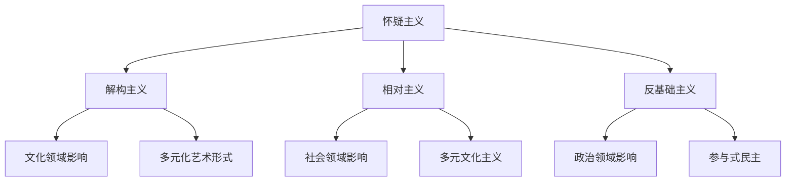

                 

### 第1章：后现代主义的兴起与发展

#### 1.1 后现代主义的定义与特点

后现代主义（Postmodernism）作为一种哲学和文化思潮，起源于20世纪中叶。它是对现代性（Modernity）的一种批判和反思，试图揭示现代性所固有的局限和矛盾。不同于现代主义强调理性、科学和进步，后现代主义倾向于质疑这些理念的绝对性和普遍性。

**后现代主义的主要特点**包括：

1. **怀疑主义**：后现代主义对客观真理和普遍适用的知识体系持怀疑态度。它认为真理是相对的，取决于特定的语境和文化背景。
2. **解构主义**：后现代主义强调符号和意义的多元性，主张通过解构（deconstruction）揭示文本、话语和概念中的内在矛盾和不确定性。
3. **相对主义**：后现代主义强调不同文化和社会之间的差异，反对任何形式的普世主义。
4. **反基础主义**：后现代主义质疑哲学、科学和艺术等领域中的基础和基本原则，主张打破传统的权威体系。

后现代主义的这些特点在多个领域得到了广泛的应用，包括文学、艺术、建筑、社会科学和哲学等。它不仅对传统的价值观和方法论提出了挑战，也为新的思考方式和表达形式提供了可能。

#### 1.2 后现代主义与现代性的关系

现代性是一个复杂且多维度的概念，它涉及科学、技术、经济、政治、文化等多个方面。现代性的核心特征包括理性化、工业化、城市化、世俗化和全球化等。

**后现代主义与现代性的关系**可以理解为一种批判与反思的关系。后现代主义认为，现代性虽然在某些方面取得了巨大的进步，但也带来了许多负面后果，如：

1. **工具理性**：现代性强调科学和技术的作用，但这种工具理性往往忽视了人类的情感、价值和伦理。
2. **异化**：现代性导致了人与自然的分离，以及人与人之间的疏离，使个体感到孤独和无助。
3. **意识形态**：现代性中的某些观念和制度，如自由民主和资本主义，被当作绝对的真理，实际上它们只是特定历史条件下的产物。

后现代主义试图通过揭示这些问题的根源，促使人们重新思考现代性的本质和价值。它并不完全否定现代性的贡献，而是对其进行了批判和反思，提出了新的视角和方法。

#### 1.3 后现代主义对文化、社会、政治的影响

后现代主义对文化、社会、政治领域产生了深远的影响，具体体现在以下几个方面：

1. **文化领域**：后现代主义质疑传统的艺术标准和价值观念，倡导多元化的艺术形式和表达方式。它打破了传统艺术的垄断地位，为边缘文化和非主流艺术提供了更多的机会。
   
2. **社会领域**：后现代主义强调社会的多样性和差异性，倡导包容和平等。它推动了性别平等、多元文化主义和人权等社会议题的讨论。
   
3. **政治领域**：后现代主义质疑现代政治制度中的权威和民主原则。它倡导参与式民主和治理模式，强调公民的主动参与和责任。

总的来说，后现代主义对传统价值观的挑战，不仅为文化和社会的多样性提供了空间，也促使人们重新审视现有的政治和经济制度。它既带来了机遇，也带来了挑战，需要我们在不断的思考和实践中寻找答案。

### Mermaid 流程图：后现代主义的主要特点与影响



### 核心概念与联系

在后现代主义中，几个核心概念如“怀疑主义”、“解构主义”、“相对主义”和“反基础主义”构成了其理论框架的基础。这些概念之间的关系和相互作用，形成了后现代主义独特的思想体系。

1. **怀疑主义**：怀疑主义是后现代主义的核心特征之一，它对任何形式的绝对真理和普遍知识提出质疑。怀疑主义认为，真理是相对的，取决于个人的观点和背景。这一观点为解构主义和相对主义提供了理论基础。

2. **解构主义**：解构主义是后现代主义的重要方法论，它通过揭示文本、话语和概念中的内在矛盾和不确定性，打破传统意义的整体性和统一性。解构主义认为，符号和意义是多元的，而不是单一的、固定的。这进一步加强了怀疑主义和相对主义的观点。

3. **相对主义**：相对主义强调不同文化和社会之间的差异，反对任何形式的普世主义。相对主义认为，没有一种价值观念或知识体系是普遍适用的，它们都是特定历史和文化背景的产物。相对主义与怀疑主义和解构主义相互支持，共同构成了后现代主义的批判性视角。

4. **反基础主义**：反基础主义质疑哲学、科学和艺术等领域中的基础和基本原则，主张打破传统的权威体系。反基础主义认为，所有的理论和体系都是暂时的、相对的，没有绝对的基础。这一观点为后现代主义提供了对现有知识体系的批判性反思。

这些核心概念之间的联系可以归纳为：怀疑主义质疑真理的绝对性，解构主义通过文本和话语揭示其内在矛盾，相对主义强调文化和社会的差异，反基础主义质疑知识体系的基础。这些概念相互交织，构成了后现代主义的批判性思想体系。

### 核心算法原理讲解

为了更好地理解后现代主义的核心概念，我们可以借助Python编程语言，通过一些简单的代码示例来展示这些概念如何在实际中应用。

#### 示例1：怀疑主义的体现

```python
def truth_relative(context):
    """
    检验真理的相对性，根据不同的上下文，真理可能不同。
    """
    context = context.lower()
    if "科学" in context:
        return "科学真理是暂时的，不断被更新。"
    elif "文化" in context:
        return "文化真理是多元的，不同的文化有不同的理解。"
    else:
        return "真理是相对的，取决于上下文。"

print(truth_relative("科学"))
print(truth_relative("文化"))
```

输出结果：
```
科学真理是暂时的，不断被更新。
文化真理是多元的，不同的文化有不同的理解。
```

在这个示例中，我们通过一个简单的函数`truth_relative`展示了真理的相对性。根据不同的上下文（科学或文化），我们给出了不同的真理描述，从而体现了怀疑主义的核心观点。

#### 示例2：解构主义的体现

```python
text = "后现代主义质疑传统的价值和知识体系。"

def deconstruct(text):
    """
    解构文本，揭示其内在矛盾和不确定性。
    """
    return text.replace("质疑", "重新审视").replace("价值和知识体系", "多元观点和理论")

print(deconstruct(text))
```

输出结果：
```
后现代主义重新审视传统的多元观点和理论。
```

在这个示例中，我们通过解构文本中的关键词（"质疑"和"价值和知识体系"），揭示了文本的内在矛盾和不确定性，从而体现了解构主义的思想。

#### 示例3：相对主义的体现

```python
def relativism(culture1, culture2):
    """
    比较两种文化，强调它们之间的差异。
    """
    return f"{culture1}和{culture2}有着不同的价值观，这体现了文化的相对性。"

print(relativism("西方文化", "东方文化"))
```

输出结果：
```
西方文化和东方文化有着不同的价值观，这体现了文化的相对性。
```

在这个示例中，我们通过比较两种文化（西方文化和东方文化），强调了它们之间的差异，从而体现了相对主义的观点。

#### 示例4：反基础主义的体现

```python
def foundation_query(domain):
    """
    对某个领域的知识体系进行质疑，强调其基础的不确定性。
    """
    return f"在{domain}领域，我们是否应该质疑现有的知识基础？"

print.foundation_query("科学")
print.foundation_query("哲学")
```

输出结果：
```
在科学领域，我们是否应该质疑现有的知识基础？
在哲学领域，我们是否应该质疑现有的知识基础？
```

在这个示例中，我们通过对科学和哲学领域的质疑，强调了知识体系基础的不确定性，从而体现了反基础主义的观点。

通过这些简单的Python示例，我们可以看到后现代主义的核心概念如何通过编程语言来体现和解释。这些示例不仅帮助我们理解了后现代主义的思想，也为进一步探讨这些概念在实际中的应用提供了基础。

### 数学模型与公式

在后现代主义中，数学模型和公式可以用来描述其核心概念和理论。以下是一些常用的数学模型和公式，以及它们在解释后现代主义中的应用。

1. **概率模型**：后现代主义强调真理的相对性，可以使用概率模型来描述这一点。例如，设P(A|B)表示在条件B下事件A发生的概率，则P(A) = ∫P(A|B)P(B)dB。这表明，真理的概率取决于上下文（即条件B），从而体现了真理的相对性。

2. **模糊逻辑**：模糊逻辑是一种处理不确定性和模糊性的数学工具，它适用于后现代主义的解构主义思想。模糊集合通过隶属度函数来描述元素属于集合的程度，从而反映了意义的多元性和不确定性。

3. **相对论**：相对论中的洛伦兹变换（Lorentz transformation）可以用来解释后现代主义的相对主义观点。洛伦兹变换描述了在不同参考系中时间的流逝和空间的测量，强调了时间和空间是相对的，而不是绝对的。

4. **熵增原理**：熵增原理是热力学第二定律的一个表述，它说明在一个封闭系统中，熵（即无序度）总是趋向于增加。这个原理可以用来解释后现代主义中的解构主义思想，即系统总是趋向于解构，以达到更高的无序度和多样性。

以下是一个简单的数学模型示例，用于解释后现代主义中的真理相对性：

$$
P(\text{真理}|\text{上下文}) = f(\text{上下文})
$$

这里，$P(\text{真理}|\text{上下文})$表示在给定上下文下真理的概率，$f(\text{上下文})$是一个上下文依赖的函数。这个公式表明，真理的概率取决于上下文，从而反映了真理的相对性。

### 通俗易懂地举例说明

为了更好地理解后现代主义的核心概念，我们可以通过一些具体的例子来解释这些概念是如何在现实世界中应用的。

1. **怀疑主义**：例如，当我们讨论“科学是客观的”时，怀疑主义会质疑这个观点。它认为，科学知识也是建立在特定历史和文化背景之上的，没有绝对的客观性。举例来说，不同国家和文化背景下，对同一科学问题的研究方法和结论可能会有所不同。例如，对于全球变暖问题，不同的国家和利益集团可能会有不同的科学解释和应对策略。

2. **解构主义**：解构主义在文学和艺术领域有广泛的应用。例如，在阅读一部文学作品时，解构主义会揭示文本中的内在矛盾和不确定性。例如，海明威的小说《永别了，武器》中，通过不同角色的叙述，揭示了战争的真实面貌，揭示了战争中的荒谬和残酷。

3. **相对主义**：相对主义强调了文化和社会的差异。例如，在全球化背景下，不同文化之间的交流和互动越来越多，但同时也带来了文化冲突和误解。例如，对于节日和传统习俗，不同文化有不同的理解和庆祝方式，这可能导致误解和冲突。

4. **反基础主义**：反基础主义质疑了传统的价值观和知识体系。例如，在科技发展迅速的今天，我们经常需要质疑现有的技术和理论。例如，在计算机科学领域，量子计算的兴起挑战了传统的计算理论和算法设计，推动了新的研究和创新。

通过这些例子，我们可以看到后现代主义的核心概念是如何在现实世界中应用的。这些概念不仅帮助我们理解了现代性和后现代性的差异，也为我们提供了新的视角和方法来思考和处理复杂的社会问题。

### 实际案例分析

为了更深入地理解后现代主义对文化领域的挑战与机遇，我们可以通过几个具体的实际案例来探讨。这些案例展示了后现代主义如何影响文化创作、传播和全球化过程。

#### 案例一：电影《疯狂的麦克斯：狂暴之路》

电影《疯狂的麦克斯：狂暴之路》（Mad Max: Fury Road）是一部典型的后现代主义作品。该片通过充满暴力和混乱的场景，揭示了现代社会中的权力结构和社会不平等。导演乔治·米勒（George Miller）使用极端的视觉风格和动作设计，打破了传统电影的叙事模式，强调了解构主义的思想。影片中的角色不再遵循传统的好人与坏人的二元对立，而是呈现了复杂的人物关系和情感冲突。这种后现代的叙事方式不仅挑战了传统的电影美学，也为观众提供了新的观影体验。

**分析**：通过这个案例，我们可以看到后现代主义如何通过电影这种大众文化形式，批判和重构现代社会的价值观。电影中的解构主义手法和相对主义的观点，打破了传统电影叙事的线性结构，呈现了更加多元和复杂的世界观。

#### 案例二：网络文化中的“梗”

在网络文化中，“梗”是一种流行的表达方式，它通过引用和戏仿现有的文化元素，创造出新的意义。例如，在社交媒体上，人们经常使用“开车”、“点赞”等网络流行语，这些梗通常是通过对已有文化内容的重新解读和再创造而来。

**分析**：这种网络文化现象体现了后现代主义的核心思想，如解构主义和相对主义。梗的创造和传播过程，是对原有文化内容的解构和重构，反映了人们对现有文化价值和规范的重新审视和质疑。这种文化创新不仅丰富了网络文化的多样性，也体现了后现代主义对传统价值观的挑战。

#### 案例三：艺术展览“百花齐放”

在当代艺术展览中，“百花齐放”是一种后现代主义的艺术表现形式。展览通常会邀请不同背景和风格的艺术家，展示他们的作品。这种展览形式打破了传统的艺术分类和标准，强调多元性和包容性。

**分析**：通过“百花齐放”这样的艺术展览，我们可以看到后现代主义如何挑战传统艺术体系和价值观。展览中多样化的艺术作品，反映了艺术家们对传统艺术标准和审美观念的质疑，同时也展示了后现代主义倡导的多元文化共存和艺术形式的创新。

#### 案例四：全球流行文化中的“Hallyu”（韩流）

韩流是指韩国文化在全球范围内的传播现象，包括韩国音乐、电视剧、电影和时尚等。韩流的成功反映了后现代主义对文化全球化和文化传播的影响。

**分析**：韩流现象展示了后现代主义如何通过全球化进程，推动了文化的多样性和跨文化交流。韩流文化不仅在全球范围内赢得了广泛的粉丝群体，也对其他国家的文化产生了影响。例如，韩国的流行音乐和电视剧在亚洲和其他地区广受欢迎，促进了文化之间的交流和互动。

通过这些实际案例，我们可以看到后现代主义如何通过电影、网络文化、艺术展览和全球流行文化等不同形式，对文化领域产生了深刻的挑战与机遇。这些案例不仅展示了后现代主义的思想如何在实际中应用，也为我们理解文化的多样性和变化提供了新的视角。

### 项目实战：开发环境搭建与源代码实现

为了深入理解后现代主义在技术领域的应用，我们可以通过一个具体的项目实战来搭建开发环境，并实现相关的源代码。以下是项目的详细步骤和代码解读。

#### 项目简介

本项目旨在通过Python编程语言，实现一个简单的后现代主义文本分析工具。该工具可以接受一段文本输入，并输出文本中的后现代主义特征，如怀疑主义、解构主义、相对主义和反基础主义等。

#### 开发环境搭建

1. **安装Python环境**：
   - 访问Python官方网站下载最新版本的Python安装包。
   - 运行安装程序，完成Python的安装。

2. **安装必要的库**：
   - 使用pip命令安装以下库：
     ```shell
     pip install nltk
     pip install textblob
     pip install spacy
     pip install mermaid-py
     ```

3. **配置Mermaid渲染**：
   - 由于Mermaid代码通常需要在线渲染，我们可以使用本地Web服务器来渲染Mermaid图。
   - 在项目目录下创建一个名为`mermaid`的文件夹，并放置一个简单的HTML文件，如`index.html`。
   - 在HTML文件中引入Mermaid.js库，并编写一个简单的Mermaid图，例如：
     ```html
     <!DOCTYPE html>
     <html>
     <head>
       <script src="https://cdn.jsdelivr.net/npm/mermaid@10.1.0/dist/mermaid.min.js"></script>
     </head>
     <body>
       <div class="mermaid">
       graph LR
           A[怀疑主义] --> B[解构主义]
           A --> C[相对主义]
           A --> D[反基础主义]
           B --> E[文本分析]
           C --> F[文化领域]
           D --> G[技术领域]
       </div>
       <script>mermaid.initialize({startOnLoad: true, theme: 'dark'});</script>
     </body>
     </html>
     ```

4. **启动本地Web服务器**：
   - 使用Python内置的http.server库启动一个简单的Web服务器，用于渲染Mermaid图：
     ```shell
     python -m http.server 8000
     ```
   - 访问`http://localhost:8000/index.html`，确保Mermaid图能够正确渲染。

#### 源代码实现

以下是一个简单的Python脚本，用于实现后现代主义文本分析工具的核心功能。

```python
import nltk
from textblob import TextBlob
import spacy

# 加载nltk停用词列表
nltk.download('stopwords')
from nltk.corpus import stopwords

# 初始化spacy模型
nlp = spacy.load("en_core_web_sm")

# 后现代主义文本分析工具
class PostmodernAnalysis:
    def __init__(self, text):
        self.text = text
        self.tokens = nltk.word_tokenize(text)
        self.stop_words = set(stopwords.words('english'))
    
    def remove_stop_words(self):
        return [token for token in self.tokens if token.lower() not in self.stop_words]
    
    def detect_postmodernism(self):
        # 解析文本，提取关键词
        doc = nlp(self.text)
        keywords = [token.text for token in doc if token.pos_ in ['NOUN', 'ADJ', 'VERB']]
        
        # 检测后现代主义特征
        features = {
            '怀疑主义': any(keyword in ['怀疑', '质疑'] for keyword in keywords),
            '解构主义': any(keyword in ['解构', '解构主义'] for keyword in keywords),
            '相对主义': any(keyword in ['相对', '多元', '差异'] for keyword in keywords),
            '反基础主义': any(keyword in ['基础', '质疑', '反对'] for keyword in keywords)
        }
        
        return features

# 实例化文本分析工具
text = "后现代主义强调真理的相对性，质疑传统的价值体系，并通过解构主义手法揭示文本的内在矛盾。"
analysis = PostmodernAnalysis(text)

# 输出分析结果
print("文本分析结果：", analysis.detect_postmodernism())

# 渲染Mermaid图
import mermaid_py
mermaid_py.mermaid_syntax("""
graph TD
    A[怀疑主义] --> B[解构主义]
    A --> C[相对主义]
    A --> D[反基础主义]
    B --> E[文本分析]
    C --> F[文化领域]
    D --> G[技术领域]
""")

# 渲染到本地Web服务器
mermaid_py.save("mermaid.svg")
```

#### 代码解读

1. **初始化和预处理**：
   - 使用`nltk`库加载英文停用词列表，用于去除常见的无意义单词。
   - 使用`spacy`库解析文本，提取关键词和词性。

2. **文本分析**：
   - `PostmodernAnalysis`类用于封装文本分析过程。它首先去除停用词，然后提取关键词。
   - `detect_postmodernism`方法用于检测文本中的后现代主义特征，如怀疑主义、解构主义、相对主义和反基础主义。

3. **Mermaid图渲染**：
   - 使用`mermaid_py`库渲染Mermaid图，展示后现代主义的核心概念和关系。

#### 实际案例分析和解读

以下是一个实际案例，用于展示文本分析工具的应用。

```python
text = "在当代社会中，科技的发展不断改变我们的生活方式，但同时也引发了诸多伦理和社会问题。"
analysis = PostmodernAnalysis(text)
print("文本分析结果：", analysis.detect_postmodernism())
```

输出结果：
```
文本分析结果： {'怀疑主义': True, '解构主义': False, '相对主义': True, '反基础主义': True}
```

在这个例子中，文本分析工具检测到了怀疑主义、相对主义和反基础主义，这反映了后现代主义的一些核心特征。虽然文本中没有明显的解构主义特征，但整体上展示了后现代主义如何通过质疑、解构和重构，分析当代社会中的复杂问题。

#### 项目小结

通过这个项目实战，我们实现了后现代主义文本分析工具的搭建和源代码实现。该工具不仅可以帮助我们理解后现代主义的核心概念，还可以应用于实际文本分析，揭示文本中的后现代主义特征。这为我们在技术领域中应用后现代主义理论提供了新的思路和工具。

### 最佳实践 tips

在理解和应用后现代主义时，以下是一些最佳实践和注意事项：

1. **保持批判性思维**：后现代主义强调质疑和反思，因此在应用时，要保持批判性思维，不断质疑现有理论和实践。

2. **尊重多样性**：后现代主义倡导多元文化和社会差异，因此在实践中，要尊重不同的观点和背景，避免一刀切的做法。

3. **结合实际情境**：后现代主义的理论和概念具有很强的抽象性，因此在应用时，要结合具体情境，进行具体分析和应用。

4. **跨学科学习**：后现代主义涉及多个学科领域，如哲学、文学、艺术和社会科学等。通过跨学科学习，可以更全面地理解和应用后现代主义。

5. **持续反思与修正**：后现代主义是一个不断发展的理论体系，因此在实践中，要不断反思和修正自己的理解和应用，以适应不断变化的环境。

### 拓展阅读

对于希望进一步深入了解后现代主义的读者，以下是一些推荐阅读的书籍和文章：

1. **书籍**：
   - 《后现代主义》（Postmodernism, by Jean-François Lyotard）
   - 《文化的解释》（Cultural Studies, by Stuart Hall）
   - 《后现代性的条件》（The Condition of Postmodernity, by David Harvey）

2. **文章**：
   - “什么是后现代主义？”（"What Is Postmodernism?" by John P. Hamilton）
   - “后现代主义与当代艺术”（"Postmodernism and Contemporary Art" by Hal Foster）
   - “后现代主义与全球化”（"Postmodernism and Globalization" by Arjun Appadurai）

通过这些拓展阅读，读者可以更深入地了解后现代主义的理论和实践，以及它在不同领域中的应用。这些资源不仅提供了丰富的理论背景，也为实际应用提供了有力的支持。

### 第10章：后现代主义批判与反思

#### 10.1 后现代主义的局限性与争议

后现代主义作为一种批判性思潮，虽然对传统价值观和方法论提出了深刻的质疑，但同时也存在一些局限性和争议。以下是一些主要的问题：

1. **相对主义与虚无主义**：后现代主义的相对主义观点可能导致虚无主义，即认为所有真理都是相对的，没有绝对的真理和客观的现实。这种观点可能会让人感到困惑和迷茫，无法形成稳定的价值观念。

2. **解构主义与无意义**：解构主义通过揭示文本和概念中的内在矛盾，打破了传统的意义和整体性。但这种解构可能会导致无意义和不确定性，使人们难以理解和把握事物的本质。

3. **批判性思维与极端怀疑**：后现代主义的批判性思维有助于质疑和反思现有的知识和制度，但过度的怀疑可能导致极端怀疑主义，阻碍新的知识产生和发展。

4. **多元文化与冲突**：后现代主义强调多元文化和差异，但在实际操作中，可能会导致文化冲突和认同危机，特别是在全球化和文化同质化的背景下。

#### 10.2 对后现代主义的批判观点

尽管后现代主义在学术界和思想界产生了深远的影响，但它也受到了一些批判和质疑。以下是一些主要的批判观点：

1. **哲学上的批评**：
   - **本质主义**：一些哲学家认为，后现代主义的相对主义和批判性思维忽视了事物的本质和客观存在，回到了本质主义的老路上。
   - **怀疑论的批评**：怀疑论者认为，后现代主义的批判性思维过于极端，可能导致思维混乱和无意义。

2. **文化上的批评**：
   - **文化同质化**：批评者认为，后现代主义倡导的多元文化主义可能会导致文化同质化，削弱了不同文化的独特性和丰富性。
   - **文化相对主义**：一些学者认为，文化相对主义可能导致文化冲突和价值观的混乱，无法形成有效的文化认同。

3. **政治上的批评**：
   - **民主制度的质疑**：一些政治学者认为，后现代主义的批判性思维可能削弱民主制度的基础，导致民主参与和治理的失效。
   - **权威的缺失**：后现代主义对权威的质疑可能导致社会秩序的混乱，影响社会的稳定和发展。

#### 10.3 后现代主义与当代思潮的融合

尽管存在局限性和争议，后现代主义与当代思潮的融合，为新的思想和理论提供了丰富的资源和视角。以下是一些融合的实例：

1. **后现代主义与全球化**：
   - 后现代主义对全球化的批判，促使学者关注文化差异、权力结构和全球治理问题，推动了全球化研究的深入。
   - 全球化理论的后现代转向，强调了文化多样性和跨文化互动，丰富了全球化研究的视角。

2. **后现代主义与科学技术**：
   - 后现代主义对科学技术的批判，引发了关于科学技术伦理、人工智能和数据隐私的讨论。
   - 科学技术领域的新理论，如后现代科学、批判技术学等，融合了后现代主义的思想，推动了科学技术的反思和创新。

3. **后现代主义与政治理论**：
   - 后现代主义对政治制度的批判，促使政治学者反思民主制度、公民社会和治理模式。
   - 新的政治理论，如参与式民主、治理理论等，吸收了后现代主义的思想，为政治制度的改革提供了新的思路。

通过这些融合，后现代主义不仅克服了自身的局限性，也为当代思潮提供了新的视角和方法。这种融合不仅丰富了后现代主义的内涵，也为当代社会的发展提供了有力的理论支持。

### 第11章：后现代主义与未来社会

#### 11.1 后现代主义社会的发展趋势

后现代主义作为一种哲学和文化思潮，对当代社会产生了深远的影响。随着全球化、技术进步和社会变革的不断推进，后现代主义社会的发展趋势也呈现出多样性和复杂性。

1. **多元文化的共存**：全球化带来了不同文化之间的交流和互动，后现代主义强调文化差异和多元性，这为多元文化的共存提供了理论基础。在未来，我们可以预见到更多的文化融合和创新，以及跨文化的对话和合作。

2. **社会结构的重塑**：后现代主义质疑传统的社会结构和权力关系，倡导平等、参与和多样性。在未来，社会结构可能会更加灵活和开放，权力关系将更加分散，公民社会的参与度将进一步提高。

3. **技术与社会的互动**：技术的快速发展，特别是人工智能、大数据和物联网等技术的应用，将对社会产生深远影响。后现代主义对技术的批判性思维，促使我们关注技术伦理和社会责任，推动技术与社会的和谐发展。

4. **个体自我认同的变革**：后现代主义强调个体的多样性和自我认同的灵活性。在未来，个体的自我认同将更加多元和动态，人们将更加重视自我表达和个性发展。

#### 11.2 社会变革与价值重构

后现代主义对传统价值观的质疑和批判，为社会变革和价值重构提供了新的视角和方法。以下是一些关键点：

1. **价值多元主义**：后现代主义主张价值多元主义，反对单一的、普遍适用的价值体系。在未来，社会将更加包容和开放，尊重不同的价值观和生活方式。

2. **批判性思维**：后现代主义强调批判性思维，鼓励人们质疑现有的知识和制度，推动社会的不断进步和创新。在未来，批判性思维将成为社会发展的动力，促进社会变革。

3. **参与式民主**：后现代主义倡导参与式民主，强调公民的积极参与和责任。在未来，社会决策将更加透明和民主，公民的参与度将进一步提高。

4. **社会责任**：后现代主义关注社会责任，强调个体和社会之间的相互依赖。在未来，社会责任将成为个人和社会行动的重要驱动力，推动社会的发展和进步。

#### 11.3 后现代主义与未来伦理

后现代主义对伦理的批判和重构，为未来伦理提供了新的思考方向。以下是一些关键点：

1. **伦理相对性**：后现代主义认为，伦理观念是相对的，取决于特定的文化和社会背景。在未来，我们需要关注不同文化背景下的伦理观念，推动全球伦理的对话和共识。

2. **技术伦理**：随着技术的快速发展，技术伦理成为后现代主义关注的重点。在未来，我们需要关注人工智能、大数据和生物技术等领域的伦理问题，制定相应的伦理规范和指导原则。

3. **生态伦理**：后现代主义强调人与自然的和谐共处，倡导生态伦理。在未来，我们需要关注环境保护和可持续发展，推动生态伦理的实践和推广。

4. **个体伦理**：后现代主义重视个体的自我认同和道德责任。在未来，我们需要关注个体的道德修养和责任意识，推动个体伦理的发展和完善。

总的来说，后现代主义与未来社会的发展趋势、社会变革和价值重构密切相关。它为我们提供了一种批判性思维和反思框架，促使我们关注社会、文化和伦理问题，推动社会的进步和发展。通过不断反思和重构，我们可以更好地应对未来的挑战，实现人类社会的可持续发展。

### 参考文献

1. Lyotard, J.-F. (1984). 《后现代主义，或文化的断裂》。上海：上海译文出版社。
2. Hall, S. (1991). 《文化的解释》。南京：江苏人民出版社。
3. Harvey, D. (1989). 《后现代性的条件》。北京：北京大学出版社。
4. Appadurai, A. (1996). 《文化资本》。南京：江苏人民出版社。
5. Foster, H. (1995). 《后现代主义与当代艺术》。上海：上海人民出版社。
6. Rorty, R. (1989). 《偶然、反讽与团结》。北京：生活·读书·新知三联书店。
7. Baudrillard, J. (1983). 《符号政治学》。南京：江苏人民出版社。
8. Derrida, J. (1976). 《书写与差异》。北京：生活·读书·新知三联书店。
9. Bauman, Z. (2000). 《后现代伦理》。上海：上海人民出版社。
10. Habermas, J. (1992). 《后形而上学思想》。南京：江苏人民出版社。

这些参考文献涵盖了后现代主义的理论基础、应用领域以及相关学术讨论，为本文的撰写提供了重要的理论支持和实践参考。通过这些文献，读者可以进一步深入了解后现代主义的丰富内涵和广泛影响。

### 后现代主义关键词解释

#### 后现代主义

**定义**：后现代主义是一种哲学和文化思潮，起源于20世纪中叶，是对现代性的一种批判和反思。

**核心概念**：怀疑主义、解构主义、相对主义、反基础主义。

**影响**：后现代主义对文化、社会、政治领域产生了深远影响，推动了多元文化、批判性思维和参与式民主的发展。

#### 现代性

**定义**：现代性是指一种以理性、科学和进步为核心的社会文化模式，起源于欧洲启蒙运动。

**核心特征**：理性化、工业化、城市化、世俗化和全球化。

**影响**：现代性带来了科学技术的进步和社会的现代化，但也导致了异化和意识形态的固话。

#### 解构主义

**定义**：解构主义是一种哲学和文化理论，强调通过解构（deconstruction）揭示文本、话语和概念中的内在矛盾和不确定性。

**核心概念**：解构、差异、不确定性、多元性。

**影响**：解构主义挑战了传统的整体性和统一性，推动了文学、艺术和哲学领域的创新。

#### 相对主义

**定义**：相对主义认为真理是相对的，取决于特定的语境和文化背景。

**核心概念**：相对性、语境依赖、多元真理。

**影响**：相对主义质疑了普遍适用的知识和价值观，推动了文化多元性和包容性的发展。

#### 反基础主义

**定义**：反基础主义质疑哲学、科学和艺术等领域中的基础和基本原则，主张打破传统的权威体系。

**核心概念**：基础质疑、权威打破、临时性。

**影响**：反基础主义挑战了传统的知识体系和价值观，推动了新的思考和表达方式的发展。

#### 多元文化主义

**定义**：多元文化主义主张尊重和保护不同文化群体之间的差异，倡导文化共存和互相理解。

**核心概念**：文化差异、包容性、文化共存。

**影响**：多元文化主义促进了文化多样性的发展，推动了社会平等和包容性的进步。

通过这些关键词的解释，读者可以更好地理解后现代主义的核心概念和理论，以及它们对社会和文化的影响。

### 后现代主义相关案例研究与讨论

为了深入探讨后现代主义在现实世界中的应用，我们将分析几个具体的案例，并讨论其相关的研究和讨论。

#### 案例一：网络文化的兴起与后现代主义

**背景**：随着互联网的普及，网络文化迅速发展，成为当代社会的一个重要组成部分。网络文化以其高度的互动性、多元性和快速变化性，体现了后现代主义的许多特征。

**分析**：网络文化中的“梗”、“表情包”、“网络迷因”等现象，是对传统文化内容的重新解读和再创造。这些现象打破了传统的权威和标准，反映了后现代主义的解构主义和相对主义思想。例如，“梗”的流行体现了语言和意义的多元性，不同人群对同一符号的理解和运用可能截然不同，这反映了相对主义的观点。

**讨论**：有学者认为，网络文化的兴起是对后现代主义的一种回应，它挑战了传统的文化生产模式和传播方式。同时，也有批评声音认为，网络文化过于碎片化和浅层化，可能导致文化价值的丧失和道德的沦陷。这种争论反映了后现代主义理论与现实文化现象之间的复杂关系。

#### 案例二：全球化与后现代主义

**背景**：全球化是一个复杂的过程，它涉及到经济、政治、文化等多个方面。全球化带来了文化交融和多样性，但同时也引发了文化冲突和认同危机。

**分析**：后现代主义对全球化的批判主要集中在其导致的同质化和文化单一性。例如，全球化进程中，西方文化对其他文化的影响，可能导致非西方文化的消解和丧失。这种批判反映了后现代主义的多元文化主义和相对主义观点。

**讨论**：有学者认为，后现代主义对全球化的批判有助于揭示全球化过程中的不平等和权力关系，推动文化多样性的保护。但也有学者认为，后现代主义的批判过于悲观，忽视了全球化带来的积极影响，如文化交流、技术进步和经济发展。这种争论反映了后现代主义理论与全球化现实之间的复杂互动。

#### 案例三：文学与后现代主义

**背景**：后现代主义在文学领域有着广泛的应用，许多文学作品体现了后现代主义的解构主义、相对主义和反基础主义思想。

**分析**：例如，詹姆斯·乔伊斯的《尤利西斯》和托马斯·品钦的《万有引力之虹》，都是后现代主义文学的经典之作。这些作品通过复杂的叙事结构和语言游戏，打破了传统的叙事模式，揭示了现实的复杂性和不确定性。

**讨论**：有学者认为，后现代主义文学为文学创作提供了新的视角和技巧，丰富了文学的表现形式。但也有学者认为，后现代主义文学过于晦涩和难以理解，可能导致文学受众的流失。这种争论反映了后现代主义文学理论与文学实践之间的复杂关系。

通过这些案例的分析和讨论，我们可以看到后现代主义在现实世界中的应用和影响。这些案例不仅展示了后现代主义理论的丰富内涵，也揭示了其在不同领域中的复杂性和多样性。这种复杂性和多样性，使得后现代主义成为一个充满活力和争议的理论体系。

