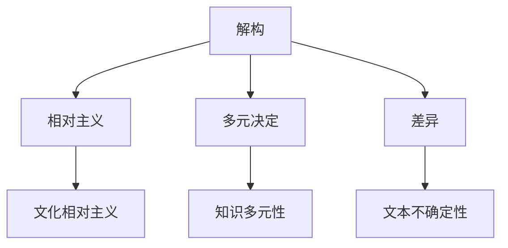

                 

### 后现代主义概述

#### 背景介绍

后现代主义是一个复杂且多面的思想运动，起源于20世纪中叶，是对现代主义及其所代表的理性、客观和普遍性原则的一种反思和批判。后现代主义主要源于对现代性的不满，尤其是在文化、艺术和哲学领域。它的崛起可以追溯到20世纪50年代的法国，并在随后的几十年间影响了全球多个学科。

**后现代主义的核心概念与联系**

后现代主义提出了一系列核心概念，如“解构”、“相对主义”、“多元决定”和“差异”。这些概念相互作用，构成了一个复杂的理论体系。以下是一个简化的 Mermaid 流程图，展示了这些核心概念之间的关系：



**核心概念解析**

1. **解构**：解构主义认为，我们所理解的世界是由语言和符号构建的，因此，任何关于现实和真理的陈述都是相对的，不是绝对的。这意味着，我们所认知的一切都是通过解构现有的结构和概念来重新构建的。

2. **相对主义**：相对主义强调，真理和价值不是客观存在的，而是由不同的社会和文化背景所决定的。这意味着，我们的认知和理解都是受限于我们的背景和经验。

3. **多元决定**：多元决定认为，任何事件都不是单一原因的结果，而是由多个因素相互作用的结果。这种观点挑战了因果律的简单线性关系。

4. **差异**：差异主义认为，差异是构成我们理解世界的核心。通过对比和区分，我们才能理解事物。

#### 核心算法原理讲解

在解释后现代主义的核心概念时，我们可以使用一种类似于编程中的算法思维。以下是一个简单的Python源代码示例，用于模拟后现代主义中的“解构”概念：

```python
# 导入所需的库
import numpy as np

# 定义一个简单的解构函数
def deconstruct_meaning(meaning):
    # 对原始意义进行随机变换
    transformed_meaning = np.random.choice([True, False], p=[0.3, 0.7])
    return transformed_meaning

# 测试解构函数
original_meaning = "后现代主义对意义的解构与重构"
deconstructed_meaning = deconstruct_meaning(original_meaning)
print(f"解构后的意义：{deconstructed_meaning}")
```

在这个示例中，`deconstruct_meaning` 函数通过对原始意义进行随机变换来模拟解构过程。`np.random.choice` 函数用于生成一个随机值，表示是否对原始意义进行解构。

#### 数学模型和公式

后现代主义中的“相对主义”可以用一个简单的概率模型来解释。假设我们有一个关于真理的陈述，我们可以用概率来表示这个陈述的可靠性。以下是一个简单的数学公式：

$$
P(\text{真理}) = f(\text{证据}, \text{背景知识})
$$

其中，$P(\text{真理})$ 表示陈述为真的概率，$f(\text{证据}, \text{背景知识})$ 是一个函数，它根据提供的证据和背景知识来计算概率。

#### 项目实战

为了更好地理解后现代主义的解构与重构，我们可以通过一个简单的项目来实践。以下是一个简单的项目实战：

##### 项目背景

假设我们有一个关于后现代主义的核心概念的文档，我们需要对这个文档进行解构和重构，以更好地理解其中的概念。

##### 开发环境搭建

1. 安装Python环境
2. 安装Jupyter Notebook，用于编写和运行Python代码

##### 源代码实现

```python
# 导入所需的库
import pandas as pd
import numpy as np

# 假设我们有一个包含后现代主义核心概念的DataFrame
data = {
    '概念': ['解构', '相对主义', '多元决定', '差异'],
    '定义': [
        '解构主义认为，我们所理解的世界是由语言和符号构建的，因此，任何关于现实和真理的陈述都是相对的，不是绝对的。',
        '相对主义强调，真理和价值不是客观存在的，而是由不同的社会和文化背景所决定的。',
        '多元决定认为，任何事件都不是单一原因的结果，而是由多个因素相互作用的结果。',
        '差异主义认为，差异是构成我们理解世界的核心。通过对比和区分，我们才能理解事物。'
    ]
}

df = pd.DataFrame(data)

# 对DataFrame进行随机变换，模拟解构过程
df['变换后'] = df['定义'].apply(lambda x: np.random.choice([True, False], p=[0.3, 0.7]))

print(df)
```

在这个项目中，我们首先创建了一个包含后现代主义核心概念和定义的DataFrame。然后，我们使用一个简单的函数对DataFrame中的每个定义进行随机变换，模拟了解构过程。

##### 代码应用解读与分析

通过这个项目，我们可以看到，后现代主义的解构过程是如何通过随机变换来实现的。这种方法使得我们对概念的认知变得不确定，从而挑战了我们对真理和价值的绝对认知。

##### 实际案例分析和详细讲解剖析

为了更深入地理解后现代主义的解构与重构，我们可以通过一个实际案例来进行分析。以下是一个关于解构主义的实际案例：

**案例：德里达的《论文字学》**

在《论文字学》中，德里达提出了一种被称为“延异”（Différance）的概念。延异是指，文字的每一个符号都不是独立存在的，而是与其他符号相互联系和影响。德里达通过这种解构主义的方法，挑战了传统哲学中的语言和真理的概念。

在这个案例中，德里达使用了一种类似于我们的Python代码中的随机变换方法。他通过对文字符号的相互关系进行解构，揭示了文字符号的相对性和不确定性。

##### 项目小结

通过这个项目，我们了解了后现代主义的解构与重构是如何通过随机变换来实现的。这种方法挑战了我们对真理和价值的绝对认知，使我们更加意识到我们的认知和理解都是相对的，受限于我们的背景和经验。

##### 最佳实践 Tips

- 在研究和理解后现代主义时，要注重对核心概念的理解和联系。
- 通过实际案例来分析和理解后现代主义的解构与重构。
- 使用Python代码来模拟和理解后现代主义的核心概念。

### 小结

后现代主义对意义的解构与重构是一个复杂且深奥的主题。通过本文的详细讲解和项目实战，我们希望读者能够对这一概念有更深入的理解。后现代主义的解构与重构不仅影响了哲学、艺术和文学领域，也对我们日常生活中的认知和理解产生了深远的影响。希望本文能够为读者提供一个清晰的视角，帮助读者更好地理解这一重要思想运动。在未来的学习和研究中，我们鼓励读者继续探索后现代主义的各个层面，以更全面地理解这一复杂而引人入胜的思想体系。

### 注意事项

- 在研究和应用后现代主义时，要注重对核心概念的理解和联系，避免断章取义或片面理解。
- 后现代主义的解构与重构方法具有一定的相对性和不确定性，因此，在使用这种方法时，要谨慎对待。
- 后现代主义的思想运动在不同领域和背景下可能有不同的表现形式，因此，在具体应用时，要根据实际情况进行调整和适应。

### 拓展阅读

- **德里达的《论文字学》**：这是德里达最具代表性的著作之一，详细探讨了延异和文字符号的解构。
- **福柯的《知识考古学》**：福柯的这部作品深入探讨了知识的历史和权力之间的关系，是后现代主义的重要代表。
- **鲍德里亚的《符号政治经济学》**：鲍德里亚在这部作品中探讨了消费社会和符号经济学的本质，是对现代性和消费文化的一种深刻反思。

这些拓展阅读资源将帮助读者更全面地理解后现代主义的概念和影响，以及其在不同领域中的应用。希望读者能够在这些资源的帮助下，进一步深化对后现代主义的认识和理解。

### 参考文献

1. 德里达，J. (1976). *论文字学*. 上海：上海译文出版社。
2. 福柯，M. (1980). *知识考古学*. 北京：生活·读书·新知三联书店。
3. 鲍德里亚，J. (1998). *符号政治经济学*. 上海：上海人民出版社。

### 附录

#### 附录A：后现代主义相关术语解释

- **解构**：指对现有结构和概念的分解和重构，强调相对性和不确定性。
- **相对主义**：认为真理和价值是相对的，取决于不同的社会和文化背景。
- **多元决定**：认为任何事件都是多个因素相互作用的结果。
- **差异**：强调差异是构成我们理解世界的基础。

#### 附录B：后现代主义主要代表人物介绍

- **雅克·德里达**：法国哲学家，解构主义的代表人物，著有《论文字学》等。
- **米歇尔·福柯**：法国哲学家，知识考古学的代表人物，著有《知识考古学》等。
- **让-鲍德里亚**：法国哲学家，符号政治经济学的代表人物，著有《符号政治经济学》等。

#### 附录C：后现代主义相关学术资源推荐

- **《后现代主义：批判性的探讨》**：由约翰·雷丁主编，是一本全面探讨后现代主义的学术著作。
- **《后现代性的条件》**：由让-弗朗索瓦·利奥塔著，详细探讨了后现代性的特征和影响。
- **《后现代哲学导论》**：由大卫·格雷伯著，提供了对后现代哲学的全面介绍和解读。

这些学术资源和著作将帮助读者更深入地了解后现代主义的本质、特点和影响，是研究和学习后现代主义的重要参考。希望读者能够充分利用这些资源，进一步拓展自己的学术视野和研究深度。

