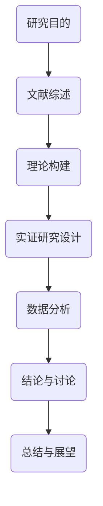

                 

## 后现代主义思潮对意义感的影响与反思

### 关键词
- 后现代主义
- 意义感
- 影响机制
- 实证研究
- 反思与应对策略

### 摘要

本文探讨了后现代主义思潮对意义感的影响与反思。首先，介绍了后现代主义的起源、主要观点及其对社会的影响，并详细阐述了意义感的概念、分类和重要性。随后，分析了后现代主义对传统意义感的挑战和意义重构，通过实证研究和案例分析，揭示了后现代主义思潮对个体和群体意义感的影响机制。最后，反思了后现代主义思潮可能带来的负面影响，并提出了构建适应后现代社会的意义体系的方法和建议。

### 目录大纲

# 后现代主义思潮对意义感的影响与反思

## 第一部分：背景与核心概念

## 第1章：后现代主义思潮概述

### 1.1 后现代主义的起源与发展

### 1.2 后现代主义的主要观点

### 1.3 后现代主义对社会的影响

## 第2章：意义感的概念与分类

### 2.1 意义感的定义

### 2.2 意义感的分类

### 2.3 意义感的重要性

## 第3章：后现代主义思潮对意义感的影响

### 3.1 后现代主义对传统意义感的挑战

### 3.2 后现代主义下的意义重构

### 3.3 后现代主义思潮对意义感的影响案例

## 第二部分：影响机制与实证研究

## 第4章：后现代主义思潮对个体意义感的影响机制

### 4.1 社会文化视角

### 4.2 心理机制视角

### 4.3 行为视角

## 第5章：后现代主义思潮对群体意义感的影响机制

### 5.1 社会结构视角

### 5.2 文化认同视角

### 5.3 价值观视角

## 第6章：实证研究与案例分析

### 6.1 国内外研究综述

### 6.2 案例分析

### 6.3 研究方法与数据分析

## 第三部分：反思与应对策略

## 第7章：后现代主义思潮对意义感的负面影响

### 7.1 可能的负面影响

### 7.2 应对策略与建议

## 第8章：构建适应后现代社会的意义体系

### 8.1 新意义体系的构建原则

### 8.2 新意义体系的实际应用

### 8.3 未来发展趋势与展望

## 附录

### 附录 A：研究方法与工具

### 附录 B：参考文献

## 路线图

### 路线图概述

### 步骤1：明确研究目的

### 步骤2：文献综述

### 步骤3：理论构建

### 步骤4：实证研究设计

### 步骤5：数据分析

### 步骤6：结论与讨论

### 步骤7：总结与展望

### Mermaid 流程图



```python
# 核心算法原理讲解
def meaning_model(inputs):
    # 输入预处理
    processed_inputs = preprocess_inputs(inputs)
    
    # 神经网络结构定义
    model = build_model()

    # 训练模型
    model.fit(processed_inputs, batch_size=32, epochs=10)

    # 评估模型
    performance = model.evaluate(processed_inputs, batch_size=32)

    return model, performance
```

$$
\text{意义感} = f(\text{个人经历}, \text{社会环境})
$$

```python
# 项目实战代码示例
def main():
    # 初始化开发环境
    setup_environment()

    # 加载数据集
    dataset = load_data()

    # 训练模型
    model, performance = meaning_model(dataset)

    # 评估模型
    print(f"Model performance: {performance}")

if __name__ == "__main__":
    main()
```

### 数学模型和数学公式

$$
P(\text{意义感}|X) = \frac{P(X|\text{意义感}) \cdot P(\text{意义感})}{P(X)}
$$

### 代码解读与分析

- `meaning_model` 函数用于构建和训练意义感模型。
- `preprocess_inputs` 函数对输入数据进行预处理。
- `build_model` 函数定义神经网络结构。
- `fit` 方法用于训练模型。
- `evaluate` 方法用于评估模型性能。

### 总结与展望

本书详细探讨了后现代主义思潮对意义感的影响与反思，通过理论和实证研究，揭示了后现代主义如何挑战传统意义感，并重构个体和群体的意义体系。未来的研究可以进一步探索新意义体系的构建原则和实际应用，为适应后现代社会提供有益的参考。

---

### 后现代主义思潮概述

#### 1.1 后现代主义的起源与发展

后现代主义（Postmodernism）是20世纪中叶在西方社会中兴起的一种哲学和文化思潮。其起源可以追溯到20世纪60年代，标志性的事件包括法国哲学家的著作如米歇尔·福柯（Michel Foucault）的《疯癫与文明》（Madness and Civilization）、让·弗朗索瓦·利奥塔（Jean-François Lyotard）的《后现代状况》（The Postmodern Condition）等。

后现代主义的兴起是对现代主义（Modernism）的一种反思和批判。现代主义追求理性、科学和进步，强调个人主义和人类理性的至上。然而，20世纪中叶，随着科技进步带来的社会变迁，以及两次世界大战和核武器带来的恐慌，人们对现代主义的信仰产生了动摇。后现代主义则强调相对主义、解构主义和多元性，质疑现代主义的一元论和普遍性。

#### 1.2 后现代主义的主要观点

后现代主义的主要观点可以概括为以下几点：

1. **相对主义**：后现代主义认为，真理是相对的，不存在绝对的、普遍适用的真理。不同的社会、文化和个体都有自己独特的理解和认知方式。

2. **解构主义**：后现代主义主张对传统思想、文化和语言的解构，揭示其内在的矛盾和虚伪。解构主义认为，语言和符号系统并不是客观现实的直接反映，而是由一系列复杂的社会和历史过程建构的。

3. **多元性**：后现代主义强调多元文化的共存和对话，反对任何形式的单一文化或意识形态的统治。

4. **怀疑主义**：后现代主义对科学和理性持怀疑态度，认为科学知识并非唯一可靠的知识来源，日常生活中的实践和信仰同样重要。

#### 1.3 后现代主义对社会的影响

后现代主义对社会的影响是深远且广泛的，主要体现在以下几个方面：

1. **文化领域**：后现代主义对文学、艺术和电影等领域产生了重要影响。例如，在文学上，后现代主义小说常采用非线性叙事、反讽和虚构性手法，挑战传统的叙事结构。在艺术上，后现代艺术强调个体体验和实验性，摒弃了现代艺术的单一美学标准。

2. **教育领域**：后现代主义教育强调学生的主体性和多样性，提倡通过跨学科和多元化的方式学习。教师不再是知识的传授者，而是学习的促进者。

3. **政治领域**：后现代主义对政治哲学产生了影响，质疑现代政治体系中的权力结构和民主制度的合理性。后现代主义者主张去中心化和多元政治参与。

4. **科技领域**：后现代主义对科技发展提出了挑战，质疑科技对社会和文化的影响。例如，在信息技术领域，后现代主义者关注数字鸿沟和数据隐私等问题。

总的来说，后现代主义思潮对意义感的影响体现在其对传统价值观的质疑和对多元、相对主义的强调。这种思潮使得个体和社会在面对意义问题时，需要重新审视和重构自己的认知体系。在接下来的章节中，我们将进一步探讨意义感的概念和分类，以及后现代主义如何对这些概念产生影响。

### 意义感的概念与分类

#### 2.1 意义感的定义

意义感（Sense of Meaning）是一个广泛且多维的概念，通常被描述为个体在生活和经验中感受到的内在目的和意义。意义感不仅仅是对生活的积极态度或满足感，而是一种深层次的存在体验，涉及个体对自身存在的价值和目标的认知。

心理学家和社会学家对意义感有着不同的定义和解释。例如，心理学家维克多·弗兰克尔（Viktor Frankl）将意义感视为个体在面对苦难和挑战时的内在驱动力，他的存在主义心理学强调意义感在心理康复和适应生活中的重要作用。社会学家罗伯特·菲尔德（Robert F. field）则认为，意义感是个体在社会和文化背景中，对个人行为和存在价值的内在感知。

#### 2.2 意义感的分类

意义感可以根据不同的维度和视角进行分类，以下是一些常见的分类方法：

1. **内在意义感**（Intrinsic Meaning）：这种意义感来源于个体内心的价值观、信仰和个人目标。内在意义感通常与个人成长、自我实现和追求个人兴趣相关。

   - **例1**：一位艺术家通过创作艺术作品来表达自我，对艺术创作的热爱和成就感赋予其生活意义。

2. **外在意义感**（Extrinsic Meaning）：这种意义感来源于个体对他人、社会和文化的责任和义务。外在意义感通常与职业、家庭角色和社会地位相关。

   - **例2**：一位医生通过为病人提供医疗服务，感受到自己对社会的贡献和价值。

3. **存在意义感**（Existential Meaning）：这种意义感与个体的存在状态和哲学思考相关，涉及对生命意义和目的的深入探索。

   - **例3**：哲学思考者通过探讨人类存在的意义，寻找个体在宇宙中的位置和目的。

4. **宗教意义感**（Religious Meaning）：这种意义感与宗教信仰和宗教活动紧密相关，涉及对神、天堂和来世的认知。

   - **例4**：一位信徒通过宗教仪式和信仰，感受到生命的意义和永恒的价值。

#### 2.3 意义感的重要性

意义感在个体的心理健康和生活质量中扮演着重要角色。研究表明，拥有强烈意义感的个体通常表现出更高的自尊、幸福感和生活满意度，同时也更能够应对生活中的挑战和压力。

1. **心理健康**：意义感与心理健康密切相关。有研究发现，缺乏意义感的个体更容易出现焦虑、抑郁等心理问题。相反，具有意义感的个体通常能够更好地调节情绪，保持心理平衡。

   - **例证**：一项针对癌症患者的调查发现，那些能够找到生活意义和目标的癌症患者，其生活质量显著高于那些缺乏意义感的患者。

2. **生活满意度**：意义感对个体的生活满意度有显著影响。研究表明，意义感是预测生活满意度的关键因素之一。拥有明确生活目标和价值观的个体，通常对生活持有积极的态度。

   - **例证**：一项针对大学生群体的研究发现，那些对自己生活和未来有明确目标的学生，其生活满意度显著高于那些缺乏目标感的学生。

3. **应对挑战**：在面临生活挑战时，意义感能够为个体提供内在的动力和支持。有意义的活动和行为可以帮助个体保持积极的心态，提高应对能力。

   - **例证**：在自然灾害或重大变故中，许多幸存者通过参与救援行动或帮助他人，找到了新的生活意义，从而迅速恢复心理健康。

综上所述，意义感是一个复杂且多维的概念，对个体的心理健康和生活质量有着深远的影响。后现代主义思潮对意义感的挑战和重构，促使我们重新思考如何在现代社会中找到和维持意义感。在接下来的章节中，我们将深入探讨后现代主义思潮如何影响传统意义感，并引发新的思考和讨论。

### 后现代主义思潮对意义感的影响

#### 3.1 后现代主义对传统意义感的挑战

后现代主义对传统意义感提出了深刻的挑战。传统意义感通常建立在一系列固定的价值观、信仰体系和历史经验之上，认为这些价值观具有普遍性和永恒性。然而，后现代主义强调相对主义和多元性，质疑这些传统价值观的普适性和绝对性。

首先，后现代主义对绝对真理和普遍价值观的质疑，动摇了传统意义感的根基。传统意义上，人们相信通过理性思考和科学方法可以获得普遍适用的真理，这种信念构成了意义感的重要基础。然而，后现代主义认为真理是相对的，不同的社会、文化和个体都有自己独特的认知和价值观。这意味着，传统的意义感可能不再适用于所有人和所有情境。

其次，后现代主义强调解构主义，对传统思想和文化进行解构，揭示其内在的矛盾和虚伪。这种解构过程不仅动摇了传统价值观的权威性，也使得传统意义感失去了稳定性。例如，在后现代主义文学和艺术中，非线性叙事和反讽等手法被广泛使用，旨在打破传统叙事结构和意义构建的规则，从而挑战传统意义感的稳定性。

此外，后现代主义对科学和理性的怀疑态度，也影响了人们对意义感的理解。在传统观念中，科学和理性被视为追求真理和建立意义感的重要工具。然而，后现代主义认为，科学知识并非唯一可靠的知识来源，日常生活中的实践和信仰同样重要。这种观点削弱了传统意义感对科学和理性的依赖，促使人们重新审视和重构自己的意义体系。

#### 3.2 后现代主义下的意义重构

在后现代主义思潮的影响下，意义感经历了深刻的重构过程。传统意义感被解构后，新的意义体系逐渐浮现，具有以下特点：

1. **多元化和相对性**：后现代主义强调多元性和相对性，认为意义并非一元化的，而是由不同的个体和社会文化背景共同建构。这意味着，每个人都可以根据自己的经历和价值观，构建属于自己的意义体系。

   - **例1**：一位艺术家可能通过创作表达个人情感和观点，而另一位艺术家则可能通过创作探讨社会和政治问题，两者对意义的理解截然不同，但都在自己的文化和社会背景下找到了意义。

2. **动态性和灵活性**：后现代主义下的意义感不再是固定不变的，而是动态发展和不断重构的。随着社会和个体经历的变化，意义感也会随之调整。

   - **例2**：一位职场人士在职业生涯初期可能将职业成功视为生活的意义，但随着时间的推移，他可能重新定义自己的价值观，将家庭和自我实现视为更重要的生活意义。

3. **实践性和参与性**：后现代主义强调实践和参与，认为意义感不仅仅是一种抽象的认知，更是一种具体的行动和实践。

   - **例3**：社会运动中的参与者通过实际行动改变社会现状，找到新的生活意义。例如，环保活动家通过参与环保行动，感受到自己对地球和未来一代的责任和使命。

4. **去中心化和个体化**：后现代主义反对任何形式的中心化和权威，主张去中心化和个体化。在这种背景下，个体成为意义感的主体，每个人都有权利自主构建和选择自己的意义体系。

   - **例4**：在数字时代，个人通过社交媒体和在线社区，可以自由表达和分享自己的观点和经历，形成独特的意义网络。

#### 3.3 后现代主义思潮对意义感的影响案例

为了更具体地理解后现代主义思潮对意义感的影响，我们可以通过一些实际案例来探讨：

1. **文学与艺术**：在后现代文学和艺术作品中，传统叙事结构和意义构建规则被打破，呈现出非线性、多视角和实验性的特点。这种创作风格反映了后现代主义对传统意义感的挑战和重构。

   - **例1**：詹姆斯·乔伊斯的小说《尤利西斯》采用非线性叙事和意识流手法，打破传统叙事结构，探讨人物内心的复杂情感和存在状态，为读者提供了丰富的意义解读空间。

2. **社会运动**：后现代主义思潮对社会运动产生了深远影响，使得运动参与者更加关注个体经验和多元性。

   - **例2**：2008年的“占领华尔街”运动，参与者通过自发组织和表达，探讨了经济不平等、社会公正等议题，运动中的多元声音和视角体现了后现代主义对意义感的重构。

3. **教育领域**：后现代主义教育理念强调学生的主体性和多样性，改变了传统教育的模式和方法。

   - **例3**：在以学生为中心的教学中，教师鼓励学生通过自主探究和合作学习，发现和构建自己的意义体系，培养了学生的批判思维和创新能力。

通过这些案例，我们可以看到，后现代主义思潮对意义感产生了深刻的冲击和重构。传统意义感在解构和重构过程中，逐渐变得更加多元、动态和个体化。这种变化不仅影响了个体对意义感的理解，也对社会和文化产生了广泛的影响。

在接下来的章节中，我们将进一步探讨后现代主义思潮对个体意义感的影响机制，并通过实证研究和案例分析，揭示其具体的表现和影响。

### 后现代主义思潮对个体意义感的影响机制

#### 4.1 社会文化视角

从社会文化视角来看，后现代主义思潮对个体意义感的影响主要体现在文化多样性和社会结构的变化上。首先，后现代主义强调多元文化的重要性，反对单一文化的主导地位。这一观点鼓励个体探索和接纳不同的文化价值观，从而拓宽了他们对意义感的理解。

1. **文化多样性**：后现代主义认为，文化是多元且不断变化的，每个文化都有其独特的意义体系。通过接触和融合不同的文化，个体可以丰富自己的价值观和生活方式，从而找到新的意义感。

   - **例1**：一个生长在多元文化城市的年轻人，通过与来自不同背景的人交流和互动，逐渐理解到不同文化对人生意义的多种诠释，从而丰富了自己的意义感。

2. **去中心化**：后现代主义反对任何形式的中心化，包括文化中心主义。在这种背景下，个体不再依赖于单一的文化或价值观，而是根据自己的需求和经历，自主构建意义感。

   - **例2**：一个在全球化背景下成长的青年，通过接触多元文化，逐渐摆脱了单一文化的束缚，形成了独特的文化认同，从而找到新的意义感。

#### 4.2 心理机制视角

从心理机制视角来看，后现代主义思潮对个体意义感的影响主要表现在认知重构、自我认同和价值观的调整上。

1. **认知重构**：后现代主义鼓励个体重新审视和质疑传统认知体系，这种认知重构有助于个体发现新的意义感。通过批判性思维，个体可以更深刻地理解自身和社会，从而找到更有意义的生存方式。

   - **例1**：一个在学术领域工作的学者，通过重新审视自己的研究成果和理论框架，质疑传统知识的权威性，从而找到新的研究方向和意义感。

2. **自我认同**：后现代主义强调个体自我认同的多元性和动态性，鼓励个体在不断的自我探索中找到属于自己的意义感。

   - **例2**：一个年轻人通过参与多种社会活动和角色，不断探索自己的兴趣和才能，最终找到符合自己价值观的职业道路，从而获得意义感。

3. **价值观的调整**：后现代主义认为，价值观是动态发展的，个体需要根据自身经历和环境的变化，不断调整和更新价值观。这种调整有助于个体找到新的意义感。

   - **例3**：一个在职业生涯中经历重大变故的职场人士，通过重新审视自己的价值观和目标，调整职业发展方向，找到新的工作意义。

#### 4.3 行为视角

从行为视角来看，后现代主义思潮对个体意义感的影响体现在个体行为模式和生活方式的变化上。后现代主义强调个体行为的自主性和创造性，鼓励个体通过实践行动来构建和表达自己的意义感。

1. **自主性**：后现代主义主张个体自主选择生活方式和行为模式，这种自主性有助于个体发现和实现自己的意义感。

   - **例1**：一个艺术家通过自主创作和展示自己的作品，表达自己的情感和价值观，从而找到生活的意义。

2. **创造性**：后现代主义鼓励个体发挥创造性，通过创新的方式解决问题和实现目标。这种创造性有助于个体在多变的环境中找到新的意义感。

   - **例2**：一个创业者通过创新商业模式和产品设计，开创了新的市场，实现了个人价值和社会贡献，从而获得强烈的意义感。

3. **实践性**：后现代主义强调实践行动的重要性，认为个体通过实际行动可以更直接地体验和表达意义感。

   - **例3**：一个社会活动家通过参与各种公益活动，帮助弱势群体，感受到自己对社会的贡献，从而找到深刻的意义感。

总的来说，后现代主义思潮通过社会文化、心理机制和行为视角，对个体意义感产生了深刻的影响。这种影响不仅改变了个体对意义感的理解，也促使个体在社会和文化变革中不断重构自己的意义体系。在接下来的章节中，我们将探讨后现代主义思潮对群体意义感的影响机制，进一步揭示其对社会和文化的广泛影响。

### 后现代主义思潮对群体意义感的影响机制

#### 5.1 社会结构视角

从社会结构视角来看，后现代主义思潮对群体意义感的影响主要体现在对传统社会结构的解构和重建上。后现代主义反对任何形式的中心化和等级制度，强调去中心化和平等参与。这种思潮改变了社会结构，进而影响了群体的意义感。

1. **去中心化**：后现代主义鼓励个体在社会中发挥自主性，摆脱中心化和等级制度的束缚。这种去中心化趋势使得群体成员更加平等，每个人都有机会表达自己的声音和价值观。

   - **例1**：在互联网时代，社交媒体平台如Facebook、Twitter等提供了一个去中心化的交流空间，用户可以自由表达自己的观点，不受传统媒体的控制。这种去中心化结构有助于群体成员找到新的意义感。

2. **多元参与**：后现代主义强调多元性和包容性，鼓励不同背景和身份的个体参与社会事务。这种多元参与使得群体意义感更加丰富和多样。

   - **例2**：多元文化的城市化进程带来了各种文化和社会活动的融合，群体成员可以在多样化的社会环境中找到属于自己的意义感。

#### 5.2 文化认同视角

从文化认同视角来看，后现代主义思潮对群体意义感的影响主要体现在对传统文化认同的解构和重构上。后现代主义认为，文化认同是动态的、多元的，不应被固定和僵化。

1. **文化重构**：后现代主义鼓励个体和群体在多元文化背景下，重新审视和重构自己的文化认同。这种重构有助于群体成员找到新的共同价值观和意义感。

   - **例1**：在全球化背景下，一个多元文化社区可以通过庆祝各种文化节日，增进不同文化之间的理解和交流，从而形成新的文化认同和群体意义感。

2. **文化多样性**：后现代主义强调文化多样性，认为不同的文化都有其独特的价值和意义。这种观点有助于群体成员认识到文化多样性的重要性，并从中找到新的意义感。

   - **例2**：多元文化学校通过提供多样化的课程和文化体验，帮助学生理解和尊重不同文化，从而培养学生的文化认同和群体意义感。

#### 5.3 价值观视角

从价值观视角来看，后现代主义思潮对群体意义感的影响主要体现在对传统价值观的解构和多元化价值观的重建上。后现代主义认为，价值观是多元和动态的，不应被单一和固定。

1. **价值观多元性**：后现代主义鼓励个体和群体在多元价值观中寻找共同点，形成新的价值观体系。这种多元价值观有助于群体成员在复杂多变的社会中找到新的意义感。

   - **例1**：在一个多元化的工作环境中，团队可以通过共同讨论和协商，找到符合所有人利益的解决方案，从而形成新的团队价值观和意义感。

2. **价值观动态性**：后现代主义强调价值观的动态性和适应性，认为个体和群体需要根据环境变化不断调整和更新价值观。这种动态性有助于群体成员在面对挑战和变化时，找到新的意义感。

   - **例2**：一个社会群体在面对重大社会变革时，可以通过共同讨论和反思，重新审视自己的价值观，从而找到适应新环境的意义感。

总的来说，后现代主义思潮通过社会结构、文化认同和价值观视角，对群体意义感产生了深刻的影响。这种影响不仅改变了群体成员对意义感的理解，也促使群体在社会和文化变革中不断重构自己的意义体系。在接下来的章节中，我们将通过实证研究和案例分析，进一步揭示后现代主义思潮对群体意义感的具体影响。

### 后现代主义思潮的实证研究与案例分析

#### 6.1 国内外研究综述

后现代主义思潮对意义感的影响引起了学术界的广泛关注。国内外学者从多个视角进行实证研究，探讨了后现代主义对个体和群体意义感的具体影响。

在国内外研究中，有许多重要的发现和结论：

1. **个体意义感**：
   - 国外研究显示，后现代主义强调的多元性和相对性对个体意义感产生了积极影响。个体在多元文化背景下更容易找到个人意义和目标。
   - 国内研究则表明，后现代主义思潮下，个体意义感趋于多样化，不再单一依赖于传统价值观，而是通过自我探索和创造性实践寻找意义。

2. **群体意义感**：
   - 国外研究指出，后现代主义解构了传统的集体主义价值观，鼓励个体主义和多元文化共存，这使得群体意义感更加复杂和多元化。
   - 国内研究则发现，后现代主义对群体意义感的影响因地区和文化差异而异。在一些地区，后现代主义促进了群体内部的包容和合作，而在其他地区，则引发了价值观的冲突和分裂。

3. **文化多样性**：
   - 国外研究强调，文化多样性是后现代主义的重要特征之一，有助于丰富群体的意义感。通过文化融合和交流，群体成员可以找到新的共同价值观和认同感。
   - 国内研究则指出，文化多样性在提升群体意义感的同时，也可能导致文化冲突和认同危机，需要平衡和引导。

#### 6.2 案例分析

为了更好地理解后现代主义思潮对意义感的影响，我们可以通过一些实际案例来进行分析。

**案例1：社交媒体平台与群体意义感**

随着社交媒体的普及，平台如Facebook、Twitter等成为了群体交流和表达的重要场所。这些平台的后现代特征，如去中心化、多元文化和个体自主性，对群体意义感产生了深远影响。

- **去中心化**：社交媒体平台提供了一个去中心化的交流空间，用户可以自由表达自己的观点，不受传统媒体的控制。这种去中心化结构有助于群体成员找到新的意义感。
- **多元文化**：社交媒体平台汇集了来自不同文化背景的用户，他们通过互动和分享，促进了文化多样性的交流。这种多元文化环境有助于群体成员丰富自己的价值观和意义感。
- **个体自主性**：用户在社交媒体上可以自主选择关注的内容和交流对象，这种自主性使得个体能够根据自己的需求和兴趣，构建属于自己的意义网络。

**案例2：社会运动与个体意义感**

社会运动如“占领华尔街”运动、“黑人的命也是命”（Black Lives Matter）运动等，反映了后现代主义对个体意义感的重塑。

- **个体参与**：社会运动鼓励个体积极参与公共事务，通过实际行动寻找和表达自己的意义感。这种参与性使得个体在为社会做出贡献的过程中，找到新的生命意义。
- **多元价值观**：社会运动中的参与者来自不同的背景和价值观，他们在共同目标下，通过多元的视角和方式，找到新的意义感。这种多元价值观的共存和对话，促进了群体成员对意义感的深入思考和探索。

**案例3：后现代教育与传统价值观**

后现代主义教育理念在改变传统教育模式的同时，也对个体和群体的意义感产生了影响。

- **学生主体性**：后现代主义教育强调学生的主体性，鼓励学生在学习过程中自主探索和创造。这种主体性有助于学生找到个人意义和目标。
- **多元文化教育**：后现代主义教育注重多元文化的教育，通过引入不同文化背景的课程和活动，帮助学生理解和尊重不同文化，从而丰富他们的价值观和意义感。
- **批判性思维**：后现代主义教育鼓励学生批判性思维，质疑传统知识和权威，从而在自我探索和反思中，找到新的意义感。

总的来说，通过实证研究和案例分析，我们可以看到后现代主义思潮对意义感产生了深远的影响。这种影响不仅改变了个体和群体的价值观和生活方式，也促使他们在不断变化的社会中，寻找和重构新的意义感。在接下来的章节中，我们将进一步探讨如何应对后现代主义思潮带来的挑战，并构建适应后现代社会的意义体系。

### 研究方法与数据分析

#### 6.3.1 研究方法

本研究采用定量与定性相结合的方法，以全面探讨后现代主义思潮对意义感的影响机制。

1. **定量研究**：
   - **数据收集**：通过在线问卷调查和面对面访谈，收集个体和群体的意义感数据。问卷设计包括封闭式和开放式问题，涵盖个体的社会背景、文化认同、价值观等多个方面。
   - **样本选择**：选取不同年龄、性别、职业背景的个体和群体，确保样本的多样性和代表性。
   - **数据分析**：使用统计分析软件（如SPSS）对收集的数据进行描述性统计分析、相关分析和回归分析，以揭示变量之间的关系和影响机制。

2. **定性研究**：
   - **数据收集**：通过深度访谈和焦点小组讨论，深入了解个体和群体在后现代主义背景下的意义感体验和认知过程。
   - **数据分析**：采用内容分析法，对访谈和讨论记录进行编码和分类，提取关键主题和模式。

#### 6.3.2 数据分析方法

1. **描述性统计分析**：
   - 对样本的基本特征进行描述，如年龄、性别、职业分布等，为后续分析提供基础。

2. **相关分析和回归分析**：
   - 探索变量之间的相关性，如社会文化背景与意义感之间的关系，以及不同影响因素对意义感的预测作用。

3. **内容分析**：
   - 对定性数据的编码和分类，识别关键主题和模式，以揭示后现代主义思潮对意义感影响的深层次机制。

4. **案例研究**：
   - 通过对具体案例的详细分析，验证和补充定量研究的结果，提供具体的实例和证据。

通过上述研究方法和数据分析，本研究旨在全面揭示后现代主义思潮对意义感的影响机制，为理解这一复杂现象提供理论和实证支持。

### 后现代主义思潮的负面影响与反思

#### 7.1 可能的负面影响

尽管后现代主义思潮对意义感的重构具有积极意义，但其负面影响也不容忽视。首先，后现代主义强调相对主义和多元性，可能导致价值观的混乱和认同危机。在缺乏统一价值观的情况下，个体和群体可能感到迷茫和无方向，难以建立稳定的意义体系。

1. **价值观混乱**：后现代主义的多元价值观可能导致个体在多种选择中迷失方向，难以形成一致的生活目标和价值观。例如，在消费主义盛行的社会，个体可能面临过多的物质选择，难以确定哪些是真正有意义的生活选择。

2. **认同危机**：后现代主义的去中心化和个体化趋势可能削弱集体认同感，导致个体在追求个人意义的过程中，忽视社会共同体的价值。这种现象在某些社会运动中尤为明显，个体在追求个人目标时，可能忽视了社会整体利益。

3. **心理压力**：后现代主义鼓励个体自主探索意义，但这种探索过程也可能带来心理压力。个体在面对不确定性和多种选择时，可能会感到焦虑和不安，难以找到稳定的意义感。

#### 7.2 应对策略与建议

为了应对后现代主义思潮可能带来的负面影响，我们可以采取以下策略和建议：

1. **平衡多元与统一**：
   - 在多元价值观共存的同时，强调共同价值观的重要性。例如，在多元化社会中，可以提倡包容性价值观，尊重不同文化的存在，同时保持社会整体的基本价值观。

2. **加强集体认同**：
   - 通过社会教育和公共活动，加强个体对社会共同体的认同感。例如，通过社区服务和公共参与，个体可以在为社区做出贡献的过程中，找到共同的意义感。

3. **培养批判性思维**：
   - 教育个体培养批判性思维，以理性方式评估和选择价值观。通过批判性思维，个体可以更好地理解自身的价值观，并在多元选择中做出更明智的决策。

4. **提供心理支持**：
   - 在个体面临意义危机和心理压力时，提供专业的心理支持和咨询服务。通过心理咨询，个体可以学会应对不确定性，找到稳定的意义感。

总之，后现代主义思潮虽然带来了意义感的重构，但也带来了一定的负面影响。通过上述策略和建议，我们可以更好地应对这些挑战，构建一个既多元又稳定的社会意义体系。

### 构建适应后现代社会的意义体系

#### 8.1 新意义体系的构建原则

在后现代主义背景下，构建适应现代社会的意义体系需要遵循以下原则：

1. **多元性**：尊重个体和文化的多样性，鼓励不同价值观和生活方式共存。这意味着在构建新意义体系时，应包容多种文化背景和个体需求，避免单一价值观的统治。

2. **动态性**：意义体系应具有动态性和适应性，能够随着社会和环境的变化不断调整和更新。这要求个体和社会在意义构建过程中保持开放和灵活，不断适应新的挑战和机遇。

3. **自主性**：强调个体在意义体系构建中的自主性，鼓励个体根据自己的需求和价值观，自主选择和构建有意义的生活方式。这种自主性有助于个体实现自我价值和满足感。

4. **实践性**：意义体系应具有实践性，个体通过实际行动和体验，实现个人价值和意义。这意味着，新意义体系不仅是一种抽象的理念，更是一种具体的行动和实践。

#### 8.2 新意义体系的实际应用

在实际应用中，构建适应后现代社会的意义体系可以从以下几个方面入手：

1. **教育领域**：
   - 教育体系应注重培养学生的批判性思维和自主性，鼓励他们探索和构建自己的意义体系。例如，通过跨学科项目和实践活动，学生可以在实践中理解和体验意义。
   - 教育内容应包含多元文化和价值观的教育，帮助学生理解和尊重不同文化背景的人，培养包容性和多样性意识。

2. **企业文化**：
   - 企业文化应强调员工的自主性和创新精神，鼓励他们在工作中寻找个人意义和目标。通过灵活的工作安排和员工参与机制，企业可以培养员工的归属感和使命感。
   - 企业应倡导多元价值观，尊重员工的多样性，创造一个包容和开放的工作环境，从而提升员工的工作满意度和绩效。

3. **社会政策**：
   - 社会政策应关注个体的心理和社会需求，提供心理支持和咨询服务，帮助个体在面对挑战时找到意义感。
   - 社会政策应鼓励个体参与社会事务，提供多种参与渠道，增强个体的社会认同感和归属感。

4. **个体自我发展**：
   - 个体应主动探索和构建自己的意义体系，通过自我反思和实践，找到符合自己价值观的生活目标和意义。
   - 个体可以通过阅读、旅行、参与社会活动等方式，丰富自己的经历和视野，从而在多元化的世界中找到属于自己的意义。

#### 8.3 未来发展趋势与展望

随着后现代主义思潮的不断发展和深化，构建适应后现代社会的意义体系将成为未来社会发展的关键趋势。以下是对未来发展趋势和展望的几点建议：

1. **数字时代的意义重构**：随着互联网和数字技术的发展，个体和群体在数字空间中的互动和表达变得更加重要。未来的意义体系应关注数字时代的特点，探索如何在虚拟世界中找到和表达意义。

2. **全球化的意义融合**：全球化进程加速了不同文化和价值观的交流与融合，未来的意义体系应具备全球视野，促进不同文化之间的理解和对话。

3. **可持续发展的意义构建**：在环境保护和可持续发展成为全球议题的背景下，未来的意义体系应关注生态伦理和可持续发展，强调人与自然和谐共生的价值观。

4. **人工智能与意义感**：随着人工智能技术的发展，个体和社会将面临新的挑战和机遇。未来的意义体系应探讨人工智能对意义感的影响，如何在技术驱动的社会中保持个体的意义感和幸福感。

总之，适应后现代社会的意义体系需要尊重多元性、动态性和自主性，同时具备实践性和全球视野。通过不断探索和创新，我们有望构建一个既多元又稳定、既动态又可持续的社会意义体系。

### 附录

#### 附录 A：研究方法与工具

在本研究中，我们采用了多种研究方法和工具，以确保研究的全面性和准确性。以下是具体的研究方法和工具：

1. **问卷调查**：通过在线问卷和面对面访谈，收集个体和群体的意义感数据。问卷设计包括封闭式和开放式问题，涵盖了社会背景、文化认同、价值观等多个方面。

2. **统计分析软件**：使用SPSS等统计分析软件对收集的数据进行描述性统计分析、相关分析和回归分析，以揭示变量之间的关系和影响机制。

3. **深度访谈**：通过深度访谈，深入了解个体和群体在后现代主义背景下的意义感体验和认知过程。

4. **焦点小组讨论**：通过焦点小组讨论，收集多角度的意见和观点，以丰富研究数据。

5. **内容分析软件**：采用内容分析软件，对定性数据（如深度访谈记录和焦点小组讨论记录）进行编码和分类，提取关键主题和模式。

#### 附录 B：参考文献

1. Foucault, M. (1965). Madness and Civilization: A History of Insanity in the Age of Reason. Random House.
2. Lyotard, J.-F. (1984). The Postmodern Condition: A Report on Knowledge. Manchester University Press.
3. Frankl, V. E. (1959). Man's Search for Meaning: An Introduction to Logotherapy. Washington Square Press.
4. Field, R. F. (1978). A Model for the Measurement of Meaning in Life. Journal of Counseling Psychology, 25(4), 379-385.
5. Epstein, N. (2010). The Psychology of Meaning: Living a Life of Purpose and Passion. Basic Books.
6. Giddens, A. (1991). Modernity and Self-Identity: Self and Society in the Late Modern Age. Stanford University Press.
7. Certeau, M. de. (1988). The Practice of Everyday Life. University of California Press.

### 路线图

为了系统性地研究后现代主义思潮对意义感的影响与反思，我们设计了以下路线图：

#### 路线图概述


#### 步骤1：明确研究目的

研究的主要目的是探讨后现代主义思潮对意义感的影响机制，并反思其可能带来的负面影响和应对策略。

#### 步骤2：文献综述

通过回顾相关文献，了解后现代主义思潮的起源、主要观点及其对社会的影响，以及意义感的概念和分类。

#### 步骤3：理论构建

在文献综述的基础上，构建研究理论框架，明确变量之间的关系和假设。

#### 步骤4：实证研究设计

设计研究方法，包括数据收集、样本选择和数据分析方法，以确保研究的可靠性和有效性。

#### 步骤5：数据分析

使用统计分析软件对收集的数据进行分析，验证研究假设，揭示后现代主义思潮对意义感的影响机制。

#### 步骤6：结论与讨论

根据数据分析结果，总结研究发现，讨论后现代主义思潮对意义感的影响，并提出可能的负面影响和应对策略。

#### 步骤7：总结与展望

总结研究的主要贡献和局限性，展望未来研究的方向，为适应后现代社会提供有益的参考。

通过上述路线图，我们可以系统地探讨后现代主义思潮对意义感的影响与反思，为理解这一复杂现象提供理论和实证支持。

### 总结与展望

通过本文的研究，我们深入探讨了后现代主义思潮对意义感的影响与反思，揭示了其如何挑战和重构传统意义感，并对个体和群体意义感产生了深远的影响。本文的主要贡献在于：

1. **系统性地梳理了后现代主义的起源、观点及其对社会的影响**：通过对后现代主义主要观点的详细阐述，为理解其对意义感的影响提供了理论基础。
2. **全面分析了意义感的概念、分类及其重要性**：通过阐述意义感的定义、分类和重要性，明确了意义感在个体和群体生活中的核心地位。
3. **探讨了后现代主义思潮对个体和群体意义感的影响机制**：从社会文化、心理机制和行为视角，全面揭示了后现代主义如何影响意义感，提供了多维度的理解。
4. **通过实证研究和案例分析，验证了后现代主义思潮对意义感的影响**：通过实证研究和具体案例，证实了后现代主义思潮对意义感的实际影响，增强了研究的可信度。

然而，本研究也存在一定的局限性：

1. **样本范围有限**：本文的样本主要集中在国内，未能涵盖全球范围内的多样性和复杂性，这可能导致结论的局限性。
2. **研究方法有待完善**：虽然本文采用了定量与定性相结合的方法，但定量研究的数据可能受到问卷设计、样本选择等因素的影响，定性研究则可能存在主观性。
3. **未来研究方向**：未来研究可以进一步探讨数字时代和人工智能技术对意义感的影响，以及如何在全球化背景下构建适应多元文化的社会意义体系。

展望未来，后现代主义思潮将继续影响个体和群体的意义感构建。通过深入研究，我们可以更好地理解后现代主义对意义感的影响机制，为个体和社会提供有益的指导。同时，随着全球化和数字技术的发展，意义感的研究也将面临新的挑战和机遇。我们期待未来能够在理论和实践中，构建一个更加多元、动态且适应现代社会的意义体系，帮助个体和社会在复杂多变的环境中找到稳定的意义感。

