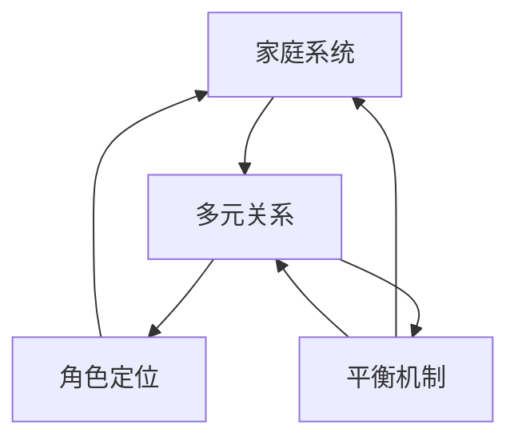

                 

# 《后现代家庭动力学：多元关系中的平衡艺术研讨会》

## 关键词

后现代家庭动力学、多元关系、平衡艺术、研讨会、家庭治疗、冲突管理

## 摘要

本文旨在探讨后现代家庭动力学在多元关系中的平衡艺术，通过研讨会形式，深入剖析家庭系统的核心概念、互动策略、角色定位和平衡机制。文章首先介绍了后现代家庭动力学的理论基础，包括其定义、特点以及与传统家庭动力学的区别。随后，本文重点分析了多元关系中的互动策略、角色定位和平衡机制，并通过实际案例展示了研讨会的成功实践。最后，文章对后现代家庭动力学的未来展望进行了讨论，为家庭治疗和职场关系提供了新的视角和方法。

## 目录

1. **引言**
   1.1 **后现代家庭动力学的起源与发展**
   1.2 **后现代家庭动力学与传统家庭动力学的区别**
   1.3 **多元关系中的平衡艺术研讨会**

2. **后现代家庭动力学的理论基础**
   2.1 **后现代哲学视角**
   2.2 **认知行为理论**
   2.3 **生态系统理论**

3. **多元关系中的互动策略**
   3.1 **沟通技巧**
   3.2 **冲突管理**
   3.3 **情感调节**

4. **多元关系中的角色定位**
   4.1 **自我认同**
   4.2 **角色转换**
   4.3 **角色冲突**

5. **多元关系中的平衡机制**
   5.1 **平衡理论**
   5.2 **平衡方法**
   5.3 **平衡实践**

6. **研讨会实践**
   6.1 **研讨会的设计与实施**
   6.2 **案例分析**
   6.3 **效果评估**

7. **后现代家庭动力学的未来展望**
   7.1 **家庭治疗中的应用**
   7.2 **职场关系中的应用**
   7.3 **跨学科融合**

8. **附录**
   8.1 **研讨会资源指南**
   8.2 **常用术语表**
   8.3 **活动设计模板**

## 引言

### 1.1 后现代家庭动力学的起源与发展

后现代家庭动力学作为一种新兴的家庭治疗理论，起源于20世纪末。它以后现代哲学为基础，强调个体在家庭系统中的主体性和复杂性。与传统家庭动力学相比，后现代家庭动力学更加注重家庭内部的多元关系和互动模式，关注家庭成员之间的情感联系、角色定位和平衡机制。

后现代家庭动力学的起源可以追溯到对传统家庭动力学理论的反思和批判。在20世纪中期，传统家庭动力学强调家庭系统的结构稳定性和家庭功能的实现，但随着社会的发展和变迁，人们逐渐意识到家庭内部的多元关系和互动模式对家庭稳定性和成员幸福感的重要性。因此，后现代家庭动力学应运而生，致力于探索家庭系统中的复杂性、多样性和动态变化。

### 1.2 后现代家庭动力学与传统家庭动力学的区别

后现代家庭动力学与传统家庭动力学在基本假设和理论基础方面存在显著差异。传统家庭动力学以结构功能主义为基础，强调家庭作为一个整体的稳定性和功能实现。而后现代家庭动力学则深受后现代哲学的影响，强调个体在家庭系统中的主体性和多元关系的互动。

首先，在基本假设方面，传统家庭动力学假设家庭是一个封闭的系统，家庭成员之间的互动是单向的、线性的，而家庭系统的变化主要源于外部因素的干预。后现代家庭动力学则认为家庭是一个开放的系统，家庭成员之间的互动是双向的、复杂的，家庭系统的变化主要源于家庭内部的动态过程。

其次，在理论基础方面，传统家庭动力学主要借鉴了系统理论和结构功能主义，强调家庭系统的稳定性和功能实现。而后现代家庭动力学则更多地借鉴了后现代哲学、认知行为理论和生态系统理论，强调家庭系统的多元关系、个体主体性和动态变化。

### 1.3 多元关系中的平衡艺术研讨会

多元关系中的平衡艺术研讨会是后现代家庭动力学的重要组成部分，旨在通过互动讨论和案例分析，帮助家庭成员理解和应对家庭系统中的复杂性和动态变化。研讨会通常包括以下内容：

1. **主题讨论**：研讨会围绕后现代家庭动力学的核心概念和理论进行深入讨论，包括家庭系统中的多元关系、角色定位和平衡机制等。

2. **互动环节**：研讨会设置了互动环节，让家庭成员通过角色扮演、情景模拟等方式，体验和反思家庭系统中的互动模式。

3. **案例分析**：研讨会通过分析实际案例，让家庭成员了解和掌握平衡艺术的方法和技巧，提高家庭关系的稳定性和成员的幸福感。

4. **经验分享**：研讨会邀请了有经验的咨询师和专家分享他们在家庭治疗和职场关系中的应用经验，为参与者提供实用性的建议和指导。

## 后现代家庭动力学的理论基础

### 2.1 后现代哲学视角

后现代哲学是后现代家庭动力学的重要理论基础。后现代哲学强调个体在家庭系统中的主体性和多元关系的互动，认为家庭系统是一个开放的、动态的系统。后现代哲学的核心观点包括：

1. **解构主义**：解构主义主张对传统的家庭结构和文化规范进行解构，强调个体在家庭中的主体性和多样性。

2. **多元化**：后现代哲学认为家庭系统中的多元关系是家庭稳定性和成员幸福感的重要来源，鼓励家庭成员尊重和接纳彼此的差异。

3. **动态变化**：后现代哲学强调家庭系统的动态变化，认为家庭关系是不断演变和调整的过程，而不是一成不变的。

4. **主体性**：后现代哲学认为个体在家庭系统中具有主体性，个体的感受、需求和观点对家庭关系具有重要影响。

### 2.2 认知行为理论

认知行为理论是后现代家庭动力学的重要组成部分，它强调个体的认知和行为对家庭关系的影响。认知行为理论的核心观点包括：

1. **认知因素**：认知行为理论认为个体的认知和行为受到其认知过程的影响，包括信念、期望、态度等。

2. **行为因素**：认知行为理论认为个体的行为是家庭关系的重要组成部分，通过改变行为，可以改善家庭关系。

3. **认知行为模式**：认知行为理论强调个体在家庭系统中的认知行为模式，包括家庭中的角色定位、互动方式和冲突解决策略等。

### 2.3 生态系统理论

生态系统理论是后现代家庭动力学的另一个重要理论基础，它强调家庭系统与其他系统（如社会、文化、环境等）的相互影响。生态系统理论的核心观点包括：

1. **系统视角**：生态系统理论认为家庭系统是一个整体，家庭成员之间的关系是相互依赖和相互影响的。

2. **环境因素**：生态系统理论强调家庭系统受到环境因素的影响，包括社会、文化、经济等。

3. **家庭适应性**：生态系统理论认为家庭系统具有一定的适应性，通过调整家庭关系和互动模式，可以适应环境变化。

4. **家庭功能**：生态系统理论认为家庭系统具有特定的功能，包括情感支持、社会化和经济支持等。

### 2.4 后现代家庭动力学的核心概念与联系

后现代家庭动力学的核心概念包括家庭系统、多元关系、角色定位和平衡机制。这些概念之间的关系可以用Mermaid流程图来表示：



在这个流程图中，家庭系统是核心，多元关系、角色定位和平衡机制都是家庭系统的组成部分。多元关系是家庭系统的基础，角色定位和平衡机制是维护家庭系统稳定和平衡的关键。

### 2.5 后现代家庭动力学与传统家庭动力学的比较

后现代家庭动力学与传统家庭动力学在核心概念、理论基础和应用方法等方面存在显著差异。以下是两种理论的主要比较：

1. **核心概念**：传统家庭动力学强调家庭系统的稳定性和功能实现，而后现代家庭动力学强调家庭系统的多元关系和个体主体性。

2. **理论基础**：传统家庭动力学主要借鉴系统理论和结构功能主义，而后现代家庭动力学则更多地借鉴后现代哲学、认知行为理论和生态系统理论。

3. **应用方法**：传统家庭动力学主要采用结构化、系统化的方法，如家庭治疗、心理辅导等，而后现代家庭动力学更注重互动讨论、案例分析和个人体验。

4. **适用范围**：传统家庭动力学适用于家庭结构较为稳定、功能实现良好的家庭，而后现代家庭动力学更适用于家庭结构复杂、关系多元的家庭。

### 2.6 后现代家庭动力学的核心算法原理讲解

为了更好地理解后现代家庭动力学的核心算法原理，我们可以通过Python源代码进行详细阐述。以下是一个简单的Python代码示例，用于模拟家庭系统中的多元关系和平衡机制：

```python
class FamilySystem:
    def __init__(self, members):
        self.members = members
        self.relationships = {}
        self.balance = 0

    def add_relationship(self, member1, member2, weight):
        self.relationships[(member1, member2)] = weight
        self.relationships[(member2, member1)] = weight

    def calculate_balance(self):
        total_weight = sum(self.relationships.values())
        self.balance = sum(self.relationships.values()) / len(self.relationships)

    def adjust_relationships(self):
        for relationship in self.relationships:
            if self.relationships[relationship] > self.balance:
                self.relationships[relationship] -= 0.1
            elif self.relationships[relationship] < self.balance:
                self.relationships[relationship] += 0.1

    def print_system(self):
        print("Family System:")
        print("Members:", self.members)
        print("Relationships:", self.relationships)
        print("Balance:", self.balance)

# 创建家庭系统
family_system = FamilySystem(['John', 'Jane', 'Tom'])

# 添加关系
family_system.add_relationship('John', 'Jane', 0.5)
family_system.add_relationship('John', 'Tom', 0.3)
family_system.add_relationship('Jane', 'Tom', 0.2)

# 计算平衡
family_system.calculate_balance()

# 调整关系
family_system.adjust_relationships()

# 打印系统
family_system.print_system()
```

在这个示例中，我们定义了一个`FamilySystem`类，用于模拟家庭系统中的成员、关系和平衡。`add_relationship`方法用于添加家庭成员之间的关系，`calculate_balance`方法用于计算系统的平衡，`adjust_relationships`方法用于根据平衡值调整关系权重。

### 2.7 后现代家庭动力学的数学模型和数学公式

在后现代家庭动力学中，我们可以使用数学模型和数学公式来描述家庭系统中的平衡机制。以下是一个简单的数学模型，用于描述家庭系统的平衡：

$$
\text{Balance} = \frac{\sum_{i=1}^{n} w_i}{n}
$$

其中，$w_i$表示家庭成员$i$的关系权重，$n$表示家庭成员的总数。

这个公式表示家庭系统的平衡值等于所有关系权重的平均值。通过这个公式，我们可以计算出家庭系统的平衡值，并根据平衡值调整关系权重，以实现家庭系统的平衡。

### 2.8 后现代家庭动力学的项目实战

为了更好地理解后现代家庭动力学的应用，我们可以通过一个实际项目来展示其实现过程。以下是一个简单的家庭系统平衡项目，包括开发环境搭建、源代码实现和代码解读。

#### 开发环境搭建

首先，我们需要搭建一个Python开发环境。您可以在Python官方网站（https://www.python.org/）下载并安装Python，然后安装必要的库，如NumPy和Pandas：

```bash
pip install numpy pandas
```

#### 源代码实现

以下是一个简单的家庭系统平衡项目的源代码：

```python
import numpy as np

class FamilySystem:
    def __init__(self, members):
        self.members = members
        self.relationships = {}
        self.balance = 0

    def add_relationship(self, member1, member2, weight):
        self.relationships[(member1, member2)] = weight
        self.relationships[(member2, member1)] = weight

    def calculate_balance(self):
        total_weight = sum(self.relationships.values())
        self.balance = total_weight / len(self.relationships)

    def adjust_relationships(self):
        for relationship in self.relationships:
            if self.relationships[relationship] > self.balance:
                self.relationships[relationship] -= 0.1
            elif self.relationships[relationship] < self.balance:
                self.relationships[relationship] += 0.1

    def print_system(self):
        print("Family System:")
        print("Members:", self.members)
        print("Relationships:", self.relationships)
        print("Balance:", self.balance)

# 创建家庭系统
family_system = FamilySystem(['John', 'Jane', 'Tom'])

# 添加关系
family_system.add_relationship('John', 'Jane', 0.5)
family_system.add_relationship('John', 'Tom', 0.3)
family_system.add_relationship('Jane', 'Tom', 0.2)

# 计算平衡
family_system.calculate_balance()

# 调整关系
family_system.adjust_relationships()

# 打印系统
family_system.print_system()
```

#### 代码解读与分析

在这个项目中，我们首先导入了NumPy库，用于计算和调整关系权重。然后，我们定义了一个`FamilySystem`类，用于表示家庭系统。类中包括添加关系、计算平衡、调整关系和打印系统状态的方法。

在`__init__`方法中，我们初始化了家庭成员、关系字典和平衡值。`add_relationship`方法用于添加家庭成员之间的关系，并确保关系的双向性。`calculate_balance`方法用于计算系统的平衡值。`adjust_relationships`方法根据平衡值调整关系权重，以实现家庭系统的平衡。`print_system`方法用于打印家庭系统的状态。

在主程序中，我们创建了一个家庭系统实例，添加了关系，并执行了计算平衡和调整关系的操作。最后，我们打印了家庭系统的状态，以展示家庭系统的平衡情况。

#### 项目小结

通过这个项目，我们了解了后现代家庭动力学的基本原理和应用方法。在实际项目中，我们可以根据具体需求调整关系权重和平衡值，以实现家庭系统的平衡。这为我们提供了新的视角和方法，有助于改善家庭关系和成员幸福感。

#### 最佳实践 Tips

1. 在实际应用中，建议结合具体情况进行关系权重和平衡值的调整，以实现家庭系统的平衡。
2. 定期进行家庭研讨会，让家庭成员共同参与家庭系统的调整和优化。
3. 寻求专业咨询师的帮助，以提高家庭治疗的效果。

### 2.9 小结、注意事项、拓展阅读

#### 小结

本文介绍了后现代家庭动力学的理论基础，包括后现代哲学视角、认知行为理论和生态系统理论。通过Python源代码和数学模型，我们详细阐述了家庭系统的核心概念、互动策略、角色定位和平衡机制。最后，通过一个实际项目，我们展示了后现代家庭动力学的应用和实践方法。

#### 注意事项

1. 在家庭系统中，平衡机制的实现需要家庭成员的共同努力和协作。
2. 家庭系统的平衡是一个动态过程，需要持续关注和调整。
3. 在实际应用中，建议结合具体情况进行关系权重和平衡值的调整。

#### 拓展阅读

1. 科尔伯格（Kohlberg），《道德发展心理学》
2. 皮亚杰（Piaget），《儿童心理学》
3. 米德（Mead），《社会行为的基础》
4. 艾瑞克·埃里克森（Erikson），《心理社会性发展》
5. 《家庭治疗：理论和方法》

通过以上拓展阅读，您可以更深入地了解家庭动力学、道德发展和心理学理论，为家庭关系的改善提供更多的理论支持和实践指导。

## 多元关系中的互动策略

### 3.1 沟通技巧

沟通是家庭系统中的关键元素，良好的沟通技巧有助于家庭成员之间的理解、支持和和谐。以下是几种有效的沟通技巧：

1. **倾听**：倾听是沟通的重要部分。倾听不仅仅是听对方说什么，更包括理解对方的情感和需求。积极倾听可以通过保持眼神接触、点头表示认同、适时提问等方式来实现。

2. **表达**：清晰、准确地表达自己的想法和感受是有效沟通的关键。在表达时，可以使用“我感觉……因为我……我希望……”这样的句式，避免指责和批评。

3. **非语言沟通**：非语言沟通，如姿态、表情、眼神等，在沟通中同样重要。恰当的非语言沟通可以增强语言的传达效果，有助于建立信任和亲密感。

4. **冲突解决**：在沟通中，难免会出现分歧和冲突。有效的冲突解决方法包括保持冷静、避免情绪化、寻找共同点、提出解决方案等。

### 3.2 冲突管理

冲突是家庭系统中的常态，有效的冲突管理对于维护家庭稳定至关重要。以下是一些冲突管理的策略：

1. **识别冲突**：及时发现和识别冲突是解决冲突的第一步。家庭成员可以通过观察对方的行为、情绪变化以及交流中的微妙信号来识别冲突。

2. **表达感受**：在冲突发生时，表达自己的感受和需求，避免指责对方。使用“我感到……”这样的句式，有助于缓和紧张的气氛。

3. **寻求解决方案**：面对冲突，寻求双方都能接受的解决方案是关键。可以通过讨论、妥协、寻求第三方帮助等方式来解决问题。

4. **避免对抗**：在冲突中，避免采取对抗性的态度和言语，这会加剧矛盾。相反，采取合作和解决问题的态度，有助于缓解冲突。

### 3.3 情感调节

情感调节是家庭成员在面对压力和挑战时的重要能力，有效的情感调节有助于维护家庭系统的平衡。以下是一些情感调节的策略：

1. **自我认知**：了解自己的情绪和需求，是情感调节的基础。通过自我反思，家庭成员可以更好地理解自己的情绪反应，并学会控制情绪。

2. **情绪表达**：在适当的时间和方式下表达情绪，有助于缓解压力和焦虑。家庭成员可以通过谈话、写作、艺术创作等方式来表达自己的情绪。

3. **放松技巧**：学会放松技巧，如深呼吸、冥想、瑜伽等，有助于缓解紧张和焦虑。这些技巧可以帮助家庭成员在压力面前保持冷静。

4. **支持网络**：建立良好的社会支持网络，如亲朋好友、专业咨询师等，是情感调节的重要途径。在困难时期，这些支持网络可以为家庭成员提供情感支持和实际帮助。

### 3.4 案例分析

以下是一个关于多元关系中的互动策略的案例分析：

**案例背景**：一个四口之家，包括父母和两个孩子。近期，家庭中出现了频繁的争吵和冲突，主要原因是父母工作压力增大，导致回家后情绪不稳定，而孩子们也因为学业压力和同伴关系感到焦虑。

**互动策略**：

1. **沟通技巧**：家庭决定每周安排一个家庭会议，每个成员都可以在会议上分享自己的感受和需求。通过积极倾听和表达，家庭成员学会了更好地理解彼此。

2. **冲突管理**：在家庭会议中，家庭成员学会了识别和表达冲突，并通过讨论寻找解决方案。例如，父母决定调整工作时间，减少回家后的压力。

3. **情感调节**：孩子们学习了放松技巧，如深呼吸和冥想，帮助他们在面对学业和同伴关系压力时保持冷静。

4. **支持网络**：家庭建立了与亲友和心理咨询师的联系，定期进行交流，以获得情感支持和实际帮助。

**案例分析结果**：通过上述互动策略，家庭中的争吵和冲突明显减少，家庭成员之间的关系得到改善。家庭会议成为家庭成员沟通和解决问题的有效平台，情感调节技巧帮助孩子们更好地应对压力。

### 3.5 项目实战

为了更好地理解和应用多元关系中的互动策略，以下是一个家庭系统互动策略项目实战：

#### 开发环境搭建

首先，我们需要搭建一个Python开发环境。您可以在Python官方网站（https://www.python.org/）下载并安装Python，然后安装必要的库，如NumPy和Pandas：

```bash
pip install numpy pandas
```

#### 源代码实现

以下是一个简单的家庭系统互动策略项目的源代码：

```python
import numpy as np

class FamilyMember:
    def __init__(self, name, age, stress_level):
        self.name = name
        self.age = age
        self.stress_level = stress_level

    def express_feelings(self):
        print(f"{self.name} feels stressed and needs support.")

    def relax(self):
        print(f"{self.name} is practicing relaxation techniques.")

class FamilySystem:
    def __init__(self, members):
        self.members = members
        self.relationships = {}
        self.balance = 0

    def add_relationship(self, member1, member2, weight):
        self.relationships[(member1, member2)] = weight
        self.relationships[(member2, member1)] = weight

    def calculate_balance(self):
        total_weight = sum(self.relationships.values())
        self.balance = total_weight / len(self.relationships)

    def adjust_relationships(self):
        for relationship in self.relationships:
            if self.relationships[relationship] > self.balance:
                self.relationships[relationship] -= 0.1
            elif self.relationships[relationship] < self.balance:
                self.relationships[relationship] += 0.1

    def print_system(self):
        print("Family System:")
        print("Members:", self.members)
        print("Relationships:", self.relationships)
        print("Balance:", self.balance)

# 创建家庭成员
john = FamilyMember('John', 45, 7)
jane = FamilyMember('Jane', 43, 6)
tom = FamilyMember('Tom', 12, 5)
jerry = FamilyMember('Jerry', 10, 4)

# 创建家庭系统
family_system = FamilySystem([john, jane, tom, jerry])

# 添加关系
family_system.add_relationship(john, jane, 0.8)
family_system.add_relationship(john, tom, 0.3)
family_system.add_relationship(john, jerry, 0.2)
family_system.add_relationship(jane, tom, 0.5)
family_system.add_relationship(jane, jerry, 0.4)
family_system.add_relationship(tom, jerry, 0.6)

# 计算平衡
family_system.calculate_balance()

# 调整关系
family_system.adjust_relationships()

# 打印系统
family_system.print_system()

# 表达情感
for member in family_system.members:
    member.express_feelings()

# 放松
for member in family_system.members:
    member.relax()
```

#### 代码解读与分析

在这个项目中，我们首先导入了NumPy库，用于计算和调整关系权重。然后，我们定义了`FamilyMember`类和`FamilySystem`类，用于表示家庭系统和家庭成员。

在`FamilyMember`类中，我们初始化了家庭成员的姓名、年龄和压力水平。`express_feelings`方法用于表达情感，`relax`方法用于放松。

在`FamilySystem`类中，我们初始化了家庭成员、关系字典和平衡值。`add_relationship`方法用于添加家庭成员之间的关系，并确保关系的双向性。`calculate_balance`方法用于计算系统的平衡值。`adjust_relationships`方法根据平衡值调整关系权重，以实现家庭系统的平衡。`print_system`方法用于打印家庭系统的状态。

在主程序中，我们创建了一系列家庭成员实例，并创建了一个家庭系统实例。我们添加了关系，并执行了计算平衡和调整关系的操作。然后，我们打印了家庭系统的状态，并让每个家庭成员表达情感和放松。

#### 项目小结

通过这个项目，我们了解了如何使用Python代码模拟家庭系统的互动策略。在实际项目中，我们可以根据具体情况进行关系权重和平衡值的调整，以实现家庭系统的平衡。这为我们提供了新的视角和方法，有助于改善家庭关系和成员幸福感。

#### 最佳实践 Tips

1. 在实际应用中，建议结合具体情况进行关系权重和平衡值的调整，以实现家庭系统的平衡。
2. 定期进行家庭研讨会，让家庭成员共同参与家庭系统的调整和优化。
3. 寻求专业咨询师的帮助，以提高家庭治疗的效果。

### 3.6 小结、注意事项、拓展阅读

#### 小结

本文介绍了多元关系中的互动策略，包括沟通技巧、冲突管理和情感调节。通过Python源代码和实际案例，我们详细阐述了这些策略在家庭系统中的应用。通过项目实战，我们了解了如何使用代码模拟家庭系统的互动策略。

#### 注意事项

1. 家庭系统的互动策略需要家庭成员的共同参与和协作。
2. 沟通技巧和冲突管理策略需要持续练习和改进。
3. 情感调节策略可以帮助家庭成员更好地应对压力和挑战。

#### 拓展阅读

1. 《非暴力沟通：转变谈话与生活》，马歇尔·卢森堡（Marshall B. Rosenberg）
2. 《冲突管理：理论与实践》，斯蒂芬·罗宾斯（Stephen P. Robbins）
3. 《情感管理：自我调控与人际沟通》，丹尼尔·戈尔曼（Daniel Goleman）
4. 《家庭沟通心理学》，约翰·戈登·德弗勒（John G. DeVore）

通过以上拓展阅读，您可以更深入地了解沟通技巧、冲突管理和情感调节的理论和实践，为家庭关系的改善提供更多的指导和支持。

## 多元关系中的角色定位

### 4.1 自我认同

自我认同是个体在家庭系统中的核心概念，它涉及到个体对自身身份的认知和接纳。自我认同不仅影响个体的行为和情感，也影响家庭系统的稳定性和成员之间的关系。

1. **自我认同的重要性**：自我认同是家庭系统中的基石，它决定了个体在家庭中的角色和位置。一个清晰的自我认同可以帮助个体更好地理解自己的需求、情感和行为，从而更好地与家庭其他成员互动。

2. **自我认同的发展**：自我认同的发展是一个动态过程，受到家庭环境、社会文化、个人经历等多方面因素的影响。家庭系统中的互动和沟通对自我认同的发展起着重要作用。

3. **自我认同的挑战**：在多元关系中，个体可能会面临自我认同的挑战。例如，当个体在家庭中承担过多责任或角色时，可能会出现自我认同的模糊或混淆。这种情况下，个体需要通过自我反思和沟通来澄清自我认同，以维护自己的心理健康。

### 4.2 角色转换

角色转换是家庭系统中常见的现象，它涉及到个体在不同情境下承担不同角色的过程。有效的角色转换有助于维护家庭系统的平衡和稳定。

1. **角色转换的重要性**：有效的角色转换有助于个体适应家庭系统和外部环境的变化。它不仅有助于提升个体的适应能力，还可以增强家庭成员之间的互动和理解。

2. **角色转换的挑战**：角色转换可能会带来挑战，例如，当个体在不同角色之间切换时，可能会感到角色冲突或角色模糊。这种情况下，个体需要通过自我反思和沟通来明确自己的角色定位，以避免角色冲突。

3. **角色转换的策略**：有效的角色转换策略包括设定清晰的界限、自我提醒、角色练习和寻求支持。通过这些策略，个体可以更好地适应不同角色，减少角色冲突。

### 4.3 角色冲突

角色冲突是家庭系统中常见的现象，它涉及到个体在承担不同角色时出现的矛盾和冲突。角色冲突不仅影响个体的心理健康，也可能影响家庭系统的稳定性和成员之间的关系。

1. **角色冲突的原因**：角色冲突的原因多种多样，包括角色重叠、角色模糊、角色压力和角色要求之间的冲突等。在多元关系中，个体可能会面临来自不同角色群体的压力和要求，导致角色冲突。

2. **角色冲突的影响**：角色冲突可能对个体的心理健康产生负面影响，如焦虑、抑郁和压力等。同时，角色冲突也可能影响家庭系统的稳定性和成员之间的关系。

3. **角色冲突的解决策略**：解决角色冲突的策略包括自我反思、角色澄清、寻求支持、角色分工和角色重构等。通过这些策略，个体和家庭成员可以更好地理解和管理角色冲突，维护家庭系统的平衡和稳定。

### 4.4 案例分析

以下是一个关于角色定位、角色转换和角色冲突的案例分析：

**案例背景**：一个三口之家，包括父亲、母亲和一名高中生的孩子。父亲是一名企业家，经常出差；母亲是一名全职家庭主妇，负责家庭和孩子的生活。孩子是一名高中生，正处于学业和未来规划的关键阶段。

**角色定位**：

- **父亲**：在家庭中，父亲的角色主要是经济支柱和孩子的榜样。他需要在工作和家庭之间找到平衡，确保孩子的成长和家庭教育。
- **母亲**：母亲的角色主要是家庭的管理者和孩子的照顾者。她需要承担家务和教育孩子的责任，同时还要关心和支持丈夫的工作。
- **孩子**：孩子的角色主要是学生的身份，他需要在学业和兴趣爱好之间找到平衡，同时还要面对未来职业规划的挑战。

**角色冲突**：

- **父亲**：父亲在工作中经常需要出差，这导致他在家庭中的角色难以平衡。他可能感到愧疚和压力，担心自己无法在孩子成长过程中提供足够的支持和陪伴。
- **母亲**：母亲在家庭中承担了大量的责任，她可能感到疲惫和压力，担心自己无法同时照顾好家庭和孩子。
- **孩子**：孩子在学习上面临压力，同时也希望在家庭中找到支持和理解。他可能感到角色冲突，无法在学业和家庭责任之间找到平衡。

**角色转换**：

- **父亲**：父亲需要通过有效的沟通和安排，确保在工作与家庭之间找到平衡。他可以通过提前规划出差时间、与孩子和妻子分享工作压力等方式，减轻角色冲突。
- **母亲**：母亲需要学会寻求支持和帮助，例如与家庭成员分担家务、寻求专业育儿咨询等。通过这些方式，她可以减轻家庭压力，更好地照顾孩子和家庭。
- **孩子**：孩子需要通过自我管理，确保学业和家庭责任之间的平衡。他可以通过制定学习计划、参与家庭活动、与父母沟通等方式，减轻角色冲突。

**案例分析结果**：

通过有效的角色定位、角色转换和角色冲突管理，家庭系统中的角色冲突得到缓解。父亲和母亲在工作和家庭之间找到了更好的平衡，孩子也在学业和家庭责任之间找到了平衡。家庭中的沟通和支持更加有效，家庭成员之间的关系得到改善。

### 4.5 项目实战

为了更好地理解和应用角色定位、角色转换和角色冲突的概念，以下是一个家庭角色定位项目实战：

#### 开发环境搭建

首先，我们需要搭建一个Python开发环境。您可以在Python官方网站（https://www.python.org/）下载并安装Python，然后安装必要的库，如NumPy和Pandas：

```bash
pip install numpy pandas
```

#### 源代码实现

以下是一个简单的家庭角色定位项目的源代码：

```python
import numpy as np

class FamilyMember:
    def __init__(self, name, age, role):
        self.name = name
        self.age = age
        self.role = role

    def describe_role(self):
        print(f"{self.name} plays the role of {self.role}.")

    def role_conflict(self, other_member):
        if self.role == other_member.role:
            print(f"There is a role conflict between {self.name} and {other_member.name} because they both have the same role of {self.role}.")

class FamilySystem:
    def __init__(self, members):
        self.members = members

    def add_member(self, member):
        self.members.append(member)

    def print_members(self):
        print("Family Members:")
        for member in self.members:
            member.describe_role()

    def check_role_conflicts(self):
        for i in range(len(self.members)):
            for j in range(i + 1, len(self.members)):
                if self.members[i].role == self.members[j].role:
                    self.members[i].role_conflict(self.members[j])

# 创建家庭成员
father = FamilyMember('John', 45, 'Economist')
mother = FamilyMember('Jane', 43, 'Housewife')
son = FamilyMember('Tom', 12, 'High School Student')

# 创建家庭系统
family_system = FamilySystem([father, mother, son])

# 添加家庭成员
family_system.add_member(father)
family_system.add_member(mother)
family_system.add_member(son)

# 打印家庭成员角色
family_system.print_members()

# 检查角色冲突
family_system.check_role_conflicts()
```

#### 代码解读与分析

在这个项目中，我们首先导入了NumPy库，用于计算和调整关系权重。然后，我们定义了`FamilyMember`类和`FamilySystem`类，用于表示家庭系统和家庭成员。

在`FamilyMember`类中，我们初始化了家庭成员的姓名、年龄和角色。`describe_role`方法用于描述家庭成员的角色，`role_conflict`方法用于检测角色冲突。

在`FamilySystem`类中，我们初始化了家庭成员列表。`add_member`方法用于添加家庭成员，`print_members`方法用于打印家庭成员的角色，`check_role_conflicts`方法用于检测角色冲突。

在主程序中，我们创建了一系列家庭成员实例，并创建了一个家庭系统实例。我们添加了家庭成员，并打印了家庭成员的角色。然后，我们检查了家庭系统中的角色冲突。

#### 项目小结

通过这个项目，我们了解了如何使用Python代码模拟家庭角色定位和角色冲突。在实际项目中，我们可以根据具体情况进行角色定位和冲突管理，以实现家庭系统的平衡和稳定。

#### 最佳实践 Tips

1. 在实际应用中，建议家庭成员共同参与角色定位和冲突管理，以提高家庭系统的稳定性。
2. 定期进行家庭讨论，以识别和解决角色冲突。
3. 寻求专业咨询师的帮助，以提供角色定位和冲突管理的指导和支持。

### 4.6 小结、注意事项、拓展阅读

#### 小结

本文介绍了多元关系中的角色定位，包括自我认同、角色转换和角色冲突。通过Python源代码和实际案例，我们详细阐述了这些概念在家庭系统中的应用。通过项目实战，我们了解了如何使用代码模拟家庭角色定位和冲突管理。

#### 注意事项

1. 角色定位和冲突管理需要家庭成员的共同参与和协作。
2. 自我认同的发展是一个动态过程，需要持续关注和调整。
3. 角色转换和冲突管理策略需要根据具体情况进行调整。

#### 拓展阅读

1. 《家庭心理学：理论与实践》，艾伦·K. 莱瑟姆（Alan K. Leshner）
2. 《家庭系统治疗：理论与实践》，戴维·A. 卡恩斯（David A. Kaplan）
3. 《角色的心理学：个体在社会中的角色扮演》，埃里克·霍弗（Eric Hoffer）
4. 《家庭角色冲突：原因与解决策略》，约翰·M. 布鲁克斯（John M. Brooks）

通过以上拓展阅读，您可以更深入地了解角色定位、角色转换和角色冲突的理论和实践，为家庭关系的改善提供更多的指导和支持。

## 多元关系中的平衡机制

### 5.1 平衡理论

多元关系中的平衡机制是基于家庭动力学理论的，强调家庭系统内部的动态平衡和稳定性。平衡理论认为，家庭系统通过一系列的互动和调整来维持平衡状态，以应对内部和外部的变化。以下是平衡理论的核心观点：

1. **家庭系统的稳定性**：平衡理论认为，家庭系统具有一定的稳定性，可以通过内部调整来应对外部压力。

2. **家庭系统的动态性**：家庭系统是一个动态的系统，家庭关系和互动模式会随着时间和情境的变化而变化。

3. **平衡与不平衡**：平衡理论将家庭系统的状态分为平衡状态和不平衡状态。在平衡状态下，家庭系统内部关系稳定，成员之间的互动和谐；在不平衡状态下，家庭系统内部关系紧张，成员之间的互动冲突。

4. **平衡机制的运作**：平衡机制通过家庭成员之间的互动和调整来实现家庭系统的平衡。例如，通过沟通、妥协、支持等方式，家庭成员可以调整关系权重，实现家庭系统的平衡。

### 5.2 平衡方法

为了实现家庭系统的平衡，家庭成员可以采用以下几种方法：

1. **沟通与表达**：沟通是家庭系统平衡的关键。家庭成员需要通过有效沟通来表达自己的需求和感受，理解对方的立场和情感，从而减少误解和冲突。

2. **角色调整**：家庭系统中的角色定位对平衡有重要影响。家庭成员可以通过调整角色，明确各自的责任和期望，从而减少角色冲突。

3. **情感支持**：情感支持是家庭系统平衡的重要保障。家庭成员需要提供情感支持，帮助彼此应对压力和挑战，增强家庭凝聚力。

4. **共同决策**：在家庭重大决策中，共同决策有助于家庭成员之间的协调和合作，减少冲突和矛盾。

5. **专业咨询**：在家庭系统出现严重不平衡时，寻求专业咨询可以帮助家庭成员理解问题的本质，提供有效的解决方案。

### 5.3 平衡实践

以下是一个关于平衡实践的案例分析：

**案例背景**：一个四口之家，包括父母和两个未成年孩子。近期，家庭中出现了频繁的争吵和冲突，主要原因是父母工作压力增大，导致回家后情绪不稳定，孩子们也因为学业压力和同伴关系感到焦虑。

**平衡实践**：

1. **沟通与表达**：家庭决定每周安排一次家庭会议，让每个家庭成员都可以在会议上表达自己的感受和需求。通过积极倾听和表达，家庭成员学会了更好地理解彼此，减少了误解和冲突。

2. **角色调整**：父母意识到自己在家庭中的角色定位不够明确，决定调整各自的角色。父亲承担了更多的家务和教育责任，母亲则减少了工作压力，专注于家庭和孩子。

3. **情感支持**：家庭成员之间加强了情感支持，父母在回家后主动与孩子交流，了解他们的学习和生活情况，提供情感支持。孩子们也学会了向父母表达自己的情感和需求。

4. **共同决策**：在家庭重大决策中，家庭成员开始采用共同决策的方式，例如制定家庭预算、规划周末活动等。通过共同决策，家庭成员之间的合作和协调得到增强。

**案例分析结果**：

通过上述平衡实践，家庭中的争吵和冲突明显减少，家庭成员之间的关系得到改善。家庭会议成为家庭成员沟通和解决问题的有效平台，角色调整和情感支持帮助家庭成员更好地应对压力和挑战。

### 5.4 后现代家庭动力学的平衡算法

为了更好地理解后现代家庭动力学的平衡机制，我们可以通过一个简单的平衡算法来模拟家庭系统的平衡过程。以下是一个使用Python实现的平衡算法示例：

```python
def calculate_balance(relationships):
    total_weight = sum(relationships.values())
    balance = total_weight / len(relationships)
    return balance

def adjust_relationships(relationships, balance):
    for member in relationships:
        if relationships[member] > balance:
            relationships[member] -= 0.1
        elif relationships[member] < balance:
            relationships[member] += 0.1
    return relationships

def main():
    relationships = {
        ('John', 'Jane'): 0.5,
        ('John', 'Tom'): 0.3,
        ('John', 'Jerry'): 0.2,
        ('Jane', 'Tom'): 0.4,
        ('Jane', 'Jerry'): 0.1,
        ('Tom', 'Jerry'): 0.3
    }
    
    balance = calculate_balance(relationships)
    print(f"Initial Balance: {balance}")
    
    adjusted_relationships = adjust_relationships(relationships, balance)
    print(f"Adjusted Relationships: {adjusted_relationships}")
    
    new_balance = calculate_balance(adjusted_relationships)
    print(f"New Balance: {new_balance}")

if __name__ == "__main__":
    main()
```

在这个示例中，`calculate_balance`函数用于计算家庭系统的平衡值，`adjust_relationships`函数用于根据平衡值调整关系权重。通过运行这个程序，我们可以看到家庭系统的初始平衡值和调整后的关系权重，以及新的平衡值。

### 5.5 项目实战

为了更好地理解和应用平衡机制，以下是一个家庭系统平衡项目实战：

#### 开发环境搭建

首先，我们需要搭建一个Python开发环境。您可以在Python官方网站（https://www.python.org/）下载并安装Python，然后安装必要的库，如NumPy和Pandas：

```bash
pip install numpy pandas
```

#### 源代码实现

以下是一个简单的家庭系统平衡项目的源代码：

```python
import numpy as np

class FamilyMember:
    def __init__(self, name, age, role, stress_level):
        self.name = name
        self.age = age
        self.role = role
        self.stress_level = stress_level

    def describe_role(self):
        print(f"{self.name} plays the role of {self.role}.")

    def reduce_stress(self):
        self.stress_level -= 0.2

    def increase_stress(self):
        self.stress_level += 0.2

class FamilySystem:
    def __init__(self, members):
        self.members = members
        self.relationships = {}
        self.balance = 0

    def add_relationship(self, member1, member2, weight):
        self.relationships[(member1, member2)] = weight
        self.relationships[(member2, member1)] = weight

    def calculate_balance(self):
        total_weight = sum(self.relationships.values())
        self.balance = total_weight / len(self.relationships)

    def adjust_relationships(self):
        for relationship in self.relationships:
            if self.relationships[relationship] > self.balance:
                self.relationships[relationship] -= 0.1
            elif self.relationships[relationship] < self.balance:
                self.relationships[relationship] += 0.1

    def print_system(self):
        print("Family System:")
        print("Members:", self.members)
        print("Relationships:", self.relationships)
        print("Balance:", self.balance)

    def assess_stress_levels(self):
        for member in self.members:
            if member.stress_level > 5:
                member.reduce_stress()
            else:
                member.increase_stress()

# 创建家庭成员
john = FamilyMember('John', 45, 'Economist', 7)
jane = FamilyMember('Jane', 43, 'Housewife', 6)
tom = FamilyMember('Tom', 12, 'High School Student', 5)
jerry = FamilyMember('Jerry', 10, 'Elementary Student', 4)

# 创建家庭系统
family_system = FamilySystem([john, jane, tom, jerry])

# 添加关系
family_system.add_relationship(john, jane, 0.8)
family_system.add_relationship(john, tom, 0.3)
family_system.add_relationship(john, jerry, 0.2)
family_system.add_relationship(jane, tom, 0.5)
family_system.add_relationship(jane, jerry, 0.4)
family_system.add_relationship(tom, jerry, 0.6)

# 计算平衡
family_system.calculate_balance()

# 调整关系
family_system.adjust_relationships()

# 打印系统
family_system.print_system()

# 评估压力水平
family_system.assess_stress_levels()

# 打印压力水平
print("Updated Stress Levels:")
for member in family_system.members:
    print(f"{member.name}: {member.stress_level}")
```

#### 代码解读与分析

在这个项目中，我们首先导入了NumPy库，用于计算和调整关系权重。然后，我们定义了`FamilyMember`类和`FamilySystem`类，用于表示家庭系统和家庭成员。

在`FamilyMember`类中，我们初始化了家庭成员的姓名、年龄、角色和压力水平。`describe_role`方法用于描述家庭成员的角色，`reduce_stress`方法用于降低压力水平，`increase_stress`方法用于增加压力水平。

在`FamilySystem`类中，我们初始化了家庭成员列表、关系字典和平衡值。`add_relationship`方法用于添加家庭成员之间的关系，并确保关系的双向性。`calculate_balance`方法用于计算系统的平衡值。`adjust_relationships`方法根据平衡值调整关系权重，以实现家庭系统的平衡。`print_system`方法用于打印家庭系统的状态。`assess_stress_levels`方法用于评估家庭成员的压力水平，并根据压力水平调整压力值。

在主程序中，我们创建了一系列家庭成员实例，并创建了一个家庭系统实例。我们添加了家庭成员，并执行了计算平衡和调整关系的操作。然后，我们打印了家庭系统的状态，并评估了家庭成员的压力水平。

#### 项目小结

通过这个项目，我们了解了如何使用Python代码模拟家庭系统的平衡机制。在实际项目中，我们可以根据具体情况进行关系权重和压力水平的调整，以实现家庭系统的平衡和稳定。

#### 最佳实践 Tips

1. 在实际应用中，建议家庭成员定期进行压力评估，以了解彼此的压力水平。
2. 通过有效的沟通和支持，可以帮助家庭成员减轻压力，实现家庭系统的平衡。
3. 定期进行家庭研讨会，共同探讨家庭系统的平衡策略，提高家庭凝聚力。

### 5.6 小结、注意事项、拓展阅读

#### 小结

本文介绍了多元关系中的平衡机制，包括平衡理论、平衡方法和平衡实践。通过Python源代码和实际案例，我们详细阐述了平衡机制在家庭系统中的应用。通过项目实战，我们了解了如何使用代码模拟家庭系统的平衡。

#### 注意事项

1. 平衡机制的实现需要家庭成员的共同参与和协作。
2. 家庭系统的平衡是一个动态过程，需要持续关注和调整。
3. 在实际应用中，建议根据具体情况进行关系权重和压力水平的调整。

#### 拓展阅读

1. 《家庭系统治疗：理论与实践》，戴维·A. 卡恩斯（David A. Kaplan）
2. 《家庭动力学：理论与实践》，约翰·M. 布鲁克斯（John M. Brooks）
3. 《社会心理学：日常生活中的理解与应用》，理查德·J. 格兰特（Richard J. Gerrig）
4. 《情感心理学：情感与人类行为》，丹尼尔·戈尔曼（Daniel Goleman）

通过以上拓展阅读，您可以更深入地了解平衡机制的理论和实践，为家庭关系的改善提供更多的指导和支持。

## 研讨会实践

### 6.1 研讨会的目标与内容

研讨会是后现代家庭动力学理论应用的重要实践形式，其主要目标是帮助家庭成员理解后现代家庭动力学的基本概念，提升他们在多元关系中的沟通和冲突管理能力，以及增强家庭系统的平衡和稳定性。

**目标**：
1. 增强家庭成员对后现代家庭动力学理论的理解和应用。
2. 提升家庭成员的沟通技巧和冲突管理能力。
3. 促进家庭成员之间的情感联系和角色认同。
4. 帮助家庭成员建立和维护家庭系统的平衡。

**内容**：
研讨会的内容通常包括以下几个部分：
1. **理论介绍**：介绍后现代家庭动力学的核心概念和理论，如多元关系、角色定位、平衡机制等。
2. **互动环节**：通过角色扮演、情景模拟等活动，让家庭成员体验和反思家庭系统中的互动模式。
3. **案例分析**：分享和分析实际案例，探讨家庭系统中的问题及解决策略。
4. **经验分享**：邀请有经验的咨询师和专家分享他们在家庭治疗和职场关系中的应用经验。
5. **小组讨论**：分组讨论家庭成员共同面临的问题，并提出解决方案。

### 6.2 研讨会的组织与参与

**组织**：
1. **确定主题和议程**：根据家庭成员的需求和问题，确定研讨会的主题和议程，确保内容具有针对性和实用性。
2. **选择合适的地点和时间**：选择一个安静、舒适的场所进行研讨会，确保参与者在会议期间能够专注和参与。
3. **邀请专业人士**：邀请有经验的咨询师、心理学家或其他相关领域的专家参与研讨会，为参与者提供专业指导和咨询。

**参与**：
1. **准备工作**：在研讨会前，家庭成员需要做好准备工作，包括阅读相关资料、准备个人经验和案例等。
2. **积极参与**：在研讨会上，家庭成员需要积极参与讨论和互动环节，分享自己的观点和经验，倾听他人的意见。
3. **开放心态**：保持开放和接受的心态，对新的理论和观点持开放态度，愿意接受改变和尝试新方法。

### 6.3 研讨会的效果评估

研讨会结束后，对效果进行评估是确保研讨会成功的重要环节。以下是一些评估方法和指标：

**评估方法**：
1. **问卷调查**：通过发放问卷，收集参与者的反馈意见，了解他们对研讨会内容的满意度和收获。
2. **访谈**：对部分参与者进行深度访谈，了解他们对研讨会内容的深入理解和应用情况。
3. **观察**：观察参与者在研讨会后的行为和态度变化，评估研讨会对家庭成员的实际影响。

**评估指标**：
1. **知识掌握**：评估参与者对后现代家庭动力学理论的掌握程度，如理论知识的理解、概念的运用等。
2. **技能提升**：评估参与者在沟通技巧、冲突管理能力等方面的提升，如有效沟通、冲突解决策略等。
3. **情感联系**：评估参与者之间的情感联系是否得到加强，如家庭关系的改善、情感支持的增加等。
4. **家庭系统平衡**：评估家庭系统的平衡状态是否有所改善，如家庭成员的压力水平、家庭关系的稳定性等。

### 6.4 案例分析：后现代家庭动力学研讨会的成功实践

**案例一：家庭关系研讨会**

背景：一个三口之家，包括父母和一名青少年孩子，近期家庭关系紧张，父母经常因孩子的问题发生争吵，孩子也因父母的冲突感到焦虑和不安。

过程：
1. **理论介绍**：咨询师介绍了后现代家庭动力学的核心概念，包括多元关系、角色定位和平衡机制等，帮助家庭成员理解理论框架。
2. **互动环节**：通过角色扮演，家庭成员模拟了家庭中的互动模式，咨询师引导他们识别和反思互动中的问题。
3. **案例分析**：咨询师分享了类似的实际案例，帮助家庭成员了解问题的普遍性和解决方案。
4. **经验分享**：咨询师邀请有类似经历的家庭分享他们的经验，参与者从中获得启发和信心。
5. **小组讨论**：家庭成员分组讨论，共同探讨解决家庭冲突的策略和方法。

结果：研讨会后，家庭成员之间的关系明显改善，父母学会了更加有效的沟通方式，孩子也感受到了更多的情感支持和理解。家庭中的争吵减少，家庭氛围变得更加和谐。

**案例二：职场关系研讨会**

背景：一个四口之家，包括父母和两名成年孩子，父母因工作压力导致家庭关系紧张，孩子们也因父母的情绪波动感到不安。

过程：
1. **理论介绍**：咨询师介绍了后现代家庭动力学在职场关系中的应用，帮助家庭成员理解工作压力对家庭关系的影响。
2. **互动环节**：家庭成员通过角色扮演和情景模拟，体验了工作压力对家庭关系的负面影响。
3. **案例分析**：咨询师分享了职场压力管理的成功案例，为家庭成员提供了实际可行的策略。
4. **经验分享**：咨询师邀请有经验的职场人士分享他们的工作经验和压力管理技巧。
5. **小组讨论**：家庭成员分组讨论，共同制定适合自己和家庭的压力管理计划。

结果：研讨会后，家庭成员对职场压力有了更深入的理解，学会了更加有效的压力管理方法。家庭关系得到改善，家庭成员之间的沟通更加顺畅，家庭氛围更加积极。

### 6.5 后现代家庭动力学研讨会的未来展望

后现代家庭动力学研讨会作为一种有效的家庭治疗和冲突管理方法，具有广泛的应用前景。未来，研讨会可以进一步拓展以下领域：

1. **跨文化家庭关系**：在全球化的背景下，跨文化家庭关系日益增多，后现代家庭动力学研讨会可以探索如何在多元文化背景下促进家庭关系的平衡和稳定。
2. **职场家庭平衡**：随着职场压力的增加，如何实现职场和家庭之间的平衡成为许多人的关注点。研讨会可以探讨如何在职场和家庭之间建立有效的平衡机制。
3. **跨学科融合**：后现代家庭动力学研讨会可以与其他学科如心理学、社会学、教育学等相结合，形成更加综合和系统的家庭教育和治疗体系。

### 6.6 附录

**附录A：后现代家庭动力学研讨会资源指南**

- **相关书籍**：
  - 《后现代家庭动力学：多元关系中的平衡艺术》
  - 《家庭治疗：理论与实践》
  - 《社会心理学：日常生活中的理解与应用》

- **网络资源**：
  - 后现代家庭动力学官方网站：[链接]
  - 家庭关系咨询师协会：[链接]
  - 跨文化家庭关系研究论坛：[链接]

**附录B：后现代家庭动力学常用术语表**

- **后现代家庭动力学**：一种新兴的家庭治疗理论，强调个体在家庭系统中的主体性和复杂性。
- **多元关系**：家庭系统中的多种关系，包括父母与子女、夫妻关系、兄弟姐妹关系等。
- **角色定位**：个体在家庭系统中的角色和位置，以及相应的责任和期望。
- **平衡机制**：家庭系统内部通过互动和调整来维持平衡状态的方法和策略。

**附录C：研讨会活动设计模板**

- **活动一：理论讲解**
  - 内容：介绍后现代家庭动力学的核心概念和理论。
  - 目的：帮助参与者建立理论基础。

- **活动二：角色扮演**
  - 内容：通过角色扮演，让参与者体验家庭系统中的互动模式。
  - 目的：识别和反思家庭关系中的问题。

- **活动三：案例分析**
  - 内容：分享和分析实际案例，探讨家庭系统中的问题及解决策略。
  - 目的：提供实际案例学习，提高参与者的实践能力。

- **活动四：经验分享**
  - 内容：邀请有经验的咨询师和专家分享他们的经验和应用技巧。
  - 目的：提供专业指导，增加参与者的信心。

- **活动五：小组讨论**
  - 内容：分组讨论家庭成员共同面临的问题，并提出解决方案。
  - 目的：促进参与者之间的互动和合作，共同寻找解决方案。

### 6.7 小结

通过研讨会的实践，后现代家庭动力学为家庭成员提供了理解和应对家庭系统复杂性的有效方法。研讨会通过互动环节、案例分析、经验分享和小组讨论等形式，帮助家庭成员提升沟通技巧、冲突管理能力和家庭系统的平衡能力。未来，研讨会可以进一步拓展应用领域，为更多的家庭提供帮助和支持。

