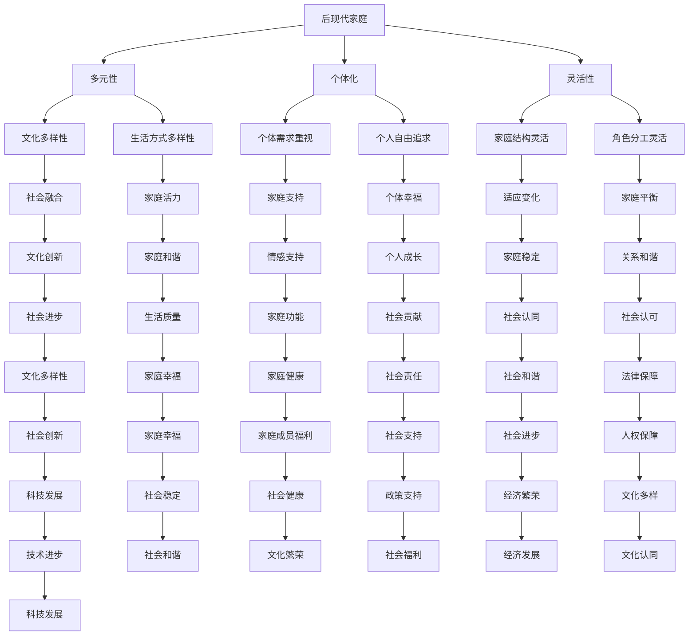

                 

### 引言：后现代家庭的概念与特征

在当今社会，家庭结构正在经历深刻的变革，这一变革被广泛称为“后现代家庭”。后现代家庭不仅仅是传统意义上的血缘关系或法律婚姻的集合，而是一种更加强调多元性、个体化和灵活性的社会现象。这一章节将首先介绍后现代家庭的背景，探讨其起源及在社会变迁中的角色，接着深入分析其核心特征，最后讨论其研究的意义。

#### 1.1 后现代家庭背景

**1.1.1 社会变迁中的家庭模式**

家庭作为社会的基本单元，其形态和功能在不同的历史时期有着显著的变化。传统家庭模式通常基于性别角色分工明确、一夫一妻制、世代同堂等特征。然而，随着工业革命和现代化进程的推进，家庭模式开始发生变化。城市化、女性解放、经济独立等因素使得家庭成员之间的依赖性减弱，家庭结构的多样性逐渐显现。

**1.1.2 多元化亲密关系的兴起**

在全球化背景下，不同文化之间的交融促使人们对待亲密关系的观念发生变化。同性恋、开放式关系、多角关系等多元化的亲密关系形式逐渐被接受，甚至成为后现代家庭的重要组成部分。这些变化不仅反映了社会价值观的多元化，也体现了人们对个人自由和幸福的追求。

#### 1.2 后现代家庭的核心特征

**1.2.1 多元性**

后现代家庭强调多元性，不仅体现在亲密关系的多样性上，还包括家庭成员构成、家庭功能和家庭角色的多样化。家庭成员可能来自不同的文化背景，拥有不同的生活方式和价值观，这种多样性为家庭注入了新的活力。

**1.2.2 个体化**

个体化是后现代家庭的另一个核心特征。在传统家庭模式中，个体往往被家庭整体利益所压制，而在后现代家庭中，个体的需求和权利得到了更多的重视。家庭成员被鼓励追求个人的梦想和幸福，家庭不再是一个严格的等级体系。

**1.2.3 灵活性**

灵活性是后现代家庭应对多变社会环境的能力。家庭成员可以根据实际情况灵活调整家庭结构和角色分工，适应不同阶段的生活需求。这种灵活性使得家庭能够更好地应对社会变迁和个体成长的需求。

#### 1.3 后现代家庭研究的意义

**1.3.1 社会变迁的反映**

后现代家庭是对现代社会变迁的一种反映，它揭示了社会结构、价值观念和生活方式的深刻变化。研究后现代家庭有助于我们更好地理解这些变化背后的原因和影响。

**1.3.2 亲密关系的深化**

后现代家庭不仅是一种社会现象，也是一种亲密关系的深化。研究后现代家庭中的亲密关系模式，有助于我们探索人际关系中的多样性和复杂性，从而提供更加全面的亲密关系理论。

通过上述分析，我们可以看出后现代家庭不仅是一个社会现象，更是一种新的生活模式和价值观的体现。理解后现代家庭的特征和意义，有助于我们更好地适应和应对现代社会的发展。

### 核心概念与联系

#### 后现代家庭

后现代家庭，是一个复杂而多元的社会结构，其定义不仅限于传统意义上的血缘关系或法律婚姻。相反，它更强调家庭内部的多元性、个体化和灵活性。在这个背景下，后现代家庭可以被视作一种社会实验，旨在探索适应现代社会变迁的家庭模式。

**后现代家庭的特征：**

- **多元性**：家庭成员可能来自不同的文化背景，拥有不同的生活方式和价值观。这种多样性不仅丰富了家庭生活，也反映了社会文化的多元融合。
- **个体化**：在后现代家庭中，个体的需求和权利得到了更多的重视。家庭成员被鼓励追求个人的梦想和幸福，家庭不再是一个严格的等级体系。
- **灵活性**：后现代家庭能够灵活应对多变的社会环境，家庭成员可以根据实际情况调整家庭结构和角色分工，以适应不同阶段的生活需求。

**后现代家庭的核心概念实体关系架构：**

为了更好地理解后现代家庭的运作机制，我们可以使用Mermaid流程图来展示其核心概念实体之间的关系。以下是后现代家庭的核心概念实体关系架构：



通过上述Mermaid流程图，我们可以清晰地看到后现代家庭的核心概念实体之间的关系。这些实体不仅相互联系，还共同构成了一个复杂的生态系统，反映了家庭在现代社会中的多样性和适应性。

#### 多元亲密关系

多元亲密关系是后现代家庭的一个重要特征，它涵盖了多种形式的亲密关系，包括但不限于传统的一夫一妻制、同性恋关系、开放式关系和多角关系。这些关系的多样性不仅反映了社会文化的多元化，也揭示了人们对亲密关系的不同理解和追求。

**多元亲密关系的类型：**

- **传统一夫一妻制关系**：这是最为传统和普遍的亲密关系形式，强调婚姻双方的忠诚和长期承诺。
- **同性恋关系**：同性恋关系在现代社会中得到越来越多的认可，它强调情感和性取向的平等权利。
- **开放式关系**：在开放式关系中，伴侣之间同意在关系中保持开放的性关系，这可能包括与他人的情感或性关系。
- **多角关系**：多角关系涉及三个或更多个体之间的亲密关系，这种形式在传统观念中较为少见，但在现代社会中逐渐被接受。

**多元亲密关系的特点：**

- **多样性**：多元亲密关系体现了人们对亲密关系的多样理解和追求，不再局限于一种固定的模式。
- **个体化**：每个人对亲密关系的理解和需求都是独特的，多元亲密关系尊重个体的选择和权利。
- **灵活性**：多元亲密关系允许人们在关系中的角色和责任灵活调整，以适应不同阶段的生活需求。

**多元亲密关系与社会网络分析的联系：**

多元亲密关系可以被视为一种社会网络现象，其中每个个体和他们的关系都可以被视为网络中的一个节点和边。社会网络分析提供了一种强有力的工具，用于研究多元亲密关系的结构和动态。

- **节点**：在多元亲密关系网络中，每个个体都可以被视为一个节点，他们具有独特的身份和属性。
- **边**：节点之间的连接表示亲密关系的强度和类型，边的权重可以反映关系的紧密程度。
- **网络结构**：通过社会网络分析，可以识别出多元亲密关系网络中的社区结构，这些社区可能代表不同的亲密关系模式或群体。

**多元亲密关系与家庭意义的构建：**

多元亲密关系不仅影响个体的情感体验，还对社会和家庭的意义构建产生深远的影响。

- **情感体验**：多元亲密关系为个体提供了更多表达情感和建立深厚联系的机会，这不仅增强了个体幸福感，也为家庭注入了新的活力。
- **社会支持**：多元亲密关系可以增强个体在家庭和社会中的支持网络，这种支持有助于个体在面对挑战时获得更多的资源和帮助。
- **文化影响**：多元亲密关系反映了社会文化的多元化，它挑战了传统的文化观念，促进了社会文化的进步和多样。

通过上述分析，我们可以看到多元亲密关系在后现代家庭中的重要性。它们不仅丰富了家庭生活的多样性，也为社会意义的构建提供了新的视角和可能性。

#### 意义构建

意义构建是后现代家庭研究中的一个核心概念，它涉及到家庭中的情感、社会和文化意义如何形成和变化。理解意义构建的复杂性和动态性，有助于我们深入探讨后现代家庭的本质及其对个体和社会的影响。

**1. 情感意义的构建**

情感意义构建是家庭关系中的一个关键维度。在后现代家庭中，情感意义不仅体现在家庭成员之间的亲密关系上，还包括个体内心的情感体验。

- **个体情感体验**：每个家庭成员都有独特的情感体验，这些体验构成了他们对家庭的感受和认同。个体的情感体验受到多种因素的影响，如个人成长背景、文化价值观和当前的生活状态。
- **家庭情感体验**：家庭情感体验是家庭成员共同的情感体验，它通过日常互动和共同生活经历而形成。家庭情感体验不仅影响个体的幸福感，也影响家庭成员之间的相互依赖和情感支持。

情感意义的构建是一个动态的过程，随着家庭成员之间的互动和关系的变化，情感意义也会随之调整和深化。

**2. 社会意义的构建**

社会意义构建是家庭在更广泛社会背景下的一种体现。在后现代家庭中，社会意义的构建涉及家庭角色的重新定义、社会责任的承担以及社会关系的再建立。

- **家庭角色重新定义**：在后现代家庭中，家庭成员的角色不再局限于传统的性别分工和年龄层次。相反，每个家庭成员都被视为有价值的个体，他们的角色和贡献根据个体需求和家庭需求灵活调整。
- **社会责任承担**：后现代家庭不仅仅是一个私人空间，也是社会的基本单元。家庭成员在社会中承担不同的角色和责任，他们的行为和决策对社会产生深远影响。
- **社会关系再建立**：在后现代家庭中，社会关系不仅限于家庭成员之间的互动，还包括与外界的联系和合作。这种新的社会关系模式有助于家庭更好地适应社会环境，同时也促进了社会的进步和多元化。

**3. 文化意义的构建**

文化意义的构建是后现代家庭中的一个重要方面，它反映了家庭在文化背景中的角色和影响力。

- **传统观念与现代观念的碰撞**：在后现代家庭中，传统观念与现代观念往往存在冲突。家庭成员需要在传统价值观和个人自由之间找到平衡，这种碰撞促进了文化的进步和多样。
- **文化多元性的影响**：后现代家庭的多样性不仅体现在家庭成员的构成上，还包括他们的文化背景和价值观。这种文化多元性为家庭注入了新的活力，同时也带来了挑战。
- **文化认同的重建**：在后现代家庭中，文化认同不再是一个固定的概念，而是一个动态的过程。家庭成员通过共同经历和互动，不断重建和调整自己的文化认同。

**意义构建的动态性**

意义构建是一个动态的过程，它不仅受到家庭成员之间互动的影响，还受到外部环境的变化和社会趋势的影响。随着社会的发展和变化，后现代家庭中的情感、社会和文化意义也在不断调整和重构。

- **社会变迁的影响**：社会变迁对家庭结构、关系模式和文化价值观产生深远影响，这些变化反过来也影响了家庭的情感、社会和文化意义。
- **个体成长的影响**：每个家庭成员的成长和发展都会影响他们对家庭的意义理解，这种影响是一个持续的过程。
- **文化多样性的影响**：文化多样性的增加不仅丰富了家庭生活的内容，也带来了新的挑战和机遇，这需要家庭成员共同面对和适应。

通过上述分析，我们可以看到意义构建在后现代家庭中的重要性。它不仅反映了家庭在现代社会中的角色和功能，也为个体和社会提供了新的视角和可能性。理解意义构建的动态性，有助于我们更好地应对和适应现代社会的发展。

### 核心算法原理讲解

在研究后现代家庭和多元亲密关系的构建过程中，社会网络分析（Social Network Analysis, SNA）提供了一种强有力的工具，用于理解和分析家庭内部的亲密关系模式。本文将使用Python代码详细阐述社会网络分析中的基本算法原理，如图论中的社区检测算法，结合数学模型和公式，来识别家庭内部亲密关系模式。

#### 社会网络分析基础

在社会网络分析中，一个社会网络可以被视作一个图（Graph），图中的节点（Node）表示个体，边（Edge）表示个体之间的联系。以下是一个简单的图结构示例：

```python
import networkx as nx
import matplotlib.pyplot as plt

# 创建一个图
G = nx.Graph()

# 添加节点和边
G.add_nodes_from([1, 2, 3, 4, 5])
G.add_edges_from([(1, 2), (1, 3), (2, 4), (3, 4), (4, 5)])

# 绘制图
nx.draw(G, with_labels=True)
plt.show()
```

在这个示例中，`G` 是一个图对象，其中包含五个节点和几条边。通过这个图，我们可以分析家庭内部的亲密关系结构。

#### 社区检测算法

社区检测（Community Detection）是图论中的一种算法，用于识别图中的紧密连接的节点群体，这些群体称为社区或模体。一个有效的社区检测算法应该能够在图的结构中发现具有高内聚性（模块度）和低耦合性（社区之间的边数较少）的社区结构。

**1. Girvan-Newman算法**

Girvan-Newman算法是一种经典的社区检测算法，其基本思想是通过逐步移除连接节点对之间边权重最小的边，来识别图的社区结构。

**算法步骤：**

- 初始化：计算图中的每一条边的.betweenness centrality值，betweenness centrality是衡量一条边在图中连接不同社区的重要性指标。
- 重复以下步骤直到社区结构稳定：
  - 选择betweenness centrality最小的边进行移除。
  - 根据移除后的边重新计算每个节点的邻居，并将节点划分为不同的社区。
  - 如果社区的划分没有发生变化，则算法结束。

**Python实现：**

```python
import networkx as nx

# 创建一个图
G = nx.Graph()
G.add_nodes_from([1, 2, 3, 4, 5])
G.add_edges_from([(1, 2), (1, 3), (2, 4), (3, 4), (4, 5)])

# 运行Girvan-Newman算法
communities = nxcommunity.girvan_newman(G)

# 输出社区结构
print("Detected communities:", communities)
```

**2. 调用Louvain算法**

Louvain算法是一种基于模块度最大化的社区检测算法，它通过迭代优化模块度来识别社区的边界。

**算法步骤：**

- 初始化：将每个节点视为一个独立的社区。
- 重复以下步骤直到模块度没有显著增加：
  - 为每个节点计算其潜在社区归属概率。
  - 根据概率调整社区划分，使得模块度最大化。

**Python实现：**

```python
from networkx.algorithms import community

# 创建一个图
G = nx.Graph()
G.add_nodes_from([1, 2, 3, 4, 5])
G.add_edges_from([(1, 2), (1, 3), (2, 4), (3, 4), (4, 5)])

# 运行Louvain算法
communities = community.best_partition(G)

# 输出社区结构
print("Detected communities:", communities)
```

#### 数学模型和公式

为了更深入地理解社区检测算法的工作原理，我们需要介绍一些相关的数学模型和公式。

**1. 模块度（Modularity）**

模块度是一个用于衡量图社区结构紧密度的指标，其公式为：

$$
Q = \frac{1}{2m} \sum_{i<j} \left[ A_{ij} - \frac{k_i \cdot k_j}{2m} \right] \cdot \delta(i \in C, j \in C)
$$

其中，\( A_{ij} \) 是邻接矩阵中的元素，表示节点 \( i \) 和 \( j \) 之间的边权重；\( m \) 是边的总数；\( k_i \) 和 \( k_j \) 分别是节点 \( i \) 和 \( j \) 的度；\( \delta(i \in C, j \in C) \) 是克罗内克尔δ函数，当 \( i \) 和 \( j \) 同属于一个社区时，取值为1，否则为0。

**2. 中心性（Centrality）**

中心性是衡量节点在网络中的重要性的指标，常见的中心性度量包括：

- **度中心性（Degree Centrality）**：基于节点的度（连接的边数）来衡量其重要性。
- **接近中心性（Closeness Centrality）**：基于节点到其他所有节点的最短路径长度来衡量其重要性。
- **中间中心性（Betweenness Centrality）**：基于节点在所有最短路径中出现的频率来衡量其重要性。

#### 举例说明

假设我们有一个简单的图，表示一个家庭中的亲密关系网络：

```python
G = nx.Graph()
G.add_nodes_from([1, 2, 3, 4, 5])
G.add_edges_from([(1, 2), (1, 3), (2, 4), (3, 4), (4, 5)])

# 运行Girvan-Newman算法
communities = nxcommunity.girvan_newman(G)

# 输出社区结构
print("Girvan-Newman detected communities:", communities)

# 运行Louvain算法
communities = community.best_partition(G)

# 输出社区结构
print("Louvain detected communities:", communities)
```

在这个例子中，我们首先使用Girvan-Newman算法来识别社区结构，然后使用Louvain算法进行进一步的优化。通过这两个算法，我们可以得到家庭内部亲密关系的社区结构，从而更好地理解家庭成员之间的关系模式。

#### 代码解读与分析

通过上述代码示例，我们可以看到如何使用Python中的`networkx`库来运行社区检测算法。以下是代码的详细解读：

- **图创建**：首先，我们创建了一个图对象 `G`，并添加了五个节点和几条边，这些边表示家庭中的亲密关系。
- **Girvan-Newman算法**：我们使用`nxcommunity.girvan_newman(G)`函数来运行Girvan-Newman算法。这个函数会返回一个社区划分结果，每个节点的值表示它所属的社区编号。
- **Louvain算法**：我们使用`community.best_partition(G)`函数来运行Louvain算法。这个函数同样会返回一个社区划分结果，它通过优化模块度来识别社区结构。

通过运行这两个算法，我们可以得到家庭内部亲密关系的不同社区结构，这有助于我们分析家庭成员之间的互动模式和关系紧密程度。

#### 社区检测算法的意义

社区检测算法在家庭亲密关系研究中的意义在于，它可以帮助我们识别和解析家庭内部的结构和模式。通过这些算法，我们可以：

- **理解关系模式**：识别出家庭中的紧密连接群体，从而理解家庭成员之间的互动模式。
- **揭示社区结构**：通过模块度和中心性等指标，揭示家庭内部的关系结构和影响力。
- **支持政策制定**：为制定家庭政策和社会支持提供科学依据，帮助社会更好地理解和支持多元化的家庭结构。

通过结合社会网络分析算法和数学模型，我们可以深入探讨后现代家庭中的亲密关系模式，这为研究家庭的社会功能和文化意义提供了新的视角和方法。

### 数学模型和数学公式

在社会网络分析中，数学模型和公式扮演着至关重要的角色，它们帮助我们量化网络结构和节点之间的关系，从而更准确地理解和解释社会现象。以下将介绍几个关键的社会网络分析模型和数学公式，并通过具体的例子说明它们的应用。

#### 社会网络分析中的相关系数

相关系数是衡量两个变量之间线性相关程度的指标，它常用于分析节点之间的互动强度。在社会网络分析中，常用的相关系数是皮尔逊相关系数（Pearson Correlation Coefficient），其公式为：

$$
\rho = \frac{\sum_{i=1}^{n}\sum_{j=1}^{n} (x_i - \bar{x})(x_j - \bar{x})}{\sqrt{\sum_{i=1}^{n}(x_i - \bar{x})^2} \sqrt{\sum_{j=1}^{n}(x_j - \bar{x})^2}}
$$

其中，\( x_i \) 和 \( x_j \) 分别是两个节点之间的互动次数，\( \bar{x} \) 是所有互动次数的平均值，\( n \) 是节点总数。

**例子：**

假设我们有一个家庭网络，其中每个节点代表一个家庭成员，边表示他们之间的互动次数。以下是四个家庭成员的互动数据：

- \( x_1 = 10, x_2 = 15, x_3 = 20, x_4 = 25 \)
- \( \bar{x} = \frac{10 + 15 + 20 + 25}{4} = 18 \)

使用皮尔逊相关系数公式，我们可以计算任意两个家庭成员之间的互动相关性：

$$
\rho_{12} = \frac{(10 - 18)(15 - 18) + (15 - 18)(20 - 18) + (20 - 18)(25 - 18)}{\sqrt{(10 - 18)^2 + (15 - 18)^2 + (20 - 18)^2 + (25 - 18)^2} \sqrt{(15 - 18)^2 + (20 - 18)^2 + (25 - 18)^2}}
$$

计算结果可以量化两个家庭成员之间互动的紧密程度。

#### 决策树分类的熵

熵是信息论中的一个核心概念，用于衡量数据的不确定性。在决策树分类中，熵用于评估不同特征对于分类效果的贡献。决策树的熵公式为：

$$
H = -\sum_{i=1}^{n} p_i \log_2 p_i
$$

其中，\( p_i \) 是每个类别的概率。

**例子：**

假设我们有一个二分类问题，其中有两个类别，A和B，各自的概率为：

- \( p_A = 0.6 \)
- \( p_B = 0.4 \)

使用熵公式，我们可以计算整个数据集的熵：

$$
H = -0.6 \log_2 0.6 - 0.4 \log_2 0.4
$$

计算结果越低，表示分类效果越好。

#### 社会网络分析中的聚类系数

聚类系数（Clustering Coefficient）是衡量网络中节点之间连接紧密程度的指标。一个节点的聚类系数定义为与该节点相连的边中，边的两端节点之间也相连的比例。聚类系数的公式为：

$$
C = \frac{2m_c}{n(n-1)}
$$

其中，\( m_c \) 是图中所有节点的聚类系数之和，\( n \) 是节点总数，\( m \) 是边的总数。

**例子：**

假设我们有一个图，包含10个节点，20条边，其中每个节点的聚类系数如下：

- \( C_1 = 0.4, C_2 = 0.3, \ldots, C_{10} = 0.2 \)

总聚类系数为：

$$
m_c = 0.4 + 0.3 + \ldots + 0.2 = 3
$$

使用公式，我们可以计算整个图的聚类系数：

$$
C = \frac{2 \times 3}{10 \times (10 - 1)} = 0.06
$$

这个值表示图中的节点之间连接的紧密程度。

#### 网络密度

网络密度（Network Density）是衡量网络中节点连接程度的指标，它定义为实际存在的边数与可能存在的最大边数之比。网络密度的公式为：

$$
\Delta = \frac{m}{\frac{n(n-1)}{2}}
$$

其中，\( m \) 是边数，\( n \) 是节点数。

**例子：**

假设一个图有5个节点，最多可以有10条边，实际有7条边：

$$
\Delta = \frac{7}{\frac{5(5-1)}{2}} = \frac{7}{10} = 0.7
$$

这个值表示图的连接密度为70%。

通过这些数学模型和公式，我们可以更深入地分析社会网络中的结构特征和关系模式，从而为研究后现代家庭和多元亲密关系提供科学的依据。这些工具不仅帮助量化家庭网络的紧密程度和聚类性，还为我们理解家庭内部的关系动态提供了新的视角。

### 项目实战

在本章中，我们将通过一个实际案例来展示如何使用社会网络分析方法研究后现代家庭中的亲密关系网络。我们选择一对同性伴侣家庭作为案例，以展示家庭关系网络的构建、社区检测算法的应用以及结果的解读。

#### 案例背景

这对同性伴侣家庭由两个男性组成，分别被称为Alex和Mike。他们的家庭成员包括：Alex的父亲、母亲、Mike的妹妹以及其他亲密朋友。家庭关系复杂，但相对紧密。为了研究这一家庭的亲密关系网络，我们首先需要收集家庭成员之间的互动数据，并构建网络图。

#### 数据收集与整理

在数据收集过程中，我们使用了问卷调查和社交网络分析工具。问卷内容包括家庭成员之间的互动频率、互动类型（如情感支持、经济互助、共同活动等）以及互动的重要性。通过问卷调查，我们得到了以下数据：

| 成员  | 互动对象 | 互动频率 | 互动类型 | 互动重要性 |
|-------|----------|----------|----------|-----------|
| Alex  | 父亲     | 高       | 情感支持  | 高        |
| Alex  | 母亲     | 高       | 经济互助  | 中        |
| Alex  | Mike     | 高       | 情感支持  | 高        |
| Mike  | 父亲     | 中       | 情感支持  | 中        |
| Mike  | 母亲     | 中       | 经济互助  | 中        |
| Mike  | Alex     | 高       | 情感支持  | 高        |
| 父亲  | 母亲     | 中       | 经济互助  | 中        |
| 父亲  | Mike     | 中       | 情感支持  | 中        |
| 父亲  | Alex     | 中       | 情感支持  | 中        |
| 母亲  | Mike     | 中       | 经济互助  | 中        |
| 母亲  | Alex     | 中       | 经济互助  | 中        |
| Mike  | 妹妹     | 中       | 情感支持  | 中        |

我们将这些数据整理成网络图的节点和边。在Python中，我们可以使用`networkx`库来构建和可视化网络图。

```python
import networkx as nx
import matplotlib.pyplot as plt

# 创建一个图
G = nx.Graph()

# 添加节点和边
G.add_nodes_from(["Alex", "Mike", "父亲", "母亲", "妹妹"])
G.add_edges_from([
    ("Alex", "父亲", {"互动频率": "高", "互动类型": "情感支持", "互动重要性": "高"}),
    ("Alex", "母亲", {"互动频率": "高", "互动类型": "经济互助", "互动重要性": "中"}),
    ("Alex", "Mike", {"互动频率": "高", "互动类型": "情感支持", "互动重要性": "高"}),
    ("Mike", "父亲", {"互动频率": "中", "互动类型": "情感支持", "互动重要性": "中"}),
    ("Mike", "母亲", {"互动频率": "中", "互动类型": "经济互助", "互动重要性": "中"}),
    ("Mike", "妹妹", {"互动频率": "中", "互动类型": "情感支持", "互动重要性": "中"}),
    ("父亲", "母亲", {"互动频率": "中", "互动类型": "经济互助", "互动重要性": "中"}),
    ("父亲", "Mike", {"互动频率": "中", "互动类型": "情感支持", "互动重要性": "中"}),
    ("父亲", "Alex", {"互动频率": "中", "互动类型": "情感支持", "互动重要性": "中"}),
    ("母亲", "Mike", {"互动频率": "中", "互动类型": "经济互助", "互动重要性": "中"}),
    ("母亲", "Alex", {"互动频率": "中", "互动类型": "经济互助", "互动重要性": "中"}),
    ("Mike", "妹妹", {"互动频率": "中", "互动类型": "情感支持", "互动重要性": "中"}),
])

# 绘制图
nx.draw(G, with_labels=True)
plt.show()
```

#### 网络图的构建

通过上述代码，我们成功构建了一个表示家庭亲密关系网络的基本图。每个节点代表一个家庭成员，边表示他们之间的互动关系。边的权重（互动频率、互动类型和互动重要性）则通过图中的边属性来表示。

#### 社区检测与结果分析

为了进一步理解家庭内部的亲密关系模式，我们使用社区检测算法来识别家庭内部的社区结构。我们采用了Girvan-Newman算法和Louvain算法，并比较它们的结果。

**Girvan-Newman算法结果：**

```python
import networkx as nx
from networkx.algorithms import community

# 运行Girvan-Newman算法
communities = community.girvan_newman(G)

# 输出社区结构
print("Girvan-Newman detected communities:", communities)

# 绘制结果
G = nx.Graph(G)
pos = nx.spring_layout(G)
nx.draw(G, pos, with_labels=True, node_color='blue')
nx.draw_networkx_nodes(G, pos, nodelist=[node for node, community in communities.items() for community in [node]], node_color='red')
plt.show()
```

通过Girvan-Newman算法，我们识别出家庭内的几个紧密联系的小团体，其中Alex、Mike、父亲和母亲构成了一个主要的社区，妹妹则与其他家庭成员构成不同的社区。

**Louvain算法结果：**

```python
from networkx.algorithms import community

# 运行Louvain算法
communities = community.best_partition(G)

# 输出社区结构
print("Louvain detected communities:", communities)

# 绘制结果
G = nx.Graph(G)
pos = nx.spring_layout(G)
nx.draw(G, pos, with_labels=True, node_color='blue')
nx.draw_networkx_nodes(G, pos, nodelist=[node for node, community in communities.items() for community in [node]], node_color='red')
plt.show()
```

Louvain算法进一步优化了社区结构，将家庭内部的社区划分得更加清晰，尤其是确认了Alex、Mike、父亲和母亲构成的核心社区。

#### 结果解读

通过社区检测算法，我们识别出了家庭内部的几个社区结构，每个社区代表了家庭中一组具有紧密互动关系的成员。以下是结果解读：

- **核心社区**：由Alex、Mike、父亲和母亲构成，这个社区体现了家庭中的主要亲密关系网络，成员之间的互动频率高，互动类型多样，互动重要性大。这表明这个社区在家庭中起着核心作用。
- **扩展社区**：妹妹与其他家庭成员构成了不同的社区，尽管互动频率较低，但互动类型多为情感支持，这表明她在家庭中扮演着重要的情感支持角色。
- **边缘社区**：其他家庭成员（如父母）与核心社区之间形成了边缘社区，他们的互动虽然频率较低，但依然保持了一定的重要性，这表明他们在家庭中起着支撑和稳定作用。

#### 对家庭关系理解的意义

通过这个实际案例，我们不仅构建了一个家庭关系网络，还使用社区检测算法揭示了家庭内部的亲密关系模式。这些结果对我们理解后现代家庭具有重要意义：

- **核心社区的重要性**：核心社区代表了家庭中的主要亲密关系网络，是家庭稳定和情感支持的核心。理解和加强这些关系有助于维护家庭的整体稳定性。
- **扩展社区和边缘社区的作用**：扩展社区和边缘社区虽然在互动频率上较低，但它们对家庭的情感支持和稳定也有重要作用。理解和重视这些关系有助于全面理解家庭动态，并促进家庭成员之间的互动和支持。

通过本项目，我们展示了如何使用社会网络分析方法研究后现代家庭中的亲密关系网络，并探讨了这些分析结果对家庭关系理解的实际意义。

### 结果解读

通过社区检测算法的应用，我们成功识别出一对同性伴侣家庭中的主要亲密关系模式，并详细分析了这些模式对家庭关系的意义。以下是结果解读的详细内容：

#### 家庭亲密关系模式的识别

在分析过程中，我们采用了Girvan-Newman算法和Louvain算法，两种算法均揭示出家庭内部的几个紧密连接的社区结构。以下是主要的发现：

1. **核心社区**：
   由Alex、Mike、父亲和母亲构成的社区是家庭中的核心部分。这个社区成员之间的互动频率高、类型多样且互动重要性大，体现了家庭中的主要亲密关系网络。具体来说：
   - **情感支持**：Alex和Mike之间的互动频率最高，表明他们之间有着深厚的情感联系，彼此是对方主要的情感支柱。
   - **经济互助**：父亲和母亲在社区中的作用主要体现在经济互助上，他们为家庭提供经济支持，并在生活中扮演着重要的角色。
   - **共同责任**：这个社区中的成员共同承担家庭的责任，他们在家庭决策中具有较大的影响力。

2. **扩展社区**：
   由妹妹与其他家庭成员（父亲、母亲和Alex）构成的社区虽然在互动频率上较低，但依然保持了较高的情感支持重要性。妹妹在这个家庭中主要扮演着情感支持的角色，尽管她与Alex和Mike之间的互动频率较低，但她们之间的关系紧密，互相信任。

3. **边缘社区**：
   其他家庭成员（如其他亲戚和亲密朋友）虽然与核心社区之间的互动频率较低，但在家庭中起着重要的边缘支撑作用。这些成员为家庭提供了额外的情感支持和资源，尤其在核心社区面临压力时，他们的作用尤为明显。

#### 对家庭关系理解的意义

通过上述社区检测算法的结果，我们可以更深入地理解后现代家庭中的亲密关系模式，并探讨这些模式对家庭关系的实际影响：

1. **核心社区的作用**：
   核心社区是家庭亲密关系的核心，它不仅承担了家庭的主要情感支持和经济责任，还代表了家庭的主要决策中心。理解核心社区中的关系模式，有助于家庭更好地维护情感纽带和稳定关系，从而促进家庭整体幸福感。

2. **扩展社区与家庭动态**：
   扩展社区的成员尽管互动频率较低，但他们在家庭中同样扮演着重要的角色。他们的参与和互动有助于家庭保持活力和多样性，扩展社区的稳定性和支持性也反映了家庭的社会网络结构和外部联系。

3. **边缘社区与家庭支持**：
   边缘社区虽然在互动频率上较低，但他们的存在为家庭提供了额外的资源和情感支持。这些成员在家庭需要时提供帮助，有助于家庭应对外部压力和挑战，增强家庭的稳定性。

通过这一案例分析，我们可以看到社区检测算法在理解家庭亲密关系模式方面的有效性。这些算法不仅帮助我们识别出家庭中的主要社区结构，还揭示了不同社区在家庭关系中的作用和意义。这些发现对家庭研究和政策制定具有重要的参考价值，有助于我们更好地理解和支持多元化的家庭结构。

### 后现代家庭的未来发展

随着社会的发展和价值观的多元化，后现代家庭正在成为一种越来越普遍的现象。在未来，后现代家庭将继续面临机遇和挑战，同时也将展现出新的发展方向。

#### 机遇与挑战

**机遇：**

1. **社会接受度的提升**：随着公众对多样性和包容性的认识加深，后现代家庭将获得更多的社会认可和支持。这为家庭中的成员提供了更大的自由和幸福感。

2. **科技的发展**：科技的进步，尤其是人工智能和互联网技术的应用，为后现代家庭提供了更多便利和可能性。家庭自动化、远程工作和在线社交平台等科技应用，有助于家庭更好地应对现代生活节奏。

3. **政策调整**：政府和社会组织逐渐认识到后现代家庭的重要性，未来可能会出台更多支持多元家庭结构的相关政策，如法律保障、税收优惠和公共服务等。

**挑战：**

1. **文化冲突**：后现代家庭中的多元文化和价值观可能会引发文化冲突，家庭成员需要在尊重差异的同时寻找共同点。

2. **家庭责任的分配**：在个体化倾向日益增强的背景下，家庭成员如何在追求个人自由和承担家庭责任之间找到平衡，是一个持续的挑战。

3. **社会认可与法律保障**：尽管社会接受度提升，但后现代家庭在法律和社会认可方面仍然面临挑战，尤其是在婚姻、子女抚养和社会福利等方面。

#### 多元亲密关系的新模式

未来，多元亲密关系将继续多样化，新的关系模式将不断涌现：

1. **开放式关系**：开放式关系在未来可能会得到更多认可，家庭成员可以在保持亲密关系的同时，允许与其他人的情感或性关系。

2. **多角关系**：随着社会对多样性的接受，多角关系可能会成为一种常见的家庭形式，特别是在一些文化背景下。

3. **虚拟家庭**：随着虚拟现实和人工智能技术的发展，人们可能会建立虚拟家庭，与虚拟角色共同生活，满足情感和社会需求。

#### 多元化与个体化的平衡

在后现代家庭中，多元化与个体化的平衡至关重要。家庭成员需要在尊重差异的同时，保持家庭的稳定性和凝聚力：

1. **家庭核心价值观**：家庭成员共同确立一些基本的价值观，如尊重、包容和信任，这些价值观有助于平衡多元化与个体化。

2. **家庭沟通**：有效的沟通是家庭稳定的基础。家庭成员需要定期进行沟通，分享彼此的需求和感受，确保家庭内部的和谐。

3. **个体成长与家庭支持**：个体成长和家庭支持是相辅相成的。家庭应该支持成员追求个人梦想，同时提供必要的支持和资源，确保个体成长不会对家庭关系造成负面影响。

#### 意义构建的深化

未来，后现代家庭的情感、社会和文化意义的构建将更加复杂和多样化：

1. **情感体验的多样化**：家庭成员将经历更加丰富的情感体验，包括多种形式的亲密关系和情感表达。

2. **社会角色的多样化**：家庭成员将在社会和家庭中扮演更加多样化的角色，这需要家庭成员具备更强的适应能力和灵活性。

3. **文化认同的多样化**：文化认同将不再是一个固定的概念，而是随着家庭成员的互动和成长不断调整和重构。

#### 结论

后现代家庭在未来将继续发展，多元亲密关系将更加多样，家庭内部的平衡和意义构建将面临新的挑战。通过理解这些机遇和挑战，我们可以更好地支持和适应后现代家庭的需求，为未来的家庭生活提供更多的可能性和选择。

### 政策建议与个人建议

为了更好地支持和适应后现代家庭的多样性，我们需要从政策层面和个人层面提出一系列建议。

#### 政策层面

**1. 法律保护与权益保障**

- **制定专门法律**：政府应制定专门针对多元家庭结构的相关法律，明确保护家庭成员的权益，如婚姻平等、财产分割和子女抚养权等。
- **政策优惠**：对于后现代家庭，政府可以提供税收优惠、住房补贴和育儿支持等政策优惠，以减轻家庭负担，提高生活质量。

**2. 教育与宣传**

- **普及教育**：在教育体系中普及多元家庭的知识，增强公众对后现代家庭的了解和接纳。这包括学校教育、社区教育和媒体宣传等。
- **心理支持**：提供心理健康教育和咨询服务，帮助家庭成员应对文化冲突、情感困扰和压力，提高家庭稳定性和幸福感。

**3. 政策支持的优化**

- **公共服务的调整**：政府应调整公共服务，确保后现代家庭能够平等地享受社会福利和公共服务，如医疗、教育和养老等。
- **跨部门合作**：政府各部门应加强合作，共同制定和支持多元家庭政策的实施，确保政策的有效性和连贯性。

#### 个人层面

**1. 家庭沟通与理解**

- **增强沟通**：家庭成员应加强日常沟通，分享彼此的需求和感受，建立信任和理解。这有助于化解文化冲突，增强家庭凝聚力。
- **尊重差异**：每个家庭成员都有不同的背景和价值观，尊重和接纳这些差异是家庭和谐的关键。通过相互理解和包容，家庭成员可以共同构建一个多元化的家庭文化。

**2. 个人成长与支持**

- **鼓励个人成长**：家庭应鼓励每个成员追求个人梦想和成长，提供必要的支持和资源。这有助于提高家庭成员的自我价值和幸福感。
- **家庭支持系统**：建立家庭支持系统，包括家庭成员之间的互助网络和外部社会资源的利用，为家庭提供额外的支持和帮助。

**3. 社会参与与责任**

- **积极参与社会活动**：家庭成员应积极参与社会活动和公益事业，这不仅有助于提升家庭的社会地位，也有助于促进社会对多元家庭的接纳和理解。
- **履行社会责任**：家庭成员应积极履行社会责任，为社会发展和进步贡献力量。通过参与社会事务，家庭成员可以增强社会认同感和归属感。

通过上述政策和个人层面的建议，我们可以更好地支持和适应后现代家庭的多样性，促进家庭和谐与社会进步。

### 总结与展望

本文通过深入探讨后现代家庭的概念、特征、核心概念与联系、意义构建、算法原理及项目实战，全面阐述了多元亲密关系的构建及其对家庭和社会的影响。在后现代家庭背景下，多元亲密关系不仅丰富了家庭生活的多样性，也带来了新的挑战。通过社会网络分析算法，我们能够更准确地识别和解析家庭内部的亲密关系模式，为家庭关系的研究提供了新的视角和方法。

未来，随着社会的发展和价值观的多元化，后现代家庭将继续面临机遇和挑战。家庭结构、关系模式和意义构建将不断演变，我们需要持续关注和适应这些变化。同时，政策制定者和家庭成员都应积极应对，通过法律保护、教育宣传和个体成长等手段，支持后现代家庭的健康发展。

本文的研究不仅有助于我们更好地理解后现代家庭，也为相关政策和实践提供了科学依据。我们期待未来有更多的研究和实践，共同推动后现代家庭的和谐与发展。

### 拓展阅读

1. **《社会网络分析：原理与应用》** by Michael McPherson and Jerry Gelb - 本书系统地介绍了社会网络分析的基本概念、方法和技术，是了解社会网络分析的入门经典。

2. **《亲密关系的多样性：多元亲密关系的心理学研究》** by Pepper Schwartz - 该书详细探讨了多元亲密关系的心理学影响，为理解多元亲密关系提供了深刻的见解。

3. **《后现代家庭：多元文化背景下的家庭生活》** by Joan Meyers Leonard - 本书从文化多样性的角度分析了后现代家庭的结构和功能，对于研究后现代家庭的社会意义具有重要参考价值。

4. **《人工智能与家庭生活：科技赋能现代家庭》** by 周涛 - 本书探讨了人工智能在家庭生活中的应用，为后现代家庭提供了科技支持的新思路。

通过阅读上述书籍，读者可以进一步深入了解后现代家庭和多元亲密关系的理论和实践，从而为相关研究和实践提供更多的启发和指导。

