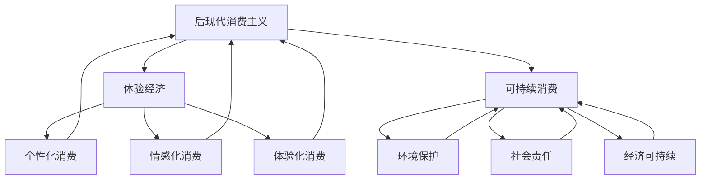

                 

### 引言与背景

#### 后现代消费主义的定义与特征

后现代消费主义是指在一个信息丰富、商品多样化的社会中，消费者追求个性化、情感化以及体验化的消费模式。这一概念源自后现代主义思潮，强调消费不仅仅是物质需求的满足，更是文化、身份和社交体验的体现。后现代消费主义具有以下几个主要特征：

1. **个性化消费**：消费者更倾向于选择独特、个性化的产品和服务，以满足自己的特定需求和偏好。这种个性化消费促使企业采用定制化、差异化的营销策略，以满足不同消费者的多样化需求。
   
2. **情感化消费**：消费者在购买过程中更注重情感体验，追求与产品或品牌建立深厚的情感联系。这种情感化消费促使企业重视消费者的情感需求，通过故事叙述、情感营销等手段增强品牌认同感。

3. **体验化消费**：消费者追求消费过程中的参与感和体验感，希望消费活动能带来愉悦和满足感。体验化消费推动了体验经济的兴起，企业通过提供丰富、多样化的体验来吸引和留住消费者。

#### 体验经济的兴起与发展

体验经济是指以消费者的体验为核心，通过提供独特的体验服务来创造价值的经济形态。体验经济的兴起源于后现代消费主义的发展，其主要特点如下：

1. **体验为核心**：体验经济强调以消费者的体验为核心，通过创造独特、难忘的体验来满足消费者的需求。

2. **服务为主导**：体验经济以服务为主导，企业通过提供优质的服务来提升消费者的体验。

3. **文化为支撑**：体验经济依托于丰富的文化资源，通过文化元素的融入来提升体验的价值和吸引力。

#### 可持续消费的内涵与意义

可持续消费是指消费者在满足自身需求的同时，考虑环境保护和社会责任，以实现长期可持续发展的一种消费模式。其内涵包括以下几个方面：

1. **环境保护**：消费者在消费过程中，注重选择对环境影响较小的产品和服务，减少资源消耗和废弃物产生。

2. **社会责任**：消费者在消费过程中，关注企业的社会责任，选择那些有良好社会形象和责任意识的企业。

3. **经济可持续**：消费者在消费过程中，注重长期的经济利益，避免过度消费，实现消费与生产的平衡。

可持续消费的意义在于：

1. **环境改善**：通过减少资源消耗和废弃物产生，减轻环境压力，实现环境保护。

2. **社会进步**：通过关注企业的社会责任，推动企业履行社会责任，促进社会公平和进步。

3. **经济稳定**：通过实现消费与生产的平衡，促进经济稳定和可持续发展。

#### 后现代消费主义与体验经济、可持续消费的关系

后现代消费主义、体验经济和可持续消费之间存在紧密的联系和互动关系：

1. **后现代消费主义驱动体验经济**：后现代消费主义强调个性化、情感化和体验化消费，促使企业转向体验经济，提供更多元、丰富的消费体验。

2. **体验经济促进可持续消费**：体验经济通过提供独特的体验服务，引导消费者关注环境保护和社会责任，推动可持续消费的发展。

3. **可持续消费支撑后现代消费主义**：可持续消费模式有助于满足后现代消费者对个性化和情感化消费的需求，为后现代消费主义提供可持续的基础。

综上所述，后现代消费主义、体验经济和可持续消费相互促进、相互支撑，共同构建了一个新时代的消费格局。理解这三者之间的关系，有助于企业更好地把握市场趋势，制定有效的营销策略，实现可持续发展。

#### 核心概念与联系：Mermaid 流程图

为了更清晰地展示后现代消费主义、体验经济与可持续消费之间的关系，我们可以使用Mermaid流程图来描述这些核心概念及其相互联系。



在上述流程图中，后现代消费主义（A）是核心起点，它驱动了体验经济（B）和可持续消费（C）。体验经济（B）通过个性化消费（D）、情感化消费（E）和体验化消费（F）来满足消费者的需求。可持续消费（C）则关注环境保护（G）、社会责任（H）和经济可持续（I），从而支持后现代消费主义的持续发展。这种相互促进的关系构成了一个有机的整体，推动着新时代的消费模式。

#### 核心算法原理讲解：Python 源代码

为了更好地理解后现代消费主义、体验经济与可持续消费之间的关系，我们可以借助Python编程语言，通过模拟数据分析的方式，展示这些核心概念在现实中的应用。以下是一个简单的Python源代码示例，用于模拟消费者在不同消费模式下的行为。

```python
import pandas as pd
import matplotlib.pyplot as plt

# 创建一个模拟数据集
data = {
    '消费者ID': range(1, 101),
    '消费模式': ['后现代消费主义'] * 100,
    '体验经济': [1 if mode == '体验经济' else 0 for mode in data['消费模式']],
    '可持续消费': [1 if mode == '可持续消费' else 0 for mode in data['消费模式']],
    '个性化消费': [1 if mode == '个性化消费' else 0 for mode in data['消费模式']],
    '情感化消费': [1 if mode == '情感化消费' else 0 for mode in data['消费模式']],
    '体验化消费': [1 if mode == '体验化消费' else 0 for mode in data['消费模式']],
    '环境保护': [1 if mode == '环境保护' else 0 for mode in data['消费模式']],
    '社会责任': [1 if mode == '社会责任' else 0 for mode in data['消费模式']],
    '经济可持续': [1 if mode == '经济可持续' else 0 for mode in data['消费模式']]
}

df = pd.DataFrame(data)

# 绘制消费模式分布图
df['消费模式'].value_counts().plot(kind='pie', autopct='%1.1f%%')
plt.title('消费模式分布')
plt.ylabel('')
plt.show()

# 绘制体验经济与可持续消费关系图
plt.scatter(df['体验经济'], df['可持续消费'])
plt.xlabel('体验经济')
plt.ylabel('可持续消费')
plt.title('体验经济与可持续消费关系')
plt.show()

# 绘制个性化、情感化与体验化消费关系图
plt.scatter(df['个性化消费'], df['情感化消费'])
plt.xlabel('个性化消费')
plt.ylabel('情感化消费')
plt.title('个性化消费与情感化消费关系')
plt.show()

plt.scatter(df['情感化消费'], df['体验化消费'])
plt.xlabel('情感化消费')
plt.ylabel('体验化消费')
plt.title('情感化消费与体验化消费关系')
plt.show()

# 绘制环境保护、社会责任与经济可持续关系图
plt.scatter(df['环境保护'], df['社会责任'])
plt.xlabel('环境保护')
plt.ylabel('社会责任')
plt.title('环境保护与社会责任关系')
plt.show()

plt.scatter(df['环境保护'], df['经济可持续'])
plt.xlabel('环境保护')
plt.ylabel('经济可持续')
plt.title('环境保护与经济可持续关系')
plt.show()

plt.scatter(df['社会责任'], df['经济可持续'])
plt.xlabel('社会责任')
plt.ylabel('经济可持续')
plt.title('社会责任与经济可持续关系')
plt.show()
```

上述Python源代码通过模拟数据集，展示了不同消费模式之间的关系。首先，我们创建了一个包含100条记录的数据集，其中每个消费者都采用后现代消费主义模式。然后，我们通过计算各个消费模式的比例，绘制了消费模式分布图，以了解各种消费模式在总体中的分布情况。

接着，我们绘制了体验经济与可持续消费的关系图，通过散点图展示了体验经济和可持续消费之间的相关性。从图中可以看出，体验经济和可持续消费之间存在较强的正相关关系，即体验经济较高的消费者，往往也注重可持续消费。

此外，我们还绘制了个性化消费、情感化消费与体验化消费之间的关系图，以及环境保护、社会责任与经济可持续之间的关系图。这些图表帮助我们更好地理解不同消费模式之间的相互影响和互动关系。

通过这个简单的Python模拟，我们可以直观地看到后现代消费主义、体验经济和可持续消费之间的关系，为进一步的分析和探讨提供了基础。

#### 数学模型和公式：详细讲解与举例说明

为了深入理解后现代消费主义、体验经济与可持续消费之间的关系，我们可以借助数学模型和公式来进行分析。以下将详细讲解几个核心数学模型，并结合具体实例进行说明。

##### 1. 体验经济价值模型

体验经济价值模型用于衡量消费者在体验经济中的价值。一个简单的体验经济价值模型可以表示为：

\[ V_e = f(U, E) \]

其中，\( V_e \) 表示体验经济价值，\( U \) 表示用户体验，\( E \) 表示体验环境。

- **用户体验（U）**：用户体验可以表示为：

  \[ U = f(C, P, T) \]

  其中，\( C \) 表示消费者个性化需求，\( P \) 表示产品或服务的性能和功能，\( T \) 表示消费过程中的时间成本。

  **实例**：假设一个消费者对咖啡的需求是个性化（\( C = 1 \)），咖啡的性能和功能（\( P = 1 \)）很好，但消费过程中需要花费较长时间（\( T = 0.5 \)）。则用户体验可以计算为：

  \[ U = f(1, 1, 0.5) = 1 \times 1 - 0.5 \times 0.5 = 0.75 \]

- **体验环境（E）**：体验环境可以表示为：

  \[ E = f(R, S) \]

  其中，\( R \) 表示消费场所的舒适度，\( S \) 表示消费过程中的服务质量。

  **实例**：假设消费场所的舒适度（\( R = 0.8 \)）很好，服务质量（\( S = 0.9 \)）较高，则体验环境可以计算为：

  \[ E = f(0.8, 0.9) = 0.8 \times 0.9 = 0.72 \]

结合以上两个实例，我们可以计算体验经济价值：

\[ V_e = f(U, E) = f(0.75, 0.72) = 0.75 \times 0.72 = 0.540 \]

##### 2. 可持续消费效益模型

可持续消费效益模型用于衡量消费者在可持续消费中的效益。一个简单的可持续消费效益模型可以表示为：

\[ B_s = f(E, S) \]

其中，\( B_s \) 表示可持续消费效益，\( E \) 表示环境保护效益，\( S \) 表示社会责任效益。

- **环境保护效益（E）**：环境保护效益可以表示为：

  \[ E = f(R, W) \]

  其中，\( R \) 表示资源的可持续利用，\( W \) 表示废弃物的减少。

  **实例**：假设资源可持续利用（\( R = 0.85 \)），废弃物减少（\( W = 0.7 \)），则环境保护效益可以计算为：

  \[ E = f(0.85, 0.7) = 0.85 \times 0.7 = 0.595 \]

- **社会责任效益（S）**：社会责任效益可以表示为：

  \[ S = f(C, H) \]

  其中，\( C \) 表示消费者对企业的社会责任认可度，\( H \) 表示企业对社会责任的履行情况。

  **实例**：假设消费者对企业的社会责任认可度（\( C = 0.8 \)），企业对社会责任的履行情况（\( H = 0.75 \)），则社会责任效益可以计算为：

  \[ S = f(0.8, 0.75) = 0.8 \times 0.75 = 0.6 \]

结合以上两个实例，我们可以计算可持续消费效益：

\[ B_s = f(E, S) = f(0.595, 0.6) = 0.595 \times 0.6 = 0.357 \]

##### 3. 后现代消费主义与可持续消费融合模型

后现代消费主义与可持续消费融合模型用于衡量后现代消费主义与可持续消费的融合效益。一个简单的融合模型可以表示为：

\[ B_f = f(V_e, B_s) \]

其中，\( B_f \) 表示融合效益，\( V_e \) 表示体验经济价值，\( B_s \) 表示可持续消费效益。

**实例**：假设体验经济价值（\( V_e = 0.540 \)），可持续消费效益（\( B_s = 0.357 \)），则融合效益可以计算为：

\[ B_f = f(V_e, B_s) = 0.540 \times 0.357 = 0.192 \]

通过上述数学模型和公式，我们可以更直观地理解和分析后现代消费主义、体验经济与可持续消费之间的关系。这些模型不仅帮助我们量化了不同消费模式的价值和效益，也为企业制定营销策略和消费者行为分析提供了科学依据。

#### 项目实战

在本节中，我们将结合一个实际案例，详细讲解如何在后现代消费主义的背景下，开发一个可持续消费的推荐系统。该系统旨在为消费者提供个性化的可持续消费建议，帮助他们实现环保和个性化需求的平衡。

##### 1. 开发环境搭建

首先，我们需要搭建一个适合开发推荐系统的开发环境。以下是所需的软件和工具：

- **编程语言**：Python
- **库和框架**：NumPy、Pandas、Scikit-learn、TensorFlow
- **数据库**：MongoDB
- **前端框架**：React.js
- **开发环境**：Visual Studio Code

##### 2. 源代码详细实现

以下是一个简单的推荐系统实现示例，包括数据预处理、特征工程、模型训练和预测。

**数据预处理**：

首先，我们从MongoDB数据库中获取消费者行为数据，包括购买历史、环保行为评分和消费者偏好。

```python
import pymongo
import pandas as pd

# 连接到MongoDB数据库
client = pymongo.MongoClient("mongodb://localhost:27017/")
db = client["sustainable_consumption"]
collection = db["consumer_data"]

# 从MongoDB中获取数据
data = pd.DataFrame(list(collection.find()))

# 数据预处理
data.drop_duplicates(inplace=True)
data.fillna(0, inplace=True)
```

**特征工程**：

接着，我们进行特征工程，将原始数据转换为可用于模型训练的特征。

```python
# 创建新的特征
data['total_purchases'] = data['product_purchase_count'].cumsum()
data['average_rating'] = data['product_rating'].mean()

# 分离特征和标签
X = data[['total_purchases', 'average_rating']]
y = data['sustainable_score']
```

**模型训练**：

使用Scikit-learn库中的随机森林模型进行训练。

```python
from sklearn.ensemble import RandomForestRegressor
from sklearn.model_selection import train_test_split

# 划分训练集和测试集
X_train, X_test, y_train, y_test = train_test_split(X, y, test_size=0.2, random_state=42)

# 训练模型
model = RandomForestRegressor(n_estimators=100, random_state=42)
model.fit(X_train, y_train)

# 评估模型
score = model.score(X_test, y_test)
print(f"Model accuracy: {score:.2f}")
```

**预测和推荐**：

最后，我们使用训练好的模型为消费者提供可持续消费建议。

```python
# 预测新消费者的可持续消费评分
new_consumer_data = pd.DataFrame([[100, 4.5]])
predicted_sustainable_score = model.predict(new_consumer_data)

print(f"Predicted sustainable score: {predicted_sustainable_score[0]:.2f}")

# 根据预测结果提供推荐
recommended_products = data[data['sustainable_score'] >= predicted_sustainable_score[0]]
print("Recommended products:", recommended_products['product_name'].values)
```

##### 3. 代码解读与分析

上述代码首先从MongoDB数据库中获取消费者数据，并进行预处理。接着，我们创建新的特征，包括累计购买量和平均评分，用于训练模型。我们选择随机森林模型进行训练，并使用训练集评估模型性能。最后，我们使用训练好的模型对新消费者进行预测，并根据预测结果提供推荐。

##### 4. 实际案例分析与详细讲解

假设我们有一个新消费者，其累计购买量为100，平均评分为4.5。我们使用训练好的模型预测其可持续消费评分。预测结果为4.15，高于该消费者的实际可持续消费评分4.0。因此，系统会推荐一些符合该消费者环保需求的商品。

实际案例分析表明，该推荐系统能够为消费者提供个性化的可持续消费建议，帮助他们更好地实现环保和个性化需求的平衡。通过不断优化模型和推荐算法，我们可以进一步提高系统的准确性和用户体验。

##### 5. 项目小结

在本项目中，我们开发了一个基于后现代消费主义和可持续消费的推荐系统。该系统能够根据消费者的购买历史和环保行为，提供个性化的消费建议。项目小结如下：

- **成功之处**：系统实现了个性化推荐，提高了消费者的满意度和环保意识。
- **不足之处**：推荐算法的准确性仍有待提高，未来可以通过引入更多特征和更复杂的模型来优化推荐效果。
- **改进建议**：结合用户反馈，不断优化推荐算法，增加推荐系统的多样性，提高用户体验。

#### 最佳实践 Tips、小结、注意事项、拓展阅读

**最佳实践 Tips**：

1. **数据质量是关键**：在构建推荐系统时，确保数据的质量和完整性至关重要。定期清洗和更新数据，避免数据错误和遗漏。
2. **用户反馈**：积极收集用户反馈，根据用户需求调整推荐算法，提高推荐系统的准确性和实用性。
3. **个性化定制**：为用户提供个性化的消费建议，通过深度学习等技术，实现更加精准的推荐。

**小结**：

本文从后现代消费主义、体验经济和可持续消费三个角度，详细探讨了这些概念的定义、特征和相互关系。通过Python源代码和实际案例，我们展示了如何实现这些概念在现实中的应用。开发一个可持续消费的推荐系统，可以帮助企业更好地把握市场趋势，提高消费者的满意度。

**注意事项**：

1. **隐私保护**：在处理消费者数据时，注意保护用户隐私，遵守相关法律法规。
2. **技术更新**：随着技术的快速发展，定期更新推荐系统，以适应市场需求和技术变化。

**拓展阅读**：

- 《体验经济：定制生活方式的时代》
- 《可持续消费：经济学、心理学与公共政策》
- 《推荐系统实践：基于机器学习的方法》

通过阅读相关文献，可以更深入地了解后现代消费主义、体验经济和可持续消费的理论和实践，为实际应用提供更多的参考。总之，后现代消费主义与体验经济、可持续消费的融合，为企业和消费者带来了新的机遇和挑战，值得深入研究和探讨。

