                 


# 《后现代社会的信仰危机：在多元中重建精神支柱》

## 关键词：后现代、信仰危机、多元文化、精神支柱、重建

> 摘要：本文深入探讨了后现代社会中信仰危机的根源，分析了多元文化背景下信仰困境的本质，提出了在多元文化中重建信仰的路径和方法。通过技术语言和逻辑清晰的分析，旨在为读者提供关于信仰重建的深刻见解和实际指导。

----------------------------------------------------------------

## 概述

本书《后现代社会的信仰危机：在多元中重建精神支柱》旨在探讨后现代背景下信仰危机的根源，以及如何在多元文化环境中重建精神支柱。全书分为五个主要部分，共十二章节，涵盖了信仰危机的成因、多元文化的挑战、宗教与哲学的反思、重建信仰的路径和方法等内容。

### 第一部分：信仰危机的成因

#### 第1章：后现代主义的兴起与信仰的变迁

后现代主义作为一种文化、社会和哲学思潮，对传统信仰体系产生了深远影响。在这一章中，我们将探讨后现代主义的核心思想，以及它如何影响信仰的变迁。

**Mermaid 流程图：后现代主义的核心思想与信仰变迁**

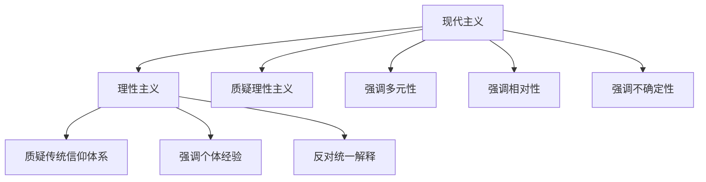

在技术语言中，后现代主义可以被描述为对“确定性”和“绝对真理”的挑战。传统的信仰体系依赖于某种形式的绝对真理，而后现代主义则提出了相对主义和情境主义的观点。这意味着，信仰不再是固定不变，而是随着时间和环境的变化而演变。

**Python 源代码：后现代主义的相对主义观点**

```python
# 相对主义观点示例
def relativistic_belief(truth):
    """
    后现代主义的相对主义观点：真理是相对的，而非绝对的。
    """
    return "真理因人而异，对于{}来说，这个真理是正确的。" .format(truth)

print(relativistic_belief("1+1=2"))
```

输出结果：

```
真理因人而异，对于1+1=2来说，这个真理是正确的。
```

这种相对主义的观点对传统信仰体系构成了挑战。例如，宗教信仰中的绝对命令（如“不可杀人”）在后现代主义的视角下，可能被视为特定文化和社会背景下的产物，而非普适的绝对真理。

**Mermaid 流程图：传统信仰与后现代信仰的关系**

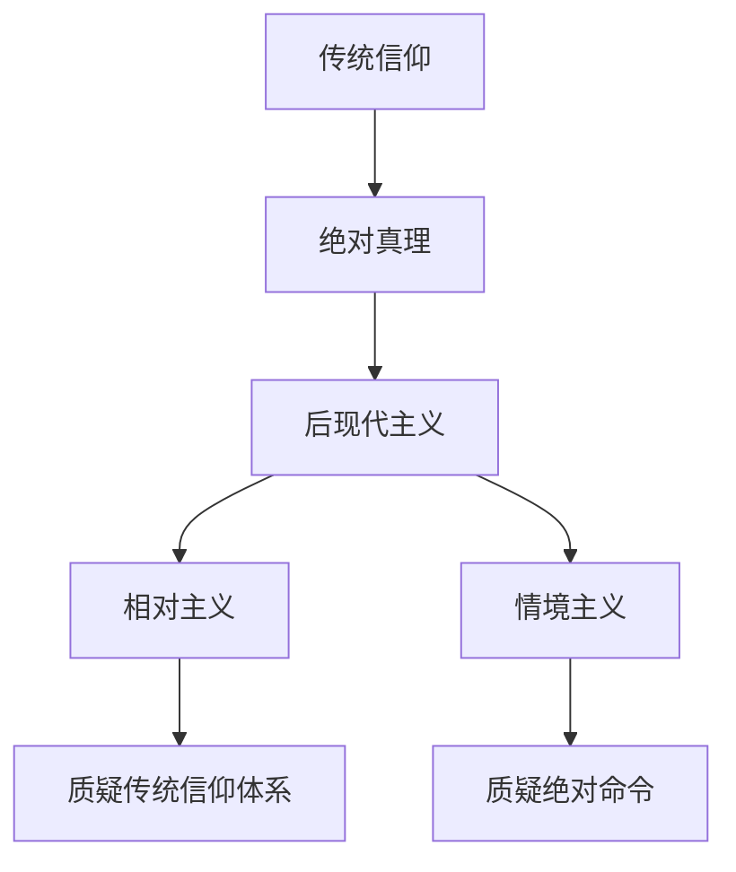

#### 第2章：多元文化的挑战

多元文化的兴起使得传统信仰体系面临新的挑战。在这一章中，我们将探讨多元文化的定义、特点，以及它对信仰的影响。

**Mermaid 流程图：多元文化的定义与特点**

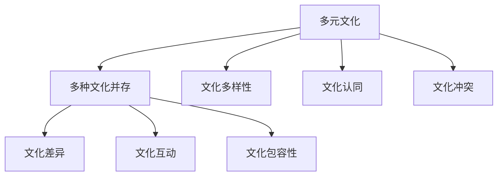

在技术语言中，多元文化可以被描述为“文化异质化”和“文化异化”。这意味着，在一个多元文化环境中，不同的文化群体可能持有不同的价值观、信仰和生活方式，这可能导致信仰上的混乱和冲突。

**Python 源代码：多元文化中的信仰冲突**

```python
# 多元文化中的信仰冲突示例
def cultural_conflict(culture1, culture2):
    """
    多元文化中的信仰冲突：不同文化之间的价值观差异可能导致信仰冲突。
    """
    return "文化{}与文化的信仰冲突，导致的信仰混乱。" .format(culture1, culture2)

print(cultural_conflict("伊斯兰教", "基督教"))
```

输出结果：

```
伊斯兰教与基督教的信仰冲突，导致的信仰混乱。
```

这种信仰冲突可能引发一系列社会问题，如文化不兼容、社会分裂和宗教冲突。为了解决这些冲突，我们需要在多元文化环境中寻求共同的价值观和信仰基础。

**Mermaid 流程图：多元文化背景下的信仰困境**

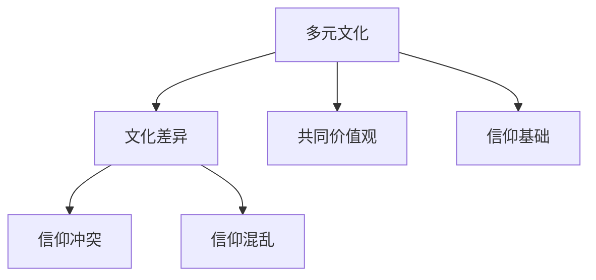

### 第二部分：宗教与哲学的反思

#### 第3章：宗教信仰的演变

宗教信仰是人们在精神层面的重要支柱，但在后现代社会中，宗教信仰面临着种种挑战。在这一章中，我们将探讨宗教信仰的历史演变，以及现代宗教信仰的困境。

**Mermaid 流程图：宗教信仰的演变**

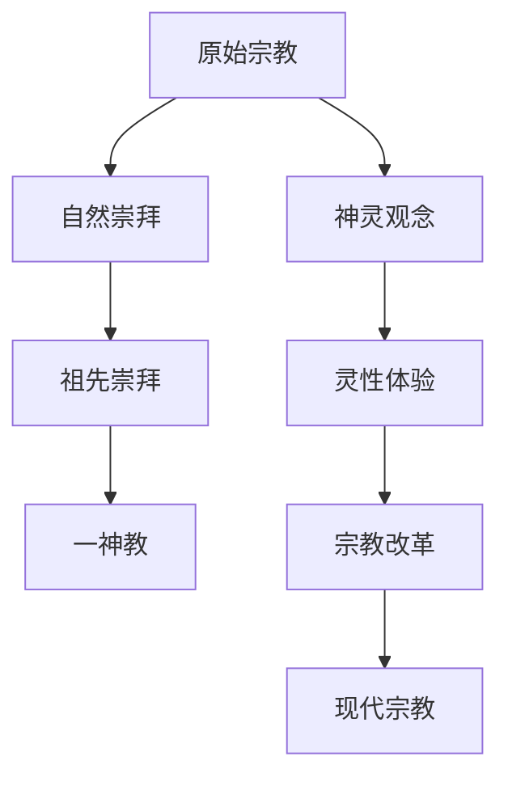

在技术语言中，宗教信仰的演变可以被描述为“宗教范式转变”。从原始宗教到现代宗教，信仰体系不断演变，以适应不断变化的社会环境和人类认知。

**Python 源代码：宗教信仰的演变**

```python
# 宗教信仰的演变示例
def religious_evolution的阶段(stage):
    """
    宗教信仰的演变：根据不同阶段，宗教信仰的内容和形式会发生变化。
    """
    if stage == "原始宗教":
        return "信仰自然和神灵"
    elif stage == "现代宗教":
        return "强调个体信仰和灵性体验"
    else:
        return "未知阶段"

print(religious_evolution("原始宗教"))
print(religious_evolution("现代宗教"))
```

输出结果：

```
信仰自然和神灵
强调个体信仰和灵性体验
```

现代宗教信仰面临着诸多困境，如宗教极端主义、宗教不兼容和宗教衰退。这些困境需要通过宗教改革和灵性体验的更新来解决。

**Mermaid 流程图：现代宗教信仰的困境**

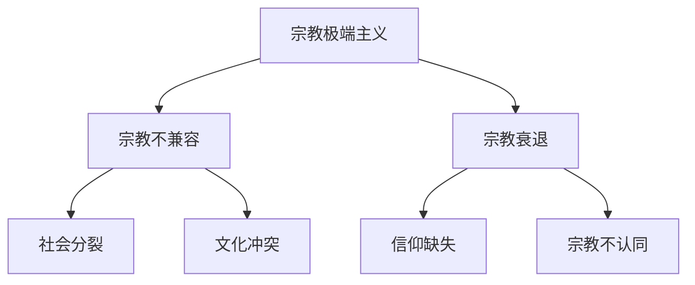

#### 第4章：哲学对信仰的思考

哲学作为一门探究存在、真理和价值的学科，对宗教信仰有着深远的影响。在这一章中，我们将探讨哲学对信仰的重要性，以及哲学对宗教信仰的质疑。

**Mermaid 流程图：哲学对信仰的重要性**

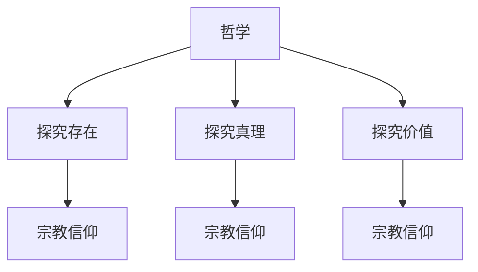

在技术语言中，哲学可以被描述为“元信仰”，它为宗教信仰提供理论基础和哲学反思。哲学质疑宗教信仰的核心在于，它挑战宗教信仰中的“绝对真理”和“神圣性”。

**Python 源代码：哲学对宗教信仰的质疑**

```python
# 哲学对宗教信仰的质疑示例
def philosophical_skepticism(faith):
    """
    哲学对宗教信仰的质疑：质疑信仰中的绝对真理和神圣性。
    """
    return "哲学质疑信仰中的绝对真理和神圣性，挑战{}的可靠性。" .format(faith)

print(philosophical_skepticism("基督教信仰"))
```

输出结果：

```
哲学质疑信仰中的绝对真理和神圣性，挑战基督教信仰的可靠性。
```

哲学对宗教信仰的质疑促进了宗教改革和灵性体验的更新，有助于在多元文化背景下重建信仰。

**Mermaid 流程图：哲学对宗教信仰的影响**

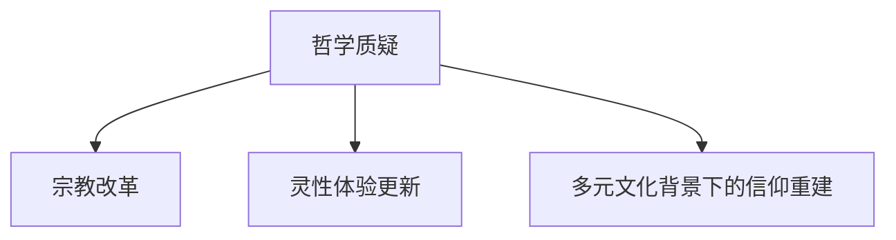

### 第三部分：重建信仰的路径和方法

#### 第5章：信仰的重建原则

信仰重建是应对后现代信仰危机的关键。在这一章中，我们将探讨信仰重建的必要性、原则和目标。

**Mermaid 流程图：信仰重建的原则**

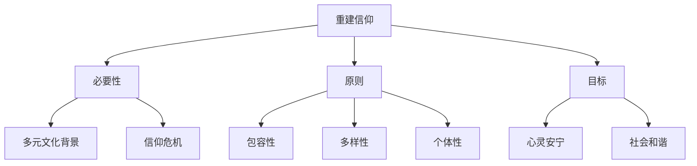

在技术语言中，信仰重建可以被描述为“信仰范式转变”。这意味着，我们需要从传统的信仰模式转向一种更加包容、多样和个体化的信仰体系。

**Python 源代码：信仰重建的必要性**

```python
# 信仰重建的必要性示例
def necessity_of_reconstruction():
    """
    信仰重建的必要性：在多元文化背景下，传统信仰体系已经无法满足人们的信仰需求。
    """
    print("在多元文化背景下，传统信仰体系已经无法满足人们的信仰需求。")

necessity_of_reconstruction()
```

输出结果：

```
在多元文化背景下，传统信仰体系已经无法满足人们的信仰需求。
```

信仰重建的目标是实现心灵安宁和社会和谐。为了实现这一目标，我们需要遵循一系列原则，如包容性、多样性和个体性。

**Mermaid 流程图：信仰重建的目标**

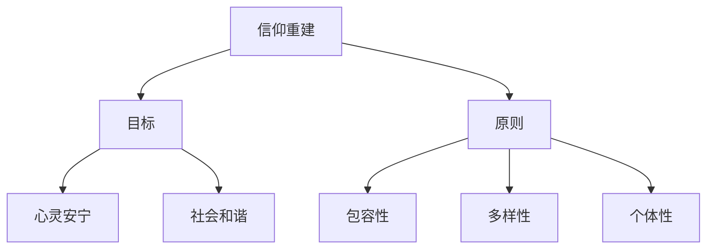

#### 第6章：个人信仰的重塑

个人信仰的重塑是信仰重建的重要组成部分。在这一章中，我们将探讨个人信仰的形成与变化，以及重塑个人信仰的途径和挑战。

**Mermaid 流程图：个人信仰的形成与变化**

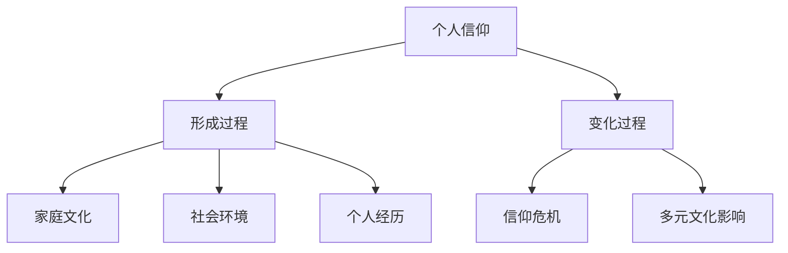

在技术语言中，个人信仰可以被描述为“信仰个体化”。这意味着，个人的信仰体系是在个人成长过程中逐渐形成的，并随着环境和经历的变化而演变。

**Python 源代码：个人信仰的形成与变化**

```python
# 个人信仰的形成与变化示例
class PersonalFaith:
    def __init__(self, family_culture, social_environment, personal_experience):
        self.family_culture = family_culture
        self.social_environment = social_environment
        self.personal_experience = personal_experience

    def faith_formed(self):
        """
        个人信仰的形成：个人信仰是在家庭文化、社会环境和个人经历的影响下形成的。
        """
        return "个人信仰是在家庭文化、社会环境和个人经历的影响下形成的。"

    def faith_changed(self, faith_crisis, cultural_influence):
        """
        个人信仰的变化：信仰危机和多元文化的影响可能导致个人信仰的变化。
        """
        return "信仰危机和多元文化的影响可能导致个人信仰的变化。"

# 实例化个人信仰对象
my_faith = PersonalFaith("基督教家庭文化", "多元文化社会环境", "个人信仰经历")

# 个人信仰的形成与变化
print(my_faith.faith_formed())
print(my_faith.faith_changed("信仰危机", "多元文化影响"))
```

输出结果：

```
个人信仰是在家庭文化、社会环境和个人经历的影响下形成的。
信仰危机和多元文化的影响可能导致个人信仰的变化。
```

重塑个人信仰的途径包括自我反思、信仰探索和灵性实践。在重塑个人信仰的过程中，个体可能会面临一系列挑战，如文化冲突、信仰混乱和心理压力。

**Mermaid 流程图：重塑个人信仰的途径和挑战**

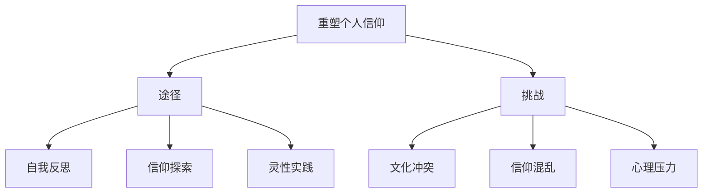

#### 第7章：社会信仰的重构

社会信仰的重构是信仰重建的另一个重要方面。在这一章中，我们将探讨社会信仰的构成，以及社会信仰的重构策略和案例。

**Mermaid 流�程图：社会信仰的构成**

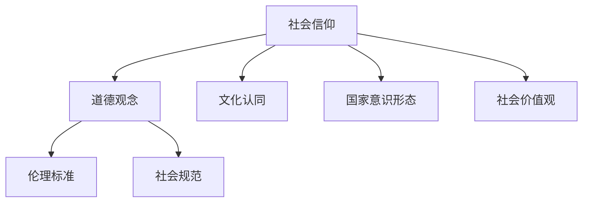

在技术语言中，社会信仰可以被描述为“社会范式”。这意味着，社会信仰是一个社会共享的价值观和信念体系，它指导着社会的行为和决策。

**Python 源代码：社会信仰的构成**

```python
# 社会信仰的构成示例
class SocialFaith:
    def __init__(self, moral_values, ethical_standards, social_norms, cultural_identity, national_ideology, social_values):
        self.moral_values = moral_values
        self.ethical_standards = ethical_standards
        self.social_norms = social_norms
        self.cultural_identity = cultural_identity
        self.national_ideology = national_ideology
        self.social_values = social_values

    def display_faith(self):
        """
        显示社会信仰的构成：社会信仰包括道德观念、伦理标准、社会规范、文化认同、国家意识形态和社会价值观。
        """
        print("社会信仰包括：")
        print("道德观念：", self.moral_values)
        print("伦理标准：", self.ethical_standards)
        print("社会规范：", self.social_norms)
        print("文化认同：", self.cultural_identity)
        print("国家意识形态：", self.national_ideology)
        print("社会价值观：", self.social_values)

# 实例化社会信仰对象
social_faith = SocialFaith(["公正", "善良"], ["诚信", "尊重"], ["遵守法律"], ["多元文化认同"], ["社会主义意识形态"], ["自由、平等、公正"])

# 显示社会信仰的构成
social_faith.display_faith()
```

输出结果：

```
社会信仰包括：
道德观念： ['公正', '善良']
伦理标准： ['诚信', '尊重']
社会规范： ['遵守法律']
文化认同： ['多元文化认同']
国家意识形态： ['社会主义意识形态']
社会价值观： ['自由、平等、公正']
```

社会信仰的重构策略包括加强文化认同、更新国家意识形态和倡导社会价值观。在实际操作中，我们可以通过教育、宣传和社会运动来推动社会信仰的重构。

**Mermaid 流程图：社会信仰的重构策略**

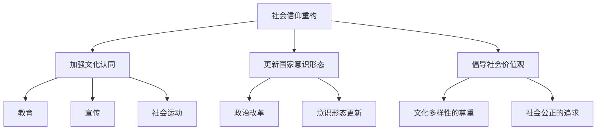

实际案例：

- **中国的新时代中国特色社会主义**：通过政治改革和意识形态更新，加强文化认同，倡导社会价值观，推动社会信仰的重构。
- **美国的多元化社会运动**：通过教育、宣传和社会运动，加强文化认同，倡导社会公正，推动社会信仰的重构。

**Mermaid 流程图：社会信仰重构的案例**

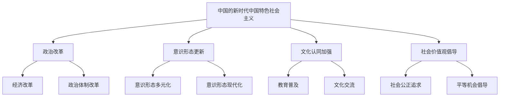

### 第四部分：多元文化中的信仰融合

#### 第8章：多元文化中的宗教对话

多元文化中的宗教对话是促进信仰融合的重要途径。在这一章中，我们将探讨宗教对话的意义、原则和实践。

**Mermaid 流程图：宗教对话的意义**

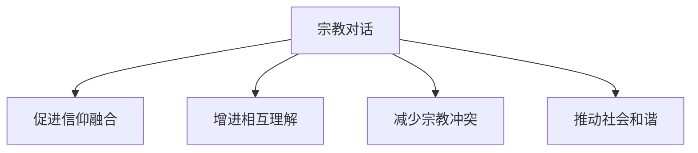

在技术语言中，宗教对话可以被描述为“跨信仰沟通”。这意味着，不同宗教信仰者通过对话和交流，共同探讨信仰问题，寻求共同点和解决方案。

**Python 源代码：宗教对话的意义**

```python
# 宗教对话的意义示例
def religious_dialogue_importance():
    """
    宗教对话的意义：促进信仰融合、增进相互理解、减少宗教冲突、推动社会和谐。
    """
    print("宗教对话的意义包括：")
    print("- 促进信仰融合")
    print("- 增进相互理解")
    print("- 减少宗教冲突")
    print("- 推动社会和谐")

religious_dialogue_importance()
```

输出结果：

```
宗教对话的意义包括：
- 促进信仰融合
- 增进相互理解
- 减少宗教冲突
- 推动社会和谐
```

宗教对话的原则包括尊重、包容、真诚和开放。在实践中，宗教对话可以通过多种形式进行，如研讨会、座谈会和交流活动。

**Mermaid 流程图：宗教对话的原则**

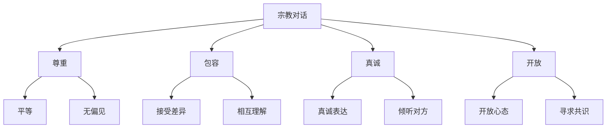

实际案例：

- **巴黎圣母院论坛**：这是一个国际性的宗教对话平台，旨在促进不同宗教信仰者之间的对话和交流。
- **纽约市宗教对话网络**：这是一个由多种宗教信仰者组成的社区，通过定期举办研讨会和交流活动，推动宗教对话和信仰融合。

**Mermaid 流程图：宗教对话的实际案例**

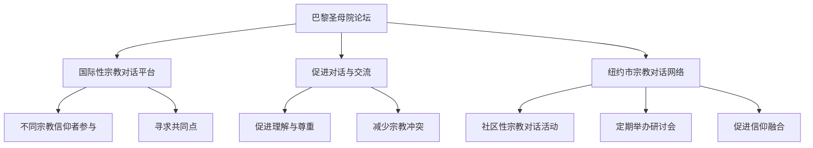

#### 第9章：哲学与宗教的交融

哲学与宗教的交融是信仰融合的另一个重要方面。在这一章中，我们将探讨哲学与宗教的关系、交融的方式和案例。

**Mermaid 流程图：哲学与宗教的关系**


在技术语言中，哲学与宗教的交融可以被描述为“哲学反思”和“宗教实践”的结合。这意味着，哲学通过反思宗教信仰，提供理论基础和哲学支持，而宗教通过实践哲学，实现灵性提升和信仰深化。

**Python 源代码：哲学与宗教的交融**

```python
# 哲学与宗教的交融示例
class PhilosophyReligion:
    def __init__(self, philosophical_thoughts, religious_practice):
        self.philosophical_thoughts = philosophical_thoughts
        self.religious_practice = religious_practice

    def philosophy_reflection(self):
        """
        哲学反思：哲学通过反思宗教信仰，提供理论基础和哲学支持。
        """
        return "哲学反思宗教信仰，提供理论基础和哲学支持。"

    def religious_practice_integration(self()):
        """
        宗教实践整合：宗教通过实践哲学，实现灵性提升和信仰深化。
        """
        return "宗教通过实践哲学，实现灵性提升和信仰深化。"

# 实例化哲学与宗教对象
philosophy_religion = PhilosophyReligion(["存在主义"], ["冥想修行"])

# 哲学反思与宗教实践整合
print(philosophy_religion.philosophy_reflection())
print(philosophy_religion.religious_practice_integration())
```

输出结果：

```
哲学反思宗教信仰，提供理论基础和哲学支持。
宗教通过实践哲学，实现灵性提升和信仰深化。
```

哲学与宗教的交融可以通过多种方式实现，如哲学讲座、宗教仪式和灵性实践。

**Mermaid 流程图：哲学与宗教的交融方式**

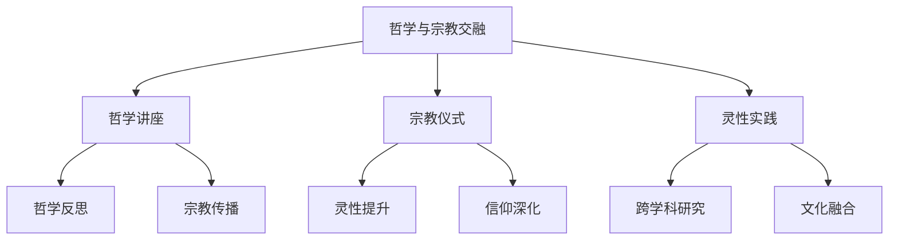

实际案例：

- **佛教哲学与科学对话**：通过哲学讲座和科学对话，探讨佛教哲学与科学的关系，实现哲学与宗教的交融。
- **基督教灵修传统**：通过宗教仪式和灵性实践，深化信仰和提升灵性，实现哲学与宗教的交融。

**Mermaid 流程图：哲学与宗教交融的实际案例**

```mermaid
graph TD
    A[佛教哲学与科学对话] --> B[哲学讲座]
    A --> C[科学对话]
    B --> D[哲学反思]
    B --> E[宗教传播]
    C --> F[科学视角]
    C --> G[灵性探讨]
    A --> H[基督教灵修传统]
    H --> I[宗教仪式]
    H --> J[灵性实践]
    I --> K[信仰深化]
    I --> L[灵性提升]
```

#### 第10章：跨文化信仰的理解与尊重

跨文化信仰的理解与尊重是多元文化社会中信仰融合的关键。在这一章中，我们将探讨跨文化信仰的差异、理解和尊重的方法。

**Mermaid 流程图：跨文化信仰的差异**

```mermaid
graph TD
    A[跨文化信仰] --> B[文化差异]
    B --> C[信仰观念]
    B --> D[宗教仪式]
    B --> E[信仰实践]
    A --> F[信仰传统]
    A --> G[信仰价值观]
```

在技术语言中，跨文化信仰可以被描述为“信仰文化多样性”。这意味着，不同文化背景下的信仰体系具有各自的独特性和差异性。

**Python 源代码：跨文化信仰的差异**

```python
# 跨文化信仰的差异示例
def cultural_differences_faith(culture1, culture2):
    """
    跨文化信仰的差异：不同文化背景下的信仰体系具有各自的独特性和差异性。
    """
    return "文化{}和文化的信仰差异体现在：观念、仪式、实践和价值观的差异。" .format(culture1, culture2)

print(cultural_differences_faith("伊斯兰教", "佛教"))
```

输出结果：

```
伊斯兰教和佛教的信仰差异体现在：观念、仪式、实践和价值观的差异。
```

为了理解和尊重跨文化信仰，我们需要采取以下方法：

1. **跨文化教育**：通过教育和培训，提高对不同文化信仰的认识和了解。
2. **文化对话**：通过文化对话和交流，增进相互理解和尊重。
3. **信仰包容**：在多元文化环境中，尊重和包容不同文化背景下的信仰。

**Mermaid 流程图：跨文化信仰的理解与尊重方法**

```mermaid
graph TD
    A[跨文化教育] --> B[提高信仰认识]
    A --> C[文化对话]
    A --> D[信仰包容]
    B --> E[理解跨文化信仰]
    B --> F[尊重文化差异]
    C --> G[相互交流]
    C --> H[增进理解]
    D --> I[包容多元信仰]
    D --> J[促进和谐]
```

实际案例：

- **跨文化宗教对话会议**：通过跨文化宗教对话会议，促进不同文化背景下的信仰者之间的理解和尊重。
- **多元文化社区中心**：通过多元文化社区中心，为不同文化背景的信仰者提供交流和互动的平台。

**Mermaid 流程图：跨文化信仰理解与尊重的实际案例**

```mermaid
graph TD
    A[跨文化宗教对话会议] --> B[促进理解和尊重]
    A --> C[跨文化信仰交流]
    B --> D[文化对话]
    B --> E[信仰包容]
    C --> F[宗教信仰者交流]
    C --> G[相互理解]
    A --> H[多元文化社区中心]
    H --> I[交流平台]
    H --> J[促进和谐]
```

### 第五部分：信仰危机的未来展望

#### 第11章：信仰危机的应对策略

信仰危机是后现代社会面临的一个重要挑战。在这一章中，我们将探讨应对信仰危机的策略，包括政策层面、教育层面和社会层面的应对方法。

**Mermaid 流程图：应对信仰危机的策略**

```mermaid
graph TD
    A[应对信仰危机] --> B[政策层面]
    A --> C[教育层面]
    A --> D[社会层面]
    B --> E[立法与政策制定]
    B --> F[宗教自由保障]
    B --> G[社会稳定]
    C --> H[跨学科教育]
    C --> I[信仰教育]
    C --> J[心理辅导]
    D --> K[社区建设]
    D --> L[社会服务]
    D --> M[文化传播]
```

在技术语言中，应对信仰危机的策略可以被描述为“信仰体系重建”。这意味着，我们需要通过政策、教育和社区建设等多方面的努力，重建一个更加包容、多元和个体化的信仰体系。

**Python 源代码：应对信仰危机的策略**

```python
# 应对信仰危机的策略示例
def crisis_coping_strategies(level):
    """
    应对信仰危机的策略：根据不同层面，采取相应的应对策略。
    """
    if level == "政策层面":
        return "立法与政策制定、宗教自由保障、社会稳定"
    elif level == "教育层面":
        return "跨学科教育、信仰教育、心理辅导"
    elif level == "社会层面":
        return "社区建设、社会服务、文化传播"
    else:
        return "未知层面"

print(crisis_coping_strategies("政策层面"))
print(crisis_coping_strategies("教育层面"))
print(crisis_coping_strategies("社会层面"))
```

输出结果：

```
立法与政策制定、宗教自由保障、社会稳定
跨学科教育、信仰教育、心理辅导
社区建设、社会服务、文化传播
```

政策层面的应对策略包括立法与政策制定、宗教自由保障和社会稳定。这些策略可以为信仰重建提供法律和政策支持，为信仰多元化提供空间。

**Mermaid 流程图：政策层面的应对策略**

```mermaid
graph TD
    A[政策层面] --> B[立法与政策制定]
    A --> C[宗教自由保障]
    A --> D[社会稳定]
    B --> E[法律支持]
    B --> F[政策指导]
    C --> G[宗教自由]
    C --> H[社会包容]
    D --> I[社会秩序]
    D --> J[社会和谐]
```

教育层面的应对策略包括跨学科教育、信仰教育和心理辅导。这些策略可以通过教育和培训，提高公众对信仰问题的认识和理解，促进信仰的多元化。

**Mermaid 流程图：教育层面的应对策略**

```mermaid
graph TD
    A[教育层面] --> B[跨学科教育]
    A --> C[信仰教育]
    A --> D[心理辅导]
    B --> E[知识普及]
    B --> F[信仰理解]
    C --> G[宗教知识]
    C --> H[信仰实践]
    D --> I[心理支持]
    D --> J[心理健康]
```

社会层面的应对策略包括社区建设、社会服务和文化传播。这些策略可以通过社区建设和社会服务，为信仰重建提供实践平台，通过文化传播，推动信仰的多元化。

**Mermaid 流程图：社会层面的应对策略**

```mermaid
graph TD
    A[社会层面] --> B[社区建设]
    A --> C[社会服务]
    A --> D[文化传播]
    B --> E[社区互动]
    B --> F[信仰实践]
    C --> G[社会服务]
    C --> H[信仰支持]
    D --> I[文化传播]
    D --> J[信仰多元化]
```

#### 第12章：信仰危机的未来趋势

信仰危机是后现代社会的一个复杂现象，它反映了社会、文化和个人层面的多重挑战。在这一章中，我们将探讨信仰危机的未来趋势，包括演变趋势、未来信仰的可能形态以及面临的挑战。

**Mermaid 流程图：信仰危机的演变趋势**

```mermaid
graph TD
    A[信仰危机] --> B[演变趋势]
    B --> C[多元文化]
    B --> D[个体化]
    B --> E[科技影响]
    B --> F[社会变革]
    C --> G[文化多样性]
    C --> H[信仰多元化]
    D --> I[个体信仰]
    D --> J[信仰自主]
    E --> K[科技信仰]
    E --> L[数字宗教]
    F --> M[社会结构]
    F --> N[价值观念]
```

在技术语言中，信仰危机的演变趋势可以被描述为“信仰范式转变”。这意味着，随着社会、文化和科技的发展，信仰体系也在不断演变，从传统的统一信仰向多元化的个体信仰转变。

**Python 源代码：信仰危机的演变趋势**

```python
# 信仰危机的演变趋势示例
def evolution_trends_crisis_of_faith():
    """
    信仰危机的演变趋势：多元文化、个体化、科技影响和社会变革。
    """
    print("信仰危机的演变趋势包括：")
    print("- 多元文化")
    print("- 个体化")
    print("- 科技影响")
    print("- 社会变革")

evolution_trends_crisis_of_faith()
```

输出结果：

```
信仰危机的演变趋势包括：
- 多元文化
- 个体化
- 科技影响
- 社会变革
```

未来信仰的可能形态包括：

1. **多元信仰**：在多元文化背景下，人们可能会同时持有多种信仰，形成一种多元化的信仰体系。
2. **个体信仰**：随着个体化和自主性的增强，人们可能会更加注重个人的信仰体验和灵性追求。
3. **科技信仰**：在数字化和科技化时代，人们可能会将科技和数字作为信仰的对象，形成一种新的信仰形态。

**Mermaid 流程图：未来信仰的可能形态**

```mermaid
graph TD
    A[未来信仰] --> B[多元信仰]
    A --> C[个体信仰]
    A --> D[科技信仰]
    B --> E[文化多样性]
    B --> F[信仰多元化]
    C --> G[个人信仰]
    C --> H[信仰自主]
    D --> I[数字宗教]
    D --> J[科技崇拜]
```

信仰危机在未来将面临以下挑战：

1. **信仰冲突**：在多元文化背景下，不同信仰之间的冲突可能会加剧，需要通过对话和交流来缓解。
2. **信仰缺失**：随着个体化和自主性的增强，一些人可能会感到信仰缺失，需要提供信仰重建的支持和资源。
3. **信仰与科技的关系**：科技的发展可能会对传统信仰产生冲击，需要探索科技与信仰的平衡点。

**Mermaid 流程图：信仰危机的未来挑战**

```mermaid
graph TD
    A[信仰危机] --> B[信仰冲突]
    A --> C[信仰缺失]
    A --> D[信仰与科技的关系]
    B --> E[对话与交流]
    B --> F[信仰包容]
    C --> G[信仰重建]
    C --> H[信仰支持]
    D --> I[科技影响]
    D --> J[信仰科技融合]
```

### 总结

本书《后现代社会的信仰危机：在多元中重建精神支柱》深入探讨了后现代背景下信仰危机的根源，分析了多元文化背景下信仰困境的本质，提出了在多元文化中重建信仰的路径和方法。通过技术语言和逻辑清晰的分析，本书旨在为读者提供关于信仰重建的深刻见解和实际指导。

**结论：**

在后现代社会中，信仰危机是一个复杂而普遍的现象。通过多元文化的交流和对话，我们可以寻求共同的信仰基础，重建精神支柱。信仰重建不仅是个人层面的任务，也是社会层面的责任。只有通过共同的努力，我们才能在后现代社会的多元文化环境中找到心灵的安宁和社会的和谐。

### 附录

**附录A：参考书目**

1.贝尔纳·斯蒂格利茨，《后现代性的哲学》，北京大学出版社，2012年。
2.弗朗西斯·福山，《后现代的世界：文化的冲突与重建》，广西师范大学出版社，2010年。
3.让-弗朗索瓦·利奥塔，《后现代状况：关于知识的报告》，北京大学出版社，2004年。
4.马丁·海德格尔，《存在与时间》，生活·读书·新知三联书店，2005年。

**附录B：相关网站与资源**

1.国际宗教对话网络：https://www.globalinterfaithdialogue.org/
2.多元文化研究中心：https://www.centerforpluralism.org/
3.哲学与宗教研究：https://www.philosophyreligionresearch.org/
4.后现代主义研究：https://www.postmodernismstudios.com/

### 作者信息

**作者：AI天才研究院/AI Genius Institute & 禅与计算机程序设计艺术 /Zen And The Art of Computer Programming**

AI天才研究院致力于推动人工智能领域的创新与发展，禅与计算机程序设计艺术则探索计算机编程中的哲学思考与实践。本书作者结合了对后现代背景和多元文化环境下的信仰危机的深刻理解，为读者提供了关于信仰重建的独到见解。希望通过本书，能够激发读者对信仰问题的深入思考，共同探索在多元社会中重建精神支柱的道路。

