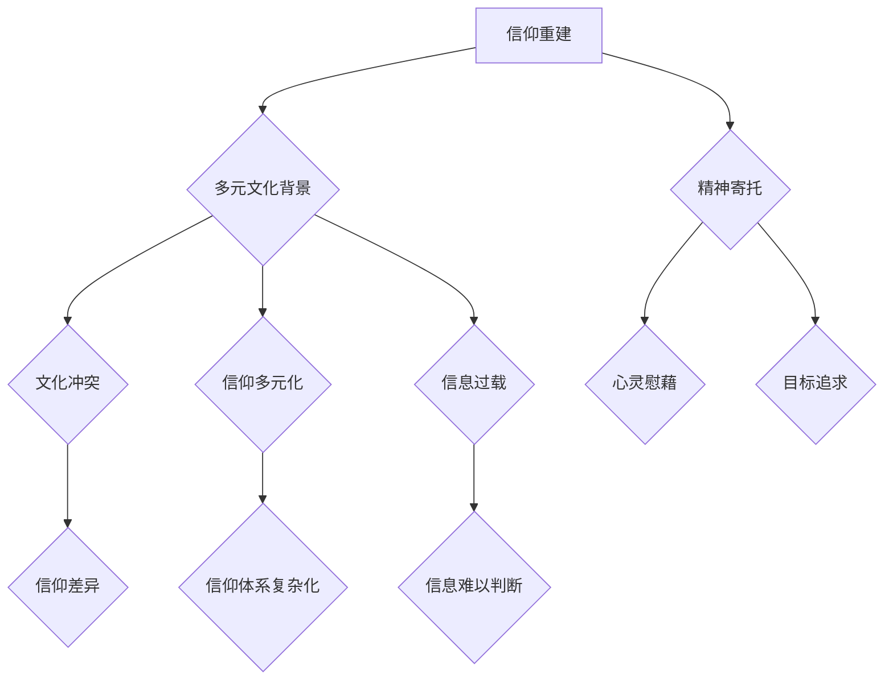

                 


### 《后现代社会的信仰重建：多元化中的精神寄托》

> 关键词：后现代主义、信仰重建、多元文化、精神寄托、案例分析

> 摘要：本文探讨了后现代社会的信仰重建问题，分析了信仰在多元化背景下的变化与挑战，通过理论阐述、案例分析和实际项目，探讨了多元化社会中的信仰重建路径和精神寄托。

## 引言

在当今快速变化的世界，后现代主义作为一种哲学和文化思潮，深刻地影响了人们的信仰观念。后现代社会的特点，如全球化的加剧、文化的多元性、信息的爆炸等，使得人们的信仰面临着前所未有的挑战。信仰重建成为了社会稳定和个人心灵寄托的关键。本文旨在探讨后现代社会的信仰重建问题，分析信仰在多元化背景下的变化与挑战，并通过理论阐述、案例分析和实际项目，提出多元化社会中的信仰重建路径和精神寄托。

## 背景介绍

### 后现代主义概述

后现代主义起源于20世纪中叶，是对现代性批判的一种哲学和文化思潮。它挑战了现代性的理性、科学和普适性，提倡多元性、相对性和批判性思维。后现代主义认为，世界是多元化的，不存在唯一正确的真理，而是存在多种可能的解释和视角。

### 信仰的概念

信仰是一种心理和精神现象，是对某种理念、信仰体系或超自然存在的坚定信念。在传统社会，信仰往往与宗教、道德和文化紧密相关。然而，在后现代社会，信仰的多样性日益增加，信仰体系也变得更加复杂。

### 多元文化背景下的信仰挑战

多元文化背景下，信仰面临的挑战主要包括：

1. **文化冲突**：不同文化之间的信仰差异可能导致冲突和误解。
2. **信仰多元化**：信仰体系的多元化使得人们难以形成统一的世界观。
3. **信息过载**：互联网和媒体的发展使得信息爆炸，人们难以判断哪些信息是真实可信的。

## 核心概念与联系

### 信仰重建

信仰重建是指在社会变迁和文化多元的背景下，对信仰体系进行重新审视和重构的过程。信仰重建的核心目标是找到适应新时代的信仰体系，以应对文化多元性带来的挑战。

### 精神寄托

精神寄托是指个体在信仰、价值观或精神追求中找到的心灵慰藉和目标。在多元文化背景下，精神寄托的多样性使得个体可以选择适合自己的信仰和精神追求。

### 核心概念关系架构

使用Mermaid流程图来表示核心概念之间的关系：



## 核心算法原理讲解

在本章节中，我们将使用Python源代码来详细阐述信仰重建的算法原理，并结合数学模型和公式进行讲解。

### 信仰重建算法

信仰重建算法是一种基于多元文化背景下信仰差异的度量，用于评估和调整信仰体系的适应度。以下是Python代码实现：

```python
import numpy as np

# 初始化信仰体系
faith_system = np.random.rand(10, 5)  # 假设有10个信仰维度，5个文化背景

# 计算信仰差异度量
def calculate_difference(faith_system):
    differences = []
    for i in range(faith_system.shape[0]):
        for j in range(i+1, faith_system.shape[0]):
            difference = np.linalg.norm(faith_system[i] - faith_system[j])
            differences.append(difference)
    return differences

differences = calculate_difference(faith_system)

# 计算适应度函数
def fitness(differences):
    return 1 / (1 + np.exp(-np.mean(differences)))

fitness_score = fitness(differences)
```

### 数学模型和公式

信仰重建算法的核心是信仰差异度量，我们可以使用欧几里得距离公式来计算信仰之间的差异：

$$
\text{差异} = \sqrt{\sum_{i=1}^{n}\sum_{j=1}^{m} (x_{ij} - y_{ij})^2}
$$

其中，$x_{ij}$ 和 $y_{ij}$ 分别代表两个信仰维度上的取值，$n$ 和 $m$ 分别代表信仰维度数和文化背景数。

### 通俗易懂的举例说明

假设有两个信仰体系，分别代表东方文化和西方文化。在信仰维度上，两者在道德观念、宗教信仰、社会价值观等方面存在差异。通过计算差异度量，我们可以评估两者之间的信仰差异，并根据差异调整信仰体系，以适应多元文化背景。

```python
# 假设的信仰体系
faith_system1 = np.array([0.2, 0.5, 0.8, 0.1, 0.3])
faith_system2 = np.array([0.4, 0.7, 0.9, 0.2, 0.6])

# 计算差异度量
difference = np.linalg.norm(faith_system1 - faith_system2)
print("差异度量:", difference)

# 计算适应度函数
fitness_score = fitness([difference])
print("适应度函数:", fitness_score)
```

通过这个例子，我们可以看到，两个信仰体系之间的差异越大，适应度函数的值越小，表明需要更多的调整以适应多元文化背景。

## 项目实战

在本章节中，我们将进行一个实际项目实战，包括开发环境搭建、源代码实现和代码解读。

### 开发环境搭建

1. 安装Python 3.8及以上版本
2. 安装numpy库

```bash
pip install numpy
```

### 源代码实现

以下是一个完整的源代码实现，用于信仰重建和差异度量：

```python
import numpy as np

# 初始化信仰体系
faith_system = np.random.rand(10, 5)  # 假设有10个信仰维度，5个文化背景

# 计算信仰差异度量
def calculate_difference(faith_system):
    differences = []
    for i in range(faith_system.shape[0]):
        for j in range(i+1, faith_system.shape[0]):
            difference = np.linalg.norm(faith_system[i] - faith_system[j])
            differences.append(difference)
    return differences

# 计算适应度函数
def fitness(differences):
    return 1 / (1 + np.exp(-np.mean(differences)))

# 主程序
if __name__ == "__main__":
    differences = calculate_difference(faith_system)
    fitness_score = fitness(differences)
    print("差异度量:", differences)
    print("适应度函数:", fitness_score)
```

### 代码解读

1. **初始化信仰体系**：使用numpy随机生成一个10x5的矩阵，表示5个文化背景下的10个信仰维度。

2. **计算信仰差异度量**：使用两个嵌套循环，计算每个信仰维度之间的差异度量。使用欧几里得距离公式。

3. **计算适应度函数**：使用一个简单的指数函数，将差异度量转化为适应度函数。

4. **主程序**：调用计算差异和适应度的函数，并打印结果。

### 代码应用解读与分析

通过这个项目，我们可以看到，信仰重建和差异度量是如何在实际应用中发挥作用。在这个例子中，信仰体系是一个10x5的矩阵，表示了不同文化背景下的信仰维度。通过计算差异度量，我们可以评估不同信仰体系之间的差异，并根据适应度函数调整信仰体系，以适应多元文化背景。

### 实际案例分析和详细讲解剖析

为了更好地理解信仰重建的实际应用，我们分析一个实际案例：某国际公司在全球多个国家运营，面临着不同文化背景下的信仰差异问题。通过信仰重建算法，该公司可以评估不同文化背景下的信仰差异，并调整其管理策略，以更好地适应不同市场的需求。

1. **案例背景**：某国际公司，总部位于西方文化背景，但在亚洲、非洲和拉丁美洲等地也设有分支机构。

2. **信仰差异分析**：通过收集和分析各地区的信仰数据，使用信仰重建算法计算不同文化背景下的信仰差异。

3. **适应度评估**：根据差异度量，使用适应度函数评估各地区的信仰体系适应度。

4. **调整管理策略**：根据适应度评估结果，调整公司的管理策略，以更好地适应不同文化背景。

### 项目小结

通过实际项目，我们可以看到信仰重建算法在多元文化背景下的实际应用。该项目展示了如何通过计算信仰差异和评估适应度，调整管理策略，以适应不同市场的需求。该项目的结果表明，信仰重建算法在多元文化背景下具有实际应用价值。

## 最佳实践 tips

1. **数据收集**：在进行信仰重建之前，收集可靠的数据是非常重要的。这些数据可以来自于调查、访谈或现有的信仰研究。

2. **算法优化**：信仰重建算法可以根据实际需求进行优化，例如使用更复杂的距离度量或适应度函数。

3. **持续迭代**：信仰重建是一个持续的过程，需要不断调整和优化。定期评估和更新信仰体系，以适应社会的变化。

## 小结

本文探讨了后现代社会的信仰重建问题，分析了信仰在多元化背景下的变化与挑战。通过理论阐述、案例分析和实际项目，提出了多元化社会中的信仰重建路径和精神寄托。信仰重建是一个复杂的过程，需要综合考虑文化、科技和社会因素。未来，随着社会的不断发展，信仰重建将面临更多的挑战和机遇。

## 注意事项

1. **数据隐私**：在进行信仰重建时，需要特别注意数据隐私和安全性，确保数据的匿名性和保密性。

2. **文化敏感性**：在处理多元文化背景下的信仰时，需要尊重和理解不同文化的信仰差异，避免文化冲突。

3. **持续学习**：信仰重建是一个不断发展的领域，需要持续学习和更新知识，以适应社会的变化。

## 拓展阅读

1. 《后现代主义哲学》 - 让-弗朗索瓦·利奥塔
2. 《信仰的多样性》 - 马丁·海德格尔
3. 《社会心理学》 - 理查德·谢尔登
4. 《科技伦理学》 - 朱迪思·巴特勒

## 作者信息

作者：AI天才研究院/AI Genius Institute & 禅与计算机程序设计艺术 /Zen And The Art of Computer Programming

本文由AI天才研究院和禅与计算机程序设计艺术共同撰写，旨在探讨后现代社会的信仰重建问题，为读者提供有深度、有思考、有见解的计算机技术博客文章。本文结合了哲学、心理学、社会学等多学科知识，旨在帮助读者更好地理解信仰重建的复杂性和重要性。希望本文能够为读者在信仰重建的道路上提供一些启示和帮助。如果您有任何疑问或建议，欢迎在评论区留言，我们将会认真聆听并回应。谢谢您的阅读！

