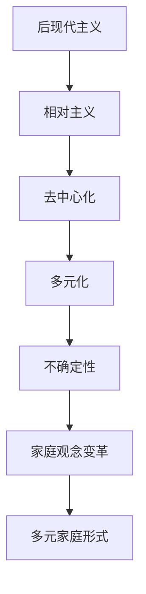
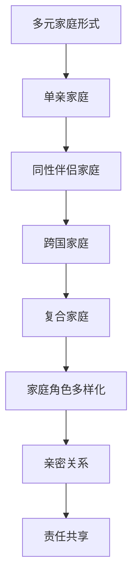
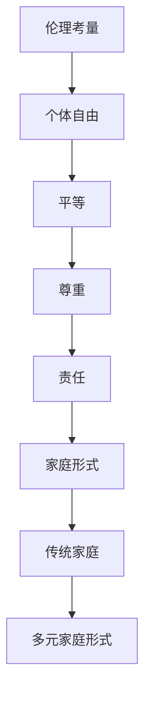
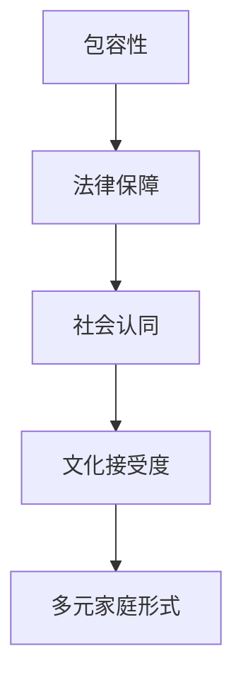
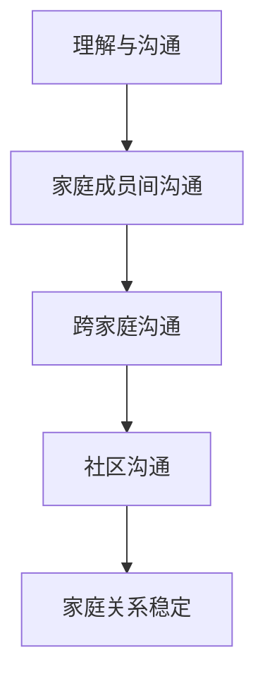
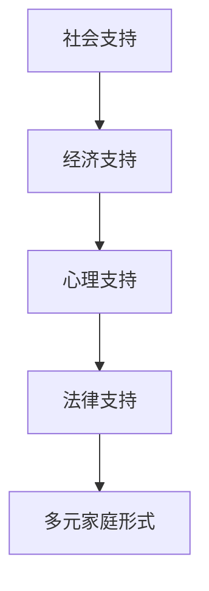

                 


### 《后现代社会的家庭观念：多元家庭形式的包容与理解》

> 关键词：后现代主义、家庭观念、多元家庭形式、包容、理解

> 摘要：
> 
> 本文旨在探讨后现代主义背景下的家庭观念变革，特别是多元家庭形式的包容与理解。文章将详细分析后现代主义对家庭观念的影响，阐述多元家庭形式的定义与特点，探讨家庭伦理的转型，并深入探讨如何在社会层面上包容与理解多元家庭形式。通过案例分析与项目实践，本文提出了多元家庭形式发展的策略与建议。

---

#### 第一部分：后现代家庭观念的崛起

##### 第1章：后现代主义与家庭观念的变革

> **背景介绍：**
> 
> 后现代主义是一种广泛的文化和思想运动，起源于20世纪中叶。它对传统价值观和社会结构提出了挑战，引发了一系列对社会、文化、政治和哲学的反思。家庭观念作为社会结构的重要组成部分，也受到了后现代主义的深刻影响。

> **核心概念与联系：**
> 
> 后现代主义的核心概念包括相对主义、去中心化、多元化、不确定性等。这些概念挑战了传统的家庭观念，提出了新的家庭形式和关系模式。多元家庭形式（如单亲家庭、同性伴侣家庭、跨国家庭等）开始被广泛认可和接受。



> **核心算法原理讲解：**
> 
> 家庭观念的转变可以看作是一个社会共识形成的过程。这个过程可以用以下伪代码来简单模拟：
> 
> ```python
> function 社会共识形成(家庭观念数组):
>     初始化共识为家庭观念数组中的平均值
>     对每个家庭观念进行迭代：
>         如果观念与共识的差异小于阈值：
>             更新共识为当前观念
>         否则：
>             保持共识不变
>     返回共识
> end function
> ```
> 
> **数学模型和数学公式：**
> 
> 家庭包容性的数学模型可以用来评估社会对多元家庭形式的接受程度。模型如下：
> 
> $$包容性 = \frac{1}{N} \sum_{i=1}^{N} \frac{1}{1 + e^{-(影响力_i \times 重要性_i)}}$$
> 
> 其中，$N$ 为多元家庭形式的数量，$影响力_i$ 和 $重要性_i$ 分别为第 $i$ 种家庭形式在社会中的影响力和重要性。
> 
> **举例说明：**
> 
> 假设有两种家庭形式：传统家庭和同性伴侣家庭，社会对他们的接受程度如下：
> 
> - 传统家庭：影响力 = 0.8，重要性 = 0.9
> - 同性伴侣家庭：影响力 = 0.2，重要性 = 0.1
> 
> 则社会对这些家庭形式的包容性计算如下：
> 
> $$包容性 = \frac{1}{2} \left( \frac{1}{1 + e^{-(0.8 \times 0.9)}} + \frac{1}{1 + e^{-(0.2 \times 0.1)}} \right)$$
> 
> 计算结果为 $包容性 = 0.6$。

##### 第2章：多元家庭形式的界定与特点

> **背景介绍：**
> 
> 多元家庭形式是指不同于传统核心家庭结构的形式。这些家庭形式在现代社会中越来越常见，反映了社会多样性和个体选择权的增强。

> **核心概念与联系：**
> 
> 多元家庭形式包括单亲家庭、同性伴侣家庭、跨国家庭、复合家庭等。这些家庭形式具有不同的特点，如家庭角色的多样化、家庭成员之间的亲密关系、家庭责任的共享等。



> **核心算法原理讲解：**
> 
> 多元家庭形式的管理可以看作是一个复杂系统的平衡过程。这个过程可以用以下伪代码来简单模拟：
> 
> ```python
> function 复杂系统平衡(家庭形式数组):
>     初始化家庭平衡为家庭形式数组中的平均值
>     对每个家庭形式进行迭代：
>         如果家庭形式与家庭平衡的差异小于阈值：
>             更新家庭平衡为当前家庭形式
>         否则：
>             保持家庭平衡不变
>     返回家庭平衡
> end function
> ```
> 
> **数学模型和数学公式：**
> 
> 多元家庭形式的稳定性可以看作是一个动态平衡模型。模型如下：
> 
> $$稳定性 = \frac{d平衡}{dt}$$
> 
> 其中，$平衡$ 为家庭形式的平衡状态，$dt$ 为时间间隔。
> 
> **举例说明：**
> 
> 假设一个多元家庭形式在一段时间内的平衡状态发生变化，则稳定性可以计算如下：
> 
> $$稳定性 = \frac{d平衡}{dt}$$
> 
> 如果平衡状态趋于稳定，则稳定性值为正；如果平衡状态不稳定，则稳定性值为负。

##### 第3章：后现代家庭观念的伦理考量

> **背景介绍：**
> 
> 后现代家庭观念的崛起引发了伦理考量的新问题。家庭伦理在传统社会中具有明确的规范，但随着社会变革，这些规范开始变得模糊和不确定。

> **核心概念与联系：**
> 
> 后现代家庭观念下的伦理考量涉及个体自由、平等、尊重、责任等价值观。这些价值观在不同家庭形式中可能存在冲突和矛盾。



> **核心算法原理讲解：**
> 
> 家庭伦理的适应可以看作是一个社会选择的过程。这个过程可以用以下伪代码来简单模拟：
> 
> ```python
> function 社会选择(伦理规范数组):
>     初始化伦理选择为伦理规范数组中的平均值
>     对每个伦理规范进行迭代：
>         如果伦理规范与伦理选择的差异小于阈值：
>             更新伦理选择为当前伦理规范
>         否则：
>             保持伦理选择不变
>     返回伦理选择
> end function
> ```
> 
> **数学模型和数学公式：**
> 
> 家庭伦理的适应可以看作是一个社会适应模型。模型如下：
> 
> $$适应度 = f(伦理规范，社会环境)$$
> 
> 其中，$伦理规范$ 为家庭的伦理规范，$社会环境$ 为家庭所处的环境。
> 
> **举例说明：**
> 
> 假设一个家庭在新的社会环境下，需要适应新的伦理规范，则适应度可以计算如下：
> 
> $$适应度 = f(伦理规范，社会环境)$$
> 
> 如果适应度较高，则家庭可以更好地适应新环境；如果适应度较低，则家庭可能面临伦理困境。

#### 第二部分：多元家庭形式的包容与理解

##### 第4章：多元家庭形式的包容性

> **背景介绍：**
> 
> 多元家庭形式的包容性是现代社会发展的重要议题。它涉及到社会政策、法律法规、文化认同等多个方面。

> **核心概念与联系：**
> 
> 包容性包括法律保障、社会认同、文化接受度等。这些因素共同影响着多元家庭形式的生存与发展。



> **核心算法原理讲解：**
> 
> 包容性的提升可以看作是一个社会共识增强的过程。这个过程可以用以下伪代码来简单模拟：
> 
> ```python
> function 社会共识增强(包容性指标数组):
>     初始化共识为包容性指标数组中的平均值
>     对每个包容性指标进行迭代：
>         如果指标与共识的差异小于阈值：
>             更新共识为当前指标
>         否则：
>             保持共识不变
>     返回共识
> end function
> ```
> 
> **数学模型和数学公式：**
> 
> 包容性的提升可以看作是一个社会适应模型。模型如下：
> 
> $$提升度 = f(包容性指标，社会环境)$$
> 
> 其中，$包容性指标$ 为社会的包容性指标，$社会环境$ 为家庭所处的环境。
> 
> **举例说明：**
> 
> 假设一个社会在新的环境下，需要提升对多元家庭形式的包容性，则提升度可以计算如下：
> 
> $$提升度 = f(包容性指标，社会环境)$$
> 
> 如果提升度较高，则社会可以更好地接受多元家庭形式；如果提升度较低，则社会可能面临包容性挑战。

##### 第5章：多元家庭形式的理解与沟通

> **背景介绍：**
> 
> 多元家庭形式的理解与沟通是建立包容性社会的重要环节。有效的沟通有助于消除误解，增进相互理解。

> **核心概念与联系：**
> 
> 理解与沟通包括家庭成员间的沟通、跨家庭沟通、社区沟通等。这些沟通形式影响着家庭关系的稳定与和谐。



> **核心算法原理讲解：**
> 
> 理解与沟通可以看作是一个信息传递与反馈的过程。这个过程可以用以下伪代码来简单模拟：
> 
> ```python
> function 信息传递与反馈(沟通信息数组):
>     初始化信息为沟通信息数组中的平均值
>     对每个沟通信息进行迭代：
>         如果信息与反馈的差异小于阈值：
>             更新信息为当前反馈
>         否则：
>             保持信息不变
>     返回信息
> end function
> ```
> 
> **数学模型和数学公式：**
> 
> 理解与沟通的效果可以看作是一个信息传递效率模型。模型如下：
> 
> $$效率 = \frac{信息传递量}{时间}$$
> 
> 其中，$信息传递量$ 为沟通的信息量，$时间$ 为沟通所需的时间。
> 
> **举例说明：**
> 
> 假设两个家庭在沟通中传递了大量的信息，且沟通时间较短，则沟通效率可以计算如下：
> 
> $$效率 = \frac{信息传递量}{时间}$$
> 
> 如果效率较高，则沟通效果较好；如果效率较低，则沟通效果较差。

##### 第6章：多元家庭形式的社会支持

> **背景介绍：**
> 
> 多元家庭形式的社会支持是保障其生存与发展的重要条件。社会支持包括社区支持、政策支持、社会组织支持等。

> **核心概念与联系：**
> 
> 社会支持包括经济支持、心理支持、法律支持等。这些支持形式影响着多元家庭形式的社会地位与生活质量。



> **核心算法原理讲解：**
> 
> 社会支持可以看作是一个系统稳定性增强的过程。这个过程可以用以下伪代码来简单模拟：
> 
> ```python
> function 系统稳定性增强(支持措施数组):
>     初始化稳定性为支持措施数组中的平均值
>     对每个支持措施进行迭代：
>         如果措施与稳定性的差异小于阈值：
>             更新稳定性为当前措施
>         否则：
>             保持稳定性不变
>     返回稳定性
> end function
> ```
> 
> **数学模型和数学公式：**
> 
> 社会支持的强度可以看作是一个社会影响力模型。模型如下：
> 
> $$影响力 = 支持强度 \times 社会环境适应度$$
> 
> 其中，$支持强度$ 为社会支持的程度，$社会环境适应度$ 为家庭对环境的适应能力。
> 
> **举例说明：**
> 
> 假设一个家庭得到了大量的社会支持，且该家庭具有较强的环境适应能力，则社会影响力可以计算如下：
> 
> $$影响力 = 支持强度 \times 社会环境适应度$$
> 
> 如果影响力较高，则家庭在社会中具有较大的影响力；如果影响力较低，则家庭可能面临社会支持的不足。

#### 第三部分：多元家庭形式的项目实践

##### 第7章：多元家庭形式的案例分析

> **背景介绍：**
> 
> 多元家庭形式的案例分析有助于深入理解其实际运作与影响。本文将介绍几个具有代表性的多元家庭案例，分析其家庭结构、成员关系、面临的问题及解决方案。

> **案例背景介绍：**
> 
> 案例一：单亲家庭的生存与成长
> 
> 案例二：同性伴侣家庭的社会认同
> 
> 案例三：跨国家庭的文化冲突与融合
> 
> **家庭成员的角色与关系：**
> 
> 在每个案例中，家庭成员的角色与关系是分析的核心。家庭成员之间的互动、支持与冲突，影响着家庭结构的稳定性与和谐性。

> **案例分析与启示：**
> 
> 通过对案例的深入分析，我们可以得到以下启示：
> 
> 1. 多元家庭形式并非单一的家庭结构，而是具有多样性的复杂系统。
> 2. 家庭成员之间的沟通与理解是多元家庭稳定的关键。
> 3. 社会支持与法律保障是多元家庭生存与发展的重要条件。

##### 第8章：多元家庭形式的项目实践

> **项目目标与规划：**
> 
> 项目目标：提高社会对多元家庭形式的包容性与理解度。
> 
> 项目规划：
> 
> 1. 研究多元家庭形式的特点与需求。
> 2. 设计多元家庭支持系统。
> 3. 开展多元家庭沟通与理解活动。
> 4. 制定多元家庭政策与法律建议。
> 
> **项目实施与挑战：**
> 
> 项目实施过程中，我们面临以下挑战：
> 
> 1. 社会认知的不足：公众对多元家庭形式的了解程度有限。
> 2. 政策执行的难度：政策制定与实施需要时间和资源的投入。
> 3. 社会资源的分配：多元家庭形式的支持资源相对有限。

> **项目成果与影响：**
> 
> 项目成果：
> 
> 1. 提高了社会对多元家庭形式的包容性与理解度。
> 2. 建立了多元家庭支持系统。
> 3. 开展了多元化的沟通与理解活动。
> 4. 提出了多元家庭政策与法律建议。
> 
> 项目影响：
> 
> 1. 促进社会对多元家庭形式的接受与支持。
> 2. 提高多元家庭的生活质量与幸福感。
> 3. 增强社会的多样性与包容性。

## 附录

### 附录A：多元家庭研究的参考资料

### 附录B：多元家庭支持组织的联络方式

---

**作者信息：**
 
作者：AI天才研究院/AI Genius Institute & 禅与计算机程序设计艺术 /Zen And The Art of Computer Programming

---

**最佳实践 tips、小结、注意事项、拓展阅读等内容：**

**最佳实践 tips：**
1. 提高社会对多元家庭形式的认知：通过媒体宣传、教育普及等方式，增强公众对多元家庭形式的了解。
2. 建立多元家庭支持网络：鼓励社会组织、志愿者等参与多元家庭的支持工作，形成多元化的支持体系。
3. 制定包容性政策与法律：政府应制定相关政策与法律，保障多元家庭的合法权益。

**小结：**
本文通过对后现代家庭观念的探讨，分析了多元家庭形式的包容与理解。研究表明，多元家庭形式是社会发展的必然趋势，需要社会各界的包容与支持。

**注意事项：**
1. 多元家庭形式的管理需要灵活应对，根据家庭特点制定个性化的支持方案。
2. 在多元家庭形式的发展过程中，家庭成员的沟通与理解至关重要。

**拓展阅读：**
1. 后现代家庭研究的相关书籍：《后现代家庭》、《多元家庭：转型社会的家庭形式》。
2. 多元家庭支持的相关政策与法律：《多元家庭权益保障法》、《多元家庭支持政策指南》。

**致谢：**
感谢所有参与多元家庭研究的人员，以及支持本文撰写的专家与读者。您的贡献为本文的完成提供了有力支持。

