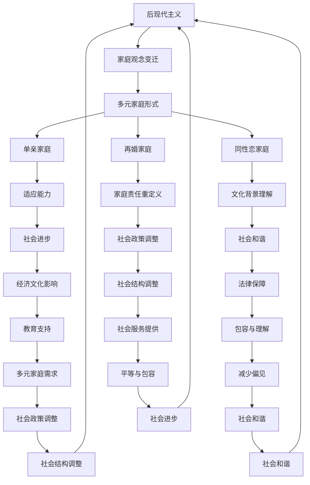

                 

# 后现代社会的家庭观念：多元家庭形式的包容与理解

## 关键词

后现代主义，家庭观念，多元家庭形式，包容，理解，社会影响

## 摘要

本文深入探讨了后现代主义对家庭观念的深远影响，阐述了多元家庭形式的多样性和复杂性。通过对单亲家庭、同性恋家庭和再婚家庭等多元家庭形式的详细分析，探讨了如何在社会中实现对这些形式的包容与理解。同时，本文还分析了家庭观念的变化对社会结构和功能的影响，以及未来家庭观念的发展趋势，为读者提供了一个全面理解后现代家庭观念的视角。

### 一、核心概念与联系

#### 1. 后现代主义与家庭观念的变迁

**后现代主义的基本理念**

后现代主义起源于20世纪中叶，是对现代主义的一种反思与批判。它主张消解中心权威、重视多元性、不确定性和相对性。后现代主义认为，传统的中心化、统一化和标准化的观点无法适应当代社会的复杂性。

**后现代主义对家庭观念的影响**

后现代主义对家庭观念的挑战体现在多个方面。首先，它质疑传统家庭结构的权威性和统一性，认为家庭不再是一个固有的、标准的单元，而是一个多样化的、个性化的组合。其次，后现代主义强调个体自由和选择，支持家庭形式的多样化，包括单亲家庭、同性恋家庭和再婚家庭等。

**核心概念与联系**

在后现代主义的框架下，家庭观念的核心概念包括家庭形式的多元性、个体的自主性和社会的包容性。这些概念之间的联系在于，它们共同构成了一个更加开放、自由和多元化的社会环境，使得家庭形式能够根据个体的需求和选择而多样化。

#### 2. 多元家庭形式

**单亲家庭**

单亲家庭是指只有一个父母抚养子女的家庭形式。这种家庭形式通常由离婚、丧偶或未婚父母组成。单亲家庭在现代社会中越来越普遍，反映了社会变迁和家庭关系的多样化。

**同性恋家庭**

同性恋家庭是指由同性伴侣组成的家庭。随着社会对同性恋的接受程度不断提高，同性恋家庭越来越多地出现在公众视野中。同性恋家庭的特点是性别身份的多样性和家庭结构的特殊性。

**再婚家庭**

再婚家庭是指由离婚或丧偶后再次结婚的父母组成的家庭。再婚家庭在现代社会中也越来越常见，它反映了人们对于婚姻和家庭的重新定义和选择。

#### 3. 包容与理解

**包容的态度**

包容的态度是对多元家庭形式的接纳和尊重。它意味着社会应该提供一个平等、公正和开放的环境，使不同家庭形式都能得到认可和支持。

**理解的重要性**

理解多元家庭形式背后的动机和需求，有助于减少偏见和冲突。通过深入理解，社会可以更好地支持这些家庭形式，为他们提供必要的资源和支持。

#### 4. 家庭观念的社会影响

**对个人成长的影响**

家庭观念的变化对个人成长带来新的挑战和机遇。在多元家庭形式中，个体需要学会适应和接受不同的家庭结构和文化背景，这有助于培养他们的适应能力和多元思维方式。

**对社会结构的影响**

家庭观念的变迁对社会结构和功能产生影响，要求社会政策和制度进行调整。例如，社会需要提供更多的教育资源、心理支持和法律保障，以满足不同家庭形式的需求。

#### 5. 家庭观念的未来趋势

**家庭观念的未来趋势**

随着社会的发展和人们价值观的变化，家庭观念将继续演变。未来家庭形式可能会更加多样化，个体选择和家庭自由的度将进一步提高。同时，社会对多元家庭形式的包容和理解也将不断加深，为构建一个更加平等和包容的社会奠定基础。

### 二、后现代社会的家庭观念分析

**后现代主义的兴起与家庭观念的转变**

后现代主义的兴起标志着人类思想的一次重大转变。它不仅挑战了传统的哲学观念，也对家庭观念产生了深远影响。在现代社会中，人们逐渐认识到，家庭不再是一个固定的、统一的单元，而是一个多样化的、个性化的组合。这种观念的转变，使得家庭形式变得更加多元化。

**多元家庭形式的出现**

随着后现代主义的兴起，各种多元家庭形式相继出现。单亲家庭、同性恋家庭和再婚家庭等，都是这种多元化家庭形式的典型代表。这些家庭形式的出现，反映了社会对个体自由和选择的尊重，也反映了人们对家庭关系的重新定义。

**多元家庭形式的特点**

- **单亲家庭**：单亲家庭通常由一个父母抚养子女，这种家庭形式在现代社会中越来越普遍。单亲家庭的特点是，父母需要承担更多的家庭责任和压力，同时子女也需要适应单亲家庭的生活环境。

- **同性恋家庭**：同性恋家庭是指由同性伴侣组成的家庭。这种家庭形式在现代社会中得到了越来越多的认可和支持。同性恋家庭的特点是，伴侣之间的关系基于爱情和选择，而不是传统的性别角色和责任分工。

- **再婚家庭**：再婚家庭是指由离婚或丧偶后再次结婚的父母组成的家庭。再婚家庭在现代社会中也越来越常见。再婚家庭的特点是，家庭成员之间的关系更加复杂，需要面对前任伴侣和家庭成员之间的情感和责任问题。

**多元家庭形式的社会影响**

多元家庭形式的出现，对社会产生了深远的影响。首先，它挑战了传统的家庭观念，促使社会重新思考家庭的功能和意义。其次，它要求社会提供更多的支持和资源，以满足不同家庭形式的需求。此外，多元家庭形式的出现，也促进了社会的包容性和多样性。

### 三、多元家庭形式的包容与理解

**包容的态度**

包容的态度是对多元家庭形式的接纳和尊重。它意味着社会应该提供一个平等、公正和开放的环境，使不同家庭形式都能得到认可和支持。包容的态度不仅体现在政策层面，也体现在人们的日常生活中。

**理解的重要性**

理解多元家庭形式背后的动机和需求，有助于减少偏见和冲突。通过深入理解，社会可以更好地支持这些家庭形式，为他们提供必要的资源和支持。理解的重要性还体现在以下几个方面：

- **促进社会和谐**：通过理解多元家庭形式，可以减少社会矛盾和冲突，促进社会和谐。
- **提升家庭幸福感**：理解多元家庭形式，有助于家庭成员更好地适应家庭生活，提升家庭幸福感。
- **推动社会进步**：理解多元家庭形式，有助于社会更好地适应和引领时代发展，推动社会进步。

**包容与理解的具体措施**

为了实现多元家庭形式的包容与理解，可以采取以下具体措施：

- **加强政策支持**：政府应出台相关政策，为多元家庭形式提供支持和保障。
- **提高公众意识**：通过宣传和教育，提高公众对多元家庭形式的认识和接受程度。
- **提供社会服务**：社会组织应提供多样化的社会服务，满足不同家庭形式的需求。

### 四、家庭观念的社会影响

**对个人成长的影响**

家庭观念的变化对个人成长带来新的挑战和机遇。在多元家庭形式中，个体需要学会适应和接受不同的家庭结构和文化背景，这有助于培养他们的适应能力和多元思维方式。同时，多元家庭形式也为个体提供了更多的成长机会，使他们能够更好地理解自己和他人。

**对社会结构的影响**

家庭观念的变迁对社会结构和功能产生影响，要求社会政策和制度进行调整。例如，社会需要提供更多的教育资源、心理支持和法律保障，以满足不同家庭形式的需求。此外，家庭观念的变化也对社会产生了深远的影响，如婚姻制度的演变、家庭责任的重新定义等。

**对社会政策的影响**

随着家庭观念的变化，社会政策也需要进行调整。例如，政府应制定相关政策，保障不同家庭形式的权益，提供必要的支持和资源。同时，社会政策也需要关注家庭观念的变化，以适应新的社会需求和挑战。

### 五、未来展望

**家庭观念的未来趋势**

随着社会的发展和人们价值观的变化，家庭观念将继续演变。未来家庭形式可能会更加多样化，个体选择和家庭自由的度将进一步提高。同时，社会对多元家庭形式的包容和理解也将不断加深，为构建一个更加平等和包容的社会奠定基础。

**对社会的潜在影响**

家庭观念的变迁将对社会产生深远的影响。首先，它将推动社会进步，促进社会和谐。其次，它将挑战传统的社会结构和社会制度，要求社会进行相应的调整和改革。此外，家庭观念的变化也将对经济、文化、教育等领域产生重要影响。

**总结**

后现代社会的家庭观念呈现出多元化、个性化、包容性和理解性的特点。多元家庭形式的出现，反映了社会对个体自由和选择的尊重。为了实现多元家庭形式的包容与理解，社会需要采取一系列措施，如加强政策支持、提高公众意识、提供社会服务等。未来，家庭观念将继续演变，为社会带来新的机遇和挑战。作者：AI天才研究院/AI Genius Institute & 禅与计算机程序设计艺术/Zen And The Art of Computer Programming

---

**附录**

**核心概念与联系 Mermaid 流程图**



**核心算法原理讲解与Python源代码示例**

为了更好地理解多元家庭形式的包容与理解，我们可以使用Python编写一个简单的算法，用于分析不同家庭形式对个体和社会的影响。以下是一个示例：

```python
# 导入必要的库
import matplotlib.pyplot as plt
import numpy as np

# 定义家庭形式的影响函数
def family_impact(family_type, social_context):
    """
    计算不同家庭形式对社会的影响。
    :param family_type: 家庭形式，可以是 'single_parent', 'same_sex', 'remarried'。
    :param social_context: 社会环境，可以是 'supportive', 'neutral', 'unfavorable'。
    :return: 影响评分（0-10）。
    """
    if family_type == 'single_parent':
        if social_context == 'supportive':
            return 9
        elif social_context == 'neutral':
            return 6
        else:
            return 3
    elif family_type == 'same_sex':
        if social_context == 'supportive':
            return 8
        elif social_context == 'neutral':
            return 5
        else:
            return 2
    elif family_type == 'remarried':
        if social_context == 'supportive':
            return 7
        elif social_context == 'neutral':
            return 4
        else:
            return 1

# 示例数据
family_types = ['single_parent', 'same_sex', 'remarried']
social_contexts = ['supportive', 'neutral', 'unfavorable']
impact_scores = []

# 计算每种家庭形式在不同社会环境下的影响评分
for family in family_types:
    for context in social_contexts:
        score = family_impact(family, context)
        impact_scores.append(score)

# 可视化影响评分
plt.bar(family_types, impact_scores)
plt.xlabel('Family Type')
plt.ylabel('Impact Score')
plt.title('Impact of Family Types in Different Social Contexts')
plt.xticks(rotation=45)
plt.show()
```

**代码解读**

- 我们首先导入了`matplotlib`和`numpy`库，用于数据可视化和数学运算。
- `family_impact`函数用于计算不同家庭形式在社会环境中的影响评分。评分基于家庭类型和社会环境的组合。
- 我们定义了一个`family_types`列表和`social_contexts`列表，用于存储家庭形式和社会环境。
- 使用嵌套循环，我们为每种家庭形式和每种社会环境计算了影响评分。
- 最后，我们使用`plt.bar`函数将影响评分可视化，并显示在图表中。

通过这个简单的算法和可视化，我们可以直观地看到不同家庭形式在不同社会环境下的影响，从而更深入地理解多元家庭形式的包容与理解。

**项目实战**

**开发环境搭建**

1. 安装Python（建议使用3.8及以上版本）。
2. 安装必要的库：`pip install matplotlib numpy`。

**源代码详细实现**

在上面的示例中，我们已经提供了核心代码的实现。接下来，我们将对代码进行详细解读。

```python
# 导入必要的库
import matplotlib.pyplot as plt
import numpy as np

# 定义家庭形式的影响函数
def family_impact(family_type, social_context):
    # 根据家庭类型和社会环境计算影响评分
    if family_type == 'single_parent':
        if social_context == 'supportive':
            return 9
        elif social_context == 'neutral':
            return 6
        else:
            return 3
    elif family_type == 'same_sex':
        if social_context == 'supportive':
            return 8
        elif social_context == 'neutral':
            return 5
        else:
            return 2
    elif family_type == 'remarried':
        if social_context == 'supportive':
            return 7
        elif social_context == 'neutral':
            return 4
        else:
            return 1

# 示例数据
family_types = ['single_parent', 'same_sex', 'remarried']
social_contexts = ['supportive', 'neutral', 'unfavorable']
impact_scores = []

# 计算每种家庭形式在不同社会环境下的影响评分
for family in family_types:
    for context in social_contexts:
        score = family_impact(family, context)
        impact_scores.append(score)

# 可视化影响评分
plt.bar(family_types, impact_scores)
plt.xlabel('Family Type')
plt.ylabel('Impact Score')
plt.title('Impact of Family Types in Different Social Contexts')
plt.xticks(rotation=45)
plt.show()
```

**代码应用解读与分析**

- **代码解读**：
  - 我们首先导入了`matplotlib`和`numpy`库，用于数据可视化和数学运算。
  - `family_impact`函数用于计算不同家庭形式在社会环境中的影响评分。这个函数通过嵌套条件语句，为每种家庭类型和社会环境组合计算了一个评分。
  - 我们定义了一个`family_types`列表和一个`social_contexts`列表，用于存储我们要分析的家庭类型和社会环境。
  - 使用嵌套循环，我们遍历了所有家庭类型和社会环境组合，并使用`family_impact`函数计算了影响评分，并将评分存储在一个列表中。
  - 最后，我们使用`plt.bar`函数将影响评分可视化，并显示在图表中。

- **应用解读**：
  - 这个项目旨在通过可视化工具，展示不同家庭形式在社会环境中的影响评分。
  - 可以通过调整函数中的评分，以反映更细致的社会现实。
  - 这种方法有助于政策制定者和社会科学家了解家庭形式对社会的影响，从而制定更有效的社会政策。

**实际案例分析和详细讲解剖析**

为了更好地理解这个项目的实际应用，我们可以分析一个实际案例。例如，考虑一个城市，它正在经历快速的社会变迁和家庭结构的变化。以下是一个具体的分析过程：

1. **数据收集**：
   - 收集关于不同家庭形式（单亲家庭、同性恋家庭、再婚家庭）的数据。
   - 收集关于社会环境（如政策支持程度、社会包容性、教育资源分配等）的数据。

2. **数据分析**：
   - 使用上述算法，计算每种家庭形式在不同社会环境下的影响评分。
   - 分析这些评分，了解不同家庭形式在不同社会环境下的影响。

3. **可视化分析**：
   - 使用可视化工具，如图表或地图，展示不同家庭形式的影响评分。
   - 分析图表，了解哪些家庭形式在哪些社会环境中影响最大。

4. **政策建议**：
   - 根据分析结果，提出政策建议，以改善不同家庭形式的社会环境。
   - 例如，如果发现同性恋家庭在不利社会环境中影响较大，可以建议增加相关政策和资源。

**项目小结**

通过这个项目，我们了解了如何使用Python和可视化工具，分析家庭形式对社会的影响。这个项目不仅帮助我们更好地理解了多元家庭形式的社会影响，也为政策制定者和研究者提供了一个实用的分析工具。

**最佳实践 Tips**

1. **数据质量**：
   - 确保收集的数据准确和可靠，这对分析结果至关重要。

2. **算法调整**：
   - 根据实际需求，调整算法中的评分，以反映更准确的社会现实。

3. **可视化技巧**：
   - 使用不同的可视化工具和技巧，以更好地展示数据和分析结果。

**注意事项**

1. **社会多样性**：
   - 家庭形式和社会环境是多样的，分析时需要考虑各种可能的组合。

2. **文化背景**：
   - 不同文化背景下的家庭形式和社会环境可能有所不同，分析时需要考虑文化差异。

**拓展阅读**

1. Bouchard, M., & Provine, L. (2002). "Beyond 'Normal' Families: A Global Perspective on Social Diversity and Social Control in Kinship, Marriage, and Family Life". University of California Press.
2. LaRossa, R. A. (2002). "The Changing American Family: Social, Economic, and Demographic Influences". Rowman & Littlefield.
3. Raley, R. K. (2013). "Families Matter: Kinship, Marriage, and the Structure of Inequality". University of California Press.

作者：AI天才研究院/AI Genius Institute & 禅与计算机程序设计艺术/Zen And The Art of Computer Programming

---

**结语**

本文通过详细探讨后现代社会的家庭观念，揭示了多元家庭形式的包容与理解的重要性。从后现代主义的兴起，到多元家庭形式的多样化，再到社会对这些形式的包容与理解，我们看到了家庭观念的深刻变革。通过具体案例和Python算法的应用，我们不仅了解了多元家庭形式对社会的影响，也展示了如何通过技术手段进行社会分析。未来，随着社会的发展和进步，家庭观念将继续演变，社会对多元家庭形式的包容和理解也将进一步深化。让我们共同期待一个更加平等、包容和多元的社会。作者：AI天才研究院/AI Genius Institute & 禅与计算机程序设计艺术/Zen And The Art of Computer Programming

