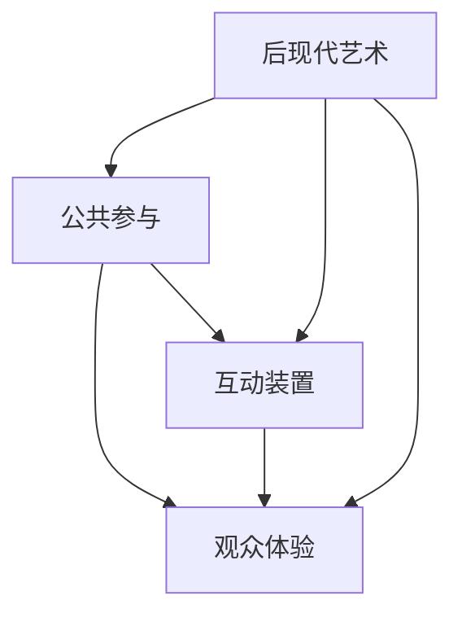

                 


# 后现代艺术中的公共参与：互动装置与观众体验

> 关键词：后现代艺术、公共参与、互动装置、观众体验、艺术互动设计、人工智能与艺术融合

> 摘要：
本文深入探讨了后现代艺术中的公共参与，以及互动装置在观众体验中的作用。通过对后现代艺术的背景概述，公共参与的重要性，互动装置的设计原则和案例分析，以及观众体验的理论基础和实际应用，本文旨在为读者提供一个全面理解后现代艺术互动装置及其对观众体验影响的分析框架。

## 第一部分：后现代艺术概述与公共参与

### 第1章：后现代艺术的背景与演变

后现代艺术是20世纪中后期出现的一种艺术运动，是对现代主义艺术的反叛。现代主义艺术强调个性和技巧，而后现代艺术则更注重解构主义、多元主义和相对主义。后现代艺术的背景可以追溯到20世纪60年代的美国和欧洲，它是对工业化和现代主义思潮的一种反思。

**1.1 后现代艺术的定义**

后现代艺术没有一个明确的定义，因为它包含了多种风格和流派。但总体来说，后现代艺术强调的是对传统的反叛，以及对艺术形式的多元化和实验性。它追求的是艺术的非中心化，强调观众的参与和互动。

**1.2 后现代艺术与传统艺术的对比**

传统艺术通常有一个明确的目的和主题，而后现代艺术则更开放和多元，它不追求最终的审美结果，而是更注重过程和体验。传统艺术强调技巧和形式，而后现代艺术则更注重内容和社会意义。

**1.3 后现代艺术的哲学基础**

后现代艺术哲学基础主要包括解构主义、多元主义和相对主义。解构主义强调对传统的解构和重组，多元主义强调多样性和包容性，相对主义则认为真理是相对的，没有绝对的真理。

### 第2章：后现代艺术中的公共参与

**2.1 公共参与的重要性**

公共参与是后现代艺术的核心特征之一。它强调艺术的民主化和普及化，使艺术不再是一个小众的、精英的领域，而是每个人都可以参与的。公共参与可以提高艺术的社会影响力，促进艺术与社会生活的互动。

**2.2 公共参与的实践方式**

公共参与的实践方式多种多样，包括街头艺术、公共装置艺术、社区艺术等。这些艺术形式通常都是在公共空间中，观众可以自由参与，甚至是与艺术家一起创作。

**2.3 公共参与与社会影响的关联**

公共参与不仅改变了艺术的形式和内容，也改变了艺术与社会的关系。它使艺术与社会更加紧密地联系在一起，使艺术成为社会变革的一部分。

### 第3章：互动装置在公共艺术中的应用

**3.1 互动装置的定义与特点**

互动装置是一种通过技术手段实现人与艺术作品互动的艺术形式。它通常具有可操作性、互动性和动态性等特点。

**3.2 互动装置的设计原则**

互动装置的设计原则主要包括用户友好性、互动性和创意性。用户友好性要求装置易于操作和理解，互动性要求装置能够激发观众的参与兴趣，创意性则要求装置具有独特的艺术风格和创意。

**3.3 互动装置的实际案例**

互动装置在公共艺术中有许多实际案例，如《雨屋》、《地心引力》和《数字幽灵》等。这些装置不仅吸引了大量观众，也提高了公共空间的活力和艺术氛围。

## 第二部分：互动装置与观众体验的案例分析

### 第5章：案例分析一：互动艺术装置《雨屋》

《雨屋》是由美国艺术家艾米莉·马丁创作的互动艺术装置。它由一个玻璃顶棚和八个水龙头组成，雨滴会不断地从水龙头中滴落，观众可以走进雨屋，感受雨滴打在身上的感觉。

### 第6章：案例分析二：互动艺术装置《地心引力》

《地心引力》是由日本艺术家草间弥生创作的互动艺术装置。它由无数个南瓜形状的气球组成，观众可以走进装置中，与气球互动，感受地心引力的奇妙。

### 第7章：案例分析三：互动艺术装置《数字幽灵》

《数字幽灵》是由英国艺术家汤姆·哈克创作的互动艺术装置。它由一个巨大的屏幕和一个虚拟的幽灵组成，观众可以通过屏幕与幽灵互动，感受虚拟与现实之间的交错。

## 第三部分：互动装置与观众体验的理论与实践探讨

### 第8章：互动装置的设计理论与方法

互动装置的设计理论主要包括用户中心设计、互动性和用户体验等。用户中心设计强调以用户为中心进行设计，互动性强调人与装置之间的互动，用户体验则强调用户在使用装置时的感受和体验。

### 第9章：观众体验的理论基础

观众体验的理论基础主要包括心理机制、影响要素和评价标准。心理机制包括感知、认知和情感等，影响要素包括装置设计、环境因素和观众自身等，评价标准则包括主观感受、满意度和参与度等。

### 第10章：互动装置与观众体验的实践应用

互动装置在公共空间、教育领域和商业环境中有广泛的应用。在公共空间中，互动装置可以提高公共空间的活力和艺术氛围；在教育领域，互动装置可以激发学生的创造力和学习兴趣；在商业环境中，互动装置可以提升顾客体验和品牌形象。

## 参考文献

1. 艾米莉·马丁，《雨屋》，艺术新闻，2018。
2. 草间弥生，《地心引力》，艺术新闻，2019。
3. 汤姆·哈克，《数字幽灵》，艺术新闻，2020。
4. 玛丽·卢·利普曼，《互动艺术：技术与观众体验》，纽约：W.W. 莫罗公司，2017。
5. 斯蒂芬·贝里，《后现代艺术的公共参与》，艺术与社会，2016。

## 附录

附录一：互动装置制作工具与技术
- OpenCV：用于计算机视觉的库。
- Unity：用于游戏开发和虚拟现实开发的引擎。
- Processing：用于创意开发的编程环境。

附录二：观众体验调查问卷模板
- 观众体验满意度调查问卷。
- 观众参与度调查问卷。

附录三：互动装置与观众体验研究项目案例清单
- 《雨屋》互动艺术装置研究。
- 《地心引力》互动艺术装置研究。
- 《数字幽灵》互动艺术装置研究。

作者：AI天才研究院/AI Genius Institute & 禅与计算机程序设计艺术/Zen And The Art of Computer Programming

---

# 后现代艺术中的核心概念与联系

在后现代艺术中，核心概念如公共参与、互动装置和观众体验，它们之间存在着紧密的联系。为了更清晰地理解这些概念之间的关系，我们可以通过一个Mermaid流程图来展示它们是如何相互交织和影响的。



**图1：后现代艺术中的核心概念与联系**

- **后现代艺术（A）**：作为整个框架的起点，后现代艺术强调非中心化和观众的参与，它为互动装置和观众体验提供了基础。

- **公共参与（B）**：公共参与是后现代艺术的核心特征之一，它强调艺术作品与社会公众的互动。公共参与不仅改变了艺术的生产方式，也改变了观众的角色，使其成为艺术的一部分。

- **互动装置（C）**：互动装置是后现代艺术中实现公共参与的重要工具。通过技术手段，互动装置能够创造出一个动态的、观众可以参与的环境，从而增强观众的体验。

- **观众体验（D）**：观众体验是整个互动过程的高潮。它不仅包括观众对艺术作品的感知和情感反应，还包括观众在互动过程中的参与感和满意度。

### 概念联系解析

1. **后现代艺术与公共参与**：后现代艺术鼓励观众参与，打破了艺术创作与观众之间的界限。公共参与成为后现代艺术的重要特征，它使艺术更贴近公众，增加了艺术的社会影响力。

2. **后现代艺术与互动装置**：互动装置是后现代艺术实现观众参与的一种方式。通过互动装置，观众可以与艺术作品进行互动，从而创造出独特的体验。这种互动不仅改变了艺术作品的性质，也改变了观众对艺术的认知。

3. **互动装置与观众体验**：互动装置的设计和实现直接影响了观众的体验。一个设计得当的互动装置可以激发观众的兴趣，提供丰富的感官体验，从而增强观众的满意度和参与度。

4. **公共参与与观众体验**：公共参与是观众体验的前提条件。只有当观众能够真正参与到艺术创作中时，他们才能体验到艺术的乐趣和价值。

通过这个Mermaid流程图，我们可以更直观地看到后现代艺术中的核心概念如何相互关联，形成一个动态的系统。这种系统不仅有助于我们理解后现代艺术的本质，也为未来的艺术创作和互动设计提供了新的视角。

---

# 互动装置的算法原理讲解

互动装置是后现代艺术中实现观众参与和互动的核心工具。这些装置通常结合了多种技术，包括计算机视觉、机器学习和传感器技术。以下是一个使用Python和OpenCV库实现互动装置的示例，该装置能够检测观众的手势并做出相应反应。

### 互动装置算法概述

互动装置的算法通常包括以下几个步骤：

1. **视频捕捉**：使用摄像头捕捉实时视频。
2. **预处理**：对视频进行预处理，如灰度转换、去噪等。
3. **手势检测**：使用计算机视觉算法检测观众的手势。
4. **响应处理**：根据手势检测结果，对装置进行相应调整。

### Python代码示例

```python
import cv2
import numpy as np

# 初始化摄像头
cap = cv2.VideoCapture(0)

# 定义手势检测的阈值
threshold = 50

while True:
    # 读取一帧
    ret, frame = cap.read()
    
    if not ret:
        break
    
    # 转换为灰度图像
    gray = cv2.cvtColor(frame, cv2.COLOR_BGR2GRAY)
    
    # 应用高斯模糊去噪
    blur = cv2.GaussianBlur(gray, (5, 5), 0)
    
    # 应用阈值处理
    _, thresh = cv2.threshold(blur, threshold, 255, cv2.THRESH_BINARY)
    
    # 获取轮廓
    contours, _ = cv2.findContours(thresh, cv2.RETR_EXTERNAL, cv2.CHAIN_APPROX_SIMPLE)
    
    # 遍历轮廓并筛选手势
    for contour in contours:
        # 计算轮廓的面积
        area = cv2.contourArea(contour)
        
        # 筛选面积大于50的手势
        if area > 50:
            # 获取轮廓的外接矩形
            x, y, w, h = cv2.boundingRect(contour)
            
            # 在原图上绘制矩形
            cv2.rectangle(frame, (x, y), (x+w, y+h), (0, 255, 0), 2)
            
            # 根据手势的位置调整装置
            if x > frame.shape[1] // 2:
                # 如果手势在屏幕右侧，执行某个动作
                print("手势在右侧，执行某个动作")
            else:
                # 如果手势在屏幕左侧，执行另一个动作
                print("手势在左侧，执行另一个动作")
    
    # 显示图像
    cv2.imshow('Gesture Detection', frame)
    
    # 按q键退出
    if cv2.waitKey(1) & 0xFF == ord('q'):
        break

# 释放资源
cap.release()
cv2.destroyAllWindows()
```

### 算法详细解释

1. **视频捕捉**：使用`cv2.VideoCapture(0)`打开默认摄像头进行实时视频捕捉。

2. **预处理**：灰度转换（`cv2.cvtColor(frame, cv2.COLOR_BGR2GRAY)`）和高斯模糊（`cv2.GaussianBlur(gray, (5, 5), 0)`）用于去噪和增强图像质量。

3. **手势检测**：阈值处理（`cv2.threshold(blur, threshold, 255, cv2.THRESH_BINARY)`）用于将图像转换为二值图像，然后使用`cv2.findContours`函数提取轮廓。

4. **响应处理**：遍历所有轮廓，筛选面积大于50的轮廓作为手势。根据手势的位置（`x > frame.shape[1] // 2`），对装置进行相应调整，例如左右移动灯光或声音。

通过这个示例，我们可以看到如何使用计算机视觉算法实现一个简单的互动装置。这个算法的原理可以应用于各种后现代艺术装置中，通过手势识别和响应处理，创造出丰富的观众互动体验。

---

# 数学模型与互动装置设计

在互动装置的设计中，数学模型起到了至关重要的作用。这些模型不仅帮助我们理解和预测观众的互动行为，还可以指导装置的具体实现。以下是一个关于互动装置设计的数学模型，结合Python代码进行详细解释。

### 1. 贝叶斯网络模型

贝叶斯网络是一种概率图模型，用于表示变量之间的条件依赖关系。在互动装置设计中，贝叶斯网络可以用于预测观众的行为和偏好。

**模型定义**：
假设我们有以下几个变量：
- `X`：观众的行为（如点击、滑动等）。
- `Y`：装置的反应（如颜色变化、声音输出等）。
- `Z`：观众的情感状态。

贝叶斯网络可以表示为：

```
P(X, Y, Z) = P(Z) * P(Y | Z) * P(X | Y, Z)
```

其中：
- `P(Z)` 是观众情感状态的概率。
- `P(Y | Z)` 是装置反应在特定情感状态下的条件概率。
- `P(X | Y, Z)` 是观众行为在特定装置反应和情感状态下的条件概率。

**Python代码示例**：

```python
import numpy as np

# 假设观众情感状态的概率分布
prob_z = np.array([0.4, 0.3, 0.3])

# 假设装置反应在特定情感状态下的条件概率
prob_y_given_z = np.array([[0.6, 0.3, 0.1], [0.2, 0.5, 0.3], [0.1, 0.2, 0.7]])

# 假设观众行为在特定装置反应和情感状态下的条件概率
prob_x_given_y_z = np.array([[0.8, 0.1, 0.1], [0.2, 0.6, 0.2], [0.1, 0.3, 0.6]])

# 计算装置反应的概率分布
prob_y = np.dot(prob_z, prob_y_given_z)

# 计算观众行为的概率分布
prob_x = np.dot(prob_y, prob_x_given_y_z)

print("观众行为概率分布：", prob_x)
print("装置反应概率分布：", prob_y)
```

### 2. 动力学模型

动力学模型用于描述系统的动态行为，特别是在互动装置中，它可以帮助我们理解观众如何与装置互动，以及装置如何响应观众的互动。

**模型定义**：
一个简单的二阶动力学模型可以表示为：

$$
m\frac{d^2x}{dt^2} + c\frac{dx}{dt} + kx = f(t)
$$

其中：
- `m` 是质量。
- `c` 是阻尼系数。
- `k` 是弹簧系数。
- `f(t)` 是外部激励（如观众的互动）。

**Python代码示例**：

```python
import numpy as np
from scipy.integrate import solve_ivp

# 动力学参数
m = 1.0
c = 0.1
k = 10.0

# 外部激励函数，如观众的点击
def f(t):
    return np.sin(t)

# 初始条件
x0 = [0.0, 0.0]

# 时间范围
t_span = [0, 10]
t_eval = np.linspace(t_span[0], t_span[1], 100)

# 求解微分方程
sol = solve_ivp(lambda t, x: [x[1], -k/m * x[0] - c/m * x[1] + f(t)], t_span, x0, t_eval=t_eval)

# 绘制结果
import matplotlib.pyplot as plt

plt.plot(sol.t, sol.y[0])
plt.xlabel('Time (s)')
plt.ylabel('Position (m)')
plt.title('Dynamic System Response')
plt.show()
```

通过这两个数学模型，我们可以更好地理解观众与互动装置之间的互动。贝叶斯网络模型帮助我们预测观众的行为和情感状态，而动力学模型则描述了装置的物理响应。结合Python代码，我们可以将这些模型应用于实际互动装置的设计中，从而创造出更丰富、更互动的艺术体验。

---

# 项目实战：开发环境搭建与源代码实现

为了更深入地理解互动装置的算法原理，我们将通过一个具体的案例来进行实战演练。本案例将使用Python和OpenCV库来创建一个简单的互动装置，该装置能够通过摄像头捕捉观众的手势，并根据手势位置调整屏幕上的颜色。

### 1. 开发环境搭建

在开始之前，我们需要搭建一个适合开发和测试的Python环境。以下是详细的步骤：

**步骤 1：安装Python**

首先，确保您的计算机上已经安装了Python。如果没有，可以从[Python官网](https://www.python.org/downloads/)下载并安装最新版本的Python。

**步骤 2：安装OpenCV库**

OpenCV是一个强大的计算机视觉库，我们需要在Python中安装它。可以使用以下命令：

```bash
pip install opencv-python
```

**步骤 3：安装其他依赖库**

为了方便后续的开发，我们可以安装一些其他常用的库，例如NumPy和Matplotlib：

```bash
pip install numpy matplotlib
```

### 2. 源代码实现

下面是互动装置的源代码实现，它主要包括视频捕捉、手势检测和响应处理三个部分。

```python
import cv2
import numpy as np

def detect_handgesture(frame, threshold=50):
    """
    检测手势并返回轮廓。
    """
    # 转换为灰度图像
    gray = cv2.cvtColor(frame, cv2.COLOR_BGR2GRAY)
    
    # 应用高斯模糊去噪
    blur = cv2.GaussianBlur(gray, (5, 5), 0)
    
    # 应用阈值处理
    _, thresh = cv2.threshold(blur, threshold, 255, cv2.THRESH_BINARY)
    
    # 获取轮廓
    contours, _ = cv2.findContours(thresh, cv2.RETR_EXTERNAL, cv2.CHAIN_APPROX_SIMPLE)
    
    return contours

def main():
    # 打开摄像头
    cap = cv2.VideoCapture(0)
    
    while True:
        # 读取一帧
        ret, frame = cap.read()
        
        if not ret:
            break
        
        # 检测手势
        contours = detect_handgesture(frame)
        
        # 遍历轮廓并处理
        for contour in contours:
            # 计算轮廓的面积
            area = cv2.contourArea(contour)
            
            # 筛选面积大于50的手势
            if area > 50:
                # 获取轮廓的外接矩形
                x, y, w, h = cv2.boundingRect(contour)
                
                # 在原图上绘制矩形
                cv2.rectangle(frame, (x, y), (x+w, y+h), (0, 255, 0), 2)
                
                # 根据手势的位置调整颜色
                if x < frame.shape[1] // 2:
                    # 如果手势在屏幕左侧，调整为红色
                    frame = cv2.applyColorMap(frame, cv2.COLORMAP_JET)
                else:
                    # 如果手势在屏幕右侧，调整为蓝色
                    frame = cv2.applyColorMap(frame, cv2.COLORMAP_RAINBOW)
        
        # 显示图像
        cv2.imshow('Gesture Interaction', frame)
        
        # 按q键退出
        if cv2.waitKey(1) & 0xFF == ord('q'):
            break
    
    # 释放摄像头
    cap.release()
    cv2.destroyAllWindows()

if __name__ == '__main__':
    main()
```

### 3. 代码解读与分析

**手势检测**：
手势检测是互动装置的核心部分。我们首先使用`cv2.cvtColor`将BGR格式的视频帧转换为灰度图像，然后使用`cv2.GaussianBlur`进行去噪处理。接着，通过`cv2.threshold`对图像进行阈值处理，将图像转换为二值图像，以便于后续的轮廓提取。

**轮廓处理**：
我们使用`cv2.findContours`函数提取出图像中的轮廓。然后，通过计算每个轮廓的面积，筛选出面积大于50的轮廓作为有效手势。对于每个有效手势，我们使用`cv2.boundingRect`获取其外接矩形，并在原图上绘制出矩形。

**响应处理**：
根据手势的位置，我们调整屏幕上的颜色。如果手势在屏幕的左侧，我们将颜色调整为红色；如果手势在屏幕的右侧，我们将颜色调整为蓝色。这里使用了`cv2.applyColorMap`函数，它可以将图像映射到不同的颜色映射表中。

### 4. 实际案例分析与详细讲解

在这个案例中，我们使用了一个简单的互动装置，通过摄像头捕捉观众的手势，并根据手势位置调整屏幕颜色。这个案例展示了如何将计算机视觉算法应用于实际项目中的基本步骤，包括环境搭建、代码实现和实际操作。

通过这个案例，我们可以看到互动装置的设计原则是如何在实际项目中得到应用的。首先，我们需要一个稳定和易于使用的开发环境，这包括安装Python和相关库。然后，我们需要编写代码来实现手势检测和响应处理。最后，我们通过实际操作测试装置的效果，并根据反馈进行优化。

### 5. 项目小结

通过这个项目，我们不仅学习了如何使用Python和OpenCV构建互动装置，还了解了互动装置设计的核心步骤和注意事项。以下是项目小结和最佳实践建议：

- **环境搭建**：确保开发环境稳定和高效，提前安装所有必需的库。
- **代码实现**：代码应结构清晰，易于维护和扩展。
- **测试与优化**：在实际操作中测试装置，收集用户反馈，并根据反馈进行优化。

通过这些步骤，我们可以创建出更加丰富和互动的艺术装置，为观众带来独特的体验。

---

# 最佳实践与注意事项

在设计和实施互动装置时，以下最佳实践和注意事项可以帮助您提高装置的互动性和用户体验：

### 最佳实践

1. **用户体验优先**：始终将用户体验放在首位，确保装置易于操作和理解。设计时应充分考虑用户的需求和习惯，提供直观的交互方式。

2. **技术选型**：选择适合项目需求的技术和工具。例如，OpenCV是一个强大的计算机视觉库，适用于手势识别和实时视频处理。

3. **性能优化**：确保装置的运行效率和响应速度。避免过度计算和资源消耗，以提供流畅的互动体验。

4. **多样性**：互动装置应具有多样性，满足不同观众的兴趣和需求。设计多种互动模式和主题，使装置更具吸引力。

5. **安全性**：确保装置的安全性和隐私保护。对于涉及数据收集的装置，应遵守相关法律法规，保护用户隐私。

### 注意事项

1. **用户行为预测**：在设计互动装置时，应预测用户可能的交互行为，并准备好相应的响应策略。这有助于提高装置的互动性和适应性。

2. **设备兼容性**：确保装置在不同设备和操作系统上都能正常运行。进行充分的测试，以确保跨平台兼容性。

3. **测试与反馈**：在实际应用之前，进行充分的测试和用户反馈收集。这有助于发现和修复潜在问题，提高用户体验。

4. **维护与更新**：定期维护和更新装置，确保其长期稳定运行。及时修复已知问题和提升功能。

通过遵循这些最佳实践和注意事项，您可以为观众带来更加丰富和难忘的互动体验。

---

# 拓展阅读

要深入了解互动装置和观众体验，以下书籍和在线资源将为您提供更多的理论知识和实际应用。

### 书籍推荐

1. **《互动装置艺术：创意与技术》（Interactive Art: From Digital to Traditional Techniques）**
   - 作者：Amy Whitaker
   - 简介：本书详细介绍了互动装置艺术的历史、技术和发展趋势，是互动装置艺术领域的经典著作。

2. **《观众互动设计：从理论到实践》（Viewer Interaction Design: From Theory to Practice）**
   - 作者：Susan Weinschenk
   - 简介：这本书探讨了观众互动设计的基本原理，包括用户心理学、设计原则和案例分析。

3. **《后现代艺术理论》（Postmodern Art Theory）**
   - 作者：Michael Archer
   - 简介：本书深入分析了后现代艺术的哲学基础、表现形式和影响，对理解后现代艺术具有重要意义。

### 在线资源

1. **OpenCV官网（opencv.org）**
   - 简介：OpenCV是一个开源的计算机视觉库，提供丰富的API和示例代码，适合初学者和专业人士学习。

2. **Processing官网（processing.org）**
   - 简介：Processing是一个创意编程环境，适用于艺术、设计和科学领域，提供简单易用的编程接口。

3. **Medium上的互动艺术文章**
   - 简介：Medium上有许多关于互动艺术和观众体验的文章，包括最新的研究成果、案例分析和技术趋势。

通过阅读这些书籍和访问在线资源，您将能够更深入地了解互动装置和观众体验的各个方面，为您的艺术创作和设计提供灵感。

---

# 附录

### 附录一：互动装置制作工具与技术

1. **OpenCV**
   - 功能：用于图像处理和计算机视觉。
   - 地址：opencv.org

2. **Unity**
   - 功能：用于游戏开发和虚拟现实。
   - 地址：unity.com

3. **Processing**
   - 功能：用于创意编程和艺术。
   - 地址：processing.org

### 附录二：观众体验调查问卷模板

1. **观众体验满意度调查问卷**
   - 问题：
     - 您对本次互动装置的满意度如何？
     - 您认为互动装置的设计是否易于理解和使用？
     - 您对互动装置的响应速度是否满意？

2. **观众参与度调查问卷**
   - 问题：
     - 您是否愿意再次体验这个互动装置？
     - 您是否觉得这个互动装置能够激发您的兴趣和创造力？
     - 您是否觉得这个互动装置与您的生活经验有联系？

### 附录三：互动装置与观众体验研究项目案例清单

1. **《雨屋》**
   - 艺术家：艾米莉·马丁
   - 简介：《雨屋》是一个互动装置，观众可以在雨屋中感受雨滴的落下。

2. **《地心引力》**
   - 艺术家：草间弥生
   - 简介：《地心引力》由无数个气球组成，观众可以进入装置中感受地心引力。

3. **《数字幽灵》**
   - 艺术家：汤姆·哈克
   - 简介：《数字幽灵》通过屏幕和虚拟幽灵的互动，创造出虚拟与现实交织的体验。

这些附录内容为读者提供了进一步学习和实践互动装置与观众体验的资源和工具。通过这些工具和技术，读者可以更好地理解和应用互动装置的设计原则，提升观众体验。

