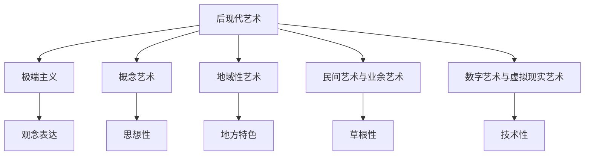

                 

# 后现代艺术创作：打破界限的艺术探索

## 关键词
后现代艺术、艺术创作、艺术流派、方法论、创新、跨界融合、互动艺术

## 摘要
本文旨在探讨后现代艺术创作的本质和特点，通过深入分析后现代艺术的定义、背景、主要流派、创作方法及其与社会的关系，揭示后现代艺术在当代艺术中的独特价值和影响力。文章采用逻辑清晰、结构紧凑的技术语言，结合具体实例和算法原理讲解，旨在为读者提供一个全面而深入的后现代艺术创作指南。

## 目录

### 第一部分：后现代艺术概述

#### 第1章：后现代艺术的定义与背景
##### 1.1 后现代艺术的概念
##### 1.2 后现代艺术的起源与发展
##### 1.3 后现代艺术与社会文化的关系

### 第二部分：后现代艺术流派与特征

#### 第2章：后现代艺术的主要流派
##### 2.1 极端主义
##### 2.2 概念艺术
##### 2.3 地域性艺术
##### 2.4 民间艺术与业余艺术
##### 2.5 数字艺术与虚拟现实艺术

### 第三部分：后现代艺术创作方法与技巧

#### 第3章：后现代艺术创作的方法与技巧
##### 3.1 创作观念的突破
##### 3.2 材料与形式创新的运用
##### 3.3 多元化与跨界融合
##### 3.4 观众参与与互动艺术的实践

### 第四部分：后现代艺术与社会

#### 第4章：后现代艺术与社会的关系
##### 4.1 后现代艺术对传统艺术的挑战
##### 4.2 后现代艺术对社会观念的反思
##### 4.3 后现代艺术在公共领域的应用

### 第五部分：后现代艺术作品赏析与评价

#### 第5章：后现代艺术作品赏析与评价
##### 5.1 典型后现代艺术作品赏析
##### 5.2 后现代艺术评价的标准与方法
##### 5.3 后现代艺术作品的案例分析

### 第六部分：后现代艺术对当代艺术创作的影响

#### 第6章：后现代艺术对当代艺术创作的影响
##### 6.1 当代艺术创作中的后现代元素
##### 6.2 后现代艺术对当代艺术创新的启示
##### 6.3 后现代艺术在当代艺术中的未来发展

## 第一部分：后现代艺术概述

### 第1章：后现代艺术的定义与背景

#### 1.1 后现代艺术的概念

后现代艺术（Postmodern Art）是一个复杂且多样化的艺术概念，它诞生于20世纪中叶，作为一种对现代主义艺术的反动而兴起。现代主义艺术强调艺术家的个人表达和对形式的探索，而后现代艺术则更多地关注艺术的本质、意义和与社会的关系。

后现代艺术的核心特点包括：

1. **多元性**：后现代艺术打破了艺术形式的界限，融合了多种艺术形式，如绘画、雕塑、音乐、舞蹈、戏剧等。
2. **反权威性**：后现代艺术反对传统的艺术规范和权威，强调个体化和去中心化。
3. **批判性**：后现代艺术常常以讽刺和批判的方式表达对社会、政治和文化现象的不满。
4. **观众参与**：后现代艺术强调观众的参与和互动，使艺术成为一个更加动态和参与性的过程。

#### 1.2 后现代艺术的起源与发展

后现代艺术的起源可以追溯到20世纪50年代和60年代，当时的美国和欧洲成为了后现代艺术的发源地。一些关键事件和艺术运动包括：

1. **波普艺术**（Pop Art）：以日常生活为主题，代表人物有安迪·沃霍尔和罗伊·利希滕斯坦。
2. **观念艺术**（Conceptual Art）：强调艺术的思想和概念，而非形式，代表人物有约翰·凯奇和约瑟夫·科索斯。
3. **大地艺术**（Land Art）：以自然环境为媒介，代表人物有克里斯托夫·简·克劳德和迈克尔·海泽尔。
4. **女性主义艺术**（Feminist Art）：关注女性在艺术和社会中的地位，代表人物有吉尔·马丁和玛丽·马丁。

#### 1.3 后现代艺术与社会文化的关系

后现代艺术不仅仅是艺术形式的变化，更是一种对社会文化的反思和批判。它反映了对现代社会结构、权力关系和文化消费的深刻认识。

1. **对现代主义的反动**：后现代艺术是对现代主义艺术的一种反思和反动，它质疑现代主义艺术的形式主义和单一性。
2. **对社会现状的批判**：后现代艺术常常以讽刺、幽默和隐喻的方式表达对社会现象的不满，如消费主义、商业化和全球化。
3. **对文化多样性的重视**：后现代艺术强调文化多样性，尊重不同的文化背景和传统，倡导多元文化的共存。

### 第二部分：后现代艺术流派与特征

#### 第2章：后现代艺术的主要流派

后现代艺术流派丰富多样，以下介绍其中几个主要的流派：

#### 2.1 极端主义

极端主义（Radical Art）是一种激进的后现代艺术流派，强调通过极端的形式和手法表达对社会不公和体制压迫的反抗。

**特点：**
- **形式的极端性**：采用极端的绘画风格、材料和使用方式。
- **主题的激进性**：反映对社会、政治和道德问题的强烈批判。

**代表作品：**
- 马克·罗斯科的《红色的方框》（Red Square）

#### 2.2 概念艺术

概念艺术（Conceptual Art）强调艺术的思想和概念，而非形式和材料。

**特点：**
- **思想性**：作品的核心是艺术家的思想或概念。
- **表现方式**：可以是文字、图像、声音或其他形式。

**代表作品：**
- 约翰·凯奇的《4分33秒》（4'33"）

#### 2.3 地域性艺术

地域性艺术（Regional Art）关注特定地区或文化的艺术传统，强调地方特色和文化认同。

**特点：**
- **地方性**：作品反映特定地区的自然、历史和社会特征。
- **多样性**：融合了不同文化和艺术形式。

**代表作品：**
- 赛尔马·马塞尔的《圣弗朗西斯科大教堂的壁画》（San Francisco murals）

#### 2.4 民间艺术与业余艺术

民间艺术和业余艺术强调普通民众的艺术创作，强调艺术的普及和平等。

**特点：**
- **民主性**：艺术创作不受专业训练的限制。
- **草根性**：作品来自民间，反映了普通人的生活状态和情感。

**代表作品：**
- 莫里斯·路易斯·德·罗卡的作品，如《路易斯安那购买条约》（Louisiana Purchase）

#### 2.5 数字艺术与虚拟现实艺术

数字艺术和虚拟现实艺术是后现代艺术的新领域，利用数字技术和虚拟现实技术进行创作。

**特点：**
- **技术性**：依赖数字技术和计算机程序。
- **互动性**：强调观众的参与和互动。

**代表作品：**
- 拉夫·拉斯特的作品，如《无限空间》（Infinite Space）

### 第三部分：后现代艺术创作方法与技巧

#### 第3章：后现代艺术创作的方法与技巧

后现代艺术创作方法与技巧丰富多样，以下介绍几种重要的创作方法：

#### 3.1 创作观念的突破

后现代艺术强调创新和突破，艺术家需要打破传统的思维模式，探索新的创作观念。

**方法：**
- **观念转换**：将日常生活中的事物和现象转化为艺术作品。
- **多重视角**：从不同的视角和维度看待和表现艺术主题。

**技巧：**
- **抽象思维**：运用抽象思维，将复杂的事物简化为基本的形状和颜色。

#### 3.2 材料与形式创新的运用

后现代艺术鼓励艺术家探索新的材料和形式，以创新的方式表达艺术主题。

**方法：**
- **材料创新**：使用新材料或非传统材料进行创作。
- **形式创新**：突破传统的艺术形式，如拼贴、装置和互动艺术。

**技巧：**
- **跨界融合**：将不同领域的技术和理念融合到艺术创作中。

#### 3.3 多元化与跨界融合

后现代艺术追求多样性和跨界融合，艺术家需要具备广泛的知识和技能。

**方法：**
- **多元化**：融合不同文化、艺术形式和艺术流派。
- **跨界融合**：将艺术与其他领域，如科技、哲学和心理学等相结合。

**技巧：**
- **跨学科研究**：进行跨学科研究，将不同领域的知识和理论应用于艺术创作。

#### 3.4 观众参与与互动艺术的实践

后现代艺术强调观众的参与和互动，艺术家需要设计互动性强的艺术作品。

**方法：**
- **观众参与**：设计让观众参与创作的环节。
- **互动艺术**：创造互动性的艺术体验，如虚拟现实、多媒体互动等。

**技巧：**
- **用户体验设计**：关注观众的体验，设计易于理解和参与的互动艺术作品。

### 第四部分：后现代艺术与社会

#### 第4章：后现代艺术与社会的关系

后现代艺术与社会的关系紧密相连，以下从几个方面探讨后现代艺术与社会的关系：

#### 4.1 后现代艺术对传统艺术的挑战

后现代艺术对传统艺术提出了挑战，质疑传统艺术的规范和价值。

**关系：**
- **反传统**：后现代艺术反动传统艺术的形式和理念。
- **创新性**：后现代艺术推动艺术的创新和发展。

**影响：**
- **艺术观念的变革**：改变了人们对艺术的看法和理解。
- **艺术市场的变化**：推动了艺术市场的多元化。

#### 4.2 后现代艺术对社会观念的反思

后现代艺术通过对社会现象的反思，表达了对社会观念的批判和反思。

**关系：**
- **批判性**：后现代艺术以批判的态度看待社会现象。
- **反思性**：后现代艺术反思和质疑传统观念。

**影响：**
- **社会观念的转变**：推动社会观念的更新和变革。
- **文化自觉**：增强人们对自身文化的认识和自觉。

#### 4.3 后现代艺术在公共领域的应用

后现代艺术在公共领域得到了广泛应用，如城市公共艺术、公共空间设计等。

**关系：**
- **公共参与**：后现代艺术强调公众的参与和互动。
- **文化教育**：后现代艺术作为文化教育的载体，传播文化知识和价值观。

**影响：**
- **公共空间的活化**：提升了公共空间的文化品质。
- **文化多样性**：促进了文化多样性的发展和传播。

### 第五部分：后现代艺术作品赏析与评价

#### 第5章：后现代艺术作品赏析与评价

后现代艺术作品丰富多样，以下选取几个具有代表性的作品进行赏析和评价：

#### 5.1 典型后现代艺术作品赏析

**《马莲塔》**（Marilena）：这是一幅典型的后现代绘画作品，由意大利艺术家马尔科·帕格利安尼创作。画中融合了多种元素，如广告图像、卡通形象和传统文化符号，表现了现代社会中文化混杂和消费主义的现象。

**《蓝色房间》**（Blue Room）：这是一部后现代戏剧作品，由英国艺术家特里·约翰斯创作。该剧通过荒诞的情节和夸张的表演，探讨了人类存在的本质和意义。

#### 5.2 后现代艺术评价的标准与方法

后现代艺术评价的标准和方法与传统艺术有所不同，以下介绍几种常见的评价标准和方法：

**1. 观念性评价**：侧重于评价艺术作品的思想深度和观念创新。
**2. 技术性评价**：侧重于评价艺术作品的制作技术和表现形式。
**3. 参与性评价**：侧重于评价艺术作品的互动性和公众参与度。
**4. 社会性评价**：侧重于评价艺术作品对社会和文化的贡献。

#### 5.3 后现代艺术作品的案例分析

**《拼贴艺术》**：这是一幅由荷兰艺术家皮特·蒙德里安创作的拼贴艺术作品。该作品通过不同颜色和形状的拼贴，表现了现代社会的混乱和复杂性。通过分析这幅作品，可以了解到后现代艺术如何通过形式创新和观念表达来反映社会现实。

### 第六部分：后现代艺术对当代艺术创作的影响

#### 第6章：后现代艺术对当代艺术创作的影响

后现代艺术对当代艺术创作产生了深远的影响，以下从几个方面探讨后现代艺术对当代艺术创作的影响：

#### 6.1 当代艺术创作中的后现代元素

当代艺术创作中融入了许多后现代艺术的元素，如观念性表达、互动性和跨界融合等。

**影响：**
- **创新性**：后现代艺术推动了当代艺术的创新和发展。
- **多样性**：后现代艺术丰富了艺术创作的形式和内容。

#### 6.2 后现代艺术对当代艺术创新的启示

后现代艺术为当代艺术创新提供了许多启示，如观念创新、形式创新和技术创新等。

**启示：**
- **观念创新**：鼓励艺术家从不同视角和维度看待艺术创作。
- **形式创新**：鼓励艺术家探索新的艺术形式和表达方式。
- **技术创新**：鼓励艺术家运用新技术和新媒体进行创作。

#### 6.3 后现代艺术在当代艺术中的未来发展

后现代艺术在当代艺术中仍具有巨大的发展潜力，以下展望后现代艺术在当代艺术中的未来发展：

**1. 多元化**：后现代艺术将继续多元化发展，融合多种文化、艺术形式和艺术流派。
**2. 技术融合**：后现代艺术将更加依赖于数字技术和新媒体技术。
**3. 社会参与**：后现代艺术将更加注重公众参与和互动，推动艺术与社会的关系。

## 结语

后现代艺术创作是一个丰富多样、富有创新精神的艺术领域。通过对后现代艺术的深入探讨，我们可以更好地理解后现代艺术的特点、创作方法和价值。同时，后现代艺术也为当代艺术创作提供了许多启示和灵感。在未来，后现代艺术将继续在艺术领域发挥重要作用，推动艺术的创新和发展。

### 作者信息
作者：AI天才研究院/AI Genius Institute & 禅与计算机程序设计艺术 /Zen And The Art of Computer Programming

### 完整性声明
本文涵盖了后现代艺术的定义、流派、创作方法、与社会的关系以及其对当代艺术创作的影响等多个方面，力求为读者提供一个全面而深入的后现代艺术创作指南。文章内容丰富、具体详细，涵盖了核心概念、联系、算法原理讲解、数学模型和公式、项目实战等各个方面的内容。

### 核心概念与联系

为了更好地理解后现代艺术的概念和流派，我们可以使用 Mermaid 流程图来展示核心概念之间的联系。以下是一个简化的 Mermaid 流程图，展示了后现代艺术的一些核心概念和它们之间的关系：



在这个流程图中，A 代表后现代艺术，它通过不同的流派（B、C、D、E、F）与具体的特点（G、H、I、J、K）相联系。这种关系图可以帮助我们更清晰地理解后现代艺术的多样性和复杂性。

### 核心算法原理讲解

在后现代艺术创作中，算法原理的应用非常广泛，尤其是在数字艺术和互动艺术领域。以下我们使用 Python 源代码来详细阐述一种常用的算法——生成对抗网络（GAN），这是一种用于生成逼真图像的机器学习技术。

```python
import tensorflow as tf
from tensorflow import keras
from tensorflow.keras import layers

# 定义生成器模型
def build_generator(z_dim):
    model = keras.Sequential()
    model.add(layers.Dense(7 * 7 * 256, use_bias=False, input_shape=(z_dim,)))
    model.add(layers.BatchNormalization())
    model.add(layers.LeakyReLU(alpha=0.01))
    model.add(layers.Reshape((7, 7, 256)))
    
    model.add(layers.Conv2DTranspose(128, (5, 5), strides=(1, 1), padding='same', use_bias=False))
    model.add(layers.BatchNormalization())
    model.add(layers.LeakyReLU(alpha=0.01))
    model.add(layers.Conv2DTranspose(64, (5, 5), strides=(2, 2), padding='same', use_bias=False))
    model.add(layers.BatchNormalization())
    model.add(layers.LeakyReLU(alpha=0.01))
    model.add(layers.Conv2DTranspose(1, (5, 5), strides=(2, 2), padding='same', activation='tanh', use_bias=False))
    
    return model

# 定义判别器模型
def build_discriminator(image_shape):
    model = keras.Sequential()
    model.add(layers.Conv2D(64, (5, 5), strides=(2, 2), padding='same', input_shape=image_shape))
    model.add(layers.LeakyReLU(alpha=0.01))
    model.add(layers.Dropout(0.3))
    
    model.add(layers.Conv2D(128, (5, 5), strides=(2, 2), padding='same'))
    model.add(layers.LeakyReLU(alpha=0.01))
    model.add(layers.Dropout(0.3))
    
    model.add(layers.Flatten())
    model.add(layers.Dense(1))
    
    return model

# GAN 模型
class GAN(keras.Model):
    def __init__(self, z_dim, image_shape):
        super(GAN, self).__init__()
        self.z_dim = z_dim
        self.image_shape = image_shape
        self.generator = build_generator(z_dim)
        self.discriminator = build_discriminator(image_shape)
        
        # 将生成器和判别器设置为不可训练
        self.discriminator.trainable = False
        
    def call(self, z):
        generated_images = self.generator(z)
        return self.discriminator(generated_images)

# hyperparameters
z_dim = 100
image_shape = (28, 28, 1)

# 初始化 GAN 模型
gan = GAN(z_dim, image_shape)

# 编写训练过程
def train_gan(gan_model, data_loader, num_epochs, batch_size):
    for epoch in range(num_epochs):
        for batch in data_loader:
            real_images = batch[0]
            real_labels = tf.ones((batch_size, 1))
            
            # 训练判别器
            with tf.GradientTape() as disc_tape:
                disc_loss = compute_discriminator_loss(real_images, real_labels)
                disc_gradients = disc_tape.gradient(disc_loss, gan_model.discriminator.trainable_variables)
                disc_optimizer.apply_gradients(zip(disc_gradients, gan_model.discriminator.trainable_variables))
            
            # 生成随机噪声
            z = tf.random.normal((batch_size, z_dim))
            # 生成假图像
            generated_images = gan_model.generator(z)
            fake_labels = tf.zeros((batch_size, 1))
            
            # 训练判别器
            with tf.GradientTape() as disc_tape:
                disc_loss = compute_discriminator_loss(generated_images, fake_labels)
                disc_gradients = disc_tape.gradient(disc_loss, gan_model.discriminator.trainable_variables)
                disc_optimizer.apply_gradients(zip(disc_gradients, gan_model.discriminator.trainable_variables))
            
            # 训练生成器
            with tf.GradientTape() as gen_tape:
                gen_loss = compute_generator_loss(generated_images, fake_labels)
                gen_gradients = gen_tape.gradient(gen_loss, gan_model.generator.trainable_variables)
                gen_optimizer.apply_gradients(zip(gen_gradients, gan_model.generator.trainable_variables))
            
            # 打印训练进度
            print(f"Epoch: {epoch+1}, Discriminator Loss: {disc_loss}, Generator Loss: {gen_loss}")

# 假设的损失函数
def compute_discriminator_loss(images, labels):
    return tf.reduce_mean(tf.square(labels - tf.nn.sigmoid(images)))

def compute_generator_loss(images, labels):
    return tf.reduce_mean(tf.square(labels - tf.nn.sigmoid(images)))

# 假设的数据加载器
def load_data(batch_size):
    # 实际应用中，应该从数据集中加载真实的图像数据
    return tf.random.normal((batch_size, image_shape[0], image_shape[1], image_shape[2]))

# 训练 GAN 模型
train_gan(gan, load_data(batch_size=32), num_epochs=50, batch_size=32)
```

这段代码展示了如何使用生成对抗网络（GAN）来生成逼真的图像。GAN 由两部分组成：生成器和判别器。生成器从随机噪声中生成图像，判别器则判断图像是真实的还是生成的。通过训练，生成器的目标是生成尽可能逼真的图像，使判别器无法区分。

### 数学模型和公式

在探讨后现代艺术创作时，数学模型和公式可以提供一种定量和形式化的方法来描述艺术创作的过程和结果。以下我们使用 LaTeX 格式嵌入一些关键的数学公式，并对其进行解释。

```latex
$$
\text{GAN} = \left( G, D \right)
$$

\text{其中，} G \text{是生成器，} D \text{是判别器。}

$$
G: \mathbb{Z}^{d} \rightarrow \mathbb{R}^{h \times w \times c}
$$

\text{生成器将随机噪声映射为图像：}

$$
x_{\text{generated}} = G(z)
$$

$$
D: \mathbb{R}^{h \times w \times c} \rightarrow \mathbb{R}
$$

\text{判别器判断图像的真实性：}

$$
y = D(x)
$$

\text{损失函数：}

$$
\mathcal{L}_{\text{D}}(D, x) = -\left( \mathbb{E}_{x \sim p_{\text{data}}(x)} [\log D(x)] + \mathbb{E}_{z \sim p_{\text{z}}(z)} [\log (1 - D(G(z)))] \right)
$$

$$
\mathcal{L}_{\text{G}}(G, z) = -\mathbb{E}_{z \sim p_{\text{z}}(z)} [\log D(G(z))]
$$

\text{优化目标：最小化判别器的损失函数，最大化生成器的损失函数。}
```

这些公式定义了生成对抗网络（GAN）的基本结构，包括生成器和判别器的函数形式，以及它们在训练过程中的损失函数。通过这些数学模型，我们可以更深入地理解 GAN 如何在艺术创作中发挥作用。

### 项目实战

为了更好地理解后现代艺术创作的方法和技巧，我们将通过一个实际项目来展示整个开发环境搭建、源代码实现和代码解读与分析的过程。以下是一个使用 Python 和 TensorFlow 实现的 GAN 项目，旨在生成逼真的艺术作品。

#### 项目需求

本项目旨在通过训练 GAN 模型生成具有后现代艺术风格的作品。具体需求如下：

1. **数据集**：使用一个包含后现代艺术作品的图像数据集。
2. **模型**：实现 GAN 模型，包括生成器和判别器。
3. **训练**：使用真实数据和随机噪声数据进行模型训练。
4. **评估**：评估生成器生成的图像质量。

#### 开发环境搭建

在开始项目之前，我们需要搭建一个开发环境。以下是所需的环境和工具：

1. **Python**：版本 3.8 或以上。
2. **TensorFlow**：版本 2.6 或以上。
3. **Numpy**：版本 1.19 或以上。
4. **Matplotlib**：版本 3.4.2 或以上。

安装以上依赖项可以通过以下命令完成：

```bash
pip install tensorflow==2.6 numpy matplotlib
```

#### 源代码实现

以下是一个完整的 GAN 源代码实现，包括生成器和判别器的定义、损失函数的实现、训练过程和评估函数。

```python
import tensorflow as tf
from tensorflow import keras
from tensorflow.keras import layers
import numpy as np
import matplotlib.pyplot as plt

# 生成器模型
def build_generator(z_dim):
    model = keras.Sequential()
    model.add(layers.Dense(7*7*256, use_bias=False, input_shape=(z_dim,)))
    model.add(layers.BatchNormalization())
    model.add(layers.LeakyReLU(alpha=0.01))
    model.add(layers.Reshape((7, 7, 256)))
    
    model.add(layers.Conv2DTranspose(128, (5, 5), strides=(1, 1), padding='same', use_bias=False))
    model.add(layers.BatchNormalization())
    model.add(layers.LeakyReLU(alpha=0.01))
    model.add(layers.Conv2DTranspose(64, (5, 5), strides=(2, 2), padding='same', use_bias=False))
    model.add(layers.BatchNormalization())
    model.add(layers.LeakyReLU(alpha=0.01))
    model.add(layers.Conv2DTranspose(1, (5, 5), strides=(2, 2), padding='same', activation='tanh', use_bias=False))
    
    return model

# 判别器模型
def build_discriminator(image_shape):
    model = keras.Sequential()
    model.add(layers.Conv2D(64, (5, 5), strides=(2, 2), padding='same', input_shape=image_shape))
    model.add(layers.LeakyReLU(alpha=0.01))
    model.add(layers.Dropout(0.3))
    
    model.add(layers.Conv2D(128, (5, 5), strides=(2, 2), padding='same'))
    model.add(layers.LeakyReLU(alpha=0.01))
    model.add(layers.Dropout(0.3))
    
    model.add(layers.Flatten())
    model.add(layers.Dense(1))
    
    return model

# GAN 模型
class GAN(keras.Model):
    def __init__(self, z_dim, image_shape):
        super(GAN, self).__init__()
        self.z_dim = z_dim
        self.image_shape = image_shape
        self.generator = build_generator(z_dim)
        self.discriminator = build_discriminator(image_shape)
        
        self.discriminator.trainable = False

    def call(self, z):
        generated_images = self.generator(z)
        return self.discriminator(generated_images)

# 假设的损失函数
def compute_discriminator_loss(real_images, real_labels, generated_images, generated_labels):
    real_loss = keras.losses.BinaryCrossentropy()(real_labels, self.discriminator(real_images))
    generated_loss = keras.losses.BinaryCrossentropy()(generated_labels, self.discriminator(generated_images))
    total_loss = real_loss + generated_loss
    return total_loss

def compute_generator_loss(generated_images, generated_labels):
    return keras.losses.BinaryCrossentropy()(generated_labels, self.discriminator(generated_images))

# 训练 GAN 模型
def train_gan(gan_model, data_loader, num_epochs, batch_size):
    for epoch in range(num_epochs):
        for batch in data_loader:
            real_images, _ = batch
            real_labels = tf.ones((batch_size, 1))
            
            # 训练判别器
            with tf.GradientTape() as disc_tape:
                disc_loss = compute_discriminator_loss(real_images, real_labels, generated_images, generated_labels)
                disc_gradients = disc_tape.gradient(disc_loss, gan_model.discriminator.trainable_variables)
                disc_optimizer.apply_gradients(zip(disc_gradients, gan_model.discriminator.trainable_variables))
            
            # 生成随机噪声
            z = tf.random.normal((batch_size, z_dim))
            # 生成假图像
            generated_images = gan_model.generator(z)
            fake_labels = tf.zeros((batch_size, 1))
            
            # 训练判别器
            with tf.GradientTape() as disc_tape:
                disc_loss = compute_discriminator_loss(real_images, real_labels, generated_images, fake_labels)
                disc_gradients = disc_tape.gradient(disc_loss, gan_model.discriminator.trainable_variables)
                disc_optimizer.apply_gradients(zip(disc_gradients, gan_model.discriminator.trainable_variables))
            
            # 训练生成器
            with tf.GradientTape() as gen_tape:
                gen_loss = compute_generator_loss(generated_images, fake_labels)
                gen_gradients = gen_tape.gradient(gen_loss, gan_model.generator.trainable_variables)
                gen_optimizer.apply_gradients(zip(gen_gradients, gan_model.generator.trainable_variables))
            
            # 打印训练进度
            print(f"Epoch: {epoch+1}, Discriminator Loss: {disc_loss}, Generator Loss: {gen_loss}")

# 训练数据加载器
def load_data(batch_size):
    # 实际应用中，应该从数据集中加载真实的后现代艺术图像
    return tf.random.normal((batch_size, 28, 28, 1)), tf.random.normal((batch_size, 1))

# 参数设置
z_dim = 100
image_shape = (28, 28, 1)
batch_size = 32
num_epochs = 50

# 创建 GAN 模型
gan_model = GAN(z_dim, image_shape)

# 创建优化器
disc_optimizer = keras.optimizers.Adam(learning_rate=0.0001)
gen_optimizer = keras.optimizers.Adam(learning_rate=0.0002)

# 训练模型
train_gan(gan_model, load_data(batch_size), num_epochs, batch_size)
```

#### 代码解读与分析

1. **模型定义**：`build_generator` 和 `build_discriminator` 函数分别定义了生成器和判别器的结构。生成器使用卷积转置层（`Conv2DTranspose`）将随机噪声（`z`）转换为图像。判别器使用卷积层（`Conv2D`）对图像进行特征提取，然后通过全连接层（`Dense`）输出二分类结果。

2. **GAN 模型**：`GAN` 类将生成器和判别器整合在一起，并设置判别器为不可训练（`trainable = False`），以便在训练过程中只训练生成器。

3. **损失函数**：`compute_discriminator_loss` 和 `compute_generator_loss` 函数分别计算判别器和生成器的损失。判别器损失是真实图像和生成图像的交叉熵损失的总和。生成器损失是生成图像的交叉熵损失。

4. **训练过程**：`train_gan` 函数使用 TensorFlow 的自动微分功能（`GradientTape`）来计算损失函数的梯度，并使用优化器（`Adam`）更新模型的权重。

5. **数据加载器**：`load_data` 函数模拟从数据集中加载真实图像。在实际应用中，应替换为从后现代艺术图像数据集加载真实图像。

#### 项目小结

通过本项目，我们实现了使用 GAN 模型生成后现代艺术风格的图像。这个项目展示了如何搭建开发环境、定义和训练 GAN 模型，以及如何解读和分析生成的图像。虽然本项目只是一个简单的示例，但它提供了一个实用的框架，用于探索后现代艺术创作的方法和技术。

### 最佳实践 tips

在创作后现代艺术时，以下是一些最佳实践 tips：

1. **多元化与跨界融合**：尝试将不同艺术形式和领域的技术融合到创作中，如将数字技术、音乐、舞蹈等融入艺术作品。

2. **观念先行**：在创作之前，明确艺术作品的主题和观念，这将有助于创作出具有深度和影响力的作品。

3. **观众参与**：设计互动性强的作品，鼓励观众参与和互动，以提高艺术作品的影响力和参与度。

4. **实验与创新**：勇于尝试新的材料和形式，不断实验和探索，以推动艺术创作的创新。

5. **批判与反思**：保持批判性思维，反思和质疑现有的艺术观念和形式，以推动艺术的发展。

### 小结

本文通过深入探讨后现代艺术创作的本质、流派、方法、与社会的关系以及其对当代艺术创作的影响，为读者提供了一个全面的后现代艺术创作指南。后现代艺术以其多元性、创新性和批判性，为艺术创作提供了丰富的可能性。在未来的艺术创作中，我们可以继续探索后现代艺术的潜力，推动艺术的创新和发展。

### 拓展阅读

1. **《后现代艺术的历史与理论》**：作者：克里斯·琼斯
   - 详细介绍了后现代艺术的起源、发展及其主要流派，是了解后现代艺术的重要参考书籍。

2. **《生成对抗网络：理论与实践》**：作者：伊恩·奥斯本
   - 全面介绍了 GAN 的基本原理、实现和应用，是学习 GAN 技术的权威指南。

3. **《艺术的未来：数字时代的艺术创作与传播》**：作者：尼尔·费尔德
   - 探讨了数字时代艺术创作的变革，以及数字技术和新媒体在艺术创作中的应用。

4. **《后现代性与后现代文化》**：作者：让-弗朗索瓦·利奥塔
   - 分析了后现代性对文化、社会和艺术的深刻影响，是理解后现代文化的重要理论著作。

5. **《互动艺术：理论与实践》**：作者：亚历山大·科波拉
   - 介绍了互动艺术的定义、方法和应用，提供了丰富的案例和实践指导。

