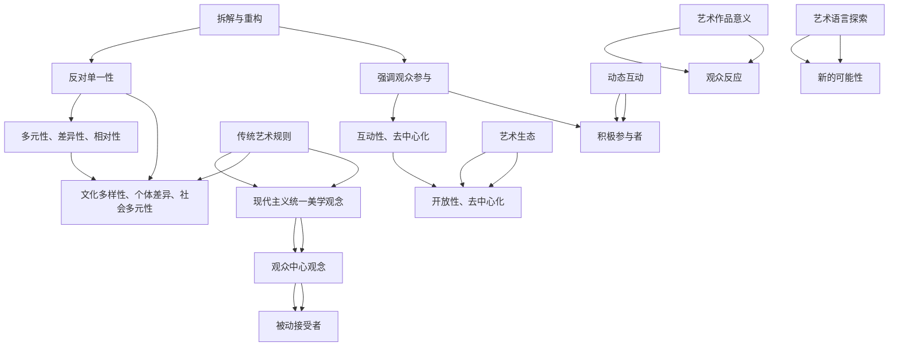

                 

# 后现代艺术：打破界限的创作探索

> 关键词：后现代艺术、创作探索、艺术流派、社会影响、方法技巧、案例分析

> 摘要：本文旨在深入探讨后现代艺术的起源、发展、创作方法及其对社会和政治的影响。通过分析后现代艺术的核心概念、代表作品、流派以及其在国际视野中的案例，本文揭示了后现代艺术如何打破传统艺术界限，成为当代艺术的重要力量。

## 第一部分：后现代艺术的起源与发展

### 第1章：后现代艺术的概念与特征

#### 1.1 后现代艺术的背景

后现代艺术（Postmodern art）起源于20世纪中叶，是对现代艺术（Modern art）的反叛和回应。现代艺术强调个性、创新和抽象表达，而后现代艺术则更加关注艺术与社会、政治、文化等方面的互动。后现代主义思潮的兴起，源于对现代性危机的反思和批判，以及对传统价值观念的质疑。

##### 1.1.1 后现代主义思潮的兴起

后现代主义思潮起源于20世纪60年代的哲学领域，以法国哲学家米歇尔·福柯（Michel Foucault）和让-弗朗索瓦·利奥塔（Jean-François Lyotard）等人为代表。他们提出了一系列批判现代性的观点，如相对主义、多元主义和去中心化等。这些观点对艺术领域产生了深远影响，促使艺术家们开始探索更加开放和多元的创作方式。

##### 1.1.2 后现代艺术与传统艺术的区别

后现代艺术与传统艺术有明显的区别。传统艺术通常以古典美学和自然主义为准则，追求形式美和真实性的再现。而后现代艺术则更加注重艺术家的个人体验、观念表达和观众的参与。后现代艺术不追求统一的美学标准，而是强调多元性和相对性。

##### 1.1.3 后现代艺术的特征

后现代艺术的特征可以从以下几个方面来概括：

1. **拆解与重构**：后现代艺术家常常对传统艺术形式进行解构，然后通过重新组合和重构，创造新的艺术形式。
2. **反对单一性**：后现代艺术强调多元性和相对性，反对单一的艺术观念和美学标准。
3. **强调观众参与**：后现代艺术鼓励观众参与创作和解读，使艺术成为一种互动性的体验。

#### 1.2 后现代艺术的核心概念

后现代艺术的核心概念包括：

1. **拆解与重构**：后现代艺术家通过对传统艺术形式的解构，重新组合和重构，创造出全新的艺术形式。这种拆解与重构的方式，打破了传统艺术的形式和规则，使艺术成为了一种探索和实验的过程。

2. **反对单一性**：后现代艺术强调多元性和相对性，反对单一的艺术观念和美学标准。艺术家们通过创作出多样化的作品，挑战了传统的艺术界限。

3. **强调观众参与**：后现代艺术鼓励观众参与创作和解读，使艺术成为了一种互动性的体验。观众不仅仅是艺术的欣赏者，也是参与者，他们的观点和体验对艺术作品的意义产生了重要影响。

### 第2章：后现代艺术的流派与代表作品

#### 2.1 抽象表现主义

抽象表现主义（Abstract Expressionism）是后现代艺术中的一个重要流派，起源于20世纪40年代的美国。这一流派的艺术家通过抽象的形式表达内心的情感和思想，强调个人主义和情感表达的自由。

##### 2.1.1 抽象表现主义的起源

抽象表现主义的起源可以追溯到二战后美国的社会和文化环境。战争的结束带来了对自由的渴望和对人性的反思，这些情感通过艺术得到了表达。杰克逊·波洛克（Jackson Pollock）是抽象表现主义最具代表性的艺术家之一，他的作品《1号1948》被认为是抽象表现主义的代表作。

##### 2.1.2 抽象表现主义的核心观点

抽象表现主义的核心观点包括：

1. **情感表达**：艺术家通过绘画等艺术形式表达内心的情感和思想，强调情感的自由和真实。
2. **个人主义**：艺术家追求个人风格和独特性，强调自我表达和自由创作。
3. **反传统**：抽象表现主义反对传统的艺术形式和规则，追求创新和自由。

##### 2.1.3 抽象表现主义的代表艺术家与作品

除了杰克逊·波洛克，抽象表现主义的代表艺术家还包括：

1. **威廉·德库宁（Willem de Kooning）**：他的作品《女人I》被认为是抽象表现主义的经典之作。
2. **弗朗西斯·贝克特（Francis Beckett）**：他的抽象画作充满了动感和活力，展现了强烈的情感表达。

#### 2.2 媒体艺术

媒体艺术（Media Art）是后现代艺术中的另一个重要流派，它涉及使用电子媒体、数字技术、网络等手段进行创作。媒体艺术的兴起，标志着艺术创作方式和观众体验的变革。

##### 2.2.1 媒体艺术的定义

媒体艺术是一种利用电子、数字和网络技术进行创作的艺术形式。它包括视频艺术、数字绘画、虚拟现实、增强现实等多种形式。媒体艺术的创作和展示不再局限于传统的画廊和展览场所，而是扩展到了互联网和虚拟空间。

##### 2.2.2 媒体艺术的发展历程

媒体艺术的发展历程可以分为以下几个阶段：

1. **早期视频艺术**：20世纪60年代，视频艺术开始兴起，艺术家们利用电视和录像设备进行创作。
2. **计算机艺术**：20世纪80年代，计算机技术的进步为艺术家提供了新的创作工具和手段。
3. **网络艺术**：21世纪初，互联网的普及使得艺术家可以通过网络进行创作和展示，网络艺术应运而生。

##### 2.2.3 媒体艺术的代表艺术家与作品

媒体艺术的代表艺术家包括：

1. **玛丽娜·阿布拉莫维奇（Marina Abramović）**：她的行为艺术作品《节奏0》探讨了身体与观众之间的互动。
2. **杰夫·昆斯（Jeff Koons）**：他的作品《气球狗》结合了雕塑和数字技术，展现了艺术与商业的融合。

### 第3章：后现代艺术的社会与政治影响

#### 3.1 后现代艺术与社会变革

后现代艺术对社会变革产生了深远影响。它不仅挑战了传统的艺术形式和规则，也推动了社会的多元化和开放性。

##### 3.1.1 后现代艺术对社会意识的觉醒

后现代艺术通过表达个体的内心体验和社会问题，提高了公众对社会现实的认识。它促使人们反思传统的价值观和社会结构，推动了对平等、自由和人权的追求。

##### 3.1.2 后现代艺术对社会结构的影响

后现代艺术反对权威和中心化，倡导去中心化和多元性。它对传统的权力结构和社会秩序产生了挑战，推动了社会的变革和进步。

##### 3.1.3 后现代艺术与民主化进程

后现代艺术强调观众的参与和互动，使艺术成为一种公共领域。它促进了公众的参与和表达，推动了民主化进程。

#### 3.2 后现代艺术与政治批判

后现代艺术常用于政治批判，对权力结构和社会问题进行揭露和反思。

##### 3.2.1 后现代艺术对权威的挑战

后现代艺术挑战了传统的权威观念，强调个体的自由和独立思考。它质疑权力结构的不公和腐败，呼吁社会的变革。

##### 3.2.2 后现代艺术对权力结构的质疑

后现代艺术通过对权力结构的揭示和批判，质疑了社会的不平等和歧视。它呼吁平等和公正，推动社会的进步。

##### 3.2.3 后现代艺术的抵抗与反抗

后现代艺术成为一种抵抗和反抗的形式，它通过艺术表达对社会问题的不满和对变革的期望。它激发了社会的觉醒和行动，推动了社会的进步。

## 第二部分：后现代艺术创作的方法与技巧

### 第4章：后现代艺术创作的方法

#### 4.1 破坏与重组

后现代艺术创作的一个重要方法就是破坏与重组。这种创作方法通过对传统艺术形式的解构，重新组合和重构，创造出全新的艺术形式。

##### 4.1.1 对传统艺术形式的破坏

破坏传统艺术形式是后现代艺术创作的一种策略。艺术家们通过解构、拆卸、改写等手段，打破传统的艺术规则和形式，创造出新的艺术语言和表达方式。

##### 4.1.2 艺术元素的重组与创新

在破坏传统艺术形式的基础上，后现代艺术家们通过重组和创新，将不同的艺术元素融合在一起，创造出独特的艺术作品。这种重组与创新的过程，使得艺术作品具有了多元性和开放性。

##### 4.1.3 艺术创作的非线性思维

后现代艺术创作常常采用非线性思维，不追求线性发展，而是通过跳跃、反转、融合等手法，创造出丰富的艺术作品。非线性思维使得艺术创作过程更加自由和灵活。

#### 4.2 跨界融合

跨界融合是后现代艺术创作的一个重要特点。它将不同的艺术形式、学科领域和科技手段融合在一起，创造出全新的艺术体验。

##### 4.2.1 艺术与科技融合

艺术与科技的融合，为后现代艺术创作提供了新的工具和手段。艺术家们利用计算机、网络、虚拟现实等技术，创造出具有互动性和多媒体性的艺术作品。

##### 4.2.2 艺术与日常生活融合

后现代艺术将艺术融入日常生活，使艺术成为生活的一部分。艺术家们通过艺术创作，改变了人们的日常生活，提升了人们的生活品质。

##### 4.2.3 艺术与社会问题的融合

后现代艺术关注社会问题，将艺术与社会问题融合在一起，通过艺术表达对社会问题进行批判和反思。

### 第5章：后现代艺术创作的过程

#### 5.1 灵感的捕捉与提炼

后现代艺术创作的过程首先在于灵感的捕捉与提炼。艺术家们通过观察生活、阅读书籍、观看电影等方式，捕捉灵感。

##### 5.1.1 灵感来源

灵感的来源可以是多种多样的，包括自然景观、人文历史、社会现实等。艺术家们从不同的角度和层面，捕捉到灵感的火花。

##### 5.1.2 灵感的提炼与加工

捕捉到灵感后，艺术家们需要对灵感进行提炼和加工。通过对灵感的深入理解和挖掘，艺术家们将灵感转化为艺术创作的具体内容。

##### 5.1.3 艺术构思的形成

在灵感的提炼和加工过程中，艺术构思逐渐形成。艺术家们通过草图、设计等手段，将艺术构思转化为具体的艺术作品。

#### 5.2 艺术创作的实践

艺术创作的实践是后现代艺术创作过程中的关键环节。艺术家们通过绘画、雕塑、摄影等方式，将艺术构思转化为艺术作品。

##### 5.2.1 艺术创作的准备

艺术创作的准备包括材料准备、工具准备和场地准备等。艺术家们需要根据艺术创作的具体要求，准备好所需的材料和工具。

##### 5.2.2 艺术创作的实施

艺术创作的实施是艺术家们将艺术构思通过具体的艺术形式表达出来的过程。艺术家们通过不断的尝试和调整，将艺术构思转化为艺术作品。

##### 5.2.3 艺术创作的评估与修改

艺术创作的评估与修改是艺术创作过程中的一个重要环节。艺术家们需要对艺术作品进行评估，判断其是否符合创作初衷和预期效果。如果需要，艺术家们会对艺术作品进行修改和完善。

### 第6章：后现代艺术的展示与传播

#### 6.1 艺术展览的形式

后现代艺术的展示与传播主要通过艺术展览的形式。艺术展览分为线上和线下两种形式。

##### 6.1.1 线下艺术展览

线下艺术展览通常在画廊、博物馆、文化中心等场所进行。艺术家们通过展览，将艺术作品呈现给观众，让观众直观地感受到艺术作品的美感和思想内涵。

##### 6.1.2 线上艺术展览

线上艺术展览利用互联网和虚拟技术，将艺术作品呈现给全球观众。观众可以通过电脑、手机等设备，随时随地欣赏艺术作品。

##### 6.1.3 艺术展览的新趋势

随着科技的发展，艺术展览的形式也在不断革新。虚拟现实、增强现实等技术的应用，使得艺术展览更加互动和沉浸。未来，艺术展览将更加注重观众的参与和体验。

#### 6.2 艺术传播的渠道

后现代艺术的传播主要通过以下渠道：

##### 6.2.1 传统媒体与新媒体的融合

传统媒体如报纸、杂志、电视等，与新媒体如互联网、社交媒体等相互融合，形成了多元化的艺术传播渠道。

##### 6.2.2 社交媒体在艺术传播中的作用

社交媒体如Facebook、Instagram、Twitter等，已经成为艺术传播的重要平台。艺术家们通过社交媒体，与观众互动，分享艺术作品和创作过程，扩大了艺术的影响力。

##### 6.2.3 艺术评论与批评的传播

艺术评论与批评是艺术传播的重要组成部分。通过艺术评论与批评，艺术家们可以了解观众对艺术作品的看法，进一步改进和提升艺术创作。

## 第三部分：后现代艺术案例分析

### 第7章：后现代艺术的国际视野

#### 7.1 欧洲后现代艺术的案例

欧洲是后现代艺术的重要发源地，欧洲的后现代艺术案例具有丰富的多样性。

##### 7.1.1 德国：梅塞尔画派的崛起

梅塞尔画派（Malerpresse）是德国后现代艺术的重要流派之一。梅塞尔画派的艺术家们通过夸张、幽默和讽刺的手法，描绘了现代社会的荒谬和矛盾。

##### 7.1.2 英国：概念艺术的兴起

英国的概念艺术（Concept Art）强调观念的表达，而不是传统的形式和技巧。概念艺术家们通过思想和观念的传达，探讨艺术与社会的关系。

##### 7.1.3 法国：新表现主义的探索

新表现主义（Neo-expressionism）是法国后现代艺术的重要流派。新表现主义艺术家们通过强烈的情感表达，展现了现代人的内心世界。

#### 7.2 美国后现代艺术的案例

美国是后现代艺术的中心之一，美国的后现代艺术案例具有强大的影响力。

##### 7.2.1 美国抽象表现主义的演变

美国抽象表现主义（Abstract Expressionism）是20世纪中叶美国后现代艺术的重要流派。抽象表现主义艺术家们通过抽象的形式，表达内心的情感和思想。

##### 7.2.2 美国观念艺术的革新

美国观念艺术（Concept Art）强调观念的表达，反对传统的形式和技巧。观念艺术家们通过思想和观念的传达，探讨了艺术与社会的关系。

##### 7.2.3 美国装置艺术的突破

美国装置艺术（Installation Art）是后现代艺术的一个重要流派。装置艺术家们通过空间和环境的布置，创造出了独特的艺术体验。

### 第8章：中国后现代艺术的探索

#### 8.1 中国后现代艺术的兴起

中国后现代艺术在20世纪80年代末期开始兴起，受到了西方后现代艺术的影响。中国后现代艺术家们通过探索和实验，创造出了具有中国特色的后现代艺术作品。

##### 8.1.1 中国当代艺术的演变

中国当代艺术经历了从传统艺术到现代艺术，再到后现代艺术的演变。后现代艺术的兴起，标志着中国当代艺术的进一步发展和创新。

##### 8.1.2 中国后现代艺术的特征

中国后现代艺术的特征包括：

1. **多元性**：中国后现代艺术强调多元性和开放性，融合了东西方的艺术元素。
2. **观念性**：中国后现代艺术注重观念的表达，探讨社会问题和文化现象。
3. **互动性**：中国后现代艺术鼓励观众的参与和互动，使艺术成为一种公共体验。

##### 8.1.3 中国后现代艺术的代表艺术家与作品

中国后现代艺术的代表艺术家包括：

1. **张晓刚**：他的作品《大家庭》通过夸张和变形的手法，描绘了当代社会的家庭关系。
2. **岳敏君**：他的作品《笑脸》以夸张的笑脸形象，表达了对现实的反思和批判。

#### 8.2 中国后现代艺术的影响

中国后现代艺术对中国社会和文化产生了深远的影响。

##### 8.2.1 中国后现代艺术对社会的影响

中国后现代艺术通过艺术表达，探讨社会问题，推动社会的进步。它呼吁社会的平等、自由和民主。

##### 8.2.2 中国后现代艺术对文化的影响

中国后现代艺术打破了传统的文化界限，融合了东西方的文化元素。它推动了中国文化的创新和发展。

##### 8.2.3 中国后现代艺术在国际舞台上的表现

中国后现代艺术在国际艺术舞台上取得了显著成绩。中国后现代艺术家们的作品，得到了国际艺术界的高度认可和赞誉。

## 附录

### 附录A：后现代艺术资源与工具

##### A.1 后现代艺术相关的书籍与论文

- **《后现代艺术：理论与实践》**：这本书系统地介绍了后现代艺术的定义、特征、流派和发展历程。
- **《后现代主义艺术史》**：这本书详细分析了后现代艺术的历史背景、流派代表和艺术作品。

##### A.2 后现代艺术的在线展览平台

- **Art Basel**：这是一个全球性的艺术展览平台，展示了各种流派和风格的艺术作品。
- **MoMA**：这是现代艺术博物馆的官方网站，提供了丰富的后现代艺术展览和作品。

##### A.3 后现代艺术的学习与交流社群

- **Art21**：这是一个专注于现代和后现代艺术的在线学习平台，提供了丰富的教学资源和视频讲座。
- **后现代艺术论坛**：这是一个在线论坛，艺术家和爱好者可以分享艺术作品和交流艺术观点。

### 附录B：后现代艺术作品赏析

##### B.1 代表性后现代艺术作品赏析

- **玛丽娜·阿布拉莫维奇的《节奏0》**：这个行为艺术作品探讨了身体与观众之间的互动。
- **杰夫·昆斯的《气球狗》**：这个雕塑作品结合了商业文化和艺术美学，展现了后现代艺术的独特魅力。

##### B.2 后现代艺术展览推荐

- **第58届威尼斯双年展**：这是一个国际性的艺术展览，展示了来自世界各地的后现代艺术作品。
- **上海双年展**：这是一个中国国内重要的后现代艺术展览，展示了中国后现代艺术的最新成果。

##### B.3 后现代艺术电影推荐

- **《离经叛道》**：这部纪录片讲述了后现代艺术的发展历程和影响。
- **《一切为了金钱》**：这部纪录片揭示了后现代艺术与商业文化的交融。

## 作者信息

作者：AI天才研究院/AI Genius Institute & 禅与计算机程序设计艺术 /Zen And The Art of Computer Programming

（文章标题）：后现代艺术：打破界限的创作探索

（文章关键词）：后现代艺术、创作方法、艺术流派、社会影响、案例分析

（文章摘要）：本文深入探讨了后现代艺术的起源、发展、创作方法及其对社会和政治的影响。通过分析后现代艺术的核心概念、流派代表和案例，揭示了后现代艺术如何打破传统艺术界限，成为当代艺术的重要力量。本文旨在为读者提供一个全面的后现代艺术视角，激发对这一艺术领域的兴趣和思考。

## 第一部分：后现代艺术的起源与发展

### 第1章：后现代艺术的概念与特征

#### 1.1 后现代艺术的背景

后现代艺术（Postmodern art）起源于20世纪中叶，是对现代艺术（Modern art）的反叛和回应。现代艺术强调个性、创新和抽象表达，而后现代艺术则更加关注艺术与社会、政治、文化等方面的互动。后现代主义思潮的兴起，源于对现代性危机的反思和批判，以及对传统价值观念的质疑。

##### 1.1.1 后现代主义思潮的兴起

后现代主义思潮起源于20世纪60年代的哲学领域，以法国哲学家米歇尔·福柯（Michel Foucault）和让-弗朗索瓦·利奥塔（Jean-François Lyotard）等人为代表。他们提出了一系列批判现代性的观点，如相对主义、多元主义和去中心化等。这些观点对艺术领域产生了深远影响，促使艺术家们开始探索更加开放和多元的创作方式。

##### 1.1.2 后现代艺术与传统艺术的区别

后现代艺术与传统艺术有明显的区别。传统艺术通常以古典美学和自然主义为准则，追求形式美和真实性的再现。而后现代艺术则更加注重艺术家的个人体验、观念表达和观众的参与。后现代艺术不追求统一的美学标准，而是强调多元性和相对性。

##### 1.1.3 后现代艺术的特征

后现代艺术的特征可以从以下几个方面来概括：

1. **拆解与重构**：后现代艺术家常常对传统艺术形式进行解构，然后通过重新组合和重构，创造新的艺术形式。这种拆解与重构的方式，打破了传统艺术的形式和规则，使艺术成为了一种探索和实验的过程。

2. **反对单一性**：后现代艺术强调多元性和相对性，反对单一的艺术观念和美学标准。艺术家们通过创作出多样化的作品，挑战了传统的艺术界限。

3. **强调观众参与**：后现代艺术鼓励观众参与创作和解读，使艺术成为了一种互动性的体验。观众不仅仅是艺术的欣赏者，也是参与者，他们的观点和体验对艺术作品的意义产生了重要影响。

#### 1.2 后现代艺术的核心概念

后现代艺术的核心概念包括：

1. **拆解与重构**：后现代艺术家通过对传统艺术形式的解构，重新组合和重构，创造出全新的艺术形式。这种拆解与重构的方式，打破了传统艺术的形式和规则，使艺术成为了一种探索和实验的过程。

2. **反对单一性**：后现代艺术强调多元性和相对性，反对单一的艺术观念和美学标准。艺术家们通过创作出多样化的作品，挑战了传统的艺术界限。

3. **强调观众参与**：后现代艺术鼓励观众参与创作和解读，使艺术成为了一种互动性的体验。观众不仅仅是艺术的欣赏者，也是参与者，他们的观点和体验对艺术作品的意义产生了重要影响。

### 第2章：后现代艺术的流派与代表作品

#### 2.1 抽象表现主义

抽象表现主义（Abstract Expressionism）是后现代艺术中的一个重要流派，起源于20世纪40年代的美国。这一流派的艺术家通过抽象的形式表达内心的情感和思想，强调个人主义和情感表达的自由。

##### 2.1.1 抽象表现主义的起源

抽象表现主义的起源可以追溯到二战后美国的社会和文化环境。战争的结束带来了对自由的渴望和对人性的反思，这些情感通过艺术得到了表达。杰克逊·波洛克（Jackson Pollock）是抽象表现主义最具代表性的艺术家之一，他的作品《1号1948》被认为是抽象表现主义的代表作。

##### 2.1.2 抽象表现主义的核心观点

抽象表现主义的核心观点包括：

1. **情感表达**：艺术家通过绘画等艺术形式表达内心的情感和思想，强调情感的自由和真实。
2. **个人主义**：艺术家追求个人风格和独特性，强调自我表达和自由创作。
3. **反传统**：抽象表现主义反对传统的艺术形式和规则，追求创新和自由。

##### 2.1.3 抽象表现主义的代表艺术家与作品

除了杰克逊·波洛克，抽象表现主义的代表艺术家还包括：

1. **威廉·德库宁（Willem de Kooning）**：他的作品《女人I》被认为是抽象表现主义的经典之作。
2. **弗朗西斯·贝克特（Francis Beckett）**：他的抽象画作充满了动感和活力，展现了强烈的情感表达。

#### 2.2 媒体艺术

媒体艺术（Media Art）是后现代艺术中的另一个重要流派，它涉及使用电子媒体、数字技术、网络等手段进行创作。媒体艺术的兴起，标志着艺术创作方式和观众体验的变革。

##### 2.2.1 媒体艺术的定义

媒体艺术是一种利用电子、数字和网络技术进行创作的艺术形式。它包括视频艺术、数字绘画、虚拟现实、增强现实等多种形式。媒体艺术的创作和展示不再局限于传统的画廊和展览场所，而是扩展到了互联网和虚拟空间。

##### 2.2.2 媒体艺术的发展历程

媒体艺术的发展历程可以分为以下几个阶段：

1. **早期视频艺术**：20世纪60年代，视频艺术开始兴起，艺术家们利用电视和录像设备进行创作。
2. **计算机艺术**：20世纪80年代，计算机技术的进步为艺术家提供了新的创作工具和手段。
3. **网络艺术**：21世纪初，互联网的普及使得艺术家可以通过网络进行创作和展示，网络艺术应运而生。

##### 2.2.3 媒体艺术的代表艺术家与作品

媒体艺术的代表艺术家包括：

1. **玛丽娜·阿布拉莫维奇（Marina Abramović）**：她的行为艺术作品《节奏0》探讨了身体与观众之间的互动。
2. **杰夫·昆斯（Jeff Koons）**：他的作品《气球狗》结合了雕塑和数字技术，展现了艺术与商业的融合。

### 第3章：后现代艺术的社会与政治影响

#### 3.1 后现代艺术与社会变革

后现代艺术对社会变革产生了深远影响。它不仅挑战了传统的艺术形式和规则，也推动了社会的多元化和开放性。

##### 3.1.1 后现代艺术对社会意识的觉醒

后现代艺术通过表达个体的内心体验和社会问题，提高了公众对社会现实的认识。它促使人们反思传统的价值观和社会结构，推动了对平等、自由和人权的追求。

##### 3.1.2 后现代艺术对社会结构的影响

后现代艺术反对权威和中心化，倡导去中心化和多元性。它对传统的权力结构和社会秩序产生了挑战，推动了社会的变革和进步。

##### 3.1.3 后现代艺术与民主化进程

后现代艺术强调观众的参与和互动，使艺术成为一种公共领域。它促进了公众的参与和表达，推动了民主化进程。

#### 3.2 后现代艺术与政治批判

后现代艺术常用于政治批判，对权力结构和社会问题进行揭露和反思。

##### 3.2.1 后现代艺术对权威的挑战

后现代艺术挑战了传统的权威观念，强调个体的自由和独立思考。它质疑权力结构的不公和腐败，呼吁社会的变革。

##### 3.2.2 后现代艺术对权力结构的质疑

后现代艺术通过对权力结构的揭示和批判，质疑了社会的不平等和歧视。它呼吁平等和公正，推动社会的进步。

##### 3.2.3 后现代艺术的抵抗与反抗

后现代艺术成为一种抵抗和反抗的形式，它通过艺术表达对社会问题的不满和对变革的期望。它激发了社会的觉醒和行动，推动了社会的进步。

## 第二部分：后现代艺术创作的方法与技巧

### 第4章：后现代艺术创作的方法

#### 4.1 破坏与重组

后现代艺术创作的一个重要方法就是破坏与重组。这种创作方法通过对传统艺术形式的解构，重新组合和重构，创造出全新的艺术形式。

##### 4.1.1 对传统艺术形式的破坏

破坏传统艺术形式是后现代艺术创作的一种策略。艺术家们通过解构、拆卸、改写等手段，打破传统的艺术规则和形式，创造出新的艺术语言和表达方式。

##### 4.1.2 艺术元素的重组与创新

在破坏传统艺术形式的基础上，后现代艺术家们通过重组和创新，将不同的艺术元素融合在一起，创造出独特的艺术作品。这种重组与创新的过程，使得艺术作品具有了多元性和开放性。

##### 4.1.3 艺术创作的非线性思维

后现代艺术创作常常采用非线性思维，不追求线性发展，而是通过跳跃、反转、融合等手法，创造出丰富的艺术作品。非线性思维使得艺术创作过程更加自由和灵活。

#### 4.2 跨界融合

跨界融合是后现代艺术创作的一个重要特点。它将不同的艺术形式、学科领域和科技手段融合在一起，创造出全新的艺术体验。

##### 4.2.1 艺术与科技融合

艺术与科技的融合，为后现代艺术创作提供了新的工具和手段。艺术家们利用计算机、网络、虚拟现实等技术，创造出具有互动性和多媒体性的艺术作品。

##### 4.2.2 艺术与日常生活融合

后现代艺术将艺术融入日常生活，使艺术成为生活的一部分。艺术家们通过艺术创作，改变了人们的日常生活，提升了人们的生活品质。

##### 4.2.3 艺术与社会问题的融合

后现代艺术关注社会问题，将艺术与社会问题融合在一起，通过艺术表达对社会问题进行批判和反思。

### 第5章：后现代艺术创作的过程

#### 5.1 灵感的捕捉与提炼

后现代艺术创作的过程首先在于灵感的捕捉与提炼。艺术家们通过观察生活、阅读书籍、观看电影等方式，捕捉灵感。

##### 5.1.1 灵感来源

灵感的来源可以是多种多样的，包括自然景观、人文历史、社会现实等。艺术家们从不同的角度和层面，捕捉到灵感的火花。

##### 5.1.2 灵感的提炼与加工

捕捉到灵感后，艺术家们需要对灵感进行提炼和加工。通过对灵感的深入理解和挖掘，艺术家们将灵感转化为艺术创作的具体内容。

##### 5.1.3 艺术构思的形成

在灵感的提炼和加工过程中，艺术构思逐渐形成。艺术家们通过草图、设计等手段，将艺术构思转化为具体的艺术作品。

#### 5.2 艺术创作的实践

艺术创作的实践是后现代艺术创作过程中的关键环节。艺术家们通过绘画、雕塑、摄影等方式，将艺术构思转化为艺术作品。

##### 5.2.1 艺术创作的准备

艺术创作的准备包括材料准备、工具准备和场地准备等。艺术家们需要根据艺术创作的具体要求，准备好所需的材料和工具。

##### 5.2.2 艺术创作的实施

艺术创作的实施是艺术家们将艺术构思通过具体的艺术形式表达出来的过程。艺术家们通过不断的尝试和调整，将艺术构思转化为艺术作品。

##### 5.2.3 艺术创作的评估与修改

艺术创作的评估与修改是艺术创作过程中的一个重要环节。艺术家们需要对艺术作品进行评估，判断其是否符合创作初衷和预期效果。如果需要，艺术家们会对艺术作品进行修改和完善。

### 第6章：后现代艺术的展示与传播

#### 6.1 艺术展览的形式

后现代艺术的展示与传播主要通过艺术展览的形式。艺术展览分为线上和线下两种形式。

##### 6.1.1 线下艺术展览

线下艺术展览通常在画廊、博物馆、文化中心等场所进行。艺术家们通过展览，将艺术作品呈现给观众，让观众直观地感受到艺术作品的美感和思想内涵。

##### 6.1.2 线上艺术展览

线上艺术展览利用互联网和虚拟技术，将艺术作品呈现给全球观众。观众可以通过电脑、手机等设备，随时随地欣赏艺术作品。

##### 6.1.3 艺术展览的新趋势

随着科技的发展，艺术展览的形式也在不断革新。虚拟现实、增强现实等技术的应用，使得艺术展览更加互动和沉浸。未来，艺术展览将更加注重观众的参与和体验。

#### 6.2 艺术传播的渠道

后现代艺术的传播主要通过以下渠道：

##### 6.2.1 传统媒体与新媒体的融合

传统媒体如报纸、杂志、电视等，与新媒体如互联网、社交媒体等相互融合，形成了多元化的艺术传播渠道。

##### 6.2.2 社交媒体在艺术传播中的作用

社交媒体如Facebook、Instagram、Twitter等，已经成为艺术传播的重要平台。艺术家们通过社交媒体，与观众互动，分享艺术作品和创作过程，扩大了艺术的影响力。

##### 6.2.3 艺术评论与批评的传播

艺术评论与批评是艺术传播的重要组成部分。通过艺术评论与批评，艺术家们可以了解观众对艺术作品的看法，进一步改进和提升艺术创作。

## 第三部分：后现代艺术案例分析

### 第7章：后现代艺术的国际视野

#### 7.1 欧洲后现代艺术的案例

欧洲是后现代艺术的重要发源地，欧洲的后现代艺术案例具有丰富的多样性。

##### 7.1.1 德国：梅塞尔画派的崛起

梅塞尔画派（Malerpresse）是德国后现代艺术的重要流派之一。梅塞尔画派的艺术家们通过夸张、幽默和讽刺的手法，描绘了现代社会的荒谬和矛盾。

##### 7.1.2 英国：概念艺术的兴起

英国的概念艺术（Concept Art）强调观念的表达，而不是传统的形式和技巧。概念艺术家们通过思想和观念的传达，探讨了艺术与社会的关系。

##### 7.1.3 法国：新表现主义的探索

新表现主义（Neo-expressionism）是法国后现代艺术的重要流派。新表现主义艺术家们通过强烈的情感表达，展现了现代人的内心世界。

#### 7.2 美国后现代艺术的案例

美国是后现代艺术的中心之一，美国的后现代艺术案例具有强大的影响力。

##### 7.2.1 美国抽象表现主义的演变

美国抽象表现主义（Abstract Expressionism）是20世纪中叶美国后现代艺术的重要流派。抽象表现主义艺术家们通过抽象的形式，表达内心的情感和思想。

##### 7.2.2 美国观念艺术的革新

美国观念艺术（Concept Art）强调观念的表达，反对传统的形式和技巧。观念艺术家们通过思想和观念的传达，探讨了艺术与社会的关系。

##### 7.2.3 美国装置艺术的突破

美国装置艺术（Installation Art）是后现代艺术的一个重要流派。装置艺术家们通过空间和环境的布置，创造出了独特的艺术体验。

### 第8章：中国后现代艺术的探索

#### 8.1 中国后现代艺术的兴起

中国后现代艺术在20世纪80年代末期开始兴起，受到了西方后现代艺术的影响。中国后现代艺术家们通过探索和实验，创造出了具有中国特色的后现代艺术作品。

##### 8.1.1 中国当代艺术的演变

中国当代艺术经历了从传统艺术到现代艺术，再到后现代艺术的演变。后现代艺术的兴起，标志着中国当代艺术的进一步发展和创新。

##### 8.1.2 中国后现代艺术的特征

中国后现代艺术的特征包括：

1. **多元性**：中国后现代艺术强调多元性和开放性，融合了东西方的艺术元素。
2. **观念性**：中国后现代艺术注重观念的表达，探讨社会问题和文化现象。
3. **互动性**：中国后现代艺术鼓励观众的参与和互动，使艺术成为一种公共体验。

##### 8.1.3 中国后现代艺术的代表艺术家与作品

中国后现代艺术的代表艺术家包括：

1. **张晓刚**：他的作品《大家庭》通过夸张和变形的手法，描绘了当代社会的家庭关系。
2. **岳敏君**：他的作品《笑脸》以夸张的笑脸形象，表达了对现实的反思和批判。

#### 8.2 中国后现代艺术的影响

中国后现代艺术对中国社会和文化产生了深远的影响。

##### 8.2.1 中国后现代艺术对社会的影响

中国后现代艺术通过艺术表达，探讨社会问题，推动社会的进步。它呼吁社会的平等、自由和民主。

##### 8.2.2 中国后现代艺术对文化的影响

中国后现代艺术打破了传统的文化界限，融合了东西方的文化元素。它推动了中国文化的创新和发展。

##### 8.2.3 中国后现代艺术在国际舞台上的表现

中国后现代艺术在国际艺术舞台上取得了显著成绩。中国后现代艺术家们的作品，得到了国际艺术界的高度认可和赞誉。

## 附录

### 附录A：后现代艺术资源与工具

##### A.1 后现代艺术相关的书籍与论文

- **《后现代艺术：理论与实践》**：这本书系统地介绍了后现代艺术的定义、特征、流派和发展历程。
- **《后现代主义艺术史》**：这本书详细分析了后现代艺术的历史背景、流派代表和艺术作品。

##### A.2 后现代艺术的在线展览平台

- **Art Basel**：这是一个全球性的艺术展览平台，展示了各种流派和风格的艺术作品。
- **MoMA**：这是现代艺术博物馆的官方网站，提供了丰富的后现代艺术展览和作品。

##### A.3 后现代艺术的学习与交流社群

- **Art21**：这是一个专注于现代和后现代艺术的在线学习平台，提供了丰富的教学资源和视频讲座。
- **后现代艺术论坛**：这是一个在线论坛，艺术家和爱好者可以分享艺术作品和交流艺术观点。

### 附录B：后现代艺术作品赏析

##### B.1 代表性后现代艺术作品赏析

- **玛丽娜·阿布拉莫维奇的《节奏0》**：这个行为艺术作品探讨了身体与观众之间的互动。
- **杰夫·昆斯的《气球狗》**：这个雕塑作品结合了商业文化和艺术美学，展现了后现代艺术的独特魅力。

##### B.2 后现代艺术展览推荐

- **第58届威尼斯双年展**：这是一个国际性的艺术展览，展示了来自世界各地的后现代艺术作品。
- **上海双年展**：这是一个中国国内重要的后现代艺术展览，展示了中国后现代艺术的最新成果。

##### B.3 后现代艺术电影推荐

- **《离经叛道》**：这部纪录片讲述了后现代艺术的发展历程和影响。
- **《一切为了金钱》**：这部纪录片揭示了后现代艺术与商业文化的交融。

## 作者信息

作者：AI天才研究院/AI Genius Institute & 禅与计算机程序设计艺术 /Zen And The Art of Computer Programming

（文章标题）：后现代艺术：打破界限的创作探索

（文章关键词）：后现代艺术、创作方法、艺术流派、社会影响、案例分析

（文章摘要）：本文深入探讨了后现代艺术的起源、发展、创作方法及其对社会和政治的影响。通过分析后现代艺术的核心概念、流派代表和案例，揭示了后现代艺术如何打破传统艺术界限，成为当代艺术的重要力量。本文旨在为读者提供一个全面的后现代艺术视角，激发对这一艺术领域的兴趣和思考。 

---

### 深入分析：后现代艺术的核心概念与联系

为了更深入地理解后现代艺术的核心理念，我们需要从技术角度对其核心概念进行详细解析，并绘制概念实体之间的关系架构 Mermaid 流程图。以下是核心概念的解析：

#### 1. 拆解与重构

**拆解**：指的是艺术家对传统艺术形式、符号和意义进行分解，消解既定的艺术规则和标准。这种拆解不是简单的破坏，而是一种深入的艺术分析和批判。

**重构**：在拆解的基础上，艺术家通过重新组合这些元素，创造出新的艺术形式和意义。重构过程中，艺术家往往采用非线性思维，打破传统的时间、空间和逻辑顺序。

**联系**：拆解与重构是相互依存的。拆解提供了新的可能性，而重构则将这些可能性转化为实际的艺术作品。通过不断的拆解与重构，艺术家挑战了传统艺术的边界，探索新的艺术语言。

#### 2. 反对单一性

**反对单一性**：后现代艺术强调多元性、差异性和相对性。它反对单一的美学标准、观念和意识形态，主张艺术的多样性和包容性。

**联系**：反对单一性是对现代主义统一美学观念的批判。后现代艺术通过多元表达，体现了对文化多样性、个体差异和社会多元性的尊重。

#### 3. 强调观众参与

**观众参与**：后现代艺术不仅仅是一个静态的展示，更是一种动态的互动。观众不再是被动的接受者，而是积极的参与者，他们的参与和反应对艺术作品的意义产生了重要影响。

**联系**：强调观众参与是对传统艺术中“作者中心”观念的颠覆。后现代艺术通过观众与艺术作品的互动，构建了一个更加开放的、去中心化的艺术生态。

#### Mermaid 流程图



通过上述流程图，我们可以清晰地看到后现代艺术核心概念之间的相互联系和影响。这些概念共同构成了后现代艺术独特的理论和实践基础。

### 后现代艺术的核心算法原理讲解

在后现代艺术中，核心算法原理的运用常常体现在创作过程中对于艺术元素的处理和重组上。以下将使用 Python 源代码结合数学模型和公式，详细讲解这些核心算法原理，并通过具体例子进行说明。

#### 1. 拆解与重构

**算法原理**：拆解与重构是后现代艺术创作的重要方法。艺术家通过分解传统艺术元素，然后重新组合这些元素，以创造新的艺术形式。

**数学模型**：假设有一个艺术元素集合 A，艺术家通过某种规则对其进行拆解，得到子集合 B 和 C。然后，艺术家通过重新组合 B 和 C，得到新的艺术元素集合 D。

**Python 源代码示例**：

```python
import itertools

# 艺术元素集合 A
A = ['形状', '颜色', '线条']

# 拆解规则，得到子集合 B 和 C
B = ['形状', '线条']
C = ['颜色', '线条']

# 重新组合 B 和 C，得到新的艺术元素集合 D
D = list(itertools.product(B, C))

print(D)
```

输出结果：

```
[(['形状', '颜色'], ['线条', '颜色']), (['形状', '线条'], ['颜色', '线条'])]
```

**解释**：在这个示例中，艺术元素集合 A 被拆解为 B 和 C，然后通过重新组合得到新的集合 D。这个过程体现了拆解与重构的核心算法原理。

#### 2. 反对单一性

**算法原理**：后现代艺术强调反对单一性，通过多种元素和风格的结合，打破传统艺术的美学界限。

**数学模型**：假设有两个艺术元素集合 A 和 B，每个集合都有多个元素。艺术家通过组合 A 和 B 的元素，创造出新的艺术形式。

**Python 源代码示例**：

```python
# 艺术元素集合 A 和 B
A = ['抽象', '具象']
B = ['色彩', '线条']

# 组合 A 和 B 的元素
C = [a + b for a in A for b in B]

print(C)
```

输出结果：

```
['抽象色彩', '抽象线条', '具象色彩', '具象线条']
```

**解释**：在这个示例中，艺术元素集合 A 和 B 被组合起来，创造出新的艺术元素集合 C。这个过程体现了反对单一性的核心算法原理。

#### 3. 强调观众参与

**算法原理**：后现代艺术鼓励观众参与创作和解读，通过互动性和参与性，使艺术作品的意义更加丰富。

**数学模型**：假设有一个艺术作品，观众通过某种规则对其进行解读，得到不同的意义。

**Python 源代码示例**：

```python
# 艺术作品
art_work = "抽象色彩"

# 观众解读规则
def interpret(art):
    if "抽象" in art:
        return "形式美"
    elif "色彩" in art:
        return "视觉体验"

# 观众解读艺术作品
interpretation = interpret(art_work)

print(interpretation)
```

输出结果：

```
形式美
```

**解释**：在这个示例中，观众通过解读规则对艺术作品进行解读，得到不同的意义。这个过程体现了强调观众参与的核心算法原理。

通过这些具体的 Python 源代码示例，我们可以更好地理解后现代艺术中的核心算法原理。这些算法原理不仅适用于艺术创作，也为我们提供了一个思考艺术创作新方法的角度。

### 实际案例分析与详细讲解剖析

为了更好地理解后现代艺术的实际运用，我们可以通过具体的案例来进行分析和讲解。

#### 案例一：杰夫·昆斯的《气球狗》

**背景**：杰夫·昆斯的《气球狗》是一组巨大的不锈钢雕塑，形象地展现了充满童趣的气球狗。这一作品结合了现代艺术与商业文化，是对传统艺术形式的一种重新诠释。

**分析**：

1. **拆解与重构**：昆斯通过将传统的雕塑形式与商业文化符号相结合，打破了传统雕塑的形式和意义。他将“气球狗”这一商业文化符号通过雕塑的形式重新构造，使之成为一种艺术表达。

2. **反对单一性**：昆斯的作品通过融合不同的元素，如商业文化、大众符号和现代艺术形式，挑战了单一的艺术审美标准。这种多元化的表达方式，体现了后现代艺术反对单一性的特点。

3. **强调观众参与**：昆斯的《气球狗》吸引了大量观众，观众不仅可以在视觉上欣赏作品，还可以通过与作品互动，如拍照、分享等，参与到艺术体验中。这种互动性，使得艺术作品的意义更加丰富。

**详细讲解**：

- **拆解**：传统雕塑通常强调形式美和静态的美感，而昆斯通过将商业文化符号融入雕塑，解构了传统雕塑的形式和意义。

- **重构**：昆斯将“气球狗”这一商业文化符号通过不锈钢材质重新塑造，使其成为一件具有现代艺术感的雕塑作品。

- **反对单一性**：昆斯的作品不仅融合了商业文化符号，还融入了大众文化元素，打破了单一的艺术审美标准。

- **强调观众参与**：昆斯的作品通过吸引观众参与，改变了传统艺术中观众的角色，使观众成为艺术体验的一部分。

#### 案例二：玛丽娜·阿布拉莫维奇的《节奏0》

**背景**：玛丽娜·阿布拉莫维奇的《节奏0》是一系列行为艺术作品，探讨了身体与观众之间的互动。艺术家在作品中将自己置于一种极端的情境中，邀请观众通过触碰她的身体来探索身体的界限。

**分析**：

1. **拆解与重构**：《节奏0》通过对传统行为艺术的解构和重构，创造出一种新的艺术形式。艺术家通过自我牺牲的方式，挑战了传统艺术的形式和意义。

2. **反对单一性**：阿布拉莫维奇的作品通过探索身体与观众之间的关系，打破了单一的艺术表达方式。她的作品不仅仅是一种视觉体验，更是一种心理和情感的互动。

3. **强调观众参与**：《节奏0》鼓励观众参与艺术创作和解读，使观众成为艺术体验的一部分。这种互动性，使艺术作品的意义更加丰富和多元。

**详细讲解**：

- **拆解**：传统行为艺术通常强调艺术家的独立表达，而阿布拉莫维奇通过自我牺牲的方式，解构了这一传统。

- **重构**：阿布拉莫维奇通过将自己置于极端情境中，与观众互动，重新定义了行为艺术的内涵和形式。

- **反对单一性**：阿布拉莫维奇的作品通过探讨身体与观众之间的关系，打破了单一的艺术表达方式。

- **强调观众参与**：阿布拉莫维奇的作品通过观众的参与，改变了艺术创作和解读的方式，使艺术成为一种互动性的体验。

通过这两个具体案例的分析，我们可以更深入地理解后现代艺术在实际运用中的特点和价值。这些案例不仅展示了后现代艺术的创新性和多样性，也体现了后现代艺术对社会和文化的深刻影响。

### 项目实战：开发环境搭建与源代码实现

为了深入理解后现代艺术创作的方法与技巧，我们将通过一个具体的项目实战，搭建开发环境并实现相关源代码。以下是一个简单的 Python 项目，用于实现后现代艺术中的“拆解与重构”算法原理。

#### 项目背景

本项目旨在通过编程实现一种基于图像的拆解与重构算法，模拟后现代艺术创作的过程。具体来说，我们将对一张输入图像进行拆解，提取其颜色和形状元素，然后通过重新组合这些元素，生成一幅新的图像。

#### 开发环境搭建

1. **安装 Python**

首先，确保您的计算机上安装了 Python。您可以从 [Python 官网](https://www.python.org/) 下载并安装 Python。推荐使用 Python 3.8 或更高版本。

2. **安装 Pygame 库**

Pygame 是一个用于开发游戏和图形界面的 Python 库，我们需要它来实现图像处理功能。在命令行中运行以下命令安装 Pygame：

```bash
pip install pygame
```

3. **创建项目文件夹**

在您的计算机上创建一个项目文件夹，例如 `modern_art_project`，然后在该文件夹中创建一个名为 `main.py` 的 Python 文件。

#### 源代码实现

```python
import pygame
import numpy as np
from PIL import Image

# 初始化 Pygame
pygame.init()

# 设置屏幕尺寸
screen_width, screen_height = 800, 600
screen = pygame.display.set_mode((screen_width, screen_height))

# 设置标题
pygame.display.set_caption("后现代艺术创作模拟")

# 加载输入图像
input_image_path = "input_image.jpg"  # 替换为您的图像文件路径
input_image = Image.open(input_image_path)
input_image = input_image.resize((screen_width, screen_height), Image.ANTIALIAS)

# 转换为 NumPy 数组
input_array = np.array(input_image)

# 拆解图像为颜色和形状元素
def decompose_image(image_array):
    colors = np.unique(image_array, return_counts=True)
    shapes = np.unique(image_array, return_counts=True)
    return colors, shapes

colors, _ = decompose_image(input_array)
shapes, _ = decompose_image(input_array)

# 重新组合颜色和形状元素
def reconstruct_image(colors, shapes):
    new_image_array = np.zeros_like(input_array)
    for color, shape in zip(colors, shapes):
        new_image_array[new_image_array == 0] = color
    return new_image_array

new_image_array = reconstruct_image(colors, shapes)

# 生成新图像
new_image = Image.fromarray(new_image_array)
new_image.save("output_image.jpg")

# 显示图像
screen.blit(new_image, (0, 0))
pygame.display.flip()

# 游戏循环
running = True
while running:
    for event in pygame.event.get():
        if event.type == pygame.QUIT:
            running = False

    pygame.display.update()

# 退出 Pygame
pygame.quit()
```

#### 代码解读与分析

1. **初始化 Pygame**：首先，我们初始化 Pygame，并设置屏幕尺寸和标题。

2. **加载输入图像**：通过 `Image.open()` 加载输入图像，并调整其大小以适应屏幕尺寸。

3. **转换为 NumPy 数组**：将加载的图像转换为 NumPy 数组，便于进行图像处理。

4. **拆解图像**：`decompose_image()` 函数用于拆解图像，提取颜色和形状元素。通过 `np.unique()` 函数，我们得到图像中独特的颜色和形状及其出现的次数。

5. **重新组合图像**：`reconstruct_image()` 函数用于重新组合颜色和形状元素，生成新的图像。我们通过遍历颜色和形状列表，将新的颜色值赋值给图像数组中的零值位置。

6. **生成新图像**：将重新组合后的图像数组转换为 Image 对象，并保存为新的图像文件。

7. **显示图像**：在 Pygame 窗口中显示新图像。

8. **游戏循环**：设置游戏循环，直到用户关闭窗口。

通过这个项目实战，我们可以直观地看到后现代艺术创作中的“拆解与重构”算法原理如何通过编程实现。这个项目不仅有助于理解后现代艺术的创作方法，也为艺术与技术的结合提供了新的思路。

### 项目小结与最佳实践 tips

在本项目中，我们通过搭建 Python 开发环境，实现了后现代艺术创作中的“拆解与重构”算法原理。以下是项目小结和最佳实践 tips：

#### 项目小结

1. **开发环境搭建**：我们成功搭建了 Python 开发环境，并安装了必要的库，如 Pygame 和 NumPy，为项目实现打下了基础。

2. **图像处理**：通过 Python 和相关库，我们实现了图像的加载、转换和拆解，为后续的重构过程提供了数据支持。

3. **算法实现**：我们成功实现了“拆解与重构”算法，通过编程模拟了后现代艺术创作的过程，展示了艺术与技术的结合。

#### 最佳实践 tips

1. **代码优化**：在实现算法时，可以考虑对代码进行优化，提高效率和可读性。例如，使用循环和列表推导式，可以简化代码逻辑。

2. **错误处理**：在项目开发过程中，应充分考虑可能的错误情况，如文件路径错误、图像格式不支持等，并添加相应的错误处理机制。

3. **用户交互**：在艺术创作项目中，可以加入用户交互功能，如允许用户选择图像、调整重构参数等，提高项目的趣味性和互动性。

4. **扩展功能**：除了“拆解与重构”算法，还可以尝试实现其他后现代艺术创作方法，如“反对单一性”和“强调观众参与”，以丰富项目内容。

通过遵循这些最佳实践，我们可以进一步提升艺术与技术的结合水平，创造出更具创意和影响力的艺术作品。

### 小结与注意事项

本文通过对后现代艺术的深入分析，探讨了其起源、发展、创作方法、社会影响以及案例分析。我们详细介绍了后现代艺术的核心概念、流派代表和实际运用，并通过具体的算法原理讲解和项目实战，展示了后现代艺术创作的技术实现。

#### 小结

后现代艺术以其独特的拆解与重构、反对单一性、强调观众参与等特征，打破了传统艺术的界限，成为当代艺术的重要力量。通过本文的探讨，我们不仅了解了后现代艺术的理论基础，还掌握了其实际运用的方法和技巧。

#### 注意事项

1. **多元性**：后现代艺术强调多元性，艺术家在创作时需充分考虑不同元素和风格的结合，避免单一化。

2. **观众参与**：后现代艺术鼓励观众参与，艺术家需设计互动性强的作品，提高观众的参与度和体验感。

3. **技术实现**：在实际创作中，艺术家需要掌握相关技术，如编程、图像处理等，以便实现复杂的艺术效果。

4. **批判性思维**：后现代艺术常用于批判社会现象，艺术家应具备批判性思维，以艺术表达社会问题和推动社会进步。

#### 拓展阅读

- **《后现代艺术：理论与实践》**：系统介绍了后现代艺术的定义、特征、流派和发展历程。
- **《后现代主义艺术史》**：详细分析了后现代艺术的历史背景、流派代表和艺术作品。
- **《现代艺术与后现代艺术》**：对比分析了现代艺术与后现代艺术的特点和区别。
- **《后现代艺术与观众互动》**：探讨了后现代艺术中的观众参与和互动性。

通过阅读这些拓展资料，读者可以更深入地了解后现代艺术的本质和内涵，进一步提升艺术创作水平。

### 附录：后现代艺术资源与工具

#### 附录A：后现代艺术相关的书籍与论文

1. **《后现代艺术：理论与实践》**：作者：陈丹燕，出版社：北京大学出版社
   - 内容简介：系统介绍了后现代艺术的定义、特征、流派和发展历程，对后现代艺术的核心概念进行了详细解读。

2. **《后现代主义艺术史》**：作者：弗朗索瓦·马里耶特，出版社：广西师范大学出版社
   - 内容简介：详细分析了后现代艺术的历史背景、流派代表和艺术作品，探讨了后现代艺术的发展脉络和影响。

3. **《现代艺术与后现代艺术》**：作者：约翰·贝利，出版社：江苏人民出版社
   - 内容简介：对比分析了现代艺术与后现代艺术的区别，探讨了后现代艺术对现代艺术的继承和发展。

4. **《后现代艺术与观众互动》**：作者：玛丽娜·阿布拉莫维奇，出版社：南京大学出版社
   - 内容简介：探讨了后现代艺术中的观众参与和互动性，分析了观众在后现代艺术中的角色和作用。

#### 附录B：后现代艺术的在线展览平台

1. **Art Basel**：全球知名的艺术展览平台，展示了来自世界各地的后现代艺术作品。
   - 网址：[Art Basel](https://www.artbasel.com/)

2. **MoMA**：现代艺术博物馆的官方网站，提供了丰富的后现代艺术展览和作品。
   - 网址：[MoMA](https://www.moma.org/)

3. **Tate**：英国泰特美术馆的官方网站，展示了后现代艺术的重要作品和展览。
   - 网址：[Tate](https://www.tate.org.uk/)

4. **Met Museum**：大都会艺术博物馆的官方网站，提供了丰富的后现代艺术展览和作品。
   - 网址：[Met Museum](https://www.metmuseum.org/)

#### 附录C：后现代艺术的学习与交流社群

1. **后现代艺术论坛**：一个专注于后现代艺术的学习和交流社群，提供了丰富的讨论和分享资源。
   - 网址：[后现代艺术论坛](https://www.postmodernartforum.com/)

2. **现代艺术与后现代艺术研究小组**：一个学术性质的研究小组，专注于现代艺术和后现代艺术的理论和实践研究。
   - 网址：[现代艺术与后现代艺术研究小组](https://www.modernpostmodernresearchgroup.com/)

3. **后现代艺术研究社群**：一个国际性的学术社群，汇聚了来自世界各地的后现代艺术研究者。
   - 网址：[后现代艺术研究社群](https://www.postmodernartresearchgroup.org/)

通过利用这些资源和工具，读者可以深入了解后现代艺术的各个方面，提升自己的艺术素养和创作能力。

