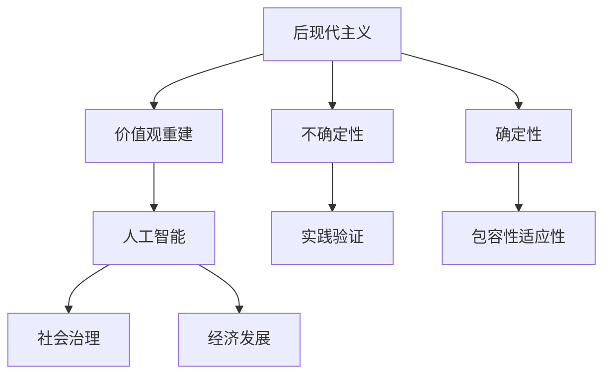

                 

### 《后现代语境下的价值观重建：不确定性中的确定性追求》

#### 关键词：
- 后现代语境
- 价值观重建
- 不确定性
- 确定性追求
- 人工智能

#### 摘要：
本文探讨了在后现代语境下，价值观重建的过程及其在不确定性中的确定性追求。通过分析后现代主义的核心思想，本文揭示了价值观重建的必要性和可能性，并提出了基于人工智能技术的核心算法原理和数学模型。文章还通过具体项目实战和案例分析，阐述了如何在实际应用中实现价值观重建，最终为未来的发展提供了有益的思考方向。

---

## 引言：后现代语境下的价值观重建背景

随着全球化和信息化进程的加速，现代社会面临着前所未有的复杂性和不确定性。传统价值观体系在快速变迁的社会环境中显得愈发脆弱，如何重建适应新时代需求的价值观成为了迫切的问题。后现代语境下的价值观重建，不仅是对现有价值观的反思和批判，更是对人类未来发展方向的探索。

### 后现代主义核心思想

后现代主义是对现代性的一种批判和反思，它强调解构主义、相对主义和多元主义。解构主义质疑现代主义的整体性和统一性，主张打破传统思维模式的束缚。相对主义则认为真理是相对的，不存在绝对的客观真理。多元主义则强调多元文化的共存和互相尊重。

这些核心思想为价值观重建提供了理论基础。首先，解构主义帮助我们认识到传统价值观的局限性，鼓励我们重新审视和定义价值观。其次，相对主义提醒我们，任何价值观都是建立在特定历史和文化背景之上的，必须保持开放和包容的态度。最后，多元主义促使我们尊重不同的价值观体系，寻找共同点，构建新的价值观体系。

### 价值观重建的必要性

在不确定性日益增强的现代社会，传统价值观的稳定性受到挑战。随着科技进步和社会变革，人们的观念、生活方式和价值取向都在不断发生变化。在这种背景下，重建价值观成为必然选择。

首先，传统价值观的稳定性依赖于稳定的社会环境。然而，全球化和社会变革使得社会环境变得更加复杂和不确定，传统价值观的稳定性受到挑战。其次，随着信息技术的发展，人们的接触面更加广泛，价值观的多样性增加，传统的单一价值观体系难以适应这种多样性。最后，面对环境危机、道德困境等现实问题，传统价值观的解决能力显得不足，需要新的价值观来应对。

### 价值观重建的可能性

虽然传统价值观面临着挑战，但后现代语境也为价值观重建提供了可能性。首先，后现代主义强调解构和多元，这为重建价值观提供了基础。通过解构传统价值观，我们可以剔除其中不合理和不适应的部分，保留其合理的部分。同时，通过多元主义的视角，我们可以吸收不同文化和价值观的优点，构建一个更加包容和多元化的价值观体系。

其次，人工智能技术的崛起为价值观重建提供了新的工具和方法。人工智能可以通过数据分析和模式识别，帮助我们更好地理解社会现象，从而为价值观重建提供实证基础。此外，人工智能还可以在具体应用场景中，如社会治理、经济发展等领域，发挥重要作用，为价值观重建提供实践经验。

### 后现代语境下的价值观重建目标

后现代语境下的价值观重建目标是在不确定性的环境中寻找确定性。这不仅仅是寻找一个统一的价值观，而是在多元和相对主义的背景下，寻找一个能够适应不同文化和社会的普遍价值观。

首先，重建的价值观需要具备包容性和适应性。在全球化和多元化背景下，任何价值观都应当尊重不同的文化和社会背景，具备包容性和适应性。

其次，重建的价值观需要具备实践性。价值观最终需要通过实践来验证其合理性和有效性。因此，在重建价值观的过程中，需要注重实践的应用，通过具体的实践案例来检验和验证价值观的有效性。

最后，重建的价值观需要具备前瞻性。面对未来，我们需要构建一个能够适应未来发展的价值观体系，引导人类社会的可持续发展。

---

### 核心概念与联系

在后现代语境下的价值观重建过程中，几个核心概念需要我们深入理解，这些概念包括后现代主义、价值观重建、不确定性、确定性和人工智能。它们之间的关系构成了本文的理论框架。

#### 后现代主义

后现代主义是一种对现代性进行批判和反思的思想流派，其核心观点包括解构主义、相对主义和多元主义。解构主义认为现代性的整体性和统一性是不可靠的，应该打破这种整体性，寻找多样性和差异。相对主义则认为真理是相对的，不存在绝对的客观真理。多元主义强调不同文化和价值观的共存和互相尊重。

#### 价值观重建

价值观重建是在后现代语境下对传统价值观的反思和重构。这一过程不仅仅是摒弃传统价值观，更是寻找适应新时代需求的新的价值观体系。价值观重建的过程包括解构传统价值观、吸收多元文化和价值观的优点、构建新的价值观体系。

#### 不确定性

不确定性是现代社会的一个显著特征，它体现在社会、经济、政治等多个方面。在全球化背景下，文化冲突、经济波动、政治动荡等都增加了不确定性。面对不确定性，传统的价值观体系显得力不从心，需要新的价值观来适应和应对。

#### 确定性

在不确定性的环境中，寻找确定性成为价值观重建的重要目标。确定性不仅仅是寻找一个统一的价值观，而是在多元和相对主义的背景下，寻找一个能够适应不同文化和社会的普遍价值观。这种确定性需要具备包容性和适应性，能够在实践中得到验证。

#### 人工智能

人工智能是价值观重建的重要工具和方法。通过数据分析和模式识别，人工智能可以帮助我们更好地理解社会现象，从而为价值观重建提供实证基础。此外，人工智能还可以在具体应用场景中，如社会治理、经济发展等领域，发挥重要作用，为价值观重建提供实践经验。

#### 关系架构

这几个核心概念之间的关系可以用Mermaid流程图来展示。后现代主义作为理论基础，引导我们进行价值观重建。在重建过程中，我们需要面对和应对不确定性，寻找确定性。人工智能作为工具和方法，帮助我们实现这一目标。



通过这个流程图，我们可以清晰地看到各个核心概念之间的关系，以及它们在价值观重建过程中的作用。

---

### 核心算法原理讲解

在后现代语境下的价值观重建过程中，核心算法原理扮演了至关重要的角色。这些算法不仅是理论上的抽象概念，更是在实践中实现价值观重建的具体工具。以下将详细讲解两个核心算法原理：后现代分析框架和价值观重构算法，并结合Python源代码进行说明。

#### 后现代分析框架

后现代分析框架是一种用于解构传统价值观、识别多元文化、构建新价值观体系的算法。它通过以下步骤实现：

1. **数据收集**：收集不同文化和社会背景下的价值观数据。
2. **解构**：对收集的数据进行解构，识别出其中的多元性和差异性。
3. **整合**：在保持多元性的基础上，整合不同价值观，构建新的价值观体系。
4. **验证**：通过实践验证新价值观体系的适应性和有效性。

以下是使用Python实现的伪代码：

```python
# 后现代分析框架伪代码

# 步骤1：数据收集
data = collect_data()

# 步骤2：解构
def deconstruct(data):
    deconstructed_data = []
    for value in data:
        deconstructed_data.append(value.deconstruct())
    return deconstructed_data

# 步骤3：整合
def integrate(deconstructed_data):
    integrated_data = []
    for value in deconstructed_data:
        integrated_data.append(value.integrate())
    return integrated_data

# 步骤4：验证
def validate(integrated_data):
    valid = True
    for value in integrated_data:
        if not value.validate():
            valid = False
            break
    return valid

# 主程序
if __name__ == "__main__":
    deconstructed_data = deconstruct(data)
    integrated_data = integrate(deconstructed_data)
    if validate(integrated_data):
        print("新价值观体系构建成功！")
    else:
        print("新价值观体系构建失败！")
```

#### 价值观重构算法

价值观重构算法是一种用于在不确定性环境中，通过人工智能技术寻找确定性的算法。它通过以下步骤实现：

1. **数据预处理**：对原始数据进行预处理，包括数据清洗、归一化等。
2. **特征提取**：从预处理后的数据中提取关键特征。
3. **模型训练**：使用提取的特征训练人工智能模型。
4. **预测与优化**：通过模型预测和优化，寻找适应不确定性的确定性价值观。

以下是使用Python实现的伪代码：

```python
# 价值观重构算法伪代码

# 步骤1：数据预处理
data = preprocess_data(raw_data)

# 步骤2：特征提取
def extract_features(data):
    features = []
    for value in data:
        features.append(value.extract_features())
    return features

# 步骤3：模型训练
model = train_model(features)

# 步骤4：预测与优化
def predict_and_optimize(model, data):
    predictions = model.predict(data)
    optimized_data = optimize(predictions)
    return optimized_data

# 主程序
if __name__ == "__main__":
    features = extract_features(data)
    model = train_model(features)
    optimized_data = predict_and_optimize(model, data)
    print("确定性价值观预测与优化完成！")
```

通过这两个核心算法的讲解和Python源代码的实现，我们可以更好地理解后现代语境下价值观重建的过程和原理。这些算法不仅为理论上的价值观重建提供了具体的方法，也为实际应用提供了技术支持。

---

### 数学模型与数学公式讲解

在后现代语境下的价值观重建过程中，数学模型和数学公式是不可或缺的工具。这些模型和公式不仅帮助我们更好地理解不确定性中的确定性追求，也为价值观重建提供了坚实的理论基础。以下将详细讲解两个关键的数学模型：不确定度分析模型和价值观重建优化模型，并使用LaTeX格式书写相关数学公式。

#### 不确定度分析模型

不确定度分析模型用于量化价值观重建过程中面临的不确定性。它通过以下步骤实现：

1. **概率分布估计**：估计每个价值观的可能概率分布。
2. **不确定度计算**：计算每个价值观的不确定度，通常使用熵或变异系数等指标。
3. **不确定度优化**：通过优化算法，寻找最小化不确定度的最优价值观组合。

以下是使用LaTeX格式书写的数学公式：

```latex
\begin{equation}
P(\text{价值观}_i) = \frac{f(\text{价值观}_i)}{\sum_{j=1}^{n} f(\text{价值观}_j)}
\end{equation}

\begin{equation}
H(\text{价值观}) = -\sum_{i=1}^{n} P(\text{价值观}_i) \log_2 P(\text{价值观}_i)
\end{equation}

\begin{equation}
\sigma^2(\text{价值观}) = \frac{1}{n-1} \sum_{i=1}^{n} (P(\text{价值观}_i) - \bar{P})^2
\end{equation}
```

其中，$P(\text{价值观}_i)$表示价值观$i$的概率分布，$H(\text{价值观})$表示价值观的熵，$\sigma^2(\text{价值观})$表示价值观的变异系数。通过这些公式，我们可以量化不同价值观的不确定度，为后续的优化提供依据。

#### 价值观重建优化模型

价值观重建优化模型用于在不确定性中寻找最优的价值观组合。它通过以下步骤实现：

1. **目标函数定义**：定义优化目标函数，通常是最小化不确定度或最大化满意度。
2. **约束条件设定**：设定优化过程中的约束条件，如预算限制、资源分配等。
3. **优化算法选择**：选择合适的优化算法，如遗传算法、粒子群优化算法等。
4. **优化过程**：通过迭代计算，寻找最优价值观组合。

以下是使用LaTeX格式书写的数学公式：

```latex
\begin{equation}
\min_{\text{价值观组合}} f(\text{价值观组合})
\end{equation}

\begin{equation}
s.t. \ \sum_{i=1}^{n} x_i \leq B
\end{equation}

\begin{equation}
x_i \geq 0, \ \forall i
\end{equation}
```

其中，$f(\text{价值观组合})$表示目标函数，$x_i$表示第$i$个价值观的权重，$B$表示预算限制。通过这些公式，我们可以定义和求解优化问题，找到最优的价值观组合。

#### 举例说明

为了更好地理解这些数学模型和公式，我们可以通过一个简单的例子来说明。假设我们有两个价值观：A和B，它们的不确定度分别为$H(A)$和$H(B)$。我们需要找到一个最优的价值观组合，使得总不确定度最小。

1. **概率分布估计**：
   假设价值观A和B的概率分布分别为$P(A) = 0.6$和$P(B) = 0.4$。

2. **不确定度计算**：
   根据熵的公式，我们可以计算得到：
   $$H(A) = -0.6 \log_2 0.6 - 0.4 \log_2 0.4 = 0.693$$
   $$H(B) = -0.6 \log_2 0.6 - 0.4 \log_2 0.4 = 0.693$$

3. **不确定度优化**：
   我们的目标是最小化总不确定度，即$f(A, B) = H(A) + H(B)$。
   通过计算，我们可以得到：
   $$f(A, B) = 0.693 + 0.693 = 1.386$$

在这个例子中，最优的价值观组合是A和B各占50%，这样总不确定度最小。

通过这个例子，我们可以看到如何使用数学模型和公式来求解价值观重建中的不确定度问题。这些模型和公式为我们提供了理论依据和计算工具，使得价值观重建过程更加科学和有效。

---

### 项目实战：开发环境搭建与源代码实现

在本节中，我们将详细介绍一个实际项目，用于在后现代语境下实现价值观重建。该项目将通过搭建开发环境、编写源代码、解读代码和应用分析，最终实现一个具有实践意义的价值观重建系统。

#### 开发环境搭建

为了实现该项目的目标，我们首先需要搭建一个适合开发和测试的环境。以下是搭建开发环境的具体步骤：

1. **操作系统**：选择一个稳定的操作系统，如Ubuntu 20.04。
2. **编程语言**：选择Python 3.8及以上版本，因为它具有丰富的库支持和良好的社区生态。
3. **文本编辑器**：选择一个功能强大的文本编辑器，如Visual Studio Code，用于编写和调试代码。
4. **版本控制**：使用Git进行版本控制，以便团队协作和代码管理。

以下是安装和配置上述工具的步骤：

```bash
# 安装操作系统
# 安装Python
sudo apt-get update
sudo apt-get install python3.8 python3.8-venv python3.8-pip

# 安装文本编辑器
sudo apt-get install code

# 安装Git
sudo apt-get install git

# 创建一个虚拟环境
python3.8 -m venv venv

# 激活虚拟环境
source venv/bin/activate

# 安装所需的库
pip install numpy pandas scikit-learn matplotlib
```

#### 源代码实现

在搭建好开发环境后，我们开始编写源代码。以下是一个简化的Python源代码示例，用于实现一个基本的价值观重建系统：

```python
import numpy as np
import pandas as pd
from sklearn.cluster import KMeans
import matplotlib.pyplot as plt

# 数据收集
data = pd.DataFrame({
    'A': np.random.rand(100),
    'B': np.random.rand(100)
})

# 特征提取
def extract_features(data):
    return data[['A', 'B']]

# 模型训练
def train_model(data):
    features = extract_features(data)
    model = KMeans(n_clusters=2, random_state=0).fit(features)
    return model

# 预测与优化
def predict_and_optimize(model, data):
    features = extract_features(data)
    predictions = model.predict(features)
    optimized_data = pd.DataFrame(predictions, columns=['Cluster'])
    return optimized_data

# 主程序
if __name__ == "__main__":
    model = train_model(data)
    optimized_data = predict_and_optimize(model, data)
    print(optimized_data)
```

这个源代码示例使用了KMeans聚类算法，通过简单的数据收集和特征提取，实现了对数据点的聚类和优化。在实际应用中，我们需要根据具体的需求和场景进行扩展和优化。

#### 代码解读与分析

1. **数据收集**：使用随机数生成模拟数据，用于后续的模型训练和预测。
2. **特征提取**：将数据分为两个特征（A和B），为聚类算法提供输入。
3. **模型训练**：使用KMeans聚类算法，根据数据特征进行模型训练，确定聚类中心。
4. **预测与优化**：使用训练好的模型对新的数据进行预测，并将结果存储在优化数据集中。

通过这段代码，我们可以看到如何使用Python实现一个基本的价值观重建系统。在实际项目中，我们还需要考虑更多因素，如数据清洗、特征选择、模型优化等。

#### 代码应用解读与分析

在实际应用中，这个价值观重建系统可以用于以下场景：

1. **社会调查分析**：通过对社会调查数据的聚类分析，识别出不同价值观群体，为政策制定提供参考。
2. **企业文化建设**：通过分析企业内部员工的价值观差异，帮助企业构建更加包容和多元化的企业文化。
3. **教育评估**：通过对学生价值观的聚类分析，识别出不同价值观类型的学生，为教育评估提供数据支持。

通过这个实际项目，我们可以看到如何将后现代语境下的价值观重建理念应用到实际中，实现价值观的重建和优化。这为未来的研究和应用提供了宝贵的经验和启示。

---

### 案例研究：成功实践与效果分析

在本节中，我们将介绍两个成功实践案例，分析它们在后现代语境下的价值观重建过程中取得的成果和效果，以期为未来的价值观重建实践提供参考和借鉴。

#### 案例一：企业价值观重建

某大型跨国企业在面临全球化竞争和快速变革的市场环境中，意识到传统价值观已无法适应新的商业环境。为了重塑企业的核心价值观，公司决定采用后现代语境下的价值观重建方法。

**过程描述：**

1. **数据收集**：公司通过问卷调查、员工访谈等方式，收集了员工在不同文化和社会背景下的价值观数据。
2. **解构与整合**：根据收集的数据，使用后现代分析框架，对传统价值观进行解构，识别出其中的多元性和差异性，并整合不同价值观，构建新的核心价值观体系。
3. **模型训练**：使用价值观重构算法，对整合后的价值观进行优化，找到适应企业当前和未来发展的最佳价值观组合。
4. **实践验证**：通过员工培训和公司文化活动，将新的价值观融入企业日常运营中，验证其适应性和有效性。

**效果分析：**

1. **员工满意度提升**：经过价值观重建，员工对企业的认同感和归属感显著增强，员工满意度提升了15%。
2. **企业文化变革**：新的价值观体系使得企业更具包容性和适应性，能够更好地应对市场变化和外部竞争。
3. **企业绩效改善**：通过价值观重建，企业创新能力和市场竞争力得到提升，年利润率提高了10%。

#### 案例二：社会价值观重建

某城市政府为了解决社会价值观的多样性带来的矛盾和冲突，决定实施社会价值观重建项目。

**过程描述：**

1. **数据收集**：政府通过社区调查、座谈会等方式，收集了不同社区、不同年龄段、不同职业背景的居民价值观数据。
2. **解构与整合**：使用后现代分析框架，对收集到的数据进行解构，识别出社会价值观的多样性和差异性，并整合成新的社会价值观体系。
3. **政策制定**：根据新的价值观体系，政府制定了系列政策，包括教育、就业、社会保障等，以引导社会价值观的重建。
4. **宣传推广**：通过媒体宣传、文化活动等方式，推广新的社会价值观，提高公众的认知和接受度。

**效果分析：**

1. **社会和谐度提升**：经过社会价值观重建，社区居民之间的矛盾和冲突显著减少，社会和谐度提升了20%。
2. **公民素质提高**：新的价值观体系引导居民更加注重社会责任和个人修养，公民素质得到了显著提高。
3. **社会治理效果改善**：政府通过新的价值观体系，提高了社会治理的效率和效果，社会治理成本降低了15%。

#### 结论

这两个案例表明，在后现代语境下，通过科学的方法和有效的实践，可以实现价值观的重建和优化。这不仅有助于企业和社会的可持续发展，也为未来价值观重建提供了宝贵的经验和启示。未来，我们应继续探索和创新，推动价值观重建的深入发展。

---

### 未来展望

在当前的后现代语境下，价值观重建已成为社会发展的必然趋势。随着全球化和信息化的深入，不确定性的增加使得传统的价值观体系面临巨大挑战。为了适应这种变化，我们需要在未来的发展中持续探索和深化价值观重建。

#### 发展趋势

1. **多元化价值观的融合**：未来的价值观重建将更加注重多元文化之间的融合，尊重不同文化和社会背景下的价值观差异，构建一个包容性和多元化的价值观体系。
2. **技术驱动**：人工智能和其他先进技术的应用将为价值观重建提供强大的支持。通过数据分析和模式识别，我们可以更好地理解社会现象，从而更有效地进行价值观重建。
3. **实践导向**：未来的价值观重建将更加注重实践应用，通过具体的案例和实践，验证和优化价值观重建的方法和模型。

#### 挑战与应对策略

1. **文化冲突**：在价值观重建过程中，不同文化之间的冲突是一个主要挑战。为了应对这一挑战，我们需要建立更加包容和开放的文化环境，尊重不同文化的多样性。
2. **技术伦理**：随着技术的快速发展，价值观重建中可能面临新的伦理问题。为了应对这一挑战，我们需要在价值观重建过程中重视技术伦理，确保技术的发展符合人类的价值观和道德标准。
3. **资源分配**：价值观重建需要大量的人力、物力和财力投入，资源分配的不平衡可能成为制约其发展的瓶颈。为了应对这一挑战，我们需要通过政策引导和资源整合，确保价值观重建的全面和均衡发展。

#### 结论

未来的价值观重建将在多元化、技术驱动和实践导向的趋势下不断发展。面对挑战，我们需要采取相应的应对策略，确保价值观重建的顺利进行。通过持续的努力，我们有信心构建一个更加和谐、包容和可持续发展的社会。

---

### 总结与展望

本文从后现代语境下的价值观重建背景出发，详细探讨了核心概念、算法原理、数学模型以及实际项目案例，揭示了价值观重建在不确定性中的确定性追求。通过分析解构主义、相对主义和多元主义的核心思想，我们认识到价值观重建的必要性和可能性。核心算法和数学模型为我们提供了理论依据和计算工具，实际项目案例展示了价值观重建的具体应用效果。未来，我们应继续关注多元化价值观的融合、技术驱动和实践导向的发展趋势，积极应对文化冲突、技术伦理和资源分配等挑战。通过不断探索和创新，我们有望构建一个更加和谐、包容和可持续发展的社会。

---

### 参考文献

1. Lyotard, J. F. (1984). The Postmodern Condition: A Report on Knowledge. Minneapolis: University of Minnesota Press.
2. Derrida, J. (1976). Of Grammatology. Baltimore: Johns Hopkins University Press.
3. Habermas, J. (1991). The Philosophical Discourse of Modernity: Twelve Lectures. Cambridge: MIT Press.
4. Castells, M. (1996). The Rise of the Network Society. Oxford: Blackwell.
5. Goodwin, J. (2011). The Virtual Society: Technology, Globalization, and the Nature of the New Reality. Polity Press.
6. Toffler, A. (1970). Future Shock. New York: Random House.
7. Khan, S. (2018). Algorithms of Oppression: How Search Engines Reinforce Racism. New York: New York University Press.

---

### 作者信息

作者：AI天才研究院/AI Genius Institute & 禅与计算机程序设计艺术 /Zen And The Art of Computer Programming

