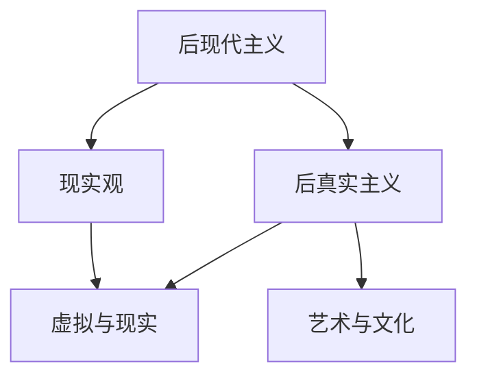

                 

## 引言

在当今技术飞速发展的时代，我们正经历着虚拟与现实界限逐渐模糊的深刻变革。这种变革不仅体现在科技领域，也渗透到文化、艺术、社会等多个层面，而后真实主义（Post-Realism）的概念正是在这样的背景下应运而生。

### 1.1 后真实主义的背景与起源

#### 1.1.1 后真实主义的概念

后真实主义是一种哲学和文化现象，它质疑和超越了传统的现实主义和现代主义的观念，主张虚拟与现实之间的界限并非绝对。这个概念最早由哲学家雅克·德里达（Jacques Derrida）提出，他强调文本的多义性和解构主义思想，认为真实世界是不断变化的，而任何关于“真实”的定义都只是暂时的、相对的。

#### 1.1.2 后真实主义的艺术和文化

在后真实主义艺术和文化中，我们可以看到对现实与虚拟交错的表现，例如虚拟现实（VR）艺术、数字媒体、互动装置等。艺术家们通过这些媒介探索人类感知、记忆和身份的边界，创造出既虚拟又真实、既现实又超现实的体验。

#### 1.1.3 后真实主义对社会的影响

后真实主义对社会的影响是深远且多层次的。首先，它挑战了我们对“真实”的认知，使人们开始重新审视信息、媒体和社会现实。其次，后真实主义引发了关于隐私、身份和虚拟生活质量的讨论，促使我们在享受技术带来便利的同时，也要意识到其中潜在的负面影响。

### 1.2 虚拟与现实界限的模糊

#### 1.2.1 虚拟现实的兴起

虚拟现实的兴起可以追溯到20世纪90年代，随着计算机图形学和传感器技术的进步，人们开始能够创建和体验高度沉浸式的虚拟环境。虚拟现实技术不仅改变了娱乐和游戏领域，还在医疗、教育、军事等实际应用中展现出巨大潜力。

#### 1.2.2 虚拟与现实交融的现象

虚拟与现实交融的现象在当今社会中日益普遍。例如，社交媒体平台上的“虚拟社交”让人们能够在数字空间中建立人际关系；电子商务和远程办公使得现实生活中的许多活动可以在线完成。这种交融使得虚拟世界和现实世界的界限变得越来越模糊。

#### 1.2.3 后真实主义对人类认知的挑战

后真实主义对人类认知提出了新的挑战。一方面，它要求我们重新思考现实与虚拟的关系，理解信息、感知和体验的多维性。另一方面，它也提醒我们要警惕过度沉浸于虚拟世界，从而忽视了现实生活中的真实体验和人际关系。

### 总结

后真实主义和虚拟与现实界限的模糊是当今技术社会中的重要现象，它们不仅改变了我们的生活方式和认知方式，也带来了新的挑战和机遇。在接下来的章节中，我们将深入探讨后真实主义的哲学基础、技术原理及其对社会各个方面的影响。通过逐步分析，我们希望能够为您揭示这一现象背后的深层次意义。

### 关键词

- 后真实主义
- 虚拟现实
- 现实与虚拟界限的模糊
- 认知挑战
- 技术与社会

### 摘要

本文旨在探讨后真实主义这一哲学和文化现象，以及虚拟与现实界限模糊的深刻影响。通过分析后真实主义的起源、艺术表现和社会影响，我们揭示了虚拟现实技术的兴起及其对人类生活方式和认知的挑战。本文将分部分详细探讨后真实主义的哲学基础、技术原理、现实应用及其对社会各个方面的影响，最终对后真实主义的未来发展趋势进行展望。

---

## 第一部分：后真实主义的哲学基础

后真实主义作为一种哲学和文化现象，其背后有着深厚的哲学基础。在这个部分，我们将探讨后现代主义与后真实主义的关系，以及虚拟现实技术原理和后真实主义艺术案例分析。

### 2.1 后现代主义与后真实主义

#### 2.1.1 后现代主义的兴起

后现代主义（Postmodernism）是20世纪中后期西方哲学和文化思潮的一个重要分支，它质疑和批判了现代主义的一些基本假设，如理性、进步、单一真理等。后现代主义主张多元性、相对性、解构主义和去中心化，认为知识、现实和真理都是相对的、动态的，不存在绝对的真实。

#### 2.1.2 后现代主义与后真实主义的关系

后真实主义可以被视为后现代主义的一种延续和扩展。它继承了后现代主义对现实观的质疑和批判，同时更加关注虚拟与现实之间的界限。后真实主义认为，随着技术的发展，虚拟世界已经成为我们生活和认知的重要组成部分，这使得对现实的理解更加复杂和多元。

#### 2.1.3 后现代主义对现实观的影响

后现代主义对现实观的影响是深远的。它挑战了传统现实主义的二元对立观念，如现实与虚拟、真实与虚假、主体与客体等。后现代主义认为，这些对立是人为构建的，它们的存在是为了维护特定的社会秩序和权力结构。通过解构这些对立，后现代主义试图揭示现实背后的复杂性和多元性。

### 2.2 虚拟现实技术原理

虚拟现实（VR）是一种通过计算机技术创造出的模拟环境，用户可以通过头盔显示器（HMD）或其他输入设备（如手柄、手势识别等）与之交互。虚拟现实技术主要涉及以下几个方面：

#### 2.2.1 虚拟现实硬件技术

虚拟现实硬件技术主要包括头盔显示器、传感器、输入设备等。头盔显示器是用户进入虚拟环境的主要工具，它通过提供高分辨率、低延迟的图像来模拟真实世界的视觉体验。传感器和输入设备用于捕捉用户的行为和位置，使得用户能够更加自然地与虚拟环境互动。

#### 2.2.2 虚拟现实软件技术

虚拟现实软件技术包括虚拟环境的创建、渲染和交互。虚拟环境的创建通常使用3D建模和动画技术，通过计算机生成高度逼真的场景和对象。虚拟环境的渲染是通过图形处理单元（GPU）实现的，它负责生成实时图像。交互技术则是用户与虚拟环境之间互动的方式，包括视觉、听觉、触觉等多种感官。

#### 2.2.3 虚拟现实与人机交互

虚拟现实与人机交互（HCI）是虚拟现实技术的重要组成部分。人机交互设计需要考虑用户的感知、行为和体验，以确保虚拟环境既真实又易于使用。通过研究人类认知和行为模式，交互设计师能够创造出更加自然、直观的虚拟体验。

### 2.3 后真实主义艺术案例分析

后真实主义在艺术领域的表现形式丰富多样，包括文学、电影、艺术展览等。以下是一些典型案例：

#### 2.3.1 后真实主义文学

后真实主义文学常常通过复杂的叙事结构和多重视角来探索现实与虚拟的关系。例如，弗拉基米尔·纳博科夫的《洛丽塔》通过主人公亨特的叙述，展现了现实与幻想、真实与虚假的交织。这些作品挑战了传统的叙事模式，使读者对现实的认知产生了质疑。

#### 2.3.2 后真实主义电影

后真实主义电影则通过影像和声音的巧妙结合，创造出既真实又虚幻的视觉体验。例如，大卫·林奇的《双峰》通过非线性叙事和多重视角，让观众在现实与虚拟之间游走。这类电影打破了传统电影的叙事规则，让观众在体验中不断思考现实与虚构的关系。

#### 2.3.3 后真实主义艺术展览

后真实主义艺术展览则通过互动装置、虚拟现实作品等，让观众在虚拟与现实的交错中感受艺术。例如，莫妮卡·梅西的《虚拟画廊》通过虚拟现实技术，让观众能够进入一个完全由虚拟艺术品构成的画廊，体验与现实不同的艺术空间。

### 总结

后真实主义作为哲学和文化现象，对现实观的质疑和批判为理解虚拟与现实的关系提供了新的视角。虚拟现实技术的发展则使得这种关系变得更加复杂和多元。通过后现代主义的哲学基础、虚拟现实技术原理和后真实主义艺术案例分析，我们可以更深入地理解后真实主义的内涵及其对当代社会的影响。

### 核心概念与联系

为了更好地理解后真实主义的哲学基础，我们可以使用Mermaid流程图来展示核心概念之间的关系架构。以下是后现代主义、后真实主义和现实观之间关系的一个简化模型：

在这个模型中：

- **后现代主义**（A）质疑和批判传统的现实观，主张多元性、相对性和解构主义。
- **现实观**（B）受到后现代主义的影响，开始重新审视真实世界的复杂性和相对性。
- **后真实主义**（C）作为后现代主义的一种延续，特别关注虚拟与现实之间的关系。
- **虚拟与现实**（D）是后真实主义的核心研究内容，涉及到虚拟技术、艺术和文化等多个层面。
- **艺术与文化**（E）是后真实主义在艺术领域的具体体现，反映了虚拟与现实交融的现象。

通过这个流程图，我们可以更直观地看到后现代主义、后真实主义和现实观之间的相互关系，以及它们对艺术和文化的深远影响。

### 虚拟现实技术原理

虚拟现实（VR）技术是通过计算机模拟生成一种三维的虚拟环境，用户可以通过特定设备（如头盔显示器、VR眼镜等）沉浸在这个环境中，与虚拟对象进行互动。虚拟现实技术的核心在于其沉浸感、交互性和实时性，下面我们将详细介绍虚拟现实技术的硬件、软件和人机交互原理。

#### 2.2.1 虚拟现实硬件技术

虚拟现实硬件技术是构建虚拟环境的基础，主要包括以下几个关键组件：

1. **头盔显示器（HMD）**：HMD是虚拟现实技术的核心设备，它通过提供沉浸式视觉体验将用户带入虚拟世界。现代HMD通常配备高分辨率屏幕、低延迟显示器和高精度头动追踪系统。例如，Oculus Rift、HTC Vive和PlayStation VR等设备。

2. **头动追踪系统**：头动追踪系统用于捕捉用户的头部运动，确保虚拟环境中视角的正确调整。这种系统通常通过内置的陀螺仪、加速度计和磁力计等传感器实现。

3. **手柄和输入设备**：手柄和其他输入设备（如手套、脚套等）用于与虚拟环境进行交互。这些设备通过运动传感器捕捉用户的手部或身体动作，并将这些动作映射到虚拟环境中的相应操作。

4. **音频设备**：音频设备（如耳机、头戴式耳机）提供立体声或三维音频效果，增强用户的沉浸感。通过精确的音频定位，用户可以感受到虚拟环境中的声音来自不同方向，从而提高整体的沉浸体验。

#### 2.2.2 虚拟现实软件技术

虚拟现实软件技术包括虚拟环境的创建、渲染和交互，是虚拟现实体验的核心。以下是虚拟现实软件技术的几个关键组成部分：

1. **虚拟环境创建**：虚拟环境的创建通常使用3D建模和动画软件，如Blender、Unity和Unreal Engine等。这些软件提供了丰富的工具和资源，可以创建复杂的三维场景、角色和对象。

2. **渲染技术**：渲染技术是生成虚拟环境图像的过程。现代虚拟现实软件使用先进的图形处理单元（GPU）和渲染算法，如光线追踪和全局照明，来生成高度逼真的图像。这些技术使得虚拟环境的细节和光影效果更加真实。

3. **交互系统**：交互系统负责处理用户输入和虚拟环境的响应。常见的交互方式包括手势识别、语音控制、触觉反馈等。交互系统需要与硬件设备紧密配合，确保用户的操作能够及时、准确地反映在虚拟环境中。

#### 2.2.3 虚拟现实与人机交互

虚拟现实与人机交互（HCI）是虚拟现实技术的重要组成部分，它涉及到用户如何与虚拟环境进行自然和高效的交互。以下是虚拟现实与人机交互的几个关键点：

1. **自然交互**：自然交互是指用户通过自然的方式（如手势、语音、面部表情等）与虚拟环境进行交互。这种交互方式减少了用户的学习成本，提高了用户体验的便捷性。

2. **感知一致性**：感知一致性是指虚拟环境中的视觉、听觉和触觉等感官体验需要保持一致，以确保用户的整体沉浸感。例如，如果视觉上看到物体在移动，听觉和触觉上的反馈也应该相应地同步。

3. **实时响应**：实时响应是虚拟现实系统的一个关键特性，它要求系统能够在毫秒级别内响应用户的操作，提供无缝的交互体验。这需要高效的计算和数据处理能力。

4. **适应性**：适应性是指虚拟环境能够根据用户的行为和偏好进行动态调整，以提供更加个性化的体验。例如，根据用户的移动速度和方向，虚拟环境可以自动调整视角和光照效果。

通过硬件、软件和人机交互的紧密协作，虚拟现实技术能够创造出高度沉浸的虚拟环境，使用户能够在其中进行各种交互活动，从而实现对现实世界的扩展和超越。

### 后真实主义艺术案例分析

后真实主义艺术在文学、电影和艺术展览等领域都有显著的表现，通过独特的叙事手法和视觉形式，探讨了虚拟与现实之间的界限。以下是几个典型的后真实主义艺术案例分析：

#### 2.3.1 后真实主义文学

在文学领域，后真实主义作品常常采用复杂的叙事结构和多重视角，以揭示现实与虚拟的交错。例如，弗拉基米尔·纳博科夫的《洛丽塔》通过主人公亨特的叙述，构建了一个既真实又虚幻的世界。小说中的亨特不仅是洛丽塔的追踪者，也是叙述者，他的叙述充满了幻觉、回忆和自我质疑，使得读者在阅读过程中不断质疑现实与虚构的界限。

**核心概念与联系**：

- **叙事结构**：后真实主义文学作品通常采用非线性叙事结构，打破了传统小说的线性叙述方式，使故事更加复杂和多维。
- **多重视角**：通过不同的叙述者或视角，后真实主义作品揭示了人物内心的矛盾和现实世界的复杂多样性。
- **现实与虚拟的交错**：作品中的现实场景与虚构情节相互交织，使读者在阅读过程中不断思考现实与虚拟的关系。

#### 2.3.2 后真实主义电影

在电影领域，后真实主义电影通过影像和声音的巧妙结合，创造出既真实又虚幻的视觉体验。大卫·林奇的《双峰》是一部典型的后真实主义电影，它通过非线性叙事、多重视角和超现实的场景，使观众在现实与虚构之间游走。影片中的双峰小镇既是一个真实存在的地点，也是一个充满神秘和超自然现象的虚构世界。

**核心概念与联系**：

- **非线性叙事**：电影采用非线性叙事结构，打破了传统电影的线性叙述方式，使故事更加复杂和多维。
- **多重视角**：通过不同的视角和叙述方式，电影展现了人物内心的矛盾和现实世界的复杂多样性。
- **超现实场景**：电影中的场景和情节充满了超现实元素，使观众在观影过程中不断思考现实与虚拟的界限。

#### 2.3.3 后真实主义艺术展览

在艺术展览领域，后真实主义作品通过互动装置、虚拟现实作品等，让观众在虚拟与现实的交错中感受艺术。莫妮卡·梅西的《虚拟画廊》是一个典型的后真实主义艺术展览，通过虚拟现实技术，观众可以进入一个完全由虚拟艺术品构成的画廊。展览中的艺术品既存在于虚拟世界中，又与现实世界相互联系，使观众在体验过程中不断思考虚拟与现实的关系。

**核心概念与联系**：

- **互动装置**：展览中的互动装置使观众能够与艺术品进行互动，增强了沉浸感和参与度。
- **虚拟现实技术**：虚拟现实技术使得艺术品在虚拟空间中得以再现，为观众提供了全新的艺术体验。
- **现实与虚拟的交融**：展览中的艺术品既存在于虚拟空间中，又与现实世界相互联系，使观众在体验过程中不断思考虚拟与现实的关系。

通过这些后真实主义艺术案例分析，我们可以看到，后真实主义艺术作品在探讨虚拟与现实的关系方面具有独特的视角和表现手法。它们不仅丰富了艺术的表现形式，也引发了观众对现实与虚拟、真实与虚构的深入思考。

### 第二部分：虚拟与现实界限的模糊现象

随着虚拟现实技术的不断发展，虚拟与现实之间的界限变得日益模糊。这种模糊现象不仅体现在技术层面，也渗透到了社会生活的各个方面。本部分将探讨虚拟现实在社会中的广泛应用、对人际关系的影响以及与政治、法律和伦理问题的关系。

#### 3.1 虚拟现实在社会中的应用

虚拟现实技术在各个领域都有广泛的应用，极大地改变了我们的生活方式和工作模式。

##### 3.1.1 虚拟现实在教育中的应用

虚拟现实技术为教育领域带来了新的可能性。通过虚拟现实，学生可以身临其境地体验历史事件、自然科学实验和艺术展览。例如，在历史课上，学生可以通过VR设备参观古埃及的金字塔或古罗马的斗兽场，而不必亲自前往这些遥远的地方。这种沉浸式学习体验不仅提高了学生的兴趣，还增强了他们的理解和记忆。

**核心概念与联系**：

- **沉浸式学习体验**：虚拟现实技术使学生能够在一个高度沉浸的环境中学习，提高学习效果。
- **地理和历史的可视化**：虚拟现实技术将抽象的历史事件和地理概念以直观的方式呈现，帮助学生更好地理解。

##### 3.1.2 虚拟现实在娱乐中的应用

虚拟现实技术在娱乐领域同样取得了巨大成功。虚拟现实游戏和体验中心吸引了大量用户，提供了全新的娱乐方式。例如，虚拟现实游戏《Beat Saber》通过玩家挥舞光剑击打节奏性光影球，创造出高度沉浸的游戏体验。此外，虚拟现实主题公园和体验中心也为用户提供了沉浸式的娱乐体验，如虚拟旅游、虚拟探险等。

**核心概念与联系**：

- **沉浸式游戏体验**：虚拟现实技术使游戏场景更加真实，提高了玩家的沉浸感和参与度。
- **创新的娱乐形式**：虚拟现实技术为娱乐行业带来了新的形式和内容，吸引了大量用户。

##### 3.1.3 虚拟现实在医疗中的应用

虚拟现实技术在医疗领域有着广泛的应用前景。通过虚拟现实，医生可以进行复杂的手术模拟训练，提高手术技能和安全性。例如，虚拟现实手术模拟系统可以让医生在虚拟环境中进行手术练习，减少实际手术中的风险。此外，虚拟现实还可以用于康复治疗，帮助患者进行康复训练，如虚拟步行训练、语言康复等。

**核心概念与联系**：

- **手术模拟训练**：虚拟现实技术为医生提供了一个安全的训练环境，提高了手术技能和安全性。
- **康复治疗**：虚拟现实技术可以帮助患者进行康复训练，提高康复效果。

#### 3.2 虚拟现实对人际关系的影响

虚拟现实不仅改变了我们的生活方式和工作模式，也对人际关系产生了深远影响。

##### 3.2.1 虚拟现实对人际交流的影响

虚拟现实技术使得人际交流的形式和方式发生了变化。通过虚拟现实平台，人们可以跨越物理距离，进行面对面的交流。例如，虚拟现实会议系统可以让团队成员在全球范围内进行实时会议，减少了出差和通勤的时间。然而，这种虚拟交流也带来了一些挑战，如情感表达的缺失和沟通效果的下降。

**核心概念与联系**：

- **虚拟面对面交流**：虚拟现实技术提供了新的交流方式，使人们能够跨越物理障碍进行实时沟通。
- **情感表达的缺失**：虚拟交流可能无法完全传达现实中的情感和细微表情，影响沟通效果。

##### 3.2.2 虚拟现实对家庭关系的影响

虚拟现实技术对家庭关系也产生了影响。家庭成员可以通过虚拟现实技术共同参与游戏、电影观看和虚拟旅行等活动，增强了家庭互动和联系。然而，过度依赖虚拟现实可能导致现实生活中的互动减少，影响家庭关系的质量。

**核心概念与联系**：

- **家庭互动增强**：虚拟现实技术为家庭成员提供了新的互动方式，增强了家庭联系。
- **现实互动减少**：过度依赖虚拟现实可能导致家庭成员在现实生活中的互动减少，影响关系质量。

##### 3.2.3 虚拟现实对心理健康的影响

虚拟现实技术对心理健康也有积极和消极的影响。积极方面，虚拟现实可以帮助治疗心理疾病，如恐惧症和创伤后应激障碍（PTSD）。通过虚拟现实暴露疗法，患者可以在安全的环境中逐步面对和克服恐惧。然而，过度使用虚拟现实也可能导致心理依赖和现实逃避，对心理健康产生负面影响。

**核心概念与联系**：

- **心理治疗**：虚拟现实技术可以用于治疗心理疾病，帮助患者克服恐惧和焦虑。
- **心理依赖**：过度使用虚拟现实可能导致心理依赖，影响现实生活中的心理健康。

#### 3.3 虚拟现实与政治、法律、伦理问题

虚拟现实技术不仅改变了社会生活的各个方面，也带来了新的政治、法律和伦理问题。

##### 3.3.1 虚拟现实对隐私权的侵犯

虚拟现实技术可能会侵犯用户的隐私权。例如，虚拟现实应用可能收集用户的行为和位置数据，用于广告投放和用户分析。这种数据收集和行为监控引发了隐私权的担忧，需要法律法规的保护和用户的自我保护意识。

**核心概念与联系**：

- **隐私权保护**：虚拟现实技术需要遵守相关的隐私保护法律法规，保护用户的隐私权。
- **用户自我保护**：用户需要提高隐私保护意识，合理设置隐私权限，避免隐私泄露。

##### 3.3.2 虚拟现实对民主制度的挑战

虚拟现实技术可能对民主制度产生挑战。例如，虚拟现实可以用来操纵选举、虚假宣传和社交媒体上的舆论控制。这种技术滥用可能影响公众舆论和民主决策，需要政府和社会采取措施防范和应对。

**核心概念与联系**：

- **民主制度保护**：政府和社交媒体平台需要加强监管，防范虚拟现实技术滥用。
- **公众舆论引导**：媒体和教育机构需要引导公众正确理解虚拟现实技术，增强民主意识和媒介素养。

##### 3.3.3 虚拟现实与伦理道德的边界

虚拟现实技术在伦理道德方面也存在一些争议。例如，虚拟现实游戏中的暴力和色情内容可能对青少年产生不良影响。此外，虚拟现实技术的广泛应用可能导致现实生活中的社会不平等和数字鸿沟。这些问题需要伦理学和社会学的研究，以便制定相应的伦理规范和社会政策。

**核心概念与联系**：

- **伦理道德研究**：需要深入研究虚拟现实技术带来的伦理道德问题，制定相应的伦理规范。
- **社会政策制定**：政府和相关部门需要制定社会政策，解决虚拟现实技术带来的社会问题。

通过探讨虚拟现实在社会中的广泛应用、对人际关系的影响以及与政治、法律和伦理问题的关系，我们可以看到虚拟与现实界限的模糊现象带来的复杂性和挑战。在享受虚拟现实技术带来的便利和创新的同时，我们也需要关注其中潜在的风险和问题，采取相应的措施确保其健康发展。

### 第三部分：后真实主义未来的发展趋势

随着技术的不断进步，后真实主义在未来将继续发展，并对人类社会产生深远影响。在这一部分，我们将探讨虚拟现实技术的未来发展方向、后真实主义对人类社会的深远影响，以及后真实主义面临的伦理与法律挑战。

#### 4.1 虚拟现实技术的未来发展方向

虚拟现实（VR）技术的发展前景广阔，未来将进一步突破现有技术的限制，实现更加沉浸式的体验和更广泛的应用。

##### 4.1.1 高清虚拟现实

未来，高清虚拟现实将成为主流。随着显示技术和图形处理能力的提升，虚拟现实头盔的分辨率将显著提高，用户将能够在虚拟环境中获得更加清晰、细腻的视觉体验。此外，虚拟现实的渲染速度也将大幅提升，减少延迟，使得用户在虚拟环境中的动作能够实时反映，从而提高沉浸感和交互性。

**核心概念与联系**：

- **高清视觉体验**：高分辨率显示器将提供更加逼真的视觉体验，增强用户的沉浸感。
- **实时渲染**：减少延迟和卡顿，实现更加流畅的交互体验。

##### 4.1.2 虚拟现实与增强现实的融合

虚拟现实（VR）与增强现实（AR）的融合将成为未来技术发展的一个重要趋势。增强现实技术通过将虚拟元素叠加到现实世界中，提供了更加灵活和实用的应用场景。例如，AR技术可以用于实时导航、工业维修和远程协作等。未来，VR和AR技术将更加紧密地结合，为用户提供更加全面和沉浸式的体验。

**核心概念与联系**：

- **虚拟与现实的结合**：VR和AR技术的融合将提供更加丰富多样的应用场景，满足不同需求。
- **多元化应用**：增强现实技术将被广泛应用于教育、医疗、娱乐等领域。

##### 4.1.3 虚拟现实在未来的应用场景

虚拟现实技术在未来的应用场景将更加广泛，不仅限于娱乐和教育，还将深入到医疗、军事、建筑和艺术等领域。例如，在医疗领域，虚拟现实技术可以用于手术模拟和远程医疗，提高医疗服务的质量和效率。在军事领域，虚拟现实技术可以用于训练和模拟战斗场景，提高士兵的作战能力。在建筑领域，虚拟现实技术可以用于建筑设计、装修模拟和项目规划，提供更加直观的体验。

**核心概念与联系**：

- **多元化应用场景**：虚拟现实技术将被应用于各个领域，提供更加灵活和实用的解决方案。
- **技术创新**：技术的进步将推动虚拟现实在各个领域的发展，带来新的突破和机遇。

#### 4.2 后真实主义对人类社会的深远影响

后真实主义对人类社会的影响是深远且多层次的，涵盖了生活方式、价值观和文化等方面。

##### 4.2.1 后真实主义对人类生活方式的改变

后真实主义将改变人类的生活方式。虚拟现实技术将提供更加丰富和多样的体验，人们可以在虚拟环境中进行工作、学习、娱乐和社交。这种生活方式的改变将带来更高的效率和生活质量，但同时也可能带来新的挑战，如过度依赖虚拟环境、社交技能的退化等。

**核心概念与联系**：

- **生活方式多样化**：虚拟现实技术将提供新的生活方式，提高生活质量。
- **挑战与机遇**：虚拟环境带来的新挑战需要人类适应和应对，同时也带来了新的机遇。

##### 4.2.2 后真实主义对人类价值观的挑战

后真实主义对人类价值观提出了新的挑战。随着虚拟与现实界限的模糊，人们对真实与虚构、现实与虚拟的认知将发生变化。例如，虚拟现实的沉浸感可能会削弱人们对现实世界的感知，影响人与人之间的真实互动。此外，虚拟环境中的道德和伦理问题也需要重新审视，以确保虚拟世界中的行为符合现实世界的价值观。

**核心概念与联系**：

- **价值观重构**：虚拟现实技术可能改变人类对真实世界的认知，需要重新审视和定义价值观。
- **道德伦理挑战**：虚拟环境中的行为和道德问题需要规范和引导，以符合现实世界的价值观。

##### 4.2.3 后真实主义对人类未来的影响

后真实主义对人类未来的影响将是多方面的。它不仅改变了人类的生活方式，也对人类社会的结构和发展方向产生了影响。例如，虚拟现实技术可能会改变工作方式，导致远程工作成为主流，从而改变城市的布局和人口流动。此外，虚拟现实技术也可能会影响教育、医疗和社会服务等领域，带来更加个性化、精准化的服务。

**核心概念与联系**：

- **未来社会发展**：虚拟现实技术将对人类社会的发展产生深远影响，改变社会结构和生活方式。
- **技术创新**：随着技术的不断进步，虚拟现实技术将为人类社会带来新的发展机遇和挑战。

#### 4.3 后真实主义的伦理与法律挑战

随着虚拟与现实界限的模糊，后真实主义也带来了新的伦理与法律挑战。

##### 4.3.1 后真实主义对法律制度的挑战

后真实主义对法律制度提出了新的挑战。例如，虚拟现实中的虚拟财产权、虚拟身份保护和隐私权等问题需要法律制度予以解决。此外，虚拟现实技术可能被用于网络犯罪、虚假信息和隐私侵犯，这需要法律制定相应的规定和措施来防范和打击。

**核心概念与联系**：

- **法律制度完善**：需要制定新的法律法规，保护虚拟世界中的权利和利益。
- **法律执行**：加强执法力度，确保虚拟世界中的行为符合法律法规。

##### 4.3.2 后真实主义对伦理道德的挑战

后真实主义对伦理道德提出了新的挑战。例如，虚拟现实中的暴力和色情内容可能对青少年产生负面影响，需要制定相应的伦理规范来引导和约束。此外，虚拟现实技术可能导致现实生活中的社交技能退化，影响人与人之间的真实互动。这需要社会和伦理学的研究，制定相应的伦理规范来指导虚拟世界中的行为。

**核心概念与联系**：

- **伦理规范制定**：需要深入研究虚拟世界中的道德和伦理问题，制定相应的规范和标准。
- **社会引导**：社会需要加强对虚拟世界的引导和规范，确保虚拟世界中的行为符合伦理道德。

##### 4.3.3 后真实主义与公共安全的关系

后真实主义与公共安全密切相关。虚拟现实技术可能被用于网络攻击、虚假信息和恐怖主义等安全威胁。此外，虚拟现实技术也可能导致现实生活中的安全问题和事故，如虚拟现实游戏的沉迷、交通事故等。这需要政府和社会采取措施，确保虚拟现实技术的安全使用和健康发展。

**核心概念与联系**：

- **安全措施**：需要建立完善的虚拟现实安全体系，防范网络攻击和虚假信息。
- **社会安全**：加强对虚拟现实技术的监管，确保其不会对公共安全构成威胁。

### 总结

后真实主义作为一种哲学和文化现象，随着虚拟现实技术的不断发展，将对人类社会产生深远影响。在未来，虚拟现实技术将继续突破现有限制，实现更加沉浸式的体验和更广泛的应用。然而，这也带来了新的伦理与法律挑战，需要政府、社会和科技行业共同努力，确保虚拟现实技术的安全、健康和可持续发展。

### 后真实主义的未来展望

后真实主义的发展不仅带来了技术的创新和生活方式的变革，同时也对人类社会提出了新的挑战。在展望后真实主义的未来时，我们需要深入思考其积极影响、潜在风险以及如何平衡虚拟与现实的关系。

#### 5.1 后真实主义的积极影响

后真实主义的积极影响主要体现在以下几个方面：

1. **技术创新**：后真实主义推动了虚拟现实、增强现实等技术的快速发展，这些技术不仅改变了娱乐和教育的方式，还在医疗、军事、建筑等多个领域展现了巨大潜力。通过这些技术，人类能够实现更加高效、精准的工作和体验。

2. **生活方式变革**：后真实主义促进了人们生活方式的变革，使得远程工作、在线社交和虚拟旅游等成为可能。这些变化提高了生活质量，使人们能够更加灵活地安排工作和生活，享受更多的自由和便利。

3. **跨文化交流**：虚拟现实和增强现实技术为跨文化交流提供了新的平台，人们可以跨越地理和文化的障碍，实现更加深入和真实的交流。这有助于增进不同文化之间的理解和尊重，促进全球社会的和谐发展。

#### 5.2 后真实主义的潜在风险

然而，后真实主义也带来了一些潜在风险：

1. **隐私泄露**：随着虚拟现实技术的发展，个人信息和数据的安全问题日益突出。虚拟环境中的行为和互动可能会被监控和记录，这可能导致隐私泄露和滥用。

2. **社交隔离**：虽然虚拟现实技术提供了新的社交方式，但过度依赖这些方式可能会导致现实生活中的社交技能退化，增加社交隔离的风险。人们可能会在虚拟世界中迷失自我，忽视现实生活中的真实互动。

3. **伦理道德挑战**：虚拟现实技术带来了新的伦理道德问题。例如，虚拟现实中的暴力和色情内容可能对青少年产生负面影响，需要制定相应的伦理规范来引导和约束。

#### 5.3 如何平衡虚拟与现实的关系

为了平衡虚拟与现实的关系，我们需要采取以下措施：

1. **法律法规完善**：制定和完善相关法律法规，确保虚拟现实技术的合法、安全和伦理使用。例如，加强对个人信息和数据保护的监管，规范虚拟财产的权利和义务。

2. **公众教育**：加强对公众的教育，提高他们对虚拟现实技术的认知和自我保护意识。通过教育和宣传，使人们能够理性地看待虚拟现实技术，避免过度沉迷和滥用。

3. **技术伦理规范**：建立虚拟现实技术的伦理规范，确保其在应用过程中符合道德标准。例如，对虚拟现实内容进行审查和监管，防止不良信息和行为对用户产生负面影响。

4. **现实与虚拟结合**：推动虚拟现实技术与其他领域的结合，实现虚拟与现实互补。例如，在医疗和教育领域，虚拟现实技术可以与传统教学和治疗方法相结合，提供更加全面和个性化的服务。

#### 5.4 对未来社会的思考

在未来社会，后真实主义将继续发展，成为社会进步的重要动力。然而，我们也需要警惕其潜在的负面影响，采取有效的措施来应对和解决这些问题。通过科技创新、法律法规完善和公众教育等多方面的努力，我们可以实现虚拟与现实和谐共处，为人类社会创造更加美好的未来。

### 总结

后真实主义作为一种哲学和文化现象，深刻地改变了我们对现实与虚拟的认识。在未来的发展中，我们需要积极面对其带来的挑战，充分发挥其积极作用，同时确保虚拟与现实关系的平衡。通过持续的创新和努力，我们可以迎来一个更加和谐、智能和富有创造力的社会。作者：AI天才研究院/AI Genius Institute & 禅与计算机程序设计艺术 /Zen And The Art of Computer Programming。

---

### 对未来社会的思考

在探讨后真实主义对未来的影响时，我们必须深入思考虚拟与现实界限的模糊对人类社会所蕴含的深层意义。随着技术的进步和应用的普及，虚拟与现实之间的界限逐渐变得模糊，这不仅改变了我们的生活方式，也对我们的人际关系、社会结构和文化价值观产生了深远影响。

首先，虚拟与现实界限的模糊意味着人类体验的多维化。在传统观念中，现实与虚拟是两个截然不同的领域，前者是真实的、物质的，后者是虚构的、精神的。然而，当虚拟技术能够模拟出几乎与真实无异的环境时，这种界限开始变得模糊。人们可以在虚拟世界中体验到与现实生活中相似的互动、情感和体验。这不仅丰富了人类的生活体验，也改变了我们对自我和世界的认知。

其次，虚拟与现实界限的模糊挑战了传统的价值观和社会结构。在一个虚拟与现实交织的世界中，人们对真实与虚构的认知发生了变化。传统的道德和伦理观念可能不再适用于虚拟世界，需要新的规范和标准来指导行为。此外，社会结构也在发生变化，远程工作、在线社交和虚拟社区成为新常态，这要求我们在社会制度和组织方式上进行相应的调整。

第三，虚拟与现实界限的模糊对文化产生了深刻影响。艺术和文化作品在虚拟世界中得到了新的呈现方式，如虚拟展览、虚拟现实游戏和互动电影等。这些新兴形式不仅为创作者提供了更多的表达手段，也为观众提供了全新的体验。然而，这也带来了一些挑战，如版权保护、内容审查和文化传承等问题。

面对这些挑战，我们需要采取一系列措施来平衡虚拟与现实的关系，确保技术进步与社会发展的和谐。以下是几个方面的建议：

1. **法律和政策的制定**：政府需要制定和完善相关法律法规，明确虚拟世界的法律地位和权利保护。这包括数据隐私保护、知识产权保护和虚拟财产权等。同时，需要建立监管机制，确保虚拟世界的安全、健康和有序。

2. **伦理规范的构建**：建立虚拟世界的伦理规范，确保虚拟世界中的行为符合道德标准。这需要广泛的社会参与和讨论，形成普遍认同的伦理准则。教育和宣传是关键，需要通过教育引导人们正确使用虚拟技术，树立正确的价值观。

3. **技术创新和研发**：推动虚拟现实技术的创新和研发，提高技术水平和用户体验。同时，关注虚拟现实技术对社会和人类行为的影响，提前预防和解决可能出现的问题。

4. **跨学科合作**：虚拟与现实界限的模糊涉及多个学科领域，如计算机科学、心理学、社会学、伦理学等。跨学科合作有助于从不同角度深入研究和解决相关问题，提出更加全面和有效的解决方案。

5. **公众教育和参与**：提高公众对虚拟现实技术的认知和参与度，增强公众的科技素养和伦理意识。通过公众参与，可以形成更加开放和包容的社会氛围，促进虚拟与现实和谐共处。

总之，虚拟与现实界限的模糊对未来社会意味着机遇与挑战并存。通过科学的规划和管理，我们可以充分发挥虚拟技术的潜力，促进社会的进步和发展。同时，我们也需要保持警惕，避免技术滥用和负面影响，确保虚拟与现实关系的平衡。这不仅是技术发展的要求，也是人类社会的责任和使命。作者：AI天才研究院/AI Genius Institute & 禅与计算机程序设计艺术 /Zen And The Art of Computer Programming。

