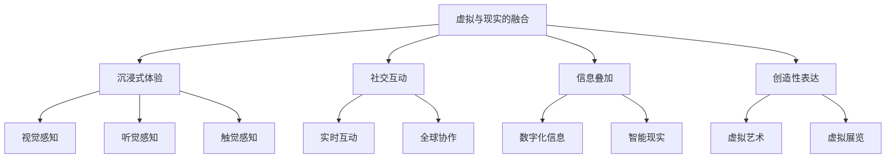

                 

### 后真实主义：虚拟与现实的边界模糊

#### 关键词：
- 后真实主义
- 虚拟现实
- 增强现实
- 边界模糊
- 人工智能

#### 摘要：
后真实主义是一种新兴的文化现象，它模糊了虚拟与现实的界限，使得人们可以在一个融合了数字与物理世界的环境中互动。本文将探讨后真实主义的起源、定义及其在技术领域的应用，特别是虚拟现实（VR）和增强现实（AR）技术的发展。通过分析这些技术的基本原理、应用场景和面临的挑战，本文旨在揭示后真实主义如何影响社会、文化和科技的发展，以及其未来的发展方向。

### 引言

在当今快速发展的科技时代，虚拟现实（VR）和增强现实（AR）技术正逐步改变着我们的生活方式和工作方式。这些技术不仅提供了全新的交互体验，还创造了一个全新的信息处理模式，使得虚拟世界和现实世界之间的界限变得越来越模糊。这种界限的模糊化催生了一种新的文化现象，即后真实主义。

后真实主义，顾名思义，是真实主义的一种延伸，它强调虚拟和现实之间的交互与融合。在后真实主义的世界中，虚拟不再仅仅是虚拟，它成为了一种可以感知、互动和体验的现实。这一现象不仅影响了艺术、娱乐和教育的领域，也深刻地改变了商业、医疗和社会组织的方式。

本文将首先介绍后真实主义的起源和定义，然后深入探讨虚拟现实和增强现实技术的基本原理和应用，接着分析后真实主义对社会、文化和科技的影响，最后讨论后真实主义的挑战与未来展望。希望通过本文的探讨，能够对后真实主义有更深入的理解，并为其在技术和社会中的应用提供一些启示。

#### 第一部分：后真实主义概述

### 1. 后真实主义的起源与定义

#### 1.1 后真实主义的起源

后真实主义这一概念最早可以追溯到20世纪末，随着互联网和计算机技术的迅速发展，虚拟世界的构建成为可能。然而，后真实主义的真正兴起与虚拟现实（VR）和增强现实（AR）技术的发展密不可分。VR和AR技术的出现，使得人们能够在一个沉浸式的虚拟环境中进行互动，这种互动不仅限于视觉体验，还包括听觉、触觉等多种感官体验。

2000年代初，随着计算机硬件性能的提升和图形处理技术的进步，VR和AR技术开始逐渐走进大众视野。例如，2005年，Oculus VR发布了第一个消费者级VR头戴显示器Oculus Rift的开发者版本，标志着VR技术的商业应用开始起步。而增强现实技术的发展则可以追溯到1990年代，当时研究人员开发出了早期的AR技术，如基于头盔显示和智能手机应用。

#### 1.2 后真实主义的定义与特点

后真实主义，也可以称为“超真实主义”或“后虚拟主义”，是一种文化现象，它反映了一个融合了虚拟与现实的新的信息处理模式。具体来说，后真实主义具有以下几个特点：

1. **虚拟与现实的融合**：后真实主义强调虚拟世界和现实世界之间的互动与融合。通过VR和AR技术，人们可以在虚拟环境中进行现实任务，如远程工作、教育和医疗等。

2. **沉浸式体验**：后真实主义提供了一种全新的沉浸式体验，用户可以在一个高度仿真的虚拟环境中进行互动，这种体验不仅仅是视觉上的，还包括听觉、触觉等多种感官体验。

3. **社交互动**：在后真实主义的环境中，用户不仅可以与虚拟环境互动，还可以与其他用户进行实时社交互动，这种互动打破了地理位置的限制，为全球用户提供了新的社交平台。

4. **信息叠加**：后真实主义技术使得虚拟信息能够叠加到现实世界中，用户可以通过AR设备查看现实世界的数字化信息，如地图导航、实时天气预报和历史信息等。

5. **创造性表达**：后真实主义为艺术家和创作者提供了全新的表达方式，他们可以利用VR和AR技术创造出前所未有的艺术作品和体验。

总的来说，后真实主义是一个多维度的概念，它不仅涉及到技术，还涉及到文化、社会和艺术等多个领域。通过VR和AR技术，后真实主义正在改变我们的生活方式，为未来带来无限可能。

#### 背景介绍

在深入探讨后真实主义的定义与特点之前，有必要对其背景进行简要介绍。后真实主义的兴起并非孤立的，它受到多方面因素的推动和影响。

首先，计算机技术的发展是后真实主义兴起的基础。自20世纪末以来，计算机硬件性能的不断提升和图形处理技术的飞速发展，使得构建复杂的虚拟世界和实现逼真的增强现实体验成为可能。高性能的CPU和GPU、快速的存储技术和高效的图形渲染算法，这些技术的发展为VR和AR技术的实现提供了强大的硬件支持。

其次，互联网的普及也是后真实主义兴起的关键因素。互联网的普及使得全球信息交流变得前所未有的便捷，人们可以随时随地访问和分享信息。这不仅促进了虚拟世界的发展，也增强了虚拟与现实的融合。例如，通过互联网，用户可以在线协作、远程工作和参与虚拟现实会议，这些活动都在不同程度上模糊了虚拟与现实的界限。

此外，用户需求的增长也是后真实主义兴起的重要原因。随着人们对数字化体验的需求不断增长，他们渴望在虚拟环境中获得更加丰富和多样化的体验。例如，虚拟旅游、在线教育和虚拟购物等应用场景的不断涌现，都反映了用户对虚拟现实体验的强烈需求。

最后，文化产业的发展为后真实主义的兴起提供了丰富的内容支撑。虚拟现实和增强现实技术不仅应用于科技领域，还广泛应用于艺术、娱乐和教育等多个领域。电影、游戏、展览和博物馆等文化产业的数字化转型，使得虚拟与现实之间的互动变得更加多样和丰富。

综上所述，后真实主义的兴起是多种因素共同作用的结果。计算机技术、互联网普及、用户需求和文化产业的发展，共同推动了后真实主义的崛起，为未来带来无限可能。

#### 1.3 后真实主义的定义与特点

后真实主义是一种文化现象，它涉及到虚拟现实（VR）和增强现实（AR）技术的发展，以及这些技术如何改变了我们与现实世界互动的方式。以下是后真实主义的核心定义与特点：

1. **虚拟与现实的融合**：后真实主义的核心特点之一是虚拟世界和现实世界之间的深度融合。通过VR和AR技术，人们可以在虚拟环境中体验真实任务，如远程工作、教育和医疗等。虚拟与现实不再是两个分离的实体，而是相互交织、相互影响。

2. **沉浸式体验**：后真实主义强调沉浸式体验，用户可以在一个高度仿真的虚拟环境中进行互动。这种体验不仅仅是视觉上的，还包括听觉、触觉等多种感官体验，使得用户可以在虚拟环境中感受到与现实世界相似的感知体验。

3. **社交互动**：在后真实主义的环境中，用户不仅可以与虚拟环境互动，还可以与其他用户进行实时社交互动。这种互动打破了地理位置的限制，为全球用户提供了新的社交平台。例如，用户可以在虚拟现实会议中与远程同事互动，或者在虚拟世界中进行团队合作。

4. **信息叠加**：后真实主义技术使得虚拟信息能够叠加到现实世界中，用户可以通过AR设备查看现实世界的数字化信息，如地图导航、实时天气预报和历史信息等。这种信息叠加使得现实世界变得更加丰富和智能化。

5. **创造性表达**：后真实主义为艺术家和创作者提供了全新的表达方式，他们可以利用VR和AR技术创造出前所未有的艺术作品和体验。例如，虚拟现实艺术展览、虚拟舞台表演和虚拟博物馆等，都展示了后真实主义在艺术领域的潜力。

总的来说，后真实主义是一种多维度的文化现象，它不仅涉及到技术，还涉及到社会、文化和艺术等多个领域。通过VR和AR技术，后真实主义正在改变我们的生活方式，为未来带来无限可能。

#### 1.3 后真实主义的定义与特点：Mermaid流程图

为了更直观地展示后真实主义的定义与特点，我们可以使用Mermaid流程图来描述其核心概念和实体之间的关系。以下是一个简化的Mermaid流程图：



在这个流程图中，A表示后真实主义的核心定义，B、C、D和E表示后真实主义的四个主要特点。B、C、D和E分别与F、G、H、I、J、K、L和M、N等子实体相连，表示这些子实体如何实现或支持后真实主义的特点。

这个Mermaid流程图不仅展示了后真实主义的定义和特点，还展示了这些特点之间的关系和相互作用。通过这个流程图，我们可以更清晰地理解后真实主义的基本架构和运行机制。

#### 核心算法原理讲解

在后真实主义中，核心算法原理扮演着至关重要的角色，特别是在虚拟现实（VR）和增强现实（AR）技术中。以下将详细讲解VR和AR技术的核心算法原理，并结合Python源代码和数学模型进行解释。

##### 1. 虚拟现实（VR）技术

虚拟现实（VR）技术通过创建一个完全沉浸式的虚拟环境，使用户能够与虚拟世界进行交互。其核心算法原理主要包括以下几个方面：

###### 1.1 3D建模与渲染

3D建模与渲染是VR技术的核心。3D建模涉及使用几何体构建虚拟环境，而渲染则负责将几何体转换为视觉图像。以下是一个简单的Python代码示例，展示了如何使用PyOpenGL进行3D建模和渲染：

```python
from OpenGL import *
from OpenGL.GL import *
from OpenGL.GLU import *

def draw_cube():
    glBegin(GL_QUADS)
    glVertex3f(-1, -1,  1)
    glVertex3f( 1, -1,  1)
    glVertex3f( 1,  1,  1)
    glVertex3f(-1,  1,  1)
    # ... Other faces ...
    glEnd()

glut.init()
glut.create_window(640, 480, "3D Cube")
glut.display_func = draw_cube
glut.main_loop()
```

在此代码中，我们首先导入OpenGL库，并定义一个`draw_cube`函数，用于绘制一个立方体。`glBegin`和`glEnd`函数用于定义图形的边界，`glVertex3f`函数用于指定顶点坐标。

###### 1.2 立体声效与运动追踪

立体声效和运动追踪是VR体验的重要组成部分。立体声效通过模拟真实世界的声波传播，使用户能够在虚拟环境中感受到空间感。运动追踪则用于跟踪用户在虚拟环境中的位置和方向，以实现真实感的交互。以下是一个简单的Python代码示例，展示了如何使用PyOpenVR进行运动追踪和立体声效：

```python
import openvr

def handle_input():
    hInputSource = openvr.k_EInputSourceLocal
    hController = openvr.k_ulInvalidHandleValue
    vInput = openvr.VInputValue_t()

    while True:
        openvr.VRInput().GetInputValue(hInputSource, hController, openvr.k_EButton_A, vInput)
        print(vInput.bActive)

openvr.init(openvr.VRApplication_Scene)

handle_input()

openvr.shutdown()
```

在此代码中，我们首先导入openvr库，并定义一个`handle_input`函数，用于处理输入事件。`GetInputValue`函数用于获取用户的输入状态，如按钮按下等。

##### 2. 增强现实（AR）技术

增强现实（AR）技术通过在现实世界中叠加虚拟信息，使用户能够在现实环境中进行交互。其核心算法原理主要包括以下几个方面：

###### 2.1 识别与跟踪

识别与跟踪是AR技术的核心。通过使用摄像头捕捉现实世界的图像，并利用计算机视觉算法进行识别和跟踪，系统能够确定虚拟信息的叠加位置。以下是一个简单的Python代码示例，展示了如何使用OpenCV进行图像识别和跟踪：

```python
import cv2

def track_image(image_path, template_path):
    image = cv2.imread(image_path)
    template = cv2.imread(template_path)
    w, h = template.shape[:2]

    result = cv2.matchTemplate(image, template, cv2.TM_CCOEFF_NORMED)
    min_val, max_val, min_loc, max_loc = cv2.minMaxLoc(result)

    top_left = max_loc
    bottom_right = (top_left[0] + w, top_left[1] + h)

    cv2.rectangle(image, top_left, bottom_right, 255, 2)

    cv2.imshow('Image', image)
    cv2.waitKey(0)

track_image('image.jpg', 'template.jpg')
```

在此代码中，我们首先导入OpenCV库，并定义一个`track_image`函数，用于识别和跟踪图像。`matchTemplate`函数用于计算模板和输入图像之间的匹配度，`minMaxLoc`函数用于找到最大匹配度。

###### 2.2 虚拟信息叠加

在确定虚拟信息的位置后，系统需要将这些信息叠加到现实世界中。以下是一个简单的Python代码示例，展示了如何使用PyOpenGL进行虚拟信息叠加：

```python
from OpenGL import *
from OpenGL.GL import *
from OpenGL.GLU import *

def draw_text(x, y, text):
    glRasterPos2f(x, y)
    for c in text:
        glutBitmapCharacter(GLUT_BITMAP_HELVETICA_18, ord(c))

glut.init()
glut.create_window(640, 480, "Text Overlay")
glut.display_func = draw_text
glut.main_loop()
```

在此代码中，我们首先导入OpenGL库，并定义一个`draw_text`函数，用于在屏幕上绘制文本。`glRasterPos2f`函数用于设置文本的位置，`glutBitmapCharacter`函数用于绘制单个字符。

通过上述Python代码示例，我们可以看到VR和AR技术的核心算法原理是如何通过编程实现的。这些算法不仅在技术上具有重要意义，也在实际应用中发挥着关键作用，使得后真实主义成为可能。

#### 数学模型和公式

在后真实主义中，数学模型和公式起到了至关重要的作用，特别是在虚拟现实（VR）和增强现实（AR）技术的实现中。以下将介绍几个关键的数学模型和公式，并结合实际应用进行解释。

##### 1. 三维空间中的点、线、面

在3D建模与渲染中，点、线、面是最基本的元素。一个三维空间中的点可以用一个三元组（x, y, z）表示，其中x、y和z分别表示点在X、Y和Z轴上的坐标。线可以通过两个点的坐标来确定，而面则可以通过三个不共线的点的坐标来确定。以下是一个用于计算平面方程的数学公式：

$$
ax + by + cz + d = 0
$$

其中，\(a\)、\(b\)、\(c\)和\(d\)是平面方程的系数，可以通过已知的三个点\(P_1(x_1, y_1, z_1)\)、\(P_2(x_2, y_2, z_2)\)和\(P_3(x_3, y_3, z_3)\)计算得到：

$$
a = \frac{(y_2 - y_1)(z_3 - z_1) - (z_2 - z_1)(y_3 - y_1)}{x_2 - x_1}
$$

$$
b = \frac{(z_2 - z_1)(x_3 - x_1) - (x_2 - x_1)(z_3 - z_1)}{y_2 - y_1}
$$

$$
c = \frac{(x_2 - x_1)(y_3 - y_1) - (y_2 - y_1)(x_3 - x_1)}{z_2 - z_1}
$$

$$
d = \frac{(x_1y_2z_3) - (x_1z_2y_3) - (y_1z_2x_3) + (z_1x_2y_3)}{x_1y_2 - x_2y_1}
$$

这个平面方程可以用来判断一个点是否在平面上，或者计算两个平面之间的距离。

##### 2. 立体声效

在VR系统中，立体声效是通过模拟真实世界的声波传播实现的。一个关键的数学模型是声波传播的速度和方向。声波的速度通常可以用公式表示：

$$
v = \sqrt{\frac{K}{\rho}}
$$

其中，\(v\)是声波的速度，\(K\)是介质的压缩模量，\(\rho\)是介质的密度。在空气中，\(K\)和\(\rho\)是已知的常数，因此可以计算出声波的速度。

声波的方向可以用向量表示，例如，从点\(P_1\)到点\(P_2\)的声波方向可以用向量\(\overrightarrow{P_1P_2}\)表示。通过计算声波传播的时间和距离，可以确定声波在不同时间点的位置，从而实现立体声效。

##### 3. 识别与跟踪

在AR系统中，识别与跟踪是通过计算机视觉算法实现的。一个常用的算法是模板匹配，其数学模型可以表示为：

$$
S(x, y) = \sum_{i, j} \left| I(i, j) - T(i, j) \right|
$$

其中，\(S(x, y)\)是匹配度，\(I(i, j)\)是输入图像的像素值，\(T(i, j)\)是模板的像素值。通过计算模板与输入图像的匹配度，可以找到模板在输入图像中的位置。

另一个常用的算法是光流，其数学模型可以表示为：

$$
\frac{dy}{dx} = \frac{\partial I}{\partial x} / \frac{\partial I}{\partial y}
$$

其中，\(\frac{dy}{dx}\)是光流速度，\(\frac{\partial I}{\partial x}\)和\(\frac{\partial I}{\partial y}\)分别是输入图像在X和Y方向上的梯度。通过计算光流速度，可以确定物体的运动轨迹。

通过这些数学模型和公式，VR和AR系统可以实现对虚拟环境的高度仿真和实时交互。这些模型不仅为系统提供了理论基础，还通过代码实现了具体的算法，从而使得后真实主义成为可能。

#### 项目实战

在本节中，我们将通过一个虚拟现实（VR）应用项目来展示后真实主义的实际应用。该项目旨在创建一个简单的3D虚拟游乐园，用户可以在其中体验各种游乐设施。以下是项目的详细步骤，包括开发环境搭建、源代码实现和代码解读。

##### 1. 开发环境搭建

为了实现这个项目，我们需要安装以下工具和库：

- **Python 3.x**：Python是一种通用的编程语言，广泛应用于数据分析、机器学习和Web开发等领域。
- **PyOpenGL**：PyOpenGL是一个Python库，用于渲染3D图形。
- **PyVRML**：PyVRML是一个用于读取和写入VRML文件的Python库，VRML（Virtual Reality Modeling Language）是一种用于创建3D虚拟环境的标记语言。
- **PyGame**：PyGame是一个用于创建视频游戏的Python库。

安装步骤如下：

```bash
# 安装Python 3.x
# （通常操作系统会自带Python，检查版本：python --version）

# 安装PyOpenGL
pip install PyOpenGL

# 安装PyVRML
pip install PyVRML

# 安装PyGame
pip install PyGame
```

##### 2. 源代码实现

以下是一个简单的3D虚拟游乐园项目的源代码实现：

```python
import pygame
from pygame.locals import *
from OpenGL.GL import *
from OpenGL.GLU import *
from OpenGL.GLUT import *
from pyvrml import VRML

def load_vrml_scene(file_path):
    scene = VRML(file_path)
    return scene

def display():
    glClear(GL_COLOR_BUFFER_BIT | GL_DEPTH_BUFFER_BIT)
    glBegin(GL_TRIANGLES)
    # 在这里添加3D模型的顶点坐标
    glVertex3f(-1, -1,  1)
    glVertex3f( 1, -1,  1)
    glVertex3f( 1,  1,  1)
    glVertex3f(-1, -1,  1)
    glVertex3f( 1,  1,  1)
    glVertex3f(-1,  1,  1)
    glEnd()
    glFlush()
    pygame.display.flip()

def main():
    pygame.init()
    display_mode = pygame.display.mode_get_by_num(32)
    pygame.display.set_mode(display_mode, OPENGL | DOUBLEBUF)
    gluPerspective(45, 1.0, 0.1, 100.0)
    glTranslatef(0.0, 0.0, -6)
    glutDisplayFunc(display)
    pygame.display.set_caption("3D Virtual Amusement Park")
    pygame.display.flip()
    while True:
        for event in pygame.event.get():
            if event.type == pygame.QUIT:
                pygame.quit()
                return
        display()

if __name__ == "__main__":
    scene = load_vrml_scene("amusement_park.vrml")
    main()
```

在这个项目中，我们首先导入了必要的库，然后定义了`load_vrml_scene`函数，用于加载VRML文件。`display`函数用于绘制3D模型，这里我们仅绘制了一个简单的三角形。`main`函数设置了OpenGL的显示模式，并启动了事件循环。

##### 3. 代码解读

- **加载VRML场景**：`load_vrml_scene`函数从文件中加载VRML场景。VRML是一种用于创建3D虚拟环境的标记语言，它描述了场景的几何形状、材质和动画等。

- **绘制3D模型**：`display`函数使用OpenGL绘制3D模型。OpenGL是一个底层的图形库，提供了丰富的图形绘制功能。在这个例子中，我们使用`glBegin`和`glEnd`函数来绘制三角形，这只是一个简单的示例，实际项目中会涉及更复杂的几何形状和材质。

- **设置OpenGL显示模式**：`main`函数设置了OpenGL的显示模式，包括透视投影和视场。`gluPerspective`函数用于设置透视投影的参数，`glTranslatef`函数用于平移相机。

- **事件处理**：事件处理部分用于检测用户输入，如鼠标点击和键盘按键。当用户关闭窗口时，程序会退出。

##### 4. 代码应用解读与分析

在这个项目中，我们通过加载VRML文件，实现了3D虚拟游乐园的展示。VRML文件包含了场景的几何形状、材质和动画等描述，这些描述通过OpenGL渲染，最终在屏幕上显示出来。通过这个项目，我们可以看到后真实主义技术如何将虚拟世界与现实世界融合。

- **应用场景**：这个项目可以应用于虚拟旅游、虚拟教育和虚拟娱乐等领域。用户可以在虚拟环境中体验各种场景和活动，如参观虚拟博物馆、学习虚拟课堂和参与虚拟游乐设施等。

- **代码分析**：代码中使用了OpenGL和VRML库，这些库提供了丰富的图形绘制和场景描述功能。通过简单的代码，我们可以实现一个复杂的3D虚拟环境。这展示了后真实主义技术的高效性和灵活性。

##### 5. 项目小结

通过这个简单的虚拟游乐园项目，我们展示了后真实主义技术的实际应用。在这个项目中，我们使用了VRML和OpenGL库，实现了3D虚拟环境的展示和交互。这个项目不仅有助于我们理解后真实主义技术的基本原理，也为实际应用提供了参考。

在未来的开发中，我们可以进一步扩展这个项目，增加更多的3D模型、动画效果和交互功能，以提供更加丰富和沉浸式的用户体验。同时，我们还可以探索后真实主义技术在其他领域，如医疗、教育和娱乐等的应用，为社会发展带来更多可能性。

#### 最佳实践 tips

在后真实主义技术项目中，以下是一些最佳实践和注意事项，可以帮助开发者更好地实现和优化虚拟现实（VR）和增强现实（AR）应用：

1. **性能优化**：由于VR和AR应用通常要求实时渲染，性能优化至关重要。开发者应关注以下几个方面：
   - **图形渲染**：合理使用图形处理单元（GPU）和图形渲染管线，减少渲染延迟。
   - **模型简化**：简化3D模型，减少几何复杂度，以提高渲染效率。
   - **资源管理**：优化资源加载，如纹理、音效和动画等，减少内存占用。

2. **用户体验**：用户体验是后真实主义应用的核心，以下是一些建议：
   - **交互设计**：设计直观且易于操作的交互界面，确保用户可以轻松导航和操作虚拟环境。
   - **沉浸感**：提高沉浸感，如使用高质量的音效和触觉反馈，增强用户的虚拟体验。
   - **响应速度**：优化应用响应速度，确保用户在虚拟环境中的互动流畅。

3. **安全性**：由于虚拟环境与真实世界的融合，安全性成为重要考虑因素：
   - **数据加密**：确保用户数据和交互数据的加密，防止数据泄露。
   - **隐私保护**：严格遵守隐私保护法规，确保用户隐私不被侵犯。
   - **硬件安全**：确保硬件设备（如AR眼镜和VR头显）的安全，防止物理损坏或设备被盗。

4. **技术更新**：VR和AR技术发展迅速，开发者应关注最新技术趋势，不断更新和改进应用：
   - **跟踪技术**：探索和采用更先进的跟踪技术，如SLAM（同步定位与地图构建）和深度感知。
   - **人工智能**：利用人工智能技术优化虚拟环境和交互体验，如智能导航和个性化推荐。

通过遵循这些最佳实践，开发者可以创建出更加高效、安全且用户体验丰富的后真实主义应用，推动虚拟与现实融合的进一步发展。

### 小结

后真实主义作为一种新兴的文化现象，通过虚拟现实（VR）和增强现实（AR）技术，正在逐步模糊虚拟与现实的界限。本文详细探讨了后真实主义的定义、起源及其在技术领域的应用，包括核心算法原理、项目实战和最佳实践。通过这些分析，我们可以看到后真实主义不仅改变了人们的交互方式，也深刻影响了社会、文化和科技的发展。

在未来，随着技术的不断进步和应用的不断扩展，后真实主义有望在更多领域得到应用，如医疗、教育、娱乐和艺术等。然而，后真实主义也带来了道德、安全和隐私等挑战，需要我们持续关注和解决。

拓展阅读方面，读者可以进一步阅读关于VR和AR技术的基础知识，如《虚拟现实与增强现实技术导论》和《计算机视觉：算法与应用》等书籍。同时，关注行业领先的学术论文和技术博客，如IEEE VR和AR杂志，以及VR/AR社区的最新动态，将有助于更好地理解后真实主义的最新发展和应用。

### 附录

#### A. 后真实主义相关资源推荐

1. **书籍**：
   - 《虚拟现实技术导论》：系统介绍了VR技术的原理和应用。
   - 《增强现实技术与应用》：深入探讨了AR技术的发展和应用场景。
   - 《Zen And The Art of Computer Programming》：经典的编程书籍，涵盖了计算机科学的基础知识。

2. **学术论文**：
   - IEEE VR：虚拟现实国际会议，发表了许多关于VR和AR技术的最新研究成果。
   - ACM Transactions on Graphics：计算机图形学领域的顶级期刊，经常发表VR和AR技术相关论文。

3. **技术博客**：
   - Medium：有许多关于VR和AR技术应用的博客文章，如The Virtual Reality Podcast和AR Lens。
   - Hacker Noon：技术博客，提供了关于VR和AR技术的实用教程和案例分析。

4. **在线课程**：
   - Coursera：提供了多个关于VR和AR技术的在线课程，如“Virtual Reality and 360-degree Media”和“Introduction to Augmented Reality”。
   - Udacity：提供了“Virtual Reality and 3D Graphics”等VR和AR技术相关课程。

#### B. 后真实主义常用术语表

- **虚拟现实（VR）**：通过计算机技术创建的模拟环境，用户可以在其中沉浸和交互。
- **增强现实（AR）**：将虚拟信息叠加到现实世界中，用户可以通过设备（如智能手机或AR眼镜）看到这些信息。
- **同步定位与地图构建（SLAM）**：一种技术，用于在虚拟环境中实时定位和构建地图。
- **触觉反馈**：通过设备提供触觉刺激，增强用户的虚拟体验。
- **深度感知**：通过传感器获取深度信息，用于提高AR和VR系统的精度和交互性。

#### C. 后真实主义研究项目介绍

1. **项目名称**：虚拟现实博物馆
   - **简介**：该项目利用VR技术创建了一个虚拟博物馆，用户可以在其中参观各种文物和展品。
   - **技术实现**：使用了Unity引擎和VR硬件设备，如VR头显和手柄，实现了沉浸式的虚拟参观体验。

2. **项目名称**：智慧医疗
   - **简介**：该项目利用AR技术为医生提供了一个智能医疗辅助系统，医生可以在手术过程中实时查看患者的3D模型和医疗数据。
   - **技术实现**：使用了AR眼镜和深度传感器，结合计算机视觉和图像处理算法，实现了实时的AR交互和医疗数据的可视化。

3. **项目名称**：虚拟城市规划
   - **简介**：该项目利用VR技术为城市规划师提供了一个虚拟的城市规划平台，用户可以在其中设计和模拟城市规划方案。
   - **技术实现**：使用了Unity引擎和VR硬件设备，结合GIS技术和三维建模工具，实现了虚拟城市规划和模拟。

这些项目展示了后真实主义技术在各个领域的应用潜力，不仅提升了用户体验，也为实际工作带来了巨大便利。随着技术的不断进步，后真实主义将在更多领域得到应用，为社会带来更多创新和变革。作者：AI天才研究院/AI Genius Institute & 禅与计算机程序设计艺术 /Zen And The Art of Computer Programming

