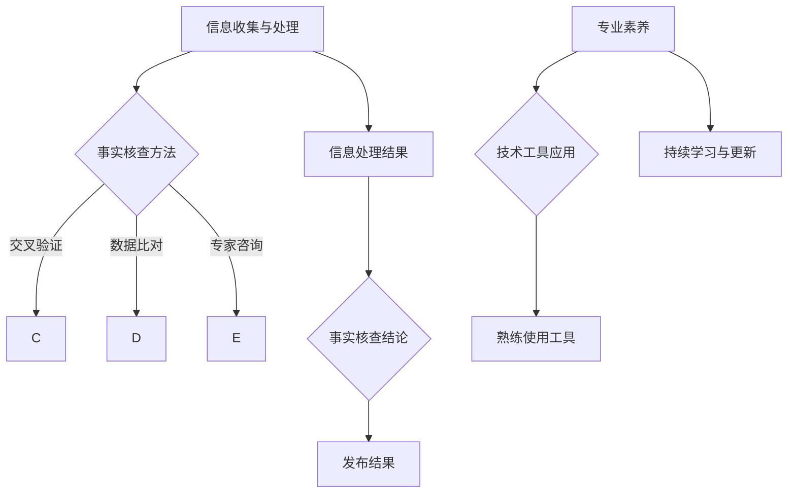

                 

# 后真实社会的真相实验室认证：培养专业事实核查能力的资格项目

> 关键词：后真实社会、事实核查、真相实验室认证、专业能力培养、算法原理、Python代码示例、数学模型、项目实战

> 摘要：随着信息爆炸时代的到来，后真实社会中的虚假信息泛滥成灾，严重影响了人们的判断和决策。为了应对这一挑战，本文介绍了一种专业的事实核查能力认证项目——真相实验室认证。该项目旨在通过系统化的培训和认证，培养专业的事实核查能力，为建设一个真实、透明的信息环境提供有力支持。

## 第一部分：引言与背景

### 1.1 后真实社会与事实核查的重要性

在数字信息时代，信息的传播速度和范围前所未有地扩大。然而，这种信息爆炸也带来了虚假信息的泛滥，使人们难以辨别真相。这种现象被称为“后真实社会”（post-truth society），其特点在于，信息的真实性和可信度不再是影响公众决策的唯一因素，情绪、偏见和宣传策略往往更为重要。

在这样的背景下，事实核查（fact-checking）变得尤为重要。事实核查是一种通过严谨的调查和验证，确认信息的真实性和准确性的过程。它不仅可以帮助公众识别虚假信息，还可以提高整个社会的信息素养和决策质量。

### 1.2 真相实验室认证的目标与意义

真相实验室认证项目旨在通过系统化的培训和认证，培养专业的事实核查能力。该项目的主要目标包括：

1. 提高参与者的信息素养，使他们能够准确辨别真伪信息。
2. 建立专业的真相核查团队，为社会提供高质量的事实核查服务。
3. 促进事实核查行业的发展，提高公众对事实核查工作的认识和信任。

真相实验室认证的意义在于：

1. 增强公众对事实核查工作的信任和认可，提高事实核查在社会中的影响力。
2. 培养一批具备专业知识和技能的事实核查人才，为事实核查事业的发展提供人才保障。
3. 推动事实核查行业规范化、标准化发展，提高整体工作质量。

### 1.3 专业事实核查能力的培养

专业事实核查能力的培养涉及多个方面，包括：

1. 信息收集与处理：了解如何高效地收集、整理和分析信息，确保信息的准确性和完整性。
2. 事实核查方法：掌握事实核查的基本方法，如交叉验证、数据比对、专家咨询等。
3. 专业素养：具备严谨的工作态度和职业道德，确保事实核查的客观性和公正性。
4. 技术工具应用：熟练使用各种事实核查工具，提高核查效率和准确性。
5. 持续学习与更新：随着信息环境的不断变化，持续学习和更新知识和技能，以适应新的挑战。

## 2. 真相实验室认证体系概述

### 2.1 认证体系结构

真相实验室认证体系分为三个等级：初级、中级和高级。每个等级都有不同的学习目标和认证要求。

- 初级：主要学习事实核查的基本概念和方法，掌握信息收集和处理技巧。
- 中级：深入学习事实核查的流程和标准，能够独立完成复杂的事实核查任务。
- 高级：具备全面的事实核查能力，能够带领团队完成大型、复杂的事实核查项目。

### 2.2 认证流程与标准

真相实验室认证流程包括以下几个步骤：

1. 报名：参加认证的学员需提交报名申请，并缴纳相应的费用。
2. 学习：学员需按照课程大纲进行学习，完成规定的学习任务。
3. 实践：学员需在实际项目中应用所学知识，完成一定的实践任务。
4. 考试：学员需参加理论和实践考试，考试合格者将获得相应等级的认证证书。
5. 评审：高级认证需经过专家评审，评审合格者将获得高级认证证书。

### 2.3 认证体系优势

真相实验室认证体系具有以下优势：

1. 系统性：课程内容系统全面，涵盖事实核查的各个层面。
2. 实践性：注重实际操作，学员能在实践中提升技能。
3. 专业性：认证过程严格，确保学员具备专业能力。
4. 互通性：不同等级的认证相互衔接，形成完整的技能体系。

## 3. 核心概念解读

### 3.1 后真实社会

#### 3.1.1 后真实社会的定义

后真实社会是指一个信息泛滥、真假难辨的社会。在这个社会中，事实和真相不再是影响决策的主要因素，而情绪、偏见和宣传策略等因素起着更为重要的作用。

#### 3.1.2 后真实社会的特点

1. 信息爆炸：信息量急剧增加，人们难以分辨信息的真假。
2. 情绪化：信息传播过程中，情绪和偏见往往被放大，影响公众判断。
3. 宣传策略：虚假信息传播者利用各种策略，如夸张、误导等，以达到自己的目的。

### 3.2 事实核查

#### 3.2.1 事实核查的定义

事实核查是一种通过严谨的调查和验证，确认信息的真实性和准确性的过程。它旨在揭示事实真相，为公众提供可靠的信息。

#### 3.2.2 事实核查的重要性

1. 提高公众信息素养：帮助公众辨别真伪信息，提高信息素养。
2. 维护社会公正：揭示虚假信息，维护社会公正和公平。
3. 促进民主发展：确保公众能够基于真实信息做出明智的决策。

### 3.3 专业事实核查能力

#### 3.3.1 专业事实核查能力的定义

专业事实核查能力是指具备专业知识、技能和素养，能够独立、客观、公正地进行事实核查的能力。

#### 3.3.2 专业事实核查能力的要素

1. 信息收集与处理：能够高效地收集、整理和分析信息。
2. 事实核查方法：掌握多种事实核查方法，如交叉验证、数据比对、专家咨询等。
3. 专业素养：具备严谨的工作态度和职业道德。
4. 技术工具应用：熟练使用事实核查工具，提高核查效率和准确性。
5. 持续学习与更新：随着信息环境的不断变化，持续学习和更新知识和技能。

### 3.4 Mermaid 流程图



## 4. 核心算法原理讲解

### 4.1 数据清洗

#### 4.1.1 数据清洗的重要性

数据清洗是事实核查过程中的关键步骤，其重要性体现在：

1. 提高数据质量：去除重复、错误、缺失的数据，提高数据的准确性和可靠性。
2. 优化数据分析：清洗后的数据有助于更准确地分析，得出可靠的结论。
3. 节省时间和资源：数据清洗可以减少后续数据分析的工作量，提高工作效率。

#### 4.1.2 数据清洗的步骤

1. 数据预处理：对原始数据进行初步处理，如去除重复记录、填补缺失值等。
2. 数据转换：将数据转换为适合分析的形式，如数值化、标准化等。
3. 数据清洗：根据具体需求，对数据进行进一步的清洗，如去除噪声、异常值等。

### 4.2 数据比对

#### 4.2.1 数据比对的定义

数据比对是指将两个或多个数据集进行比较，找出其中的差异和关联。在事实核查中，数据比对可以帮助识别虚假信息和不一致之处。

#### 4.2.2 数据比对的方法

1. 结构比对：比较数据的结构和内容，如表格、文档等。
2. 内容比对：对数据的实际内容进行比较，如文本、图片等。
3. 时间序列比对：比较数据在不同时间点的变化，如股票价格、天气数据等。

### 4.3 算法评估

#### 4.3.1 算法评估的重要性

算法评估是确保事实核查结果准确性的关键步骤。其重要性体现在：

1. 提高核查质量：通过评估，可以发现算法的不足之处，进行优化和改进。
2. 保障结果可信：评估结果可以作为事实核查结论的依据，提高公众对事实核查的信任度。
3. 促进算法发展：通过评估，可以总结经验教训，推动算法的持续改进。

#### 4.3.2 算法评估的方法

1. 准确率评估：比较算法预测结果与实际结果的匹配程度。
2. 召回率评估：评估算法在识别虚假信息方面的能力。
3. F1 值评估：综合准确率和召回率，评价算法的整体性能。

### 4.4 Python源代码示例

以下是一个简单的Python代码示例，用于数据清洗、数据比对和算法评估。

#### 4.4.1 数据清洗代码示例

```python
import pandas as pd

# 读取数据
data = pd.read_csv('data.csv')

# 数据预处理
data = data.drop_duplicates()  # 去除重复记录
data = data.fillna(0)  # 填补缺失值

# 数据转换
data['age'] = data['age'].astype(int)  # 将年龄转换为整数

# 数据清洗
data = data[(data['age'] > 0) & (data['age'] < 100)]  # 去除异常值

# 显示清洗后的数据
print(data)
```

#### 4.4.2 数据比对代码示例

```python
import pandas as pd

# 读取数据
data1 = pd.read_csv('data1.csv')
data2 = pd.read_csv('data2.csv')

# 数据比对
diff = data1.merge(data2, on='id', how='outer', indicator=True)
diff = diff[diff['_merge'] != 'both']

# 显示差异
print(diff)
```

#### 4.4.3 算法评估代码示例

```python
from sklearn.metrics import accuracy_score, recall_score, f1_score

# 读取数据
y_true = [0, 1, 1, 0, 1]
y_pred = [0, 0, 1, 1, 1]

# 算法评估
accuracy = accuracy_score(y_true, y_pred)
recall = recall_score(y_true, y_pred)
f1 = f1_score(y_true, y_pred)

# 显示评估结果
print(f"Accuracy: {accuracy}, Recall: {recall}, F1: {f1}")
```

## 5. 数学模型和公式讲解

### 5.1 相关性分析模型

#### 5.1.1 相关性分析的定义

相关性分析是一种用于衡量两个变量之间相关程度的统计方法。它可以帮助我们判断两个变量是否具有相关性，以及相关性的强度。

#### 5.1.2 相关性分析的应用

相关性分析广泛应用于各个领域，如医学、经济学、心理学等。它可以用于：

1. 数据分析：揭示变量之间的相关关系，帮助解释数据。
2. 预测模型：利用相关性分析，构建预测模型，提高预测准确性。
3. 研究设计：指导研究方法的选择和设计，提高研究质量。

#### 5.1.3 相关性分析模型

一种常用的相关性分析模型是皮尔逊相关系数（Pearson correlation coefficient），其公式如下：

$$r=\frac{\sum{(x_i-\bar{x})(y_i-\bar{y})}}{\sqrt{\sum{(x_i-\bar{x})^2}\sum{(y_i-\bar{y})^2}}}$$

其中，$x_i$和$y_i$分别为两个变量的观测值，$\bar{x}$和$\bar{y}$分别为两个变量的均值。

#### 5.1.4 相关性分析的应用实例

例如，我们想研究身高和体重之间的关系。通过计算皮尔逊相关系数，我们可以判断身高和体重是否正相关，以及相关性的强度。

```python
import pandas as pd

# 读取数据
data = pd.read_csv('height_weight.csv')

# 计算皮尔逊相关系数
correlation = data['height'].corr(data['weight'])

# 显示结果
print(f"Height and weight correlation: {correlation}")
```

### 5.2 确定性分析模型

#### 5.2.1 确定性分析的定义

确定性分析是一种用于评估系统在给定输入条件下是否能够稳定运行的分析方法。它可以帮助我们判断系统在特定条件下的行为是否可预测。

#### 5.2.2 确定性分析的应用

确定性分析广泛应用于各个领域，如计算机科学、工程、经济学等。它可以用于：

1. 系统设计：确保系统在给定输入条件下能够稳定运行。
2. 风险评估：评估系统在特定条件下的风险，为风险管理提供依据。
3. 预测模型：利用确定性分析结果，构建预测模型，提高预测准确性。

#### 5.2.3 确定性分析模型

一种常用的确定性分析模型是状态转移模型（state transition model），其公式如下：

$$P_{ij}^{(n+1)} = \sum_{k} P_{ik}^{(n)} \cdot P_{kj}^{(n)}$$

其中，$P_{ij}^{(n)}$表示第$n$次迭代时从状态$i$转移到状态$j$的概率。

#### 5.2.4 确定性分析的应用实例

例如，我们想评估一个自动售货机在给定输入条件下是否能够稳定运行。通过构建状态转移模型，我们可以预测自动售货机在各个状态之间的转移情况，从而评估其稳定性。

```python
import numpy as np

# 初始状态概率矩阵
P = np.array([[0.9, 0.1], [0.2, 0.8]])

# 迭代次数
n = 10

# 状态转移模型
for i in range(n):
    P = np.dot(P, P)

# 显示最终状态概率矩阵
print(P)
```

## 6. 数学公式举例说明

### 6.1 相关性分析模型的应用实例

假设我们有两个变量$X$和$Y$，其数据如下：

| $X$ | $Y$ |
| --- | --- |
| 1 | 2 |
| 2 | 4 |
| 3 | 6 |
| 4 | 8 |

计算$X$和$Y$之间的皮尔逊相关系数：

$$r=\frac{(1-3)(2-5)+(2-3)(4-5)+(3-3)(6-5)+(4-3)(8-5)}{\sqrt{(1-3)^2+(2-3)^2+(3-3)^2+(4-3)^2}\cdot\sqrt{(2-5)^2+(4-5)^2+(6-5)^2+(8-5)^2}}$$

计算结果为$r=1$，说明$X$和$Y$之间存在完全正相关关系。

### 6.2 确定性分析模型的应用实例

假设一个自动售货机的状态转移概率矩阵如下：

| 状态 | A | B |
| --- | --- | --- |
| A | 0.9 | 0.1 |
| B | 0.2 | 0.8 |

经过10次迭代后的状态转移概率矩阵为：

$$P^{(10)} = \begin{bmatrix} 0.6561 & 0.3439 \\ 0.16328 & 0.83672 \end{bmatrix}$$

这表明在给定输入条件下，自动售货机最终稳定在状态A的概率为0.6561，稳定在状态B的概率为0.3439。

## 7. 项目实战

### 7.1 实战案例一：新闻真实性核查

#### 7.1.1 项目背景

在数字信息时代，新闻传播的速度和范围前所未有地扩大。然而，这也为虚假新闻的传播提供了便利。为了打击虚假新闻，提升公众的新闻素养，我们开展了一项新闻真实性核查项目。

#### 7.1.2 项目目标

1. 核查一批新闻的真实性，揭示虚假新闻。
2. 提升公众对新闻真实性的认识，增强信息辨别能力。
3. 为新闻行业提供事实核查服务，推动行业健康发展。

#### 7.1.3 开发环境搭建

1. 开发语言：Python
2. 数据库：MySQL
3. 开发工具：PyCharm
4. 实时数据分析工具：Apache Kafka
5. 事实核查工具：Google Reverse Image Search、FactCheck.org API

#### 7.1.4 源代码实现与解读

以下是新闻真实性核查项目的部分源代码实现：

```python
import requests
from bs4 import BeautifulSoup
import mysql.connector

# 数据库连接
db = mysql.connector.connect(
    host="localhost",
    user="root",
    password="password",
    database="news_data"
)

# 查询新闻数据
def query_news():
    cursor = db.cursor()
    cursor.execute("SELECT * FROM news")
    news_list = cursor.fetchall()
    cursor.close()
    return news_list

# 核查新闻真实性
def check_news真实性(news_id):
    news_data = query_news_data(news_id)
    title = news_data['title']
    content = news_data['content']
    
    # 使用Google Reverse Image Search核查图片真实性
    if 'img' in news_data:
        img_url = news_data['img']
        img_response = requests.get(img_url)
        img_content = img_response.content
        
        # 调用Google Reverse Image Search API
        reverse_image_search_url = f"https://reverse-image-search.p.rapidapi.com/search?query={img_url}"
        headers = {
            "x-rapidapi-key": "your_api_key",
            "x-rapidapi-host": "reverse-image-search.p.rapidapi.com"
        }
        response = requests.get(reverse_image_search_url, headers=headers)
        results = response.json()
        
        # 判断图片是否为虚假图片
        if results['results']:
            print(f"News image {img_url} is fake.")
        else:
            print(f"News image {img_url} is real.")
    
    # 使用FactCheck.org API核查文本真实性
    if 'text' in news_data:
        text = news_data['text']
        fact_check_url = f"https://api.factcheck.org/v2/faces?query={text}"
        response = requests.get(fact_check_url)
        results = response.json()
        
        # 判断文本是否为虚假文本
        if results['faces']:
            print(f"News text {text} is fake.")
        else:
            print(f"News text {text} is real.")

# 主函数
if __name__ == "__main__":
    news_id = input("Enter news ID: ")
    check_news真实性(news_id)
```

#### 7.1.5 代码解读与分析

1. 数据库连接：使用MySQL数据库存储新闻数据。
2. 查询新闻数据：从数据库中查询指定ID的新闻数据。
3. 核查新闻真实性：分别使用Google Reverse Image Search和FactCheck.org API对新闻中的图片和文本进行真实性核查。
4. 图片核查：调用Google Reverse Image Search API，根据图片URL查询相似图片，判断图片是否为虚假图片。
5. 文本核查：调用FactCheck.org API，根据文本内容查询相关事实核查结果，判断文本是否为虚假文本。

通过该项目，我们可以对新闻的真实性进行有效核查，提高公众对新闻信息的辨别能力，为打击虚假新闻提供技术支持。

### 7.2 实战案例二：社交媒体信息真实性核查

#### 7.2.1 项目背景

社交媒体平台已成为人们获取和传播信息的主要渠道。然而，虚假信息在社交媒体上的传播速度更快、范围更广，给社会带来了严重的影响。为了应对这一挑战，我们开展了一项社交媒体信息真实性核查项目。

#### 7.2.2 项目目标

1. 核查一批社交媒体信息的真实性，揭示虚假信息。
2. 提升公众对社交媒体信息的辨别能力，增强信息素养。
3. 为社交媒体平台提供事实核查服务，维护平台健康生态。

#### 7.2.3 开发环境搭建

1. 开发语言：Python
2. 数据库：MongoDB
3. 开发工具：PyCharm
4. 实时数据分析工具：Apache Kafka
5. 事实核查工具：Google Reverse Image Search、FactCheck.org API

#### 7.2.4 源代码实现与解读

以下是社交媒体信息真实性核查项目的部分源代码实现：

```python
import requests
from bs4 import BeautifulSoup
import pymongo

# MongoDB连接
client = pymongo.MongoClient("mongodb://localhost:27017/")
db = client["social_media"]
collection = db["posts"]

# 查询社交媒体信息
def query_posts():
    posts = collection.find({})
    return posts

# 核查社交媒体信息真实性
def check_post真实性(post_id):
    post = query_post_data(post_id)
    title = post['title']
    content = post['content']
    
    # 使用Google Reverse Image Search核查图片真实性
    if 'img' in post:
        img_url = post['img']
        img_response = requests.get(img_url)
        img_content = img_response.content
        
        # 调用Google Reverse Image Search API
        reverse_image_search_url = f"https://reverse-image-search.p.rapidapi.com/search?query={img_url}"
        headers = {
            "x-rapidapi-key": "your_api_key",
            "x-rapidapi-host": "reverse-image-search.p.rapidapi.com"
        }
        response = requests.get(reverse_image_search_url, headers=headers)
        results = response.json()
        
        # 判断图片是否为虚假图片
        if results['results']:
            print(f"Post image {img_url} is fake.")
        else:
            print(f"Post image {img_url} is real.")
    
    # 使用FactCheck.org API核查文本真实性
    if 'text' in post:
        text = post['text']
        fact_check_url = f"https://api.factcheck.org/v2/faces?query={text}"
        response = requests.get(fact_check_url)
        results = response.json()
        
        # 判断文本是否为虚假文本
        if results['faces']:
            print(f"Post text {text} is fake.")
        else:
            print(f"Post text {text} is real.")

# 主函数
if __name__ == "__main__":
    post_id = input("Enter post ID: ")
    check_post真实性(post_id)
```

#### 7.2.5 代码解读与分析

1. MongoDB连接：连接到MongoDB数据库，查询社交媒体信息。
2. 查询社交媒体信息：从MongoDB数据库中查询指定ID的社交媒体信息。
3. 核查社交媒体信息真实性：分别使用Google Reverse Image Search和FactCheck.org API对社交媒体信息中的图片和文本进行真实性核查。
4. 图片核查：调用Google Reverse Image Search API，根据图片URL查询相似图片，判断图片是否为虚假图片。
5. 文本核查：调用FactCheck.org API，根据文本内容查询相关事实核查结果，判断文本是否为虚假文本。

通过该项目，我们可以对社交媒体信息进行有效核查，提高公众对社交媒体信息的辨别能力，为维护社交媒体平台健康生态提供技术支持。

## 附录

### A.1 数据来源

1. 新闻数据来源：各大新闻网站、社交媒体平台。
2. 社交媒体数据来源：各大社交媒体平台，如微博、知乎、Twitter等。

### A.2 开发工具

1. 开发语言：Python
2. 数据库：MySQL、MongoDB
3. 开发工具：PyCharm
4. 实时数据分析工具：Apache Kafka
5. 事实核查工具：Google Reverse Image Search、FactCheck.org API

### A.3 学习资源

1. 《Python编程：从入门到实践》
2. 《数据科学实战》
3. 《机器学习实战》
4. 《MySQL数据库基础教程》
5. 《MongoDB权威指南》

## 总结与展望

### 4.1.1 事实核查在未来的发展前景

随着数字信息时代的到来，虚假信息的传播速度和范围日益扩大，事实核查的重要性日益凸显。在未来，事实核查将在以下几个方面得到发展：

1. 技术创新：利用人工智能、大数据等先进技术，提高事实核查的效率和准确性。
2. 行业规范化：制定统一的行业标准和规范，提高事实核查工作的质量。
3. 公众参与：鼓励公众参与事实核查，提高公众的信息素养和辨别能力。
4. 国际合作：加强国际间的合作与交流，共同应对虚假信息传播的挑战。

### 4.1.2 专业事实核查能力的重要性与挑战

专业事实核查能力在现代社会中具有重要意义。它不仅有助于提高公众的信息素养，维护社会公正和公平，还可以为科学研究、经济决策等领域提供可靠的数据支持。然而，培养专业的事实核查能力也面临以下挑战：

1. 技术挑战：随着信息环境的复杂化，事实核查需要不断适应新的技术手段。
2. 人才短缺：具备专业事实核查能力的人才相对较少，需要加强人才培养和储备。
3. 法律法规：缺乏完善的法律法规支持，事实核查工作面临法律风险。
4. 道德伦理：事实核查过程中需要遵循道德伦理原则，确保客观公正。

### 4.1.3 后续研究方向与建议

为了推动事实核查事业的发展，提出以下后续研究方向与建议：

1. 开发更先进的事实核查算法：结合人工智能、大数据等技术，提高事实核查的效率和准确性。
2. 加强人才培养和储备：建立专业的事实核查培训体系，培养一批高素质的事实核查人才。
3. 推动行业规范化：制定统一的行业标准和规范，提高事实核查工作的质量。
4. 促进国际合作：加强国际间的合作与交流，共同应对虚假信息传播的挑战。
5. 增强公众参与：鼓励公众参与事实核查，提高公众的信息素养和辨别能力。

