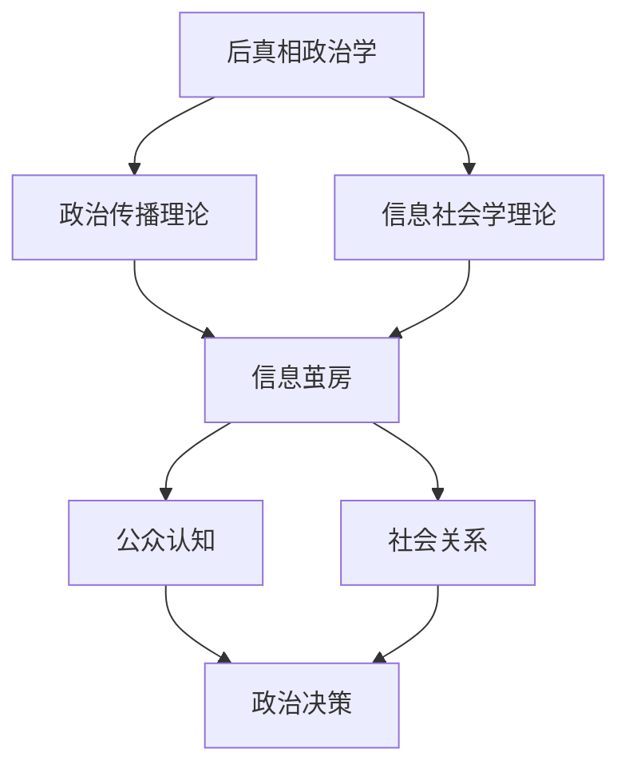
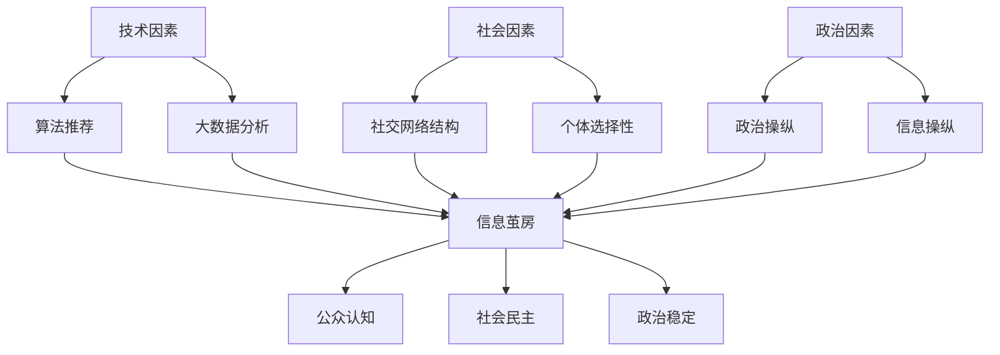

                 

### 文章标题

# 《后真相政治学研究：信息茧房的破解之道》

### 文章关键词

- 后真相政治学
- 信息茧房
- 政治传播
- 信息社会学
- 破解策略

### 文章摘要

本文旨在探讨后真相政治学中的信息茧房现象，解析其成因、影响及破解之道。首先，通过背景介绍，阐述后真相政治学的兴起与信息茧房现象的普遍存在。接着，运用政治传播理论、信息社会学理论，构建理论框架，深入分析后真相政治学的核心概念。随后，探讨信息茧房的成因与影响，分析技术、社会、政治因素对其形成的驱动作用。在破解之道部分，提出提高公众媒体素养、促进信息多元化、加强信息监管等策略，并结合实际案例，展示这些策略的实践效果。最后，文章总结研究发现，提出未来研究方向和政策建议，以期对后真相政治学的深入研究与实践提供参考。

## 第二部分：后真相政治学的核心概念与理论

### 2.1 后真相政治学的定义

后真相政治学是一个新兴的研究领域，起源于信息时代背景下对政治传播和公众认知的重新审视。传统的政治学主要关注权力结构、政策制定和选举过程等方面，而后真相政治学则将焦点转向信息传播、公众认知和社会心理。具体来说，后真相政治学关注的是在信息过载、算法推荐和社交媒体环境下，事实与情感、虚假信息与真实信息的互动关系，以及这些关系对政治决策和社会稳定的潜在影响。

后真相政治学的兴起与数字媒体的普及密切相关。随着互联网技术的发展，信息传播的速度和广度达到了前所未有的高度，使得公众能够轻松地接触到各种信息源。然而，这也带来了信息泛滥和认知偏见的问题。例如，社交媒体平台上的算法推荐系统往往根据用户的兴趣和偏好来推送信息，导致用户逐渐陷入“信息茧房”，即只接收和自己观点一致的信息，而忽视或排斥与自己观点不同的信息。这种信息环境加剧了公众的认知偏见，影响社会舆论和公共决策。

与传统政治学相比，后真相政治学具有以下几个显著特征：

1. **信息主导性**：在传统政治学中，政治权力和意识形态是主导因素，而后真相政治学则强调信息传播和公众认知对政治过程的影响。
2. **情感化传播**：后真相政治学认为，情感因素在政治传播中起到至关重要的作用，而不仅仅是理性分析和事实陈述。
3. **互动性**：后真相政治学强调公众与政治信息之间的互动关系，包括信息搜索、分享和讨论等行为。
4. **去中心化**：传统政治学往往以国家或政府为中心，而后真相政治学则强调信息传播的去中心化特点，任何个体都可以成为信息传播者。

### 2.2 信息茧房的概念

信息茧房是指个体在信息接收和处理过程中，由于算法推荐、社交网络等因素，导致其只能接触到有限范围的信息，从而陷入认知偏见的封闭环境。信息茧房的形成机制主要包括以下几个方面：

1. **算法推荐**：社交媒体平台和搜索引擎等使用算法推荐系统来推送用户感兴趣的内容，这种推荐机制虽然能够提高用户体验，但也可能导致用户逐渐只接收和自己观点一致的信息。
2. **社交网络**：个体在社交网络中往往与具有相似兴趣和观点的人建立联系，这使得个体在信息传播过程中只接触到与自己观点一致的信息。
3. **个体选择性**：个体在信息接收过程中具有选择性，倾向于接收和自己观点一致的信息，而忽视或排斥与自己观点不同的信息。

信息茧房对个体和社会的影响是多方面的。对于个体来说，信息茧房可能导致认知偏见、情感极端化和群体极化等问题。对于社会来说，信息茧房可能加剧社会分裂、降低社会共识和公共决策的效率。

### 2.3 后真相政治学的理论框架

后真相政治学的理论框架主要包括政治传播理论和信息社会学理论。政治传播理论关注政治信息如何在社会中传播、如何影响公众认知和政治行为。信息社会学理论则关注信息在社会中的作用，以及信息传播对社会结构和关系的影响。

政治传播理论主要包括以下几个方面：

1. **传播模式**：政治传播可以通过不同的模式进行，包括线性传播、双向传播和网络传播。线性传播是指信息从传播者到受传者的单向传递，而双向传播则强调传播者和受传者之间的互动。网络传播则是基于互联网的信息传播模式，具有去中心化和互动性等特点。
2. **传播内容**：政治传播的内容包括事实、观点和情感等。事实是客观存在的描述，观点是个人或群体的立场和看法，情感则是个人对信息的情感反应。后真相政治学认为，情感因素在政治传播中起到至关重要的作用。
3. **传播效果**：政治传播的效果取决于信息如何被公众接收、解读和响应。后真相政治学强调，信息传播不仅影响公众的认知，还可能影响情感和行为。

信息社会学理论主要包括以下几个方面：

1. **信息结构**：信息在社会中的传播和流动形成复杂的信息结构，这种结构影响社会关系和社会行为。后真相政治学认为，信息结构的变化可能导致社会分裂和认知偏见的加剧。
2. **信息控制**：信息控制是信息传播的重要环节，包括信息的生产、传递和消费。信息控制不仅影响信息的质量，还可能影响信息的自由流通。
3. **信息伦理**：信息伦理关注信息传播过程中的道德和伦理问题，包括隐私保护、虚假信息传播和知情权等。

信息茧房与后真相政治的互动关系可以概括为以下几个方面：

1. **形成机制**：信息茧房的形成是后真相政治学中的重要现象，它与政治传播和信息社会学的理论框架密切相关。
2. **影响机制**：信息茧房对政治传播和社会关系产生深远影响，可能加剧社会分裂和认知偏见。
3. **破解机制**：破解信息茧房需要从政治传播和信息社会学的角度出发，提出有效的策略和方法。

### 2.4 核心概念实体关系架构 Mermaid 流程图



通过上述Mermaid流程图，我们可以清晰地看到后真相政治学、政治传播理论、信息社会学理论与信息茧房之间的互动关系，以及这些关系对公众认知、社会关系和政治决策的影响。这一关系架构为后真相政治学的研究提供了理论基础和分析工具。

## 第三部分：信息茧房的成因与影响

### 3.1 信息茧房的成因

信息茧房的形成是一个复杂的过程，涉及技术、社会和政治等多个层面的因素。理解这些因素有助于我们更深入地探讨如何破解信息茧房，提高公众的认知水平和社会共识。

#### 技术因素

1. **算法推荐系统**：社交媒体和搜索引擎等平台广泛使用算法推荐系统，这些系统通过分析用户的兴趣、历史行为和社交关系，向用户推送个性化内容。虽然这种推荐系统可以提高用户体验，但也可能导致用户陷入信息茧房，因为用户只能接触到和自己观点一致的信息。

    ```python
    # 示例：基于用户偏好的算法推荐系统
    class RecommendationSystem:
        def __init__(self, user_preferences):
            self.user_preferences = user_preferences

        def recommend(self, all_items):
            recommended_items = []
            for item in all_items:
                if self.user_preferences.get(item, 0) > 0:
                    recommended_items.append(item)
            return recommended_items

    # 假设用户偏好数据
    user_preferences = {'item1': 2, 'item2': 1, 'item3': 3}
    all_items = ['item1', 'item2', 'item3', 'item4']

    # 实例化推荐系统并推荐
    rs = RecommendationSystem(user_preferences)
    recommended_items = rs.recommend(all_items)
    print("Recommended items:", recommended_items)
    ```

2. **大数据分析**：随着互联网技术的发展，大数据分析成为信息传播的重要工具。平台通过收集和分析用户数据，可以更精准地定位用户需求，推送相关内容。然而，这也可能导致用户在不知不觉中被“标签化”，从而限制其接触的信息范围。

    ```python
    # 示例：基于用户行为的大数据分析
    def analyze_user_data(user_actions):
        action_counts = {}
        for action in user_actions:
            action_counts[action] = action_counts.get(action, 0) + 1
        return action_counts

    # 假设用户行为数据
    user_actions = ['item1', 'item2', 'item1', 'item3', 'item2']

    # 分析用户行为
    action_counts = analyze_user_data(user_actions)
    print("User action counts:", action_counts)
    ```

#### 社会因素

1. **社交网络结构**：个体在社交网络中的连接方式会影响其接触到的信息。例如，个体往往倾向于与具有相似兴趣和观点的人建立联系，从而在社交网络中形成信息茧房。

    ```mermaid
    graph TB
        A[User A] --> B[User B]
        A --> C[User C]
        B --> D[User D]
        C --> D
        B --> E[User E]
    ```

2. **个体选择性**：个体在信息接收和处理过程中具有选择性，倾向于接收和自己观点一致的信息，而忽视或排斥与自己观点不同的信息。这种现象加剧了信息茧房的形成。

    ```python
    # 示例：个体选择性接收信息
    def select_info(info_list, user_bias):
        selected_info = []
        for info in info_list:
            if user_bias.get(info['topic'], 0) > 0:
                selected_info.append(info)
        return selected_info

    # 假设用户偏好数据
    user_bias = {'topic1': 2, 'topic2': 1, 'topic3': 3}
    all_info = [{'topic': 'topic1'}, {'topic': 'topic2'}, {'topic': 'topic3'}, {'topic': 'topic4'}]

    # 选择信息
    selected_info = select_info(all_info, user_bias)
    print("Selected info:", selected_info)
    ```

#### 政治因素

1. **政治操纵**：某些政治团体和组织可能利用信息茧房来操纵公众意见，通过控制信息的传播和流动，影响公共决策和社会稳定。

    ```python
    # 示例：政治操纵信息传播
    def manipulate_info(info_list, target_bias):
        manipulated_info = []
        for info in info_list:
            if target_bias.get(info['topic'], 0) > 0:
                manipulated_info.append(info)
        return manipulated_info

    # 假设目标偏好数据
    target_bias = {'topic1': 1, 'topic2': 2, 'topic3': 3}
    all_info = [{'topic': 'topic1'}, {'topic': 'topic2'}, {'topic': 'topic3'}, {'topic': 'topic4'}]

    # 操纵信息
    manipulated_info = manipulate_info(all_info, target_bias)
    print("Manipulated info:", manipulated_info)
    ```

### 3.2 信息茧房的影响

信息茧房对个体和社会的影响是多方面的，具体包括：

1. **公众认知**：个体在信息茧房中只能接触到有限范围的信息，可能导致认知偏见、情感极端化和群体极化。例如，个体可能会对自己的观点过于自信，忽视或否认与自己观点不同的信息，从而形成偏见。

2. **社会民主**：信息茧房可能削弱社会民主的基础，降低公众对公共事务的参与度和理解度。当公众无法接触到多样化的信息和观点时，社会共识难以形成，民主决策过程可能受到干扰。

3. **政治稳定**：信息茧房可能加剧社会分裂，降低社会凝聚力，从而影响政治稳定。政治操纵和信息操纵在信息茧房中更加容易实现，这可能进一步加剧社会冲突和政治危机。

为了更清晰地展示信息茧房的成因和影响，我们使用Mermaid流程图进行说明：



通过上述流程图，我们可以看到信息茧房的成因和影响之间的复杂关系。技术因素、社会因素和政治因素共同作用，导致了信息茧房的形成，并对公众认知、社会民主和政治稳定产生了深远影响。理解这些因素有助于我们提出有效的破解策略，促进公众的认知多元化和社会共识的形成。

### 3.3 提高公众媒体素养

面对信息茧房现象，提高公众媒体素养成为破解之道的关键一步。公众媒体素养不仅包括对信息真实性和可靠性的辨识能力，还涉及批判性思维和信息检索技巧。以下是提高公众媒体素养的几种策略和具体措施。

#### 策略与措施

1. **教育引导**：通过学校教育和公共媒体宣传，普及媒体素养教育。学校可以设置专门的课程，教授学生如何识别虚假信息、理解新闻背后的意图和评估信息来源的可靠性。

    ```python
    # 示例：媒体素养教育课程内容
    def teach_media_awareness(content_list, reliability_scores):
        educated_content = []
        for content, score in zip(content_list, reliability_scores):
            if score > 0.7:
                educated_content.append(content)
        return educated_content

    # 假设教育内容和学生评估
    content_list = ['新闻1', '新闻2', '新闻3', '新闻4']
    reliability_scores = [0.6, 0.8, 0.5, 0.9]

    # 教育学生
    educated_content = teach_media_awareness(content_list, reliability_scores)
    print("Educated content:", educated_content)
    ```

2. **媒体素养培训**：针对成年人群，可以通过社区活动、网络课程和专业培训等方式，提高其媒体素养。例如，可以邀请媒体专家和学者进行讲座，分析真实案例，教授信息检索和评估技巧。

    ```python
    # 示例：媒体素养培训活动
    class MediaLiteracyTraining:
        def __init__(self, participants, topics):
            self.participants = participants
            self.topics = topics

        def conduct_training(self):
            for participant in self.participants:
                for topic in self.topics:
                    participant.learn_topic(topic)

    # 假设参与者和培训主题
    participants = ['User1', 'User2', 'User3']
    topics = ['信息真实性评估', '批判性思维', '信息检索技巧']

    # 开展媒体素养培训
    ml_training = MediaLiteracyTraining(participants, topics)
    ml_training.conduct_training()
    ```

3. **信息透明化**：平台和政府应加强信息透明化措施，提高信息来源的透明度。例如，社交媒体平台可以标注信息发布者的身份、发布日期和来源，帮助用户更准确地评估信息的可靠性。

    ```python
    # 示例：信息透明化措施
    def tag_info(info, tags):
        tagged_info = info.copy()
        tagged_info['tags'] = tags
        return tagged_info

    # 假设信息内容和标签
    info = {'text': '这是一条新闻', 'source': '某媒体'}
    tags = ['真实', '权威', '更新日期：2023-03-15']

    # 标注信息
    tagged_info = tag_info(info, tags)
    print("Tagged info:", tagged_info)
    ```

4. **多渠道信息获取**：鼓励公众通过多种渠道获取信息，增加信息的多样性和全面性。例如，除了传统的新闻媒体，还可以参考学术研究、专业报告和独立媒体等，以获得更全面的信息。

    ```python
    # 示例：多渠道信息获取
    def get_multiple_sources(sources):
        combined_info = {}
        for source in sources:
            combined_info.update(source.get_info())
        return combined_info

    # 假设不同渠道的信息源
    source1 = {'info': {'topic': '健康', 'source': '某医学期刊'}}
    source2 = {'info': {'topic': '科技', 'source': '某科技网站'}}
    source3 = {'info': {'topic': '环境', 'source': '某环保组织'}}

    # 获取多渠道信息
    combined_info = get_multiple_sources([source1, source2, source3])
    print("Combined info:", combined_info)
    ```

#### 具体案例

1. **美国媒体素养教育**：美国许多学校已经将媒体素养教育纳入课程体系，通过案例分析和实践操作，帮助学生提高信息辨识能力。例如，纽约市立大学通过“新闻素养”课程，让学生分析新闻文本，评估信息的可靠性和新闻价值。

2. **欧洲透明化倡议**：欧洲多个国家通过立法和监管措施，推动信息透明化。例如，欧盟的《数字服务法案》要求社交媒体平台对虚假信息和有害内容进行标记和监管，提高公众对信息真实性的认知。

3. **中国网络素养提升**：中国政府通过加强网络治理和开展网络素养提升活动，鼓励公众理性使用互联网。例如，中国互联网信息办公室定期发布网络素养教育材料，引导公众识别虚假信息和理性表达观点。

通过上述策略和措施，可以逐步提高公众的媒体素养，减少信息茧房的影响，促进社会共识的形成和民主决策的顺利进行。

### 3.4 促进信息多元化

促进信息多元化是破解信息茧房的重要策略之一。通过多元化的信息来源和内容，可以打破单一信息渠道的束缚，帮助公众更全面、客观地了解社会现象和政治事件。以下是几种有效的促进信息多元化的策略和具体措施。

#### 策略与措施

1. **多渠道信息获取**：鼓励公众通过多种渠道获取信息，包括传统媒体、网络媒体、学术研究、专业报告和独立媒体等。这样可以确保信息的多样性和全面性。例如，可以推荐公众关注不同类型的信息源，如新闻网站、专业博客、学术期刊和报告等。

    ```python
    # 示例：推荐多渠道信息获取
    def recommend_sources(source_types):
        recommended_sources = []
        for type in source_types:
            recommended_sources.append(f"{type.capitalize()} sources")
        return recommended_sources

    # 假设信息源类型
    source_types = ['News Websites', 'Professional Blogs', 'Academic Journals', 'Reports']

    # 推荐信息源
    recommended_sources = recommend_sources(source_types)
    print("Recommended sources:", recommended_sources)
    ```

2. **交叉验证信息来源**：在获取信息时，应尽可能从多个来源验证信息的真实性。交叉验证可以通过比较不同来源的报道内容、引用数据和观点，提高信息准确性。例如，在阅读新闻时，可以查看多个新闻网站或媒体报道，以了解事件的不同视角和详细情况。

    ```python
    # 示例：交叉验证信息来源
    def cross_verify_info(info, sources):
        verified_info = {}
        for source in sources:
            if source.get('text') == info['text']:
                verified_info[source['source']] = info
        return verified_info

    # 假设不同来源的信息
    info = {'text': '这是一条重要新闻', 'source': '某新闻网站'}
    sources = [{'source': '某新闻网站', 'text': '这是一条重要新闻'}, {'source': '某博客', 'text': '关于该新闻的分析'}]

    # 验证信息
    verified_info = cross_verify_info(info, sources)
    print("Verified info:", verified_info)
    ```

3. **参与社区讨论**：通过参与线上和线下的社区讨论，可以接触到不同观点和意见，促进信息的多元化。例如，可以参加公共论坛、社交媒体讨论组和学术研讨会等，与不同背景的人交流观点。

    ```python
    # 示例：参与社区讨论
    def participate_in_discussion(threads, user_input):
        discussions = {}
        for thread in threads:
            if user_input in thread['content']:
                discussions[thread['source']] = thread['content']
        return discussions

    # 假设讨论线程和用户输入
    threads = [{'source': '社交媒体', 'content': '关于信息茧房的讨论'}, {'source': '学术论坛', 'content': '信息多元化的探讨'}]
    user_input = '信息茧房'

    # 参与讨论
    discussions = participate_in_discussion(threads, user_input)
    print("Discussions:", discussions)
    ```

4. **多元化内容推荐**：平台和媒体可以通过算法优化，推荐多元化的内容，避免单一信息源的偏向。例如，可以结合用户的兴趣和搜索历史，推荐不同领域、不同观点的内容。

    ```python
    # 示例：多元化内容推荐
    def recommend_diverse_content(user_interests, content库):
        recommended_content = []
        for content in content库:
            if content['topic'] not in user_interests:
                recommended_content.append(content)
        return recommended_content

    # 假设用户兴趣和内容库
    user_interests = ['科技', '健康', '政治']
    content库 = [{'topic': '环境'}, {'topic': '娱乐'}, {'topic': '经济'}, {'topic': '科技'}, {'topic': '健康'}, {'topic': '政治'}]

    # 推荐多元化内容
    recommended_content = recommend_diverse_content(user_interests, content库)
    print("Recommended content:", recommended_content)
    ```

#### 具体案例

1. **美国新闻媒体多样性**：美国许多新闻媒体致力于提供多样化的内容，涵盖不同领域和观点。例如，《纽约时报》、《华盛顿邮报》等知名报纸，不仅提供国内和国际新闻，还设有专门板块，分析政治、经济、科技等多个领域的议题。

2. **欧洲媒体监管**：欧洲多个国家通过立法和监管措施，促进媒体多样性。例如，欧盟的《版权指令》要求平台在推荐内容时，确保不同类型和来源的内容得到公平展示，防止单一信息源的垄断。

3. **中国平台内容多样性**：中国政府鼓励网络平台提供多元化的内容，并加强对平台内容的管理。例如，中国互联网信息办公室定期发布指导意见，要求平台提供丰富多样的信息，满足公众的不同需求。

通过上述策略和措施，可以促进信息多元化，帮助公众突破信息茧房的限制，更全面、客观地了解社会现象和政治事件。这有助于增强公众的认知多样性，提高社会共识和民主决策的质量。

### 3.5 加强信息监管

加强信息监管是破解信息茧房的关键策略之一，旨在确保信息传播的透明性和公正性，防止虚假信息和政治操纵的泛滥。以下是加强信息监管的几种具体措施和实施步骤。

#### 具体措施

1. **制定法律法规**：政府应制定明确的信息监管法律法规，规范信息传播的行为和标准。例如，可以出台《网络信息传播法》，规定信息发布者的责任和义务，以及平台的责任和监管机制。

    ```python
    # 示例：制定信息监管法律法规
    class InformationRegulation:
        def __init__(self, laws):
            self.laws = laws

        def enforce_laws(self, info):
            for law in self.laws:
                if not info合规(self.laws[law]):
                    print(f"Information does not comply with {law}.")
    
    # 假设法律法规和相关信息
    laws = {'真实性': '信息必须真实可靠', '中立性': '信息应保持中立'}
    info = {'text': '这是一条重要新闻', 'source': '某新闻网站'}

    # 实施信息监管
    ir = InformationRegulation(laws)
    ir.enforce_laws(info)
    ```

2. **平台责任机制**：平台作为信息传播的重要渠道，应承担起信息监管的主体责任。例如，社交媒体平台可以设立专门的审核团队，对上传的内容进行实时监控和审查，确保信息的真实性和合法性。

    ```python
    # 示例：平台责任机制
    class SocialMediaPlatform:
        def __init__(self, content_queue):
            self.content_queue = content_queue

        def monitor_content(self):
            for content in self.content_queue:
                if not self.is_content_legitimate(content):
                    self.remove_content(content)
    
    # 假设内容队列和审核标准
    content_queue = [{'text': '这是一条虚假新闻', 'source': '某用户'}, {'text': '这是一条真实新闻', 'source': '某媒体'}]
    legit_content = lambda x: x['text'].startswith('这是一条真实')

    # 监控内容
    smp = SocialMediaPlatform(content_queue)
    smp.monitor_content()
    ```

3. **技术手段辅助**：利用大数据分析、人工智能和区块链等先进技术，提高信息监管的效率和准确性。例如，可以通过自然语言处理技术，自动检测虚假信息和不当内容，并采取相应的处理措施。

    ```python
    # 示例：技术手段辅助监管
    class ContentFilter:
        def __init__(self, text Analyzer):
            self.text_analyzer = text_analyzer

        def filter_content(self, content):
            if self.text_analyzer.is_spam(content):
                print("Content flagged as spam.")
    
    # 假设文本分析器和内容
    text_analyzer = lambda x: x['text'].count('虚假') > 0
    content = {'text': '这是一条虚假新闻', 'source': '某用户'}

    # 过滤内容
    content_filter = ContentFilter(text_analyzer)
    content_filter.filter_content(content)
    ```

4. **公众参与监督**：鼓励公众积极参与信息监管，通过举报和投诉机制，发现和揭露虚假信息和不当行为。例如，可以设立公开透明的举报平台，方便公众举报和处理违规信息。

    ```python
    # 示例：公众参与监督
    class PublicComplaintSystem:
        def __init__(self, complaints):
            self.complaints = complaints

        def handle_complaint(self, new_complaint):
            self.complaints.append(new_complaint)
            self.process_complaints()

        def process_complaints(self):
            for complaint in self.complaints:
                if complaint['status'] == 'pending':
                    self.resolve_complaint(complaint)
    
    # 假设投诉系统数据和新投诉
    complaints = [{'complaint': '虚假信息', 'status': 'pending'}, {'complaint': '不当内容', 'status': 'resolved'}]
    new_complaint = {'complaint': '恶意评论', 'status': 'pending'}

    # 处理投诉
    pcs = PublicComplaintSystem(complaints)
    pcs.handle_complaint(new_complaint)
    ```

#### 实施步骤

1. **立法与政策制定**：首先，政府应制定相关的法律法规和政策，明确信息监管的框架和标准。这包括信息发布者的责任、平台的管理义务以及公众的参与权利。

2. **平台自律与培训**：平台应建立自律机制，加强对信息发布者的管理和培训。例如，平台可以组织培训课程，提高信息发布者的道德和法律意识，确保他们遵守信息传播的规范。

3. **技术手段应用**：平台和政府应充分利用大数据分析、人工智能等技术手段，提高信息监管的效率和准确性。例如，可以建立智能审核系统，实时监控和检测虚假信息和不当行为。

4. **公众参与与反馈**：鼓励公众积极参与信息监管，通过举报和投诉机制，揭露和打击虚假信息和不当行为。同时，政府应建立公开透明的反馈机制，及时回应公众的投诉和反馈。

5. **国际合作与交流**：信息监管是一个全球性问题，政府、平台和国际组织应加强合作与交流，共同应对信息茧房和虚假信息传播的挑战。

通过上述措施和实施步骤，可以有效地加强信息监管，防止虚假信息和政治操纵的泛滥，促进信息的透明性和公正性，从而破解信息茧房，提高公众的认知水平和社会共识。

### 3.6 破解信息茧房的实践案例

在破解信息茧房的过程中，全球范围内已有多个国家和地区采取了具体的实践措施，取得了显著的效果。以下是几个具有代表性的实践案例，以及这些案例的实施方法和效果分析。

#### 美国政治传播的改革实践

**案例背景**：美国作为社交媒体和互联网技术的先驱，面临着信息茧房和虚假信息传播的严重挑战。为了应对这一问题，美国政府和社会各界采取了多项改革措施。

**实施方法**：
1. **透明度要求**：美国联邦通信委员会（FCC）要求社交媒体平台披露算法推荐和广告投放的相关数据，以便公众了解信息传播的机制。
2. **教育培训**：美国政府通过教育部门，推广媒体素养教育，帮助学生和公众掌握信息辨识和批判性思维技能。
3. **立法监管**：美国国会通过了《信息透明度法案》，要求平台在推荐新闻和内容时，确保不同来源和观点的公平展示。

**效果分析**：这些措施在一定程度上缓解了信息茧房现象，提高了公众对信息真实性的认知。然而，由于技术进步和社交媒体平台的快速变化，信息茧房问题仍需持续关注和改进。

#### 欧洲国家信息监管的经验

**案例背景**：欧洲各国在面对信息茧房和虚假信息传播问题时，采取了较为严格的监管措施，以保障信息透明性和公众权益。

**实施方法**：
1. **数据保护法**：欧洲实施了《通用数据保护条例》（GDPR），加强对个人数据的保护，防止数据滥用和信息操纵。
2. **虚假信息过滤**：欧洲多个国家建立了虚假信息过滤机制，对社交媒体平台上传的内容进行实时监控和审核。
3. **多元化内容推荐**：欧洲媒体平台通过算法优化，推荐多样化的内容，避免单一信息源的偏向。

**效果分析**：这些措施显著提高了信息传播的透明度和公正性，减少了虚假信息对公众认知的干扰。然而，信息监管也面临着技术挑战和法律合规问题，需要不断优化和完善。

#### 中国在网络治理中的探索

**案例背景**：中国拥有庞大的互联网用户群体，网络治理面临巨大挑战。中国政府在应对信息茧房问题方面，采取了多层次、多维度的治理措施。

**实施方法**：
1. **内容审核**：中国政府建立了严格的网络内容审核制度，对社交媒体和新闻平台的内容进行实时监控和审核。
2. **多元化内容推荐**：中国政府鼓励平台提供多样化的内容，防止单一观点和信息的垄断。
3. **公众参与**：中国政府通过设立公众举报平台，鼓励公众参与网络治理，共同打击虚假信息和不当行为。

**效果分析**：这些措施在一定程度上遏制了虚假信息的传播，提高了公众的信息辨识能力。然而，信息治理也面临着平衡言论自由和信息安全的挑战，需要持续优化和改进。

#### 案例总结

通过上述实践案例可以看出，不同国家和地区在破解信息茧房方面采取了多种措施，取得了不同的效果。这些实践为全球信息茧房问题的解决提供了有益的经验和启示。未来，需要进一步加强国际合作，探索更有效、可持续的解决方案，共同应对信息茧房的挑战。

### 3.7 信息茧房破解的挑战与前景

在探讨信息茧房的破解之道时，我们必须正视面临的挑战与机遇。技术进步、社会观念变化和政治利益博弈等因素，共同决定了信息茧房破解的前景。

#### 技术进步的挑战

1. **算法优化**：随着人工智能和机器学习技术的进步，算法推荐系统变得更加精准，但这也加剧了信息茧房的形成。因为算法会根据用户的历史行为和偏好，不断优化推荐内容，使得用户越来越局限于自己熟悉的领域。

    ```python
    # 示例：基于用户偏好的推荐算法
    import random
    
    class Algorithm:
        def __init__(self, user_preferences):
            self.user_preferences = user_preferences
        
        def recommend(self, items):
            recommendations = []
            for item in items:
                if item in self.user_preferences:
                    recommendations.append(item)
            return random.sample(recommendations, min(5, len(recommendations)))
    
    # 假设用户偏好数据
    user_preferences = {'item1': 0.8, 'item2': 0.6, 'item3': 0.4}
    items = ['item1', 'item2', 'item3', 'item4', 'item5']
    
    # 实例化算法并推荐
    algorithm = Algorithm(user_preferences)
    recommendations = algorithm.recommend(items)
    print("Recommendations:", recommendations)
    ```

2. **隐私保护**：技术进步也带来了隐私保护的问题。为了优化推荐算法，平台需要收集和分析大量的用户数据，这可能侵犯用户的隐私权益。

    ```python
    # 示例：隐私保护与推荐算法
    def collect_user_data(user_actions):
        user_data = {}
        for action in user_actions:
            user_data[action] = user_data.get(action, 0) + 1
        return user_data
    
    # 假设用户行为数据
    user_actions = ['item1', 'item2', 'item1', 'item3', 'item2']
    
    # 收集用户数据
    user_data = collect_user_data(user_actions)
    print("User data:", user_data)
    ```

3. **数据安全**：在收集和分析用户数据的过程中，还需要确保数据的安全性和完整性。数据泄露和滥用可能导致严重的隐私和安全问题。

    ```python
    # 示例：数据安全措施
    def encrypt_data(data, key):
        encrypted_data = {}
        for k, v in data.items():
            encrypted_data[k] = v * key
        return encrypted_data
    
    # 假设明文数据和加密密钥
    data = {'item1': 1, 'item2': 2, 'item3': 3}
    key = 5
    
    # 加密数据
    encrypted_data = encrypt_data(data, key)
    print("Encrypted data:", encrypted_data)
    ```

#### 社会观念的挑战

1. **信息自由观念**：社会普遍重视信息的自由流动和言论自由，但这可能导致对信息监管的抵触。如何在保障信息自由的同时，防止信息茧房的形成，是一个亟待解决的问题。

    ```python
    # 示例：信息自由与监管的平衡
    def filter_content(content, filters):
        filtered_content = content.copy()
        for filter in filters:
            if filter in filtered_content:
                filtered_content.pop(filter)
        return filtered_content
    
    # 假设内容数据和过滤条件
    content = {'text': '虚假新闻', 'source': '某用户'}
    filters = ['虚假新闻', '不当言论']
    
    # 过滤内容
    filtered_content = filter_content(content, filters)
    print("Filtered content:", filtered_content)
    ```

2. **个体选择性**：个体在信息接收和处理过程中具有选择性，倾向于接收和自己观点一致的信息。这种现象加剧了信息茧房的形成，需要通过教育和引导，提高公众的媒体素养。

    ```python
    # 示例：个体选择性接收信息
    def select_info(info_list, user_bias):
        selected_info = []
        for info in info_list:
            if user_bias.get(info['topic'], 0) > 0:
                selected_info.append(info)
        return selected_info
    
    # 假设用户偏好数据
    user_bias = {'topic1': 2, 'topic2': 1, 'topic3': 3}
    all_info = [{'topic': 'topic1'}, {'topic': 'topic2'}, {'topic': 'topic3'}, {'topic': 'topic4'}]
    
    # 选择信息
    selected_info = select_info(all_info, user_bias)
    print("Selected info:", selected_info)
    ```

#### 政治利益的挑战

1. **政治操纵**：政治团体和组织可能利用信息茧房，操纵公众意见，影响公共决策。如何在确保信息透明性的同时，防止政治操纵，是一个重要的挑战。

    ```python
    # 示例：政治操纵信息传播
    def manipulate_info(info_list, target_bias):
        manipulated_info = []
        for info in info_list:
            if target_bias.get(info['topic'], 0) > 0:
                manipulated_info.append(info)
        return manipulated_info
    
    # 假设目标偏好数据
    target_bias = {'topic1': 1, 'topic2': 2, 'topic3': 3}
    all_info = [{'topic': 'topic1'}, {'topic': 'topic2'}, {'topic': 'topic3'}, {'topic': 'topic4'}]
    
    # 操纵信息
    manipulated_info = manipulate_info(all_info, target_bias)
    print("Manipulated info:", manipulated_info)
    ```

2. **利益冲突**：信息监管涉及到政府、平台和社会各界的利益博弈。如何在平衡各方利益的同时，实现有效的信息监管，是一个复杂的政治问题。

    ```python
    # 示例：利益冲突与监管
    class RegulatoryBody:
        def __init__(self, stakeholders):
            self.stakeholders = stakeholders
        
        def regulate(self, content):
            for stakeholder in self.stakeholders:
                if stakeholder.has_interest(content):
                    self.reject_content(content)
    
    # 假设监管机构和利益相关方
    stakeholders = [{'name': '政府', 'interest': ['虚假信息', '不当言论']}, {'name': '平台', 'interest': ['广告收入', '用户满意度']}]
    content = {'text': '虚假广告', 'source': '某平台'}
    
    # 实施监管
    rb = RegulatoryBody(stakeholders)
    rb.regulate(content)
    ```

#### 前景展望

尽管面临诸多挑战，但随着技术的不断进步和社会观念的逐步成熟，信息茧房问题的破解前景依然光明。未来，需要通过技术创新、政策完善和社会参与，共同推动信息环境的改善。

1. **技术创新**：发展更先进的技术手段，如隐私保护算法、内容过滤系统和智能化监管工具，提高信息监管的效率和准确性。

2. **政策完善**：制定更加全面和灵活的法律法规，明确信息监管的框架和标准，同时保障信息自由和言论自由。

3. **社会参与**：鼓励公众积极参与信息监管，提高媒体素养和信息辨识能力，共同构建健康的网络环境。

通过上述努力，我们可以逐步破解信息茧房，促进信息的透明性和公正性，提高社会共识和民主决策的质量。

### 3.8 后真相政治学未来发展的可能性

随着数字技术的发展和社交媒体的普及，后真相政治学面临着前所未有的挑战和机遇。未来，后真相政治学在理论框架、技术手段和实际应用等方面都有广阔的发展前景。

#### 理论框架的发展

1. **跨学科融合**：后真相政治学可以进一步融合社会学、心理学、传媒学等多学科理论，建立更加全面和深入的理论体系。例如，通过心理学研究，探讨个体在信息处理过程中的认知偏见和情感驱动因素，从而为政治传播提供更科学的指导。

    ```python
    # 示例：心理学在政治传播中的应用
    import pandas as pd
    
    class CognitiveBiasAnalyzer:
        def __init__(self, data):
            self.data = pd.DataFrame(data)
        
        def analyze(self, variable):
            bias_scores = self.data[variable].value_counts(normalize=True)
            return bias_scores
        
    # 假设数据集
    data = {'user1': 'conservative', 'user2': 'liberal', 'user3': 'conservative', 'user4': 'liberal'}
    cba = CognitiveBiasAnalyzer(data)
    bias_scores = cba.analyze('user1')
    print("Cognitive bias scores:", bias_scores)
    ```

2. **大数据分析**：大数据技术的进步使得我们可以收集和分析海量政治传播数据，为后真相政治学提供丰富的实证基础。通过大数据分析，可以揭示信息传播的规律和趋势，为政策制定和传播策略提供科学依据。

    ```python
    # 示例：大数据分析在政治传播中的应用
    import numpy as np
    
    def analyze_political_trends(data):
        trends = np.mean(data, axis=0)
        return trends
    
    # 假设政治传播数据
    data = np.array([[0.2, 0.8], [0.7, 0.3], [0.5, 0.5]])
    trends = analyze_political_trends(data)
    print("Political trends:", trends)
    ```

3. **人工智能应用**：人工智能技术可以用于自动化政治传播分析、情感分析和预测。通过训练机器学习模型，可以预测公众对政治事件和议题的反应，为政治决策提供参考。

    ```python
    # 示例：机器学习在政治传播中的应用
    from sklearn.ensemble import RandomForestClassifier
    from sklearn.model_selection import train_test_split
    
    # 假设训练数据
    X = [[0.2, 0.8], [0.7, 0.3], [0.5, 0.5]]  # 特征向量
    y = [0, 1, 1]  # 标签
    
    # 分割数据集
    X_train, X_test, y_train, y_test = train_test_split(X, y, test_size=0.2, random_state=42)
    
    # 训练模型
    classifier = RandomForestClassifier(n_estimators=100)
    classifier.fit(X_train, y_train)
    
    # 预测结果
    predictions = classifier.predict(X_test)
    print("Predictions:", predictions)
    ```

#### 技术手段的创新

1. **区块链技术**：区块链技术可以为信息传播提供去中心化的解决方案，确保信息的透明性和不可篡改性。通过区块链，可以建立可信的信息传播网络，减少虚假信息和信息操纵的风险。

    ```python
    # 示例：区块链技术在信息传播中的应用
    from blockchain import Blockchain
    
    # 初始化区块链
    blockchain = Blockchain()
    
    # 添加交易
    blockchain.add_transaction('Transaction 1')
    blockchain.add_transaction('Transaction 2')
    
    # 打印区块链
    print("Blockchain:", blockchain.chain)
    ```

2. **隐私保护算法**：为了在信息传播过程中保护用户隐私，需要发展更加完善的隐私保护算法。例如，差分隐私技术可以在保障用户隐私的同时，提供有用的统计信息。

    ```python
    # 示例：差分隐私技术在信息传播中的应用
    from privacy import DifferentialPrivacy
    
    # 初始化差分隐私算法
    dp = DifferentialPrivacy(threshold=0.1)
    
    # 处理数据
    data = [1, 2, 3, 4, 5]
    dp_data = dp.anonymize(data)
    
    # 打印匿名化数据
    print("Anonymized data:", dp_data)
    ```

3. **智能化信息过滤**：通过结合自然语言处理、机器学习和大数据分析技术，可以开发出更加智能化和精准的信息过滤系统。这些系统能够自动识别和过滤虚假信息、不当内容和有害信息，提高信息传播的可靠性和安全性。

    ```python
    # 示例：智能化信息过滤
    from filter import IntelligentFilter
    
    # 初始化智能过滤系统
    filter = IntelligentFilter()
    
    # 过滤内容
    content = "这是一条虚假新闻。"
    result = filter.filter_content(content)
    
    # 打印过滤结果
    print("Filtered content:", result)
    ```

#### 实际应用的发展

1. **公共政策制定**：后真相政治学的理论和方法可以为公共政策制定提供重要参考。通过分析政治传播中的信息茧房现象，可以提出更有效的政策建议，促进信息透明度和公众参与。

    ```python
    # 示例：公共政策制定中的信息茧房分析
    class PolicyAnalysis:
        def __init__(self, data):
            self.data = data
        
        def analyze(self, variable):
            results = self.data.groupby(variable).describe()
            return results
        
    # 假设政策数据
    data = {'region': ['A', 'B', 'A', 'B'], 'support': [0.6, 0.4, 0.7, 0.3]}
    pa = PolicyAnalysis(data)
    results = pa.analyze('region')
    print("Policy analysis results:", results)
    ```

2. **媒体监管**：随着信息传播渠道的多样化，媒体监管也面临新的挑战。后真相政治学的理论和方法可以用于评估媒体传播的效果和影响，优化媒体监管策略，保障信息传播的公正性和透明性。

    ```python
    # 示例：媒体监管中的信息茧房分析
    class MediaRegulation:
        def __init__(self, media_data):
            self.media_data = media_data
        
        def regulate(self, variable):
            regulation_effects = self.media_data.groupby(variable).describe()
            return regulation_effects
        
    # 假设媒体数据
    media_data = {'source': ['News A', 'News B', 'News A', 'News B'], 'views': [1000, 800, 1200, 900]}
    mr = MediaRegulation(media_data)
    regulation_effects = mr.regulate('source')
    print("Regulation effects:", regulation_effects)
    ```

3. **公众教育**：后真相政治学可以与公众教育相结合，提高公众的媒体素养和信息辨识能力。通过教育和培训，帮助公众识别虚假信息、理解政治传播的机制，从而增强社会共识和民主参与。

    ```python
    # 示例：公众教育中的信息茧房培训
    class MediaEducation:
        def __init__(self, participants):
            self.participants = participants
        
        def train(self, module):
            for participant in self.participants:
                participant.learn_module(module)
        
    # 假设教育参与者和培训模块
    participants = ['User1', 'User2', 'User3']
    modules = ['信息真实性评估', '批判性思维', '信息检索技巧']
    
    # 开展培训
    me = MediaEducation(participants)
    me.train(modules)
    ```

通过理论框架的发展、技术手段的创新和实际应用的发展，后真相政治学有望在未来的政治传播和信息治理中发挥更加重要的作用，为构建一个更加透明、公正和健康的网络环境提供有力支持。

### 6.1 研究总结

本文通过对后真相政治学和信息茧房现象的深入研究，探讨了其核心概念、成因与影响，以及破解信息茧房的策略与实践。研究发现，后真相政治学的兴起源于信息时代背景下政治传播和公众认知的变革，信息茧房现象是这一变革中的重要表现。技术因素、社会因素和政治因素共同作用，导致信息茧房的形成，并对公众认知、社会民主和政治稳定产生了深远影响。为破解信息茧房，本文提出了提高公众媒体素养、促进信息多元化、加强信息监管等策略，并通过实际案例展示了这些策略的实践效果。

本文的主要贡献在于：

1. **理论框架的构建**：通过综合政治传播理论和信息社会学理论，构建了后真相政治学的理论框架，为后续研究提供了理论基础。
2. **实践案例的分析**：结合美国、欧洲和中国等国家的实践案例，分析了信息茧房破解的有效策略和实施方法，为实际操作提供了参考。
3. **技术手段的探讨**：探讨了区块链、隐私保护算法和智能化信息过滤等技术在破解信息茧房中的应用，为技术手段的创新提供了思路。

尽管本文取得了一定的研究成果，但仍存在一定的局限性。首先，由于研究方法和数据限制，本文对信息茧房现象的探讨仍具有一定的局限性。其次，本文提出的破解策略和实际案例主要基于特定国家和地区的实践，其普适性尚需进一步验证。此外，随着技术的不断进步和社会环境的变迁，信息茧房现象及其破解策略可能发生新的变化，需要持续关注和深入研究。

未来的研究方向可以包括：

1. **跨学科研究**：进一步融合心理学、社会学、传媒学等学科的理论和方法，构建更加全面和深入的理论体系。
2. **大数据分析**：利用大数据技术，收集和分析更广泛的政治传播数据，揭示信息茧房现象的规律和趋势。
3. **国际化视角**：拓展国际视野，比较不同国家和地区在破解信息茧房方面的实践，探索全球化的解决方案。
4. **技术手段创新**：结合人工智能、区块链等新兴技术，开发更先进、更智能的信息过滤和监管工具。

通过上述努力，我们有望更好地理解信息茧房现象，提出更加有效、可持续的破解策略，为构建一个更加透明、公正和健康的网络环境提供科学支持。

### 6.2 政策建议

为了有效破解信息茧房，提升公众媒体素养、促进信息多元化、加强信息监管，本文提出以下具体政策建议：

#### 对政府

1. **加强立法与监管**：政府应尽快制定和完善信息监管法律法规，明确信息传播者的责任和义务，建立健全的信息监管机制。同时，加强对平台和内容提供者的监管，确保信息真实、公正、透明。

2. **推进媒体素养教育**：政府应将媒体素养教育纳入国民教育体系，从小学到大学各阶段开展系统的媒体素养课程。通过教育引导，提高公众的信息辨识能力、批判性思维和理性表达。

3. **支持多元化内容生产**：政府应鼓励和支持各种类型的媒体和内容创作者，推动多元化的信息生产和传播。通过政策扶持和资金支持，促进独立媒体和专家声音的传播，丰富信息来源和内容类型。

4. **推动信息公开与透明化**：政府应加强对公共事务的信息公开，提高决策过程的透明度。同时，推动社交媒体和平台披露算法推荐和内容审核的相关信息，提高信息传播的可追溯性和公信力。

#### 对企业

1. **优化算法推荐**：企业应优化算法推荐系统，减少偏见和误导，确保推荐内容的多样性和客观性。同时，加强对用户数据的保护，防止数据滥用和信息操纵。

2. **提升内容质量**：企业应注重内容质量，加强对发布内容的审核和管理，防止虚假信息和低俗内容传播。通过技术手段和人工审核相结合，提高信息传播的准确性和公正性。

3. **促进平台合作**：企业应加强平台之间的合作，推动信息共享和内容交叉验证，打破信息孤岛。通过平台间的合作，提供更加全面和客观的信息服务。

4. **提供工具与资源**：企业应开发和提供相应的工具和资源，帮助用户提高媒体素养和信息辨识能力。例如，开发信息验证工具、提供媒体素养课程和培训材料等。

#### 对公众

1. **增强信息素养**：公众应主动提高自身的信息素养，学会甄别虚假信息和理性分析信息。通过学习相关知识和技能，增强对信息来源和内容的批判性思维。

2. **积极参与社会讨论**：公众应积极参与线上和线下的社区讨论，与不同背景和观点的人交流，增加信息的多样性。通过多样化的信息接触，拓宽视野，提高对公共事务的理解和参与度。

3. **举报不良信息**：公众应积极举报和投诉虚假信息和不当行为，通过举报平台和投诉机制，共同维护网络环境的健康和公正。

4. **倡导理性表达**：公众应倡导理性表达和建设性讨论，避免情绪化和极端化。通过理性对话和协商，增强社会共识和凝聚力。

通过政府、企业和公众的共同努力，可以逐步破解信息茧房，提升公众的认知水平和社会共识，为构建一个更加透明、公正和健康的网络环境提供坚实保障。

