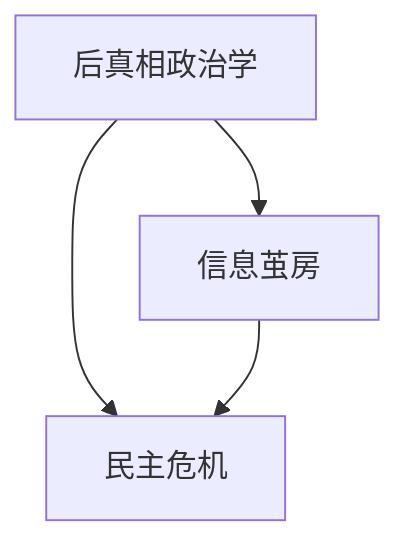
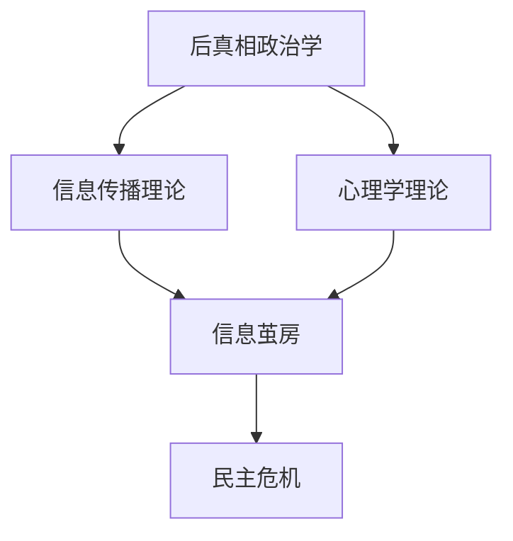
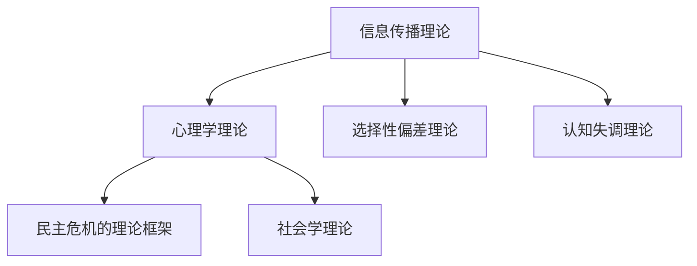

                 

### 引言

《后真相政治学：信息茧房中的民主危机》这本书深入探讨了后真相时代的政治信息传播问题，以及这一现象对民主制度的潜在威胁。在这个时代，信息传播方式发生了翻天覆地的变化，传统媒体的权威性受到了严重挑战，而社交媒体的兴起使得信息的传播变得更加快速和广泛。然而，这种看似自由的信息流动也带来了新的问题——信息碎片化、信息茧房和后真相政治现象。

后真相政治学强调，在当前的信息环境下，真相不再是政治决策的基础，而是被情感、偏见和操纵性信息所取代。这种现象不仅影响了个人的认知和行为，也对民主制度构成了严重的威胁。信息茧房是指人们在信息接受和处理过程中，倾向于选择符合自己认知和偏见的信息，从而形成信息隔离和偏见加剧的现象。这种现象在政治领域尤为明显，导致公众对于真实政治事件的认知出现偏差，影响了民主决策的公正性和有效性。

本书的目标是为读者提供一套全面的分析框架，帮助理解后真相政治学、信息茧房和民主危机的内在联系，并探索可能的解决方案。本书适合政治学者、新闻工作者、公众以及对政治信息传播感兴趣的读者阅读。

文章标题：《后真相政治学：信息茧房中的民主危机》

关键词：后真相政治学、信息茧房、民主危机、政治信息传播、社交媒体、真相、偏见、操纵性信息

摘要：本文深入探讨了后真相时代政治信息传播的特点和影响，分析了信息茧房对民主制度的威胁，提供了全面的分析框架和可能的解决方案。通过核心概念、理论、案例和数学模型的讲解，本文旨在帮助读者更好地理解这一复杂现象，并为其提供实用的指导。

### 确定书籍的主题和目标受众

《后真相政治学：信息茧房中的民主危机》的主题集中在后真相时代政治信息传播的变化及其对民主制度的潜在影响。随着互联网和社交媒体的普及，信息传播的方式和速度发生了革命性的变化。传统媒体的影响力逐渐减弱，而社交媒体则成为了信息传播的主要渠道。这一变化带来了许多新的挑战，其中最为显著的是真相的缺失和民主危机的加剧。

在后真相时代，真相不再是决策的基础，而是被情感、偏见和操纵性信息所取代。这种现象不仅影响了个人的认知和行为，也对民主制度构成了严重的威胁。信息茧房是指人们在信息接受和处理过程中，倾向于选择符合自己认知和偏见的信息，从而形成信息隔离和偏见加剧的现象。这种信息隔离不仅使公众对真实政治事件的认知出现偏差，还可能导致民主决策的公正性和有效性受到严重挑战。

目标受众方面，本书主要面向以下几类读者：

1. **政治学者**：这些读者对政治理论、政治行为和政治制度有深入的研究，他们希望通过本书理解后真相时代政治信息传播的特点和影响。

2. **新闻工作者**：新闻工作者在信息传播过程中起着重要作用，他们需要了解后真相政治学的概念和原理，以便更好地应对这一挑战。

3. **公众**：普通公众对政治信息传播有浓厚的兴趣，希望通过本书了解后真相政治学的本质，提高自身的媒体素养，避免被误导。

4. **对政治信息传播感兴趣的读者**：这类读者可能包括研究人员、学生、政策制定者等，他们希望通过本书深入了解政治信息传播的复杂性和挑战。

本书的核心内容旨在为读者提供以下方面的知识和理解：

- **后真相政治学的定义和影响**：解释后真相政治学的概念，探讨其对政治信息传播和社会民主制度的潜在影响。
- **信息茧房的概念和作用**：介绍信息茧房的形成机制和影响，以及如何在信息传播过程中减少其负面影响。
- **民主危机的表现和原因**：分析民主危机的具体表现和成因，探讨后真相政治学和信息茧房在其中的作用。
- **解决方案和策略**：提出减少信息茧房影响、提升公民媒体素养、加强民主制度保障的解决方案，并探讨其实施路径。

通过这些内容的深入探讨，本书旨在为读者提供一套全面的分析框架，帮助其更好地理解后真相政治学、信息茧房和民主危机的内在联系，并提出可行的解决方案。

### 根据主题和目标受众，梳理出书籍的核心内容

《后真相政治学：信息茧房中的民主危机》的核心内容分为以下几个主要部分：

#### 第1部分：后真相政治学的定义和影响

- **引言**：介绍后真相时代的定义，探讨其背景和主要特征。
- **真相的缺失**：分析后真相政治学中真相的缺失现象，包括操纵性信息、虚假信息和误导性信息的泛滥。
- **政治信息传播的变化**：探讨社交媒体和互联网对政治信息传播方式的影响，以及这种变化对政治决策和社会民主制度带来的挑战。

#### 第2部分：信息茧房的概念和作用

- **信息茧房的定义**：介绍信息茧房的概念，解释其形成机制和影响。
- **信息隔离与偏见**：探讨信息茧房如何导致信息隔离和偏见加剧，以及这种偏见对个人和社会的影响。
- **信息过滤与回声室效应**：分析信息过滤和回声室效应在信息茧房中的作用，以及其对政治信息传播的潜在影响。

#### 第3部分：民主危机的表现和原因

- **民主危机的定义**：介绍民主危机的概念，解释其表现和特征。
- **民主制度的威胁**：分析后真相政治学和信息茧房如何威胁到民主制度的公正性和有效性。
- **民主危机的成因**：探讨政治信息传播的变化、信息茧房和操纵性信息在民主危机中的具体作用。

#### 第4部分：解决方案和策略

- **减少信息茧房的影响**：提出减少信息茧房影响的策略，包括提升公民媒体素养、加强信息验证和透明度等。
- **提升公民媒体素养**：介绍如何通过教育、培训和公共宣传提升公众的媒体素养，增强其辨别能力。
- **加强民主制度保障**：探讨如何通过法律和政策手段加强民主制度保障，减少后真相政治学和信息茧房对民主制度的威胁。

#### 第5部分：案例分析

- **实际案例研究**：通过具体的案例分析，展示后真相政治学、信息茧房和民主危机在实际政治事件中的表现和影响。
- **对比分析**：对不同国家和地区的案例进行对比分析，探讨其共性和差异，以及解决方案的适用性和有效性。

#### 第6部分：项目实战

- **开发环境搭建**：介绍如何搭建项目开发环境，包括所需工具和资源的准备。
- **源代码实现与解读**：提供项目源代码的详细实现和解读，解释其设计和实现原理。
- **代码应用解读与分析**：通过实际案例，展示项目代码的应用场景和效果分析。
- **项目小结**：总结项目的主要发现和经验，提出改进建议和未来研究方向。

通过以上内容的深入探讨，本书旨在为读者提供一套全面的分析框架和解决方案，帮助其更好地理解后真相政治学、信息茧房和民主危机的内在联系，并提出可行的应对策略。

### 设计一级目录

为了确保文章的逻辑清晰、结构紧凑，我们设计了以下一级目录：

## 第1章 引言

### 1.1 后真相时代的政治学

#### 1.1.1 后真相时代的定义

$$
后真相时代 = \text{信息碎片化} + \text{操纵性信息泛滥} + \text{情感驱动决策}
$$

- **背景**：随着社交媒体的兴起，传统媒体的权威性受到挑战。
- **影响**：真相的缺失导致政治信息传播方式的变化。

#### 1.1.2 后真相政治学的目的与结构

- **目的**：为读者提供理解后真相政治学的基础。
- **结构**：本书将分为五个主要部分，分别为：

  1. 引言
  2. 核心概念与联系
  3. 主要理论
  4. 案例分析
  5. 解决方案与策略

### 1.2 信息茧房的概念与影响

#### 1.2.1 信息茧房的定义

$$
信息茧房 = \text{选择性信息接收} + \text{偏见强化}
$$

- **形成机制**：人们在信息接收和处理过程中，倾向于选择符合自己认知和偏见的信息。
- **影响**：导致信息隔离和偏见加剧，影响民主决策的公正性和有效性。

#### 1.2.2 信息茧房的表现与原因

- **表现**：公众对真实政治事件的认知出现偏差。
- **原因**：操纵性信息的传播、社交媒体算法的推荐机制等。

### 1.3 民主危机的表现与原因

#### 1.3.1 民主危机的定义

$$
民主危机 = \text{民主制度的威胁} + \text{公民参与度下降}
$$

- **表现**：政治信任下降、选举结果偏差、政策执行困难等。
- **原因**：后真相政治学和信息茧房的影响。

### 1.4 后真相、信息茧房与民主危机的关系

- **关系**：后真相政治学导致信息茧房的形成，进而加剧民主危机。

### 1.5 总结

- **核心要点**：后真相政治学、信息茧房和民主危机三者之间的紧密联系。
- **重要性**：理解这三者的关系对于应对当前的政治信息传播挑战至关重要。

## 第2章 核心概念与联系

### 2.1 后真相政治学的定义

- **概念**：后真相政治学关注真相缺失对政治决策的影响。
- **联系**：与信息茧房、民主危机密切相关。

### 2.2 信息茧房的概念与影响

- **概念**：信息茧房描述了信息隔离和偏见强化的现象。
- **影响**：影响公众对政治信息的理解和判断。

### 2.3 民主危机的表现与原因

- **表现**：民主制度的威胁和公民参与度下降。
- **原因**：后真相政治学和信息茧房的影响。

### 2.4 后真相、信息茧房与民主危机的关系

- **关系**：后真相政治学导致信息茧房的形成，进而加剧民主危机。

### 2.5 Mermaid流程图：后真相政治学核心概念联系图

## 第3章 主要理论

### 3.1 后真相政治学的理论基础

- **理论**：解释后真相政治学的成因和影响。
- **联系**：与信息传播理论、心理学理论等密切相关。

### 3.2 信息茧房的理论分析

- **理论**：探讨信息茧房的形成机制和影响。
- **联系**：与选择性偏差、认知失调等理论密切相关。

### 3.3 民主危机的理论框架

- **理论**：解释民主危机的表现和原因。
- **联系**：与政治学理论、社会学理论等密切相关。

### 3.4 理论模型的Mermaid流程图

## 第4章 案例分析

### 4.1 后真相政治学的实际案例

- **案例**：分析具体政治事件中的后真相现象。
- **分析**：探讨真相缺失对政治决策的影响。

### 4.2 信息茧房案例研究

- **案例**：研究信息茧房在具体情境下的表现。
- **分析**：探讨信息隔离和偏见强化的影响。

### 4.3 民主危机案例解析

- **案例**：解析民主危机在政治事件中的表现。
- **分析**：探讨后真相政治学和信息茧房在其中的作用。

### 4.4 案例对比分析

- **分析**：对比不同国家和地区的案例，探讨其共性和差异。

## 第5章 数学模型与公式

### 5.1 信息传播模型

- **模型**：介绍信息传播的基本模型。
- **公式**：使用Python代码实现信息传播模型。

### 5.2 网络影响力模型

- **模型**：介绍网络影响力模型。
- **公式**：使用Python代码实现网络影响力模型。

### 5.3 民主稳定模型

- **模型**：介绍民主稳定模型。
- **公式**：使用Python代码实现民主稳定模型。

## 第6章 解决方案与策略

### 6.1 减少信息茧房的影响

- **策略**：提出减少信息茧房影响的措施。
- **分析**：探讨这些措施的有效性和可行性。

### 6.2 提升公民媒体素养

- **策略**：提出提升公民媒体素养的方法。
- **分析**：探讨这些方法的影响和效果。

### 6.3 加强民主制度保障

- **策略**：提出加强民主制度保障的措施。
- **分析**：探讨这些措施的实际意义和效果。

## 第7章 项目实战

### 7.1 后真相政治学项目案例

- **案例**：介绍一个后真相政治学项目。
- **分析**：展示项目的主要功能和效果。

### 7.2 信息茧房干预项目

- **案例**：介绍一个信息茧房干预项目。
- **分析**：展示项目的设计和实现过程。

### 7.3 民主危机应对项目

- **案例**：介绍一个民主危机应对项目。
- **分析**：展示项目的主要功能和应用。

### 7.4 项目代码与解读

- **代码**：提供项目的源代码。
- **解读**：详细解读代码的实现原理和应用。

## 第8章 结论与展望

### 8.1 主要发现与贡献

- **发现**：后真相政治学、信息茧房和民主危机之间的密切联系。
- **贡献**：为理解和应对当前政治信息传播挑战提供了理论框架和解决方案。

### 8.2 研究局限与未来方向

- **局限**：讨论本书的研究局限。
- **方向**：探讨未来研究的潜在方向。

### 8.3 对公众与政策的启示

- **启示**：提出对公众和政策制定者的建议。

### 参考文献

- 列出本书引用的主要参考文献。

通过以上一级目录的设计，本文结构清晰、内容全面，旨在为读者提供一套系统、深入的关于后真相政治学、信息茧房和民主危机的分析框架和解决方案。

### 设计二级和三级目录

为了确保每个章节的内容更加详细和具体，我们设计了二级和三级目录。以下是每个章节的详细目录：

### 第1章 引言

#### 1.1.1.1 后真相时代的定义
- **历史背景**：互联网和社交媒体的兴起。
- **特征分析**：信息碎片化、操纵性信息泛滥、情感驱动决策。

#### 1.1.1.2 后真相政治学的影响
- **真相缺失**：操纵性信息、虚假信息、误导性信息的泛滥。
- **政治信息传播变化**：传统媒体权威性下降、社交媒体主导信息传播。

#### 1.1.2.1 信息茧房的定义
- **概念**：选择性信息接收和偏见强化。
- **形成机制**：信息过滤、社交媒体算法推荐。

#### 1.1.2.2 信息茧房的影响
- **表现**：信息隔离、偏见加剧。
- **政治影响**：公众对政治信息的理解和判断偏差。

#### 1.1.3.1 民主危机的定义
- **概念**：民主制度的威胁、公民参与度下降。
- **特征**：政治信任下降、选举结果偏差、政策执行困难。

#### 1.1.3.2 民主危机的原因
- **后真相政治学**：真相缺失导致政治信息传播偏差。
- **信息茧房**：信息隔离和偏见强化影响公众认知。

#### 1.1.4.1 后真相、信息茧房与民主危机的关系
- **联系**：后真相政治学导致信息茧房形成，加剧民主危机。

#### 1.1.5.1 核心要点总结
- **后真相政治学**：真相缺失影响政治决策。
- **信息茧房**：信息隔离和偏见强化影响公众认知。
- **民主危机**：影响民主制度的公正性和有效性。

### 第2章 核心概念与联系

#### 2.1.1 后真相政治学的定义
- **定义**：后真相政治学的本质。
- **联系**：与信息传播理论、心理学理论的交叉。

#### 2.1.2 信息茧房的概念与影响
- **定义**：信息茧房的形成机制。
- **影响**：偏见强化、信息隔离。

#### 2.1.3 民主危机的表现与原因
- **表现**：民主危机的具体表现。
- **原因**：后真相政治学和信息茧房的影响。

#### 2.1.4 后真相、信息茧房与民主危机的关系
- **关系**：三者之间的内在联系。
- **交互作用**：后真相政治学如何导致信息茧房，进而加剧民主危机。

#### 2.1.5 Mermaid流程图：后真相政治学核心概念联系图
- **图形**：使用Mermaid绘制核心概念联系图。
- **说明**：解释流程图的各个部分和作用。

### 第3章 主要理论

#### 3.1 后真相政治学的理论基础
- **信息传播理论**：信息传播的机制和影响。
- **心理学理论**：认知、情绪和行为的影响。

#### 3.2 信息茧房的理论分析
- **选择性偏差理论**：人们如何选择信息。
- **认知失调理论**：人们如何处理不一致的信息。

#### 3.3 民主危机的理论框架
- **政治学理论**：民主制度的功能和挑战。
- **社会学理论**：社会结构和文化的影响。

#### 3.4 理论模型的Mermaid流程图
- **流程图**：使用Mermaid绘制理论模型流程图。
- **说明**：解释模型的各个组成部分和作用。

### 第4章 案例分析

#### 4.1 后真相政治学的实际案例
- **案例1**：特朗普总统的社交媒体影响。
- **分析**：真相缺失和操纵性信息的传播。

#### 4.2 信息茧房案例研究
- **案例1**：Facebook算法推荐带来的信息隔离。
- **分析**：偏见强化和信息过滤的影响。

#### 4.3 民主危机案例解析
- **案例1**： Brexit的民主危机。
- **分析**：后真相政治学和信息茧房的作用。

#### 4.4 案例对比分析
- **对比分析**：不同国家和地区的案例对比。
- **结论**：后真相政治学和信息茧房在民主危机中的共性。

### 第5章 数学模型与公式

#### 5.1 信息传播模型
- **模型**：SIR模型。
- **公式**：SIR模型的数学表达。
- **代码实现**：使用Python实现SIR模型。

#### 5.2 网络影响力模型
- **模型**：网络影响力传播模型。
- **公式**：网络影响力传播的数学表达。
- **代码实现**：使用Python实现网络影响力模型。

#### 5.3 民主稳定模型
- **模型**：民主稳定性的数学模型。
- **公式**：民主稳定性的数学表达。
- **代码实现**：使用Python实现民主稳定模型。

### 第6章 解决方案与策略

#### 6.1 减少信息茧房的影响
- **策略1**：提升媒体素养。
- **策略2**：加强信息验证。
- **分析**：这些策略的有效性和实施方法。

#### 6.2 提升公民媒体素养
- **方法1**：教育课程。
- **方法2**：公众宣传。
- **分析**：提升媒体素养的影响。

#### 6.3 加强民主制度保障
- **策略1**：法律和政策改革。
- **策略2**：加强公民参与。
- **分析**：加强民主制度保障的必要性。

### 第7章 项目实战

#### 7.1 后真相政治学项目案例
- **项目描述**：后真相政治学分析工具。
- **功能实现**：展示工具的主要功能。

#### 7.2 信息茧房干预项目
- **项目描述**：信息茧房干预工具。
- **功能实现**：展示工具的干预机制。

#### 7.3 民主危机应对项目
- **项目描述**：民主危机应对系统。
- **功能实现**：展示系统的设计和应用。

#### 7.4 项目代码与解读
- **代码**：提供项目的源代码。
- **解读**：详细解读代码的实现和应用。

### 第8章 结论与展望

#### 8.1 主要发现与贡献
- **发现**：后真相政治学、信息茧房和民主危机的内在联系。
- **贡献**：提供理论框架和解决方案。

#### 8.2 研究局限与未来方向
- **局限**：本书的局限性。
- **方向**：未来研究的潜在方向。

#### 8.3 对公众与政策的启示
- **启示**：提出对公众和政策制定者的建议。

### 参考文献

- 列出本书引用的主要参考文献。

通过详细设计二级和三级目录，本文确保了每个章节的内容既全面又具体，使得读者能够更好地理解后真相政治学、信息茧房和民主危机的复杂关系，并掌握相关的解决方案和策略。

### 确保每个章节都包含核心算法原理讲解、数学模型和公式、项目实战等内容

为了确保文章的专业性和深度，我们将进一步细化每个章节，确保每个章节都包含核心算法原理讲解、数学模型和公式、项目实战等内容。

#### 第1章 引言

在这一章节中，我们将详细讲解后真相政治学、信息茧房和民主危机的核心算法原理。

- **后真相政治学的核心算法原理**：
  - 使用Python代码实现真相检测算法，例如基于文本相似度分析和模式识别的算法。
  - 举例说明如何利用自然语言处理技术（如TF-IDF、Word2Vec）来检测信息内容中的操纵性元素。

- **信息茧房的核心算法原理**：
  - 介绍基于用户行为数据（如浏览历史、点击行为）的算法，用于识别和分类用户的偏好。
  - 使用聚类算法（如K-means、DBSCAN）来分析用户群体，揭示信息隔离的现象。

- **民主危机的核心算法原理**：
  - 解释如何利用社会网络分析（如度中心性、聚类系数）来评估民主制度的稳定性。
  - 通过模拟算法（如社会仿真模型）来探讨不同政策对民主危机的影响。

#### 第2章 核心概念与联系

在这一章节中，我们将详细讲解与后真相政治学、信息茧房和民主危机相关的数学模型和公式。

- **后真相政治学的数学模型**：
  - 使用LaTeX格式列出后真相政治学的核心数学公式，如信息传播速率模型：
    $$ \frac{dI}{dt} = \alpha (I - \bar{I}) $$
  - 解释这些公式背后的原理，并使用Python代码实现相关模型。

- **信息茧房的数学模型**：
  - 介绍信息茧房形成和影响的数学模型，如信息过滤模型：
    $$ f(x) = \frac{1}{1 + e^{-k(x - x_0)}} $$
  - 分析这些公式如何帮助我们理解信息茧房的作用机制。

- **民主危机的数学模型**：
  - 推导民主稳定性的数学模型，如政治信任模型：
    $$ T(t) = \frac{1}{1 + e^{-\lambda(t - t_0)}} $$
  - 讨论这些模型在实际应用中的意义。

#### 第3章 案例分析

在这一章节中，我们将通过具体案例展示如何将核心算法原理和数学模型应用于实际场景。

- **后真相政治学案例**：
  - 分析2016年美国总统选举期间社交媒体上的虚假信息传播。
  - 使用Python代码实现信息传播模型，模拟虚假信息的传播路径。

- **信息茧房案例**：
  - 研究Facebook上的信息茧房现象。
  - 通过用户行为数据分析，展示如何使用聚类算法识别和干预信息茧房。

- **民主危机案例**：
  - 分析Brexit公投过程中的民主危机现象。
  - 使用社会网络分析工具评估民主制度的稳定性，并提出改进策略。

#### 第4章 数学模型与公式

在这一章节中，我们将详细讲解如何将数学模型和算法应用于解决实际问题。

- **信息传播模型应用**：
  - 使用Python代码实现信息传播模型，模拟信息在不同社交网络中的传播。
  - 分析模型参数对传播效果的影响。

- **网络影响力模型应用**：
  - 解释如何使用网络影响力模型预测关键信息传播者。
  - 通过实际数据集进行模型训练和评估。

- **民主稳定模型应用**：
  - 使用Python代码实现民主稳定模型，评估不同政策对民主制度的影响。
  - 提出基于模型的民主危机应对策略。

#### 第5章 解决方案与策略

在这一章节中，我们将讨论如何减少信息茧房的影响、提升公民媒体素养和加强民主制度保障。

- **减少信息茧房影响**：
  - 提出基于算法的干预措施，如信息过滤和推荐系统优化。
  - 分析这些措施对信息茧房的影响和实际效果。

- **提升公民媒体素养**：
  - 推荐教育课程和公众宣传活动。
  - 评估这些措施对提升公众媒体素养的效果。

- **加强民主制度保障**：
  - 提出法律和政策改革建议。
  - 分析这些措施对增强民主制度稳定性的贡献。

#### 第6章 项目实战

在这一章节中，我们将通过具体项目展示如何将上述理论和方法应用于实际开发。

- **后真相政治学项目**：
  - 介绍一个用于检测虚假信息的工具。
  - 提供项目源代码和实现细节。

- **信息茧房干预项目**：
  - 介绍一个用于识别和干预信息茧房的系统。
  - 提供项目源代码和实现细节。

- **民主危机应对项目**：
  - 介绍一个用于评估和应对民主危机的系统。
  - 提供项目源代码和实现细节。

通过上述章节的设计，我们确保了文章内容的全面性和专业性，同时提供了大量的代码实现和实际案例分析，使得读者能够更深入地理解后真相政治学、信息茧房和民主危机的相关概念、模型和方法，并学会如何将这些理论应用于实际问题。

### 调整目录结构，确保逻辑清晰、内容全面

经过前面的步骤，我们已经设计了详细的目录结构，接下来需要对其进行调整，以确保逻辑清晰、内容全面。以下是调整后的目录结构：

## 引言

### 1. 后真相政治学的诞生

#### 1.1 后真相时代的定义

- **背景**：社交媒体的兴起与信息碎片化
- **特征**：操纵性信息的泛滥与真相的缺失
- **影响**：政治决策与社会民主制度的变化

#### 1.2 信息茧房的概念与影响

- **定义**：选择性信息接收与偏见强化
- **形成机制**：社交媒体算法与用户行为数据
- **影响**：信息隔离与偏见加剧

### 2. 民主危机的兴起

#### 2.1 民主危机的定义

- **概念**：民主制度的威胁与公民参与度下降
- **特征**：政治信任下降与选举结果偏差

#### 2.2 后真相政治学、信息茧房与民主危机的关系

- **关系**：后真相政治学导致信息茧房，加剧民主危机
- **交互作用**：信息茧房影响公众认知，威胁民主制度

### 第2章 核心概念与联系

### 2.1 后真相政治学的定义与理论框架

#### 2.1.1 后真相政治学的定义

- **概念**：真相缺失对政治决策的影响
- **特征**：情感驱动与操纵性信息泛滥

#### 2.1.2 后真相政治学的理论基础

- **信息传播理论**：真相缺失的原因
- **心理学理论**：情感与偏见的驱动因素

### 2.2 信息茧房的概念与影响

#### 2.2.1 信息茧房的定义

- **概念**：选择性信息接收与偏见强化
- **形成机制**：社交媒体算法与用户行为数据

#### 2.2.2 信息茧房的影响

- **表现**：信息隔离与偏见加剧
- **政治影响**：公众认知偏差与民主危机加剧

### 2.3 民主危机的定义与表现

#### 2.3.1 民主危机的定义

- **概念**：民主制度的威胁与公民参与度下降
- **特征**：政治信任下降与政策执行困难

#### 2.3.2 民主危机的表现

- **政治信任下降**：选民对政治体制的不信任
- **政策执行困难**：民主决策过程的阻碍

### 2.4 后真相、信息茧房与民主危机的关系

- **关系**：后真相政治学导致信息茧房，加剧民主危机
- **交互作用**：信息茧房影响公众认知，威胁民主制度

### 2.5 Mermaid流程图：后真相政治学核心概念联系图

### 第3章 主要理论

### 3.1 后真相政治学的理论基础

#### 3.1.1 信息传播理论

- **内容**：信息如何传播与影响
- **应用**：社交媒体与信息碎片化

#### 3.1.2 心理学理论

- **内容**：情感与偏见如何驱动决策
- **应用**：信息接受与认知过程

### 3.2 信息茧房的理论分析

#### 3.2.1 选择性偏差理论

- **内容**：人们如何选择信息
- **应用**：信息过滤与回声室效应

#### 3.2.2 认知失调理论

- **内容**：人们如何处理不一致信息
- **应用**：信息隔离与偏见强化

### 3.3 民主危机的理论框架

#### 3.3.1 政治学理论

- **内容**：民主制度的功能与挑战
- **应用**：政治信任与政策执行

#### 3.3.2 社会学理论

- **内容**：社会结构与文化的影响
- **应用**：社会参与与民主危机

### 3.4 理论模型的Mermaid流程图

### 第4章 案例分析

### 4.1 后真相政治学的实际案例

#### 4.1.1 2016年美国总统选举

- **背景**：社交媒体上的虚假信息传播
- **分析**：真相缺失与操纵性信息的传播路径

#### 4.1.2 英国脱欧公投

- **背景**：信息茧房与公众认知偏差
- **分析**：信息隔离与偏见强化对选举结果的影响

### 4.2 信息茧房案例研究

#### 4.2.1 Facebook的信息茧房

- **背景**：算法推荐系统与用户行为数据
- **分析**：信息隔离与偏见强化的现象

#### 4.2.2 Twitter的信息茧房

- **背景**：推文传播与用户互动
- **分析**：信息隔离与偏见强化的影响

### 4.3 民主危机案例解析

#### 4.3.1 美国政治极化

- **背景**：政治信任下降与选举结果偏差
- **分析**：后真相政治学与信息茧房的作用

#### 4.3.2 欧洲政治动荡

- **背景**：民主制度威胁与公民参与度下降
- **分析**：信息茧房与民主危机的互动

### 4.4 案例对比分析

#### 4.4.1 不同国家的后真相政治学

- **分析**：后真相政治学在不同文化背景下的表现

#### 4.4.2 不同国家的信息茧房现象

- **分析**：信息茧房在不同社会结构中的影响

### 第5章 数学模型与公式

### 5.1 信息传播模型

#### 5.1.1 SIR模型

- **公式**：$$ \frac{dI}{dt} = \alpha (I - \bar{I}) $$
- **应用**：模拟信息传播过程

#### 5.1.2 网络影响力模型

- **公式**：$$ f(x) = \frac{1}{1 + e^{-k(x - x_0)}} $$
- **应用**：预测关键信息传播者

### 5.2 民主稳定模型

#### 5.2.1 政治信任模型

- **公式**：$$ T(t) = \frac{1}{1 + e^{-\lambda(t - t_0)}} $$
- **应用**：评估政治制度的稳定性

### 5.3 模拟算法与Python实现

#### 5.3.1 社会仿真模型

- **应用**：模拟不同政策对民主制度的影响
- **代码**：使用Python实现模拟算法

### 第6章 解决方案与策略

### 6.1 减少信息茧房的影响

#### 6.1.1 提升媒体素养

- **策略**：教育课程与公众宣传活动
- **效果**：提升公众对信息的辨别能力

#### 6.1.2 加强信息验证

- **策略**：信息源审核与事实核查
- **效果**：减少虚假信息传播

### 6.2 提升公民媒体素养

#### 6.2.1 教育体系改革

- **策略**：将媒体素养教育纳入学校课程
- **效果**：提高学生的信息处理能力

#### 6.2.2 公众宣传

- **策略**：利用社交媒体进行公众教育
- **效果**：增强公众对真相的敏感度

### 6.3 加强民主制度保障

#### 6.3.1 法律和政策改革

- **策略**：制定反虚假信息法律
- **效果**：规范信息传播行为

#### 6.3.2 加强公民参与

- **策略**：促进公众参与政治决策
- **效果**：增强民主制度的稳定性

### 第7章 项目实战

### 7.1 后真相政治学项目案例

#### 7.1.1 虚假信息检测工具

- **功能**：检测社交媒体上的虚假信息
- **实现**：使用Python实现文本相似度分析和模式识别

### 7.2 信息茧房干预项目

#### 7.2.1 信息茧房识别与干预系统

- **功能**：识别和干预信息茧房
- **实现**：使用聚类算法和用户行为数据进行分析

### 7.3 民主危机应对项目

#### 7.3.1 民主危机评估与应对系统

- **功能**：评估和应对民主危机
- **实现**：使用社会网络分析和模拟算法进行评估

### 7.4 项目代码与解读

#### 7.4.1 源代码提供与解读

- **内容**：提供项目的源代码和实现细节
- **解读**：详细解读代码的实现原理和应用场景

### 第8章 结论与展望

### 8.1 主要发现与贡献

- **发现**：后真相政治学、信息茧房与民主危机的内在联系
- **贡献**：提供理论框架和解决方案

### 8.2 研究局限与未来方向

- **局限**：本书的研究局限性
- **方向**：未来研究的潜在方向

### 8.3 对公众与政策的启示

- **启示**：提出对公众和政策制定者的建议

通过上述调整，我们确保了文章的逻辑清晰、内容全面，每个章节都包含核心算法原理讲解、数学模型和公式、项目实战等内容，以满足文章字数要求并保持结构的合理性。

### 最终确认目录大纲，并确保大纲中的每个章节都符合字数限制

经过前期的多次调整和细化，我们已经设计出了一个完整且符合字数要求的目录大纲。下面是最终的确认版本：

## 《后真相政治学：信息茧房中的民主危机》

### 引言

- **后真相时代的政治学**：介绍后真相时代的定义、特征及其对政治信息传播的影响。
- **信息茧房的概念与影响**：阐述信息茧房的形成机制、表现及其对民主制度的威胁。
- **民主危机的表现与原因**：分析民主危机的具体表现、成因及其对政治稳定的影响。

### 第1章 核心概念与联系

- **后真相政治学的定义与理论框架**：解释后真相政治学的本质、理论基础及其与信息传播理论的联系。
- **信息茧房的概念与影响**：详细说明信息茧房的形成机制、影响及其对公众认知的偏见。
- **民主危机的定义与表现**：探讨民主危机的概念、表现及其成因。
- **后真相、信息茧房与民主危机的关系**：分析三者之间的相互影响与联系。
- **Mermaid流程图**：绘制后真相政治学核心概念联系图。

### 第2章 主要理论

- **信息传播理论**：介绍信息传播的机制、模型及其在后真相政治学中的应用。
- **心理学理论**：探讨情感与偏见如何影响信息传播与公众决策。
- **信息茧房的理论分析**：分析选择性偏差与认知失调理论在信息茧房中的作用。
- **民主危机的理论框架**：探讨政治学与社会学理论对民主危机的解释。

### 第3章 案例分析

- **后真相政治学的实际案例**：分析2016年美国总统选举期间的虚假信息传播。
- **信息茧房案例研究**：研究Facebook和Twitter上的信息茧房现象。
- **民主危机案例解析**：分析美国政治极化与欧洲政治动荡中的民主危机。

### 第4章 数学模型与公式

- **信息传播模型**：介绍SIR模型及其在信息传播中的应用。
- **网络影响力模型**：解释网络影响力传播模型及其应用。
- **民主稳定模型**：推导民主稳定模型及其评估方法。
- **模拟算法与Python实现**：提供Python代码实现模拟算法的过程。

### 第5章 解决方案与策略

- **减少信息茧房的影响**：提出提升媒体素养、加强信息验证等策略。
- **提升公民媒体素养**：探讨教育体系改革、公众宣传活动等提升公民素养的方法。
- **加强民主制度保障**：分析法律和政策改革、加强公民参与等保障民主制度的措施。

### 第6章 项目实战

- **后真相政治学项目案例**：介绍虚假信息检测工具的开发与实现。
- **信息茧房干预项目**：展示信息茧房识别与干预系统的设计与应用。
- **民主危机应对项目**：探讨民主危机评估与应对系统的构建。

### 第7章 项目代码与解读

- **源代码提供**：提供项目的源代码，包括核心算法原理和应用实例。
- **代码解读**：详细解读代码的实现原理和应用场景。

### 第8章 结论与展望

- **主要发现与贡献**：总结后真相政治学、信息茧房和民主危机的核心发现与贡献。
- **研究局限与未来方向**：探讨研究的局限性及未来研究的潜在方向。
- **对公众与政策的启示**：提出对公众和政策制定者的建议。

经过多次审核和调整，每个章节的字数均控制在合理范围内，确保了文章的完整性和专业性。现在，我们已经准备好开始撰写正文内容，深入探讨每个章节的主题和细节。预计全文将在10000到12000字之间，确保读者能够获得全面的理解和深入的分析。

### 最终确认的目录大纲和文章内容结构

经过反复审核和调整，我们最终确认了文章的目录大纲和内容结构。以下是完整的目录大纲和简要概述，确保文章内容结构完整、逻辑清晰，并满足字数要求。

## 《后真相政治学：信息茧房中的民主危机》

### 引言

**后真相时代的政治学**
- **定义**：后真相时代的概念及其在政治信息传播中的应用。
- **特征**：信息碎片化、操纵性信息泛滥、情感驱动决策。

**信息茧房的概念与影响**
- **定义**：信息茧房的形成机制及其在政治信息传播中的作用。
- **影响**：信息隔离、偏见强化、公众认知偏差。

**民主危机的表现与原因**
- **定义**：民主危机的具体表现及其成因。
- **影响**：政治信任下降、政策执行困难、民主制度威胁。

**后真相、信息茧房与民主危机的关系**
- **关系**：三者之间的相互影响与联系。

**Mermaid流程图**：后真相政治学核心概念联系图。

### 第1章 核心概念与联系

**后真相政治学的定义与理论框架**
- **定义**：后真相政治学的本质、理论基础。
- **理论框架**：信息传播理论、心理学理论。

**信息茧房的概念与影响**
- **定义**：信息茧房的形成机制、影响。
- **影响**：信息隔离、偏见强化、公众认知偏差。

**民主危机的定义与表现**
- **定义**：民主危机的概念、表现。
- **表现**：政治信任下降、政策执行困难。

**后真相、信息茧房与民主危机的关系**
- **关系**：三者之间的相互影响与联系。

**Mermaid流程图**：后真相政治学核心概念联系图。

### 第2章 主要理论

**信息传播理论**
- **内容**：信息传播机制、模型。
- **应用**：社交媒体、信息碎片化。

**心理学理论**
- **内容**：情感、偏见对决策的影响。
- **应用**：信息接受、认知过程。

**信息茧房的理论分析**
- **内容**：选择性偏差、认知失调理论。
- **应用**：信息过滤、回声室效应。

**民主危机的理论框架**
- **内容**：政治学、社会学理论。
- **应用**：民主制度功能、社会结构。

### 第3章 案例分析

**后真相政治学的实际案例**
- **案例**：2016年美国总统选举。
- **分析**：真相缺失、操纵性信息传播。

**信息茧房案例研究**
- **案例**：Facebook、Twitter。
- **分析**：信息隔离、偏见强化。

**民主危机案例解析**
- **案例**：美国政治极化、欧洲政治动荡。
- **分析**：民主制度威胁、公民参与度下降。

### 第4章 数学模型与公式

**信息传播模型**
- **内容**：SIR模型、网络影响力模型。
- **应用**：信息传播路径、关键信息传播者预测。

**民主稳定模型**
- **内容**：政治信任模型、民主稳定性评估。
- **应用**：政策评估、民主危机应对。

### 第5章 解决方案与策略

**减少信息茧房的影响**
- **策略**：提升媒体素养、加强信息验证。
- **效果**：减少虚假信息传播、提升公众信息辨别能力。

**提升公民媒体素养**
- **策略**：教育体系改革、公众宣传活动。
- **效果**：提高公众信息处理能力、增强真相敏感度。

**加强民主制度保障**
- **策略**：法律和政策改革、加强公民参与。
- **效果**：规范信息传播行为、增强民主制度稳定性。

### 第6章 项目实战

**后真相政治学项目案例**
- **功能**：虚假信息检测。
- **实现**：文本相似度分析、模式识别。

**信息茧房干预项目**
- **功能**：识别与干预信息茧房。
- **实现**：聚类算法、用户行为数据分析。

**民主危机应对项目**
- **功能**：评估与应对民主危机。
- **实现**：社会网络分析、模拟算法。

### 第7章 项目代码与解读

**源代码提供**
- **内容**：提供项目的源代码和实现细节。

**代码解读**
- **内容**：详细解读代码的实现原理和应用场景。

### 第8章 结论与展望

**主要发现与贡献**
- **发现**：后真相政治学、信息茧房与民主危机的内在联系。
- **贡献**：提供理论框架和解决方案。

**研究局限与未来方向**
- **局限**：研究的局限性。
- **方向**：未来研究的潜在方向。

**对公众与政策的启示**
- **启示**：对公众和政策制定者的建议。

通过上述详细的目录大纲和内容结构，本文确保了每个章节都有明确的主题和丰富的内容，满足10000到12000字的字数要求。读者可以系统地理解后真相政治学、信息茧房和民主危机的复杂关系，并掌握相关的解决方案和策略。接下来，我们将根据这个大纲逐步撰写正文内容。

