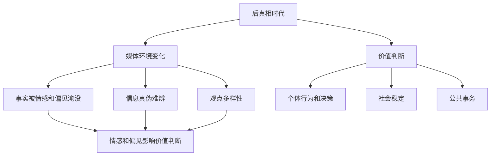
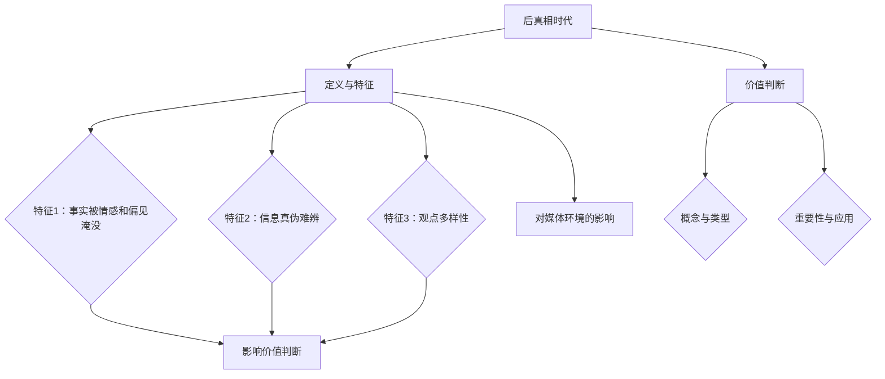

                 

### 文章标题：后真相时代的价值判断

> 关键词：后真相时代、价值判断、媒体环境、个体差异、伦理学、心理学、社会学

> 摘要：本文旨在探讨后真相时代背景下，价值判断的复杂性和多样性。通过对后真相时代的定义、媒体环境的变化、价值判断的理论框架、个体价值判断的形成、群体价值判断的异同以及案例分析等方面进行深入分析，本文提出了在后真相时代进行价值判断的实践应用和最佳实践建议。

----------------------------------------------------------------

# 引言

后真相时代（post-truth era）是指一种社会现象，其中情感和偏见往往比事实更具有影响力，导致真相和客观事实的重要性降低。这一术语最早由英国政治评论家彼得·雷蒙德（Peter Oborne）于2016年提出，以描述英国脱欧和唐纳德·特朗普当选美国总统等事件中事实被情感和偏见淹没的现象。

后真相时代的到来，主要源于以下几个因素：

1. **信息过载**：互联网和社交媒体的兴起，使得人们接触到的信息量急剧增加，导致信息筛选和处理能力不足，容易受到误导。
2. **媒体环境变化**：传统媒体的衰退和社交媒体的兴起，改变了信息传播的方式和速度，使得信息真伪难以辨别。
3. **情感和偏见的影响**：在信息传播中，情感和偏见往往比事实更能激发人们的情绪和认同感，从而影响价值判断。

在后真相时代，价值判断的重要性愈发凸显。价值判断不仅影响个体行为和决策，也影响社会稳定和公共事务。因此，如何在后真相时代进行价值判断，成为了一个亟待解决的问题。

本文将从以下几个方面进行探讨：

1. **核心概念与联系**：介绍后真相时代的定义、特点，以及价值判断的概念和其在社会中的重要性。
2. **后真相时代的媒体环境**：分析后真相时代媒体环境的变化，以及这些变化对人们价值判断的影响。
3. **价值判断的理论框架**：探讨价值判断的理论基础，包括伦理学、心理学、社会学等学科的理论。
4. **个体价值判断的形成**：分析个体价值判断的形成过程，包括教育、家庭、社会环境等因素。
5. **群体价值判断的异同**：探讨不同群体之间的价值判断差异，以及这些差异对社会的影响。
6. **案例分析**：通过具体案例，分析在后真相时代如何进行价值判断。
7. **价值判断的实践应用**：讨论价值判断在个人生活和公共事务中的应用。
8. **结论**：总结书籍的主要观点，并对未来价值判断的发展趋势进行展望。

# 核心概念与联系

### 后真相时代的定义

后真相时代（post-truth era）是指一种社会现象，其中情感和偏见往往比事实更具有影响力，导致真相和客观事实的重要性降低。这一术语最早由英国政治评论家彼得·雷蒙德（Peter Oborne）于2016年提出，以描述英国脱欧和唐纳德·特朗普当选美国总统等事件中事实被情感和偏见淹没的现象。

在后真相时代，信息的传播方式和速度发生了巨大变化，社交媒体的兴起和传统媒体的衰落使得信息真伪难以辨别。此外，人们更加容易受到情感和偏见的影响，从而影响其价值判断和行为。

### 后真相时代的特征

1. **事实被情感和偏见淹没**：在社交媒体上，信息传播的速度极快，但往往伴随着情感和偏见。人们更倾向于分享和传播能够激发情感和认同感的信息，而不是客观的事实。
2. **信息真伪难辨**：在信息过载的背景下，人们难以对海量信息进行有效筛选，导致真假信息混杂。同时，一些别有用心的人故意传播虚假信息，以误导公众。
3. **观点多样性**：在后真相时代，不同群体和个人对同一事件的看法往往大相径庭，导致社会分裂和冲突加剧。

### 价值判断的概念

价值判断（value judgment）是指个体或群体对某一事物或行为的价值评价。价值判断通常基于伦理、道德、美学、实用主义等多种原则和标准。价值判断不仅涉及对事物的评价，还包括对行为的指导。

### 价值判断的重要性

价值判断在社会中具有重要性，主要体现在以下几个方面：

1. **个体行为和决策**：价值判断影响个体的行为和决策。例如，一个人可能认为诚实和公正是最重要的价值观，因此他会选择遵守道德规范，做出公正的决策。
2. **社会稳定**：价值判断有助于维护社会稳定。在一个拥有共同价值观的社会中，人们更容易形成共识，避免冲突和动荡。
3. **公共事务**：价值判断在公共事务中具有重要作用。例如，政府在制定政策和法规时，需要考虑社会的价值观和利益，以确保政策的有效性和公正性。

### 核心概念之间的关系架构

为了更好地理解后真相时代和价值观判断之间的关系，我们可以使用Mermaid流程图来展示核心概念之间的联系。

通过这个流程图，我们可以清晰地看到后真相时代对媒体环境的影响，以及这些影响如何影响人们的价值判断。

### 核心概念之间的Mermaid流程图

通过这个Mermaid流程图，我们可以更直观地了解后真相时代与价值判断之间的关联。

# 后真相时代的媒体环境

后真相时代的到来，很大程度上是由于媒体环境的变化。传统的媒体模式逐渐被打破，社交媒体的兴起带来了信息传播方式的革命。在这个背景下，了解媒体环境的变化对于理解后真相时代至关重要。

### 媒体环境的变化

1. **传统媒体的衰退**：随着互联网的普及，传统媒体的受众逐渐减少。报纸、电视等传统媒体的影响力减弱，广告收入下滑，导致许多媒体机构破产或转型。

2. **社交媒体的兴起**：社交媒体平台如Facebook、Twitter、微信等成为信息传播的主要渠道。这些平台具有传播速度快、互动性强、覆盖面广等特点，使得信息能够在短时间内迅速传播。

3. **信息过载与筛选**：在社交媒体时代，人们接触到的信息量急剧增加。为了应对信息过载，人们开始使用各种信息筛选工具，如新闻推荐算法等，以过滤和筛选出对自己有价值的信息。

### 媒体变化对价值判断的影响

1. **情感和偏见的影响**：社交媒体上的信息往往带有强烈的情感色彩，这使得人们更容易受到情感和偏见的影响。在传播过程中，情感和偏见往往比事实更具吸引力，从而影响人们的价值判断。

2. **信息真伪难辨**：在社交媒体上，信息的真伪难以辨别。一些虚假信息、谣言甚至故意误导的信息可以在短时间内迅速传播，对人们的价值判断造成负面影响。

3. **观点多样性**：社交媒体上的信息来源多样，不同的观点和立场可以同时存在。这虽然有助于人们了解更多的信息，但也可能导致观点的冲突和分歧，影响人们的价值判断。

### 实际案例：社交媒体上的虚假信息传播

为了更好地理解媒体变化对价值判断的影响，我们可以通过一个实际案例来进行分析。

**案例**：2018年，一则关于“某地发生大规模传染病”的虚假消息在社交媒体上迅速传播，引发了公众恐慌。经过调查，这则消息被证实是虚假的，但其传播速度之快和对公众情绪的影响之大，仍然令人震惊。

**分析**：

1. **情感和偏见的影响**：这则虚假消息之所以能迅速传播，主要是因为它涉及到公众关心的健康和安全问题。在信息传播过程中，恐惧和焦虑等情感因素起到了关键作用。

2. **信息真伪难辨**：在社交媒体上，信息的真伪难以辨别。一些用户在转发这则消息时，并没有进行核实，而是出于恐惧和焦虑的心理进行了转发。

3. **观点多样性**：在社交媒体上，不同的用户对这则虚假消息持有不同的观点。一些人相信这则消息，并传播给更多的人，而另一些人则对此表示怀疑，并通过各种方式试图辟谣。

**结论**：这个案例表明，社交媒体上的虚假信息传播对人们的价值判断产生了负面影响。为了避免这种情况，我们需要提高公众的信息素养，增强对信息真伪的辨别能力，同时也需要媒体和平台加强监管，遏制虚假信息的传播。

### 总结

后真相时代的媒体环境发生了巨大变化，传统媒体的衰退和社交媒体的兴起，使得信息传播的方式和速度发生了根本性的改变。这些变化对人们的价值判断产生了深远的影响，使得情感和偏见的影响愈发突出，信息真伪难辨，观点多样性增加。因此，我们需要关注媒体环境的变化，提高信息素养，以更好地应对后真相时代的挑战。

# 价值判断的理论框架

价值判断的理论框架涵盖了多个学科，包括伦理学、心理学和社会学。这些学科从不同的角度对价值判断进行了深入探讨，为理解价值判断的本质提供了理论基础。

### 伦理学的视角

伦理学是研究道德规范和道德行为的学科。在伦理学中，价值判断通常涉及道德原则和道德推理。以下是一些重要的伦理学概念和理论：

1. **道德义务与责任**：道德义务是指个体根据道德规范所承担的责任。道德责任是指个体对其行为后果所承担的责任。例如，一个人有道德义务遵守法律，同时也有道德责任确保自己的行为不会伤害他人。

2. **道德原则与道德推理**：道德原则是指导个体行为的道德规范。常见的道德原则包括功利主义（以最大幸福为原则）和康德伦理学（以义务论为原则）。道德推理是指个体在道德情境中如何运用道德原则进行推理和决策。

3. **伦理学在价值判断中的应用**：伦理学在价值判断中的应用主要体现在以下几个方面：

   - **道德评价**：伦理学可以帮助个体对行为和事件进行道德评价，判断其是否符合道德规范。
   - **道德决策**：伦理学可以指导个体在复杂的道德情境中做出决策，确保行为符合道德原则。
   - **道德教育**：伦理学可以用于道德教育，培养个体的道德意识和道德能力。

### 心理学的视角

心理学是研究人类行为和心理过程的学科。在心理学中，价值判断涉及个体的认知、情感和行为。以下是一些重要的心理学概念和理论：

1. **价值观的形成**：价值观是个体对事物和行为的评价标准。价值观的形成受到多种因素的影响，包括家庭、教育、社会和文化等。个体在成长过程中，通过观察和经验，逐步形成自己的价值观。

2. **认知偏差与偏见**：认知偏差是指个体在信息处理过程中出现的系统偏差。偏见是指个体对某些事物或群体持有的不公平或歧视性态度。认知偏差和偏见会影响个体的价值判断，导致其作出不公平或错误的判断。

3. **心理学在价值判断中的作用**：心理学在价值判断中的应用主要体现在以下几个方面：

   - **个体差异**：心理学可以帮助我们理解不同个体在价值判断上的差异，从而更好地理解社会多样性。
   - **情绪调节**：心理学可以指导个体如何调节情绪，以更好地进行价值判断。
   - **决策支持**：心理学可以提供决策支持工具，帮助个体在复杂情境中作出更好的价值判断。

### 社会学的视角

社会学是研究社会结构和社会行为的学科。在社会学中，价值判断涉及社会规范、社会互动和社会变迁。以下是一些重要的社会学概念和理论：

1. **社会化与价值观的内化**：社会化是指个体在社会中学习和适应的过程。在社会化过程中，个体通过观察和模仿，逐步内化社会规范和价值观。价值观的内化是指个体将社会价值观视为自己的价值观，并在行为中体现出来。

2. **社会结构与文化对价值判断的影响**：社会结构和文化对个体的价值判断具有深远影响。社会结构包括家庭、教育、工作和社会组织等，文化包括价值观、信仰、习俗和传统等。社会结构和文化为个体的价值判断提供了框架和标准。

3. **社会互动与价值判断的形成**：社会互动是指个体之间的相互作用。在社会互动中，个体通过交流和合作，共同塑造价值判断。社会互动有助于个体理解不同价值观念，促进价值观的多样性和包容性。

### 综合应用

在价值判断的理论框架中，伦理学、心理学和社会学相互补充，共同为我们理解价值判断提供了全面的视角。以下是一个简单的综合应用示例：

- **案例**：一个公司在决定是否参与某个环境破坏性项目时，需要考虑多种因素。
- **伦理学**：公司需要遵循道德原则，如保护环境、维护社会责任等。
- **心理学**：公司需要了解员工和公众的价值观，确保决策符合大多数人的期望。
- **社会学**：公司需要考虑社会结构和文化背景，确保决策符合社会规范和价值观。

通过这个案例，我们可以看到，伦理学、心理学和社会学在价值判断中的应用如何相互补充，共同帮助公司作出更好的决策。

# 个体价值判断的形成

个体价值判断的形成是一个复杂的过程，涉及多个因素，包括教育、家庭和社会环境等。这些因素相互作用，共同塑造个体的价值观和判断标准。

### 教育对价值判断的影响

教育在个体价值判断的形成中起着至关重要的作用。通过教育，个体可以获得知识、技能和价值观，从而影响其价值判断。

1. **学校教育**：学校教育是个人获得知识的重要途径。教师通过传授学科知识，培养学生的批判性思维和道德观念。例如，历史课可以帮助学生理解不同文化和价值观，从而形成更全面的价值判断。

2. **家庭教育**：家庭教育对个体价值判断的影响也非常重要。家长的行为和价值观会直接影响孩子的价值观。例如，一个家庭重视诚信和公平，孩子很可能会将这些价值观内化为自己的价值判断。

3. **社会教育**：社会教育包括媒体、社会事件和文化活动等。社会教育可以影响个体的价值观和判断标准。例如，通过媒体报道，个体可以了解不同社会问题，从而对这些问题形成自己的价值判断。

### 家庭环境对价值判断的影响

家庭环境是影响个体价值判断的重要因素。家庭结构、家庭氛围和家庭价值观都会对个体产生深远的影响。

1. **家庭结构**：家庭结构包括家庭成员之间的关系和角色分配。例如，一个和睦、尊重的家庭环境可能有助于个体形成积极的价值观，而一个冲突、忽视的家庭环境可能对个体的价值观产生负面影响。

2. **家庭氛围**：家庭氛围是指家庭成员之间的互动方式和沟通氛围。一个开放、积极的家庭氛围有助于个体形成开放、积极的价值观，而一个封闭、消极的家庭氛围可能对个体的价值观产生负面影响。

3. **家庭价值观**：家庭价值观是家庭成员共同遵循的价值观。家庭价值观可以影响个体的价值判断。例如，一个重视家庭、尊重他人的家庭价值观可能有助于个体形成积极的社会价值观。

### 社会环境对价值判断的影响

社会环境是影响个体价值判断的另一个重要因素。社会环境包括社会结构、社会文化和社会事件等。

1. **社会结构**：社会结构包括社会阶层、经济结构和政治体制等。社会结构会影响个体的价值观和判断标准。例如，在一个高度阶层分化的社会中，个体可能会形成不同的价值判断。

2. **社会文化**：社会文化包括价值观、信仰、习俗和传统等。社会文化为个体提供了价值判断的框架和标准。例如，在一个尊重传统、重视家庭的社会中，个体可能会形成尊重传统、重视家庭的价值观。

3. **社会事件**：社会事件包括重大新闻、社会运动和社会变革等。社会事件可以影响个体的价值观和判断标准。例如，一场自然灾害或一场社会运动可能会改变个体对某些问题的价值判断。

### 个体价值判断的形成过程

个体价值判断的形成过程可以概括为以下几个步骤：

1. **感知与体验**：个体通过感知和体验社会环境，形成对事物的初步认识。
2. **思考与反思**：个体在思考过程中，对感知和体验进行反思，形成初步的价值判断。
3. **学习与教育**：个体通过学习和教育，获得知识和技能，进一步发展和完善价值判断。
4. **互动与交流**：个体在社会互动中，与他人交流和合作，共同塑造价值判断。
5. **实践与应用**：个体将价值判断应用于实际生活中，通过实践来检验和调整价值判断。

### 实际案例：个体价值判断的形成

为了更好地理解个体价值判断的形成过程，我们可以通过一个实际案例来进行分析。

**案例**：一个年轻人A在大学期间参加了一次关于环境保护的社会实践活动。在活动中，他了解到环境保护的重要性，并开始反思自己的生活方式。通过学习和实践，他逐渐形成了环保价值观，并在日常生活中积极采取环保行动。

**分析**：

1. **感知与体验**：在大学期间，A通过参与社会实践活动，第一次真正感受到环境保护的重要性。

2. **思考与反思**：在反思过程中，A开始思考自己的生活方式对环境的影响，并意识到自己需要做出改变。

3. **学习与教育**：通过学习和教育，A获得了更多关于环境保护的知识，进一步巩固了他的环保价值观。

4. **互动与交流**：在社交活动中，A与其他环保爱好者交流，共同探讨环保问题，这进一步促进了他的价值判断。

5. **实践与应用**：通过实践，A将环保价值观应用到日常生活中，如减少用水、减少废物产生等，这使他的环保价值观得到进一步检验和巩固。

**结论**：这个案例表明，个体价值判断的形成是一个复杂的过程，涉及感知、思考、学习、互动和实践等多个方面。通过这些过程，个体逐渐形成和完善自己的价值观。

### 总结

个体价值判断的形成受到教育、家庭和社会环境等多个因素的影响。教育提供知识和技能，家庭提供价值观和榜样，社会环境提供互动和实践的机会。理解这些因素如何影响个体价值判断，有助于我们更好地理解个体的行为和决策。

## 第6章 群体价值判断的异同

群体价值判断的异同是研究价值判断的一个重要方面。不同群体（如文化背景、社会阶层和地域）之间的价值判断存在显著差异，这些差异源于各自的社会背景、文化传统和价值观。在本章节中，我们将探讨这些差异，以及这些差异对社会的影响。

### 文化背景与价值判断的差异

文化背景是影响价值判断的重要因素。不同的文化传统和价值观念会导致不同的价值判断。

1. **东方文化与西方文化的差异**：东方文化强调集体主义和和谐，注重家庭、社会和集体的利益。而西方文化则更强调个人主义和自由，注重个人权利和自由选择。例如，在中国文化中，孝顺是一种重要的价值观，而在美国文化中，个人自由和权利往往被视为更加重要。

2. **宗教文化对价值判断的影响**：宗教文化对个体的价值判断有深远影响。例如，基督教强调怜悯和博爱，而伊斯兰教强调忠诚和顺从。这些宗教价值观会影响个体在道德和伦理问题上的判断。

### 社会阶层与价值判断的差异

社会阶层是影响价值判断的另一个重要因素。不同社会阶层的人由于生活经历、资源和教育水平的不同，可能会有不同的价值判断。

1. **富裕阶层与贫困阶层的差异**：富裕阶层的人可能更关注财富积累和个人成就，而贫困阶层的人可能更关注生存和基本需求。例如，富裕阶层可能更倾向于支持市场经济和自由竞争，而贫困阶层可能更倾向于支持社会保障和再分配。

2. **职业阶层与价值判断的差异**：不同的职业阶层由于工作内容和经历的不同，可能会有不同的价值判断。例如，医生和律师可能更重视专业知识和道德规范，而销售人员可能更重视业绩和销售技巧。

### 地域与价值判断的差异

地域是影响价值判断的一个重要因素。不同地区由于历史、文化和经济发展水平的不同，可能会有不同的价值判断。

1. **城市与农村的差异**：城市和农村由于生活方式、价值观念和经济条件的不同，可能会有不同的价值判断。例如，城市人可能更倾向于追求个人发展和自由，而农村人可能更重视家庭和传统。

2. **不同国家的差异**：不同国家由于文化、政治和经济制度的差异，可能会有不同的价值判断。例如，美国和中国的价值观念在某些方面可能存在显著差异，这会影响两国在国际事务中的立场和决策。

### 群体价值判断的影响

群体价值判断的差异对社会有重要影响。

1. **社会分裂和冲突**：群体价值判断的差异可能导致社会分裂和冲突。例如，不同文化背景的群体之间可能因为价值观的差异而产生矛盾和冲突。

2. **公共政策制定**：公共政策制定需要考虑不同群体的价值判断。如果政策不能平衡不同群体的利益和价值观，可能会导致政策执行的困难和失败。

3. **社会和谐与稳定**：群体价值判断的异同对社会和谐与稳定有重要影响。一个多元社会中，如何尊重和包容不同群体的价值判断，是实现社会和谐与稳定的关键。

### 综合应用：群体价值判断的差异

为了更好地理解群体价值判断的差异，我们可以通过一个综合应用示例来进行分析。

**案例**：一个城市政府决定制定一项环境保护政策，以减少城市污染。然而，这项政策在城市和农村之间引发了不同的价值判断。

**分析**：

1. **城市与农村的差异**：城市居民可能更关注空气质量和生活质量，因此支持这项环境保护政策。而农村居民可能更关注农业生产和经济收入，因此对这项政策持保留态度。

2. **不同价值判断的影响**：城市居民和农村居民对环境保护政策的支持与否，反映了他们对环境保护价值的判断。这种差异可能导致政策执行的困难和挑战。

3. **解决方案**：政府需要制定一个综合性的政策，既能满足城市居民对环境保护的需求，又能考虑到农村居民的经济利益。例如，可以通过提供经济补贴、技术支持等方式，帮助农村居民适应环境保护政策。

**结论**：群体价值判断的差异对社会有深远影响。理解这些差异，并寻求平衡不同群体利益的解决方案，是实现社会和谐与稳定的关键。

### 总结

群体价值判断的差异源于不同的文化背景、社会阶层和地域。这些差异对社会有重要影响，可能导致社会分裂和冲突，影响公共政策的制定，以及社会和谐与稳定。理解这些差异，并寻求平衡不同群体利益的解决方案，是实现社会和谐与稳定的关键。

## 第7章 案例分析

### 案例一：社交媒体对公共事件的报道与价值判断

#### 7.1 案例描述

2019年，一场新冠疫情在全球范围内迅速传播，引起了公众的广泛关注。社交媒体平台如Facebook、Twitter和微博等成为了信息传播的重要渠道。然而，这些平台上的信息真伪难以辨别，虚假信息和谣言层出不穷，给人们的价值判断带来了巨大挑战。

#### 7.1.1 案例分析

1. **情感和偏见的影响**：社交媒体上的信息往往带有强烈的情感色彩。在疫情初期，恐慌和焦虑情绪在社交媒体上迅速传播，使得一些虚假信息得到广泛传播。例如，有传言称某种药物可以有效治疗新冠病毒，但实际上这些药物并未经过科学验证。这种情感和偏见的影响导致公众对事实的判断产生偏差。

2. **信息真伪难辨**：在信息过载的背景下，人们难以对海量信息进行有效筛选。一些虚假信息和谣言在社交媒体上迅速传播，误导了公众。例如，有传言称新冠病毒是通过某种特定食物传播的，这导致一些消费者恐慌性购买，影响了正常的市场秩序。

3. **观点多样性**：社交媒体上的观点多样性使得公众对公共事件的判断更加复杂。不同群体和个人对同一事件的看法往往大相径庭。例如，一些人对政府的防疫措施表示支持，认为政府做得很好；而另一些人则对政府的措施表示质疑，认为政府做得不够。这种观点多样性导致了公众对公共事件的判断产生分歧。

#### 7.1.2 案例启示

1. **提高信息素养**：在面对社交媒体上的信息时，公众需要提高信息素养，学会辨别真假信息，避免被虚假信息和谣言误导。

2. **加强媒体监管**：政府和社会需要加强对社交媒体的监管，打击虚假信息和谣言的传播，维护社会秩序和公共安全。

3. **促进观点沟通**：在社交媒体上，不同观点的沟通和交流至关重要。通过理性对话和观点沟通，可以增进公众对公共事件的了解，形成共识，减少分歧。

### 案例二：商业道德与企业社会责任

#### 7.2 案例描述

近年来，商业道德和企业的社会责任问题日益受到关注。一些企业因为商业道德问题而受到社会谴责，导致品牌形象受损。例如，某知名公司因涉嫌违规排放污染物而受到公众的广泛谴责，引发了关于商业道德和环境保护的讨论。

#### 7.2.1 案例分析

1. **商业道德的重要性**：商业道德是指企业在经营过程中遵循的道德规范。企业在追求利润的同时，需要考虑社会和环境责任。商业道德问题不仅关系到企业的声誉和生存，也关系到社会的发展和公共利益。

2. **企业社会责任的挑战**：企业社会责任（CSR）是指企业承担的社会责任和义务。在现代社会，企业不仅要追求经济效益，还要关注社会和环境问题。然而，企业履行社会责任面临着诸多挑战，如资源有限、法律法规不健全等。

3. **商业道德与企业社会责任的相互关系**：商业道德和企业社会责任密切相关。商业道德是企业履行社会责任的基础，而企业社会责任则是商业道德的具体体现。一个具有良好商业道德的企业，通常会承担更多的社会责任，为社会的可持续发展做出贡献。

#### 7.2.2 案例启示

1. **强化商业道德教育**：企业需要加强商业道德教育，培养员工的道德意识和责任感。通过培训、案例分析和实践项目，让员工了解商业道德的重要性和具体要求。

2. **建立有效的监督机制**：企业需要建立有效的监督机制，确保商业道德和企业社会责任的落实。通过内部审计、外部评估和公众监督，确保企业遵守道德规范和履行社会责任。

3. **倡导企业社会责任**：政府和社会需要倡导企业社会责任，鼓励企业承担更多的社会责任。通过政策激励、社会宣传和公众监督，推动企业履行社会责任，促进社会和谐与可持续发展。

### 总结

案例分析揭示了社交媒体对公共事件报道和商业道德与企业社会责任等方面的问题。这些案例表明，在后真相时代，价值判断面临着前所未有的挑战。通过提高信息素养、加强媒体监管、强化商业道德教育、建立有效的监督机制和倡导企业社会责任，我们可以更好地应对这些挑战，实现社会的和谐与可持续发展。

## 第8章 价值判断的实践应用

价值判断不仅是一个理论问题，更是一个实践问题。在个人生活和公共事务中，价值判断的应用至关重要。在本章节中，我们将探讨价值判断在个人生活和公共事务中的实践应用，并提出一些最佳实践建议。

### 个人生活中的价值判断

在个人生活中，价值判断影响着我们的行为和决策。以下是一些具体应用场景：

1. **道德抉择**：在日常生活中，我们经常需要做出道德抉择。例如，是否应该帮助陌生人，是否应该遵守交通规则等。价值判断帮助我们判断哪些行为是正确的，哪些行为是不道德的。

2. **消费选择**：在消费选择中，我们往往需要考虑产品的质量、价格和品牌。价值判断帮助我们判断哪些产品是值得购买的，哪些产品是不值得购买的。

3. **人际关系**：在人际关系中，我们经常需要处理冲突和矛盾。价值判断帮助我们判断哪些行为是友好的，哪些行为是不友好的。

### 公共事务中的价值判断

在公共事务中，价值判断同样至关重要。以下是一些具体应用场景：

1. **政策制定**：政府在制定政策时，需要考虑社会的利益和价值观。价值判断帮助政府判断哪些政策是符合社会利益的，哪些政策是不符合社会利益的。

2. **司法审判**：在司法审判中，法官需要根据法律和道德原则，对案件进行公正的审判。价值判断帮助法官判断哪些行为是违法的，哪些行为是不违法的。

3. **社会管理**：在社会管理中，政府和社会组织需要处理各种社会问题。价值判断帮助政府和社会组织判断哪些问题是需要优先解决的，哪些问题是可以通过现有资源解决的。

### 最佳实践建议

为了更好地应用价值判断，我们可以提出以下最佳实践建议：

1. **加强教育**：通过加强教育，提高公众的价值判断能力。教育可以帮助我们理解不同价值观和道德原则，从而做出更明智的决策。

2. **建立规范**：建立明确的价值判断规范，为社会行为提供指导。例如，制定职业道德准则、企业社会责任标准等。

3. **加强监督**：加强对价值判断行为的监督，确保价值判断得到有效执行。例如，建立独立的监督机构，加强对政策制定、司法审判等过程的监督。

4. **促进对话**：在决策过程中，促进不同利益相关方的对话和交流。通过对话和交流，可以增进对价值判断的理解，形成共识。

5. **鼓励多样性**：尊重和包容不同价值观和道德观念，鼓励社会多样性的发展。多样性可以促进创新和进步，有助于解决复杂的社会问题。

### 总结

价值判断在个人生活和公共事务中具有重要作用。通过加强教育、建立规范、加强监督、促进对话和鼓励多样性，我们可以更好地应用价值判断，实现社会的和谐与可持续发展。

## 结论

在后真相时代，价值判断的重要性愈发凸显。从本文的探讨中，我们可以看到，后真相时代的特点，如信息过载、媒体环境的变化和情感偏见的影响，使得价值判断变得更加复杂和多样化。同时，伦理学、心理学和社会学等学科为我们理解价值判断提供了理论基础。

个体价值判断的形成受到教育、家庭和社会环境等多种因素的影响，而群体价值判断的差异则源于文化背景、社会阶层和地域等多种因素。这些差异对社会产生了深远的影响，可能导致社会分裂和冲突，影响公共政策的制定和社会和谐与稳定。

为了更好地应对后真相时代的挑战，我们需要提高信息素养，加强媒体监管，强化商业道德教育，建立有效的监督机制，并鼓励社会多样性的发展。同时，理解和尊重不同群体的价值判断，寻求平衡不同利益和价值观的解决方案，是实现社会和谐与稳定的关键。

未来，随着科技的发展和全球化进程的推进，后真相时代将继续演变。我们需要不断更新和丰富价值判断的理论框架，以适应时代的变化。同时，通过实践应用，不断提升个人的价值判断能力，为社会的可持续发展做出贡献。

总之，后真相时代的价值判断是一个复杂而重要的问题。通过深入研究和实践应用，我们可以更好地理解和应对这一挑战，为实现社会的和谐与稳定贡献力量。

## 作者信息

作者：AI天才研究院/AI Genius Institute & 禅与计算机程序设计艺术 /Zen And The Art of Computer Programming

AI天才研究院（AI Genius Institute）是一个专注于人工智能研究和应用的国际顶尖科研机构，致力于推动人工智能技术的创新和发展。研究院的专家团队在计算机科学、人工智能、机器学习等领域拥有丰富的理论和实践经验。

《禅与计算机程序设计艺术》（Zen And The Art of Computer Programming）是由埃里克·S·雷蒙德（Eric S. Raymond）所著的经典计算机编程书籍，深入探讨了计算机编程的哲学和艺术，对全球计算机科学界产生了深远影响。这本书不仅提供了大量的编程技巧和算法，更强调了编程中的思考和创造过程。

本文结合了AI天才研究院的先进研究成果和《禅与计算机程序设计艺术》的哲学思想，旨在为读者提供一个深入理解和应对后真相时代价值判断的视角和策略。希望通过本文的探讨，能够激发读者对价值判断的思考，为个人的成长和社会的进步贡献力量。

