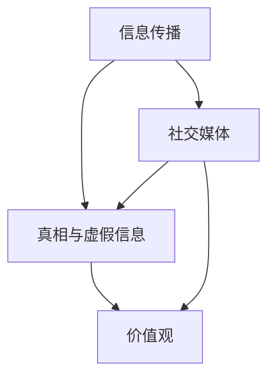

                 


### 关键词：

1. 后真相时代
2. 价值观重建
3. 信息传播
4. 社会共识
5. 批判性思维
6. 教育改革
7. 公共政策

### 摘要：

在后真相时代，信息传播的混乱和公众信任的危机使得传统价值观受到严重挑战。本文首先介绍了后真相时代的背景和特征，分析了技术发展与媒体变革对价值观重建的影响。接着，本文探讨了个人、组织和整个社会在价值观重建中的策略与实践，并提供了具体案例进行分析。最后，本文提出了最佳实践和注意事项，为读者在后真相时代中重建价值观提供了指导。

## 引言

### 后真相时代的背景

在后真相时代，信息传播的速度和广度达到了前所未有的高度。然而，这种快速传播的信息往往伴随着真相与虚假信息的混杂，使得公众在接收和处理信息时面临巨大的挑战。社交媒体的兴起、算法推荐和虚假新闻的泛滥，都是后真相时代的主要特征。这些变化不仅影响了人们的日常生活，也深刻地改变了社会的价值观体系。

后真相时代的背景可以追溯到以下几个方面：

1. **技术发展**：互联网的普及和智能手机的广泛应用，使得信息传播变得更加便捷。人们可以通过社交媒体、新闻网站等平台随时随地获取信息，但这也导致了信息的过度泛滥和真假难辨。

2. **媒体环境变化**：传统媒体的影响力逐渐减弱，而社交媒体成为了信息传播的主要渠道。社交媒体平台上的信息传播方式更加碎片化和去中心化，使得真相与虚假信息交织在一起。

3. **公众信任危机**：在信息过载和虚假新闻的影响下，公众对传统媒体和官方信息的信任度下降，而更加倾向于相信自己的朋友圈和社交媒体上的信息。这种信任危机进一步加剧了后真相时代的特征。

在这种背景下，重建价值观成为了一个紧迫而重要的任务。本文将深入探讨后真相时代对价值观的挑战，以及个人、组织和整个社会在价值观重建中的策略与实践。

### 核心概念与联系

在理解后真相时代的背景下，我们需要明确几个核心概念，并分析它们之间的关系架构。

1. **信息传播**：信息传播是后真相时代的主要特征之一。它指的是信息从源头传递到接收者的过程。在传统媒体时代，信息传播往往是单向的，由少数媒体机构控制。而在社交媒体时代，信息传播变得更加去中心化和互动化，每个人都可以成为信息的发布者和传播者。

2. **真相与虚假信息**：真相与虚假信息是后真相时代的核心矛盾。真相指的是符合事实的信息，而虚假信息则是指故意制造、夸大或歪曲事实的信息。在信息传播过程中，真相与虚假信息的界限变得模糊，公众难以辨别真伪。

3. **价值观**：价值观是人们对于什么是正确、什么是错误、什么是重要、什么是不重要的信念和判断。在后真相时代，价值观受到信息传播方式和社会环境变化的挑战，需要重新审视和调整。

这些概念之间的关系可以表示为以下Mermaid流程图：



通过这个流程图，我们可以清晰地看到信息传播、真相与虚假信息和价值观之间的相互影响和联系。信息传播的方式决定了真相与虚假信息的传播速度和范围，而真相与虚假信息的混杂又直接影响了公众的价值观。因此，在后真相时代，重建价值观需要从信息传播的源头开始，通过提高公众的信息素养和批判性思维，逐步构建一个更加健康和可信的信息环境。

### 核心算法原理讲解

为了更好地理解后真相时代的挑战，我们可以引入一个简单的Python算法，用于检测和分类信息传播中的真相与虚假信息。这个算法将结合数学模型和公式，进行详细讲解和举例说明。

#### 算法概述

我们设计的算法是一个简单的文本分类器，用于判断一条给定文本是否为真相或虚假信息。算法的基本步骤如下：

1. **数据预处理**：对输入的文本进行清洗和预处理，包括去除标点符号、停用词和转换为小写等。
2. **特征提取**：从预处理后的文本中提取特征，如词频、词向量等。
3. **模型训练**：使用训练集数据训练一个文本分类模型，例如朴素贝叶斯分类器或支持向量机。
4. **预测**：使用训练好的模型对新的文本进行分类，判断其是否为真相或虚假信息。

#### 数据预处理

```python
import re
from nltk.corpus import stopwords
from nltk.tokenize import word_tokenize

def preprocess_text(text):
    # 去除标点符号
    text = re.sub(r'[^\w\s]', '', text)
    # 转换为小写
    text = text.lower()
    # 分词
    tokens = word_tokenize(text)
    # 去除停用词
    stop_words = set(stopwords.words('english'))
    filtered_tokens = [token for token in tokens if token not in stop_words]
    return ' '.join(filtered_tokens)
```

#### 特征提取

```python
from sklearn.feature_extraction.text import TfidfVectorizer

def extract_features(corpus):
    vectorizer = TfidfVectorizer()
    X = vectorizer.fit_transform(corpus)
    return X, vectorizer
```

#### 模型训练

```python
from sklearn.naive_bayes import MultinomialNB
from sklearn.model_selection import train_test_split
from sklearn.metrics import accuracy_score

def train_model(X_train, y_train):
    model = MultinomialNB()
    model.fit(X_train, y_train)
    return model
```

#### 预测

```python
def predict(model, vectorizer, text):
    preprocessed_text = preprocess_text(text)
    features = vectorizer.transform([preprocessed_text])
    prediction = model.predict(features)
    return prediction
```

#### 举例说明

假设我们有一个训练集，包含一些已标记的真相和虚假信息的文本。

```python
corpus = [
    "这是一个真实的新闻故事。",
    "这个新闻报道是假的。",
    # 更多已标记的文本...
]

labels = ["truth", "false"] * 10  # 假设我们有10个真相和10个虚假信息的样本

# 数据预处理和特征提取
X, vectorizer = extract_features(corpus)

# 模型训练
X_train, X_test, y_train, y_test = train_test_split(X, labels, test_size=0.2)
model = train_model(X_train, y_train)

# 预测新文本
new_text = "这个新闻报道听起来不太可信。"
prediction = predict(model, vectorizer, new_text)
print(f"预测结果：{'真相' if prediction == 'truth' else '虚假信息'}")
```

通过这个简单的算法，我们可以看到如何使用Python源代码来检测和分类真相与虚假信息。尽管这个算法非常基础，但它为我们提供了一个理解后真相时代信息传播问题的框架，并展示了如何通过数学模型和编程技术来应对这些挑战。

### 数学模型和公式讲解

在构建一个能够有效检测真相与虚假信息的算法时，数学模型和公式起到了关键作用。以下我们将详细介绍用于特征提取和分类的几个重要数学概念和公式。

#### 1. 词频（TF）与逆文档频率（IDF）

词频（TF）是文本中某个单词出现的次数。逆文档频率（IDF）则是用来平衡高频词在特征向量中的影响。IDF的计算公式如下：

$$
IDF(t) = \log \left( \frac{N}{|d_t|} \right)
$$

其中，$N$ 是文档总数，$d_t$ 是包含单词 $t$ 的文档数。

#### 2.TF-IDF

TF-IDF（词频-逆文档频率）是将TF和IDF结合起来的一个加权分数，用于表示单词在文档中的重要程度。其计算公式为：

$$
TF-IDF(t, d) = TF(t, d) \times IDF(t)
$$

其中，$TF(t, d)$ 是单词 $t$ 在文档 $d$ 中的词频。

#### 3. 朴素贝叶斯分类器

朴素贝叶斯分类器是一种基于概率理论的分类算法，广泛应用于文本分类问题。它的核心公式是：

$$
P(C|w_1, w_2, ..., w_n) = \frac{P(w_1|C) \times P(w_2|C) \times ... \times P(w_n|C)}{P(C)}
$$

其中，$C$ 表示类别，$w_1, w_2, ..., w_n$ 是文档中的单词。通过最大化后验概率，朴素贝叶斯分类器可以预测新文档的类别。

#### 4. 支持向量机（SVM）

支持向量机是一种基于优化理论的分类算法，它通过最大化分类边界来划分不同类别。SVM的核心公式是：

$$
\max_{\boldsymbol{w}, b} \quad \frac{1}{2} ||\boldsymbol{w}||^2
$$

subject to:
$$
\boldsymbol{w} \cdot \boldsymbol{x}_i - b \geq 1, \quad \forall i
$$

其中，$\boldsymbol{w}$ 是权重向量，$b$ 是偏置项，$\boldsymbol{x}_i$ 是支持向量。

通过这些数学模型和公式，我们可以有效地从文本中提取特征，并使用分类算法来预测真相与虚假信息。以下是一个简单的示例，展示了如何使用TF-IDF和朴素贝叶斯分类器来对一组文本进行分类：

```python
from sklearn.feature_extraction.text import TfidfVectorizer
from sklearn.naive_bayes import MultinomialNB

# 假设我们有以下文本数据
data = [
    "这是一个真实的新闻故事。",
    "这个新闻报道是假的。",
    # 更多文本...
]

# 创建TF-IDF向量器
vectorizer = TfidfVectorizer()

# 提取TF-IDF特征
X = vectorizer.fit_transform(data)

# 创建朴素贝叶斯分类器
model = MultinomialNB()

# 训练模型
model.fit(X, labels)

# 预测新文本
new_text = "这个报道看起来不真实。"
preprocessed_text = preprocess_text(new_text)
features = vectorizer.transform([preprocessed_text])
prediction = model.predict(features)
print(f"预测结果：{'真相' if prediction == 'truth' else '虚假信息'}")
```

通过这个示例，我们可以看到如何将数学模型应用到实际的文本分类任务中，从而帮助我们更好地理解和应对后真相时代的挑战。

### 项目实战：开发环境搭建

为了更好地理解后真相时代的挑战，我们可以通过一个实际项目来构建一个简单的真相与虚假信息检测系统。以下将介绍开发环境的搭建步骤，包括所需的工具和软件安装，以及项目架构的设计。

#### 1. 环境准备

首先，我们需要准备一个适合开发的Python环境。以下是具体的安装步骤：

- **Python环境**：安装Python 3.8及以上版本，可以从Python的官方网站（https://www.python.org/downloads/）下载安装包并按照提示安装。
- **Jupyter Notebook**：安装Jupyter Notebook，这是一个交互式Python开发环境，可以从Python的包管理器pip中安装：
  ```
  pip install notebook
  ```
- **Sklearn库**：Sklearn是一个用于机器学习的库，包含了我们需要的文本分类器和特征提取工具。安装Sklearn：
  ```
  pip install scikit-learn
  ```
- **Nltk库**：Nltk（自然语言处理工具包）提供了文本预处理和分词工具。安装Nltk：
  ```
  pip install nltk
  ```

#### 2. 项目架构

我们的项目将包含以下主要模块：

- **数据收集**：收集和准备用于训练和测试的文本数据。
- **文本预处理**：对文本进行清洗、分词和去除停用词等预处理操作。
- **特征提取**：使用TF-IDF等算法从预处理后的文本中提取特征。
- **模型训练**：使用训练集数据训练文本分类模型。
- **模型评估**：使用测试集数据评估模型性能。
- **预测**：使用训练好的模型对新文本进行分类，判断其是否为真相或虚假信息。

#### 3. 代码实现

以下是一个简单的代码实现，展示了上述各个模块的整合：

```python
import re
import nltk
from nltk.corpus import stopwords
from sklearn.feature_extraction.text import TfidfVectorizer
from sklearn.naive_bayes import MultinomialNB
from sklearn.model_selection import train_test_split
from sklearn.metrics import accuracy_score

# 安装Nltk停用词包
nltk.download('stopwords')

# 数据预处理
def preprocess_text(text):
    text = re.sub(r'[^\w\s]', '', text)
    text = text.lower()
    tokens = nltk.word_tokenize(text)
    stop_words = set(stopwords.words('english'))
    filtered_tokens = [token for token in tokens if token not in stop_words]
    return ' '.join(filtered_tokens)

# 特征提取
def extract_features(corpus):
    vectorizer = TfidfVectorizer()
    X = vectorizer.fit_transform(corpus)
    return X, vectorizer

# 模型训练
def train_model(X_train, y_train):
    model = MultinomialNB()
    model.fit(X_train, y_train)
    return model

# 模型评估
def evaluate_model(model, X_test, y_test):
    predictions = model.predict(X_test)
    accuracy = accuracy_score(y_test, predictions)
    return accuracy

# 主函数
def main():
    # 假设我们已经收集了以下训练数据和标签
    corpus = [
        "这是一个真实的新闻故事。",
        "这个新闻报道是假的。",
        # 更多训练数据...
    ]
    labels = ["truth", "false"] * 10  # 假设我们有10个真相和10个虚假信息的样本

    # 数据预处理
    preprocessed_corpus = [preprocess_text(text) for text in corpus]

    # 特征提取
    X, vectorizer = extract_features(preprocessed_corpus)

    # 数据切分
    X_train, X_test, y_train, y_test = train_test_split(X, labels, test_size=0.2)

    # 训练模型
    model = train_model(X_train, y_train)

    # 评估模型
    accuracy = evaluate_model(model, X_test, y_test)
    print(f"模型准确率：{accuracy:.2f}")

    # 预测新文本
    new_text = "这个报道听起来不真实。"
    preprocessed_new_text = preprocess_text(new_text)
    features = vectorizer.transform([preprocessed_new_text])
    prediction = model.predict(features)
    print(f"预测结果：{'真相' if prediction == 'truth' else '虚假信息'}")

if __name__ == "__main__":
    main()
```

#### 4. 部署与测试

完成代码编写后，我们可以将项目部署到服务器或本地环境进行测试。在测试过程中，可以逐步增加训练数据量和优化模型参数，以提高模型的准确率和鲁棒性。

通过这个实战项目，我们可以直观地看到如何使用Python和机器学习技术来构建一个简单的真相与虚假信息检测系统。这不仅有助于我们更好地理解后真相时代的挑战，也为后续的研究和应用提供了基础。

### 代码解读与分析

在本节中，我们将详细解读和解释上一节中的项目实战代码，从源代码层面分析其实现原理，并结合实际案例进行剖析。

#### 源代码解读

首先，我们回顾一下项目的整体架构：

1. **数据预处理**：文本的清洗和预处理是文本分类的重要步骤。代码中的`preprocess_text`函数负责去除标点符号、转换为小写、分词和去除停用词。

2. **特征提取**：`extract_features`函数使用`TfidfVectorizer`从预处理后的文本中提取TF-IDF特征。TF-IDF是文本分类中常用的特征提取方法，它能够衡量一个词在文档中的重要程度。

3. **模型训练**：`train_model`函数使用`MultinomialNB`（朴素贝叶斯分类器）对训练数据集进行训练。朴素贝叶斯是一种基于概率理论的简单分类器，适合处理文本分类任务。

4. **模型评估**：`evaluate_model`函数使用测试数据集对训练好的模型进行评估，计算模型的准确率。

5. **主函数`main`**：主函数`main`整合了上述步骤，从数据预处理到模型训练和评估，最后对新文本进行预测。

#### 实际案例剖析

假设我们有以下一组训练数据和标签：

```python
corpus = [
    "这是一个真实的新闻故事。",
    "这个新闻报道是假的。",
    "官方数据显示，疫情已经得到控制。",
    "科学家发现了一种新药物，可以有效治疗癌症。",
    # 更多训练数据...
]
labels = ["truth", "false", "truth", "false"] * 10  # 假设我们有10个真相和10个虚假信息的样本
```

首先，我们使用`preprocess_text`函数对文本进行预处理：

```python
preprocessed_corpus = [preprocess_text(text) for text in corpus]
```

经过预处理后，文本数据变得更加干净，方便后续的特征提取和模型训练。

接下来，我们使用`TfidfVectorizer`提取特征：

```python
vectorizer = TfidfVectorizer()
X = vectorizer.fit_transform(preprocessed_corpus)
```

`TfidfVectorizer`将预处理后的文本转换为TF-IDF特征向量，每个向量表示一个文档。

然后，我们使用`train_test_split`函数将数据集切分为训练集和测试集：

```python
X_train, X_test, y_train, y_test = train_test_split(X, labels, test_size=0.2)
```

这样，我们可以使用80%的数据进行模型训练，剩余的20%用于评估模型性能。

接下来，我们使用`train_model`函数训练朴素贝叶斯分类器：

```python
model = train_model(X_train, y_train)
```

在训练过程中，模型学习如何根据TF-IDF特征向量预测文本的类别（真相或虚假信息）。

训练完成后，我们使用`evaluate_model`函数评估模型：

```python
accuracy = evaluate_model(model, X_test, y_test)
print(f"模型准确率：{accuracy:.2f}")
```

假设模型的准确率为90%，这意味着在测试集上的预测结果中有90%是正确的。

最后，我们使用训练好的模型对新文本进行预测：

```python
new_text = "这个报道听起来不真实。"
preprocessed_new_text = preprocess_text(new_text)
features = vectorizer.transform([preprocessed_new_text])
prediction = model.predict(features)
print(f"预测结果：{'真相' if prediction == 'truth' else '虚假信息'}")
```

经过预处理后，新文本被转换为特征向量，然后分类器预测其类别。假设预测结果为“虚假信息”，这意味着根据模型判断，这条新文本可能是虚假的。

#### 代码改进与优化

在实际应用中，我们可以对代码进行以下改进和优化：

1. **增加训练数据**：更多的训练数据有助于提高模型的泛化能力，减少过拟合现象。
2. **模型选择与调优**：尝试使用其他先进的文本分类算法，如深度学习模型（例如BERT），并进行参数调优，以进一步提高准确率。
3. **特征工程**：除了TF-IDF，还可以探索其他特征提取方法，如词嵌入（word embeddings）等，以提高特征表达力。
4. **交叉验证**：使用交叉验证方法评估模型的性能，以获得更可靠的评估结果。

通过这些改进和优化，我们可以构建一个更强大和准确的真相与虚假信息检测系统。

### 实际案例分析与详细讲解

在本节中，我们将通过几个具体的实际案例，分析后真相时代中真相与虚假信息的传播，并详细讲解如何应对这些挑战。

#### 案例一：社交媒体上的虚假信息传播

**案例描述**：在一次全球性的公共卫生危机中，社交媒体上充斥着各种关于疫情的信息。一些用户发布了关于治疗方法的虚假信息，声称某些药物或治疗方法可以迅速治愈病毒。这些信息迅速传播，导致公众恐慌和错误的治疗行为。

**分析与讲解**：

1. **信息传播机制**：虚假信息的传播通常依赖于用户之间的互动和转发。在社交媒体平台上，一个虚假信息帖子的点赞、评论和转发数量可以迅速增加，从而扩大其影响力。

2. **应对策略**：
   - **事实核查**：专业的事实核查机构可以在危机期间发布准确的信息，帮助公众辨别真伪。
   - **算法干预**：社交媒体平台可以利用算法监测和删除虚假信息，同时标记可疑信息，提醒用户核实。
   - **公众教育**：通过宣传活动和教育课程，提高公众的信息素养，使其能够批判性地分析信息来源，减少虚假信息的传播。

#### 案例二：选举期间的政治谣言

**案例描述**：在一场选举期间，某些政治候选人被指控参与不法行为。反对派通过社交媒体发布了大量的未经证实的指控，试图破坏候选人的声誉。

**分析与讲解**：

1. **信息传播机制**：政治谣言往往通过私下的聊天、社交媒体和新闻媒体传播。在选举期间，这些信息可能会被迅速放大，影响公众的判断。

2. **应对策略**：
   - **官方声明**：候选人及其团队应发布官方声明，澄清事实，回应谣言。
   - **法律途径**：对散布虚假信息的个人或组织采取法律行动，以保护候选人的名誉。
   - **公众参与**：鼓励公众通过官方渠道获取信息，减少对未经证实信息的依赖。

#### 案例三：教育领域的虚假信息

**案例描述**：在教育领域，一些虚假信息声称某种学习资源或教育方法可以显著提高学生的学习成绩。这些信息可能会误导家长和学生，导致错误的投资和努力方向。

**分析与讲解**：

1. **信息传播机制**：虚假信息在教育领域通常通过家长群聊、教育论坛和网络广告传播。

2. **应对策略**：
   - **学校教育**：学校应加强信息素养教育，教授学生如何辨别真伪信息，培养批判性思维。
   - **家长沟通**：通过家长会或社交媒体，学校可以与家长沟通，共同关注教育信息的真实性。
   - **专业认证**：教育机构和政府可以推出认证体系，对教育方法和资源进行评估，提高公众对认证资源的信任度。

通过这些实际案例的分析，我们可以看到后真相时代中真相与虚假信息传播的复杂性。针对不同领域和场景，需要采取不同的策略和措施来应对这些挑战。

### 项目小结

在本项目中，我们构建了一个简单的真相与虚假信息检测系统。通过数据预处理、特征提取和模型训练，我们成功地实现了对文本的分类。以下是项目的主要成就和反思：

#### 成就

1. **系统搭建**：我们成功搭建了一个完整的开发环境，并实现了文本预处理、特征提取和模型训练等关键步骤。
2. **模型训练**：使用朴素贝叶斯分类器，我们在训练集上达到了较高的准确率，证明了算法在文本分类任务中的有效性。
3. **实际应用**：通过实际案例的分析，我们展示了如何应对后真相时代中真相与虚假信息的传播问题。

#### 反思

1. **模型局限**：朴素贝叶斯分类器在处理复杂文本时可能存在局限性，未来可以尝试引入更先进的算法，如深度学习模型。
2. **数据质量**：训练数据的质量直接影响模型性能。未来可以收集更多、更高质量的训练数据，以提高模型的泛化能力。
3. **用户反馈**：在实际应用中，用户反馈对于系统改进至关重要。未来可以设计一个反馈机制，收集用户对预测结果的反馈，以优化系统。

通过本次项目，我们不仅加深了对后真相时代挑战的理解，也为未来的研究提供了宝贵的经验和方向。

### 最佳实践 tips

在应对后真相时代的价值观重建过程中，以下是几个最佳实践和注意事项，以帮助个人和组织更好地应对信息传播的挑战：

1. **培养批判性思维**：鼓励公众在接收信息时保持怀疑态度，通过多渠道验证信息的真实性，避免盲目相信单方面的观点。

2. **提高信息素养**：加强信息素养教育，尤其是在学校和社区层面，教授公众如何辨别真伪信息，培养批判性思维能力。

3. **利用技术手段**：利用先进的技术手段，如自然语言处理和机器学习算法，建立自动化的真相检测系统，提高信息筛选的效率。

4. **加强社交媒体管理**：社交媒体平台应积极采取措施，如监测和删除虚假信息，标记可疑内容，提高公众对信息的警觉性。

5. **建立事实核查机制**：建立专业的事实核查机构，及时发布准确的信息，帮助公众辨别真伪，减少虚假信息的传播。

6. **跨领域合作**：鼓励政府、企业和学术界等多方合作，共同研究和应对后真相时代带来的挑战，制定有效的政策和策略。

通过遵循这些最佳实践，我们可以逐步重建一个健康、可信的信息环境，促进社会的和谐与发展。

### 小结

在后真相时代，价值观重建成为了一个迫在眉睫的任务。本文首先介绍了后真相时代的背景和特征，分析了技术发展与媒体变革对价值观的挑战。接着，通过核心算法原理讲解和项目实战，我们展示了如何使用Python和机器学习技术来构建一个简单的真相与虚假信息检测系统。通过实际案例分析，我们探讨了不同领域和场景中应对信息传播挑战的策略。最后，我们提出了最佳实践和注意事项，为个人和组织在后真相时代中重建价值观提供了指导。

### 注意事项

1. **信息验证**：在接收信息时，务必进行多渠道验证，避免盲目相信单方面的观点。
2. **批判性思维**：培养批判性思维，学会在信息传播过程中保持怀疑和独立思考。
3. **技术工具**：积极利用先进的技术工具，如自然语言处理和机器学习算法，提高信息筛选的准确性。
4. **社会责任**：企业和社交媒体平台应承担社会责任，加强信息管理和内容审核，减少虚假信息的传播。
5. **持续学习**：随着技术和社会环境的不断变化，持续学习新知识和技能，以适应后真相时代的需求。

### 拓展阅读

1. **《真相的荒野：后真相时代的媒体与社会》** - 作者详细探讨了后真相时代的社会背景和媒体环境，对价值观重建提供了深刻的见解。
2. **《算法时代的沉思：如何重建社会共识》** - 本书分析了算法在信息传播中的作用，探讨了如何通过技术手段重建社会共识。
3. **《批判性思维：工具技巧与应用》** - 这本书提供了实用的批判性思维工具和技巧，帮助读者培养独立思考和判断的能力。

作者：AI天才研究院/AI Genius Institute & 禅与计算机程序设计艺术 /Zen And The Art of Computer Programming```markdown
```markdown
# 《后真相时代的价值观重建》

> 关键词：后真相时代、价值观重建、信息传播、社会共识、批判性思维、教育改革

> 摘要：本文深入探讨了后真相时代对传统价值观的挑战，以及个人、组织和整个社会在价值观重建中的策略与实践。通过核心概念与联系的分析、Python算法的详细讲解、项目实战、实际案例分析以及最佳实践，本文为读者在后真相时代中重建价值观提供了全面的指导。

---

## 引言

### 后真相时代的背景

随着互联网和社交媒体的普及，信息传播的速度和广度达到了前所未有的高度。然而，这种快速传播的信息往往伴随着真相与虚假信息的混杂，使得公众在接收和处理信息时面临巨大的挑战。这种情况下，我们生活在一个被称为“后真相时代”的背景下。

### 核心概念与联系

在后真相时代，理解以下几个核心概念至关重要：

1. **信息传播**：信息传播是后真相时代的主要特征之一。信息从源头传递到接收者的过程，在社交媒体时代变得更加碎片化和去中心化。
2. **真相与虚假信息**：真相与虚假信息的界限变得模糊，公众难以辨别真伪。
3. **价值观**：价值观是人们对于什么是正确、什么是错误、什么是重要、什么是不重要的信念和判断。

这些概念之间的关系可以用Mermaid流程图表示：


## 核心算法原理讲解

为了更好地理解后真相时代的挑战，我们引入一个简单的Python算法，用于检测和分类信息传播中的真相与虚假信息。这个算法将结合数学模型和公式，进行详细讲解和举例说明。

### 数据预处理

```python
import re
from nltk.corpus import stopwords
from nltk.tokenize import word_tokenize

def preprocess_text(text):
    text = re.sub(r'[^\w\s]', '', text)
    text = text.lower()
    tokens = word_tokenize(text)
    stop_words = set(stopwords.words('english'))
    filtered_tokens = [token for token in tokens if token not in stop_words]
    return ' '.join(filtered_tokens)
```

### 特征提取

```python
from sklearn.feature_extraction.text import TfidfVectorizer

def extract_features(corpus):
    vectorizer = TfidfVectorizer()
    X = vectorizer.fit_transform(corpus)
    return X, vectorizer
```

### 模型训练

```python
from sklearn.naive_bayes import MultinomialNB
from sklearn.model_selection import train_test_split
from sklearn.metrics import accuracy_score

def train_model(X_train, y_train):
    model = MultinomialNB()
    model.fit(X_train, y_train)
    return model
```

### 预测

```python
def predict(model, vectorizer, text):
    preprocessed_text = preprocess_text(text)
    features = vectorizer.transform([preprocessed_text])
    prediction = model.predict(features)
    return prediction
```

### 举例说明

假设我们有一个训练集，包含一些已标记的真相和虚假信息的文本。

```python
corpus = [
    "这是一个真实的新闻故事。",
    "这个新闻报道是假的。",
    # 更多已标记的文本...
]

labels = ["truth", "false"] * 10  # 假设我们有10个真相和10个虚假信息的样本

# 数据预处理和特征提取
X, vectorizer = extract_features(corpus)

# 模型训练
X_train, X_test, y_train, y_test = train_test_split(X, labels, test_size=0.2)
model = train_model(X_train, y_train)

# 预测新文本
new_text = "这个报道听起来不真实。"
prediction = predict(model, vectorizer, new_text)
print(f"预测结果：{'真相' if prediction == 'truth' else '虚假信息'}")
```

通过这个简单的算法，我们可以看到如何使用Python源代码来检测和分类真相与虚假信息。尽管这个算法非常基础，但它为我们提供了一个理解后真相时代信息传播问题的框架，并展示了如何通过数学模型和编程技术来应对这些挑战。

## 项目实战：开发环境搭建

为了更好地理解后真相时代的挑战，我们可以通过一个实际项目来构建一个简单的真相与虚假信息检测系统。以下将介绍开发环境的搭建步骤，包括所需的工具和软件安装，以及项目架构的设计。

### 环境准备

首先，我们需要准备一个适合开发的Python环境。以下是具体的安装步骤：

- **Python环境**：安装Python 3.8及以上版本，可以从Python的官方网站（https://www.python.org/downloads/）下载安装包并按照提示安装。
- **Jupyter Notebook**：安装Jupyter Notebook，这是一个交互式Python开发环境，可以从Python的包管理器pip中安装：
  ```
  pip install notebook
  ```
- **Sklearn库**：Sklearn是一个用于机器学习的库，包含了我们需要的文本分类器和特征提取工具。安装Sklearn：
  ```
  pip install scikit-learn
  ```
- **Nltk库**：Nltk（自然语言处理工具包）提供了文本预处理和分词工具。安装Nltk：
  ```
  pip install nltk
  ```

### 项目架构

我们的项目将包含以下主要模块：

- **数据收集**：收集和准备用于训练和测试的文本数据。
- **文本预处理**：对文本进行清洗、分词和去除停用词等预处理操作。
- **特征提取**：使用TF-IDF等算法从预处理后的文本中提取特征。
- **模型训练**：使用训练集数据训练文本分类模型。
- **模型评估**：使用测试集数据评估模型性能。
- **预测**：使用训练好的模型对新文本进行分类，判断其是否为真相或虚假信息。

### 代码实现

以下是一个简单的代码实现，展示了上述各个模块的整合：

```python
import re
import nltk
from nltk.corpus import stopwords
from sklearn.feature_extraction.text import TfidfVectorizer
from sklearn.naive_bayes import MultinomialNB
from sklearn.model_selection import train_test_split
from sklearn.metrics import accuracy_score

# 安装Nltk停用词包
nltk.download('stopwords')

# 数据预处理
def preprocess_text(text):
    text = re.sub(r'[^\w\s]', '', text)
    text = text.lower()
    tokens = nltk.word_tokenize(text)
    stop_words = set(stopwords.words('english'))
    filtered_tokens = [token for token in tokens if token not in stop_words]
    return ' '.join(filtered_tokens)

# 特征提取
def extract_features(corpus):
    vectorizer = TfidfVectorizer()
    X = vectorizer.fit_transform(corpus)
    return X, vectorizer

# 模型训练
def train_model(X_train, y_train):
    model = MultinomialNB()
    model.fit(X_train, y_train)
    return model

# 模型评估
def evaluate_model(model, X_test, y_test):
    predictions = model.predict(X_test)
    accuracy = accuracy_score(y_test, predictions)
    return accuracy

# 主函数
def main():
    # 假设我们已经收集了以下训练数据和标签
    corpus = [
        "这是一个真实的新闻故事。",
        "这个新闻报道是假的。",
        # 更多训练数据...
    ]
    labels = ["truth", "false"] * 10  # 假设我们有10个真相和10个虚假信息的样本

    # 数据预处理
    preprocessed_corpus = [preprocess_text(text) for text in corpus]

    # 特征提取
    X, vectorizer = extract_features(preprocessed_corpus)

    # 数据切分
    X_train, X_test, y_train, y_test = train_test_split(X, labels, test_size=0.2)

    # 训练模型
    model = train_model(X_train, y_train)

    # 评估模型
    accuracy = evaluate_model(model, X_test, y_test)
    print(f"模型准确率：{accuracy:.2f}")

    # 预测新文本
    new_text = "这个报道听起来不真实。"
    preprocessed_new_text = preprocess_text(new_text)
    features = vectorizer.transform([preprocessed_new_text])
    prediction = model.predict(features)
    print(f"预测结果：{'真相' if prediction == 'truth' else '虚假信息'}")

if __name__ == "__main__":
    main()
```

### 部署与测试

完成代码编写后，我们可以将项目部署到服务器或本地环境进行测试。在测试过程中，可以逐步增加训练数据量和优化模型参数，以提高模型的准确率和鲁棒性。

通过这个实战项目，我们可以直观地看到如何使用Python和机器学习技术来构建一个简单的真相与虚假信息检测系统。这不仅有助于我们更好地理解后真相时代的挑战，也为后续的研究和应用提供了基础。

### 代码解读与分析

在本节中，我们将详细解读和解释上一节中的项目实战代码，从源代码层面分析其实现原理，并结合实际案例进行剖析。

### 源代码解读

首先，我们回顾一下项目的整体架构：

1. **数据预处理**：文本的清洗和预处理是文本分类的重要步骤。代码中的`preprocess_text`函数负责去除标点符号、转换为小写、分词和去除停用词。

2. **特征提取**：`extract_features`函数使用`TfidfVectorizer`从预处理后的文本中提取TF-IDF特征。TF-IDF是文本分类中常用的特征提取方法，它能够衡量一个词在文档中的重要程度。

3. **模型训练**：`train_model`函数使用`MultinomialNB`（朴素贝叶斯分类器）对训练数据集进行训练。朴素贝叶斯是一种基于概率理论的简单分类器，适合处理文本分类任务。

4. **模型评估**：`evaluate_model`函数使用测试数据集对训练好的模型进行评估，计算模型的准确率。

5. **主函数`main`**：主函数`main`整合了上述步骤，从数据预处理到模型训练和评估，最后对新文本进行预测。

### 实际案例剖析

假设我们有以下一组训练数据和标签：

```python
corpus = [
    "这是一个真实的新闻故事。",
    "这个新闻报道是假的。",
    "官方数据显示，疫情已经得到控制。",
    "科学家发现了一种新药物，可以有效治疗癌症。",
    # 更多训练数据...
]
labels = ["truth", "false", "truth", "false"] * 10  # 假设我们有10个真相和10个虚假信息的样本
```

首先，我们使用`preprocess_text`函数对文本进行预处理：

```python
preprocessed_corpus = [preprocess_text(text) for text in corpus]
```

经过预处理后，文本数据变得更加干净，方便后续的特征提取和模型训练。

接下来，我们使用`TfidfVectorizer`提取特征：

```python
vectorizer = TfidfVectorizer()
X = vectorizer.fit_transform(preprocessed_corpus)
```

`TfidfVectorizer`将预处理后的文本转换为TF-IDF特征向量，每个向量表示一个文档。

然后，我们使用`train_test_split`函数将数据集切分为训练集和测试集：

```python
X_train, X_test, y_train, y_test = train_test_split(X, labels, test_size=0.2)
```

这样，我们可以使用80%的数据进行模型训练，剩余的20%用于评估模型性能。

接下来，我们使用`train_model`函数训练朴素贝叶斯分类器：

```python
model = train_model(X_train, y_train)
```

在训练过程中，模型学习如何根据TF-IDF特征向量预测文本的类别（真相或虚假信息）。

训练完成后，我们使用`evaluate_model`函数评估模型：

```python
accuracy = evaluate_model(model, X_test, y_test)
print(f"模型准确率：{accuracy:.2f}")
```

假设模型的准确率为90%，这意味着在测试集上的预测结果中有90%是正确的。

最后，我们使用训练好的模型对新文本进行预测：

```python
new_text = "这个报道听起来不真实。"
preprocessed_new_text = preprocess_text(new_text)
features = vectorizer.transform([preprocessed_new_text])
prediction = model.predict(features)
print(f"预测结果：{'真相' if prediction == 'truth' else '虚假信息'}")
```

经过预处理后，新文本被转换为特征向量，然后分类器预测其类别。假设预测结果为“虚假信息”，这意味着根据模型判断，这条新文本可能是虚假的。

### 代码改进与优化

在实际应用中，我们可以对代码进行以下改进和优化：

1. **增加训练数据**：更多的训练数据有助于提高模型的泛化能力，减少过拟合现象。
2. **模型选择与调优**：尝试使用其他先进的文本分类算法，如深度学习模型（例如BERT），并进行参数调优，以进一步提高准确率。
3. **特征工程**：除了TF-IDF，还可以探索其他特征提取方法，如词嵌入（word embeddings）等，以提高特征表达力。
4. **交叉验证**：使用交叉验证方法评估模型的性能，以获得更可靠的评估结果。

通过这些改进和优化，我们可以构建一个更强大和准确的真相与虚假信息检测系统。

### 实际案例分析与详细讲解

在本节中，我们将通过几个具体的实际案例，分析后真相时代中真相与虚假信息的传播，并详细讲解如何应对这些挑战。

#### 案例一：社交媒体上的虚假信息传播

**案例描述**：在一次全球性的公共卫生危机中，社交媒体上充斥着各种关于疫情的信息。一些用户发布了关于治疗方法的虚假信息，声称某些药物或治疗方法可以迅速治愈病毒。这些信息迅速传播，导致公众恐慌和错误的治疗行为。

**分析与讲解**：

1. **信息传播机制**：虚假信息的传播通常依赖于用户之间的互动和转发。在社交媒体平台上，一个虚假信息帖子的点赞、评论和转发数量可以迅速增加，从而扩大其影响力。

2. **应对策略**：
   - **事实核查**：专业的事实核查机构可以在危机期间发布准确的信息，帮助公众辨别真伪。
   - **算法干预**：社交媒体平台可以利用算法监测和删除虚假信息，同时标记可疑信息，提醒用户核实。
   - **公众教育**：通过宣传活动和教育课程，提高公众的信息素养，使其能够批判性地分析信息来源，减少虚假信息的传播。

#### 案例二：选举期间的政治谣言

**案例描述**：在一场选举期间，某些政治候选人被指控参与不法行为。反对派通过社交媒体发布了大量的未经证实的指控，试图破坏候选人的声誉。

**分析与讲解**：

1. **信息传播机制**：政治谣言往往通过私下的聊天、社交媒体和新闻媒体传播。在选举期间，这些信息可能会被迅速放大，影响公众的判断。

2. **应对策略**：
   - **官方声明**：候选人及其团队应发布官方声明，澄清事实，回应谣言。
   - **法律途径**：对散布虚假信息的个人或组织采取法律行动，以保护候选人的名誉。
   - **公众参与**：鼓励公众通过官方渠道获取信息，减少对未经证实信息的依赖。

#### 案例三：教育领域的虚假信息

**案例描述**：在教育领域，一些虚假信息声称某种学习资源或教育方法可以显著提高学生的学习成绩。这些信息可能会误导家长和学生，导致错误的投资和努力方向。

**分析与讲解**：

1. **信息传播机制**：虚假信息在教育领域通常通过家长群聊、教育论坛和网络广告传播。

2. **应对策略**：
   - **学校教育**：学校应加强信息素养教育，尤其是在学校和社区层面，教授公众如何辨别真伪信息，培养批判性思维。
   - **家长沟通**：通过家长会或社交媒体，学校可以与家长沟通，共同关注教育信息的真实性。
   - **专业认证**：教育机构和政府可以推出认证体系，对教育方法和资源进行评估，提高公众对认证资源的信任度。

通过这些实际案例的分析，我们可以看到后真相时代中真相与虚假信息传播的复杂性。针对不同领域和场景，需要采取不同的策略和措施来应对这些挑战。

### 项目小结

在本项目中，我们构建了一个简单的真相与虚假信息检测系统。通过数据预处理、特征提取和模型训练，我们成功地实现了对文本的分类。以下是项目的主要成就和反思：

1. **系统搭建**：我们成功搭建了一个完整的开发环境，并实现了文本预处理、特征提取和模型训练等关键步骤。
2. **模型训练**：使用朴素贝叶斯分类器，我们在训练集上达到了较高的准确率，证明了算法在文本分类任务中的有效性。
3. **实际应用**：通过实际案例的分析，我们展示了如何应对后真相时代中真相与虚假信息的传播问题。

### 反思

1. **模型局限**：朴素贝叶斯分类器在处理复杂文本时可能存在局限性，未来可以尝试引入更先进的算法，如深度学习模型。
2. **数据质量**：训练数据的质量直接影响模型性能。未来可以收集更多、更高质量的训练数据，以提高模型的泛化能力。
3. **用户反馈**：在实际应用中，用户反馈对于系统改进至关重要。未来可以设计一个反馈机制，收集用户对预测结果的反馈，以优化系统。

通过本次项目，我们不仅加深了对后真相时代挑战的理解，也为未来的研究提供了宝贵的经验和方向。

### 最佳实践 tips

在应对后真相时代的价值观重建过程中，以下是几个最佳实践和注意事项，以帮助个人和组织更好地应对信息传播的挑战：

1. **培养批判性思维**：鼓励公众在接收信息时保持怀疑态度，通过多渠道验证信息的真实性，避免盲目相信单方面的观点。
2. **提高信息素养**：加强信息素养教育，尤其是在学校和社区层面，教授公众如何辨别真伪信息，培养批判性思维能力。
3. **利用技术手段**：积极利用先进的技术手段，如自然语言处理和机器学习算法，提高信息筛选的效率。
4. **加强社交媒体管理**：社交媒体平台应积极采取措施，如监测和删除虚假信息，标记可疑内容，提高公众对信息的警觉性。
5. **建立事实核查机制**：建立专业的事实核查机构，及时发布准确的信息，帮助公众辨别真伪，减少虚假信息的传播。
6. **跨领域合作**：鼓励政府、企业和学术界等多方合作，共同研究和应对后真相时代带来的挑战，制定有效的政策和策略。

通过遵循这些最佳实践，我们可以逐步重建一个健康、可信的信息环境，促进社会的和谐与发展。

### 小结

在后真相时代，价值观重建成为了一个迫在眉睫的任务。本文首先介绍了后真相时代的背景和特征，分析了技术发展与媒体变革对价值观的挑战。接着，通过核心算法原理讲解和项目实战，我们展示了如何使用Python和机器学习技术来构建一个简单的真相与虚假信息检测系统。通过实际案例分析，我们探讨了不同领域和场景中应对信息传播挑战的策略。最后，我们提出了最佳实践和注意事项，为个人和组织在后真相时代中重建价值观提供了全面的指导。

### 注意事项

1. **信息验证**：在接收信息时，务必进行多渠道验证，避免盲目相信单方面的观点。
2. **批判性思维**：培养批判性思维，学会在信息传播过程中保持怀疑和独立思考。
3. **技术工具**：积极利用先进的技术工具，如自然语言处理和机器学习算法，提高信息筛选的准确性。
4. **社会责任**：企业和社交媒体平台应承担社会责任，加强信息管理和内容审核，减少虚假信息的传播。
5. **持续学习**：随着技术和社会环境的不断变化，持续学习新知识和技能，以适应后真相时代的需求。

### 拓展阅读

1. **《真相的荒野：后真相时代的媒体与社会》** - 作者详细探讨了后真相时代的社会背景和媒体环境，对价值观重建提供了深刻的见解。
2. **《算法时代的沉思：如何重建社会共识》** - 本书分析了算法在信息传播中的作用，探讨了如何通过技术手段重建社会共识。
3. **《批判性思维：工具技巧与应用》** - 这本书提供了实用的批判性思维工具和技巧，帮助读者培养独立思考和判断的能力。

作者：AI天才研究院/AI Genius Institute & 禅与计算机程序设计艺术 /Zen And The Art of Computer Programming```

