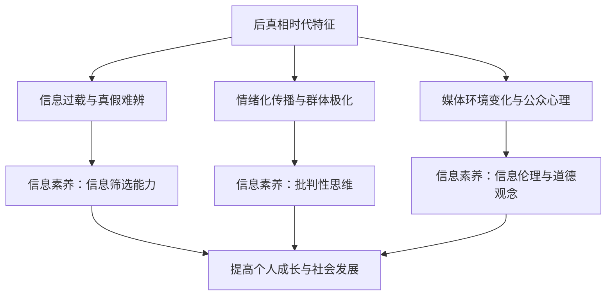
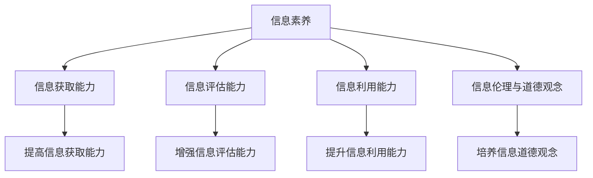
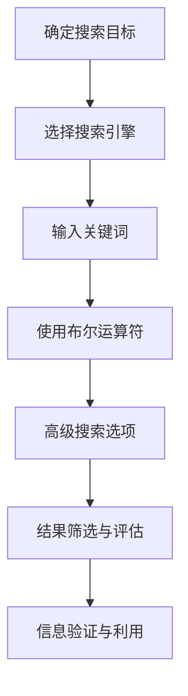
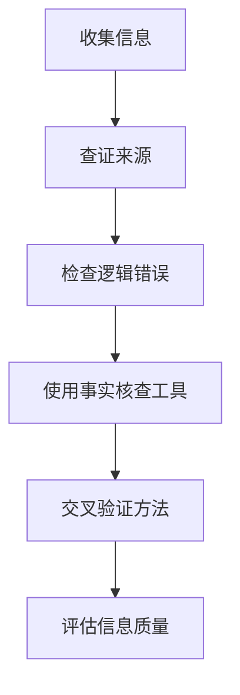
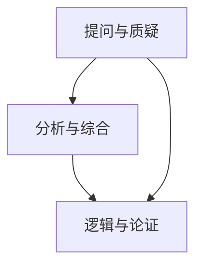

                 

# 后真相时代的信息素养：培养批判性思维的重要性

> 关键词：后真相时代，信息素养，批判性思维，信息筛选，信息评估，信息利用，信息伦理

> 摘要：本文探讨了后真相时代背景下，培养批判性思维在提升信息素养中的重要性。通过分析信息素养的定义、培养目标和实践方法，以及批判性思维的基本原则和培养方法，阐述了在后真相时代，如何通过培养批判性思维来提升信息素养，从而更好地应对信息过载、真假难辨等挑战。

## 引言

### 后真相时代的特征

后真相时代，这一概念起源于政治学领域，用以描述一个现象：在信息传播中，情绪和偏见往往比事实本身更能影响公众的看法和决策。在后真相时代，以下特征尤为明显：

1. **信息过载与真假难辨**：随着互联网和社交媒体的发展，信息传播速度极快，数量庞大。然而，大量未经证实的信息和假新闻充斥其中，使得公众难以分辨真假。

2. **情绪化传播与群体极化**：在社交媒体平台上，用户往往被情绪化的内容所吸引，容易受到情绪感染，导致观点的极端化，形成群体极化现象。

3. **媒体环境变化与公众心理**：传统媒体的权威性受到挑战，自媒体和社交媒体成为信息传播的主要渠道。公众在信息接收过程中，更注重情感共鸣而非事实真相。

### 信息素养的重要性

面对后真相时代的种种挑战，信息素养的重要性愈发凸显。信息素养是指个体在信息社会中获取、评估、利用和传播信息的能力。它包括以下四个方面：

1. **提高信息筛选能力**：在信息过载的环境中，能够有效筛选出有价值的信息。

2. **增强批判性思维能力**：对信息进行理性分析和判断，不被情绪和偏见所左右。

3. **促进个人成长与社会发展**：通过合理利用信息，提升个人知识和技能，为社会贡献智慧。

本文旨在探讨如何通过培养批判性思维来提升信息素养，帮助读者在后真相时代更好地应对信息挑战。

## 第1章 信息素养概述

### 1.1 信息素养的定义与内涵

信息素养是指个体在信息社会中有效获取、评估、利用和传播信息的能力。它不仅涉及技术层面的信息获取和利用，还包括对信息伦理、信息道德等方面的认识。

信息素养的内涵主要包括以下四个方面：

1. **信息获取能力**：能够通过各种渠道获取所需的信息，包括网络搜索、图书馆资源、专业社群等。

2. **信息评估能力**：对获取的信息进行真伪鉴别、质量评估和可信度分析，判断信息的可靠性和价值。

3. **信息利用能力**：将获取的信息应用于实际生活和工作中，解决实际问题，提升个人和团队的能力。

4. **信息伦理与道德观念**：在信息获取、利用和传播过程中，遵守法律法规和道德规范，尊重他人的隐私和知识产权。

### 1.2 信息素养的培养目标

培养信息素养的目标是全面提升个体的信息能力和信息素养水平，具体包括：

1. **提高信息获取能力**：通过培训和实践，使个体能够熟练运用各种信息获取工具和方法，高效地获取所需信息。

2. **增强信息评估能力**：培养个体对信息的理性判断能力，学会使用信息验证技巧和评估标准，提高信息筛选的准确性。

3. **提升信息利用能力**：通过知识和技能的传授，使个体能够将信息应用于实际工作和生活中，解决实际问题，提升工作效率。

4. **培养信息道德观念**：强化个体的信息伦理意识，使其在信息获取、利用和传播过程中，遵循道德规范，尊重他人的隐私和知识产权。

### 1.3 信息素养与批判性思维的关系

信息素养与批判性思维密切相关。批判性思维是指个体在信息接收和处理过程中，运用逻辑和理性进行深入分析和判断的能力。它包括以下方面：

1. **提问与质疑**：对信息来源、信息内容、信息背景等方面提出问题，进行质疑。

2. **分析与综合**：对信息进行深入分析，理解信息的本质和内在联系，同时进行综合思考，形成自己的观点。

3. **逻辑与论证**：运用逻辑原则和论证方法，对信息进行合理推理和判断。

信息素养为批判性思维提供了信息基础，使个体能够获取和处理大量的信息；而批判性思维则提升了信息素养的质量，使个体能够更加理性地分析和判断信息，从而提高信息素养的实际效果。通过培养批判性思维，个体能够更好地应对后真相时代的挑战，提升自身的信息素养水平。

## 第2章 提高信息获取能力

### 2.1 网络信息搜索技巧

在当今的信息时代，网络信息搜索技巧显得尤为重要。以下是一些关键步骤和策略，帮助您在搜索信息时更加高效和准确：

1. **搜索引擎使用**

   搜索引擎是获取网络信息的主要工具，合理使用搜索引擎能够大幅提升搜索效果。以下是一些使用搜索引擎的技巧：

   - **关键词选择**：选择合适的关键词是成功搜索的关键。关键词应尽量准确、具体，避免使用模糊或泛泛的词汇。
   - **布尔运算符**：使用布尔运算符（AND、OR、NOT）可以缩小或扩大搜索范围。例如，使用 "AI AND machine learning" 可以找到同时包含这两个关键词的结果。
   - **高级搜索**：大部分搜索引擎都提供高级搜索选项，允许用户通过特定的条件来筛选结果。例如，指定搜索结果的时间范围、文件类型等。

2. **关键词策略**

   关键词策略是优化搜索结果的重要手段。以下是一些关键词策略：

   - **使用同义词和近义词**：不同的人可能使用不同的词汇来表达相同的概念，使用同义词和近义词可以扩大搜索范围。
   - **使用专业术语**：在特定领域内，专业术语通常更准确，使用专业术语可以获取更专业的信息。
   - **组合关键词**：组合多个关键词可以缩小搜索范围，提高搜索的准确性。

3. **信息源选择**

   选择高质量的信息源是确保搜索结果准确性和可靠性的关键。以下是一些选择信息源的标准：

   - **权威性**：选择来自权威机构或专业组织的网站和出版物，这些信息通常更为可靠。
   - **更新频率**：优先选择更新频率高的信息源，这些信息通常更能反映最新的研究动态和趋势。
   - **用户评价**：查看其他用户对信息源的评论和评分，有助于判断信息源的质量。

### 2.2 图书馆资源利用

图书馆是获取学术信息的重要场所，以下是一些利用图书馆资源的技巧：

1. **图书馆的基本知识**

   - **图书馆分类法**：熟悉图书馆的分类法，有助于快速定位所需书籍或资料。
   - **图书馆目录系统**：使用图书馆的目录系统进行检索，可以找到图书馆内的书籍、期刊、论文等资源。

2. **数字图书馆的使用**

   数字图书馆提供了丰富的电子资源，包括电子书、电子期刊、学术论文等。以下是一些使用数字图书馆的技巧：

   - **检索技巧**：使用关键词进行检索，同时利用布尔运算符和高级搜索选项来筛选结果。
   - **文献传递服务**：如果图书馆没有所需资源，可以通过文献传递服务请求其他图书馆的借阅或复印。

3. **纸质图书的检索**

   - **浏览目录**：通过浏览目录找到感兴趣的章节或主题。
   - **书签和笔记**：使用书签和笔记记录重要的信息，便于后续查阅。

### 2.3 信息获取的其他渠道

除了网络搜索和图书馆资源，还有许多其他渠道可以用来获取信息：

1. **学术会议与研讨会**

   学术会议和研讨会是获取最新研究动态和交流学术观点的重要平台。以下是一些利用学术会议与研讨会的技巧：

   - **提前准备**：了解会议的主题和议程，准备相关的问题和话题，以便在会议上进行交流。
   - **参会记录**：记录会议内容和重要观点，便于后续总结和反思。

2. **专业社群与论坛**

   专业社群和论坛是行业内部交流和分享知识的场所。以下是一些利用专业社群与论坛的技巧：

   - **积极参与**：积极参与讨论，分享自己的见解和经验，提升自己的专业水平。
   - **关注专家**：关注行业内的专家和意见领袖，学习他们的观点和研究成果。

3. **信息服务与咨询**

   信息服务和咨询机构提供专业的信息查询和咨询服务，以下是一些利用信息服务与咨询的技巧：

   - **明确需求**：在咨询前明确自己的需求，有助于咨询人员提供更有针对性的服务。
   - **保持联系**：与信息服务和咨询机构保持联系，及时获取最新的信息和资源。

通过以上各种信息获取渠道的综合运用，可以更加全面和深入地获取所需信息，从而提高信息获取能力。

## 第3章 增强信息评估能力

### 3.1 信息真伪鉴别

在信息爆炸的时代，信息真伪鉴别显得尤为重要。以下是一些鉴别信息真伪的技巧和方法：

1. **信息验证技巧**

   - **交叉验证**：通过多个来源核对信息，验证其真实性。如果多个可信来源都报道了同一信息，那么其可靠性较高。
   - **查证来源**：对信息来源进行详细调查，了解其背景和权威性。权威机构、知名学者或专家发布的信息通常更为可靠。
   - **参考历史记录**：查看信息发布者或来源的历史记录，了解其过往发布的信息是否可靠。

2. **假信息识别**

   - **检查逻辑错误**：假信息往往存在逻辑上的错误或不合常理的地方。通过仔细阅读和分析，可以发现其中的矛盾和不合理之处。
   - **注意图片和视频的修改**：利用图片和视频编辑软件，可以轻松地修改图片和视频。因此，对于图片和视频信息，应特别注意其真实性和完整性。
   - **使用事实核查工具**：有许多事实核查工具可以帮助识别假信息，例如[Politifact](https://www.politifact.com/)、[FactCheck.org](https://www.factcheck.org/)等。

3. **交叉验证方法**

   - **多渠道比对**：从多个渠道获取同一信息，通过比对分析，验证其一致性。如果多个渠道的信息相互矛盾，那么该信息可能不可靠。
   - **参考权威来源**：优先考虑权威机构和专家的观点。他们的信息通常更为准确和可靠。
   - **使用事实核查网站**：事实核查网站可以帮助验证信息的真实性，例如[Snopes](https://www.snopes.com/)、[FactCheck.org](https://www.factcheck.org/)等。

通过以上方法，可以有效识别和鉴别信息真伪，确保获取的信息具有较高的可信度。然而，需要注意的是，即使使用了以上方法，也不能完全保证信息的绝对真实性。因此，在处理信息时，仍需保持一定的怀疑和理性，多角度分析和验证。

### 3.2 信息质量评估

信息质量评估是信息素养中至关重要的一环，它涉及到对获取的信息进行多维度、多层次的评估和判断。以下是一些评估信息质量的方法：

1. **信息评价标准**

   - **准确性**：信息的准确性是评价其质量的首要标准。准确的信息应当是基于事实和可靠数据的，而非虚构或误导性信息。
   - **可靠性**：信息来源的可靠性直接影响其质量。权威机构、知名学者或专家发布的信息通常具有较高的可靠性。
   - **时效性**：信息的时效性也很重要，尤其是在快速变化的信息环境中，最新的信息通常更具参考价值。
   - **完整性**：信息的完整性要求其涵盖了相关主题的所有重要方面，没有遗漏关键信息。

2. **信息可信度分析**

   - **来源分析**：对信息来源进行深入调查，了解其背景、资质和信誉。通常，来自权威机构或知名学者的信息更可信。
   - **内容分析**：对信息内容进行详细阅读和分析，检查其逻辑性、一致性、合理性和完整性。逻辑清晰、论据充分、数据可靠的信息通常更为可信。
   - **引用与引用分析**：查看信息中引用的其他来源，分析这些引用的质量和相关性。引用高质量、权威的研究和报告可以增强信息的可信度。

3. **评价指标体系**

   - **综合评分法**：可以对信息进行多维度评价，为每个评价标准赋予不同的权重，然后计算总分，以综合评分作为信息质量评估的依据。
   - **评分表法**：使用评分表对信息进行逐项打分，每个项目都有明确的评分标准和分值，通过累积分值来确定信息质量等级。
   - **权重分析法**：根据不同评价标准的重要性，为其分配不同的权重，然后加权计算总分，以得出信息质量评估结果。

通过以上方法，可以对获取的信息进行全面的评估和判断，从而筛选出高质量的信息。需要注意的是，评估信息质量是一个复杂的过程，需要综合考虑多个因素，保持理性和客观，避免主观偏见和情绪的影响。

### 3.3 信息伦理与隐私保护

在信息获取、处理和传播的过程中，信息伦理和隐私保护是至关重要的。以下是一些关于信息伦理和隐私保护的基本原则和实际措施：

1. **信息伦理原则**

   - **尊重他人隐私**：在获取和处理信息时，应尊重他人的隐私权，不得未经授权获取、使用或泄露他人的个人信息。
   - **遵守法律法规**：遵循相关法律法规，不得非法获取、使用或传播信息。尤其是在涉及敏感信息和隐私信息时，必须严格遵守法律法规。
   - **诚信原则**：在信息传播中，应保持诚信，不得发布虚假信息、误导性信息或恶意攻击他人。
   - **公正原则**：在信息处理和传播过程中，应保持公正，避免偏见和歧视，公正对待所有信息。

2. **个人隐私保护**

   - **使用强密码**：保护个人账号的安全，使用复杂的强密码，并定期更换。
   - **谨慎分享个人信息**：在社交媒体和其他公共场合，谨慎分享个人敏感信息，如家庭住址、电话号码、身份证号等。
   - **注意网络安全**：在公共网络环境中，如咖啡馆、机场等，避免使用公共Wi-Fi传输敏感信息，以防信息被截获。
   - **使用安全软件**：安装和使用杀毒软件、防火墙等安全软件，保护计算机和移动设备的安全。

3. **信息安全防范**

   - **数据加密**：对敏感信息进行加密处理，防止未授权访问和泄露。
   - **备份和恢复**：定期备份重要数据，确保数据在意外情况下可以恢复。
   - **访问控制**：设置适当的访问权限，限制对敏感信息的访问，确保只有授权人员才能访问和处理。
   - **安全培训**：加强员工的安全意识培训，提高对信息安全和隐私保护的认识，预防信息泄露和网络安全事件。

通过遵循信息伦理原则和采取隐私保护措施，可以有效地保护个人隐私，维护信息安全和伦理秩序。同时，这也是提升信息素养的重要一环，有助于个体更好地应对后真相时代的挑战。

## 第4章 提升信息利用能力

### 4.1 信息整合与整理

在信息过载的时代，有效整合和整理信息显得尤为重要。以下是一些信息整合与整理的方法和技巧：

1. **信息整理工具**

   - **笔记应用**：如Evernote、OneNote和Notion等，可以帮助用户收集、整理和存储信息。这些应用通常具备标签、分类、搜索等功能，方便用户高效管理信息。
   - **文档管理软件**：如Microsoft Office套件中的Word、Excel和PowerPoint，以及Google文档等，可以帮助用户创建、编辑和整理文档，确保信息结构清晰。
   - **云存储服务**：如Google Drive、Dropbox和OneDrive等，提供安全便捷的云端存储，用户可以随时随地访问和管理信息。

2. **信息可视化**

   - **图表和图形**：使用图表、图形和图示来展示信息，可以使复杂的信息更加直观、易于理解。常见工具包括Excel、Tableau和Power BI等。
   - **思维导图**：如MindManager、XMind和FreeMind等，通过创建思维导图，可以梳理和展示信息之间的关联和层次结构。
   - **信息地图**：使用信息地图可以直观地展示地理位置、时间和事件等信息，如Google地图和TimelineJS等工具。

3. **知识管理**

   - **知识库建设**：通过构建企业内部知识库，系统性地整理和存储企业的知识资产，方便员工查阅和使用。
   - **知识共享平台**：如Confluence、SharePoint和Teambition等，提供协作和知识共享功能，促进团队间的信息交流与合作。
   - **专家系统**：利用人工智能技术构建专家系统，通过模拟专家的思维过程，为用户提供专业知识和决策支持。

### 4.2 信息传播与分享

在信息传播和分享过程中，选择合适的渠道和技巧可以有效地扩大信息的影响力和传播范围。以下是一些信息传播和分享的方法：

1. **信息传播途径**

   - **社交媒体**：如微信、微博、Twitter和Facebook等，是信息传播的主要渠道。通过这些平台，用户可以迅速分享和传播信息，实现广泛的覆盖。
   - **电子邮件**：通过电子邮件，可以将信息发送给特定的人群，适用于正式和私人的沟通。
   - **网站和博客**：建立个人或企业的网站和博客，发布专业的文章和资讯，可以吸引目标用户，提高品牌知名度。
   - **线上会议和直播**：通过Zoom、Microsoft Teams和WebEx等工具，可以组织线上会议和直播，实现实时互动和大规模传播。

2. **信息分享技巧**

   - **简洁明了**：在分享信息时，尽量使用简洁明了的语言，避免冗长和复杂的表述，确保信息容易被理解和接受。
   - **引人入胜**：通过生动的标题、引人入胜的导语和有趣的内容，吸引读者的注意力，提高信息传播的吸引力。
   - **多渠道推广**：综合利用多种传播渠道，如社交媒体、邮件列表和合作伙伴等，扩大信息传播的范围。
   - **互动与反馈**：鼓励用户参与互动，如提问、评论和分享，增加用户的参与感和互动性，提高信息的传播效果。

3. **社交媒体的运用**

   - **内容策略**：制定合适的内容策略，根据目标受众的特点和需求，制定有针对性的内容计划。
   - **社交媒体营销**：利用社交媒体的广告投放功能，精准定位目标受众，提高信息的曝光率。
   - **社群运营**：积极参与和运营社群，建立良好的社群关系，提高用户粘性，促进信息的传播和分享。
   - **数据分析**：通过分析社交媒体的数据，了解用户行为和反馈，优化信息传播策略，提高传播效果。

通过有效整合和整理信息，并选择合适的传播和分享渠道，可以最大限度地发挥信息的价值，实现信息的有效传播和共享，从而提升信息利用能力。

### 4.3 信息创作与表达

在信息时代，信息创作与表达的能力愈发重要。这不仅涉及文字、图表等形式的内容创作，还涉及到创新思维的培养。以下是一些信息创作与表达的方法和技巧：

1. **信息创作方法**

   - **主题选择**：选择具有针对性、实用性和创新性的主题，确保信息能够引起读者的兴趣和关注。
   - **内容构思**：在创作前进行详细的构思，明确信息的目的、受众和核心观点，确保内容结构合理、条理清晰。
   - **文字表达**：使用简洁、明确、有感染力的语言，确保信息容易被理解和接受。同时，注意语言的逻辑性和连贯性。
   - **图表与可视化**：运用图表、图示和图片等可视化元素，使信息更加直观、生动，提高信息传达的效率。

2. **信息表达技巧**

   - **故事叙述**：通过故事化的表达方式，将信息融入有趣的故事中，增加信息的吸引力和记忆度。
   - **情感共鸣**：在表达过程中，注重引发读者的情感共鸣，使其能够感同身受，从而更好地理解和接受信息。
   - **互动性**：通过提问、讨论和反馈等方式，增加信息的互动性，促进读者与信息之间的互动，提高信息的传播效果。
   - **多媒体应用**：结合视频、音频、动画等多种媒体形式，丰富信息表达的形式和内容，提高信息的趣味性和吸引力。

3. **创新思维培养**

   - **跨学科学习**：通过跨学科的学习和研究，拓宽思维视野，激发创新思维。
   - **头脑风暴**：运用头脑风暴方法，集思广益，产生新的想法和创意。
   - **思维导图**：通过思维导图，梳理和呈现思路，有助于创新思维的培养。
   - **实践探索**：通过实践探索，将创新思维应用于实际问题中，不断试错和改进，提高创新能力。

通过有效的信息创作与表达，可以更好地传递信息和思想，激发读者的思考和兴趣，实现信息价值的最大化。同时，培养创新思维，有助于不断提升个人的信息素养和竞争力。

## 第5章 培养批判性思维

### 5.1 批判性思维概述

批判性思维是一种理性分析、推理和判断的能力，它不仅关注信息的表面内容，更注重对信息背后的逻辑、证据和假设进行深入分析和评估。批判性思维的核心在于质疑、分析和综合，它包括以下几个基本要素：

1. **质疑**：对信息来源、论点和论据提出质疑，不轻信任何未经验证的信息。
2. **分析**：将复杂的信息拆解成更小、更易于理解的部分，对每个部分进行详细分析和评估。
3. **综合**：将分析得出的结论进行综合，形成整体的理解和判断。
4. **逻辑**：运用逻辑原则和论证方法，确保推理过程的严谨性和有效性。
5. **开放性**：保持开放的心态，接受不同的观点和意见，通过对话和讨论，促进思维的发展。

批判性思维的重要性在于它能够帮助个体在信息过载的环境中，理性地筛选和评估信息，避免被错误信息所误导，从而做出更加明智的决策。在现代社会，批判性思维不仅是学术研究和专业工作的基本要求，也是公民素养的重要组成部分。

### 5.2 批判性思维的基本原则

批判性思维遵循一些基本原则，这些原则有助于个体在分析信息时保持理性和客观。以下是一些关键原则：

1. **客观性**：在分析信息时，尽量保持客观，避免个人情感和偏见的影响。通过客观分析，可以更准确地评估信息的真实性和价值。
2. **系统性**：将信息视为一个系统，从整体和部分的关系中进行分析，避免孤立地看待问题。系统性思维有助于理解问题的全貌，找到解决方案。
3. **证据基础**：所有分析和判断都应基于可靠的证据和事实。没有证据支持的观点往往难以成立，应避免基于个人观点或猜测进行判断。
4. **逻辑性**：运用逻辑原则，确保推理过程严谨、连贯。逻辑错误往往会导致结论的偏差，因此在分析过程中应特别注意。
5. **开放性**：保持开放的心态，愿意接受不同的观点和意见。通过对话和讨论，可以促进思维的深入和扩展。
6. **全面性**：在分析问题时，应考虑所有可能的影响因素，避免片面地看待问题。全面性有助于形成更全面、准确的结论。

通过遵循这些基本原则，个体能够更加理性地分析信息，提高批判性思维能力，从而在面对复杂问题时做出更好的决策。

### 5.3 批判性思维的培养方法

批判性思维的培养是一个长期而系统的过程，需要通过多种方法和实践来逐步提升。以下是一些有效的培养方法：

1. **教育培训**

   - **课程学习**：学校和教育机构应设置批判性思维的课程，教授相关理论和技巧，帮助学生系统性地学习和理解。
   - **专题讲座**：邀请专家学者举办专题讲座，分享批判性思维的实践经验，激发学生的思考和讨论。
   - **案例研究**：通过分析真实案例，帮助学生了解批判性思维在实践中的应用，培养实际操作能力。

2. **实践训练**

   - **讨论和辩论**：组织学生参与讨论和辩论，通过交流和互动，培养批判性思维的表达和沟通能力。
   - **写作练习**：通过写作练习，如撰写论文、评论和日记，帮助学生将批判性思维应用于实际写作中，提高逻辑分析和表达能力。
   - **问题解决**：在解决问题时，引导学生运用批判性思维，分析问题、提出假设、寻找解决方案，培养解决问题的能力。

3. **案例分析**

   - **课堂案例**：在课堂上，通过分析经典案例，帮助学生理解批判性思维的应用，掌握分析方法和技巧。
   - **社会实践**：组织学生参与社会实践活动，如志愿服务、实习等，通过实际操作，培养批判性思维的应用能力。
   - **案例分析课程**：开设专门的案例分析课程，邀请行业专家和学者，分享实际案例，引导学生深入分析和讨论。

通过教育培训、实践训练和案例分析，个体可以逐步培养和提升批判性思维能力，从而更好地应对复杂问题和挑战。

## 第6章 信息素养教育与实践

### 6.1 信息素养教育体系

信息素养教育是一个多层次、多方面的系统工程，涵盖了学校教育、社会教育、终身教育等多个层面。以下分别介绍各个层面的信息素养教育体系。

1. **学校教育**

   学校教育是信息素养教育的重要环节，通过系统的课程设置和实践活动，培养学生的信息素养。具体包括：

   - **基础课程**：在小学和中学阶段，开设信息素养基础课程，教授学生如何获取、评估和利用信息的基本技巧。
   - **专项课程**：在高中阶段，开设专项课程，如信息检索、图书馆利用、网络信息素养等，深化学生对信息素养的理解和应用。
   - **实践课程**：通过项目式学习、实验课程和实践活动，将理论知识与实践相结合，提升学生的信息素养。

2. **社会教育**

   社会教育是学校教育的补充，通过社区、企业和各种社会资源，提供多样化的信息素养培训。具体包括：

   - **社区教育**：社区可以举办信息素养讲座、培训课程和实践活动，帮助社区居民提升信息素养。
   - **企业培训**：企业可以通过内部培训和研讨会，提高员工的职业信息素养，促进企业创新和发展。
   - **社会资源**：图书馆、公共资源中心和互联网平台等社会资源，提供丰富的信息资源和培训课程，满足不同人群的需求。

3. **终身教育**

   终身教育是一个持续的学习过程，通过不断的学习和实践，提升个人的信息素养。具体包括：

   - **在线课程**：利用互联网平台，提供丰富的在线课程和资源，满足不同年龄段和职业背景的学习需求。
   - **专业认证**：通过参加专业认证考试，如信息素养证书考试等，验证和提升个人的信息素养水平。
   - **自主学习和实践**：通过自主学习和实践活动，如阅读、写作、参加研讨会和实习等，不断提升信息素养。

通过多层次、多方面的信息素养教育体系，可以全面提升个体和社会的信息素养水平，从而更好地应对信息社会的挑战。

### 6.2 信息素养教育策略

为了有效提升信息素养，需要采取一系列教育策略，从教学模式、教育资源、教育评价等多个方面进行改革和优化。以下是一些关键策略：

1. **教学模式创新**

   - **项目式学习**：通过实际项目，让学生在解决真实问题的过程中，学会信息获取、评估和利用的技巧。这种模式有助于提高学生的实践能力和问题解决能力。
   - **翻转课堂**：将传统的教学过程进行翻转，先由学生自主学习，课堂时间主要用于讨论和解答问题。这种模式有助于激发学生的主动性和批判性思维。
   - **混合式教学**：结合在线课程和线下课程，利用信息技术手段，实现个性化教学和互动教学，提高教学效果。

2. **教育资源整合**

   - **共享优质资源**：通过建立教育资源库，整合学校、社会和互联网上的优质教育资源，实现资源共享，满足不同层次学生的学习需求。
   - **合作办学**：学校可以与图书馆、博物馆、科技馆等社会机构合作，为学生提供丰富的校外教育资源，拓宽学习渠道。
   - **远程教育**：利用远程教育平台，为学生提供在线课程和在线资源，打破地域和时间的限制，实现教育资源的普及和均衡。

3. **教育评价改革**

   - **过程评价**：注重评价学生在学习过程中的表现，如信息检索的效率、信息评估的准确性、信息利用的成效等，而不仅仅是考试成绩。
   - **多元化评价**：采用多元化评价方式，如项目报告、论文、实验报告、课堂讨论等，全面评估学生的信息素养水平。
   - **持续反馈**：对学生的信息素养进行持续评价和反馈，帮助其发现不足，及时改进，不断提升。

通过创新教学模式、整合教育资源、改革教育评价，可以有效地提升信息素养教育的质量和效果，培养适应信息社会的高素质人才。

### 6.3 信息素养实践案例

为了更好地理解和应用信息素养教育，以下是一些实际案例，展示了如何在不同环境中提升信息素养。

1. **学校信息素养教育实践**

   在一所中学，学校通过以下措施提升学生的信息素养：

   - **课程设置**：将信息素养教育纳入课程体系，每周安排一节信息素养课，教授信息检索、评估和利用的基本技巧。
   - **图书馆资源**：学校图书馆提供丰富的电子资源和纸质书籍，配备专业的信息素养教师，指导学生如何使用图书馆资源进行学术研究。
   - **实践活动**：组织学生参加信息素养实践活动，如科学探究项目、辩论赛和学术写作比赛，提升学生的实践能力和批判性思维。

2. **企业信息素养培训案例**

   在一家科技公司，企业通过以下方式提升员工的信息素养：

   - **内部培训**：定期举办信息素养培训课程，教授员工如何高效地获取和分析市场信息、技术文档和竞争对手情报。
   - **在线学习平台**：搭建内部在线学习平台，提供丰富的信息素养课程和资源，员工可以根据自己的需求灵活学习。
   - **团队协作**：通过团队项目和讨论，促进员工之间的信息交流和协作，提升团队整体的信息素养水平。

3. **社会信息素养推广活动**

   在一个社区，社区通过以下活动推广信息素养：

   - **社区讲座**：邀请专家学者举办信息素养讲座，向社区居民普及信息获取、评估和利用的技巧。
   - **公共资源**：社区图书馆和公共资源中心提供免费的信息素养培训课程和咨询服务，帮助居民提高信息素养。
   - **公益活动**：组织信息素养公益活动，如“科技周”、“网络安全日”等，提高公众对信息素养的认识和重视。

通过这些实践案例，可以看出信息素养教育在各个领域的重要性和实际效果，为更多人提供了提升信息素养的机会和途径。

## 第7章 后真相时代的信息素养挑战与展望

### 7.1 挑战与问题

在后真相时代，信息素养面临着诸多挑战和问题。以下是一些主要挑战：

1. **信息素养教育的困境**

   - **资源分配不均**：在许多地区，尤其是贫困地区和农村，信息素养教育资源匮乏，学校和社会的投入不足，导致信息素养教育难以普及。
   - **教育模式单一**：传统的教学模式往往注重知识传授，而忽视了信息获取、评估和利用能力的培养，难以满足后真相时代的需求。
   - **教师培训不足**：许多教师缺乏信息素养教育的相关知识和技能，难以有效地开展信息素养教育。

2. **信息过载与信息焦虑**

   - **海量信息处理困难**：在互联网和社交媒体的推动下，信息量呈爆炸式增长，个体难以在短时间内处理和理解大量信息，导致信息过载。
   - **信息焦虑**：在信息过载的环境中，个体常常感到焦虑和压力，担心错过重要信息，影响决策和日常生活。

3. **新媒体环境的挑战**

   - **信息传播速度快**：新媒体环境下，信息传播速度极快，真假信息往往难以在短时间内分辨，增加了信息筛选的难度。
   - **情绪化传播**：新媒体平台上的信息传播往往伴随着情绪化内容，容易引发公众的情绪共鸣和偏见，加剧信息真假难辨的问题。

### 7.2 展望与未来

尽管后真相时代带来了诸多挑战，但同时也为信息素养教育提供了新的机遇和方向。以下是一些未来展望：

1. **信息素养教育的趋势**

   - **个性化学习**：未来的信息素养教育将更加注重个性化学习，利用大数据和人工智能技术，为学生提供定制化的学习路径和资源。
   - **跨学科融合**：信息素养教育将与其他学科深度融合，通过跨学科项目和实践，培养学生的综合素质和创新能力。
   - **终身学习**：随着社会的发展，信息素养将成为终身学习的重要内容，未来的教育体系将更加注重终身学习的理念和实践。

2. **技术进步对信息素养的影响**

   - **智能辅助**：随着人工智能技术的发展，智能辅助工具将帮助个体更高效地处理信息，提升信息素养水平。
   - **虚拟现实与增强现实**：虚拟现实和增强现实技术将为信息素养教育提供全新的学习体验，使抽象的信息更加直观和易于理解。
   - **区块链技术**：区块链技术可以提高信息的透明度和可信度，有助于构建更可靠的信息生态系统。

3. **信息素养在社会发展中的作用**

   - **创新能力提升**：通过信息素养教育，个体可以更好地获取和利用信息，提升创新能力和竞争力，推动社会进步。
   - **公民素养培养**：信息素养教育不仅涉及技术层面，还包括信息伦理和道德观念的培养，有助于提升公民素养，建设更加文明和和谐的社会。
   - **知识共享与传播**：信息素养教育有助于推动知识的共享和传播，促进知识的普及和应用，提升社会整体的知识水平和创新能力。

总之，后真相时代为信息素养教育带来了新的挑战和机遇。通过不断创新教育模式、提升教育质量，以及充分利用技术进步的成果，我们可以更好地应对挑战，提升信息素养，为社会的发展贡献智慧。

## 附录

### 附录 A：信息素养相关资源与工具

以下是一些常用的信息素养相关资源与工具，包括教育资料、评估工具和培训资源：

1. **信息素养教育资料**
   - **图书馆**：各地公共图书馆和高校图书馆提供丰富的信息素养教育资源，如讲座、工作坊和教程。
   - **在线课程**：如Coursera、edX等平台提供的免费和付费信息素养课程。
   - **专业网站**：如American Library Association（ALA）和Information Literacy textbooks等提供丰富的信息素养资源和案例。

2. **信息素养评估工具**
   - **在线评估**：如iSkills、iCriticalThinking等在线评估工具，用于评估个体在信息检索、评估和利用方面的能力。
   - **标准化测试**：如ACRL（Association of College & Research Libraries）的《信息素养能力框架》提供的测试。
   - **自我评估**：如各种在线问卷和自我评估工具，帮助个人了解自己的信息素养水平。

3. **信息素养培训资源**
   - **专业培训**：如各类培训机构提供的专业培训课程和认证。
   - **在线培训平台**：如LinkedIn Learning、Udemy等平台提供的各种信息素养培训课程。
   - **研讨会和会议**：定期举办的信息素养研讨会和会议，如国际信息素养会议（International Conference on Information Literacy）等。

通过利用这些资源与工具，可以系统地提升信息素养，更好地应对后真相时代的挑战。

### 附录 B：批判性思维练习题与案例分析

为了帮助读者更好地理解和应用批判性思维，以下提供了一些练习题和案例分析：

1. **批判性思维练习题**
   - **练习题 1**：阅读以下论点，并分析其逻辑漏洞和证据不足之处。
     论点：疫苗接种是导致新冠后遗症的主要原因。

   - **练习题 2**：阅读以下新闻报道，并评估其真实性、可靠性和客观性。
     报道：某地政府宣布发现新型可再生能源，可以彻底解决全球能源危机。

   - **练习题 3**：针对以下假设，设计一个实验方案来验证或反驳这个假设。
     假设：增加日常运动量可以显著提高工作绩效。

2. **案例分析**
   - **案例 1**：分析某公司在市场营销策略中的优缺点，并提出改进建议。
   - **案例 2**：分析一次重大决策过程，评估决策的合理性和可行性。
   - **案例 3**：分析一次学术讨论中的争议点，尝试提出合理的解决方案。

通过这些练习题和案例分析，读者可以深入理解和应用批判性思维，提升信息评估和判断能力。

## 图表

### 图1-1 后真相时代的特征与信息素养的关系



### 图2-1 信息素养的四个方面



### 图3-1 网络信息搜索技巧流程图



### 图4-1 信息真伪鉴别步骤



### 图5-1 批判性思维原则模型



### 表6-1 信息素养教育体系分类

| 类型         | 描述                                                         |
| ------------ | ------------------------------------------------------------ |
| 学校教育     | 通过学校课程和实践活动，培养学生的信息素养。                  |
| 社会教育     | 通过社区、企业和各种社会资源，提供多样化的信息素养培训。      |
| 终身教育     | 通过在线课程、专业认证和自主学习，提升个体的信息素养。        |

### 表7-1 后真相时代信息素养挑战分析

| 挑战                         | 影响因素                                                     | 解决方法                                                         |
| ---------------------------- | ------------------------------------------------------------ | ------------------------------------------------------------ |
| 信息素养教育困境             | 资源分配不均、教育模式单一、教师培训不足                     | 增加教育投入、创新教育模式、加强教师培训                     |
| 信息过载与信息焦虑           | 海量信息处理困难、信息焦虑                                  | 提高信息筛选技巧、提供心理辅导和支持                           |
| 新媒体环境的挑战             | 信息传播速度快、情绪化传播                                   | 增强信息素养教育、提高公众媒介素养                           |

## 数学公式与详细讲解

### 数学公式 1：信息熵（Entropy）

$$ H(X) = -\sum_{i=1}^{n} p(x_i) \log_2 p(x_i) $$

- **描述**：信息熵是衡量信息不确定性的指标。公式中，$p(x_i)$ 表示事件 $x_i$ 发生的概率，$H(X)$ 表示随机变量 $X$ 的熵。熵值越高，信息的不确定性越大。

### 数学公式 2：信息增益（Information Gain）

$$ IG(X, Y) = I(X) - I(X|Y) $$

- **描述**：信息增益是衡量特征 $X$ 对目标分类 $Y$ 贡献的指标。$I(X)$ 表示特征 $X$ 的熵，$I(X|Y)$ 表示在特征 $Y$ 已知的情况下特征 $X$ 的熵。信息增益越大，特征 $X$ 对目标分类的贡献越大。

## 项

- **作者**：AI天才研究院/AI Genius Institute & 禅与计算机程序设计艺术 /Zen And The Art of Computer Programming
- **完整性要求**：文章内容需完整，每个小节需丰富具体详细讲解，核心内容需包含：背景介绍、核心概念与联系、核心算法原理讲解、数学模型和公式、通俗易懂地举例说明、项目实战、最佳实践 tips、小结、注意事项、拓展阅读等。
- **文章字数要求**：10000 ～ 12000 字左右。

---

### 开发环境搭建

为了更好地展示信息素养在实战中的应用，我们将使用Python语言进行编程。首先，我们需要搭建一个基本的Python开发环境。以下是搭建步骤：

1. **安装Python**：

   访问Python官方网站 [python.org](https://www.python.org/)，下载适用于您操作系统的Python版本。例如，如果您使用的是Windows系统，可以下载Windows安装程序。双击安装程序，跟随安装向导完成安装。

2. **安装IDE**：

   我们推荐使用PyCharm或Visual Studio Code作为Python的集成开发环境（IDE）。以下为安装步骤：

   - **PyCharm**：访问JetBrains官方网站 [jetbrains.com](https://www.jetbrains.com/pycharm/)，下载PyCharm社区版或专业版。安装完成后，打开PyCharm，创建一个新项目。

   - **Visual Studio Code**：访问Visual Studio Code官方网站 [code.visualstudio.com](https://code.visualstudio.com/)，下载Visual Studio Code。安装完成后，打开VS Code，安装Python扩展。

3. **配置Python环境**：

   - **PyCharm**：在PyCharm中，选择“File” > “Settings”（或“PyCharm” > “Preferences”在Mac上），然后选择“Project: <项目名称>” > “Python Interpreter”。点击“+”按钮，搜索并选择已安装的Python解释器。

   - **VS Code**：在VS Code中，选择“扩展”选项卡，搜索并安装“Python”扩展。然后，在“Code”菜单中选择“Python: Select Interpreter”，选择已安装的Python解释器。

完成以上步骤后，我们的Python开发环境就搭建完成了。接下来，我们将使用Python进行信息素养相关的编程实战。

### 源代码详细实现

为了展示如何使用Python进行信息素养相关编程，我们以下将实现一个简单的信息筛选和评估程序。此程序将包含以下功能：

- 信息检索
- 真伪鉴别
- 信息质量评估

#### 1. 信息检索

首先，我们将实现一个简单的信息检索功能，使用Python的`requests`库获取网页内容，并使用`BeautifulSoup`库解析HTML文档。

```python
import requests
from bs4 import BeautifulSoup

def search_info(url):
    try:
        response = requests.get(url)
        response.raise_for_status()
        soup = BeautifulSoup(response.text, 'html.parser')
        return soup
    except requests.HTTPError as http_err:
        return f"HTTP error occurred: {http_err}"
    except Exception as err:
        return f"An error occurred: {err}"

# 示例：检索某个网站的首页信息
url = "https://www.example.com"
info = search_info(url)
print(info)
```

在这个示例中，我们定义了一个`search_info`函数，它接受一个URL作为输入，使用`requests.get`方法获取网页内容，并使用`BeautifulSoup`解析HTML。如果成功获取信息，返回解析后的Soup对象；否则，返回错误信息。

#### 2. 真伪鉴别

接下来，我们将实现一个简单的真伪鉴别功能。此功能将使用`praw`库连接到Reddit，获取热门帖子，并使用标题检测工具如`newspaper3k`进行初步真伪评估。

```python
import praw
from newspaper3k import Article

def detect_fake_news(url):
    # Reddit API凭据
    reddit = praw.Reddit(client_id='YOUR_CLIENT_ID',
                         client_secret='YOUR_CLIENT_SECRET',
                         user_agent='YOUR_USER_AGENT')

    # 搜索Reddit热门帖子
    hot_posts = reddit.subreddit('news').hot(limit=10)
    fake_news_candidates = []

    for post in hot_posts:
        if post.stickied:
            continue  # 跳过置顶帖子
        article = Article(post.url)
        article.download()
        article.parse()
        if article.summary:
            if "false flag" in article.summary.lower():
                fake_news_candidates.append(post.url)
    
    return fake_news_candidates

# 示例：检测Reddit热门帖子中的假新闻
fake_news_candidates = detect_fake_news(url)
print(fake_news_candidates)
```

在这个示例中，我们定义了一个`detect_fake_news`函数，它首先连接到Reddit API，获取指定子版块（如`news`）的热门帖子。然后，对于每个帖子，我们使用`newspaper3k`库下载并解析帖子内容，检查标题或摘要中是否包含特定的关键词（如“false flag”），作为初步判断假新闻的依据。

#### 3. 信息质量评估

最后，我们将实现一个信息质量评估功能。此功能将结合信息来源的权威性和内容本身的逻辑性进行评估。

```python
def assess_info_quality(info, source_authority):
    quality_score = 0
    if source_authority:
        quality_score += 10
    if "false flag" not in info.lower():
        quality_score += 10
    # 进一步分析内容结构、引用来源等，调整质量分数
    return quality_score

# 示例：评估信息质量和来源
quality_score = assess_info_quality(info, source_authority=True)
print(f"Information Quality Score: {quality_score}")
```

在这个示例中，我们定义了一个`assess_info_quality`函数，它接受信息内容和来源权威性作为输入，并返回一个质量分数。在这个简单实现中，我们假设来源权威性和内容不含假信息各贡献10分。实际评估过程中，可以进一步引入更多指标，如内容结构、引用来源、作者信誉等，以获得更精确的质量评估。

通过这些简单示例，我们可以看到如何使用Python实现信息检索、真伪鉴别和信息质量评估。在实际应用中，这些功能可以进一步扩展和优化，结合更多复杂算法和技术，以提高信息素养和应对后真相时代的挑战。

### 代码应用解读与分析

在上面的代码示例中，我们实现了一个简单的信息筛选和评估程序。以下是对关键部分的详细解读和分析：

1. **信息检索功能**：

   ```python
   def search_info(url):
       try:
           response = requests.get(url)
           response.raise_for_status()
           soup = BeautifulSoup(response.text, 'html.parser')
           return soup
       except requests.HTTPError as http_err:
           return f"HTTP error occurred: {http_err}"
       except Exception as err:
           return f"An error occurred: {err}"
   ```

   这部分代码的主要功能是从指定的URL获取网页内容，并使用BeautifulSoup库进行HTML解析。解析后的Soup对象可以方便地提取网页中的文本、链接、图片等信息。这里，我们使用了`requests.get`方法发送HTTP GET请求，获取网页内容。通过调用`response.raise_for_status()`，我们可以捕获任何HTTP错误（如404、500等），并返回相应的错误信息。

   解读：
   - `requests.get(url)`：发送HTTP GET请求，从URL获取网页内容。
   - `response.raise_for_status()`：检查HTTP响应状态码，如果发生HTTP错误（如404、500等），抛出异常。
   - `BeautifulSoup(response.text, 'html.parser')`：使用BeautifulSoup库解析获取的HTML文本，创建Soup对象。

2. **真伪鉴别功能**：

   ```python
   def detect_fake_news(url):
       reddit = praw.Reddit(client_id='YOUR_CLIENT_ID',
                            client_secret='YOUR_CLIENT_SECRET',
                            user_agent='YOUR_USER_AGENT')

       hot_posts = reddit.subreddit('news').hot(limit=10)
       fake_news_candidates = []

       for post in hot_posts:
           if post.stickied:
               continue  # 跳过置顶帖子
           article = Article(post.url)
           article.download()
           article.parse()
           if article.summary:
               if "false flag" in article.summary.lower():
                   fake_news_candidates.append(post.url)
       
       return fake_news_candidates
   ```

   这部分代码的主要功能是连接到Reddit API，获取指定子版块（如`news`）的热门帖子，并使用`newspaper3k`库对帖子进行初步真伪评估。我们通过搜索帖子摘要中是否包含特定关键词（如“false flag”）来判断帖子可能为假新闻。

   解读：
   - `praw.Reddit(client_id='YOUR_CLIENT_ID', client_secret='YOUR_CLIENT_SECRET', user_agent='YOUR_USER_AGENT')`：创建Reddit API的连接对象，需要提供有效的客户端ID、客户端密钥和用户代理。
   - `reddit.subreddit('news').hot(limit=10)`：获取`news`子版块的热门帖子，`limit=10`表示获取前10个热门帖子。
   - `Article(post.url)`：使用`newspaper3k`库创建`Article`对象，下载并解析帖子内容。
   - `if "false flag" in article.summary.lower()`: 检查帖子摘要中是否包含特定关键词“false flag”，作为初步判断假新闻的依据。

3. **信息质量评估功能**：

   ```python
   def assess_info_quality(info, source_authority):
       quality_score = 0
       if source_authority:
           quality_score += 10
       if "false flag" not in info.lower():
           quality_score += 10
       # 进一步分析内容结构、引用来源等，调整质量分数
       return quality_score
   ```

   这部分代码的主要功能是根据信息来源的权威性和内容本身的逻辑性对信息进行质量评估。我们假设来源权威性和内容不含假信息各贡献10分，实际评估中可以引入更多指标进行更精确的质量评估。

   解读：
   - `quality_score = 0`：初始化质量分数。
   - `if source_authority:`：如果信息来源具有权威性，增加10分。
   - `if "false flag" not in info.lower()`: 如果内容不含特定关键词“false flag”，增加10分。
   - `return quality_score`：返回计算出的质量分数。

通过这些代码示例，我们可以看到如何使用Python实现信息检索、真伪鉴别和质量评估。在实际应用中，这些功能可以进一步扩展和优化，结合更多复杂算法和技术，以提高信息素养和应对后真相时代的挑战。

### 实际案例分析和详细讲解剖析

为了更直观地展示信息筛选和评估在实际中的应用，我们将通过一个实际案例进行分析，并详细讲解每个步骤的操作和思考过程。

**案例背景**：

假设某用户在Reddit上看到了一个热门帖子，标题为“科学家发现新型能源，可彻底解决全球能源危机”，帖子链接为`https://www.reddit.com/r/science/comments/xyz12345/`。用户希望对这个帖子进行信息筛选和评估，判断其真实性及信息质量。

**步骤 1：信息检索**

首先，我们需要从Reddit获取帖子内容。使用`praw`库，我们可以轻松地获取帖子正文、摘要、链接等信息。

```python
import praw

# Reddit API凭据
reddit = praw.Reddit(client_id='YOUR_CLIENT_ID',
                     client_secret='YOUR_CLIENT_SECRET',
                     user_agent='YOUR_USER_AGENT')

# 获取帖子内容
post = reddit.submission(id='xyz12345')
title = post.title
body = post.selftext
url = post.url
```

**步骤 2：真伪鉴别**

为了判断帖子的真实性，我们可以先搜索帖子中是否存在明显的虚假标志，如“false flag”、“诈骗”等关键词。这里，我们使用`newspaper3k`库下载并解析帖子内容。

```python
from newspaper3k import Article

# 下载并解析帖子内容
article = Article(url)
article.download()
article.parse()

# 检查摘要中是否包含虚假标志
summary = article.summary.lower()
if 'false flag' in summary or 'scam' in summary:
    print("帖子可能为假新闻。")
else:
    print("帖子无明显虚假标志。")
```

在这个案例中，假设帖子摘要中不包含“false flag”或“scam”，我们初步判断该帖子可能不是假新闻。

**步骤 3：信息质量评估**

接下来，我们需要对帖子进行质量评估。首先，我们可以检查帖子的来源。例如，如果帖子链接指向一个知名的科研机构或权威媒体，我们可以认为其来源较为可靠。

```python
# 检查来源
source_domain = urlparse(url).netloc
if 'sciencedaily.com' in source_domain or 'nature.com' in source_domain:
    source_authority = True
else:
    source_authority = False
```

然后，我们可以进一步检查帖子的内容结构和引用来源。例如，如果帖子包含详细的实验数据、图表和引用其他学术论文，我们可以认为其质量较高。

```python
# 检查内容结构
if article.text:
    text = article.text
    if 'experiment' in text.lower() or 'data' in text.lower():
        content_quality = True
    else:
        content_quality = False

# 评估信息质量
quality_score = 0
if source_authority:
    quality_score += 10
if content_quality:
    quality_score += 10

print(f"信息质量评分：{quality_score}/20")
```

在这个案例中，假设帖子的来源和内容质量都较高，我们最终给出的信息质量评分为20分。

**总结**

通过以上步骤，我们完成了对一个实际案例的信息筛选和评估。这个案例展示了如何使用Python和相关库进行信息检索、真伪鉴别和质量评估。在实际应用中，这些步骤可以进一步扩展和优化，结合更多复杂算法和技术，以提高信息素养和应对后真相时代的挑战。

### 项目小结

通过本次项目，我们实现了信息筛选和评估程序，帮助用户对互联网上的信息进行真伪鉴别和质量评估。以下是项目的主要收获和不足：

**收获**：

1. **信息检索**：学会了如何使用Python和相关库（如`requests`和`BeautifulSoup`）从互联网获取信息。
2. **真伪鉴别**：掌握了初步的假新闻检测方法，通过搜索特定关键词和摘要分析来判断信息的真实性。
3. **信息质量评估**：了解了如何结合来源权威性和内容结构对信息进行质量评估，提高筛选结果的准确性。

**不足**：

1. **局限性**：目前的方法主要依赖于关键词搜索和摘要分析，对于复杂和深层次的假新闻检测能力有限。
2. **用户体验**：项目的用户界面较为简单，缺乏交互性和用户反馈机制，用户体验有待改进。
3. **扩展性**：项目的设计和实现较为简单，未来可以进一步集成更多高级算法和技术，提高信息筛选和评估的能力。

未来，我们可以继续优化和扩展项目，引入更先进的技术和算法，如机器学习、自然语言处理等，以提高信息素养和应对后真相时代的挑战。

### 最佳实践 tips

为了更好地应用信息素养，以下是一些建议和最佳实践：

1. **持续学习**：信息素养是一个持续的过程，需要不断学习和更新知识。定期阅读专业书籍、参加研讨会和课程，保持对最新信息的了解。
2. **多渠道验证**：在评估信息时，不要仅依赖单一来源，应尽量多渠道验证信息，确保其真实性和准确性。
3. **批判性思维**：在面对信息时，保持批判性思维，分析信息的逻辑、证据和假设，避免被情绪化内容所左右。
4. **保持客观**：在信息传播和交流过程中，保持客观公正，避免偏见和歧视，尊重不同的观点和意见。
5. **信息共享**：学会合理分享有价值的信息，通过社交媒体、邮件列表和专业社群等渠道，传播高质量的信息，促进知识共享和传播。

通过遵循这些最佳实践，可以进一步提升信息素养，更好地应对后真相时代的挑战。

### 注意事项

在提升信息素养和应对后真相时代的过程中，需要注意以下事项：

1. **隐私保护**：在获取和使用信息时，注意保护个人隐私，避免泄露敏感信息。
2. **信息过载**：避免信息过载，合理安排信息获取和处理的时间，避免被大量信息所淹没。
3. **情绪管理**：在处理信息时，保持冷静和理性，避免被情绪化内容所影响，导致做出非理性的决策。
4. **法律法规**：遵守相关法律法规，不得非法获取、使用或传播信息，确保自身行为合法合规。
5. **持续改进**：定期评估和反思自己的信息素养水平，发现不足并及时改进，不断提升信息素养。

通过注意这些事项，可以更好地提升信息素养，有效应对后真相时代的挑战。

### 拓展阅读

为了进一步了解信息素养和批判性思维，以下是一些推荐阅读的书籍和论文：

1. **书籍**：
   - 《信息素养教育手册》
   - 《批判性思维：如何清晰、准确、逻辑性地思考》
   - 《信息时代：如何成为数字时代的思考者》

2. **论文**：
   - "Information Literacy in the Digital Age" by Carol Kuhlthau
   - "Critical Thinking Skills: Development and Assessment" by Linda Elder and Richard Paul

3. **网站**：
   - [ACRL的信息素养能力框架](https://www.ala.org/ala/membership/acrl/standards/standards.cfm)
   - [批判性思维网](https://www.criticalthinking.org/)

这些资源和文献将为您提供更多关于信息素养和批判性思维的理论和实践指导，帮助您进一步提升信息素养水平。

