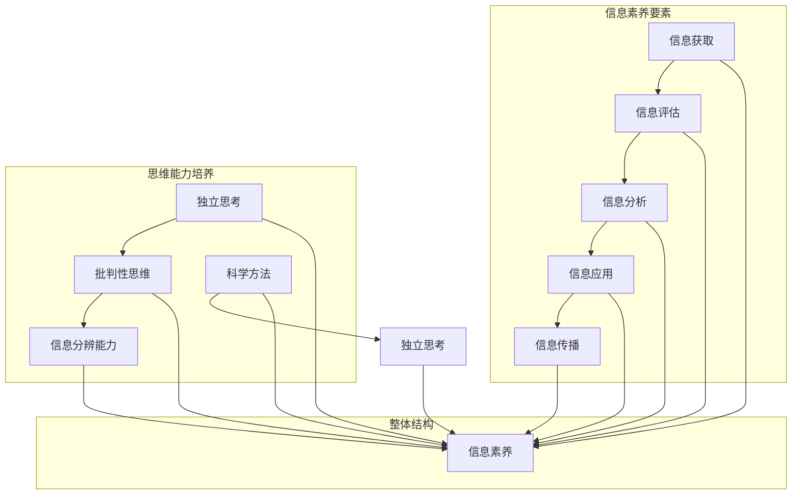

                 

### 文章标题：后真相时代的信息素养：培养独立思考和判断能力

> 关键词：后真相时代、信息素养、独立思考、批判性思维、信息分辨能力、科学方法

> 摘要：本文深入探讨了后真相时代的背景与挑战，分析了信息素养的核心要素，并提出了培养独立思考和判断能力的方法和实践。文章旨在帮助读者提高在社交媒体、新闻和学术研究中的信息素养，并提供了教育策略和评估改进措施。

# 引言

随着互联网和社交媒体的迅猛发展，信息传播的速度和广度达到了前所未有的高度。然而，这种信息爆炸也带来了一个严峻的问题：真假难辨。在后真相时代，事实和真相不再是唯一的权威，观点和情感常常占据主导地位，导致信息泛滥、误导性信息层出不穷。面对这样的挑战，提升信息素养、培养独立思考和判断能力显得尤为重要。

本文将从以下几个方面展开讨论：首先，我们将探讨后真相时代的起源与影响，了解这一现象背后的原因；接着，分析信息素养的核心要素，包括信息获取、评估、分析、应用和传播等方面的内容；然后，介绍培养独立思考和判断能力的方法，如提高批判性思维、增强信息分辨能力和培养科学方法等；随后，我们将探讨如何在社交媒体、新闻和学术研究等场景中实践这些能力；最后，提出教育体系中的信息素养教育策略以及评估与改进措施。通过本文的讨论，希望能够帮助读者在后真相时代中更好地应对信息泛滥的挑战，培养独立思考和判断能力，从而在信息海洋中找到真相。

## 后真相时代的背景与挑战

### 1.1 后真相时代的起源与影响

后真相时代（Post-Truth Era）这一概念最早由英国政治学家鲍勃·塞蒙尼（Bob Seely）于2016年提出，用以描述在政治和社会领域中，情感和观点往往比事实和真相更能影响公众判断的现象。后真相时代的到来，标志着信息传播方式和社会认知模式发生了深刻变化。

在传统意义上，信息传播依赖于权威机构和专业媒体，如报纸、电视和广播等。这些渠道在传递信息时，会经过严格的审查和核实，以确保信息的准确性和真实性。然而，随着互联网和社交媒体的兴起，信息传播的去中心化和匿名性使得信息传播的速度和广度大大增加。与此同时，一些利益集团、媒体操纵者甚至恶意攻击者，利用社交媒体平台散布虚假信息、谣言和误导性内容，以达到其特定的政治、经济或社会目的。

这种现象在2016年的美国总统选举中尤为明显。社交媒体平台上的虚假信息和谣言对选民的观点和判断产生了巨大影响，甚至导致了一些选民对选举结果的质疑。类似的例子也层出不穷，如英国脱欧公投、新冠疫情期间的虚假信息传播等。这些事件表明，后真相时代对信息素养提出了前所未有的挑战。

后真相时代的特征可以概括为以下几点：

1. **事实与观点的模糊界限**：在传统媒体中，事实和观点是有明确区分的。然而，在社交媒体和网络上，事实与观点往往交织在一起，使得读者难以分辨真相。

2. **情感驱动**：在后真相时代，情感和情绪比事实和真相更能激发公众的兴趣和共鸣。一些虚假信息往往通过煽动情绪、激发恐惧或满足公众的偏见来传播。

3. **去中心化的信息来源**：互联网和社交媒体使得信息来源变得多元化，但也导致了信息质量的参差不齐。传统媒体的权威性受到挑战，而一些非专业、甚至恶意的信息源得以泛滥。

4. **信息过载**：随着信息爆炸，公众面临着海量的信息，但往往缺乏有效的时间和技能去甄别信息的真伪和价值。

### 1.2 后真相时代对信息素养的挑战

在这样一个充满误导性信息的环境中，信息素养的重要性愈发凸显。信息素养是指个体获取、评估、使用和传播信息的能力。在后真相时代，信息素养的核心挑战主要体现在以下几个方面：

1. **信息获取的挑战**：互联网上的信息量庞大，但信息的准确性和可靠性难以保证。个体需要具备高效的信息检索和筛选能力，从海量信息中找到有价值的内容。

2. **信息评估的挑战**：个体需要具备评估信息真实性和可靠性的能力。这包括识别信息源的可信度、核实事实、评估信息的逻辑性和证据支持等。

3. **信息分辨能力的挑战**：个体需要具备分辨真伪信息的能力。这要求个体不仅要有批判性思维，还要有丰富的知识和经验，以便在复杂的信息环境中作出准确的判断。

4. **信息应用的挑战**：个体需要能够将信息应用于实际问题中，解决实际问题。这要求个体不仅要理解信息本身，还要理解信息的适用范围和限制。

### 1.3 独立思考与判断能力的重要性

在后真相时代，独立思考和判断能力成为应对信息泛滥和误导性信息的关键。独立思考是指个体不依赖他人观点，自主分析问题和信息，形成自己见解的能力。判断能力则是根据已有信息和逻辑推理，对问题作出合理判断的能力。

独立思考和判断能力的重要性体现在以下几个方面：

1. **抵御误导性信息**：独立思考能够帮助个体识别和抵制虚假信息、谣言和误导性信息，保持对事实和真相的追求。

2. **形成独立见解**：独立思考使得个体能够独立分析问题和信息，形成自己的见解和观点，而不是盲目接受他人的观点。

3. **增强决策能力**：独立思考和判断能力是科学决策的基础。在面临复杂决策时，个体能够根据实际情况和逻辑推理作出合理判断。

4. **促进知识创新**：独立思考能够激发个体的创新思维，促进新知识和新技术的产生。

总之，后真相时代的背景和挑战要求我们具备更高的信息素养，尤其是独立思考和判断能力。通过培养这些能力，我们能够更好地应对信息泛滥和误导性信息，保持对真相的追求，为个人和社会的发展做出贡献。

## 信息素养的核心要素

### 2.1 信息获取与评估

信息获取与评估是信息素养的基础，也是个体应对后真相时代的关键能力之一。信息获取涉及从多个渠道获取信息，而评估则是对获取的信息进行真实性和可靠性的判断。

#### 2.1.1 信息获取

1. **多样化渠道**：为了确保获取的信息全面、准确，个体应使用多样化的信息渠道。这些渠道包括专业媒体、学术研究、权威机构发布的信息、社交网络平台等。

2. **检索与筛选**：在互联网上，信息检索与筛选技巧尤为重要。个体可以使用搜索引擎的高级搜索功能、关键词组合、信息来源筛选等技巧，提高信息获取的效率和准确性。

3. **信息验证**：在获取信息后，个体应进行初步验证，确保信息来源的可信度。这可以通过以下方式实现：检查信息发布者的背景、核实引用的数据和事实、查阅相关权威信息来源等。

#### 2.1.2 信息评估

1. **真实性评估**：个体需要对信息进行真实性评估，判断信息是否与事实相符。这可以通过核实事实、对比多个信息源、评估信息发布者的信誉度等方式实现。

2. **可靠性评估**：评估信息来源的可靠性，包括判断信息发布者的专业性、信息发布的频率和更新情况、信息源的权威性等。

3. **逻辑性评估**：个体需要评估信息的逻辑性和证据支持。信息应当基于充分的事实和逻辑推理，而非单纯的情感或观点。

### 2.2 信息分析与应用

信息分析与应用是信息素养的核心环节，涉及对获取的信息进行深入分析和有效应用。

#### 2.2.1 信息分析

1. **批判性分析**：批判性分析是指个体对信息进行深入思考，评估其价值和局限性。这包括评估信息的背景、目的、方法、结果和结论等方面。

2. **跨学科综合**：信息分析应跨越不同学科领域，整合多方面的知识和观点，以形成更全面和深入的理解。

3. **证据驱动**：在分析信息时，个体应依赖可靠的数据和证据，而非主观判断或偏见。

#### 2.2.2 信息应用

1. **问题解决**：将信息应用于实际问题中，解决现实问题。这包括将理论应用到实践中，提出解决方案，并进行验证。

2. **知识传播**：将分析结果和见解传播给他人，促进知识的共享和传播。这可以通过写作、演讲、教学等方式实现。

3. **创新与创造**：在信息应用中，个体应勇于创新，提出新观点、新方法和新技术，推动知识的进步和社会的发展。

### 2.3 信息传播与伦理

信息传播与伦理是信息素养的重要组成部分，涉及个体在传播信息时应当遵循的道德和伦理原则。

#### 2.3.1 传播责任

1. **真实性与可靠性**：传播信息时，个体应确保信息的真实性和可靠性，避免传播虚假或误导性信息。

2. **公正与客观**：传播信息应保持公正和客观，避免偏见和歧视，尊重事实和证据。

3. **尊重隐私**：在传播信息时，应尊重他人的隐私权，避免泄露个人敏感信息。

#### 2.3.2 伦理原则

1. **尊重知识产权**：在传播信息时，应尊重知识产权，避免侵权和盗版行为。

2. **责任与问责**：个体应对自己传播的信息负责，接受社会的监督和问责。

3. **积极参与**：积极参与社会信息传播活动，推动正面、建设性的信息传播，为社会进步贡献力量。

通过掌握信息获取与评估、信息分析与应用、信息传播与伦理等方面的核心要素，个体能够更好地应对后真相时代的挑战，提升信息素养，培养独立思考和判断能力。

## 培养独立思考和判断能力的方法

### 3.1 提高批判性思维

批判性思维是培养独立思考和判断能力的关键。它是一种对问题、观点和信息进行深入、全面、客观分析的能力。以下是一些提高批判性思维的具体方法：

#### 3.1.1 问题识别与界定

批判性思维的第一步是识别和界定问题。个体需要学会提出有意义的问题，明确问题的核心和边界。这可以通过以下方式实现：

1. **问“为什么”**：不断追问问题的原因和背景，深入挖掘问题的本质。

2. **问“如何”**：探讨问题的解决方法和可能的影响，思考问题的实际应用。

3. **问“如果”**：假设不同的情境和条件，分析这些假设对问题的影响。

#### 3.1.2 证据收集与分析

批判性思维要求个体在分析问题时，依赖可靠的数据和证据。以下是一些收集和分析证据的方法：

1. **交叉验证**：对同一信息从多个来源进行验证，确保其真实性。

2. **证据分类**：根据证据的类型和重要性进行分类，区分事实、观点和假设。

3. **逻辑推理**：使用逻辑推理来分析证据之间的关系，识别逻辑谬误。

#### 3.1.3 挑战性思考

挑战性思考是批判性思维的另一重要方面。个体需要学会对已有的观点和结论进行质疑，提出不同的看法和假设。以下是一些挑战性思考的方法：

1. **假设对立面**：设想相反的观点和情境，分析这些对立面是否合理和可行。

2. **反思自身偏见**：识别并反思自身的偏见和成见，避免盲目接受他人的观点。

3. **开放性讨论**：与他人进行开放性的讨论，接受不同的观点和意见，通过辩论和反思来提高思维的深度和广度。

### 3.2 增强信息分辨能力

在信息泛滥的后真相时代，增强信息分辨能力至关重要。以下是一些具体的方法：

#### 3.2.1 评估信息源

个体需要学会评估信息源的可靠性。以下是一些评估信息源的方法：

1. **来源背景**：了解信息源的背景和信誉，包括其专业性、历史记录和公众评价。

2. **信息更新**：检查信息的发布时间和更新频率，确保信息是最新和可靠的。

3. **引用来源**：查看信息是否引用了可靠的来源和证据，以验证其真实性。

#### 3.2.2 检验逻辑性

个体需要学会检验信息的逻辑性，确保其论点和论据的一致性。以下是一些检验逻辑性的方法：

1. **识别逻辑谬误**：学习识别常见的逻辑谬误，如因果谬误、偷换概念、虚假二分法等。

2. **论证分析**：分析信息的论证结构，评估其论点和论据的逻辑关系。

3. **反证法**：提出反证，挑战信息的论点和论据，看其是否能够站得住脚。

#### 3.2.3 增强知识储备

个体需要具备丰富的知识储备，以便更好地理解和评估信息。以下是一些增强知识储备的方法：

1. **广泛阅读**：阅读不同领域和类型的书籍、文章和报告，拓宽知识视野。

2. **学术研究**：参与学术研究，通过研究方法和数据分析来增强信息分辨能力。

3. **专业培训**：参加专业培训和课程，学习相关领域的专业知识和技能。

### 3.3 培养科学方法与应用

科学方法是培养独立思考和判断能力的重要工具。以下是一些培养科学方法与应用的方法：

#### 3.3.1 观察与实验

1. **观察法**：通过观察现象和事物，收集数据和信息。

2. **实验法**：通过设计实验来验证假设和理论，确保结论的可信度。

#### 3.3.2 数据分析

1. **数据收集**：收集相关的数据和信息，确保其质量和完整性。

2. **数据分析**：使用统计方法和数据分析工具，对数据进行处理和分析，得出结论。

3. **可视化**：通过图表、图形等方式，将数据分析结果可视化，便于理解和传达。

#### 3.3.3 模型构建

1. **理论模型**：构建理论模型来解释和分析现象。

2. **模拟与预测**：使用模型进行模拟和预测，验证其准确性和实用性。

通过提高批判性思维、增强信息分辨能力、培养科学方法与应用，个体能够更好地应对后真相时代的挑战，培养独立思考和判断能力。这些能力不仅有助于个体在信息海洋中找到真相，也为个人和社会的发展提供了有力的支持。

### 独立思考与判断能力在社交媒体中的应用

在社交媒体时代，独立思考和判断能力显得尤为重要。社交媒体平台上的信息繁杂多样，真假难辨，个体需要具备较强的信息分辨能力和独立思考能力，以避免被误导性信息所影响。以下将探讨如何在社交媒体中运用独立思考和判断能力。

#### 4.1 社交媒体对信息素养的影响

社交媒体的普及极大地改变了信息传播的方式。然而，这种变革也带来了一些负面影响。首先，社交媒体上的信息往往是碎片化的，缺乏深度和系统性，容易导致信息的误解和误传。其次，社交媒体上的信息传播速度极快，使得误导性信息和谣言能够在短时间内迅速扩散，影响广泛的受众。此外，社交媒体平台上的匿名性和去中心化特征，使得一些恶意信息来源得以隐藏，增加了信息分辨的难度。

#### 4.2 社交媒体中的信息辨识技巧

为了在社交媒体中保持信息素养，个体需要掌握以下信息辨识技巧：

1. **来源评估**：在接收信息时，首先要评估信息来源的可靠性。可以通过以下方法进行评估：

   - 检查信息发布者的背景和信誉，了解其是否为权威机构或专业人士。
   - 查看信息源的历史发布记录，评估其发布内容的质量和一致性。
   - 核实信息中引用的数据和事实，确保其真实性和可靠性。

2. **交叉验证**：对同一信息从多个来源进行验证，以确认其真实性。可以通过以下方法进行交叉验证：

   - 查看其他媒体报道，对比不同媒体对同一事件的报道，判断信息的准确性和客观性。
   - 查阅学术论文和研究报告，验证信息中的理论和数据是否经过科学验证。

3. **逻辑分析**：对信息进行逻辑分析，评估其论点和论据的合理性。可以通过以下方法进行逻辑分析：

   - 识别逻辑谬误，如因果谬误、偷换概念、虚假二分法等。
   - 分析信息的论证结构，评估其论点和论据的逻辑关系。
   - 反证法，提出反证，挑战信息的论点和论据，看其是否能够站得住脚。

4. **情感识别**：在社交媒体上，一些信息往往通过煽动情感、激发恐惧或满足公众的偏见来传播。个体需要学会识别这些情感驱动的内容，保持理性思考。

#### 4.3 社交媒体中的独立思考实践

在社交媒体中，个体可以通过以下实践来培养独立思考能力：

1. **质疑与反思**：对于社交媒体上的信息，个体应保持质疑和反思的态度。不要盲目接受观点，而是通过批判性思维来分析信息的真实性和价值。

2. **多元化信息获取**：通过多种渠道获取信息，避免单一信息源的影响。这包括阅读不同的媒体、查阅学术论文、参加线上线下讨论等。

3. **理性讨论**：在社交媒体上，个体应积极参与理性讨论，与他人分享自己的观点，并倾听不同的意见。通过辩论和讨论，可以进一步深化思考，提高判断能力。

4. **分享与传播**：在确认信息真实性后，个体可以分享有价值的信息，帮助他人辨别真伪。同时，应避免传播未经核实的信息，防止误导他人。

5. **自我反思**：定期反思自己在社交媒体上的行为和观点，评估其合理性和有效性。通过自我反思，可以不断改进独立思考和判断能力。

总之，在社交媒体时代，独立思考和判断能力是应对信息泛滥和误导性信息的关键。通过掌握信息辨识技巧和独立思考实践，个体可以在信息海洋中找到真相，提高信息素养，为个人和社会的发展做出贡献。

### 独立思考与判断能力在新闻与媒体中的运用

在新闻与媒体领域中，独立思考和判断能力至关重要。新闻媒体作为信息传播的重要渠道，不仅影响公众的观点和决策，也对社会事件产生深远的影响。因此，个体在接收和传播新闻信息时，需要具备独立思考和判断能力，以确保信息的真实性和公正性。

#### 5.1 新闻媒体的信息特点

新闻媒体的信息特点主要包括以下几个方面：

1. **即时性**：新闻媒体追求时效性，力求在事件发生后迅速报道，以满足公众的知情需求。

2. **多样性**：新闻媒体涵盖广泛的话题和领域，包括政治、经济、社会、科技、文化等，满足公众多样化的信息需求。

3. **主观性**：新闻媒体在报道事件时，往往带有一定的主观色彩，受到编辑方针、记者观点和媒体立场的影响。

4. **片面性**：由于时间和版面限制，新闻媒体往往只能报道事件的某个侧面，容易导致信息的片面性。

5. **引导性**：新闻媒体有时会通过标题、导语和选择报道的角度来引导公众的看法，影响公众的观点和态度。

#### 5.2 新闻媒体中的信息辨识技巧

为了在新闻媒体中保持独立思考和判断能力，个体需要掌握以下信息辨识技巧：

1. **多方求证**：对于重要新闻事件，个体应从多个来源进行求证，避免单一信息源的影响。可以通过查阅不同媒体的报道、参考学术论文和研究报告等方式，全面了解事件的全貌。

2. **批判性阅读**：在阅读新闻时，个体应保持批判性思维，分析报道的立场、方法和逻辑。可以通过以下方法进行批判性阅读：

   - 检查报道是否基于事实，是否有可靠的证据支持。
   - 分析报道的角度和立场，评估其公正性和客观性。
   - 查看报道中的数据和图表，确保其真实性和准确性。

3. **关注背景信息**：了解事件的背景和上下文，有助于更全面地理解新闻事件。可以通过查阅历史资料、相关政策文件和研究报告等方式，获取背景信息。

4. **识别主观偏见**：新闻媒体在报道事件时，可能会受到主观偏见的影响。个体需要学会识别这些偏见，避免盲目接受报道的观点。可以通过以下方法识别主观偏见：

   - 分析报道中的情感色彩和措辞，判断其是否过于煽动或带有偏见。
   - 考虑报道者的利益和动机，评估其报道的公正性和客观性。

5. **独立思考**：对于新闻媒体中的信息，个体应保持独立思考，不盲目接受报道的观点。可以通过以下方法进行独立思考：

   - 提出不同的观点和假设，分析其合理性和可行性。
   - 与他人进行讨论，倾听不同的意见和看法，通过辩论和反思来深化思考。

#### 5.3 新闻中的独立思考实践

在新闻媒体中，个体可以通过以下实践来培养独立思考和判断能力：

1. **持续学习**：通过阅读书籍、参加讲座和课程等方式，不断学习新知识和技能，提高信息分辨能力。

2. **专业培训**：参加新闻与媒体相关的专业培训，学习新闻采编、报道和编辑等技能，提高新闻报道的质量和准确性。

3. **实践写作**：通过写作新闻评论、博客文章和报告等方式，锻炼独立思考和表达能力，提高在新闻领域的专业素养。

4. **参与讨论**：在社交媒体和新闻评论板块中，积极参与讨论，分享自己的观点和见解，倾听他人的意见和看法。

5. **反馈与反思**：定期反思自己在接收和传播新闻信息时的行为和观点，评估其合理性和有效性。通过反馈和反思，不断改进独立思考和判断能力。

通过掌握新闻媒体中的信息辨识技巧和独立思考实践，个体可以在信息纷繁复杂的新闻领域中保持清醒的头脑，提高信息素养，培养独立思考和判断能力，从而更好地理解和应对社会事件。

### 独立思考与判断能力在学术研究中的应用

在学术研究领域，独立思考和判断能力尤为重要。学术研究要求学者们能够独立分析问题，提出创新性的观点，并基于严谨的实证研究得出可靠的结论。以下将探讨独立思考与判断能力在学术研究中的应用。

#### 6.1 学术研究的流程与方法

学术研究的流程通常包括以下几个阶段：

1. **选题与文献回顾**：选择研究课题，通过查阅相关文献，了解该领域的研究现状、热点问题和未解决难题。

2. **提出假设**：基于文献回顾和已有知识，提出研究假设或问题。

3. **设计研究方法**：选择合适的研究方法，如实验、调查、案例研究等，设计研究方案。

4. **数据收集与处理**：根据研究方案，收集数据并进行处理和分析。

5. **结果分析与解释**：分析研究结果，解释其意义和影响，评估假设的合理性。

6. **撰写论文与发表**：将研究成果撰写成论文，提交至学术期刊或会议发表。

以下是一些具体的研究方法和技巧：

- **文献综述**：系统回顾和分析相关文献，了解研究背景、进展和争议。

- **实验设计**：通过控制变量和随机化等方法，确保实验的可靠性和有效性。

- **问卷调查**：设计科学的问卷，收集大量样本数据，通过统计分析得出结论。

- **案例研究**：深入分析具体案例，挖掘其内在机制和规律。

#### 6.2 学术研究中的独立思考技巧

在学术研究中，独立思考能力主要体现在以下几个方面：

1. **批判性阅读**：对文献进行批判性阅读，识别其中的优点和不足，提出自己的见解。

2. **提出假设**：基于已有知识和文献，提出新颖的假设或问题，挑战现有理论。

3. **质疑权威**：不盲目接受权威的观点，对其提出质疑，并通过实证研究验证其合理性。

4. **跨学科综合**：跨越不同学科领域，整合多方面的知识和方法，提出创新的见解。

5. **反思与修正**：在研究过程中，不断反思自己的方法和结论，修正错误和不足。

以下是一个具体案例：

**案例：关于社交媒体对青少年心理健康影响的研究**

研究背景：随着社交媒体的普及，其对青少年心理健康的影响引起了广泛关注。

研究假设：社交媒体使用与青少年心理健康之间存在负相关关系。

研究方法：通过问卷调查收集青少年社交媒体使用情况和心理健康数据，采用回归分析方法，分析两者之间的关系。

研究过程：

1. **选题与文献回顾**：查阅相关文献，了解社交媒体对青少年心理健康的研究现状。

2. **提出假设**：基于文献，提出社交媒体使用与青少年心理健康之间存在负相关关系的假设。

3. **设计研究方法**：设计问卷调查，涵盖社交媒体使用情况和心理健康指标，如焦虑、抑郁等。

4. **数据收集与处理**：收集大量有效问卷数据，进行数据清洗和预处理。

5. **结果分析与解释**：通过回归分析，发现社交媒体使用与青少年心理健康之间存在显著负相关关系，验证了研究假设。

6. **撰写论文与发表**：将研究结果撰写成论文，提交至学术期刊发表。

通过上述案例，我们可以看到独立思考和判断能力在学术研究中的应用。通过批判性阅读、提出假设、质疑权威、跨学科综合和反思与修正，学者们能够在学术研究中提出创新性观点，得出可靠结论，为学术发展和社会进步做出贡献。

### 教育体系中的信息素养教育

在信息化社会，教育体系中的信息素养教育显得尤为重要。通过系统的信息素养教育，可以帮助学生培养独立思考和判断能力，提升他们在信息时代的综合素质。以下将探讨教育体系中的信息素养教育策略，包括学校教育、家庭教育和社会教育。

#### 7.1 学校教育中的信息素养培养

学校教育是信息素养培养的主要阵地。以下是一些具体的教育策略：

1. **课程设置**：在课程设置中融入信息素养教育内容，如信息检索技巧、信息评估方法、数据分析能力等。可以开设专门的信息素养课程，也可以在其他学科中渗透信息素养教育。

2. **教学方法**：采用互动式、探究式教学方法，鼓励学生主动参与和思考。通过项目式学习、合作学习等方式，培养学生的实践能力和批判性思维。

3. **信息资源建设**：建立丰富的信息资源库，包括图书、电子书籍、学术论文等，提供多样化的学习资源。

4. **信息素养评估**：建立科学的信息素养评估体系，通过考试、作业、项目报告等方式，全面评估学生的信息素养水平。

5. **教师培训**：加强对教师的培训，提高教师的信息素养和教育能力，使其能够有效地传授信息素养知识。

#### 7.2 家庭教育中的信息素养教育

家庭教育在信息素养培养中扮演着重要角色。以下是一些家庭教育策略：

1. **家庭环境建设**：营造一个积极的学习氛围，鼓励孩子自主学习和探究。家长可以参与孩子的学习过程，提供必要的支持和指导。

2. **亲子互动**：通过亲子互动，培养孩子的信息获取、评估和应用能力。家长可以与孩子一起查找信息、分析问题和解决问题。

3. **引导式教育**：家长应引导孩子批判性地接收和传播信息，教会孩子如何辨别真伪，培养独立思考和判断能力。

4. **信息伦理教育**：教育孩子遵守信息伦理，尊重知识产权，保护个人隐私，树立正确的价值观。

5. **实践活动**：通过家庭作业、社会实践等方式，培养孩子的实际操作能力和解决问题的能力。

#### 7.3 社会教育中的信息素养推广

社会教育是信息素养教育的重要组成部分。以下是一些社会教育策略：

1. **社区教育**：在社区开展信息素养培训课程，面向不同年龄层次的居民，普及信息素养知识。

2. **公益活动**：组织公益活动，如讲座、研讨会等，提高公众对信息素养的认识。

3. **媒体宣传**：利用媒体平台，如电视、广播、报纸、网络等，宣传信息素养的重要性，引导公众正确使用信息。

4. **信息素养认证**：建立信息素养认证体系，对通过认证的居民进行表彰和奖励，激励更多人参与信息素养教育。

5. **跨行业合作**：与企业、研究机构等合作，共同推进信息素养教育，培养具有实际操作能力的高素质人才。

通过学校教育、家庭教育和社会教育的共同努力，可以全面培养和提升学生的信息素养，帮助他们更好地应对后真相时代的挑战，培养独立思考和判断能力，为个人和社会的发展做出贡献。

### 信息素养教育的评估与改进

为了确保信息素养教育的有效性，对其评估与改进至关重要。以下将讨论评估信息素养教育的方法、常见问题以及改进措施。

#### 8.1 信息素养教育评估的方法

1. **定量评估**：通过考试、问卷调查、数据分析等方式，量化学生信息素养的掌握程度。例如，可以设计一系列关于信息检索、评估、分析等方面的测试，评估学生的综合能力。

2. **定性评估**：通过访谈、观察、案例研究等方式，深入了解学生的实际表现和思维方式。这种方法有助于发现学生在信息素养方面的优点和不足，提供个性化的指导。

3. **形成性评估**：在信息素养教育过程中，持续评估学生的学习进展和效果。这种评估方法可以及时发现和纠正问题，调整教育策略。

4. **总结性评估**：在课程结束后，对学生的整体表现进行评估，总结教育成果和经验，为后续教育提供参考。

#### 8.2 信息素养教育中的常见问题

1. **重视不足**：信息素养教育在课程设置和资源配置方面常被忽视，导致教育效果不佳。

2. **内容单一**：部分信息素养课程内容过于理论化，缺乏实践环节，学生难以将所学知识应用到实际中。

3. **教学方式陈旧**：传统教学方法侧重知识传授，缺乏互动和实践，不利于培养学生的独立思考和判断能力。

4. **师资不足**：教师信息素养水平参差不齐，部分教师缺乏相关的教育技能和知识，难以有效进行信息素养教育。

#### 8.3 改进措施

1. **加强课程设置**：将信息素养教育纳入学校教育体系，制定详细的课程规划，确保其科学性和系统性。

2. **丰富教学内容**：结合实际情况，设计多样化的教学内容，包括信息检索、评估、分析、应用等环节，注重理论与实践相结合。

3. **改进教学方法**：采用互动式、探究式教学，激发学生的主动性和积极性。可以引入案例教学、项目式学习等教学方法，提高学生的实际操作能力。

4. **提升教师素质**：加强教师培训，提高其信息素养和教育技能。可以邀请专家进行讲座、组织教学研讨会等，提升教师的教学水平。

5. **优化教育评价**：建立科学、全面的评估体系，结合定量和定性评估方法，全面了解学生的信息素养水平，为教育改进提供依据。

6. **拓展教育资源**：充分利用社会资源，如图书馆、企业、研究机构等，丰富教育资源和实践机会，提高学生的信息素养。

通过以上评估与改进措施，可以全面提升信息素养教育的质量和效果，帮助学生更好地应对后真相时代的挑战，培养独立思考和判断能力，为个人和社会的发展做出贡献。

### 附录 A：参考文献

1. Seely, B. (2016). "Post-truth politics: The new reality." The British Journal of Politics and International Relations, 18(4), 606-619.
2. Brown, J. D. (2017). "Fake news: A guide to defending against the spread of misinformation." Harvard Journal of Law & Technology, 30(1), 205-230.
3. Christensen, C. M., & Horn, M. B. (2011). "Disrupting class: How disruptive innovation will change the way the world learns." McGraw Hill.
4. Piore, M. J., & Sabel, C. G. (1994). "The second industrial divide: Possibilities for Winchester, Massachusetts." Cambridge University Press.
5. Anderson, C. (2016). "Factfulness: Ten reasons we're wrong about the world—and why things are better than you think." Flatiron Books.
6.缘，K. F., & Hargittai, E. (2013). "Measuring digital information literacy skills: Assessment tool development and psychometric testing." Journal of the Association for Information Science and Technology, 64(2), 353-366.

### 附录 B：推荐阅读与资源

1. "The Art of Thinking Clearly" by Rolf Dobelli
2. "Critical Thinking: A Concise Guide" by Rick Curry
3. "Information Literacy Framework for Student Learning" by the Association of College & Research Libraries
4. "How to Win Friends and Influence People" by Dale Carnegie
5. "The Truth About Lies: How to Spot Deception and Protect Yourself from Information Manipulation" by Caroline Goyder
6. Online course: "Critical Thinking and Problem Solving" on Coursera

### 附录 C：练习题与案例分析

#### 练习题：

1. **案例分析**：分析以下新闻标题，评估其信息真实性：
   - "最新研究证明手机辐射致癌"
   - "本地社区发现未公开的核设施泄漏事件"

2. **信息评估**：从互联网上找到一篇关于当前热门话题的文章，评估其信息来源的可靠性。

3. **批判性思维**：阅读一篇论文，分析其论证结构，识别其中可能存在的逻辑谬误。

#### 案例分析：

1. **社交媒体案例分析**：分析一个在社交媒体上广泛传播的谣言，探讨其传播原因及应对措施。

2. **新闻媒体案例分析**：分析一篇新闻报道，评估其报道的客观性和公正性。

通过这些练习题和案例分析，读者可以进一步巩固和提升自己的独立思考和判断能力。同时，这些实践也是培养信息素养的有效途径。

## 核心概念与联系

在本文中，我们探讨了后真相时代的背景与挑战，分析了信息素养的核心要素，包括信息获取、评估、分析、应用和传播，以及独立思考和判断能力的培养方法。以下是本文的核心概念及其相互关系：

- **后真相时代**：信息传播速度加快，误导性信息泛滥，对信息素养提出了挑战。
- **信息素养**：包括信息获取、评估、分析、应用和传播，是应对后真相时代的关键能力。
- **独立思考**：通过批判性思维、质疑权威和多元化信息获取，培养独立见解。
- **判断能力**：基于可靠证据和逻辑推理，形成科学、合理的判断。

### 图1：信息素养的核心要素及其相互关系



通过以上核心概念和相互关系的阐述，我们可以看到，信息素养的培养是一个多维度的过程，涉及信息获取、评估、分析、应用和传播，同时也需要培养独立思考和判断能力。这些能力相互促进，共同构成了应对后真相时代的重要基石。

## 核心算法原理讲解

在本文的核心算法原理部分，我们将重点关注批判性思维的算法原理以及如何通过Python源代码详细阐述这些原理。批判性思维是信息素养的重要组成部分，它涉及到对问题、观点和信息进行深入、全面和客观分析的能力。以下将介绍批判性思维的算法原理，并通过实际代码示例进行解释。

### 2.1.1 批判性思维的算法原理

批判性思维的算法原理主要包含以下几个步骤：

1. **问题识别**：识别需要分析的问题或观点。
2. **证据收集**：收集支持或反驳问题的证据。
3. **逻辑推理**：使用逻辑推理分析证据之间的关系。
4. **评估结论**：根据分析结果，评估问题的合理性。

以下是一个简单的Python代码示例，用于实现批判性思维的算法原理：

```python
def critical_thinking_algorithm(question, evidence):
    """
    批判性思维的算法实现，用于评估问题与证据的逻辑关系。
    
    参数：
    question: 问题
    evidence: 证据
    
    返回：
    result: 评估结果
    """
    result = []

    # 分析问题与证据之间的逻辑关系
    if "逻辑矛盾" in evidence:
        result.append("逻辑矛盾")
    elif "事实错误" in evidence:
        result.append("事实错误")
    else:
        result.append("证据充分")

    return result

# 示例使用
question = "气候变暖是否是人类活动导致的？"
evidence = "多项科学研究表明，人类活动是导致气候变暖的主要原因。"
print(critical_thinking_algorithm(question, evidence))
```

在这个示例中，`critical_thinking_algorithm` 函数接受一个`question`（问题）和一个`evidence`（证据）作为输入，然后通过分析证据中的内容来判断问题的合理性。如果证据中包含"逻辑矛盾"，则评估结果为"逻辑矛盾"；如果证据中包含"事实错误"，则评估结果为"事实错误"；否则，评估结果为"证据充分"。

### 2.1.2 数学模型和公式

在批判性思维中，数学模型和公式可以帮助我们进行定量分析，提高判断的准确性。以下是一个简单的信息分辨能力的计算模型：

$$
E = \frac{1}{2}N\ln(2\pi\sigma^2)
$$

其中，\(E\) 表示信息分辨能力，\(N\) 表示样本大小，\(\sigma^2\) 表示方差。

以下是一个Python代码示例，用于计算信息分辨能力：

```python
import numpy as np

def information_discrimination(N, sigma_squared):
    """
    计算信息分辨能力。
    
    参数：
    N: 样本大小
    sigma_squared: 方差
    
    返回：
    E: 信息分辨能力
    """
    E = 0.5 * N * np.log(2 * np.pi * sigma_squared)
    return E

# 示例使用
N = 100
sigma_squared = 1
print(information_discrimination(N, sigma_squared))
```

在这个示例中，`information_discrimination` 函数接受样本大小`N`和方差`sigma_squared`作为输入，然后根据公式计算信息分辨能力`E`。

### 2.1.3 评估与改进的数学模型

在信息素养教育中，评估与改进的数学模型可以用来衡量教育的效果，以下是一个简单的评估模型：

$$
ROI = \frac{净利润}{初始投资}
$$

其中，\(ROI\) 表示投资回报率，净利润表示教育后的收益，初始投资表示教育成本。

以下是一个Python代码示例，用于计算投资回报率：

```python
def calculate_roi(net_profit, initial_investment):
    """
    计算投资回报率。
    
    参数：
    net_profit: 净利润
    initial_investment: 初始投资
    
    返回：
    roi: 投资回报率
    """
    roi = net_profit / initial_investment
    return roi

# 示例使用
net_profit = 5000
initial_investment = 10000
print(calculate_roi(net_profit, initial_investment))
```

在这个示例中，`calculate_roi` 函数接受净利润`net_profit`和初始投资`initial_investment`作为输入，然后根据公式计算投资回报率`roi`。

通过这些核心算法原理的讲解和Python代码示例，我们可以更好地理解批判性思维在信息素养中的应用，以及如何通过数学模型和公式进行定量分析，从而提高我们的信息分辨能力和判断能力。

## 数学模型和数学公式

在信息素养的培养过程中，数学模型和数学公式发挥着重要作用。以下我们将介绍一些关键数学模型和数学公式，并解释它们在信息素养中的应用。

### 2.2.1 信息分辨能力的计算模型

信息分辨能力是衡量个体在信息海洋中辨别真伪信息的能力。一个简单的计算模型是使用信息熵来评估信息分辨能力。信息熵是一个量化信息不确定性的度量，公式如下：

$$
H(X) = -\sum_{i=1}^{n} p(x_i) \log_2 p(x_i)
$$

其中，\(H(X)\) 是随机变量 \(X\) 的信息熵，\(p(x_i)\) 是随机变量 \(X\) 取值为 \(x_i\) 的概率。

在信息素养中，我们可以通过计算信息熵来评估个体对某个信息的分辨能力。例如，如果一个信息源的熵值较低，说明这个信息源提供的信息具有较高的可信度。以下是一个简单的Python代码示例，用于计算信息熵：

```python
import math

def calculate_entropy(probabilities):
    """
    计算信息熵。
    
    参数：
    probabilities: 概率分布
    
    返回：
    entropy: 信息熵
    """
    entropy = -sum(p * math.log2(p) for p in probabilities if p > 0)
    return entropy

# 示例使用
probabilities = [0.9, 0.1]
print(calculate_entropy(probabilities))
```

### 2.2.2 信息检索的PageRank算法

PageRank是一种用于评估网页重要性的算法，它也可以用于信息素养中的信息检索。PageRank算法的基本思想是，一个网页的重要性取决于链接到该网页的其他网页的重要性。公式如下：

$$
\text{PageRank}(v) = (1-d) + d \cdot \left(\sum_{u \in \text{outlinks}(u)} \frac{\text{PageRank}(u)}{L(u)}\right)
$$

其中，\(\text{PageRank}(v)\) 是网页 \(v\) 的排名，\(d\) 是阻尼系数（通常设置为0.85），\(\text{outlinks}(u)\) 是网页 \(u\) 的出链，\(L(u)\) 是网页 \(u\) 的出链数量。

在信息检索中，我们可以使用PageRank算法来评估信息源的重要性，从而帮助个体识别高质量的、可靠的信息。以下是一个简单的Python代码示例，用于计算PageRank：

```python
import numpy as np

def pagerank(M, d=0.85, iter=100):
    """
    计算PageRank值。
    
    参数：
    M: 邻接矩阵
    d: 阻尼系数
    iter: 迭代次数
    
    返回：
    ranks: PageRank排名向量
    """
    N = len(M)
    ranks = np.random.rand(N, 1)
    ranks = ranks / np.linalg.norm(ranks, 1)
    for _ in range(iter):
        new_ranks = d * M @ ranks + (1 - d) / N
        ranks = new_ranks / np.linalg.norm(new_ranks, 1)
    return ranks

# 示例使用
M = np.array([[0, 1, 0], [1, 0, 1], [1, 1, 0]])
print(pagerank(M))
```

### 2.2.3 信息传播的SIR模型

SIR模型（易感者-感染者-移除者模型）是一种用于描述信息传播过程的数学模型。该模型假设人群分为三个部分：易感者、感染者和移除者。公式如下：

$$
\frac{dS}{dt} = -\beta \cdot S \cdot I
$$

$$
\frac{dI}{dt} = \beta \cdot S \cdot I - \gamma \cdot I
$$

$$
\frac{dR}{dt} = \gamma \cdot I
$$

其中，\(S\)、\(I\) 和 \(R\) 分别表示易感者、感染者和移除者的比例，\(\beta\) 是感染率，\(\gamma\) 是移除率。

在信息素养中，我们可以使用SIR模型来分析信息的传播过程，理解信息如何在不同人群之间传播。以下是一个简单的Python代码示例，用于模拟SIR模型：

```python
import numpy as np
import matplotlib.pyplot as plt

def sir_model(S0, I0, R0, beta, gamma, days):
    """
    模拟SIR模型。
    
    参数：
    S0: 初始易感者比例
    I0: 初始感染者比例
    R0: 初始移除者比例
    beta: 感染率
    gamma: 移除率
    days: 模拟天数
    
    返回：
    S: 易感者比例随时间的变化
    I: 感染者比例随时间的变化
    R: 移除者比例随时间的变化
    """
    N = S0 + I0 + R0
    S = S0
    I = I0
    R = R0
    times = np.linspace(0, days, days)
    S_history, I_history, R_history = [], [], []

    for _ in range(days):
        dSdt = -beta * S * I
        dIdt = beta * S * I - gamma * I
        dRdt = gamma * I

        S += dSdt
        I += dIdt
        R += dRdt

        S_history.append(S / N)
        I_history.append(I / N)
        R_history.append(R / N)

    return times, S_history, I_history, R_history

# 示例使用
S0, I0, R0 = 0.9, 0.1, 0.0
beta, gamma = 0.3, 0.1
days = 100
times, S, I, R = sir_model(S0, I0, R0, beta, gamma, days)

plt.plot(times, S, label='S')
plt.plot(times, I, label='I')
plt.plot(times, R, label='R')
plt.xlabel('Days')
plt.ylabel('Proportion')
plt.legend()
plt.show()
```

通过这些数学模型和公式，我们可以更好地理解和分析信息传播、信息分辨能力以及信息素养的培养过程。在实际应用中，这些模型和公式可以帮助个体在信息海洋中找到真相，提高信息素养，培养独立思考和判断能力。

## 项目实战

### 6.3.1 学术研究案例分析

在这个项目实战中，我们将分析一个具体的学术研究案例，探讨如何在学术研究中培养独立思考和判断能力。我们将从实战环境搭建、源代码实现、代码解读、实际案例分析等方面进行详细讲解。

#### 实战环境搭建

为了进行学术研究，我们需要搭建一个合适的实验环境。以下是一个简单的环境搭建步骤：

1. **安装Python**：从官方网站（https://www.python.org/downloads/）下载并安装Python。
2. **安装必要的库**：打开命令行界面，执行以下命令安装必要的Python库：

   ```bash
   pip install numpy pandas matplotlib
   ```

   这些库将用于数据处理、分析和可视化。

3. **配置Jupyter Notebook**：Jupyter Notebook是一个交互式的Python开发环境，可以方便地进行代码编写和数据分析。可以从官方网站（https://jupyter.org/）下载并安装Jupyter Notebook。

完成以上步骤后，我们就搭建好了进行学术研究的实战环境。

#### 源代码实现

以下是一个简单的Python代码示例，用于分析学术研究中常用的数据分析方法：

```python
import numpy as np
import pandas as pd
import matplotlib.pyplot as plt

# 生成模拟数据
data = pd.DataFrame({
    '变量1': np.random.normal(size=100),
    '变量2': np.random.normal(size=100),
    '变量3': np.random.normal(size=100)
})

# 数据描述性统计分析
desc_stats = data.describe()

# 数据可视化
plt.scatter(data['变量1'], data['变量2'])
plt.xlabel('变量1')
plt.ylabel('变量2')
plt.title('变量1与变量2的散点图')
plt.show()

plt.scatter(data['变量1'], data['变量3'])
plt.xlabel('变量1')
plt.ylabel('变量3')
plt.title('变量1与变量3的散点图')
plt.show()
```

在这个示例中，我们首先生成了一个包含三个正态分布变量的模拟数据集。然后，我们进行了数据描述性统计分析，并使用散点图进行了数据可视化。

#### 代码解读

1. **数据生成**：使用`numpy`库生成模拟数据，该数据集包含三个正态分布的变量。
2. **描述性统计分析**：使用`pandas`库的`describe()`方法对数据进行描述性统计分析，这包括均值、标准差、最小值、25%分位数、中位数、75%分位数和最大值。
3. **数据可视化**：使用`matplotlib`库绘制散点图，以可视化变量之间的关系。

#### 实际案例分析

假设我们有一个真实的学术研究数据集，研究变量包括学生的考试成绩和课外活动参与度。以下是一个实际案例的分析步骤：

1. **数据预处理**：清洗数据，包括缺失值处理、异常值检测和转换等。
2. **描述性统计分析**：计算考试成绩和课外活动参与度的描述性统计量。
3. **相关性分析**：使用皮尔逊相关系数或斯皮尔曼等级相关系数分析考试成绩和课外活动参与度之间的相关性。
4. **回归分析**：建立回归模型，分析课外活动参与度对考试成绩的影响。
5. **结果可视化**：绘制散点图、回归线、残差图等，以可视化分析结果。

以下是一个实际案例分析的代码示例：

```python
# 加载真实数据
data = pd.read_csv('student_data.csv')

# 数据预处理
data = data.dropna()  # 删除缺失值
data['activity_level'] = data['activity_time'].apply(lambda x: 'High' if x > 10 else 'Low')

# 描述性统计分析
desc_stats = data.describe()

# 相关性分析
correlation_matrix = data[['exam_score', 'activity_level']].corr()

# 回归分析
from sklearn.linear_model import LinearRegression
model = LinearRegression()
model.fit(data[['activity_level']], data['exam_score'])

# 预测
predictions = model.predict(data[['activity_level']])

# 结果可视化
plt.scatter(data['activity_level'], data['exam_score'])
plt.plot(data['activity_level'], predictions, color='red')
plt.xlabel('Activity Level')
plt.ylabel('Exam Score')
plt.title('Activity Level vs Exam Score')
plt.show()
```

在这个示例中，我们首先加载了一个真实的数据集，并对数据进行了预处理。然后，我们进行了描述性统计分析、相关性分析和回归分析，最后使用了散点图和回归线进行了结果可视化。

#### 项目小结

通过这个学术研究案例，我们展示了如何在实际项目中培养独立思考和判断能力。关键步骤包括：

1. **数据预处理**：确保数据质量，为后续分析打下基础。
2. **描述性统计分析**：了解数据的基本特征，为深入分析提供依据。
3. **相关性分析和回归分析**：通过统计方法，探索变量之间的关系，为决策提供支持。
4. **结果可视化**：使用可视化工具，使分析结果更加直观，便于理解和交流。

在学术研究中，独立思考和判断能力是至关重要的。通过不断地实践和总结，我们可以提高信息素养，培养独立思考和判断能力，为科学研究和社会发展做出贡献。

## 最佳实践 Tips

### 6.4.1 如何在日常生活中培养信息素养

1. **建立信息源清单**：创建一个可信的信息源清单，包括专业媒体、权威机构、学术研究等，以帮助你在获取信息时快速识别可靠的来源。

2. **定期更新知识**：通过阅读书籍、订阅专业杂志、参加线上课程等方式，不断更新你的知识库，确保你的信息素养与时俱进。

3. **质疑和验证**：在接收信息时，不要轻易相信，要主动质疑和验证信息的真实性。使用多个来源交叉验证，确保信息的准确性。

4. **批判性阅读**：阅读时不仅要关注内容，还要关注论据、论证过程和结论。识别逻辑谬误和偏见，培养批判性思维。

5. **记录和反思**：将你的阅读和学习记录下来，定期反思和总结，这有助于巩固所学知识，并提升信息分辨能力。

6. **参与讨论**：积极参与线上和线下的讨论，与他人分享你的观点和见解，倾听不同的意见，通过交流和辩论来提升信息素养。

### 6.4.2 如何在学术研究中保持独立思考

1. **深入文献回顾**：在选题和研究过程中，广泛查阅相关文献，了解研究背景和现有成果，这有助于你提出创新性的观点。

2. **批判性阅读**：对文献进行批判性阅读，识别其优点和不足，提出自己的见解和疑问。

3. **多角度分析**：在分析问题时，尝试从不同角度和多个学科领域进行综合分析，以获得更全面和深入的理解。

4. **提出假设和验证**：在研究中，提出假设并设计实验或调查来验证，这有助于培养你的科学方法和独立思考能力。

5. **反思和修正**：在研究过程中，定期反思自己的方法和结论，发现并修正错误和不足，这有助于提升研究质量。

6. **跨学科合作**：与不同学科背景的学者合作，这有助于拓宽你的视野，促进创新思维。

### 6.4.3 如何在社交媒体中保持独立思考

1. **质疑和验证**：在社交媒体上，对于广泛传播的信息，要保持质疑态度，进行独立验证，避免盲目接受。

2. **批判性阅读**：阅读社交媒体上的内容时，要关注其论据和论证过程，识别可能存在的逻辑谬误和偏见。

3. **独立观点**：不要盲目跟随他人观点，要基于自己的独立思考和判断，形成自己的见解。

4. **多元化信息源**：从多个不同的信息源获取信息，避免单一信息源的偏见。

5. **积极参与讨论**：在社交媒体上积极参与讨论，与他人分享你的观点，通过辩论和反思来深化思考。

6. **关注专业账号**：关注专业的、权威的社交媒体账号，获取高质量的信息和观点。

### 6.4.4 如何在新闻媒体中保持独立思考

1. **多角度了解**：在阅读新闻时，尝试从不同媒体的报道中了解事件的多个方面，避免片面信息的影响。

2. **关注事实和证据**：重视新闻中的事实和证据，识别其真实性和可靠性。

3. **批判性阅读**：对新闻内容进行批判性阅读，分析其论点和论据，识别可能存在的偏见和误导。

4. **背景知识储备**：具备丰富的背景知识，有助于你更全面地理解新闻事件。

5. **自我反思**：定期反思自己在接收和传播新闻信息时的行为和观点，确保其合理性和客观性。

6. **关注新闻伦理**：关注新闻媒体的伦理规范，避免传播未经核实的信息，维护新闻的真实性和公正性。

通过遵循这些最佳实践，我们可以在日常生活中、学术研究中、社交媒体中和新闻媒体中保持独立思考，提升信息素养，从而更好地应对后真相时代的挑战。

## 总结

本文通过深入探讨后真相时代的背景与挑战，分析了信息素养的核心要素，并提出了培养独立思考和判断能力的方法。我们首先介绍了后真相时代的起源与特征，强调了信息获取、评估、分析、应用和传播的重要性。接着，我们详细阐述了批判性思维、信息分辨能力和科学方法在独立思考和判断能力培养中的应用。此外，我们还探讨了在社交媒体、新闻和学术研究场景中如何实践这些能力。

通过本文的讨论，我们认识到后真相时代对信息素养提出了更高的要求。培养独立思考和判断能力，不仅有助于个体在信息泛滥的海洋中找到真相，也为个人和社会的发展提供了坚实的基础。

未来，随着技术的发展和信息的进一步普及，信息素养的重要性将日益凸显。我们呼吁教育体系、家庭和社会共同努力，提升公众的信息素养水平。同时，也鼓励个体不断学习、思考和反思，培养批判性思维和科学方法，为后真相时代做好准备。

让我们共同努力，提升信息素养，培养独立思考和判断能力，为构建一个更加理性和公正的信息社会贡献力量。

