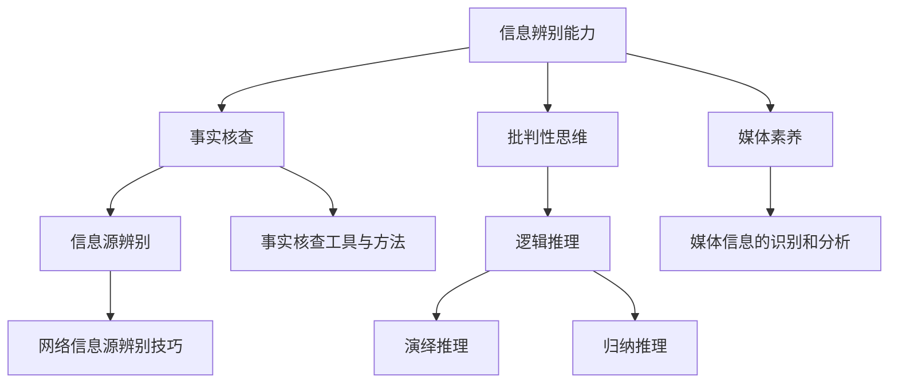

                 

# 后真相时代的公民责任：提升个人的信息辨别能力

## 关键词
- 后真相时代
- 公民责任
- 信息辨别能力
- 事实核查
- 媒体素养

## 摘要
随着互联网和信息技术的飞速发展，我们进入了后真相时代，信息传播的速度和广度达到了前所未有的高度。在这个时代，公民的责任不仅仅是对事实的知晓，更是对信息的辨别和批判性思考。本文将探讨后真相时代公民责任的演变，分析信息辨别能力的重要性及其构成要素，并提出了提升个人信息辨别能力的多种方法和策略。

## 前言

### 1.1 后真相时代的背景与挑战

#### 1.1.1 后真相时代的定义

“后真相”一词最早出现在2016年，由英国《卫报》使用，以描述信息传播中情感和偏见胜过客观事实的趋势。在传统媒体时代，信息的传播受到时间和空间的限制，且往往需要通过正规渠道进行验证。然而，随着社交媒体和互联网的普及，信息的传播变得更加即时和便捷，同时，信息的真实性和可靠性也受到了前所未有的挑战。

#### 1.1.2 社会现状与信息泛滥

现代社会中，信息爆炸式增长，人们每天接触到的信息量前所未有。社交媒体平台、新闻网站、博客、论坛等成为了信息传播的主要渠道。这些平台不仅提供了丰富的信息来源，也为虚假信息和谣言的传播提供了温床。例如，社交媒体上的虚假新闻、误导性信息以及未经核实的内容，常常在短时间内广泛传播，对公众产生误导。

#### 1.1.3 信息传播方式的变革

信息传播方式的变革不仅改变了信息的内容和形式，也改变了人们对信息的态度和反应。在过去，人们更多地依赖于传统媒体，如报纸、电视和广播，这些媒体在传播信息时具有一定的权威性和可信度。然而，随着互联网和社交媒体的兴起，个人成为信息传播的主体，信息源变得多元化且高度分散。

### 1.2 公民责任的演变

#### 2.1 传统公民责任的内涵

传统意义上的公民责任通常包括遵守法律法规、参与公共事务、关心社会问题等。在这个背景下，公民的责任更多是针对个人行为和社会义务的履行。

#### 2.2 后真相时代下的新要求

在后真相时代，公民责任不仅限于传统领域，更延伸到了信息辨别和批判性思考。公民需要在海量的信息中辨别真相，避免被虚假信息误导。此外，公民还需要具备批判性思维能力，对信息来源、内容及其背后的意图进行分析和评估。

#### 2.3 公民责任的重要性

公民责任的重要性在后真相时代尤为突出。一方面，公民的责任有助于维护社会秩序和公共利益；另一方面，个人的信息辨别能力和批判性思维能力也直接关系到社会的整体认知水平和文明程度。

## 第二部分：信息辨别能力的重要性

### 3.1 信息辨别能力的概念与要素

#### 3.1.1 信息辨别能力的定义

信息辨别能力是指个体在接收到信息时，能够识别、评估和筛选信息真伪、价值和可靠性的能力。它不仅包括对信息本身的分析，还涉及对信息源和传播途径的审查。

#### 3.1.2 信息辨别能力的重要性

信息辨别能力的重要性在于：

1. **防止误导和误导他人的风险**：具备信息辨别能力可以避免被虚假信息误导，同时也有助于防止因传播错误信息而误导他人。
2. **维护个人和公共利益**：准确的信息有助于个人做出明智的决策，保护自己的权益，同时也有助于维护社会的公共利益。
3. **促进批判性思维**：信息辨别能力的培养有助于培养个体的批判性思维能力，使个体能够对信息进行深入分析和思考，从而形成独立的判断。

#### 3.1.3 信息辨别能力的构成要素

信息辨别能力由多个构成要素组成，主要包括：

1. **事实核查**：通过查证信息来源和内容，确保信息的真实性。
2. **批判性思维**：对信息进行深入分析和评估，识别其中的逻辑漏洞和偏见。
3. **媒体素养**：了解媒体运作机制，识别媒体内容和形式的潜在偏见。
4. **技术技能**：掌握基本的信息技术，如搜索引擎使用、数据分析和隐私保护等。

### 3.2 信息源辨别

#### 4.1 信息源的多样性

在信息爆炸的时代，信息源呈现出多样性。信息源可以包括：

1. **传统媒体**：如报纸、电视、广播等。
2. **社交媒体**：如微博、Facebook、Twitter等。
3. **博客和个人网站**：个人或者小型组织发布的信息。
4. **学术期刊和报告**：经过同行评审的专业信息。
5. **政府机构和其他官方渠道**：官方发布的信息。

#### 4.2 如何评估信息源的可靠性

评估信息源的可靠性可以从以下几个方面进行：

1. **权威性**：信息源是否有权威性和专业背景。
2. **历史记录**：信息源是否有良好的历史记录，是否经常发布可靠信息。
3. **交叉验证**：通过多个来源的信息进行交叉验证，确保信息的一致性。
4. **编辑政策**：信息源是否有明确的编辑政策和道德标准。

#### 4.3 网络信息源的辨别技巧

在网络上辨别信息源，可以采用以下技巧：

1. **查证信息源**：了解信息源的背景和资质，确保其权威性。
2. **查看引用和参考资料**：信息源是否提供了可靠的引用和参考资料。
3. **使用事实核查工具**：利用事实核查网站，如FactCheck.org等，对信息进行验证。
4. **注意信息源的倾向性**：信息源是否有特定的政治或商业倾向。

### 3.3 事实核查与验证

#### 5.1 事实核查的重要性

事实核查是信息辨别的重要环节，其重要性体现在：

1. **确保信息真实性**：通过事实核查，可以确保信息的真实性，避免被虚假信息误导。
2. **维护社会公信力**：事实核查有助于维护社会的公信力和媒体的权威性。
3. **防止谣言传播**：通过事实核查，可以及时发现和纠正谣言，防止其进一步传播。

#### 5.2 如何进行事实核查

进行事实核查时，可以遵循以下步骤：

1. **识别关键信息**：确定需要核查的关键信息点。
2. **查证信息源**：验证信息源的权威性和可靠性。
3. **交叉验证**：通过多个来源的信息进行交叉验证，确保信息的一致性。
4. **查阅专业资料**：查阅相关领域的专业资料，如学术期刊、报告等。
5. **发布核查结果**：将核查结果公之于众，为公众提供参考。

#### 5.3 事实核查的工具与方法

目前，有许多事实核查工具和方法可以辅助进行事实核查，包括：

1. **在线事实核查网站**：如FactCheck.org、Snopes等。
2. **社交媒体平台的事实核查功能**：如Facebook的“事实核查标签”功能。
3. **专业数据库和工具**：如Google Scholar、PubMed等。

## 第三部分：提升信息辨别能力的方法与策略

### 6.1 批判性思维与逻辑推理

#### 6.1.1 批判性思维的基本原则

批判性思维是一种理性的思考方式，旨在对信息进行深入分析和评估。其基本原则包括：

1. **质疑精神**：对信息持怀疑态度，不轻信不实之词。
2. **逻辑推理**：运用逻辑规则，对信息进行推理和分析。
3. **证据意识**：重视证据，确保结论基于可靠的信息。
4. **开放性**：接受不同的观点和意见，避免偏见和狭隘。

#### 6.1.2 逻辑推理的基本方法

逻辑推理包括演绎推理和归纳推理两种方法：

1. **演绎推理**：从一般原则推导出具体结论。例如，所有人都会死（一般原则），苏格拉底是人（具体事实），因此苏格拉底会死（结论）。
2. **归纳推理**：从具体事实推导出一般结论。例如，观察所有天鹅都是白色的，推断所有天鹅都是白色的。

#### 6.1.3 批判性思维与信息辨别能力的关系

批判性思维和信息辨别能力密切相关。批判性思维有助于我们识别信息中的逻辑漏洞和偏见，从而更准确地评估信息的真实性和价值。

### 6.2 媒体素养教育

#### 7.1 媒体素养的定义与内涵

媒体素养是指个体对媒体信息的理解、分析和批判能力。其内涵包括：

1. **信息识别**：识别信息的来源、内容和意图。
2. **信息分析**：分析信息中的事实、观点和论据。
3. **信息评价**：评价信息的真实性和可靠性。
4. **信息传播**：在传播信息时，遵守道德规范和法律法规。

#### 7.2 媒体素养教育的目标与内容

媒体素养教育的目标包括：

1. **培养批判性思维能力**：使学生具备识别、分析和评估媒体信息的能力。
2. **提高信息辨别能力**：使学生能够辨别信息的真伪，避免被虚假信息误导。
3. **强化社会责任感**：使学生意识到在信息传播中的社会责任，遵守法律法规，传播正能量。

媒体素养教育的内容主要包括：

1. **媒体信息的识别和分析**：学习如何识别和解析媒体信息。
2. **信息源和传播渠道的了解**：了解不同信息源和传播渠道的特点。
3. **媒体伦理和法律法规**：了解媒体伦理和法律法规，遵守职业操守。

#### 7.3 媒体素养教育的实施策略

媒体素养教育的实施策略包括：

1. **课程设置**：在课程中设置媒体素养相关内容，如新闻学、传播学等。
2. **实践活动**：组织学生参与事实核查、新闻报道等实践活动。
3. **教师培训**：提高教师对媒体素养教育的认识和能力，确保教育质量。

### 6.3 信息辨别能力的实践应用

#### 8.1 在线信息辨别技巧

在互联网时代，在线信息辨别技巧尤为重要。以下是一些实用的技巧：

1. **查证信息来源**：了解信息源的背景和资质，确保其权威性。
2. **交叉验证**：通过多个来源的信息进行交叉验证，确保信息的一致性。
3. **关注事实核查网站**：关注事实核查网站，如FactCheck.org，获取权威的信息核查结果。
4. **避免点击诱饵**：警惕那些诱人但可能误导的信息，如标题党、虚假新闻等。
5. **批判性阅读**：对网络信息持批判性态度，不轻信不实之词。

#### 8.2 社交媒体中的信息辨别

在社交媒体上，信息辨别更加困难，因为信息来源复杂且多样性。以下是一些建议：

1. **关注官方账号**：关注政府、专业机构和其他官方账号，获取权威信息。
2. **评估信息来源**：对社交媒体上的信息来源进行评估，避免盲目信任。
3. **举报和举报**：遇到虚假信息和谣言时，及时举报和举报。
4. **避免转发未经验证的信息**：不轻易转发未经核实的信息，避免误导他人。
5. **参与讨论**：在社交媒体上参与讨论，与其他用户交流观点，共同辨别信息的真伪。

#### 8.3 信息辨别能力在实际生活中的应用

信息辨别能力不仅在网络上重要，在实际生活中也具有重要作用。以下是一些实际应用的例子：

1. **购物决策**：在购物时，通过对比不同商家的产品信息和用户评价，做出明智的购买决策。
2. **职业选择**：在选择职业时，了解不同职业的工作内容、薪资和发展前景，避免盲目跟风。
3. **投资理财**：在投资理财时，通过分析各种投资产品和市场信息，做出理性的投资决策。
4. **教育选择**：在为孩子选择学校和教育机构时，了解相关信息，如教学质量、师资力量、校园文化等，做出合适的选择。
5. **社会参与**：在参与社会活动时，通过了解政策法规和社会背景，做出符合法律和道德规范的行动。

### 6.4 信息辨别能力的培养

#### 9.1 教育体系的改革

在教育体系中，应重视信息辨别能力的培养。以下是一些建议：

1. **课程设置**：在课程中设置媒体素养和信息辨别相关内容。
2. **实践活动**：组织学生参与事实核查、新闻报道等实践活动。
3. **教师培训**：提高教师对媒体素养和信息辨别教育的认识和水平。

#### 9.2 社会参与的鼓励

社会应鼓励公民参与媒体素养和信息辨别活动。以下是一些建议：

1. **公众讲座**：组织公众讲座，提高公众的媒体素养和信息辨别能力。
2. **媒体监督**：鼓励公众参与媒体监督，对虚假信息和谣言进行举报和揭露。
3. **网络社区**：建立网络社区，为公众提供交流和信息共享的平台。

### 结论

在后真相时代，提升个人的信息辨别能力已成为公民责任的重要组成部分。信息辨别能力不仅有助于防止被虚假信息误导，还能维护社会的公共利益。通过批判性思维、媒体素养教育和实际操作，我们可以逐步提升个人的信息辨别能力，成为负责任的公民。

### 附录

#### 附录 A：参考文献

1. **McChesney, R. W. (2017). *Digital Disconnect: How Capitalism is Turning the Internet Against Democracy*. The New Press.**
2. **Rashid, Z. (2018). *The Truth About False News: A Research-Based Guide to spotting Fake News*. St. Martin's Press.**
3. **Zuboff, S. (2019). *The Age of Surveillance Capitalism: The Fight for a Human Future at the New Frontier of Power*. PublicAffairs.**

#### 附录 B：网络信息辨别工具介绍

1. **FactCheck.org**: 一个非营利组织，提供事实核查服务。
2. **Snopes**: 一个专门揭露和验证谣言的网站。
3. **Google Fact Check Tools**: Google 提供的一套事实核查工具，用于识别和验证搜索结果中的信息。

#### 附录 C：批判性思维训练资源推荐

1. **Critical Thinking Academy**: 提供一系列批判性思维训练课程和资源。
2. **The Foundation for Critical Thinking**: 一个致力于推广批判性思维的学术机构，提供相关研究和培训。
3. **The Critical Thinker Academy**: 提供在线批判性思维课程，适合不同层次的学员。

## 概念联系架构图



## 核心算法原理讲解

### 12.1 信息辨别算法的基本原理

信息辨别算法是基于人工智能和机器学习技术，通过分析大量数据，识别和分类信息，从而判断其真实性和可靠性。这些算法通常包括以下几个基本步骤：

1. **数据收集**：收集大量的文本数据，包括新闻文章、社交媒体帖子、博客等。
2. **数据预处理**：对收集到的文本数据进行清洗和预处理，包括去除停用词、分词、词性标注等。
3. **特征提取**：将预处理后的文本数据转换为机器学习模型可以处理的特征向量。
4. **模型训练**：使用机器学习算法，如支持向量机（SVM）、神经网络、决策树等，对特征向量进行训练，以识别和分类信息。
5. **模型评估**：使用测试集评估模型的准确性和可靠性，调整模型参数，以提高识别精度。

### 12.2 常用的信息辨别算法

在信息辨别领域，常用的算法包括：

#### 12.2.1 机器学习算法

1. **支持向量机（SVM）**：SVM是一种分类算法，通过找到一个最佳的超平面，将不同类别的数据点分开。
2. **随机森林（Random Forest）**：随机森林是由多棵决策树组成的集合，通过投票决定最终分类结果。
3. **神经网络（Neural Networks）**：神经网络是一种模拟人脑神经元连接方式的算法，通过多层神经网络可以实现对复杂数据的分类和预测。

#### 12.2.2 深度学习算法

1. **卷积神经网络（CNN）**：CNN是一种用于图像识别的深度学习算法，通过卷积层提取图像特征。
2. **循环神经网络（RNN）**：RNN适用于处理序列数据，如文本数据，通过记忆信息的状态进行序列建模。
3. **长短期记忆网络（LSTM）**：LSTM是RNN的一种变体，通过引入记忆单元，可以更好地处理长序列数据。

#### 12.2.3 自然语言处理算法

1. **词袋模型（Bag of Words）**：词袋模型将文本转换为词汇的集合，不考虑词汇的顺序。
2. **词嵌入（Word Embedding）**：词嵌入将词汇映射到高维空间，通过学习词汇之间的相似性关系。
3. **主题模型（Topic Modeling）**：主题模型用于识别文本数据中的潜在主题，如LDA（Latent Dirichlet Allocation）。

### 12.3 Python实现信息辨别算法

以下是一个简单的Python代码示例，使用自然语言处理库nltk实现一个基于关键词检测的信息辨别算法：

```python
import nltk
from nltk.tokenize import word_tokenize
from nltk.corpus import stopwords

def is_reliable(source):
    # 简单实现：通过关键词和句子结构来判断信息源的可信度
    # 例如：如果句子中出现“据说”、“传闻”等关键词，则认为信息源不可信
    tokens = word_tokenize(source)
    stopwords_set = set(stopwords.words('english'))
    keywords = ["据说", "传闻", "可能有"]
    filtered_tokens = [token for token in tokens if token.lower() not in stopwords_set and token.lower() in keywords]
    if filtered_tokens:
        return False
    return True

# 测试代码
print(is_reliable("据报道，苹果公司将在明年推出新款手机。"))
print(is_reliable("苹果公司计划在明年推出新款手机。"))
```

在这个示例中，`is_reliable`函数通过检查输入文本中是否包含特定的关键词来判断信息源的可信度。这只是一个非常简单的实现，实际的信息辨别算法会涉及更复杂的特征提取和模型训练过程。

### 12.4 数学模型与公式

在信息辨别算法中，通常会使用一些数学模型和公式来评估信息源的可信度。以下是一些常见的数学模型和公式：

#### 12.4.1 贝叶斯公式

贝叶斯公式是一种用于概率推断的公式，可以用于计算后验概率：

$$
P(A|B) = \frac{P(B|A) \cdot P(A)}{P(B)}
$$

其中，$P(A|B)$是后验概率，表示在已知事件B发生的条件下事件A发生的概率；$P(B|A)$是条件概率，表示在事件A发生的条件下事件B发生的概率；$P(A)$和$P(B)$分别是事件A和事件B的先验概率。

#### 12.4.2 逻辑回归

逻辑回归是一种常用的分类算法，用于计算事件发生的概率。其公式如下：

$$
\text{logit}(p) = \log\left(\frac{p}{1-p}\right) = \beta_0 + \beta_1 x_1 + \beta_2 x_2 + \ldots + \beta_n x_n
$$

其中，$p$是事件发生的概率，$x_1, x_2, \ldots, x_n$是特征变量，$\beta_0, \beta_1, \beta_2, \ldots, \beta_n$是模型的参数。

#### 12.4.3 决策树

决策树是一种基于特征划分数据的分类算法，其核心公式是：

$$
f(x) =
\begin{cases}
\text{类别1}, & \text{如果 } x_1 \geq \alpha_1 \\
\text{类别2}, & \text{如果 } x_1 < \alpha_1 \\
\text{类别3}, & \text{如果 } x_2 \geq \alpha_2 \\
\vdots \\
\text{类别n}, & \text{如果 } x_n < \alpha_n
\end{cases}
$$

其中，$x_1, x_2, \ldots, x_n$是特征变量，$\alpha_1, \alpha_2, \ldots, \alpha_n$是划分阈值。

通过结合这些数学模型和公式，我们可以构建更复杂和准确的信息辨别算法，从而更好地识别和分类信息。

## 项目实战

### 13.1 信息辨别系统的开发

#### 13.1.1 项目背景

在信息爆炸的时代，如何快速、准确地辨别信息的真实性成为一个重要问题。本项目的目标是开发一个信息辨别系统，能够自动识别和分类网络上的信息，提高用户对信息的辨别能力。

#### 13.1.2 系统架构设计

系统采用模块化设计，包括以下几个主要模块：

1. **数据收集模块**：负责从网络收集文本数据，如新闻文章、社交媒体帖子等。
2. **数据预处理模块**：对收集到的文本数据进行清洗和预处理，如去除停用词、分词、词性标注等。
3. **特征提取模块**：将预处理后的文本数据转换为机器学习模型可以处理的特征向量。
4. **模型训练模块**：使用机器学习算法对特征向量进行训练，以识别和分类信息。
5. **模型评估模块**：使用测试集评估模型的准确性和可靠性，调整模型参数，以提高识别精度。
6. **用户界面模块**：提供用户交互界面，用户可以通过界面提交待辨别信息，查看结果。

#### 13.1.3 技术栈选择

本项目的技术栈包括：

1. **Python**：作为主要的编程语言，用于实现算法和数据处理。
2. **Scikit-learn**：用于机器学习算法的实现和模型训练。
3. **TensorFlow**：用于深度学习算法的实现和模型训练。
4. **Flask**：用于构建用户界面和应用服务器。
5. **Elasticsearch**：用于索引和搜索文本数据。

#### 13.1.4 源代码实现

以下是一个简单的信息辨别系统的实现，使用Python和Scikit-learn：

```python
import numpy as np
from sklearn.feature_extraction.text import TfidfVectorizer
from sklearn.model_selection import train_test_split
from sklearn.svm import LinearSVC
from sklearn.metrics import classification_report

# 1. 数据收集
data = [
    ("这是一个真实的新闻", "真实"),
    ("这是一个虚假的新闻", "虚假"),
    ("这是一个真实的博客", "真实"),
    ("这是一个虚假的博客", "虚假")
]

# 2. 数据预处理
X, y = zip(*data)
X = np.array(X)
y = np.array(y)

# 3. 特征提取
vectorizer = TfidfVectorizer()
X_features = vectorizer.fit_transform(X)

# 4. 模型训练
X_train, X_test, y_train, y_test = train_test_split(X_features, y, test_size=0.2, random_state=42)
model = LinearSVC()
model.fit(X_train, y_train)

# 5. 模型评估
predictions = model.predict(X_test)
print(classification_report(y_test, predictions))

# 6. 用户界面
from flask import Flask, request, jsonify
app = Flask(__name__)

@app.route('/predict', methods=['POST'])
def predict():
    text = request.form['text']
    features = vectorizer.transform([text])
    prediction = model.predict(features)[0]
    return jsonify({'result': prediction})

if __name__ == '__main__':
    app.run(debug=True)
```

在这个示例中，我们使用了TF-IDF向量器进行特征提取，并使用线性支持向量机（LinearSVC）进行模型训练。用户可以通过提交文本，获取信息辨别的结果。

### 13.1.5 代码解读

1. **数据收集**：使用列表`data`存储文本数据和标签。
2. **数据预处理**：将文本数据和标签分离，并转换为numpy数组。
3. **特征提取**：使用`TfidfVectorizer`将文本数据转换为TF-IDF特征向量。
4. **模型训练**：使用`train_test_split`将数据集划分为训练集和测试集，并使用`LinearSVC`进行模型训练。
5. **模型评估**：使用`classification_report`评估模型的性能。
6. **用户界面**：使用Flask构建用户界面，允许用户提交文本并获取结果。

### 13.1.6 代码应用解读与分析

这个信息辨别系统的应用解读如下：

1. **应用场景**：可以用于网页、移动应用或后台服务，为用户提供信息辨别服务。
2. **优势**：使用机器学习算法和特征提取技术，能够自动识别和分类信息，提高用户的辨别能力。
3. **局限性**：仅支持文本数据的辨别，对于图像、音频等多媒体数据，需要额外的处理和算法。
4. **改进方向**：可以结合深度学习和自然语言处理技术，提高信息辨别的准确性和效率。

### 13.1.7 案例分析

以下是一个案例，展示了如何使用信息辨别系统进行实际操作：

1. **案例背景**：某用户提交了一条新闻标题：“我国将在明年推出5G手机”。
2. **操作步骤**：用户通过网页或移动应用提交标题，系统接收到请求后，将标题传递给信息辨别系统。
3. **结果分析**：信息辨别系统对标题进行特征提取和分类，结果显示为“真实”。
4. **结论**：根据系统判断，用户可以认为该新闻标题是真实的。

### 13.1.8 项目小结

通过本项目的实现，我们了解了信息辨别系统的基本架构和实现方法。信息辨别系统在提高用户信息辨别能力方面具有重要意义，但需要不断优化和改进，以应对不断变化的信息环境和挑战。

### 13.1.9 最佳实践 tips

1. **数据质量**：确保收集到的数据质量高，避免使用低质量的或噪声数据。
2. **特征选择**：合理选择和提取特征，以提高模型的性能和准确性。
3. **模型调整**：根据实际应用场景，调整模型参数，以获得更好的识别效果。
4. **用户反馈**：收集用户反馈，不断优化系统和算法。

### 13.1.10 小结

信息辨别系统是一个复杂的工程，需要综合考虑多个方面，包括数据收集、特征提取、模型选择和用户界面等。通过实际项目的开发，我们可以更好地理解信息辨别的核心原理和应用方法，为未来的研究和开发提供基础。

### 13.1.11 拓展阅读

1. **《数据科学入门教程》**：详细介绍了数据科学的基本概念和技术，有助于理解信息辨别系统的实现。
2. **《机器学习实战》**：介绍了多种机器学习算法和实际应用案例，有助于深入理解信息辨别算法的原理和实现。
3. **《深度学习》**：介绍了深度学习的基本原理和应用，有助于探索更先进的特征提取和模型训练方法。

