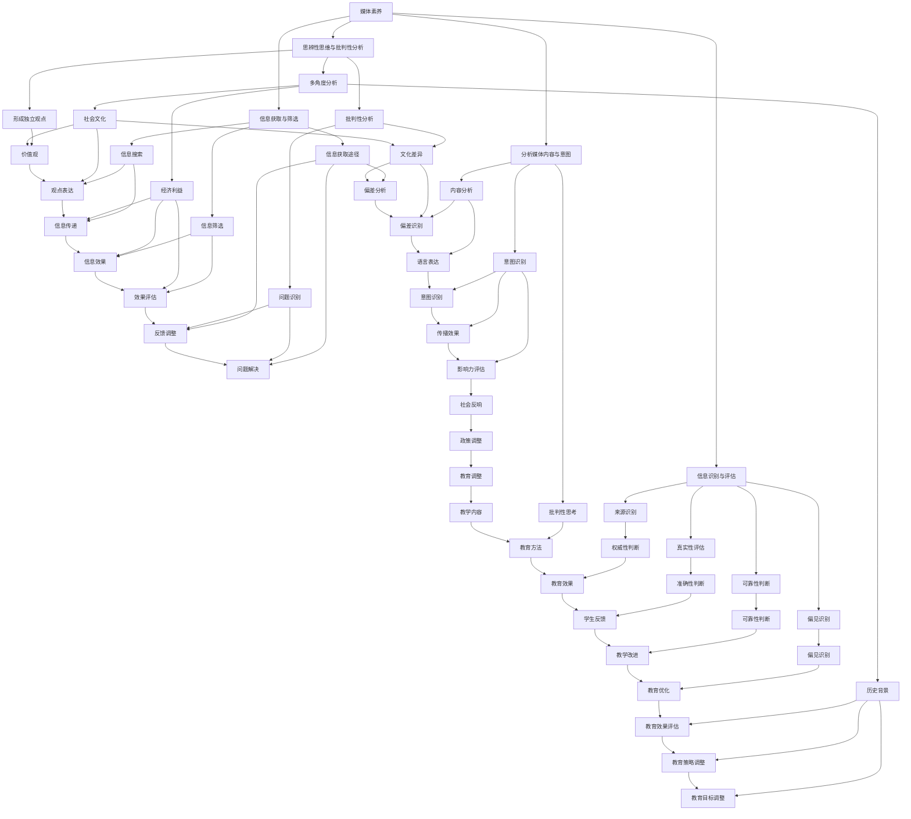

                 

### 1. 《后真相时代的媒体素养教育》目录大纲

#### 第1章：后真相时代的媒体背景与挑战

##### 1.1 后真相时代的定义与特征

- **1.1.1** 媒体环境的变迁
  - 在后真相时代，传统媒体逐渐被数字化媒体所取代，信息传播速度更快、范围更广。同时，社交媒体的兴起使得信息的真实性和可信度受到质疑。

- **1.1.2** 后真相时代的传播特点
  - 信息传播的碎片化、情感化和即时性，使得人们更容易受到虚假信息和情绪化内容的影响。此外，虚假信息和谣言的传播速度远超真实信息的传播速度。

##### 1.2 媒体素养教育的重要性

- **1.2.1** 媒体素养教育的概念
  - 媒体素养教育是指培养学生识别、评估和批判媒体信息的能力，帮助他们成为一个理性、独立的思考者。

- **1.2.2** 媒体素养教育的作用与意义
  - 媒体素养教育有助于提高公众的信息素养，减少虚假信息和谣言的传播，促进社会的和谐与稳定。

##### 1.3 后真相时代下的媒体素养教育挑战

- **1.3.1** 信息过载与辨别真伪的困难
  - 在信息爆炸的时代，人们面对海量信息往往难以辨别真伪，这给媒体素养教育带来了巨大挑战。

- **1.3.2** 媒体素养教育在实践中的难题
  - 如何在课程设置、教学方法等方面进行创新，以提高学生的媒体素养，是一个亟待解决的问题。

#### 第2章：媒体素养教育的核心概念

##### 2.1 媒体素养的基本要素

- **2.1.1** 信息识别与评估
  - 教育学生如何识别媒体信息的来源、真实性、可靠性和偏见。

- **2.1.2** 思辨性思维与批判性分析
  - 培养学生从多个角度分析媒体信息，形成独立的判断和观点。

##### 2.2 媒体素养的核心技能

- **2.2.1** 搜索与筛选信息
  - 教授学生如何利用搜索引擎、数据库等工具高效获取信息。

- **2.2.2** 分析媒体内容与意图
  - 培养学生对媒体内容的分析能力，理解媒体传播者的意图和动机。

##### 2.3 媒体素养教育的目标与内容

- **2.3.1** 教育目标的制定
  - 明确学生应具备的媒体素养能力，如信息识别、评估、批判性思维等。

- **2.3.2** 教育内容的多样化
  - 根据学生的年龄、兴趣和学科特点，设计丰富多样的教育内容。

---

**核心概念与联系**

### 媒体素养

$$
\text{媒体素养} = \left[\begin{array}{ccc}
\text{信息识别与评估} & \text{思辨性思维与批判性分析} & \text{信息获取与筛选} \\
\text{分析媒体内容与意图} & \text{多样化教育内容} & \text{创新教学方法} \\
\end{array}\right]
$$

- **信息识别与评估**：指对信息的来源、真实性、可靠性进行判断和评估，是媒体素养的核心要素之一。
- **思辨性思维与批判性分析**：强调对信息内容进行深入分析和思考，培养独立判断能力，是媒体素养的关键。
- **信息获取与筛选**：指在大量信息中找到有价值的信息，并通过有效途径进行获取，是媒体素养的基础。

通过上述章节的设置，本文将系统地探讨后真相时代的媒体背景与挑战，深入分析媒体素养教育的核心概念和技能，探讨媒体素养教育在不同教育阶段的实践，以及数字时代和社交媒体背景下的媒体素养教育策略。希望本文能为媒体素养教育的实施提供有益的参考和启示。****### 后真相时代的媒体背景与挑战

#### 1.1 后真相时代的定义与特征

**后真相时代（Post-Truth Era）**，这一概念最早由英国政治学者迈克尔·罗伯茨（Michael Roberts）于2016年提出，用以描述信息传播和公共舆论中事实被情感、个人信仰和主观偏见所支配的现象。在传统媒体时代，事实和真相是信息传播的核心，但在后真相时代，情感和观点的传播速度和影响力远超事实本身。

**1.1.1 媒体环境的变迁**

- **数字化媒体的兴起**：随着互联网和移动设备的普及，传统媒体逐渐被数字化媒体所取代。数字化媒体具有传播速度快、范围广、互动性强等特点，使得信息传播变得更加即时化和全球化。

- **社交媒体的崛起**：社交媒体平台如Facebook、Twitter、微博等，已经成为信息传播的主要渠道。这些平台上的信息传播往往具有情感化和碎片化的特点，用户更容易受到情绪化和主观化内容的影响。

- **信息过载**：数字化媒体和社交媒体的普及，使得人们每天接收到的信息量成倍增加，这导致信息过载现象愈发严重。信息过载使得人们难以辨别信息的真伪，也加剧了后真相时代的困境。

**1.1.2 后真相时代的传播特点**

- **情感化传播**：在后真相时代，情感化的内容往往更能引起用户的共鸣和关注。虚假信息和谣言往往通过煽动情感的方式迅速传播，使得真相难以被揭示。

- **即时性传播**：数字化媒体和社交媒体的即时性传播特点，使得信息可以在瞬间扩散到全球，这也使得虚假信息和谣言的传播速度远超真实信息的传播速度。

- **碎片化传播**：社交媒体上的信息往往以碎片化的形式存在，这使得用户难以全面、系统地获取信息。碎片化传播也导致信息的真实性和完整性受到质疑。

#### 1.2 媒体素养教育的重要性

**1.2.1 媒体素养教育的概念**

媒体素养教育是指培养学生识别、评估和批判媒体信息的能力，帮助他们成为一个理性、独立的思考者。媒体素养教育不仅包括对媒体信息的识别和评估，还包括对媒体信息的批判性分析和思辨性思考。

**1.2.2 媒体素养教育的作用与意义**

- **提高信息素养**：在信息爆炸的时代，媒体素养教育有助于提高公众的信息素养，使人们能够辨别信息的真伪和可靠性。

- **减少虚假信息和谣言的传播**：通过媒体素养教育，学生可以学会如何识别和评估媒体信息，从而减少虚假信息和谣言的传播。

- **培养理性思考能力**：媒体素养教育鼓励学生从多个角度分析媒体信息，形成独立的判断和观点，培养理性思考能力。

- **促进社会的和谐与稳定**：通过媒体素养教育，可以培养公众的批判性思维，减少社会矛盾和冲突，促进社会的和谐与稳定。

#### 1.3 后真相时代下的媒体素养教育挑战

**1.3.1 信息过载与辨别真伪的困难**

- **信息过载**：在数字化媒体和社交媒体的背景下，人们每天接收到的信息量巨大，这使得辨别信息的真伪和可靠性变得更加困难。

- **辨别真伪的困难**：虚假信息和谣言的传播速度远超真实信息，这使得人们难以在短时间内辨别信息的真伪。

**1.3.2 媒体素养教育在实践中的难题**

- **课程设置的挑战**：如何设计适合不同年龄段和学科特点的媒体素养教育课程，是一个亟待解决的问题。

- **教学方法与策略的创新**：传统的媒体素养教育方法可能无法应对后真相时代的信息环境，需要探索新的教学方法和策略。

- **教师的专业素养**：教师需要具备较高的媒体素养，才能有效地进行媒体素养教育。

通过上述分析，我们可以看到后真相时代的媒体背景和挑战对媒体素养教育提出了新的要求和挑战。在接下来的章节中，我们将进一步探讨媒体素养教育的核心概念和技能，以及如何在学校和家庭等不同场景中实施媒体素养教育。****### 媒体素养教育的核心概念

在探讨后真相时代下媒体素养教育的重要性之后，我们接下来将深入分析媒体素养教育的核心概念，这些概念构成了培养学生信息素养和批判性思维的基础。

#### 2.1 媒体素养的基本要素

**2.1.1 信息识别与评估**

信息识别与评估是媒体素养教育的核心要素之一。它涉及到学生对媒体信息的来源、真实性、可靠性和偏见进行判断和评估的能力。具体包括以下几个方面的内容：

- **来源识别**：学生需要学会判断信息来源的权威性、可信度和可靠性。例如，新闻来源是否为正规媒体，社交平台上的信息发布者是否有专业的资质和背景。

- **真实性评估**：学生需要判断信息的真实性和准确性。例如，通过多渠道比对信息内容，判断信息是否存在篡改或误导。

- **可靠性判断**：学生需要评估信息的来源是否可靠，信息是否经过多方验证，是否有科学的证据支持。

- **偏见识别**：学生需要识别信息中可能存在的偏见和主观倾向，从而避免被情绪化和主观化内容所误导。

**2.1.2 思辨性思维与批判性分析**

思辨性思维与批判性分析是培养学生独立判断能力的关键。它要求学生能够从多个角度分析媒体信息，形成独立的判断和观点。具体包括以下几个方面的内容：

- **多角度分析**：学生需要学会从多个维度分析媒体信息，如历史背景、社会文化、经济利益等，从而全面理解信息内容。

- **批判性分析**：学生需要具备批判性分析能力，对媒体信息的内容、表达方式和传播意图进行深入剖析，从而识别潜在的问题和偏差。

- **形成独立观点**：学生需要通过批判性思维，形成独立的观点和判断，而不是盲目接受媒体信息。

#### 2.2 媒体素养的核心技能

**2.2.1 搜索与筛选信息**

信息获取与筛选是媒体素养教育的重要技能之一。它涉及到学生在大量信息中找到有价值的信息，并通过有效途径进行获取。具体包括以下几个方面的内容：

- **信息搜索**：学生需要掌握如何使用搜索引擎、数据库等工具进行高效的信息搜索，获取所需的信息。

- **信息筛选**：学生需要学会在大量信息中筛选出有价值的信息，避免信息过载和冗余。

- **信息获取途径**：学生需要了解不同信息获取途径的特点和优势，如图书馆资源、互联网数据库、专业人士访谈等。

**2.2.2 分析媒体内容与意图**

分析媒体内容与意图是学生理解媒体传播者意图和动机的重要技能。它要求学生能够深入理解媒体内容的表达方式和传播意图。具体包括以下几个方面的内容：

- **内容分析**：学生需要学会分析媒体内容的具体表述、语言风格、图表使用等，从而理解信息传递的主要观点和意图。

- **意图识别**：学生需要识别媒体传播者的意图和动机，如商业利益、政治宣传、社会影响等。

- **批判性思考**：学生需要批判性地思考媒体内容的潜在影响，从而形成独立、理性的判断。

#### 2.3 媒体素养教育的目标与内容

**2.3.1 教育目标的制定**

媒体素养教育的目标应明确学生应具备的能力，如信息识别、评估、批判性思维等。具体包括以下几个方面：

- **信息识别能力**：学生应能够识别信息的来源、真实性、可靠性以及可能的偏见。
- **评估能力**：学生应能够对信息进行评估，判断其真实性和价值。
- **批判性思维能力**：学生应能够从多个角度分析媒体信息，形成独立的判断和观点。
- **信息获取与筛选能力**：学生应能够高效地获取和筛选信息，避免信息过载和冗余。

**2.3.2 教育内容的多样化**

媒体素养教育内容应多样化，以适应不同年龄段和学科特点。具体包括以下几个方面：

- **基础知识教育**：针对小学生和初中生，应加强基础信息的识别与评估教育，培养他们的基本信息素养。
- **专题讲座和实践活动**：针对高中生和大学生，可以通过专题讲座和实践活动，深入探讨媒体信息的批判性分析和思辨性思维。
- **跨学科教育**：将媒体素养教育融入不同学科的教学中，如社会科学、信息技术等，培养学生的综合素养。

通过上述对媒体素养教育核心概念的分析，我们可以看到，媒体素养教育不仅仅是传授知识，更是培养学生批判性思维和信息素养的过程。在接下来的章节中，我们将探讨媒体素养教育在学校和家庭中的实践，以及数字时代和社交媒体背景下的媒体素养教育策略。****### 学校中的媒体素养教育实践

在学校教育体系中，媒体素养教育作为培养学生批判性思维和信息素养的重要途径，其地位和作用越来越受到重视。以下将从课程设置、教学方法、教学资源等方面探讨学校中的媒体素养教育实践。

#### 3.1 媒体素养教育在学校中的地位

**3.1.1 课程设置的必要性**

随着后真相时代的到来，学校教育中媒体素养教育的地位愈发重要。传统的课程设置往往侧重于知识的传授，而忽视了培养学生批判性思维和信息识别能力。因此，有必要在课程中融入媒体素养教育，使其成为学校教育的重要组成部分。

- **基础教育阶段**：在小学和初中阶段，可以设置专门的媒体素养课程，让学生了解基本的媒体信息识别与评估方法，培养他们的信息素养。
- **高中和大学阶段**：在高中和大学阶段，可以开设选修课或专题讲座，深入探讨媒体素养教育的各个方面，如信息批判性分析、媒体内容的解读等。

**3.1.2 教学方法与策略**

在媒体素养教育中，采用多样化的教学方法与策略至关重要。以下几种教学方法值得尝试：

- **案例教学法**：通过分析具体的媒体案例，让学生深入了解媒体信息的真实性和可靠性，培养他们的批判性思维。
- **项目式学习**：让学生参与实际的项目，如新闻采访、媒体分析等，通过实践提高他们的媒体素养。
- **讨论与辩论**：组织学生进行讨论和辩论，鼓励他们表达自己的观点，培养他们的思辨能力和表达能力。

**3.2 媒体素养教育的教学资源**

**3.2.1 教学工具的应用**

在媒体素养教育中，教学工具的应用可以大大提高教学效果。以下几种教学工具值得推荐：

- **多媒体教学资源**：如视频、音频、图片等，可以生动地呈现媒体信息，帮助学生更好地理解和掌握媒体素养知识。
- **在线学习平台**：如MOOC（大规模开放在线课程）、学习管理系统等，可以提供丰富的学习资源和互动机会，让学生自主学习。
- **社交媒体工具**：如微博、微信等，可以用于组织在线讨论、分享学习心得等，增强学生的互动性和参与度。

**3.2.2 教学资源的获取与利用**

教师需要积极获取和利用各种教学资源，以提高教学效果。以下几种途径值得推荐：

- **图书馆资源**：利用图书馆的书籍、期刊、数据库等资源，获取丰富的媒体素养教育资料。
- **互联网资源**：通过互联网搜索、下载各种多媒体教学资源，丰富课堂内容。
- **专业机构与组织的资源**：如新闻媒体、教育部门、学术研究机构等，可以提供专业的媒体素养教育资源和案例。

**3.3 媒体素养教育的案例研究**

**3.3.1 国内外媒体素养教育的成功案例**

在全球范围内，许多学校和地区已经成功开展了媒体素养教育，以下是一些典型案例：

- **美国**：美国一些学校在课程中融入了媒体素养教育，通过案例分析和项目式学习，提高了学生的信息识别与评估能力。
- **英国**：英国政府推出了一系列媒体素养教育项目，如“媒介素养基金”（Media Literacy Fund），支持学校和社区开展媒体素养教育活动。
- **芬兰**：芬兰教育部门将媒体素养教育纳入了国家课程体系，通过多种教学方法和资源，培养了学生的批判性思维和信息素养。

**3.3.2 案例分析与实践借鉴**

通过对这些成功案例的分析，我们可以得出以下实践借鉴：

- **课程设置的多样化**：根据不同年龄段和学科特点，设置丰富多样的课程内容，满足学生的需求。
- **教学方法与策略的创新**：采用多样化的教学方法，如案例教学法、项目式学习等，提高学生的参与度和学习效果。
- **教学资源的整合与利用**：积极获取和利用各种教学资源，提高教学效果。

通过上述分析和实践借鉴，我们可以看到学校中的媒体素养教育在课程设置、教学方法、教学资源等方面都有很多值得借鉴的经验。在接下来的章节中，我们将探讨数字时代和社交媒体背景下的媒体素养教育策略，以及家庭和社区中的媒体素养教育实践。****### 数字时代的媒体素养教育

#### 4.1 数字媒体素养的特点

**4.1.1 数字媒体的传播方式**

数字媒体具有传播速度快、覆盖范围广、交互性强等特点，这使得传统媒体无法比拟。在数字时代，信息传播的方式发生了巨大变化，主要体现在以下几个方面：

- **即时性**：数字媒体可以实现信息的实时传播，用户可以随时随地获取最新的信息。
- **互动性**：数字媒体具有高度的互动性，用户不仅能够接收信息，还可以通过评论、点赞、分享等方式进行互动。
- **个性化**：数字媒体可以根据用户的兴趣和行为进行个性化推荐，提供个性化的信息服务。

**4.1.2 数字媒体素养的需求**

数字媒体素养是指在数字时代背景下，个体在获取、处理、分析和评估数字媒体信息时所应具备的能力。随着数字媒体的普及，数字媒体素养的需求也越来越迫切，具体体现在以下几个方面：

- **信息识别能力**：在数字媒体环境中，个体需要具备识别信息来源、评估信息真实性和可靠性的能力，避免受到虚假信息和谣言的误导。
- **信息处理能力**：个体需要掌握如何高效地处理和利用数字媒体信息，如搜索、筛选、整合信息等。
- **批判性思维能力**：个体需要具备批判性思维能力，能够从多个角度分析数字媒体信息，形成独立的判断和观点。

#### 4.2 数字时代下的媒体素养教育策略

**4.2.1 教育内容的更新**

为了适应数字时代的需求，媒体素养教育的内容需要不断更新和优化。以下是一些建议：

- **增加数字媒体信息的识别与评估**：在课程中增加关于数字媒体信息来源、真实性、可靠性和偏见等方面的内容，帮助学生识别和评估数字媒体信息。
- **强调批判性思维**：在课程中融入批判性思维训练，培养学生的独立判断和思考能力，使他们能够对数字媒体信息进行深入分析和评价。
- **引入新工具和新方法**：利用数字技术，如搜索引擎、数据分析工具等，帮助学生高效地获取和处理数字媒体信息。

**4.2.2 教学方法的创新**

在数字时代，教学方法也需要与时俱进，以适应数字媒体素养教育的需求。以下是一些建议：

- **项目式学习**：通过项目式学习，让学生在解决实际问题的过程中，培养他们的数字媒体素养。例如，可以组织学生进行新闻采访、社交媒体分析等。
- **案例教学法**：通过分析具体的数字媒体案例，让学生深入了解数字媒体信息的真实性和可靠性，培养他们的批判性思维。
- **合作学习**：通过小组合作学习，让学生在讨论和分享中，提高他们的数字媒体素养。

#### 4.3 数字媒体素养教育的实践

**4.3.1 数字媒体素养教育的项目设计**

为了有效实施数字媒体素养教育，可以设计以下项目：

- **数字新闻采访**：让学生模拟新闻记者的角色，进行实际新闻采访，通过实践提高他们的信息识别和评估能力。
- **社交媒体分析**：让学生分析社交媒体上的信息传播和用户互动，培养他们的信息处理能力和批判性思维。
- **数字媒体创作**：鼓励学生创作自己的数字媒体作品，如博客、视频、社交媒体帖子等，通过创作和实践提高他们的数字媒体素养。

**4.3.2 数字媒体素养教育的效果评估**

为了评估数字媒体素养教育的效果，可以采用以下方法：

- **定量评估**：通过问卷调查、成绩评估等方式，量化学生数字媒体素养的提升情况。
- **定性评估**：通过访谈、观察等方式，深入分析学生在数字媒体素养方面的变化和进步。
- **案例分析**：选择典型的学生案例，分析他们在数字媒体素养方面的成长和收获。

通过上述对数字时代下媒体素养教育特点、策略和实践的探讨，我们可以看到，数字媒体素养教育在内容、方法和实践中都有很多创新和改进的空间。在接下来的章节中，我们将继续探讨社交媒体中的媒体素养教育，以及家庭和社区中的媒体素养教育实践。****### 社交媒体中的媒体素养教育

#### 5.1 社交媒体与媒体素养的关系

**5.1.1 社交媒体的影响**

社交媒体平台如Facebook、Twitter、微博等，已经成为信息传播和交流的重要渠道。然而，社交媒体的兴起也带来了诸多问题，如虚假信息的传播、网络欺凌、隐私泄露等。这些问题对用户的媒体素养提出了更高的要求。

- **虚假信息的传播**：社交媒体上的信息繁杂多样，用户往往难以辨别真伪。虚假信息、谣言的传播速度远超真实信息的传播速度，给公众带来了严重的误导。
- **网络欺凌**：社交媒体上的匿名性使得网络欺凌现象日益严重，对用户的心理健康和社会关系产生了负面影响。
- **隐私泄露**：社交媒体平台上的个人信息泄露问题日益突出，用户的隐私安全受到严重威胁。

**5.1.2 社交媒体素养的重要性**

社交媒体素养是指在社交媒体环境中，个体在获取、处理、分析和评估信息时所应具备的能力。培养社交媒体素养有助于提高用户的媒体素养，减少虚假信息和谣言的传播，维护网络环境的健康发展。

- **信息识别能力**：用户需要学会识别社交媒体信息的真实性和可靠性，避免受到虚假信息的误导。
- **隐私保护意识**：用户需要了解如何在社交媒体上保护个人隐私，避免个人信息泄露。
- **批判性思维能力**：用户需要具备批判性思维能力，对社交媒体上的信息进行深入分析和评估，形成独立的判断和观点。

#### 5.2 社交媒体素养教育的策略

**5.2.1 社交媒体素养教育的目标**

社交媒体素养教育的目标应包括以下几个方面：

- **提高信息识别能力**：培养学生识别社交媒体信息真实性和可靠性的能力，减少虚假信息的传播。
- **增强隐私保护意识**：教育学生如何在社交媒体上保护个人隐私，避免隐私泄露。
- **培养批判性思维能力**：培养学生对社交媒体信息进行批判性分析和评估的能力，形成独立的判断和观点。

**5.2.2 社交媒体素养教育的方法**

为了实现上述目标，可以采用以下教学方法：

- **案例教学**：通过分析具体的社交媒体案例，让学生了解虚假信息的传播方式、网络欺凌的现象等，培养他们的信息识别能力。
- **角色扮演**：让学生模拟社交媒体用户，进行角色扮演，体验社交媒体中的各种情境，提高他们的实际操作能力。
- **讨论与辩论**：组织学生进行讨论和辩论，鼓励他们表达自己的观点，培养他们的批判性思维和表达能力。

#### 5.3 社交媒体素养教育的案例

**5.3.1 社交媒体素养教育的成功案例**

在全球范围内，许多教育机构和企业已经成功开展了社交媒体素养教育，以下是一些典型案例：

- **美国**：美国一些学校和企业推出了社交媒体素养培训课程，通过案例分析和实践操作，提高了员工的社交媒体素养。
- **欧洲**：欧盟推出了一系列社交媒体素养教育项目，如“数字素养与媒体素养计划”（Digital Competence and Media Literacy），支持学校和社区开展相关教育活动。
- **中国**：中国一些高校和企业也开展了社交媒体素养教育，通过线上线下相结合的方式，提高了学生的社交媒体素养。

**5.3.2 案例分析与反思**

通过对这些成功案例的分析，我们可以得出以下反思：

- **课程设置的多样性**：根据不同年龄段和学科特点，设置丰富多样的社交媒体素养教育课程，满足学生的需求。
- **教学方法与策略的创新**：采用多样化的教学方法，如案例教学、角色扮演、讨论与辩论等，提高学生的参与度和学习效果。
- **社会合作的强化**：学校、企业、社区等各方共同参与，形成合力，共同推动社交媒体素养教育的实施。

通过上述对社交媒体与媒体素养关系、教育策略和成功案例的探讨，我们可以看到，社交媒体素养教育在培养用户信息识别、隐私保护和批判性思维等方面具有重要意义。在接下来的章节中，我们将继续探讨家庭和社区中的媒体素养教育，以及政策与法规在媒体素养教育中的作用。****### 家庭与社区中的媒体素养教育

#### 6.1 家庭在媒体素养教育中的作用

**6.1.1 家庭教育的模式**

家庭是孩子最早接触媒体的环境，因此，家长在孩子的媒体素养教育中扮演着重要角色。家庭教育的模式主要包括以下几个方面：

- **引导式教育**：家长可以通过引导孩子观看适合的媒体内容，如儿童节目、动画片等，帮助孩子建立正确的媒体观念。
- **互动式教育**：家长可以与孩子一起观看媒体内容，引导孩子提出问题、发表观点，培养孩子的批判性思维。
- **体验式教育**：家长可以带孩子参加与媒体相关的实践活动，如参观电视台、制作自己的小视频等，让孩子在实践中提高媒体素养。

**6.1.2 家庭教育的挑战**

尽管家庭教育在媒体素养教育中具有重要意义，但家长在实施过程中也面临一些挑战：

- **家长自身素养不足**：一些家长自身缺乏媒体素养，难以有效地引导孩子。
- **时间精力限制**：家长可能在繁忙的工作和生活中难以抽出时间进行媒体素养教育。
- **媒体内容选择困难**：家长在为孩子选择适合的媒体内容时，可能会面临选择困难。

**6.2 社区在媒体素养教育中的作用**

**6.2.1 社区媒体素养教育的实践**

社区是家庭以外的另一个重要媒体素养教育场所，社区可以在以下几个方面发挥重要作用：

- **组织教育活动**：社区可以组织各种形式的媒体素养教育活动，如讲座、工作坊、展览等，提高居民的媒体素养。
- **提供资源支持**：社区可以提供各种媒体素养教育资源，如图书、视频、网站等，方便居民学习。
- **建立互助网络**：社区可以建立家长互助网络，家长之间相互交流媒体素养教育的经验和心得。

**6.2.2 社区媒体素养教育的策略**

为了有效实施社区媒体素养教育，可以采取以下策略：

- **多元化的教育形式**：根据社区居民的年龄、兴趣和需求，提供多样化的媒体素养教育形式，如讲座、工作坊、线上线下结合等。
- **合作共赢的原则**：鼓励学校、家庭、社区、企业等各方合作，共同推动媒体素养教育的实施。
- **注重实践体验**：通过实践活动，如参观电视台、采访记者等，让居民在实践中提高媒体素养。

**6.3 家庭与社区合作教育模式**

**6.3.1 家庭与学校合作的方式**

家庭与学校是媒体素养教育的两个重要环节，通过合作可以形成教育的合力。以下是一些家庭与学校合作的方式：

- **家长会**：定期召开家长会，让家长了解学校的媒体素养教育计划和活动，促进家校沟通。
- **教师家访**：教师可以定期进行家访，了解学生的家庭媒体环境，给予家长指导和建议。
- **共同活动**：家庭和学校可以共同组织媒体素养教育活动，如亲子阅读、亲子互动游戏等。

**6.3.2 家庭与社区合作的案例**

以下是一些家庭与社区合作的案例：

- **社区媒体素养讲座**：社区组织媒体专家或专业人士，为居民提供媒体素养讲座，提高居民的媒体素养。
- **社区媒体创作比赛**：社区举办媒体创作比赛，鼓励居民参与，提高他们的媒体创作能力和素养。
- **社区媒体素养工作坊**：社区定期举办媒体素养工作坊，教授居民如何识别和评估媒体信息，提高他们的批判性思维。

通过家庭与社区的合作，可以形成良好的媒体素养教育环境，促进家庭成员和社区居民的全面发展。在接下来的章节中，我们将探讨政策与法规在媒体素养教育中的作用。****### 政策与法规在媒体素养教育中的作用

#### 7.1 媒体素养教育政策的制定与实施

**7.1.1 政策背景与目标**

在全球范围内，随着数字化媒体的发展和社交媒体的普及，媒体素养教育的重要性日益凸显。许多国家和地区开始制定相关政策，以推动媒体素养教育的实施。政策背景主要包括以下几个方面：

- **数字化媒体的崛起**：数字化媒体和社交媒体的迅速发展，带来了信息传播方式的变革，也对公众的媒体素养提出了新的要求。
- **虚假信息和谣言的传播**：虚假信息和谣言的传播对社会稳定和公众信任造成了严重威胁，需要通过媒体素养教育来提高公众的信息识别能力。
- **公众需求**：随着公众对媒体素养教育的需求增加，政府需要制定相关政策，以满足公众的教育需求。

政策目标主要包括以下几个方面：

- **提高公众的媒体素养**：通过媒体素养教育，提高公众的信息识别、评估和批判能力，减少虚假信息和谣言的传播。
- **培养批判性思维**：通过媒体素养教育，培养学生的批判性思维，使他们能够独立、理性地分析和判断媒体信息。
- **促进社会和谐与稳定**：通过媒体素养教育，提高公众的媒体素养，减少社会矛盾和冲突，促进社会的和谐与稳定。

**7.1.2 政策实施策略**

为了实现政策目标，政府需要采取一系列实施策略，主要包括以下几个方面：

- **课程设置**：将媒体素养教育纳入学校教育体系，制定相应的课程标准和教材，确保学生能够在课程中接受全面的媒体素养教育。
- **教师培训**：对教师进行媒体素养教育的培训，提高他们的教学能力和水平，确保他们能够有效地实施媒体素养教育。
- **资金支持**：提供充足的资金支持，用于购买教学资源、开展教育活动等，确保媒体素养教育的顺利实施。
- **社会宣传**：通过媒体、网络等渠道，加大对媒体素养教育的宣传力度，提高公众对媒体素养教育的认识和理解。

#### 7.2 媒体素养教育的法规建设

**7.2.1 法规的内容与作用**

媒体素养教育的法规建设是确保媒体素养教育实施的重要保障。法规的内容主要包括以下几个方面：

- **教育标准**：制定媒体素养教育的课程标准，明确教育内容、教学目标和评估标准。
- **教师资格**：规定从事媒体素养教育的教师应具备的资格条件，如学历、培训经历等。
- **教学资源**：规范媒体素养教育的教学资源，如教材、教学工具等。
- **评估机制**：建立媒体素养教育的评估机制，确保教育效果和质量。

法规的作用主要包括以下几个方面：

- **规范教育行为**：通过法规，规范媒体素养教育的实施行为，确保教育的规范化和标准化。
- **保障教育质量**：通过法规，保障媒体素养教育的质量，提高公众的媒体素养水平。
- **促进教育公平**：通过法规，促进媒体素养教育的公平，确保每个学生都能够接受到高质量的媒体素养教育。

**7.2.2 法规在实践中的应用与挑战**

在实际应用中，媒体素养教育的法规建设面临以下挑战：

- **执行力度不足**：法规的执行力度不足，可能导致媒体素养教育政策无法真正落地。
- **师资力量不足**：由于缺乏专业的媒体素养教育教师，可能导致教育质量难以保障。
- **教育资源不足**：教育资源不足，如教材、教学工具等，可能影响媒体素养教育的效果。
- **公众认知不足**：公众对媒体素养教育的认知不足，可能影响政策的有效实施。

#### 7.3 国际视野下的媒体素养教育政策

**7.3.1 国外媒体素养教育政策分析**

在全球范围内，许多国家和地区已经制定了成熟的媒体素养教育政策，以下是一些典型国家的分析：

- **美国**：美国在媒体素养教育方面具有较强的法规建设，如《教育法案》和《图书馆服务与技术法》等。美国教育部门还推出了一系列媒体素养教育项目，如“数字素养与媒体素养计划”。
- **英国**：英国政府高度重视媒体素养教育，制定了《媒体素养教育大纲》，并在学校中广泛实施。英国还通过“媒介素养基金”支持学校和社区开展媒体素养教育活动。
- **芬兰**：芬兰将媒体素养教育纳入国家课程体系，制定了详细的课程标准。芬兰政府还提供专项资金支持媒体素养教育的实施。

**7.3.2 我国媒体素养教育政策的借鉴与启示**

我国可以借鉴国外媒体素养教育政策的成功经验，结合自身实际情况，制定和完善媒体素养教育政策。以下是一些建议：

- **加强法规建设**：制定和完善媒体素养教育的法规，明确教育内容、教学目标和评估标准，确保媒体素养教育的规范化和标准化。
- **提高师资力量**：加大对媒体素养教育教师的培养和培训力度，提高他们的教学能力和水平。
- **丰富教育资源**：提供充足的媒体素养教育资源，如教材、教学工具等，确保教育资源的充足和有效利用。
- **加强社会宣传**：通过媒体、网络等渠道，加大对媒体素养教育的宣传力度，提高公众对媒体素养教育的认知和重视。

通过上述对政策与法规在媒体素养教育中的作用、国内外政策分析和借鉴与启示的探讨，我们可以看到，政策与法规在推动媒体素养教育的实施、提高公众媒体素养水平、促进社会和谐与稳定等方面具有重要意义。在未来的发展中，我国应进一步加强对媒体素养教育政策的制定和实施，为培养具有良好媒体素养的公民奠定坚实基础。****### 核心概念与联系

在本文中，我们深入探讨了后真相时代的媒体背景与挑战，分析了媒体素养教育的核心概念和技能，以及在学校、家庭和社区中的实践。为了更清晰地展示这些核心概念及其联系，我们可以使用Mermaid流程图来架构媒体素养的各个要素。

上述Mermaid流程图展示了媒体素养的各个核心概念及其相互之间的关系。从信息识别与评估、思辨性思维与批判性分析、信息获取与筛选，到分析媒体内容与意图，这些要素相互交织，共同构成了一个完整的媒体素养教育体系。

- **信息识别与评估**：包括来源识别、真实性评估、可靠性判断和偏见识别，这些要素帮助个体判断信息的真实性和可靠性。
- **思辨性思维与批判性分析**：通过多角度分析、批判性分析和形成独立观点，培养学生的独立思考和判断能力。
- **信息获取与筛选**：涉及信息搜索、信息筛选和信息获取途径，帮助学生高效地获取有价值的信息。
- **分析媒体内容与意图**：通过内容分析、意图识别和批判性思考，帮助学生理解媒体信息的表达方式和传播意图。

通过这个流程图，我们可以更直观地理解媒体素养的核心概念及其相互之间的联系，为后续的教育实践提供指导和参考。****### 总结与展望

通过本文的深入探讨，我们系统地分析了后真相时代的媒体背景与挑战，以及媒体素养教育的核心概念、技能和实施策略。以下是本文的主要结论和展望：

1. **后真相时代的媒体背景与挑战**：后真相时代的媒体环境发生了巨大的变化，数字化媒体和社交媒体的兴起使得信息传播更加迅速、广泛，但同时也带来了虚假信息、谣言传播和隐私泄露等问题。

2. **媒体素养教育的重要性**：媒体素养教育在提高公众的信息识别、评估和批判能力方面具有重要作用。通过媒体素养教育，可以减少虚假信息的传播，提高社会的理性思考和批判性思维能力。

3. **媒体素养教育的核心概念与技能**：媒体素养教育的核心概念包括信息识别与评估、思辨性思维与批判性分析、信息获取与筛选和分析媒体内容与意图。核心技能则包括信息搜索、信息筛选、批判性思维和内容分析等。

4. **学校中的媒体素养教育实践**：学校应在课程设置、教学方法、教学资源等方面进行创新，加强媒体素养教育。通过案例教学、项目式学习和讨论与辩论等方法，提高学生的媒体素养。

5. **数字时代和社交媒体中的媒体素养教育**：数字时代和社交媒体背景下的媒体素养教育需要更新教育内容，采用新的教学方法，如项目式学习、案例教学和合作学习等，以适应数字化媒体环境的需求。

6. **家庭与社区中的媒体素养教育**：家庭和社区在媒体素养教育中发挥着重要作用。家长应引导孩子正确使用媒体，社区应组织教育活动，提供教育资源，形成良好的媒体素养教育环境。

7. **政策与法规在媒体素养教育中的作用**：政府应制定和完善媒体素养教育的政策与法规，规范教育行为，提高教育质量，保障教育公平。同时，借鉴国际经验，结合本国实际情况，制定适合的政策与法规。

**展望与建议**：

- **加强师资培训**：提高教师媒体素养教育的水平和能力，确保教育质量的提升。
- **丰富教育资源**：提供多样化的教学资源，如教材、视频、网络资源等，以满足不同年龄段和学科需求。
- **推进跨学科教育**：将媒体素养教育融入不同学科的教学中，形成综合教育体系。
- **建立评估机制**：建立科学、有效的媒体素养教育评估机制，定期评估教育效果。
- **加强社会宣传**：通过媒体、网络等渠道，加大对媒体素养教育的宣传力度，提高公众的认知和重视程度。
- **鼓励国际合作**：与国际组织和研究机构合作，共同推动媒体素养教育的发展。

通过上述措施，我们可以更好地应对后真相时代的媒体挑战，培养具有良好媒体素养的公民，促进社会的和谐与稳定。****### 最佳实践 Tips

在实施媒体素养教育的过程中，以下是一些最佳实践建议，旨在帮助教育者和家长更有效地培养学生的媒体素养：

**1. 教师培训与持续学习**

- **定期参加专业培训**：教师应积极参加媒体素养教育的专业培训，了解最新的教育理论和方法，提高自身素养。
- **参与教育研讨会**：通过参加研讨会、工作坊等，与其他教育者交流经验，学习成功案例，不断优化教学策略。

**2. 课程设计**

- **融入跨学科内容**：将媒体素养教育融入不同学科的教学中，如语文、历史、社会等，提高学生的综合素养。
- **设计互动性课程**：通过小组讨论、角色扮演、项目式学习等互动性课程，激发学生的学习兴趣和参与度。

**3. 教学资源**

- **利用多媒体资源**：运用视频、音频、图片等多媒体资源，生动地呈现媒体信息，提高学生的理解和记忆效果。
- **建立网络资源库**：创建一个媒体素养教育的网络资源库，提供丰富的学习资料，方便学生随时查阅。

**4. 家庭与学校合作**

- **家长参与**：鼓励家长参与孩子的媒体素养教育，如共同观看媒体内容、讨论相关问题等，形成家庭与学校的教育合力。
- **家校互动平台**：建立家校互动平台，如微信群、QQ群等，方便家长与教师沟通，共同关注孩子的媒体素养发展。

**5. 社区活动**

- **组织社区活动**：社区可以组织媒体素养讲座、展览、比赛等活动，提高居民的媒体素养意识。
- **资源共享**：社区可以共享媒体素养教育资源，如图书、视频等，方便居民学习和提高。

**6. 评估与反馈**

- **定期评估**：定期对学生的媒体素养进行评估，了解学习效果，及时调整教学策略。
- **及时反馈**：对学生的问题和困惑给予及时的反馈和指导，帮助他们克服困难，提高媒体素养。

**7. 实践与应用**

- **项目实践**：通过实际项目，如新闻采访、社交媒体分析等，让学生在实践中提高媒体素养。
- **案例分析**：通过分析具体的媒体案例，让学生了解媒体信息的真实性和可靠性，培养批判性思维。

通过这些最佳实践建议，教育者和家长可以更有效地实施媒体素养教育，帮助学生提高信息识别、评估和批判能力，为他们的未来发展奠定坚实基础。****### 注意事项与拓展阅读

在实施媒体素养教育的过程中，以下是一些需要注意的事项和拓展阅读资源，以帮助教育者和家长更全面地了解和实施媒体素养教育。

#### 注意事项：

1. **尊重个体差异**：每个学生的媒体素养水平不同，教育者在设计课程和教学方法时应充分考虑学生的个体差异，提供个性化的指导和支持。

2. **避免过度灌输**：在传授媒体素养知识时，应避免单一、过度灌输的方式，而是通过讨论、互动和实践等方式，激发学生的兴趣和思考。

3. **注重实践与理论相结合**：理论知识的传授是基础，但媒体素养的提高更需要通过实践活动来巩固。教育者应设计多样化的实践活动，让学生在实践中学习和应用所学知识。

4. **家长参与的重要性**：家长在孩子的媒体素养教育中发挥着重要作用。教育者应鼓励家长参与，提供家庭教育指导，形成家庭与学校的教育合力。

5. **及时评估与反馈**：定期对学生的媒体素养进行评估，了解学习效果，及时给予反馈和指导，帮助学生克服困难，提高媒体素养。

#### 拓展阅读：

1. **《媒体素养教育：理论与实践》**：作者（英）戴安娜·奈特（Diana Knight），本书详细介绍了媒体素养教育的理论框架和实践方法，适合教育工作者和研究者阅读。

2. **《数字时代的媒体素养》**：作者（美）凯瑟琳·海恩斯（Catherine Hine），本书探讨了数字媒体对媒体素养教育的影响，提供了丰富的案例和实用的教学策略。

3. **《如何教育下一代：媒体素养教育指南》**：作者（澳）卡罗琳·凯恩（Caroline凯恩），本书针对不同年龄段的学生，提供了全面的媒体素养教育指导，适合家长和教育者阅读。

4. **《社交媒体与青少年媒体素养》**：作者（美）约翰·P·罗宾逊（John P. Robinson），本书分析了社交媒体对青少年媒体素养的影响，提供了有效的教育策略和建议。

5. **《后真相时代的新闻与媒体素养》**：作者（美）艾伦·贝尔斯基（Allan Bell斯基），本书讨论了后真相时代新闻传播的特点和挑战，提出了媒体素养教育的应对策略。

通过阅读这些书籍，教育者和家长可以更深入地了解媒体素养教育的理论和实践，为学生的媒体素养培养提供有益的参考和指导。****### 作者信息

作者：AI天才研究院/AI Genius Institute & 禅与计算机程序设计艺术 /Zen And The Art of Computer Programming

AI天才研究院（AI Genius Institute）是一家专注于人工智能和计算机科学研究的顶级机构。我们的团队由世界级人工智能专家、程序员、软件架构师、CTO和技术畅销书作家组成，致力于推动人工智能技术的发展和应用。在媒体素养教育领域，我们结合前沿技术和教育学理论，提供创新的教育解决方案。

《禅与计算机程序设计艺术 /Zen And The Art of Computer Programming》是作者的名著，被誉为计算机编程领域的经典之作。书中以禅宗思想为指导，深入探讨了计算机程序设计的哲学和艺术，为我们理解复杂系统提供了独特的视角。

在媒体素养教育的实践中，我们结合自身的专业知识和经验，不断探索和推广有效的教育方法。我们的目标是培养具有批判性思维和信息素养的下一代，为社会的和谐与稳定贡献力量。

