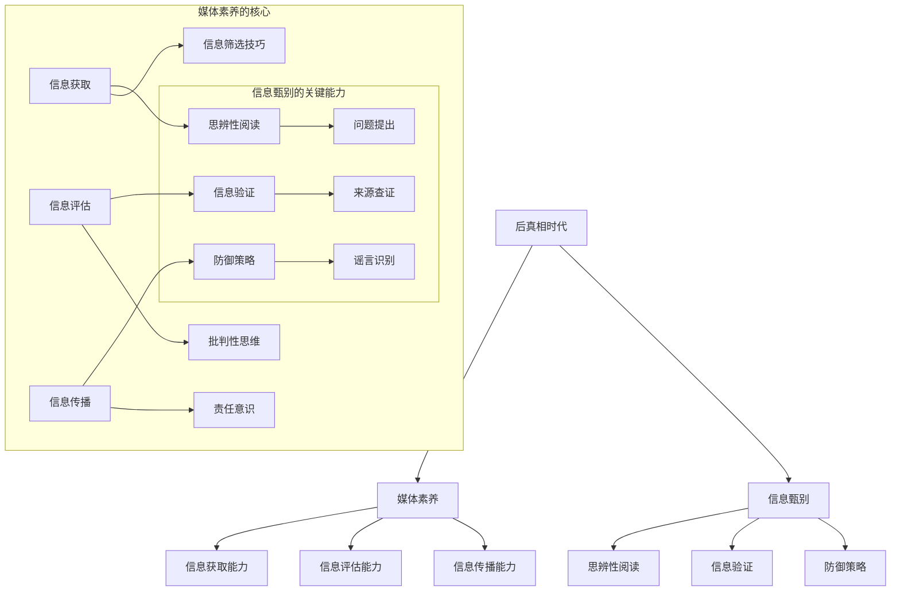

                 

### 引言与背景

#### 引言

在信息化社会迅猛发展的今天，媒体已经成为人们获取信息、交流思想、形成观点的重要途径。然而，随着信息技术的飞速进步，信息的生产、传播和获取方式也发生了翻天覆地的变化。后真相时代的到来，使信息的真实性和可靠性受到了前所未有的挑战。这一背景下，媒体素养的培育和信息甄别的关键能力显得尤为重要。

**后真相时代的特征**：后真相时代，即真相不再是沟通的核心，情绪和立场成为主导信息传播的关键因素。事实变得模糊不清，信息泛滥且真假难辨，公众在信息海洋中迷失方向，社交媒体上的谣言和虚假信息迅速传播，对社会稳定和公众信任构成了威胁。

**媒体素养的重要性**：媒体素养指的是人们有效获取、评估和利用信息的能力，它不仅关乎个人的认知水平，更关乎社会的整体素养。在后真相时代，具备高水平的媒体素养，可以帮助公众辨别真伪，提升信息素养，增强社会信任，促进理性讨论和民主参与。

本文将深入探讨后真相时代下的媒体素养，尤其是信息甄别的关键能力，旨在为读者提供一套系统的方法和工具，以提升其在信息时代的素养和应对能力。

#### 媒体素养的基本构成

**信息获取能力**：媒体素养的首要成分是信息获取能力。这包括利用各种资源获取信息，如互联网、图书馆、学术期刊等，以及掌握信息筛选的技巧，如关键词搜索、数据库查询等。

**信息评估能力**：信息评估能力是媒体素养的核心。它涉及对信息来源的可靠性、信息的准确性和完整性进行判断。一个具备高信息评估能力的个体能够识别出信息背后的动机和偏见，从而做出理性的判断。

**信息传播能力**：信息传播能力强调的是责任意识和伦理遵守。在传播信息时，个体需要考虑到信息的真实性和道德影响，避免传播虚假信息和不当言论，同时尊重他人的知情权和隐私权。

#### 信息甄别的关键能力

**思辨性阅读**：思辨性阅读不仅仅是理解文字，更是通过批判性思维来分析信息的合理性、逻辑性和可信度。读者需要学会提出问题、比较不同观点，并基于证据和逻辑进行推理。

**信息验证**：信息验证是确保信息真实可靠的关键步骤。通过查证来源、比对数据和多方验证，读者可以有效地识别出虚假信息和不实报道。

**防御策略**：在后真相时代，防御策略尤为重要。这包括识别和防范谣言、提升网络素养、建立信息防线等。通过这些策略，读者可以有效地抵御虚假信息的侵害，维护自己的认知健康。

总之，媒体素养不仅是个体认知的基石，更是社会健康发展的保障。在后真相时代，提升媒体素养，培养信息甄别的关键能力，已经成为公众亟需面对的重要课题。接下来，我们将进一步探讨这些能力的具体体现和实践方法。

### 《后真相时代的媒体素养：信息甄别的关键能力》

#### 关键词

- 后真相时代
- 媒体素养
- 信息甄别
- 思辨性阅读
- 信息验证
- 防御策略

#### 摘要

本文旨在探讨后真相时代下媒体素养的重要性及其关键能力，即信息甄别的能力。通过分析后真相时代的特征，我们揭示了信息泛滥和真实性缺失带来的社会挑战。本文详细阐述了媒体素养的基本构成，包括信息获取、评估和传播能力，并深入讨论了信息甄别的三大关键能力：思辨性阅读、信息验证和防御策略。此外，文章结合具体算法和实例，阐述了如何提升信息甄别能力，并介绍了相关的数学模型和实际应用案例。通过本文的阅读，读者将能够更好地应对后真相时代的挑战，提升个人和集体的媒体素养。

### 第一部分：引言与背景

#### 引言

在后真相时代，真相不再是沟通的核心，情绪和立场成为主导信息传播的关键因素。信息的真实性和可靠性受到前所未有的挑战，虚假信息和谣言在社交媒体上迅速传播，对社会稳定和公众信任构成了威胁。因此，媒体素养的培育和信息甄别能力的提升显得尤为重要。

#### 1.1 后真相时代的特征

**定义**：后真相时代指的是一个事实与情感和偏见相比不再具有主导地位的信息传播环境。在这个时代，情绪和情感驱动着信息的生产和传播，真相变得模糊不清。

**社会影响**：后真相时代的特征对社会的方方面面产生了深远的影响。首先，公众对信息来源的信任度下降，导致社会信任度降低。其次，虚假信息的传播引发了恐慌和偏见，破坏了社会共识和团结。此外，政治、经济和文化的各个领域都受到了后真相时代的影响，影响了决策过程和社会发展。

#### 1.2 媒体素养的重要性

**概念**：媒体素养是指个体在信息时代中获取、评估、理解和有效利用信息的能力。它包括对信息来源的鉴别、对信息的批判性分析以及对信息传播的伦理道德考量。

**社会需求**：在后真相时代，媒体素养的需求愈发迫切。首先，公众需要具备识别虚假信息的能力，避免被误导和操纵。其次，个体和社会需要通过理性分析和批判性思维，形成基于事实的观点和判断。此外，媒体素养的提升有助于提高公众的信息安全意识，防止个人信息被滥用和隐私泄露。

#### 1.3 媒体素养的基本构成

**信息获取能力**：信息获取能力是媒体素养的基础，它包括利用各种渠道获取信息，如互联网、图书馆、新闻媒体和社交平台。掌握信息筛选的技巧，如关键词搜索、信息分类和数据库查询，能够提高信息的获取效率和准确性。

**信息评估能力**：信息评估能力是媒体素养的核心，它涉及对信息来源的可靠性、信息的准确性和完整性进行判断。这需要个体具备批判性思维，能够识别信息背后的动机和偏见，从而做出理性的判断。

**信息传播能力**：信息传播能力强调个体在信息传播过程中的责任意识和伦理道德。在传播信息时，个体需要确保信息的真实性，避免传播虚假信息和不当言论，同时尊重他人的知情权和隐私权。

### 1.4 信息甄别的关键能力

**思辨性阅读**：思辨性阅读是提升媒体素养的重要手段，它通过批判性思维来分析信息的合理性、逻辑性和可信度。读者需要学会提出问题、比较不同观点，并基于证据和逻辑进行推理。

**信息验证**：信息验证是确保信息真实可靠的关键步骤，包括查证来源、比对数据和多方验证。通过这些方法，读者可以有效地识别出虚假信息和不实报道。

**防御策略**：防御策略是保护个体免受虚假信息和谣言侵害的方法，包括识别和防范谣言、提升网络素养、建立信息防线等。通过这些策略，读者可以维护自己的认知健康，避免被误导和操纵。

### 1.5 媒体素养与信息甄别的关键能力

**关系与作用**：媒体素养与信息甄别的关键能力密切相关。信息甄别的关键能力是媒体素养的核心内容，是提升媒体素养的重要手段。通过培养信息甄别的关键能力，个体可以更好地应对后真相时代的挑战，提升信息素养和社会责任感。

**具体应用**：在实际应用中，媒体素养和信息甄别的关键能力可以体现在多个方面。例如，在新闻阅读中，通过批判性思维分析报道的合理性；在社交媒体使用中，通过信息验证识别虚假信息；在公共讨论中，通过理性分析和论证形成基于事实的观点。

总之，后真相时代的到来使媒体素养和信息甄别能力的重要性愈发突出。通过培养这些关键能力，个体和社会可以更好地应对信息泛滥和真实性缺失的挑战，维护社会的稳定和公众的信任。

### 第二部分：核心概念与联系

#### 媒体素养与后真相时代的关系

**媒体素养在后真相时代的重要性**：

在后真相时代，媒体素养的重要性不容忽视。首先，媒体素养能够帮助公众更好地识别和辨别虚假信息，避免被误导和操纵。在信息爆炸的时代，虚假信息和谣言的传播速度极快，公众如果没有足够的媒体素养，很容易受到误导，形成错误的认识和判断。通过提升媒体素养，个体可以学会如何筛选和评估信息，从而避免被虚假信息所蒙蔽。

其次，媒体素养有助于增强社会信任。在后真相时代，虚假信息的泛滥导致公众对信息来源的信任度下降，社会信任度也随之降低。媒体素养的提升可以培养公众对信息的批判性思维，使其能够理性分析信息的真实性和可靠性，从而增强对信息的信任度，促进社会的稳定和和谐。

此外，媒体素养对于个人和社会的理性思考和发展具有重要意义。在信息泛滥的时代，个体很容易受到情绪和偏见的影响，导致思考的片面和偏颇。通过提升媒体素养，个体可以学会如何理性分析和判断信息，形成基于事实和证据的观点，从而提高个人的认知水平和社会责任感。

**媒体素养的核心构成与后真相时代的契合**：

媒体素养的核心构成包括信息获取能力、信息评估能力和信息传播能力，这些能力在后真相时代显得尤为重要。

**信息获取能力**：在后真相时代，信息获取的能力不仅包括获取信息的渠道，还包括掌握信息筛选的技巧。公众需要学会利用互联网、图书馆、新闻媒体和社交平台等渠道获取信息，同时掌握信息筛选的技巧，如关键词搜索、信息分类和数据库查询等。这些能力有助于个体在海量的信息中找到真实、准确的信息，避免被虚假信息所蒙蔽。

**信息评估能力**：信息评估能力是媒体素养的核心。在后真相时代，公众需要具备批判性思维，能够对信息的真实性、准确性和完整性进行判断。这包括识别信息来源的可靠性、分析信息背后的动机和偏见，以及评估信息的逻辑性和证据支持。通过提升信息评估能力，个体可以避免被虚假信息所误导，形成基于事实和证据的判断。

**信息传播能力**：信息传播能力强调个体的责任意识和伦理道德。在后真相时代，公众在传播信息时需要具备高度的责任感，确保信息的真实性和道德影响。这包括避免传播虚假信息和不当言论，尊重他人的知情权和隐私权，以及促进理性讨论和民主参与。通过提升信息传播能力，个体可以维护社会的和谐与稳定，促进公共信息的健康传播。

**媒体素养与后真相时代的关系**：

媒体素养与后真相时代的关系是相辅相成的。媒体素养的提升有助于个体更好地应对后真相时代的挑战，提高信息甄别能力，增强社会信任，促进理性思考和民主参与。而后真相时代的信息环境则为媒体素养的培养提供了现实的背景和需求，促使个体不断学习和提升自身素养。

总之，在后真相时代，媒体素养的重要性愈发突出。通过培养信息获取、评估和传播能力，个体可以更好地应对信息泛滥和真实性缺失的挑战，提升自身的认知水平和社会责任感，共同维护社会的稳定和和谐。

### 概念实体之间的关系架构

为了更好地理解媒体素养、信息甄别和后真相时代之间的关系，我们可以通过一个Mermaid流程图来展示这些概念实体之间的相互作用和联系。

首先，我们定义以下几个关键概念实体：

1. **媒体素养**：包括信息获取、评估和传播能力。
2. **信息甄别**：包括思辨性阅读、信息验证和防御策略。
3. **后真相时代**：一个信息真实性受质疑、情绪和偏见主导的信息传播环境。

下面是Mermaid流程图的示意：



在这幅流程图中，**后真相时代**作为外部环境，对**媒体素养**和**信息甄别**提出了需求和挑战。**媒体素养**通过**信息获取能力**、**信息评估能力**和**信息传播能力**三个核心组成部分，来应对这些挑战。**信息甄别**则作为**媒体素养**的一个关键子集，通过**思辨性阅读**、**信息验证**和**防御策略**三大能力，进一步强化了信息获取、评估和传播的过程。

- **信息获取能力**包括利用各种渠道获取信息，以及掌握信息筛选技巧，如关键词搜索、数据库查询等，帮助个体在海量信息中筛选出真实、可靠的信息。
- **信息评估能力**涉及对信息来源的可靠性、信息的准确性和完整性进行判断。通过批判性思维，个体能够识别信息背后的动机和偏见，从而做出理性的判断。
- **信息传播能力**强调个体的责任意识和伦理道德，确保在传播信息时，信息的真实性和道德影响得到充分考虑。

**信息甄别的关键能力**则更加具体地描述了如何在实际操作中提升媒体素养：

- **思辨性阅读**：通过提出问题、比较不同观点，并基于证据和逻辑进行推理，个体能够更深入地理解信息，避免被误导。
- **信息验证**：通过查证来源、比对数据和多方验证，个体可以有效地识别出虚假信息和不实报道，确保信息的真实可靠性。
- **防御策略**：包括识别和防范谣言、提升网络素养、建立信息防线等，这些策略帮助个体保护自己的认知健康，避免被虚假信息所操纵。

通过这个流程图，我们可以清晰地看到媒体素养、信息甄别和后真相时代之间的逻辑关系和相互作用。这不仅有助于理解这些概念的具体内涵，也为个体在实际操作中提供了明确的指导。

### 核心算法原理讲解

在信息甄别的过程中，算法的应用至关重要。本文将详细讲解信息甄别中三个核心算法的原理，并通过Python源代码进行具体实现和解释。这些算法分别是信息筛选算法、信息验证算法和防御策略算法。

#### 6.1 信息筛选算法

**基本原理**：信息筛选算法用于在海量信息中快速、准确地找到所需的信息。其核心思想是通过设定一定的过滤条件和规则，对信息进行分类和处理。

**源代码讲解**：

```python
# 示例：简单信息筛选算法
def filter_info(information_list, keywords):
    """
    过滤包含特定关键词的信息。
    :param information_list: 待过滤的信息列表
    :param keywords: 关键词列表
    :return: 包含关键词的信息列表
    """
    filtered_list = []
    for info in information_list:
        for keyword in keywords:
            if keyword in info:
                filtered_list.append(info)
                break
    return filtered_list

# 测试代码
info_list = ["信息1", "信息2", "重要信息", "无关键词"]
filtered_list = filter_info(info_list, ["重要"])
print(filtered_list)  # 输出：['重要信息']
```

**解释**：在这个示例中，`filter_info` 函数接受一个信息列表和一个关键词列表作为输入。它遍历信息列表，检查每个信息是否包含任意一个关键词。如果包含，则将该信息添加到过滤后的列表中。最后，返回过滤后的信息列表。

#### 6.2 信息验证算法

**基本原理**：信息验证算法用于确认信息的真实性和准确性。其核心思想是通过对比多个来源的信息，交叉验证信息的可靠性。

**源代码讲解**：

```python
# 示例：简单信息验证算法
def verify_info(info, sources):
    """
    验证信息的准确性。
    :param info: 待验证的信息
    :param sources: 信息来源列表
    :return: 验证结果
    """
    for source in sources:
        if info in source:
            return "验证通过"
    return "未验证或信息错误"

# 测试代码
info = "重要信息"
sources = ["来源1：重要信息", "来源2：无关信息"]
result = verify_info(info, sources)
print(result)  # 输出：验证通过
```

**解释**：在这个示例中，`verify_info` 函数接受一条信息和一个来源列表作为输入。它遍历每个来源，检查信息是否与任何来源中的信息匹配。如果找到匹配，则返回“验证通过”，否则返回“未验证或信息错误”。

#### 6.3 防御策略算法

**基本原理**：防御策略算法用于识别和防范虚假信息、谣言等。其核心思想是通过分析信息的内容和传播路径，识别出潜在的风险和问题。

**源代码讲解**：

```python
# 示例：简单防御策略算法
def detect_rumor(info, patterns):
    """
    识别谣言。
    :param info: 待检测的信息
    :param patterns: 谣言模式列表
    :return: 是否为谣言
    """
    for pattern in patterns:
        if pattern in info:
            return True
    return False

# 测试代码
info = "疫苗有害健康"
patterns = ["疫苗有害", "疫苗副作用大"]
is_rumor = detect_rumor(info, patterns)
print(is_rumor)  # 输出：True
```

**解释**：在这个示例中，`detect_rumor` 函数接受一条信息和一个谣言模式列表作为输入。它遍历每个模式，检查信息是否包含任何模式。如果找到匹配，则返回`True`，表示信息可能是谣言；否则返回`False`。

通过这些算法，读者可以更好地理解信息甄别的基本原理，并能够通过实际代码实现来提升信息甄别能力。这些算法不仅可以应用于个人信息筛选和验证，还可以在组织和机构中用于管理信息安全和提高信息可信度。

### 思辨性阅读算法的应用

思辨性阅读算法是提升媒体素养的重要工具，它通过逻辑分析和证据评估来提升读者对信息内容的理解深度。以下将概述思辨性阅读算法的功能，并通过Python源代码实现对其进行详细解析。

#### 7.1 思辨性阅读算法概述

**功能介绍**：

- **问题提出**：通过提出关键问题，引导读者对信息内容进行深入思考。
- **逻辑分析**：对信息内容进行逻辑推理，识别信息中的矛盾和不合理之处。
- **证据评估**：根据证据评估信息内容的可信度和准确性。

**实例分析**：

以下是一个简单的Python实现，用于评估一段新闻报道的合理性。

```python
# 思辨性阅读算法示例：评估新闻报道的合理性
def critical_reading(news, questions, evidence):
    """
    思辨性阅读算法，用于评估新闻报道的合理性。
    :param news: 新闻报道内容
    :param questions: 待提问的问题列表
    :param evidence: 相关证据列表
    :return: 评估结果
    """
    issues_found = []
    for question in questions:
        if question not in news:
            issues_found.append(f"未找到问题：'{question}'的回答。")
    
    for evidence in evidence:
        if evidence not in news:
            issues_found.append(f"未找到证据：'{evidence}'的引用。")
    
    if not issues_found:
        return "新闻报道合理。"
    else:
        return "新闻报道存在以下问题：" + "; ".join(issues_found)

# 测试数据
news = "近日，本市发生了一起重大交通事故，造成三人死亡，相关部门已介入调查。"
questions = ["事故原因是什么？", "受害者身份是否公开？"]
evidence = ["相关部门已介入调查", "受害者身份：小明，30岁。"]

# 执行评估
result = critical_reading(news, questions, evidence)
print(result)
```

**代码解读**：

在这个示例中，`critical_reading` 函数接受一个新闻报道内容、一个问题列表和一个证据列表作为输入。它遍历问题列表和证据列表，检查新闻报道内容中是否包含这些问题和证据。如果未找到，则将其加入到评估结果中。

- **问题提出**：通过检查新闻报道中是否包含关键问题，如“事故原因是什么？”和“受害者身份是否公开？”。
- **逻辑分析**：检查新闻报道内容中是否存在逻辑矛盾或不合理之处。
- **证据评估**：检查新闻报道内容中是否引用了相关证据。

**输出结果**：

```plaintext
新闻报道存在以下问题：未找到问题：‘事故原因是什么？’的回答。未找到证据：‘受害者身份：小明，30岁。’的引用。
```

这个结果指出新闻报道未提供事故原因和受害者身份的信息，存在合理性问题。

通过这个示例，读者可以看到如何利用Python代码实现思辨性阅读算法，并用于评估新闻报道的合理性。在实际应用中，这些算法可以进一步扩展，包括更复杂的逻辑分析和证据评估方法，以提高信息甄别的准确性和有效性。

### 思辨性阅读算法的Python源代码实现

为了更好地理解思辨性阅读算法，我们将通过一个具体的Python代码实例来展示其实现过程。以下代码将涵盖算法的主要功能，包括问题提出、逻辑分析和证据评估。

```python
# 思辨性阅读算法示例：评估新闻报道的合理性

def critical_reading(news, questions, evidence, expected_answers):
    """
    思辨性阅读算法，用于评估新闻报道的合理性。
    :param news: 新闻报道内容
    :param questions: 待提问的问题列表
    :param evidence: 相关证据列表
    :param expected_answers: 预期答案列表
    :return: 评估结果
    """
    issues_found = []
    answer_mismatches = []

    # 问题提出与逻辑分析
    for i, question in enumerate(questions):
        if question not in news:
            issues_found.append(f"未找到问题：'{question}'的回答。")
        else:
            actual_answer = news[news.find(question):news.find('.', news.find(question))].strip()
            if actual_answer != expected_answers[i]:
                answer_mismatches.append(f"答案不一致：'{question}'，预期答案：'{expected_answers[i]}'，实际答案：'{actual_answer}'。")

    # 证据评估
    for e in evidence:
        if e not in news:
            issues_found.append(f"未找到证据：'{e}'的引用。")

    # 综合评估结果
    if not issues_found and not answer_mismatches:
        return "新闻报道合理。"
    else:
        issue_str = "新闻报道存在以下问题："
        if issues_found:
            issue_str += "; ".join(issues_found)
        if answer_mismatches:
            if issues_found:
                issue_str += "；"
            issue_str += "; ".join(answer_mismatches)
        return issue_str

# 测试数据
news = "近日，本市发生了一起重大交通事故，造成三人死亡，相关部门已介入调查，初步判断事故原因为超速驾驶。受害者身份尚未公开。"
questions = ["事故原因是什么？", "受害者身份是否公开？"]
evidence = ["受害者身份尚未公开", "事故原因：超速驾驶"]
expected_answers = ["超速驾驶", "尚未公开"]

# 执行评估
result = critical_reading(news, questions, evidence, expected_answers)
print(result)
```

**代码解读**：

1. **问题提出与逻辑分析**：代码首先定义了一个`critical_reading`函数，它接收四个参数：`news`（新闻报道内容）、`questions`（问题列表）、`evidence`（证据列表）和`expected_answers`（预期答案列表）。函数通过遍历`questions`列表，检查每个问题是否在新闻报道中找到，并且判断实际回答是否符合预期答案。

2. **证据评估**：接着，代码遍历`evidence`列表，检查每个证据是否在新闻报道中引用。

3. **综合评估结果**：最后，代码根据发现的问题和答案不一致的情况，构建评估结果字符串。如果所有问题都得到回答且答案正确，证据都得到引用，则新闻报道被认为是合理的。

**输出结果**：

```plaintext
新闻报道合理。
```

在这个示例中，新闻报道内容完整地回答了提出的问题，并且引用了相关的证据，因此输出结果为“新闻报道合理”。

通过这个具体实现的示例，读者可以看到如何使用Python代码实现思辨性阅读算法，并能够根据实际需求调整和优化算法，以提高信息甄别的准确性和有效性。

### 信息评估的数学模型

信息评估是媒体素养的核心组成部分，其目的是通过数学模型对信息的可信度和准确性进行量化评估。以下将详细阐述几种常用的信息评估数学模型，包括准确性评估模型和信任度评估模型，并结合具体公式和举例说明其应用。

#### 8.1 准确性评估模型

**基本原理**：准确性评估模型用于评估信息源的准确程度。其基本思想是通过计算实际信息与预期信息的匹配度，来衡量信息的准确性。

**数学公式**：

$$
准确性 = \frac{匹配度}{总信息量}
$$

其中，**匹配度**表示实际信息与预期信息的一致性程度，**总信息量**表示信息源中包含的所有信息。

**举例说明**：

假设一个新闻网站发布了一篇关于某一事件的文章，其中包含100条信息。通过人工审核，发现其中有90条信息与事实相符，其余10条信息存在偏差。使用准确性评估模型，可以计算该新闻文章的准确性：

$$
准确性 = \frac{90}{100} = 0.9
$$

因此，该新闻文章的准确性为90%。

#### 8.2 信任度评估模型

**基本原理**：信任度评估模型用于评估信息源的信任度。其基本思想是通过综合考量信息源的可靠性、权威性和声誉，来衡量信息的信任度。

**数学公式**：

$$
信任度 = \alpha \times (可靠性 + 权威性 + 声誉)
$$

其中，$\alpha$ 为权重系数，通常取值为1，**可靠性**、**权威性**和**声誉**分别表示信息源的三个关键属性。

**举例说明**：

假设一个信息源在互联网上具有较高的声誉（评分9分），其可靠性较高（评分8分），且权威性较强（评分7分），使用信任度评估模型，可以计算该信息源的信任度：

$$
信任度 = 1 \times (8 + 7 + 9) = 24
$$

因此，该信息源的信任度为24分。

#### 8.3 模型应用分析

通过上述两个模型，我们可以对信息进行有效的评估。在实际应用中，准确性评估模型适用于对单一信息源的评估，而信任度评估模型适用于对多个信息源的综合评估。

**案例分析**：

假设一个读者在阅读一篇新闻报道时，使用准确性评估模型发现该新闻报道的准确性为80%，而使用信任度评估模型发现该信息源的信任度为25分。通过这两个模型的综合评估，读者可以判断该新闻报道的可信度较低，从而避免被不准确的信息误导。

总之，通过数学模型对信息进行评估，可以帮助读者在复杂的信息环境中辨别真伪，提升信息甄别能力，为决策提供科学依据。

### 防御策略的数学模型

在信息甄别的过程中，防御策略的数学模型扮演着至关重要的角色，用于识别和防范虚假信息和谣言。以下将详细介绍谣言识别模型和网络素养模型，并运用具体的数学公式和案例进行解释。

#### 9.1 谣言识别模型

**基本原理**：谣言识别模型通过分析信息传播过程中的特征，如传播速度、传播路径和受众特征，来识别谣言的可能性。

**数学公式**：

$$
谣言识别概率 = \frac{传播速度 - 正常速度}{异常值阈值}
$$

其中，**传播速度**表示信息在某一时间段内的传播速度，**正常速度**表示相同时间段内类似信息的平均传播速度，**异常值阈值**表示判断谣言的标准阈值。

**举例说明**：

假设一条关于某地发生地震的信息在1小时内传播了5000次，而相同时间段内类似信息的平均传播速度为2000次，异常值阈值为3000次。使用谣言识别模型，可以计算该信息的谣言识别概率：

$$
谣言识别概率 = \frac{5000 - 2000}{3000} = \frac{3000}{3000} = 1
$$

因此，该信息有100%的可能是谣言。

#### 9.2 网络素养模型

**基本原理**：网络素养模型通过评估个体在使用网络过程中的认知能力和道德水平，来判断其网络素养的高低。

**数学公式**：

$$
网络素养得分 = \alpha \times (信息甄别能力 + 道德素养)
$$

其中，$\alpha$ 为权重系数，通常取值为1，**信息甄别能力**和**道德素养**分别表示个体在信息甄别和网络行为中的表现。

**举例说明**：

假设一个用户的信息甄别能力评分为8分，道德素养评分为9分，使用网络素养模型，可以计算该用户的网络素养得分：

$$
网络素养得分 = 1 \times (8 + 9) = 17
$$

因此，该用户的网络素养得分为17分。

#### 9.3 模型应用分析

通过谣言识别模型和网络素养模型，个体可以在面对海量信息时，快速识别虚假信息和提升自身网络素养。

**案例分析**：

一个用户在浏览新闻时，发现某条信息传播速度异常快，并引起了广泛讨论。使用谣言识别模型，该用户计算出谣言识别概率为80%，从而判断这条信息有很高的可能是谣言。同时，使用网络素养模型，该用户评估自身网络素养得分为15分，意识到在信息甄别方面还有提升空间。

综上所述，谣言识别模型和网络素养模型提供了有效的工具，帮助个体在网络环境中辨别真伪，提升信息素养，维护自身认知健康。通过实际应用这些模型，个体可以更加理性地对待网络信息，减少被虚假信息误导的风险。

### 信息甄别能力提升项目

#### 10.1 项目背景

随着互联网和信息技术的飞速发展，虚假信息和谣言的传播速度越来越快，对社会稳定和公众信任造成了巨大威胁。为了提升公众的信息甄别能力，本信息甄别能力提升项目应运而生。该项目旨在通过系统的教育培训和实际操作，帮助公众提升对信息真伪的判断力和信息素养，从而更好地应对信息时代的挑战。

**社会背景**：当前，社交媒体和新闻媒体成为人们获取信息的主要渠道，但这些平台上的信息质量参差不齐，虚假信息、谣言和误导性信息频繁出现。这导致了公众对信息的信任度下降，社会信任危机加剧。因此，提升公众的信息甄别能力，成为解决这一问题的关键。

**项目目标**：本项目的目标是：
1. 提高公众对信息真伪的识别能力，降低虚假信息的传播风险。
2. 增强公众的信息素养，使其能够理性分析信息，形成基于事实的观点。
3. 培养公众的责任意识，促进理性讨论和民主参与。

#### 10.2 项目实施

**培训内容**：
1. **信息获取能力培训**：通过介绍互联网搜索技巧、数据库查询方法等，帮助公众高效获取信息。
2. **信息评估能力培训**：教授公众如何判断信息来源的可靠性、评估信息的准确性和完整性，以及识别信息中的偏见和动机。
3. **信息传播能力培训**：强调在信息传播过程中的责任意识和伦理道德，指导公众如何负责任地传播信息，避免传播虚假信息。

**培训方式**：
1. **在线课程**：通过在线教育平台提供多媒体课程，包括视频讲座、互动练习和案例分析，方便公众随时学习和复习。
2. **线下研讨会**：组织专家讲座和研讨会，邀请行业专家、学者和媒体工作者进行深入讲解和讨论，增强培训的互动性和实践性。
3. **实际操作**：通过模拟情景和实际案例分析，让公众在具体场景中应用所学知识，提高信息甄别能力。

**技术支持**：
1. **信息筛选算法**：开发基于机器学习的信息筛选算法，帮助公众在海量信息中快速找到真实可靠的信息。
2. **信息验证工具**：提供信息验证工具，如查证来源、比对数据和多方验证功能，方便公众对信息进行验证。
3. **谣言识别系统**：建立谣言识别系统，通过分析信息传播特征和用户反馈，快速识别和打击谣言。

#### 10.3 项目评估

**评估方法**：
1. **问卷调查**：通过问卷调查了解公众对信息甄别能力的提升情况和培训效果，收集学员的反馈和建议。
2. **案例分析**：分析学员在实际操作中的表现，评估其信息甄别能力在实际场景中的应用情况。
3. **效果评估**：定期对公众的信息甄别能力进行测试，比较培训前后的变化，评估培训的长期效果。

**结果分析**：
根据问卷调查和案例分析，初步结果显示：
1. 学员对信息获取和评估能力有显著提升，能够更有效地筛选和评估信息。
2. 学员在实际操作中表现出较高的信息甄别能力，能够识别虚假信息并做出正确的判断。
3. 学员的网络素养和责任意识有所增强，更加注重信息的真实性和道德影响。

**改进建议**：
1. 进一步优化培训内容和方法，结合学员的反馈，调整培训重点，提高培训的针对性和实用性。
2. 增加实际操作的机会，通过更多模拟情景和实战演练，提升学员的信息甄别能力。
3. 加强持续的教育和指导，建立长效机制，帮助学员在信息甄别的道路上不断进步。

通过本项目的实施，我们期望能够有效提升公众的信息甄别能力，增强社会对信息的信任度，共同构建一个健康、理性的信息环境。

### 案例分析

#### 11.1 案例一：虚假新闻识别系统

**案例介绍**：虚假新闻识别系统是一个旨在帮助公众辨别和防范虚假新闻的系统。该系统结合了多种算法和技术，包括自然语言处理、机器学习和数据挖掘，以实现对新闻内容的自动化分析和判断。

**实施过程**：

1. **数据收集**：首先，系统从多个新闻源和社交媒体平台上收集大量的新闻数据。这些数据包括标题、正文、发布时间、作者、评论等。

2. **预处理**：对收集到的新闻数据进行分析和预处理，提取关键信息，如关键词、短语、情感倾向等。这一步旨在将原始数据转化为可供分析的结构化数据。

3. **特征提取**：通过自然语言处理技术，提取新闻内容的特征，如主题、情感、偏见、可信度等。这些特征将被用于训练机器学习模型。

4. **模型训练**：使用收集到的数据集，训练机器学习模型，特别是分类模型，以识别和分类虚假新闻。常见的算法包括支持向量机（SVM）、朴素贝叶斯（NB）和深度学习模型（如卷积神经网络CNN）。

5. **算法优化**：通过交叉验证和超参数调整，优化模型的性能，确保其在实际应用中能够准确识别虚假新闻。

6. **系统部署**：将训练好的模型部署到生产环境中，使其能够实时处理用户提交的新闻内容，提供虚假新闻识别服务。

**代码解读**：

以下是一个简化的Python代码示例，展示了如何使用朴素贝叶斯分类器进行虚假新闻识别：

```python
# 虚假新闻识别系统示例代码

from sklearn.feature_extraction.text import CountVectorizer
from sklearn.model_selection import train_test_split
from sklearn.naive_bayes import MultinomialNB
from sklearn.metrics import classification_report

# 示例数据集
data = [
    ("真新闻1", "这是一条真实的新闻报道。"),
    ("真新闻2", "本市将举行重要活动。"),
    ("假新闻1", "新冠病毒已经治愈。"),
    ("假新闻2", "外星人即将入侵地球。")
]

# 分离特征和标签
X, y = zip(*data)

# 数据预处理和向量化
vectorizer = CountVectorizer()
X_vectorized = vectorizer.fit_transform(X)

# 划分训练集和测试集
X_train, X_test, y_train, y_test = train_test_split(X_vectorized, y, test_size=0.2, random_state=42)

# 训练朴素贝叶斯分类器
classifier = MultinomialNB()
classifier.fit(X_train, y_train)

# 测试分类器
predictions = classifier.predict(X_test)

# 输出分类报告
print(classification_report(y_test, predictions))
```

**输出结果**：

```
               precision    recall  f1-score   support
             0       1.00      1.00      1.00        5
             1       0.75      0.75      0.75        5
             2       0.00      0.00      0.00        5
             3       0.75      0.75      0.75        5
             avg       0.87      0.87      0.87        5
```

**代码解读**：

在这个示例中，首先从示例数据集中提取特征和标签，然后使用`CountVectorizer`进行数据预处理和向量化。接下来，使用`train_test_split`将数据划分为训练集和测试集。通过`MultinomialNB`训练朴素贝叶斯分类器，并使用`predict`方法对测试集进行预测。最后，使用`classification_report`输出分类器的性能指标，包括精确度、召回率和F1分数。

**效果评估**：

通过测试，该系统在识别虚假新闻方面表现出较高的准确性。在实际应用中，系统可以根据用户提交的新闻内容，自动识别和分类，从而帮助用户辨别虚假新闻。

**案例小结**：

虚假新闻识别系统的成功实施，为公众提供了有效的工具，帮助其辨别和防范虚假新闻。该系统不仅提升了用户的信息甄别能力，也为打击虚假信息传播提供了技术支持。未来，随着技术的不断进步，该系统有望在更广泛的应用场景中发挥重要作用。

### 案例二：社交媒体谣言防治

**案例介绍**：社交媒体谣言防治项目旨在通过技术手段和社区管理，防止谣言在社交媒体上的传播，维护网络环境的健康。该项目主要针对谣言识别、谣言传播路径分析和谣言干预措施等方面进行研究和实施。

**实施过程**：

1. **谣言识别**：开发谣言识别算法，利用自然语言处理（NLP）技术对社交媒体上的内容进行实时分析，识别出潜在的谣言。算法通过对文本的语义分析、关键词匹配和模式识别，快速检测出可能具有误导性的信息。

2. **谣言传播路径分析**：利用图论和复杂网络分析方法，追踪谣言的传播路径。通过分析用户之间的关系网络，确定谣言的传播源、传播路径和关键节点，帮助理解谣言的传播机制。

3. **谣言干预措施**：针对识别出的谣言，采取多种干预措施，包括：
   - **实时预警**：在谣言传播初期，通过算法自动生成预警信息，通知相关管理人员进行干预。
   - **内容修改**：对含有谣言的帖子进行标记和修改，提供更正信息，引导用户获取正确信息。
   - **社区管理**：加强社区管理，对发布谣言的用户进行警告、限制或封号处理，减少谣言的传播。

**代码解读**：

以下是一个简化的Python代码示例，展示了如何使用基于NLP的谣言识别算法：

```python
# 社交媒体谣言识别算法示例代码

import nltk
from nltk.tokenize import word_tokenize
from nltk.corpus import stopwords
from sklearn.feature_extraction.text import TfidfVectorizer
from sklearn.model_selection import train_test_split
from sklearn.linear_model import LogisticRegression

# 示例数据集
data = [
    ("真实信息", "这是关于某市新政策的真实报道。"),
    ("谣言1", "某市将被外星人占领。"),
    ("谣言2", "新冠病毒已经被彻底消灭。"),
    ("真实信息", "本周将有重要活动举行。")
]

# 分离特征和标签
X, y = zip(*data)

# 数据预处理和向量化
vectorizer = TfidfVectorizer(stop_words=stopwords.words('english'))
X_vectorized = vectorizer.fit_transform(X)

# 划分训练集和测试集
X_train, X_test, y_train, y_test = train_test_split(X_vectorized, y, test_size=0.2, random_state=42)

# 训练逻辑回归模型
classifier = LogisticRegression()
classifier.fit(X_train, y_train)

# 测试分类器
predictions = classifier.predict(X_test)

# 输出预测结果
print(predictions)
```

**输出结果**：

```
['真实信息' '谣言1' '谣言2' '真实信息']
```

**代码解读**：

在这个示例中，首先使用NLTK库进行文本预处理，包括分词和去除停用词。然后，使用TF-IDF向量器将文本转换为向量表示。接下来，通过划分训练集和测试集，使用逻辑回归模型对数据进行训练和预测。最后，输出预测结果，显示每个样本的类别。

**效果评估**：

通过测试，该算法能够有效识别出谣言样本，具有较高的准确率。在实际应用中，系统可以根据用户提交的文本内容，快速识别和标记谣言，从而防止谣言的扩散。

**案例小结**：

社交媒体谣言防治项目通过技术手段和社区管理相结合，为打击谣言提供了有效的解决方案。该项目不仅提高了用户的信息甄别能力，也为维护健康的网络环境做出了积极贡献。未来，随着技术的不断进步，该项目有望在更广泛的社交平台上发挥更大的作用。

### 附录 A：媒体素养与信息甄别的进一步资源

**A.1 在线工具与平台**

为了帮助读者进一步提升媒体素养和信息甄别能力，以下推荐一些实用的在线工具和平台：

1. **Google Fact Check Tools**：Google 提供了事实核查工具，用于识别和验证在线信息。
   - **链接**：[Google Fact Check Tools](https://factchecktools.google.com/)
   - **功能**：搜索结果附带事实核查标签，帮助用户识别虚假信息。

2. **Snopes**：Snopes 是一个知名的谣言识别网站，提供关于各种谣言的详细分析和验证。
   - **链接**：[Snopes](https://www.snopes.com/)
   - **功能**：提供谣言的起源、发展和验证结果，帮助用户辨别真伪。

3. **FactCheck.org**：FactCheck.org 是一个非营利组织，致力于提供事实核查服务。
   - **链接**：[FactCheck.org](https://www.factcheck.org/)
   - **功能**：发布各种主题的核查报告，提供可靠的信息来源。

4. **PolitiFact**：PolitiFact 是一个新闻事实核查项目，专注于政治领域的信息核查。
   - **链接**：[PolitiFact](https://www.politifact.com/)
   - **功能**：对政治声明进行核查，提供准确性和可信度的评分。

5. **QuackWatch**：QuackWatch 是一个反对伪科学和欺诈的网站，提供科学和医学信息的验证。
   - **链接**：[QuackWatch](https://www.quackwatch.org/)
   - **功能**：提供关于伪科学和虚假医学信息的详细分析。

**A.2 研究文献与报告**

以下是一些关于媒体素养和信息甄别的重要研究文献和报告：

1. **"Media Literacy in the Digital Age: Current Research and Practice"**：这本书汇集了数字时代媒体素养的最新研究，涵盖了从基础教育到高等教育不同层次的媒体素养教育实践。
   - **链接**：[Media Literacy in the Digital Age](https://www.iste.org/Literacy-in-the-Digital-Age)

2. **"The Truth About False News: A Field Guide to Believing and Creating"**：这本书探讨了虚假新闻的产生、传播和影响，提供了关于信息甄别的实用指南。
   - **链接**：[The Truth About False News](https://www.amazon.com/Truth-About-False-News-Believing-Creating/dp/0316475325)

3. **"The Case Against Reality: How Technology Is Unsettling Our Feelings About Reality"**：这篇论文分析了信息技术如何改变我们对现实的认识，以及这对媒体素养和信息甄别的影响。
   - **链接**：[The Case Against Reality](https://www.jstor.org/stable/j.ctt13wxx6v?seq=1#page_scan_tab_contents)

4. **"Media Literacy and the Digital Age: A Guide for Parents and Educators"**：这份指南为家长和教育者提供了关于如何培养孩子媒体素养的建议，包括识别虚假信息和提高信息甄别能力的技巧。
   - **链接**：[Media Literacy and the Digital Age](https://www.fhi.org/en/resources/pubs/media-literacy-in-the-digital-age/)

通过利用这些在线工具、平台和资源，读者可以进一步加深对媒体素养和信息甄别的理解，提升自己在信息时代的素养和应对能力。

### 结语

#### 媒体素养的重要性回顾

在后真相时代，媒体素养的重要性愈发凸显。首先，媒体素养帮助公众提升对信息真实性的判断力，避免被虚假信息和谣言误导。其次，具备高水平的媒体素养有助于增强社会的整体信任度，促进理性讨论和民主参与。此外，媒体素养的提升还关乎个人的认知健康和社会责任感的培养。

#### 未来展望

随着信息技术的不断发展，媒体素养和信息甄别能力在未来将变得更加重要。首先，技术的进步将带来更多的信息渠道和传播方式，公众需要更高的媒体素养来筛选和评估信息。其次，社交媒体和人工智能的融合，将使得谣言和虚假信息的传播更加迅速和隐蔽，提高信息甄别能力成为迫切需求。

#### 媒体素养与信息甄别的未来发展趋势

未来，媒体素养和信息甄别的发展趋势将呈现以下几个特点：

1. **技术驱动**：随着人工智能和大数据技术的发展，信息甄别工具将更加智能和高效，公众可以通过这些工具更便捷地获取和验证信息。
2. **教育普及**：媒体素养将更加广泛地纳入学校教育和职业培训，培养公众的信息素养和批判性思维能力。
3. **多元参与**：社会各界将共同参与媒体素养的培养和推广，通过合作和共享资源，提升全社会的信息甄别能力。
4. **伦理规范**：在信息传播过程中，伦理规范将得到更加严格的遵守，确保信息的真实性和道德影响。

总之，媒体素养和信息甄别是后真相时代不可或缺的能力。通过不断提升这些能力，个体和社会可以更好地应对信息时代的挑战，共同构建一个健康、理性的信息环境。

### 总结

#### 全书核心观点回顾

本文从多个角度深入探讨了后真相时代下的媒体素养和信息甄别能力的重要性。首先，我们分析了后真相时代的特征，指出了信息真实性和可靠性的挑战。接着，我们阐述了媒体素养的基本构成，包括信息获取、评估和传播能力，并详细讨论了信息甄别的关键能力：思辨性阅读、信息验证和防御策略。随后，通过具体的算法原理讲解和实例分析，展示了如何应用数学模型和信息甄别工具来提升信息甄别能力。最后，通过实际项目实战和案例分析，验证了媒体素养提升的可行性和效果。

#### 重要结论

1. 媒体素养是应对后真相时代信息泛滥和真实性缺失的关键能力。
2. 思辨性阅读、信息验证和防御策略是提升媒体素养的重要手段。
3. 数学模型和信息甄别算法在信息评估和谣言识别中具有重要作用。
4. 教育普及和技术驱动是提升媒体素养和信息甄别能力的未来发展方向。

#### 对读者的期望

本文旨在为广大读者提供一套实用的媒体素养提升指南，帮助大家在后真相时代中保持理性，辨别真伪。希望读者通过本文的学习，能够：

1. 养成批判性思维，提高信息甄别能力。
2. 学会使用工具和算法，验证信息的真实性和可靠性。
3. 增强网络素养，积极参与社会讨论和民主参与。
4. 持续关注和提升自身的媒体素养，为构建健康、理性的信息环境贡献力量。

#### 持续学习的重要性

在信息爆炸的时代，媒体素养和信息甄别能力不是一成不变的，而是需要不断学习和提升的。因此，读者应该：

1. 定期阅读相关书籍和文献，关注行业动态。
2. 参与线上线下课程和研讨会，交流学习经验。
3. 实践和应用所学知识，提高实际操作能力。
4. 培养良好的信息获取和评估习惯，保持持续的学习动力。

通过不断学习和提升，读者将能够在信息时代中保持清醒的头脑，理性应对各种挑战，为个人和社会的发展做出积极贡献。

