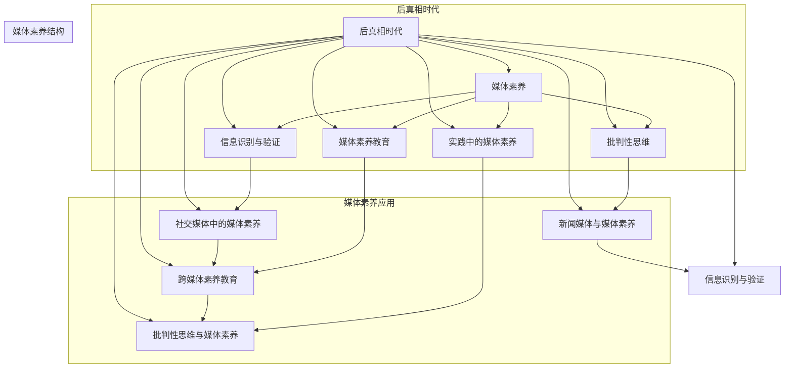

                 

### 核心概念与联系 Mermaid 流程图

为了更好地理解后真相时代的媒体素养，以及培养公民的独立思考能力，我们需要建立一个概念联系框架，以便理清各核心概念之间的关系。以下是使用Mermaid语言描述的概念流程图：

通过上述流程图，我们可以清晰地看到媒体素养在批判性思维、信息识别与验证、媒体素养教育以及实践中的应用。后真相时代的特点将直接影响这些方面的培养和提升。以下我们将逐步分析这些核心概念及其联系，以帮助读者更全面地理解这一主题。

### 第1章：后真相时代的到来

#### 1.1 后真相时代的定义与特征

后真相时代（Post-Truth Era）是一个相对较新的术语，用以描述当前全球信息环境中的变化。这个概念最早由英国政治评论员罗伯特·菲斯克（Robert Fisk）在2003年提出，但其在媒体和公众话语中的广泛使用则始于2016年，当时美国大选和英国脱欧公投等事件引发了关于事实与真相的广泛讨论。

后真相时代的定义可以归纳为：在信息传播过程中，情感、观点和情绪比客观事实更能影响公众意见和决策。这一时代的主要特征包括：

1. **信息过剩**：随着互联网和社交媒体的普及，信息量爆炸性增长，使得人们难以分辨真假。
2. **假新闻泛滥**：虚假新闻、误导性信息和捏造的消息在网络上广泛传播，且有时难以区分。
3. **情绪化传播**：媒体内容更倾向于煽动情绪，而非提供客观事实，以吸引观众的注意力。
4. **专家地位削弱**：传统权威，如学者和专家的影响力减弱，公众更倾向于相信个人感受和主观意见。

#### 1.2 后真相时代与信息泛滥

信息泛滥是后真相时代的一个显著特征。在传统媒体时代，信息传播渠道有限，内容生产和审核相对严格。然而，互联网和社交媒体的出现彻底改变了这一格局。现在，任何人都可以轻松地创建和发布内容，这使得信息泛滥成为一个不可避免的问题。

信息泛滥的影响主要体现在以下几个方面：

1. **认知负担**：人们需要花费大量时间筛选和验证信息，这增加了认知负担。
2. **信息疲劳**：长期处于信息过剩的环境中，人们可能会出现信息疲劳，对信息的接收和处理能力下降。
3. **决策困难**：在信息泛滥的背景下，人们难以做出基于事实的决策，这可能导致社会的混乱和不确定性。

#### 1.3 媒体环境的变化对公民思考能力的影响

媒体环境的变化对公民思考能力产生了深远的影响。在后真相时代，以下问题变得越来越重要：

1. **批判性思维的必要性**：公众需要具备批判性思维，以区分真实与虚假信息，并形成自己的观点。
2. **信息识别与验证的能力**：公众需要学会如何识别和验证信息的真实性，避免被误导。
3. **对多源信息的整合**：公众需要具备从多个来源获取信息，并整合不同观点的能力。
4. **对情绪化传播的抵抗力**：公众需要学会不受情绪化传播的影响，保持理性思考。

总的来说，后真相时代的到来不仅改变了信息传播的方式，也要求公民具备更高的媒体素养和独立思考能力。只有通过批判性思维、信息识别与验证等核心技能的培养，公众才能在信息泛滥的环境中保持清醒和理性。

#### 2.1 媒体素养的概念与构成

媒体素养（Media Literacy）是指个体理解和分析媒体内容、制作和传播媒体信息、以及批判性地评估媒体影响的能力。这一概念不仅仅局限于对媒体内容的理解，还包括了媒体生产和传播的实践技能。媒体素养的构成可以从以下几个方面进行探讨：

1. **信息识别**：能够识别媒体内容中的事实与观点、事实与虚构、广告与信息等不同类型的元素。
2. **批判性思考**：运用批判性思维技能，对媒体内容进行分析、评估和质疑，识别潜在的偏见和误导性信息。
3. **媒体分析**：理解媒体内容的生产、分发和消费过程中的机制，包括媒体机构的运作模式、议程设置、受众分析等。
4. **信息制作**：掌握基本的媒体制作技能，如写作、编辑、摄影、视频制作等，以便能够创作和传播自己的信息。
5. **伦理意识**：具备媒体伦理意识，理解在媒体生产和传播过程中的社会责任和道德规范。

媒体素养的重要性体现在以下几个方面：

1. **信息过滤与筛选**：在信息爆炸的时代，媒体素养可以帮助公众有效筛选和识别有价值的信息，避免被虚假或误导性信息所蒙蔽。
2. **批判性思考的培养**：媒体素养培养了公民的批判性思维能力，使个体能够从多个角度分析问题，形成独立的观点。
3. **社会参与**：具备媒体素养的公民可以更好地参与社会和政治生活，对公共事务发表有见地的意见，并做出理性的决策。
4. **自我保护**：在信息泛滥的环境中，媒体素养帮助公众保护自己，避免被恶意信息所伤害。

总之，媒体素养不仅是应对后真相时代信息泛滥的必要技能，也是培养公民独立思考和理性决策能力的重要手段。通过提高媒体素养，公众可以在复杂的信息环境中保持清醒和理性，做出更为明智的决策。

#### 2.2 媒体素养在公民生活中的作用

媒体素养在公民生活中发挥着至关重要的作用，尤其是在后真相时代，这种作用显得尤为突出。以下是媒体素养在几个关键方面的具体表现：

1. **社会参与**：具备媒体素养的公民能够更好地参与公共事务和社会讨论。通过批判性地分析媒体内容，他们能够形成基于事实和逻辑的观点，并在公共论坛中发表有见地的意见。这种参与不仅有助于提高公共讨论的质量，还能促进社会的民主进程。

2. **政治意识**：媒体素养帮助公民理解和分析政治信息，识别选举和政治广告中的潜在偏见和误导。公民通过批判性思维，可以识别出政治候选人或政党的真实意图，从而做出更为明智的投票决策。

3. **健康决策**：在医疗健康领域，媒体素养同样至关重要。公众可以通过对健康信息的识别与验证，避免被虚假医疗广告或误导性信息所欺骗，从而做出更为科学的健康决策。

4. **消费决策**：在消费市场中，媒体素养帮助消费者辨别广告和宣传的真实性，避免受到商业误导，做出更为理性的消费选择。

5. **个人成长**：媒体素养不仅影响公共生活和决策，也影响个人的成长与发展。具备媒体素养的个体能够更好地学习新知识，培养批判性思维，提高自我表达和沟通能力。

6. **防范心理操纵**：在媒体环境中，个体很容易受到心理操纵，如情绪化传播、虚假信息和谣言等。媒体素养使公民能够识别这些心理操纵手段，从而保护自己的思想不受外界不良影响。

7. **社区建设**：在社区层面上，媒体素养有助于建立基于事实和理性的社区关系。居民通过共享和验证信息，可以更好地理解彼此的观点，减少误解和冲突。

综上所述，媒体素养在公民生活中的作用是多方面的，它不仅帮助个体做出更为明智的决策，还能促进社会的和谐与进步。在后真相时代，提高媒体素养显得尤为迫切和重要。

#### 2.3 培养媒体素养的现实意义

在后真相时代，培养媒体素养具有深远的现实意义。随着信息传播渠道的多样化和信息量的爆炸性增长，公民的独立思考能力和信息辨识能力面临前所未有的挑战。以下是培养媒体素养的几个重要现实意义：

1. **维护社会稳定**：在信息泛滥和假新闻泛滥的时代，公众容易受到误导，导致社会动荡和分裂。培养媒体素养有助于公众学会批判性思考，辨别真假信息，减少误解和谣言的传播，从而维护社会的稳定。

2. **提升决策质量**：在公共决策和选举过程中，媒体素养能够帮助公民理解复杂的政治信息，识别候选人和政党的真实意图，做出更为明智的决策。通过批判性分析媒体内容，公民可以形成独立、理性的观点，减少盲目跟风和情绪化的决策。

3. **增强社会凝聚力**：媒体素养有助于公民理解多角度的信息，减少误解和偏见。通过媒体素养教育，公众可以学会倾听不同的声音，尊重不同的观点，从而增强社会的凝聚力和包容性。

4. **促进创新与学习**：媒体素养不仅帮助个体在当前信息社会中生存，还能激发个体的创新思维和终身学习的能力。通过批判性思维和信息识别技能的培养，公民可以更有效地获取、分析和创造知识，促进个人和社会的进步。

5. **保护个人隐私和权益**：在数字化和网络化的时代，个人隐私和数据安全面临严重威胁。媒体素养使公民能够更好地识别和防范网络诈骗、隐私泄露等风险，保护自己的合法权益。

6. **培养未来公民**：儿童和青少年的媒体素养教育至关重要。通过系统性的媒体素养培养，下一代公民可以学会如何理性地使用媒体资源，应对未来的信息环境挑战。

总之，培养媒体素养不仅是应对当前信息社会挑战的必要手段，更是构建一个更加理性和包容社会的基石。通过提高媒体素养，公众可以在信息泛滥的环境中保持清醒和理性，做出更为明智的决策，从而促进社会的和谐与进步。

### 第3章：批判性思维与媒体素养

#### 3.1 批判性思维的基本原则

批判性思维是一种理性思考的过程，它要求个体对所接受的信息进行质疑、分析和评估。在媒体素养的培养中，批判性思维尤为重要，因为媒体内容的真实性、准确性和公正性往往受到质疑。以下是批判性思维的基本原则：

1. **开放性**：开放性意味着对不同的观点持开放态度，不盲目接受或拒绝。在媒体消费过程中，开放性有助于我们理解多方观点，避免陷入偏见和误解。

2. **质疑性**：质疑性要求我们对信息来源、逻辑推理和证据进行质疑。在接触媒体内容时，我们需要问自己：信息来源是否可靠？逻辑推理是否严谨？证据是否充分？

3. **逻辑性**：逻辑性是批判性思维的核心，它要求我们在思考过程中遵循逻辑规则，避免逻辑谬误。这意味着在分析媒体内容时，我们需要确保每一论点都有坚实的基础，并且论点之间逻辑连贯。

4. **系统性**：系统性思考要求我们综合考虑各种因素，形成全面的认识。在分析媒体内容时，我们需要注意信息之间的联系，避免片面的理解。

#### 3.2 如何培养批判性思维

培养批判性思维需要系统的教育和实践。以下是一些具体的培养方法：

1. **提问能力**：鼓励个体在阅读媒体内容时提出问题，如“信息来源是什么？”“作者的意图是什么？”“这些证据是否充分？”等。

2. **逻辑训练**：学习逻辑学的基本原则，理解逻辑推理的结构和规则，避免常见的逻辑谬误。

3. **多角度思考**：尝试从不同的视角分析问题，了解不同的观点和立场。这有助于我们形成更为全面和客观的认识。

4. **反思习惯**：定期反思自己的思考过程和结论，识别自己的偏见和盲点。

5. **案例分析**：通过分析真实的案例，学习如何运用批判性思维工具进行问题分析。

6. **讨论交流**：与他人讨论不同的观点和问题，通过辩论和交流，提升批判性思维能力。

#### 3.3 批判性思维在媒体消费中的应用

在媒体消费中，批判性思维的应用可以帮助我们更好地理解和评估媒体内容。以下是一些具体的应用场景：

1. **评估信息来源**：在接触新闻和报道时，首先要考虑信息来源的可靠性。了解新闻机构的背景、声誉和偏见，有助于我们判断信息的真实性。

2. **分析信息内容**：对媒体内容进行逐字逐句的分析，识别潜在的偏见、误导性信息和逻辑谬误。通过提问和质疑，我们可以更深入地理解信息的实质。

3. **验证证据**：检查媒体内容中提供的证据是否充分、可靠。我们需要关注证据的来源、样本的大小和代表性，以及数据是否经过科学的处理。

4. **反思自身观点**：在接触不同观点时，反思自己的观点是否过于片面或受到偏见的影响。通过批判性思维，我们可以更客观地看待问题，减少认知偏差。

5. **情绪管理**：在媒体消费过程中，学会管理自己的情绪，避免被情绪化传播所影响。通过保持冷静和理性，我们可以更客观地分析和评估媒体内容。

总之，批判性思维是媒体素养的重要组成部分。通过培养批判性思维，我们可以更好地理解媒体内容，识别真假信息，形成独立、理性的观点，从而在信息泛滥的时代中保持清醒和理性。

#### 4.1 信息真实性的判断标准

在信息泛滥的后真相时代，如何判断信息的真实性变得尤为重要。以下是一些关键标准，可以帮助我们评估信息的可靠性：

1. **事实基础**：真实信息必须建立在事实的基础上，避免主观臆断。我们可以通过查找权威来源、官方声明、学术研究等来验证信息的事实基础。

2. **证据充足**：真实信息应提供充分的证据来支持其观点。这些证据应包括详细的数据、引用的研究文献、现场照片或视频等。

3. **来源可靠**：信息来源的可靠性是评估信息真实性的一项重要标准。权威机构、专业媒体和知名学者的观点通常具有较高的可信度。

4. **交叉验证**：通过多个独立来源交叉验证信息，可以大大提高信息的真实性。如果多个可靠的来源都报道了相同的信息，那么这条信息更可能真实。

5. **逻辑一致性**：真实信息在逻辑上应是一致的，不应包含明显的矛盾或逻辑谬误。通过分析信息的逻辑结构，我们可以识别出潜在的虚假信息。

6. **透明度**：可靠的信息源通常愿意公开其研究方法、数据来源和利益冲突。信息的透明度有助于我们评估其真实性。

#### 4.2 信息来源的评估方法

评估信息来源的可靠性是判断信息真实性的一项关键步骤。以下是一些常用的方法：

1. **查证来源**：了解信息发布者的背景和资质。例如，新闻机构是否有良好的声誉和专业的编辑团队，个人博客或社交媒体账号是否有可靠的认证。

2. **比对信息**：通过对比不同来源的信息，寻找一致性和差异性。如果多个独立来源都报道了相同的信息，这通常意味着该信息更具可信度。

3. **交叉验证**：使用多种方法验证信息的真实性。例如，可以通过查阅官方数据、学术研究或权威报告来交叉验证新闻报道。

4. **使用事实核查网站**：许多专业的事实核查网站，如[FactCheck.org](https://www.factcheck.org/)和[Politifact](https://www.politifact.com/)，可以提供可靠的信息评估服务。

5. **咨询专业人士**：向相关领域的专业人士或权威机构咨询，以获取专业的意见和见解。

6. **查看利益冲突**：了解信息发布者是否有潜在的利益冲突。例如，商业广告和公关活动可能存在误导性，而学术研究则需要披露研究资助来源。

通过上述方法，我们可以更有效地评估信息来源的可靠性，从而提高对信息真实性的判断能力。

#### 4.3 如何进行信息验证

在信息泛滥的后真相时代，进行信息验证是一项关键的技能。以下是一些具体的方法和步骤，帮助公众识别和验证信息的真实性：

1. **查证信息来源**：
   - 了解信息发布者的背景和资质。查询发布者是否为权威机构、专业媒体或知名专家。
   - 检查网站的域名和外观，以判断其是否专业可信。例如，官方网站通常会有“HTTPS”的安全协议标志。
   - 使用搜索引擎查找信息来源的相关信息，了解其历史和声誉。

2. **交叉验证**：
   - 通过多个独立的来源对比信息，寻找一致性和差异。如果多个权威来源都报道了相同的信息，那么这条信息更可能真实。
   - 使用事实核查网站，如[FactCheck.org](https://www.factcheck.org/)和[Politifact](https://www.politifact.com/)，验证新闻和报告的真实性。

3. **使用事实核查工具**：
   - 利用在线事实核查工具，如Google事实核查（Google Fact Check），可以快速识别和验证信息。
   - 使用社交媒体平台的事实核查功能，如Twitter的“事实核查标签”（Fact-Checking Tag）。

4. **检查证据**：
   - 查看信息是否提供了充分的证据，如数据图表、研究文献、现场照片或视频等。
   - 分析证据的来源是否可靠，数据是否经过科学处理，研究是否具有代表性的样本。

5. **评估逻辑和结构**：
   - 分析信息的逻辑结构，确保论点之间有合理的关联，避免逻辑谬误。
   - 检查信息是否有偏见，是否只报道了一方面的观点，或者是否有证据表明信息存在误导。

6. **向专业人士咨询**：
   - 如果信息涉及专业领域，可以咨询相关领域的专业人士或权威机构，以获取专业的意见和见解。
   - 参考学术研究、官方报告等权威文献，以验证信息的真实性。

通过上述步骤和方法，公众可以更有效地进行信息验证，提高对信息真实性的判断能力，避免被虚假或误导性信息所蒙蔽。

#### 4.4 信息验证工具与技术

在信息泛滥的后真相时代，有效的信息验证工具和技术变得尤为重要。以下是一些常用的工具和技术，帮助公众识别和验证信息的真实性：

1. **搜索引擎**：
   - 使用搜索引擎查找信息来源的相关信息，了解其历史和声誉。例如，通过搜索发布者的名字或机构名称，可以找到相关的新闻报道、评论或审查。
   - 利用高级搜索功能，如“Site:”命令，限制搜索范围到特定的网站或域名，以查找权威来源的信息。

2. **事实核查网站**：
   - 利用专业的事实核查网站，如[FactCheck.org](https://www.factcheck.org/)、[Politifact](https://www.politifact.com/)和[Snopes](https://www.snopes.com/)，可以快速验证新闻和报告的真实性。
   - 这些网站通常会提供详细的事实核查报告，包括对信息来源的评估、证据分析和结论。

3. **社交媒体平台**：
   - 许多社交媒体平台，如Facebook和Twitter，提供了事实核查功能。例如，Facebook的“事实核查标签”（Fact-Checking Tag）可以帮助识别虚假信息。
   - 使用社交媒体的搜索功能，查找相关话题的讨论和评论，以获取不同的观点和信息。

4. **数据可视化工具**：
   - 利用数据可视化工具，如Tableau和Google Charts，可以更直观地分析数据和图表。通过对比不同数据源的数据，可以识别潜在的错误或误导性信息。

5. **区块链技术**：
   - 区块链技术可以用来验证信息的来源和完整性。例如，使用区块链平台，如[Block verified](https://blockverified.com/)，可以验证新闻报道中的数据和声明。
   - 区块链提供了一种透明、不可篡改的记录方式，有助于提高信息验证的可靠性。

6. **人工智能**：
   - 利用人工智能（AI）技术，如自然语言处理（NLP）和机器学习，可以自动分析大量文本和数据，识别潜在的虚假信息。例如，Google的事实核查AI工具可以帮助识别和分类虚假新闻。

7. **开放数据平台**：
   - 利用开放数据平台，如[Data.gov](https://www.data.gov/)和[Open Data Portal](https://opendata.arcgisonline.com/)，可以获取和验证官方数据。这些平台提供了丰富的公开数据集，有助于公众进行数据分析和验证。

通过结合使用上述工具和技术，公众可以更全面、更准确地验证信息的真实性，减少被虚假信息误导的风险。

#### 5.1 媒体素养教育的现状与挑战

当前，全球范围内的媒体素养教育正面临一系列挑战和机遇。以下是对当前媒体素养教育现状及其挑战的详细分析：

**1. 教育普及程度**

媒体素养教育在不同国家和地区的普及程度差异较大。在一些发达国家，如美国、英国和加拿大，媒体素养已经成为中小学教育的重要组成部分。这些国家的教育体系通常设有专门的课程和教材，旨在培养学生的批判性思维和信息识别能力。然而，在许多发展中国家，特别是那些信息技术相对落后的地区，媒体素养教育尚未得到足够的重视和资源投入。

**2. 教育内容和质量**

媒体素养教育的质量和内容也参差不齐。一些教育机构和课程提供了全面的、系统的媒体素养教育，涵盖信息识别与验证、批判性思维、媒体分析等多个方面。然而，很多课程仍然偏重于基础知识的传授，缺乏实际操作和情境模拟。此外，一些课程内容陈旧，未能及时反映媒体环境的快速变化。

**3. 教师专业能力**

教师的专业能力是影响媒体素养教育质量的关键因素。尽管许多教师具备良好的教学经验，但在媒体素养领域，他们可能缺乏足够的知识和技能。特别是在一些发展中国家，教师培训的资源和时间有限，导致他们在教授媒体素养课程时面临困难。

**4. 政策和资源支持**

政策支持和资源投入是媒体素养教育发展的基础。在一些国家，政府已经制定了相关政策，支持媒体素养教育的发展。例如，美国教育部门推出了“媒体素养教育行动计划”（Media Literacy Education Action Plan），旨在提高全国范围内的媒体素养教育水平。然而，许多国家在政策和资源支持方面仍然存在不足，限制了媒体素养教育的推广和实施。

**5. 数字素养与媒体素养的关系**

随着数字技术的发展，数字素养（Digital Literacy）与媒体素养的关系日益密切。数字素养不仅包括对数字技术和工具的掌握，还包括对网络信息识别与验证的能力。在媒体素养教育中，如何整合数字素养的培养，成为了一个亟待解决的问题。

**6. 社会参与和合作**

媒体素养教育的成功离不开社会各界的参与和合作。媒体机构、非政府组织和社区组织在媒体素养教育中发挥着重要作用。然而，当前许多教育项目仍然缺乏广泛的社会参与和合作，导致教育效果有限。

**7. 技术与伦理教育的平衡**

在媒体素养教育中，如何平衡技术与伦理教育是一个重要问题。现代媒体环境中的技术工具和平台为信息传播提供了极大的便利，但同时也带来了新的伦理挑战。教育者需要在教学中同时强调技术的应用和伦理的重要性，培养学生成为负责任的媒体用户。

**总结**

媒体素养教育的现状与挑战反映了全球媒体环境的变化和教育体系的适应性。为了应对这些挑战，需要政府、教育机构和全社会共同努力，推动媒体素养教育的全面发展。通过提供高质量的教育资源、加强教师培训、增加政策支持和促进社会合作，我们可以为公民培养出更强的独立思考和批判性思维能力，从而在信息泛滥的时代中保持清醒和理性。

### 5.2 媒体素养教育的目标与内容

媒体素养教育的目标在于培养公民的独立思考能力、批判性思维和信息识别与验证技能，使个体能够在信息泛滥的后真相时代中保持理性和清醒。以下是媒体素养教育的具体目标与内容：

**1. 目标**

- 增强学生的批判性思维能力，使他们能够理性地分析媒体内容和观点。
- 提高学生识别和验证信息真实性的能力，避免被虚假和误导性信息所蒙蔽。
- 培养学生制作和传播媒体信息的技能，以负责任的方式参与公共讨论。
- 强化学生的媒体伦理意识，使他们能够遵循专业和道德规范。

**2. 教育内容**

- **信息识别与验证**：教育学生如何识别媒体内容中的事实与观点、广告与信息，以及如何验证信息的来源和真实性。
- **批判性思维**：通过案例分析和实践，培养学生的批判性思维能力，使他们能够质疑和评估媒体内容。
- **媒体分析**：教授学生分析媒体内容的生产、分发和消费过程，理解媒体机构的运作模式和议程设置。
- **媒体制作技能**：提供基础的媒体制作技能培训，如写作、编辑、摄影和视频制作，使学生能够创作和传播自己的信息。
- **媒体伦理**：教育学生媒体伦理的基本原则，如社会责任、公正性和透明度，培养他们的伦理意识。
- **多源信息整合**：教授学生如何从多个来源获取信息，并整合不同观点，形成全面的认识。
- **数字素养**：强调数字素养的培养，包括对数字工具和平台的掌握，以及网络安全和数据隐私的保护。

**3. 教学方法**

- **案例教学**：通过分析真实的媒体案例，使学生了解媒体内容的生产和传播过程，以及媒体对社会的影响。
- **互动讨论**：通过课堂讨论和辩论，鼓励学生表达自己的观点，学会倾听和尊重不同的意见。
- **实践活动**：组织学生参与实际的媒体制作和传播活动，如制作新闻播报、撰写博客文章等，提高他们的实际操作能力。
- **项目式学习**：通过项目式学习，让学生在解决实际问题的过程中，综合运用所学知识，培养独立思考和解决问题的能力。
- **跨学科整合**：将媒体素养教育与其他学科内容相结合，如历史、社会学和计算机科学等，提供更为全面的跨学科教育。

通过上述目标与内容的设计，媒体素养教育可以有效地培养学生的独立思考能力、批判性思维和信息识别与验证技能，使他们能够在复杂的信息环境中保持清醒和理性，做出明智的决策。

#### 5.3 媒体素养教育的实施策略

媒体素养教育的成功实施需要系统化的策略和有效的方法。以下是一些具体的实施策略，旨在提高教育质量和效果：

**1. 教师培训与专业发展**

- **制定教师培训计划**：为教师提供专门的媒体素养培训课程，包括批判性思维、信息识别与验证、媒体分析等方面的知识。
- **持续专业发展**：鼓励教师参加定期的媒体素养研讨会和研讨会，分享教学经验和最佳实践。
- **教育资源共享**：建立教师交流平台，促进教育资源、教学材料和成功案例的共享。

**2. 教材与课程设计**

- **编写高质量的教材**：开发与课程内容相匹配的高质量教材，包括案例研究、实际操作指南和互动练习。
- **结合实际情况**：课程设计应充分考虑学生的实际需求和兴趣，例如，将新闻事件、社交媒体热点等融入教学内容中。
- **多元化教学资源**：利用多媒体资源，如视频、音频、互动网站等，增强教学的趣味性和互动性。

**3. 教学方法**

- **案例教学**：通过分析真实的媒体案例，帮助学生理解媒体运作和批判性思维的实践。
- **项目式学习**：通过项目式学习，让学生在实际问题中应用所学知识，提高解决问题的能力。
- **互动讨论**：鼓励学生参与课堂讨论和辩论，培养他们的批判性思维和表达能力。
- **实践活动**：组织学生参与新闻采访、新闻报道制作等活动，增强他们的实际操作能力。

**4. 评估与反馈**

- **形成性评估**：在课程过程中，通过作业、讨论和实践活动，及时评估学生的学习进度和效果。
- **总结性评估**：在课程结束时，通过考试、报告或展示等形式，综合评估学生的学习成果。
- **反馈机制**：建立反馈机制，收集学生对课程内容和方法的意见和建议，不断优化教学策略。

**5. 社会合作**

- **与媒体机构合作**：与新闻媒体、出版机构等合作，邀请专业人士为学生提供讲座和工作坊。
- **社区参与**：组织社区活动，如媒体素养讲座、研讨会和互动工作坊，提高公众的媒体素养。
- **跨学科合作**：与其他学科教师合作，将媒体素养教育融入不同学科的教学中，提供跨学科的综合教育。

通过上述策略，我们可以确保媒体素养教育的有效实施，帮助学生培养独立思考能力、批判性思维和信息识别与验证技能，从而在信息泛滥的后真相时代中保持清醒和理性。

### 第6章：社交媒体中的媒体素养

#### 6.1 社交媒体的特点与挑战

社交媒体在现代信息传播中扮演着重要角色，其特点与挑战使得培养媒体素养变得尤为重要。以下是社交媒体的几个主要特点及其带来的挑战：

**1. 普及性与快速传播**

社交媒体的普及性和便捷性使得信息可以迅速传播到全球的每一个角落。用户可以通过手机、平板电脑等移动设备随时随地发布和获取信息，这种快速传播的特点大大提高了信息传播的效率。然而，这也导致信息泛滥，真假难辨，用户容易受到虚假信息和谣言的影响。

**2. 情绪化传播**

社交媒体内容往往注重情感表达和社交互动，因此情绪化的内容更容易获得关注和传播。虽然这种情绪化传播有助于信息的传播，但也容易引发群体情绪的波动，导致社会不稳定。在公共讨论中，情绪化的信息可能取代理性分析，使讨论失去客观性。

**3. 互动性与匿名性**

社交媒体的互动性使得用户能够即时参与讨论和表达观点。这种互动性增强了用户的参与感和归属感，但也带来了匿名性带来的风险。匿名性可能导致网络暴力和恶意言论的泛滥，影响网络环境的健康。

**4. 缺乏权威性**

在社交媒体上，信息的来源往往多样且缺乏权威性。用户发布的消息可能未经验证，甚至完全虚假。这种信息源的不确定性使得用户在获取信息时需要更高的鉴别能力，以避免被误导。

**5. 社交压力**

社交媒体上的互动和比较往往引发社交压力。用户可能会受到他人的观点、生活方式的影响，从而导致自我认同和自我评价的偏差。这种社交压力可能影响用户的情绪和心理健康。

**6. 数据隐私与安全**

社交媒体平台收集大量用户数据，用于个性化广告和营销。然而，这也带来了数据隐私和安全问题。用户在社交媒体上的个人信息可能被滥用或泄露，导致隐私侵犯和安全威胁。

#### 6.2 如何在社交媒体中保持媒体素养

在社交媒体中保持媒体素养，可以帮助用户识别和抵御虚假信息，保持理性思考。以下是一些具体的建议：

**1. 认证信息来源**

在社交媒体上，用户应首先考虑信息来源的可靠性。验证发布者的身份和资质，确保他们是有权威和可信度的信息发布者。可以通过查看发布者的历史记录、官方认证和用户评论来评估其可信度。

**2. 比对信息**

对于重要信息，应通过多个独立来源进行比对，以验证其真实性。如果多个权威来源都报道了相同的信息，那么这条信息更可能真实。此外，应注意信息之间的逻辑一致性和证据的充分性。

**3. 情绪管理**

面对情绪化的社交媒体内容，用户应保持冷静，避免被情绪化传播所影响。通过理性分析，识别信息的真实动机和意图，避免盲目跟风和情绪化的决策。

**4. 关注事实核查网站**

用户可以关注专业的事实核查网站，如[FactCheck.org](https://www.factcheck.org/)和[Politifact](https://www.politifact.com/)，这些网站提供可靠的信息验证服务，帮助用户识别和抵御虚假信息。

**5. 提高数据安全意识**

用户应提高对数据隐私和安全的认识，谨慎分享个人信息。选择安全可靠的平台，了解平台的数据使用政策和隐私保护措施，以减少隐私泄露的风险。

**6. 参与公共讨论**

在社交媒体上，用户应积极参与公共讨论，但保持理性。通过提出问题、质疑和反驳，促进理性的讨论和观点的交流。同时，尊重他人的观点，避免网络暴力和恶意言论。

通过上述方法，用户可以在社交媒体中保持媒体素养，提高信息的鉴别能力，避免被虚假信息和情绪化传播所影响，从而在信息泛滥的环境中保持清醒和理性。

### 第7章：新闻媒体与媒体素养

#### 7.1 新闻媒体的作用与影响

新闻媒体在现代社会中扮演着至关重要的角色，其作用和影响不仅体现在信息传播方面，还延伸到社会、政治和文化领域。以下是新闻媒体的主要作用与影响：

**1. 信息传播**

新闻媒体是信息传播的主要渠道之一，它们通过报纸、电视、广播、网络等多种形式，将新闻事件、政策动态和社会现象传达给公众。新闻媒体能够快速、广泛地传播信息，使公众了解世界的变化和动态。

**2. 监督政府**

新闻媒体具有监督和问责政府的职能。它们通过报道政府的不当行为、政策失误和腐败现象，推动政府透明和负责任。新闻媒体作为第四权力，对政府行为进行监督，有助于维护社会公正和民主。

**3. 引导舆论**

新闻媒体具有强大的舆论引导功能。通过选择报道的主题和角度，新闻媒体可以影响公众的观点和态度，引导社会舆论。新闻媒体可以通过报道热点事件、突出某些问题，从而激发公众关注和讨论。

**4. 形成公共意识**

新闻媒体在形成公共意识方面发挥着重要作用。通过报道社会问题、公共政策和社会现象，新闻媒体能够提高公众对这些问题的认知，促进社会共识的形成。

**5. 文化传播**

新闻媒体在文化传播方面也具有重要影响。它们通过报道国内外文化事件、艺术展览和文学作品，促进不同文化之间的交流和理解，丰富公众的文化生活。

**6. 形成社会规范**

新闻媒体在形成社会规范方面也发挥着重要作用。通过对社会丑恶现象的曝光和批评，新闻媒体可以推动社会道德和价值观的改进，促进社会的进步和发展。

#### 7.2 如何培养对新闻媒体的批判性思维

在信息泛滥和假新闻泛滥的后真相时代，培养对新闻媒体的批判性思维显得尤为重要。以下是一些具体的方法，帮助公众更好地分析新闻内容，避免被误导：

**1. 评估信息来源**

在阅读新闻时，首先要考虑信息来源的可靠性。权威的新闻机构通常具有专业的编辑团队和严格的新闻伦理，而小型或非官方媒体则可能存在可信度问题。可以通过查阅媒体的背景资料、历史记录和受众评价来评估其可靠性。

**2. 分析报道角度**

新闻媒体在报道事件时往往有不同的角度和立场。要培养批判性思维，需要了解不同的观点，并分析新闻的报道角度。问自己：报道是否全面？是否有偏见？是否只报道了一方面的信息？

**3. 验证证据**

检查新闻中的证据是否充分、可靠。新闻应提供来源可靠的数据、引用的研究文献、现场照片或视频等。可以通过查找原始来源或交叉验证信息，确保信息的真实性。

**4. 关注评论与反馈**

在社交媒体或新闻网站中，读者评论和反馈可以提供不同的视角和意见。通过阅读和参与评论，可以更全面地了解事件的背景和多方观点。

**5. 提高自己的知识储备**

拥有广泛的知识和背景有助于更好地理解新闻内容。通过学习历史、社会学、心理学等学科知识，可以提高对新闻内容的批判性分析能力。

**6. 避免情绪化传播**

新闻媒体有时会利用情绪化传播来吸引受众。培养批判性思维，学会识别和抵御情绪化传播的影响，保持理性思考。

**7. 利用事实核查工具**

使用事实核查工具，如[FactCheck.org](https://www.factcheck.org/)和[Politifact](https://www.politifact.com/)，可以快速验证新闻内容，识别虚假和误导性信息。

通过上述方法，公众可以培养对新闻媒体的批判性思维，提高信息的鉴别能力，避免被虚假新闻和误导性信息所蒙蔽，从而在信息泛滥的环境中保持清醒和理性。

### 第8章：跨媒体素养教育

#### 8.1 跨媒体素养教育的必要性

随着媒体环境的不断变化，跨媒体素养教育（Cross-Media Literacy Education）变得尤为重要。在信息爆炸和假新闻泛滥的后真相时代，传统单一的媒体素养教育已无法满足公民在多渠道、多平台上的信息需求。跨媒体素养教育的必要性体现在以下几个方面：

**1. 多媒体环境**

现代社会中，信息传播渠道多样，包括传统媒体（如报纸、电视、广播）、社交媒体（如微博、微信、Twitter）和新兴媒体（如短视频、直播）。这些媒体形式各自具有独特的特点，单一媒体素养教育难以覆盖所有渠道的信息识别和批判性思维培养。

**2. 信息融合**

跨媒体素养教育强调信息融合，即从多个来源和多个角度获取信息，并整合不同类型的信息。这种信息融合能力有助于公民在复杂的信息环境中，形成全面、客观的认识，避免被单一渠道的片面信息所误导。

**3. 适应能力**

跨媒体素养教育培养公民在不同媒体环境中的适应能力。随着技术的不断进步，新的媒体形式和平台不断涌现。具备跨媒体素养的公民能够快速适应这些变化，有效利用各种媒体资源。

**4. 防御心理操纵**

跨媒体素养教育帮助公民识别和抵御来自不同媒体渠道的心理操纵和虚假信息。通过批判性思维和信息验证技能的培养，公民可以在面对复杂的信息环境时，保持理性和清醒，避免被误导和操纵。

**5. 提高沟通能力**

跨媒体素养教育不仅涉及信息获取和批判性思维，还包括信息制作和传播技能。通过学习不同媒体的制作和传播技巧，公民可以提高自己的沟通能力，更好地参与公共讨论和表达自己的观点。

#### 8.2 跨媒体素养教育的实施途径

为了有效实施跨媒体素养教育，需要采取多种途径和方法，确保教育内容全面、方法多样。以下是一些具体的实施途径：

**1. 学校教育**

在学校教育中，跨媒体素养教育应被纳入课程体系，成为一门独立课程或整合到其他学科中。教师可以通过案例教学、互动讨论和实践活动，培养学生跨媒体信息识别和批判性思维能力。

**2. 社会教育**

社会教育是跨媒体素养教育的重要组成部分。可以通过组织社区讲座、媒体素养工作坊和研讨会，提高公众的媒体素养。媒体机构和非政府组织可以发挥重要作用，提供专业资源和平台，促进公众的媒体素养教育。

**3. 在线教育资源**

利用互联网和在线教育平台，可以提供丰富的跨媒体素养教育资源。通过在线课程、学习模块和互动练习，学生可以自主学习和提高自己的媒体素养。

**4. 媒体合作**

跨媒体素养教育的实施需要媒体机构的合作。媒体机构可以通过开设专题节目、推出教育栏目和提供事实核查服务，提高公众的媒体素养。同时，媒体机构也可以参与学校和社会的媒体素养教育活动，提供专业支持和资源。

**5. 家庭教育**

家庭是跨媒体素养教育的基石。家长可以通过与孩子的互动，分享自己的媒体经验和知识，培养孩子的媒体素养。家庭环境中的媒体使用习惯和沟通方式对孩子的媒体素养培养具有重要影响。

**6. 政策支持**

政府应制定相关政策，支持跨媒体素养教育的发展。通过提供资金、资源和政策保障，推动媒体素养教育的普及和实施。政府还可以推动跨部门合作，协调教育、媒体和文化等领域的资源，共同推动媒体素养教育的发展。

通过上述途径和方法，我们可以有效实施跨媒体素养教育，培养公民在多渠道、多平台上的信息识别和批判性思维能力，提高他们在复杂信息环境中的适应能力和自我保护能力。

### 8.3 跨媒体素养教育的成果评估

评估跨媒体素养教育的成果是确保教育有效性的关键环节。以下是一些具体的评估方法和指标，帮助衡量跨媒体素养教育的成效：

**1. 学生自我评估**

学生自我评估是通过自我反馈和自我反思来衡量其媒体素养水平的一种方法。教师可以设计自我评估问卷或反思日志，让学生自我评估在信息识别、批判性思维、媒体分析等方面的进步。这种方法有助于学生主动参与评估过程，提高自我意识。

**2. 教师评估**

教师评估是通过对学生表现进行观察和记录来评估其媒体素养水平的一种方法。教师可以在课堂上观察学生的互动讨论、案例分析、实践活动等表现，通过评分和评语来评估学生的能力。这种方法可以直观地反映学生的实际操作能力和知识掌握情况。

**3. 同伴评估**

同伴评估是学生之间相互评估和反馈的方法，通过小组讨论、互评活动等方式，学生可以相互评估对方的表现。这种方法不仅有助于提高学生的沟通能力和合作能力，还能从不同角度发现和解决问题。

**4. 量化评估**

量化评估是通过量化的方法和工具来衡量学生媒体素养水平的一种方法。教师可以使用标准化测试、问卷调查和数据分析工具，对学生的信息识别、批判性思维、媒体分析等能力进行量化评估。这种方法提供了客观的数据支持，有助于全面了解学生的表现。

**5. 实际应用评估**

实际应用评估是评估学生在实际环境中应用媒体素养能力的一种方法。教师可以设计实际项目或模拟情境，让学生在真实或模拟的环境中应用所学知识，例如制作新闻播报、参与社交媒体讨论或进行信息验证。这种方法能够检验学生的实际操作能力和解决问题的能力。

**6. 教育成果指标**

以下是几个关键的教育成果指标，用于衡量跨媒体素养教育的成效：

- **信息识别能力**：学生能否准确识别媒体内容中的事实与观点、广告与信息等。
- **批判性思维能力**：学生是否能够运用批判性思维分析媒体内容，识别潜在的偏见和误导性信息。
- **媒体分析能力**：学生是否能够分析媒体内容的生产、分发和消费过程，理解媒体机构的运作模式。
- **信息验证能力**：学生是否能够通过多种方法和工具验证信息的真实性，识别虚假信息。
- **媒体制作技能**：学生是否具备基本的媒体制作技能，如写作、编辑、摄影和视频制作。
- **媒体伦理意识**：学生是否具备媒体伦理意识，能够遵循专业和道德规范。

通过上述评估方法和指标，我们可以全面、系统地评估跨媒体素养教育的成效，及时发现和解决问题，持续改进教育质量和效果。

### 附录：媒体素养资源推荐

在提升媒体素养的过程中，利用优质的资源和工具是非常有帮助的。以下是一些推荐的媒体素养教育资源、应用软件和参考书籍，供读者参考和使用。

#### A.1 媒体素养教育资源网站

1. **Media Literacy Clearinghouse**（[https://www.medialiteracyclearinghouse.org/](https://www.medialiteracyclearinghouse.org/)）
   - 提供丰富的媒体素养教学资源和课程，涵盖从基础到高级的内容。

2. **Poynter Institute**（[https://www.poynter.org/](https://www.poynter.org/)）
   - Poynter Institute是一个知名的新闻和媒体教育机构，提供新闻伦理、新闻写作和媒体素养等方面的资源和课程。

3. **News Literacy Project**（[https://newslit.org/](https://newslit.org/)）
   - News Literacy Project专注于提高学生的新闻识别和批判性思维能力，提供免费的教育资源和活动。

4. **MediaSmarts**（[https://mediasmarts.ca/](https://mediasmarts.ca/)）
   - 加拿大的媒体素养教育机构，提供面向儿童、青少年和成人的多种媒体资源和教育项目。

#### A.2 媒体素养教育应用软件

1. **FactCheck Fast**（[https://www.factcheckfast.co.uk/](https://www.factcheckfast.co.uk/)）
   - 一款适用于iOS和Android的手机应用，可以帮助用户快速验证社交媒体上的信息。

2. **CheckMyInfo**（[https://checkmyinfo.com/](https://checkmyinfo.com/)）
   - 一个在线工具，用于识别和监控个人在互联网上的信息，帮助用户保护隐私。

3. **FactCheck.Org**（[https://www.factcheck.org/](https://www.factcheck.org/)）
   - FactCheck.Org是一个独立的事实核查网站，提供网页版和手机应用，方便用户验证信息。

4. **InfoSpotter**（[https://www.infospotter.eu/](https://www.infospotter.eu/)）
   - 一个针对青少年的媒体素养教育应用，通过互动游戏和案例教学，帮助学生提高信息识别和批判性思维能力。

#### A.3 媒体素养教育参考书籍

1. **《媒体素养：信息时代的批判性思维指南》**
   - 作者：[Sandra K. Davis 和 David A. Smails]
   - 简介：这本书提供了全面的媒体素养教育指南，涵盖信息识别、批判性思维、媒体分析等多个方面。

2. **《新闻素养：如何识别和避免假新闻》**
   - 作者：[Richard V. Ericson]
   - 简介：本书详细介绍了新闻素养的重要性，以及如何识别和避免假新闻，适合公众阅读。

3. **《批判性思维：工具与技术》**
   - 作者：[Marilyn K. Simon 和 James J. Mouradian]
   - 简介：这本书涵盖了批判性思维的基本原则和实用技巧，适用于各个领域的读者。

4. **《媒体伦理：理论与实践》**
   - 作者：[James Pamplin 和 Jack L. Harwood]
   - 简介：这本书探讨了媒体伦理的基本原则和实际应用，有助于理解媒体责任和职业道德。

通过使用这些资源和工具，读者可以系统地提升自己的媒体素养，培养批判性思维和信息识别与验证能力，从而在信息泛滥的后真相时代中保持清醒和理性。

### 总结

后真相时代的到来，不仅改变了信息传播的格局，也对公民的媒体素养和独立思考能力提出了新的挑战。在这一背景下，媒体素养的重要性愈发凸显。通过批判性思维、信息识别与验证、媒体素养教育等核心技能的培养，公众可以在信息泛滥的环境中保持清醒和理性，做出更为明智的决策。

本文系统地阐述了后真相时代的定义与特征，媒体素养的概念与构成，批判性思维与信息验证的基本原则，以及跨媒体素养教育的实施策略。通过这些分析，我们认识到，只有通过系统性的教育和实践，公众才能在复杂的信息环境中有效识别和应对各种信息挑战。

**最佳实践 Tips**：

1. **培养批判性思维**：通过提问和质疑，不断挑战和验证信息来源和内容。
2. **关注权威来源**：优先考虑来自权威机构和专业媒体的报道。
3. **交叉验证信息**：通过多个独立来源比对信息，提高信息的真实性。
4. **定期反思**：定期反思自己的思维过程和决策，识别和纠正潜在的偏见和误解。
5. **利用事实核查工具**：使用专业的事实核查网站，快速验证信息的真实性。

**注意事项**：

1. **避免情绪化传播**：在社交媒体上，保持冷静，避免被情绪化信息所影响。
2. **保护个人隐私**：在数字化时代，提高对数据隐私和安全的认识，谨慎分享个人信息。
3. **持续学习**：媒体环境不断变化，持续学习和更新自己的媒体素养知识。

**拓展阅读**：

- 《信息社会的批判性思维：应对媒体泛滥的策略》
- 《数字时代的媒体素养：技能与实践》
- 《媒体素养教育手册：面向教师的资源与指南》

通过不断学习和实践，我们可以在后真相时代中培养出更强的媒体素养和独立思考能力，为社会的和谐与进步贡献力量。作者：AI天才研究院/AI Genius Institute & 禅与计算机程序设计艺术 /Zen And The Art of Computer Programming

