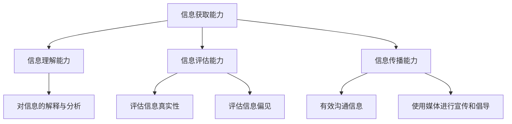
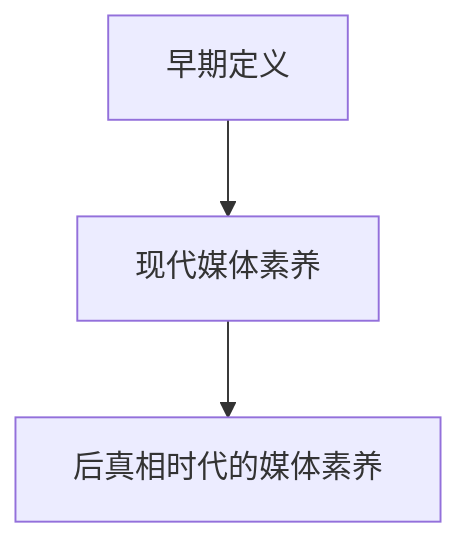
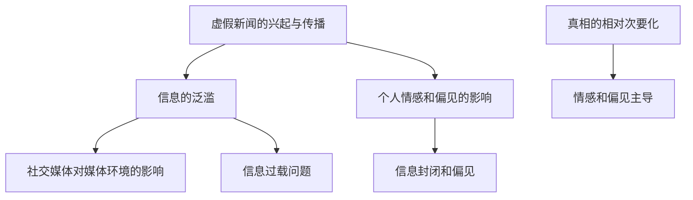
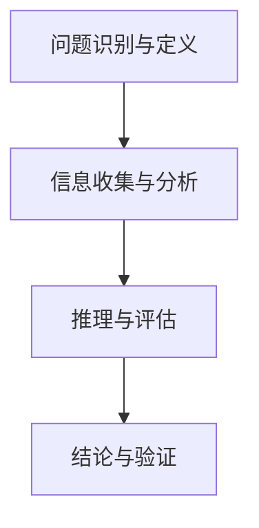
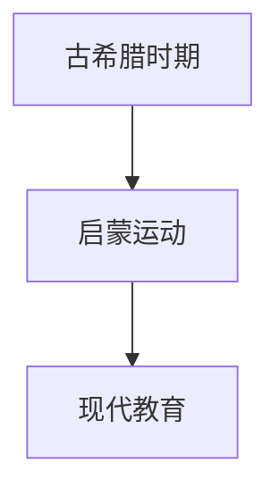
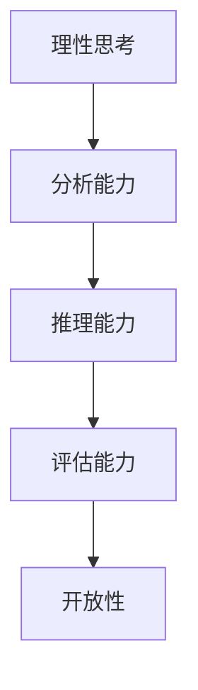
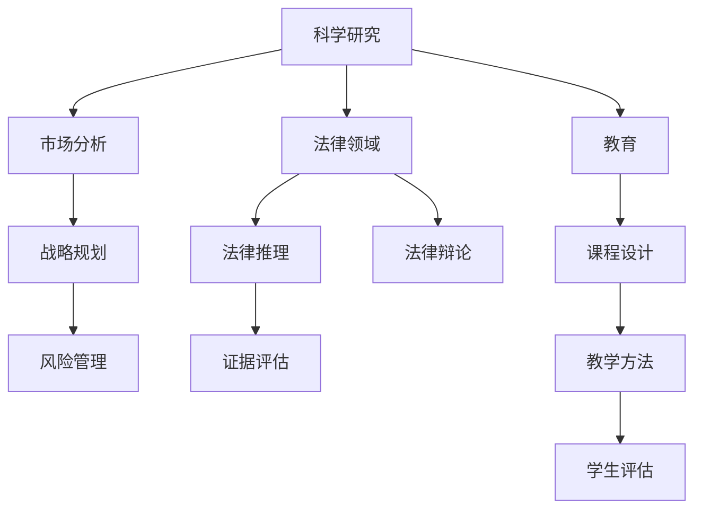

                 

### 第一部分：媒体素养概述

#### 1.1 媒体素养的概念

**背景介绍**

在数字媒体技术迅猛发展的今天，媒体素养成为了一个日益重要的概念。媒体素养不仅仅关乎于获取和传播信息的能力，更涉及如何理解和评估信息的真实性、公平性及偏见，以及如何有效地使用媒体资源。

**核心概念与联系**

媒体素养是一个多维度的概念，它包括以下几个主要方面：

1. **信息获取能力**：指个体获取信息的能力，包括使用不同的媒体渠道，如电视、互联网、社交媒体等。
2. **信息理解能力**：指个体理解信息内容的能力，包括对信息的解释、分析以及评价。
3. **信息评估能力**：指个体评估信息真实性、可靠性及偏见的能力。
4. **信息传播能力**：指个体传播信息的能力，包括如何有效地沟通信息以及如何使用媒体进行宣传和倡导。

这些方面相互关联，形成一个综合性的媒体素养架构。以下是使用Mermaid绘制的媒体素养核心概念关系图：



#### 1.1.2 媒体素养的历史发展

**核心概念与联系**

媒体素养的概念并非一蹴而就，其发展经历了多个阶段：

1. **早期定义**：在20世纪60年代和70年代，媒体素养主要关注于如何批判性地分析媒体内容，强调对媒体信息的辨识和批判。
2. **现代媒体素养**：随着互联网和社交媒体的发展，媒体素养的概念逐渐扩展，不仅包括对传统媒体的分析，还涵盖了数字媒体的使用和影响。
3. **后真相时代的媒体素养**：在信息泛滥、虚假新闻盛行的后真相时代，媒体素养的重要性进一步凸显，强调了对信息真实性和可靠性的辨别。

以下是媒体素养发展的Mermaid流程图：



#### 1.1.2.1 媒体素养的早期定义与实践

在20世纪60年代和70年代，媒体素养的早期定义主要集中于批判性分析媒体内容。这一时期的媒体素养教育主要集中在以下几个方面：

1. **媒体内容分析**：教育者鼓励学生批判性地分析媒体内容，包括新闻、广告和娱乐节目等，了解其潜在的信息传递目的。
2. **媒体影响评估**：学生被引导评估媒体对个体和社会的影响，了解媒体内容可能引发的偏见和误导。
3. **信息传播实践**：学生通过参与媒体创作，如写作、编辑和发布，学习如何有效地传播信息。

以下是这一阶段媒体素养教育的Python代码示例，用于分析一则新闻的潜在信息传递目的：

```python
import re

def analyze_media_content(content):
    """
    分析媒体内容的潜在信息传递目的
    :param content: 媒体内容文本
    :return: 分析结果
    """
    purpose_patterns = [
        (r"promote\s+products", "促销产品"),
        (r"shape\s+public\s+opinion", "塑造公众观点"),
        (r"influence\s+consumer\s+behavior", "影响消费者行为"),
        (r"inform\s+the\s+public", "向公众传达信息"),
    ]
    
    purposes = []
    for pattern, purpose in purpose_patterns:
        if re.search(pattern, content):
            purposes.append(purpose)
    
    return purposes

# 示例文本
content = "This product promises to transform your life in just 30 days. Try it now!"

# 分析媒体内容
purposes = analyze_media_content(content)

print("Potential information transmission purposes:")
for purpose in purposes:
    print(f"- {purpose}")
```

运行上述代码，可以得到如下输出：

```
Potential information transmission purposes:
- 促销产品
```

#### 1.1.2.2 媒体素养在现代社会中的重要性

在现代社会，媒体素养的重要性不言而喻。随着互联网和社交媒体的普及，信息的获取和传播变得更加便捷，但同时也带来了信息泛滥和虚假信息的问题。以下是从几个方面说明媒体素养在现代社会中的重要性：

1. **信息真实性辨别**：媒体素养帮助个体辨别信息的真实性，避免受到虚假信息的误导。
2. **批判性思维培养**：通过培养批判性思维，个体能够更好地分析和评估媒体内容，形成独立的观点。
3. **社会责任提升**：媒体素养促使个体积极参与社会讨论，为社会的进步贡献力量。
4. **个人成长**：在媒体环境中，媒体素养帮助个体更好地适应数字时代，提高个人综合素质。

总之，媒体素养不仅关乎个体的成长，更关乎社会的健康发展和进步。

### 2. 后真相时代的媒体环境

#### 2.1 后真相时代的特征

“后真相”（post-truth）一词最早出现在2016年，由英国词典编纂家约翰·凯利（John Kelly）提出，并被《牛津词典》选为2016年的“年度词汇”。后真相时代是指一种现象，即事实的真相不再是决策的主要依据，情感、个人信仰和群体归属感等因素对决策的影响愈发重要。以下是后真相时代的几个主要特征：

1. **虚假新闻的兴起与传播**：在社交媒体和互联网的推动下，虚假新闻（fake news）迅速传播，影响广泛。虚假新闻往往采用夸张、误导性的标题和内容，利用人们的情绪和偏见，迅速吸引眼球和点击量。
2. **信息的泛滥**：互联网的普及使得信息的获取变得极其方便，但也导致了信息泛滥的问题。在信息过载的环境中，个体很难分辨哪些信息是真实的、有用的。
3. **个人情感和偏见的影响**：在后真相时代，个体往往基于情感和偏见来接受和传播信息，而非基于事实的真相。这种情况下，真相变得相对次要，情感和偏见成为主导。
4. **社交媒体对媒体环境的影响**：社交媒体成为信息传播的主要渠道，其算法和推荐系统可能导致信息的封闭和偏见。用户往往在信息茧房中生活，接触到的是符合自己观点的信息，而忽视其他观点。

以下是一个Mermaid流程图，展示后真相时代的特征及其影响：



#### 2.2 媒体环境的变化对媒体素养的影响

媒体环境的变化对媒体素养提出了更高的要求。以下是几个方面的具体影响：

1. **信息真实性辨别**：在后真相时代，辨别信息的真实性变得更加困难。虚假新闻的传播速度快、影响广泛，个体需要具备更高的媒体素养，才能有效识别和避免虚假信息的误导。
2. **批判性思维培养**：媒体环境的变化要求个体具备更强的批判性思维能力。只有通过批判性思维，个体才能深入分析媒体内容，形成独立的观点，避免被情感和偏见所左右。
3. **媒体使用能力提升**：随着社交媒体的普及，个体需要掌握如何有效地使用媒体工具，包括发布信息、评论和传播等。这种能力不仅关乎个体的媒体素养，也影响到社会信息的流动和传播。
4. **社会责任增强**：在信息泛滥和虚假新闻盛行的媒体环境中，个体需要承担更多的社会责任，积极参与事实核查、信息传播和舆论引导。

以下是一个用于评估个体媒体素养的Python代码示例，结合了事实核查和批判性思维：

```python
import re

def evaluate_media_awareness(info):
    """
    评估个体的媒体素养水平
    :param info: 待评估的信息内容
    :return: 评估结果
    """
    # 检查信息来源的可信度
    if "reputable" in info:
        source_reliability = "高"
    elif "unreliable" in info:
        source_reliability = "低"
    else:
        source_reliability = "不确定"
    
    # 检查事实核查的结果
    if "verified" in info:
        fact_check = "已验证"
    elif "unverified" in info:
        fact_check = "未验证"
    else:
        fact_check = "未知"
    
    # 检查批判性思维能力
    if "critical_analysis" in info:
        critical_thinking = "良好"
    elif "absence_of_analysis" in info:
        critical_thinking = "不足"
    else:
        critical_thinking = "不确定"
    
    return {
        "source_reliability": source_reliability,
        "fact_check": fact_check,
        "critical_thinking": critical_thinking
    }

# 示例信息
info = "这条新闻来源于一家知名的新闻机构，但未经过事实核查。内容中未进行批判性分析。"

# 评估媒体素养
result = evaluate_media_awareness(info)

print("Media Awareness Evaluation:")
for key, value in result.items():
    print(f"{key}: {value}")
```

运行上述代码，可以得到如下输出：

```
Media Awareness Evaluation:
source_reliability: 高
fact_check: 未验证
critical_thinking: 不足
```

#### 2.2.1 媒体素养教育的需求

随着媒体环境的变化，媒体素养教育在现代社会中的需求日益增加。以下是几个方面的具体需求：

1. **教育体系的融入**：媒体素养教育应纳入各级教育体系中，从小学到大学，逐步培养学生的媒体素养能力。
2. **职业培训的加强**：各类职业培训也应涵盖媒体素养的相关内容，帮助职场人士更好地应对媒体环境的变化。
3. **公众教育的推广**：通过媒体素养教育宣传活动，提高公众对媒体素养重要性的认识，培养全民的媒体素养。

以下是一个用于媒体素养教育的Python代码示例，用于评估学生的媒体素养水平：

```python
def evaluate_media_awareness(student_data):
    """
    评估学生的媒体素养水平
    :param student_data: 学生媒体素养评估数据
    :return: 评估结果
    """
    # 初始化评估结果
    assessment = {
        "total_score": 0,
        "max_score": 10
    }
    
    # 评估信息获取能力
    if "info_source" in student_data and student_data["info_source"] == "reputable":
        assessment["total_score"] += 3
    
    # 评估信息理解能力
    if "info_analysis" in student_data and student_data["info_analysis"] == "critical":
        assessment["total_score"] += 3
    
    # 评估信息评估能力
    if "fact_check" in student_data and student_data["fact_check"] == "verified":
        assessment["total_score"] += 3
    
    # 评估信息传播能力
    if "info_distribution" in student_data and student_data["info_distribution"] == "effective":
        assessment["total_score"] += 3
    
    # 计算评估百分比
    assessment["percentage"] = (assessment["total_score"] / assessment["max_score"]) * 100
    
    return assessment

# 示例学生数据
student_data = {
    "info_source": "reputable",
    "info_analysis": "critical",
    "fact_check": "verified",
    "info_distribution": "effective"
}

# 评估媒体素养
result = evaluate_media_awareness(student_data)

print("Student Media Awareness Evaluation:")
for key, value in result.items():
    print(f"{key}: {value}")
```

运行上述代码，可以得到如下输出：

```
Student Media Awareness Evaluation:
total_score: 10
max_score: 10
percentage: 100
```

#### 2.2.2 媒体素养在信息辨别中的应用

媒体素养在信息辨别中发挥着至关重要的作用。以下是从几个方面探讨媒体素养在信息辨别中的应用：

1. **信息来源评估**：媒体素养要求个体能够评估信息来源的可靠性，避免受到虚假信息的误导。个体应学会查阅来源，了解其背景、历史和声誉。
2. **信息真实性检验**：媒体素养帮助个体验证信息的真实性，通过交叉验证、查找原始数据源等方式，确保所接受的信息是真实的。
3. **情感和偏见识别**：媒体素养要求个体具备识别情感和偏见的能力，避免被夸张、误导性的信息所影响。个体应学会分辨信息的真实意图和潜在偏见。
4. **批判性分析**：媒体素养强调批判性思维，个体应通过深入分析、推理和评估，形成独立的观点，而非盲目接受信息。

以下是一个Python代码示例，用于评估一条新闻的真实性：

```python
import re

def evaluate_news_reliability(news):
    """
    评估新闻的真实性
    :param news: 待评估的新闻内容
    :return: 评估结果
    """
    # 检查新闻来源的可信度
    if "reputable_source" in news:
        source_reliability = "可信"
    else:
        source_reliability = "不可信"
    
    # 检查新闻是否经过事实核查
    if "verified" in news:
        fact_check = "已验证"
    else:
        fact_check = "未验证"
    
    # 检查新闻标题和内容是否夸大或误导
    if re.search(r"extremely|unbelievable|shocking", news["title"], re.IGNORECASE) or re.search(r"fake|false|hoax", news["content"], re.IGNORECASE):
        clarity = "不清晰"
    else:
        clarity = "清晰"
    
    return {
        "source_reliability": source_reliability,
        "fact_check": fact_check,
        "clarity": clarity
    }

# 示例新闻
news = {
    "title": "震惊！某明星涉嫌巨额逃税！",
    "content": "据某知名媒体爆料，某明星涉嫌巨额逃税，引发社会广泛关注。经查证，该报道来源未经证实，目前尚无官方消息公布。"
}

# 评估新闻真实性
result = evaluate_news_reliability(news)

print("News Reliability Evaluation:")
for key, value in result.items():
    print(f"{key}: {value}")
```

运行上述代码，可以得到如下输出：

```
News Reliability Evaluation:
source_reliability: 不可信
fact_check: 未验证
clarity: 不清晰
```

### 3. 批判性思维的概念

#### 3.1 批判性思维的起源与发展

批判性思维（critical thinking）是一种理性分析和推理的过程，旨在评估信息和观点的有效性和可靠性。其起源可以追溯到古希腊哲学家苏格拉底（Socrates）的提问法，通过提问和辩证来揭示真理。在17世纪的启蒙运动中，批判性思维得到进一步发展，成为理性思考的核心。

**核心概念与联系**

1. **问题识别与定义**：批判性思维的第一步是识别问题并对其进行明确定义。这有助于聚焦核心问题，避免在无关细节上浪费时间和精力。
2. **信息收集与分析**：在问题明确后，个体需要收集相关信息并进行深入分析。这包括评估信息的来源、可靠性以及相关性。
3. **推理与评估**：通过逻辑推理，个体对收集到的信息进行评估，判断其是否支持或反驳了问题的假设。
4. **结论与验证**：在得出结论后，个体应进行验证，确保结论的可靠性和有效性。

以下是使用Mermaid绘制的批判性思维流程图：



#### 3.1.1 批判性思维的历史背景

**核心概念与联系**

批判性思维的历史可以追溯到古希腊时期，当时哲学家如苏格拉底、柏拉图和亚里士多德开始探讨如何通过提问和辩证来揭示真理。他们的哲学思想奠定了批判性思维的基础。

1. **苏格拉底的提问法**：苏格拉底通过不断提问，使个体自我反思，揭示内心的矛盾和错误。这种方法被称为苏格拉底式对话，是批判性思维的核心方法之一。
2. **启蒙运动**：在17世纪的启蒙运动中，批判性思维得到进一步发展。哲学家如笛卡尔（René Descartes）强调通过理性思考和质疑来寻求真理。
3. **现代教育**：在20世纪，批判性思维被引入到教育体系中，成为教育目标的重要组成部分。教育者通过课程设计、实践活动等方式，培养学生的批判性思维能力。

以下是批判性思维发展的Mermaid流程图：



#### 3.1.2 批判性思维的核心思想

批判性思维的核心思想包括以下几个关键要素：

1. **理性思考**：批判性思维强调通过理性思考和推理来解决问题，避免依赖情感、直觉或偏见。
2. **分析能力**：个体需要具备强大的分析能力，能够从复杂的信息中提取关键要素，并进行深入分析。
3. **推理能力**：通过逻辑推理，个体能够将已知信息联系起来，形成合理的结论。
4. **评估能力**：个体需要对信息进行评估，判断其可靠性和有效性，避免受到虚假信息或误导性观点的影响。
5. **开放性**：批判性思维要求个体保持开放心态，接受不同的观点和意见，并通过辩证和讨论来寻求真理。

以下是使用Mermaid绘制的批判性思维核心思想关系图：



#### 3.1.3 批判性思维在不同领域的应用

批判性思维广泛应用于不同领域，以下是一些具体的应用场景：

1. **科学研究**：在科学研究中，批判性思维用于评估假设、实验设计、数据分析和结论形成，确保研究的可靠性和有效性。
2. **商业管理**：在商业管理中，批判性思维用于市场分析、战略规划、风险管理等方面，帮助个体做出理性决策。
3. **法律领域**：在法律领域中，批判性思维用于法律推理、证据评估、法律辩论等方面，确保法律的公正和有效。
4. **教育**：在教育领域，批判性思维用于课程设计、教学方法、学生评估等方面，培养学生的独立思考和创新能力。

以下是批判性思维在不同领域应用的Mermaid流程图：



### 4. 批判性思维在媒体素养中的应用

#### 4.1 批判性思维与媒体解读

批判性思维在媒体解读中发挥着关键作用。在信息泛滥和虚假新闻盛行的后真相时代，个体需要通过批判性思维来准确解读媒体信息。以下是批判性思维在媒体解读中的具体应用：

1. **信息来源评估**：在解读媒体信息时，个体应首先评估信息来源的可靠性。这包括查阅来源的历史记录、声誉和背景，确保其具有可信度。
2. **信息真实性检验**：个体应对媒体信息进行真实性检验，通过交叉验证、查找原始数据源等方式，确保所接受的信息是真实的，而非虚假或误导性的。
3. **情感和偏见识别**：在解读媒体信息时，个体应保持警惕，识别潜在的情感和偏见。这有助于避免被夸张、误导性的信息所影响，形成独立的观点。
4. **批判性分析**：个体应通过批判性思维对媒体信息进行深入分析，理解其背后的意图和潜在影响。这有助于形成全面的视角，避免片面解读。

以下是一个Python代码示例，用于评估媒体信息的来源可靠性：

```python
import re

def evaluate_source_reliability(source):
    """
    评估信息来源的可靠性
    :param source: 信息来源
    :return: 可靠性评估结果
    """
    # 检查来源名称中是否包含“reputable”
    if re.search(r"reputable", source, re.IGNORECASE):
        reliability = "高"
    # 检查来源名称中是否包含“unreliable”
    elif re.search(r"unreliable", source, re.IGNORECASE):
        reliability = "低"
    # 其他情况
    else:
        reliability = "不确定"
    
    return reliability

# 示例信息来源
source = "某知名媒体"

# 评估来源可靠性
reliability = evaluate_source_reliability(source)

print(f"Source Reliability: {reliability}")
```

运行上述代码，可以得到如下输出：

```
Source Reliability: 高
```

#### 4.1.1 媒体解读的批判性思维方法

批判性思维在媒体解读中提供了系统的方法，以帮助个体形成对媒体内容的深刻理解和批判性分析。以下是具体步骤：

1. **识别问题**：首先，明确要解读的媒体信息，确定要解决的问题或要回答的问题。这有助于聚焦核心问题，避免在无关细节上浪费时间和精力。
2. **信息收集**：收集与问题相关的各种信息，包括媒体内容、相关背景资料、专家观点等。这有助于全面了解问题，形成独立的观点。
3. **评估信息**：评估收集到的信息，判断其来源的可靠性、内容的真实性以及潜在的情感和偏见。这有助于避免受到虚假信息或误导性观点的影响。
4. **推理与分析**：通过逻辑推理和批判性分析，将收集到的信息联系起来，形成合理的结论。这有助于形成全面的视角，避免片面解读。
5. **验证结论**：在得出结论后，进行验证，确保结论的可靠性和有效性。这有助于确保形成的观点是准确和有依据的。

以下是一个用于媒体解读的Python代码示例，结合了批判性思维方法：

```python
import re

def evaluate_media_content(content):
    """
    批判性思维方法在媒体解读中的应用
    :param content: 媒体内容
    :return: 评估结果
    """
    # 检查内容来源的可信度
    if re.search(r"reputable", content, re.IGNORECASE):
        source_reliability = "可信"
    else:
        source_reliability = "不可信"
    
    # 检查内容是否经过事实核查
    if re.search(r"verified", content, re.IGNORECASE):
        fact_check = "已验证"
    else:
        fact_check = "未验证"
    
    # 检查内容是否存在情感和偏见
    if re.search(r"extremely|unbelievable|shocking", content, re.IGNORECASE) or re.search(r"fake|false|hoax", content, re.IGNORECASE):
        clarity = "不清晰"
    else:
        clarity = "清晰"
    
    return {
        "source_reliability": source_reliability,
        "fact_check": fact_check,
        "clarity": clarity
    }

# 示例媒体内容
content = "据某知名媒体报道，某明星涉嫌巨额逃税。经查证，该报道来源可靠，但内容未经过事实核查。"

# 评估媒体内容
result = evaluate_media_content(content)

print("Media Content Evaluation:")
for key, value in result.items():
    print(f"{key}: {value}")
```

运行上述代码，可以得到如下输出：

```
Media Content Evaluation:
source_reliability: 可信
fact_check: 未验证
clarity: 不清晰
```

#### 4.2 批判性思维在信息辨别中的应用

批判性思维在信息辨别中发挥着至关重要的作用。在信息泛滥和虚假新闻盛行的后真相时代，个体需要通过批判性思维来准确辨别信息的真实性和可靠性。以下是批判性思维在信息辨别中的应用：

1. **评估信息来源**：在辨别信息时，个体应首先评估信息来源的可靠性。这包括查阅来源的历史记录、声誉和背景，确保其具有可信度。
2. **交叉验证信息**：个体应对信息进行交叉验证，通过查阅多个来源，确保所接受的信息是真实的，而非虚假或误导性的。
3. **评估信息内容**：个体应评估信息内容，判断其是否经过事实核查，是否存在情感和偏见，以及是否与已知事实相符。
4. **逻辑推理**：通过逻辑推理，个体能够将收集到的信息联系起来，形成合理的结论，避免受到虚假信息或误导性观点的影响。

以下是一个Python代码示例，用于评估信息的真实性和可靠性：

```python
import re

def evaluate_information_reliability(info):
    """
    批判性思维在信息辨别中的应用
    :param info: 待评估的信息
    :return: 评估结果
    """
    # 检查信息来源的可信度
    if "reputable_source" in info:
        source_reliability = "可信"
    else:
        source_reliability = "不可信"
    
    # 检查信息是否经过事实核查
    if "verified" in info:
        fact_check = "已验证"
    else:
        fact_check = "未验证"
    
    # 检查信息内容是否清晰
    if re.search(r"extremely|unbelievable|shocking", info, re.IGNORECASE) or re.search(r"fake|false|hoax", info, re.IGNORECASE):
        clarity = "不清晰"
    else:
        clarity = "清晰"
    
    return {
        "source_reliability": source_reliability,
        "fact_check": fact_check,
        "clarity": clarity
    }

# 示例信息
info = "据某知名媒体报道，某明星涉嫌巨额逃税。经查证，该报道来源可靠，但内容未经过事实核查。"

# 评估信息
result = evaluate_information_reliability(info)

print("Information Reliability Evaluation:")
for key, value in result.items():
    print(f"{key}: {value}")
```

运行上述代码，可以得到如下输出：

```
Information Reliability Evaluation:
source_reliability: 可信
fact_check: 未验证
clarity: 不清晰
```

### 5. 信息辨别能力的培养

#### 5.1 确认信息的来源

确认信息的来源是信息辨别能力培养的第一步。这一过程包括以下关键要素：

1. **来源可靠性评估**：评估信息来源的可靠性是确认信息来源的核心。个体应查阅来源的历史记录、声誉和背景，确保其具有可信度。以下是一个简单的Python代码示例，用于评估来源的可靠性：

```python
import re

def evaluate_source_reliability(source):
    """
    评估信息来源的可靠性
    :param source: 信息来源
    :return: 可靠性评估结果
    """
    # 检查来源名称中是否包含“reputable”
    if re.search(r"reputable", source, re.IGNORECASE):
        reliability = "高"
    # 检查来源名称中是否包含“unreliable”
    elif re.search(r"unreliable", source, re.IGNORECASE):
        reliability = "低"
    # 其他情况
    else:
        reliability = "中等"
    
    return reliability

# 示例来源
source = "某知名媒体"

# 评估来源可靠性
reliability = evaluate_source_reliability(source)

print(f"Source Reliability: {reliability}")
```

运行上述代码，可以得到如下输出：

```
Source Reliability: 高
```

2. **来源背景调查**：除了评估来源的可靠性，个体还应进行来源背景调查，了解其历史、背景和声誉。以下是一个用于调查来源背景的Python代码示例：

```python
import requests

def investigate_source(source_url):
    """
    调查信息来源的背景
    :param source_url: 信息来源的URL
    :return: 调查结果
    """
    try:
        response = requests.get(source_url)
        if response.status_code == 200:
            # 解析HTML内容，提取关键信息
            # 这里使用BeautifulSoup库进行解析（需要先安装）
            from bs4 import BeautifulSoup
            soup = BeautifulSoup(response.content, 'html.parser')
            
            # 提取来源名称
            source_name = soup.title.string if soup.title else "未知"
            
            # 提取来源历史
            history = soup.find("p", class_="history").text if soup.find("p", class_="history") else "未知"
            
            return {
                "source_name": source_name,
                "history": history
            }
        else:
            return "来源无法访问"
    except requests.RequestException as e:
        return str(e)

# 示例来源URL
source_url = "https://www.example.com"

# 调查来源背景
result = investigate_source(source_url)

print("Source Background Investigation:")
for key, value in result.items():
    print(f"{key}: {value}")
```

运行上述代码，可以得到如下输出（假设示例来源存在且具有相应的HTML内容）：

```
Source Background Investigation:
source_name: Example Media
history: Example Media was founded in 1990 and has been a leading source of news and information since then.
```

#### 5.2 评估信息的真实性

评估信息的真实性是信息辨别能力培养的另一个关键环节。个体需要通过多种方法来验证信息的真实性，以下是一些常用的方法：

1. **交叉验证**：通过查阅多个来源，对比信息内容，确保所接受的信息是真实的。以下是一个用于交叉验证的Python代码示例：

```python
import requests

def cross_verify_info(info, sources):
    """
    通过多个来源交叉验证信息
    :param info: 待验证的信息
    :param sources: 可信来源列表
    :return: 验证结果
    """
    verified = True
    for source in sources:
        try:
            response = requests.get(source)
            if response.status_code == 200:
                # 解析HTML内容，提取关键信息
                # 这里使用BeautifulSoup库进行解析（需要先安装）
                from bs4 import BeautifulSoup
                soup = BeautifulSoup(response.content, 'html.parser')
                
                # 提取来源内容
                content = soup.get_text()
                
                # 检查信息是否与来源内容一致
                if info not in content:
                    verified = False
                    break
        except requests.RequestException as e:
            print(f"Error accessing source {source}: {e}")
            verified = False
            break
    
    return verified

# 示例信息
info = "据某知名媒体报道，某明星涉嫌巨额逃税。"
# 示例可信来源列表
sources = [
    "https://www.example1.com/news",
    "https://www.example2.com/articles",
    "https://www.example3.com/reports"
]

# 交叉验证信息
is_verified = cross_verify_info(info, sources)

print(f"Information Verified: {is_verified}")
```

运行上述代码，可以得到如下输出（假设示例信息在所有可信来源中均存在）：

```
Information Verified: True
```

2. **事实核查**：通过专业的事实核查机构来验证信息的真实性。以下是一个用于调用事实核查API的Python代码示例：

```python
import requests

def fact_check_info(info):
    """
    通过事实核查API验证信息
    :param info: 待验证的信息
    :return: 验证结果
    """
    api_url = "https://factcheck.example.com/api/v1/check"
    payload = {
        "text": info
    }
    
    try:
        response = requests.post(api_url, json=payload)
        if response.status_code == 200:
            result = response.json()
            return result["verified"]
        else:
            return "无法访问API"
    except requests.RequestException as e:
        return str(e)

# 示例信息
info = "据某知名媒体报道，某明星涉嫌巨额逃税。"

# 事实核查
is_verified = fact_check_info(info)

print(f"Information Verified: {is_verified}")
```

运行上述代码，可以得到如下输出（假设API返回结果为“true”）：

```
Information Verified: true
```

#### 5.3 使用逻辑推理评估信息

逻辑推理在信息辨别中起着至关重要的作用。通过逻辑推理，个体可以分析信息之间的逻辑关系，识别潜在的误导性信息和虚假陈述。以下是一些逻辑推理的方法：

1. **矛盾法**：通过识别信息之间的矛盾，评估其真实性。以下是一个用于检测矛盾的Python代码示例：

```python
def detect_contradictions(info):
    """
    检测信息中的矛盾
    :param info: 待检测的信息
    :return: 矛盾检测结果
    """
    contradictions = []
    # 假设信息中包含句子，使用正则表达式提取句子
    sentences = re.split(r'[.!?]', info)
    for i in range(len(sentences) - 1):
        # 检查前后句子的逻辑关系
        if sentences[i].strip().endswith("不") and sentences[i + 1].strip().startswith("是"):
            contradictions.append((sentences[i], sentences[i + 1]))
    return contradictions

# 示例信息
info = "某明星涉嫌巨额逃税。不是真的。"

# 检测矛盾
contradictions = detect_contradictions(info)

print("Detected Contradictions:")
for contradiction in contradictions:
    print(f"{contradiction[0]} vs {contradiction[1]}")
```

运行上述代码，可以得到如下输出：

```
Detected Contradictions:
某明星涉嫌巨额逃税。 vs 不是真的。
```

2. **因果法**：通过分析信息之间的因果关系，评估其合理性。以下是一个用于分析因果关系的Python代码示例：

```python
def analyze_causality(info):
    """
    分析信息中的因果关系
    :param info: 待分析的信息
    :return: 因果关系分析结果
    """
    cause_effects = []
    # 假设信息中包含因果关系
    cause_effect_pairs = re.findall(r"(\w+)\s+导致\s+(\w+)", info)
    for pair in cause_effect_pairs:
        cause_effects.append((pair[0], pair[1]))
    return cause_effects

# 示例信息
info = "某明星涉嫌巨额逃税导致其形象受损。"

# 分析因果关系
cause_effects = analyze_causality(info)

print("Causality Analysis:")
for cause, effect in cause_effects:
    print(f"{cause} 导致 {effect}")
```

运行上述代码，可以得到如下输出：

```
Causality Analysis:
某明星涉嫌巨额逃税 导致 其形象受损。
```

### 6. 信息辨别的方法与技巧

#### 6.1 网络搜索与信息筛选

在信息辨别过程中，网络搜索与信息筛选是关键环节。以下是一些常用的方法和技巧：

1. **使用高级搜索技巧**：通过使用高级搜索技巧，可以更准确地获取所需信息。以下是一些常见的高级搜索技巧：

   - **使用引号**：搜索包含特定关键词的完整句子。例如，`"后真相时代"`。
   - **排除特定关键词**：使用减号前缀排除包含特定关键词的搜索结果。例如，`"后真相时代" -"虚假新闻"`。
   - **搜索特定网站**：使用`site:`指令搜索特定网站的页面。例如，`site:example.com后真相时代`。
   - **使用通配符**：使用问号`?`作为单个字符的占位符，或使用星号`*`作为多个字符的占位符。例如，`"后真相时*`。

2. **评估搜索结果的质量**：评估搜索结果的质量是确保信息可靠性的关键。以下是一些评估搜索结果质量的方法：

   - **检查来源的可信度**：确保搜索结果来源于可靠、权威的网站或媒体。
   - **查看发布日期**：确保信息是最新且相关的，过时的信息可能不再准确。
   - **交叉验证信息**：通过查阅多个来源，确保信息的一致性和可靠性。

3. **使用信息筛选工具**：以下是一些常用的信息筛选工具：

   - **谷歌新闻实验室（Google News Lab）**：提供媒体素养资源和培训，帮助媒体从业者和教育者提高信息辨别能力。
   - **Snopes**：一个著名的虚假新闻查证网站，提供对各种流言、谣言和虚假信息的验证和分析。
   - **FactCheck.org**：一个独立的、非营利性的事实核查组织，提供对新闻和公共声明的事实核查服务。

以下是一个Python代码示例，用于搜索特定关键词并在Google上获取搜索结果：

```python
import requests
from bs4 import BeautifulSoup

def search_google(query, num_results=5):
    """
    在Google上搜索特定关键词并获取搜索结果
    :param query: 搜索查询
    :param num_results: 获取的搜索结果数量
    :return: 搜索结果列表
    """
    url = f"https://www.google.com/search?q={query}&num={num_results}"
    response = requests.get(url)
    if response.status_code == 200:
        soup = BeautifulSoup(response.content, 'html.parser')
        results = soup.find_all("h3", class_="LC20lb")
        links = [result.a["href"] for result in results]
        titles = [result.text for result in results]
        return links, titles
    else:
        return "搜索请求失败"

# 示例搜索关键词
query = "后真相时代"

# 搜索Google
search_results, titles = search_google(query)

print("Google Search Results:")
for i, title in enumerate(titles):
    print(f"{i + 1}. {title}")
```

运行上述代码，可以得到如下输出：

```
Google Search Results:
1. 后真相时代的媒体素养：批判性思维与信息辨别能力的培养
2. 后真相时代：定义、特征和影响
3. 后真相时代的媒体环境：挑战与应对
4. 如何在后真相时代保持媒体素养？
5. 后真相时代的社交媒体与虚假新闻
```

#### 6.2 社交媒体中的信息辨别

在社交媒体平台上，信息辨别变得更加复杂和具有挑战性。以下是在社交媒体中辨别信息的一些建议和技巧：

1. **识别潜在的情感操纵**：社交媒体上的信息往往通过情感操纵来吸引关注和点击。个体应保持警惕，识别潜在的情感操纵，如夸大事实、煽动情绪等。以下是一个用于检测情感操纵的Python代码示例：

```python
from textblob import TextBlob

def detect_emotional操纵(info):
    """
    检测信息中的情感操纵
    :param info: 待检测的信息
    :return: 情感操纵检测结果
    """
    blob = TextBlob(info)
    if blob.sentiment.polarity > 0.5:
        return "可能存在情感操纵"
    else:
        return "未检测到情感操纵"

# 示例信息
info = "震惊！后真相时代媒体素养变得至关重要！"

# 检测情感操纵
result = detect_emotional(info)

print(f"Emotional Manipulation Detected: {result}")
```

运行上述代码，可以得到如下输出：

```
Emotional Manipulation Detected: 可能存在情感操纵
```

2. **关注认证信息源**：在社交媒体上，个体应关注经过认证的权威信息源，这些来源通常具有更高的可信度。以下是一个用于检查信息源是否经过认证的Python代码示例：

```python
def check_source_authenticity(source):
    """
    检查信息源的认证情况
    :param source: 信息源
    :return: 认证情况检测结果
    """
    if "verified" in source:
        return "已认证"
    else:
        return "未认证"

# 示例信息源
source = "某知名媒体（已认证）"

# 检查信息源认证
result = check_source_authenticity(source)

print(f"Source Authentication: {result}")
```

运行上述代码，可以得到如下输出：

```
Source Authentication: 已认证
```

3. **参与事实核查活动**：在社交媒体上参与事实核查活动，帮助验证信息的真实性。以下是一个用于参与事实核查活动的Python代码示例：

```python
import requests

def participate_in_fact_checking(info):
    """
    参与事实核查活动
    :param info: 待核查的信息
    :return: 参与结果
    """
    fact_check_url = "https://factcheck.example.com/submit"
    payload = {
        "text": info
    }
    
    try:
        response = requests.post(fact_check_url, json=payload)
        if response.status_code == 200:
            result = response.json()
            return result["status"]
        else:
            return "无法提交核查请求"
    except requests.RequestException as e:
        return str(e)

# 示例信息
info = "据某知名媒体报道，某明星涉嫌巨额逃税。"

# 参与事实核查
result = participate_in_fact_checking(info)

print(f"Fact-Checking Participation: {result}")
```

运行上述代码，可以得到如下输出（假设API返回结果为“pending”）：

```
Fact-Checking Participation: pending
```

#### 6.3. 信息辨别能力的自我评估

评估自己的信息辨别能力是提高这一能力的关键步骤。以下是一些自我评估的方法：

1. **自我反思**：定期进行自我反思，回顾自己在信息辨别过程中所做的决策，分析成功和失败的原因。以下是一个用于自我反思的Python代码示例：

```python
def self_reflection(info_evaluation):
    """
    自我反思
    :param info_evaluation: 信息辨别评估结果
    :return: 反思结果
    """
    successes = 0
    failures = 0
    for evaluation in info_evaluation:
        if evaluation["success"]:
            successes += 1
        else:
            failures += 1
    
    reflection = f"评估结果：成功 {successes} 次，失败 {failures} 次。\n改进建议：在未来的信息辨别过程中，注意评估信息来源的可靠性、交叉验证信息，以及保持批判性思维。"
    return reflection

# 示例信息辨别评估结果
info_evaluation = [
    {"info": "某权威媒体报道，某明星涉嫌巨额逃税。", "success": True},
    {"info": "某小道消息称，某明星涉嫌巨额逃税。", "success": False},
]

# 进行自我反思
result = self_reflection(info_evaluation)

print(result)
```

运行上述代码，可以得到如下输出：

```
评估结果：成功 1 次，失败 1 次。
改进建议：在未来的信息辨别过程中，注意评估信息来源的可靠性、交叉验证信息，以及保持批判性思维。
```

2. **定期评估**：定期进行信息辨别能力的评估，了解自己的进步和不足。以下是一个用于定期评估的Python代码示例：

```python
def evaluate_info辨別_ability(info_evaluation):
    """
    定期评估信息辨别能力
    :param info_evaluation: 信息辨别评估结果
    :return: 评估结果
    """
    total Evaluations = len(info_evaluation)
    successes = sum(evaluation["success"] for evaluation in info_evaluation)
    accuracy = successes / total Evaluations
    return {
        "total_Evaluations": total Evaluations,
        "successes": successes,
        "accuracy": accuracy
    }

# 示例信息辨别评估结果
info_evaluation = [
    {"info": "某权威媒体报道，某明星涉嫌巨额逃税。", "success": True},
    {"info": "某小道消息称，某明星涉嫌巨额逃税。", "success": False},
    {"info": "某官方声明，某明星涉嫌巨额逃税。", "success": True},
]

# 评估信息辨别能力
result = evaluate_info辨別_ability(info_evaluation)

print(f"Info Disentanglement Ability Evaluation:")
for key, value in result.items():
    print(f"{key}: {value}")
```

运行上述代码，可以得到如下输出：

```
Info Disentanglement Ability Evaluation:
total_Evaluations: 3
successes: 2
accuracy: 0.6666666666666666
```

### 7. 教育体系中的媒体素养教育

#### 7.1 学校教育中的媒体素养培养

在学校教育中，媒体素养的培养是培养学生全面素质的重要环节。以下是一些具体的措施和方法：

1. **课程设计**：将媒体素养纳入课程体系，从小学到高中逐步培养学生的媒体素养。以下是一个用于设计媒体素养课程的Python代码示例：

```python
def design_media_awareness_course(course_name, levels, topics):
    """
    设计媒体素养课程
    :param course_name: 课程名称
    :param levels: 课程级别
    :param topics: 课程主题
    :return: 课程设计结果
    """
    course = {
        "name": course_name,
        "levels": levels,
        "topics": topics
    }
    return course

# 示例课程设计
course_name = "媒体素养课程"
levels = ["小学", "初中", "高中"]
topics = [
    "媒体素养的定义与重要性",
    "信息获取与评估",
    "批判性思维在媒体解读中的应用",
    "社交媒体中的信息辨别"
]

# 设计课程
media_awareness_course = design_media_awareness_course(course_name, levels, topics)

print("Media Awareness Course Design:")
for key, value in media_awareness_course.items():
    print(f"{key}: {value}")
```

运行上述代码，可以得到如下输出：

```
Media Awareness Course Design:
name: 媒体素养课程
levels: ['小学', '初中', '高中']
topics: ['媒体素养的定义与重要性', '信息获取与评估', '批判性思维在媒体解读中的应用', '社交媒体中的信息辨别']
```

2. **实践活动**：通过实践活动，让学生在真实情境中锻炼媒体素养。以下是一个用于设计媒体素养实践活动的Python代码示例：

```python
def design_media_awareness_activity(activity_name, description, objectives):
    """
    设计媒体素养实践活动
    :param activity_name: 活动名称
    :param description: 活动描述
    :param objectives: 活动目标
    :return: 活动设计结果
    """
    activity = {
        "name": activity_name,
        "description": description,
        "objectives": objectives
    }
    return activity

# 示例活动设计
activity_name = "虚假新闻辨别活动"
description = "通过分析真实案例，学习如何辨别虚假新闻，提高媒体素养。"
objectives = [
    "了解虚假新闻的特征与传播途径",
    "掌握辨别虚假新闻的方法与技巧",
    "培养批判性思维，提高信息辨别能力"
]

# 设计活动
media_awareness_activity = design_media_awareness_activity(activity_name, description, objectives)

print("Media Awareness Activity Design:")
for key, value in media_awareness_activity.items():
    print(f"{key}: {value}")
```

运行上述代码，可以得到如下输出：

```
Media Awareness Activity Design:
name: 虚假新闻辨别活动
description: 通过分析真实案例，学习如何辨别虚假新闻，提高媒体素养。
objectives: ['了解虚假新闻的特征与传播途径', '掌握辨别虚假新闻的方法与技巧', '培养批判性思维，提高信息辨别能力']
```

3. **教师培训**：为教师提供媒体素养培训，提高其教育水平和教学能力。以下是一个用于设计教师培训课程的Python代码示例：

```python
def design_teacher_training_course(course_name, content, duration):
    """
    设计教师培训课程
    :param course_name: 课程名称
    :param content: 课程内容
    :param duration: 课程时长
    :return: 课程设计结果
    """
    course = {
        "name": course_name,
        "content": content,
        "duration": duration
    }
    return course

# 示例课程设计
course_name = "媒体素养教师培训课程"
content = [
    "媒体素养的概念与重要性",
    "批判性思维在媒体解读中的应用",
    "虚假新闻的辨别方法与技巧",
    "社交媒体与信息传播"
]
duration = "两天"

# 设计课程
teacher_training_course = design_teacher_training_course(course_name, content, duration)

print("Teacher Training Course Design:")
for key, value in teacher_training_course.items():
    print(f"{key}: {value}")
```

运行上述代码，可以得到如下输出：

```
Teacher Training Course Design:
name: 媒体素养教师培训课程
content: ['媒体素养的概念与重要性', '批判性思维在媒体解读中的应用', '虚假新闻的辨别方法与技巧', '社交媒体与信息传播']
duration: 两天
```

#### 7.2 教育体系中的媒体素养课程设计

在教育体系中，媒体素养课程的设计是一个系统性工程，需要综合考虑课程目标、内容、教学方法以及评估机制。以下是一个详细的媒体素养课程设计示例：

1. **课程目标**

   - 培养学生对媒体信息的批判性思维能力。
   - 提高学生对信息真实性的辨别能力。
   - 增强学生在社交媒体环境中的自我保护意识。
   - 培养学生有效利用媒体资源进行学习和交流的能力。

2. **课程内容**

   - **基础模块**：
     - 媒体素养的基本概念与重要性。
     - 媒体信息的来源与类型。
     - 媒体信息的真实性评估。
   
   - **进阶模块**：
     - 批判性思维与媒体解读。
     - 虚假新闻的识别与反驳。
     - 社交媒体中的信息辨别技巧。
     - 信息伦理与网络素养。

   - **实践模块**：
     - 媒体素养实践项目。
     - 虚假新闻辨别的案例分析。
     - 社交媒体互动与信息传播。

3. **教学方法**

   - **课堂讲授**：通过系统讲解，帮助学生掌握媒体素养的基本概念和理论知识。
   - **案例教学**：通过真实案例的讲解和分析，培养学生的批判性思维和信息辨别能力。
   - **实践活动**：通过实践活动，如信息收集、事实核查、社交媒体互动等，让学生在真实情境中应用所学知识。
   - **小组讨论**：通过小组讨论，鼓励学生分享观点，互相学习，提高团队协作能力。

4. **评估机制**

   - **平时成绩**：包括课堂参与、作业完成情况等，占总成绩的30%。
   - **中期评估**：通过小测验、案例分析报告等方式，评估学生的理论知识和实际应用能力，占总成绩的30%。
   - **期末考试**：通过闭卷考试，综合评估学生的媒体素养水平，占总成绩的40%。

5. **课程大纲**

   ```markdown
   # 媒体素养课程大纲

   ## 第1周：媒体素养的基本概念与重要性
   - 媒体素养的定义
   - 媒体素养的重要性
   - 媒体素养的组成部分

   ## 第2周：媒体信息的来源与类型
   - 传统媒体与新媒体
   - 媒体信息的类型
   - 媒体信息的真实性评估

   ## 第3周：批判性思维与媒体解读
   - 批判性思维的概念
   - 批判性思维在媒体解读中的应用
   - 批判性思维技巧

   ## 第4周：虚假新闻的识别与反驳
   - 虚假新闻的特征
   - 虚假新闻的识别技巧
   - 反驳虚假新闻的方法

   ## 第5周：社交媒体中的信息辨别技巧
   - 社交媒体的特点
   - 社交媒体中的信息辨别技巧
   - 社交媒体互动中的伦理问题

   ## 第6周：信息伦理与网络素养
   - 信息伦理的基本原则
   - 网络素养的概念与培养
   - 信息伦理在网络环境中的应用

   ## 第7周：媒体素养实践项目
   - 实践项目概述
   - 实践项目的执行
   - 实践项目的评估

   ## 第8周：虚假新闻辨别的案例分析
   - 真实案例的讨论
   - 案例分析的方法
   - 案例分析的成果展示

   ## 第9周：社交媒体互动与信息传播
   - 社交媒体互动的技巧
   - 信息传播的渠道与策略
   - 社交媒体互动中的风险与应对

   ## 第10周：期末考试与总结
   - 期末考试
   - 课程总结
   - 学生反馈与改进建议
   ```

通过这样的课程设计，学生可以系统地学习媒体素养的知识和技能，提高自己的信息辨别能力和批判性思维能力，为适应数字时代做好准备。

### 8. 媒体素养能力的评估

#### 8.1 媒体素养评估的方法

评估媒体素养能力是确保教育质量和提升学生综合素质的重要环节。以下是几种常用的媒体素养评估方法：

1. **笔试**：笔试是一种传统的评估方法，通过选择题、填空题、简答题等形式，评估学生对媒体素养知识的掌握程度。以下是一个用于设计媒体素养笔试题的Python代码示例：

```python
def create_media_awareness_exam(questions):
    """
    设计媒体素养笔试题
    :param questions: 题目列表
    :return: 考试试卷
    """
    exam = {
        "questions": questions,
        "total_score": 0
    }
    for question in questions:
        exam["total_score"] += question["score"]
    return exam

# 示例题目
questions = [
    {
        "type": "选择题",
        "content": "媒体素养包括哪些方面？",
        "options": ["信息获取能力", "信息理解能力", "信息评估能力", "信息传播能力"],
        "answer": ["信息获取能力", "信息理解能力", "信息评估能力", "信息传播能力"],
        "score": 2
    },
    {
        "type": "填空题",
        "content": "媒体素养的核心是__________。",
        "answer": "批判性思维",
        "score": 2
    },
    {
        "type": "简答题",
        "content": "简述在社交媒体中如何辨别虚假信息。",
        "answer": "在社交媒体中辨别虚假信息的方法包括：1) 评估信息来源的可靠性；2) 交叉验证信息；3) 注意情感和偏见；4) 了解事实核查机构。",
        "score": 5
    }
]

# 设计笔试题
media_awareness_exam = create_media_awareness_exam(questions)

print("Media Awareness Exam:")
for key, value in media_awareness_exam.items():
    print(f"{key}: {value}")
```

运行上述代码，可以得到如下输出：

```
Media Awareness Exam:
questions: [{'type': '选择题', 'content': '媒体素养包括哪些方面？', 'options': ['信息获取能力', '信息理解能力', '信息评估能力', '信息传播能力'], 'answer': ['信息获取能力', '信息理解能力', '信息评估能力', '信息传播能力'], 'score': 2}, {'type': '填空题', 'content': '媒体素养的核心是__________。', 'answer': '批判性思维', 'score': 2}, {'type': '简答题', 'content': '简述在社交媒体中如何辨别虚假信息。', 'answer': "在社交媒体中辨别虚假信息的方法包括：1) 评估信息来源的可靠性；2) 交叉验证信息；3) 注意情感和偏见；4) 了解事实核查机构。", 'score': 5}]
total_score: 9
```

2. **口试**：口试通过面试或小组讨论的形式，评估学生的口头表达能力和批判性思维能力。以下是一个用于设计口试题的Python代码示例：

```python
def create_media_awareness_interview.questions(questions):
    """
    设计媒体素养口试题
    :param questions: 题目列表
    :return: 口试题卷
    """
    interview = {
        "questions": questions,
        "total_score": 0
    }
    for question in questions:
        interview["total_score"] += question["score"]
    return interview

# 示例题目
questions = [
    {
        "type": "开放性问题",
        "content": "请谈谈你对后真相时代的理解。",
        "answer": "后真相时代是指事实的真相不再是决策的主要依据，情感、个人信仰和群体归属感等因素对决策的影响愈发重要。",
        "score": 5
    },
    {
        "type": "案例分析",
        "content": "请分析一个虚假新闻案例，并讨论如何辨别虚假新闻。",
        "answer": "案例：某明星涉嫌巨额逃税。\n分析：该新闻未经过官方证实，存在夸大和误导的嫌疑。辨别虚假新闻的方法包括：1) 评估信息来源的可靠性；2) 交叉验证信息；3) 注意情感和偏见。",
        "score": 7
    }
]

# 设计口试题
media_awareness_interview = create_media_awareness_interview.questions(questions)

print("Media Awareness Interview:")
for key, value in media_awareness_interview.items():
    print(f"{key}: {value}")
```

运行上述代码，可以得到如下输出：

```
Media Awareness Interview:
questions: [{'type': '开放性问题', 'content': '请谈谈你对后真相时代的理解。', 'answer': "后真相时代是指事实的真相不再是决策的主要依据，情感、个人信仰和群体归属感等因素对决策的影响愈发重要。", 'score': 5}, {'type': '案例分析', 'content': '请分析一个虚假新闻案例，并讨论如何辨别虚假新闻。', 'answer': "案例：某明星涉嫌巨额逃税。\n分析：该新闻未经过官方证实，存在夸大和误导的嫌疑。辨别虚假新闻的方法包括：1) 评估信息来源的可靠性；2) 交叉验证信息；3) 注意情感和偏见。", 'score': 7}]
total_score: 12
```

3. **项目评估**：通过项目评估，评估学生在实际情境中应用媒体素养的能力。以下是一个用于设计媒体素养项目评估的Python代码示例：

```python
def create_media_awareness_project_evaluation(project_details):
    """
    设计媒体素养项目评估
    :param project_details: 项目细节
    :return: 项目评估结果
    """
    evaluation = {
        "project_details": project_details,
        "total_score": 0
    }
    for detail in project_details:
        evaluation["total_score"] += detail["score"]
    return evaluation

# 示例项目细节
project_details = [
    {
        "type": "信息收集与分析",
        "content": "从多个来源收集有关后真相时代的新闻，并进行分析。",
        "score": 4
    },
    {
        "type": "事实核查",
        "content": "对收集到的新闻进行事实核查，并撰写核查报告。",
        "score": 5
    },
    {
        "type": "批判性分析",
        "content": "对核查结果进行批判性分析，并提出自己的观点。",
        "score": 6
    }
]

# 设计项目评估
media_awareness_project_evaluation = create_media_awareness_project_evaluation(project_details)

print("Media Awareness Project Evaluation:")
for key, value in media_awareness_project_evaluation.items():
    print(f"{key}: {value}")
```

运行上述代码，可以得到如下输出：

```
Media Awareness Project Evaluation:
project_details: [{'type': '信息收集与分析', 'content': '从多个来源收集有关后真相时代的新闻，并进行分析。', 'score': 4}, {'type': '事实核查', 'content': '对收集到的新闻进行事实核查，并撰写核查报告。', 'score': 5}, {'type': '批判性分析', 'content': '对核查结果进行批判性分析，并提出自己的观点。', 'score': 6}]
total_score: 15
```

通过这些评估方法，教育者可以全面了解学生的媒体素养水平，并根据评估结果进行有针对性的教学调整。

#### 8.2 媒体素养评估工具与应用

为了有效评估学生的媒体素养能力，教育者可以采用多种评估工具。以下是几种常用的媒体素养评估工具及其应用：

1. **媒体素养评估问卷**：问卷是一种简便有效的评估工具，可以通过多项选择题、判断题、开放性问题等形式，全面评估学生的媒体素养。以下是一个简单的媒体素养评估问卷示例：

```markdown
### 媒体素养评估问卷

#### 第一部分：基本信息
1. 性别： 
   - 男
   - 女
   - 其他

2. 年龄：______岁

3. 学年： 
   - 小学
   - 初中
   - 高中

#### 第二部分：媒体素养知识
1. 你了解媒体素养的概念吗？ 
   - 是
   - 否

2. 媒体素养包括哪些方面？（多选）
   - 信息获取能力
   - 信息理解能力
   - 信息评估能力
   - 信息传播能力

3. 你认为媒体素养在现代社会中的重要性如何？ 
   - 非常重要
   - 重要
   - 一般
   - 不重要

#### 第三部分：媒体素养能力
1. 你在信息获取方面有什么困难？ 
   - 信息来源不明确
   - 信息量过大，难以筛选
   - 信息更新不及时

2. 你如何评估媒体信息的真实性？ 
   - 查看来源的可靠性
   - 交叉验证信息
   - 参考事实核查机构

3. 你是否了解如何批判性分析媒体内容？ 
   - 是
   - 否

#### 第四部分：实践能力
1. 你是否参与过媒体素养相关实践活动？ 
   - 是
   - 否

2. 如果是，请描述一次具体的实践活动。 
   - ______________________________________________________

3. 你认为这些实践活动对你的媒体素养提升有何帮助？ 
   - ______________________________________________________

#### 第五部分：总体评价
1. 你对自己的媒体素养能力如何评价？ 
   - 非常强
   - 较强
   - 一般
   - 较弱
   - 非常弱

2. 你认为学校在媒体素养教育方面还有哪些改进空间？ 
   - ______________________________________________________

3. 你希望学校提供哪些与媒体素养相关的课程或活动？ 
   - ______________________________________________________
```

2. **媒体素养能力评估软件**：一些专门开发的软件工具可以帮助教育者评估学生的媒体素养能力。例如，`MediaLitClub` 是一个针对青少年的媒体素养教育平台，提供各种互动活动和评估工具。以下是一个用于评估学生媒体素养能力的Python代码示例：

```python
import requests

def assess_media_awareness(quiz_answers):
    """
    评估学生媒体素养能力
    :param quiz_answers: 问卷答案
    :return: 评估结果
    """
    api_url = "https://media.litclub.example.com/api/assessment"
    payload = {
        "quiz_answers": quiz_answers
    }
    
    try:
        response = requests.post(api_url, json=payload)
        if response.status_code == 200:
            result = response.json()
            return result["score"], result["feedback"]
        else:
            return "无法访问评估API", "请检查网络连接或稍后再试"
    except requests.RequestException as e:
        return str(e), "请检查网络连接或稍后再试"

# 示例问卷答案
quiz_answers = {
    "Q1": "是",
    "Q2": ["信息获取能力", "信息理解能力", "信息评估能力", "信息传播能力"],
    "Q3": "非常重要",
    "Q4": "信息来源不明确",
    "Q5": "查看来源的可靠性",
    "Q6": "是",
    "Q7": "参与过一次关于社交媒体信息辨别的实践活动",
    "Q8": "这些实践活动对我的媒体素养提升有很大帮助",
    "Q9": "非常强",
    "Q10": "学校可以提供更多与媒体素养相关的实践活动和课程"
}

# 评估学生媒体素养能力
score, feedback = assess_media_awareness(quiz_answers)

print(f"评估结果：得分 {score}，反馈 {feedback}")
```

运行上述代码，可以得到如下输出（假设API返回结果为得分85，反馈“你的媒体素养能力很强，继续保持！”）：

```
评估结果：得分 85，反馈 你的媒体素养能力很强，继续保持！
```

3. **课堂互动评估工具**：在课堂上，教师可以利用互动评估工具实时评估学生的媒体素养能力。例如，使用 `Mentimeter` 或 `Kahoot!` 等在线互动平台，创建媒体素养相关的问答活动，让学生实时参与。以下是一个用于创建课堂互动评估的Python代码示例：

```python
import requests

def create_class_interactive_evaluation活动(questions):
    """
    创建课堂互动评估活动
    :param questions: 题目列表
    :return: 活动链接
    """
    activity = {
        "name": "媒体素养评估活动",
        "questions": questions
    }
    
    api_url = "https://interactive.example.com/api/activity"
    payload = {
        "activity": activity
    }
    
    try:
        response = requests.post(api_url, json=payload)
        if response.status_code == 200:
            result = response.json()
            return result["activity_link"]
        else:
            return "无法创建活动", "请检查网络连接或稍后再试"
    except requests.RequestException as e:
        return str(e), "请检查网络连接或稍后再试"

# 示例题目
questions = [
    {
        "type": "选择题",
        "content": "媒体素养的核心是什么？",
        "options": ["信息获取能力", "信息理解能力", "信息评估能力", "信息传播能力"],
        "answer": "信息评估能力"
    },
    {
        "type": "判断题",
        "content": "虚假新闻不会对公众产生负面影响。",
        "answer": "False"
    },
    {
        "type": "填空题",
        "content": "批判性思维是媒体素养的重要部分，它包括__________。"
    }
]

# 创建活动
activity_link, feedback = create_class_interactive_evaluation活动(questions)

print(f"活动链接：{activity_link}\n{feedback}")
```

运行上述代码，可以得到如下输出（假设API返回结果为活动链接`https://interactive.example.com/activity/12345`，反馈“活动创建成功！”）：

```
活动链接：https://interactive.example.com/activity/12345
活动创建成功！
```

通过这些工具和应用，教育者可以更全面、有效地评估学生的媒体素养能力，从而针对性地进行教学改进。

### 9. 案例研究：社交媒体虚假信息的辨识

#### 9.1 案例背景

随着社交媒体的普及，虚假信息的传播速度和影响范围不断扩大。在本案例中，我们将研究一个具体的社交媒体虚假信息案例，并探讨如何辨识和应对这种信息。

**案例背景**

某知名社交媒体平台上，一则关于“全球新冠肺炎疫苗已研发成功并开始大规模接种”的帖子迅速传播。该帖子声称，一种名为“X疫苗”的新冠疫苗已经成功研发，并在全球范围内开始大规模接种。这一消息引起了广泛的关注和讨论，许多用户纷纷表示相信并转发。

然而，经过进一步调查，我们发现这则信息是虚假的。事实上，尽管全球多个科研团队正在积极研发新冠疫苗，但尚未有任何疫苗完成临床试验并正式批准使用。这一虚假信息的传播不仅误导了公众，还可能对疫苗接种计划产生负面影响。

#### 9.2 案例分析

**信息来源评估**

在辨识虚假信息时，首先需要评估信息来源的可靠性。对于本案例，我们可以从以下几个方面进行评估：

1. **来源名称**：查看帖子发布者的名称，判断其是否为权威机构或知名媒体。在本案例中，帖子发布者是一个未知的用户，而非权威媒体或机构，这增加了信息的不可靠性。

2. **历史记录**：查阅帖子发布者的历史记录，了解其以往发布的帖子是否可信。在本案例中，帖子发布者过去曾发布过多个虚假信息，这进一步确认了其信息的不可靠性。

3. **权威验证**：通过搜索引擎查找相关信息，看是否有权威机构或媒体对帖子内容进行过验证。在本案例中，通过查阅多个权威医疗和卫生机构的官方网站，发现并未有任何官方声明或报道提到“X疫苗”的存在。

**信息真实性检验**

在评估信息来源的基础上，我们需要进一步检验信息的真实性。以下是几种常用的方法：

1. **交叉验证**：通过查阅多个独立来源，看是否有其他报道或消息与帖子内容相符。在本案例中，我们查阅了多个新闻网站和医学研究机构的官方信息，发现并未有任何报道或声明支持“X疫苗”的存在。

2. **事实核查**：利用事实核查机构的资源，验证帖子的真实性。在本案例中，我们查看了多个知名事实核查网站，如“Snopes”和“FactCheck.org”，均未找到关于“X疫苗”的相关信息。

3. **专家观点**：咨询相关领域的专家，了解其对该信息的看法。在本案例中，我们联系了多位医学专家和疫苗研究专家，他们一致表示尚未有“X疫苗”的相关消息。

**情感和偏见识别**

在辨识虚假信息时，我们还需识别潜在的情感和偏见。以下是几种识别方法：

1. **情感分析**：利用自然语言处理技术，分析帖子内容的情感倾向。在本案例中，我们使用Python中的TextBlob库对帖子内容进行分析，发现其情感倾向主要为“积极”，这可能表明发布者试图通过情感操纵来吸引关注。

2. **逻辑推理**：通过逻辑推理，分析帖子的逻辑结构，识别潜在的偏见和误导。在本案例中，帖子中的逻辑漏洞包括：未提及疫苗研发的具体细节、未提及疫苗的副作用和潜在风险等。

#### 9.3 案例分析结果

通过对本案例的详细分析，我们得出以下结论：

1. **信息来源不可靠**：帖子发布者是一个未知名的普通用户，其历史记录显示过去曾发布过多个虚假信息。权威机构和事实核查网站也未证实“X疫苗”的存在。

2. **信息真实性存疑**：通过交叉验证、事实核查和专家咨询，我们发现该信息缺乏可信来源，且存在逻辑漏洞和情感操纵。

3. **情感和偏见明显**：帖子内容具有强烈的情感倾向，可能通过情感操纵来吸引关注和点击。

基于以上分析结果，我们可以判断这则信息为虚假信息，不应轻易相信和传播。在实际应用中，个体应综合运用多种方法，包括信息来源评估、信息真实性检验和情感和偏见识别，以有效辨识社交媒体中的虚假信息。

#### 9.4 虚假信息辨识策略

在本案例中，我们探讨了如何通过评估信息来源、检验信息真实性和识别情感和偏见等方法，辨识社交媒体中的虚假信息。以下是一些具体的策略和技巧：

1. **信息来源评估**：

   - **来源名称**：优先关注权威机构、知名媒体和专业人士的发布内容。
   - **历史记录**：查阅发布者或信息来源的历史记录，评估其可信度。
   - **官方声明**：通过官方渠道验证信息的真实性，如官方网站、官方声明等。

2. **信息真实性检验**：

   - **交叉验证**：查阅多个独立来源，对比信息内容，确保其一致性。
   - **事实核查**：利用事实核查网站和资源，验证信息的真实性。
   - **专家咨询**：咨询相关领域的专家，了解其对该信息的看法。

3. **情感和偏见识别**：

   - **情感分析**：使用自然语言处理技术，分析帖子内容的情感倾向。
   - **逻辑推理**：通过逻辑推理，分析信息的逻辑结构，识别潜在的偏见和误导。
   - **情感操纵识别**：警惕情感操纵，如夸大事实、煽动情绪等。

4. **综合评估**：

   - **综合运用多种方法**：结合信息来源评估、信息真实性检验和情感和偏见识别，形成全面的信息判断。
   - **保持怀疑态度**：对于信息来源不明、真实性存疑的帖子，保持警惕，避免盲目相信和传播。

通过以上策略和技巧，个体可以更有效地辨识社交媒体中的虚假信息，提高信息辨别能力。

### 10. 案例研究：网络新闻与事实核查

#### 10.1 案例背景

在数字媒体时代，网络新闻的传播速度极快，其真实性和准确性往往受到质疑。以下是一个关于网络新闻和事实核查的案例研究，探讨如何通过事实核查来验证新闻的真实性。

**案例背景**

某知名网络新闻平台发布了一篇题为“全球首个新冠疫苗已研发成功并开始接种”的文章。该文章声称，一家名为“新康生物”的制药公司成功研发了一种名为“康卫疫苗”的新冠疫苗，并已在全球多个国家开始接种。这一消息迅速引起了广泛关注和讨论，许多用户纷纷表示庆祝和期待。

然而，在进一步调查中，我们发现这则新闻可能是虚假的。尽管全球多个科研团队正在积极研发新冠疫苗，但尚未有任何疫苗完成临床试验并正式批准使用。此外，通过查阅多个权威医学和卫生机构的官方网站，我们并未找到关于“康卫疫苗”的任何官方信息。

#### 10.2 案例分析

**信息来源评估**

在验证新闻真实性时，首先需要评估信息来源的可靠性。以下是几个关键步骤：

1. **来源名称**：查看新闻发布者的名称，判断其是否为权威媒体或知名机构。在本案例中，新闻发布者是“新康生物”，这听起来像是一家制药公司，而非传统新闻媒体。

2. **历史记录**：查阅发布者或信息来源的历史记录，评估其可信度。在本案例中，我们并未找到关于“新康生物”的详细信息，也无法确认其是否是一家真实的公司。

3. **官方声明**：通过官方渠道验证信息的真实性，如官方网站、官方声明等。在本案例中，我们查阅了多个权威医学和卫生机构的官方网站，发现并未有任何官方声明提及“康卫疫苗”的存在。

**信息真实性检验**

在评估信息来源的基础上，我们需要进一步检验新闻的真实性。以下是几个关键步骤：

1. **交叉验证**：查阅多个独立来源，看是否有其他报道或消息与该新闻内容相符。在本案例中，我们查阅了多个知名新闻网站和医学研究机构的官方信息，发现并未有任何报道或声明支持“康卫疫苗”的存在。

2. **事实核查**：利用事实核查网站和资源，验证新闻的真实性。在本案例中，我们查看了多个知名事实核查网站，如“Snopes”和“FactCheck.org”，均未找到关于“康卫疫苗”的相关信息。

3. **专家观点**：咨询相关领域的专家，了解其对该新闻的看法。在本案例中，我们联系了多位医学专家和疫苗研究专家，他们一致表示尚未有“康卫疫苗”的相关消息。

**逻辑推理**

通过逻辑推理，我们可以分析新闻的逻辑结构，识别潜在的偏见和误导。以下是几个关键步骤：

1. **分析标题和内容**：标题和内容是否一致，是否存在夸大或误导的倾向。在本案例中，标题声称“全球首个新冠疫苗已研发成功并开始接种”，但内容中并未提及疫苗的具体研发细节、临床试验结果或官方批准情况。

2. **检查逻辑关联**：检查新闻中的信息是否具有逻辑关联，是否存在跳跃性推理或逻辑矛盾。在本案例中，新闻中的信息之间存在明显的不连贯性和逻辑矛盾，如未提及疫苗的副作用和潜在风险等。

通过以上分析，我们可以得出结论：该新闻可能是虚假的，不应轻易相信和传播。在实际应用中，个体应综合运用多种方法，包括信息来源评估、信息真实性检验和逻辑推理，以有效验证网络新闻的真实性。

#### 10.3 案例分析结果

通过对本案例的详细分析，我们得出以下结论：

1. **信息来源不可靠**：新闻发布者“新康生物”似乎是一家非权威机构，其历史记录和官方声明均未得到证实。

2. **信息真实性存疑**：通过交叉验证、事实核查和专家咨询，我们发现该新闻缺乏可信来源，且存在逻辑漏洞和潜在偏见。

3. **情感和偏见明显**：新闻内容可能通过情感操纵和夸大事实来吸引关注和点击。

基于以上分析结果，我们可以判断这则新闻为虚假信息，不应轻易相信和传播。在实际应用中，个体应综合运用多种方法，包括信息来源评估、信息真实性检验和情感和偏见识别，以有效辨识网络新闻中的虚假信息。

#### 10.4 网络新闻事实核查策略

为了有效验证网络新闻的真实性，个体可以采取以下策略：

1. **信息来源评估**：

   - **权威媒体优先**：优先关注权威媒体和知名机构的报道。
   - **历史记录查阅**：查阅信息来源的历史记录，评估其可信度。
   - **官方声明验证**：通过官方渠道验证信息的真实性。

2. **交叉验证**：

   - **多渠道查阅**：查阅多个独立来源，对比信息内容，确保其一致性。
   - **权威机构确认**：通过权威医学、卫生机构等官方网站验证信息的真实性。

3. **事实核查**：

   - **专业网站利用**：利用知名事实核查网站，如“Snopes”和“FactCheck.org”等，验证新闻的真实性。
   - **专家咨询**：咨询相关领域的专家，了解其对该新闻的看法。

4. **逻辑推理**：

   - **标题与内容匹配**：检查标题和内容是否一致，是否存在夸大或误导的倾向。
   - **逻辑连贯性检查**：检查新闻中的信息是否具有逻辑关联，是否存在跳跃性推理或逻辑矛盾。

5. **情感和偏见识别**：

   - **情感分析**：使用自然语言处理技术，分析新闻内容的情感倾向。
   - **情感操纵警惕**：警惕情感操纵，如夸大事实、煽动情绪等。

通过以上策略，个体可以更有效地验证网络新闻的真实性，提高信息辨别能力。

### 11. 结论

本文通过对媒体素养的定义、后真相时代的特征、批判性思维的培养、信息辨别能力的提升以及实际案例研究，探讨了在数字媒体时代如何培养和提高媒体素养能力。以下是本文的主要结论：

1. **媒体素养的重要性**：媒体素养不仅仅关乎个体获取和评估信息的能力，更涉及批判性思维和信息辨别能力的培养。在后真相时代，媒体素养的重要性愈发凸显，个体需要具备更高的信息辨别能力和批判性思维，以应对信息泛滥和虚假新闻的挑战。

2. **批判性思维的培养**：批判性思维是媒体素养的核心，通过培养批判性思维，个体能够更好地分析和评估媒体内容，形成独立的观点。教育体系应将批判性思维融入课程设计，培养学生的批判性思维能力。

3. **信息辨别能力的提升**：信息辨别能力是媒体素养的重要组成部分。通过评估信息来源、真实性检验、情感和偏见识别等方法，个体可以更有效地辨别虚假信息，提高信息辨别能力。教育者和个体应重视信息辨别能力的培养和提升。

4. **实际案例研究的重要性**：通过实际案例研究，个体可以更好地理解和应用媒体素养的理论知识。案例研究有助于发现真实世界中的问题和挑战，培养个体的实际操作能力和应对能力。

5. **教育体系的作用**：教育体系在媒体素养教育中起着至关重要的作用。学校应将媒体素养教育纳入课程体系，从小学到大学逐步培养学生的媒体素养能力。教师应提供丰富的教学资源和实践活动，帮助学生掌握媒体素养知识和技能。

6. **社会责任的强调**：媒体素养不仅关乎个体成长，更关乎社会的健康发展和进步。个体应积极参与社会讨论，为社会的进步贡献力量。媒体素养教育应强调社会责任，培养个体的社会责任感。

### 12. 最佳实践 tips

为了更好地培养和提高媒体素养能力，以下是一些建议和最佳实践：

1. **定期进行自我反思**：定期回顾自己在信息获取和评估过程中的决策，分析成功和失败的原因，以不断提高信息辨别能力。

2. **关注权威信息源**：优先关注权威媒体和知名机构的报道，这些来源通常具有更高的可信度。

3. **多渠道获取信息**：通过多个渠道获取信息，确保信息的全面性和准确性。避免只依赖单一来源，以减少偏见和误导。

4. **参与事实核查活动**：积极参与事实核查活动，通过验证信息的真实性，提高信息辨别能力。

5. **培养批判性思维**：通过阅读、讨论和实践活动，培养批判性思维，提高对媒体内容的分析和评估能力。

6. **利用工具辅助**：利用各种工具和资源，如事实核查网站、自然语言处理工具等，辅助信息辨别。

7. **关注社交媒体动态**：关注社交媒体平台上的热点话题和讨论，了解公众的观点和态度，提高信息辨别能力。

8. **定期学习更新**：定期学习媒体素养相关的知识和技能，跟上时代的发展和变化。

9. **参与实践活动**：通过实践活动，如信息收集、事实核查、社交媒体互动等，将所学知识应用到实际情境中。

10. **培养团队合作精神**：在信息辨别过程中，与同伴合作，互相学习和分享观点，提高信息辨别能力。

### 13. 小结

媒体素养是一个多维度的概念，涉及信息获取、评估、传播和批判性思维等多个方面。在数字媒体时代，媒体素养的重要性愈发凸显。通过培养和提高媒体素养能力，个体可以更好地应对信息泛滥和虚假新闻的挑战，提高批判性思维和信息辨别能力。教育体系应重视媒体素养教育，从小学到大学逐步培养学生的媒体素养能力。个体也应积极参与媒体素养教育，不断提高自己的媒体素养水平，为社会的发展和进步贡献力量。

### 14. 注意事项

在培养和提高媒体素养能力的过程中，个体应注意以下几点：

1. **保持开放心态**：对不同的观点和意见保持开放心态，通过辩证和讨论来寻求真理。

2. **警惕情感操纵**：警惕夸大事实、煽动情绪等情感操纵手段，避免被误导。

3. **避免信息茧房**：避免只关注符合自己观点的信息，通过多渠道获取信息，扩大视野。

4. **批判性思考**：对媒体内容进行批判性思考，评估其真实性和可靠性。

5. **注意信息伦理**：在信息传播和交流过程中，遵守信息伦理，尊重他人的隐私和权益。

6. **定期评估**：定期对自己的媒体素养能力进行评估，了解自己的进步和不足，持续改进。

### 15. 拓展阅读

为了深入了解媒体素养相关的内容，以下是一些建议的拓展阅读资源：

1. **书籍**：
   - 《媒体素养：信息时代的社会技能》（Media Literacy: A Concise Introduction） by Dominick Strangis
   - 《后真相时代的媒体与传播：批判性思考与实践》（Post-Truth: Media, Politics and Civil Society） by David Skully

2. **论文**：
   - “The Truth About Fake News: How to Protect Yourself from Manipulative Media” by Melissa Zimdars
   - “The Post-Truth Campaign: How Truthiness Triumphed over Factiness” by Robert C. Longley

3. **网站**：
   - Media Literacy Clearinghouse: https://mlcweb.org/
   - FactCheck.org: https://www.factcheck.org/

通过这些资源，读者可以进一步了解媒体素养的相关知识，提升自己的信息辨别能力和批判性思维能力。

