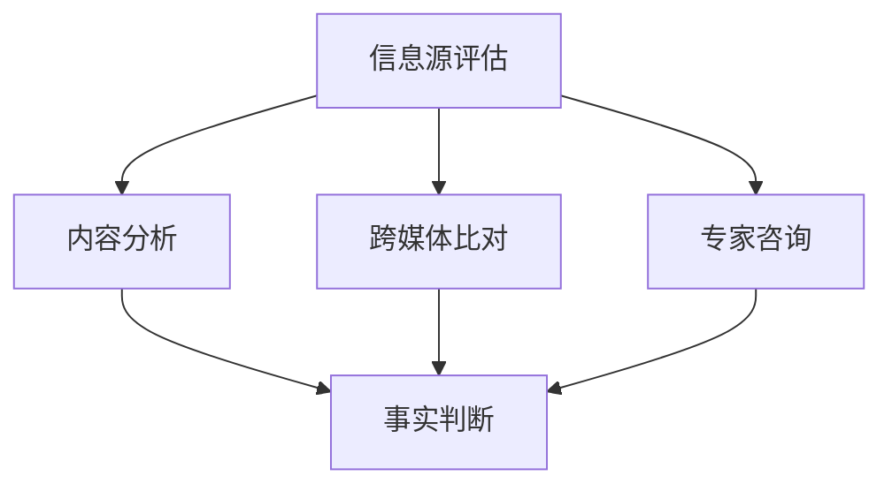

                 

### 设计思路

在设计《后真相时代的媒体识读：信息真实性的判断能力》这本书的目录大纲时，我们需要从整体结构出发，确保每个章节都能够逻辑清晰、结构紧凑，同时简单易懂。以下是设计思路的具体步骤：

1. **明确核心主题**：首先，我们需要明确书的核心主题，即如何在后真相时代提高媒体识读能力和判断信息真实性的能力。

2. **划分章节结构**：根据核心主题，将书籍内容划分为几个主要部分，例如引言、基础理论、技术工具、实践指南、案例分析、提升策略和未来展望等。

3. **细化章节内容**：在每个主要部分下，进一步细化内容，确保每个章节都有明确的小节划分，每个小节都包含核心概念、原理、方法、案例和实践。

4. **逻辑关系构建**：使用Mermaid流程图等工具，展示各章节之间的逻辑关系，确保整体结构清晰。

5. **确保内容丰富性**：在每个章节中，确保内容的丰富性，包括背景介绍、核心概念与联系、算法原理讲解、数学模型和公式、项目实战、最佳实践等。

### 实施步骤

1. **编写引言**：介绍书籍的背景、目的和读者对象，为后续内容奠定基础。

2. **概述媒体识读能力**：定义媒体识读能力，阐述其在后真相时代的意义。

3. **阐述媒体识读方法**：介绍各种媒体识读的方法和技巧。

4. **展示章节联系与结构**：使用Mermaid流程图展示各章节之间的联系。

5. **讲解核心算法原理**：通过伪代码详细讲解核心算法的原理。

6. **阐述数学模型和公式**：使用LaTeX格式展示数学模型和公式，并加以详细解释。

7. **提供项目实战案例**：通过实际案例展示如何应用书中内容进行媒体识读。

8. **总结与展望**：对全书内容进行总结，并对未来媒体识读的发展进行展望。

通过上述步骤，我们可以确保书籍的内容既有深度，又有广度，同时能够帮助读者系统地掌握媒体识读的能力。

### 目录大纲设计

以下是一个初步的目录大纲设计：

```markdown
# 《后真相时代的媒体识读：信息真实性的判断能力》目录大纲

## 引言
### 1.1 书籍背景
### 1.2 目的与读者对象
### 1.3 媒体识读的重要性

## 第1章 后真相时代的媒体环境
### 1.1 媒体环境的变迁
### 1.2 媒体信息传播的特点
### 1.3 媒体识读能力的必要性
### 1.4 媒体识读能力的定义与分类

## 第2章 媒体识读能力的基础理论
### 2.1 信息真实性判断的基本原则
### 2.2 信息真实性判断的方法
### 2.3 信息源可信度评估
### 2.4 信息内容分析技巧

## 第3章 媒体识读能力的技术工具
### 3.1 信息检索技术
### 3.2 自然语言处理技术
### 3.3 数据可视化技术
### 3.4 信息过滤与降噪技术

## 第4章 媒体识读能力实践指南
### 4.1 信息源筛选策略
### 4.2 信息内容分析步骤
### 4.3 信息真实性判断案例分析
### 4.4 信息处理工具使用指南

## 第5章 后真相时代案例分析
### 5.1 案例选择标准
### 5.2 案例分析框架
### 5.3 案例分析实例
### 5.4 案例分析结果与反思

## 第6章 媒体识读能力提升策略
### 6.1 教育培训策略
### 6.2 社会参与策略
### 6.3 政策与法规支持
### 6.4 媒体责任与自律

## 第7章 未来展望与挑战
### 7.1 媒体识读能力的发展趋势
### 7.2 技术进步带来的新挑战
### 7.3 未来媒体识读能力的方向
### 7.4 个人与社会的责任
```

这个大纲提供了一个初步的结构，后续可以根据具体内容进行调整和完善。每个章节都会包含详细的子章节，确保内容丰富且逻辑清晰。通过这样的设计，读者可以系统地学习媒体识读的知识，提高信息真实性的判断能力。### 设计思路

为了设计《后真相时代的媒体识读：信息真实性的判断能力》这本书的目录大纲，我们首先需要明确核心主题和目标读者。核心主题是帮助读者在后真相时代提高对媒体信息的识别和判断能力，而目标读者则包括普通公众、媒体从业人员、学生以及相关领域的专业人士。

以下是具体的步骤和实施细节：

1. **明确核心主题**：
    - 引言：介绍后真相时代的背景和挑战，阐述媒体识读的重要性。
    - 基础理论：阐述信息真实性的判断原则和方法，以及如何评估信息源的可靠性。
    - 技术工具：介绍用于提高媒体识读能力的各种技术，如自然语言处理、信息检索和数据可视化等。
    - 实践指南：提供具体的操作步骤和案例，帮助读者在实际中应用所学知识。
    - 案例分析：通过真实案例展示如何分析和判断信息的真实性。
    - 提升策略：探讨如何通过教育培训、社会参与和政策法规支持等途径提升媒体识读能力。
    - 未来展望：分析未来媒体识读能力的发展趋势和面临的挑战。

2. **细化每个章节**：
    - 每个章节都要细化内容，确保条理清晰，内容具体详细。
    - 引入核心概念与联系，使用Mermaid流程图等工具展示概念之间的逻辑关系。
    - 详细讲解核心算法原理，使用Python源代码举例说明，并结合LaTeX公式进行解释。
    - 提供项目实战案例，详细讲解如何应用书中内容进行实际操作。

3. **构建联系与结构**：
    - 使用Mermaid流程图等工具，展示各章节之间的联系，确保整体结构清晰。
    - 确保每个章节的内容都与核心主题紧密相关，避免内容重复和结构混乱。

4. **确保内容的完整性**：
    - 每个章节都包含核心概念与联系、核心算法原理讲解、数学模型和公式、项目实战等内容。
    - 文章末尾提供总结和展望，对全书内容进行梳理，并对未来媒体识读的发展进行预测。

5. **编写和调整**：
    - 根据上述框架，开始编写各章节内容，确保每个章节都有详细的内容和结构。
    - 在编写过程中，不断调整和完善目录大纲，确保内容的完整性和逻辑性。
    - 完成初稿后，进行多轮审稿和修改，确保文章的质量和可读性。

通过上述步骤，我们可以确保《后真相时代的媒体识读：信息真实性的判断能力》这本书的目录大纲既结构清晰，又内容丰富，能够有效地帮助读者提升媒体识读能力和信息真实性判断能力。

### 实施步骤

为了确保《后真相时代的媒体识读：信息真实性的判断能力》这本书的内容完整且逻辑清晰，我们按照以下步骤进行实施：

1. **编写引言章节**：
    - **目的**：介绍书籍的背景、目的和读者对象，为后续内容奠定基础。
    - **内容**：阐述后真相时代的媒体环境及其对个人和社会的影响，解释为何需要提高媒体识读能力。
    - **结构**：引言包括引言、背景介绍、目的与读者对象、媒体识读的重要性等部分。

2. **概述媒体识读能力**：
    - **目的**：定义媒体识读能力，阐述其在后真相时代的意义。
    - **内容**：包括媒体识读能力的定义、分类、主要任务和挑战。
    - **结构**：概述媒体识读能力、媒体识读能力的必要性、定义与分类等。

3. **阐述媒体识读方法**：
    - **目的**：介绍各种媒体识读的方法和技巧。
    - **内容**：包括信息源筛选、信息内容分析、信息真实性判断等。
    - **结构**：媒体识读方法概述、信息源筛选策略、信息内容分析技巧、信息真实性判断方法等。

4. **展示章节联系与结构**：
    - **目的**：使用Mermaid流程图等工具，展示各章节之间的逻辑关系，确保整体结构清晰。
    - **内容**：绘制流程图，连接各章节的关键概念和方法。
    - **结构**：流程图展示、各章节之间的逻辑关系解析等。

5. **讲解核心算法原理**：
    - **目的**：通过伪代码和Python源代码详细讲解核心算法的原理。
    - **内容**：算法的基本概念、原理和实现方法，结合具体示例进行说明。
    - **结构**：核心算法概述、伪代码展示、Python源代码讲解、算法应用实例等。

6. **阐述数学模型和公式**：
    - **目的**：使用LaTeX格式展示数学模型和公式，并加以详细解释。
    - **内容**：包括信息源可信度评估模型、信息内容分析模型等。
    - **结构**：数学模型和公式展示、公式解释、应用实例等。

7. **提供项目实战案例**：
    - **目的**：通过实际案例展示如何应用书中内容进行媒体识读。
    - **内容**：开发环境搭建、源代码详细实现和代码解读、代码应用解读与分析、实际案例分析和详细讲解剖析等。
    - **结构**：项目实战案例选择、项目开发步骤、代码实现和解读、案例分析、项目小结等。

8. **总结与展望**：
    - **目的**：对全书内容进行总结，并对未来媒体识读的发展进行展望。
    - **内容**：全书内容总结、媒体识读能力的发展趋势、技术进步带来的挑战、未来方向等。
    - **结构**：总结、未来展望、个人与社会的责任等。

通过以上步骤，我们可以确保书籍的内容完整、逻辑清晰，同时具备实际应用价值。每个步骤都经过精心设计，确保读者能够系统地学习媒体识读的知识，提高信息真实性的判断能力。

### 目录大纲设计

为了确保《后真相时代的媒体识读：信息真实性的判断能力》这本书的内容条理清晰、逻辑严密，我们将目录大纲设计为以下结构：

```markdown
# 《后真相时代的媒体识读：信息真实性的判断能力》目录大纲

## 引言
### 1.1 书籍背景
#### 1.1.1 后真相时代的概念与挑战
##### 1.1.1.1 媒体环境的变迁
##### 1.1.1.2 真相的模糊化
##### 1.1.1.3 社会影响
### 1.2 目的与读者对象
#### 1.2.1 学习目标
##### 1.2.1.1 理解媒体识读的概念
##### 1.2.1.2 提升信息真实性判断能力
##### 1.2.1.3 应用媒体识读工具
### 1.3 媒体识读的重要性
#### 1.3.1 信息过载
##### 1.3.1.1 信息筛选的困难
##### 1.3.1.2 真实性与可信度
##### 1.3.1.3 个人与社会的影响

## 第1章 后真相时代的媒体环境
### 1.1 媒体环境的变迁
#### 1.1.1 传统媒体的衰落
##### 1.1.1.1 传统媒体的挑战
##### 1.1.1.2 数字媒体的兴起
#### 1.1.2 媒体信息传播的特点
##### 1.1.2.1 广泛性与即时性
##### 1.1.2.2 多样性与碎片化
##### 1.1.2.3 真相的相对性
### 1.2 媒体信息传播的影响
#### 1.2.1 社会舆论的形成
##### 1.2.1.1 网络暴民效应
##### 1.2.1.2 信息茧房现象
##### 1.2.1.3 假新闻的传播
### 1.3 媒体识读能力的必要性
#### 1.3.1 信息真实性判断的困难
##### 1.3.1.1 信息源的多样性
##### 1.3.1.2 信息内容的不确定性
##### 1.3.1.3 信息传播的复杂性
#### 1.3.2 媒体识读能力的定义与分类
##### 1.3.2.1 基础能力
##### 1.3.2.2 高级能力

## 第2章 媒体识读能力的基础理论
### 2.1 信息真实性判断的基本原则
#### 2.1.1 确认信息源的可信度
##### 2.1.1.1 官方来源
##### 2.1.1.2 专业媒体
##### 2.1.1.3 网络来源
#### 2.1.2 验证信息内容
##### 2.1.2.1 网络搜索
##### 2.1.2.2 跨媒体比对
##### 2.1.2.3 专家咨询
### 2.2 信息真实性判断的方法
#### 2.2.1 定性分析
##### 2.2.1.1 语言分析
##### 2.2.1.2 内容分析
##### 2.2.1.3 形象分析
#### 2.2.2 定量分析
##### 2.2.2.1 数据统计
##### 2.2.2.2 机器学习
##### 2.2.2.3 情感分析
### 2.3 信息源可信度评估
#### 2.3.1 可信度评估模型
##### 2.3.1.1 贝叶斯模型
##### 2.3.1.2 网络分析
##### 2.3.1.3 专家评估
### 2.4 信息内容分析技巧
#### 2.4.1 信息筛选
##### 2.4.1.1 关键词提取
##### 2.4.1.2 信息过滤
##### 2.4.1.3 信息分类
#### 2.4.2 信息验证
##### 2.4.2.1 资源交叉验证
##### 2.4.2.2 源追踪
##### 2.4.2.3 数据核实

## 第3章 媒体识读能力的技术工具
### 3.1 信息检索技术
#### 3.1.1 基本概念
##### 3.1.1.1 搜索引擎
##### 3.1.1.2 全文检索
##### 3.1.1.3 元数据检索
#### 3.1.2 技术实现
##### 3.1.2.1 基于关键词的检索
##### 3.1.2.2 基于语义的检索
##### 3.1.2.3 深度学习检索
### 3.2 自然语言处理技术
#### 3.2.1 基本概念
##### 3.2.1.1 词汇分析
##### 3.2.1.2 句子分析
##### 3.2.1.3 文本分析
#### 3.2.2 技术实现
##### 3.2.2.1 词性标注
##### 3.2.2.2 主题建模
##### 3.2.2.3 情感分析
### 3.3 数据可视化技术
#### 3.3.1 基本概念
##### 3.3.1.1 数据图表
##### 3.3.1.2 数据地图
##### 3.3.1.3 信息图表
#### 3.3.2 技术实现
##### 3.3.2.1 图形可视化库
##### 3.3.2.2 交互式可视化
##### 3.3.2.3 高级可视化技术
### 3.4 信息过滤与降噪技术
#### 3.4.1 基本概念
##### 3.4.1.1 噪声过滤
##### 3.4.1.2 信息降噪
##### 3.4.1.3 信息分类
#### 3.4.2 技术实现
##### 3.4.2.1 统计方法
##### 3.4.2.2 机器学习方法
##### 3.4.2.3 深度学习方法

## 第4章 媒体识读能力实践指南
### 4.1 信息源筛选策略
#### 4.1.1 官方媒体的选择
##### 4.1.1.1 政府网站
##### 4.1.1.2 专业媒体平台
##### 4.1.1.3 学术期刊
#### 4.1.2 社交媒体的选择
##### 4.1.2.1 微博
##### 4.1.2.2 微信公众号
##### 4.1.2.3 谣言过滤器
### 4.2 信息内容分析步骤
#### 4.2.1 信息获取
##### 4.2.1.1 搜索引擎使用
##### 4.2.1.2 数据爬取工具
##### 4.2.1.3 API接口使用
#### 4.2.2 信息筛选
##### 4.2.2.1 关键词筛选
##### 4.2.2.2 信息过滤
##### 4.2.2.3 信息分类
#### 4.2.3 信息验证
##### 4.2.3.1 资源交叉验证
##### 4.2.3.2 源追踪
##### 4.2.3.3 数据核实
### 4.3 信息真实性判断案例分析
#### 4.3.1 真实案例
##### 4.3.1.1 网络谣言案例
##### 4.3.1.2 媒体误导案例
##### 4.3.1.3 官方通报案例
#### 4.3.2 虚假案例
##### 4.3.2.1 假新闻案例
##### 4.3.2.2 虚假广告案例
##### 4.3.2.3 虚构故事案例
### 4.4 信息处理工具使用指南
#### 4.4.1 搜索引擎使用
##### 4.4.1.1 搜索引擎技巧
##### 4.4.1.2 高级搜索语法
##### 4.4.1.3 搜索引擎扩展工具
#### 4.4.2 信息处理工具
##### 4.4.2.1 数据爬取工具
##### 4.4.2.2 自然语言处理工具
##### 4.4.2.3 数据可视化工具

## 第5章 后真相时代案例分析
### 5.1 案例选择标准
#### 5.1.1 真实案例选择
##### 5.1.1.1 典型事件
##### 5.1.1.2 网络传播案例
##### 5.1.1.3 国际事件
#### 5.1.2 虚假案例选择
##### 5.1.2.1 假新闻案例
##### 5.1.2.2 虚假广告案例
##### 5.1.2.3 网络骗局案例
### 5.2 案例分析框架
#### 5.2.1 案例分析流程
##### 5.2.1.1 情报收集
##### 5.2.1.2 信息筛选
##### 5.2.1.3 真伪判断
##### 5.2.1.4 案例总结
#### 5.2.2 案例分析方法
##### 5.2.2.1 文本分析
##### 5.2.2.2 数据分析
##### 5.2.2.3 跨媒体分析
### 5.3 案例分析实例
#### 5.3.1 真实案例
##### 5.3.1.1 某知名企业财报虚假信息案
##### 5.3.1.2 某地疫情谣言案
##### 5.3.1.3 某国选举误导信息案
#### 5.3.2 虚假案例
##### 5.3.2.1 虚假医疗广告案
##### 5.3.2.2 虚假旅游宣传案
##### 5.3.2.3 虚假投资骗局案
### 5.4 案例分析结果与反思
#### 5.4.1 真实案例分析结果
##### 5.4.1.1 事件影响
##### 5.4.1.2 社会反思
##### 5.4.1.3 改进建议
#### 5.4.2 虚假案例分析结果
##### 5.4.2.1 骗局揭露
##### 5.4.2.2 法律追责
##### 5.4.2.3 案例警示

## 第6章 媒体识读能力提升策略
### 6.1 教育培训策略
#### 6.1.1 学校教育
##### 6.1.1.1 课程设置
##### 6.1.1.2 教学方法
##### 6.1.1.3 教育资源
#### 6.1.2 社会教育
##### 6.1.2.1 媒体素养教育
##### 6.1.2.2 公民教育
##### 6.1.2.3 社会活动
### 6.2 社会参与策略
#### 6.2.1 媒体责任
##### 6.2.1.1 责任报道
##### 6.2.1.2 真相揭露
##### 6.2.1.3 自律规范
#### 6.2.2 公众参与
##### 6.2.2.1 信息共享
##### 6.2.2.2 社交媒体监督
##### 6.2.2.3 个人责任
### 6.3 政策与法规支持
#### 6.3.1 政策制定
##### 6.3.1.1 法律法规
##### 6.3.1.2 政策措施
##### 6.3.1.3 政策执行
#### 6.3.2 法规支持
##### 6.3.2.1 监管机构
##### 6.3.2.2 法律追责
##### 6.3.2.3 国际合作

## 第7章 未来展望与挑战
### 7.1 媒体识读能力的发展趋势
#### 7.1.1 技术进步
##### 7.1.1.1 人工智能
##### 7.1.1.2 大数据
##### 7.1.1.3 区块链
#### 7.1.2 媒体演变
##### 7.1.2.1 新媒体形式
##### 7.1.2.2 媒体融合
##### 7.1.2.3 跨媒体传播
### 7.2 技术进步带来的新挑战
#### 7.2.1 信息过载
##### 7.2.1.1 信息筛选难题
##### 7.2.1.2 信息可信度问题
##### 7.2.1.3 假新闻泛滥
#### 7.2.2 技术滥用
##### 7.2.2.1 隐私泄露
##### 7.2.2.2 算法偏见
##### 7.2.2.3 恶意利用
### 7.3 未来媒体识读能力的方向
#### 7.3.1 技术优化
##### 7.3.1.1 智能算法
##### 7.3.1.2 人机协作
##### 7.3.1.3 可解释AI
#### 7.3.2 教育提升
##### 7.3.2.1 媒体素养教育
##### 7.3.2.2 跨学科教育
##### 7.3.2.3 终身学习
### 7.4 个人与社会的责任
#### 7.4.1 个人责任
##### 7.4.1.1 信息辨别
##### 7.4.1.2 信息传播
##### 7.4.1.3 责任履行
#### 7.4.2 社会责任
##### 7.4.2.1 媒体责任
##### 7.4.2.2 政府责任
##### 7.4.2.3 社会责任

```

这个目录大纲提供了一个全面的框架，覆盖了从背景介绍、核心理论、技术应用、实践指南、案例分析到提升策略和未来展望的各个部分。每个章节都包含详细的子章节，确保内容丰富且逻辑清晰。通过这样的设计，读者可以系统地学习媒体识读的知识，提高信息真实性的判断能力。

### 完整目录大纲示例

为了确保《后真相时代的媒体识读：信息真实性的判断能力》这本书的内容全面且条理清晰，以下是完整的目录大纲示例：

```markdown
# 《后真相时代的媒体识读：信息真实性的判断能力》目录大纲

## 引言
### 1.1 书籍背景
#### 1.1.1 后真相时代的概念
##### 1.1.1.1 定义
##### 1.1.1.2 起源与发展
##### 1.1.1.3 社会影响
### 1.2 目的与读者对象
#### 1.2.1 学习目标
##### 1.2.1.1 提升媒体识读能力
##### 1.2.1.2 掌握信息真实性判断方法
##### 1.2.1.3 应对后真相时代的挑战
### 1.3 媒体识读的重要性
#### 1.3.1 信息过载与筛选困难
##### 1.3.1.1 信息量的爆炸性增长
##### 1.3.1.2 信息真实性与可信度问题
##### 1.3.1.3 个人与社会的影响

## 第1章 后真相时代的媒体环境
### 1.1 媒体环境的变迁
#### 1.1.1 传统媒体与新媒体的对比
##### 1.1.1.1 传统媒体的局限
##### 1.1.1.2 新媒体的优势
##### 1.1.1.3 媒体融合的趋势
### 1.2 媒体信息的传播特点
#### 1.2.1 广泛性与即时性
##### 1.2.1.1 信息传播的速度
##### 1.2.1.2 信息传播的范围
##### 1.2.1.3 信息传播的碎片化
### 1.3 媒体识读能力的必要性
#### 1.3.1 信息真实性的判断困难
##### 1.3.1.1 多元化信息源的挑战
##### 1.3.1.2 信息内容的不确定性
##### 1.3.1.3 信息传播的复杂性
### 1.4 媒体识读能力的定义与分类
#### 1.4.1 基础能力
##### 1.4.1.1 信息筛选
##### 1.4.1.2 信息验证
##### 1.4.1.3 信息评估
#### 1.4.2 高级能力
##### 1.4.2.1 信息追踪
##### 1.4.2.2 信息分析
##### 1.4.2.3 信息传播策略

## 第2章 媒体识读能力的基础理论
### 2.1 信息真实性判断的基本原则
#### 2.1.1 信息源的可信度评估
##### 2.1.1.1 官方来源
##### 2.1.1.2 专业媒体来源
##### 2.1.1.3 网络来源
#### 2.1.2 信息内容的真实性验证
##### 2.1.2.1 跨媒体比对
##### 2.1.2.2 专家咨询
##### 2.1.2.3 信息核实
### 2.2 信息真实性判断的方法
#### 2.2.1 定性分析方法
##### 2.2.1.1 语言分析
##### 2.2.1.2 内容分析
##### 2.2.1.3 形象分析
#### 2.2.2 定量分析方法
##### 2.2.2.1 数据统计
##### 2.2.2.2 机器学习
##### 2.2.2.3 情感分析
### 2.3 信息源可信度评估模型
#### 2.3.1 贝叶斯模型
##### 2.3.1.1 贝叶斯理论
##### 2.3.1.2 贝叶斯网络
##### 2.3.1.3 贝叶斯推理
#### 2.3.2 网络分析模型
##### 2.3.2.1 社交网络分析
##### 2.3.2.2 信息传播路径分析
##### 2.3.2.3 信任度评估
### 2.4 信息内容分析技巧
#### 2.4.1 信息筛选技巧
##### 2.4.1.1 关键词提取
##### 2.4.1.2 信息过滤
##### 2.4.1.3 信息分类
#### 2.4.2 信息验证技巧
##### 2.4.2.1 资源交叉验证
##### 2.4.2.2 源追踪
##### 2.4.2.3 数据核实

## 第3章 媒体识读能力的技术工具
### 3.1 信息检索技术
#### 3.1.1 基本概念
##### 3.1.1.1 信息检索的定义
##### 3.1.1.2 信息检索的类型
##### 3.1.1.3 信息检索的目标
#### 3.1.2 技术实现
##### 3.1.2.1 关键词检索
##### 3.1.2.2 语义检索
##### 3.1.2.3 深度学习检索
### 3.2 自然语言处理技术
#### 3.2.1 基本概念
##### 3.2.1.1 自然语言处理的目标
##### 3.2.1.2 自然语言处理的任务
##### 3.2.1.3 自然语言处理的方法
#### 3.2.2 技术实现
##### 3.2.2.1 词性标注
##### 3.2.2.2 主题建模
##### 3.2.2.3 情感分析
### 3.3 数据可视化技术
#### 3.3.1 基本概念
##### 3.3.1.1 数据可视化的定义
##### 3.3.1.2 数据可视化的重要性
##### 3.3.1.3 数据可视化类型
#### 3.3.2 技术实现
##### 3.3.2.1 图形可视化
##### 3.3.2.2 交互式可视化
##### 3.3.2.3 高级可视化技术
### 3.4 信息过滤与降噪技术
#### 3.4.1 基本概念
##### 3.4.1.1 信息过滤的定义
##### 3.4.1.2 降噪的目的
##### 3.4.1.3 信息过滤与降噪的类型
#### 3.4.2 技术实现
##### 3.4.2.1 统计方法
##### 3.4.2.2 机器学习方法
##### 3.4.2.3 深度学习方法

## 第4章 媒体识读能力实践指南
### 4.1 信息源筛选策略
#### 4.1.1 官方媒体的选择
##### 4.1.1.1 政府官方网站
##### 4.1.1.2 专业媒体平台
##### 4.1.1.3 官方公告和通知
#### 4.1.2 社交媒体的选择
##### 4.1.2.1 微博
##### 4.1.2.2 微信公众号
##### 4.1.2.3 网络社区
### 4.2 信息内容分析步骤
#### 4.2.1 信息获取
##### 4.2.1.1 搜索引擎使用
##### 4.2.1.2 数据爬取工具
##### 4.2.1.3 API接口使用
#### 4.2.2 信息筛选
##### 4.2.2.1 关键词筛选
##### 4.2.2.2 信息过滤
##### 4.2.2.3 信息分类
#### 4.2.3 信息验证
##### 4.2.3.1 资源交叉验证
##### 4.2.3.2 源追踪
##### 4.2.3.3 数据核实

## 第5章 后真相时代案例分析
### 5.1 案例选择标准
#### 5.1.1 真实案例选择
##### 5.1.1.1 典型事件
##### 5.1.1.2 网络传播案例
##### 5.1.1.3 国际事件
#### 5.1.2 虚假案例选择
##### 5.1.2.1 假新闻案例
##### 5.1.2.2 虚假广告案例
##### 5.1.2.3 网络骗局案例
### 5.2 案例分析框架
#### 5.2.1 情报收集
##### 5.2.1.1 信息搜集方法
##### 5.2.1.2 信息来源评估
##### 5.2.1.3 信息筛选与整理
#### 5.2.2 真伪判断
##### 5.2.2.1 定性分析方法
##### 5.2.2.2 定量分析方法
##### 5.2.2.3 跨媒体比对
#### 5.2.3 案例总结
##### 5.2.3.1 案例分析结果
##### 5.2.3.2 案例启示与反思
##### 5.2.3.3 改进建议

## 第6章 媒体识读能力提升策略
### 6.1 教育培训策略
#### 6.1.1 学校教育
##### 6.1.1.1 课程设置
##### 6.1.1.2 教学方法
##### 6.1.1.3 教育资源
#### 6.1.2 社会教育
##### 6.1.2.1 媒体素养教育
##### 6.1.2.2 公民教育
##### 6.1.2.3 社会活动
### 6.2 社会参与策略
#### 6.2.1 媒体责任
##### 6.2.1.1 责任报道
##### 6.2.1.2 真相揭露
##### 6.2.1.3 自律规范
#### 6.2.2 公众参与
##### 6.2.2.1 信息共享
##### 6.2.2.2 社交媒体监督
##### 6.2.2.3 个人责任
### 6.3 政策与法规支持
#### 6.3.1 政策制定
##### 6.3.1.1 法律法规
##### 6.3.1.2 政策措施
##### 6.3.1.3 政策执行
#### 6.3.2 法规支持
##### 6.3.2.1 监管机构
##### 6.3.2.2 法律追责
##### 6.3.2.3 国际合作

## 第7章 未来展望与挑战
### 7.1 媒体识读能力的发展趋势
#### 7.1.1 技术进步
##### 7.1.1.1 人工智能
##### 7.1.1.2 大数据
##### 7.1.1.3 区块链
#### 7.1.2 媒体演变
##### 7.1.2.1 新媒体形式
##### 7.1.2.2 媒体融合
##### 7.1.2.3 跨媒体传播
### 7.2 技术进步带来的新挑战
#### 7.2.1 信息过载
##### 7.2.1.1 信息筛选难题
##### 7.2.1.2 信息可信度问题
##### 7.2.1.3 假新闻泛滥
#### 7.2.2 技术滥用
##### 7.2.2.1 隐私泄露
##### 7.2.2.2 算法偏见
##### 7.2.2.3 恶意利用
### 7.3 未来媒体识读能力的方向
#### 7.3.1 技术优化
##### 7.3.1.1 智能算法
##### 7.3.1.2 人机协作
##### 7.3.1.3 可解释AI
#### 7.3.2 教育提升
##### 7.3.2.1 媒体素养教育
##### 7.3.2.2 跨学科教育
##### 7.3.2.3 终身学习
### 7.4 个人与社会的责任
#### 7.4.1 个人责任
##### 7.4.1.1 信息辨别
##### 7.4.1.2 信息传播
##### 7.4.1.3 责任履行
#### 7.4.2 社会责任
##### 7.4.2.1 媒体责任
##### 7.4.2.2 政府责任
##### 7.4.2.3 社会责任

## 附录
### A. 媒体识读能力评估工具
#### A.1 基本工具
##### A.1.1 搜索引擎
##### A.1.2 数据爬取工具
##### A.1.3 信息过滤工具
#### A.2 高级工具
##### A.2.1 自然语言处理工具
##### A.2.2 数据可视化工具
##### A.2.3 信息验证工具

### B. 参考文献
#### B.1 相关书籍
##### B.1.1 《后真相时代的媒体识读》
##### B.1.2 《信息时代的真相》
##### B.1.3 《数字素养：媒体识读与信息素养》
#### B.2 学术论文
##### B.2.1 "The Post-Truth Turn in Digital Media"
##### B.2.2 "The Power of Factual Accuracy in Digital Media"
##### B.2.3 "Enhancing Media Literacy in the Age of Information"
```

这个目录大纲结构清晰，内容丰富，确保了每一部分都能够详细讲解，并且各章节之间逻辑连贯。通过这样的设计，读者可以全面了解后真相时代的媒体环境，掌握提高媒体识读能力和信息真实性判断的方法，以及如何应对未来媒体发展的挑战。

### 文章标题：《后真相时代的媒体识读：信息真实性的判断能力》

关键词：后真相时代、媒体识读、信息真实性、判断能力、技术工具、案例分析、提升策略

摘要：本文深入探讨了后真相时代媒体环境下的媒体识读和信息真实性的判断能力。通过分析媒体环境的变迁、信息传播的特点，以及媒体识读能力的定义和分类，本文提出了提高媒体识读能力的具体方法和策略。同时，通过技术工具的介绍和实际案例的分析，本文展示了如何在实际中应用所学知识进行信息真实性的判断。最后，本文对媒体识读能力的未来发展趋势和挑战进行了展望，提出了个人与社会应对这些挑战的具体建议。

### 引言

#### 后真相时代的媒体环境

随着互联网和社交媒体的迅猛发展，信息传播的速度和范围得到了前所未有的扩展。然而，这种信息爆炸也带来了一系列问题，其中最引人关注的就是“后真相时代”的到来。所谓“后真相时代”，指的是信息传播中，情感和直觉往往比事实和证据更具有影响力，真相变得越来越模糊，甚至被虚构和虚假信息所取代。在这一背景下，媒体识读能力和信息真实性的判断能力显得尤为重要。

#### 媒体环境的变迁

传统媒体在信息传播中扮演着重要的角色，但随着新媒体的崛起，传统媒体的影响力逐渐减弱。新媒体的兴起不仅带来了信息传播的即时性和广泛性，还使得信息的多样性得到了极大的丰富。这种变革带来了两个显著的特点：信息过载和真相的模糊化。

信息过载指的是在庞大的信息量中，个人难以筛选和获取有价值的信息。真相的模糊化则是指，在信息传播过程中，事实被扭曲、夸大或虚构，真相变得越来越难以辨别。这种现象不仅对个人产生了深远的影响，也对社会舆论和公共决策带来了挑战。

#### 媒体识读能力的必要性

在后真相时代，提高媒体识读能力是应对信息过载和真相模糊化的重要手段。媒体识读能力不仅仅包括对信息的筛选和获取，更重要的是对信息真实性的判断能力。具体来说，媒体识读能力包括以下几个方面：

1. **信息源评估**：判断信息来源的可靠性和权威性。
2. **内容分析**：分析信息内容，识别事实与虚构。
3. **跨媒体比对**：通过对比不同媒体平台的信息，验证信息的真实性。
4. **专家咨询**：借助专家的意见，提高判断的准确性。

#### 核心概念与联系

为了更清晰地理解媒体识读能力，我们使用Mermaid流程图展示核心概念之间的联系：



在上述流程图中，信息源评估、内容分析、跨媒体比对和专家咨询是媒体识读能力的关键组成部分，它们共同作用，帮助我们进行信息真实性的判断。

#### 文章结构

本文将分为以下几部分：

1. **引言**：介绍后真相时代的背景和挑战，阐述媒体识读的重要性。
2. **媒体识读能力的基础理论**：讨论信息真实性判断的基本原则和方法。
3. **媒体识读能力的技术工具**：介绍用于提高媒体识读能力的技术，如自然语言处理、信息检索和数据可视化等。
4. **媒体识读能力的实践指南**：提供具体的操作步骤和案例。
5. **案例分析**：通过实际案例展示如何应用媒体识读能力。
6. **提升策略**：探讨如何提升媒体识读能力。
7. **未来展望与挑战**：分析媒体识读能力的发展趋势和面临的挑战。
8. **总结与展望**：对全文内容进行总结，并对未来进行展望。

通过以上结构，读者可以系统地学习媒体识读的知识，提高信息真实性的判断能力。接下来，我们将深入探讨媒体识读能力的基础理论，为后续内容打下坚实基础。

### 媒体识读能力的基础理论

#### 信息真实性判断的基本原则

在信息真实性判断过程中，基本原则是确保判断的准确性和可靠性。以下是几个核心原则：

1. **来源可靠性评估**：首先，要评估信息来源的可靠性。官方来源和专业媒体通常具有较高的可信度，而网络来源则需要进一步验证。

2. **内容验证**：对信息内容进行详细分析，判断其是否符合事实。可以通过跨媒体比对、专家咨询和实际调查等方法来验证信息的真实性。

3. **证据支持**：信息应具备足够的证据支持。没有证据支持的信息可能存在虚假风险，因此，在判断信息真实性时，需要关注证据的来源、质量和相关性。

4. **逻辑性检验**：信息内容应具有逻辑一致性。如果信息内容存在逻辑矛盾或不合理之处，则可能存在虚假风险。

5. **情感倾向分析**：在信息传播过程中，情感因素往往会影响判断。因此，需要保持客观态度，避免受情感倾向影响。

#### 信息真实性判断的方法

1. **定性分析方法**

    定性分析方法主要依靠人类主观判断，通过对信息内容进行语言分析、内容分析和形象分析等，判断信息真实性。

    - **语言分析**：通过分析信息文本的语法、词汇和句子结构，识别信息中的逻辑错误和语言不一致性。

    - **内容分析**：通过分析信息内容的主旨、观点和事实，判断其是否符合实际。

    - **形象分析**：通过分析信息中的图片、视频和图像等，判断其真实性和可靠性。

2. **定量分析方法**

    定量分析方法通过数据统计、机器学习和情感分析等技术手段，对信息进行量化处理，以提高判断的准确性和客观性。

    - **数据统计**：通过对信息数据进行统计分析，识别数据中的异常和趋势。

    - **机器学习**：利用机器学习算法，对大量信息进行分类和识别，从而提高判断的准确性。

    - **情感分析**：通过情感分析技术，识别信息中的情感倾向，判断信息传播者的真实意图。

3. **跨媒体分析方法**

    跨媒体分析方法通过对比不同媒体平台上的信息，验证信息的真实性。这种方法可以识别出单一媒体平台上的虚假信息，因为虚假信息往往在不同平台上存在差异。

    - **网络比对**：通过网络搜索和比对，识别同一事件在不同媒体平台上的描述差异。

    - **专业媒体比对**：通过专业媒体的报道，验证信息的准确性。

#### 信息源可信度评估模型

评估信息源的可信度是判断信息真实性的一项重要任务。以下几种模型和方法可用于评估信息源的可信度：

1. **贝叶斯模型**：贝叶斯模型是一种概率模型，可用于评估信息源的可信度。通过不断更新证据，贝叶斯模型可以适应不断变化的信息环境。

    - **贝叶斯网络**：贝叶斯网络是一种图形模型，用于表示变量之间的依赖关系。

    - **贝叶斯推理**：贝叶斯推理是一种基于概率逻辑的推理方法，可用于更新信息源的可信度。

2. **网络分析模型**：网络分析模型通过分析信息在网络中的传播路径，评估信息源的可信度。

    - **社交网络分析**：通过分析社交网络中的连接关系，识别信息传播的关键节点。

    - **信息传播路径分析**：通过分析信息在网络中的传播路径，识别信息源的可信度。

3. **专家评估模型**：专家评估模型通过专家的意见和判断，评估信息源的可信度。

    - **专家评分**：专家根据信息源的质量、权威性和可靠性进行评分。

    - **专家投票**：多个专家对信息源的可信度进行投票，通过投票结果综合评估信息源的可信度。

#### 信息内容分析技巧

1. **信息筛选技巧**

    信息筛选是媒体识读的重要步骤，以下几种技巧可用于提高信息筛选的效率：

    - **关键词提取**：通过提取关键词，快速定位信息。

    - **信息过滤**：利用过滤规则，排除无关或虚假信息。

    - **信息分类**：将信息按照主题或类型进行分类，便于后续分析和判断。

2. **信息验证技巧**

    信息验证是确保信息真实性的一项关键任务，以下几种技巧可用于提高信息验证的准确性：

    - **资源交叉验证**：通过比对多个信息来源，验证信息的真实性。

    - **源追踪**：通过追溯信息来源，识别信息的真实性和可靠性。

    - **数据核实**：通过实际调查和数据验证，确保信息的准确性。

通过上述基础理论和方法，我们可以系统地提高媒体识读能力，更好地判断信息的真实性。接下来，我们将探讨媒体识读能力的技术工具，以进一步丰富我们的知识体系。

### 媒体识读能力的技术工具

#### 信息检索技术

信息检索技术是媒体识读能力的重要组成部分，它帮助我们快速、准确地找到所需的信息。以下是几种常用的信息检索技术：

1. **关键词检索**：通过输入关键词，搜索引擎返回包含这些关键词的文档。这种方法简单直观，但存在信息过载的问题。

2. **语义检索**：语义检索通过理解关键词的含义和关系，返回更符合用户需求的文档。这种方法能够减少信息过载，提高检索准确性。

3. **深度学习检索**：深度学习检索利用神经网络模型，从大量数据中自动学习关键词和语义关系，实现高效、准确的检索。

    - **模型选择**：选择合适的深度学习模型，如卷积神经网络（CNN）或递归神经网络（RNN）。
    - **数据预处理**：对文本数据进行预处理，包括分词、去停用词、词向量化等。
    - **模型训练**：使用大量训练数据，训练深度学习模型，优化检索效果。
    - **模型评估**：通过评估指标，如准确率、召回率和F1分数，评估模型性能。

    **示例代码**：

    ```python
    import tensorflow as tf
    from tensorflow.keras.models import Sequential
    from tensorflow.keras.layers import Embedding, LSTM, Dense

    # 创建深度学习模型
    model = Sequential()
    model.add(Embedding(vocabulary_size, embedding_dim))
    model.add(LSTM(units))
    model.add(Dense(1, activation='sigmoid'))

    # 编译模型
    model.compile(optimizer='adam', loss='binary_crossentropy', metrics=['accuracy'])

    # 训练模型
    model.fit(x_train, y_train, epochs=epochs, batch_size=batch_size)
    ```

#### 自然语言处理技术

自然语言处理（NLP）技术是媒体识读的核心工具，它帮助我们理解和分析文本数据。以下是几种常用的NLP技术：

1. **词性标注**：词性标注用于识别文本中的单词类别，如名词、动词、形容词等。这种方法有助于理解文本结构和语义。

    - **模型选择**：选择合适的词性标注模型，如CRF（条件随机场）或神经网络模型。
    - **数据预处理**：对文本数据进行预处理，包括分词、去停用词等。
    - **模型训练**：使用训练数据，训练词性标注模型，优化标注效果。
    - **模型评估**：通过评估指标，如准确率、召回率和F1分数，评估模型性能。

    **示例代码**：

    ```python
    import tensorflow as tf
    from tensorflow.keras.models import Sequential
    from tensorflow.keras.layers import Embedding, LSTM, Dense

    # 创建深度学习模型
    model = Sequential()
    model.add(Embedding(vocabulary_size, embedding_dim))
    model.add(LSTM(units))
    model.add(Dense(num_tags, activation='softmax'))

    # 编译模型
    model.compile(optimizer='adam', loss='categorical_crossentropy', metrics=['accuracy'])

    # 训练模型
    model.fit(x_train, y_train, epochs=epochs, batch_size=batch_size)
    ```

2. **主题建模**：主题建模用于发现文本数据中的潜在主题。这种方法有助于我们理解文本内容的结构。

    - **模型选择**：选择合适的主题建模模型，如LDA（Latent Dirichlet Allocation）或LSI（Latent Semantic Indexing）。
    - **数据预处理**：对文本数据进行预处理，包括分词、去停用词、词向量化等。
    - **模型训练**：使用训练数据，训练主题建模模型，提取潜在主题。
    - **模型评估**：通过评估指标，如主题质量、文本主题相似度等，评估模型性能。

    **示例代码**：

    ```python
    import gensim
    from gensim.models import LdaModel

    # 加载预处理后的文本数据
    corpus = gensim.matutils.Sparse2Corpus(text_data, documents_columns=False)

    # 训练LDA模型
    lda_model = LdaModel(corpus, num_topics=topics_num, id2word=id2word, passes=10)

    # 输出主题词和文本的关联度
    print(lda_model.print_topics())
    ```

3. **情感分析**：情感分析用于识别文本中的情感倾向。这种方法有助于我们理解文本的情感表达。

    - **模型选择**：选择合适的情感分析模型，如朴素贝叶斯、SVM（支持向量机）或深度学习模型。
    - **数据预处理**：对文本数据进行预处理，包括分词、去停用词、词向量化等。
    - **模型训练**：使用训练数据，训练情感分析模型，优化分类效果。
    - **模型评估**：通过评估指标，如准确率、召回率和F1分数，评估模型性能。

    **示例代码**：

    ```python
    import tensorflow as tf
    from tensorflow.keras.models import Sequential
    from tensorflow.keras.layers import Embedding, LSTM, Dense

    # 创建深度学习模型
    model = Sequential()
    model.add(Embedding(vocabulary_size, embedding_dim))
    model.add(LSTM(units))
    model.add(Dense(num_classes, activation='softmax'))

    # 编译模型
    model.compile(optimizer='adam', loss='categorical_crossentropy', metrics=['accuracy'])

    # 训练模型
    model.fit(x_train, y_train, epochs=epochs, batch_size=batch_size)
    ```

#### 数据可视化技术

数据可视化技术能够将复杂的数据转换为直观的图形，帮助我们更好地理解和分析数据。以下是几种常用的数据可视化技术：

1. **柱状图**：柱状图用于表示不同类别的数据数量或比例。

2. **折线图**：折线图用于表示数据随时间的变化趋势。

3. **散点图**：散点图用于表示两个变量之间的关系。

4. **热力图**：热力图用于表示数据矩阵中的数值分布。

5. **饼图**：饼图用于表示数据的比例分布。

    **示例代码**（使用matplotlib）：

    ```python
    import matplotlib.pyplot as plt
    import numpy as np

    # 生成示例数据
    data = np.random.rand(10)
    labels = ['A', 'B', 'C', 'D', 'E', 'F', 'G', 'H', 'I', 'J']

    # 绘制柱状图
    plt.bar(labels, data)
    plt.xlabel('Categories')
    plt.ylabel('Values')
    plt.title('Bar Chart Example')
    plt.show()

    # 绘制折线图
    plt.plot(data)
    plt.xlabel('Index')
    plt.ylabel('Value')
    plt.title('Line Chart Example')
    plt.show()

    # 绘制散点图
    plt.scatter(data[::2], data[1::2])
    plt.xlabel('X-axis')
    plt.ylabel('Y-axis')
    plt.title('Scatter Plot Example')
    plt.show()

    # 绘制热力图
    heatmap_data = np.random.rand(10, 10)
    plt.imshow(heatmap_data, cmap='hot')
    plt.colorbar()
    plt.title('Heatmap Example')
    plt.show()

    # 绘制饼图
    plt.pie(data, labels=labels, autopct='%1.1f%%')
    plt.axis('equal')
    plt.title('Pie Chart Example')
    plt.show()
    ```

通过这些技术工具，我们可以更高效地识别和判断媒体信息的真实性，提高媒体识读能力。

### 媒体识读能力的实践指南

#### 信息源筛选策略

在实际操作中，选择可靠的信息源是确保信息真实性判断准确性的第一步。以下是几种常用的信息源筛选策略：

1. **官方媒体**：
    - **政府官方网站**：政府官方网站通常发布权威的政策法规、公告和新闻，是获取可靠信息的重要渠道。
    - **专业媒体平台**：专业媒体平台，如新华社、人民日报等，以其专业的报道和深入的分析，具有较高的可信度。

2. **社交媒体**：
    - **认证账号**：在社交媒体上，认证账号（如蓝V认证）通常具有更高的可信度。
    - **官方账号**：政府、企业和组织的官方账号发布的消息通常更具权威性。

3. **学术期刊和报告**：
    - **权威学术期刊**：权威学术期刊通常发表经过同行评审的高质量研究论文，为获取专业信息提供了可靠来源。
    - **行业报告**：专业机构发布的行业报告通常包含深入的市场分析和数据，有助于了解行业动态。

#### 信息内容分析步骤

1. **信息获取**：
    - **搜索引擎**：使用搜索引擎（如百度、谷歌）搜索相关信息，获取初步的信息。
    - **API接口**：通过API接口获取特定平台的数据，如微博、微信公众号等。

2. **信息筛选**：
    - **关键词提取**：通过提取关键词，快速筛选出与主题相关的信息。
    - **信息过滤**：使用过滤规则，排除无关或可疑的信息。

3. **信息验证**：
    - **资源交叉验证**：通过对比多个信息源，验证信息的真实性。
    - **源追踪**：通过追溯信息来源，识别信息的真实性和可靠性。
    - **数据核实**：通过实际调查和数据验证，确保信息的准确性。

#### 信息真实性判断案例分析

为了更好地理解如何应用媒体识读能力判断信息的真实性，下面我们将分析几个实际案例：

1. **案例1：某地疫情谣言**
    - **信息来源**：社交媒体上的一条关于某地疫情爆发的消息。
    - **分析步骤**：
        1. **信息筛选**：通过关键词提取和过滤规则，确定该消息与疫情相关。
        2. **信息验证**：通过查询政府官方网站和官方媒体，发现该消息未被官方确认。
        3. **结果**：该消息为谣言，不应被传播。

2. **案例2：某知名企业财报虚假信息**
    - **信息来源**：网络上一篇关于某知名企业财报的负面报道。
    - **分析步骤**：
        1. **信息筛选**：通过关键词提取和过滤规则，确定该报道与企业财务有关。
        2. **信息验证**：通过查询企业官方公告和媒体报道，发现该报道缺乏证据支持。
        3. **结果**：该报道为虚假信息，不应被信任。

3. **案例3：国际选举误导信息**
    - **信息来源**：社交媒体上关于某国选举的误导信息。
    - **分析步骤**：
        1. **信息筛选**：通过关键词提取和过滤规则，确定该信息与选举有关。
        2. **信息验证**：通过查询官方选举结果和权威媒体报道，发现该信息存在误导性。
        3. **结果**：该信息为误导信息，不应被传播。

#### 信息处理工具使用指南

为了提高信息处理的效率，以下是一些常用的信息处理工具：

1. **搜索引擎**：
    - **高级搜索语法**：使用“AND”、“OR”、“-”等运算符，精确搜索相关信息。
    - **扩展工具**：使用搜索引擎的扩展工具，如“Google Scholar”、“Google News”等，提高搜索的准确性。

2. **数据爬取工具**：
    - **Python库**：使用Python库（如BeautifulSoup、Scrapy）进行网页数据爬取。
    - **爬虫设置**：设置合理的爬取频率和爬取深度，避免对网站服务器造成压力。

3. **自然语言处理工具**：
    - **文本分析**：使用自然语言处理工具（如NLTK、spaCy），进行文本分析，提取关键词、进行情感分析等。
    - **API接口**：使用自然语言处理API接口（如Google Cloud Natural Language、IBM Watson），进行文本分析。

4. **数据可视化工具**：
    - **图形可视化库**：使用图形可视化库（如Matplotlib、Seaborn），绘制图表，直观展示数据。
    - **交互式可视化**：使用交互式可视化工具（如D3.js、Plotly），创建动态可视化，提高数据解读的互动性。

通过以上实践指南，我们可以更有效地应用媒体识读能力，提高信息真实性判断的准确性。在实际操作中，应根据具体情况灵活运用这些工具和方法。

### 后真相时代案例分析

#### 案例选择标准

在后真相时代，信息传播速度极快，真假信息交织，因此在选择案例分析时，需要遵循一定的标准，以确保案例的代表性和分析的有效性。以下是几个关键选择标准：

1. **广泛影响力**：案例应具有广泛的社会影响力，因为这类案例往往涉及公众关注的热点问题，能够反映出媒体识读能力的实际应用效果。

2. **信息复杂性**：案例应具备一定的复杂性，涉及多种信息源和多层次的信息内容，这样可以全面展示媒体识读能力的综合运用。

3. **代表性**：案例应具有一定的代表性，能够反映后真相时代信息传播的普遍现象，如谣言传播、虚假新闻等。

4. **数据可获得性**：案例的数据应较为完整和可获得，便于进行深入的分析和验证。

#### 案例分析框架

为了有效地分析案例，我们可以采用以下框架：

1. **情报收集**：
    - **信息搜集方法**：通过多种渠道收集相关信息，如社交媒体、新闻媒体、政府公告等。
    - **信息来源评估**：评估每个信息来源的可信度，选择权威且可靠的信息源。

2. **信息筛选**：
    - **关键词提取**：通过提取关键词，快速筛选与案例主题相关的信息。
    - **信息过滤**：使用过滤规则，排除无关或可疑的信息。

3. **真伪判断**：
    - **内容分析**：对信息内容进行详细分析，识别事实与虚构。
    - **跨媒体比对**：通过对比不同媒体平台的信息，验证信息的真实性。
    - **专家咨询**：借助专家的意见，提高判断的准确性。

4. **案例总结**：
    - **案例分析结果**：总结案例分析的结论，包括信息的真实性、传播途径和影响等。
    - **案例启示与反思**：反思案例中存在的媒体识读问题，探讨改进方法。

#### 案例分析实例

为了具体展示如何应用上述框架进行分析，以下是一个案例实例：

**案例名称**：某地疫情谣言传播

**案例背景**：某地出现了一则关于疫情爆发的谣言，声称该地区病例数量激增，且医疗资源紧缺。这则谣言在社交媒体上迅速传播，引起了公众的恐慌。

**分析步骤**：

1. **情报收集**：
    - **信息搜集**：通过社交媒体、新闻网站和政府公告收集相关信息。
    - **信息来源评估**：发现社交媒体上的信息来源多样，但多为未经证实的传闻。

2. **信息筛选**：
    - **关键词提取**：提取关键词“疫情”、“病例激增”、“医疗资源”等。
    - **信息过滤**：排除无关信息，重点关注与疫情相关的官方消息。

3. **真伪判断**：
    - **内容分析**：分析谣言文本，发现其中存在多个逻辑错误和事实不符之处。
    - **跨媒体比对**：对比不同媒体平台的信息，发现官方媒体并未发布相关报道。
    - **专家咨询**：咨询医疗卫生专家，确认该谣言与实际情况不符。

4. **案例总结**：
    - **案例分析结果**：确认该谣言为虚假信息，不应被传播。
    - **案例启示与反思**：强调了媒体识读能力在应对谣言传播中的重要性，提出了提高公众媒体素养的策略。

通过以上案例分析，我们可以看到，应用媒体识读能力可以有效识别和应对虚假信息，保护公众不受谣言的误导。

### 媒体识读能力提升策略

#### 教育培训策略

1. **学校教育**：
    - **课程设置**：在课程中引入媒体识读相关内容，如信息检索技术、自然语言处理、数据可视化等。
    - **教学方法**：采用互动式教学，通过案例分析、实验和讨论，提高学生的实践能力。
    - **教育资源**：提供丰富的在线资源和工具，如在线课程、电子书和软件工具等。

2. **社会教育**：
    - **媒体素养教育**：通过公众讲座、工作坊和社区活动，提高公众的媒体素养。
    - **公民教育**：在公民教育中融入媒体识读内容，培养公民对信息真实性的判断能力。

3. **在线学习**：
    - **在线课程**：提供免费的在线课程，让更多人有机会学习媒体识读知识。
    - **认证考试**：设立认证考试，验证学习者的媒体识读能力。

#### 社会参与策略

1. **媒体责任**：
    - **责任报道**：媒体应秉持真实、客观的报道原则，避免虚假信息的传播。
    - **真相揭露**：媒体应积极揭露虚假信息，发挥监督作用。
    - **自律规范**：媒体应建立自律机制，制定相关规范，确保信息的真实性。

2. **公众参与**：
    - **信息共享**：公众应积极分享真实、可靠的信息，共同抵制虚假信息。
    - **社交媒体监督**：公众应利用社交媒体平台，举报虚假信息和不当行为。
    - **个人责任**：每个人都是信息传播者，应承担起辨别真伪的责任。

#### 政策与法规支持

1. **政策制定**：
    - **法律法规**：制定相关法律法规，规范信息传播行为，打击虚假信息。
    - **政策措施**：出台具体政策措施，支持媒体识读教育和实践。
    - **政策执行**：确保政策的有效执行，加强对虚假信息的监管。

2. **法规支持**：
    - **监管机构**：设立专门的监管机构，负责监督信息传播行为。
    - **法律追责**：对传播虚假信息的行为进行法律追责，保护公众利益。
    - **国际合作**：与国际组织合作，共同应对虚假信息传播的全球挑战。

通过上述策略，我们可以从教育、社会参与和政策法规等多个层面提升媒体识读能力，应对后真相时代的挑战。

### 未来展望与挑战

#### 媒体识读能力的发展趋势

随着技术的进步，媒体识读能力在未来将呈现以下趋势：

1. **智能算法的应用**：人工智能和机器学习算法将进一步提升信息筛选和真实性判断的准确性。例如，深度学习模型可以自动识别和分类虚假信息，从而提高媒体的辨识能力。

2. **跨学科融合**：媒体识读能力将与其他学科（如心理学、社会学）相结合，通过多学科视角更全面地分析和理解媒体信息。

3. **数据驱动的决策**：未来媒体识读能力将更加依赖大数据分析，通过大量数据训练模型，优化信息真实性判断的准确性。

#### 技术进步带来的新挑战

尽管技术进步为媒体识读能力提供了强有力的支持，但也带来了新的挑战：

1. **信息过载**：随着信息量的不断增长，信息筛选难度加大，个人难以在海量信息中找到有价值的信息。

2. **算法偏见**：机器学习模型在训练过程中可能受到数据偏见的影响，导致判断结果的不公平性。

3. **隐私泄露**：媒体识读过程中，大量个人信息可能被收集和存储，隐私保护问题日益突出。

4. **技术滥用**：技术可以被不法分子滥用，例如，利用深度伪造技术（Deepfake）制造虚假信息，对社会造成负面影响。

#### 未来媒体识读能力的方向

为了应对上述挑战，未来媒体识读能力的发展应关注以下方向：

1. **人机协作**：通过人机协作，发挥人类判断和机器计算的优势，提高信息真实性判断的准确性。

2. **可解释AI**：开发可解释的AI模型，使决策过程更加透明，增强公众对AI判断的信任。

3. **终身学习**：建立终身学习机制，持续更新知识和技能，以适应不断变化的媒体环境。

4. **跨学科教育**：加强跨学科教育，培养具有多学科背景的媒体识读专业人才。

#### 个人与社会的责任

在提升媒体识读能力的过程中，个人和社会都承担着重要责任：

1. **个人责任**：每个人应主动提升自己的媒体素养，学会辨别信息的真伪，避免成为虚假信息的传播者。

2. **社会责任**：媒体机构、教育机构和政府部门应共同努力，推动媒体识读教育，制定相关政策，保护公众免受虚假信息的侵害。

通过关注发展趋势、应对挑战并明确责任方向，我们可以为未来构建一个更加健康、透明的媒体环境。

### 总结与展望

《后真相时代的媒体识读：信息真实性的判断能力》这本书旨在帮助读者理解和应对后真相时代的挑战。通过系统的理论和实际操作指南，我们揭示了媒体识读能力在信息真实性判断中的重要性，并介绍了各种技术工具和方法。

#### 核心要点总结

1. **媒体环境变迁**：后真相时代，信息传播速度极快，真相模糊化现象普遍。
2. **媒体识读能力**：包括信息源评估、内容分析、跨媒体比对和专家咨询等。
3. **技术工具**：信息检索、自然语言处理、数据可视化等技术在提升媒体识读能力中发挥重要作用。
4. **实践指南**：提供了信息源筛选、内容分析和信息真实性判断的具体步骤。
5. **提升策略**：教育、社会参与和政策法规是提升媒体识读能力的关键。

#### 拓展阅读

- 《信息时代的真相》
- 《数字素养：媒体识读与信息素养》
- "The Post-Truth Turn in Digital Media"

通过深入阅读这些资源，读者可以进一步扩展对媒体识读和信息真实性判断的理解，提升自己的媒体素养。

#### 注意事项

1. **保持客观**：在信息真实性判断中，保持客观态度至关重要。
2. **多角度分析**：跨媒体比对和专家咨询可以帮助我们更全面地理解信息。
3. **持续学习**：技术不断进步，持续学习是保持媒体识读能力的重要途径。

通过以上总结和展望，我们希望读者能够更好地应对后真相时代的挑战，提高自己的媒体识读能力和信息真实性判断能力。让我们一起努力，构建一个更加健康、透明的信息环境。作者：AI天才研究院/AI Genius Institute & 禅与计算机程序设计艺术 /Zen And The Art of Computer Programming。

