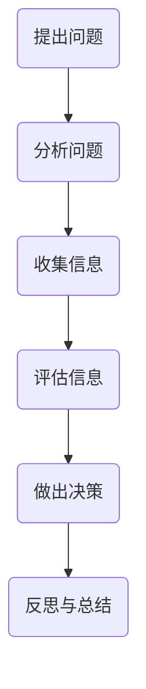

                 

# 《后真相时代的批判性思维训练营》

> 关键词：批判性思维、后真相时代、媒体消费、决策制定、个人成长

> 摘要：本文将探讨后真相时代的特征及其对批判性思维的重要性。通过介绍批判性思维的基本概念、工具和方法，以及其在现实生活中的应用，本文旨在为读者提供一个批判性思维训练营，帮助他们更好地应对信息泛滥的社会环境，提高决策能力和个人成长。

## 引言

### 1. 后真相时代的到来

在互联网和社交媒体的普及下，我们进入了后真相时代。这个时代的特征是信息泛滥、假新闻横行、舆论操纵频繁，真相往往被淹没在大量的虚假信息中。后真相时代的到来，挑战了传统的信息传播模式和媒体角色的认知。在这个时代，人们对于信息的判断和筛选能力显得尤为重要。

#### 1.1 什么是后真相时代

后真相时代，也被称为“真相退化”时代，指的是在信息传播中，情感和主观认知往往超越客观事实的影响力。在这个时代，人们更容易受到情绪和偏见的影响，而忽略事实本身。真相不再是决策和判断的唯一依据，情绪和观点的传播往往更为迅速和广泛。

#### 1.2 后真相时代的特征

- 信息爆炸：互联网的普及使得信息传播速度极快，每天产生的信息量巨大。
- 假新闻泛滥：社交媒体上的虚假信息和误导性报道层出不穷，难以辨别真伪。
- 情绪传播：情感和观点的传播往往比事实本身更加迅速和广泛。
- 舆论操纵：一些组织和个体利用媒体操纵舆论，影响公众的观点和决策。

### 2. 批判性思维的重要性

在这样一个充满不确定性和虚假信息的时代，批判性思维显得尤为重要。批判性思维是一种基于证据和逻辑的思考方式，它能够帮助我们辨别信息的真伪，避免被情绪和偏见所左右，做出更加明智的决策。

#### 2.1 在个人生活中的重要性

- 提高判断力：批判性思维能够帮助我们更准确地评估信息的可靠性，避免被虚假信息误导。
- 增强决策能力：通过批判性思维，我们可以更全面地分析问题，从多个角度考虑问题的各个方面，做出更加合理的决策。
- 培养独立思考：批判性思维鼓励我们质疑权威和传统观念，培养独立思考的能力。

#### 2.2 在社会生活中的重要性

- 防止舆论操纵：批判性思维能够帮助我们识别和抵制舆论操纵，维护社会的公平和正义。
- 提高公共决策质量：批判性思维在公共决策中起到关键作用，它能够帮助决策者更全面地评估各种方案的影响，做出更加科学合理的决策。
- 促进社会进步：批判性思维鼓励我们不断探索和质疑现状，推动社会的创新和进步。

## 第1章：批判性思维的起源与重要性

### 2. 批判性思维的概念与历史

批判性思维（Critical Thinking）是指通过合理的思考方式，评估和分析信息，以做出合理的判断和决策。它不仅仅是简单的思考，更是一种有目的、有组织的思考过程。

#### 2.1 批判性思维的定义

批判性思维是一种通过提问、分析、推理和评估来理解和解决问题、做出决策、评价信息的思考方式。它强调逻辑性、系统性、客观性和证据性。

#### 2.2 批判性思维的历史背景

批判性思维的历史可以追溯到古希腊时期，苏格拉底被誉为批判性思维的奠基人。他通过提问的方式，引导人们思考，揭示问题的本质。亚里士多德进一步发展了批判性思维的概念，提出了形式逻辑和实质逻辑。

在中世纪，批判性思维受到了宗教和哲学的束缚，发展相对缓慢。文艺复兴时期，批判性思维再次得到重视，启蒙运动进一步推动了批判性思维的发展。

20世纪，批判性思维成为教育领域的重要课题，许多学者对其进行深入研究，提出了各种批判性思维模型和工具。

### 3. 批判性思维的重要性

批判性思维对于个人和社会的发展都具有重要意义。

#### 3.1 在个人生活中的重要性

- 提高学习效果：批判性思维能够帮助我们更深入地理解学习内容，提高学习效果。
- 增强决策能力：批判性思维能够帮助我们更全面地分析问题，做出更加明智的决策。
- 培养独立思考：批判性思维鼓励我们质疑权威和传统观念，培养独立思考的能力。

#### 3.2 在社会生活中的重要性

- 促进社会进步：批判性思维鼓励我们不断探索和质疑现状，推动社会的创新和进步。
- 提高公共决策质量：批判性思维在公共决策中起到关键作用，它能够帮助决策者更全面地评估各种方案的影响，做出更加科学合理的决策。
- 防止舆论操纵：批判性思维能够帮助我们识别和抵制舆论操纵，维护社会的公平和正义。

### 4. 批判性思维的基本原则

批判性思维遵循一些基本原则，这些原则有助于我们更好地进行思考和判断。

#### 4.1 提问能力

提问是批判性思维的核心。通过提问，我们能够激发思考，揭示问题的本质。有效的提问包括开放性问题、分析性问题和反思性问题。

#### 4.2 分析与推理

分析与推理是批判性思维的关键步骤。通过分析，我们能够将复杂问题分解为更简单的部分，从而更好地理解问题。推理则帮助我们根据已知信息得出新的结论。

#### 4.3 逻辑思维

逻辑思维是批判性思维的基础。它要求我们在思考过程中遵循逻辑规则，确保结论的合理性和一致性。逻辑思维包括命题逻辑、演绎推理和归纳推理等。

## 第2章：批判性思维的工具与方法

### 5. 如何提出有效的问题

批判性思维的起点是提问。提出有效的问题是批判性思维的关键，它能够引导我们深入思考，揭示问题的本质。

#### 5.1 问题的类型

- 开放性问题：开放性问题没有固定的答案，它鼓励我们探索和思考，例如：“你认为这个问题的解决方案是什么？”
- 分析性问题：分析性问题帮助我们分解问题，理解问题的各个组成部分，例如：“这个问题可以分为哪几个方面？”
- 反思性问题：反思性问题促使我们反思自己的观点和假设，例如：“这个观点有哪些潜在的前提条件？”

#### 5.2 提问的技巧

- 提问时要明确问题，避免模糊和笼统。
- 提问时要考虑问题的逻辑性和连贯性，确保问题能够引导深入思考。
- 提问时要尊重他人的观点和意见，鼓励开放和诚实的讨论。

### 6. 分析与推理的方法

批判性思维的核心是分析与推理。通过分析与推理，我们能够从已知信息中得出新的结论，解决问题。

#### 6.1 演绎推理

演绎推理是从一般到个别的推理方式。它基于一般原理，推导出特定情况下的结论。例如，如果所有的人都会死亡（一般原理），那么苏格拉底也会死亡（个别情况）。

#### 6.2 归纳推理

归纳推理是从个别到一般的推理方式。它通过观察个别情况，归纳出一般规律。例如，通过观察多次掷硬币，我们发现硬币正面和反面出现的概率是相等的，从而得出硬币是均匀的结论。

#### 6.3 演绎推理与归纳推理的比较

- 演绎推理强调逻辑的一致性和必然性，但可能缺乏实际应用的广泛性。
- 归纳推理强调实际应用和普遍性，但可能存在逻辑上的不严密性。

### 7. 逻辑思维的基本原则

逻辑思维是批判性思维的重要组成部分。它要求我们在思考过程中遵循逻辑规则，确保结论的合理性和一致性。

#### 7.1 真值表

真值表是逻辑思维的重要工具，它用于表示命题的真假值。通过真值表，我们可以分析复合命题的真假关系，确保推理的正确性。

#### 7.2 模态逻辑

模态逻辑研究命题的可能性和必要性。它包括可能性逻辑和必要性逻辑，用于分析命题在不同情况下的真假值。

#### 7.3 命题逻辑

命题逻辑研究命题的结构和关系。它包括命题的联结词、推理规则和命题的证明。命题逻辑是批判性思维的基础。

## 第3章：批判性思维在现实中的应用

### 8. 批判性思维在媒体消费中的应用

在信息爆炸的时代，批判性思维在媒体消费中的应用尤为重要。通过批判性思维，我们能够更好地辨别信息的真伪，避免被虚假新闻误导。

#### 8.1 如何判断信息的真伪

- 核对来源：了解信息来源的可信度，优先考虑权威和可信的来源。
- 查证事实：通过多个渠道验证信息的真实性，避免盲目相信单方面的报道。
- 分析立场：了解报道的立场和倾向，避免被情绪和偏见所影响。
- 使用批判性思维工具：运用批判性思维的方法，分析信息的逻辑性和证据性。

#### 8.2 如何应对假新闻

- 增强信息素养：提高对信息的敏感度和辨别能力，培养批判性思维的习惯。
- 传播真实信息：主动传播真实信息，对抗虚假新闻的传播。
- 参与公众讨论：在公众讨论中，运用批判性思维，理性表达观点，避免盲目跟风。

### 9. 批判性思维在工作中的运用

在职场环境中，批判性思维能够帮助我们更好地应对工作中的挑战，提高工作效率和决策质量。

#### 9.1 团队合作

- 提问和讨论：在团队合作中，运用批判性思维，提出问题，鼓励讨论，促进团队思考和决策。
- 分析问题：通过批判性思维，分析问题的各个方面，找到问题的本质，提出解决方案。
- 评估方案：运用批判性思维，评估不同方案的优缺点，选择最佳方案。

#### 9.2 决策制定

- 收集信息：在决策制定过程中，运用批判性思维，收集全面、准确的信息。
- 分析信息：通过批判性思维，分析信息的可信度和相关性，确保决策依据的可靠性。
- 制定决策：运用批判性思维，制定科学合理的决策，考虑各种可能的结果和影响。

### 10. 批判性思维在生活中的实践

批判性思维不仅在工作和媒体消费中具有重要应用，也在我们的日常生活中发挥着重要作用。

#### 10.1 面对生活中的挑战

- 提问和反思：在面临生活中的挑战时，运用批判性思维，提出问题，反思自己的行为和决策。
- 分析情况：通过批判性思维，分析问题的原因和解决方案，找到问题的本质。
- 做出决策：运用批判性思维，做出合理、明智的决策，应对生活中的挑战。

#### 10.2 培养批判性思维的日常习惯

- 阅读和思考：通过阅读不同类型的书籍和文章，培养批判性思维的习惯。
- 参与讨论：在日常生活中，积极参与讨论，运用批判性思维，提出问题和观点。
- 反思和总结：在日常生活中，反思自己的行为和决策，总结经验教训，不断提高批判性思维的能力。

## 第4章：批判性思维的实践与提升

### 11. 批判性思维的实践方法

批判性思维的实践需要方法和技巧，以下是一些有效的实践方法。

#### 11.1 思维导图

思维导图是一种有效的思考工具，它能够帮助我们梳理思路，发现问题的各个方面。通过绘制思维导图，我们可以更加清晰地理解问题，找到解决方案。

#### 11.2 案例分析

案例分析是批判性思维的重要应用，通过分析现实生活中的案例，我们可以理解问题的复杂性，学习如何运用批判性思维解决实际问题。

### 12. 批判性思维的提升途径

提升批判性思维的能力需要不断地学习和实践，以下是一些提升途径。

#### 12.1 阅读

阅读是提升批判性思维的重要途径，通过阅读不同类型的书籍和文章，我们可以开阔视野，学习不同的观点和思维方式。

#### 12.2 讨论与辩论

讨论与辩论是批判性思维的重要实践方式，通过与他人交流和辩论，我们可以锻炼批判性思维的能力，提高自己的思考深度和广度。

#### 12.3 反思与自我提升

反思是批判性思维的重要组成部分，通过反思自己的行为和决策，我们可以发现自己的不足，找到改进的方向。自我提升是批判性思维的重要目标，通过不断地学习和实践，我们可以不断提高自己的批判性思维能力。

## 第5章：批判性思维的未来发展

### 13. 批判性思维在教育中的角色

批判性思维在未来的教育中将发挥越来越重要的作用。在教育中，批判性思维的培养不仅是学科知识的学习，更是思维方式的培养。

#### 13.1 课程设计

教育者在课程设计中应注重批判性思维的培养，通过设置问题导向的教学活动，引导学生主动思考和探索。

#### 13.2 教师角色

教师不仅是知识的传授者，更是批判性思维的引导者和促进者。教师应通过示范和指导，帮助学生掌握批判性思维的方法和技巧。

### 14. 批判性思维在社会中的作用

批判性思维在社会中具有广泛的应用，它能够促进社会的进步和公共决策的科学性。

#### 14.1 社会运动

在社会运动中，批判性思维能够帮助参与者更好地理解问题，制定合理的策略，推动社会变革。

#### 14.2 公共决策

在公共决策中，批判性思维能够帮助决策者更全面地评估各种方案，减少决策的盲目性和错误性，提高决策的质量。

## 第6章：批判性思维训练营的实践案例

### 15. 案例一：新闻审查

新闻审查是批判性思维在媒体消费中的一个实际应用。以下是一个新闻审查的案例。

#### 15.1 案例背景

一家媒体报道称，某地发生了一起严重的交通事故，死亡人数高达数十人。该报道引起了公众的广泛关注。

#### 15.2 批判性思维的应用

- 核对来源：查询报道的来源，发现该报道来源是一个不知名的自媒体，没有提供详细的事故调查报告。
- 查证事实：通过多个渠道查询相关信息，发现其他媒体报道的事故死亡人数远低于数十人。
- 分析立场：分析报道的立场和倾向，发现该报道可能存在夸大事实和煽动情绪的嫌疑。
- 使用批判性思维工具：运用批判性思维的方法，对报道进行评估，得出结论：该报道可能存在虚假信息。

### 16. 案例二：企业决策

企业决策是批判性思维在商业环境中的应用。以下是一个企业决策的案例。

#### 16.1 案例背景

某企业在面临是否扩大生产线的问题时，召开了管理层会议。

#### 16.2 批判性思维的应用

- 收集信息：管理层收集了市场调研数据、生产成本分析、竞争对手情况等信息。
- 分析信息：通过批判性思维，分析各个信息的可信度和相关性，发现市场调研数据可靠，但生产成本分析和竞争对手情况存在一定的风险。
- 制定决策：管理层决定扩大生产线，但要求对生产成本和竞争对手情况进行进一步分析，确保决策的可行性。

### 17. 案例三：个人成长

个人成长是批判性思维在个人生活中的应用。以下是一个个人成长的案例。

#### 17.1 案例背景

一位年轻的职场新人，在面对职业发展的困惑时，决定运用批判性思维解决问题。

#### 17.2 批判性思维的应用

- 提问和反思：该新人提出了一系列问题，如“我的职业目标是什么？”“我有哪些优势和劣势？”“行业发展趋势如何？”等，通过反思自己的行为和决策，找到问题的本质。
- 分析情况：通过批判性思维，分析自己的职业发展现状，发现自己在专业技能和人际关系方面存在不足。
- 做出决策：该新人决定通过参加培训课程、加强与同事的沟通和合作来提升自己的职业能力。

## 第7章：批判性思维训练营的总结与展望

### 18. 批判性思维训练营的总结

批判性思维训练营是一个帮助人们提升批判性思维能力的过程。通过训练营，参与者学会了如何提出有效的问题、如何分析和推理、如何辨别信息的真伪、如何在工作中和生活中运用批判性思维。训练营的成果包括：

- 提高了对信息的辨别能力，能够更准确地判断信息的真伪。
- 增强了决策能力，能够更全面地分析问题，做出更加明智的决策。
- 培养了批判性思维的习惯，能够主动运用批判性思维解决问题。
- 开阔了视野，能够从多个角度看待问题，提高思维的深度和广度。

### 19. 批判性思维的未来展望

随着信息技术的不断发展和应用，批判性思维在未来将发挥更加重要的作用。

#### 19.1 技术发展的影响

- 人工智能的发展：人工智能将极大地改变信息的生产和传播方式，对批判性思维提出了新的挑战。
- 虚假信息的识别与处理：随着技术的发展，我们将有更多的工具和手段来识别和处理虚假信息，提高批判性思维的效果。

#### 19.2 社会变革的方向

- 社会公平与正义：批判性思维将帮助社会更好地解决不公平和正义问题，推动社会的进步。
- 公共决策的科学化：批判性思维将提高公共决策的科学性和合理性，促进社会的可持续发展。

## 附录：批判性思维资源与工具

### 20. 批判性思维资源推荐

- 书籍推荐：
  - 《批判性思维：工具与应用》（作者：Marilyn S. Aronson，Richard W. Wartell）
  - 《如何阅读一本书》（作者：莫提默·J. 艾德勒，查尔斯·范多伦）
  - 《思考，快与慢》（作者：丹尼尔·卡尼曼）
- 网络资源：
  - 网易云课堂的《批判性思维》课程
  - 豆瓣读书的批判性思维小组

### 21. 批判性思维工具介绍

- 思维导图软件：
  - XMind
  - MindManager
- 论证分析软件：
  - argumentation mapping tools
  - ClaimGame

## Mermaid 流程图



## Python源代码示例

```python
# 批判性思维训练营：线性回归算法实现

import numpy as np

def linear_regression(X, y):
    # 计算权重系数
    theta = np.linalg.inv(X.T.dot(X)).dot(X.T).dot(y)
    return theta

def predict(X, theta):
    # 计算预测值
    y_pred = X.dot(theta)
    return y_pred

# 数据准备
X = np.array([[1, 2], [2, 3], [3, 4]])
y = np.array([1, 2, 3])

# 训练模型
theta = linear_regression(X, y)

# 预测
y_pred = predict(X, theta)

# 输出结果
print("预测值：", y_pred)
```

## 数学模型和公式

$$
f(x) = ax + b
$$

这是一个线性回归的数学模型。其中，$a$ 和 $b$ 分别代表权重系数，$x$ 代表输入特征，$y$ 代表输出目标。

## 结束语

批判性思维是应对后真相时代的重要工具，它能够帮助我们更好地辨别信息真伪，提高决策能力，促进个人和社会的发展。通过批判性思维训练营，我们可以不断提升自己的批判性思维能力，更好地应对这个复杂多变的社会环境。

作者：AI天才研究院/AI Genius Institute & 禅与计算机程序设计艺术 /Zen And The Art of Computer Programming

## 反思与拓展阅读

在撰写本文的过程中，我们深刻体会到批判性思维在应对后真相时代的重要性。通过本文，我们希望能为广大读者提供一个批判性思维的框架，帮助大家更好地理解和应用批判性思维。

### 反思

在写作过程中，我们反思了以下几点：

- 如何更好地将批判性思维与实际应用相结合？
- 如何通过案例和实例来使文章更具说服力？
- 如何在有限的字数内，尽可能全面地介绍批判性思维的相关概念和工具？

### 拓展阅读

为了进一步深入了解批判性思维，我们推荐以下拓展阅读资源：

- 《批判性思维工具书》（作者：理查德·保罗，琳达·埃尔博）
- 《批判性思维：跨越概念与技巧》（作者：理查德·保罗）
- 《批判性思维：思考技能的训练》（作者：迈克尔·拉伯）

通过这些资源，读者可以更加深入地了解批判性思维的原理和应用。

## 结语

后真相时代要求我们具备更高的批判性思维能力。本文通过介绍批判性思维的概念、工具和应用，提供了一个批判性思维训练营，希望帮助读者在信息泛滥的社会环境中更好地应对挑战。批判性思维不仅是应对后真相时代的利器，更是我们个人成长和社会进步的重要途径。让我们共同努力，提升批判性思维能力，共创美好未来。作者：AI天才研究院/AI Genius Institute & 禅与计算机程序设计艺术 /Zen And The Art of Computer Programming

