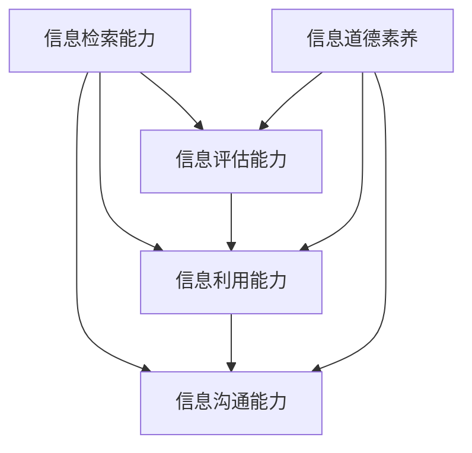
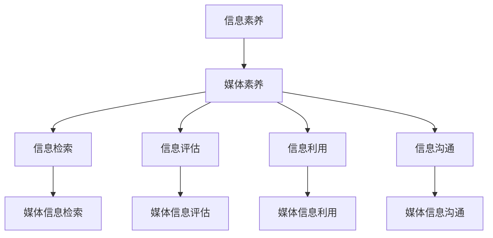
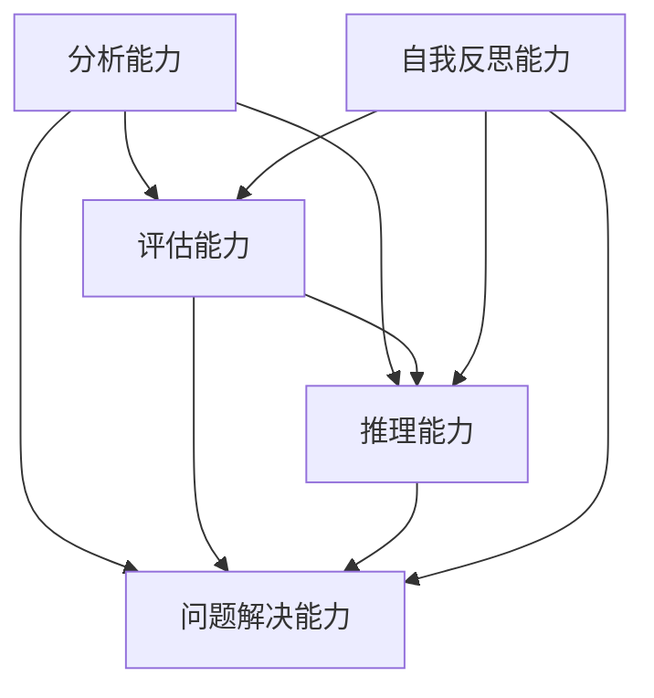
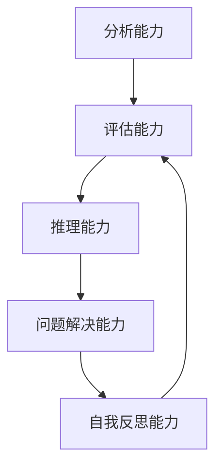

                 

### 文章标题

“后真相时代的批判性思维：培养独立判断能力的重要性”

### 关键词

后真相时代、批判性思维、独立判断能力、信息素养、媒体批判、教育应用

### 摘要

在后真相时代，信息泛滥和虚假信息泛滥成为了社会的一大挑战。为了应对这一局面，培养批判性思维和独立判断能力变得尤为重要。本文首先介绍了后真相时代的概念和特征，接着探讨了信息过载和媒体素养的重要性。然后，文章深入分析了批判性思维的基本原理和实践方法，并探讨了其在教育中的应用。最后，文章提出了提升独立判断能力的策略，以及独立判断能力在职业生涯中的应用。通过这一系列的分析和探讨，本文旨在为读者提供一套系统化的方法，帮助他们在后真相时代中培养独立判断能力，从而更好地应对复杂多变的社会环境。

## 第一部分：理解后真相时代

### 第1章：后真相时代的概念与特征

#### 1.1 后真相时代的定义

后真相时代（Post-Truth Era）是一个源自英国政治学的术语，最早用于描述2016年英国脱欧公投和美国总统选举中，事实与情绪、偏见和虚假信息并存的现象。在这个时代，真相不再是决策的唯一依据，情感、直觉和主观判断往往比事实更加重要。后真相时代的核心特征包括信息泛滥、虚假信息和操纵信息等。

#### 1.2 后真相时代的主要特征

1. **信息泛滥**：随着互联网和社交媒体的普及，信息传播的速度和范围达到了前所未有的高度。然而，这也导致了信息过载，人们难以区分真实与虚假信息。
   
2. **虚假信息**：在社交媒体和网络上，虚假信息、谣言和误导性信息层出不穷。这些信息往往被精心设计，以吸引人们的注意力和情感。

3. **情感驱动**：在真相与情感之间，人们往往更倾向于选择情感驱动的信息。情感诉求比事实更能影响人们的判断和决策。

4. **信息操纵**：信息操纵者利用社交媒体和大数据技术，有目的地传播虚假信息，以达到特定的政治、经济或社会目的。

#### 1.3 后真相时代对社会的冲击

1. **政治动荡**：虚假信息和信息操纵导致了政治信任危机，加剧了政治分歧和冲突。

2. **社会分裂**：后真相时代加剧了社会的分裂，人们往往被不同的信息来源所割裂，形成了信息茧房。

3. **教育挑战**：在信息泛滥的背景下，传统的教育模式面临着挑战，如何培养批判性思维和独立判断能力成为了教育者的新任务。

4. **商业风险**：虚假信息对商业环境造成了负面影响，误导性信息可能导致消费者决策失误，损害企业的声誉。

为了应对后真相时代的挑战，我们需要理解其概念和特征，这为接下来章节中批判性思维和信息素养的培养奠定了基础。

#### 1.4 后真相时代的概念与特征

在后真相时代，信息传播的方式和速度发生了翻天覆地的变化，这直接影响到了人们的思维方式和决策过程。以下是后真相时代的几个核心特征：

1. **信息的即时性**：在互联网时代，信息可以在瞬间传播到全球各地。社交媒体平台如Twitter、Facebook和微博等，使得信息的传播速度大大加快。这种即时性的特点，使得人们更容易接触到各种信息，但也增加了信息过载的风险。

2. **信息的碎片化**：互联网上的信息往往是碎片化的，长篇大论的文章逐渐被短小精悍的标题和摘要所取代。这种碎片化的信息，虽然便于快速消费，但往往缺乏深度和全面性，容易导致人们的判断偏差。

3. **信息的多样性**：互联网上的信息来源多样，从权威的新闻机构到个人的博客，从专业的学术论文到误导性的伪科学文章，信息质量参差不齐。在这种背景下，如何辨别信息的真伪和质量成为了一项重要的技能。

4. **信息的主观性**：在社交媒体上，信息的传播往往伴随着强烈的情感色彩。人们更倾向于分享和传播那些与自己观点一致的信息，这导致了信息传播的主观性增强。情感驱动的信息更容易被传播和接受，而真相却可能被忽视。

5. **信息操纵的风险**：随着大数据和人工智能技术的发展，信息操纵的手段变得更加高级和复杂。通过算法和机器学习，信息操纵者可以精确地分析目标受众的心理和偏好，并针对性地传播虚假信息。这种信息操纵不仅影响了公众的观点和判断，还可能对社会稳定产生负面影响。

#### 1.5 后真相时代对社会的冲击

后真相时代的特征不仅改变了信息传播的方式，还对整个社会产生了深远的影响：

1. **政治动荡**：虚假信息和信息操纵在政治领域的影响尤为显著。政治广告和宣传往往被精心设计，以煽动公众情绪和误导选民。这种现象加剧了政治分歧和社会动荡，使民主制度面临严峻挑战。

2. **社会分裂**：在虚假信息和误导性信息的传播下，人们往往被划分为不同的信息群体，形成了信息茧房。这些信息群体往往只接触和传播与自己观点一致的信息，导致社会分裂和意识形态对立。

3. **教育挑战**：在信息过载的时代，传统的教育模式面临着巨大挑战。如何培养学生的批判性思维和信息素养，成为了教育者的重要任务。教育者需要帮助学生在信息的海洋中辨别真伪，培养独立思考和判断能力。

4. **商业风险**：商业领域也面临着虚假信息的威胁。误导性信息可能误导消费者的决策，损害企业的声誉和利益。企业需要建立有效的信息过滤和认证机制，确保信息的真实性和可靠性。

总之，后真相时代的特征和信息传播方式对社会产生了深远的影响。理解这些特征和影响，有助于我们更好地应对这一新的挑战。

### 第2章：信息过载与信息素养

#### 2.1 信息过载的现象

信息过载是指在短时间内接收到的信息量超过了个体的处理能力，导致个体难以有效理解和消化这些信息。在数字化时代，信息过载已成为普遍现象。人们每天都会接收到大量的电子邮件、社交媒体更新、新闻推送等，这些信息往往需要立即处理，而个体的注意力资源是有限的。

**现象描述**：
1. **注意力分散**：信息过载使得人们的注意力容易分散，无法专注于一项任务。
2. **决策困难**：面对大量的信息，个体往往难以做出明智的决策。
3. **认知负担**：处理大量信息会增加个体的认知负担，导致疲劳和压力。

#### 2.2 信息素养的重要性

信息素养是指个体识别、查找、评估和利用信息的能力。在信息过载的时代，信息素养尤为重要，因为它能够帮助个体有效地处理和利用信息。

**重要性分析**：
1. **信息辨别能力**：信息素养有助于个体辨别真实信息与虚假信息，避免受到虚假信息的误导。
2. **信息筛选能力**：信息素养使个体能够筛选出对自己最有价值的信息，提高信息利用率。
3. **信息处理能力**：信息素养有助于个体高效地处理和利用信息，减少认知负担。
4. **问题解决能力**：具备信息素养的个体能够更好地利用信息解决问题，提高创新能力。

#### 2.3 培养信息素养的策略

为了应对信息过载，提高信息素养，我们可以采取以下策略：

1. **批判性思维**：培养批判性思维有助于个体对信息进行深入分析和评估，避免盲目接受信息。
2. **信息过滤机制**：建立有效的信息过滤机制，如订阅高质量信息源、使用信息筛选工具等，减少无效信息的干扰。
3. **定期反思**：定期反思自己的信息接收和处理过程，识别和纠正不良习惯。
4. **信息素养教育**：通过学校教育、培训课程等途径，提高个体的信息素养水平。

总之，信息过载是后真相时代的一个显著特征，培养信息素养是应对这一挑战的关键。通过提高信息辨别、筛选和处理能力，个体可以更好地应对信息过载，提高生活质量和工作效率。

#### 2.4 信息素养的构成要素

信息素养的构成要素包括以下几个方面：

1. **信息检索能力**：这是信息素养的基础，指的是能够有效地利用各种工具和资源（如数据库、搜索引擎等）查找所需信息。
2. **信息评估能力**：这是对所获取的信息进行评估，判断其真实性、准确性和相关性的能力。评估能力包括对来源的可靠性、作者的背景、研究方法等进行深入分析。
3. **信息利用能力**：指的是能够将所获取的信息应用于实际问题解决或新知识创造的能力。这需要个体具备较强的综合分析和解决问题的能力。
4. **信息沟通能力**：指的是能够有效地表达和交流信息，包括撰写报告、制作演示文稿、进行有效演讲等。
5. **信息道德素养**：这涉及到遵守信息伦理和法律法规，尊重他人的知识产权，不滥用信息资源。

**联系与架构**：

这些要素之间相互联系，构成了一个完整的信息素养体系。信息检索能力是信息评估和信息利用的前提，而信息评估和信息利用则促进了个体对信息的深入理解和应用。信息沟通能力则是信息传递和分享的重要手段，使得信息得以在更广泛的范围内传播和应用。信息道德素养则是整个信息素养体系的基石，确保个体在获取和使用信息的过程中遵循伦理和法律规范。

以下是一个简化的Mermaid流程图，展示了这些要素之间的联系：

#### 2.5 实例分析：如何评估一条新闻的真实性

评估一条新闻的真实性是信息素养的重要体现，以下是一个具体的实例分析：

1. **确定信息来源**：
   - 首先，查看新闻的来源是否可靠。权威的新闻机构如《纽约时报》、《卫报》等具有较高的可信度。
   - 如果来源是一个不熟悉的网站，可以通过搜索引擎查找该网站的历史和背景信息，判断其是否具有权威性和专业性。

2. **审查作者背景**：
   - 了解作者的专业背景和资历。如果作者具有相关领域的专业知识和经验，则其报道的可信度更高。
   - 查看作者以往的报道，评估其写作风格和报道倾向。

3. **核查事实**：
   - 对新闻中提到的关键事实进行核查。可以通过查阅官方数据、研究报告、权威网站等验证信息的准确性。
   - 注意新闻中是否有引用来源，如果没有引用，则需要特别谨慎。

4. **分析情感色彩**：
   - 观察新闻的叙述是否客观中立，是否存在明显的情感色彩。如果新闻带有强烈的情感诉求，需要进一步核实事实。
   - 谨慎对待那些煽动情绪、夸大事实的报道。

5. **多角度验证**：
   - 通过多个来源验证新闻内容，如果多个权威来源报道一致，则该新闻的可信度更高。
   - 可以利用事实核查网站（如FactCheck.org）进行交叉验证。

通过上述步骤，个体可以更加全面和客观地评估新闻的真实性，避免受到虚假信息的误导。

#### 2.6 如何在日常生活中提高信息素养

在日常生活中，提高信息素养是一项持续且需要多方面努力的任务。以下是一些具体的策略和技巧：

1. **培养批判性思维**：
   - 学习逻辑学和论证技巧，学会识别和反驳错误的论点和推理。
   - 经常质疑信息的来源、论据和结论，不轻易接受未经核实的说法。

2. **定期学习信息素养知识**：
   - 通过参加在线课程、阅读相关书籍和文章，不断更新和提升自己的信息素养。
   - 关注权威的信息素养教育机构和媒体，如美国图书馆协会（ALA）和《数字素养研究》期刊。

3. **使用信息筛选工具**：
   - 利用RSS订阅工具、新闻过滤器等，订阅高质量的信息源，自动筛选和推送重要新闻。
   - 使用社交媒体的隐私设置，限制不信任的账号和营销内容。

4. **参与讨论和交流**：
   - 加入专业的论坛和社区，与他人交流和讨论，分享和验证信息。
   - 通过参与公共辩论和讨论，锻炼自己的信息评估和表达能力。

5. **实践信息素养技巧**：
   - 在实际工作和学习中，应用信息检索、评估和利用的技巧，如制作文献综述、编写报告等。
   - 定期对自己的信息处理过程进行反思，识别和改进不足之处。

6. **教育孩子和他人**：
   - 通过家庭教育和社区活动，向他人传授信息素养的重要性和方法。
   - 在学校和培训机构中推广信息素养教育，培养学生的信息辨别和评估能力。

通过上述策略和技巧，个体可以在日常生活中逐步提高自己的信息素养，更好地应对信息过载和虚假信息的挑战。

#### 2.7 媒体素养与信息素养的关系

媒体素养和信息素养是两个密切相关但又有区别的概念。媒体素养主要关注个体在理解、分析、使用媒体信息方面的能力，而信息素养则更加广泛，涵盖了信息检索、评估、利用和沟通的各个方面。

**关系解析**：

1. **互为补充**：媒体素养是信息素养的一个子集，专注于媒体信息的处理。而信息素养则更全面，包括了对所有形式信息（包括但不限于媒体信息）的处理能力。
   
2. **相互作用**：在处理媒体信息时，信息素养为个体提供了评估和利用这些信息的能力。而媒体素养则帮助个体理解媒体信息的传播方式、制作技巧和潜在偏见，从而更全面地评估信息。

**联系与架构**：

以下是一个简化的Mermaid流程图，展示了媒体素养与信息素养之间的联系：

#### 2.8 媒体素养的重要性

媒体素养在当今社会具有极其重要的地位，主要体现在以下几个方面：

1. **信息辨别能力**：媒体素养使个体能够辨别信息来源的真实性、可靠性和相关性，避免受到虚假信息的误导。

2. **批判性思维**：媒体素养培养个体的批判性思维，使其能够分析和质疑媒体内容的论点和论据，不轻易接受未经验证的信息。

3. **信息评估能力**：通过媒体素养，个体可以评估媒体信息的影响和潜在偏见，从而做出更明智的决策。

4. **问题解决能力**：媒体素养有助于个体在复杂信息环境中找到解决方案，提高问题解决能力。

5. **社会参与**：具备媒体素养的个体能够更加积极地参与社会讨论和公共事务，为社会进步贡献力量。

#### 2.9 媒体批判的方法与技巧

批判性思维在媒体素养中扮演着关键角色。以下是一些媒体批判的方法与技巧，帮助个体更有效地评估和解读媒体内容：

1. **识别偏见**：学会识别媒体内容的潜在偏见，如情感诉求、片面报道和刻板印象等。

2. **多元视角**：通过查阅不同来源和观点的媒体内容，获取更全面的视角。

3. **事实核查**：对媒体内容中提到的关键事实进行核查，确保其准确性。

4. **分析修辞手法**：了解和识别媒体内容中的修辞手法，如夸张、对比和隐喻等。

5. **批判性提问**：通过提出批判性问题，如“为什么作者这样写？”、“是否有其他解释？”等，深入分析媒体内容。

6. **情感分析**：评估媒体内容中的情感色彩，分析其目的和影响。

通过上述方法与技巧，个体可以更全面和深入地批判和分析媒体内容，提高自己的媒体素养。

### 第3章：媒体素养与媒体批判

#### 3.1 媒体素养的基本概念

媒体素养（Media Literacy）是指个体理解和分析媒体信息、制作和传播媒体内容的能力。它不仅包括对媒体内容的消费能力，还涵盖了制作和传播媒体内容的能力。媒体素养的核心目标是培养个体对媒体信息的批判性思维能力，使其能够在复杂的信息环境中做出明智的判断和决策。

**基本概念**：

1. **媒体信息的理解**：个体需要理解媒体信息的含义、目的和影响，以及它们是如何制作的。
   
2. **媒体信息的分析**：个体需要学会分析媒体信息的来源、动机、偏见和潜在影响。

3. **媒体信息的制作和传播**：个体需要掌握制作和传播媒体内容的基本技能，包括写作、编辑、摄影、视频制作和社交媒体运营等。

#### 3.2 媒体批判的方法与技巧

媒体批判是指对媒体内容进行深入分析和评价的过程。以下是一些实用的方法和技巧，帮助个体更有效地批判和分析媒体内容：

1. **识别偏见**：学会识别媒体内容的潜在偏见，包括情感诉求、片面报道和刻板印象等。例如，一个新闻报道可能因为作者的立场而带有明显的偏见，需要通过查阅多个来源进行验证。

2. **多元视角**：通过查阅不同来源和观点的媒体内容，获取更全面的视角。例如，针对某一事件的报道，可以查阅多个新闻网站、社交媒体平台和专家观点，以便形成全面的看法。

3. **事实核查**：对媒体内容中提到的关键事实进行核查，确保其准确性。可以使用事实核查网站（如FactCheck.org）进行交叉验证，确保信息的真实性。

4. **分析修辞手法**：了解和识别媒体内容中的修辞手法，如夸张、对比和隐喻等。例如，一个新闻标题可能通过夸张的手法吸引读者注意力，需要仔细分析其真实性。

5. **批判性提问**：通过提出批判性问题，如“为什么作者这样写？”、“是否有其他解释？”等，深入分析媒体内容。这种方法有助于挖掘信息的深层次含义和潜在影响。

6. **情感分析**：评估媒体内容中的情感色彩，分析其目的和影响。例如，一个新闻视频可能通过情感诉求来影响观众的情绪，需要分析其动机和效果。

通过这些方法和技巧，个体可以更全面和深入地批判和分析媒体内容，提高自己的媒体素养。

#### 3.3 媒体素养教育的重要性

媒体素养教育在培养个体应对后真相时代的挑战中扮演着至关重要的角色。以下是几个关键点，阐述媒体素养教育的重要性：

1. **批判性思维**：媒体素养教育帮助个体培养批判性思维，使其能够分析和评估媒体信息的真实性和可靠性。这不仅有助于个体避免被虚假信息误导，还能提高其决策质量。

2. **信息辨别能力**：通过媒体素养教育，个体学会辨别不同来源和类型的媒体信息，提高其信息辨别能力。这有助于个体在复杂的信息环境中筛选出有价值的信息。

3. **自我表达和传播**：媒体素养教育不仅关注信息消费，还包括信息制作和传播。个体通过学习如何制作和传播媒体内容，可以更好地表达自己的观点，同时遵守信息伦理和法律法规。

4. **社会责任感**：媒体素养教育培养个体的社会责任感，使其意识到媒体在社会中的作用和影响力。个体在消费和传播媒体内容时，将更加负责任，避免参与恶意传播和谣言。

5. **适应数字化时代**：随着数字化时代的到来，媒体素养教育成为个体适应这一变化的重要工具。通过掌握媒体素养，个体可以更好地适应信息社会，提高生活质量和工作效率。

总之，媒体素养教育是应对后真相时代挑战的重要途径，有助于个体更好地应对信息过载和虚假信息，培养独立判断能力和社会责任感。

#### 3.4 媒体素养教育在学校的实施策略

在学校中实施媒体素养教育是培养学生批判性思维和信息辨别能力的重要途径。以下是一些具体的策略和措施：

1. **课程设计**：
   - 将媒体素养教育纳入常规课程，如语文、社会研究和信息技术课程。
   - 设计以媒体素养为核心的综合课程，涵盖信息检索、评估、制作和传播等多个方面。

2. **教材和资源**：
   - 使用高质量的教材和资源，包括权威的新闻报道、纪录片、案例分析等。
   - 引入多媒体教学工具，如视频、图表和互动软件，提高学生的学习兴趣和参与度。

3. **教师培训**：
   - 对教师进行媒体素养培训，提高其教学水平和信息素养。
   - 鼓励教师参加专业发展课程和研讨会，不断更新教学方法和资源。

4. **实践项目**：
   - 开展实际操作项目，如制作新闻播报、编辑杂志、开展社交媒体运营等，让学生在实践中提升技能。
   - 通过模拟新闻事件和辩论活动，培养学生的批判性思维和沟通能力。

5. **家长和社区参与**：
   - 通过家长会和社区活动，提高家长对媒体素养教育的认识和支持。
   - 鼓励家长参与学校媒体素养教育项目，提供家庭资源和建议。

通过这些策略和措施，学校可以有效地实施媒体素养教育，帮助学生应对信息过载和虚假信息，培养其批判性思维和信息辨别能力。

#### 3.5 媒体素养教育在职业生涯中的应用

媒体素养不仅在学生阶段至关重要，在职业生涯中同样扮演着重要角色。以下是一些关键点，阐述媒体素养在职业生涯中的应用：

1. **信息筛选能力**：在职场中，个体需要从海量信息中快速筛选出有价值的信息，以便做出明智的决策。媒体素养教育帮助个体培养这种能力，提高工作效率。

2. **批判性思维**：在处理复杂问题和决策时，批判性思维是不可或缺的。媒体素养教育培养个体的批判性思维能力，使其能够深入分析问题，识别潜在的偏见和误导性信息。

3. **沟通技巧**：职场中，有效的沟通是成功的关键。媒体素养教育帮助个体掌握沟通技巧，包括撰写报告、制作演示文稿、进行有效演讲等，从而提高职业竞争力。

4. **媒体公关**：许多职业涉及与媒体打交道，如市场营销、公共关系和品牌管理。媒体素养教育使个体能够更好地应对媒体采访、发布新闻稿和社交媒体运营等任务。

5. **信息伦理**：在信息传播和处理过程中，遵守信息伦理是维护职业信誉和职业道德的重要方面。媒体素养教育培养个体的信息伦理意识，使其在职场中负责任地使用信息资源。

总之，媒体素养在职业生涯中的应用是多方面的，它帮助个体在复杂的信息环境中脱颖而出，提高职业素养和竞争力。

### 第4章：批判性思维的培养

#### 4.1 批判性思维的定义

批判性思维（Critical Thinking）是一种逻辑分析和评估信息的能力，它不仅包括对事实和证据的评估，还涉及对观点和假设的深入思考。批判性思维强调理性分析和客观判断，旨在识别、评估和解决问题。

**核心要素**：

1. **分析能力**：批判性思维要求个体能够深入分析复杂问题，识别问题的本质和关键因素。

2. **评估能力**：个体需要评估信息的来源、证据和论据的可靠性，判断其是否符合逻辑和事实。

3. **推理能力**：通过逻辑推理和演绎推理，个体可以推导出合理的结论，并识别潜在的假设和偏见。

4. **问题解决能力**：批判性思维帮助个体在问题解决过程中，通过理性分析和评估，找到有效的解决方案。

5. **自我反思能力**：批判性思维强调自我反思，使个体能够不断调整和改进自己的思考方式和决策过程。

**概念实体之间的关系架构**：

以下是一个简化的Mermaid流程图，展示了批判性思维的核心要素之间的关系：

#### 4.2 批判性思维的核心要素

批判性思维是一种复杂的认知过程，它包含多个核心要素，这些要素相互作用，共同构建了批判性思维的整体框架。

1. **分析能力**：分析能力是批判性思维的基础。它涉及到对信息的深入分析，识别信息的构成部分、关系和逻辑结构。通过分析，个体能够理解问题的复杂性，识别关键变量和潜在因素。

2. **评估能力**：评估能力是批判性思维的关键要素。它要求个体能够评估信息的来源、证据和论据的可靠性。评估能力包括对信息的真实性、准确性、相关性、重要性等进行判断。通过评估，个体能够识别信息中的错误、偏见和误导性信息。

3. **推理能力**：推理能力是批判性思维的另一核心要素。它包括逻辑推理和演绎推理。逻辑推理是通过前提推导出结论的过程，而演绎推理则是从一般原理推导出具体结论。通过推理，个体能够从已知的事实和假设中推导出新的结论，并识别逻辑谬误。

4. **问题解决能力**：问题解决能力是批判性思维在实际应用中的重要体现。它涉及到将批判性思维应用于实际问题，通过分析、评估和推理，找到有效的解决方案。问题解决能力不仅要求个体能够识别问题，还需要能够设计和实施解决方案。

5. **自我反思能力**：自我反思能力是批判性思维的自我提升机制。它使个体能够不断审视和评估自己的思考过程和决策，识别和纠正错误。自我反思能力包括反思自己的信念、价值观、动机和偏见，从而提高批判性思维的准确性和深度。

**联系与架构**：

这些核心要素之间相互联系，构成了一个完整的批判性思维体系。分析能力是评估和推理的前提，评估能力则帮助个体识别信息的真实性和可靠性。推理能力通过逻辑和演绎将分析结果转化为结论，而问题解决能力则将批判性思维应用于实际问题。自我反思能力则使个体能够不断调整和优化自己的思维过程，提高批判性思维的效能。

以下是一个简化的Mermaid流程图，展示了批判性思维的核心要素及其相互关系：

#### 4.3 批判性思维与创造性思维的关系

批判性思维和创造性思维是两种不同的认知过程，但它们在思考和解决问题的过程中相互补充和促进。

**定义和特点**：

1. **批判性思维**：批判性思维是一种分析、评估和推理的能力，旨在识别和分析问题的各个方面，评估信息的可靠性和逻辑性，并找到合理的解决方案。它强调逻辑性、系统性和理性分析。

2. **创造性思维**：创造性思维则是一种产生新想法、概念和解决方案的能力，它不拘泥于传统和规则，注重创新和原创性。它强调灵活性、创造性和想象力。

**关系解析**：

1. **互补关系**：批判性思维和创造性思维在思考和解决问题的过程中互补。批判性思维帮助个体深入分析问题，识别问题的各个方面，而创造性思维则提供新的视角和解决方案，打破思维定势。

2. **相互作用**：在解决问题时，批判性思维和创造性思维相互作用。个体首先需要通过批判性思维分析问题，了解问题的本质和关键点，然后通过创造性思维提出新的解决方案。

3. **融合**：在实际应用中，批判性思维和创造性思维可以融合，形成一种综合性的思维模式。这种模式既能够深入分析问题，又能够产生创新的解决方案，提高问题解决的效率和效果。

**案例解析**：

以设计一款新的手机应用为例：

- **批判性思维**：在开始设计之前，设计师需要通过批判性思维分析市场需求、用户需求和技术可行性。他们需要评估不同的设计方案，选择最合理的一个。

- **创造性思维**：在批判性思维的基础上，设计师需要运用创造性思维，提出新的设计理念。例如，他们可能提出一个创新的用户体验设计，或者开发一个新的功能。

- **综合应用**：通过综合应用批判性思维和创造性思维，设计师可以提出一个既满足市场需求又具有创新性的设计方案。

总之，批判性思维和创造性思维在思考和解决问题的过程中相互补充，形成了一种高效的思维模式。通过两者的结合，个体可以更好地分析和解决复杂问题。

### 第5章：批判性思维的实践方法

#### 5.1 提问技巧

提问是批判性思维的核心技巧之一，它有助于深入分析和理解问题。以下是一些有效的提问技巧：

1. **开放性问题**：使用开放性问题，如“为什么？”和“如何？”来引导深入的讨论和分析。这些问题有助于揭示问题的本质和复杂性。

2. **反问**：通过反问，个体可以挑战现有的观点和假设，从而促进更深层次的思考。例如，“这个结论是基于什么证据得出的？”

3. **分层提问**：将问题分解为几个小问题，逐步深入，从而更全面地理解问题。例如，“这个问题的根本原因是什么？它有哪些潜在的影响？”

4. **情景模拟**：通过提问模拟不同的情景，帮助个体预测可能的结果和影响。例如，“如果这个决策失败，会产生什么后果？”

5. **逻辑质疑**：对陈述的论点和论据进行质疑，确保其逻辑性和合理性。例如，“这个结论是否依赖于某些假设？”

通过这些提问技巧，个体可以更有效地分析和评估信息，提高批判性思维能力。

#### 5.2 分析与评估信息的方法

批判性思维的核心在于对信息的深入分析和评估。以下是一些关键步骤和方法：

1. **识别信息来源**：首先，确认信息的来源是否可靠。权威的来源，如学术期刊、官方报告和知名专家，通常具有较高的可信度。

2. **评估证据和论据**：对信息中的证据和论据进行评估，检查其是否充分、相关和准确。例如，查看引用的参考文献和数据来源。

3. **识别偏见和倾向**：分析信息中是否存在潜在的偏见和倾向，如作者的观点、情感色彩或刻板印象。

4. **逻辑推理**：通过逻辑推理，评估信息的论点和结论是否一致。例如，使用三段论法或因果分析来检查推理的逻辑性。

5. **跨信息对比**：通过对比多个信息来源，验证信息的准确性和一致性，减少误导性信息的风险。

通过这些方法，个体可以更全面和客观地评估信息，提高批判性思维能力。

#### 5.3 解决问题与决策的批判性思维

在解决问题和决策过程中，批判性思维是至关重要的。以下是一些关键步骤和策略：

1. **明确问题**：首先，明确问题的定义和范围，确保解决的焦点明确。

2. **收集信息**：收集与问题相关的各种信息，包括事实、数据和专家意见。

3. **分析信息**：通过批判性思维，分析信息的可靠性和相关性，识别潜在问题和风险。

4. **生成解决方案**：提出多个可能的解决方案，并进行评估和比较。

5. **评估和选择方案**：通过评估解决方案的优缺点，选择最佳的方案。

6. **实施和监控**：实施决策，并监控结果，及时调整和优化方案。

通过这些步骤和策略，个体可以更有效地解决问题和做出明智的决策。

### 第6章：批判性思维在教育中的应用

#### 6.1 教育中的批判性思维培养

批判性思维在教育的各个阶段都具有重要意义。培养批判性思维不仅有助于学生更好地理解和掌握知识，还能提高他们的思维能力和问题解决能力。以下是批判性思维在教育中培养的几个关键方面：

1. **课程设计**：在课程设计中融入批判性思维的教学内容。例如，在历史课程中，教师可以引导学生分析历史事件的背景、原因和影响，培养他们的批判性思维。

2. **教学方法**：采用多样化的教学方法，如讨论、辩论、项目式学习和案例研究等，激发学生的批判性思维。这些方法鼓励学生主动思考、质疑和探索。

3. **跨学科教学**：通过跨学科教学，学生可以从不同角度看待问题，培养综合分析和解决问题的能力。例如，在自然科学和社会科学之间建立联系，让学生从多维度理解问题。

4. **问题导向学习**：鼓励学生提出问题，进行深入研究和探讨。通过解决实际问题，学生可以培养批判性思维和实际应用能力。

5. **教师培训**：对教师进行批判性思维培训，提高他们的教学水平和能力。教师应掌握批判性思维的策略和方法，以便在教学中有效引导学生。

#### 6.2 批判性思维与课程设计

批判性思维在课程设计中的应用至关重要，它不仅影响学生的思维方式，还影响课程的整体质量和效果。以下是几个关键点：

1. **目标明确**：在设计课程时，明确课程目标，包括知识目标、技能目标和思维能力目标。批判性思维目标应作为重要组成部分，贯穿整个课程。

2. **内容选择**：选择具有批判性和争议性的主题和案例，激发学生的思考和讨论。这些内容可以来自社会科学、自然科学、艺术和人文学科等多个领域。

3. **教学活动设计**：设计多种教学活动，如小组讨论、角色扮演、模拟实验等，鼓励学生主动参与和思考。这些活动应旨在培养学生的批判性思维和沟通能力。

4. **评价方式**：采用多元化的评价方式，如论文、项目报告、口头陈述等，评估学生的批判性思维能力。评价应注重过程和结果，鼓励学生反思和改进。

5. **跨学科整合**：将批判性思维融入不同学科的教学中，促进知识的综合运用。通过跨学科学习，学生可以从多个角度看待问题，培养批判性思维。

#### 6.3 批判性思维与教育评估

批判性思维在教育评估中的应用同样至关重要。以下是一些关键点：

1. **评估标准**：在教育评估中，应将批判性思维作为评估的重要内容。评估标准应包括学生的分析能力、评估能力、推理能力和问题解决能力。

2. **多种评价方式**：采用多样化的评价方式，如课堂讨论、案例分析、项目报告、口头陈述等，全面评估学生的批判性思维能力。

3. **过程性评价**：注重过程性评价，即在整个学习过程中持续跟踪和评估学生的批判性思维发展。通过定期反馈和指导，帮助学生不断改进和提升思维技能。

4. **自我评估**：鼓励学生进行自我评估，反思自己的批判性思维过程和成果。自我评估有助于学生认识到自己的优势和不足，制定改进计划。

5. **反馈与指导**：教师应提供及时的反馈和指导，帮助学生识别和克服思维障碍，提高批判性思维能力。

#### 6.4 实例分析：批判性思维在历史教育中的应用

批判性思维在历史教育中具有重要应用，以下是一个具体的实例分析：

**案例背景**：分析“第二次世界大战爆发的原因”。

1. **信息收集**：学生收集与第二次世界大战爆发相关的历史资料，包括政治、经济、军事和社会背景等。

2. **批判性思维训练**：
   - **分析能力**：学生分析不同历史学家对战争原因的观点和证据，识别不同观点的差异和共同点。
   - **评估能力**：学生评估历史资料的真实性和可靠性，判断其是否支持某一观点。
   - **推理能力**：学生运用逻辑推理，从已知事实中推导出可能的结论。

3. **讨论与辩论**：学生以小组形式进行讨论和辩论，交流各自的见解和证据，培养批判性思维和沟通能力。

4. **项目报告**：学生撰写项目报告，总结分析过程和结论，展示自己的批判性思维能力。

5. **反馈与改进**：教师提供反馈，指出学生在分析和评估过程中的优点和不足，指导学生改进思维方法。

通过这个实例，学生不仅深入理解了第二次世界大战的复杂背景，还培养了批判性思维能力，提高了历史分析能力。

### 第7章：独立判断能力的定义与特征

#### 7.1 独立判断能力的定义

独立判断能力是指个体在面临信息、观点和决策时，能够不受外部影响，独立思考并做出合理判断的能力。这种能力不仅涉及对信息的理解、分析和评估，还包括根据具体情况做出最优选择。

**核心要素**：

1. **独立思考**：个体能够独立地思考问题，不受他人的观点、情绪或压力的影响。
   
2. **理性分析**：个体能够运用批判性思维，对信息进行理性分析，评估其真实性和可靠性。

3. **全面考量**：个体在做出判断时，会全面考虑各种因素，包括事实、证据、后果和道德准则等。

4. **决策能力**：个体能够根据分析结果，做出明智的决策，并承担相应的责任。

5. **自我反思**：个体能够对自己的判断过程和结果进行反思，识别和纠正可能存在的错误。

#### 7.2 独立判断能力的主要特征

独立判断能力具有以下几个主要特征：

1. **客观性**：独立判断能力强调客观分析，个体在判断过程中不偏不倚，基于事实和证据做出决策。

2. **理性**：个体在判断过程中运用逻辑和推理，避免情感和主观偏见的影响。

3. **自主性**：个体能够自主地做出判断，不依赖他人的意见或决策。

4. **灵活性**：个体在面临复杂和多变的情况时，能够灵活调整判断，适应新的信息和情况。

5. **责任感**：个体在做出判断后，能够承担相应的责任，对自己的行为和后果负责。

#### 7.3 独立判断能力的重要性

独立判断能力在现代社会中具有极其重要的意义，主要体现在以下几个方面：

1. **应对复杂问题**：在信息泛滥和问题复杂的现代社会，独立判断能力使个体能够更好地应对各种挑战，做出明智的决策。

2. **提高决策质量**：通过独立判断，个体可以避免盲目跟风或受他人操纵，从而提高决策的质量和效果。

3. **培养批判性思维**：独立判断能力是批判性思维的重要组成部分，它有助于个体培养理性思考和批判性分析的能力。

4. **增强自我价值**：具备独立判断能力的个体能够更好地认识自我，增强自信心和自尊心，实现个人成长和发展。

5. **促进社会进步**：独立判断能力的普及有助于提高社会整体素质，减少虚假信息和谣言的传播，促进社会的和谐与发展。

总之，独立判断能力是现代社会个体必备的重要能力，它不仅关系到个人的生活质量和工作效率，也对社会的发展和进步具有重要意义。

### 第8章：独立判断能力的培养策略

#### 8.1 自我反思的重要性

自我反思是培养独立判断能力的重要环节，它使个体能够审视自己的思维过程、决策和行为，从而识别和纠正错误。以下是一些关键点：

1. **识别错误**：通过自我反思，个体可以识别自己在判断过程中可能出现的错误，如偏见、情感化判断和逻辑谬误。

2. **改进思维方法**：自我反思有助于个体发现和改进自己的思维方法，提高判断的准确性和合理性。

3. **增强自我意识**：自我反思使个体更加了解自己的信念、价值观和思维模式，从而更好地应对复杂情境。

4. **提高适应能力**：通过自我反思，个体可以不断提高自己的适应能力，更好地应对多变和复杂的社会环境。

5. **促进个人成长**：自我反思不仅有助于个人成长，还能提高个体的自我价值和成就感。

#### 8.2 批判性阅读与写作

批判性阅读和写作是培养独立判断能力的重要方法。以下是一些关键策略：

1. **批判性阅读**：
   - 选择具有争议性和复杂性的阅读材料，如学术论文、新闻报道和文学作品。
   - 分析作者的论点、证据和推理，评估其可靠性和逻辑性。
   - 提问和质疑阅读材料中的观点，形成自己的见解。

2. **批判性写作**：
   - 写作时采用批判性思维，明确自己的观点和立场，提供充分的证据和论据。
   - 分析和评估他人的观点，指出其优点和不足。
   - 练习撰写评论性文章和批判性分析，提高批判性思维能力。

通过批判性阅读和写作，个体可以更全面地理解信息，培养独立判断能力。

#### 8.3 实践与反思相结合

将实践与反思相结合是培养独立判断能力的有效策略。以下是一些具体方法：

1. **实际操作**：通过实际操作和项目实践，个体可以面对真实情境，应用所学的批判性思维和判断技巧。

2. **反思与总结**：在实践过程中，个体应不断反思自己的判断和决策，识别成功和失败的教训。

3. **案例学习**：分析现实中的成功和失败案例，了解在不同情境下独立判断的应用。

4. **持续改进**：根据反思结果，调整和改进自己的思维方法和判断策略，不断提高独立判断能力。

通过实践与反思相结合，个体可以不断提高独立判断能力，适应复杂多变的社会环境。

### 第8章：独立判断能力的培养策略

#### 8.4 批判性阅读与写作

批判性阅读和写作是培养独立判断能力的有效方法。以下是一些关键策略：

1. **批判性阅读**：
   - **选择有深度的阅读材料**：选择具有争议性和复杂性的阅读材料，如学术论文、新闻报道和文学作品。
   - **分析作者的论点和证据**：在阅读过程中，分析作者的论点、证据和推理方法，评估其可靠性和逻辑性。
   - **提问与质疑**：对于阅读材料中的观点，提出质疑和问题，形成自己的见解。

2. **批判性写作**：
   - **明确立场与观点**：在写作时，明确自己的观点和立场，提供充分的证据和论据支持。
   - **分析他人观点**：在论文或评论中，分析他人观点的优点和不足，指出其逻辑错误或证据不足之处。
   - **练习撰写批判性分析**：通过撰写批判性分析文章，锻炼独立思考和表达批判性思维的能力。

通过批判性阅读和写作，个体可以提升信息分析和评估能力，培养独立判断能力。

#### 8.5 批判性阅读的具体方法

批判性阅读是一种通过深入分析和评估文本内容，以培养独立判断能力的阅读方法。以下是一些具体的方法和步骤：

1. **预读**：在正式阅读前，快速浏览全文，了解文章的主旨、结构和主要论点。

2. **确定目标**：明确阅读的目标，例如，了解文章的主要观点、评估作者的论证方法、寻找证据和逻辑漏洞等。

3. **分析论点**：逐段分析作者的论点，检查其逻辑严密性和证据支持。例如，可以使用以下问题引导思考：
   - **论点的逻辑性**：论点是否合理，是否有逻辑谬误？
   - **证据的有效性**：证据是否可靠，是否具有代表性？
   - **论点的针对性**：论点是否针对文章的主题和问题？

4. **评估论据**：对文章中的论据进行评估，判断其是否充分、相关和准确。例如，检查：
   - **引用的文献**：引用的文献是否权威、可靠？
   - **数据来源**：数据是否真实，来源是否明确？
   - **图表和证据**：图表和数据是否准确，是否支持论点？

5. **批判性提问**：在阅读过程中，不断提出批判性问题，挑战作者的论点和论据。例如：
   - **是否有其他解释？**
   - **结论是否可靠？**
   - **证据是否充分？**

6. **总结与反思**：阅读结束后，总结文章的主要观点和论据，反思自己的批判性分析过程，评估自己的判断是否合理。

通过这些方法和步骤，个体可以更深入地理解文本内容，培养批判性思维能力。

#### 8.6 写作中的批判性思维训练

写作中的批判性思维训练是培养独立判断能力的重要途径。以下是一些具体策略：

1. **明确目标**：在写作前，明确写作的目标和立场，确保文章有明确的论点和论据。

2. **提出质疑**：在写作过程中，对所讨论的问题提出质疑，挑战现有的观点和假设。例如，分析问题中的逻辑漏洞、证据不足之处。

3. **论证清晰**：确保论点和论据之间的逻辑关系清晰，避免模糊和混乱的表达。使用逻辑框架，如三段论，来组织文章结构。

4. **证据支持**：提供充分的证据和论据来支持论点，确保论证的可靠性。引用权威文献、数据和案例，增强论证的说服力。

5. **批判性分析**：在写作中，对他人观点进行批判性分析，指出其优点和不足。例如，分析他人观点的偏见、逻辑谬误和证据不足之处。

6. **自我反思**：写作完成后，进行自我反思，评估自己的论点和论证是否合理，是否有需要改进的地方。

通过这些策略，个体可以在写作过程中锻炼批判性思维，提高独立判断能力。

#### 8.7 实践与反思相结合

将实践与反思相结合是培养独立判断能力的有效策略。以下是一些具体方法：

1. **实际操作**：通过实际操作和项目实践，个体可以面对真实情境，应用所学的批判性思维和判断技巧。

2. **反思与总结**：在实践过程中，个体应不断反思自己的判断和决策，识别成功和失败的教训。

3. **案例学习**：分析现实中的成功和失败案例，了解在不同情境下独立判断的应用。

4. **持续改进**：根据反思结果，调整和改进自己的思维方法和判断策略，不断提高独立判断能力。

通过实践与反思相结合，个体可以不断提高独立判断能力，适应复杂多变的社会环境。

### 第9章：独立判断能力在职业生涯中的应用

#### 9.1 职场中的独立判断能力

独立判断能力在职业生涯中具有至关重要的地位。它不仅影响个体的决策质量，还决定了其职业发展和个人成长。以下是一些关键点：

1. **决策能力**：独立判断能力使个体能够在面对复杂问题时做出明智的决策，避免盲目跟风或受他人影响。

2. **解决问题**：具备独立判断能力的个体能够更好地分析问题、识别关键因素，并找到有效的解决方案。

3. **创新能力**：独立判断能力鼓励个体跳出思维定势，提出新的想法和方法，促进创新和进步。

4. **团队合作**：独立判断能力使个体能够更好地与他人合作，理解他人的观点，同时坚持自己的判断。

5. **职业发展**：独立判断能力有助于个体在职场中脱颖而出，获得更多机会和挑战。

#### 9.2 团队协作与独立判断

在团队协作中，独立判断能力同样重要。以下是一些策略，帮助个体在团队环境中发挥独立判断能力：

1. **尊重差异**：在团队中，尊重每个成员的观点和判断，鼓励开放和坦诚的沟通。

2. **提出质疑**：在团队讨论中，勇于提出质疑和挑战，但要注意方式和方法，避免造成冲突。

3. **整合信息**：在团队中，整合不同的信息和建议，通过批判性思维进行综合评估和判断。

4. **贡献个人见解**：在团队项目中，积极贡献自己的见解和判断，同时接受他人的反馈和改进。

5. **协同决策**：在团队决策过程中，通过批判性思维和独立判断，共同找到最优解决方案。

通过这些策略，个体可以在团队协作中发挥独立判断能力，提高团队的整体效能。

### 第9章：独立判断能力在职业生涯中的应用

#### 9.3 职场中的决策与判断

在职场中，独立判断能力对职业发展和个人成长至关重要。以下是一些关键点和策略，帮助个体在职场中有效运用独立判断能力：

1. **数据分析**：在做出决策前，进行详细的数据分析和评估。通过收集和整理相关数据，个体可以更准确地理解问题，提高决策的准确性。

2. **风险评估**：在决策过程中，进行风险评估，识别潜在的风险和不确定性，制定应对策略。

3. **多角度思考**：在面对复杂问题时，从多个角度进行思考，考虑各种可能的解决方案和后果。

4. **理性分析**：避免情绪化和主观偏见的影响，通过理性分析和逻辑推理，做出明智的决策。

5. **反馈与修正**：在决策实施后，及时收集反馈，根据实际情况进行修正和调整，确保决策的有效性。

通过这些策略，个体可以在职场中更好地运用独立判断能力，提高决策质量和职业竞争力。

### 第9章：独立判断能力在职业生涯中的应用

#### 9.4 职场中独立判断能力的重要性

独立判断能力在职业生涯中具有不可替代的重要性。以下是一些关键点，阐述其在职场中的重要性：

1. **决策质量**：独立判断能力使个体能够在面对复杂问题时做出更明智的决策，减少决策失误的风险。

2. **职业发展**：具备独立判断能力的个体能够更好地应对职场挑战，抓住机遇，实现职业目标。

3. **团队合作**：独立判断能力有助于个体在团队中发挥积极作用，促进团队合作和项目成功。

4. **问题解决**：独立判断能力使个体能够更有效地分析问题、识别关键因素，找到创新性的解决方案。

5. **适应变化**：在快速变化的职场环境中，独立判断能力使个体能够灵活应对变化，适应新环境和要求。

通过培养独立判断能力，个体可以提升职业素养，实现个人成长和职业成功。

### 附录A：批判性思维工具与方法

批判性思维工具和方法是培养独立判断能力的重要辅助。以下是一些常用的工具和方法：

1. **SWOT分析**：通过分析优势（Strengths）、劣势（Weaknesses）、机会（Opportunities）和威胁（Threats），帮助个体全面评估问题。

2. **PEST分析**：从政治（Political）、经济（Economic）、社会（Sociocultural）和技术（Technological）四个方面分析外部环境因素。

3. **五力模型**：迈克尔·波特提出的五力模型，用于分析行业的竞争格局，包括供应商、买家、潜在竞争者、替代品和行业内部竞争者。

4. **PESTLE分析**：结合环境（Environmental）和社会（Social）因素，进行更全面的环境分析。

5. **因果分析图**：通过可视化展示问题的因果关系，帮助识别关键因素和潜在解决方案。

6. **思维导图**：使用思维导图梳理问题的各个方面，促进思维发散和综合分析。

7. **逻辑框架**：通过逻辑框架组织信息，确保推理过程的严谨性和一致性。

8. **辩证思维**：通过辩证思维分析问题，识别和解决对立观点，提高决策的全面性。

通过这些工具和方法，个体可以更系统地分析和解决问题，提高独立判断能力。

### 附录B：推荐阅读与资源

为了进一步深入了解批判性思维和独立判断能力的培养，以下是几本推荐阅读书籍和相关资源：

1. **《批判性思维工具》**：作者：理查德·保罗和琳达·比彻姆
   - 内容：详细介绍了批判性思维的各种方法和工具，帮助读者培养批判性思维能力。

2. **《如何阅读一本书》**：作者：莫提默·J. 艾德勒和查尔斯·范多伦
   - 内容：介绍了阅读的不同层次和策略，帮助读者更深入地理解和分析文本。

3. **《思考，快与慢》**：作者：丹尼尔·卡尼曼
   - 内容：探讨了人类思维的两个系统，揭示了思维过程中的偏见和认知偏差。

4. **《媒体素养教育手册》**：作者：约翰·佩里·巴洛
   - 内容：提供了全面的媒体素养教育策略和方法，帮助读者提升媒体批判能力。

5. **《批判性思维的技巧》**：作者：斯蒂文·福布斯和威廉·哈里斯
   - 内容：介绍了批判性思维的实用技巧，包括提问、推理和评估信息的方法。

6. **《批判性思维指南》**：作者：理查德·瑞安和梅雷迪思·瑞安
   - 内容：系统阐述了批判性思维的原理和应用，提供了丰富的案例和实践指导。

7. **在线资源**：
   - **Coursera**：提供了多门关于批判性思维和信息素养的在线课程。
   - **edX**：提供了包括《批判性思维与写作》在内的多个相关课程。
   - **MIT OpenCourseWare**：提供了丰富的批判性思维教学资源，包括课程大纲、讲义和视频。

通过这些书籍和资源，读者可以系统地学习和实践批判性思维和独立判断能力的培养，提高自身素养。

### 文章小结

本文深入探讨了后真相时代背景下的批判性思维和独立判断能力的重要性。首先，我们介绍了后真相时代的概念和特征，分析了信息过载和虚假信息对社会的冲击。接着，我们探讨了批判性思维的基本原理和培养策略，以及其在教育中的应用。随后，文章重点介绍了独立判断能力的定义和特征，并提出了培养独立判断能力的策略，包括自我反思、批判性阅读与写作、实践与反思相结合等。最后，文章阐述了独立判断能力在职业生涯中的应用，强调了其在决策和团队协作中的重要性。

通过本文的探讨，我们认识到，在信息泛滥和虚假信息充斥的时代，培养批判性思维和独立判断能力至关重要。这不仅有助于个体在复杂的社会环境中做出明智的决策，还能提高职业竞争力和生活质量。因此，我们呼吁读者积极培养和提升这些能力，以更好地应对未来的挑战。

### 注意事项

在培养批判性思维和独立判断能力的过程中，以下注意事项值得读者关注：

1. **保持开放心态**：批判性思维要求我们保持开放的心态，不固守成见，愿意接受不同的观点和意见。

2. **持续学习**：批判性思维和独立判断能力不是一蹴而就的，需要通过持续学习和实践不断提升。

3. **注意平衡**：在批判性思维中，要注意平衡批判性与建设性，避免过度批判而忽视积极的方面。

4. **自我反思**：定期进行自我反思，识别和纠正思维过程中的偏见和错误，提高思维的准确性和深度。

5. **实践应用**：将批判性思维和独立判断能力应用于实际工作和生活中，通过实践检验和提升能力。

通过遵循这些注意事项，读者可以更有效地培养和提升批判性思维和独立判断能力。

### 拓展阅读

1. **《后真相时代的新闻业：挑战与对策》**：探讨后真相时代对新闻业的影响及应对策略。
2. **《数字素养：信息时代的生存技能》**：详细阐述数字素养的概念、重要性及培养方法。
3. **《大数据时代的批判性思维》**：分析大数据对批判性思维的影响，提出适应大数据时代的新思维模式。
4. **《信息伦理学》**：探讨信息伦理的基本原则和应用，指导我们在信息时代中遵守伦理规范。

通过阅读这些拓展内容，读者可以更全面地了解批判性思维和独立判断能力在各个领域中的应用和意义。

