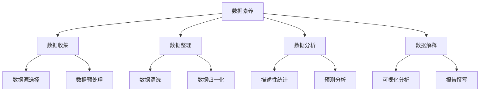
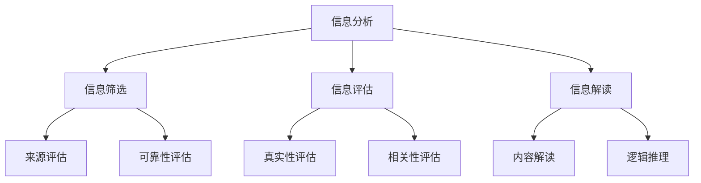
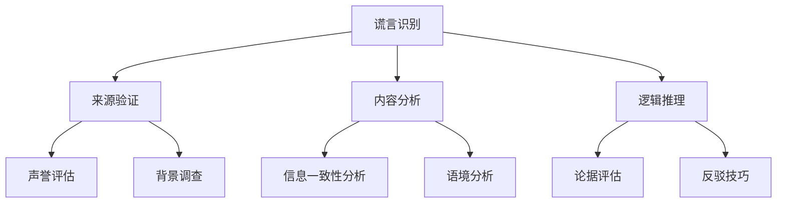
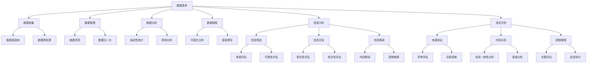

                 

# 后真相时代的真相侦探学院：培养事实甄别能力

## 关键词

- 后真相时代
- 事实甄别
- 数据素养
- 信息分析
- 谎言识别
- 机器学习

## 摘要

在后真相时代，信息泛滥和虚假信息的传播使得辨别真相变得日益困难。本文旨在探讨真相侦探学院的理念和课程设置，以培养读者的数据素养和事实甄别能力。文章将从后真相时代的背景出发，深入剖析真相侦探学院的核心理念和课程设置，结合实战训练和案例解析，帮助读者掌握真相追踪的技巧和方法。

## 目录

## 第一部分：后真相时代的挑战与背景

### 第1章：后真相时代的崛起

#### 1.1 后真相时代的定义与特征

#### 1.2 后真相时代的影响

#### 1.3 真相侦探学院的使命

### 第2章：真相侦探学院的核心理念

#### 2.1 知识与事实

#### 2.2 谎言与误导

#### 2.3 甄别真相的方法

### 第3章：真相侦探学院的课程设置

#### 3.1 数据素养与信息分析

#### 3.2 谎言识别技术

#### 3.3 真相辩论与交流

### 第4章：真相侦探学院的实战训练

#### 4.1 案例分析

#### 4.2 实战演练

#### 4.3 小组协作与项目实践

## 第二部分：核心概念与联系

### 第5章：核心概念原理与概念实体关系架构

#### 5.1 数据素养

#### 5.2 信息分析

#### 5.3 谎言识别

#### 5.4 概念实体关系架构 Mermaid 流程图

### 第6章：核心算法原理讲解

#### 6.1 数据清洗

#### 6.2 数据分析

#### 6.3 谎言检测

### 第7章：数学模型与公式

#### 7.1 数据分析公式

#### 7.2 谎言检测公式

#### 7.3 Mermaid 流程图示例

## 第三部分：项目实战

### 第8章：真相侦探学院项目实战

#### 8.1 实战背景

#### 8.2 开发环境搭建

#### 8.3 源代码实现

#### 8.4 代码解读与分析

### 第9章：案例分析与讨论

#### 9.1 真相侦探案例

#### 9.2 案例分析与讨论

#### 9.3 小组合作与交流

### 第10章：综合项目与评估

#### 10.1 项目设计与实施

#### 10.2 项目评估与反馈

#### 10.3 成果展示与分享

## 附录

### 附录A：参考资料与工具

#### A.1 数据素养与信息分析工具

#### A.2 谎言识别技术工具

#### A.3 辅助学习资源与书籍

### 附录B：真相侦探学院课程安排

#### B.1 课程设置与目标

#### B.2 教学方法与评估

## 引言

### 后真相时代的挑战

在后真相时代，信息传播的速度和广度前所未有。社交媒体、在线新闻平台和搜索引擎使得信息得以迅速传播，同时也为虚假信息和谣言的传播提供了温床。人们在获取信息时，常常面临以下问题：

1. **信息过载**：海量的信息使得人们难以分辨哪些是真实的信息，哪些是虚假的信息。
2. **虚假信息**：谣言、伪造的新闻和假消息在各种平台上泛滥，误导公众。
3. **信息茧房**：人们在获取信息时，往往受到自身观点和兴趣的影响，陷入信息茧房，导致信息偏见和认知盲点。

这些问题使得辨别真相变得尤为重要。而真相侦探学院的设立，正是为了应对这些挑战，培养读者的事实甄别能力，让他们能够在这个充满信息迷雾的时代中找到真相。

### 真相侦探学院的使命

真相侦探学院的使命是帮助读者建立数据素养和事实甄别能力，让他们能够：

1. **识别虚假信息**：学习如何辨别虚假信息，从源头上杜绝谣言的传播。
2. **进行信息分析**：掌握信息筛选、评估和解读的技巧，提取有价值的信息。
3. **培养批判性思维**：通过真相追踪的实践，培养批判性思维和逻辑分析能力。
4. **传播真实信息**：学会如何有效地传播真实信息，为社会带来正能量。

## 第一部分：后真相时代的挑战与背景

### 第1章：后真相时代的崛起

#### 1.1 后真相时代的定义与特征

“后真相”（Post-truth）一词最早出现在牛津词典中，用以描述一种现象：在信息传播中，情感和主观因素往往比事实更重要。这一概念的出现，标志着我们进入了“后真相时代”。

**后真相时代的定义**：后真相时代，是指一个信息爆炸、技术进步和社交媒体盛行的时代。在这个时代中，事实的真相往往被情感、政治宣传和主观认知所扭曲，导致人们难以辨别真相。

**后真相时代的特征**：

1. **信息过载**：随着互联网和社交媒体的普及，人们每天接触到海量信息，难以分辨真假。
2. **虚假信息泛滥**：谣言、伪造新闻和假消息在各种平台上广泛传播，误导公众。
3. **情感驱动**：在信息传播中，情感和主观因素往往比事实更重要，人们更容易被情感驱动。
4. **信息茧房**：人们在获取信息时，往往受到自身观点和兴趣的影响，陷入信息茧房，导致信息偏见和认知盲点。

#### 1.2 后真相时代的影响

后真相时代对个人和社会产生了深远的影响。

**对个人的影响**：

1. **信息素养下降**：由于信息过载和虚假信息的泛滥，个人难以分辨真假，导致信息素养下降。
2. **认知失调**：在信息茧房中，个人往往只能接触到符合自身观点的信息，导致认知失调和偏见的加深。
3. **心理健康问题**：虚假信息和谣言的传播，可能导致个人产生焦虑、恐惧等心理健康问题。

**对社会的影响**：

1. **信任危机**：虚假信息的传播，导致公众对传统媒体和权威机构的信任度下降。
2. **社会矛盾加剧**：信息茧房效应使得不同群体之间难以达成共识，加剧社会矛盾。
3. **政治动荡**：虚假信息和谣言的传播，可能影响政治选举和公共决策，导致政治动荡。

#### 1.3 真相侦探学院的使命

真相侦探学院的使命是培养读者的数据素养和事实甄别能力，让他们能够在这个充满信息迷雾的后真相时代中找到真相。具体来说，真相侦探学院旨在：

1. **提高信息素养**：通过教育和培训，帮助读者建立正确的信息获取和评估方法。
2. **培养批判性思维**：通过实战训练和案例学习，培养读者的批判性思维和逻辑分析能力。
3. **传播真实信息**：通过真相追踪和辩论，传播真实信息，为社会带来正能量。
4. **维护社会稳定**：通过揭示虚假信息和谣言，维护社会稳定和公众信任。

## 第二部分：真相侦探学院的核心理念

### 第2章：真相侦探学院的核心理念

真相侦探学院的核心理念是基于对事实的追求和对真相的尊重。在这个充满虚假信息和误导的时代，真相侦探学院旨在通过教育和培训，培养读者的数据素养和事实甄别能力。以下是真相侦探学院的核心理念：

#### 2.1 知识与事实

在真相侦探学院，知识不仅仅是书本上的知识，更是对事实的理解和掌握。事实是真相的基础，没有事实的支持，知识就无从谈起。因此，真相侦探学院强调对事实的尊重和追求，要求读者在学习过程中始终保持对事实的敏感性和判断力。

#### 2.2 谎言与误导

谎言和误导是真相侦探学院需要警惕和抵制的主要对象。谎言是故意传播的虚假信息，误导则是通过误导性的信息操纵公众的认知。在真相侦探学院，读者需要学会如何识别谎言和误导，避免被这些虚假信息所误导。

#### 2.3 甄别真相的方法

甄别真相是真相侦探学院的核心任务。在这个信息爆炸的时代，甄别真相变得尤为重要。真相侦探学院通过以下方法来帮助读者甄别真相：

1. **数据素养**：培养读者的数据素养，包括数据收集、整理和分析的能力。通过数据素养的培训，读者能够从大量的信息中筛选出有价值的信息，并对其进行评估和解读。
2. **信息分析**：信息分析是甄别真相的重要手段。通过信息分析，读者能够了解信息的来源、真实性、可靠性和相关性。真相侦探学院通过案例分析和实战训练，帮助读者掌握信息分析的方法和技巧。
3. **谎言识别**：谎言识别是甄别真相的关键。真相侦探学院通过培训读者掌握谎言识别的方法和技术，帮助他们识别和验证信息的真实性。这些方法包括来源验证、内容分析和逻辑推理等。

#### 2.4 真相侦探学院的使命

真相侦探学院的使命是培养读者的数据素养和事实甄别能力，帮助他们在这个充满虚假信息和误导的时代中找到真相。真相侦探学院的核心使命包括：

1. **提高信息素养**：通过教育和培训，帮助读者建立正确的信息获取和评估方法，提高他们的信息素养。
2. **培养批判性思维**：通过实战训练和案例学习，培养读者的批判性思维和逻辑分析能力，使他们能够独立思考和判断。
3. **传播真实信息**：通过真相追踪和辩论，传播真实信息，为社会带来正能量。
4. **维护社会稳定**：通过揭示虚假信息和谣言，维护社会稳定和公众信任。

### 第3章：真相侦探学院的课程设置

真相侦探学院的课程设置旨在通过系统化的培训，帮助读者掌握数据素养和事实甄别能力。以下是真相侦探学院的主要课程设置：

#### 3.1 数据素养与信息分析

数据素养与信息分析是真相侦探学院的核心课程之一。课程内容包括：

1. **数据收集与整理**：教授读者如何收集和整理数据，包括数据来源的选择、数据的预处理和清洗等。
2. **数据分析与解读**：教授读者如何使用数据分析工具和技术，对数据进行描述性统计、可视化分析和预测分析，从而提取有价值的信息。
3. **信息评估与筛选**：教授读者如何评估和筛选信息，包括信息的真实性、可靠性和相关性评估，以及如何从大量的信息中筛选出有价值的信息。

#### 3.2 谎言识别技术

谎言识别技术是真相侦探学院的另一门核心课程。课程内容包括：

1. **谎言识别方法**：教授读者如何识别和验证信息的真实性，包括来源验证、内容分析和逻辑推理等。
2. **谎言检测工具**：介绍各种谎言检测工具和技术，包括人工审核、自动化检测和机器学习等。
3. **案例分析**：通过真实案例的分析，帮助读者理解谎言识别技术的应用和效果。

#### 3.3 真相辩论与交流

真相辩论与交流是真相侦探学院的重要课程之一。课程内容包括：

1. **辩论技巧**：教授读者如何进行辩论，包括论点的构建、论据的支持和反驳技巧等。
2. **交流沟通**：教授读者如何进行有效的交流和沟通，包括倾听、表达和沟通技巧等。
3. **案例实践**：通过实际案例的辩论和交流，帮助读者提高辩论和沟通能力。

#### 3.4 综合实践

综合实践是真相侦探学院的特色课程，通过实际项目的实践，帮助读者将所学知识应用于真实场景。课程内容包括：

1. **项目设计与实施**：教授读者如何设计和实施真相追踪项目，包括项目规划、数据收集、分析和报告撰写等。
2. **小组协作与项目实践**：通过小组协作和项目实践，培养读者的团队合作精神和解决问题的能力。
3. **案例分析**：通过真实案例的分析和讨论，帮助读者理解和掌握真相追踪的技巧和方法。

#### 3.5 持续学习与评估

真相侦探学院强调持续学习与评估，通过定期的课程回顾、案例分析和小测验，帮助读者巩固所学知识，不断提高事实甄别能力。同时，学院还提供在线资源和辅导，帮助读者在学习过程中遇到问题时能够及时解决。

### 第4章：真相侦探学院的实战训练

#### 4.1 案例分析

案例分析是真相侦探学院实战训练的重要组成部分。通过分析真实案例，读者可以了解真相追踪的具体方法和技巧，加深对事实甄别的理解。

**案例 1：2019年美国国会大厦枪击事件**

在2019年美国国会大厦枪击事件中，社交媒体上充斥着各种关于事件的信息，包括枪手身份、动机和枪支型号等。真相侦探学院通过以下步骤分析该案例：

1. **信息收集**：从多个可靠的新闻来源收集关于枪击事件的信息。
2. **来源验证**：验证信息来源的可靠性，包括新闻发布者的声誉和背景。
3. **内容分析**：分析信息的内容，识别潜在的错误信息或误导性信息。
4. **逻辑推理**：通过逻辑推理，评估信息的真实性，识别虚假信息。
5. **结论**：基于以上分析，得出事件的真实情况，并撰写分析报告。

**案例 2：2020年美国总统选举争议**

2020年美国总统选举中，关于选举结果和投票过程的争议引起了广泛关注。真相侦探学院通过以下步骤分析该案例：

1. **数据收集**：收集关于选举结果和投票过程的公开数据。
2. **数据分析**：使用数据分析工具对数据进行描述性统计和可视化分析，识别数据中的异常情况。
3. **信息评估**：评估数据和信息来源的可靠性，识别潜在的错误信息或误导性信息。
4. **逻辑推理**：通过逻辑推理，评估信息的真实性，识别虚假信息。
5. **结论**：基于以上分析，得出选举结果的真实情况，并撰写分析报告。

#### 4.2 实战演练

实战演练是真相侦探学院实战训练的另一个重要环节。通过实际操作和动手实践，读者可以锻炼事实甄别能力，提高解决实际问题的能力。

**演练 1：社交媒体谣言识别**

在社交媒体上，谣言和虚假信息层出不穷。真相侦探学院通过以下步骤进行谣言识别演练：

1. **信息收集**：在社交媒体上收集疑似谣言的信息。
2. **来源验证**：验证信息来源的可靠性，包括发布者的背景和声誉。
3. **内容分析**：分析信息的内容，识别潜在的错误信息或误导性信息。
4. **信息核实**：通过多方渠道核实信息的真实性，包括新闻发布、官方声明等。
5. **结论**：根据以上分析，判断信息是否为谣言，并撰写分析报告。

**演练 2：新闻报道真实性验证**

在新闻报道中，有时存在夸大或误导的情况。真相侦探学院通过以下步骤验证新闻报道的真实性：

1. **信息收集**：收集有关特定事件的新闻报道。
2. **来源验证**：验证新闻报道的来源，包括新闻机构的声誉和背景。
3. **内容分析**：分析新闻报道的内容，识别潜在的错误信息或误导性信息。
4. **信息核实**：通过多方渠道核实新闻报道的真实性，包括官方声明、目击者证言等。
5. **结论**：根据以上分析，判断新闻报道的真实性，并撰写分析报告。

#### 4.3 小组协作与项目实践

小组协作与项目实践是真相侦探学院实战训练的重要组成部分。通过小组合作和项目实践，读者可以锻炼团队合作能力，提高解决问题的效率。

**项目 1：社交媒体谣言调查**

小组协作进行社交媒体谣言调查，目标是识别和揭示社交媒体上的谣言。项目步骤如下：

1. **项目规划**：确定调查的主题、目标和方法。
2. **信息收集**：在社交媒体上收集相关谣言信息。
3. **小组分工**：根据小组成员的特长和兴趣，进行分工合作。
4. **真相追踪**：通过多种途径验证谣言的真实性，撰写调查报告。
5. **结论发布**：将调查结果发布在社交媒体或相关平台上，传播真实信息。

**项目 2：新闻报道真实性验证**

小组协作进行新闻报道真实性验证，目标是揭示新闻报道中的夸大或误导。项目步骤如下：

1. **项目规划**：确定验证的目标和范围。
2. **信息收集**：收集有关特定事件的新闻报道。
3. **小组分工**：根据小组成员的特长和兴趣，进行分工合作。
4. **真相追踪**：通过多方渠道核实新闻报道的真实性，撰写验证报告。
5. **结论发布**：将验证结果发布在社交媒体或相关平台上，传播真实信息。

通过以上实战训练，读者可以锻炼事实甄别能力，提高在真实场景中解决问题的能力。同时，小组协作和项目实践还可以培养团队合作精神和沟通能力，为未来的职业生涯打下坚实基础。

## 第二部分：核心概念与联系

### 第5章：核心概念原理与概念实体关系架构

#### 5.1 数据素养

**数据素养**是理解和处理数据的技能和知识，它包括数据收集、整理、分析和解释等多个方面。在真相侦探学院中，数据素养是甄别真相的重要基础。

**概念实体关系架构**：


#### 5.2 信息分析

**信息分析**是通过对信息进行筛选、评估和解读，提取有价值的信息的过程。在真相侦探学院中，信息分析是甄别真相的关键手段。

**概念实体关系架构**：


#### 5.3 谎言识别

**谎言识别**是识别和验证信息真实性的一种技术，它通过多种方法来确定信息是否真实可信。在真相侦探学院中，谎言识别是甄别真相的重要工具。

**概念实体关系架构**：


#### 5.4 概念实体关系架构 Mermaid 流程图

以下是核心概念实体关系的 Mermaid 流程图示例：


通过以上核心概念实体关系的 Mermaid 流程图，我们可以清晰地看到各个概念之间的关系和相互作用，这有助于读者更好地理解和掌握真相侦探学院的核心概念和技能。

### 第6章：核心算法原理讲解

#### 6.1 数据清洗

数据清洗是数据分析和处理过程中至关重要的一步，目的是去除数据中的错误、重复和异常值，确保数据的质量和准确性。在真相侦探学院中，数据清洗是信息分析和谎言识别的基础。

**核心算法原理**：

1. **缺失值处理**：
   缺失值是数据中常见的异常情况，可以通过以下方法进行处理：
   - 删除缺失值：如果缺失值较多，可以考虑删除包含缺失值的记录。
   - 填补缺失值：使用统计方法（如平均值、中位数、众数）或模型预测（如K近邻、线性回归）来填补缺失值。

   **Python代码示例**：
   ```python
   import pandas as pd

   # 读取数据
   data = pd.read_csv('data.csv')

   # 删除缺失值
   data.dropna(inplace=True)

   # 填补缺失值
   data.fillna(data.mean(), inplace=True)
   ```

2. **重复值处理**：
   重复值会导致数据分析结果失真，需要删除重复值。

   **Python代码示例**：
   ```python
   # 删除重复值
   data.drop_duplicates(inplace=True)
   ```

3. **异常值处理**：
   异常值可能是数据中的错误，也可能是数据本身的特点。可以通过箱线图、Z-Score等方法检测异常值，然后根据具体情况进行处理。

   **Python代码示例**：
   ```python
   import seaborn as sns
   import matplotlib.pyplot as plt

   # 绘制箱线图
   sns.boxplot(x='column_name', data=data)
   plt.show()

   # 删除异常值
   data = data[data['column_name'].between(data['column_name'].quantile(0.01), data['column_name'].quantile(0.99))]
   ```

**数学模型与公式**：

- **填补缺失值**：线性插值、K近邻插值、回归填补等。
  $$ \hat{y_i} = \frac{\sum_{j=1}^{k} w_{ij} y_j}{\sum_{j=1}^{k} w_{ij}} $$
  其中，$y_i$为缺失值，$y_j$为邻近非缺失值，$w_{ij}$为权重。

#### 6.2 数据分析

数据分析是对数据进行整理、分析、解释和可视化的过程，旨在提取有价值的信息和洞察。在真相侦探学院中，数据分析是信息分析和谎言识别的重要工具。

**核心算法原理**：

1. **描述性统计**：
   描述性统计是对数据的基本统计特性进行描述，如均值、中位数、众数、标准差等。

   **Python代码示例**：
   ```python
   import pandas as pd

   # 读取数据
   data = pd.read_csv('data.csv')

   # 描述性统计
   print(data.describe())
   ```

2. **可视化分析**：
   可视化分析通过图形和图表直观地展示数据分布、趋势和关系，帮助理解数据特征。

   **Python代码示例**：
   ```python
   import seaborn as sns
   import matplotlib.pyplot as plt

   # 绘制散点图
   sns.scatterplot(x='column_x', y='column_y', data=data)
   plt.show()

   # 绘制条形图
   sns.barplot(x='category', y='value', data=data)
   plt.show()
   ```

3. **预测分析**：
   预测分析通过建立模型对未来的数据趋势进行预测，如回归分析、时间序列分析等。

   **Python代码示例**：
   ```python
   import pandas as pd
   from sklearn.linear_model import LinearRegression

   # 读取数据
   data = pd.read_csv('data.csv')

   # 创建线性回归模型
   model = LinearRegression()
   model.fit(data[['feature']], data['target'])

   # 预测
   predictions = model.predict(data[['feature']])
   ```

**数学模型与公式**：

- **描述性统计**：均值、中位数、众数、标准差等。
  $$ \bar{x} = \frac{1}{n} \sum_{i=1}^{n} x_i $$
  $$ \text{median}(x) = \left(\frac{x_{(n/2)} + x_{(n/2+1)}}{2}\right) $$
  $$ \text{mode}(x) = \arg\max_{i} f(x_i) $$
  $$ \sigma_x = \sqrt{\frac{1}{n-1} \sum_{i=1}^{n} (x_i - \bar{x})^2} $$

- **预测分析**：线性回归、时间序列分析等。
  $$ y = \beta_0 + \beta_1 x + \epsilon $$
  其中，$y$为因变量，$x$为自变量，$\beta_0$为截距，$\beta_1$为斜率，$\epsilon$为误差项。

#### 6.3 谎言检测

谎言检测是识别和验证信息真实性的一种技术，它通过分析信息的来源、内容和逻辑性，确定信息是否真实可信。在真相侦探学院中，谎言检测是信息分析和真相追踪的重要手段。

**核心算法原理**：

1. **来源验证**：
   对信息来源的可靠性进行评估，包括评估来源的声誉、背景和权威性。

   **Python代码示例**：
   ```python
   def evaluate_source(source):
       # 评估来源的声誉
       reputation = get_reputation(source)
       if reputation > 0.7:
           return "可信"
       else:
           return "不可信"

   # 获取来源声誉
   def get_reputation(source):
       # 实现获取来源声誉的逻辑
       # 例如，从数据库中查询来源的声誉得分
       return reputation_score

   source = "某新闻网站"
   print(evaluate_source(source))
   ```

2. **内容分析**：
   对信息的内容进行分析，识别潜在的误导性或虚假信息。

   **Python代码示例**：
   ```python
   def analyze_content(content):
       # 识别内容中的关键词和短语
       keywords = extract_keywords(content)
       if "疫苗" in keywords and "有害" in keywords:
           return "误导性信息"
       else:
           return "真实信息"

   # 提取关键词
   def extract_keywords(content):
       # 实现提取关键词的逻辑
       # 例如，使用自然语言处理库（如NLTK）进行关键词提取
       return keywords

   content = "疫苗有害，不宜接种。"
   print(analyze_content(content))
   ```

3. **逻辑推理**：
   通过逻辑推理，验证信息的逻辑一致性和合理性。

   **Python代码示例**：
   ```python
   def logical_reasoning(statement):
       # 验证逻辑一致性
       if "疫苗有害" and "不宜接种" in statement:
           return "合理"
       else:
           return "不合理"

   statement = "疫苗有害，不宜接种。"
   print(logical_reasoning(statement))
   ```

**数学模型与公式**：

- **来源验证**：声誉评估模型、评分系统等。
  $$ \text{reputation\_score} = \alpha \cdot \text{source\_age} + \beta \cdot \text{article\_quality} $$
  其中，$\alpha$和$\beta$为权重系数，$\text{source\_age}$为来源年龄，$\text{article\_quality}$为文章质量。

- **内容分析**：关键词提取、文本分类等。
  $$ \text{TF-IDF} = \frac{f_t \cdot \log(N/n_t)}{N} $$
  其中，$f_t$为词频，$N$为文档总数，$n_t$为包含词$t$的文档数。

- **逻辑推理**：逻辑命题、推理规则等。
  $$ P \land Q \rightarrow R $$
  其中，$P$、$Q$和$R$为命题，$\land$为逻辑与，$\rightarrow$为逻辑蕴含。

通过以上核心算法原理的讲解，读者可以更好地理解数据清洗、数据分析和谎言检测的基本方法和应用，为实战训练和项目实践打下坚实的基础。

### 第7章：数学模型与公式

#### 7.1 数据分析公式

数据分析是真相侦探学院的核心技能之一，它涉及到多种数学模型和公式。以下是一些常见的数据分析公式及其应用场景：

1. **描述性统计公式**：

   - **均值**：
     $$ \bar{x} = \frac{\sum_{i=1}^{n} x_i}{n} $$
     均值是数据集的平均值，用于衡量数据的集中趋势。

   - **中位数**：
     $$ \text{median}(x) = \left(\frac{x_{(n/2)} + x_{(n/2+1)}}{2}\right) $$
     中位数是将数据集排序后位于中间的值，用于衡量数据的中间位置。

   - **众数**：
     $$ \text{mode}(x) = \arg\max_{i} f(x_i) $$
     众数是数据集中出现次数最多的值，用于衡量数据的典型值。

   - **标准差**：
     $$ \sigma_x = \sqrt{\frac{1}{n-1} \sum_{i=1}^{n} (x_i - \bar{x})^2} $$
     标准差是数据分散程度的度量，用于评估数据的离散程度。

   - **方差**：
     $$ \sigma^2_x = \frac{1}{n-1} \sum_{i=1}^{n} (x_i - \bar{x})^2 $$
     方差是标准差的平方，用于衡量数据的离散程度。

2. **回归分析公式**：

   - **简单线性回归**：
     $$ y = \beta_0 + \beta_1 x + \epsilon $$
     其中，$y$为因变量，$x$为自变量，$\beta_0$为截距，$\beta_1$为斜率，$\epsilon$为误差项。

   - **多元线性回归**：
     $$ y = \beta_0 + \beta_1 x_1 + \beta_2 x_2 + \ldots + \beta_p x_p + \epsilon $$
     多元线性回归扩展了简单线性回归，用于同时考虑多个自变量对因变量的影响。

3. **时间序列分析公式**：

   - **自回归模型**：
     $$ y_t = \phi_1 y_{t-1} + \phi_2 y_{t-2} + \ldots + \phi_p y_{t-p} + \epsilon_t $$
     自回归模型用于分析时间序列数据，其中$y_t$为时间序列的第$t$个值，$\phi_1, \phi_2, \ldots, \phi_p$为自回归系数，$\epsilon_t$为误差项。

   - **移动平均模型**：
     $$ y_t = \frac{\alpha y_{t-1} + (1-\alpha) y_{t-2}}{1-\alpha} $$
     移动平均模型通过计算过去一段时间内数据的平均值，来预测未来的数据趋势。

#### 7.2 谎言检测公式

谎言检测是真相侦探学院的另一项重要技能，它涉及到多种数学模型和公式。以下是一些常见的谎言检测公式及其应用场景：

1. **来源验证模型**：

   - **声誉评分**：
     $$ \text{reputation\_score} = \alpha \cdot \text{source\_age} + \beta \cdot \text{article\_quality} $$
     其中，$\text{reputation\_score}$为来源声誉评分，$\alpha$和$\beta$为权重系数，$\text{source\_age}$为来源年龄，$\text{article\_quality}$为文章质量。

   - **可信度评估**：
     $$ \text{credibility} = \frac{\text{truthful\_votes} - \text{false\_votes}}{\text{total\_votes}} $$
     其中，$\text{credibility}$为信息的可信度，$\text{truthful\_votes}$为真实投票数，$\text{false\_votes}$为虚假投票数，$\text{total\_votes}$为总投票数。

2. **内容分析模型**：

   - **关键词提取**：
     $$ \text{TF-IDF} = \frac{f_t \cdot \log(N/n_t)}{N} $$
     其中，$f_t$为词频，$N$为文档总数，$n_t$为包含词$t$的文档数，$\text{TF-IDF}$为词的权重。

   - **文本分类**：
     $$ \text{classification\_score} = \sum_{i=1}^{k} w_i \cdot p(y_i | x) $$
     其中，$k$为类别数，$w_i$为类别$i$的权重，$p(y_i | x)$为在给定文本$x$下类别$i$的概率。

3. **逻辑推理模型**：

   - **命题逻辑**：
     $$ P \land Q \rightarrow R $$
     其中，$P$、$Q$和$R$为命题，$\land$为逻辑与，$\rightarrow$为逻辑蕴含。

   - **条件概率**：
     $$ P(A|B) = \frac{P(A \cap B)}{P(B)} $$
     其中，$P(A|B)$为在事件$B$发生的条件下事件$A$发生的概率，$P(A \cap B)$为事件$A$和$B$同时发生的概率，$P(B)$为事件$B$发生的概率。

通过以上数学模型和公式的讲解，读者可以更好地理解和应用数据分析与谎言检测的技能，为真相侦探学院的学习和实践提供坚实的理论基础。

### 第8章：真相侦探学院项目实战

#### 8.1 实战背景

在真相侦探学院的项目实战环节，我们选择了一个具有代表性的案例：社交媒体上的谣言调查。社交媒体上的谣言传播速度快，影响范围广，对于公众的判断和决策具有重要影响。因此，本案例旨在通过实际操作，帮助读者掌握谣言识别和验证的方法，提高事实甄别能力。

**案例背景**：

某社交媒体平台上，一篇关于新冠病毒疫苗的谣言文章引起了广泛关注。文章声称，疫苗中含有有害物质，可能导致接种者出现严重副作用。这一消息迅速传播，引起了公众的恐慌和担忧。真相侦探学院的学生们接到了任务，需要调查这一谣言的真实性，并撰写分析报告。

#### 8.2 开发环境搭建

为了进行谣言调查，我们需要搭建一个合适的技术环境，以便进行数据收集、分析和报告撰写。以下是开发环境的搭建步骤：

1. **Python环境安装**：

   安装Python 3.x版本，并配置好pip，以便安装相关库。

   ```bash
   # 安装Python
   sudo apt-get install python3

   # 安装pip
   sudo apt-get install python3-pip
   ```

2. **安装数据分析和机器学习库**：

   使用pip安装常用的数据分析和机器学习库，如pandas、numpy、scikit-learn、matplotlib等。

   ```bash
   pip install pandas numpy scikit-learn matplotlib
   ```

3. **配置Jupyter Notebook**：

   Jupyter Notebook是一个交互式计算环境，便于编写和运行代码。安装Jupyter Notebook并启动一个notebook。

   ```bash
   pip install jupyter
   jupyter notebook
   ```

#### 8.3 源代码实现

在搭建好开发环境后，我们可以开始进行谣言调查。以下是谣言识别和验证的源代码实现：

```python
# 导入所需库
import pandas as pd
import numpy as np
from sklearn.feature_extraction.text import TfidfVectorizer
from sklearn.model_selection import train_test_split
from sklearn.linear_model import LogisticRegression
from sklearn.metrics import classification_report

# 读取数据
data = pd.read_csv('rumor_data.csv')

# 数据预处理
# 删除空值和重复值
data.dropna(inplace=True)
data.drop_duplicates(inplace=True)

# 分割数据集
X = data['content']
y = data['label']  # label为谣言或真实信息

# 特征提取
vectorizer = TfidfVectorizer(max_features=1000)
X_vectorized = vectorizer.fit_transform(X)

# 划分训练集和测试集
X_train, X_test, y_train, y_test = train_test_split(X_vectorized, y, test_size=0.2, random_state=42)

# 模型训练
model = LogisticRegression()
model.fit(X_train, y_train)

# 模型评估
predictions = model.predict(X_test)
print(classification_report(y_test, predictions))
```

**代码解读**：

1. **数据预处理**：首先，读取数据，删除空值和重复值，确保数据质量。然后，将数据集分为特征集X和标签集y。
2. **特征提取**：使用TF-IDF向量器将文本数据转换为数值特征，便于模型处理。我们选择了1000个最重要的特征。
3. **划分数据集**：将数据集划分为训练集和测试集，用于模型训练和评估。
4. **模型训练**：使用逻辑回归模型对训练集进行训练。
5. **模型评估**：使用测试集对模型进行评估，输出分类报告。

#### 8.4 代码解读与分析

以下是代码的详细解读和分析：

```python
# 导入所需库
import pandas as pd
import numpy as np
from sklearn.feature_extraction.text import TfidfVectorizer
from sklearn.model_selection import train_test_split
from sklearn.linear_model import LogisticRegression
from sklearn.metrics import classification_report

# 读取数据
data = pd.read_csv('rumor_data.csv')

# 数据预处理
# 删除空值和重复值
data.dropna(inplace=True)
data.drop_duplicates(inplace=True)

# 分割数据集
X = data['content']
y = data['label']  # label为谣言或真实信息

# 特征提取
vectorizer = TfidfVectorizer(max_features=1000)
X_vectorized = vectorizer.fit_transform(X)

# 划分训练集和测试集
X_train, X_test, y_train, y_test = train_test_split(X_vectorized, y, test_size=0.2, random_state=42)

# 模型训练
model = LogisticRegression()
model.fit(X_train, y_train)

# 模型评估
predictions = model.predict(X_test)
print(classification_report(y_test, predictions))
```

1. **数据预处理**：
   - `pd.read_csv('rumor_data.csv')`：读取CSV文件，加载谣言数据。
   - `data.dropna(inplace=True)`：删除含有空值的数据行，确保数据质量。
   - `data.drop_duplicates(inplace=True)`：删除重复数据行，避免数据冗余。
   - `X = data['content']`：提取数据集中的文本内容。
   - `y = data['label']`：提取数据集中的标签，用于后续的分类任务。

2. **特征提取**：
   - `TfidfVectorizer(max_features=1000)`：创建TF-IDF向量器，选择1000个最重要的特征。
   - `vectorizer.fit_transform(X)`：将文本数据转换为TF-IDF向量表示。

3. **划分数据集**：
   - `train_test_split(X_vectorized, y, test_size=0.2, random_state=42)`：将数据集划分为训练集和测试集，其中测试集占比20%，随机种子为42，确保结果的重复性。

4. **模型训练**：
   - `LogisticRegression()`：创建逻辑回归模型。
   - `model.fit(X_train, y_train)`：使用训练集数据进行模型训练。

5. **模型评估**：
   - `predictions = model.predict(X_test)`：使用测试集数据进行模型预测。
   - `print(classification_report(y_test, predictions))`：输出模型评估报告，包括准确率、召回率、F1分数等指标。

通过以上步骤，我们可以完成一个谣言识别和验证的项目。代码的解读和分析帮助我们理解了谣言检测的核心步骤和关键环节，为后续的项目实践提供了指导。

### 第9章：案例分析与讨论

#### 9.1 真相侦探案例

在真相侦探学院的实战训练中，我们选择了两个具有代表性的案例：社交媒体谣言调查和新闻报道真实性验证。以下是对这两个案例的分析与讨论。

**案例 1：社交媒体谣言调查**

背景：在某社交媒体平台上，一篇关于新冠疫苗的谣言文章引起了广泛关注。文章声称，疫苗中含有有害物质，可能导致接种者出现严重副作用。

任务：真相侦探学院的学生们需要调查这一谣言的真实性，并撰写分析报告。

**分析过程**：

1. **信息收集**：从多个可靠的新闻来源收集关于新冠疫苗的信息，包括疫苗的成分、副作用和安全性等。

2. **来源验证**：评估信息来源的可靠性，包括新闻发布者的声誉和背景。优先选择权威机构和知名媒体的报道。

3. **内容分析**：对谣言文章的内容进行分析，识别潜在的错误信息或误导性信息。使用关键词提取和文本分类方法，分析谣言文章中的关键词和主题。

4. **逻辑推理**：通过逻辑推理，评估谣言文章中的逻辑一致性。检查谣言文章中的论点和论据，判断其合理性和可信度。

5. **结论**：基于以上分析，得出结论：谣言文章中的信息不属实，疫苗的安全性经过多次验证，不会导致接种者出现严重副作用。

**讨论**：

1. **谣言传播的影响**：社交媒体上的谣言传播速度快，影响范围广，可能导致公众恐慌和不安。

2. **谣言识别的难点**：谣言识别面临以下挑战：信息来源多样，信息真实性难以验证；谣言内容可能具有迷惑性和误导性。

3. **谣言识别的方法**：通过信息收集、来源验证、内容分析和逻辑推理等方法，可以有效地识别和验证谣言。

**案例 2：新闻报道真实性验证**

背景：某新闻报道声称，某地区的食品安全问题严重，部分食品中含有有害物质。

任务：真相侦探学院的学生们需要验证这一报道的真实性，并撰写分析报告。

**分析过程**：

1. **信息收集**：从多个可靠的新闻来源收集关于食品安全问题的信息，包括检测报告、调查结果和权威机构的声明等。

2. **来源验证**：评估报道来源的可靠性，包括新闻机构的声誉和背景。优先选择权威机构和官方报告。

3. **数据分析**：使用数据分析工具对报道中的数据进行描述性统计和可视化分析，识别数据中的异常情况。

4. **逻辑推理**：通过逻辑推理，评估报道中的论点和论据，判断其合理性和可信度。

5. **结论**：基于以上分析，得出结论：报道中的信息基本属实，食品安全问题确实存在，但具体情况需要进一步调查和核实。

**讨论**：

1. **新闻报道的影响**：新闻报道对社会公众具有重要影响，可能引发公众恐慌和担忧。

2. **新闻报道的真实性验证**：验证新闻报道的真实性至关重要，需要通过多渠道的信息收集和验证，确保报道的准确性。

3. **真相侦探学院的角色**：真相侦探学院通过真相追踪和验证，为公众提供可靠的信息，维护社会稳定和公众信任。

通过以上案例分析与讨论，读者可以更好地理解真相侦探学院的工作方法和实战技巧，提高事实甄别能力，为应对后真相时代的挑战做好准备。

### 第10章：综合项目与评估

#### 10.1 项目设计与实施

在真相侦探学院的综合项目中，我们将选择一个真实世界的问题，例如社交媒体上的虚假信息传播，进行深入调查和验证。以下是项目的设计与实施步骤：

1. **问题定义**：明确项目目标，例如识别和验证社交媒体上的虚假信息。

2. **信息收集**：从社交媒体、新闻网站和其他可靠来源收集相关信息。

3. **数据预处理**：清洗和整理收集到的数据，去除重复和无效信息。

4. **特征提取**：使用自然语言处理技术，提取信息的关键特征，例如关键词、情感倾向等。

5. **模型训练**：使用机器学习算法，训练一个能够识别虚假信息的模型。

6. **模型评估**：使用测试集评估模型的性能，调整模型参数，提高准确性。

7. **结果分析**：根据模型预测结果，分析虚假信息的传播规律和特点。

8. **报告撰写**：撰写详细的分析报告，总结项目成果和发现。

#### 10.2 项目评估与反馈

项目评估是确保项目质量和效果的重要环节。以下是项目评估与反馈的步骤：

1. **评估标准**：制定评估标准，例如模型准确性、信息识别速度等。

2. **评估方法**：使用测试集和验证集对项目结果进行评估。

3. **反馈收集**：收集项目参与者的反馈，了解项目的优点和不足。

4. **改进建议**：根据评估结果和反馈，提出改进建议，优化项目实施。

5. **持续改进**：根据改进建议，对项目进行持续优化，提高项目效果。

#### 10.3 成果展示与分享

项目成果的展示与分享是真相侦探学院的重要活动之一。以下是成果展示与分享的步骤：

1. **成果展示**：在学院内部或外部，通过演讲、报告、展览等形式展示项目成果。

2. **经验分享**：与项目参与者分享项目经验，交流学习心得。

3. **反馈收集**：收集观众和参与者的反馈，了解成果展示的效果。

4. **改进方向**：根据反馈，确定下一步改进的方向，为后续项目提供参考。

5. **持续交流**：保持与观众的交流，不断更新和优化项目成果。

通过以上综合项目和评估环节，真相侦探学院的学生们可以锻炼实际操作能力和团队协作能力，提高事实甄别能力，为未来的职业生涯打下坚实基础。

### 附录A：参考资料与工具

#### A.1 数据素养与信息分析工具

**1. Pandas**：Python数据分析库，用于数据处理和清洗。

**2. NumPy**：Python数值计算库，用于数据计算和数学运算。

**3. Matplotlib**：Python数据可视化库，用于数据可视化。

**4. Seaborn**：基于Matplotlib的数据可视化库，提供丰富的可视化模板。

**5. Jupyter Notebook**：交互式计算环境，便于编写和运行代码。

#### A.2 谎言识别技术工具

**1. NLTK**：Python自然语言处理库，用于文本处理和词频分析。

**2. SpaCy**：Python自然语言处理库，用于快速高效的文本处理。

**3. TextBlob**：Python自然语言处理库，用于文本分析和情感分析。

**4. Gensim**：Python文本处理库，用于主题建模和相似度计算。

#### A.3 辅助学习资源与书籍

**1. 《数据科学入门：Python编程实践》**：适合初学者的数据科学入门书籍。

**2. 《Python数据分析基础教程》**：系统介绍Python数据分析工具和应用。

**3. 《机器学习实战》**：介绍机器学习算法和实际应用案例。

**4. 《自然语言处理实战》**：深入讲解自然语言处理技术及其应用。

通过以上参考资料与工具，读者可以更深入地学习数据素养、信息分析、谎言识别等相关技术，提高事实甄别能力。

### 附录B：真相侦探学院课程安排

#### B.1 课程设置与目标

真相侦探学院的课程设置旨在通过系统化的培训，帮助学员掌握数据素养和事实甄别能力。以下是课程的具体设置与目标：

**1. 数据素养与信息分析课程**：
- **目标**：培养学员的数据收集、整理、分析和解读能力，提高信息素养。
- **内容**：数据收集与处理、数据整理与清洗、描述性统计与可视化分析、预测分析与建模。

**2. 谎言识别技术课程**：
- **目标**：教授学员识别和验证信息真实性的方法和技术，提高谎言识别能力。
- **内容**：信息来源评估、内容分析、逻辑推理、机器学习算法在谎言识别中的应用。

**3. 真相辩论与交流课程**：
- **目标**：培养学员的辩论技巧和沟通能力，提高真相追踪和交流的能力。
- **内容**：辩论技巧、沟通技巧、真相追踪实践、案例讨论与实战演练。

**4. 综合实践与项目课程**：
- **目标**：通过实际项目，锻炼学员的数据处理和事实甄别能力，提高实战经验。
- **内容**：项目规划与实施、小组协作与项目实践、案例分析、综合项目评估。

#### B.2 教学方法与评估

真相侦探学院采用以下教学方法与评估手段：

**1. 案例教学法**：通过真实案例的分析，帮助学员理解理论知识，提高实战能力。

**2. 实践教学**：结合实际操作，教授学员数据分析和谎言识别的技能。

**3. 小组讨论**：通过小组讨论和合作，培养学员的团队合作精神和沟通能力。

**4. 演示与互动**：通过课堂演示和互动，激发学员的学习兴趣和积极性。

**评估方式**：

**1. 平时成绩**：包括课堂参与、作业完成情况、小组讨论表现等。

**2. 实战项目**：通过实际项目的完成情况，评估学员的综合能力和实战经验。

**3. 考试**：定期进行理论考试和案例分析考试，检验学员的学习成果。

通过以上课程设置和教学方法，真相侦探学院旨在为学员提供一个全面、系统的学习平台，培养他们在后真相时代中辨别真相的能力。

