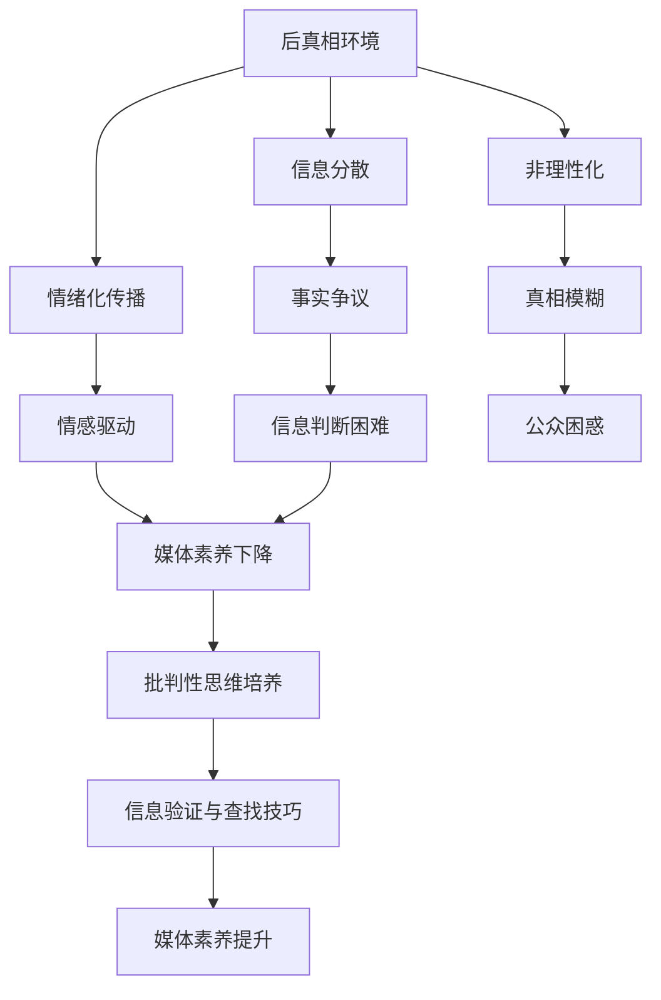
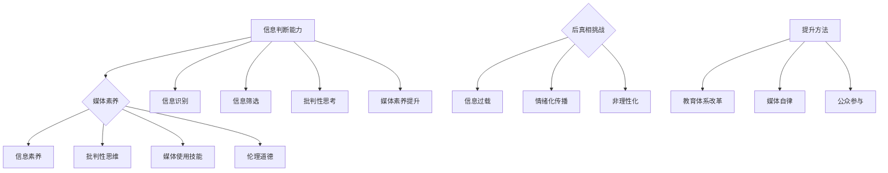
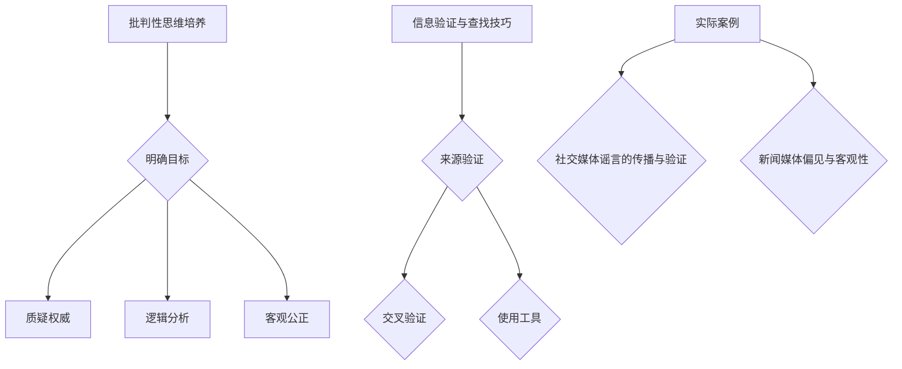
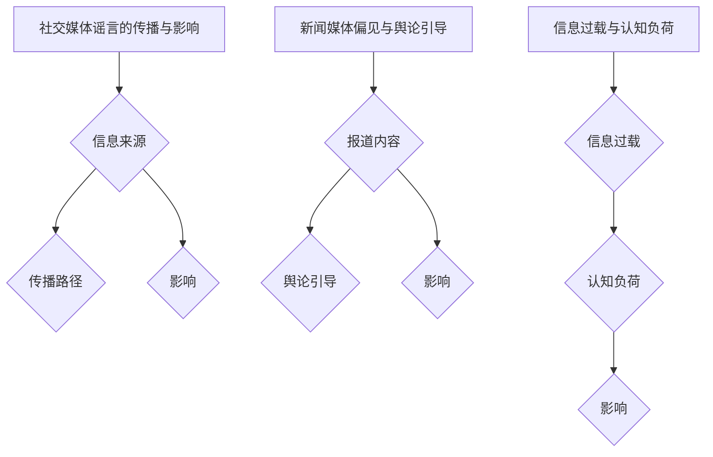
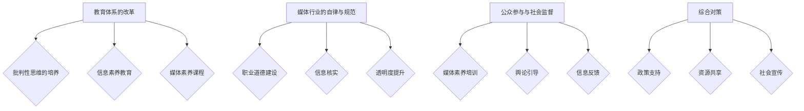

                 

# 后真相环境中的信息判断：提升公民的媒体素养

## 关键词
后真相时代、媒体素养、信息判断、假新闻、批判性思维、信息验证

## 摘要
本文旨在探讨在后真相环境中，如何提升公民的媒体素养和信息判断能力。通过分析后真相时代的特征，以及信息判断和媒体素养的核心概念，本文提出了具体的提升方法，包括批判性思维的培养、信息验证与查找技巧的运用，并结合实际案例进行深入剖析。最后，本文总结了提升媒体素养的最佳实践和注意事项，为公民在复杂信息环境中做出正确判断提供了指导。

## 引言

### 背景介绍
随着互联网和社交媒体的迅速发展，信息传播的速度和范围达到了前所未有的高度。然而，这种快速的信息传播也带来了诸多问题，其中最显著的是后真相时代的到来。在后真相环境中，事实和真相往往被情绪、偏见和误导性信息所取代，公众对于信息的判断变得越来越困难。这一现象引发了社会各界对于公民媒体素养和信息判断能力的关注。

### 核心概念与联系
媒体素养：指公民在接收、理解和评价媒体信息时所具备的能力。它包括信息识别、批判性思考、媒体使用的技能和伦理道德等方面。

信息判断：指个体在接收信息时，运用逻辑和批判性思维对信息的真实性、可靠性和相关性进行评估和判断的过程。

后真相环境：指一个信息高度分散、情绪化和非理性化的信息传播环境，真相往往被主观感受和情感所取代。

### Mermaid 流程图

## 核心概念与联系
### 信息判断能力的重要性
在信息爆炸的时代，拥有良好的信息判断能力对于公民而言至关重要。它不仅关系到个人对信息的正确理解和运用，也关系到社会整体的健康发展。信息判断能力主要包括以下几个方面：

- **信息识别**：能够区分信息源的可信度，识别出信息中的偏见和误导性内容。
- **批判性思考**：对信息进行深度分析和评估，不盲从、不轻信，培养独立思考的能力。
- **信息筛选**：能够从大量信息中筛选出对自己有用的信息，提高信息利用效率。

### 媒体素养的构成
媒体素养是信息判断能力的重要组成部分。它包括以下几个核心要素：

- **信息素养**：了解信息的基本知识，包括信息的来源、传播路径和内容特点。
- **批判性思维**：运用逻辑和理性思维对信息进行分析和评估，避免盲目接受和传播。
- **媒体使用技能**：掌握媒体工具的使用方法，包括社交媒体、搜索引擎等。
- **伦理道德**：在信息传播过程中遵循道德规范，尊重他人的隐私和权利。

### 后真相环境下的挑战
后真相环境给信息判断和媒体素养带来了巨大的挑战：

- **信息过载**：大量信息涌入，公民难以分辨真假，容易受到误导。
- **情绪化传播**：信息传播过程中充满情绪化表达，真相被情感驱动所掩盖。
- **非理性化**：信息传播过程中，理性思考被情绪和非理性因素所取代。

### 提升方法
为了提升公民的信息判断能力和媒体素养，需要采取以下措施：

- **教育体系改革**：加强媒体素养教育，将批判性思维和信息判断纳入课程体系。
- **媒体自律**：提高媒体从业者的职业道德和职业素养，规范信息传播行为。
- **公众参与**：鼓励公众参与信息传播的监督和评价，提高社会整体的信息素养水平。

### Mermaid 流�程图

## 提升媒体素养的方法与实践

### 批判性思维的培养
批判性思维是提升媒体素养的重要工具。它帮助公民在信息接收和评估过程中，运用逻辑和理性进行思考，从而避免盲目接受信息。

#### 批判性思维的基本原则
1. **明确目标**：在接收信息时，首先要明确自己的目标，即需要获取哪些信息，以及这些信息对自己有何意义。
2. **质疑权威**：不盲从权威，对权威人士的信息进行批判性思考，寻求多方面的证据和观点。
3. **逻辑分析**：运用逻辑规则，对信息的合理性、一致性和逻辑性进行评估。
4. **客观公正**：在评估信息时，保持客观和公正，避免偏见和情绪的影响。

#### 批判性思维的训练方法
1. **阅读训练**：通过阅读不同类型的文章和书籍，培养对信息的分析和评估能力。
2. **案例讨论**：通过小组讨论和案例分析，提高对信息批判性思考的技巧。
3. **写作练习**：通过写作练习，锻炼对信息的逻辑表达和论证能力。

#### 批判性思维在媒体素养提升中的应用
1. **信息识别**：通过批判性思维，公民能够更准确地识别出信息中的偏见和误导性内容。
2. **信息筛选**：运用批判性思维，公民能够从大量信息中筛选出对自己有用的信息，提高信息利用效率。
3. **媒体使用**：通过批判性思维，公民能够更合理地使用媒体工具，避免被情绪化传播所影响。

### 信息验证与查找技巧
在信息爆炸的时代，掌握信息验证与查找技巧对于提升媒体素养至关重要。

#### 信息验证的重要性
信息验证是指对接收到的信息进行真实性、可靠性和相关性的评估。其重要性体现在：

1. **避免被误导**：通过信息验证，公民能够避免受到假新闻和误导性信息的侵害。
2. **提高决策能力**：准确的信息有助于公民做出更明智的决策。
3. **维护社会秩序**：准确的信息有助于维护社会的稳定和和谐。

#### 信息验证的方法与工具
1. **来源验证**：检查信息的来源，判断其可信度。例如，查看信息发布者的背景、信誉和专业性。
2. **交叉验证**：通过多个来源的信息进行比对，验证信息的真实性。
3. **使用工具**：利用搜索引擎、信息验证网站和数据库等工具，快速查找相关信息并进行验证。

#### 信息查找技巧与实践
1. **关键词搜索**：掌握有效关键词的选取，提高信息查找的准确性和效率。
2. **逻辑推理**：通过逻辑推理，从已知信息推导出新的结论。
3. **实践应用**：通过实际操作，不断练习和提升信息查找和验证的技能。

### 实际案例
#### 案例1：社交媒体谣言的传播与验证
在一次社交媒体事件中，有消息称某地区发生了一起严重的食品安全事故。然而，通过交叉验证，我们发现该消息并未得到官方证实，且有多个来源的信息相互矛盾。经过进一步的调查，我们发现这是一则谣言，并及时进行了辟谣。

#### 案例2：新闻媒体偏见与客观性
在另一则新闻报道中，某媒体报道了一起交通事故，但报道中充斥着对当事双方的偏见和情绪化描述。通过批判性思维，我们分析了报道的内容，发现其缺乏客观性和公正性。我们随后找到了其他媒体的报道，并进行了对比分析，最终得出更为客观的结论。

### 结论
通过批判性思维的培养和信息验证与查找技巧的运用，公民可以提升自己的媒体素养，更好地应对后真相环境中的信息挑战。这些方法不仅有助于个人成长，也对社会整体的健康发展具有重要意义。

### Mermaid 流程图

## 案例分析与反思

### 社交媒体谣言的传播与影响
社交媒体谣言的传播是后真相环境中一个突出的现象。以某次新冠疫情期间为例，社交媒体上频繁出现关于疫苗副作用和效果的谣言。这些谣言往往通过夸张的标题和煽动性的语言，迅速吸引了大量关注。许多用户在没有进行充分验证的情况下，便盲目转发，导致谣言迅速扩散。

#### 案例分析
1. **信息来源**：这些谣言通常来源于一些未经验证的社交媒体账号，甚至是一些匿名账号。
2. **传播路径**：谣言通过社交媒体的分享、评论和点赞等功能，迅速传播到更广泛的受众。
3. **影响**：谣言的传播引发了公众恐慌，对疫苗的信任度下降，部分人甚至拒绝接种。

#### 反思
- **信息识别**：公民需要提高信息识别能力，学会从来源、语言和逻辑上辨别谣言。
- **批判性思考**：在遇到未经证实的信息时，应保持批判性思维，不轻易相信和传播。
- **信息验证**：在转发信息前，应进行必要的验证，确保信息的真实性。

### 新闻媒体偏见与舆论引导
新闻媒体在信息传播过程中，也可能存在偏见和舆论引导的现象。以某次政治选举为例，部分媒体在报道过程中，对候选人的报道存在明显的倾向性，甚至夸大其词或隐瞒事实。

#### 案例分析
1. **报道内容**：媒体报道的内容存在明显的偏向，对某位候选人的报道充满了赞美，而对另一位候选人的报道则充满了负面信息。
2. **舆论引导**：媒体的报道不仅影响了公众对候选人的看法，还引导了公众的舆论方向。
3. **影响**：这种偏见和引导可能导致公众对选举产生不公平的看法，甚至影响选举结果。

#### 反思
- **媒体素养**：公民应提高对新闻媒体的批判性思考，不轻易接受媒体的引导。
- **多源信息**：在获取信息时，应尽量从多个来源获取信息，以避免被单一媒体的报道所误导。
- **信息验证**：对媒体报道的内容进行验证，确保其真实性和客观性。

### 信息过载与认知负荷
在信息爆炸的时代，公民面临着大量的信息，这可能导致信息过载和认知负荷。

#### 案例分析
1. **信息过载**：社交媒体、新闻媒体和各种信息渠道不断向公众传递大量信息，公民难以消化和处理。
2. **认知负荷**：面对大量信息，公民需要花费大量时间和精力去筛选、评估和判断，这增加了认知负荷。

#### 反思
- **信息筛选**：公民应学会筛选信息，关注对自己有用的信息，避免被无用的信息所困扰。
- **信息验证**：对重要的信息进行验证，确保其真实性和可靠性。
- **时间管理**：合理规划时间，避免信息过载和认知负荷。

### 结论
通过对社交媒体谣言、新闻媒体偏见和信息过载等案例的分析，我们可以看到，提升公民的媒体素养和信息判断能力具有重要意义。通过批判性思维、信息验证和查找技巧的培养，公民可以更好地应对后真相环境中的信息挑战，做出更为明智的判断。

### Mermaid 流程图

## 提升公民媒体素养的对策与建议

### 教育体系的改革
教育体系是提升公民媒体素养的基础。针对后真相环境中的挑战，教育体系需要进行改革，将媒体素养和信息判断能力纳入课程体系。

#### 教育改革的具体措施
1. **批判性思维的培养**：在课程设置中增加批判性思维课程，培养学生的逻辑分析能力和独立思考能力。
2. **信息素养教育**：在信息素养教育中，教授学生如何识别、筛选和验证信息，提高学生的信息判断能力。
3. **媒体素养课程**：开设专门的媒体素养课程，介绍媒体的特点、功能和使用技巧，培养学生的媒体使用能力。

### 媒体行业的自律与规范
媒体行业是信息传播的主要渠道，其自律与规范对于提升公民媒体素养至关重要。

#### 媒体自律的具体措施
1. **职业道德建设**：加强媒体从业者的职业道德教育，提高其社会责任感。
2. **信息核实**：媒体在发布信息前，应进行充分的核实，确保信息的真实性和可靠性。
3. **透明度提升**：媒体应提高信息传播的透明度，公开信息来源和制作过程，增强公众对媒体信息的信任。

### 公众参与与社会监督
公众参与和社会监督是提升公民媒体素养的重要手段。通过公众的积极参与和社会监督，可以促进媒体行业的健康发展。

#### 公众参与的具体措施
1. **媒体素养培训**：组织公众参与媒体素养培训，提高其信息识别和批判性思考能力。
2. **舆论引导**：鼓励公众积极参与社会议题的讨论，引导公众理性表达观点，避免情绪化传播。
3. **信息反馈**：建立信息反馈机制，鼓励公众对媒体信息进行评价和反馈，促进媒体改进。

### 综合对策
为了全面提升公民媒体素养，需要教育体系、媒体行业和公众共同努力，形成综合治理体系。

#### 综合对策的具体措施
1. **政策支持**：政府应出台相关政策，支持教育体系和媒体行业改革，鼓励公众参与。
2. **资源共享**：教育机构和媒体行业应加强合作，共享资源，共同提升公民媒体素养。
3. **社会宣传**：通过各种宣传渠道，提高公众对媒体素养和信息判断能力的重视，形成全社会共同关注和参与的良好氛围。

### 结论
提升公民媒体素养是一项系统工程，需要多方面的努力和合作。通过教育体系的改革、媒体行业的自律与规范以及公众参与与社会监督，我们可以共同应对后真相环境中的信息挑战，提升公民的信息判断能力和媒体素养，为社会的发展贡献力量。

### Mermaid 流程图

## 结语：后真相时代，我们如何前行？

在后真相时代，提升公民的媒体素养和信息判断能力成为一项紧迫的任务。通过教育体系的改革、媒体行业的自律与规范以及公众参与与社会监督，我们可以共同应对信息挑战，构建一个更加健康、理性的信息传播环境。

### 总结与展望
本文通过对后真相环境的分析，提出了提升公民媒体素养的方法与实践。这些方法不仅有助于个人成长，也对社会整体的健康发展具有重要意义。展望未来，随着技术的不断进步和社会的不断发展，我们需要持续关注媒体环境的变化，不断调整和优化提升媒体素养的策略。

### 最佳实践 Tips
- **持续学习**：保持对媒体和技术的关注，不断学习新知识，提升自己的信息判断能力。
- **多渠道获取信息**：避免单一来源的信息，通过多个渠道获取信息，提高信息真实性判断的准确性。
- **批判性思考**：在接收信息时，始终保持批判性思维，不盲从、不轻信。
- **信息验证**：在转发信息前，进行必要的验证，确保信息的真实性和可靠性。

### 小结与注意事项
- **提高信息素养**：了解信息的基本知识，包括信息的来源、传播路径和内容特点。
- **培养批判性思维**：通过阅读、讨论和实践，培养批判性思维，提高对信息的分析和评估能力。
- **关注媒体素养教育**：关注学校、社区等教育场所的媒体素养教育，积极参与和推动相关课程的设置。
- **加强社会监督**：鼓励公众参与媒体信息的监督和评价，提高社会整体的信息素养水平。

### 拓展阅读
- [《后真相时代：我们如何理解信息》](链接)
- [《批判性思维：超越思维的边界》](链接)
- [《信息素养：信息时代的必备技能》](链接)

通过本文的探讨，我们希望读者能够更好地理解后真相环境中的信息挑战，掌握提升媒体素养的方法，为自己的信息判断和决策提供有力支持。作者：AI天才研究院/AI Genius Institute & 禅与计算机程序设计艺术 /Zen And The Art of Computer Programming。

