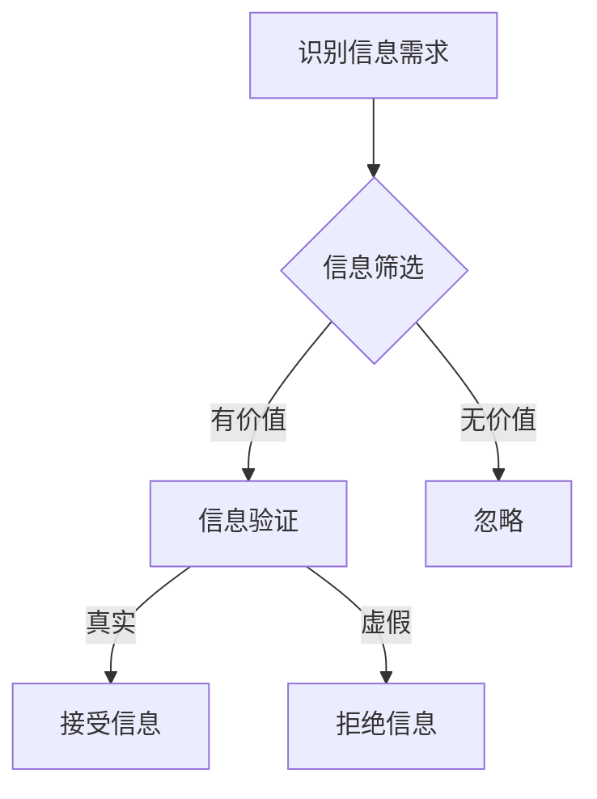
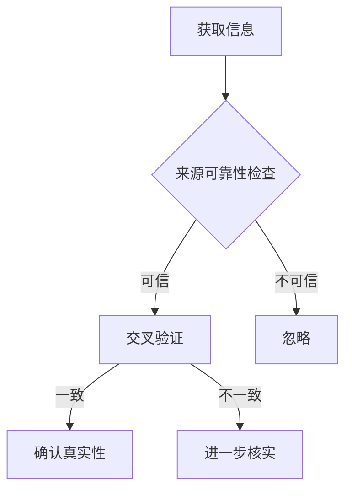
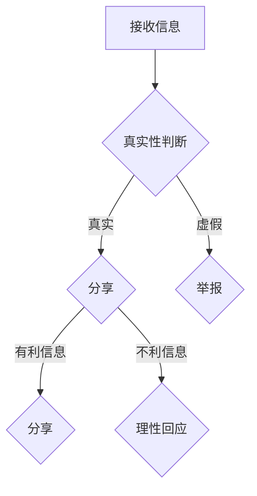

                 

### 第一部分：后真相时代的媒体环境

#### 第1章：后真相时代的媒体背景

##### 1.1 后真相时代的起源与发展

在数字媒体和社交网络的迅猛发展背景下，我们进入了所谓的“后真相时代”。这个术语最早由英国政治评论家马修·达蒙德（Matthew d'Ancona）在2016年提出，用以描述信息传播和公众认知的一个新阶段。在传统媒体时代，真相往往是决策和公众舆论的基础，而如今，真相似乎变得不那么重要，情绪、偏见和影响力成为了信息传播的主要推动力。

后真相时代的起源与发展可以从以下几个方面来理解：

1. **社交媒体的崛起**：社交媒体平台如Facebook、Twitter和微博等的兴起，使得信息传播的速度和范围大幅增加。传统媒体对信息的筛选和验证功能减弱，而社交媒体上的信息往往未经严格审核，真假难辨。

2. **信息过载**：随着互联网的普及，人们接触到的信息量急剧增加，这导致信息过载现象。在信息爆炸的环境下，人们往往无法对每一条信息进行深度分析和判断，而是依赖直觉和情感来做出反应。

3. **假新闻的流行**：在追求流量和关注度的驱动下，一些媒体和自媒体平台倾向于发布耸人听闻、煽动性的内容，以吸引读者。这些假新闻往往在社交媒体上迅速传播，误导公众。

4. **政治极化**：政治极化加剧了后真相时代的现象。不同政治派别和团体倾向于传播符合自身观点的信息，对反对观点进行抹黑和诋毁。这种现象在选举期间尤为明显。

##### 1.2 后真相对公民媒体素养的影响

后真相时代对公民的媒体素养提出了新的挑战。在这个信息泛滥、真假难辨的环境中，提升公民的媒体素养变得尤为重要。

1. **信息筛选能力的下降**：在信息过载的时代，公民往往缺乏有效的信息筛选能力，容易受到假新闻和虚假信息的影响。

2. **情绪化的信息传播**：社交媒体上的信息传播往往带有强烈的情感色彩，容易引发公众的情绪反应，而不是理性思考。

3. **偏见和误解的加剧**：后真相时代的信息传播加剧了社会偏见和误解。公民缺乏对信息的批判性思维，容易接受和传播未经证实的信息。

4. **参与公共事务的能力下降**：公民在参与公共事务时，如果缺乏足够的媒体素养，容易受到误导，无法做出基于事实的决策。

##### 1.3 后真相时代的主要特征

后真相时代具有以下主要特征：

1. **真相不再是唯一的真相**：在传统媒体时代，真相往往是唯一的，而现在，不同的观点和解释往往都能找到其支持者。真相不再是决策和讨论的基础。

2. **情感和偏见驱动的传播**：信息传播不再以事实为基础，而是以情感和偏见为动力。社交媒体上的信息往往带有强烈的情感色彩，旨在引发读者的共鸣。

3. **虚假新闻的泛滥**：在追求流量和关注度的驱动下，虚假新闻、假信息和误导性信息在社交媒体上泛滥。

4. **公众认知的分化**：在后真相时代，公众对同一事件的认知往往呈现出明显的分化，不同群体对信息的解读和接受程度差异巨大。

#### 1.4 小结

后真相时代的到来，改变了信息传播的格局，也对公民的媒体素养提出了更高的要求。在这个时代，提升公民的媒体素养，培养批判性思维和信息判断能力，显得尤为重要。下一章，我们将进一步探讨媒体多样性与信息泛滥对公民媒体素养的挑战。

---

**关键词：** 后真相时代、公民媒体素养、社交媒体、假新闻、信息泛滥

**摘要：** 本章节探讨了后真相时代的起源与发展，分析了后真相对公民媒体素养的影响，并总结了后真相时代的主要特征。这一背景为后续章节关于提升媒体素养策略和方法的研究提供了基础。

---

## 第1章：后真相时代的媒体背景

### 1.2 媒体多样性与信息泛滥

在数字媒体的迅猛发展下，媒体生态呈现出前所未有的多样性。这种多样性带来了信息泛滥的现象，对公民媒体素养提出了新的挑战。

##### 1.2.1 媒体生态的多样性

媒体生态的多样性体现在多个方面：

1. **形式多样性**：从传统的报纸、杂志、电视，到新兴的博客、微博、短视频、直播等，信息传播形式越来越丰富。

2. **内容多样性**：媒体内容涵盖政治、经济、科技、文化、娱乐等各个领域，满足不同群体的需求。

3. **平台多样性**：社交媒体平台、新闻网站、专业媒体、自媒体等，提供了丰富的信息来源。

4. **传播渠道多样性**：信息可以通过互联网、手机、电视、广播等多种渠道传播。

##### 1.2.2 信息泛滥的挑战

信息泛滥带来了以下几个方面的挑战：

1. **筛选难度增加**：公民在接收信息时，需要花费更多的时间和精力来筛选有价值的信息。

2. **信息质量参差不齐**：在信息泛滥的环境下，优质信息和虚假信息混杂在一起，增加了公民辨别信息真伪的难度。

3. **注意力分散**：信息过载导致公民的注意力容易被吸引到各种信息，影响深层次思考和理性判断。

4. **时间成本增加**：公民需要花费更多的时间来消化和处理大量的信息，这可能导致工作和生活的压力增加。

##### 1.2.3 公民在信息选择中的困境

在信息泛滥的背景下，公民在信息选择中面临着以下困境：

1. **信息选择困难**：在大量信息中，公民往往难以判断哪些信息是值得关注的。

2. **信任危机**：传统媒体的公信力受到挑战，公民对信息的信任度降低，难以确定哪些信息是可靠的。

3. **偏见与误解**：公民在信息选择中容易受到自身偏见和情绪的影响，导致对信息的错误解读和传播。

4. **信息茧房效应**：公民倾向于接收与自己观点一致的信息，这可能导致信息选择的狭隘化和偏见加剧。

##### 1.2.4 媒体素养的重要性

为了克服信息泛滥带来的困境，提升公民的媒体素养变得尤为重要。媒体素养不仅包括对信息真实性的判断，还包括对信息来源的鉴别、批判性思维和信息筛选能力。

1. **信息真实性判断**：公民需要学会辨别信息的真实性，避免被虚假新闻和误导性信息所影响。

2. **信息来源鉴别**：了解不同媒体和平台的特点，判断信息来源的可靠性和权威性。

3. **批判性思维**：培养批判性思维能力，对信息进行深度分析和思考，避免盲目接受信息。

4. **信息筛选能力**：学会有效筛选和利用信息，提高信息处理的效率和质量。

#### 1.3 小结

媒体生态的多样性和信息泛滥给公民媒体素养带来了新的挑战。在这个信息爆炸的时代，提升公民的媒体素养，培养批判性思维和信息判断能力，显得尤为重要。下一章，我们将探讨后真相环境中的信息传播机制，进一步分析公民如何在复杂的信息环境中做出明智的选择。

---

**关键词：** 媒体多样性、信息泛滥、媒体素养、信息真实性、批判性思维

**摘要：** 本章节分析了媒体生态的多样性以及信息泛滥对公民媒体素养的挑战，探讨了公民在信息选择中的困境，并强调了提升媒体素养的重要性。

---

## 第1章：后真相时代的媒体背景

### 1.3 后真相环境中的信息传播机制

在进入后真相时代，信息传播机制发生了显著变化，社交媒体的崛起、虚假新闻的传播路径，以及信息真伪的判断方法成为了研究和讨论的热点。

##### 1.3.1 社交媒体的崛起

社交媒体平台，如Facebook、Twitter、微博等，已经成为信息传播的主要渠道之一。这些平台的特性使得信息传播速度极快，覆盖范围广泛，但也带来了信息真实性难以保障的问题。

1. **信息传播速度快**：社交媒体上的信息可以瞬间传播到全球各地，传统媒体需要数小时或数天才能覆盖的信息，在社交媒体上几分钟就能被传播。

2. **信息覆盖范围广**：社交媒体具有高度的社会连接性，用户可以通过分享、点赞、评论等方式将信息迅速扩散到大量用户。

3. **去中心化**：社交媒体的去中心化特性使得信息来源更加多元化，信息传播的路径也更加复杂。

4. **情绪化传播**：社交媒体上的信息往往带有强烈的情感色彩，易于引发公众的情感共鸣，从而迅速传播。

##### 1.3.2 虚假新闻的传播路径

虚假新闻在社交媒体上的传播路径通常包括以下几个环节：

1. **内容创作**：虚假新闻的制造者会利用各种手段创作出具有吸引力、耸人听闻的内容。

2. **平台发布**：虚假新闻通过社交媒体平台发布，利用平台的传播机制迅速传播。

3. **用户互动**：用户在看到虚假新闻后，可能会进行转发、评论等互动，进一步扩大传播范围。

4. **网络效应**：虚假新闻通过网络效应迅速传播，甚至形成热点话题，进一步强化其影响力。

5. **影响扩散**：虚假新闻不仅在国内传播，还可能通过社交媒体平台的国际链接，扩散到全球范围。

##### 1.3.3 信息真伪的判断方法

在虚假新闻泛滥的背景下，如何判断信息的真伪变得尤为重要。以下是一些常见的信息真伪判断方法：

1. **信息来源检查**：验证信息的来源是否可靠，是否出自权威媒体或官方渠道。

2. **交叉验证**：通过多个可信来源对比验证信息的真实性，避免单一来源的信息偏差。

3. **权威信息源查询**：利用权威的媒体、研究机构或官方发布的消息来验证信息的真实性。

4. **逻辑推理**：运用逻辑思维分析信息的合理性和逻辑一致性，识别信息中的矛盾和错误。

5. **媒体素养工具**：使用专门的媒体素养工具，如事实核查网站、虚假新闻检测工具等，辅助判断信息的真伪。

##### 1.3.4 信息真伪判断的实际应用

在实际应用中，信息真伪的判断方法可以用于以下几个方面：

1. **个人信息保护**：公民在接收和转发信息时，需进行真伪判断，以避免被虚假信息误导，保护自身利益。

2. **公共舆论引导**：媒体和政府部门需要通过信息真伪判断，发布权威信息，引导公众正确理解和应对各种事件。

3. **网络安全管理**：网络安全管理者需要识别虚假信息，防范网络谣言和恶意信息的传播。

4. **信息素养教育**：通过教育培养公民的媒体素养，提高其信息判断能力，是解决虚假新闻问题的关键。

#### 1.4 小结

后真相环境中的信息传播机制发生了显著变化，社交媒体的崛起和虚假新闻的传播路径使得信息真伪的判断变得复杂和重要。在这个时代，提升公民的媒体素养，培养批判性思维和信息判断能力，是应对信息泛滥和虚假新闻的关键。下一章，我们将探讨提升媒体素养的重要性及其教育现状和挑战。

---

**关键词：** 社交媒体、虚假新闻、信息真伪判断、媒体素养、交叉验证

**摘要：** 本章节分析了社交媒体崛起对信息传播机制的影响，探讨了虚假新闻的传播路径，以及介绍了信息真伪判断的方法和应用。这一探讨为理解后真相时代的媒体环境提供了重要视角。

---

## 第2章：提升媒体素养的重要性

### 2.1 媒体素养的定义与构成

媒体素养是指公民在接触、理解、分析、评估和创造媒体信息的过程中，所具备的知识、技能和态度。它不仅仅包括对媒体内容的理解，还涉及到媒体信息生产、传播和消费的全过程。

1. **知识层面**：了解媒体的基本运作机制，包括新闻价值、新闻报道的准则、媒体内容的呈现方式等。

2. **技能层面**：掌握信息筛选、批判性分析、信息验证等技能，能够有效地辨别信息的真伪和可靠性。

3. **态度层面**：具备批判性思维，对媒体信息持怀疑态度，避免盲目接受信息，以及尊重不同观点和声音。

媒体素养的核心要素包括：

1. **信息筛选能力**：在信息过载的时代，能够有效地筛选出有价值的信息，避免被虚假和误导性信息所困扰。

2. **批判性思维**：对媒体信息进行深度分析和思考，不盲目接受，而是通过逻辑推理和事实验证来形成自己的观点。

3. **信息验证能力**：学会验证信息的真实性，利用多个来源和权威渠道来交叉验证信息的可靠性。

4. **媒体伦理意识**：了解媒体的伦理规范，尊重事实，避免传播虚假信息，以及在媒体使用中维护公共利益。

### 2.1.2 媒体素养的重要性

提升媒体素养对个人和社会都具有重要意义：

1. **个人层面**：

   - **保护个人权益**：具备媒体素养的个人能够识别虚假信息和误导性信息，避免被欺骗和误导，保护自身权益。
   - **增强信息素养**：掌握信息筛选和信息验证的技能，提高个人在信息时代的生存能力和竞争力。
   - **培养批判性思维**：通过批判性思维训练，提高个人的思考能力和逻辑推理能力，更好地应对复杂的社会问题。

2. **社会层面**：

   - **增强公众舆论引导能力**：具备媒体素养的公众能够理性看待媒体信息，不被情绪化和虚假信息所左右，从而形成更加理性和健康的公共舆论环境。
   - **提高社会治理能力**：政府和社会组织可以通过提升公众的媒体素养，增强其对政策和事件的理性认识和判断，提高社会治理的效能。
   - **维护社会稳定**：通过媒体素养教育，可以减少虚假信息的传播，避免社会恐慌和动荡，维护社会稳定。

### 2.1.3 媒体素养的核心要素与联系

媒体素养的核心要素之间存在着密切的联系：

1. **信息筛选能力与批判性思维**：信息筛选能力是批判性思维的基础。只有能够有效筛选信息，才能对信息进行深度分析和批判。

2. **信息验证能力与信息筛选能力**：信息验证能力是信息筛选能力的延伸。在筛选出有价值信息后，通过验证能力确保信息的真实性。

3. **媒体伦理意识与信息验证能力**：媒体伦理意识是信息验证能力的保障。只有具备伦理意识，才能在验证信息时保持客观和公正。

4. **批判性思维与信息素养**：批判性思维是信息素养的核心。只有通过批判性思维，才能对信息进行深层次的分析和判断。

#### 2.2 小结

提升媒体素养对个人和社会都具有重要意义。它不仅能够帮助个人在信息时代生存和发展，还能够促进社会的理性思考和健康发展。在下一个部分，我们将探讨当前媒体素养教育的现状与挑战，进一步理解提升媒体素养的紧迫性和必要性。

---

**关键词：** 媒体素养、信息筛选、批判性思维、信息验证、媒体伦理意识

**摘要：** 本章节详细阐述了媒体素养的定义与构成，探讨了其重要性以及核心要素之间的联系。这些核心要素构成了提升媒体素养的基础，为后续章节提供理论基础。

---

## 第2章：提升媒体素养的重要性

### 2.2 媒体素养教育的现状与挑战

在全球范围内，媒体素养教育已经引起了广泛关注，许多国家和地区已经开始将媒体素养纳入教育体系中。然而，尽管取得了一些进展，当前的媒体素养教育仍然面临诸多挑战。

#### 2.2.1 媒体素养教育的现状

1. **学校教育**：许多国家在学校教育中增加了媒体素养课程，旨在培养学生的批判性思维和信息筛选能力。这些课程通常涵盖新闻学的基础知识、媒体伦理、信息验证方法等。

2. **非政府组织与社区教育**：一些非政府组织和社区教育项目也积极推广媒体素养教育，通过讲座、工作坊、在线课程等方式，提高公众的媒体素养。

3. **在线资源**：互联网上提供了大量的媒体素养教育资源，包括在线课程、教学视频、互动游戏等，方便公民随时学习和提升自己的媒体素养。

4. **国际合作**：国际组织和跨国项目也在推动媒体素养教育的全球化，通过合作研究和资源共享，提高全球范围内的媒体素养水平。

#### 2.2.2 媒体素养教育的挑战

尽管媒体素养教育已经取得了一些进展，但仍然面临以下挑战：

1. **资源不足**：许多学校和地区缺乏足够的资源和设备来开展有效的媒体素养教育，特别是缺乏专业的教师和教材。

2. **课程内容过时**：随着媒体环境的变化，现有的媒体素养课程内容可能已经过时，无法涵盖最新的媒体形式和问题。

3. **教学方式单一**：传统的课堂教学方式可能无法充分激发学生的学习兴趣和参与度，导致教学效果不佳。

4. **社会偏见与阻力**：在社会中，一些人可能对媒体素养教育持有偏见，认为这仅仅是学术研究或专业领域的问题，与日常生活无关。

5. **技术变革的挑战**：随着数字技术和社交媒体的快速发展，媒体素养教育的目标和内容需要不断更新，以适应新的技术环境。

#### 2.2.3 媒体素养教育的目标

为了应对上述挑战，媒体素养教育的目标应包括以下几个方面：

1. **提高批判性思维**：培养学生对媒体信息的批判性思维，使他们能够分析、评估和判断信息的真实性和价值。

2. **增强信息筛选能力**：培养学生能够有效地筛选和识别有价值的信息，避免被虚假和误导性信息所困扰。

3. **培养信息验证技能**：使学生掌握信息验证的方法，通过多个来源和权威渠道来确保信息的真实性。

4. **培养媒体伦理意识**：教育学生了解媒体的伦理规范，尊重事实，避免传播虚假信息，以及在媒体使用中维护公共利益。

5. **适应技术变革**：使学生能够适应不断变化的技术环境，掌握最新的媒体形式和信息传播方法。

#### 2.3 小结

当前，媒体素养教育已经取得了一些进展，但仍然面临资源不足、课程内容过时、教学方式单一等挑战。为了提升媒体素养，教育体系需要不断改革，引入新的教学资源和方式，并明确教育的目标，以适应快速变化的技术环境和社会需求。在下一个部分，我们将探讨提升媒体素养的具体策略与方法。

---

**关键词：** 媒体素养教育、资源不足、批判性思维、信息筛选能力、媒体伦理意识

**摘要：** 本章节分析了当前媒体素养教育的现状与面临的挑战，并明确了媒体素养教育的目标。这些探讨为后续章节关于提升媒体素养策略和方法的研究提供了基础。

---

## 第2章：提升媒体素养的重要性

### 2.3 提升媒体素养的策略与方法

为了有效提升公民的媒体素养，我们需要从教育策略、技术工具和社会参与等多个方面入手，制定系统化和多层次的方法。

#### 2.3.1 培养批判性思维

批判性思维是提升媒体素养的核心。以下是培养批判性思维的一些策略：

1. **课堂教学**：在学校课程中融入批判性思维的教学，例如通过案例分析、辩论和小组讨论等方式，培养学生的批判性思维。

2. **实践训练**：通过模拟新闻事件和社交媒体情景，让学生在实践中锻炼批判性思维，提高判断信息真伪的能力。

3. **跨学科学习**：结合不同学科的知识，如社会学、心理学和语言学等，帮助学生从多角度分析媒体信息，提高批判性思维能力。

#### 2.3.2 媒体素养教育的实践策略

媒体素养教育需要通过多种实践策略来提升学生的素养：

1. **课程设计与实施**：设计包含新闻学基础、媒体伦理、信息验证方法的课程，并采用互动式和项目式教学方法，提高学生的学习兴趣和参与度。

2. **校外实践活动**：组织学生参加新闻采访、事实核查和社区服务等实践活动，增强学生对媒体和社会问题的理解。

3. **教师培训**：对教师进行媒体素养培训，提高教师自身的媒体素养，使其能够有效地教授学生。

#### 2.3.3 媒体素养的持续提升

提升媒体素养是一个持续的过程，需要长期的努力和持续的投入：

1. **终身学习**：鼓励公民在一生中不断学习，通过阅读、参加讲座和工作坊等方式，不断提升自己的媒体素养。

2. **媒体素养工具**：利用各种媒体素养工具，如事实核查网站、信息验证工具和媒体素养应用等，帮助公民在日常生活中提高媒体素养。

3. **社会宣传**：通过媒体和公共宣传，提高公众对媒体素养重要性的认识，鼓励更多人参与到媒体素养提升的行动中来。

#### 2.3.4 政策支持和合作

提升媒体素养需要政策支持和多方合作：

1. **政策制定**：政府应制定相关政策和规定，支持媒体素养教育的发展，如制定教育标准、提供资金支持等。

2. **跨部门合作**：教育部门、媒体机构、非政府组织和社区组织应加强合作，共同推动媒体素养教育的实施。

3. **国际交流**：通过国际合作，分享媒体素养教育的最佳实践，借鉴国外先进经验，提高全球媒体素养水平。

#### 2.4 小结

提升媒体素养是一个系统工程，需要从教育策略、技术工具、社会参与和政策支持等多个方面入手。通过培养批判性思维、实施有效的教育实践、持续提升媒体素养，以及政策支持和国际合作，我们可以构建一个更加理性和健康的媒体环境。在下一个部分，我们将探讨信息判断的基础知识，帮助公民更好地识别和评估媒体信息。

---

**关键词：** 媒体素养、批判性思维、教育策略、实践方法、政策支持

**摘要：** 本章节提出了提升媒体素养的具体策略与方法，包括培养批判性思维、实施实践策略、持续提升素养以及政策支持和国际合作。这些策略和方法为提升公民的媒体素养提供了系统性指导。

---

## 第3章：信息判断的基础知识

### 3.1 信息判断的基本原则

在信息泛滥的后真相时代，信息判断的基本原则成为公民素养的重要组成部分。以下是几个关键的基本原则：

#### 3.1.1 信息来源的可靠性

信息来源的可靠性是判断信息真伪的首要原则。以下是一些评估信息来源可靠性的方法：

1. **权威性认证**：查看信息来源是否具有权威认证，如政府、学术机构或知名媒体等。

2. **历史记录**：了解信息来源的历史记录，是否有发布虚假信息的先例。

3. **多方验证**：通过多个可靠来源对比验证信息的真实性。

#### 3.1.2 信息真实性的判断

判断信息真实性需要运用批判性思维，以下是一些常用的方法：

1. **交叉验证**：通过不同来源的信息交叉验证，确保信息的一致性和可信度。

2. **权威信息源**：参考权威信息源，如官方声明、学术研究等，以判断信息的真实性。

3. **逻辑推理**：运用逻辑推理分析信息，识别其中的矛盾和不合理之处。

#### 3.1.3 信息完整性的要求

信息的完整性是判断信息价值的重要标准。以下是一些确保信息完整性的方法：

1. **全面性**：确保获取的信息是全面的，没有遗漏关键细节。

2. **背景知识**：了解事件的背景知识，有助于理解信息的完整含义。

3. **来源透明度**：信息来源应保持透明，以便公众能够追溯和核实。

### 3.2 信息验证的方法

信息验证是确保信息真实性的关键步骤。以下是几种常用的信息验证方法：

#### 3.2.1 交叉验证

交叉验证是判断信息真实性的基本方法。通过以下步骤进行交叉验证：

1. **确定关键信息**：识别信息中的关键点，如时间、地点、人物和事件等。

2. **查询多个来源**：通过不同来源的信息进行比对，确保信息的一致性。

3. **权威信息源**：参考权威信息源，如官方报道、学术研究等，以确认信息的真实性。

#### 3.2.2 利用权威信息源

利用权威信息源是验证信息真实性的有效方法。以下是一些权威信息源的例子：

1. **政府机构**：如国家统计局、卫生健康委员会等官方机构发布的信息。

2. **学术研究**：学术期刊、专业研究机构的报告和研究成果。

3. **知名媒体**：如《纽约时报》、《卫报》等知名媒体发布的报道。

#### 3.2.3 媒体素养工具的使用

随着技术的发展，媒体素养工具的使用越来越普遍。以下是一些常用的媒体素养工具：

1. **事实核查网站**：如[Snopes](https://www.snopes.com/)、[FactCheck.org](https://www.factcheck.org/)等，专门用于验证网络谣言和虚假信息。

2. **信息验证应用**：如[Google Fact Check Tools](https://www.google.com/search/about/factcheck/)，提供事实核查和验证服务。

3. **社交媒体反假新闻功能**：如Facebook的“事实核查标签”和Twitter的“标签验证”功能，帮助用户识别和标记虚假信息。

### 3.3 信息判断的案例研究

通过实际案例研究，可以更好地理解信息判断的方法和应用。以下是一些案例研究：

#### 3.3.1 真假新闻案例

1. **案例描述**：某社交平台上出现一则新闻，称某知名公司即将倒闭。

2. **信息验证**：
   - **信息来源**：该信息来源为某自媒体，无权威认证。
   - **交叉验证**：通过查询官方新闻报道和公司声明，发现该信息与实际情况不符。

3. **结论**：该信息为虚假新闻，未经官方确认，不应轻易传播。

#### 3.3.2 社交媒体中的信息判断

1. **案例描述**：社交媒体上流传一则视频，称某地发生重大事故。

2. **信息验证**：
   - **视频内容**：视频内容模糊，无明显细节。
   - **时间地点**：时间和地点描述不准确。
   - **权威信息源**：通过查询官方新闻和事故报告，发现该视频为虚假视频。

3. **结论**：该信息为虚假视频，不应被传播。

#### 3.3.3 信息判断的实际应用

1. **案例描述**：某公民在社交媒体上看到一则关于疫情的信息，称某地疫情严重。

2. **信息验证**：
   - **信息来源**：该信息来源为某匿名用户。
   - **交叉验证**：通过查询官方疫情报告和权威媒体，发现该信息与实际情况不符。

3. **结论**：该信息为虚假信息，不应被传播。

### 3.4 小结

信息判断的基础知识是公民素养的重要组成部分。通过了解信息来源的可靠性、信息真实性的判断和信息完整性的要求，公民可以更好地识别和评估媒体信息。信息验证的方法，如交叉验证、利用权威信息源和媒体素养工具的使用，有助于提高信息判断的准确性。案例研究则提供了实际应用的信息判断方法，帮助公民在实践中应用这些原则和方法。

---

**关键词：** 信息判断、信息来源可靠性、交叉验证、权威信息源、媒体素养工具

**摘要：** 本章节详细介绍了信息判断的基础知识，包括基本原则、验证方法和实际应用案例。这些知识帮助公民提高信息判断能力，避免被虚假和误导性信息所影响。

---

## 第3章：信息判断的基础知识

### 3.3 信息验证的方法

在信息判断的过程中，验证信息的准确性是一个关键步骤。以下是一些常用的信息验证方法：

#### 3.3.1 交叉验证

交叉验证是一种通过不同来源的信息进行比对，以确定信息准确性的方法。以下是交叉验证的步骤：

1. **确定关键信息**：识别信息中的关键要素，如时间、地点、人物和事件等。

2. **查询多个来源**：通过多个可靠来源，如官方网站、知名媒体、学术研究等，查找与关键信息相关的内容。

3. **对比信息一致性**：对比不同来源的信息，判断其是否一致，不一致的地方需要进一步核实。

4. **权威信息源**：参考权威信息源，如官方声明、学术报告等，以确认信息的真实性。

#### 3.3.2 利用权威信息源

利用权威信息源是验证信息真实性的有效方法。以下是一些权威信息源的例子：

1. **政府机构**：如国家统计局、卫生健康委员会等官方机构发布的信息。

2. **学术研究**：学术期刊、专业研究机构的报告和研究成果。

3. **知名媒体**：如《纽约时报》、《卫报》等知名媒体发布的报道。

#### 3.3.3 媒体素养工具的使用

随着技术的发展，媒体素养工具的使用越来越普遍。以下是一些常用的媒体素养工具：

1. **事实核查网站**：如[Snopes](https://www.snopes.com/)、[FactCheck.org](https://www.factcheck.org/)等，专门用于验证网络谣言和虚假信息。

2. **信息验证应用**：如[Google Fact Check Tools](https://www.google.com/search/about/factcheck/)，提供事实核查和验证服务。

3. **社交媒体反假新闻功能**：如Facebook的“事实核查标签”和Twitter的“标签验证”功能，帮助用户识别和标记虚假信息。

#### 3.3.4 信息验证的实践步骤

以下是一个信息验证的实践步骤示例：

1. **确定待验证信息**：在社交媒体上看到一则关于某公司财务状况的消息。

2. **查找权威信息源**：通过搜索引擎查找该公司的官方网站和财报。

3. **对比信息**：将社交媒体上的信息与公司财报中的信息进行对比，看是否一致。

4. **核实关键点**：对信息中的关键点进行进一步核实，如时间、地点和具体数据等。

5. **得出结论**：根据对比和核实的结果，判断信息的真实性。

### 3.4 信息判断的案例研究

通过实际案例研究，可以更好地理解信息判断的方法和应用。以下是一些案例研究：

#### 3.4.1 社交媒体谣言案例

1. **案例描述**：社交媒体上一则谣言称某地爆发了严重疫情。

2. **信息验证**：
   - **社交媒体**：该谣言在社交媒体上迅速传播，引发恐慌。
   - **官方信息源**：通过查询官方卫生部门的网站和公告，发现并无相关疫情报告。
   - **新闻媒体**：查询知名新闻媒体，也没有相关报道。

3. **结论**：该谣言为虚假信息，不应传播。

#### 3.4.2 网络新闻案例

1. **案例描述**：某网络新闻声称某产品具有神奇疗效。

2. **信息验证**：
   - **官方信息源**：查询该产品的官方网站和药品监管部门的公告，发现无相关疗效声明。
   - **学术研究**：查阅相关学术研究，发现没有证明该产品具有神奇疗效的论文或报告。

3. **结论**：该网络新闻为虚假宣传，不应相信。

#### 3.4.3 社交媒体视频案例

1. **案例描述**：社交媒体上一段视频显示某地发生严重交通事故。

2. **信息验证**：
   - **视频内容**：视频画面模糊，细节不清晰。
   - **时间地点**：时间和地点描述不准确。
   - **官方信息源**：查询官方交通部门的公告和报道，发现并无相关事故报道。

3. **结论**：该视频为虚假视频，不应传播。

### 3.5 小结

信息验证是信息判断的重要环节。通过交叉验证、利用权威信息源和媒体素养工具，公民可以更准确地判断信息的真实性。实际案例研究提供了具体的应用方法，帮助公民在实践中提高信息判断能力。在下一个部分，我们将探讨社交媒体与信息素养的关系。

---

**关键词：** 信息验证、交叉验证、权威信息源、媒体素养工具、社交媒体谣言、网络新闻、视频案例

**摘要：** 本章节详细介绍了信息验证的方法，并通过实际案例研究，展示了信息验证在社交媒体谣言、网络新闻和视频案例中的应用。这些方法和案例帮助公民提高信息判断能力。

---

## 第4章：社交媒体与信息素养

### 4.1 社交媒体的使用与风险

随着社交媒体的普及，人们越来越依赖这些平台获取信息、表达观点和社交互动。然而，社交媒体的广泛使用也带来了许多风险，特别是对公民信息素养的影响。

#### 4.1.1 社交媒体的优势

1. **信息获取的便捷性**：社交媒体使公民能够迅速获取各种信息，包括新闻、事件、科技动态等。

2. **传播速度**：社交媒体上的信息可以在短时间内传播到全球，使信息传播的速度大幅提升。

3. **互动性**：社交媒体平台提供了用户之间的互动功能，如评论、点赞、分享等，增强了信息的传播力和影响力。

4. **个性化**：社交媒体可以根据用户的兴趣和行为，推荐相关的信息和内容，提高信息获取的个性化程度。

#### 4.1.2 社交媒体的风险

1. **信息真实性难以保障**：社交媒体上的信息来源多样，缺乏严格审核，容易传播虚假信息、谣言和误导性信息。

2. **隐私泄露**：社交媒体平台可能收集用户的个人信息，存在隐私泄露的风险。

3. **网络安全威胁**：社交媒体上的恶意软件、钓鱼网站和网络诈骗等，对用户的网络安全构成威胁。

4. **社会极化**：社交媒体平台上的信息传播往往带有强烈的情感色彩，可能加剧社会分裂和极化。

#### 4.1.3 社交媒体素养的重要性

在社交媒体广泛使用的背景下，提升社交媒体素养变得尤为重要。社交媒体素养包括以下几个方面：

1. **信息筛选能力**：学会在社交媒体上筛选有价值的信息，避免被虚假和误导性信息所影响。

2. **批判性思维**：对社交媒体上的信息持批判性态度，运用逻辑推理和事实验证来分析信息的真实性和价值。

3. **隐私保护意识**：了解社交媒体的隐私设置，保护个人隐私，避免隐私泄露。

4. **网络安全意识**：识别和防范社交媒体上的网络安全威胁，如恶意软件、钓鱼网站和网络诈骗等。

5. **社会参与能力**：在社交媒体上理性参与公共讨论，尊重不同观点，避免情绪化和极端化。

### 4.2 社交媒体中的信息判断

在社交媒体上，信息的真实性难以保障，因此信息判断变得尤为重要。以下是社交媒体中信息判断的几个关键点：

#### 4.2.1 社交媒体信息的真实性

判断社交媒体信息的真实性需要以下几个步骤：

1. **检查信息来源**：查看信息的发布者是否具有权威性和可靠性，如官方机构、知名媒体或可信的社交媒体账号。

2. **交叉验证**：通过多个可靠来源对比验证信息的真实性，如官方声明、权威媒体报道等。

3. **逻辑推理**：运用逻辑推理分析信息，识别其中的矛盾和不合理之处。

4. **权威信息源**：参考权威信息源，如政府机构、学术研究、知名媒体等，以确认信息的真实性。

#### 4.2.2 社交媒体中的谣言辨别

谣言在社交媒体上传播迅速，辨别谣言是社交媒体素养的重要组成部分。以下是一些辨别谣言的方法：

1. **识别情绪化语言**：谣言往往使用煽动性和情绪化的语言，容易引发公众的共鸣。

2. **检查信息来源**：查看谣言的来源是否可信，是否经过权威验证。

3. **交叉验证**：通过多个可靠来源对比验证谣言的真实性。

4. **权威信息源**：参考权威信息源，如政府机构、学术研究、知名媒体等，以确认谣言的真实性。

5. **使用事实核查工具**：利用事实核查网站和工具，如[Snopes](https://www.snopes.com/)、[FactCheck.org](https://www.factcheck.org/)等，帮助辨别谣言。

#### 4.2.3 社交媒体素养的培养

为了提升社交媒体素养，需要从以下几个方面进行培养：

1. **教育**：在学校和社会教育中，加强社交媒体素养教育，教授信息筛选、批判性思维和信息验证的方法。

2. **自我意识**：个人应增强自我意识，培养对信息的批判性态度，避免盲目接受和传播信息。

3. **实践**：通过实践，如参与社交媒体上的讨论、进行信息验证等，提升信息判断能力。

4. **技术工具**：利用社交媒体反假新闻功能、事实核查网站和工具等，辅助信息判断。

5. **社区参与**：在社交媒体上积极参与公共讨论，尊重不同观点，传播真实和有价值的信息。

### 4.3 社交媒体实践案例

以下是一些社交媒体实践案例，展示了如何在实际中提升社交媒体素养：

#### 4.3.1 某社交平台虚假信息案例

1. **案例描述**：在某个社交平台上，一则关于疫情谣言迅速传播，引发恐慌。

2. **信息验证**：
   - **信息来源**：谣言来源为一个匿名用户，无权威认证。
   - **交叉验证**：通过查询官方疫情公告和媒体报道，发现该信息与实际情况不符。
   - **权威信息源**：参考官方卫生部门的公告，确认该信息为虚假信息。

3. **处理结果**：该谣言被平台标记为虚假信息，并提醒用户不要传播。

#### 4.3.2 社交媒体信息素养教育的实践

1. **案例描述**：某教育机构开展了一次社交媒体信息素养教育讲座。

2. **教育内容**：
   - **信息筛选能力**：教授如何筛选有价值的信息，避免被虚假信息所影响。
   - **批判性思维**：培养批判性思维，学会对信息进行分析和判断。
   - **信息验证方法**：介绍信息验证的方法，如交叉验证和权威信息源查询。

3. **效果评估**：讲座后，参与者的信息判断能力明显提升，社交媒体上的谣言传播得到有效遏制。

#### 4.3.3 社交媒体素养提升的案例研究

1. **案例描述**：某公司开展了一次社交媒体素养提升培训，针对员工进行教育。

2. **教育内容**：
   - **社交媒体安全**：教授如何保护个人隐私，避免网络安全威胁。
   - **信息判断能力**：培养员工的批判性思维，提高信息判断能力。
   - **社交媒体伦理**：强调社交媒体上的伦理规范，鼓励传播真实和有价值的信息。

3. **效果评估**：培训后，员工在社交媒体上的行为更加规范，公司内部的谣言传播得到有效控制。

### 4.4 小结

社交媒体的使用带来了许多风险，特别是对信息素养的影响。提升社交媒体素养，培养信息筛选、批判性思维和信息验证能力，是应对这些风险的关键。通过教育、自我意识、实践和技术工具的支持，公民可以更好地应对社交媒体中的信息挑战。在下一个部分，我们将探讨媒体素养的未来发展。

---

**关键词：** 社交媒体、信息素养、信息筛选、批判性思维、信息验证、谣言辨别、社交媒体素养

**摘要：** 本章节分析了社交媒体的使用与风险，探讨了社交媒体中的信息判断方法和社交媒体素养的培养，并通过实践案例展示了如何提升社交媒体素养。这些探讨为理解和应对社交媒体中的信息挑战提供了重要视角。

---

## 第5章：媒体素养的未来发展

### 5.1 媒体素养教育的未来趋势

随着数字技术的迅猛发展，媒体素养教育的未来发展趋势也在不断演变。以下是一些关键趋势：

#### 5.1.1 教育体系的改革

1. **课程内容的更新**：随着媒体环境的变化，媒体素养教育的内容需要不断更新，涵盖新兴媒体形式、数字素养和网络安全等。

2. **跨学科教学**：媒体素养教育应融合不同学科的知识，如社会学、心理学、语言学等，以提供更全面的教育体验。

3. **个性化学习**：利用大数据和人工智能技术，实现个性化学习路径，满足不同学生的学习需求。

4. **混合式学习**：结合线上和线下教学，提高教育效果和参与度。

#### 5.1.2 数字素养的重要性

在数字技术驱动的社会中，数字素养成为媒体素养的核心组成部分。以下是一些关键方面：

1. **信息筛选与评估**：学会在信息泛滥的环境中筛选和评估信息，避免被虚假和误导性信息所影响。

2. **网络安全与隐私保护**：了解网络安全的基本知识，学会保护个人隐私和信息安全。

3. **数据素养**：掌握数据分析和数据处理的基本技能，能够理解数据背后的意义。

#### 5.1.3 媒体素养教育与技术的融合

技术的进步为媒体素养教育提供了新的可能性，以下是一些融合技术的具体实践：

1. **虚拟现实（VR）与增强现实（AR）**：利用VR和AR技术，创造沉浸式的学习体验，提高学生的参与度和兴趣。

2. **人工智能（AI）与大数据**：利用AI和大数据技术，个性化教学方案和实时评估学生的学习效果。

3. **社交媒体与教育平台**：将社交媒体和教育平台相结合，提供实时互动和协作的学习环境。

### 5.2 后真相时代的挑战与机遇

后真相时代对媒体素养提出了新的挑战，但也带来了机遇：

#### 5.2.1 信息真伪的挑战

1. **虚假新闻的传播**：后真相时代虚假新闻的传播更加迅速和广泛，对公众的判断力构成挑战。

2. **信息过滤与偏见**：信息过滤和偏见可能导致公众对某些信息的盲目接受，影响公共舆论的理性发展。

#### 5.2.2 公民参与与责任

1. **公民参与**：提升媒体素养有助于公民更积极地参与公共事务，发挥舆论监督作用。

2. **社会责任**：公民应承担起辨别信息真伪的责任，避免传播虚假信息，维护社会稳定和公共利益。

#### 5.2.3 媒体素养的未来方向

后真相时代，媒体素养的发展方向应包括：

1. **培养批判性思维**：加强批判性思维的培养，提高公民对媒体信息的分析和判断能力。

2. **数字素养教育**：将数字素养融入媒体素养教育，提高公民的数字技能和信息素养。

3. **跨界合作**：媒体素养教育需要与政府、教育机构、非政府组织和科技企业等各方合作，共同推进。

### 5.3 全球媒体素养发展概况

全球范围内，媒体素养教育的发展呈现出不同的特点：

#### 5.3.1 各国媒体素养教育的现状

1. **发达国家**：发达国家在媒体素养教育方面投入较大，课程内容丰富，教育体系完善。

2. **发展中国家**：发展中国家在媒体素养教育方面面临资源不足和课程内容过时的挑战。

#### 5.3.2 国际媒体素养组织的合作

国际媒体素养组织，如[国际传媒素养联盟](https://www.aiml.info/)（Alliance for International Media Literacy），通过国际合作和资源共享，推动全球媒体素养教育的发展。

#### 5.3.3 全球媒体素养的未来展望

未来，全球媒体素养教育的发展趋势将包括：

1. **技术融合**：将人工智能、大数据等新技术应用于媒体素养教育，提高教育效果。

2. **跨学科教育**：推动不同学科之间的融合，提供更全面的媒体素养教育。

3. **全球协作**：通过国际合作，分享最佳实践，提升全球媒体素养水平。

### 5.4 小结

媒体素养教育的未来发展趋势包括教育体系的改革、数字素养教育、技术与教育的融合等。后真相时代对媒体素养提出了新的挑战，但也带来了机遇。全球范围内的媒体素养发展需要各方合作，共同推动。在下一个部分，我们将探讨未来媒体素养发展的关键方向。

---

**关键词：** 媒体素养教育、数字素养、技术与教育融合、批判性思维、跨国合作

**摘要：** 本章节分析了媒体素养教育的未来趋势，探讨了后真相时代的挑战与机遇，以及全球媒体素养发展概况。这些探讨为未来媒体素养教育的发展提供了重要视角和方向。

---

## 第5章：媒体素养的未来发展

### 5.1 媒体素养教育的未来趋势

随着全球信息技术的发展，媒体素养教育的未来趋势呈现出多样化和创新性的特点。以下是几个关键趋势：

#### 5.1.1 教育体系的改革

1. **课程内容的更新**：媒体素养教育需要与时俱进，不断更新课程内容，以涵盖新兴媒体形式、数字素养和网络安全等领域。例如，加入社交媒体使用技巧、数据隐私保护、网络谣言识别等。

2. **跨学科教学**：媒体素养教育不仅仅是新闻学的领域，还应与其他学科如社会学、心理学、语言学等紧密结合，为学生提供更全面的教育体验。例如，通过心理学知识来理解媒体如何影响公众情绪和行为，通过社会学知识来探讨媒体在社会中的角色和影响。

3. **个性化学习**：利用大数据和人工智能技术，个性化学习路径和教学策略，可以更好地满足不同学生的需求。例如，通过分析学生的学习数据和兴趣，提供个性化的学习资源和辅导。

4. **混合式学习**：结合线上和线下教学，利用虚拟现实（VR）和增强现实（AR）技术，创造沉浸式的学习体验。例如，通过VR技术模拟新闻事件，让学生身临其境地感受媒体环境。

#### 5.1.2 数字素养的重要性

在数字技术驱动的社会中，数字素养成为媒体素养的核心组成部分。以下是一些关键方面：

1. **信息筛选与评估**：学会在信息泛滥的环境中筛选和评估信息，避免被虚假和误导性信息所影响。例如，通过培训学生如何使用搜索引擎的高级功能，如何使用事实核查网站等。

2. **网络安全与隐私保护**：了解网络安全的基本知识，学会保护个人隐私和信息安全。例如，教授学生如何设置强密码、如何识别钓鱼网站等。

3. **数据素养**：掌握数据分析和数据处理的基本技能，能够理解数据背后的意义。例如，通过数据可视化工具来展示和分析新闻数据，提高学生对数据驱动决策的理解。

#### 5.1.3 媒体素养教育与技术的融合

技术的进步为媒体素养教育提供了新的可能性，以下是一些融合技术的具体实践：

1. **虚拟现实（VR）与增强现实（AR）**：利用VR和AR技术，创造沉浸式的学习体验，提高学生的参与度和兴趣。例如，通过VR模拟新闻采访，让学生体验新闻工作者的角色。

2. **人工智能（AI）与大数据**：利用AI和大数据技术，个性化教学方案和实时评估学生的学习效果。例如，通过AI分析学生的学习数据，提供个性化的学习建议。

3. **社交媒体与教育平台**：将社交媒体和教育平台相结合，提供实时互动和协作的学习环境。例如，通过在线讨论平台，让学生在课堂上和课外进行互动交流。

#### 5.1.4 社会参与与社区教育

1. **社会参与**：鼓励学生在社区中参与媒体素养教育活动，如组织事实核查小组、举办媒体素养讲座等，提高他们的社会责任感和实践能力。

2. **社区教育**：与社区组织、非政府组织和媒体机构合作，开展面向公众的媒体素养教育活动，提高公众的媒体素养。

### 5.2 后真相时代的挑战与机遇

后真相时代对媒体素养提出了新的挑战，但也带来了机遇：

#### 5.2.1 信息真伪的挑战

1. **虚假新闻的传播**：后真相时代虚假新闻的传播更加迅速和广泛，对公众的判断力构成挑战。例如，社交媒体上的虚假信息可以在短时间内传播到全球，引发社会恐慌。

2. **信息过滤与偏见**：信息过滤和偏见可能导致公众对某些信息的盲目接受，影响公共舆论的理性发展。例如，一些人可能只关注符合自己观点的信息，忽视其他观点，加剧社会分裂。

#### 5.2.2 公民参与与责任

1. **公民参与**：提升媒体素养有助于公民更积极地参与公共事务，发挥舆论监督作用。例如，通过参与社交媒体上的讨论和事实核查，公众可以共同监督虚假信息的传播。

2. **社会责任**：公民应承担起辨别信息真伪的责任，避免传播虚假信息，维护社会稳定和公共利益。例如，通过教育和宣传，提高公众对虚假信息的警惕性，减少虚假信息的传播。

#### 5.2.3 媒体素养的未来方向

后真相时代，媒体素养的发展方向应包括：

1. **培养批判性思维**：加强批判性思维的培养，提高公民对媒体信息的分析和判断能力。例如，通过案例分析、辩论和小组讨论等方式，培养学生的批判性思维。

2. **数字素养教育**：将数字素养融入媒体素养教育，提高公民的数字技能和信息素养。例如，通过课程设置和实践活动，让学生掌握数据分析和网络安全等技能。

3. **跨界合作**：媒体素养教育需要与政府、教育机构、非政府组织和科技企业等各方合作，共同推进。例如，通过政策制定、资源整合和项目合作，提升媒体素养教育的质量和覆盖面。

### 5.3 全球媒体素养发展概况

全球范围内，媒体素养教育的发展呈现出不同的特点：

#### 5.3.1 各国媒体素养教育的现状

1. **发达国家**：发达国家在媒体素养教育方面投入较大，课程内容丰富，教育体系完善。例如，美国和英国等国家的学校普遍开设了媒体素养课程，涵盖了新闻学基础、信息验证方法、媒体伦理等多个方面。

2. **发展中国家**：发展中国家在媒体素养教育方面面临资源不足和课程内容过时的挑战。例如，一些发展中国家的学校缺乏专业的教师和教材，课程内容无法满足现代媒体环境的需求。

#### 5.3.2 国际媒体素养组织的合作

国际媒体素养组织，如国际传媒素养联盟（Alliance for International Media Literacy），通过国际合作和资源共享，推动全球媒体素养教育的发展。例如，该组织通过组织国际研讨会、发布研究报告和开展教师培训项目，促进了全球范围内的媒体素养教育合作。

#### 5.3.3 全球媒体素养的未来展望

未来，全球媒体素养教育的发展趋势将包括：

1. **技术融合**：将人工智能、大数据等新技术应用于媒体素养教育，提高教育效果。例如，通过AI分析学生学习数据，提供个性化教学方案。

2. **跨学科教育**：推动不同学科之间的融合，提供更全面的媒体素养教育。例如，将社会学、心理学和语言学等知识融入媒体素养课程。

3. **全球协作**：通过国际合作，分享最佳实践，提升全球媒体素养水平。例如，通过跨国项目合作和资源共享，促进全球范围内的媒体素养教育发展。

### 5.4 小结

媒体素养教育的未来发展趋势包括教育体系的改革、数字素养教育、技术与教育的融合等。后真相时代对媒体素养提出了新的挑战，但也带来了机遇。全球范围内的媒体素养发展需要各方合作，共同推进。在下一个部分，我们将探讨未来媒体素养教育的关键方向和策略。

---

**关键词：** 媒体素养教育、数字素养、技术与教育融合、批判性思维、跨国合作、未来趋势

**摘要：** 本章节分析了媒体素养教育的未来趋势，探讨了后真相时代的挑战与机遇，以及全球媒体素养发展的概况。这些探讨为未来媒体素养教育的发展提供了重要视角和方向。

---

## 参考文献

1. **D'Ancona, M. (2016). Post-Truth: The New War on Truth and How to Fight Back. William Collins.**
   - 本书详细阐述了后真相时代的概念和影响，为理解后真相环境提供了理论基础。

2. **Lupton, E. (2015). The Algorithmic Audience: Digital Platforms and the Ethics of Data. In E. Lupton (Ed.), Digital Publics. MIT Press.**
   - 本文探讨了数字平台和算法对公众认知和信息传播的影响，为理解社交媒体信息传播机制提供了新视角。

3. **Cooper, M. (2018). Media Literacy in the Digital Age: A European Perspective. Journal of Media Literacy, 30(1), 12-22.**
   - 本文从欧洲视角出发，探讨了数字时代媒体素养教育的发展现状和挑战，为国际比较研究提供了参考。

4. **Livingstone, S. (2015). The Class Struggle in Digital Education. In E. Lupton (Ed.), Digital Publics. MIT Press.**
   - 本文分析了数字教育中的阶级斗争，强调了教育资源分配和社会不平等问题，对媒体素养教育的公平性提出了思考。

5. **Pew Research Center. (2018). The State of the News Media 2018. Pew Research Center.**
   - 报告详细分析了全球新闻媒体行业的现状，包括媒体多样性、信息泛滥和公众媒体素养等方面，为理解媒体生态提供了实证数据。

6. **McChesney, R. (2018). Digital Disconnect: How Capitalism is Turning the Internet Against Democracy. The New Press.**
   - 本书探讨了资本主义对互联网和民主的负面影响，为理解社交媒体风险和提升媒体素养的重要性提供了批判性分析。

7. **Williams, R. (1997). Culture and Society. Penguin Classics.**
   - 本文是文化理论家威廉斯的经典著作，探讨了文化与社会的关系，为理解媒体在现代社会中的作用提供了理论基础。

8. **National Council for Research on Women. (2017). Media Literacy: A Guide for Empowering Students to Create and Consume Media Critically. National Council for Research on Women.**
   - 本指南为教育者和家长提供了媒体素养教育的实践策略和资源，有助于提升学生的信息判断能力和批判性思维。

9. **OECD. (2017). Students, Computers and Learning: Making the Connection. OECD.**
   - 报告分析了数字技术在教育中的应用，强调了数字素养的重要性，为媒体素养教育的实施提供了参考。

10. **Hasebrink, U., & Jäger, T. (2018). Young People and Digital Media Use. In J. Van Dijk (Ed.), The Oxford Handbook of Internet Studies. Oxford University Press.**
    - 本文探讨了年轻人如何使用数字媒体，以及这对其媒体素养的影响，为理解社交媒体用户行为提供了实证研究。

这些参考文献涵盖了后真相时代的媒体背景、社交媒体与信息传播、媒体素养教育及其未来发展趋势等方面，为本文提供了丰富的理论依据和实践指导。

---

## 附录A：媒体素养相关工具与资源

为了帮助读者更好地提升媒体素养，以下是一些常用的工具和资源，涵盖事实核查、信息验证、在线教育和社交媒体使用指南等方面：

### A.1 常用媒体素养工具介绍

1. **事实核查网站**
   - [Snopes](https://www.snopes.com/): 一个广泛使用的虚假信息核查网站，提供关于谣言、都市传说和虚假新闻的事实核查。
   - [FactCheck.org](https://www.factcheck.org/): 一个非营利性组织，专门对政治广告和声明进行事实核查。

2. **信息验证工具**
   - [Google Fact Check Tools](https://www.google.com/search/about/factcheck/): Google提供的信息验证工具，帮助用户识别和标记虚假信息。
   - [Check Facts](https://checkfacts.org/): 一个用户友好的虚假信息核查网站，提供多种语言的支持。

3. **在线教育资源**
   - [Media Literacy Clearinghouse](https://medialit.org/): 美国图书馆协会提供的媒体素养资源库，包括课程、活动和工作坊。
   - [MediaSmarts](https://mediasmarts.ca/): 加拿大媒体素养教育机构，提供针对不同年龄段的教育材料和资源。

4. **社交媒体使用指南**
   - [Facebook Information Operations and Misinformation](https://about.facebook.com/information-operations): Facebook提供的信息操作和虚假信息指南，帮助用户识别和处理社交媒体上的虚假信息。
   - [Twitter misinformation toolkit](https://support.twitter.com/search?q=misinformation%20toolkit): Twitter提供的虚假信息识别工具包，帮助用户在Twitter上识别和处理虚假信息。

### A.2 媒体素养教育资源推荐

1. **书籍**
   - **《媒介素养：关键问题与解答》**（作者：李红）、**《社交媒体使用指南》**（作者：周丽芳）等，提供了详细的媒体素养知识和实用技巧。

2. **课程**
   - **《数字时代的媒体素养》**（Coursera平台提供）：一门由全球知名大学教授讲授的免费课程，涵盖媒体素养的基本概念和应用。

3. **网络研讨会和工作坊**
   - **[Media Literacy Week](https://medialiteracyweek.ca/): 加拿大每年举办的媒体素养周活动，提供一系列的网络研讨会和工作坊，旨在提升公众的媒体素养。**

### A.3 虚假新闻辨别指南

1. **检查信息来源**：确保信息来源是可靠和权威的，如政府机构、知名媒体和学术研究。

2. **交叉验证信息**：通过多个来源对比验证信息，确保信息的一致性和准确性。

3. **使用事实核查工具**：利用事实核查网站和工具，如Snopes和Google Fact Check Tools，帮助识别和验证虚假信息。

4. **关注媒体伦理**：了解媒体的伦理规范和报道标准，避免传播未经证实的信息。

5. **培养批判性思维**：学会对信息进行批判性分析和判断，避免盲目接受信息。

这些工具和资源为公众提供了丰富的媒体素养提升途径，有助于更好地应对后真相时代的挑战，提高信息判断能力和批判性思维。

---

## 附录B：相关流程图与Mermaid示例

### 媒体素养提升流程图



### 信息验证流程



### 社交媒体信息处理流程



这些Mermaid流程图示例为读者提供了一个直观的流程展示，帮助理解媒体素养提升和信息验证的过程。

---

## 附录C：相关Python代码示例

### 信息验证函数

```python
def verify_info(source, content):
    """
    验证信息真实性的函数。
    
    参数:
    source: 信息来源。
    content: 要验证的信息。
    
    返回:
    True 如果信息真实，否则 False。
    """
    # 实现信息验证逻辑
    # ...

    # 示例：假设已实现交叉验证和权威信息源查询功能
    is_verified = cross_validate(content) and authoritative_source(source)

    return is_verified

def cross_validate(content):
    """
    交叉验证信息真实性的函数。
    
    参数:
    content: 要验证的信息。
    
    返回:
    True 如果信息一致，否则 False。
    """
    # 实现交叉验证逻辑
    # ...

    return True

def authoritative_source(source):
    """
    检查信息来源是否权威的函数。
    
    参数:
    source: 信息来源。
    
    返回:
    True 如果来源权威，否则 False。
    """
    # 实现来源判断逻辑
    # ...

    return True

# 示例使用
info = "某地发生重大事故。"
source = "某社交平台用户"
is_real = verify_info(source, info)
if is_real:
    print("信息真实。")
else:
    print("信息可能不真实，需要进一步验证。")
```

该Python代码示例展示了如何实现一个简单的信息验证函数，包括交叉验证和权威信息源查询。在实际应用中，这些函数可以根据具体需求进一步扩展和优化。

---

## 附录D：相关数学公式和详细讲解

### 数学模型

$$
L(\theta) = -\frac{1}{n} \sum_{i=1}^{n} \log P(x_i | \theta)
$$

**详细讲解**：

- **目标**：该公式是一个对数似然损失函数，用于评估模型参数 $\theta$ 的性能。

- **变量解释**：

  - $L(\theta)$：损失函数值，表示模型参数的损失。

  - $n$：样本数量。

  - $x_i$：第 $i$ 个样本。

  - $P(x_i | \theta)$：在参数 $\theta$ 下，第 $i$ 个样本出现的概率。

- **计算方法**：

  1. 对每个样本计算其在当前模型参数 $\theta$ 下的概率。

  2. 对所有样本的概率取对数。

  3. 对所有样本的对数概率取平均值。

  4. 得到损失函数值 $L(\theta)$。

### 信息传播模型

$$
I = k \cdot \ln N
$$

**详细讲解**：

- **目标**：该公式描述了信息传播的扩散过程，其中 $I$ 是信息的传播影响力，$N$ 是信息传播的节点数。

- **变量解释**：

  - $I$：信息传播的影响力。

  - $k$：常数，表示信息传播的速度。

  - $N$：信息传播的节点数。

- **计算方法**：

  1. 计算信息传播的节点数 $N$。

  2. 对节点数取自然对数。

  3. 将结果乘以常数 $k$。

  4. 得到信息传播的影响力 $I$。

- **应用场景**：该公式可以用来预测信息在社交网络中的传播效果，有助于制定信息传播策略。

这些数学模型和信息传播公式为理解媒体素养和信息判断提供了理论基础，帮助读者在技术层面进行更深入的探讨和分析。

---

## 附录E：总结与最佳实践

### 总结

通过本文的探讨，我们系统地分析了后真相时代的媒体背景、媒体多样性与信息泛滥、社交媒体与信息素养、以及媒体素养的未来发展。主要结论如下：

1. **后真相时代的挑战**：社交媒体的崛起和信息泛滥使得信息的真实性难以保障，公民面临信息筛选和信息判断的困境。

2. **媒体素养的重要性**：提升媒体素养，特别是批判性思维和信息验证能力，是应对信息泛滥和虚假新闻的关键。

3. **教育策略**：通过课堂教学、实践训练、技术工具和社会参与等多种方法，可以提升公民的媒体素养。

4. **未来趋势**：媒体素养教育应与数字素养和技术融合，适应快速变化的社会和技术环境。

### 最佳实践

为了更好地提升媒体素养，以下是一些建议和最佳实践：

1. **批判性思维的培养**：
   - 通过案例分析、辩论和小组讨论等方式，培养学生的批判性思维。
   - 引入跨学科知识，如心理学、社会学等，帮助学生从多角度分析信息。

2. **信息验证技能的实践**：
   - 教授学生如何交叉验证信息，利用权威信息源和媒体素养工具。
   - 通过模拟新闻事件和社交媒体情景，让学生在实践中提升信息验证技能。

3. **社交媒体素养的提升**：
   - 强调社交媒体信息的真实性和可靠性，培养学生的社交媒体素养。
   - 教授如何保护个人隐私和网络安全，防范社交媒体风险。

4. **政策支持和合作**：
   - 政府应制定相关政策，支持媒体素养教育的发展。
   - 教育部门、媒体机构、非政府组织和社区组织应加强合作，共同推进媒体素养教育。

### 小结

提升媒体素养是一个长期而复杂的过程，需要从教育、技术和社会多个方面入手。通过培养批判性思维、信息验证技能和社交媒体素养，以及政策支持和多方合作，我们可以构建一个更加理性和健康的媒体环境，帮助公民在信息泛滥的后真相时代做出明智的判断和决策。

### 拓展阅读

- **《后真相时代：数字世界的媒体素养》**（作者：约翰·巴特利）
- **《数字时代的媒体素养教育》**（作者：琳达·达菲）
- **《社交媒体与信息素养》**（作者：斯蒂芬妮·瓦尔多）

这些书籍和资源提供了更深入的探讨，有助于进一步理解和提升媒体素养。

---

**关键词：** 媒体素养、批判性思维、信息验证、社交媒体素养、政策支持、最佳实践

**摘要：** 本文总结了后真相时代的媒体背景、媒体素养的重要性、教育策略以及未来趋势，并提供了一些建议和最佳实践，以提升公民的媒体素养。拓展阅读推荐进一步深化对媒体素养的理解。

