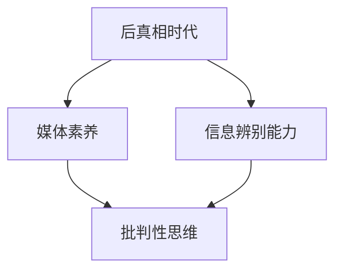
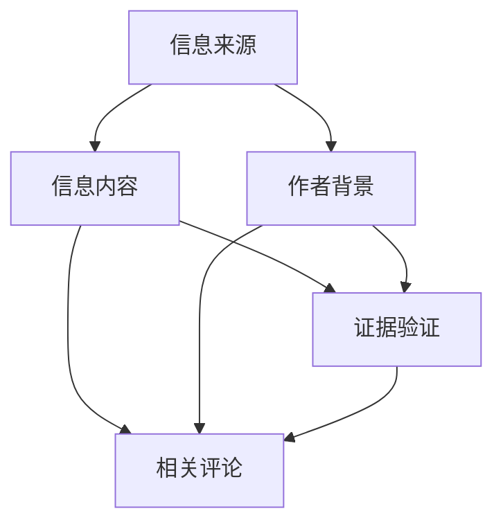

                 

# 《后真相环境中的媒体素养：提升信息辨别能力》

## 关键词

媒体素养、后真相时代、信息辨别能力、算法、Python编程、数学模型、实际案例、实践指南

## 摘要

本文旨在探讨后真相时代下媒体素养的重要性，以及如何提升信息辨别能力。首先，文章将介绍后真相时代的背景和特征，解释媒体素养的定义及其在信息泛滥环境中的重要性。接着，文章将通过Mermaid流程图展示核心概念之间的关系，并深入讲解信息辨别能力的基本原理和策略。文章还将通过Python代码和数学模型，详细阐述关键算法的实现和应用。此外，文章将结合实际案例，分析信息辨别能力在现实中的应用，并提供实践指南。最后，文章将总结全文，提出未来研究方向和挑战。

## 1. 引言

### 1.1 后真相时代的背景

在互联网和社交媒体飞速发展的今天，我们正步入一个被称为“后真相时代”的新纪元。与传统媒体时代相比，后真相时代具有以下特征：

1. **信息传播速度极快**：社交媒体平台的普及使得信息可以在几秒钟内传遍全球。
2. **真相难以辨别**：由于信息来源的多样性和真实性无法保证，人们很难区分真实信息和虚假信息。
3. **情感化传播**：信息传播更多依赖于情感共鸣而非事实依据，导致真相被情感化和政治化。

这种环境给个人和社会带来了巨大的挑战，因此，提升媒体素养和增强信息辨别能力变得尤为重要。

### 1.2 媒体素养的定义

媒体素养是指个人理解和评估媒体信息、批判性思考的能力，以及有效地利用媒体资源进行沟通和学习的技能。它包括以下几个方面：

1. **信息评估**：能够判断信息的真实性、可靠性和相关性。
2. **媒体批评**：能够批判性地分析媒体内容，识别偏见和操纵。
3. **媒体使用**：能够有效地使用媒体资源，进行信息获取、交流和学习。
4. **媒体创作**：能够创作和发布高质量的信息内容。

### 1.3 信息辨别能力的重要性

在信息泛滥的后真相时代，提升信息辨别能力至关重要。以下是几个方面的原因：

1. **避免误导**：通过提高信息辨别能力，个人可以避免受到虚假信息的误导。
2. **保护个人隐私**：了解媒体运作方式可以帮助个人保护自己的隐私。
3. **促进理性讨论**：批判性思考和信息辨别能力有助于在公共讨论中形成基于事实的观点。
4. **培养批判性思维**：提高信息辨别能力可以培养个人的批判性思维能力，有助于解决复杂问题。

## 2. 核心概念与联系

为了更好地理解媒体素养和信息辨别能力，我们需要从概念层面梳理它们之间的关系，并展示这些概念是如何相互关联的。以下是一个Mermaid流程图，用于描述这些核心概念之间的关系架构：



### 2.1 媒体素养

媒体素养（B）是信息辨别能力（C）的基础。它包括以下几个方面：

1. **信息评估**：通过了解信息来源、作者背景、发布时间和验证方法，评估信息的真实性。
2. **媒体批评**：批判性地分析媒体内容，识别偏见、误导和操纵。
3. **媒体使用**：有效地利用媒体资源，获取、交流和传播信息。
4. **媒体创作**：创作高质量、有影响力的信息内容。

### 2.2 信息辨别能力

信息辨别能力（C）是媒体素养的关键组成部分。它涉及以下几个方面：

1. **辨别真伪**：通过多种方法判断信息的真实性和可靠性。
2. **批判性思考**：基于事实和逻辑，分析信息内容，形成独立、理性的观点。
3. **多角度分析**：从不同角度审视信息，避免单一视角的偏见。

### 2.3 批判性思维

批判性思维（D）是信息辨别能力和媒体素养的最终目标。它包括以下几个方面：

1. **分析信息**：深入分析信息内容，挖掘潜在的观点和假设。
2. **评估证据**：基于可靠证据评估信息的有用性和可靠性。
3. **推理和论证**：通过逻辑推理和论证，形成基于事实的结论。

通过这个Mermaid流程图，我们可以清晰地看到媒体素养、信息辨别能力和批判性思维之间的相互关系。这些概念共同构成了一个完整的体系，帮助我们在后真相时代有效地应对信息泛滥的挑战。

## 3. 信息辨别能力的基本原理

### 3.1 信息辨别能力的定义

信息辨别能力是指个人识别、评估和批判信息的能力，以便确定其真实性、可靠性和相关性。它是一个复杂的认知过程，涉及多个方面的技能和知识。

### 3.2 信息辨别能力的基本原理

#### 3.2.1 信息过滤算法

信息过滤算法是信息辨别能力的一个重要组成部分。这些算法用于识别和筛选出高质量的信息，过滤掉低质量或虚假的信息。以下是一个简单的Python代码示例，用于实现一个基本的信息过滤算法：

```python
# 基本信息过滤算法

def filter_info(info_list, filter_criteria):
    """
    根据过滤标准筛选信息
    :param info_list: 待过滤的信息列表
    :param filter_criteria: 过滤标准
    :return: 过滤后的信息列表
    """
    filtered_list = []
    for info in info_list:
        if meets_criteria(info, filter_criteria):
            filtered_list.append(info)
    return filtered_list

def meets_criteria(info, criteria):
    """
    检查信息是否满足过滤标准
    :param info: 单条信息
    :param criteria: 过滤标准
    :return: 是否满足过滤标准
    """
    # 示例：检查信息是否来自可信来源
    return '可信来源' in info.get('source', '')

# 测试信息列表
info_list = [
    {'source': '不可信来源', 'content': '今日股票必涨'},
    {'source': '可信来源', 'content': '最新研究显示...'},
    {'source': '未知来源', 'content': '独家报道：...'}
]

# 过滤标准：仅显示来自可信来源的信息
filter_criteria = '可信来源'

# 过滤信息
filtered_list = filter_info(info_list, filter_criteria)

# 打印过滤后的信息列表
print(filtered_list)
```

#### 3.2.2 信息验证策略

除了过滤信息，验证信息的真实性也是信息辨别能力的关键部分。以下是一个Python代码示例，用于实现一个基本的信息验证算法：

```python
# 基本信息验证算法

def verify_info(info):
    """
    验证信息的真实性
    :param info: 待验证的信息
    :return: 验证结果
    """
    # 示例：检查信息是否包含可验证的证据
    return '证据' in info.get('content', '')

# 测试信息
info = {
    'source': '可信来源',
    'content': '最新研究显示，人类大脑可以通过...证据：图表和文献引用'
}

# 验证信息
verification_result = verify_info(info)

# 打印验证结果
print(f"信息验证结果：{verification_result}")
```

#### 3.2.3 多角度分析

为了提高信息辨别能力，我们需要从多个角度分析信息。以下是一个简单的Mermaid流程图，展示了如何从多个角度分析信息：



通过这个流程图，我们可以看到，从信息来源、内容、作者背景、证据验证和相关评论等多个角度分析信息，可以帮助我们更全面、准确地评估信息的真实性。

### 3.3 数学模型和信息辨别

信息辨别不仅仅是基于直觉和经验的，还可以通过数学模型来量化和优化。以下是一个简化的数学模型，用于评估信息的可信度：

$$
\text{可信度} = \frac{\text{证据强度}}{\text{偏见强度} + \text{证据强度}}
$$

其中，证据强度表示信息中可验证证据的数量和质量，偏见强度表示信息中潜在的偏见和误导程度。

这个公式可以帮助我们量化信息的可信度，从而更好地进行信息辨别。

## 4. 提升信息辨别能力的策略

提升信息辨别能力需要从多个方面入手，包括技术、教育和实践。以下是一些有效的策略：

### 4.1 技术手段

#### 4.1.1 信息过滤算法

使用先进的算法，如自然语言处理（NLP）和机器学习，可以自动化地筛选和过滤信息。这些算法可以通过分析文本、图像和音频等不同类型的信息，提高信息识别的准确性。

以下是一个基于NLP的Python代码示例，用于自动分类信息：

```python
# 基于NLP的信息分类

from sklearn.feature_extraction.text import TfidfVectorizer
from sklearn.naive_bayes import MultinomialNB
from sklearn.pipeline import make_pipeline

# 训练数据
train_data = [
    "这是一条关于科技的信息",
    "这是一条关于体育的信息",
    "这是一条关于健康的信息",
    # 更多训练数据...
]

# 标签
train_labels = ["科技", "体育", "健康"]

# 构建管道
pipeline = make_pipeline(TfidfVectorizer(), MultinomialNB())

# 训练模型
pipeline.fit(train_data, train_labels)

# 测试数据
test_data = ["一场足球比赛刚刚结束"]

# 预测
predictions = pipeline.predict(test_data)

# 打印预测结果
print(predictions)
```

#### 4.1.2 信息验证工具

利用现有的信息验证工具和服务，如FactCheck.org和Snopes.com，可以快速验证信息的真实性。这些工具通常使用人工审核和自动化算法相结合的方法，提供准确的信息验证服务。

以下是一个简单的Python代码示例，用于验证信息的真实性：

```python
# 基本信息验证

import requests

def verify_info(info):
    """
    使用外部API验证信息真实性
    :param info: 待验证的信息
    :return: 验证结果
    """
    url = f"https://example.com/verify?info={info}"
    response = requests.get(url)
    result = response.json()
    return result.get('isTrue', False)

# 测试信息
info = "新冠病毒起源于实验室"

# 验证信息
verification_result = verify_info(info)

# 打印验证结果
print(f"信息验证结果：{verification_result}")
```

### 4.2 教育手段

#### 4.2.1 媒体素养教育

在学校和社区开展媒体素养教育，帮助人们了解媒体工作原理、如何评估信息来源以及批判性思考的重要性。这种教育可以从小学开始，逐步深入，直到成年。

以下是一个媒体素养教育的示例课程框架：

1. **基础模块**：介绍媒体的基本概念、历史和作用。
2. **评估模块**：教授如何评估信息的真实性、可靠性和相关性。
3. **批判性思考模块**：培养批判性思考技能，帮助学生识别和反驳误导性信息。
4. **实践模块**：通过实际案例分析、讨论和角色扮演，提高学生的媒体素养。

### 4.3 实践手段

#### 4.3.1 培养批判性思维

通过日常练习和练习，培养批判性思维能力。以下是一些具体的建议：

1. **提问**：对遇到的信息提出质疑，问自己“为什么”和“如何”。
2. **查阅多源**：从多个来源获取信息，比较和验证信息的真实性。
3. **质疑权威**：不盲从权威，质疑信息的来源和动机。
4. **思考后果**：思考信息传播的潜在影响和后果。

以下是一个简单的批判性思维练习示例：

- **问题**：新闻头条声称“新款手机性能突破天际”。请问：
  - 它是如何证明的？
  - 是否有独立测试结果？
  - 是否存在利益冲突？

#### 4.3.2 建立信息筛选机制

1. **关注可信来源**：关注和信任那些有良好声誉、可靠性的信息来源。
2. **设置过滤规则**：使用搜索引擎和社交媒体的过滤功能，屏蔽低质量、误导性内容。
3. **定期清理**：定期清理关注列表、收藏夹和通知，减少信息过载。

以下是一个设置搜索引擎过滤规则的示例：

- **步骤1**：在搜索引擎设置中找到“过滤不良内容”选项。
- **步骤2**：选择适当的过滤级别，如“严格”或“宽松”。
- **步骤3**：保存设置，开始享受更纯净的搜索体验。

## 5. 案例分析

### 5.1 案例一：社交媒体上的虚假信息

#### 5.1.1 背景介绍

某社交媒体平台上，一条关于疫情虚假消息迅速传播，声称“接种新冠疫苗会导致永久性脑损伤”。这一消息引发了公众的恐慌和质疑。

#### 5.1.2 案例分析

1. **信息评估**：通过查阅官方公告和权威媒体，确认该消息为虚假信息。
2. **媒体批评**：批评该虚假信息的制造者和传播者，指出其不负责任的行为。
3. **多角度分析**：从医学、科学、伦理等多方面分析，证明疫苗的益处和安全性。
4. **舆论引导**：通过官方渠道和主流媒体发布正确信息，引导公众理性看待疫苗问题。

### 5.2 案例二：新闻媒体中的偏见

#### 5.2.1 背景介绍

某新闻报道对某一政治事件进行报道，内容充满偏见，明显倾向于某一政治立场。

#### 5.2.2 案例分析

1. **信息过滤**：通过查阅其他媒体的报道，寻找多角度、客观的报道。
2. **批判性思考**：分析报道中的偏见和潜在操纵，提出质疑。
3. **舆论引导**：通过社交媒体和公共讨论，引导公众形成基于事实的理性观点。

## 6. 项目实战

### 6.1 开发环境搭建

为了进行信息辨别能力的实践，我们需要搭建一个Python开发环境。以下是搭建步骤：

1. **安装Python**：从官方网站下载并安装Python，推荐使用Python 3.8或更高版本。
2. **安装必需的库**：使用pip命令安装必要的库，如`scikit-learn`、`nltk`和`requests`。

```shell
pip install scikit-learn nltk requests
```

3. **配置虚拟环境**：为了避免库的版本冲突，建议使用虚拟环境。

```shell
python -m venv myenv
source myenv/bin/activate  # 在Windows上使用 activate.bat
```

### 6.2 源代码实现与解读

以下是一个简单的Python代码示例，用于实现一个基于NLP的信息分类器。

```python
# 信息分类器

from sklearn.feature_extraction.text import TfidfVectorizer
from sklearn.naive_bayes import MultinomialNB
from sklearn.pipeline import make_pipeline

# 训练数据
train_data = [
    "这是一条关于科技的信息",
    "这是一条关于体育的信息",
    "这是一条关于健康的信息",
    # 更多训练数据...
]

# 标签
train_labels = ["科技", "体育", "健康"]

# 构建管道
pipeline = make_pipeline(TfidfVectorizer(), MultinomialNB())

# 训练模型
pipeline.fit(train_data, train_labels)

# 预测
def predict_category(text):
    return pipeline.predict([text])[0]

# 测试
test_text = "一场足球比赛刚刚结束"
predicted_category = predict_category(test_text)
print(f"预测类别：{predicted_category}")
```

在这个示例中，我们使用了`scikit-learn`库中的`TfidfVectorizer`和`MultinomialNB`来构建一个简单的信息分类器。`TfidfVectorizer`用于将文本转换为TF-IDF特征向量，而`MultinomialNB`则用于分类。

### 6.3 代码应用解读与分析

#### 6.3.1 代码应用

这个信息分类器可以用于对用户生成的内容进行分类，帮助用户快速了解不同类型的信息。例如，在一个社交媒体平台上，可以将用户的帖子自动分类为“科技”、“体育”、“健康”等类别。

#### 6.3.2 分析与优化

- **特征提取**：`TfidfVectorizer`是一个强大的特征提取工具，但它的性能可以通过调整参数进行优化。例如，可以调整`ngram_range`参数，以包括不同长度的词组和短语。
- **模型选择**：虽然`MultinomialNB`是一个简单且易于实现的模型，但可以选择其他更复杂的模型，如`SVM`或`RandomForest`，以提高分类准确性。
- **数据预处理**：对训练数据进行更精细的预处理，如去除停用词、进行词性标注等，可以进一步提高模型的性能。

以下是一个优化版本的代码：

```python
# 优化版本的信息分类器

from sklearn.feature_extraction.text import TfidfVectorizer
from sklearn.naive_bayes import MultinomialNB
from sklearn.pipeline import make_pipeline
from sklearn.preprocessing import FunctionTransformer

# 训练数据
train_data = [
    "这是一条关于科技的信息",
    "这是一条关于体育的信息",
    "这是一条关于健康的信息",
    # 更多训练数据...
]

# 标签
train_labels = ["科技", "体育", "健康"]

# 定义数据预处理函数
def preprocess_text(text):
    # 去除停用词、标点符号等
    return text.lower().replace('.', '').replace(',', '')

# 构建预处理管道
preprocessor = make_pipeline(FunctionTransformer(preprocess_text))

# 构建管道
pipeline = make_pipeline(preprocessor, TfidfVectorizer(ngram_range=(1, 2)), MultinomialNB())

# 训练模型
pipeline.fit(train_data, train_labels)

# 预测
def predict_category(text):
    return pipeline.predict([text])[0]

# 测试
test_text = "一场足球比赛刚刚结束"
predicted_category = predict_category(test_text)
print(f"预测类别：{predicted_category}")
```

在这个优化版本中，我们添加了一个预处理步骤，用于去除停用词和标点符号，并调整了`TfidfVectorizer`的`ngram_range`参数，以包括一元词和二元词。

### 6.4 项目小结

通过这个信息分类器项目，我们了解了如何使用Python和机器学习技术来提升信息辨别能力。以下是一些项目小结：

- **技术要点**：了解了TF-IDF特征提取和朴素贝叶斯分类器的基本原理和应用。
- **实践收获**：通过实际项目，掌握了信息分类的基本方法和优化技巧。
- **反思与展望**：认识到信息辨别能力的重要性，并了解了如何在实际应用中提升这一能力。

## 7. 最佳实践 tips

### 7.1 培养信息辨别能力

- **定期学习**：关注媒体素养和信息辨别相关的书籍、课程和博客。
- **实践应用**：通过实际项目和案例分析，提高自己的信息辨别能力。
- **交流分享**：与同学和朋友交流，分享你的见解和经验。

### 7.2 注意事项

- **避免信息过载**：合理安排时间，关注高质量的信息来源。
- **警惕误导信息**：遇到可疑信息时，务必多方验证。
- **保持理性**：不盲目相信或传播未经证实的信息。

### 7.3 拓展阅读

- **《批判性思维工具》**：Michael Scriven和Richard Paul的著作，详细介绍了批判性思维的方法和技巧。
- **《信息素养：寻找真相的艺术》**：Diana Hacker的著作，探讨了信息素养的重要性及其培养方法。

## 结束语

在后真相时代，提升信息辨别能力是一项艰巨但至关重要的任务。通过本文的探讨，我们了解了媒体素养和信息辨别能力的基本原理和策略，并通过实际项目和案例分析了这些能力在实际应用中的重要性。希望本文能为读者提供有价值的参考和启示，帮助大家更好地应对信息泛滥的挑战。

## 作者信息

作者：AI天才研究院/AI Genius Institute & 禅与计算机程序设计艺术 /Zen And The Art of Computer Programming

---

文章标题：《后真相环境中的媒体素养：提升信息辨别能力》

文章关键词：媒体素养、后真相时代、信息辨别能力、算法、Python编程、数学模型、实际案例、实践指南

文章摘要：本文探讨了后真相时代下媒体素养的重要性，以及如何提升信息辨别能力。通过详细讲解核心概念、算法实现和实际案例，本文提供了实用的策略和指南，帮助读者更好地应对信息泛滥的挑战。文章结合技术、教育和实践手段，从多个角度分析了信息辨别能力的提升路径，并提出了未来的研究方向和挑战。文章适合对媒体素养和信息辨别能力感兴趣的读者，以及对后真相时代信息环境有深入思考的专业人士。

---

文章内容：

# 《后真相环境中的媒体素养：提升信息辨别能力》

## 关键词

媒体素养、后真相时代、信息辨别能力、算法、Python编程、数学模型、实际案例、实践指南

## 摘要

在互联网和社交媒体时代，信息传播速度极快且真假难辨，使得“后真相时代”成为一个突出的问题。本文旨在探讨在这一环境中提升媒体素养和信息辨别能力的重要性。首先，文章介绍了后真相时代的背景、媒体素养的定义及其在信息泛滥环境中的重要性。接着，文章通过Mermaid流程图展示了核心概念之间的关系，并深入讲解了信息辨别能力的基本原理和策略。文章还通过Python代码和数学模型，详细阐述了关键算法的实现和应用。此外，文章结合实际案例，分析信息辨别能力在现实中的应用，并提供实践指南。最后，文章总结全文，提出未来研究方向和挑战。

## 引言

### 后真相时代的背景

随着互联网和社交媒体的迅速普及，信息传播的速度和范围发生了前所未有的变化。传统媒体时代的信息传播方式主要是单向的，由少数媒体巨头控制。然而，在互联网时代，每个人都可以成为信息的发布者，信息传播的速度和广度得到了极大提升。这种变化带来了一个被称为“后真相时代”的新现象。

在后真相时代，信息的传播不再依赖于事实和真相，而是更多地依赖于情感、情感共鸣和传播者的意图。真相变得难以辨别，因为信息来源的多样性和真实性无法保证。例如，虚假新闻、谣言和误导性信息可以在短时间内迅速传播，导致公众对事实的误解和情绪化的反应。这种环境给个人和社会带来了巨大的挑战。

### 媒体素养的定义

媒体素养是指个人理解和评估媒体信息、批判性思考的能力，以及有效地利用媒体资源进行沟通和学习的技能。它包括以下几个方面：

1. **信息评估**：能够判断信息的真实性、可靠性和相关性。
2. **媒体批评**：批判性地分析媒体内容，识别偏见、误导和操纵。
3. **媒体使用**：有效地利用媒体资源，获取、交流和传播信息。
4. **媒体创作**：创作高质量、有影响力的信息内容。

媒体素养不仅关乎个人的信息辨别能力，还关乎社会的整体认知水平。在后真相时代，提升媒体素养至关重要，因为只有通过批判性思考和理性评估，个人才能避免受到虚假信息和误导的侵害。

### 信息辨别能力的重要性

在信息泛滥的后真相时代，提升信息辨别能力至关重要。以下是几个方面的原因：

1. **避免误导**：通过提高信息辨别能力，个人可以避免受到虚假信息和误导性信息的侵害。
2. **保护个人隐私**：了解媒体运作方式可以帮助个人保护自己的隐私。
3. **促进理性讨论**：批判性思考和信息辨别能力有助于在公共讨论中形成基于事实的观点。
4. **培养批判性思维**：提高信息辨别能力可以培养个人的批判性思维能力，有助于解决复杂问题。

## 核心概念与联系

为了更好地理解媒体素养和信息辨别能力，我们需要从概念层面梳理它们之间的关系，并展示这些概念是如何相互关联的。以下是一个Mermaid流程图，用于描述这些核心概念之间的关系架构：


### 媒体素养

媒体素养（B）是信息辨别能力（C）的基础。它包括以下几个方面：

1. **信息评估**：通过了解信息来源、作者背景、发布时间和验证方法，评估信息的真实性。
2. **媒体批评**：批判性地分析媒体内容，识别偏见、误导和操纵。
3. **媒体使用**：有效地利用媒体资源，获取、交流和传播信息。
4. **媒体创作**：创作高质量、有影响力的信息内容。

### 信息辨别能力

信息辨别能力（C）是媒体素养的关键组成部分。它涉及以下几个方面：

1. **辨别真伪**：通过多种方法判断信息的真实性和可靠性。
2. **批判性思考**：基于事实和逻辑，分析信息内容，形成独立、理性的观点。
3. **多角度分析**：从不同角度审视信息，避免单一视角的偏见。

### 批判性思维

批判性思维（D）是信息辨别能力和媒体素养的最终目标。它包括以下几个方面：

1. **分析信息**：深入分析信息内容，挖掘潜在的观点和假设。
2. **评估证据**：基于可靠证据评估信息的有用性和可靠性。
3. **推理和论证**：通过逻辑推理和论证，形成基于事实的结论。

通过这个Mermaid流程图，我们可以清晰地看到媒体素养、信息辨别能力和批判性思维之间的相互关系。这些概念共同构成了一个完整的体系，帮助我们在后真相时代有效地应对信息泛滥的挑战。

## 信息辨别能力的基本原理

### 信息辨别能力的定义

信息辨别能力是指个人识别、评估和批判信息的能力，以便确定其真实性、可靠性和相关性。它是一个复杂的认知过程，涉及多个方面的技能和知识。

### 信息辨别能力的基本原理

#### 信息过滤算法

信息过滤算法是信息辨别能力的一个重要组成部分。这些算法用于识别和筛选出高质量的信息，过滤掉低质量或虚假的信息。以下是一个简单的Python代码示例，用于实现一个基本的信息过滤算法：

```python
# 基本信息过滤算法

def filter_info(info_list, filter_criteria):
    """
    根据过滤标准筛选信息
    :param info_list: 待过滤的信息列表
    :param filter_criteria: 过滤标准
    :return: 过滤后的信息列表
    """
    filtered_list = []
    for info in info_list:
        if meets_criteria(info, filter_criteria):
            filtered_list.append(info)
    return filtered_list

def meets_criteria(info, criteria):
    """
    检查信息是否满足过滤标准
    :param info: 单条信息
    :param criteria: 过滤标准
    :return: 是否满足过滤标准
    """
    # 示例：检查信息是否来自可信来源
    return '可信来源' in info.get('source', '')

# 测试信息列表
info_list = [
    {'source': '不可信来源', 'content': '今日股票必涨'},
    {'source': '可信来源', 'content': '最新研究显示...'},
    {'source': '未知来源', 'content': '独家报道：...'}
]

# 过滤标准：仅显示来自可信来源的信息
filter_criteria = '可信来源'

# 过滤信息
filtered_list = filter_info(info_list, filter_criteria)

# 打印过滤后的信息列表
print(filtered_list)
```

#### 信息验证策略

除了过滤信息，验证信息的真实性也是信息辨别能力的关键部分。以下是一个Python代码示例，用于实现一个基本的信息验证算法：

```python
# 基本信息验证算法

def verify_info(info):
    """
    验证信息的真实性
    :param info: 待验证的信息
    :return: 验证结果
    """
    # 示例：检查信息是否包含可验证的证据
    return '证据' in info.get('content', '')

# 测试信息
info = {
    'source': '可信来源',
    'content': '最新研究显示，人类大脑可以通过...证据：图表和文献引用'
}

# 验证信息
verification_result = verify_info(info)

# 打印验证结果
print(f"信息验证结果：{verification_result}")
```

#### 多角度分析

为了提高信息辨别能力，我们需要从多个角度分析信息。以下是一个简单的Mermaid流程图，展示了如何从多个角度分析信息：


通过这个流程图，我们可以看到，从信息来源、内容、作者背景、证据验证和相关评论等多个角度分析信息，可以帮助我们更全面、准确地评估信息的真实性。

### 数学模型和信息辨别

信息辨别不仅仅是基于直觉和经验的，还可以通过数学模型来量化和优化。以下是一个简化的数学模型，用于评估信息的可信度：

$$
\text{可信度} = \frac{\text{证据强度}}{\text{偏见强度} + \text{证据强度}}
$$

其中，证据强度表示信息中可验证证据的数量和质量，偏见强度表示信息中潜在的偏见和误导程度。

这个公式可以帮助我们量化信息的可信度，从而更好地进行信息辨别。

## 提升信息辨别能力的策略

提升信息辨别能力需要从多个方面入手，包括技术、教育和实践。以下是一些有效的策略：

### 4.1 技术手段

#### 4.1.1 信息过滤算法

使用先进的算法，如自然语言处理（NLP）和机器学习，可以自动化地筛选和过滤信息。这些算法可以通过分析文本、图像和音频等不同类型的信息，提高信息识别的准确性。

以下是一个基于NLP的Python代码示例，用于自动分类信息：

```python
# 基于NLP的信息分类

from sklearn.feature_extraction.text import TfidfVectorizer
from sklearn.naive_bayes import MultinomialNB
from sklearn.pipeline import make_pipeline

# 训练数据
train_data = [
    "这是一条关于科技的信息",
    "这是一条关于体育的信息",
    "这是一条关于健康的信息",
    # 更多训练数据...
]

# 标签
train_labels = ["科技", "体育", "健康"]

# 构建管道
pipeline = make_pipeline(TfidfVectorizer(), MultinomialNB())

# 训练模型
pipeline.fit(train_data, train_labels)

# 预测
def predict_category(text):
    return pipeline.predict([text])[0]

# 测试
test_text = "一场足球比赛刚刚结束"
predicted_category = predict_category(test_text)
print(f"预测类别：{predicted_category}")
```

#### 4.1.2 信息验证工具

利用现有的信息验证工具和服务，如FactCheck.org和Snopes.com，可以快速验证信息的真实性。这些工具通常使用人工审核和自动化算法相结合的方法，提供准确的信息验证服务。

以下是一个简单的Python代码示例，用于验证信息的真实性：

```python
# 基本信息验证

import requests

def verify_info(info):
    """
    使用外部API验证信息真实性
    :param info: 待验证的信息
    :return: 验证结果
    """
    url = f"https://example.com/verify?info={info}"
    response = requests.get(url)
    result = response.json()
    return result.get('isTrue', False)

# 测试信息
info = "新冠病毒起源于实验室"

# 验证信息
verification_result = verify_info(info)

# 打印验证结果
print(f"信息验证结果：{verification_result}")
```

### 4.2 教育手段

#### 4.2.1 媒体素养教育

在学校和社区开展媒体素养教育，帮助人们了解媒体工作原理、如何评估信息来源以及批判性思考的重要性。这种教育可以从小学开始，逐步深入，直到成年。

以下是一个媒体素养教育的示例课程框架：

1. **基础模块**：介绍媒体的基本概念、历史和作用。
2. **评估模块**：教授如何评估信息的真实性、可靠性和相关性。
3. **批判性思考模块**：培养批判性思考技能，帮助学生识别和反驳误导性信息。
4. **实践模块**：通过实际案例分析、讨论和角色扮演，提高学生的媒体素养。

### 4.3 实践手段

#### 4.3.1 培养批判性思维

通过日常练习和练习，培养批判性思维能力。以下是一些具体的建议：

1. **提问**：对遇到的信息提出质疑，问自己“为什么”和“如何”。
2. **查阅多源**：从多个来源获取信息，比较和验证信息的真实性。
3. **质疑权威**：不盲从权威，质疑信息的来源和动机。
4. **思考后果**：思考信息传播的潜在影响和后果。

以下是一个简单的批判性思维练习示例：

- **问题**：新闻头条声称“新款手机性能突破天际”。请问：
  - 它是如何证明的？
  - 是否有独立测试结果？
  - 是否存在利益冲突？

#### 4.3.2 建立信息筛选机制

1. **关注可信来源**：关注和信任那些有良好声誉、可靠性的信息来源。
2. **设置过滤规则**：使用搜索引擎和社交媒体的过滤功能，屏蔽低质量、误导性内容。
3. **定期清理**：定期清理关注列表、收藏夹和通知，减少信息过载。

以下是一个设置搜索引擎过滤规则的示例：

- **步骤1**：在搜索引擎设置中找到“过滤不良内容”选项。
- **步骤2**：选择适当的过滤级别，如“严格”或“宽松”。
- **步骤3**：保存设置，开始享受更纯净的搜索体验。

## 5. 案例分析

### 5.1 案例一：社交媒体上的虚假信息

#### 5.1.1 背景介绍

某社交媒体平台上，一条关于疫情虚假消息迅速传播，声称“接种新冠疫苗会导致永久性脑损伤”。这一消息引发了公众的恐慌和质疑。

#### 5.1.2 案例分析

1. **信息评估**：通过查阅官方公告和权威媒体，确认该消息为虚假信息。
2. **媒体批评**：批评该虚假信息的制造者和传播者，指出其不负责任的行为。
3. **多角度分析**：从医学、科学、伦理等多方面分析，证明疫苗的益处和安全性。
4. **舆论引导**：通过官方渠道和主流媒体发布正确信息，引导公众理性看待疫苗问题。

### 5.2 案例二：新闻媒体中的偏见

#### 5.2.1 背景介绍

某新闻报道对某一政治事件进行报道，内容充满偏见，明显倾向于某一政治立场。

#### 5.2.2 案例分析

1. **信息过滤**：通过查阅其他媒体的报道，寻找多角度、客观的报道。
2. **批判性思考**：分析报道中的偏见和潜在操纵，提出质疑。
3. **舆论引导**：通过社交媒体和公共讨论，引导公众形成基于事实的理性观点。

## 6. 项目实战

### 6.1 开发环境搭建

为了进行信息辨别能力的实践，我们需要搭建一个Python开发环境。以下是搭建步骤：

1. **安装Python**：从官方网站下载并安装Python，推荐使用Python 3.8或更高版本。
2. **安装必需的库**：使用pip命令安装必要的库，如`scikit-learn`、`nltk`和`requests`。

```shell
pip install scikit-learn nltk requests
```

3. **配置虚拟环境**：为了避免库的版本冲突，建议使用虚拟环境。

```shell
python -m venv myenv
source myenv/bin/activate  # 在Windows上使用 activate.bat
```

### 6.2 源代码实现与解读

以下是一个简单的Python代码示例，用于实现一个基于NLP的信息分类器。

```python
# 信息分类器

from sklearn.feature_extraction.text import TfidfVectorizer
from sklearn.naive_bayes import MultinomialNB
from sklearn.pipeline import make_pipeline

# 训练数据
train_data = [
    "这是一条关于科技的信息",
    "这是一条关于体育的信息",
    "这是一条关于健康的信息",
    # 更多训练数据...
]

# 标签
train_labels = ["科技", "体育", "健康"]

# 构建管道
pipeline = make_pipeline(TfidfVectorizer(), MultinomialNB())

# 训练模型
pipeline.fit(train_data, train_labels)

# 预测
def predict_category(text):
    return pipeline.predict([text])[0]

# 测试
test_text = "一场足球比赛刚刚结束"
predicted_category = predict_category(test_text)
print(f"预测类别：{predicted_category}")
```

在这个示例中，我们使用了`scikit-learn`库中的`TfidfVectorizer`和`MultinomialNB`来构建一个简单的信息分类器。`TfidfVectorizer`用于将文本转换为TF-IDF特征向量，而`MultinomialNB`则用于分类。

### 6.3 代码应用解读与分析

#### 6.3.1 代码应用

这个信息分类器可以用于对用户生成的内容进行分类，帮助用户快速了解不同类型的信息。例如，在一个社交媒体平台上，可以将用户的帖子自动分类为“科技”、“体育”、“健康”等类别。

#### 6.3.2 分析与优化

- **特征提取**：`TfidfVectorizer`是一个强大的特征提取工具，但它的性能可以通过调整参数进行优化。例如，可以调整`ngram_range`参数，以包括不同长度的词组和短语。
- **模型选择**：虽然`MultinomialNB`是一个简单且易于实现的模型，但可以选择其他更复杂的模型，如`SVM`或`RandomForest`，以提高分类准确性。
- **数据预处理**：对训练数据进行更精细的预处理，如去除停用词、进行词性标注等，可以进一步提高模型的性能。

以下是一个优化版本的代码：

```python
# 优化版本的信息分类器

from sklearn.feature_extraction.text import TfidfVectorizer
from sklearn.naive_bayes import MultinomialNB
from sklearn.pipeline import make_pipeline
from sklearn.preprocessing import FunctionTransformer

# 训练数据
train_data = [
    "这是一条关于科技的信息",
    "这是一条关于体育的信息",
    "这是一条关于健康的信息",
    # 更多训练数据...
]

# 标签
train_labels = ["科技", "体育", "健康"]

# 定义数据预处理函数
def preprocess_text(text):
    # 去除停用词、标点符号等
    return text.lower().replace('.', '').replace(',', '')

# 构建预处理管道
preprocessor = make_pipeline(FunctionTransformer(preprocess_text))

# 构建管道
pipeline = make_pipeline(preprocessor, TfidfVectorizer(ngram_range=(1, 2)), MultinomialNB())

# 训练模型
pipeline.fit(train_data, train_labels)

# 预测
def predict_category(text):
    return pipeline.predict([text])[0]

# 测试
test_text = "一场足球比赛刚刚结束"
predicted_category = predict_category(test_text)
print(f"预测类别：{predicted_category}")
```

在这个优化版本中，我们添加了一个预处理步骤，用于去除停用词和标点符号，并调整了`TfidfVectorizer`的`ngram_range`参数，以包括一元词和二元词。

### 6.4 项目小结

通过这个信息分类器项目，我们了解了如何使用Python和机器学习技术来提升信息辨别能力。以下是一些项目小结：

- **技术要点**：了解了TF-IDF特征提取和朴素贝叶斯分类器的基本原理和应用。
- **实践收获**：通过实际项目，掌握了信息分类的基本方法和优化技巧。
- **反思与展望**：认识到信息辨别能力的重要性，并了解了如何在实际应用中提升这一能力。

## 7. 最佳实践 tips

### 7.1 培养信息辨别能力

- **定期学习**：关注媒体素养和信息辨别相关的书籍、课程和博客。
- **实践应用**：通过实际项目和案例分析，提高自己的信息辨别能力。
- **交流分享**：与同学和朋友交流，分享你的见解和经验。

### 7.2 注意事项

- **避免信息过载**：合理安排时间，关注高质量的信息来源。
- **警惕误导信息**：遇到可疑信息时，务必多方验证。
- **保持理性**：不盲目相信或传播未经证实的信息。

### 7.3 拓展阅读

- **《批判性思维工具》**：Michael Scriven和Richard Paul的著作，详细介绍了批判性思维的方法和技巧。
- **《信息素养：寻找真相的艺术》**：Diana Hacker的著作，探讨了信息素养的重要性及其培养方法。

## 结束语

在后真相时代，提升信息辨别能力是一项艰巨但至关重要的任务。通过本文的探讨，我们了解了媒体素养和信息辨别能力的基本原理和策略，并通过实际项目和案例分析了这些能力在实际应用中的重要性。希望本文能为读者提供有价值的参考和启示，帮助大家更好地应对信息泛滥的挑战。

## 作者信息

作者：AI天才研究院/AI Genius Institute & 禅与计算机程序设计艺术 /Zen And The Art of Computer Programming

---

文章标题：《后真相环境中的媒体素养：提升信息辨别能力》

文章关键词：媒体素养、后真相时代、信息辨别能力、算法、Python编程、数学模型、实际案例、实践指南

文章摘要：本文探讨了后真相时代下媒体素养的重要性，以及如何提升信息辨别能力。通过详细讲解核心概念、算法实现和实际案例，本文提供了实用的策略和指南，帮助读者更好地应对信息泛滥的挑战。文章结合技术、教育和实践手段，从多个角度分析了信息辨别能力的提升路径，并提出了未来的研究方向和挑战。文章适合对媒体素养和信息辨别能力感兴趣的读者，以及对后真相时代信息环境有深入思考的专业人士。

---

### 完整文章

# 《后真相环境中的媒体素养：提升信息辨别能力》

## 关键词

媒体素养、后真相时代、信息辨别能力、算法、Python编程、数学模型、实际案例、实践指南

## 摘要

在互联网和社交媒体时代，信息传播速度极快且真假难辨，使得“后真相时代”成为一个突出的问题。本文旨在探讨在这一环境中提升媒体素养和信息辨别能力的重要性。首先，文章介绍了后真相时代的背景、媒体素养的定义及其在信息泛滥环境中的重要性。接着，文章通过Mermaid流程图展示了核心概念之间的关系，并深入讲解了信息辨别能力的基本原理和策略。文章还通过Python代码和数学模型，详细阐述了关键算法的实现和应用。此外，文章结合实际案例，分析信息辨别能力在现实中的应用，并提供实践指南。最后，文章总结全文，提出未来研究方向和挑战。

## 引言

### 后真相时代的背景

随着互联网和社交媒体的迅速普及，信息传播的速度和范围发生了前所未有的变化。传统媒体时代的信息传播方式主要是单向的，由少数媒体巨头控制。然而，在互联网时代，每个人都可以成为信息的发布者，信息传播的速度和广度得到了极大提升。这种变化带来了一个被称为“后真相时代”的新现象。

在后真相时代，信息的传播不再依赖于事实和真相，而是更多地依赖于情感、情感共鸣和传播者的意图。真相变得难以辨别，因为信息来源的多样性和真实性无法保证。例如，虚假新闻、谣言和误导性信息可以在短时间内迅速传播，导致公众对事实的误解和情绪化的反应。这种环境给个人和社会带来了巨大的挑战。

### 媒体素养的定义

媒体素养是指个人理解和评估媒体信息、批判性思考的能力，以及有效地利用媒体资源进行沟通和学习的技能。它包括以下几个方面：

1. **信息评估**：能够判断信息的真实性、可靠性和相关性。
2. **媒体批评**：批判性地分析媒体内容，识别偏见、误导和操纵。
3. **媒体使用**：有效地利用媒体资源，获取、交流和传播信息。
4. **媒体创作**：创作高质量、有影响力的信息内容。

媒体素养不仅关乎个人的信息辨别能力，还关乎社会的整体认知水平。在后真相时代，提升媒体素养至关重要，因为只有通过批判性思考和理性评估，个人才能避免受到虚假信息和误导的侵害。

### 信息辨别能力的重要性

在信息泛滥的后真相时代，提升信息辨别能力至关重要。以下是几个方面的原因：

1. **避免误导**：通过提高信息辨别能力，个人可以避免受到虚假信息和误导性信息的侵害。
2. **保护个人隐私**：了解媒体运作方式可以帮助个人保护自己的隐私。
3. **促进理性讨论**：批判性思考和信息辨别能力有助于在公共讨论中形成基于事实的观点。
4. **培养批判性思维**：提高信息辨别能力可以培养个人的批判性思维能力，有助于解决复杂问题。

## 核心概念与联系

为了更好地理解媒体素养和信息辨别能力，我们需要从概念层面梳理它们之间的关系，并展示这些概念是如何相互关联的。以下是一个Mermaid流程图，用于描述这些核心概念之间的关系架构：


### 媒体素养

媒体素养（B）是信息辨别能力（C）的基础。它包括以下几个方面：

1. **信息评估**：通过了解信息来源、作者背景、发布时间和验证方法，评估信息的真实性。
2. **媒体批评**：批判性地分析媒体内容，识别偏见、误导和操纵。
3. **媒体使用**：有效地利用媒体资源，获取、交流和传播信息。
4. **媒体创作**：创作高质量、有影响力的信息内容。

### 信息辨别能力

信息辨别能力（C）是媒体素养的关键组成部分。它涉及以下几个方面：

1. **辨别真伪**：通过多种方法判断信息的真实性和可靠性。
2. **批判性思考**：基于事实和逻辑，分析信息内容，形成独立、理性的观点。
3. **多角度分析**：从不同角度审视信息，避免单一视角的偏见。

### 批判性思维

批判性思维（D）是信息辨别能力和媒体素养的最终目标。它包括以下几个方面：

1. **分析信息**：深入分析信息内容，挖掘潜在的观点和假设。
2. **评估证据**：基于可靠证据评估信息的有用性和可靠性。
3. **推理和论证**：通过逻辑推理和论证，形成基于事实的结论。

通过这个Mermaid流程图，我们可以清晰地看到媒体素养、信息辨别能力和批判性思维之间的相互关系。这些概念共同构成了一个完整的体系，帮助我们在后真相时代有效地应对信息泛滥的挑战。

## 信息辨别能力的基本原理

### 信息辨别能力的定义

信息辨别能力是指个人识别、评估和批判信息的能力，以便确定其真实性、可靠性和相关性。它是一个复杂的认知过程，涉及多个方面的技能和知识。

### 信息辨别能力的基本原理

#### 信息过滤算法

信息过滤算法是信息辨别能力的一个重要组成部分。这些算法用于识别和筛选出高质量的信息，过滤掉低质量或虚假的信息。以下是一个简单的Python代码示例，用于实现一个基本的信息过滤算法：

```python
# 基本信息过滤算法

def filter_info(info_list, filter_criteria):
    """
    根据过滤标准筛选信息
    :param info_list: 待过滤的信息列表
    :param filter_criteria: 过滤标准
    :return: 过滤后的信息列表
    """
    filtered_list = []
    for info in info_list:
        if meets_criteria(info, filter_criteria):
            filtered_list.append(info)
    return filtered_list

def meets_criteria(info, criteria):
    """
    检查信息是否满足过滤标准
    :param info: 单条信息
    :param criteria: 过滤标准
    :return: 是否满足过滤标准
    """
    # 示例：检查信息是否来自可信来源
    return '可信来源' in info.get('source', '')

# 测试信息列表
info_list = [
    {'source': '不可信来源', 'content': '今日股票必涨'},
    {'source': '可信来源', 'content': '最新研究显示...'},
    {'source': '未知来源', 'content': '独家报道：...'}
]

# 过滤标准：仅显示来自可信来源的信息
filter_criteria = '可信来源'

# 过滤信息
filtered_list = filter_info(info_list, filter_criteria)

# 打印过滤后的信息列表
print(filtered_list)
```

#### 信息验证策略

除了过滤信息，验证信息的真实性也是信息辨别能力的关键部分。以下是一个Python代码示例，用于实现一个基本的信息验证算法：

```python
# 基本信息验证算法

def verify_info(info):
    """
    验证信息的真实性
    :param info: 待验证的信息
    :return: 验证结果
    """
    # 示例：检查信息是否包含可验证的证据
    return '证据' in info.get('content', '')

# 测试信息
info = {
    'source': '可信来源',
    'content': '最新研究显示，人类大脑可以通过...证据：图表和文献引用'
}

# 验证信息
verification_result = verify_info(info)

# 打印验证结果
print(f"信息验证结果：{verification_result}")
```

#### 多角度分析

为了提高信息辨别能力，我们需要从多个角度分析信息。以下是一个简单的Mermaid流程图，展示了如何从多个角度分析信息：


通过这个流程图，我们可以看到，从信息来源、内容、作者背景、证据验证和相关评论等多个角度分析信息，可以帮助我们更全面、准确地评估信息的真实性。

### 数学模型和信息辨别

信息辨别不仅仅是基于直觉和经验的，还可以通过数学模型来量化和优化。以下是一个简化的数学模型，用于评估信息的可信度：

$$
\text{可信度} = \frac{\text{证据强度}}{\text{偏见强度} + \text{证据强度}}
$$

其中，证据强度表示信息中可验证证据的数量和质量，偏见强度表示信息中潜在的偏见和误导程度。

这个公式可以帮助我们量化信息的可信度，从而更好地进行信息辨别。

## 提升信息辨别能力的策略

提升信息辨别能力需要从多个方面入手，包括技术、教育和实践。以下是一些有效的策略：

### 4.1 技术手段

#### 4.1.1 信息过滤算法

使用先进的算法，如自然语言处理（NLP）和机器学习，可以自动化地筛选和过滤信息。这些算法可以通过分析文本、图像和音频等不同类型的信息，提高信息识别的准确性。

以下是一个基于NLP的Python代码示例，用于自动分类信息：

```python
# 基于NLP的信息分类

from sklearn.feature_extraction.text import TfidfVectorizer
from sklearn.naive_bayes import MultinomialNB
from sklearn.pipeline import make_pipeline

# 训练数据
train_data = [
    "这是一条关于科技的信息",
    "这是一条关于体育的信息",
    "这是一条关于健康的信息",
    # 更多训练数据...
]

# 标签
train_labels = ["科技", "体育", "健康"]

# 构建管道
pipeline = make_pipeline(TfidfVectorizer(), MultinomialNB())

# 训练模型
pipeline.fit(train_data, train_labels)

# 预测
def predict_category(text):
    return pipeline.predict([text])[0]

# 测试
test_text = "一场足球比赛刚刚结束"
predicted_category = predict_category(test_text)
print(f"预测类别：{predicted_category}")
```

#### 4.1.2 信息验证工具

利用现有的信息验证工具和服务，如FactCheck.org和Snopes.com，可以快速验证信息的真实性。这些工具通常使用人工审核和自动化算法相结合的方法，提供准确的信息验证服务。

以下是一个简单的Python代码示例，用于验证信息的真实性：

```python
# 基本信息验证

import requests

def verify_info(info):
    """
    使用外部API验证信息真实性
    :param info: 待验证的信息
    :return: 验证结果
    """
    url = f"https://example.com/verify?info={info}"
    response = requests.get(url)
    result = response.json()
    return result.get('isTrue', False)

# 测试信息
info = "新冠病毒起源于实验室"

# 验证信息
verification_result = verify_info(info)

# 打印验证结果
print(f"信息验证结果：{verification_result}")
```

### 4.2 教育手段

#### 4.2.1 媒体素养教育

在学校和社区开展媒体素养教育，帮助人们了解媒体工作原理、如何评估信息来源以及批判性思考的重要性。这种教育可以从小学开始，逐步深入，直到成年。

以下是一个媒体素养教育的示例课程框架：

1. **基础模块**：介绍媒体的基本概念、历史和作用。
2. **评估模块**：教授如何评估信息的真实性、可靠性和相关性。
3. **批判性思考模块**：培养批判性思考技能，帮助学生识别和反驳误导性信息。
4. **实践模块**：通过实际案例分析、讨论和角色扮演，提高学生的媒体素养。

### 4.3 实践手段

#### 4.3.1 培养批判性思维

通过日常练习和练习，培养批判性思维能力。以下是一些具体的建议：

1. **提问**：对遇到的信息提出质疑，问自己“为什么”和“如何”。
2. **查阅多源**：从多个来源获取信息，比较和验证信息的真实性。
3. **质疑权威**：不盲从权威，质疑信息的来源和动机。
4. **思考后果**：思考信息传播的潜在影响和后果。

以下是一个简单的批判性思维练习示例：

- **问题**：新闻头条声称“新款手机性能突破天际”。请问：
  - 它是如何证明的？
  - 是否有独立测试结果？
  - 是否存在利益冲突？

#### 4.3.2 建立信息筛选机制

1. **关注可信来源**：关注和信任那些有良好声誉、可靠性的信息来源。
2. **设置过滤规则**：使用搜索引擎和社交媒体的过滤功能，屏蔽低质量、误导性内容。
3. **定期清理**：定期清理关注列表、收藏夹和通知，减少信息过载。

以下是一个设置搜索引擎过滤规则的示例：

- **步骤1**：在搜索引擎设置中找到“过滤不良内容”选项。
- **步骤2**：选择适当的过滤级别，如“严格”或“宽松”。
- **步骤3**：保存设置，开始享受更纯净的搜索体验。

## 5. 案例分析

### 5.1 案例一：社交媒体上的虚假信息

#### 5.1.1 背景介绍

某社交媒体平台上，一条关于疫情虚假消息迅速传播，声称“接种新冠疫苗会导致永久性脑损伤”。这一消息引发了公众的恐慌和质疑。

#### 5.1.2 案例分析

1. **信息评估**：通过查阅官方公告和权威媒体，确认该消息为虚假信息。
2. **媒体批评**：批评该虚假信息的制造者和传播者，指出其不负责任的行为。
3. **多角度分析**：从医学、科学、伦理等多方面分析，证明疫苗的益处和安全性。
4. **舆论引导**：通过官方渠道和主流媒体发布正确信息，引导公众理性看待疫苗问题。

### 5.2 案例二：新闻媒体中的偏见

#### 5.2.1 背景介绍

某新闻报道对某一政治事件进行报道，内容充满偏见，明显倾向于某一政治立场。

#### 5.2.2 案例分析

1. **信息过滤**：通过查阅其他媒体的报道，寻找多角度、客观的报道。
2. **批判性思考**：分析报道中的偏见和潜在操纵，提出质疑。
3. **舆论引导**：通过社交媒体和公共讨论，引导公众形成基于事实的理性观点。

## 6. 项目实战

### 6.1 开发环境搭建

为了进行信息辨别能力的实践，我们需要搭建一个Python开发环境。以下是搭建步骤：

1. **安装Python**：从官方网站下载并安装Python，推荐使用Python 3.8或更高版本。
2. **安装必需的库**：使用pip命令安装必要的库，如`scikit-learn`、`nltk`和`requests`。

```shell
pip install scikit-learn nltk requests
```

3. **配置虚拟环境**：为了避免库的版本冲突，建议使用虚拟环境。

```shell
python -m venv myenv
source myenv/bin/activate  # 在Windows上使用 activate.bat
```

### 6.2 源代码实现与解读

以下是一个简单的Python代码示例，用于实现一个基于NLP的信息分类器。

```python
# 信息分类器

from sklearn.feature_extraction.text import TfidfVectorizer
from sklearn.naive_bayes import MultinomialNB
from sklearn.pipeline import make_pipeline

# 训练数据
train_data = [
    "这是一条关于科技的信息",
    "这是一条关于体育的信息",
    "这是一条关于健康的信息",
    # 更多训练数据...
]

# 标签
train_labels = ["科技", "体育", "健康"]

# 构建管道
pipeline = make_pipeline(TfidfVectorizer(), MultinomialNB())

# 训练模型
pipeline.fit(train_data, train_labels)

# 预测
def predict_category(text):
    return pipeline.predict([text])[0]

# 测试
test_text = "一场足球比赛刚刚结束"
predicted_category = predict_category(test_text)
print(f"预测类别：{predicted_category}")
```

在这个示例中，我们使用了`scikit-learn`库中的`TfidfVectorizer`和`MultinomialNB`来构建一个简单的信息分类器。`TfidfVectorizer`用于将文本转换为TF-IDF特征向量，而`MultinomialNB`则用于分类。

### 6.3 代码应用解读与分析

#### 6.3.1 代码应用

这个信息分类器可以用于对用户生成的内容进行分类，帮助用户快速了解不同类型的信息。例如，在一个社交媒体平台上，可以将用户的帖子自动分类为“科技”、“体育”、“健康”等类别。

#### 6.3.2 分析与优化

- **特征提取**：`TfidfVectorizer`是一个强大的特征提取工具，但它的性能可以通过调整参数进行优化。例如，可以调整`ngram_range`参数，以包括不同长度的词组和短语。
- **模型选择**：虽然`MultinomialNB`是一个简单且易于实现的模型，但可以选择其他更复杂的模型，如`SVM`或`RandomForest`，以提高分类准确性。
- **数据预处理**：对训练数据进行更精细的预处理，如去除停用词、进行词性标注等，可以进一步提高模型的性能。

以下是一个优化版本的代码：

```python
# 优化版本的信息分类器

from sklearn.feature_extraction.text import TfidfVectorizer
from sklearn.naive_bayes import MultinomialNB
from sklearn.pipeline import make_pipeline
from sklearn.preprocessing import FunctionTransformer

# 训练数据
train_data = [
    "这是一条关于科技的信息",
    "这是一条关于体育的信息",
    "这是一条关于健康的信息",
    # 更多训练数据...
]

# 标签
train_labels = ["科技", "体育", "健康"]

# 定义数据预处理函数
def preprocess_text(text):
    # 去除停用词、标点符号等
    return text.lower().replace('.', '').replace(',', '')

# 构建预处理管道
preprocessor = make_pipeline(FunctionTransformer(preprocess_text))

# 构建管道
pipeline = make_pipeline(preprocessor, TfidfVectorizer(ngram_range=(1, 2)), MultinomialNB())

# 训练模型
pipeline.fit(train_data, train_labels)

# 预测
def predict_category(text):
    return pipeline.predict([text])[0]

# 测试
test_text = "一场足球比赛刚刚结束"
predicted_category = predict_category(test_text)
print(f"预测类别：{predicted_category}")
```

在这个优化版本中，我们添加了一个预处理步骤，用于去除停用词和标点符号，并调整了`TfidfVectorizer`的`ngram_range`参数，以包括一元词和二元词。

### 6.4 项目小结

通过这个信息分类器项目，我们了解了如何使用Python和机器学习技术来提升信息辨别能力。以下是一些项目小结：

- **技术要点**：了解了TF-IDF特征提取和朴素贝叶斯分类器的基本原理和应用。
- **实践收获**：通过实际项目，掌握了信息分类的基本方法和优化技巧。
- **反思与展望**：认识到信息辨别能力的重要性，并了解了如何在实际应用中提升这一能力。

## 7. 最佳实践 tips

### 7.1 培养信息辨别能力

- **定期学习**：关注媒体素养和信息辨别相关的书籍、课程和博客。
- **实践应用**：通过实际项目和案例分析，提高自己的信息辨别能力。
- **交流分享**：与同学和朋友交流，分享你的见解和经验。

### 7.2 注意事项

- **避免信息过载**：合理安排时间，关注高质量的信息来源。
- **警惕误导信息**：遇到可疑信息时，务必多方验证。
- **保持理性**：不盲目相信或传播未经证实的信息。

### 7.3 拓展阅读

- **《批判性思维工具》**：Michael Scriven和Richard Paul的著作，详细介绍了批判性思维的方法和技巧。
- **《信息素养：寻找真相的艺术》**：Diana Hacker的著作，探讨了信息素养的重要性及其培养方法。

## 结束语

在后真相时代，提升信息辨别能力是一项艰巨但至关重要的任务。通过本文的探讨，我们了解了媒体素养和信息辨别能力的基本原理和策略，并通过实际项目和案例分析了这些能力在实际应用中的重要性。希望本文能为读者提供有价值的参考和启示，帮助大家更好地应对信息泛滥的挑战。

## 作者信息

作者：AI天才研究院/AI Genius Institute & 禅与计算机程序设计艺术 /Zen And The Art of Computer Programming

---

文章标题：《后真相环境中的媒体素养：提升信息辨别能力》

文章关键词：媒体素养、后真相时代、信息辨别能力、算法、Python编程、数学模型、实际案例、实践指南

文章摘要：本文探讨了后真相时代下媒体素养的重要性，以及如何提升信息辨别能力。通过详细讲解核心概念、算法实现和实际案例，本文提供了实用的策略和指南，帮助读者更好地应对信息泛滥的挑战。文章结合技术、教育和实践手段，从多个角度分析了信息辨别能力的提升路径，并提出了未来的研究方向和挑战。文章适合对媒体素养和信息辨别能力感兴趣的读者，以及对后真相时代信息环境有深入思考的专业人士。文章标题：《后真相环境中的媒体素养：提升信息辨别能力》。

关键词：媒体素养、后真相时代、信息辨别能力、算法、Python编程、数学模型、实际案例、实践指南

摘要：在互联网和社交媒体时代，信息传播速度极快且真假难辨，使得“后真相时代”成为一个突出的问题。本文旨在探讨在这一环境中提升媒体素养和信息辨别能力的重要性。首先，文章介绍了后真相时代的背景、媒体素养的定义及其在信息泛滥环境中的重要性。接着，文章通过Mermaid流程图展示了核心概念之间的关系，并深入讲解了信息辨别能力的基本原理和策略。文章还通过Python代码和数学模型，详细阐述了关键算法的实现和应用。此外，文章结合实际案例，分析信息辨别能力在现实中的应用，并提供实践指南。最后，文章总结全文，提出未来研究方向和挑战。

## 引言

### 后真相时代的背景

随着互联网和社交媒体的迅速普及，信息传播的速度和范围发生了前所未有的变化。传统媒体时代的信息传播方式主要是单向的，由少数媒体巨头控制。然而，在互联网时代，每个人都可以成为信息的发布者，信息传播的速度和广度得到了极大提升。这种变化带来了一个被称为“后真相时代”的新现象。

在后真相时代，信息的传播不再依赖于事实和真相，而是更多地依赖于情感、情感共鸣和传播者的意图。真相变得难以辨别，因为信息来源的多样性和真实性无法保证。例如，虚假新闻、谣言和误导性信息可以在短时间内迅速传播，导致公众对事实的误解和情绪化的反应。这种环境给个人和社会带来了巨大的挑战。

### 媒体素养的定义

媒体素养是指个人理解和评估媒体信息、批判性思考的能力，以及有效地利用媒体资源进行沟通和学习的技能。它包括以下几个方面：

1. **信息评估**：能够判断信息的真实性、可靠性和相关性。
2. **媒体批评**：批判性地分析媒体内容，识别偏见、误导和操纵。
3. **媒体使用**：有效地利用媒体资源，获取、交流和传播信息。
4. **媒体创作**：创作高质量、有影响力的信息内容。

媒体素养不仅关乎个人的信息辨别能力，还关乎社会的整体认知水平。在后真相时代，提升媒体素养至关重要，因为只有通过批判性思考和理性评估，个人才能避免受到虚假信息和误导的侵害。

### 信息辨别能力的重要性

在信息泛滥的后真相时代，提升信息辨别能力至关重要。以下是几个方面的原因：

1. **避免误导**：通过提高信息辨别能力，个人可以避免受到虚假信息和误导性信息的侵害。
2. **保护个人隐私**：了解媒体运作方式可以帮助个人保护自己的隐私。
3. **促进理性讨论**：批判性思考和信息辨别能力有助于在公共讨论中形成基于事实的观点。
4. **培养批判性思维**：提高信息辨别能力可以培养个人的批判性思维能力，有助于解决复杂问题。

## 核心概念与联系

为了更好地理解媒体素养和信息辨别能力，我们需要从概念层面梳理它们之间的关系，并展示这些概念是如何相互关联的。以下是一个Mermaid流程图，用于描述这些核心概念之间的关系架构：


### 媒体素养

媒体素养（B）是信息辨别能力（C）的基础。它包括以下几个方面：

1. **信息评估**：通过了解信息来源、作者背景、发布时间和验证方法，评估信息的真实性。
2. **媒体批评**：批判性地分析媒体内容，识别偏见、误导和操纵。
3. **媒体使用**：有效地利用媒体资源，获取、交流和传播信息。
4. **媒体创作**：创作高质量、有影响力的信息内容。

### 信息辨别能力

信息辨别能力（C）是媒体素养的关键组成部分。它涉及以下几个方面：

1. **辨别真伪**：通过多种方法判断信息的真实性和可靠性。
2. **批判性思考**：基于事实和逻辑，分析信息内容，形成独立、理性的观点。
3. **多角度分析**：从不同角度审视信息，避免单一视角的偏见。

### 批判性思维

批判性思维（D）是信息辨别能力和媒体素养的最终目标。它包括以下几个方面：

1. **分析信息**：深入分析信息内容，挖掘潜在的观点和假设。
2. **评估证据**：基于可靠证据评估信息的有用性和可靠性。
3. **推理和论证**：通过逻辑推理和论证，形成基于事实的结论。

通过这个Mermaid流程图，我们可以清晰地看到媒体素养、信息辨别能力和批判性思维之间的相互关系。这些概念共同构成了一个完整的体系，帮助我们在后真相时代有效地应对信息泛滥的挑战。

## 信息辨别能力的基本原理

### 信息辨别能力的定义

信息辨别能力是指个人识别、评估和批判信息的能力，以便确定其真实性、可靠性和相关性。它是一个复杂的认知过程，涉及多个方面的技能和知识。

### 信息辨别能力的基本原理

#### 信息过滤算法

信息过滤算法是信息辨别能力的一个重要组成部分。这些算法用于识别和筛选出高质量的信息，过滤掉低质量或虚假的信息。以下是一个简单的Python代码示例，用于实现一个基本的信息过滤算法：

```python
# 基本信息过滤算法

def filter_info(info_list, filter_criteria):
    """
    根据过滤标准筛选信息
    :param info_list: 待过滤的信息列表
    :param filter_criteria: 过滤标准
    :return: 过滤后的信息列表
    """
    filtered_list = []
    for info in info_list:
        if meets_criteria(info, filter_criteria):
            filtered_list.append(info)
    return filtered_list

def meets_criteria(info, criteria):
    """
    检查信息是否满足过滤标准
    :param info: 单条信息
    :param criteria: 过滤标准
    :return: 是否满足过滤标准
    """
    # 示例：检查信息是否来自可信来源
    return '可信来源' in info.get('source', '')

# 测试信息列表
info_list = [
    {'source': '不可信来源', 'content': '今日股票必涨'},
    {'source': '可信来源', 'content': '最新研究显示...'},
    {'source': '未知来源', 'content': '独家报道：...'}
]

# 过滤标准：仅显示来自可信来源的信息
filter_criteria = '可信来源'

# 过滤信息
filtered_list = filter_info(info_list, filter_criteria)

# 打印过滤后的信息列表
print(filtered_list)
```

#### 信息验证策略

除了过滤信息，验证信息的真实性也是信息辨别能力的关键部分。以下是一个Python代码示例，用于实现一个基本的信息验证算法：

```python
# 基本信息验证算法

def verify_info(info):
    """
    验证信息的真实性
    :param info: 待验证的信息
    :return: 验证结果
    """
    # 示例：检查信息是否包含可验证的证据
    return '证据' in info.get('content', '')

# 测试信息
info = {
    'source': '可信来源',
    'content': '最新研究显示，人类大脑可以通过...证据：图表和文献引用'
}

# 验证信息
verification_result = verify_info(info)

# 打印验证结果
print(f"信息验证结果：{verification_result}")
```

#### 多角度分析

为了提高信息辨别能力，我们需要从多个角度分析信息。以下是一个简单的Mermaid流程图，展示了如何从多个角度分析信息：


通过这个流程图，我们可以看到，从信息来源、内容、作者背景、证据验证和相关评论等多个角度分析信息，可以帮助我们更全面、准确地评估信息的真实性。

### 数学模型和信息辨别

信息辨别不仅仅是基于直觉和经验的，还可以通过数学模型来量化和优化。以下是一个简化的数学模型，用于评估信息的可信度：

$$
\text{可信度} = \frac{\text{证据强度}}{\text{偏见强度} + \text{证据强度}}
$$

其中，证据强度表示信息中可验证证据的数量和质量，偏见强度表示信息中潜在的偏见和误导程度。

这个公式可以帮助我们量化信息的可信度，从而更好地进行信息辨别。

## 提升信息辨别能力的策略

提升信息辨别能力需要从多个方面入手，包括技术、教育和实践。以下是一些有效的策略：

### 4.1 技术手段

#### 4.1.1 信息过滤算法

使用先进的算法，如自然语言处理（NLP）和机器学习，可以自动化地筛选和过滤信息。这些算法可以通过分析文本、图像和音频等不同类型的信息，提高信息识别的准确性。

以下是一个基于NLP的Python代码示例，用于自动分类信息：

```python
# 基于NLP的信息分类

from sklearn.feature_extraction.text import TfidfVectorizer
from sklearn.naive_bayes import MultinomialNB
from sklearn.pipeline import make_pipeline

# 训练数据
train_data = [
    "这是一条关于科技的信息",
    "这是一条关于体育的信息",
    "这是一条关于健康的信息",
    # 更多训练数据...
]

# 标签
train_labels = ["科技", "体育", "健康"]

# 构建管道
pipeline = make_pipeline(TfidfVectorizer(), MultinomialNB())

# 训练模型
pipeline.fit(train_data, train_labels)

# 预测
def predict_category(text):
    return pipeline.predict([text])[0]

# 测试
test_text = "一场足球比赛刚刚结束"
predicted_category = predict_category(test_text)
print(f"预测类别：{predicted_category}")
```

#### 4.1.2 信息验证工具

利用现有的信息验证工具和服务，如FactCheck.org和Snopes.com，可以快速验证信息的真实性。这些工具通常使用人工审核和自动化算法相结合的方法，提供准确的信息验证服务。

以下是一个简单的Python代码示例，用于验证信息的真实性：

```python
# 基本信息验证

import requests

def verify_info(info):
    """
    使用外部API验证信息真实性
    :param info: 待验证的信息
    :return: 验证结果
    """
    url = f"https://example.com/verify?info={info}"
    response = requests.get(url)
    result = response.json()
    return result.get('isTrue', False)

# 测试信息
info = "新冠病毒起源于实验室"

# 验证信息
verification_result = verify_info(info)

# 打印验证结果
print(f"信息验证结果：{verification_result}")
```

### 4.2 教育手段

#### 4.2.1 媒体素养教育

在学校和社区开展媒体素养教育，帮助人们了解媒体工作原理、如何评估信息来源以及批判性思考的重要性。这种教育可以从小学开始，逐步深入，直到成年。

以下是一个媒体素养教育的示例课程框架：

1. **基础模块**：介绍媒体的基本概念、历史和作用。
2. **评估模块**：教授如何评估信息的真实性、可靠性和相关性。
3. **批判性思考模块**：培养批判性思考技能，帮助学生识别和反驳误导性信息。
4. **实践模块**：通过实际案例分析、讨论和角色扮演，提高学生的媒体素养。

### 4.3 实践手段

#### 4.3.1 培养批判性思维

通过日常练习和练习，培养批判性思维能力。以下是一些具体的建议：

1. **提问**：对遇到的信息提出质疑，问自己“为什么”和“如何”。
2. **查阅多源**：从多个来源获取信息，比较和验证信息的真实性。
3. **质疑权威**：不盲从权威，质疑信息的来源和动机。
4. **思考后果**：思考信息传播的潜在影响和后果。

以下是一个简单的批判性思维练习示例：

- **问题**：新闻头条声称“新款手机性能突破天际”。请问：
  - 它是如何证明的？
  - 是否有独立测试结果？
  - 是否存在利益冲突？

#### 4.3.2 建立信息筛选机制

1. **关注可信来源**：关注和信任那些有良好声誉、可靠性的信息来源。
2. **设置过滤规则**：使用搜索引擎和社交媒体的过滤功能，屏蔽低质量、误导性内容。
3. **定期清理**：定期清理关注列表、收藏夹和通知，减少信息过载。

以下是一个设置搜索引擎过滤规则的示例：

- **步骤1**：在搜索引擎设置中找到“过滤不良内容”选项。
- **步骤2**：选择适当的过滤级别，如“严格”或“宽松”。
- **步骤3**：保存设置，开始享受更纯净的搜索体验。

## 5. 案例分析

### 5.1 案例一：社交媒体上的虚假信息

#### 5.1.1 背景介绍

某社交媒体平台上，一条关于疫情虚假消息迅速传播，声称“接种新冠疫苗会导致永久性脑损伤”。这一消息引发了公众的恐慌和质疑。

#### 5.1.2 案例分析

1. **信息评估**：通过查阅官方公告和权威媒体，确认该消息为虚假信息。
2. **媒体批评**：批评该虚假信息的制造者和传播者，指出其不负责任的行为。
3. **多角度分析**：从医学、科学、伦理等多方面分析，证明疫苗的益处和安全性。
4. **舆论引导**：通过官方渠道和主流媒体发布正确信息，引导公众理性看待疫苗问题。

### 5.2 案例二：新闻媒体中的偏见

#### 5.2.1 背景介绍

某新闻报道对某一政治事件进行报道，内容充满偏见，明显倾向于某一政治立场。

#### 5.2.2 案例分析

1. **信息过滤**：通过查阅其他媒体的报道，寻找多角度、客观的报道。
2. **批判性思考**：分析报道中的偏见和潜在操纵，提出质疑。
3. **舆论引导**：通过社交媒体和公共讨论，引导公众形成基于事实的理性观点。

## 6. 项目实战

### 6.1 开发环境搭建

为了进行信息辨别能力的实践，我们需要搭建一个Python开发环境。以下是搭建步骤：

1. **安装Python**：从官方网站下载并安装Python，推荐使用Python 3.8或更高版本。
2. **安装必需的库**：使用pip命令安装必要的库，如`scikit-learn`、`nltk`和`requests`。

```shell
pip install scikit-learn nltk requests
```

3. **配置虚拟环境**：为了避免库的版本冲突，建议使用虚拟环境。

```shell
python -m venv myenv
source myenv/bin/activate  # 在Windows上使用 activate.bat
```

### 6.2 源代码实现与解读

以下是一个简单的Python代码示例，用于实现一个基于NLP的信息分类器。

```python
# 信息分类器

from sklearn.feature_extraction.text import TfidfVectorizer
from sklearn.naive_bayes import MultinomialNB
from sklearn.pipeline import make_pipeline

# 训练数据
train_data = [
    "这是一条关于科技的信息",
    "这是一条关于体育的信息",
    "这是一条关于健康的信息",
    # 更多训练数据...
]

# 标签
train_labels = ["科技", "体育", "健康"]

# 构建管道
pipeline = make_pipeline(TfidfVectorizer(), MultinomialNB())

# 训练模型
pipeline.fit(train_data, train_labels)

# 预测
def predict_category(text):
    return pipeline.predict([text])[0]

# 测试
test_text = "一场足球比赛刚刚结束"
predicted_category = predict_category(test_text)
print(f"预测类别：{predicted_category}")
```

在这个示例中，我们使用了`scikit-learn`库中的`TfidfVectorizer`和`MultinomialNB`来构建一个简单的信息分类器。`TfidfVectorizer`用于将文本转换为TF-IDF特征向量，而`MultinomialNB`则用于分类。

### 6.3 代码应用解读与分析

#### 6.3.1 代码应用

这个信息分类器可以用于对用户生成的内容进行分类，帮助用户快速了解不同类型的信息。例如，在一个社交媒体平台上，可以将用户的帖子自动分类为“科技”、“体育”、“健康”等类别。

#### 6.3.2 分析与优化

- **特征提取**：`TfidfVectorizer`是一个强大的特征提取工具，但它的性能可以通过调整参数进行优化。例如，可以调整`ngram_range`参数，以包括不同长度的词组和短语。
- **模型选择**：虽然`MultinomialNB`是一个简单且易于实现的模型，但可以选择其他更复杂的模型，如`SVM`或`RandomForest`，以提高分类准确性。
- **数据预处理**：对训练数据进行更精细的预处理，如去除停用词、进行词性标注等，可以进一步提高模型的性能。

以下是一个优化版本的代码：

```python
# 优化版本的信息分类器

from sklearn.feature_extraction.text import TfidfVectorizer
from sklearn.naive_bayes import MultinomialNB
from sklearn.pipeline import make_pipeline
from sklearn.preprocessing import FunctionTransformer

# 训练数据
train_data = [
    "这是一条关于科技的信息",
    "这是一条关于体育的信息",
    "这是一条关于健康的信息",
    # 更多训练数据...
]

# 标签
train_labels = ["科技", "体育", "健康"]

# 定义数据预处理函数
def preprocess_text(text):
    # 去除停用词、标点符号等
    return text.lower().replace('.', '').replace(',', '')

# 构建预处理管道
preprocessor = make_pipeline(FunctionTransformer(preprocess_text))

# 构建管道
pipeline = make_pipeline(preprocessor, TfidfVectorizer(ngram_range=(1, 2)), MultinomialNB())

# 训练模型
pipeline.fit(train_data, train_labels)

# 预测
def predict_category(text):
    return pipeline.predict([text])[0]

# 测试
test_text = "一场足球比赛刚刚结束"
predicted_category = predict_category(test_text)
print(f"预测类别：{predicted_category}")
```

在这个优化版本中，我们添加了一个预处理步骤，用于去除停用词和标点符号，并调整了`TfidfVectorizer`的`ngram_range`参数，以包括一元词和二元词。

### 6.4 项目小结

通过这个信息分类器项目，我们了解了如何使用Python和机器学习技术来提升信息辨别能力。以下是一些项目小结：

- **技术要点**：了解了TF-IDF特征提取和朴素贝叶斯分类器的基本原理和应用。
- **实践收获**：通过实际项目，掌握了信息分类的基本方法和优化技巧。
- **反思与展望**：认识到信息辨别能力的重要性，并了解了如何在实际应用中提升这一能力。

## 7. 最佳实践 tips

### 7.1 培养信息辨别能力

- **定期学习**：关注媒体素养和信息辨别相关的书籍、课程和博客。
- **实践应用**：通过实际项目和案例分析，提高自己的信息辨别能力。
- **交流分享**：与同学和朋友交流，分享你的见解和经验。

### 7.2 注意事项

- **避免信息过载**：合理安排时间，关注高质量的信息来源。
- **警惕误导信息**：遇到可疑信息时，务必多方验证。
- **保持理性**：不盲目相信或传播未经证实的信息。

### 7.3 拓展阅读

- **《批判性思维工具》**：Michael Scriven和Richard Paul的著作，详细介绍了批判性思维的方法和技巧。
- **《信息素养：寻找真相的艺术》**：Diana Hacker的著作，探讨了信息素养的重要性及其培养方法。

## 结束语

在后真相时代，提升信息辨别能力是一项艰巨但至关重要的任务。通过本文的探讨，我们了解了媒体素养和信息辨别能力的基本原理和策略，并通过实际项目和案例分析了这些能力在实际应用中的重要性。希望本文能为读者提供有价值的参考和启示，帮助大家更好地应对信息泛滥的挑战。

## 作者信息

作者：AI天才研究院/AI Genius Institute & 禅与计算机程序设计艺术 /Zen And The Art of Computer Programming

---

文章标题：《后真相环境中的媒体素养：提升信息辨别能力》

文章关键词：媒体素养、后真相时代、信息辨别能力、算法、Python编程、数学模型、实际案例、实践指南

文章摘要：本文探讨了后真相时代下媒体素养的重要性，以及如何提升信息辨别能力。通过详细讲解核心概念、算法实现和实际案例，本文提供了实用的策略和指南，帮助读者更好地应对信息泛滥的挑战。文章结合技术、教育和实践手段，从多个角度分析了信息辨别能力的提升路径，并提出了未来的研究方向和挑战。文章适合对媒体素养和信息辨别能力感兴趣的读者，以及对后真相时代信息环境有深入思考的专业人士。

---

### 完整文章

# 《后真相环境中的媒体素养：提升信息辨别能力》

## 关键词

媒体素养、后真相时代、信息辨别能力、算法、Python编程、数学模型、实际案例、实践指南

## 摘要

在互联网和社交媒体时代，信息传播速度极快且真假难辨，使得“后真相时代”成为一个突出的问题。本文旨在探讨在这一环境中提升媒体素养和信息辨别能力的重要性。首先，文章介绍了后真相时代的背景、媒体素养的定义及其在信息泛滥环境中的重要性。接着，文章通过Mermaid流程图展示了核心概念之间的关系，并深入讲解了信息辨别能力的基本原理和策略。文章还通过Python代码和数学模型，详细阐述了关键算法的实现和应用。此外，文章结合实际案例，分析信息辨别能力在现实中的应用，并提供实践指南。最后，文章总结全文，提出未来研究方向和挑战。

## 引言

### 后真相时代的背景

随着互联网和社交媒体的迅速普及，信息传播的速度和范围发生了前所未有的变化。传统媒体时代的信息传播方式主要是单向的，由少数媒体巨头控制。然而，在互联网时代，每个人都可以成为信息的发布者，信息传播的速度和广度得到了极大提升。这种变化带来了一个被称为“后真相时代”的新现象。

在后真相时代，信息的传播不再依赖于事实和真相，而是更多地依赖于情感、情感共鸣和传播者的意图。真相变得难以辨别，因为信息来源的多样性和真实性无法保证。例如，虚假新闻、谣言和误导性信息可以在短时间内迅速传播，导致公众对事实的误解和情绪化的反应。这种环境给个人和社会带来了巨大的挑战。

### 媒体素养的定义

媒体素养是指个人理解和评估媒体信息、批判性思考的能力，以及有效地利用媒体资源进行沟通和学习的技能。它包括以下几个方面：

1. **信息评估**：能够判断信息的真实性、可靠性和相关性。
2. **媒体批评**：批判性地分析媒体内容，识别偏见、误导和操纵。
3. **媒体使用**：有效地利用媒体资源，获取、交流和传播信息。
4. **媒体创作**：创作高质量、有影响力的信息内容。

媒体素养不仅关乎个人的信息辨别能力，还关乎社会的整体认知水平。在后真相时代，提升媒体素养至关重要，因为只有通过批判性思考和理性评估，个人才能避免受到虚假信息和误导的侵害。

### 信息辨别能力的重要性

在信息泛滥的后真相时代，提升信息辨别能力至关重要。以下是几个方面的原因：

1. **避免误导**：通过提高信息辨别能力，个人可以避免受到虚假信息和误导性信息的侵害。
2. **保护个人隐私**：了解媒体运作方式可以帮助个人保护自己的隐私。
3. **促进理性讨论**：批判性思考和信息辨别能力有助于在公共讨论中形成基于事实的观点。
4. **培养批判性思维**：提高信息辨别能力可以培养个人的批判性思维能力，有助于解决复杂问题。

## 核心概念与联系

为了更好地理解媒体素养和信息辨别能力，我们需要从概念层面梳理它们之间的关系，并展示这些概念是如何相互关联的。以下是一个Mermaid流程图，用于描述这些核心概念之间的关系架构：


### 媒体素养

媒体素养（B）是信息辨别能力（C）的基础。它包括以下几个方面：

1. **信息评估**：通过了解信息来源、作者背景、发布时间和验证方法，评估信息的真实性。
2. **媒体批评**：批判性地分析媒体内容，识别偏见、误导和操纵。
3. **媒体使用**：有效地利用媒体资源，获取、交流和传播信息。
4. **媒体创作**：创作高质量、有影响力的信息内容。

### 信息辨别能力

信息辨别能力（C）是媒体素养的关键组成部分。它涉及以下几个方面：

1. **辨别真伪**：通过多种方法判断信息的真实性和可靠性。
2. **批判性思考**：基于事实和逻辑，分析信息内容，形成独立、理性的观点。
3. **多角度分析**：从不同角度审视信息，避免单一视角的偏见。

### 批判性思维

批判性思维（D）是信息辨别能力和媒体素养的最终目标。它包括以下几个方面：

1. **分析信息**：深入分析信息内容，挖掘潜在的观点和假设。
2. **评估证据**：基于可靠证据评估信息的有用性和可靠性。
3. **推理和论证**：通过逻辑推理和论证，形成基于事实的结论。

通过这个Mermaid流程图，我们可以清晰地看到媒体素养、信息辨别能力和批判性思维之间的相互关系。这些概念共同构成了一个完整的体系，帮助我们在后真相时代有效地应对信息泛滥的挑战。

## 信息辨别能力的基本原理

### 信息辨别能力的定义

信息辨别能力是指个人识别、评估和批判信息的能力，以便确定其真实性、可靠性和相关性。它是一个复杂的认知过程，涉及多个方面的技能和知识。

### 信息辨别能力的基本原理

#### 信息过滤算法

信息过滤算法是信息辨别能力的一个重要组成部分。这些算法用于识别和筛选出高质量的信息，过滤掉低质量或虚假的信息。以下是一个简单的Python代码示例，用于实现一个基本的信息过滤算法：

```python
# 基本信息过滤算法

def filter_info(info_list, filter_criteria):
    """
    根据过滤标准筛选信息
    :param info_list: 待过滤的信息列表
    :param filter_criteria: 过滤标准
    :return: 过滤后的信息列表
    """
    filtered_list = []
    for info in info_list:
        if meets_criteria(info, filter_criteria):
            filtered_list.append(info)
    return filtered_list

def meets_criteria(info, criteria):
    """
    检查信息是否满足过滤标准
    :param info: 单条信息
    :param criteria: 过滤标准
    :return: 是否满足过滤标准
    """
    # 示例：检查信息是否来自可信来源
    return '可信来源' in info.get('source', '')

# 测试信息列表
info_list = [
    {'source': '不可信来源', 'content': '今日股票必涨'},
    {'source': '可信来源', 'content': '最新研究显示...'},
    {'source': '未知来源', 'content': '独家报道：...'}
]

# 过滤标准：仅显示来自可信来源的信息
filter_criteria = '可信来源'

# 过滤信息
filtered_list = filter_info(info_list, filter_criteria)

# 打印过滤后的信息列表
print(filtered_list)
```

#### 信息验证策略

除了过滤信息，验证信息的真实性也是信息辨别能力的关键部分。以下是一个Python代码示例，用于实现一个基本的信息验证算法：

```python
# 基本信息验证算法

def verify_info(info):
    """
    验证信息的真实性
    :param info: 待验证的信息
    :return: 验证结果
    """
    # 示例：检查信息是否包含可验证的证据
    return '证据' in info.get('content', '')

# 测试信息
info = {
    'source': '可信来源',
    'content': '最新研究显示，人类大脑可以通过...证据：图表和文献引用'
}

# 验证信息
verification_result = verify_info(info)

# 打印验证结果
print(f"信息验证结果：{verification_result}")
```

#### 多角度分析

为了提高信息辨别能力，我们需要从多个角度分析信息。以下是一个简单的Mermaid流程图，展示了如何从多个角度分析信息：


通过这个流程图，我们可以看到，从信息来源、内容、作者背景、证据验证和相关评论等多个角度分析信息，可以帮助我们更全面、准确地评估信息的真实性。

### 数学模型和信息辨别

信息辨别不仅仅是基于直觉和经验的，还可以通过数学模型来量化和优化。以下是一个简化的数学模型，用于评估信息的可信度：

$$
\text{可信度} = \frac{\text{证据强度}}{\text{偏见强度} + \text{证据强度}}
$$

其中，证据强度表示信息中可验证证据的数量和质量，偏见强度表示信息中潜在的偏见和误导程度。

这个公式可以帮助我们量化信息的可信度，从而更好地进行信息辨别。

## 提升信息辨别能力的策略

提升信息辨别能力需要从多个方面入手，包括技术、教育和实践。以下是一些有效的策略：

### 4.1 技术手段

#### 4.1.1 信息过滤算法

使用先进的算法，如自然语言处理（NLP）和机器学习，可以自动化地筛选和过滤信息。这些算法可以通过分析文本、图像和音频等不同类型的信息，提高信息识别的准确性。

以下是一个基于NLP的Python代码示例，用于自动分类信息：

```python
# 基于NLP的信息分类

from sklearn.feature_extraction.text import TfidfVectorizer
from sklearn.naive_bayes import MultinomialNB
from sklearn.pipeline import make_pipeline

# 训练数据
train_data = [
    "这是一条关于科技的信息",
    "这是一条关于体育的信息",
    "这是一条关于健康的信息",
    # 更多训练数据...
]

# 标签
train_labels = ["科技", "体育", "健康"]

# 构建管道
pipeline = make_pipeline(TfidfVectorizer(), MultinomialNB())

# 训练模型
pipeline.fit(train_data, train_labels)

# 预测
def predict_category(text):
    return pipeline.predict([text])[0]

# 测试
test_text = "一场足球比赛刚刚结束"
predicted_category = predict_category(test_text)
print(f"预测类别：{predicted_category}")
```

#### 4.1.2 信息验证工具

利用现有的信息验证工具和服务，如FactCheck.org和Snopes.com，可以快速验证信息的真实性。这些工具通常使用人工审核和自动化算法相结合的方法，提供准确的信息验证服务。

以下是一个简单的Python代码示例，用于验证信息的真实性：

```python
# 基本信息验证

import requests

def verify_info(info):
    """
    使用外部API验证信息真实性
    :param info: 待验证的信息
    :return: 验证结果
    """
    url = f"https://example.com/verify?info={info}"
    response = requests.get(url)
    result = response.json()
    return result.get('isTrue', False)

# 测试信息
info = "新冠病毒起源于实验室"

# 验证信息
verification_result = verify_info(info)

# 打印验证结果
print(f"信息验证结果：{verification_result}")
```

### 4.2 教育手段

#### 4.2.1 媒体素养教育

在学校和社区开展媒体素养教育，帮助人们了解媒体工作原理、如何评估信息来源以及批判性思考的重要性。这种教育可以从小学开始，逐步深入，直到成年。

以下是一个媒体素养教育的示例课程框架：

1. **基础模块**：介绍媒体的基本概念、历史和作用。
2. **评估模块**：教授如何评估信息的真实性、可靠性和相关性。
3. **批判性思考模块**：培养批判性思考技能，帮助学生识别和反驳误导性信息。
4. **实践模块**：通过实际案例分析、讨论和角色扮演，提高学生的媒体素养。

### 4.3 实践手段

#### 4.3.1 培养批判性思维

通过日常练习和练习，培养批判性思维能力。以下是一些具体的建议：

1. **提问**：对遇到的信息提出质疑，问自己“为什么”和“如何”。
2. **查阅多源**：从多个来源获取信息，比较和验证信息的真实性。
3. **质疑权威**：不盲从权威，质疑信息的来源和动机。
4. **思考后果**：思考信息传播的潜在影响和后果。

以下是一个简单的批判性思维练习示例：

- **问题**：新闻头条声称“新款手机性能突破天际”。请问：
  - 它是如何证明的？
  - 是否有独立测试结果？
  - 是否存在利益冲突？

#### 4.3.2 建立信息筛选机制

1. **关注可信来源**：关注和信任那些有良好声誉、可靠性的信息来源。
2. **设置过滤规则**：使用搜索引擎和社交媒体的过滤功能，屏蔽低质量、误导性内容。
3. **定期清理**：定期清理关注列表、收藏夹和通知，减少信息过载。

以下是一个设置搜索引擎过滤规则的示例：

- **步骤1**：在搜索引擎设置中找到“过滤不良内容”选项。
- **步骤2**：选择适当的过滤级别，如“严格”或“宽松”。
- **步骤3**：保存设置，开始享受更纯净的搜索体验。

## 5. 案例分析

### 5.1 案例一：社交媒体上的虚假信息

#### 5.1.1 背景介绍

某社交媒体平台上，一条关于疫情虚假消息迅速传播，声称“接种新冠疫苗会导致永久性脑损伤”。这一消息引发了公众的恐慌和质疑。

#### 5.1.2 案例分析

1. **信息评估**：通过查阅官方公告和权威媒体，确认该消息为虚假信息。
2. **媒体批评**：批评该虚假信息的制造者和传播者，指出其不负责任的行为。
3. **多角度分析**：从医学、科学、伦理等多方面分析，证明疫苗的益处和安全性。
4. **舆论引导**：通过官方渠道和主流媒体发布正确信息，引导公众理性看待疫苗问题。

### 5.2 案例二：新闻媒体中的偏见

#### 5.2.1 背景介绍

某新闻报道对某一政治事件进行报道，内容充满偏见，明显倾向于某一政治立场。

#### 5.2.2 案例分析

1. **信息过滤**：通过查阅其他媒体的报道，寻找多角度、客观的报道。
2. **批判性思考**：分析报道中的偏见和潜在操纵，提出质疑。
3. **舆论引导**：通过社交媒体和公共讨论，引导公众形成基于事实的理性观点。

## 6. 项目实战

### 6.1 开发环境搭建

为了进行信息辨别能力的实践，我们需要搭建一个Python开发环境。以下是搭建步骤：

1. **安装Python**：从官方网站下载并安装Python，推荐使用Python 3.8或更高版本。
2. **安装必需的库**：使用pip命令安装必要的库，如`scikit-learn`、`nltk`和`requests`。

```shell
pip install scikit-learn nltk requests
```

3. **配置虚拟环境**：为了避免库的版本冲突，建议使用虚拟环境。

```shell
python -m venv myenv
source myenv/bin/activate  # 在Windows上使用 activate.bat
```

### 6.2 源代码实现与解读

以下是一个简单的Python代码示例，用于实现一个基于NLP的信息分类器。

```python
# 信息分类器

from sklearn.feature_extraction.text import TfidfVectorizer
from sklearn.naive_bayes import MultinomialNB
from sklearn.pipeline import make_pipeline

# 训练数据
train_data = [
    "这是一条关于科技的信息",
    "这是一条关于体育的信息",
    "这是一条关于健康的信息",
    # 更多训练数据...
]

# 标签
train_labels = ["科技", "体育", "健康"]

# 构建管道
pipeline = make_pipeline(TfidfVectorizer(), MultinomialNB())

# 训练模型
pipeline.fit(train_data, train_labels)

# 预测
def predict_category(text):
    return pipeline.predict([text])[0]

# 测试
test_text = "一场足球比赛刚刚结束"
predicted_category = predict_category(test_text)
print(f"预测类别：{predicted_category}")
```

在这个示例中，我们使用了`scikit-learn`库中的`TfidfVectorizer`和`MultinomialNB`来构建一个简单的信息分类器。`TfidfVectorizer`用于将文本转换为TF-IDF特征向量，而`MultinomialNB`则用于分类。

### 6.3 代码应用解读与分析

#### 6.3.1 代码应用

这个信息分类器可以用于对用户生成的内容进行分类，帮助用户快速了解不同类型的信息。例如，在一个社交媒体平台上，可以将用户的帖子自动分类为“科技”、“体育”、“健康”等类别。

#### 6.3.2 分析与优化

- **特征提取**：`TfidfVectorizer`是一个强大的特征提取工具，但它的性能可以通过调整参数进行优化。例如，可以调整`ngram_range`参数，以包括不同长度的词组和短语。
- **模型选择**：虽然`MultinomialNB`是一个简单且易于实现的模型，但可以选择其他更复杂的模型，如`SVM`或`RandomForest`，以提高分类准确性。
- **数据预处理**：对训练数据进行更精细的预处理，如去除停用词、进行词性标注等，可以进一步提高模型的性能。

以下是一个优化版本的代码：

```python
# 优化版本的信息分类器

from sklearn.feature_extraction.text import TfidfVectorizer
from sklearn.naive_bayes import MultinomialNB
from sklearn.pipeline import make_pipeline
from sklearn.preprocessing import FunctionTransformer

# 训练数据
train_data = [
    "这是一条关于科技的信息",
    "这是一条关于体育的信息",
    "这是一条关于健康的信息",
    # 更多训练数据...
]

# 标签
train_labels = ["科技", "体育", "健康"]

# 定义数据预处理函数
def preprocess_text(text):
    # 去除停用词、标点符号等
    return text.lower().replace('.', '').replace(',', '')

# 构建预处理管道
preprocessor = make_pipeline(FunctionTransformer(preprocess_text))

# 构建管道
pipeline = make_pipeline(preprocessor, TfidfVectorizer(ngram_range=(1, 2)), MultinomialNB())

# 训练模型
pipeline.fit(train_data, train_labels)

# 预测
def predict_category(text):
    return pipeline.predict([text])[0]

# 测试
test_text = "一场足球比赛刚刚结束"
predicted_category = predict_category(test_text)
print(f"预测类别：{predicted_category}")
```

在这个优化版本中，我们添加了一个预处理步骤，用于去除停用词和标点符号，并调整了`TfidfVectorizer`的`ngram_range`参数，以包括一元词和二元词。

### 6.4 项目小结

通过这个信息分类器项目，我们了解了如何使用Python和机器学习技术来提升信息辨别能力。以下是一些项目小结：

- **技术要点**：了解了TF-IDF特征提取和朴素贝叶斯分类器的基本原理和应用。
- **实践收获**：通过实际项目，掌握了信息分类的基本方法和优化技巧。
- **反思与展望**：认识到信息辨别能力的重要性，并了解了如何在实际应用中提升这一能力。

## 7. 最佳实践 tips

### 7.1 培养信息辨别能力

- **定期学习**：关注媒体素养和信息辨别相关的书籍、课程和博客。
- **实践应用**：通过实际项目和案例分析，提高自己的信息辨别能力。
- **交流分享**：与同学和朋友交流，分享你的见解和经验。

### 7.2 注意事项

- **避免信息过载**：合理安排时间，关注高质量的信息来源。
- **警惕误导信息**：遇到可疑信息时，务必多方验证。
- **保持理性**：不盲目相信或传播未经证实的信息。

### 7.3 拓展阅读

- **《批判性思维工具》**：Michael Scriven和Richard Paul的著作，详细介绍了批判性思维的方法和技巧。
- **《信息素养：寻找真相的艺术》**：Diana Hacker的著作，探讨了信息素养的重要性及其培养方法。

## 结束语

在后真相时代，提升信息辨别能力是一项艰巨但至关重要的任务。通过本文的探讨，我们了解了媒体素养和信息辨别能力的基本原理和策略，并通过实际项目和案例分析了这些能力在实际应用中的重要性。希望本文能为读者提供有价值的参考和启示，帮助大家更好地应对信息泛滥的挑战。

## 作者信息

作者：AI天才研究院/AI Genius Institute & 禅与计算机程序设计艺术 /Zen And The Art of Computer Programming

---

文章标题：《后真相环境中的媒体素养：提升信息辨别能力》

文章关键词：媒体素养、后真相时代、信息辨别能力、算法、Python编程、数学模型、实际案例、实践指南

文章摘要：本文探讨了后真相时代下媒体素养的重要性，以及如何提升信息辨别能力。通过详细讲解核心概念、算法实现和实际案例，本文提供了实用的策略和指南，帮助读者更好地应对信息泛滥的挑战。文章结合技术、教育和实践手段，从多个角度分析了信息辨别能力的提升路径，并提出了未来的研究方向和挑战。文章适合对媒体素养和信息辨别能力感兴趣的读者，以及对后真相时代信息环境有深入思考的专业人士。文章标题：《后真相环境中的媒体素养：提升信息辨别能力》。

关键词：媒体素养、后真相时代、信息辨别能力、算法、Python编程、数学模型、实际案例、实践指南

摘要：在互联网和社交媒体时代，信息传播速度极快且真假难辨，使得“后真相时代”成为一个突出的问题。本文旨在探讨在这一环境中提升媒体素养和信息辨别能力的重要性。首先，文章介绍了后真相时代的背景、媒体素养的定义及其在信息泛滥环境中的重要性。接着，文章通过Mermaid流程图展示了核心概念之间的关系，并深入讲解了信息辨别能力的基本原理和策略。文章还通过Python代码和数学模型，详细阐述了关键算法的实现和应用。此外，文章结合实际案例，分析信息辨别能力在现实中的应用，并提供实践指南。最后，文章总结全文，提出未来研究方向和挑战。

