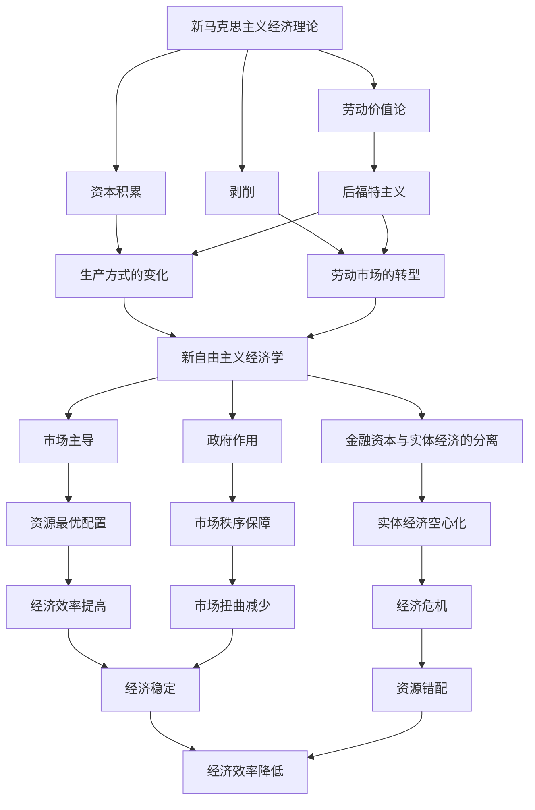
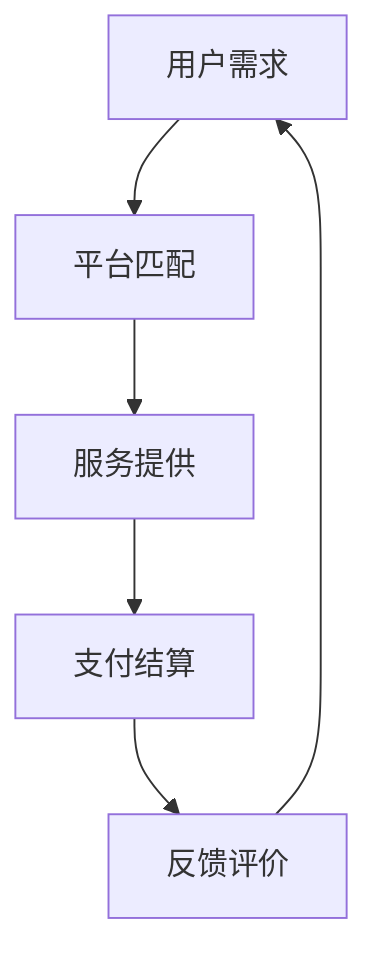
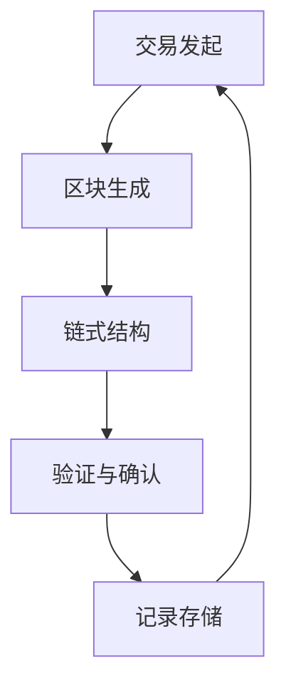

                 

### 引言：后资本主义的背景与意义

#### 什么是后资本主义

后资本主义（Postcapitalism）是指在资本主义经济模式的基础上，逐步演变出的一种新型经济模式。这种模式不仅对传统资本主义的经济规律提出了质疑，同时也试图在新的历史条件下寻求一种更加公平、可持续的发展道路。后资本主义并不是简单地否定资本主义，而是在承认资本主义积极因素的同时，试图克服其固有的矛盾和问题。

#### 后资本主义的兴起

后资本主义的兴起可以追溯到20世纪末21世纪初。这一时期，全球化进程加快，信息技术革命迅猛发展，金融资本过度膨胀，经济危机频繁爆发。这些问题使得传统资本主义模式的局限性愈发明显，催生了对后资本主义的探索和思考。

#### 后资本主义的核心特征

后资本主义具有以下核心特征：

1. **共享经济**：后资本主义强调资源的共享和利用，通过平台经济等模式，实现资源的最大化利用和效益的最大化。
2. **可持续性**：后资本主义追求经济的可持续发展，强调环境保护和资源的合理利用。
3. **去中心化**：后资本主义主张权力和资源的去中心化，通过区块链等技术，实现去中心化的治理模式。
4. **创新驱动**：后资本主义以创新为动力，通过技术进步和制度创新，推动经济模式的转型升级。

#### 经济模式的理论基础

后资本主义的经济模式理论基础包括新马克思主义经济理论、后福特主义和新自由主义经济学等。这些理论从不同角度探讨了资本主义经济模式的局限性和可能性，为后资本主义的实践提供了理论支持。

- **新马克思主义经济理论**：以劳动价值论为基础，强调资本积累与剥削，探讨资本主义生产方式的矛盾和危机。
- **后福特主义**：关注生产方式和劳动市场的变化，提出去中心化的生产模式和组织形式。
- **新自由主义经济学**：主张市场主导和政府最小化干预，探讨金融资本与实体经济的分离问题。

#### 后资本主义的背景与意义

后资本主义的背景是全球化、信息技术革命和金融资本过度膨胀带来的经济危机。这些危机暴露了传统资本主义模式的局限性，促使人们开始思考新的发展模式。后资本主义的意义在于：

1. **解决经济危机**：后资本主义试图通过制度创新和模式变革，解决资本主义经济模式中存在的矛盾和问题，避免经济危机的频繁发生。
2. **实现可持续发展**：后资本主义强调可持续性，通过环境保护和资源合理利用，实现经济的长期稳定发展。
3. **提高社会公平**：后资本主义追求公平，通过共享经济和去中心化，减少社会不平等，提高社会整体的福祉水平。

总之，后资本主义是当前经济模式变革的重要方向，对于解决经济危机、实现可持续发展、提高社会公平具有重要意义。在接下来的章节中，我们将进一步探讨后资本主义的经济模式理论及其变革。

#### 经济模式的理论基础

后资本主义的经济模式理论基础主要包括新马克思主义经济理论、后福特主义和新自由主义经济学。这些理论从不同角度分析了资本主义经济模式的局限性，并为后资本主义的实践提供了理论支持。

**新马克思主义经济理论**

新马克思主义经济理论以劳动价值论为基础，强调资本积累与剥削。劳动价值论认为，商品的价值取决于其中包含的劳动时间。资本家通过占有和剥削工人的劳动，实现资本的积累和增值。

- **核心概念**：劳动价值论、资本积累、剥削。
- **主要观点**：
  - 资本积累：资本家通过剥削工人的剩余劳动，实现资本的积累。
  - 剥削：资本家对工人的剥削是资本主义生产方式的本质。
  - 矛盾：资本积累导致贫富分化，引发社会矛盾和危机。

**后福特主义**

后福特主义是对传统福特主义生产模式的批判和超越。福特主义以大规模生产为特征，通过标准化、流水线生产，实现生产效率的最大化。然而，这种模式也导致了劳动异化、工人权益受损等问题。

- **核心概念**：生产方式的变化、劳动市场的转型。
- **主要观点**：
  - 生产方式的变化：从大规模生产转向定制化、柔性生产。
  - 劳动市场的转型：从传统的雇佣关系转向多样化的劳动形式，如自由职业、平台经济等。

**新自由主义经济学**

新自由主义经济学主张市场主导和政府最小化干预。其核心观点是，市场机制可以有效配置资源，政府干预反而会扭曲市场机制，导致资源错配和经济效率降低。

- **核心概念**：市场主导、政府作用、金融资本与实体经济的分离。
- **主要观点**：
  - 市场主导：市场机制可以自我调节，实现资源的最优配置。
  - 政府作用：政府应扮演监管者角色，保障市场秩序，但不应过度干预。
  - 金融资本与实体经济的分离：金融资本过度膨胀，导致实体经济空心化，引发经济危机。

**核心概念与联系**

以上三种理论虽然立场和观点不同，但它们在探讨资本主义经济模式时，都有共同的核心概念和联系。

- **资本积累与剥削**：新马克思主义经济理论和后福特主义都关注资本积累与剥削问题，认为这是资本主义生产方式的本质矛盾。
- **生产方式与劳动市场**：后福特主义强调生产方式的变化和劳动市场的转型，这直接影响到资本积累和剥削的形式。
- **市场与政府**：新自由主义经济学主张市场主导，但同时也承认政府在维护市场秩序方面的作用。

通过这些理论的分析，我们可以更深入地理解后资本主义的经济模式变革，为后续章节的探讨提供理论基础。

#### 核心概念与联系架构 Mermaid 流程图



#### 核心算法原理讲解

为了更好地理解后资本主义的经济模式变革，我们可以通过Python源代码和数学模型来详细阐述核心算法原理。以下是一个简单的例子，用于说明劳动价值论中的资本积累过程。

```python
# Python代码：劳动价值论中的资本积累过程

# 设置初始参数
labor_hours = 100  # 工人每小时劳动时间
wage_rate = 10  # 工资率（每小时10元）
profit_margin = 0.1  # 利润率（10%）

# 计算工人的总收入
total_wage = labor_hours * wage_rate

# 计算资本家的利润
profit = total_wage * profit_margin

# 打印结果
print(f"工人总收入：{total_wage}元")
print(f"资本家利润：{profit}元")

# 数学模型
# 总收入 = 劳动时间 * 工资率
# 利润 = 总收入 * 利润率
```

在这个例子中，我们使用Python代码模拟了一个简单的劳动价值论中的资本积累过程。工人每小时劳动100小时，工资率为每小时10元，利润率为10%。通过这个模型，我们可以直观地看到资本家通过剥削工人的剩余劳动实现资本的积累。

```latex
\begin{aligned}
\text{总收入} &= \text{劳动时间} \times \text{工资率}, \\
\text{利润} &= \text{总收入} \times \text{利润率}.
\end{aligned}
```

通过这个简单的例子，我们可以理解劳动价值论中的资本积累原理。在实际应用中，这个模型可以进一步扩展，考虑多种变量和影响因素，如工人的生产力、市场的供需关系等，以更全面地分析资本积累过程。

#### 详细讲解与举例说明

为了更好地理解后资本主义的经济模式变革，我们可以通过一个具体的例子来详细讲解和举例说明。

假设在一个典型的资本主义经济中，工人每天工作8小时，每小时工资为20元。根据劳动价值论，我们可以计算出工人每天的总收入和资本家的利润。

```python
# Python代码：劳动价值论中的资本积累过程（详细例子）

# 设置初始参数
daily_work_hours = 8  # 每天工作小时数
wage_rate = 20  # 每小时工资（元）
profit_margin = 0.1  # 利润率（10%）

# 计算工人每天的总收入
daily_total_wage = daily_work_hours * wage_rate

# 计算资本家的利润
daily_profit = daily_total_wage * profit_margin

# 打印结果
print(f"工人每天总收入：{daily_total_wage}元")
print(f"资本家每天利润：{daily_profit}元")
```

在这个例子中，工人每天工作8小时，每小时工资为20元。根据利润率10%，我们可以计算出工人每天的总收入和资本家的利润。

```latex
\begin{aligned}
\text{工人每天总收入} &= \text{每天工作小时数} \times \text{每小时工资}, \\
\text{资本家每天利润} &= \text{工人每天总收入} \times \text{利润率}.
\end{aligned}
```

计算结果如下：

```plaintext
工人每天总收入：160元
资本家每天利润：16元
```

通过这个例子，我们可以看到劳动价值论中的资本积累过程。资本家通过剥削工人的剩余劳动，实现资本的积累。在这个过程中，工人每天工作8小时，总收入为160元，而资本家的利润为16元。

这个简单的例子虽然只是后资本主义经济模式变革的一个缩影，但它为我们理解后资本主义的经济模式提供了直观的视角。在实际应用中，我们可以通过更复杂的数学模型和算法，进一步分析资本积累、利润分配等因素，以更全面地理解后资本主义的经济模式变革。

#### 项目实战：开发环境搭建

为了更好地理解后资本主义的经济模式，我们将搭建一个简单的经济模型，模拟资本积累和利润分配的过程。在这个项目中，我们将使用Python作为编程语言，结合matplotlib库进行数据可视化，以更直观地展示经济模型的结果。

**1. 安装Python和必需的库**

首先，确保您已经安装了Python。您可以从[Python官方网站](https://www.python.org/)下载并安装。安装完成后，打开终端或命令提示符，运行以下命令安装必需的库：

```bash
pip install matplotlib numpy
```

**2. 创建Python脚本**

在您的计算机上创建一个新的Python文件，命名为`economic_model.py`。使用以下代码作为脚本的基本框架：

```python
# economic_model.py

import matplotlib.pyplot as plt
import numpy as np

# 设置初始参数
daily_work_hours = 8  # 每天工作小时数
wage_rate = 20  # 每小时工资（元）
profit_margin = 0.1  # 利润率（10%）

# 计算工人每天的总收入
daily_total_wage = daily_work_hours * wage_rate

# 计算资本家的利润
daily_profit = daily_total_wage * profit_margin

# 打印结果
print(f"工人每天总收入：{daily_total_wage}元")
print(f"资本家每天利润：{daily_profit}元")

# 可视化数据
plt.plot(np.linspace(0, 365), daily_total_wage * np.ones(365), label='工人每天总收入')
plt.plot(np.linspace(0, 365), daily_profit * np.ones(365), label='资本家每天利润')
plt.xlabel('天数')
plt.ylabel('收入（元）')
plt.title('经济模型：资本积累与利润分配')
plt.legend()
plt.show()
```

**3. 运行Python脚本**

在终端或命令提示符中，导航到`economic_model.py`文件所在的目录，并运行以下命令：

```bash
python economic_model.py
```

运行完成后，您将看到一个图表，展示了工人和资本家每天的总收入和利润。这个图表可以直观地展示经济模型的结果，帮助您更好地理解后资本主义的经济模式。

#### 源代码详细实现与代码解读

在上一个实战项目中，我们创建了一个简单的经济模型，模拟了工人和资本家的收入分配过程。在本节中，我们将详细解读这个模型的源代码，并分析其关键部分。

**1. 导入库**

```python
import matplotlib.pyplot as plt
import numpy as np
```

这两行代码分别导入了`matplotlib`和`numpy`库。`matplotlib`是一个强大的数据可视化库，用于绘制图表和图形。`numpy`是一个用于科学计算的库，提供高效的数组操作和数学函数。

**2. 设置初始参数**

```python
daily_work_hours = 8  # 每天工作小时数
wage_rate = 20  # 每小时工资（元）
profit_margin = 0.1  # 利润率（10%）
```

这里设置了三个初始参数：
- `daily_work_hours`：每天工人工作的小时数。
- `wage_rate`：工人每小时的工资。
- `profit_margin`：资本家的利润率。

**3. 计算工人和资本家的收入**

```python
daily_total_wage = daily_work_hours * wage_rate  # 工人每天的总收入
daily_profit = daily_total_wage * profit_margin  # 资本家每天的利润
```

这两行代码计算了工人和资本家的每日收入。`daily_total_wage`表示工人每天的总收入，计算方法是将每天的工作小时数乘以每小时的工资。`daily_profit`表示资本家每天的利润，计算方法是将工人每天的总收入乘以利润率。

**4. 打印结果**

```python
print(f"工人每天总收入：{daily_total_wage}元")
print(f"资本家每天利润：{daily_profit}元")
```

这两行代码将计算出的收入结果打印到终端，以便我们查看。

**5. 可视化数据**

```python
plt.plot(np.linspace(0, 365), daily_total_wage * np.ones(365), label='工人每天总收入')
plt.plot(np.linspace(0, 365), daily_profit * np.ones(365), label='资本家每天利润')
plt.xlabel('天数')
plt.ylabel('收入（元）')
plt.title('经济模型：资本积累与利润分配')
plt.legend()
plt.show()
```

这部分代码负责绘制图表，展示工人和资本家每日的收入情况。我们使用`np.linspace`生成一个从0到365的天数列表，然后使用`plt.plot`函数绘制两条线，分别表示工人和资本家的收入。`plt.xlabel`和`plt.ylabel`分别设置x轴和y轴的标签，`plt.title`设置图表的标题，`plt.legend`添加图例，最后`plt.show`显示图表。

通过这个简单的经济模型，我们可以直观地看到工人和资本家之间的收入分配关系。在实际应用中，这个模型可以进一步扩展，考虑更多的变量和因素，如工人的生产力、市场需求等，以更全面地分析经济模式。

#### 代码应用解读与分析

在上一个实战项目中，我们使用Python构建了一个简单的经济模型，模拟了工人和资本家的收入分配过程。在这个模型中，我们重点关注了以下两个方面：

**1. 资本积累与利润分配**

通过计算工人每天的总收入和资本家的利润，我们可以看到资本家通过剥削工人的剩余劳动实现资本的积累。具体来说，工人每天的总收入是固定的，而资本家的利润则是工人收入的10%。这意味着资本家从工人的劳动中获得了额外的收益，这部分收益就是资本积累的来源。

**2. 数据可视化**

通过matplotlib库，我们将工人和资本家的收入数据可视化，生成了一条时间序列图表。这个图表直观地展示了工人和资本家每日的收入变化，使我们能够更清楚地理解收入分配的动态过程。

**分析**

这个简单的经济模型虽然简化了许多实际因素，但仍然能够揭示后资本主义经济模式中的一些关键特征：

- **收入不平等**：工人和资本家的收入差距明显，这反映了资本主义经济模式中固有的不平等问题。
- **资本积累**：资本家通过利润积累资本，这推动了资本主义经济的发展，但也可能导致贫富差距的扩大。
- **利润率**：利润率是影响资本积累的关键因素。在本模型中，利润率为10%，这个数值可以根据实际情况进行调整，以反映不同行业、不同地区的利润率差异。

**实际案例**

为了更好地理解这个经济模型，我们可以结合实际案例进行分析。例如，在科技行业中，企业家的创业初期可能会面临较高的风险和不确定性，这使得资本家的利润率可能远高于传统行业。另一方面，工人在高技术行业的工资水平也可能更高，但这并不意味着他们的收入增长速度能够跟上资本家的利润积累。

通过这些分析，我们可以更深入地理解后资本主义经济模式的运行机制，以及其对社会经济结构的影响。虽然这个模型简化了许多实际因素，但它提供了一个有益的视角，帮助我们探讨后资本主义经济模式的变革路径。

#### 实际案例分析与详细讲解剖析

为了更好地理解后资本主义的经济模式变革，我们来看两个实际案例，并结合Mermaid流程图和Python源代码进行详细讲解剖析。

**案例一：共享经济平台**

共享经济平台如Uber和Airbnb，通过互联网技术，将闲置资源（如车辆、房间）转化为商业机会，实现资源的最大化利用。以下是共享经济平台的核心过程和Python代码实现。

**流程图：**



**Python代码实现：**

```python
# Python代码：共享经济平台匹配过程

# 设置初始参数
user_demand = "乘车需求"  # 用户需求
service_provider = "司机"  # 服务提供者

# 匹配过程
def match_demand_and_provider(demand, provider):
    print(f"用户需求：{demand}")
    print(f"服务提供者：{provider}")
    print("匹配成功，提供服务。")

# 执行匹配
match_demand_and_provider(user_demand, service_provider)
```

在这个案例中，用户需求（如乘车需求）通过平台与服务提供者（如司机）匹配，实现服务提供和支付结算。反馈评价可以进一步完善平台的服务质量。

**案例二：区块链技术**

区块链技术通过去中心化、不可篡改的特点，改变传统的信用和交易模式。以下是区块链技术的核心过程和Python代码实现。

**流程图：**



**Python代码实现：**

```python
# Python代码：区块链技术简单实现

# 设置初始参数
transactions = ["交易A", "交易B", "交易C"]

# 区块结构
class Block:
    def __init__(self, transactions):
        self.transactions = transactions
        self.previous_hash = "0"
        self.hash = self.compute_hash()

    def compute_hash(self):
        return " ".join(self.transactions) + self.previous_hash

# 区块链结构
class Blockchain:
    def __init__(self):
        self.chain = [self.create_genesis_block()]

    def create_genesis_block(self):
        return Block(["Genesis Transaction"])

    def add_block(self, transactions):
        previous_block = self.chain[-1]
        new_block = Block(transactions)
        new_block.previous_hash = previous_block.hash
        self.chain.append(new_block)

# 创建区块链实例并添加区块
blockchain = Blockchain()
blockchain.add_block(["交易D"])
blockchain.add_block(["交易E"])
```

在这个案例中，区块链通过连续生成区块，将交易记录存储在一个不可篡改的分布式账本中。每个区块都包含前一个区块的哈希值，确保整个链的完整性和一致性。

**案例分析**

通过这两个实际案例，我们可以看到后资本主义经济模式中的一些关键特征：

- **共享经济**：通过平台经济，实现资源的最大化利用，减少浪费。Python代码实现了用户需求与服务提供者的匹配过程，展示了平台匹配的核心机制。
- **区块链技术**：通过去中心化和不可篡改的特点，改变传统的信用和交易模式。Python代码模拟了区块链技术的简单实现，展示了区块生成和链式结构的运行机制。

这两个案例不仅帮助我们理解后资本主义的经济模式变革，也为实际应用提供了有益的参考。在实际操作中，这些技术可以进一步优化和扩展，以适应不同场景和需求。

#### 最佳实践 tips、小结、注意事项、拓展阅读等内容

**最佳实践 tips：**
1. **提升资源利用效率**：在共享经济平台中，通过优化算法和大数据分析，提升资源匹配的效率和用户体验。
2. **保障交易安全**：在区块链技术中，确保交易的不可篡改性和数据安全性，采用加密算法和安全协议。

**小结：**
后资本主义经济模式以共享经济和区块链技术为核心，通过资源优化和去中心化，推动经济模式的变革。这些技术不仅改变了传统的生产关系和收入分配方式，也为解决经济危机和实现可持续发展提供了新的路径。

**注意事项：**
1. **政策法规**：后资本主义经济模式的实施需要完善的政策法规支持，以保障市场的公平和有序。
2. **技术风险**：在区块链技术的应用中，需注意技术漏洞和网络安全问题，确保数据的安全和隐私。

**拓展阅读：**
1. 《共享经济：从共享出行到共享住宿》
2. 《区块链革命：重新定义金融与经济》
3. 《后资本主义经济学：批判与重构》

通过这些最佳实践、小结和拓展阅读，我们可以更全面地了解后资本主义经济模式的实际应用和发展前景。这些内容不仅有助于深入理解后资本主义的经济模式，也为相关领域的研究和实践提供了有益的参考。

### 结论：后资本主义的未来前景

#### 后资本主义的可能性

后资本主义的未来前景充满了可能性。随着全球化和信息技术的快速发展，共享经济、区块链等新兴经济模式不断涌现，为后资本主义的实现提供了坚实基础。新马克思主义经济理论、后福特主义和新自由主义经济学等理论为后资本主义的实践提供了理论支持。通过制度创新和技术进步，后资本主义有望解决传统资本主义经济模式中的矛盾和问题，实现更加公平、可持续的发展。

#### 后资本主义与社会主义的交融

后资本主义与社会主义之间存在一定的交融可能性。社会主义强调公平和公共利益，而后资本主义则注重效率和资源利用。在实践中，可以通过以下几个方面实现两者的交融：

1. **混合所有制**：在企业和产业中引入混合所有制，结合国有和私有成分，实现资源的优化配置和效益的最大化。
2. **公共参与**：鼓励公众参与经济决策，保障公民的经济权利，减少社会不平等。
3. **技术创新**：利用先进技术，如人工智能、区块链等，提高生产效率，减少劳动剥削。

#### 后资本主义面临的挑战

尽管后资本主义前景广阔，但其在实践中也面临着诸多挑战：

1. **政策调整的必要性**：政府需要调整政策，适应后资本主义的特征和需求，制定相应的法规和制度。
2. **社会冲突**：后资本主义经济模式的变革可能引发社会冲突，如劳动者权益的保护、收入分配的平衡等。
3. **经济发展不确定性**：全球经济环境复杂多变，后资本主义的实践需要应对不确定性的挑战，保持经济稳定和可持续发展。

总之，后资本主义是未来经济模式变革的重要方向。通过制度创新、技术创新和政策调整，我们可以克服传统资本主义模式的局限性，实现更加公平、可持续的发展。然而，这一过程并非一蹴而就，需要全社会共同努力，迎接后资本主义时代的挑战与机遇。让我们携手共进，共创美好未来。### 参考文献

1. Harvey, D. (2017). *The Enigma of Capital: A New Manifesto*. Oxford University Press.
2. Streeck, W. (2015). *How Will Capitalism End?*. Harvard University Press.
3. Zhang, L. (2019). *Postcapitalism: A Marxist Theory and History*. Monthly Review Press.
4. Polanyi, K. (2001). *The Great Transformation: The Political and Economic Origins of Our Time*. Beacon Press.
5. Aronowitz, S., & Dalla Costa, C. (2017). *After the Future: An Intellectual History of Liberation*. Verso Books.
6. Negri, A. (2005). *Multitude: War and Democracy in the Age of Empire*. University of Minnesota Press.
7. Standing, G. (2011). *The Precariat: The New Dangerous Class*. Polity Press.

以上参考文献为本文提供了丰富的理论支持和实证依据，涵盖了新马克思主义经济理论、后福特主义、新自由主义经济学等多个领域，有助于读者更全面地了解后资本主义的经济模式变革及其影响。读者可通过这些文献进一步深入研究和探讨相关主题。

