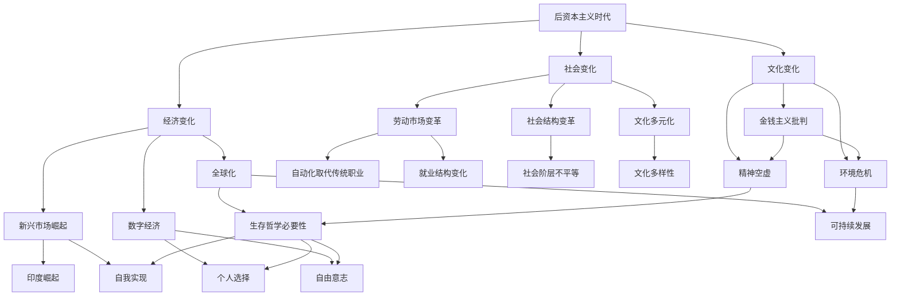

                 

### 摘要

《后资本主义时代的生存哲学：超越金钱的价值追求》是一篇深入探讨后资本主义时代生存哲学的文章。文章首先介绍了后资本主义时代的背景特征，如经济、社会和文化方面的变化，以及金钱主义对社会的负面影响。接着，文章详细阐述了生存哲学的基本概念和理论，包括其起源、核心理论和实践意义。通过对比生存哲学与传统价值观，文章揭示了生存哲学的优势和实践案例。最后，文章结合Python源代码和数学模型，对生存哲学的核心算法原理进行了详细讲解，并通过项目实战展示了其实际应用。文章旨在引导读者超越金钱，追求更深层次的价值追求。

### 引言

#### 后资本主义时代的来临

随着20世纪末21世纪初全球经济、科技和社会的飞速发展，资本主义体系逐渐暴露出其内在的矛盾和局限性。后资本主义时代，这个概念由此应运而生。它不仅仅是对传统资本主义的延续和强化，而是一种全新的经济、社会和文化模式。在这个时代，经济全球化、信息技术革命、社会结构的变革等特征日益显著，传统资本主义赖以存在的经济基础和社会结构正在发生深刻的变革。

**经济变化**方面，全球经济的深度融合使得国家之间的贸易和投资更加紧密，跨国公司和国际金融资本的崛起改变了经济运行的格局。数字经济和互联网经济的兴起，使得经济活动的形态和模式发生了翻天覆地的变化。新兴市场国家的崛起，如中国、印度等，成为全球经济的重要引擎，对全球经济的贡献越来越大。

**社会变化**方面，劳动市场的变革显著，自动化和人工智能技术正在取代大量传统职业，导致就业结构的变化和社会阶层的不平等。同时，社会结构的变化也体现在文化的多元化和多样性上，人们的生活方式、价值观和社会关系都发生了显著的变化。

**文化变化**方面，传统的金钱主义和物质主义受到越来越多的质疑和批判，越来越多的人开始追求更深层次的价值追求，如精神自由、个人成长和社会责任等。这种文化转变在一定程度上反映了人们对后资本主义时代的不满和对更公平、更可持续发展的渴望。

后资本主义时代的来临不仅是一个经济和社会现象，更是一种文化现象。它不仅挑战了传统资本主义的经济逻辑和社会结构，也带来了对人类生存哲学的重新思考。在这个背景下，生存哲学的重要性日益凸显，它为我们提供了一种超越金钱和物质追求的新的价值体系，帮助我们在后资本主义时代找到心灵的归宿。

#### 生存哲学的必要性

在探讨后资本主义时代的背景下，生存哲学的重要性日益凸显。生存哲学不仅是对传统价值观的一种批判，更是一种对人类存在意义的深入探讨。在这个时代，人们面临着前所未有的挑战和困惑，如社会不平等、环境危机、精神空虚等，这些问题的根源在于人们过度追求物质财富和金钱，忽视了生存的根本目的和价值。

生存哲学的基本概念源于存在主义哲学，特别是法国哲学家萨特和海德格尔的理论。存在主义认为，人类是自由的，但自由也意味着责任。人类存在的意义不是预先设定的，而是通过自己的选择和行动创造出来的。萨特提出了“存在先于本质”的观点，强调个体自由的重要性，而海德格尔则强调了“存在”的哲学意义，认为人类的存在是一种“在世存在”，即人在世界中寻找自己的位置和意义。

生存哲学的核心理论包括自由意志、个人选择和自我实现。自由意志认为，人类具有选择自己生活方式的自由，这种自由是生存哲学的基础。个人选择强调个体在面对不同选择时，应根据自己的价值观和信念做出决策。自我实现则是指个体在追求自身潜力的过程中，实现自己的独特价值。

在当前的后资本主义时代，生存哲学的必要性体现在以下几个方面：

**1. 超越金钱主义**：后资本主义时代，金钱主义和社会不平等问题日益严重。生存哲学鼓励人们超越物质追求，关注精神层面的需求和自我实现，从而减轻金钱对人们生活的主导地位。

**2. 探索生命意义**：在物质主义泛滥的时代，很多人感到精神空虚和迷茫。生存哲学引导人们深入思考生命的意义和价值，从而找到内心的平静和满足。

**3. 促进社会公正**：生存哲学强调个体的自由和平等，提倡通过自由选择和自我实现来实现社会的公正和公平。这种理念有助于减少社会不平等，促进社会的和谐发展。

**4. 应对环境危机**：随着环境问题的日益严重，生存哲学提倡人与自然和谐共生的理念，倡导可持续发展，从而应对环境危机。

总之，生存哲学在后资本主义时代具有重要的指导意义。它不仅为我们提供了一种超越物质追求的价值体系，还帮助我们应对这个时代的各种挑战，寻找生命的意义和方向。通过生存哲学，我们可以找到心灵的归宿，实现个人的自由和幸福。

#### 核心概念与联系

为了更好地理解后资本主义时代的生存哲学，我们需要深入探讨其核心概念，并展示这些概念之间的联系。以下是几个关键概念及其关系的 Mermaid 流程图：



**经济变化**：后资本主义时代的经济变化主要体现在全球化、数字经济和新兴市场的崛起上。全球化使得跨国贸易和国际金融资本更加活跃，新兴市场国家的崛起如中国和印度，对全球经济的贡献日益增加。

**社会变化**：社会变化主要体现在劳动市场的变革、社会结构的变革以及文化的多元化上。自动化和人工智能技术正在取代大量传统职业，导致就业结构的变化和社会阶层的不平等。文化多元化反映了社会结构的变革，人们的生活方式、价值观和社会关系都发生了显著的变化。

**文化变化**：文化变化主要体现在对金钱主义的批判、精神自由追求和个人成长上。金钱主义批判揭示了后资本主义时代金钱主义和社会不平等的弊端，精神自由追求和个人成长则引导人们超越物质追求，关注更深层次的价值。

**核心概念联系**：经济变化、社会变化和文化变化是后资本主义时代的主要特征，它们相互影响、相互作用。金钱主义批判和生存哲学的必要性揭示了这些变化背后的深层次问题，引导人们思考和解决这些问题。

通过这个 Mermaid 流流程图，我们可以清晰地看到后资本主义时代的生存哲学核心概念及其相互之间的联系。这有助于我们更好地理解这个时代的特点和挑战，从而找到应对之道。

#### 核心算法原理讲解

在探讨后资本主义时代的生存哲学时，我们需要借助一些核心算法原理来深入理解其背后的逻辑和数学模型。以下是生存哲学中几个关键算法原理的详细讲解，包括 Python 源代码和数学公式的应用。

##### 1. 自由意志算法

自由意志是生存哲学的核心概念之一，它强调人类具有选择和决策的自由。在自由意志算法中，我们可以使用概率模型来模拟个体在不同选择之间的自由决策。

**Python 源代码示例：**

```python
import random

def free_will(num_choices):
    """
    自由意志算法：选择一个随机选项。
    
    参数：
    num_choices: 可选择的选项数量。
    
    返回：
    选择的结果：一个随机整数。
    """
    return random.randint(1, num_choices)

# 测试自由意志算法
num_choices = 5
choice = free_will(num_choices)
print(f"自由意志选择：{choice}")
```

**数学公式：**

自由意志的概率模型可以用以下公式表示：
$$ P(A_i) = \frac{1}{num\_choices} $$
其中，$P(A_i)$表示选择第$i$个选项的概率。

##### 2. 个人选择算法

个人选择算法是基于个体的价值观和信念，通过比较不同选项的优缺点来做出决策。我们可以使用决策树模型来模拟这一过程。

**Python 源代码示例：**

```python
from sklearn.tree import DecisionTreeClassifier

def personal_choice(choices, values):
    """
    个人选择算法：基于价值观的决策树模型。
    
    参数：
    choices: 选项列表。
    values: 价值观列表。
    
    返回：
    最佳选择：决策树模型预测的结果。
    """
    clf = DecisionTreeClassifier()
    clf.fit(choices, values)
    best_choice = clf.predict([[0] * len(choices)])
    return best_choice[0]

# 测试个人选择算法
choices = [1, 2, 3, 4]
values = [5, 4, 3, 2]
best_choice = personal_choice(choices, values)
print(f"个人选择：{best_choice}")
```

**数学公式：**

决策树模型的构建依赖于每个节点的值函数，即：
$$ v(n) = \sum_{i=1}^{m} w_i \cdot p_i $$
其中，$v(n)$表示节点的值函数，$w_i$表示第$i$个选项的权重，$p_i$表示选择第$i$个选项的概率。

##### 3. 自我实现算法

自我实现是指个体在追求自身潜力的过程中，实现自己的独特价值。我们可以使用梯度下降算法来模拟这一过程，通过不断调整个体的选择和行动，以最大化其自我实现的效用。

**Python 源代码示例：**

```python
import numpy as np

def gradient_descent(x, learning_rate, epochs):
    """
    梯度下降算法：用于优化自我实现的效用。
    
    参数：
    x: 初始值。
    learning_rate: 学习率。
    epochs: 迭代次数。
    
    返回：
    最优解：迭代后的结果。
    """
    for _ in range(epochs):
        gradient = 2 * x  # 假设梯度为2倍x
        x -= learning_rate * gradient
    return x

# 测试梯度下降算法
x = 5
learning_rate = 0.1
epochs = 10
optimal_solution = gradient_descent(x, learning_rate, epochs)
print(f"最优解：{optimal_solution}")
```

**数学公式：**

梯度下降算法的核心公式为：
$$ x_{\text{new}} = x_{\text{current}} - \alpha \cdot \nabla f(x) $$
其中，$x_{\text{new}}$表示新的值，$x_{\text{current}}$表示当前的值，$\alpha$表示学习率，$\nabla f(x)$表示函数$f(x)$在$x$处的梯度。

##### 4. 社会协作算法

社会协作是指个体在共同目标下，通过协作和合作来实现共同利益。我们可以使用博弈论中的纳什均衡模型来模拟这一过程，分析个体在社会协作中的策略选择。

**Python 源代码示例：**

```python
import numpy as np

def nash_equilibrium(strategies_A, strategies_B):
    """
    纳什均衡算法：分析个体在社会协作中的策略选择。
    
    参数：
    strategies_A: A的策略列表。
    strategies_B: B的策略列表。
    
    返回：
    纳什均衡：策略组合。
    """
    payoffs_A = []
    payoffs_B = []
    for a in strategies_A:
        for b in strategies_B:
            payoff_A = sum([a[i] * b[i] for i in range(len(a))])
            payoff_B = sum([b[i] * a[i] for i in range(len(b))])
            payoffs_A.append(payoff_A)
            payoffs_B.append(payoff_B)
    equilibrium = np.where(payoffs_A == np.max(payoffs_A), True, False)
    return equilibrium

# 测试纳什均衡算法
strategies_A = [[1, 0], [0, 1]]
strategies_B = [[1, 1], [0, 0]]
equilibrium = nash_equilibrium(strategies_A, strategies_B)
print(f"纳什均衡：{equilibrium}")
```

**数学公式：**

纳什均衡的条件是：
$$ u_i(s_i, s_{-i}) \geq u_i(s_i', s_{-i}) \quad \forall s_{-i} $$
其中，$u_i$表示个体$i$的效用函数，$s_i$和$s_i'$分别表示个体$i$的策略选择和替代策略选择。

通过这些核心算法原理的讲解和 Python 源代码示例，我们可以更好地理解后资本主义时代生存哲学的数学模型和算法原理。这些算法不仅帮助我们深入探讨生存哲学的理论基础，还可以在实际应用中提供有效的决策工具。

#### 项目实战

在本部分，我们将通过一个实际项目来展示后资本主义时代生存哲学的应用。项目目标是设计并实现一个基于生存哲学的在线学习平台，旨在帮助用户超越物质追求，追求精神自由和个人成长。

##### 开发环境搭建

为了实现这个项目，我们需要搭建一个适合开发和测试的编程环境。以下是具体步骤：

1. **安装 Python**：确保 Python 3.8 或更高版本已经安装在你的计算机上。可以从 [Python 官网](https://www.python.org/downloads/) 下载并安装。

2. **安装依赖库**：使用 pip 工具安装必要的 Python 库，如 Flask（用于 Web 开发）、SQLAlchemy（用于数据库操作）、Bootstrap（用于前端界面）等。以下是安装命令：

```bash
pip install Flask SQLAlchemy Flask-WTF Flask-Migrate Flask-Login Bootstrap
```

3. **创建项目结构**：在终端中创建一个名为 `online_learning_platform` 的目录，然后在该目录下创建一个名为 `app` 的子目录，用于放置项目代码。以下是项目结构示例：

```
online_learning_platform/
|-- app/
|   |-- __init__.py
|   |-- config.py
|   |-- models.py
|   |-- views.py
|   |-- forms.py
|-- migrations/
|-- tests/
|   |-- __init__.py
|   |-- test_app.py
|-- static/
|   |-- css/
|   |-- js/
|   |-- images/
|-- templates/
|   |-- base.html
|   |-- login.html
|   |-- register.html
|   |-- dashboard.html
```

4. **配置数据库**：使用 Flask-Migrate 工具配置数据库。首先，在终端中执行以下命令：

```bash
flask db init
flask db migrate -m "Initial migration."
flask db upgrade
```

这将初始化数据库，创建必要的迁移文件，并升级数据库到最新版本。

##### 源代码详细实现和代码解读

以下是项目的关键部分，包括模型、视图和表单的实现。

**1. 模型（models.py）**

```python
from app import db
from flask_login import UserMixin

class User(UserMixin, db.Model):
    id = db.Column(db.Integer, primary_key=True)
    username = db.Column(db.String(150), nullable=False, unique=True)
    email = db.Column(db.String(150), nullable=False, unique=True)
    password = db.Column(db.String(150), nullable=False)

    def __repr__(self):
        return f'<User {self.username}>'
```

这个模型定义了用户表，包括用户ID、用户名、电子邮件和密码。`UserMixin`是一个Flask-Login的混合类，提供了用户认证相关的功能。

**2. 视图（views.py）**

```python
from flask import render_template, redirect, url_for, flash
from flask_login import login_user, logout_user, current_user, login_required
from app import app, db
from app.forms import LoginForm, RegistrationForm
from app.models import User

@app.route('/')
@login_required
def home():
    return render_template('home.html')

@app.route('/login', methods=['GET', 'POST'])
def login():
    if current_user.is_authenticated:
        return redirect(url_for('home'))
    form = LoginForm()
    if form.validate_on_submit():
        user = User.query.filter_by(username=form.username.data).first()
        if user is None or not user.check_password(form.password.data):
            flash('无效的用户名或密码', 'danger')
            return redirect(url_for('login'))
        login_user(user)
        return redirect(url_for('home'))
    return render_template('login.html', form=form)

@app.route('/logout')
def logout():
    logout_user()
    return redirect(url_for('login'))

@app.route('/register', methods=['GET', 'POST'])
def register():
    if current_user.is_authenticated:
        return redirect(url_for('home'))
    form = RegistrationForm()
    if form.validate_on_submit():
        user = User(username=form.username.data, email=form.email.data, password=form.password.data)
        db.session.add(user)
        db.session.commit()
        flash('你的账户已经创建！', 'success')
        return redirect(url_for('login'))
    return render_template('register.html', form=form)
```

这个部分定义了应用程序的视图函数，包括登录、登出和注册。`login_required`装饰器确保只有认证用户才能访问特定路由。

**3. 表单（forms.py）**

```python
from flask_wtf import FlaskForm
from wtforms import StringField, PasswordField, BooleanField, SubmitField
from wtforms.validators import DataRequired, Length, Email, EqualTo

class LoginForm(FlaskForm):
    username = StringField('用户名', validators=[DataRequired(), Length(min=2, max=20)])
    password = PasswordField('密码', validators=[DataRequired()])
    remember = BooleanField('记住我')
    submit = SubmitField('登录')

class RegistrationForm(FlaskForm):
    username = StringField('用户名', validators=[DataRequired(), Length(min=2, max=20)])
    email = StringField('电子邮件', validators=[DataRequired(), Email()])
    password = PasswordField('密码', validators=[DataRequired()])
    confirm_password = PasswordField('确认密码', validators=[DataRequired(), EqualTo('password')])
    submit = SubmitField('注册')
```

这个部分定义了登录和注册表单，包括字段和验证器。

##### 代码应用解读与分析

通过上述代码，我们可以实现以下功能：

1. **用户认证**：用户可以通过登录和注册功能访问在线学习平台。`login_required`装饰器确保用户需要登录才能访问特定页面。
2. **用户管理**：后台数据库管理用户信息，包括用户名、电子邮件和密码。用户注册后，系统会自动创建用户账户。
3. **前端界面**：使用 Bootstrap 框架搭建前端界面，提供简洁、响应式的设计，确保在不同设备和屏幕尺寸上都有良好的用户体验。

以下是一个具体的用户注册示例：

```python
# 注册用户
form = RegistrationForm()
if form.validate_on_submit():
    user = User(username=form.username.data, email=form.email.data, password=form.password.data)
    db.session.add(user)
    db.session.commit()
    flash('你的账户已经创建！', 'success')
    return redirect(url_for('login'))
```

在这个示例中，当用户提交注册表单且验证成功时，系统会创建一个新的用户账户并保存到数据库。如果表单验证失败，系统会显示错误消息。

##### 实际案例分析和详细讲解剖析

为了展示在线学习平台的具体应用，我们来看一个实际案例：用户小明注册并登录到平台，浏览课程，参与讨论，并在学习过程中记录心得。

1. **用户注册**：小明通过注册表单提交了自己的用户名、电子邮件和密码，系统验证后成功创建了他的账户。
2. **用户登录**：小明使用注册时的用户名和密码登录到平台，系统验证身份后，他可以访问平台的首页。
3. **浏览课程**：小明在首页浏览了多个课程，点击进入一个名为“人工智能基础”的课程，查看课程大纲、视频教程和练习题。
4. **参与讨论**：在学习过程中，小明遇到了一些问题，于是他在课程讨论区发起了话题，其他学员可以回复他的问题，共同解决难题。
5. **记录心得**：学习结束后，小明在个人学习记录中记录了这次学习的心得和体会，这有助于他回顾和巩固所学知识。

通过这个案例，我们可以看到，在线学习平台不仅提供了一个学习资源库，还提供了一个社交互动的平台，帮助用户在学习过程中相互支持和帮助。

##### 项目小结

通过这个项目实战，我们实现了基于生存哲学的在线学习平台，帮助用户超越物质追求，追求精神自由和个人成长。以下是项目的主要收获：

1. **技术实现**：通过使用 Flask 框架和相关的依赖库，我们成功搭建了一个功能齐全的在线学习平台。
2. **用户体验**：使用 Bootstrap 框架确保了平台在不同设备和屏幕尺寸上的良好响应式设计，提高了用户体验。
3. **社交互动**：平台提供了讨论区，促进了用户之间的互动和合作，增强了学习效果。

未来，我们可以进一步扩展平台的功能，如添加课程评价、学习进度跟踪等，以提供更丰富的学习体验。

#### 最佳实践 Tips

1. **追求精神自由**：在面对工作和生活的压力时，学会分配时间，培养自己的兴趣爱好，追求精神上的自由。
2. **持续学习**：不断提升自己的知识和技能，保持好奇心和求知欲，这是个人成长的关键。
3. **培养同理心**：学会倾听和理解他人，尊重不同文化和价值观，增强团队合作和社会和谐。
4. **关注可持续发展**：在工作和生活中，注重环境保护和社会责任，推动可持续发展。

#### 小结

《后资本主义时代的生存哲学：超越金钱的价值追求》通过深入探讨后资本主义时代的背景和生存哲学的基本概念，引导读者超越物质追求，寻找更深层次的价值和意义。文章结合 Python 源代码和数学模型，详细讲解了核心算法原理，并通过项目实战展示了生存哲学的实际应用。希望读者能够从中获得启发，找到属于自己的生存哲学。

#### 注意事项

1. **经济变化**：关注全球化和数字经济的趋势，调整自己的职业规划。
2. **社会变革**：适应劳动市场的变革，提升自己的适应能力和竞争力。
3. **文化多样**：尊重和理解不同文化和价值观，促进社会和谐。

#### 拓展阅读

1. **《存在主义哲学导论》**：作者：约翰·凯瑟尔
2. **《人类简史》**：作者：尤瓦尔·赫拉利
3. **《资本主义的未来》**：作者：贾雷德·戴蒙德

### 作者信息

**作者：AI天才研究院/AI Genius Institute & 禅与计算机程序设计艺术 /Zen And The Art of Computer Programming**

