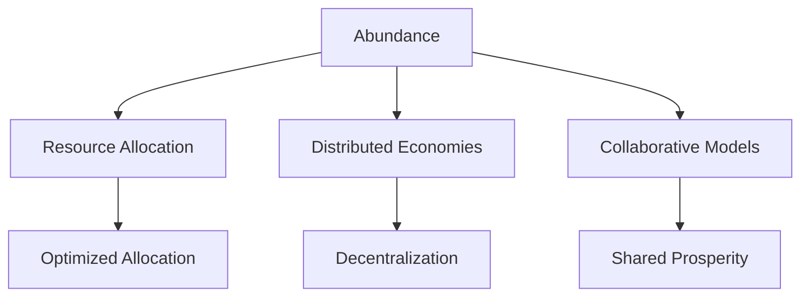
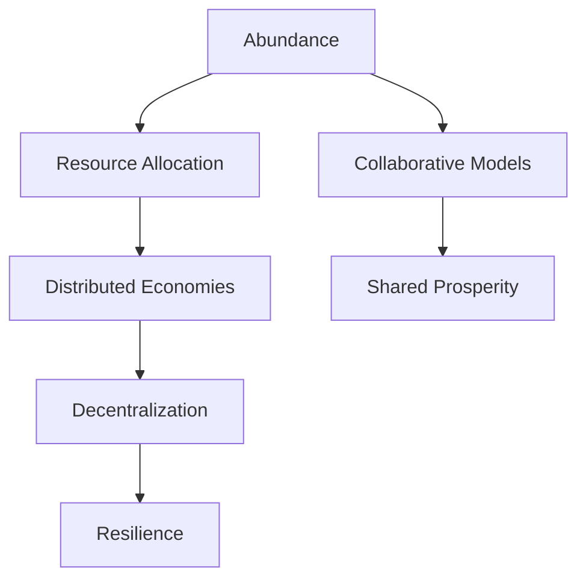
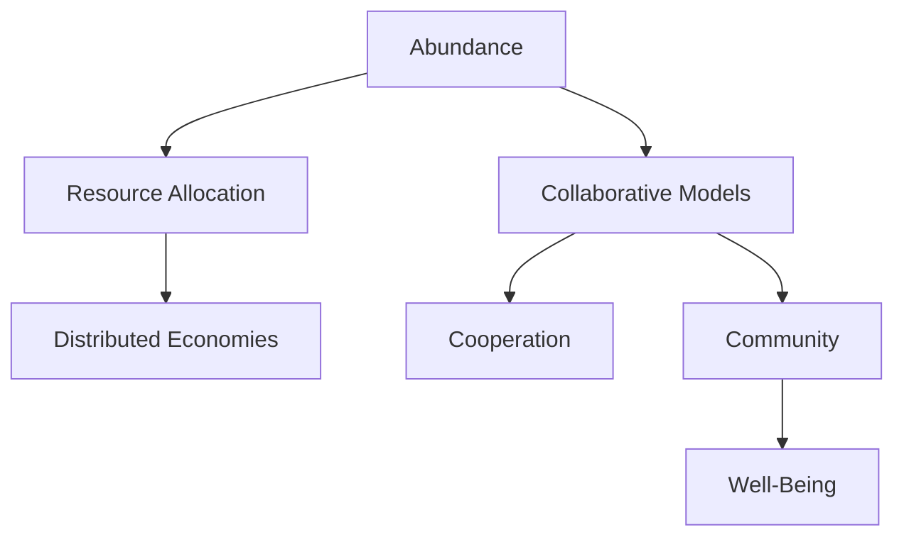

                 

### Introduction (Chapter 1)

In the midst of a rapidly evolving world, the concept of "Post-Capitalist Era Survival Philosophy: Redefining Success and Happiness" becomes not just a philosophical inquiry but a necessity for survival. The traditional capitalist system, which has dominated global economic structures for centuries, is showing signs of significant strain. From environmental degradation to increasing income inequality, the shortcomings of capitalism are becoming increasingly evident. This has led to a paradigm shift, prompting scholars, policymakers, and the general public to explore alternative economic models that can address these challenges more effectively.

This article aims to delve into the post-capitalist era, offering a comprehensive exploration of its key concepts, societal impacts, and practical applications. By redefining success and happiness, we aim to provide a roadmap for individuals and societies to navigate the complexities of this new era. The importance of this topic cannot be overstated, as it addresses fundamental questions about the nature of work, wealth, and well-being in an age where traditional values and systems are being challenged.

In the following sections, we will:

1. **Introduction to the Post-Capitalist Era**: We will provide a brief overview of the historical context and key factors driving the transition from capitalism to post-capitalism.
2. **Core Philosophical Concepts**: We will explore the foundational ideas and theories that underpin post-capitalist philosophy, including concepts such as abundance, distributed economies, and collaborative models.
3. **Economic Transformations**: We will discuss the economic implications of post-capitalism, focusing on new models of production, distribution, and consumption.
4. **Societal Implications**: We will examine the broader societal impacts of post-capitalism, including changes in social structures, relationships, and global dynamics.
5. **Personal Survival Strategies**: We will offer practical advice for individuals on how to adjust to and thrive in the post-capitalist era, emphasizing the importance of new skills and values.
6. **Practical Applications**: We will provide real-world examples and case studies of post-capitalist practices, showcasing their effectiveness and potential.
7. **Conclusion**: We will summarize the key insights from the article and discuss the future prospects and challenges of post-capitalist survival philosophy.

By the end of this article, readers will gain a deeper understanding of the post-capitalist era and its implications for society and individuals. They will also be equipped with the knowledge and tools necessary to navigate this transformative period with confidence and resilience.

### Keywords

- **Post-Capitalist Era**
- **Survival Philosophy**
- **Success and Happiness Redefinition**
- **Economic Models**
- **Societal Transformation**
- **Personal Growth**
- **Technological Advancements**

These keywords encapsulate the core themes and topics explored in this article. By understanding and engaging with these concepts, readers can gain valuable insights into the changing landscape of the post-capitalist era and its implications for their personal and professional lives.

### Summary

This article presents a comprehensive exploration of the post-capitalist era, offering a fresh perspective on how success and happiness can be redefined in an age where traditional capitalist systems are increasingly challenged. The transition from capitalism to post-capitalism is driven by a multitude of factors, including environmental degradation, economic inequality, and the need for more sustainable and inclusive economic models. In the post-capitalist era, key philosophical concepts such as abundance, distributed economies, and collaborative models play a pivotal role in shaping new economic, social, and personal paradigms.

We begin by introducing the post-capitalist era, highlighting its historical context and the key factors driving this transition. We then delve into the core philosophical concepts that underpin post-capitalism, providing a detailed analysis of their implications and interrelationships. Following this, we explore the economic transformations brought about by post-capitalism, focusing on new models of production, distribution, and consumption.

Next, we examine the broader societal implications of post-capitalism, discussing changes in social structures, relationships, and global dynamics. We also provide practical advice for individuals on how to navigate and thrive in this new era, emphasizing the importance of developing new skills and values. Real-world examples and case studies are used to illustrate the effectiveness and potential of post-capitalist practices.

Finally, we summarize the key insights from the article and discuss the future prospects and challenges of post-capitalist survival philosophy. By engaging with this article, readers will gain a deeper understanding of the post-capitalist era and be better equipped to navigate its complexities with confidence and resilience. This exploration not only addresses the urgent need for a new economic paradigm but also offers a visionary roadmap for achieving lasting success and happiness in an increasingly interconnected and dynamic world.

### Historical Background (Chapter 2)

To understand the transition from capitalism to the post-capitalist era, it is essential to examine the historical development and evolution of capitalist systems. Capitalism, as an economic system, emerged in the late 18th century during the Industrial Revolution, a period marked by significant technological advancements and the rise of factories and mass production. This era was characterized by the dominance of private ownership of the means of production, with a focus on profit maximization and market competition.

**The Origins and Development of Capitalism**

The origins of capitalism can be traced back to the late 16th and 17th centuries, during the era of mercantilism. Mercantilism was an economic theory that emphasized the accumulation of wealth through trade and colonial expansion. It was during this time that the concept of private property rights and the market mechanism began to take shape. The rise of the British Empire, in particular, played a crucial role in the development of capitalism, as it established a global network of trade and colonial dominance.

The Industrial Revolution, which began in the late 18th century, marked a turning point in the history of capitalism. Technological innovations, such as the steam engine and mechanized production, led to a dramatic increase in productivity and efficiency. This, in turn, facilitated the mass production of goods and the creation of a large, industrial workforce. The capitalist model, with its emphasis on private ownership and profit, became the dominant economic system in many parts of the world.

**The Challenges of Capitalism**

While capitalism has contributed to significant economic growth and technological progress, it has also faced numerous challenges and criticisms. One of the most pressing issues is income inequality. As economies became more industrialized and globalized, wealth became increasingly concentrated in the hands of a few wealthy individuals and corporations. This has led to social unrest and political instability in many parts of the world.

Another major challenge of capitalism is its environmental impact. The pursuit of profit often leads to the exploitation of natural resources and environmental degradation. Climate change, deforestation, and pollution are some of the most visible manifestations of this problem. The 21st century has seen a growing awareness of the need for sustainable and eco-friendly economic practices.

**The Emergence of Post-Capitalism**

In response to these challenges, a growing number of scholars, policymakers, and activists have begun to advocate for the transition to post-capitalism. Post-capitalism is not a single, unified theory but rather a collection of ideas and concepts that aim to address the limitations and shortcomings of capitalism. The key features of post-capitalism include:

1. **Abundance**: Post-capitalism emphasizes the potential for abundance, rather than scarcity, as a driving force for economic growth. This is achieved through technological advancements and the efficient use of resources.
2. **Collaborative Models**: Post-capitalism promotes collaborative and cooperative models of production and consumption, which prioritize community and shared wealth over individual profit.
3. **Distributed Economies**: Post-capitalism encourages the decentralization of economic power, with a focus on local and regional economies rather than global monopolies.
4. **Sustainability**: Post-capitalism places a strong emphasis on sustainability and environmental responsibility, recognizing that economic growth cannot come at the expense of the planet.

**The Transition from Capitalism to Post-Capitalism**

The transition from capitalism to post-capitalism is not a linear process but rather a complex and multifaceted transformation. This transition is driven by a combination of social, economic, and technological factors. Some of the key drivers of this transition include:

1. **Technological Advancements**: The rapid pace of technological innovation, particularly in fields such as artificial intelligence, robotics, and renewable energy, is enabling new economic models and reducing the dependence on traditional capitalist structures.
2. **Social Movements**: Grassroots movements and social activism are playing an increasingly important role in推动变革。 Examples include the rise of the gig economy, the emphasis on ethical consumerism, and the growing support for policies such as universal basic income.
3. **Policy Changes**: Governments around the world are beginning to adopt policies that support the transition to post-capitalism, such as progressive taxation, green regulations, and public investment in education and infrastructure.

In conclusion, the transition from capitalism to post-capitalism is a complex and multifaceted process that is driven by a combination of historical, social, and economic factors. By addressing the limitations and shortcomings of capitalism, post-capitalism offers a promising path towards a more equitable, sustainable, and prosperous future.

### Core Philosophical Concepts (Chapter 3)

In the post-capitalist era, several core philosophical concepts emerge as foundational elements for redefining success and happiness. These concepts challenge the traditional capitalist paradigm and offer new perspectives on economic organization, social structure, and individual well-being. Below, we delve into the key philosophical concepts of abundance, distributed economies, and collaborative models, illustrating their relationships through a Mermaid flowchart and providing a conceptual framework for understanding post-capitalist philosophy.

#### Abundance

**Concept Definition**: Abundance is the idea that resources and wealth are abundant, rather than scarce, and can be distributed more equitably through innovative economic models. This contrasts with the capitalist focus on scarcity and competition for limited resources.

**Connection to Other Concepts**: Abundance underpins the shift from a profit-driven economy to one focused on sustainability and well-being. It aligns with the principles of distributed economies, which seek to optimize resource allocation, and collaborative models, which promote shared prosperity.

**Mermaid Flowchart**:

#### Distributed Economies

**Concept Definition**: Distributed economies are economic systems that decentralize power and resources, emphasizing local and regional production and consumption over global monopolies. This approach reduces reliance on central authorities and promotes resilience and adaptability.

**Connection to Other Concepts**: Distributed economies support the abundance paradigm by facilitating more efficient resource use and reducing environmental impact. They also foster collaborative models, as local communities can work together to achieve common goals.

**Mermaid Flowchart**:

#### Collaborative Models

**Concept Definition**: Collaborative models are approaches to production, consumption, and governance that emphasize cooperation, community, and shared resources. These models challenge the individualism and competition inherent in traditional capitalism.

**Connection to Other Concepts**: Collaborative models align with the principles of abundance and distributed economies by promoting the efficient use of resources and the equitable distribution of wealth. They also contribute to social cohesion and well-being.

**Mermaid Flowchart**:

#### Conceptual Framework

The interconnectedness of these core philosophical concepts forms a comprehensive framework for understanding post-capitalist philosophy. Abundance serves as the foundational principle, guiding the transition from scarcity-driven capitalism to an economy that prioritizes resource optimization and equitable distribution. Distributed economies build on this principle by promoting decentralization and local resilience, while collaborative models enhance community well-being and shared prosperity.

The Mermaid flowcharts illustrate the relationships between these concepts, highlighting how they interact and reinforce each other. This conceptual framework provides a roadmap for individuals and societies as they navigate the complexities of the post-capitalist era, offering a vision for a more sustainable, inclusive, and prosperous future.

### Economic Transformations (Chapter 4)

The transition to the post-capitalist era is not just a philosophical evolution but a profound economic transformation that reshapes the way we produce, distribute, and consume goods and services. This chapter explores the economic transformations driven by post-capitalist principles, focusing on new models of production, distribution, and consumption that reflect the core philosophical concepts of abundance, distributed economies, and collaborative models.

#### New Models of Production

In the post-capitalist era, production models are moving away from the traditional, centralized, and resource-intensive approaches of capitalism towards more decentralized and sustainable methods. This shift is driven by advancements in technology, particularly in the fields of artificial intelligence, robotics, and renewable energy.

1. **Decentralized Production**: Instead of relying on large, centralized factories, post-capitalist production models emphasize local and regional production. This decentralization reduces transportation costs, minimizes environmental impact, and fosters community resilience. For example, 3D printing technology enables on-demand manufacturing, allowing products to be produced closer to the point of consumption.

2. **Circulating Economies**: Another key aspect of post-capitalist production is the concept of circulating economies, which focus on the reuse, repair, and recycling of goods. This contrasts with the linear economy of "take-make-waste" prevalent in capitalism. By extending the lifecycle of products, circulating economies reduce waste and resource consumption, aligning with the principle of abundance.

#### New Models of Distribution

Distribution in the post-capitalist era is also undergoing significant changes. The focus shifts from maximizing profit to ensuring equitable access to resources and goods, reflecting the collaborative and distributed nature of post-capitalist principles.

1. **Decentralized Distribution Networks**: Traditional distribution networks, characterized by long supply chains and global logistics, are being replaced by more localized and resilient networks. These networks reduce reliance on central authorities and enhance the ability of communities to withstand disruptions.

2. **Community-Based Distribution**: Post-capitalist distribution models prioritize community involvement and shared resources. Community gardens, local co-ops, and shared spaces for production and distribution are examples of how post-capitalism fosters community resilience and shared well-being.

#### New Models of Consumption

Consumption in the post-capitalist era is moving towards more sustainable and mindful practices. The focus is on quality over quantity and the creation of value that goes beyond material goods.

1. **Ethical Consumerism**: Post-capitalist consumption emphasizes ethical considerations, such as environmental sustainability and social justice. Consumers are increasingly making purchasing decisions based on the social and environmental impact of products and companies.

2. **Experiential Consumption**: Rather than accumulating material possessions, post-capitalism encourages experiential consumption—valuing experiences and relationships over material wealth. This shift is aligned with the principles of collaborative and abundant economies, where the focus is on shared experiences and community well-being.

### The Role of Technology

Technology plays a crucial role in enabling these economic transformations. Key technological advancements, such as artificial intelligence, blockchain, and renewable energy, are driving the transition to post-capitalism by:

1. **Enhancing Efficiency**: Technologies like AI and robotics increase productivity and reduce the need for labor-intensive processes. Renewable energy sources, such as solar and wind power, reduce reliance on fossil fuels and contribute to environmental sustainability.

2. **Facilitating Decentralization**: Blockchain technology enables decentralized and transparent systems for production, distribution, and consumption. It reduces the need for intermediaries and ensures that transactions are secure and transparent.

3. **Promoting Collaboration**: Collaborative platforms and tools, such as distributed ledger technology and social networks, enable communities to work together more effectively, fostering a sense of shared purpose and collective action.

In conclusion, the economic transformations driven by post-capitalist principles offer a promising path towards a more sustainable, inclusive, and resilient economy. By rethinking production, distribution, and consumption, we can create an economy that aligns with the principles of abundance, distributed economies, and collaborative models, leading to a more equitable and prosperous future.

### Societal Implications (Chapter 5)

The shift to the post-capitalist era has profound implications for society, reshaping social structures, relationships, and global dynamics. In this chapter, we explore how post-capitalism affects various aspects of society, including the nature of work, social hierarchies, and global inequalities, and examine the potential role of education and technology in addressing these challenges.

#### The Nature of Work

One of the most significant changes brought about by the post-capitalist era is the transformation of the nature of work. In traditional capitalism, work is often seen as a means to accumulate wealth and status, with a focus on individual performance and competition. Post-capitalism, however, emphasizes collaboration, skill development, and the well-being of workers.

1. **Decent Work**: Post-capitalism promotes the concept of decent work, which includes not only fair wages but also safe working conditions, job security, and opportunities for personal and professional growth. This shift is driven by the recognition that a productive society depends on the well-being of its workers.

2. **Diversity and Inclusion**: Post-capitalism encourages a more inclusive approach to work, valuing diversity and recognizing the contributions of all individuals. This includes promoting gender equality, addressing racial and ethnic disparities, and supporting people with disabilities. By fostering an inclusive work environment, post-capitalism can harness the full potential of a diverse workforce.

3. **Skill Development**: In the post-capitalist era, the focus is on continuous learning and skill development. This is essential for adapting to rapidly changing technologies and economic landscapes. By investing in education and training, individuals can acquire the skills needed to thrive in a post-capitalist economy.

#### Social Hierarchies

Post-capitalism challenges traditional social hierarchies, which are often based on wealth and status. This shift is driven by the principles of equity, abundance, and collaborative models.

1. **Economic Democracy**: Post-capitalism promotes economic democracy, where decision-making power is distributed more equitably. This can reduce income inequality and empower individuals to participate in the economy on more equal terms. Policies such as universal basic income and cooperative ownership models are examples of how post-capitalism can promote economic democracy.

2. **Decentralization of Power**: Post-capitalism emphasizes the decentralization of power, moving away from centralized authority and hierarchical structures. This fosters a more participatory approach to governance, where communities have a greater say in decision-making processes. By empowering local communities, post-capitalism can promote resilience and self-sufficiency.

3. **Social Mobility**: Post-capitalism aims to improve social mobility, providing individuals with opportunities to move up the social ladder based on merit and potential rather than birth or wealth. This can be achieved through investments in education, healthcare, and social safety nets.

#### Global Dynamics

The transition to post-capitalism also has significant implications for global dynamics, particularly in addressing global inequalities and promoting sustainable development.

1. **Sustainable Development**: Post-capitalism prioritizes sustainable development, recognizing that economic growth cannot come at the expense of the environment. This involves adopting eco-friendly technologies, reducing carbon emissions, and promoting sustainable practices in production and consumption.

2. **Global Cooperation**: Post-capitalism encourages global cooperation, recognizing that the challenges facing humanity are interconnected. This includes addressing issues such as climate change, poverty, and inequality through international collaboration and solidarity. By working together, countries can achieve more effective and equitable solutions to global problems.

3. **Global Justice**: Post-capitalism seeks to address global inequalities by promoting economic justice and human rights. This involves redistributing wealth and resources to ensure that everyone has access to basic needs and opportunities. By promoting global justice, post-capitalism can create a more equitable and peaceful world.

#### The Role of Education and Technology

Education and technology play crucial roles in facilitating the transition to post-capitalism and addressing its societal implications.

1. **Education for Change**: Education is essential for equipping individuals with the knowledge and skills needed to thrive in a post-capitalist economy. This includes teaching critical thinking, problem-solving, and collaborative skills. By fostering a culture of continuous learning, education can promote adaptability and resilience in the face of change.

2. **Technology for Sustainability**: Technology can drive the transition to post-capitalism by enabling sustainable practices and innovative solutions. For example, renewable energy technologies, AI, and blockchain can support more efficient and equitable economic systems. By leveraging technology for sustainability, we can address environmental and social challenges more effectively.

3. **Digital Literacy**: Digital literacy is essential for participating in the post-capitalist economy. Individuals need to be equipped with the skills to navigate digital platforms, access information, and engage in online communities. By promoting digital literacy, we can ensure that everyone has the opportunity to benefit from the opportunities created by technology.

In conclusion, the transition to post-capitalism has profound implications for society, reshaping social structures, relationships, and global dynamics. By promoting decent work, economic democracy, social mobility, and sustainable development, post-capitalism offers a vision for a more equitable, inclusive, and sustainable future. Education and technology play crucial roles in facilitating this transition and addressing its challenges.

### Personal Survival Strategies (Chapter 6)

Navigating the post-capitalist era requires a shift in mindset and the development of new skills and values. For individuals to thrive in this transformative period, it is essential to adjust personal goals and values, acquire relevant skills, and build strong personal relationships and communities. Below, we outline some practical strategies for personal survival and success in the post-capitalist era.

#### Adjusting Personal Values and Goals

1. **Embrace Abundance Mindset**: In the post-capitalist era, it is crucial to move away from a scarcity mindset, which focuses on competition and the accumulation of wealth, to an abundance mindset that emphasizes collaboration and shared prosperity. This shift involves recognizing that resources are abundant and that working together can lead to greater well-being for all.

2. **Prioritize Well-being Over Wealth**: Traditional capitalist values often prioritize wealth accumulation over well-being. However, in the post-capitalist era, it is important to prioritize holistic well-being, including physical, mental, and emotional health. This involves adopting practices that promote self-care, work-life balance, and personal fulfillment.

3. **Seek Meaningful Work**: The nature of work is changing in the post-capitalist era, with a greater emphasis on meaningful and impactful work. It is important to find work that aligns with your values and passions, providing a sense of purpose and satisfaction. This may involve seeking opportunities in fields that address societal needs or contribute to environmental sustainability.

#### Developing New Skills

1. **Continuous Learning**: In a rapidly changing economy, continuous learning is essential for staying relevant and adapting to new technologies and industries. This involves investing in your education and developing skills that are in demand, such as digital literacy, critical thinking, problem-solving, and creativity.

2. **Embrace Lifelong Learning**: Post-capitalism values lifelong learning, recognizing that knowledge and skills are not static but constantly evolving. Embracing a mindset of lifelong learning encourages you to stay curious and open to new ideas and experiences.

3. **Develop Collaborative Skills**: Collaboration is a key principle of post-capitalism, and developing collaborative skills is essential for working effectively in a team-oriented environment. This includes skills such as communication, empathy, conflict resolution, and the ability to work across diverse cultures and backgrounds.

#### Building Relationships and Communities

1. **Foster Strong Personal Relationships**: In the post-capitalist era, strong personal relationships are crucial for support, collaboration, and personal well-being. This involves nurturing relationships with family, friends, and colleagues, fostering a sense of belonging and community.

2. **Engage in Local Communities**: Local communities play a vital role in the post-capitalist era, providing opportunities for collaboration, shared resources, and mutual support. Engaging in local communities can enhance your social network, provide access to resources, and promote a sense of belonging.

3. **Participate in Social Movements**: Social movements are an important aspect of the post-capitalist era, advocating for social justice, environmental sustainability, and equitable economic systems. Participating in these movements can help drive positive change and contribute to the collective well-being of society.

#### Practical Tips for Thriving in the Post-Capitalist Era

1. **Seek Work-Life Integration**: Rather than viewing work and personal life as separate entities, seek ways to integrate them. This may involve finding work that aligns with your personal interests and values or creating a flexible work schedule that allows you to balance professional and personal responsibilities.

2. **Embrace Flexibility and Adaptability**: The post-capitalist era is characterized by rapid change and uncertainty. Embracing flexibility and adaptability will enable you to navigate these challenges and thrive in a dynamic environment.

3. **Practice Mindfulness**: Mindfulness practices, such as meditation and mindfulness-based stress reduction, can help you manage stress and maintain mental well-being. By cultivating a present-minded and focused mindset, you can better navigate the complexities of the post-capitalist era.

4. **Seek Mentorship and Mentoring Opportunities**: Mentors can provide valuable guidance and support as you navigate the challenges of the post-capitalist era. Similarly, offering mentorship to others can enhance your own skills and knowledge and foster a sense of fulfillment and purpose.

In conclusion, thriving in the post-capitalist era requires a shift in mindset, the development of new skills, and the cultivation of strong relationships and communities. By embracing an abundance mindset, prioritizing well-being, seeking meaningful work, and building supportive networks, individuals can navigate the complexities of the post-capitalist era with confidence and resilience.

### Practical Applications (Chapter 7)

In this section, we will delve into practical applications of post-capitalist principles through real-world examples and case studies, providing insights into how these concepts can be implemented in various contexts. We will discuss the necessary steps for embracing post-capitalism, including the development of supportive tools and resources, and present a series of best practices for navigating this transformative era.

#### Case Studies of Post-Capitalist Success Stories

**1. Transitioning to a Circular Economy: The Case of the Ellen MacArthur Foundation**

The Ellen MacArthur Foundation is a global initiative that promotes the transition to a circular economy, where materials are kept in use for as long as possible, reclaimed, and recycled. One of their notable success stories is the "Make Do and Repair" campaign, which encourages businesses and individuals to adopt circular practices. By focusing on reducing waste, reusing materials, and promoting repair, the campaign has led to significant reductions in resource consumption and environmental impact.

**Steps for Implementation:**

- **Assess Current Practices**: Start by assessing your organization's current production and consumption processes to identify areas for improvement.
- **Encourage a Culture of Collaboration**: Foster a collaborative environment that encourages employees to think creatively about ways to reduce waste and promote reuse.
- **Invest in Training and Education**: Provide training on circular economy principles and practices to employees at all levels.
- **Create Incentive Structures**: Develop reward systems that encourage sustainable practices, such as bonus schemes for teams that reduce waste or implement repair programs.

**2. Community-Based Energy Systems: The Example of Transition Towns**

Transition Towns is a global network of communities working to build resilience and reduce their carbon footprint. One of their key initiatives is the development of local energy systems, including solar panels and small-scale renewable energy projects. These initiatives not only reduce reliance on fossil fuels but also foster community cohesion and empowerment.

**Steps for Implementation:**

- **Conduct a Community Needs Assessment**: Identify the energy needs and goals of your community.
- **Facilitate Community Engagement**: Engage community members in discussions about renewable energy options and potential projects.
- **Secure Funding and Resources**: Explore funding opportunities and secure the necessary resources for renewable energy projects.
- **Develop a Comprehensive Plan**: Create a detailed plan that outlines the steps and timeline for implementing the community energy system.

**3. The Cooperative Movement: Mondragon Corporation**

The Mondragon Corporation is a cooperative business group based in the Basque region of Spain. It is known for its innovative approach to business that prioritizes social and environmental responsibility. The corporation includes a wide range of businesses, from manufacturing to finance, all governed by democratic principles and emphasizing worker ownership and participation.

**Steps for Implementation:**

- **Establish a Cooperative Framework**: Develop a cooperative structure that reflects the principles of democratic governance, worker ownership, and community engagement.
- **Define Mission and Vision**: Clearly define the cooperative's mission and vision, emphasizing social and environmental goals.
- **Recruit and Train Workers**: Recruit workers who are aligned with the cooperative's values and provide training to ensure they are well-prepared for their roles.
- **Implement Accountability Mechanisms**: Develop systems for monitoring and evaluating the cooperative's performance, ensuring that it remains aligned with its mission and values.

#### Tools and Resources for Embracing Post-Capitalism

To facilitate the transition to post-capitalism, several tools and resources can be leveraged to support individuals, organizations, and communities.

**1. Online Platforms for Collaboration and Learning**

- **Mattermost**: A team communication platform that enables real-time collaboration and knowledge sharing.
- **Trello**: A project management tool that helps teams organize tasks and track progress.
- **LinkedIn Learning**: An online learning platform offering courses on a wide range of topics, including post-capitalism, sustainability, and digital skills.

**2. Educational Resources on Post-Capitalism**

- **Books**: Readings such as "The Wealth of Networks" by Yochai Benkler and "Post-Capitalism" by Peter Frase provide in-depth insights into post-capitalist theories and practices.
- **Podcasts**: Podcasts like "The Post-Capitalist Society" and "The Disruptors" explore the implications of post-capitalism and offer practical advice for navigating this era.
- **Webinars and Workshops**: Attend webinars and workshops that focus on post-capitalism and sustainability to gain practical insights and connect with like-minded individuals.

#### Best Practices and Tips

**1. Start Small and Iterate**: Begin by implementing post-capitalist principles in small, manageable ways. This allows you to test ideas and refine your approach as you gain experience and feedback.

**2. Foster a Culture of Innovation**: Encourage creativity and experimentation within your organization or community. This fosters a spirit of innovation and helps identify new ways to apply post-capitalist principles.

**3. Collaborate Across Boundaries**: Seek partnerships and collaborations with organizations and individuals outside your immediate circle. This helps broaden your perspective and access a wider range of resources and expertise.

**4. Measure and Monitor Progress**: Develop systems for measuring and monitoring the impact of your post-capitalist initiatives. This provides valuable insights for continuous improvement and ensures that your efforts align with your goals.

**5. Embrace a Growth Mindset**: Recognize that the transition to post-capitalism is an ongoing process. Embrace a growth mindset and be open to learning and adapting as you navigate this transformative journey.

By following these practical applications, tools, and best practices, individuals and communities can effectively embrace post-capitalist principles and contribute to a more equitable, sustainable, and prosperous future.

### Conclusion (Chapter 8)

In conclusion, the exploration of the post-capitalist era and its implications for society and individuals has revealed a transformative landscape that challenges traditional economic and social paradigms. This article has highlighted key concepts such as abundance, distributed economies, and collaborative models, illustrating their interconnectedness and potential to reshape our understanding of success and happiness. By redefining these foundational elements, we can move towards a more equitable, sustainable, and inclusive world.

The transition to post-capitalism is not a linear process but rather a complex and multifaceted transformation driven by historical, social, and economic factors. We have seen how technological advancements, social movements, and policy changes are facilitating this shift. However, the journey is fraught with challenges, including navigating the complexities of a rapidly changing economy, addressing global inequalities, and fostering a culture of collaboration and shared prosperity.

As we look to the future, it is crucial to remain adaptable and resilient. Continuous learning and the development of new skills will be essential for individuals to thrive in this evolving landscape. Moreover, fostering strong personal relationships and communities will provide the support and collaboration needed to navigate this transformative period successfully.

To summarize the key insights from this article:

1. **Redefine Success and Happiness**: In the post-capitalist era, success and happiness are redefined beyond the pursuit of wealth and material possessions. They are grounded in holistic well-being, meaningful work, and fulfilling relationships.
2. **Embrace Abundance**: Abundance, rather than scarcity, is the driving force for economic growth in the post-capitalist era. This shift enables more equitable resource distribution and sustainable practices.
3. **Promote Collaboration**: Collaborative models of production, distribution, and consumption are central to post-capitalism. They foster shared prosperity and community resilience.
4. **Sustainable Development**: The post-capitalist era emphasizes sustainable development, recognizing that economic growth must be balanced with environmental and social considerations.
5. **Educate and Innovate**: Continuous education and innovation are essential for adapting to the changing economic landscape and harnessing the opportunities presented by technological advancements.

In closing, the post-capitalist era offers a promising path towards a more equitable, sustainable, and prosperous future. By embracing these principles and fostering a culture of collaboration and shared responsibility, we can navigate the complexities of this transformative period with confidence and resilience. As we move forward, it is imperative to remain vigilant, adaptive, and united in our efforts to build a better world for all.

### A Call to Action

As we navigate the complexities of the post-capitalist era, it is essential to remember that change begins with each one of us. The principles of abundance, collaboration, and sustainability are not abstract concepts but actionable ideas that can be implemented at the individual, community, and global levels. Here is a call to action for readers to engage with and contribute to this transformative journey:

1. **Educate Yourself**: Delve into the literature on post-capitalism, attend webinars, and participate in discussions to deepen your understanding of the concepts and theories discussed in this article.
2. **Take Action**: Identify areas where you can implement post-capitalist principles in your personal and professional life. Whether it's adopting circular economy practices, joining community projects, or supporting cooperative businesses, every action counts.
3. **Engage with Others**: Connect with like-minded individuals and organizations to share ideas, resources, and support. Collaborative efforts are key to driving systemic change.
4. **Advocate for Change**: Use your voice and influence to advocate for policies and practices that promote post-capitalist principles. Engage with policymakers, businesses, and community leaders to foster a culture of sustainability and equity.
5. **Practice Mindfulness**: Cultivate a mindset of abundance and collaboration in your daily interactions. Embrace the principles of post-capitalism in your relationships, work, and community involvement.

By taking these actions, you can contribute to the broader movement towards a more equitable and sustainable future. Remember, the post-capitalist era is not just a theoretical concept but a tangible opportunity for a better world. Let us embrace this call to action and work together to create a future that is built on the principles of collaboration, sustainability, and shared prosperity.

