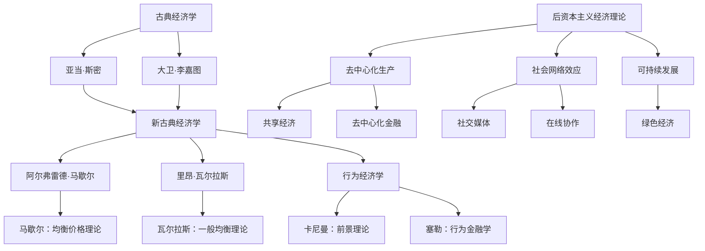

                 

### 2.1 后资本主义经济理论概述

#### 2.1.1 资本主义经济理论的发展历程

资本主义经济理论的演变可以分为几个阶段，每个阶段都有其代表性人物和核心思想。

1. **古典经济学**：
   - **亚当·斯密**：被誉为“经济学之父”。他在1776年出版的《国富论》中提出了“看不见的手”理论，认为市场机制能够自动优化资源配置，实现经济最大化。
   - **大卫·李嘉图**：提出了比较成本理论，强调贸易对经济的正面影响。

2. **新古典经济学**：
   - **阿尔弗雷德·马歇尔**：提出了“均衡价格”理论，强调供给和需求之间的平衡。
   - **里昂·瓦尔拉斯**：提出了“一般均衡理论”，试图解释市场如何通过价格机制实现资源的最优配置。

3. **行为经济学**：
   - **丹尼尔·卡尼曼**和**理查德·塞勒**：他们通过实验和调查揭示了人类决策的非理性特征，如“前景理论”，挑战了传统经济理论的假设。

#### 2.1.2 后资本主义经济理论的核心理念

后资本主义经济理论是在对传统资本主义经济体系批判和反思的基础上发展起来的。其主要核心理念包括：

1. **去中心化生产**：
   - 在去中心化生产中，生产资源不再是集中控制的，而是通过共享经济和区块链技术实现分布式管理。
   - **共享经济**：如Uber、Airbnb等平台，通过连接供给和需求，提高了资源利用效率。
   - **去中心化金融**：如比特币、以太坊等，通过区块链技术实现去中心化的价值传递和交易。

2. **社会网络效应**：
   - 社交媒体和在线协作平台如Facebook、LinkedIn等，通过用户之间的互动，形成了强大的网络效应。
   - 社会网络效应使得平台的价值随着用户数量的增加而迅速增长。

3. **可持续发展**：
   - 后资本主义经济理论强调环境的可持续性和社会责任。
   - **绿色经济**：通过减少资源消耗和碳排放，实现经济与环境的协调发展。

**Mermaid 流程图**：

通过以上流程图，我们可以清晰地看到后资本主义经济理论的演变路径及其核心理念。这些理论不仅挑战了传统的资本主义经济模式，也为未来的经济体系提供了新的发展方向。

